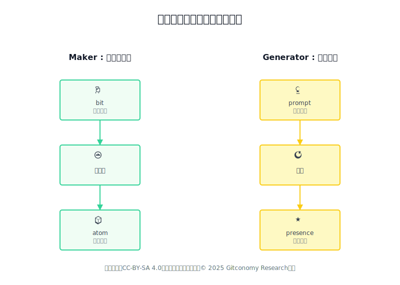
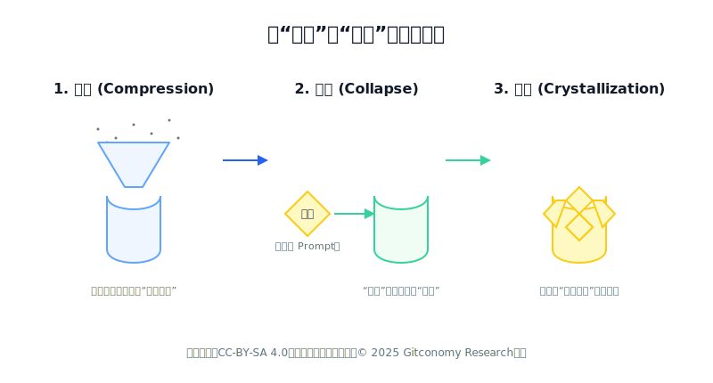
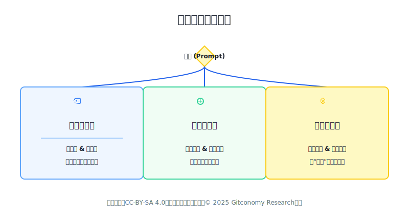

# 生成者时代创造心法的一些思考——从Maker到Generator

## 1. 生成式的物理学

如果你最近也沉浸在使用AIGC工具进行创作，是否偶尔会感到一种奇特的“失重感”？

仿佛你手中那支用了多年的画笔，突然拥有了自己的生命。你依然是它的主人，引导着它的走向；但同时，你又成了一名观众，好奇地注视着它在画布上渲染出你从未预料到的色彩与纹理。你既在创造，又在见证。这种感觉，一半是掌控，一半是释放；一半是意图的延伸，一半是惊喜的降临。

我时常在这种失重感中思考，我们这一代创造者的身份，似乎正在经历一场安静而深刻的变迁。

 
*图：Maker和Generator范式比较*

我们曾无比熟悉并赞美那个属于“创客”（Maker）的时代。它的信条如磐石般坚固：`bit (蓝图) -> (物理化) -> atom (实体)`。那是一个在坚实大地上建造庇护所的过程，每一步都清晰、可控、有迹可循。我们是建筑师，是工程师，我们的快乐源于将脑中的蓝图，精确无误地复刻到物理世界之中。

而今，我们似乎都成了“生成者”（Generator）。我们的新信条，`prompt` `(意图) -> (涌现) -> presence (显现)`，则更像是在一片充满可能性的流体中航行。

这种从“建造”到“生成”的转变，其底层逻辑究竟是什么？或许，我们可以用“**压缩与结晶**”的比喻，为这种“失重感”找到一个物理上的锚点。

 
*图：从“建造”到“生成”转变的内核*

大模型对海量人类知识的训练，是一个极致的**压缩**过程。它的目标并非记忆，而是提炼出数据背后不可言说的“规律”与“感觉”。最终，它形成了一片蕴含了所有知识可能性的、高度过饱和的“**潜力溶液**”。

而我们的每一次提示（**`prompt`**），都像一颗投入这片溶液的**晶核**——一个带有明确意图的结构种子。

就在意图注入的瞬间，**坍缩**发生了。那片原本无序流动的、包罗万象的潜力溶液，会迅速响应“晶核”的召唤，围绕着它定向排列、固化，瞬间**“结晶”**出一座独一无二、结构精巧的“思维晶体”——即我们眼前生成的作品。

这个从**压缩**到**坍缩**，再到**结晶**的过程，完美地解释了为何我们既是创造者，又是见证者。我们提供了决定晶体结构和品类的那颗“晶核”（意图），而晶体生长所依托的庞大物质基础（潜力溶液）和其背后深邃的物理规律（模型算法），则超出了我们的直接掌控。理解了这一点，我们便明白，要想在这片溶液中结晶出伟大的作品，关键在于找到并守住那几个最核心的支点。

---

## 2. 寻找支点 —— 创造过程的四个“思想实验”

要在这片流动的海洋中航行，首先要找到几个不会漂移的“思想支点”。

### 追问一：在这场人机共创中，什么是“唯我所有”的？

这是一个关乎身份认同的根本问题。当我凝视着AI在数秒内生成一幅堪比专业画师的作品时，焦虑感难免会浮现。它的算力、它所“学习”过的海量数据、它背后的技术模型，都不是我所拥有的。那么，在这场共创中，我不可替代的价值究竟是什么？

思来想去，答案似乎有两个。第一，是**创作意图**。AI不知道“为什么”要创造，它没有愿望、没有梦想、没有需要被解决的痛点。那个最初的、想要“描绘一片赛博朋克雨夜的孤独感”或“设计一个体现环保理念的logo”的念头，完全且仅来自于我。我是那颗独一无二的“晶核”的提供者。第二，是**审美直觉**。面对AI生成的十座“晶体”，判断哪一座“成色”更好、哪一座“结构”更接近我想要的感觉，这个能力源于我过往所有的生命经验、文化积淀和个人品味。

算力、数据、技术都可以被商品化，但意图的设定和审美的裁决，是我们作为创造者最后的、也是最坚固的堡垒。这是我们的第一个支点。

### 追问二：我们说出的话（`prompt`），等于我们心中的画吗？

我时常为提示词的“词不达意”而苦恼。我明明在脑海中有了一个清晰的画面，但无论如何遣词造句，似乎都无法100%地将其转述给AI。这让我意识到一个基本事实：语言，是对思想的编码和压缩，而非思想本身。

一个高维度的、充满情感和模糊细节的内心“意图”，在被压缩成一串低维度的、线性的文字“提示词”时，信息必然会丢失和变形。因此，期待用一个完美的“晶核”去精确遥控“潜力溶液”的每一次反应，从一开始或许就是一种妄念。

这让我释然了。提示词的本质，或许不是“精确的工程指令”，而更像是**“不精确的诗意导航”**。它的魅力，恰恰在于它的模糊性为“结晶”过程留下了即兴发挥的空间。接受并善用这种“不精确性”，是我们的第二个支点。

### 追问三：AI的“思考”，是一条直线吗？

我们习惯了确定性的工具。按下一个按钮，就有一个确定的结果。但AIGC不同。它的“结晶”过程，并非一个按部就班的工匠在逐步搭建作品，它更像一个神秘的自然现象。微小的“晶核”形态差异，可能导致最终“晶体”结构的巨大变化。

这个过程充满了概率性。这意味着，惊喜和意外，是这个系统的**“常态”，而非“异常”**。试图完全消除意外，就像是命令过饱和溶液必须结晶出你预设的那个完美形状一样，违背了系统的本性。理解并拥抱这个概率性的过程，是我们的第三个支点。

### 追问四：我们得到的，是“答案”还是“回响”？

当AI终于生成了一幅令人惊艳的图像时，我最初的反应是：“我得到了答案！”但很快我便发现，如果我再次投入同一颗“晶核”，可能会得到另一座同样精彩、但细节迥异的“晶体”。

这说明，我得到的并非唯一的、最终的“正确答案”，它更像是我的意图——那颗投入溶液的晶核——所引发的**一次“结晶”尝试**。对于这颗晶核，有无数种可能的结晶方式，我看到的只是其中之一。

这个支点告诉我们，创造的终点，绝不在于“生成”的那一刻。那一刻，仅仅是对话的开始。

---

## 3. 航行心法 —— 基于支点的三个思维涌现

当我们内心有了这四个稳固的支点，我们与这片“潜力溶液”互动的方式，也将自然发生转变，涌现出全新的“水性”。

 
*图：生成式思维的涌现*

### 思维涌现一：身份的融合——从“建造者”到“对话者”与“策展人”

既然我的核心价值是提供“晶核”（意图）和评判“晶体”的成色（审美），那么我的工作就不再是单向的指令。

我的身份，首先涌现为一名**“对话者”**。我将提示词视为与“潜力溶液”的对话，通过观察每一次“结晶”的产物，来校准我下一颗“晶核”的形态与纯度。这个过程充满了启发与互动，我的意图在与AI的对话中，变得越来越清晰。

随后，我的身份涌现为一名**“策展人”**。我会生成大量不同的“晶体”，然后运用我的审美，从中筛选、打磨、组合，最终呈现一场由我定义的“结晶艺术展”。这策展的“最后一公里”，定义了我的作者身份。

### 思维涌现二：过程的寻宝——拥抱“诗意的模糊”

既然“结晶”过程天然带有不确定性，那么最理性的做法，就是拥抱这种不确定性。

我的思维，从追求一个确定的结果，涌现为**享受一场“结晶实验”**。我的提示词是实验参数，每一次生成都是一次有趣的实验现象。创造的乐趣，不再仅仅是最终完成时的如释重负，更在于观察参数微调后，“晶体”形态和光泽那令人惊奇的演变。

### 思维涌现三：素材的新生——将“意外”视为礼物

在“结晶实验”中，必然会出现许多“瑕疵品”或“异形晶体”。我最初的反应是将其视为失败。

但后来，一种新的思维涌现了：**为什么不将这些“意外结晶”视为一种全新的“创作素材”呢？**

那块结构奇特的“晶体”，或许正开辟了一个全新的美学方向。我开始尝试围绕这些意外进行二次创作，追问：“如果这就是初始结构，它能生长成什么？”这是一种化“实验意外”为“科学发现”的高阶心法。它让我明白，AI带来的最大价值，或许不是更高效率地实现我的已知，而是不断地、慷慨地，将我认知之外的“未知”作为礼物，呈现在我的面前。

---

## 4. 一篇等待回应的“漂流瓶”

写到这里，我深知，以上所有的思考，都还处于一个非常早期的、个人化的阶段。它不是结论，更像是一个被我扔进思想海洋的“漂流瓶”，记录着我作为一个航行者当下的困惑、挣扎与感悟。

这些“心法”的有效性，无疑需要更多创作者的实践、更多认知科学的研究、甚至更多基于数据的案例分析来验证和迭代。但分享的意义，或许就在于此——让一个人的思考，成为激发更多人思考的涟漪。

在这片正在涌现的创造新大陆上，您，又发现了哪些属于自己的航行心法？

期待您的声音。

---

## 许可声明
本文档采用[知识共享署名-相同方式共享4.0国际许可协议(CC BY-SA 4.0)](https://creativecommons.org/licenses/by-sa/4.0/deed.zh)进行许可，© 2025 Gitconomy Research社区
