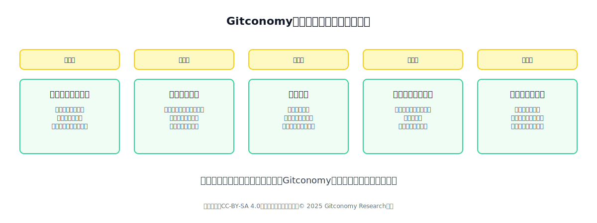
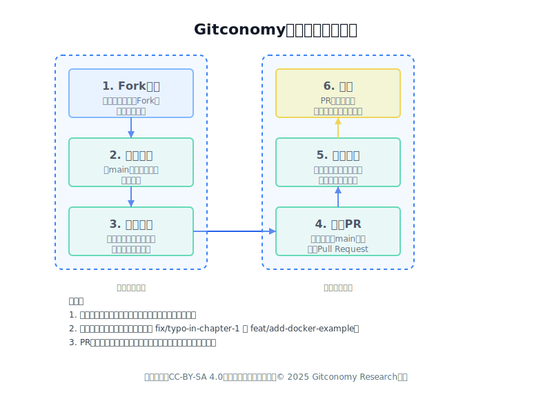

# Gitconomy开放课程内容设计规范和贡献指南

## 1. 概述

本文档定义了为Gitconomy开放课程项目贡献内容的标准与工作流程。其目标是确保所有课程内容在质量、结构和协作方式上保持一致性。每一位贡献者都应将此文档作为创建和修改课程内容的主要参考。

---

## 2. 核心原则

所有课程内容的构思与撰写，都应遵循以下五项基本原则。它们是确保课程具有高质量、实用性和社区活力的基础。


*图：Gitconomy开放课程开发原则*

### 2.1 模块化与可组合性原则

课程内容需被设计成独立的、可重用的模块。每个模块应聚焦于单一、明确的学习目标，并能与其他模块灵活组合。这种设计使得内容易于维护、更新和复用，学习者也可以根据需求构建个性化的学习路径。

### 2.2 内置协作钩子原则

讲义不应是静态的最终交付物，而应是持续协作的起点。在内容的关键节点，应主动设置协作入口，例如标记`[社区挑战]`、``[观点征集]`或`[代码改进]``。这些“钩子”旨在邀请学习者参与内容的迭代，将学习过程转化为社区贡献。

### 2.3 实践驱动原则

理论必须与实践相结合。每个核心概念讲解之后，必须附带一个可操作的动手任务。任务目标应是具体、可验证的产出，例如提交一个能够运行的代码脚本、完成一次开源工具的部署，或向一个真实项目提交 `Pull Request`。

### 2.4 社区维护的资源池原则

用一个由社区共同维护的动态资源列表，取代传统的、由作者指定的静态“参考文献”。在讲义中为此部分预留结构，并明确鼓励社区成员通过提交`Pull Request`的方式来填充和更新，确保资源的时效性与广度。

### 2.5 透明化版本控制原则

内容的演进历史本身就是重要的学习资源。所有变更必须通过 Git 进行管理，并在讲义头部的`[Changelog]`中清晰记录。透明的版本历史不仅展示了内容的迭代过程，也构成了对所有贡献者工作的永久记录。

---

## 3. 内容结构规范

所有讲义必须严格遵循以下标准结构，以保证内容的一致性和机器可读性。

### 3.1 文件头信息

每个Markdown文件的顶部必须包含一个 YAML Frontmatter块，用于定义元数据。

```yaml
---
title: "[课程名称]"
author: "[创建者姓名]"
version: "[版本号] - [YYYY-MM-DD]"
license: "CC BY-SA 4.0"
contributors:
  - "[作者1]"
  - "[贡献者1]"
  - "[贡献者2]"
---
```

### 3.2 更新日志

紧随 Frontmatter 之后，用于记录关键的版本迭代(ChangeLog)。

```markdown
## Changelog
- **v0.1 (YYYY-MM-DD, @作者ID):** 创建讲义初始草案。
- **v0.2 (YYYY-MM-DD, @贡献者ID):** 新增“XX案例分析”模块，修正“YY代码示例”。
```

### 3.3 课程概览

课程概览为学习者提供了课程的“导航地图”，旨在课程开始前清晰地设定学习预期。它通过结构化的方式，快速阐明了课程的核心学习目标、所需的前置知识、最适合的目标人群以及大致的时间投入。一个明确的概览能够帮助学习者快速判断课程是否符合自身需求，从而做出高效的学习决策。

| 类别 | 要求 |
| :--- | :--- |
| **学习目标** | 列出3-5个明确、可测量的成果。例：“能独立使用 ModelScope 完成一个文本生成 API 的部署”。 |
| **前置要求** | 清晰列出所需的基础技能，并为关键知识点提供高质量的学习资源链接。 |
| **目标人群** | 明确受众。例：“面向有 Python 基础，希望进入 AIGC 领域的0-2年经验开发者”。 |
| **预计时长** | 完成课程（含实践）所需的大致时间。 |

### 3.4 核心内容

这是讲义的主体部分，承载了课程的核心知识体系。本节规范旨在确保知识的组织与呈现方式清晰、有逻辑且易于吸收。通过强制要求使用知识结构图、分层组织、可运行的代码示例和贴近现实的案例分析，我们旨在将复杂的概念分解为易于理解的模块，从而优化学习者的认知流程。

  - **知识结构图：** 必须在内容开始处提供一个使用图即代码绘制的可视化知识结构图（svg格式）。
  - **关键定义：** 对核心术语进行简明扼要的定义。
  - **分层组织：** 采用清晰的章节、小节结构（H2, H3, H4）。优先使用列表、表格来组织信息。
  - **代码示例：** 所有代码片段必须可直接复制运行、附带必要的注释，并优先采用主流开源工具。
  - **案例分析：** 优先结合中国国内的真实业务场景进行讲解。

### 3.5 实践环节

实践环节是连接理论知识与实际应用能力的关键桥梁，是课程价值的核心体现。本节规范的目标是设计出能够有效检验和巩固学习成果的实践任务。通过提供从零到一的动手项目、鼓励协作的社区挑战以及明确的评估标准，我们确保学习者不仅仅是被动接收信息，而是能主动运用所学知识解决具体问题。

  - **动手项目:** 设计一个从0到1的可实操项目，步骤清晰，产出明确。
  - **协作挑战:** 设计需要学习者分组或在社区内寻求帮助才能完成的任务。
  - **评估标准:** 提供一份自评清单（Checklist），明确定义项目“完成”或“优秀”的标准。
  - **常见问题(FAQ):** 预判并列出新手在实践中可能遇到的3-5个典型问题及其解决方案。

### 3.6 资源与社区

本节规范不仅要求提供高质量的进阶学习资源，更重要的是，它为学习者将学习成果反哺社区提供了清晰的路径。通过动态的资源池和明确的贡献指南，为学习者的持续成长提供支持，完成“学习者”到“贡献者”的身份转变闭环

  - **核心资源:** 列出2-3个最关键的必读/必看补充材料。
  - **进阶探索:** 提供给希望深入研究的学习者的额外资源或技术路径。
  - **社区资源池:** 见2.4原则，此处仅留标题或少量示例，并明确鼓励社区贡献。
  - **贡献指南:** 清晰指引学习者如何对本讲义提 Issue 或 Pull Request。

---

## 4. 贡献工作流与标准

### 4.1 内容风格

一个一致的、专业的风格可以显著提升学习者的阅读体验和信息获取效率。规范内容涵盖了语言语调、格式化以及内容的可访问性，确保课程对所有用户都友好且易于理解。

  - **语言:** 采用直接、简洁、中性的技术文档风格。使用第二人称“你”与读者对话，保持鼓励性和包容性。避免学术化、官僚化的术语。
  - **可访问性(A11y):** 所有图片、图表必须提供详尽的文本替代描述（Alt Text）。确保色彩对比度符合 WCAG 标准。
  - **视角:** 避免“唯一正确答案”的论调，客观呈现不同技术方案的优缺点。

### 4.2 贡献流程

遵循一个统一的、基于 Git 的工作流，是保障社区协作有序进行和内容质量可控的关键。该流程涵盖了从创建分支到发起合并请求（Pull Request）并参与评审的全过程。


*图：Gitconomy开放课程贡献流程试示意图*

1.  **Fork 仓库：** 将官方课程仓库 Fork 到你自己的账户下。
2.  **创建分支：** 从 `main` 分支创建一个新的特性分支，并为其指定一个描述性的名称（如 `fix/typo-in-chapter-1` 或 `feat/add-docker-example`）。
3.  **提交修改：** 在新分支上进行修改，并确保你的提交信息清晰、规范。
4.  **发起 Pull Request (PR)：** 将你的特性分支向上游仓库的 `main` 分支发起一个 Pull Request。在 PR 的描述中，清晰说明你做了什么、解决了什么问题。
5.  **代码评审：** 至少需要一位课程维护者（Maintainer）进行评审。请根据评审意见进行讨论和修改。
6.  **合并：** PR 被批准后，将由维护者合并到主分支。

### 4.3 贡献认可

一个透明、公正的认可体系是激励社区成员持续参与的核心动力。规范明确了贡献记录的方式以及优秀贡献者可能获得的社区荣誉和责任。

  - 任何有效的贡献（包括但不限于内容撰写、代码修正、问题报告、评审建议），贡献者的 ID 都将被记录在文件头信息的 `contributors` 列表和 `Changelog` 中。
  - 做出重要贡献的成员将有机会获得 Gitconomy 社区的荣誉认证，并可能被邀请成为该课程的联合维护者。

---

## 许可声明

本文档采用[知识共享署名--相同方式共享4.0国际许可协议(CC BY--SA 4.0)](https://creativecommons.org/licenses/by-sa/4.0/deed.zh)进行许可，&copy; 2025 Gitconomy Research社区
