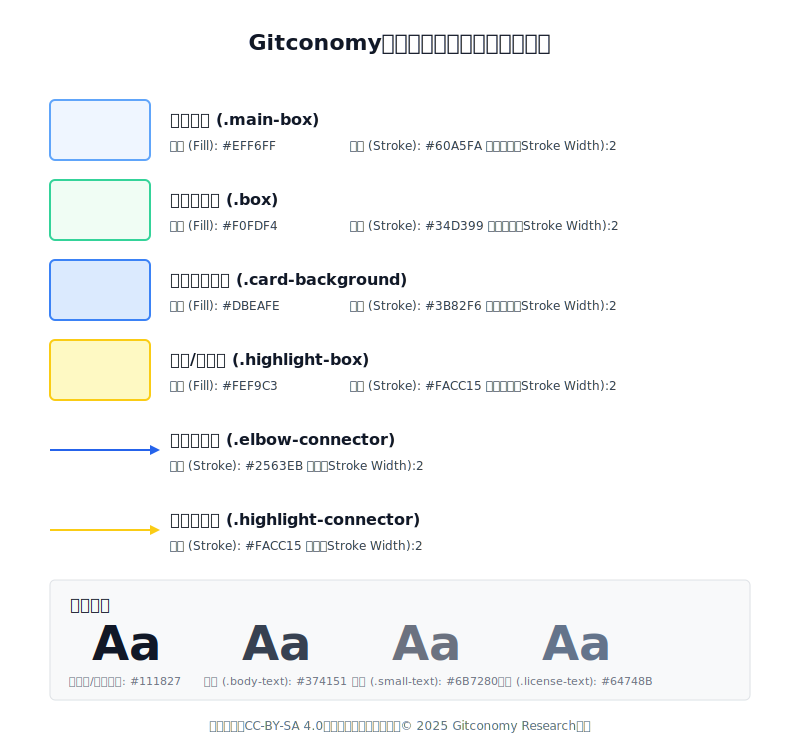

# Gitconomy社区图形即代码设计规范指南

## 引言

在Gitconomy社区，我们致力于通过技术和最佳实践提升文档的质量与团队协作效率。本指南将帮助社区开发者掌握图形即代码（Diagram-as-Code, DaC）的技术，通过统一的设计规范确保图表的高效生成、管理和维护。图形即代码方法将图表定义为文本，并像管理代码一样管理图表，极大地提高了文档风格一致性、跨团队协作效率和版本控制的灵活性。

**目标读者：** 本指南适用于Gitconomy社区内的开发者以及所有使用图形即代码技术的开发人员，无论是新手还是有经验的图表设计者。通过遵循本规范，开发者可以创建符合社区标准的图形，并保证其可维护性与可扩展性。

---

## 1. 默认输出格式：SVG文件规范

Gitconomy社区默认的图形输出格式为可缩放矢量图形（SVG）。所有图形即代码工具（如Mermaid、PlantUML）在 CI/CD 流程中都应渲染为SVG文件。

1. **命名规范：** SVG文件名应使用小写字母和连字符（-），并能清晰地描述图表内容，例如：`api-authentication-flow.svg`，`system-architecture-overview.svg`。

2. **尺寸与视图：** 应在 &lt;svg&gt;标签中显式定义width和height属性，以确保渲染的稳定性和容器的正确预留。在SVG文件中，应尽量保持视图框（viewBox）属性与width/height属性的比例一致，以确保在不同环境下无失真缩放。

3. **简洁性与优化：** 生成的SVG文件应力求最小化冗余代码，以保持其可追溯到源代码。对于大型或复杂的图表，建议在CI/CD流程中增加SVG压缩步骤（如使用SVGO等工具），移除不必要的注释、空格和默认属性，以提高加载性能。

4. **自定义属性与元数据**： 推荐在&lt;svg&gt;标签或 &lt;g&gt;标签中使用data-*自定义属性 来嵌入图表的元数据（如版本号、创建时间）或特定数据标签， 便于在Web文档中进行动态处理或筛选。

5. **源文件保留：** CI/CD流程中，除生成SVG外，必须在文档版本控制系统中保留Mermaid/PlantUML等图形即代码的原始文本文件（如 .mmd, .puml），以便于未来的可编辑性和可追溯性。

## 2. 图像背景设置

默认情况下，SVG背景应设置为**白色**，以确保最佳的可读性：

```xml
<svg width="800" height="600" xmlns="[http://www.w3.org/2000/svg](http://www.w3.org/2000/svg)" style="background-color: white;"></svg>
```

如需**透明背景**（允许底层内容显示），可以：

```xml
<svg width="800" height="600" xmlns="[http://www.w3.org/2000/svg](http://www.w3.org/2000/svg)" style="background-color: transparent;">
</svg>
```

---

## 3. 图像配色方案

配色方案旨在通过**柔和的色块填充**和**清晰的强调描边**，在保持视觉专业性的同时，有效区分图表中的不同概念和层级。我们采用一整套**冷暖色调搭配**的方案：蓝色系用于核心概念和分组，绿色系用于标准信息，黄色系用于高亮和强调，而连接线和文本则统一使用高对比度的深色，以确保最佳的**可读性**和**层次感**。

### 3.1 标准配色方案

请在创建图表时尽量遵循此方案，以保持视觉一致性：

| 用途 | 样式类别 | 填充色 (Fill) | 描边/强调色 (Stroke/Accent) | Hex值 (Fill) | Hex值 (Stroke) | 描边/连接线宽度Stroke/Line Width|
| :--- | :--- | :--- | :--- | :--- | :--- | :--- |
| **主概念框** | `.main-box` | 淡蓝 | 亮蓝 | `#EFF6FF` | `#60A5FA` | **2px** |
| **标准信息框** | `.box` | 淡绿 | 活力绿 | `#F0FDF4` | `#34D399` | **2px** |
| **分组卡片背景** | `.card-background` | 柔和蓝 | 中度蓝 | `#DBEAFE` | `#3B82F6` | **2px** |
| **高亮/强调框** | `.highlight-box` | 淡黄 | 亮黄 | `#FEF9C3` | `#FACC15` | **2px** |
| **标准连接线** | `.elbow-connector` | (无) | 深蓝 | `none` | `#2563EB` | **2px** |
| **高亮连接线** | **`.highlight-connector`** | **(无)** | **亮黄** | **`none`** | **`#FACC15`** | **2px** |
| **主要文本** | `.main-title-text` | (无) | 深灰 | `none` | `#111827` | **N/A** |
| **次要文本** | `.body-text` | (无) | 中灰 | `none` | `#374151` | **N/A** |
| **注释文本** | `.small-text` | (无) | 浅灰 | `none` | `#6B7280` | **N/A** |
| **许可文本** | `.license-text` | (无) | 石板灰 | `none` | `#64748B` | **N/A** |

### 3.2 配色方案应用与扩展

- 标准连接线使用深蓝 (`#2563EB`)。
- 对于需要**强调流程或关键路径**时，应使用 `.highlight-connector`样式，描边色为亮黄 (`#FACC15`)，以提供清晰的**重点导向性**。
- 为了简化图表主题管理和未来的**深色模式**切换，建议将这套配色方案以**CSS 变量**（如`--color-main-blue: #60A5FA;`）的形式嵌入或链接到最终文档中，以实现对图表色彩的**全局管理**和**动态调整**。

- 
*图：图形标准配色方案示意图*

本配色方案的核心在于通过色彩建图表的逻辑层级 ：蓝色系和绿色系用于结构化信息，确保信息稳定；而亮黄色系则作为功能性颜色，专用于引导用户注意力到关键组件或核心路径上。通过将这套固定的颜色映射为CSS变量，我们能确保所有图表在不同文档主题（如深色模式）下保持统一的视觉表现 ，大大提升了图表的可维护性和适应性。

---

## 4. 图像字体规范

图形即代码的字体规范旨在通过统一的字号和字重体系，确保图表在任何分辨率下都具有 卓越的可读性和专业的视觉一致性 。我们采用Noto Sans无衬线字体家族，并为不同的信息层级（如主标题、小标题、正文、注释）设置了 清晰的字号差异和字重分级 ，确保用户能够一眼识别信息的重要性。

| 样式类别 | 字体大小 (`font-size`) | 字重 (`font-weight`) | 建议用途 |
| :--- | :--- | :--- | :--- |
| `.main-title-text` | **22px** ($\approx \mathbf{1.375\text{rem}}$) | **800** (Extra Bold) | 整个示意图的 **主标题** |
| `.title-text` | **16px** ($\approx \mathbf{1\text{rem}}$) | `bold` | 各模块或卡片的 **小标题** |
| `.highlight-text` | **12px** ($\approx \mathbf{0.75\text{rem}}$) | `bold` | 需要 **特别强调** 的关键信息 |
| `.body-text` | **12px** ($\approx \mathbf{0.75\text{rem}}$) | `normal` | **正文** 和常规描述性文字 |
| `.license-text` | **12px** ($\approx \mathbf{0.75\text{rem}}$) | `normal` | 底部 **许可声明** |
| `.small-text` | **11px** ($\approx \mathbf{0.6875\text{rem}}$) | `normal` | 辅助性、补充性的 **注释文字** |

字体可读性及排版建议：

- **字体选择：** 优先使用无衬线字体，确保清晰度（如sans-serif 族，默认使用Noto Sans）。
- **字距（letter-spacing）**： 正文 (.body-text) 推荐设置为 0.02em ，以略微增加字间清晰度。
- **行距（line-height）**： 对于多行文本，推荐设置行间距为1.4 到 1.5 ，以保证密集信息的清晰度。
- **单位说明：** 优先使用像素 (px) 确保静态一致性。为实现响应式缩放，我们提供了一个基准字体大小为16px的rem参考值。在响应式图表设计中，建议使用em或rem作为单位，或通过viewBox缩放来间接调整字体大小。


*图：图形文字规范示意*

统一的字体规范是确保技术文档专业度的基石。 通过精确定义每一个文本元素的 font-size 和 font-weight ，我们为所有图形即代码生成的图表创建了一个 可预测且高度一致的文本环境 。 这种严格的层级划分不仅增强了信息的可读性， 也使得图表在不同设备和平台上的视觉呈现更加稳定， 避免了因字体差异导致的布局错乱和阅读障碍。

---

## 5. 图像元素间距规范

保持元素之间的统一间距，使图表布局更加专业：

  * 主标题与第一个内容元素：**30-40像素**
  * 主要概念盒子间的垂直间距：**40-50像素**
  * 相关概念组内元素的垂直间距：**10-20像素**
  * 底部许可声明与上方元素间距：**50-70像素**（确保明显分离）

响应式布局：对于不同屏幕尺寸的适配，确保图表保持比例并避免元素堆叠。使用viewBox和width/height设置来保证内容自适应

---

## 6. 图像元素布局与定位规范

为确保Gitconomy社区图形的一致性和专业性，图像元素的布局与定位应遵循以下规范：

### 6.1 坐标系统与单位

| 规范项 | 说明 | 优先级/示例 |
| :--- | :--- | :--- |
| **坐标原点** | 默认使用 **SVG 左上角** 为坐标原点 $(0, 0)$。 | |
| **单位使用** | 优先使用 **像素 $(\text{px})$** 作为默认单位，保持一致性。 | $\text{width}="200" \text{height}="100"$ |
| **相对单位** | 需要响应式设计时，可使用 **百分比 $(\%)$** 或 **视口单位 $(\text{vw}, \text{vh})$**。 | $\text{width}="100\%" \text{height}="50\text{vh}"$ |

### 6.2 图形元素定位方法

  * **绝对定位**：使用 $\mathbf{x}$ 和 $\mathbf{y}$ 属性进行直接定位，适用于静态布局。

<!-- end list -->

```xml
<rect x="100" y="150" width="200" height="100" class="main-box" />
```

  * **相对定位**：使用 **$\text{transform}$ 属性** 进行相对于元素原始位置的定位。

<!-- end list -->

```xml
<g transform="translate(50, 30)">
  </g>
```

### 6.3 对齐与分组

  * **元素对齐**：关键元素应使用 **网格对齐**，主要参考线间距为 **$20\text{px}$**。
  * **元素对齐细节：在复杂的流程图或网络图中，应尽量避免元素边界相互重叠。通过`x`** 和`y`坐标计算，保所有同级元素在垂直或水平方向上处于**$20\text{px}$** 网格线的整数倍位置，避免元素堆叠。
  * **分组策略与容器结构：相关元素应使用 **$\mathbf{<g>}$ 标签 分组，便于统一应用样式和变换。在多层级图表中，`<g>`*标签可以作为*逻辑容器来管理一组子元素，通过对容器应用`transform`变换，可以更灵活地调整内部元素的相对定位。

<!-- end list -->

```xml
<g class="module-container">
  <rect class="card-background" x="10" y="10" width="300" height="200" />
  <text class="title-text" x="25" y="40">模块标题</text>
  </g>
```

### 6.4 布局模式规范

1. **流程图布局**

| 布局类型 | 描述 | 间距规范 |
| :--- | :--- | :--- |
| **水平流程** | 元素从左到右排列。 | 间距保持为 **$80\text{px} - 120\text{px}$**。 |
| **垂直流程** | 元素从上到下排列。 | 间距保持为 **$60\text{px} - 80\text{px}$**。 |
| **网格布局** | 多组件系统应使用网格布局。 | 网格单元大小为 **$100\text{px} \times 100\text{px}$**。 |

2. **层级排列**

  * **视觉层级**：重要元素应位于 **视觉中心区域** (视图的中心 **$40\%$**)。
  * **Z轴顺序**：使用 **SVG 的自然绘制顺序**（后定义的元素在上层）。
  * **特殊突出**：需要突出的元素可适当 **增大尺寸** ($\mathbf{10\% - 15\%}$)。

3. **响应式布局技术**

  * **视图框适配**：使用 **$\text{viewBox}$ 属性** 确保 SVG 在不同尺寸的容器中保持比例。

<!-- end list -->

```xml
<svg viewBox="0 0 800 600" width="100%" height="auto">
  </svg>
```

  * **保留边距**：内容应在视图边缘保留 **$5\% - 10\%$ 的边距**，避免内容紧贴边界。

4. **变换 ($\text{Transform}$) 应用规范**

  * **标准变换**：使用标准变换函数实现定位和旋转效果。

| 变换类型 | 示例 | 描述 |
| :--- | :--- | :--- |
| **平移** | `<g transform="translate(100, 50)">...</g>` | 将元素移动至 $(100, 50)$。 |
| **旋转** | `<g transform="rotate(45, 50, 50)">...</g>` | 围绕点 $(50, 50)$ 旋转 $45$ 度。 |
| **缩放** | `<g transform="scale(1.2)">...</g>` | 放大$1.2$倍。 |

  * **复合变换**：多重变换按 **从右到左** 的顺序应用。

<!-- end list -->

```xml
<g transform="rotate(30) translate(100, 0)">...</g>
```

  * **变换原点**：明确指定变换的 **中心点**，特别是对于旋转和缩放操作。

### 6.5 连接线与箭头规范

  * **路径类型**：优先使用 **直角连接线** ($\text{elbow connector}$)，避免线条交叉。
  * **路径定位**：连接线应连接至元素 **边界的中点**。
  * **路径计算**：
      * **起点** $(x_1, y_1)$: $(\text{源元素.}x + \text{源元素.}\text{width}/2, \text{源元素.}y + \text{源元素.}\text{height})$
      * **终点** $(x_2, y_2)$: $(\text{目标元素.}x + \text{目标元素.}\text{width}/2, \text{目标元素.}y)$

---

## 7. 图形源代码注释规范

在Gitconomy社区，图形源代码（包括SVG和所有图形即代码工具如Mermaid、PlantUML生成的代码）应包含详细的注释。这不仅有助于开发者理解代码的结构和功能，还能促进团队间的高效协作和代码的可维护性。

### 7.1 注释的基本要求

1. **清晰描述图形的目的**
   每个图形源代码文件应在开头部分添加简短的描述，阐明该图表的功能、目的和适用场景。例如：

   ```xml
   <!--
     图表名称：API认证流程
     描述：该图表展示了系统中API认证的工作流程，从用户请求到系统认证过程的各个阶段。
     适用场景：开发人员可用此图表快速了解API认证机制，便于系统架构设计和调试。
   -->
   ```

2. **模块化代码注释**
   对于较复杂的图形源代码，应在每个模块或部分之前进行注释，说明该部分的功能和作用，确保其他开发者能快速理解模块的目的和实现逻辑。例如：

   ```xml
   <!--
     模块名称：用户身份验证
     描述：此部分展示了用户身份验证的具体步骤，包括用户名输入、密码验证及令牌生成。
   -->
   <rect x="100" y="100" width="200" height="50" class="auth-box" />
   ```

3. **标注自定义参数和关键属性**
   如果在图形代码中使用了自定义参数或关键属性（如颜色、尺寸、坐标等），应进行注释以说明其用途和设计意图。例如：

   ```xml
   <!--
     设置背景颜色为淡蓝色，确保图表在大多数背景下清晰可见。
   -->
   <svg width="800" height="600" xmlns="http://www.w3.org/2000/svg" style="background-color: #EFF6FF;">
   ```

4. **代码块之间的逻辑分隔**
   在图形源代码的不同逻辑部分之间，添加空行和注释，帮助开发者清晰地区分不同功能模块。例如：

   ```xml
   <!--
     连接用户输入框与认证模块的线条
   -->
   <path d="M200,150 L200,200" class="elbow-connector" />
   ```

### 7.2 注释的格式要求

1. **简洁明了**
   注释应简洁、准确，避免冗长的描述。避免在注释中包含与图形代码无关的技术细节。

2. **统一格式**
   所有注释应遵循统一的格式，例如：

   * 使用`<!-- 描述内容 -->`来标记单行注释。
   * 对较长的注释，可使用多行注释`<!--`和`-->`来包围。

3. **结构化注释**
   对于较复杂的图形设计，建议采用结构化的注释方式，包括：

   * 图表的目的和背景
   * 模块化的功能描述
   * 关键属性或参数的解释

   示例：

   ```xml
   <!--
     图表名称：数据流向
     描述：展示数据在系统中的流向路径，帮助开发者理解数据传输的不同节点。
     关键模块：
     - 输入数据：从外部系统接收到的数据。
     - 处理模块：数据的转换和处理。
     - 输出：最终生成的报告数据。
   -->
   ```

### 7.3 高级注释要求

对于高级功能或较为复杂的图形，以下注释规范是推荐的：

1. **指明设计原理和决策**
   如果图形源代码中包含复杂的设计决策或算法，建议注明该决策的背景和设计原则。例如：

   ```xml
   <!--
     设计决策：采用深蓝色作为连接线颜色，确保在浅色背景下清晰可见。
     背景：原本使用黑色，但在白色背景下可视性较差，因此调整为深蓝色。
   -->
   ```

2. **引用外部文档或资源**
   如果图形源代码引用了外部资源或文档（如设计规范、API文档等），应在注释中进行明确标注，便于开发者进一步查阅。例如：

   ```xml
   <!--
     参考文档：API认证流程设计 - 请参阅Gitconomy开发文档第5章，了解API认证的详细步骤。
   -->
   ```

注释不仅是代码的辅助工具，也是高效协作和长期维护的重要部分。Gitconomy社区在图形即代码中严格要求注释规范，旨在确保每一位开发者能够快速理解和修改图形代码，同时保证文档的可维护性和可扩展性。通过遵循这些注释规范，团队成员可以更高效地协作，减少错误和理解偏差，提高整体开发效率和文档质量。通过增加图形源代码注释规范，我们不仅确保图形的高效使用和维护，还提高了代码的可读性和团队协作的透明度。这将进一步促进Gitconomy社区在技术文档方面的专业性与一致性。

---

## 8. 许可声明

所有Gitconomy社区图表应在底部包含统一的许可声明：

```xml
<text x="50%" y="600" class="license-text">
    本作品采用CC-BY-SA 4.0国际许可协议进行许可，© 2025 Gitconomy Research社区
</text>
```
---

## 总结

"图形即代码"方法正在彻底改变开发团队创建和维护技术文档的方式。通过将图表定义为文本，并像管理代码一样管理图表，开发者可以实现更高效的协作、更一致的文档风格、以及更紧密的代码与文档同步。

在Gitconomy社区，我们鼓励所有开发者采用本指南中的设计规范和最佳实践，创建统一、专业的技术文档。这不仅能提升文档质量，更能促进团队协作和知识共享，最终提高整个社区的工程实践水平。

---

## 许可声明

本文档采用[知识共享署名--相同方式共享4.0国际许可协议(CC BY--SA 4.0)](https://creativecommons.org/licenses/by-sa/4.0/deed.zh)进行许可，&copy; 2025 Gitconomy Research社区
