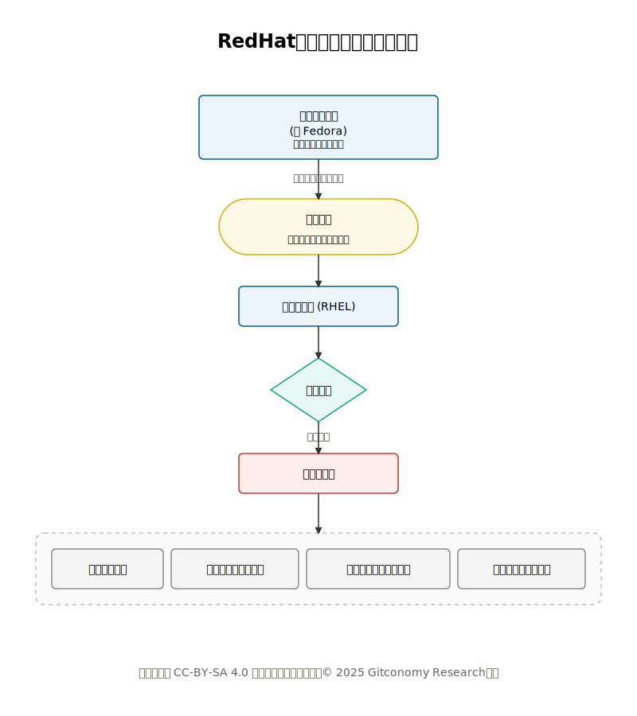
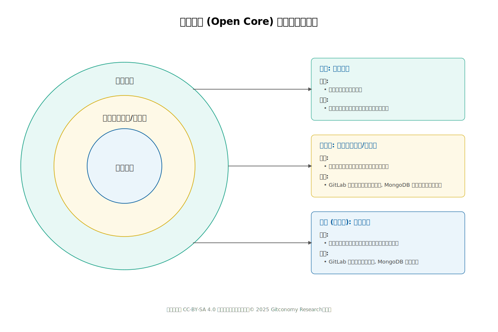
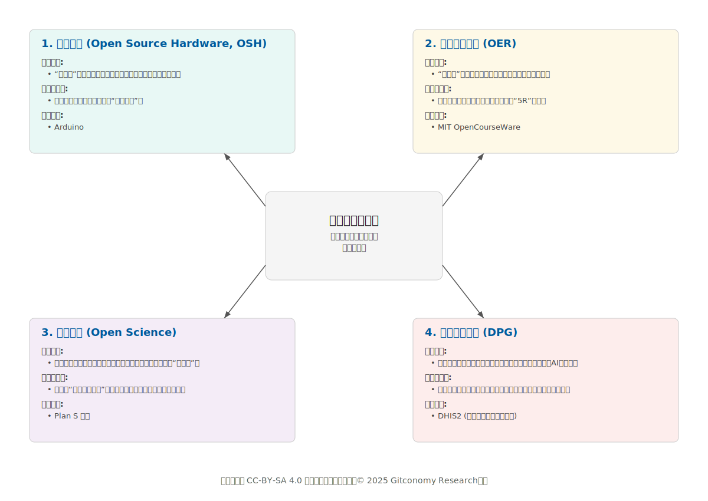
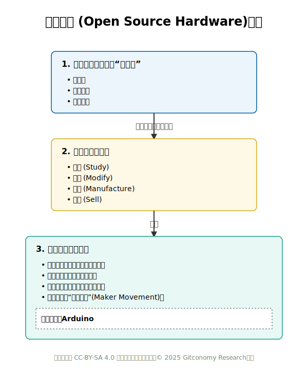
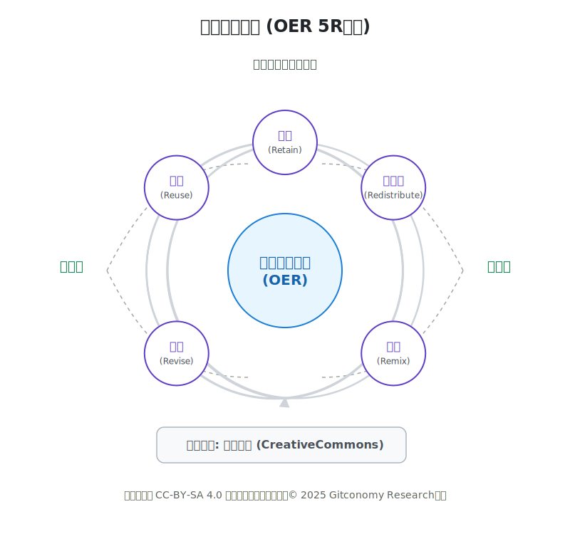
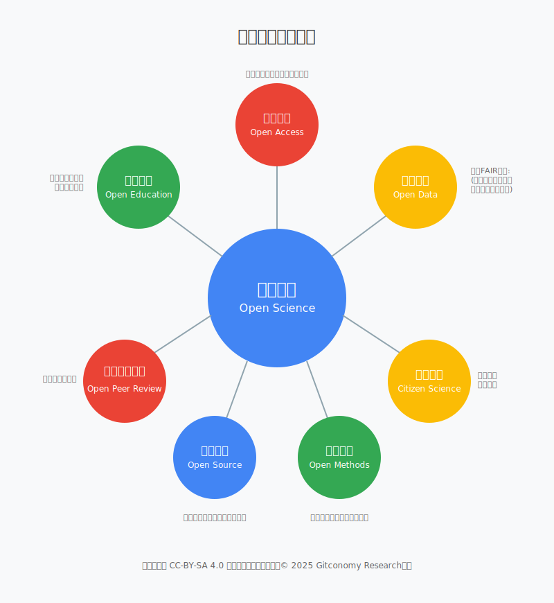
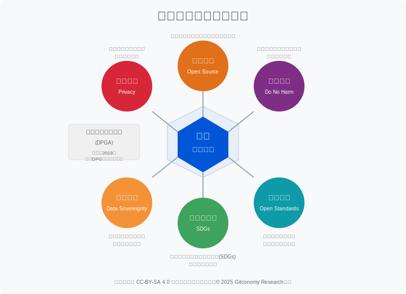
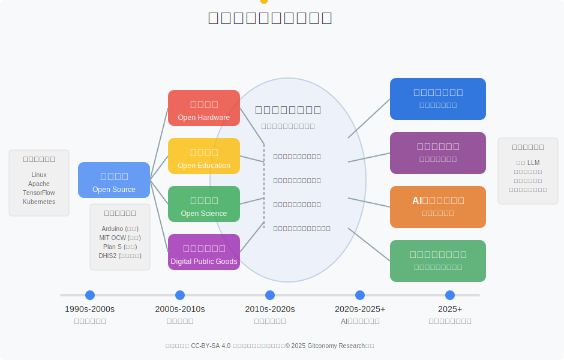
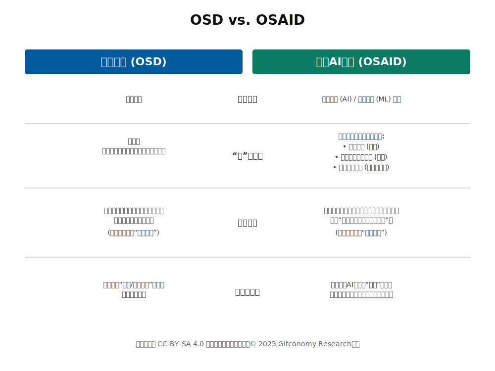
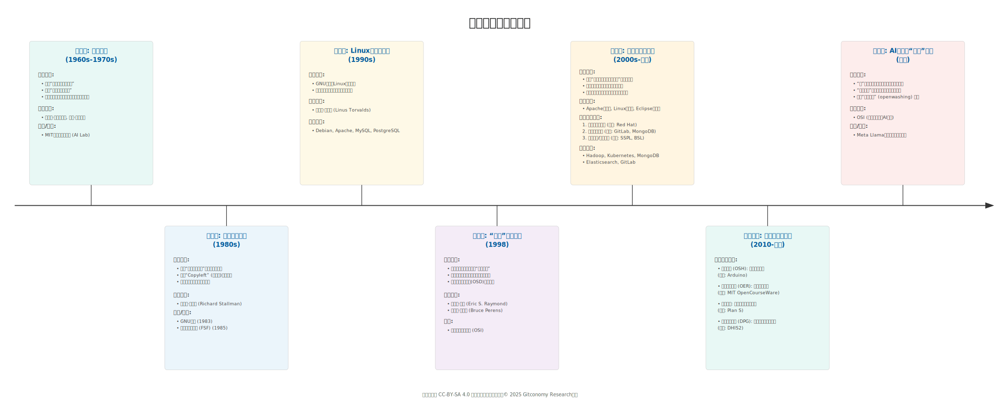

# 第一章：开源的起源与定义

## 🎯 本章学习目标

通过本章学习，学生将能够：

1. 准确理解开源的定义和核心内涵
2. 了解开源运动的历史发展脉络
3. 认识开源与自由软件的关系和区别
4. 理解开源对现代技术发展的重要意义
5. 建立对开源世界的初步认知框架

---

## 💡导论：一场从代码共享到全球协作的革命

本章将探讨一个强大思想的起源：软件源代码应当被分享。我们将通过两条既相互独立又紧密关联的“革命”线索来追溯这一思想的演变。第一条是伦理革命，它源于一种信念，即限制知识的获取在道德上是错误的。这是自由软件运动的故事。第二条是实用主义革命，其驱动力在于人们认识到，协作式开发能够产生更优质、更可靠、更具创新性的软件。这是开源运动的故事。

要真正理解我们所处的数字世界，我们必须同时领会第一次革命的哲学理想和第二次革命的实践方法。它们如同同一枚硬币的两面，时而相互张力，时而相辅相成，但最终共同塑造了21世纪的技术格局。

---

## 第一部分：一场革命的基石

本部分旨在阐述开源运动的哲学与技术基石。开源运动并非凭空产生，而是一种早已存在的协作工程文化的顶点。这种文化后来被理查德·斯托曼（Richard Stallman）编纂为一套道德和政治哲学，并最终因Linux内核的适时出现而变得切实可行。

###  1.1 从“黑客文化”到自由软件运动（1970s-1980s）

#### 1.1.1 MIT的黄金时代：“黑客伦理”的诞生

开源思想的源头可以追溯到20世纪60年代的麻省理工学院（MIT），特别是在两个关键团体中：技术模型铁路俱乐部（TMRC）和MIT人工智能实验室（AI Lab）。这些地方并非现代意义上的正式研究项目，而是学术界的“温床”，在这里，一群才华横溢、充满好奇心的学生获得了前所未有的、直接接触PDP-1和PDP-10等大型主机的机会。  

**“黑客”（hacker）**一词正是在这里诞生的。它最初的含义并非指恶意入侵者，而是指那些精通编程、并以“寓教于乐的巧妙构思”（playful cleverness）和追求技术卓越为乐的程序员[1]。一次“hack”指的是一个优雅、富有创意且常常打破常规的问题解决方案，是技术艺术性的展现。这个时代的传奇人物包括理查德·格林布拉特（Richard Greenblatt）、比尔·高斯珀（Bill Gosper）和彼得·多伊奇（Peter Deutsch）等[2]。  

这种文化由一套不成文但影响深远的原则所支配，后来由史蒂文·利维（Steven Levy）在其1984年的开创性著作《黑客：计算机革命的英雄》中系统地阐述为“黑客伦理”[3]。

这种文化的精髓在于：

* **信息共享**：他们坚信“所有信息都应免费”。分享软件就像分享菜谱一样自然。
* **亲手实践**：崇尚“亲手实践的准则”（Hands-On Imperative），鼓励动手创造和解决问题。
* **精英崇拜**：崇尚的是巧妙的创造力（即 "hacks"），而非头衔或地位。

这些早期的黑客社区通过互联网的前身ARPANET相互连接，使得这些原本孤立的小组得以形成一个“网络部落”，共享行话、讽刺作品和共同的理念。  

这种“黑客伦理”并非凭空产生的抽象哲学。它是一种独特的社会技术环境的直接文化产物：一方面是极其昂贵、稀缺的计算资源，另一方面是像马文·明斯基（Marvin Minsky）这样的实验室负责人做出的激进决定，即给予一小群杰出学生完全开放、不受束缚的访问权限。在20世纪60年代，一台计算机的成本高达12万美元，普通人极难接触。MIT的特殊之处在于，它拥有一些“多余的机器”，可以留给社区成员“玩耍”，这与其他机构形成了鲜明对比，在那些地方，计算机由少数操作员“神职人员”般地控制着[4]。这种独特的环境创造了一个精英管理的文化，其中唯一的通行证是技术能力，而主要目标是为了技艺本身的热爱去挑战机器的极限，而非为了商业利益。在一个小规模、高度信任、共同使用珍贵资源的社区里，囤积代码是毫无意义且会阻碍进步的。共享改进意味着整个社区的工具集都能变得更好，让每个人都受益。因此，“信息应该免费”的伦理，虽然最终升华为一项道德原则，但其根源在于特定优越环境下的现实需求。  

#### 1.1.2 哲学的断裂：专有软件的兴起

到了20世纪70年代末和80年代初，计算领域发生了巨变。1969年美国政府诉IBM的反垄断案带来了一个意想不到的后果：硬件和软件被“解绑”，这催生了一个将软件作为独立商业产品的市场。公司开始将软件视为宝贵的知识产权，而非共享工具。  

这导致了专有软件（proprietary software）的兴起。在这种模式下，源代码被视为商业机密，用户则受到限制性许可协议（如保密协议NDA）的约束，禁止共享或修改软件。这种新模式与黑客伦理背道而驰。随着人才被私营公司挖走，MIT人工智能实验室的共享文化也开始衰落。  

>**人物故事：斯托曼与打印机**
>
>这一转折点的标志性事件，可以通过理查德·斯托尔曼（Richard Stallman）在MIT人工智能实验室的经历来生动说明。实验室引进了一台新的施乐9700激光打印机，但其软件是专有的。与之前的打印机不同——斯托尔曼曾修改过旧打印机的源代码，使其能在打印完成或卡纸时自动发送通知——他被拒绝访问新打印机的源代码。这不仅仅是不便，对斯托尔曼而言，这是一种伦理上的违背。它代表了他所珍视的协作社区的毁灭，一个“不允许你共享或更改软件”的系统，他认为这是“反社会的”和“不道德的”[5]。

#### 1.1.3 “自由软件”的道德使命

为了回应这种“哲学的断裂”，斯托尔曼于1983年发起了GNU项目。其目标雄心勃勃：创建一个完整的、类似Unix的、完全由“自由软件”组成的操作系统。GNU这个名字是一个递归缩写，意为**“GNU's Not Unix”（GNU不是Unix）**，这既表明了它与当时已逐渐专有化的Unix系统兼容，又在哲学上与之对立[6]。  

为了给GNU项目提供法律和组织上的支持，斯托尔曼在1985年成立了自由软件基金会（Free Software Foundation, FSF）。FSF的使命是为计算机用户的权利而奔走。  
本文档采用 [知识共享署名--相同方式共享 4.0 国际许可协议 (CC BY--SA 4.0)](https://creativecommons.org/licenses/by-sa/4.0/deed.zh) 进行许可。
FSF将“自由软件”的“自由”（free）定义为关乎自由（liberty），而非价格（price），即“言论自由”（free speech）中的自由，而非“免费啤酒”（free beer）中的免费。一个程序被称为“自由软件”，当且仅当它赋予用户四项本质自由[7]：  

- **自由之0**： 为任何目的、以任何方式运行该程序的自由。
- **自由之1**： 研究该程序如何工作，并根据个人需要修改它的自由。获取源代码是实现此项自由的前提。
- **自由之2**： 随心所欲地再分发该程序副本的自由，以便帮助他人。
- **自由之3**： 将修改后的版本分发给他人的自由。获取源代码同样是实现此项自由的前提。

 

为了在法律上强制执行这些自由，斯托尔曼开创了**“Copyleft”（著佐权）**的概念。通过巧妙地运用版权法（Copyright），像GNU通用公共许可证（GPL）这样的Copyleft许可证规定，任何修改和重新分发该软件的人，都必须在相同的条款下进行。这可以防止第三方获取自由软件，进行专有化修改后，再将源代码封闭起来。它利用版权法来确保软件永久保持自由。  

自由软件运动从根本上说，是一个旨在重塑数字领域权力结构的社会和政治项目。它认为，非自由软件创造了一种不公正的权力关系，即开发者控制用户。斯托尔曼的论述始终围绕道德和伦理展开，他使用的词汇是“不道德的”、“反社会的”和“不调整了布局以避免文字重叠，并增加了区块的颜色，以提升页面的视觉效果。通过改变不同部分的背景色和优化布局，使整个图形更加清晰和富有层次公正的权力”。他强调用户的“自由”和“对自己生活的控制权”。FSF的使命明确包括倡导和教育，而不仅仅是软件开发。斯托尔曼甚至认为，在学校教授专有软件是在“植入依赖性”。这并非软件工程师在讨论开发方法，而是一位社会活动家在探讨公民自由[8]。因此，创建GNU项目不仅仅是为了编写一个新的操作系统，它更是一项政治行动，旨在创建一个“数字公地”，在这里用户是拥有权利的公民，而不仅仅是产品的消费者。代码是手段，用户的自由才是最终目的。  

### 1.2 Linux的诞生与发展（1990s）

到1990年，GNU项目已经开发出了一个操作系统所需的大部分主要组件，包括编译器（GCC）、编辑器（Emacs）和调试器（GDB），但唯独缺少最关键的部分——内核（kernel）。这个空白在1991年被填补。当时，芬兰赫尔辛基大学的学生林纳斯·托瓦兹（Linus Torvalds）出于个人爱好，开始开发自己的操作系统内核，并将其命名为“Linux” 。

1992年，托瓦兹做出了一个历史性的决定：将Linux内核置于GNU GPLv2许可证之下发布。这一举动使得几乎完备的GNU系统得以与Linux内核相结合，从而诞生了第一个完整的、完全自由的操作系统——GNU/Linux[9]。这一结合是斯托曼长达十年愿景的现实体现，也是将自由软件理念推向广泛应用的关键事件。

GNU/Linux的诞生并非源于一次有计划的合作，而是历史的偶然与必然的结合。斯托曼提供了全面的哲学、法律和软件工具框架，但未能完成最关键的技术组件。托瓦兹则创造了这一组件，但他需要一个成熟的工具生态系统和像GPL这样强大的法律框架来保护他的创作。一方的成功依赖于另一方的存在，这种共生关系完美地体现了模块化、组件化开发方法的巨大威力。

---

## 第二部分：大分裂与商业开源的崛起

本部分分析了该运动发生分化的关键时刻。“开源”标签是一场精心策划的营销活动，旨在通过剥离自由软件运动中带有道德色彩和反商业的言论，使其在商业世界中更易被接受。这次品牌重塑取得了巨大成功，推动了开源在产业界的大规模应用，但也在哲学层面造成了持久的分裂。

### 1.3 开源 vs 自由软件：理念之争（1998）

#### 1.3.1  **开源"概念的正式提出**

1998年初，正值与微软的“浏览器大战”白热化阶段，网景公司（Netscape）做出了一个战略性的商业决策：开放其旗舰产品Netscape Communicator套件的源代码。这一纯粹出于商业和实用主义动机的举动，为重新审视自由软件运动的对外宣传策略提供了契机。

1998年2月3日，一场战略会议在加利福尼亚州的帕罗奥图召开。与会者包括埃里克·雷蒙（Eric S. Raymond）、布鲁斯·佩伦斯（Bruce Perens）、克莉丝汀·彼得森（Christine Peterson）等人。他们认为，驱动网景公司开放源代码的“实用主义和商业案例”是吸引更广泛用户和开发者的关键。他们感到“自由软件”一词带有“不受欢迎的意识形态和政治包袱” ，并且容易被误解为“零成本” 。会上，克莉丝汀·彼得森提议使用“开源”（open source）一词，作为一个更中性、对商业更友好的替代方案。

此后不久，1998年2月下旬，埃里克·雷蒙和布鲁斯·佩伦斯共同创立了开放源代码促进会（Open Source Initiative, OSI）[10]，作为这一新标签的管理者和倡导组织。OSI的使命是推广一种“利用分布式同行评审和透明流程力量的软件开发方法”，并承诺带来“更高的质量、更好的可靠性、更大的灵活性、更低的成本，以及终结掠夺性的供应商锁定”。

OSI发布了 **“开源定义 (The Open Source Definition, OSD)”**[11]，OSI的定义并非凭空创造，而是直接改编自《Debian自由软件指导方针》（DFSG）。DFSG是由布鲁斯·佩伦斯和Debian社区共同制定的一套原则，用于判断哪些许可证可以被其自由操作系统接受28。《开源定义》（The Open Source Definition, OSD）本质上就是移除了Debian特定引用的DFSG。

OSD为软件许可证是否能被OSI认证为“开源”提供了一个十点的核对清单：

1. **自由再分发**： 许可证不得限制任何一方出售或赠送该软件。
2. **源代码**： 程序必须包含源代码，或提供方便的获取途径。
3. **衍生作品**： 必须允许修改和衍生作品。
4. **作者源代码的完整性**： 许可证可要求修改后的版本使用不同的名称或版本号，或以补丁形式分发，以保护作者的声誉。
5. **不得歧视任何个人或群体**。
6. **不得歧视任何领域**： 这是关键的一点，明确禁止许可证限制商业用途。
7. **许可证的分发**： 附加于程序的权利必须适用于所有获得该程序的人，无需执行额外的许可证。
8. **许可证不得专属于特定产品**： 权利跟代码走，而不是跟它所属的软件包走。
9. **许可证不得限制其他软件**： 它不能强制要求与它一同分发的其他软件也必须是开源的。
10. **许可证必须技术中立**： 任何条款都不能基于特定的技术或接口。

 

《开源定义》的十项标准并非一种全新的哲学，而是对FSF“四大自由”的一次务实的、法律化的转译，旨在让企业法务部门更容易接受。FSF使用伦理语言（如“自由”、“社区”），而OSD则使用商业和法律语言（如“再分发”、“衍生作品”、“不得歧视”）。通过对比可以发现，FSF的“运行自由”（自由0）对应OSD的第5和第6条；“研究和修改自由”（自由1）对应OSD的第2和第3条；“再分发副本自由”（自由2）对应OSD的第1条；“分发修改版本自由”（自由3）则对应OSD的第3和第4条。其余条款则像是法律上的“护栏”，确保核心原则不被巧妙的许可证技巧所规避。这种战略性的重新表述，虽然在实践中达成了几乎相同的结果，但它将对话的焦点从“用户的道德权利是什么？”转移到“为了让这种开发模式有效运作，许可证必须允许什么？”，正是这一转变，为自由软件原则在企业界的大规模采纳打开了大门。

从“自由软件”到“开源”，这不仅是名称的改变，更是一场**市场策略的转变**，它强调技术和经济优势，而非道德责任，极大地推动了开源软件在全球范围内的普及。

#### 1.3.2 开源与自由软件的比较

自由软件与开源的核心区别在于价值观。由斯托曼领导的自由软件运动是一场关注用户自由和伦理的社会运动。斯托曼认为，专有软件是一种控制用户的不公正的权力体系，而自由本身就是一种道德价值[5]。相比之下，开源运动是一种关注实用效益的开发方法论 。正如布鲁斯·佩伦斯所说，“‘开源’是向商界推广既有的‘自由软件’概念的一场运动的正式名称” [12]。斯托曼甚至将开源称为“一场非运动”，因为它除了实用优势外，“不为任何东西呐喊”。

尽管两种定义几乎覆盖了同一组软件许可证，但它们的表述方式揭示了各自不同的侧重点。

- **FSF的四大基本自由**：聚焦于用户的权利：运行、研究、再分发和分发修改后版本的自由[5]。其语言充满了关于自由和控制的论述。
- **OSI的开源定义（OSD）**：源自Debian自由软件指导方针（DFSG）的十点标准[。它聚焦于
许可证的属性：自由再分发、提供源代码、允许衍生作品、不歧视任何个人或领域（包括商业用途）等 18。其语言是技术性的、宽容的，明确设计用来吸引商业用户。

 

自由软件 (FSF) vs. 开源 (OSI) 的详细比较：

| 比较维度 | 自由软件运动 (Free Software Foundation, FSF) | 开源促进会 (Open Source Initiative, OSI) |
| :--- | :--- | :--- |
| **主要动机** | **伦理与社会：** 核心驱动力是用户的“自由”。FSF认为，软件用户应该拥有控制自己所使用软件的权利。这是一种基于道德和社会公义的哲学理念，强调这是一种不可剥夺的权利。理查德·斯托曼将其类比为“言论自由”（Free as in speech），而非“免费啤酒”（Free as in beer）。 | **实用与技术：** 核心驱动力是务实的商业和技术优势。OSI主张，开放源代码的开发模式（透明、协作、快速迭代）能够创造出更可靠、更高质量、更安全的软件。它将重点从道德 imperative 转移到了商业价值和工程效率上。 |
| **核心价值** | **自由 (Freedom)：** 这是唯一的、最重要的价值。FSF定义的“自由”具体体现在其“四大基本自由”中，确保用户可以不受限制地运行、研究、修改和分发软件。 | **多样化的优势：** 开源的核心价值是多元的，包括但不限于：**透明度**（任何人都可以审查代码）、**可靠性**、**灵活性**、**更低的成本**以及**避免厂商锁定**。这些都是吸引企业和商业用户的关键卖点。 |
| **关键文件** | **四大基本自由 (The Four Essential Freedoms)：** 这是自由软件定义的基石。  - **自由 0:** 无论用户出于何种目的，都有运行程序的自由。  - **自由 1:** 有研究程序如何运作的自由，并能根据自身需要修改它。  - **自由 2:** 有再分发软件副本的自由，从而可以帮助他人。  - **自由 3:** 有分发你修改过的程序副本的自由，从而让整个社区有机会从中受益。 | **开源定义 (The Open Source Definition)：** 这是一个用于评估特定许可证是否符合“开源”标准的一套准则，共包含十个要点，例如：  1.  自由再分发。  2.  包含源代码。  3.  允许修改和衍生作品。  4.  不得歧视任何个人或群体。  5.  不得歧视任何应用领域。  6.  许可证权利必须适用于所有再分发者。  (以及其他四点) |
| **目标受众** | **用户和开发者社区：** FSF的宣传语言和目标更多地面向那些关心社会和伦理问题的个人用户、活动家和开发者。它强调建立一个有道德的数字社会。 | **企业、商业机构和开发者：** OSI的诞生就是为了让“自由软件”的理念更容易被商业世界所接受。它使用商业友好的语言，向企业CTO、IT经理和务实的开发者展示开源的实际好处。 |
| **对专有软件的看法** | **不道德的，一个社会问题：** FSF认为专有（非自由）软件本质上是不公正的，因为它剥夺了用户的基本自由。它将使用专有软件视为一个需要解决的社会和伦理问题。 | **一种劣等的开发模式和竞争对手：** OSI通常将专有软件视为一种技术上和商业上较为逊色的开发模式。开源软件是与之竞争的更优选择，但并不必然从道德上谴责所有专有软件。开源可以和专有软件共存，甚至协同工作。 |
| **关键人物** | **理查德·斯托曼 (Richard Stallman, RMS)：** FSF的创始人和精神领袖。他发起了GNU项目，并撰写了最初的GPL许可证，是整个运动的奠基人。 | **埃里克·雷蒙 (Eric S. Raymond, ESR) 和 布鲁斯·佩伦斯 (Bruce Perens)：** OSI的联合创始人。雷蒙的文章《大教堂与集市》为开源开发模式提供了理论基础。佩伦斯起草了《开源定义》。他们共同推动了“开源”这个术语的普及。 |
| **许可证哲学** | **强硬的“Copyleft” (著佐权)：** 强烈推崇具有“病毒性”或“传染性”的Copyleft许可证，尤其是 **GNU通用公共许可证 (GPL)**。GPL要求任何基于其代码的修改或衍生作品也必须在GPL下发布，以此来“捍卫”和“传播”自由，确保自由不会在传递过程中丢失。 | **包容与多样化：** 对许可证持更宽容的态度。OSI既认可GPL这样的Copyleft许可证，也同样推崇**宽容型许可证 (Permissive Licenses)**，如 **MIT**、**Apache** 和 **BSD** 许可证。这类许可证给予了开发者更大的灵活性，允许他们将代码用于专有软件中，这使得开源对商业应用更具吸引力。 |

*表：自由软件与开源的哲学及实践对比*

简单来说，可以这样理解：FSF是一场社会运动，其核心是一套关于用户权利和计算机伦理的哲学。它的工具是自由软件。OSI是一场营销或倡导运动，其核心是一种务实的技术开发方法论。它的目标是推广这种方法论的商业和技术优势。两者并非完全对立，实际上，几乎所有被OSI认证为“开源”的软件也都符合FSF的“自由软件”定义。它们是同一批软件的两种不同“品牌”或“视角”。开源是自由软件的“营销分支”，它成功地将自由软件的思想带入了主流商业世界，但代价是淡化了其背后强烈的道德和社会哲学。

从“自由软件”到“开源”，它将对话的焦点从“用户的道德权利是什么？”转移到了“为了让这种开发模式有效运作，许可证必须允许什么？” 。正是这一转变，为自由软件原则在企业界的大规模采纳打开了大门，并催生了全球性的产业采纳浪潮 。然而，这一成功的市场策略也带来了一个根本性的商业悖论：企业如何在一个其产品根据定义可以被自由使用、修改和分发的模式下，建立一个可持续的盈利性企业？

### 1.4 商业开源从实用主义到商业利润（2000s-现在）

#### 1.4.1 开源与闭源、商业软件、免费软件的辨析

开源的商业化之路并非坦途，而是一个不断试错、演进的战略探索过程。它并非单一的商业模式，而是随着技术环境、市场竞争和社区动态的变化而演化出的一系列阶段。

我们首先从系统比较开源开源与闭源，开源与商业软件、免费软件之间的差异，为进一步分析开源的商业化奠定基础。

1. **核心二分法：开源软件 vs. 闭源软件**

软件世界最根本的区别在于源代码（source code）——即程序员编写的、人类可读的指令——的可访问性20。

- **开源软件**（Open Source Software, OSS）： 源代码是公开的。用户被授予在开源许可证条款下查看、复制、修改和重新分发代码的权利。这就像你买蛋糕时，不仅得到了蛋糕，还附赠了配方，让你能看到它是如何制作的，并可以自己动手调整。Linux、Git、VLC媒体播放器、LibreOffice、Firefox。
- **闭源软件**（Closed Source Software)）或专有软件 （Proprietary Software）：源代码是商业机密，由个人或公司拥有和控制。用户只能获得编译后的、可执行的二进制文件。他们购买的是软件的使用许可，而非软件本身，并且被禁止修改或重新分发。这就像你买了一个蛋糕，却不知道它的配料，也无法自己再烤一个。例如：Microsoft Windows、Microsoft Office、Adobe Photoshop

这两种模式在多个维度上存在显著差异：

1. **控制与定制**： 开源软件为用户提供了最终的控制权，可以根据特定需求进行定制。而闭源软件则不然，用户必须依赖供应商提供更新和功能。
2. **支持**： 闭源软件通常由供应商提供专门的、专业的支持服务。开源软件则主要依赖社区通过论坛和文档提供支持，当然，付费的专业支持服务也是其生态系统的重要组成部分。
3. **安全**： 这是一个持续争论的焦点。开源阵营认为，“众目睽睽之下，Bug无处藏身”，更多的眼睛审查代码能更快地发现并修复漏洞。闭源阵营则认为，对代码保密能增加恶意行为者发现可利用漏洞的难度。
4. **创新**： 开源被认为能通过全球性的、协作式的同行评审和贡献来促进更快的创新。闭源软件的创新则受限于供应商内部团队的规模和视野。

2. **澄清误区：商业软件与免费软件**

人们常常将“开源”等同于“免费”，并认为任何收费软件都必然是闭源的。这种看法是片面的，需要仔细辨析。

- **商业软件** （Commercial Software）： 指以盈利为目的销售的软件。关键在于，商业软件既可以是开源的，也可以是闭源的。公司可以销售一款开源产品，或为其提供支持服务，也可以在一个开源项目的基础上构建自己的专有产品。自由软件基金会明确指出，一个真正的自由软件必须允许商业使用、商业开发和商业分发。

- **免费软件** （Freeware）： 指无需付费即可使用的软件，但它仍然是专有的。其源代码不公开，用户也不享有“四大自由”。你可以免费使用它，但不能研究、修改或再分发它。Adobe Acrobat Reader是典型的例子。**必须强调：免费软件不是自由软件。**

3. **混合模式**

许多现代系统并非纯粹的单一模式：

- **闭源但包含开源组件**：核心产品是专有的，但它使用了各种开源库和组件。例如：苹果的macOS和iOS是专有系统，但它们建立在开源的Darwin内核之上，并包含了许多其他开源部分。
- **基于开源的专有免费软件**：最终产品是专有的且免费，但它是一个开源项目的分支或构建版本。例如：Google Chrome是基于开源项目Chromium的专有免费软件[13]。Microsoft Edge同样基于Chromium[14]。 

4. **软件分发模式矩阵汇总**

为了系统地梳理这些概念，下表从多个维度对它们进行了比较：

| 模式 | 源代码访问权限 | 成本 | 用户权利（修改/再分发） | 典型案例 |
| :--- | :--- | :--- | :--- | :--- |
| **开源软件 (Open Source)** | **可访问**。源代码向公众开放。 | 通常免费，但也可销售。 | **是**，根据许可证规定。 | Linux, Firefox, Git, LibreOffice。 |
| **闭源软件 (Closed Source)** | **不可访问**。源代码是商业机密。 | 可免费或付费。 | **否**。用户只获得使用许可，而非所有权。 | Microsoft Windows, Adobe Photoshop。 |
| **商业软件 (Commercial)** | 可开源或闭源。 | 通常付费。 | 取决于许可证。 | Red Hat Enterprise Linux (开源), MS Office (闭源)。 |
| **免费软件 (Freeware)** | **通常不可访问**。 | **免费**。 | **否**。用户不能研究或修改代码。 | WhatsApp, Google Chrome。 |

*表：软件分发模式对比*

**核心要点**：判断一个软件是否“开源”，唯一的标准就是**源代码是否开放**并遵循特定的许可协议，与它是否收费、是否用于商业目的没有必然联系。

#### 1.4.2 商业开源的战略演进

开源的商业化是一段不断演进的战略探索，旨在解决一个根本性的商业悖论：企业如何在一个其产品可被自由使用、修改和分发的模式下实现盈利。这一历程始于一场战略性的品牌重塑，即用对商业更友好的“开源”一词，替代带有浓厚道德色彩且被认为有反商业倾向的“自由软件”术语。这一由开源促进会（OSI）主导的转变，将对话焦点从用户的道德权利转移到许可证如何促进有效开发上，为企业大规模采纳开源铺平了道路。商业开源的演进大致可分为三个主要阶段。

1. **第一阶段：订阅与保障模型**

在商业开源的早期，红帽公司（Red Hat）开创了第一个被广泛验证为成功的商业模式：**订阅与保障模型**。该模式的核心在于不直接销售软件，而是销售围绕开源软件的全面企业级保障服务，满足了企业对稳定性、安全性、可预测性和可问责性的核心需求·[15]。

红帽的商业模式建立在一个清晰的流程之上：它首先积极参与并贡献于上游的、由社区驱动的开源项目（如 Fedora 项目），这些项目是创新的源泉，但其快速迭代的特性不适合直接用于企业生产环境。随后，红帽将这些前沿的技术成果进行筛选、整合、加固和严格测试，将其锻造成一个稳定、可靠且具有长期生命周期支持的企业级产品——红帽企业级Linux（Red Hat Enterprise Linux, RHEL）。

*图：RedHat开源商业价值实现示意图*

企业客户购买的并非 RHEL 软件本身，而是一份年度订阅。这份订阅是进入红帽生态系统的门票，其提供的价值远超软件代码。它包含以下核心要素：

- 企业级产品：将上游社区项目（如Fedora）的技术成果进行加固和严格测试，打造出具有长期生命周期支持（长达10年）的红帽企业级Linux（RHEL）。
- 专家技术支持：提供从标准工作时间到24/7全天候的技术支持，并享有服务水平协议（SLA）保障。
- 安全保障：拥有专门的产品安全团队持续监控和修复漏洞，并提供多项安全认证。
- 认证生态系统：与数千家硬件、软件和云服务商合作，确保兼容性，消除风险。
- 法律保障：为客户提供知识产权方面的法律保护，以应对潜在的专利纠纷。
- 主动式管理工具：提供如红帽智能分析（Red Hat Insights）等工具，主动识别并修复潜在问题。

 

红帽模式的巧妙之处在于，它将开源软件的“免费”特性转化为了其商业模式的有力支撑。RHEL 的源代码是公开的，这催生了多个基于其源码构建的、免费的“克隆”发行版，如早期的 CentOS，以及近期的 Rocky Linux 和 AlmaLinux。这些免费替代品的存在，非但没有削弱红帽的业务，反而更加凸显了其订阅服务的价值。它向市场证明了，代码本身是一种商品，而真正稀缺且有价值的是围绕代码构建的信任、保障和专业知识体系。超过90%的财富500强企业选择为 RHEL 付费，这一事实雄辩地证明，大型企业愿意为风险规避和生产力保障支付溢价[16]。

| 特性/服务 | 社区版Linux (例如 Rocky Linux) | 红帽企业级Linux (RHEL) 订阅 |
| :--- | :--- | :--- |
| **源代码访问** | 完全可访问 | 完全可访问 |
| **成本** | 免费 | 付费订阅 |
| **技术支持** | 社区论坛，尽力而为 | 24/7企业级支持，服务水平协议(SLA)保障 |
| **安全补丁** | 社区驱动，发布时间不确定 | 由专业安全团队提供，及时发布，并提供内核实时补丁 |
| **硬件/软件认证** | 有限或无官方认证 | 拥有数千家硬件、软件和云厂商的广泛认证 |
| **产品生命周期** | 由社区意愿决定，不确定 | 明确的10年支持生命周期 |
| **主动式分析** | 不提供 | 提供红帽智能分析 (Red Hat Insights) |
| **法律保障** | 不提供 | 提供开源保障计划，规避知识产权风险 |

*表：红帽的价值主张：超越免费软件*

最终，红帽的成功证明了其商业模式的独特性和难以复制性。它并非简单地销售支持服务，而是销售“生产就绪即服务”（production-readiness as a service）。它成功地将自身定位为连接混乱、快速创新的开源社区与追求稳定、安全的企业世界之间的桥梁。这一模式的护城河并非代码，而是三十年来积累的品牌信誉、庞大的生态系统以及深厚的企业客户信任。其他公司之所以难以复制红帽的成功，正是因为它们缺乏这种由时间、规模和市场时机共同铸就的无形资产[17]。

2. **第二阶段：开源核心的兴起**

随着开源在企业中的普及，以及风险投资对开源初创公司的青睐，一种新的、更具扩展性的商业模式应运而生，并逐渐成为主流——这就是“开源核心”（Open Core）模型。该模型由安德鲁·兰皮特（Andrew Lampitt）在2008年正式提出，它采取一种混合策略：提供一个功能受限的“核心”版本作为免费的开源软件，以吸引开发者、建立社区并推动广泛采用；同时，将企业级用户所需的高级功能打包成专有的“企业版”或附加组件进行销售，从而实现盈利[18]。

*图：Open Core商业模式示意图*

开源核心模型从根本上改变了价值主张。与红帽模型不同，它不再仅仅销售保障和支持，而是直接通过销售专有软件功能来获利。这种模式下，公司的核心竞争力从服务能力转向了产品研发能力。其典型的运作方式如下：

- **开源核心**（Community Edition）：这部分产品是完全开源的，包含了项目的基础功能。它的主要目标是成为一个强大的市场营销和分发渠道。由于免费且开源，开发者可以无障碍地下载、使用和评估，从而在组织内部形成自下而上的“草根”采纳。
- **专有功能**（Enterprise Edition）：这部分产品是闭源的，建立在开源核心之上，并增加了满足大型企业需求的特定功能。这些功能通常围绕着可扩展性（Scalability）、可靠性（Reliability）、安全性（Security）、可管理性（Manageability）和合规性（Compliance）等方面。
- **商业化路径**：当开发者在个人项目或小型团队中成功使用开源核心后，随着应用规模的扩大和在企业内部重要性的提升，他们会自然而然地遇到开源核心无法满足的需求，例如需要单点登录（SSO）、高级权限控制、审计日志、高可用性集群或专业的支持服务。此时，这些已经对产品产生依赖的开发者便会成为企业内部的拥护者，推动公司购买包含这些功能的企业版。 

这种模式本质上是一种高效的、以开发者为中心的“免费增值”（Freemium）市场进入策略。它巧妙地利用了开源社区作为其市场漏斗的顶端，以极低的边际成本获取了海量用户，并将这些用户转化为通向企业级销售的内部渠道[19]。

>**案例分析：GitLab**
>
>GitLab 是开源核心模型的典范。它最初提供两个独立的发行版：社区版（Community Edition, CE）和企业版（Enterprise Edition, EE）。如今，它已统一为单一代码库，通过不同的许可证层级（Free、Premium、Ultimate）来控制功能的开放[20]。
>
>1. Free Tier (免费层)：提供完整的 DevOps 平台核心功能，包括源代码管理（SCM）、持续集成/持续交付（CI/CD）、问题跟踪等，足以满足个人开发者和小型团队的需求。
>2. Premium Tier (高级层)：在免费版的基础上，增加了企业在扩大团队和项目规模时需要的功能，如高级CI/CD、发布控制、企业级敏捷规划和优先支持。
3>. Ultimate Tier (旗舰层)：面向大型和受监管的企业，提供了最全面的功能集，重点在于高级安全测试（SAST、DAST）、软件供应链安全、合规性管理和价值流管理。
>
>GitLab的功能分层策略清晰地展示了开源核心的商业逻辑：核心功能免费，以建立用户基础和社区；而那些能够直接解决企业管理、安全和合规痛点的功能则被置于付费墙之后，成为驱动收入增长的核心引擎。

>**案例分析：MongoDB**
>
>MongoDB是另一个成功运用开源核心模型的例子，尽管其核心许可证（SSPL）已不被OSI认可（详见下一节）。它提供了一个免费的、源码可用的社区版（Community Edition），适用于开发、原型设计和学习。而其商业产品MongoDB Enterprise Advanced则通过订阅模式提供了企业在生产环境中大规模部署所必需的关键功能：
>
>1. 高级安全：社区版只提供基本的认证和授权，而企业版则支持与企业现有安全设施集成的 Kerberos 和 LDAP 认证、静态数据加密（Encryption at Rest）以及全面的审计功能 。
>2. 管理与运维工具：企业版订阅包含了强大的运维管理平台 Ops Manager，可以实现自动化部署、监控、备份和恢复，极大地降低了运维复杂性。
性能与扩展：企业版提供了内存存储引擎（In-Memory Storage Engine）等高性能选项，以及更高级的扩展和管理能力。
>3. 专业支持：企业订阅提供24/7的专业技术支持和SLA保障，这是社区版所不具备的。
>
>通过将这些对企业至关重要的功能设为专有，MongoDB成功地构建了一条从免费社区版到付费企业版的清晰升级路径，使其成为数据库市场的主导力量之一[21]。

总而言之，开源核心模型代表了商业开源的第二次重大演进。它将商业化的重心从服务转移到了产品本身，创造了一种可复制且对风险投资极具吸引力的商业模式。通过利用开源社区进行市场推广和用户获取，这些公司能够以远低于传统企业软件厂商的成本实现快速增长，并成功地将开发者社区的忠诚度转化为可观的商业收入。

3. **第三阶段：防御浪潮 —— 应对云服务商商品化的新许可证**

开源核心模型的成功依赖于一个关键前提：开源项目的商业维护者是其企业级功能的主要或唯一提供商。然而，21世纪10年代以来，大型公有云服务提供商（尤其是亚马逊网络服务，AWS）的崛起，对这一前提构成了直接的、甚至是生存性的威胁。这催生了商业开源的第三个发展阶段——一个以防御为主要目的、以创造新型限制性许可证为特征的“防御浪潮”。

**催化剂：“佃农”问题**

这一冲突的核心被形象地称为“佃农”（Tenant Farmer）或“云端掠夺”（Strip-Mining）问题。其模式如下：大型云服务商利用其规模、运营和生态系统优势，将广受欢迎的开源项目（通常是开源核心模型的“核心”部分）包装成一个易于使用、高度可扩展的“即服务”（as-a-service）产品，直接向终端用户销售。在这个过程中，云服务商获取了绝大部分的商业利润，但却很少或完全不对上游的开源项目做出实质性的代码贡献或财务支持[22]。

对于开源核心公司而言，这无异于釜底抽薪。它们投入巨额研发资金维护和发展开源项目，而云服务商则利用这些成果，摇身一变成了它们最强大的竞争对手。云服务商不仅截断了开源公司向企业版转化的潜在客户流，还利用其平台优势提供了更具吸引力的集成体验，从而将开源项目的价值商品化[23]。

>**案例分析：AWS与Elastic的冲突**
>
>这一矛盾的典型案例是AWS与Elastic公司之间的长期争端。Elastic公司是Elasticsearch（一个流行的搜索和分析引擎）和Kibana（一个数据可视化工具）的主要开发者。最初，这些核心产品都采用极其宽松的Apache 2.0许可证发布。AWS 抓住了这个机会，推出了“Amazon Elasticsearch Service”，一个基于 Elasticsearch的托管服务。
>
>Elastic公司认为，AWS的行为不仅是在“掠夺”其研发成果，还通过使用“Elasticsearch”这一名称造成了严重的市场混淆，让许多用户误以为AWS的服务得到了 Elastic 官方的支持。Elastic声称，尽管多次尝试与AWS沟通合作，但AWS几乎没有对项目做出有意义的贡献，反而只是将其作为盈利工具。
>
>这场冲突在2021年1月达到顶峰。Elastic宣布，将不再在Apache 2.0许可下发布新版本的 Elasticsearch和Kibana，转而采用一种双重许可模式：服务器端公共许可证（Server Side Public License, SSPL）和Elastic许可证。这一举动旨在从法律上阻止AWS等云服务商继续提供其托管服务[24]。作为回应，AWS宣布将基于 Elasticsearch和Kibana最后一个Apache 2.0 许可的版本创建一个分支（fork），并将其命名为 OpenSearch。此举得到了社区中一部分坚持纯粹开源理念的用户的支持，但也导致了社区的分裂。

这场公开的决裂，标志着商业开源公司与云巨头之间的矛盾已经不可调和，并开启了一场围绕许可证的“军备竞赛”。

**应对策略：一场许可证的军备竞赛**

为了应对云服务商的威胁，一系列新的、具有限制性的“源码可用”（source-available）许可证应运而生。这些许可证虽然公开了源代码，但明确违反了《开源定义》中的一条或多条原则，特别是“不得歧视任何应用领域”（OSD 第6条）。它们是有意为之的商业武器，旨在保护开源公司的商业模式。

- **Commons Clause** （公共条款）：这是由 Redis Labs 在2018年推动的早期尝试。它并非一个独立的许可证，而是一个可以附加在现有开源许可证（如 Apache 2.0）之上的“附加条款”。其核心内容是禁止“销售”该软件，而“销售”的定义被明确扩展到包括提供托管或咨询服务[25]。这一做法引发了开源社区的巨大争议，批评者认为它通过模糊的措辞污染了“开源”的定义。由于社区的强烈反对和实际效果不佳，Redis Labs 最终放弃了Commons Clause。

- **服务器端公共许可证** （Server Side Public License, SSPL）：由 MongoDB 首创，并被 Elastic 采纳，SSPL 是一种更具攻击性的许可证。它基于 AGPL v3，但在第13节增加了一个关键条款：如果一个实体将受 SSPL 许可的软件作为服务向第三方提供，那么该实体必须在 SSPL 许可下，公开发布其“服务源代码”。“服务源代码”被宽泛地定义为包括管理软件、用户界面、API、自动化、监控、备份、计费等所有支持该服务运行的软件源码 [26]。这一条款被称为“毒丸”，因为它使得云服务商几乎不可能遵守该许可证——除非他们愿意将自己庞大而专有的云管理平台完全开源。正因为如此，OSI 明确拒绝承认 SSPL 为开源许可证，认为它歧视了“提供云服务”这一应用领域 。

- **商业源代码许可证** （Business Source License, BSL）：由 MariaDB 的创始人 Michael "Monty" Widenius 提出，并被 HashiCorp 等公司采纳，BSL 是目前最新的、也可能是最务实的一种折衷方案。BSL 是一种源码可用许可证，它允许自由复制、修改和分发，但明确禁止在生产环境中用于提供与软件许可方相竞争的商业产品[27]。BSL 的核心创新在于其“自动转换”条款：它规定在一个预设的“变更日期”（Change Date，最长不超过四年）之后，该版本的软件许可证将自动转换为一个真正的、OSI 批准的开源许可证（如 GPL v2.0 或其兼容许可证）。这一设计为软件开发者提供了一个有时限的商业保护期，以确保其在产品生命周期的早期获得商业回报，同时向社区承诺该软件最终将回归开源公地。这可以被视为在商业可持续性与开源精神之间寻求的一种动态平衡。

这一系列许可证的演变，标志着商业开源世界的一次深刻裂变。它将 OSI 所定义的、哲学上纯粹的“开源”与在云时代下，企业为了生存而必须采取的、务实的“源码可用”商业模式区分开来。这些公司正在做出一个清醒的战略选择：为了保护其核心商业模式免受云巨头的侵蚀，它们愿意放弃 OSI 官方的“开源”认证。这不仅是一场法律和商业的博弈，更是一场关于在21世纪“开放”一词究竟意味着什么的定义权之争。

| 许可证 | 创始者/主要推动者 | 核心限制机制 | 最终开源状态 | OSI 是否批准？ |
| :--- | :--- | :--- | :--- | :--- |
| **Commons Clause** | Redis Labs | 附加条款，禁止“销售”（包括作为服务提供）软件。 | 不改变，依赖于基础许可证。 | 否 |
| **Server Side Public License (SSPL)** | MongoDB | 如果作为服务提供，必须在SSPL下开源整个服务栈（管理、监控、计费等）。 | 永久为SSPL，不会自动转换为其他许可证。 | 否 |
| **Business Source License (BSL)** | MariaDB / HashiCorp | 禁止在生产环境中用于提供与许可方竞争的产品或服务。 | 是，在“变更日期”（最长4年）后，自动转换为一个GPL兼容的开源许可证。 | 否 |

*表：现代源码可用许可证分类比较*

#### 1.4.3 开源基金会的角色与影响

随着开源项目规模的扩大和参与者的多样化（包括个人开发者、企业乃至竞争对手），一个非正式的组织结构变得难以为继。为了确保项目的长期可持续性、中立性和健康发展，开源基金会应运而生，成为现代开源生态系统中不可或缺的制度性支柱 。这些非营利组织为开源项目提供了关键的法律、财务和治理基础设施，使开发者能够专注于技术创新 。  

开源基金会的核心作用体现在以下几个方面：

1. **中立的治理与管理**：基金会为项目提供了一个中立的家园。这意味着项目的知识产权（如商标和代码库）由基金会持有，而非任何单一的公司或个人 。这种中立性至关重要，它鼓励了来自不同背景甚至相互竞争的公司的开发者进行合作，因为他们相信没有任何一方能够单方面控制项目的未来 。在商业公司放弃开源承诺（即“rug pull”）的时代，基金会的治理承诺为用户和贡献者提供了宝贵的信任保障 。
2. **法律与知识产权保护**：基金会为项目提供专业的法律支持，处理复杂的许可证合规性、商标保护和专利问题 。它们帮助项目选择合适的开源许可证，并为贡献者提供法律保护，使他们免受潜在的法律风险 。
3. **财务与资源可持续性**：基金会通过企业会员费、捐赠和赞助等方式为项目筹集资金，用于支持基础设施、组织活动、雇佣核心维护人员等，从而确保项目的财务可持续性 。
4. **社区建设与生态系统发展**：基金会通过组织会议（如 KubeCon）、提供培训和认证、开展市场推广等活动，积极培育和扩大项目的社区 。它们为用户、开发者和商业伙伴提供了一个交流和协作的平台，促进了整个生态系统的繁荣。  

> **典范案例：**
>1. Apache软件基金会 (ASF)：成立于1999年，是历史最悠久的开源基金会之一 。它以其独特的、基于精英制的治理模式——“ The Apache Way”——而闻名，强调社区驱动、共识决策和务实的商业友好许可证（Apache License）。ASF托管了数百个对全球技术基础设施至关重要的项目，如Apache HTTP Server和Kafka。  
>
>2. Linux基金会(LF)：成立于2007年，由两个早期组织合并而成，其最初使命是保护和标准化 Linux 。如今，它已发展成为一个“ 基金会的基金会”，为众多关键的开源项目提供了一个伞形组织，涵盖了从云原生、网络到人工智能的各个领域 。  
>
>3. 云原生计算基金会(CNCF)：作为 Linux 基金会的一部分，CNCF成立于2015年，当时谷歌将 Kubernetes项目捐赠给了该基金会。CNCF的使命是“让云原生计算无处不在”，它通过托管Kubernetes、Prometheus和Envoy等一系列关键项目，成功地围绕云原生技术构建了一个充满活力的、厂商中立的生态系统 。

总而言之，开源基金会是现代开源生态系统的制度性基石。它们通过提供中立的治理、法律保护和资源支持，解决了大型协作项目所面临的复杂挑战，确保了开源项目能够超越个人或单一公司的生命周期，成为可持续的、可信赖的数字公共基础设施。

---

## 第三部分：“开放”运动——开源精神的延伸

本部分探讨了开源哲学在软件领域之外的深远影响。它展示了透明、协作开发和自由再分发等核心原则如何被应用于物理对象、教育、科学研究和全球发展等领域，从而催生了一场更广泛的“开放”运动。

### 1.5 开源理念推动知识共享的进步

开源软件所倡导的透明、协作和用户自由的原则，其力量和有效性已经远远超出了代码的范畴。开源的理念、精神与方法已经成为一种可供借鉴的蓝图，被成功地延伸至物x理对象、教育、科学探究和全球发展等多个领域。这一扩展标志着一场深刻的范式转移，它将“源代码”的隐喻应用于我们物理世界、知识体系和社会进步的基石之上，催生了更广泛的“开放”运动。

*图：开放运动的演变*

1. **开源硬件**：从代码到物理对象的自由创造

开源硬件（Open Source Hardware, OSH）是开源精神在物理世界中的延伸。不同于软件领域，硬件产品的“源代码”表现为设计文件，如电路图、机械制图和材料清单。通过公开这些设计文件，任何人都可以研究、修改、制造甚至销售相关的硬件产品[28]。这种转变，不仅改变了传统的硬件开发流程，还极大地降低了进入门槛。以Arduino为例，作为开源硬件平台的代表，它让全球的开发者和创客能够以极低的成本创造复杂的电子产品，从而激发了“创客运动”的蓬勃发展。这一现象表明，开源不仅限于虚拟世界，它同样在推动实体制造的民主化，赋予每个人成为创造者的可能。

*图：开源硬件模式关键要素*

2. **开放教育资源**：知识的普惠与再分发

开放教育资源（Open Education Resource, OER）将开源精神引入了教育领域。OER指的是那些可以自由访问、使用、修改和再分发的教学、学习和研究材料。这些资源通常依据开放许可发布，使得全球的学习者可以自由地使用和改编[29]。例如，MIT OpenCourseWare（MIT OCW）便是OER的开创性示范，向全世界开放了MIT的课程材料和讲义。OER的核心在于“5R”原则：保留、重用、修改、混合和再分发，这一理念挑战了知识的所有权和教育资源的封闭性。它使得优质教育不再是少数人的专属，而是变成了全球范围内每一个人的共享财富。随着OER的推广，我们看到了教育不平等的有效回应，也预示着教育领域的结构性改革。

*图：开放教育5项基本原则*

3. **开放科学**：透明与可复现的科研新模式

开源精神在科学研究中的延伸，催生了“开放科学”（Open Science）运动。这一理念主张科研过程的开放性与透明度，从研究设计、数据收集、实验结果到最终的论文发布，都应当以可公开的形式进行共享。开放科学的核心目标是让科学研究更加透明、可复现并且易于获取，这有助于提升科研的质量和效率[30]。以Plan S为代表的开放获取倡议，推动了全球范围内科研出版的重大变革，打破了传统学术出版的付费墙，提倡开放获取数据与成果。随着开源数据的广泛使用，科学界正朝着一个更加稳健、透明和高效的方向发展，科研成果的共享促进了全球合作与创新。

*图：开放科学的关键特征*

4. **数字公共产品**：全球发展中的开源战略

数字公共产品（Digital Public Goods, DPG）是开源精神在全球发展领域的最新体现。联合国定义数字公共产品为那些有助于实现可持续发展目标（SDGs）的开源软件、数据、AI模型、开放标准和内容。DPG不仅仅是技术的开源，更是为全球特别是中低收入国家提供了一个可以自由使用、修改和定制的数字基础设施框架[31]。DHIS2，一个全球被超过75个国家用于公共卫生管理的开源平台，就是DPG的典型代表。DPG的提出，表明全球技术合作正走向一个更加开放的阶段。通过这一模型，开源为全球范围内的数字基础设施建设提供了一个可行且高效的路径，避免了技术依赖与技术锁定，为全球发展带来了更多公平与机会。

*图：数字公共产品的关键特征*

跨越这些不同领域的开放运动，我们可以识别出共同的动力和连接点：

1. **共同目标**：各开放运动都致力于通过知识共享和协作创造更大的社会价值 ;
2. **相互影响**：一个领域的创新往往推动其他领域的发展（如Git的版本控制推动开放科学中的可复现性）;
3. **重叠社区**：参与者经常跨越不同开放领域（如从开源软件到开源硬件）;
4. **共享挑战**：可持续商业模式、质量保证和监管合规等挑战在各开放领域中普遍存在;
5. **协同解决方案**：跨领域合作创造更全面的开放生态系统。 

开源精神的推广，已经不仅仅是技术革新，更是一种新的社会运动。从硬件制造到教育资源，再到科学研究和全球发展，开源所倡导的自由、共享、合作和透明的价值观，不仅推动了技术的创新，还帮助我们重构了全球合作与知识共享的体系。开放运动的成功证明，创新并不局限于技术的更新换代，它同样体现在思想的碰撞与共享之中。在这个充满挑战和机遇的时代，开源已不再是少数人的专利，它正在塑造更加开放、合作和公平的未来。

### 1.6 开放运动的融合与演变

开放运动正以前所未有的广度和深度，在全球范围内经历一场深刻的变革。从最初的开源软件，其核心理念已渗透至科学研究、数据共享、教育、硬件制造乃至全球性挑战的解决方案中。如今，一个更加融合、制度化和智能化的开放新时代正在来临，其特点是跨领域生态系统的形成、主流机构的广泛采纳、治理模式的创新以及与人工智能（AI）的深度交织。

1. **开放创新生态系统：融合与共生的网络**

单一领域的开放实践正逐渐汇合成一个相互关联、相互支持的创新网络。开源软件是这一生态系统的基石，它不仅为各行各业提供了坚实的技术基础，也为开放科学研究提供了强大的工具。例如，开源的计算框架（如TensorFlow、PyTorch）和数据处理工具（如Pandas、Jupyter Notebooks）已成为现代科学研究不可或缺的一部分。

*图：开放运动生态的融合与共生网络*

这种融合产生了积极的连锁反应：

- 开源软件促进了开放科学的发展，使研究过程更加透明和可复现。
- 开放的科研过程产生了大量的开放数据，这些数据反过来又成为新的科学发现和AI模型训练的宝贵资源。
- 开放数据和开源工具共同推动了开放教育的普及，全球学习者得以免费获取高质量的知识和技能。
- 最终，这种开放的循环延伸至物理世界，催生了 开放硬件 的创新，如Arduino和RISC-V架构，使得硬件设计和制造的门槛大大降低。

2. **制度化与主流化：从边缘走向核心**

开放原则正从过去的边缘化、草根性实践，转变为被全球政府、顶尖企业和核心科研机构采纳的核心战略。

在政府层面，越来越多的国家和地区出台政策，鼓励或强制要求公共资助的研究成果（包括论文和数据）以开放获取的形式发布。政府机构也日益成为开源软件的消费者和贡献者，以提升公共服务的效率和透明度。

在企业界，曾经对开源持怀疑态度的大型科技公司，如今已成为开源生态系统的主要驱动力。它们纷纷成立开源项目办公室（OSPO），主导或深度参与关键开源项目的开发，并将其作为吸引人才、加速创新和构建技术生态的核心战略。

学术界和产业界开始重新审视贡献的价值，将开发和维护开源工具、共享数据集等开放贡献，纳入正式的职业评估和晋升标准中，认可其对科技进步的实质性推动作用。

3. **开放治理模式：探索可持续的协作机制**

随着开放社区的规模和复杂性不断增加，探索更有效、更公平的治理和决策机制成为关键议题。传统的“仁慈的独裁者”或核心团队维护模式，正在向更加多元化和去中心化的方向发展。

- **新型治理工具**：区块链和分布式账本技术为开放协作提供了新的可能性。通过智能合约和去中心化自治组织（DAO），社区可以探索更为透明和自动化的资金分配、决策投票和贡献激励机制。

- **混合商业模式**：为了平衡开放性与项目的可持续发展，各种创新的商业模式应运而生。这包括“开源核心”（Open Core）模式（基础功能开源，高级功能收费）、提供专业技术支持、托管服务（SaaS）以及通过社区捐赠和基金会资助等，确保了开源项目能够获得持续的维护和发展动力。

4. **AI与开放运动的交织：重塑创新范式**

人工智能的崛起，特别是大语言模型（LLM）的突破，为开放运动注入了新的活力，同时也带来了新的挑战。

以Llama、Mistral等为代表的开源大语言模型，打破了少数科技巨头在AI领域的垄断，极大地降低了开发者和研究人员使用、定制和构建先进AI应用的门槛。这种开放性正在催生大量针对特定领域和语言文化的创新应用，加速了AI技术的普及和迭代。

AI工具在开放内容的创建、翻译和改编方面展现出巨大潜力。机器翻译技术使得知识能够跨越语言障碍，而内容生成工具则可以辅助教育工作者和研究人员快速创建多样化的开放教育资源。

5. **面向全球挑战的开放解决方案**

面对气候变化、公共卫生危机等复杂且紧迫的全球性挑战，跨国界、跨领域的开放协作变得至关重要。开放的精神和模式为此提供了理想的框架。

以开放气候（Open Climate）与公共卫生为例子，在应对气候变化的斗争中，“开放气候”等新兴领域正在形成。科研人员、数据科学家和环保组织通过共享气候模型、开放环境监测数据和共同开发减排技术，来加速解决方案的寻找。同样，在新冠疫情期间，全球科学家通过开放共享病毒基因序列、研究数据和临床试验结果，以前所未有的速度推进了疫苗和疗法的研发。

| 领域      | 理念的延伸                      | 精神与方法                          | 意义与影响                   |
| ------- | -------------------------- | ------------------------------ | ----------------------- |
| 开源硬件    | 产品设计文件（电路图、机械制图、材料清单）      | 协作改良的精神应用于硬件设计，推动法律框架适应专利法     | 民主化实体制造，降低硬件设计门槛，激发创客运动 |
| 开放教育资源  | 教学材料的开放许可发布                | 知识普惠，遵循“5R”原则（保留、重用、修改、混合、再分发） | 打破教育壁垒，全球共享优质教育资源       |
| 开放科学与研究 | 研究过程与成果透明，遵循开放获取和开放数据原则    | 追求科研的可靠性和协作性，推动全球创新            | 加速科研创新，推动科研领域的可复现性改革    |
| 数字公共产品  | 开源软件、开放数据、开放AI模型等支持可持续发展目标 | 提供全球公平和数字主权的基础设施               | 为中低收入国家提供数字基础设施，促进全球合作  |

*表：“开放”生态系统的演变*

总体而言，开放运动正从单一的技术实践演变为一个复杂的、多层次的全球现象。它通过构建一个相互连接的创新生态系统，被主流社会广泛接纳，并不断探索适应未来的治理结构。与AI的深度融合以及在全球挑战面前展现出的巨大潜力，预示着开放运动将在未来的全球创新与协作中扮演愈发核心的角色。

## 第四部分：当代挑战——在人工智能时代定义开放

本章课程的最后一部分探讨了开放运动当前最具争议的前沿领域——人工智能，特别是大型语言模型（LLM），从根本上挑战了“源”的传统定义，迫使人们重新评估一个复杂、数据驱动的系统要实现真正的“开放”意味着什么。围绕Meta公司Llama模型的争论，正是这场现代冲突的完美案例。

### 1.7 AI开源的定义与争论

1. **OSI的“开源AI定义”（OSAID）**

传统开源软件的定义是基于对其源代码的访问，源代码是构建程序的完整配方 。然而，人工智能系统，特别是机器学习模型，则有所不同。它们的行为不仅由代码决定，还取决于三个核心组成部分：  

- 模型架构（代码）
- 训练后的模型权重（参数）
- 训练数据

这就引出了一个核心问题：对于一个AI系统来说，什么是“用于修改的首选格式”？仅仅发布代码就足够了吗？还是权重？或者必须包含数据？ 。  

*图：开源软件定义（OSD) vs 开源AI定义（OSAID）*

为应对这场危机，OSI一直在制定一份开源AI的定义草案 。该草案（v1.0）[32]指出，一个AI系统要被认为是真正开放的，必须提供所有必要的组件，以便一个有技能的人能够“重建一个基本等效的系统” 。这明确包括：  

- **代码**：用于训练、推理、数据处理等的源代码。
- **参数**：模型权重和其他配置设置。
- **数据信息**：关于训练数据的足够详细的信息，包括其来源、范围、特征以及处理方式 。这并不一定要求发布原始数据本身（如果因隐私等原因受到限制），但要求对其保持透明 。  

2. **“开放权重”与真正开源的争论**

如今，许多模型以“开放权重”（open weight）的形式发布，即模型参数可供公众下载和微调，但训练数据和大部分训练代码仍然是专有的 。这种做法促进了技术的普及和定制化，但妨碍了完全的可复现性以及对隐藏在训练数据中偏见的审计 。这引发了一场争论：“开放权重”是一种合法的开放形式，还是一个会稀释“开源”含义的误导性术语？ 。其核心矛盾在于创新与准入的渴望同透明、安全与问责的需求之间的紧张关系 。  

>**案例研究：围绕Meta Llama的争议**
>
>Meta公司积极地将其Llama系列模型（Llama 2, Llama 3, Llama 4）宣传为“开源” 。然而，OSI和FSF都强烈反对这一说法，这使其成为检验开放定义的一个备受瞩目的现代案例。  
>
>Llama社区许可证：Llama的许可证是一份自定义的法律协议，而非OSI批准的许可证[33]。它包含多个违反开源定义的条款：
>
>1. 歧视个人或团体（OSD第5条）：它限制月活跃用户超过7亿的公司使用，要求它们向Meta申请特殊的商业许可。这是一个旨在针对谷歌等竞争对手的反竞争条款 。
>2. 歧视特定应用领域（OSD第6条）：该许可证包含一份“可接受使用政策”，禁止将Llama用于某些活动，如生成非法内容或用于关键基础设施 。虽然表面上看似合理，但这违反了开源软件可用于任何目的的原则。FSF认为，这赋予了Meta本应由民主选举的政府通过立法行使的权R力 。
>3. 限制用于改进其他模型：许可证明确禁止使用Llama或其输出来“改进任何其他大型语言模型”（Llama本身除外）。这直接违背了开源核心的协作改进精神。  
>OSI与FSF的立场：两个组织都明确表示，Llama许可证不是一个开源许可证 。他们认为Meta在进行“开放洗白”（openwashing）——即利用“开源”的正面品牌形象，为一个专有的、限制性的许可证谋求市场优势和商誉，而实际上并未授予该术语所蕴含的真正自由 。  

关于AI开放性的辩论，实际上是最初自由软件与开源之争的重演，但争议性更大。正如OSI为商业创造了一个实用主义的定义一样，像Meta这样的公司现在也为AI创造了“实用主义”的许可证，它们提供了一定程度的开放性（权重），同时保留了战略控制（数据、使用限制）。这迫使社区必须决定，“开放”这个标签是否可以被延伸以适应这些新的混合模式，或者必须划定一条严格的界线来维护其原有含义。这场关于Llama的争议不仅仅是关于一家公司的许可证，它是一场在AI时代为“开源”的定义本身而战的斗争。

此外，这场辩论也标志着“源”的概念从“源代码”向“真理之源”的转变。在传统软件中，源代码就是真理的来源。而在AI中，训练数据是模型知识、偏见和行为的最终来源。因此，关于是否发布训练数据的争论，实际上是关于透明度和问责制的争论。一个没有数据透明度的“开放权重”模型是一个黑箱；我们可以使用它，但我们无法完全理解或信任它为何如此行事。OSI的定义草案中对数据透明度的强调，正是为了确保开源AI不仅可用，而且可审计、可信赖。

## 第五部分：互动与讨论

💡 **破冰活动：“我们身边的开源”**
 
为了将理论与实践相结合，本次互动旨在揭示本章所讨论的“开源”、“闭源”及“混合模式”等抽象概念，并非遥远的专业议题，而是深深植根于我们日常使用的数字工具之中。

活动流程如下：首先，请同学们说出自己最常使用的网页浏览器、移动或桌面操作系统、办公套件以及即时通讯应用。然后，教师将根据同学们的回答，在白板或幻灯片上进行分类，并揭示它们各自的源代码模式。这将引导我们进行一场深入的讨论：为什么像谷歌这样的公司会选择在一个开源项目的基础上构建其专有的Chrome浏览器？苹果公司在其闭源的macOS中使用开源组件又能获得什么好处？此外， 华为鸿蒙操作系统中如何运用开源技术，以及这种结合如何帮助他们实现自有操作系统的生态建设和差异化竞争？

讨论要点与实例分析样例：

| 类别 | 软件/系统 | 模式与描述 |
| :--- | :--- | :--- |
| **网页浏览器** | Google Chrome | 专有的免费软件，但它建立在谷歌维护的开源项目[Chromium](https://www.chromium.org/chromium-projects/)之上[13]。 |
| | Mozilla Firefox | 一个纯粹的开源项目，由社区志愿者构建，并由[Mozilla基金会](https://www.mozillafoundation.org/en/)管理[34]。 |
| | Microsoft Edge | 专有软件，但现在也基于开源的Chromium项目构建[35]。 |
| | Apple Safari | 专有软件，但它建立在开源的WebKit浏览器引擎之上[36]。 |
| **操作系统** | Android | 其核心，即安卓开放源代码项目[（AOSP）](https://source.android.com/)，是开源的。然而，绝大多数手机上运行的安卓系统版本是专有的，因为它包含了闭源的谷歌移动服务（GMS）[37]。 |
| | Apple iOS & macOS | 两者都是专有的闭源操作系统，但它们的核心——一个名为Darwin的内核——是由开源组件构建的[38]。 |
| | Microsoft Windows | 经典的闭源、专有操作系统。尽管近年来微软大规模拥抱开源，但Windows本身仍然是专有的[39]。 |
| | 华为鸿蒙操作系统 (HarmonyOS) | 这是一个复杂的演进案例。其早期用于手机的版本被广泛认为是基于安卓AOSP的深度定制版本。然而，其底层基础是华为捐赠给开放原子开源基金会的[OpenAtom OpenHarmony](https://www.openharmony.cn/mainPlay/)项目。最新的HarmonyOS NEXT则移除了安卓库，不再兼容安卓应用，完全基于OpenHarmony 构建，是一个独立的闭源操作系统[40]。这使其成为一个从“混合模式”向“基于开源基础的专有系统”转变的绝佳讨论案例。 |
| **生产力及其他软件** | Microsoft Office / Google Docs | 两者都是专有的闭源产品。 |
| | LibreOffice | [LibreOffice](https://www.libreoffice.org)是一款功能齐全、社区驱动、完全自由开源的Microsoft Office替代品[41]。 |
| | VLC Media Player | [VLC](https://github.com/videolan/vlc)是一款著名的、功能强大的、跨平台的自由开源应用程序[42]。 |
| | Mattermost vs. Slack | [Mattermost](https://github.com/mattermost/mattermost)是一个开源、可自托管的协作平台，专为需要完全数据控制和高度定制化的组织设计[43]；而Slack则是一款专有的、云优先的SaaS工具，以其极致的用户体验和庞大的应用集成生态系统而著称。 |
| **开发者工具与AI模型** | Git | 由林纳斯·托瓦兹创建的、世界上最流行的版本控制系统。它是现代软件开发的基石，并且是自由开源的[44]。 |
| | Visual Studio Code (VS Code) | [VS Code](https://code.visualstudio.com/)是微软广受欢迎的开源代码编辑器[45]。 |
| | Docker | [Docker](https://www.docker.com/)是领先的容器化平台，由众多开源项目（如Moby和containerd）构成，是开源生态系统的关键部分[46]。 |
| | DeepSeek AI模型 | [DeepSeek](https://www.deepseek.com/)是一个关于AI时代“开放”定义的典型案例。其代码在宽松的MIT许可下发布。|

📚 **延伸阅读与拓展**

1. 埃里克·雷蒙[《大教堂与市集》](https://zh.wikipedia.org/wiki/%E5%A4%A7%E6%95%99%E5%A0%82%E5%92%8C%E5%B8%82%E9%9B%86)

2. 理查德·斯托曼[《自由软件，自由社会》](https://en.wikipedia.org/wiki/Free_Software,_Free_Society)

---

## 总结

本章旨在为学生建立对开源世界的**初步认知框架**，理解其从早期的技术协作文化到现代商业与社会运动的演变脉络。学习的重点在于区分**自由软件**和**开源**这两种核心理念，并认识到其精神已延伸至多个前沿领域。

*图：开源运动的演变*

掌握本章的关键知识点后，学生将能够：

| 学习维度 | 关联知识点 |
| :--- | :--- |
| **知识点** | <ul><li>**起源与哲学基石**：理解 MIT “黑客伦理”（信息共享）的诞生；掌握自由软件（FSF）的**“四大本质自由”**（运行、研究、再分发、修改后分发）作为运动的道德使命。<li>理念之争：区分自由软件（FSF）聚焦**伦理与用户自由** 与开源（OSI）聚焦**实用主义与技术优势** 的本质区别。<li>**法律框架**：理解 Copyleft（著佐权）通过运用版权法来**确保软件永久保持自由**。</li>**商业与免费**：辨析**开源软件**、**闭源软件**、**商业软件**和**免费软件**的区别，核心标准是源代码的可访问性。</ul> |
| **能力点** | <ul><li>**识别商业模式**：分析红帽的**“订阅与保障”**模型、**“开源核心”（Open Core）**模型以及应对云服务商竞争的**防御性许可证**（如 SSPL, BSL）的战略逻辑。<li>**辨析混合系统**：能够识别并分类日常使用的数字产品（如 Google Chrome, macOS）在**开源与闭源**组件上的混合模式。<li>**评估许可证策略**：运用 OSD 标准，批判性评估现代 AI 模型许可证（如 Meta Llama）**是否符合真正的开源定义**。</ul> |
| **素养点** | <ul><li>**价值观冲突**：批判性地理解自由软件运动的**伦理纯粹主义**与开源运动的**商业实用主义**之间的张力。<li>**数字主权**：认识到开源精神已延伸至**开源硬件（OSH）**、**开放教育（OER）和开放科学**等领域，成为推动知识共享和民主化的社会组织原则。<li>**AI 挑战**：理解 AI 系统的**三元结构**（代码、权重、数据）如何挑战了传统“源代码”的定义，以及这种模糊性对**透明度与问责制**的影响。<ul> |

---

## 附录 A：教师教学指南

### 1.教学重点

本章的教学核心是建立学员对开源运动的哲学、伦理和社会价值的认知框架，区分两大核心理念，并追踪其在商业世界和社会中的应用。

* **起源与哲学基石：** 重点讲解 MIT **“黑客伦理”**（信息共享）的诞生；理解理查德·斯托尔曼发起 **GNU 项目**和**自由软件运动**的道德使命。
* **两大核心理念：** 必须清晰区分 **自由软件（FSF）** 的 **“四大自由”**（聚焦于用户的权利和伦理）与 **开源（OSI）** 的 **“开源定义”（OSD）**（聚焦于实用效益和商业友好）。
* **商业化路径：** 理解商业开源的战略演进：从红帽的 **“订阅与保障”** 模型到 **“开源核心”（Open Core）** 模型，以及应对云服务商竞争的 **防御性许可证**（如 SSPL, BSL）。
* **开放精神的延伸：** 掌握开源理念从代码向外扩展的应用，包括 **开源硬件**（OSH）、**开放教育资源**（OER）和 **开放科学**，认识到“开放”是一种社会和经济组织原则。

### 2. 教学难点

* **“自由”与“免费”的混淆：** 学生难以将自由软件的“自由”（Freedom / Liberty）与“免费”（Price / Free Beer）彻底区分。
* **FSF 与 OSI 的张力：** 难以理解为什么自由软件（FSF）和开源（OSI）两种理念在实践中覆盖了几乎同一组软件，但在价值观和对外宣传上存在巨大冲突。
* **开源核心与许可证争议：** 难以理解 **Open Core** 模式的盈利逻辑，以及为什么 **SSPL** 等许可证虽然公开了源代码，但因违反 OSD 而被 OSI 明确拒绝认证为“开源”。
* **AI 时代的 “源” 定义：** 难以理解 AI 系统中 **“源”** 的概念已从传统软件的**代码**延伸至**模型权重**和**训练数据**，导致传统开源定义失效。

### 3. 常见问题 (FAQ)

1. 开源软件就是免费软件吗？
2. 斯托曼的自由软件（Free Software）和开源（Open Source）到底有什么区别？
3. 像谷歌 Chrome 这样的浏览器是开源的还是闭源的？**
4. Copyleft 是什么意思？它为什么要这么做？
5. 为什么 GitCode/Gitee 等平台在中国很重要？

---
## 附录B：课程讲义术语表

-   **AOSP (安卓开放源代码项目 - Android Open Source Project)** ：安卓系统的核心基础，是开源的。讲义中提到，尽管AOSP是开源的，但大多数消费者手机上运行的安卓系统版本通过包含闭源的谷歌移动服务（GMS）而成为专有系统 。

- **ARPANET**：互联网的前身。在20世纪60-70年代，它将麻省理工学院等地的孤立“黑客”社区连接起来，形成了一个共享文化和理念的“网络部落” 。

- **Copyleft (著佐权)**：由理查德·斯托尔曼开创的一个法律机制，通过巧妙地运用版权法（Copyright）来确保软件及其衍生作品永久保持自由。像GPL这样的许可证规定，任何修改和重新分发该软件的人都必须在相同的条款下进行，从而防止代码被专有化。

- **Closed Source Software (闭源软件)**： 也称为“专有软件”（Proprietary Software）。其源代码被视为商业机密，由个人或公司拥有和控制。用户只能获得编译后的二进制文件和使用许可，被禁止研究、修改或重新分发。

- **Commercial Software (商业软件)**：指以盈利为目的进行开发和销售的软件。讲义强调，商业软件既可以是开源的，也可以是闭源的，其商业性质与源代码是否开放没有必然联系。

- **Darwin**： 苹果公司闭源的macOS和iOS操作系统的核心。它本身是一个由多个开源组件（如Mach微内核和FreeBSD）构建的内核，并且苹果公司也将其作为开源项目发布。

- **Debian Free Software Guidelines (DFSG - 《Debian自由软件指导方针》)**：由布鲁斯·佩伦斯和Debian社区共同制定的一套原则，用于判断哪些许可证符合其自由操作系统的要求。《开源定义》（OSD）正是直接改编自此指导方针。

- **Digital Public Goods (DPG - 数字公共产品)**：开源精神在全球发展领域的最新延伸。联合国将其定义为有助于实现可持续发展目标（SDGs）的开源软件、数据、AI模型、开放标准和内容，旨在为全球特别是中低收入国家提供可自由使用和定制的数字基础设施框架。

- **Four Essential Freedoms (四项本质自由)**：由自由软件基金会（FSF）定义的、构成“自由软件”核心的四项用户权利：为任何目的运行程序的自由（自由之0）；研究和修改程序的自由（自由之1）；再分发副本的自由（自由之2）；分发修改后版本的自由（自由之3）。

- **Free Software (自由软件)**：由自由软件基金会（FSF）定义的软件，其核心在于赋予用户“四大自由”。这里的“自由”（free）关乎自由（liberty），而非价格（price），即“言论自由”中的自由，而非“免费啤酒”中的免费。

- **Free Software Foundation (FSF - 自由软件基金会)**：由理查德·斯托尔曼于1985年成立的非营利组织，旨在为GNU项目提供法律和组织支持，并为计算机用户的权利而奔走。

- **Freeware (免费软件)**：指无需付费即可使用的软件，但它通常是专有的，其源代码不公开，用户也不享有“四大自由”。讲义强调，免费软件不是自由软件。

- **GNU Project (GNU项目)**：由理查德·斯托尔曼于1983年发起的一个宏大项目，目标是创建一个完整的、类似Unix且完全由“自由软件”组成的操作系统。“GNU”是一个递归缩写，意为“GNU's Not Unix”（GNU不是Unix）。

- GNU General Public License (GPL - GNU通用公共许可证)**：一种典型的Copyleft许可证，由FSF发布，旨在通过法律手段确保软件及其所有衍生版本都保持自由。

- **Hacker (黑客)**：最初诞生于20世纪60年代麻省理工学院（MIT）的术语。其原始含义并非指恶意入侵者，而是指那些精通编程、并以“寓教于乐的巧妙构思”（playful cleverness）和追求技术卓越为乐的程序员。

- Hacker Ethic (黑客伦理)**：源于MIT早期计算机文化的一套不成文原则，由史蒂文·利维在其著作中系统阐述。核心信条包括信息共享（“所有信息都应免费”）和“亲手实践的准则” [1]。

- **Kernel (内核)**： 操作系统的最关键核心部分。讲义中提到，GNU项目在早期缺少内核，后来与林纳斯·托瓦兹开发的Linux内核结合，形成了完整的GNU/Linux操作系统。

- **Linux**：由芬兰学生林纳斯·托瓦兹于1991年开始开发的类Unix操作系统内核。1992年，它在GPLv2许可证下发布，并与几乎完备的GNU系统结合，诞生了第一个完整的自由操作系统。

- **Linus Torvalds (林纳斯·托瓦兹)**： Linux内核的创建者。在1991年，作为芬兰赫尔辛基大学的一名学生，他出于个人爱好开发了Linux内核的第一个版本。

- **MIT Artificial Intelligence Laboratory (MIT AI Lab)**：20世纪60年代麻省理工学院的一个关键团体，是早期“黑客文化”和开源思想的摇篮之一，为学生提供了前所未有的接触大型主机的机会 [1]。

- **Open Core (开源核心)**：一种商业模式。公司利用开源的核心组件（如Linux内核、Chromium）来协同创新并降低开发成本，然后将自身的专有精力集中在能够创造差异化价值和收入的用户体验、服务和生态系统锁定上。

- Open Educational Resources (OER - 开放教育资源)**：开源精神在教育领域的延伸，指那些可以自由访问、使用、修改和再分发的教学、学习和研究材料。其核心是“5R”原则。

- Open Hardware (开源硬件 - OSH)**：开源精神在物理世界中的延伸，指公开硬件产品的设计文件（如电路图、材料清单），从而使任何人都可以研究、修改、制造和销售该硬件。

- Open Science (开放科学)**：开源精神在科学研究领域的延伸，主张科研全过程（从研究设计、数据收集到最终发表）的开放性与透明度，以提升研究的可复现性、效率和合作。

- Open Source (开源)**：1998年由克莉丝汀·彼得森等人提出的术语，旨在作为“自由软件”的一个对商业更友好的替代方案。它将重点从道德诉求转移到协作开发模式带来的实用主义好处上，如更高质量、更强可靠性和更低成本。

- Open Source Definition (OSD - 《开源定义》)**
： 由开源促进会（OSI）发布的一套十点标准，用于判断一个软件许可证是否能被认证为“开源”。它改编自《Debian自由软件指导方针》，可以看作是对FSF“四大自由”的一次务实的、法律化的转译。

- Open Source Initiative (OSI - 开源促进会)**：由埃里克·雷蒙和布鲁斯·佩伦斯于1998年共同创立的组织，旨在管理和推广“开源”这一新术语，并向商界阐释其价值与方法论。

- Open Source Software (OSS - 开源软件)**： 指源代码公开的软件，用户被授予在开源许可证条款下查看、复制、修改和重新分发代码的权利。

- Open Weight (开放权重)**：在人工智能领域，指公开发布模型参数（权重）供公众下载和微调，但训练数据和大部分训练代码仍然是专有的做法。这种模式引发了关于其是否是真正开源的激烈争论。

- **Proprietary Software (专有软件)**：见“Closed Source Software (闭源软件)” 。

 - **Richard Stallman (理查德·斯托尔曼)**：自由软件运动的发起者和精神领袖。因无法修改专有打印机驱动的经历，促使他于1983年发起了GNU项目，并于1985年成立了自由软件基金会（FSF）。

- **Source Code (源代码)**： 程序员编写的、人类可读的程序指令。源代码的可访问性是区分开源软件和闭源软件的根本标准。

- **5R Principles (5R原则)**：开放教育资源（OER）的核心实践原则，包括保留（Retain）、重用（Reuse）、修改（Revise）、混合（Remix）和再分发（Redistribute）的权利。

---

## 参考的文献与著作

[1] Hacker culture | Wikipedia, https://en.wikipedia.org/wiki/Hacker_culture  
[2] A Little Bit of Hacker History | UTAH， https://users.cs.utah.edu/~elb/folklore/afs-paper/node3.html  
[3] Levy, S. (1984). Hackers: Heroes of the computer revolution. Doubleday  
[4] A Little Bit of Hacker History | UTAH, https://users.cs.utah.edu/~elb/folklore/afs-paper/node3.html  
[5] The GNU Operating System and the Free Software Movement | Open Sources: Voices from the Open Source Revolution, https://www.oreilly.com/openbook/opensources/book/stallman.html  
[6] Overview of the open source ai definition 1.0  GNU System | GNU Project - Free Software Foundation， http://www.gnu.org/gnu/gnu-history.html  
[7] The Free Software Definition | Free Software Foundation, https://www.gnu.org/philosophy/free-sw.en.html  
[8] Free Software Is Even More Important Now | GNU.org, https://www.gnu.org/philosophy/free-software-even-more-important.html  
[9] A look back at 40 Years of GNU and the Free Software Foundation | ZDNET,， https://www.zdnet.com/article/40-years-of-gnu-and-the-free-software-foundation  
[10] History of the Open Source Initiative | Open Source Initiative， https://opensource.org/about/history-of-the-open-source-initiative  
[11] The Open Source Definition | Open Source Initiative, https://opensource.org/osd  
[12] Twenty Years and Counting | Open Source Initiative， https://opensource.org/blog/twenty-years-and-counting-2  
[13]Chrome V/s Chromium | Google Help,https://support.google.com/chrome/thread/272064373/https://source.android.com/chrome-v-s-chromium?hl=en  
[14] Microsoft Edge | Wikipedia,  https://en.wikipedia.org/wiki/Microsoft_Edge  
[15] Red Hat's development model, | RetHat, https://www.redhat.com/en/about/development-model  
[16] Why choose Red Hat for Linux? | RedHat， https://www.redhat.com/en/topics/linux/why-choose-red-hat-enterprise-linux  
[17] The Red Hat model only worked for Red Hat | Open Core Ventures， https://www.opencoreventures.com/blog/the-red-hat-model-only-worked-for-red-hat  
[18]The Open-Core Model In A Nutshell | FourWeekMBA, https://fourweekmba.com/open-core/  
[19] Open Source: From Community to Commercialization | Andreessen Horowitz，https://a16z.com/open-source-from-community-to-commercialization/  
[20] GitLab tiers | The GitLab Handbook , https://handbook.gitlab.com/handbook/marketing/brand-and-product-marketing/product-and-solution-marketing/tiers/  
[21] MongoDB Opensource vs MongoDB Enterprise | Codemia, https://codemia.io/knowledge-hub/path/mongodb_opensource_vs_mongodb_enterprise  
[22] Elastic's Return to Open Source | Revenera Blog, https://www.revenera.com/blog/software-composition-analysis/elastics-return-to-open-source/  
[23] Dispute between Elastic and AWS highlights ongoing battle over open source business model | GeekWire, https://www.geekwire.com/2021/dispute-elastic-aws-highlights-ongoing-battle-open-source-business-model/  
[24] Doubling down on open, Part II | Elastic Blog, https://www.elastic.co/blog/licensing-change  
[25] “Commons Clause” License Condition v1.0 |https://commonsclause.com/  
[26] Server Side Public License (SSPL) | MongoDB, https://www.mongodb.com/legal/licensing/server-side-public-license  
[27] Business Source License 1.1 | MariaDB, https://mariadb.com/bsl11/  
[28] Open Source Hardware Definition | Open Source Hardware Association, https://oshwa.org/resources/open-source-hardware-definition/  
[29] -What is OER? | CreativeCommons, https://wiki.creativecommons.org/wiki/What_is_OER%3F  
[30] Open science is about transparency, sharing, and inclusivity. | Center of Open Science, https://www.cos.io/open-science  
[31] What is a Digital Public Good (DPG)? | UNICEF, https://unicef.github.io/publicgoods-accelerator-guide/about-dpgs/what-is-a-dpg/  
[32] The open source ai definition 1.0 | Open Source Initiative, https://opensource.org/ai/faq  
[33] META LLAMA 3 COMMUNITY LICENSE AGREEMENT | llama.com, https://www.llama.com/llama3/license/  
[34] Firefox Terms of Use | mozilla.org, https://www.mozilla.org/en-US/about/legal/terms/firefox/  
[35] Microsoft Edge | Wikipedia， https://en.wikipedia.org/wiki/Microsoft_Edge  
[36] Safari Release Notes | Apple Developer, https://developer.apple.com/documentation/safari-release-notes  
[37] Android (operating system) | Wikipedia, https://en.wikipedia.org/wiki/Android_(operating_system)  
[38] Darwin (operating system) | Wikipedia, https://en.wikipedia.org/wiki/Darwin_(operating_system)  
[39] The Windows Subsystem for Linux is now open source | Windows Blogs, https://blogs.windows.com/windowsdeveloper/2025/05/19/the-windows-subsystem-for-linux-is-now-open-source/  
[40] HarmonyOS NEXT | Wikipedia, https://zh.wikipedia.org/wiki/HarmonyOS_NEXT  
[41] Home | LibreOffice | Free and private office suite - Based on OpenOffice， https://www.libreoffice.org/  
[42] VLC media player | Wikipedia, https://en.wikipedia.org/wiki/VLC_media_player  
[43] The open source advantage | Mattermost.com, https://mattermost.com/open-source/  
[44] Git, https://git-scm.com/  
[45] Why did we build Visual Studio Code? | Visualstudio.com, https://code.visualstudio.com/docs/editor/whyvscode#:~:text=VS%20Code%20is%20an%20open,and%20vibrant%20community%20on%20GitHub.  
[46] Docker and Open Source | Docker, https://www.docker.com/community/open-source/

---
## 许可声明

本文档采用 [知识共享署名--相同方式共享 4.0 国际许可协议 (CC BY--SA 4.0)](https://creativecommons.org/licenses/by-sa/4.0/deed.zh) 进行许可， &copy; 2025 Gitconomy Research社区。  
