# 第二章：开源协作的规则与法律框架

## 🎯 学习目标

通过本章的学习，学生将能够：

1.  **解释**开源赖以运转的四大核心理念（开放、协作、共享、贡献）及其构成的价值闭环。
2.  **区分** “著佐权”（Copyleft）与 “宽松型”（Permissive）两种主流许可证模式的根本差异。
3.  **定义** 版权、专利和商标这三大知识产权在开源许可证框架中所扮演的不同法律角色。
4.  **识别** 贡献者许可协议（CLA）与开发者原创声明（DCO）作为两种核心入站贡献机制的核心区别。
5.  **分析** 中国顶级开源项目（如 OpenHarmony、龙蜥社区）在许可证选择与社区治理上的战略考量。
6.  **批判性地评估** 不同许可证哲学（例如，GPL 的强制共享 vs. Apache 2.0 的商业友好）背后所蕴含的价值观冲突。
7.  **清晰地阐述** 在当代前沿争议（如 Meta Llama 等 AI 模型的“开放性”）中的核心论点与对立观点。

---

## 💡导论：当代码成为公共对话

在上一章中，我们追溯了开源运动从一场关于软件自由的道德呐喊，演变为推动全球技术创新的实用主义方法的历史轨迹。现在，我们将深入其内部，探寻这一庞大协作体系得以稳定运行的内在结构。开源项目的本质，是一场围绕代码展开的、持续进行的公共对话。这场对话并非杂乱无章的独白拼凑，而是在一套复杂的社会规范与法律框架下有序进行的。如果说开源的历史是关于“为何协作”的哲学思辨，那么本章将聚焦于“如何协作”的实践架构。这个架构由两大支柱支撑：其一是无形的文化与规范，它塑造了社区的行为准则与价值认同；其二是有形的法律工具，即开源许可证，它为这场对话设定了清晰的权利与义务边界。本章将依次解构这两大支柱，从核心理念到社区礼仪，从许可证分类到治理模式，最终描绘出一幅完整的开源协作体系全景图。

---

## 第一部分 开源协作文化的内核

开源不仅仅是一种开发方式，更是一种文化现象和协作哲学。其核心理念可概括为**开放**、**协作**、**共享**、**贡献**，并在此基础上衍生出透明、精英治理、社区驱动等基本原则。

### 2.1 开源的四大核心理念与内涵

`核心必读`

1. **开放（Openness）：一切的前提**

 

开放性构成了开源世界的基石，其最直接的体现便是源代码的全然公开。这种透明度不仅是将技术细节从“黑盒”中解放出来，更是对一种特定开发哲学的信仰。以Linux内核的演进为例，其代码库对全球的无差别开放，邀请了无数双眼睛对其进行审视、测试与改进。正是这种实践，催生了著名的“Linus定律”——“只要有足够多的眼球，所有bug都将无处遁形”（"Given enough eyeballs, all bugs are shallow."）[1]。这一定律并非空泛的口号，而在完成本章学习后，你将不再仅仅是开源的使用者，而是能够理解其背后运转逻辑的思考者和潜在的贡献者。是对集体智慧力量的深刻洞察，它揭示了当知识不再被封闭，当准入门槛被降至最低时，质量的提升与问题的发现会以一种惊人的速度发生。

开放性所带来的知识透明，其影响远远超出了安全领域。它将软件从一个纯粹的功能性工具，转变为一个可供学习和探索的知识宝库。对于学生、初级开发者乃至经验丰富的工程师而言，能够深入研究像PostgreSQL数据库或VS Code编辑器这样复杂系统的内部构造，是一种无法估价的教育资源。他们可以从中学习到顶尖的架构设计、精巧的算法实现和高效的编程范式。这种知识的无障碍流动，极大地加速了整个行业的技术迭代和人才培养。它打破了少数技术巨头对知识的垄断，使得创新不再是少数精英的专利，而成为任何有好奇心和毅力的人都可以参与的公共事业。

2. **协作（Collaboration）：实现目标的手段**

 

这种由开放性创造的条件，自然而然地导向了协作。开源项目的运作方式，本质上是一种跨越地理、时区与组织边界的分布式协作模式。它颠覆了传统的、自上而下的层级管理，代之以一种由社区共识驱动的决策机制。Apache基金会所信奉的“社区胜于代码”（Community over Code）理念，便深刻地阐明了这一点：一个健康、多元且积极互动的社区，其价值甚至超越了代码本身 [2]。在这种模式下，来自不同背景、拥有不同专业技能的个体得以共同工作，他们的权威并非源于职位，而是建立在贡献的质量与持续性之上。这种全球化的协作网络，其文化基因可以追溯到互联网诞生之初，在完成本章学习后，你将不再仅仅是开源的使用者，而是能够理解其背后运转逻辑的思考者和潜在的贡献者。并已成为当代绝大多数技术创新的核心引擎。

在一个典型的开源协作场景中，地理位置变得无关紧要。一位身处柏林的内核开发者，可以审查一份由东京的工程师提交的代码补丁，而相关的讨论则可能由一位在硅谷的子系统维护者主持。这种异步的沟通方式，主要依赖于邮件列表、论坛和现代的代码托管平台。它要求参与者具备高度的书面沟通能力和跨文化理解力。一个措辞不当的评论，可能会因为文化差异而被误解，从而引发不必要的冲突。因此，成功的开源项目往往会发展出一套独特的沟通规范和行为准则，以协调这种大规模、松散耦合的协作。这种工作方式的挑战在于如何维持项目的凝聚力和方向感，避免在无休止的讨论中陷入瘫痪。

为了应对这一挑战，开源社区演化出了一种被称为“精英领导制”（Meritocracy）的治理模式[3]。在这种模式下，权力与责任并非预先分配，而是在持续的贡献过程中动态获得的。一个新人最初可能只是报告错误或修复文档中的拼写错误，但随着他们提交的代码补丁质量越来越高，并积极参与社区讨论，他们会逐渐赢得其他成员的信任。久而久之，他们可能会被授予更高的权限，例如直接向代码库提交修改的权力，甚至成为某个模块的维护者。这种基于能力的晋升阶梯，为贡献者送出了一条清晰的成长路径，并形成了一种强大的激励机制。它使得项目能够从全球范围内筛选出最有能力和责任心的领导者，从而在去中心化的协作中维持秩序与质量。

3. **共享（Sharing）：价值的放大器**

 

协作的成果若要产生深远影响，就必须通过共享进行广泛传播。共享在开源语境下，意味着知识、代码与经验的无障碍流动。项目所创造的价值，并非由少数人独占，而是作为一种公共产品，向所有人开放。这种文化从根本上鼓励了资源的复用，避免了无数开发者“重复造轮子”的低效劳动。Google Fonts与Adobe Source系列等开源字体库的出现，就是共享精神威力的一个缩影。它们向全球设计师与开发者送出了高质量的字体工具，极大地推动了网页设计的标准化与美学进步，而这在过去是需要高昂授权费才能办到的事情。

共享的价值，可以通过网络效应的视角来理解。当一个开发者共享一段代码或一个解决方案时，其直接受益者是那些需要这个功能的人。但间接的、长期的效益则要大得多。其他开发者可能会在这个代码的基础上进行改进，修复其中的错误，或将其应用到全新的场景中，然后他们又会将这些改进共享回社区。如此一来，最初的贡献就像投入池塘的一颗石子，其激起的涟漪会不断扩散、叠加，最终让包括原始贡献者在内的整个社区都从中获益。Stack Overflow这个问答平台，就是这种知识共享网络效应的绝佳例证。每一个被回答的问题，都沉淀为知识库的一部分，不仅解决了提问者当下的困境，更可能在未来帮助成千上万个遇到同样问题的人。

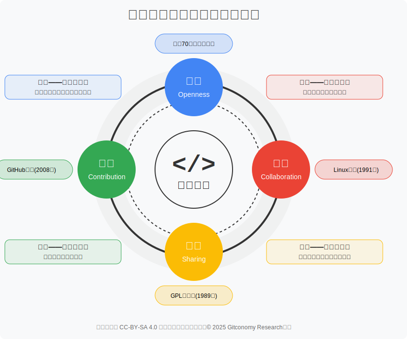

*图：开源文化的内核与价值闭环*

这种共享文化也引发了一个深刻的经济学问题：贡献者们，尤其是那些并未直接从中获得报酬的个人开发者，其贡献的动机是什么？答案是复杂且多维度的。除了纯粹的利他主义和帮助他人的满足感，还存在着许多内在和外在的激励因素。技术挑战本身带来的心流体验、解决自身工作或学习中遇到的“切肤之痛”，是强大的内在驱动力。而在外在层面，通过开源贡献建立个人技术声誉，已经成为当代软件工程师最重要的职业资本之一。一个活跃的GitHub个人资料，往往比一份传统的简历更能证明一个人的技术能力、协作精神和学习热情。这种声誉资本，可以转化为更好的工作机会、行业内的影响力，甚至是创业的基础。

>例如，**[GitHub Resume Generator](https://resume.github.io/)**可以帮助开发者将其贡献和项目转化为简洁而有力的个人简历。通过展示开源项目、代码贡献和活跃的协作记录，这类平台使开发者能将自己的技能和经验直接展示给潜在雇主，从而使得开源贡献成为职业发展的重要组成部分。

4. **贡献（Contribution）：循环的燃料**

 

一个健康的开源生态，其持续发展的动力源于贡献。贡献将社区从一个被动的用户集合，转变为一个主动的、富有生命力的创造性团体。它构建了一个正向的反馈循环：用户在使用过程中发现问题或产生新想法，通过提交代码、撰写文档或参与讨论等方式进行回馈，从而转变为贡献者。这种角色的流动交换，使得项目得以在无数微小的改进中持续演进。WordPress从一个简单的博客工具，成长为支撑全球大量网站内容管理系统的庞大平台，其背后正是数万名代码、翻译、文档与支持贡献者的不懈投入。这种由贡献驱动的良性循环，是开源项目能够保持活力、避免僵化的根本原因。

贡献的形式是多种多样的，远不止编写代码。修复一个文档中的拼写错误、为一个复杂的功能撰写清晰的用户指南、在社区论坛中耐心回答新手的提问、将软件界面翻译成一种新的语言、设计一个更美观的图标，这些都是对项目极具价值的贡献。一个成熟的开源项目，会有意识地为这些非代码贡献创造渠道和认可机制。例如，GNOME和Mozilla社区都明确欢迎并指导设计、翻译、文档等方面的贡献者。因为他们明白，一个成功的软件，不仅需要坚实的代码基础，还需要完善的文档、活跃的用户支持社区和良好的国际化。这种对多元化贡献的包容，极大地拓宽了项目的参与者基础，让那些不具备高深编程技能但拥有其他专长的人，也能为项目的发展添砖加瓦。

然而，并非所有开源项目都能成功地吸引和维持贡献。一个项目能否构建起健康的贡献者梯队，取决于多个因素。清晰的文档、友好的社区氛围和顺畅的贡献流程，是降低新人参与门槛的关键。如果一个新手在尝试提交第一个补丁时，遭遇到的是过时的编译指南、充满术语壁垒的讨论和维护者不耐烦的回应，他们很可能会望而却步。相反，如果项目送出了“新手友好”的标签，有专门的导师进行指导，并且对微小的改进也表示欢迎和感谢，那么新人就更有可能留下来，并逐步成长为核心贡献者。项目治理的透明度和公平性也同样关键。如果贡献者感到自己的意见被倾听，决策过程是开放的，那么他们就会更愿意投入时间和精力。

这四大理念——开放、协作、共享、贡献——并非孤立存在，而是构成了一个紧密相连、相互强化的价值闭环。开放是这一切的前提，它为协作和共享创造了可能性。协作是实现目标的手段，通过汇集全球的智慧，创造出更高质量的成果。共享是协作成果的传播方式，它将价值最大化，让知识惠及最广泛的人群。而贡献则是这个循环得以持续运转的燃料，它源于被共享的价值所激励的个体，又反过来通过新的开放内容，为下一轮的协作注入新的动力。正是这个生生不息的循环，构成了开源精神的内核，并驱动着整个技术世界不断向前。

---

💡 互动环节：核心概念快速问答

**选择题1**： 哪个概念最能描述“一个项目的健康状况更多地取决于其成员，而非其源代码”这一观点？

A. Linus定律  
B. 精英治理 (Meritocracy)  
C. 社区胜于代码 (Community over Code)  
D. 著佐权 (Copyleft)  

**选择题 2**： “Linus定律”主要强调了开源的哪一核心理念所带来的好处？

A. 开放 (Openness)  
B. 协作 (Collaboration)  
C. 共享 (Sharing)  
D. 贡献 (Contribution)  

**选择题 3**： 在开放、协作、共享和贡献构成的价值闭环中，哪一项是驱动整个循环持续运转的“燃料”？

A. 开放 (Openness)  
B. 协作 (Collaboration)  
C. 共享 (Sharing)  
D. 贡献 (Contribution)  

**简答题**： 除了编写代码，请列举三种其他对开源项目有价值的贡献方式。
在完成本章学习后，你将不再仅仅是开源的使用者，而是能够理解其背后运转逻辑的思考者和潜在的贡献者。

---

### 2.2 从“大教堂与市集”到数字经济的“道路与桥梁”的变迁

#### 2.2.1  "大教堂与市集"：两种开发模式的分野

`核心必读`

在1997年，当开源运动尚在萌芽阶段，埃里克·雷蒙（Eric S. Raymond）通过一篇影响深远的著作《大教堂与市集》[4]，为世人描绘了两种截然不同的软件开发图景。这一隐喻并非凭空杜撰，而是源于他对GNU Emacs等项目传统开发方式的反思，以及对当时正蓬勃兴起的Linux内核开发过程的敏锐观察。雷蒙的核心洞见在于，软件的创造过程可以遵循两种迥异的组织哲学，它们不仅影响着开发效率与产品质量，更塑造了截然不同的社区文化。

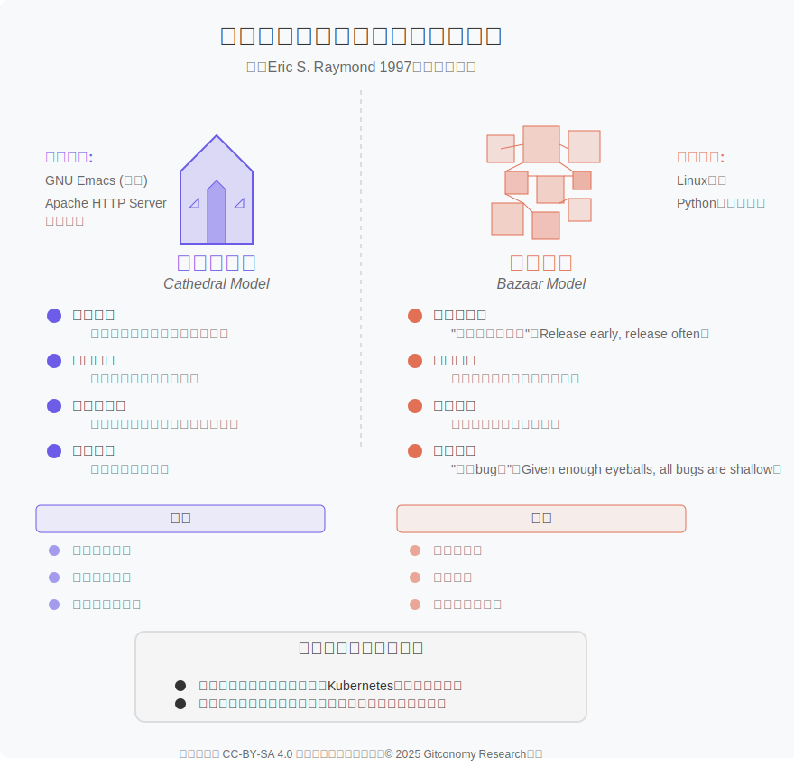

*图：大教堂与市集开放模式的对比*

“大教堂模式”是对传统、封闭式软件开发的一种精妙速写。在这种模式下，软件的构建如同建造一座宏伟的大教堂，由一位或数位核心架构师预先绘制好精密的蓝图，然后在一个相对隔绝的环境中，由一小群精英开发者精心雕琢。源代码在两次正式发布之间被严格保密，开发周期漫长，决策流程呈现清晰的层级结构。这种方式的优点在于能够维持高度的架构一致性与严格的质量控制，但其代价是创新速度相对迟缓，且对用户反馈的响应周期很长。

与此形成鲜明对比的，是雷蒙所推崇的“市集模式”。他将Linux内核的开发过程比作一个喧闹、看似混乱却充满活力的集市。在这种模式下，开发过程完全公开，奉行“发布早期，频繁发布”（release early, release ofen）的原则。开发者们将一个尚不完美但可运行的版本尽早地释在完成本章学习后，你将不再仅仅是开源的使用者，而是能够理解其背后运转逻辑的思考者和潜在的贡献者。放出去，将全球的用户都视作潜在的共同开发者。这种去中心化的协作网络，通过快速、小步的迭代持续改进，其内在逻辑正是前文提及的“Linus定律”。集市模式的优势在于极快的创新速度与强大的适应性，但它也可能面临架构不一致与发展方向难以精确控制的挑战。

随着开源实践的成熟，大教堂与集市之间的界限已不再那么泾渭分明。许多成功的现代开源项目，如Kubernetes，实际上采用了一种混合策略：它们既保持着集市般的开放参与和快速迭代，又拥有一座大教堂般清晰的架构愿景与治理结构。项目也可能在不同生命周期阶段，在两种模式之间进行转换。尽管如此，这一诞生于二十多年前的隐喻，至今仍为我们思考软件开发的组织模式与文化价值，送出了一把极具启发性的钥匙。

#### 2.2.2 道路与桥梁：云计算时代的开源新挑战

`进阶选读`

如果说“大教堂与集市”完美地捕捉了 Linux 时代开源软件革命性的生产模式，那么云计算的兴起和现代软件对开源近乎百分之百的依赖，则催生了一个更深刻、也更具警示意义的新隐喻。这个新洞察由研究员纳迪亚·埃格巴尔（Nadia Eghbal）在其 2016 年发布的开创性报告《道路与桥梁：我们数字基础设施背后看不见的劳动》中被系统性地提出 [5]，并在其后续著作《在公共领域工作》（Working in Public）[6]中得到进一步深化。她指出，许多核心的开源项目，就像我们日常生活中的道路和桥梁一样。开源代码构成了今天几乎所有软件和互联网服务的底层基础 ,被无数的商业公司、政府机构和个人所依赖，使用这些“公共道路”来构建和运营自己的商业服务 。 但其维护和保养工作却往往由少数志愿者承担，且严重缺乏资金和资源支持 。  

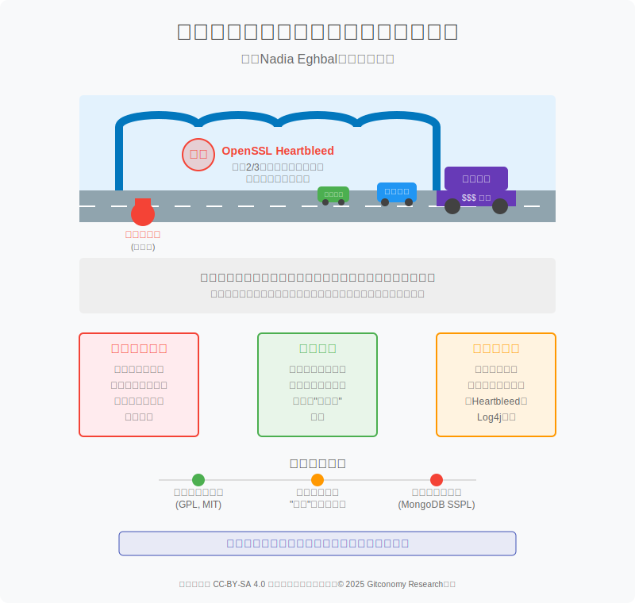

*图：云计算时代开源项目维护面临的挑战*

这个洞察的深刻之处在于，它将关注的焦点从代码的“创造过程”转向了代码的“社会功能”和“可持续性”。2014年爆发的“心脏出血”（Heartbleed）漏洞事件，是“道路与桥梁”隐喻最惨痛的现实注脚。OpenSSL，这个为全球约三分之二的网络服务器提供加密功能的开源库，被发现存在一个允许攻击者窃取敏感信息的严重漏洞，而这个漏洞已经悄然存在了两年之久。这一事件引发了对“Linus定律”的深刻反思。事实证明，仅仅“开放”源代码并不必然引来“足够多的眼球”去进行深入的安全审计。OpenSSL项目虽然被数百万个应用所使用，但其核心代码的维护和审查工作，长期以来仅由极少数核心开发者在资金匮乏的情况下进行。这里的“眼球”出现了严重的不匹配：无数的眼球在看路面（使用软件的应用），却很少有眼球在检查桥墩（核心库的源代码）。

云计算的商业模式加剧了这一问题。大型云服务商可以将开源软件（如数据库、操作系统）打包成服务，向成千上万的企业客户销售，并从中获取巨额利润。然而，由于传统的开源许可证（如GPL）的义务通常由“分发”软件的行为触发，云服务商通过网络提供服务，在法律上可能并不构成“分发”，从而规避了将改进代码回馈社区的义务 。这相当于卡车运输公司（云服务商）每天在公共高速公路（开源软件）上行驶，赚取了大量利润，却没有为公路的维护支付足够的费用。这种模式的出现，直接催生了像MongoDB的SSPL这样具有争议性的新许可证的诞生，它们试图通过法律条款，强制要求云服务商为他们所依赖的“数字基础设施”承担更多的责任 。

云计算时代开源项目的物理开源软件许可证的类型开源软件许可证的类型基础设施需要持续的维护和资金投入才能保持正常运转，数字基础设施同样如此。然而，现实情况却是：  

1. **看不见的劳动**：许多至关重要的开源项目，其维护工作往往由极少数核心开发者，甚至是单个志愿者在几乎没有报酬的情况下承担 。这种“看不见的劳动”导致了维护者普遍的职业倦怠 [7]。
2. **公地悲剧**：由于开源项目是公共物品，导致了典型的“搭便车”问题——无数商业公司从中获利，却很少有公司会系统性地回馈和资助它们所依赖的基础设施 。
3. **系统性风险**：基础设施的失修会带来灾难性后果。近年来诸如 Log4j 等严重安全漏洞的爆发，正是这种维护缺失的直接体现。一个不起眼的开源组件中的漏洞，就可能对全球的关键行业造成严重威胁，这已引起各国政府的高度4. **实践意义与挑战**4. **实践意义与挑战**4. **实践意义与挑战**关注 。
4. **注意力的耗竭**：现代开源的核心矛盾，已经从代码的生产成本转向了维护者注意力的稀缺性。GitHub 等平台极大地降低了贡献的门槛，但这把双刃剑也导致了“过度参与”的问题：维护者被海量的、通常是低质量的 Issue、PR 和功能请求所淹没，无法有效地指导每一个新人。这种无休止的社区支持工作，与开发者最初“为了解决切身之痛”的内在动机背道而驰，是导致职业倦怠的主要原因。知识共享（Creative Commons）许可协议比较分析

 

因此，“道路与桥梁”不仅是一个描述现状的隐喻，更是一个指向未来的议题，它迫使整个开源生态系统去思考：在一个由开源驱动的云时代，我们应如何建立一个可持续的、公平的维护和回馈机制。

#### 2.2.3 从“市集”到“道路与桥梁”的视角转变

从“集市”到“道路与桥梁”的视角转变，深刻地反映了开源生态系统在过去二十年间的成熟与演变。这两种模式并非相互替代，而是捕捉了开源在不同发展阶段所面临的核心挑战和关注焦点。

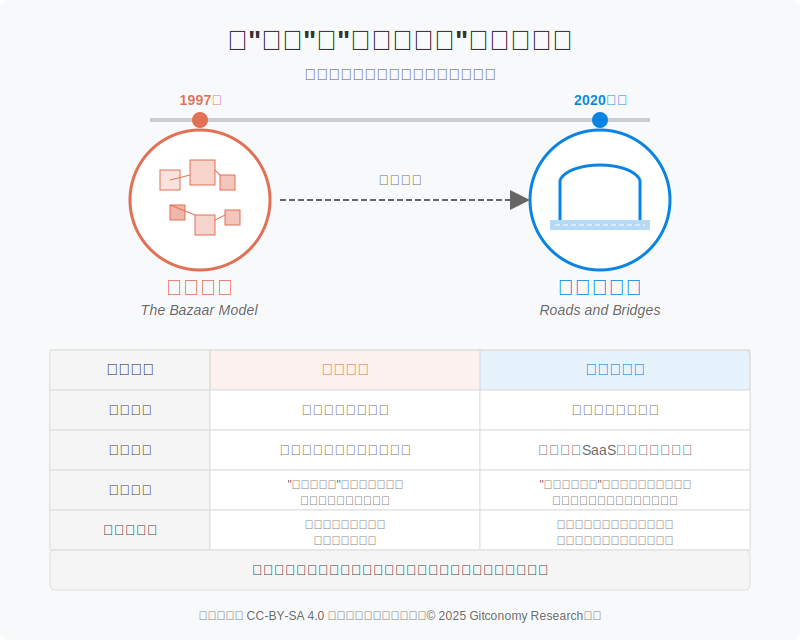

*图：从“市集”到“道路与桥梁的演变”*

“集市模式”（The Bazaar Model）视觉关注软件的诞生与创造，在个人电脑和早期互联网时代背景下，完美地描绘了开源软件是如何被高效创造出来的。随着开源的巨大成功，其生态环境也发生了深刻变化。进入云计算、SaaS和平台经济时代，开源软件不再仅仅是爱好者们的“玩具”或企业的备选项，而是构成了整个现代数字经济的基础设施。在这一新背景下，“道路与桥梁”视觉关注软件的依赖与维护，提出了一个更为紧迫的问题：“如何为这些关键的、被广泛依赖的开源项目提供可持续的支持？”它不再仅仅关注软件如何被创造出来，而是更深入地探讨，当整个社会都依赖于这些公共产品时，我们应该如何共同承担维护责任，确保其长期健康与安全。

| 对比维度 | 市集模式 | 道路与桥梁模式 |
| :--- | :--- | :--- |
| **核心焦点** | 软件的**生产与调试** | 软件的**消费与维护**，从代码到创作、数据与智能的n & Maintenance) |
| **核心故事** | 一群热情的志愿者如何通过大规模协作，高效地构建出伟大的软件。 | 支撑现代数字经济的软件，其维护工作正压垮少数无偿的志愿者。 |
| **时代背景** | 个人电脑与早期互联网时代 | 云计算、SaaS 和平台经济时代 |
| **核心观点** | “人多力量大”，更多的参与者能更快发现并修复错误。 | “依赖是无形的”，广泛的依赖并未转化为对等的支持，导致系统性风险。 |
| **提出的问题**| 如何组织大规模的、分布式的开发？ | 如何为关键的、被广泛依赖的开源项目提供可持续的支持？ |

表1：开源软件视角焦点的演变

从“社区”到“创作者”的转变: 经典的“集市”模式描绘了一个庞大的协作社区，但埃格巴尔观察到，现代开源生态越来越像其他的在线“创作者经济”（如 YouTube、Twitch）。许多项目实际上是由一个或少数几个核心维护者驱动的，他们围绕自己的工作建立了受众。然而，与视频博主不同，开源维护者被一种不成文的社会契约所束缚，被期望无偿回应所有反馈和需求，这使得他们的处境尤为艰难。

从“集市”到“道路与桥梁”的视角转变，标志着开源讨论的重心从业余爱好者的**生产狂欢**，转向了数字社会基础设施的**可持续性危机**。前者是对开源创造力的颂歌，而后者则是对其成功所引发的责任与挑战的深刻反思。今天的开源生态，既需要“集市”的活力来不断创新，也迫切需要建立起维护“道路与桥梁”的机制，以确保整个数字世界的稳定与繁荣。

----

💡 **互动环节：核心概念快速问答**

**选择题1**： “大教堂与市集”这一隐喻主要对比了软件开发的哪两个方面？

A. 编程语言与架构设计  
B. 组织模式与协作哲学  
C. 商业模式与盈利策略  
D. 软件质量与发布速度  

**选择题2**： “道路与桥梁”隐喻的核心警示是什么？

A. 开源软件的创新速度正在放缓  
B. 云计算公司正在窃取开源代码  
C. 关键开源项目缺乏可持续的维护和资金支持  
D. 开源社区的协作模式已经过时  

**问答题**： “HeartBleed”漏洞在开源的OpenSSL项目中存在了两年之久才被发现。这一事实如何挑战了对“Linus定律”（Given enough eyeballs, all bugs are shallow.）的简单化理解？

---

## 2.3 开源社区的文化与礼仪

`核心必读`

#### 2.3.1 不成文的规则：社区文化、角色与礼仪

开源项目的成功，不仅依赖于坚实源许可证在塑造开源协作与商业中的作用的技术架构与清晰的法律框架，更取决于其背后社区的活力与健康。开源社区形成了一套独特的文化价值观与行为规范。其中，精英治理（Meritocracy）是普遍存在的核心原则，即个体的声誉和影响力并非源于其现实世界中的职位或资历，而是通过其贡开源软件许可证的类型献的质量和持续性在社区中逐步建立起来。这种“代码胜于言辞”（talk is cheap, show me th e code——林纳斯·托瓦兹名言）的文化，与透明度原则紧密相连，重要的技术讨论和治理决策通常都在公开的邮件列表或论坛中进行，从而构建起社区的信任基础。

在这种文化背景下，有效的社区参与遵循着一套不成文的礼仪。沟通是所有协作的起点，清晰、准确地表达问题并送出足够的上下文信息，是获得帮助的前提。在提出问题之前，一个负责任的参与者会先自行搜索文档、邮件列表和历史问题，以示对他人时间的尊重。当接收到他人的反馈，尤其是建设性的批评时，应保持开放和学习的心态，将对代码的评论与对个人的攻击区分开来。反之，在向他人提出反馈时，也应聚焦于具体问题，送出可操作的建议，并注意在跨文化、跨时区的书面交流中保持善意和礼貌。

一个典型的开源社区通常包含几种不同的角色。位于核心的是维护者（Maintainer），他们对项目的整体方向和质量负责，是代码合并的最终决策者。更广泛的群体是贡献者（Contributor），他们通过提交代码、文档、测试或参与讨论等各种方式，为项目注入活力。而数量最庞大的则是用户（User），他们是项目价值的最终体现者，也是潜在的未来贡献者。这些角色并非固定不变，一个积极的用户可以通过持续的反馈和贡献，逐步成长为核心的维护者，这种流动的结构是社区保持新陈代谢的关键。

>本土化案例分析：PingCAP/TiDB的精英治理与社区构建
>
>作为源自中国的全球顶级开源分布式数据库项目，PingCAP公司围绕其核心产品TiDB所构建的社区，是精英治理和开放文化在中国实践的典范 。
>
>1. 治理架构： TiDB社区的治理是典型的精英治理模式。它由两大核心群体构成：
> - 技术监督委员会 (TOC - Technical Oversight Committee): 负责高层级的协调、信息共享和技术方向决策，是跨公司与组织协作的桥梁 。
> - 团队 (Teams): 专注于TiDB项目的特定部分，每个团队拥有自己的Reviewer（审查者）、Committer（提交者）和Maintainer（维护者），负责各自代码库的日常治理 。
>
>2. 贡献者成长路径： TiDB社区为参与者设计了一条清晰的、基于贡献的成长路径：User -> Contributor -> Reviewer -> Committer -> Maintainer -> TOC member。这种晋升是对个人实质性贡献的自然回报，而非特权的授予，它确保了最有能力和责任心的人能够领导项目发展 。
>
>3. 作为战略的开放性： PingCAP的开放心态远不止于开放源代码。他们将项目的Roadmap（路线图）和设计文档全部公开，甚至会邀请深度用户到公司举办“吐槽大会”，要求用户只谈缺点，以此来获取最真实的反馈 。这种极致的透明度旨在让社区能够尽可能深入地参与其中。
>
>4. 多元化贡献的价值： TiDB社区明确表示，他们珍视所有形式的贡献，包括但不限于代码审查、完善文档、社区论坛答疑、撰写教程和博客文章等 。这为不擅长编码但拥有其他技能的社区成员提供了参与和成长的机会。
>
>5. 社区是最宽的护城河： PingCAP的创始人认为，与其他数据库相比，社区是TiDB最强大的竞争优势。一个活跃的社区能够贡献大量的想法、代码和反馈，极大地加速了产品的成熟，这是任何闭源竞争对手都无法复制的“护城河” 。

#### 2.3.2 成文的规则：行为准则 (Code of Conduct) 的角色与争议

社区内部的冲突在所难免，无论是技术路线的分歧，还是代码风格的争议。健康的社区会建立相应的冲突处理与决策机制。许多项目奉行共识导向的原则，力求通过充分讨论达成各方都能接受的方案。在无法达成共识的情况下，一些项目可能会诉诸核心贡献者的投票，或者由项目负责人，即所谓的“仁慈的独裁者”，做出最终裁决，林纳斯·托瓦兹在Linux内核社区的角色便是一个著名例子。无论采用何种机制，聚焦问题本身、避免人身攻击、尊重最终决策，都是维护社区长期健康发展的必要前提。

为了将这些不成文的礼仪和价值观正式化，越来越多的开源项目开始采纳“行为准则”（Code of Conduct, CoC）。CoC是一份明确的文件，它定义了社区成员之间可接受和不可接受的行为，并为处理冲突和骚扰提供了流程。一个典型的CoC会鼓励建设性的、包容的沟通，并明确禁止任何形式的歧视、骚扰和人身攻击。例如，Google的开源项目普遍采用一份标准化的行为准则，要求参与者“表现出同理心和善意”，并设立了明确的报告渠道和执法负责人（Project Steward）。这种方式体现了一种自上而下的、旨在创造可预测和安全协作环境的公司治理思路。

然而，CoC的引入并非总是一帆风顺，它有时会触及开源社区关于言论自由、技术纯粹性和社区自治的深层矛盾。

> **案例**
>
>2018年，Linux内核社区用一份基于“贡献者契约”（Contributor Covenant）的CoC，替换了原来言简意赅的“冲突准则”（Code of Conflict），引发了剧烈争议[8]。批评者认为，新的CoC语言模糊，可能被滥用于压制尖锐但必要的技术批评，从而损害内核的质量；他们还担心，这标志着社区的重心从纯粹的技术精英治理，转向了更侧重社会包容性的“后精英治理”模式。这场争议的核心，是两种价值观的碰撞：一方认为，一个更友善、更包容的环境能够吸引更多元化的贡献者，最终有益于项目；另一方则担心，对“不友善”言论的限制会扼杀技术讨论的坦率和效率。这场风波最终以Linus Torvalds本人公开道歉并暂时引退反思告终，他承认自己过去的一些言论“完全不可接受”，并表示不希望与那些借“反政治正确”之名行歧视之实的人为伍 。

这个案例深刻地揭示了，在开源这个全球化的公共广场上，如何平衡技术卓越与社区健康，是一个没有简单答案、需要持续对(Consumptio话和演进的复杂议题。  

>
行为准则模板示例 (基于贡献者契约 2.1) [9]
>
>**我们的承诺**
>
>我们作为成员、贡献者和领导者，承诺让我们的社区参与成为每个人的无骚扰体验，无论年龄、体型、可见或不可见的残疾、种族、性别特征、性别认同和表达、经验水平、教育、社会经济地位、国籍、个人外貌、种族、宗教或性认同和取向如何。我们承诺以有助于建立一个开放、欢迎、多元、包容和健康的社区的方式行事和互动。
>
>**我们的标准**
有助于为我们的社区创造积极环境的行为示例包括：
对他人的同情和善意。
>1. 尊重不同的意见、观点和经历。
>2. 优雅地给予和接受建设性的反馈。
>3. 为我们的错误承担责任并向受影响的人道歉，并从中吸取教训。
>4. 关注的不仅是我们作为个人的最佳利益，还有整个社区的最佳利益。
>
>不可接受的行为示例包括：
>
>1. 使用色情语言或图像，以及任何形式的性关注或挑逗。
>2. 引战、侮辱性或贬损性评论，以及人身或政治攻击。
>3. 公开或私下的骚扰。
>4. 未经明确许可，发布他人的私人信息，例如物理地址或电子邮件地址。
在专业环境中可以被合理地认为是不当的其他行为。
>
>**执行责任**
>
>社区领导者负责澄清和执行我们可接受行为的标准，并将对他们认为不当、威胁、冒犯或有害的任何行为采取适当和公平的纠正措施。社区领导者有权利和责任删除、编辑或拒绝不符合本行为准则的评论、提交、代码、维基编辑、问题和其他贡献，并将在适当时传达审核决定的原因。
>
>**范围**
>
>本行为准则适用于所有社区空间，也适用于个人在公共场所正式代表社区时。代表我们社区的示例包括使用官方电子邮件地址、通过官方社交媒体帐户发帖，或作为在线或离线活动的指定代表。
>
>**执行**
>
>辱骂、骚扰或其他不可接受行为的实例可以向负责执行的社区领导者报告，联系方式为 [在此处插入联系方式]。所有投诉都将得到迅速和公平的审查和调查。所有社区领导者都有义务尊重任何事件报告者的隐私和安全。

---

💡 **互动环节：核心概念快速问答**

**选择题1**： 在一个典型的开源社区中，哪个角色对项目的整体方向和代码合并拥有最终决策权？

A. 用户 (User)  
B. 贡献者 (Contributor)  
C. 维护者 (Maintainer)  
D. 技术监督委员会 (TOC)  

**选择题2**： 2018年Linux内核社区关于行为准则（CoC）的争议，核心是哪两种价值观的碰撞？

A. 技术卓越与社区包容  
B. 开放源代码与商业机密  
C. 个人自由与集体利益  
D. 快速迭代与长期稳定  

**问答题**： 简述为什么说开源社区普遍遵循“精英治理”（Meritocracy）原则。

---

## 第二部分 开源协作的整体法律框架：出站许可与入站贡献

开源许可证不仅界定了开源软件的法律边界，还为开发者提供了明确的操作框架，确保软件的自由使用和贡献。了解并正确选择开源许可证，是每个开源项目启动时的关键步骤，它直接影响着项目的法律合规性与可持续发展。

---

### 2.4 法律基石：开源中的版权、专利与商标

`核心必读`

开源许可证的效力并非源于某种抽象的社区共识，而是深深植根于现行的知识产权法律体系。它巧妙地运用版权法、合同法，并日益涉及专利法和商标法，构建了一个允许代码自由流动的法律框架。要理解如何选择和使用许可证，首先必须解构其法律本质。

#### 2.4.1 从“保留所有权利”到“保留部分权利”：版权法的核心作用

开源软件的自由并非源于无政府状态，而是建立在精巧的法律框架之上，其核心便是开源许可证。开源许可证是软件许可证的一种。

软件许可证的本质，是从代码到创作、数据与智能的在现行著作权法体系内运作的一种授权机制。根据中国的《计算机软件保护条例》等法律，软件的创作者自创作完成之日起，便自动享有包括复制权、修改权和发行权在内的一系列专有权利。在默认的“所有权利保留”状态下，任何未经授权的复制、修改或分发行为都构成侵权。开源许可证的作用，正是将这种默认状态“反转”，主动向公众授予一份许可，允许他人在特定条件下行使其部分专有权利，从而将“所有权利保留”变为“保留部分权利”。

开源许可证的核心法律功能，正是对这一默认状态的逆转。它不是创造新的权利，而是作者主动、公开地将其拥有的部分专有权利授予公众的一份法律声明。许可证扮演了一个“权利授予书”的角色。以极为流行的 MIT 许可证为例，其核心条款清晰地阐明了这一点：“特此免费授予任何获得本软件及相关文档副本的人……无限制地处理本软件的权利，包括但不限于使用、复制、修改、合并、发布、分发、再许可和/或销售……”[10]。这段文字通过法律语言，将版权法赋予作者的专有权利，系统性地转让给了每一位软件的接收者。正是这一明确的授权行为，为开源软件的自由流动和修改提供了坚实的法律基础，使得开发者可以放心地使用。

#### 2.4.2 知识产权三要素：开源中的版权、专利与商标

虽然开源许可证主要建立在版权法之上，但一个成熟的开源项目需要管理的知识产权远不止版权。现代开源许可证通常会系统性地处理三种核心的知识产权：版权、专利和商标，它们在开源世界中扮演着截然不同的角色。

1. **版权（一切的基础）**

如前所述，版权是开源许可证运作的法律基石。许可证的核心内容就是对受版权保护的作品（代码）进行权利的授予和限制 7。

2. **专利（主动防御）**

软件专利保护的是实现特定功能的方法或过程，而非具体的代码实现。随着软件行业的发展，专利诉讼成为一个日益严峻的风险。为了应对这一挑战，现代开源许可证进化出了复杂的专利条款，作为一种社区性的主动防御机制。

- **从隐性到显性授权**：早期的学术性许可证，如 MIT 和 BSD，诞生于软件专利尚不普遍的时代，因此并未明确提及专利，仅被法律界解读为包含一种“隐性”的专利授权。然而，随着企业（特别是拥有大量专利组合的公司）深度参与开源，这种模糊性带来了巨大的法律风险。

- **明确的专利授权条款** ：作为回应，21世纪初诞生的现代许可证，如Apache许可证2.0和GPLv3，引入了这些条款规定，代码的贡献者必须将其拥有的、与所贡献代码相关的必要专利，免费、不可撤销地授权给该软件的所有使用者从代码到创作、数据与智能的。

- **专利报复条款**：这是现代许可证中一项更为精妙的设计。以 Apache 2.0 为例，其专利报复条款规定，如果任何使用者就该开源软件或其贡献部分提起专利侵权诉讼，那么该使用者依据此许可证获得的所有专利授权将自动终止。这一机制极大地削弱了专利侵略的动机，因为它意味着任何试图利用自身专利攻击该开源项目的公司，将立刻失去使用该项目中所有其他贡献者专利的权利，从而使自己也面临被反诉的风险。这种条款如同一种“企业间的和平条约”，通过确保“相互保证毁灭”，在开源项目这个中立地带创造了一个安全的协作空间。这对于促成如 Kubernetes 等由多个商业巨头共同参与的大型开源项目的成功至关重要。

3. **商标（保留权利）**

 

与版权和专利不同，商标权在开源许可证中几乎从不被授予。商标（如项目名称、Logo）的核心功能是标识产品或服务的来源，保证其质量和一致性。如果允许任何人随意使用项目的商标，将会导致市场混淆，稀释品牌的价值，最终使商标本身失效。因此，开源项目始终保留对其商标的专有控制权，许可证通常会明确禁止使用者利用项目或其贡献者的名义进行商业推广或背书，除非获得特别许可。

对这三种知识产权的不同处理方式，直接反映了一个项目的成熟度及其目标社群。一个简单的个人项目可能只需要一份MIT许可证就已足够。但一个旨在吸引多个大型科技公司（如谷歌、微软）共同参与的行业级基础设施项目，如Kubernetes，则必须采用像Apache 2.0这样包含精密专利条款的许可证。在这种场景下，许可证不仅是一份法律文件，更是一份促成潜在商业对手之间展开合作的“和平条约”。正是这一法律机制的创新，为云计算时代大规模、跨企业的开源协作铺平了道路。

---

#### 2.4.3 作为合同的许可证：可执行性与法律判例

开源许可证法律机制最精妙的体现是“Copyleft”（著佐权）。它并不抛弃版权，反而利用版权的强制力来确保自由的传递。当使用者违反了Copyleft许可证的条款（例如，修改了GPL代码却拒绝公开其衍生作品的源代码），他们就超出了许可证授予的权限范围，其行为便从合法的“被许可使用”转变为非法的“版权侵权”。这种法律定性至关重要，因为它为开源作者提供了比普通合同违约更强有力的法律救济途径。

因此，开源许可证不仅是一份单方面的授权声明，更被法律体系普遍认定为一份具有约束力的合同（或协议）。当用户下载、使用或修改遵循特定许可证的软件时，他们的行为即被视为对许可证条款的接受，从而在软件的权利人（作者或贡献者）与使用者之间形成了一个法律上的合同关系[11]。

这一合同性质意味着许可开源软件许可证的类型证的条款是可被强制执行的。世界多个司法管辖区的法院已经审理了多起涉及开源许可证的案件，并普遍支持其法律效力，裁定违反许可证条款的行为构成版权侵权或合同违约 。例如，如果一个许可证要求使用者在分发衍生作品时必须包含原始的版权声明，而使用者未能遵守，那么软件的权利人便可以依据版权法或合同法提起诉讼。

不遵守许可证条款的法律风险是真实存在的，其后果可能相当严重。对于个人开发者而言，这可能意味着法律纠纷和声誉损害。对于企业而言，风险则更为重大，可能包括：

- **法律诉讼与赔偿**：权利人可以起诉违规使用的企业，要求停止侵权行为并赔偿经济损失。
- **权利终止**：几乎所有开源许可证都包含终止条款，一旦使用者违反了规定，其通过许可证获得的所有权利（包括使用、修改和分发的权利）将自动终止。
- **强制开源风险**：对于违反强传染性许可证（如 GPL）的企业，虽然在司法实践中直接强制其公开专有代码存在争议，但其违约行为可能导致其分发衍生产品的权利被终止，从而在商业上陷入困境。有法律观点认为，虽然版权法本身难以直接强制开源，但依据合同法的“非金钱债务履行”原则，权利人可以请求法院强制违约方履行“公开源代码”的合同义务。

>**国内外开源许可诉讼案例**
》
在美国的Jacobsen v. Katzer案中，法院确立了开源许可证的条款是具有约束力的“条件”而非仅仅是“约定”，违反这些条件将直接导致版权侵权[12]。
>
>同样，在中国的罗盒诉玩友案中，广州知识产权法院也明确认定GPL协议属于“附解除条件的著作权合同”，一旦用户违背条款，授权自动终止，后续使用行为即构成侵权。
>

这些判例清晰地表明，不遵守许可证条款的法律风险是真实存在的。对于企业而言，后果可能包括法律诉讼、经济赔偿，以及根据许可证终止条款丧失对软件进行使用、修改和分发的所有权利 。因此，将开源许可证视为一份严肃的法律合同，是任何希望利用开源软件的个人和组织必须具备的基本认知。  

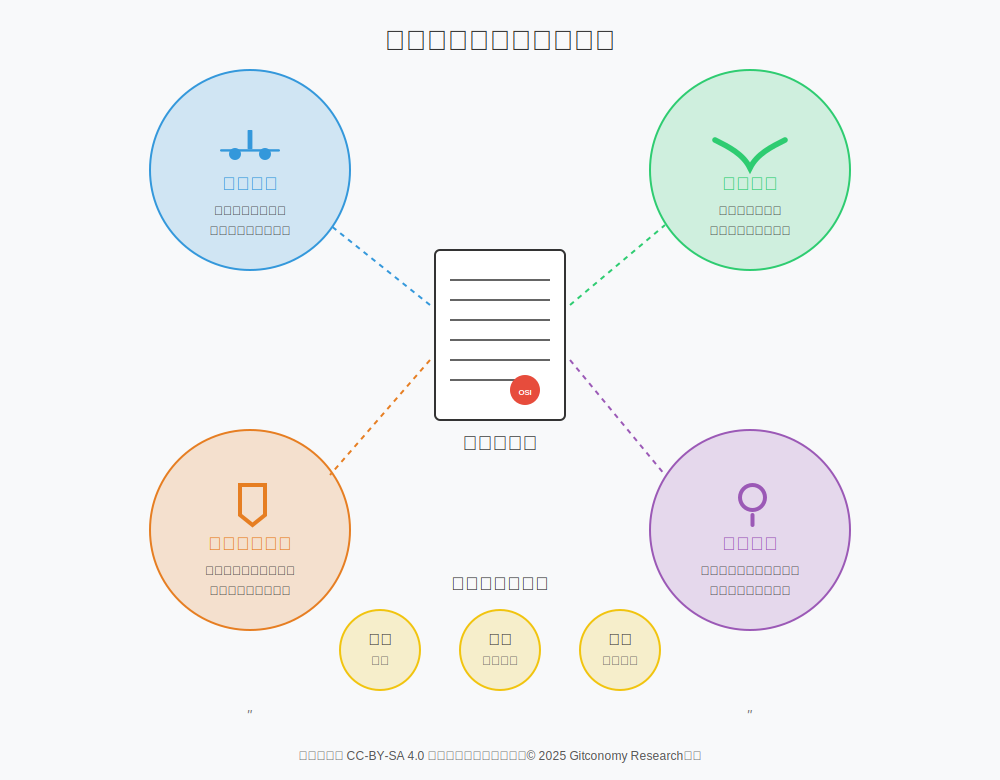

*图：开源许可证的本质与作用*

综上所述，开源许可证扮演着多重角色。它是一份**法律合同**，在作者与用户之间建立了具有法律约束力的权利义务关系。它是一份**社会契约**，公开宣告了项目的价值观和期望的协作模式——是鼓励商业化，还是坚持社区共享。它也是一个**风险管理工具**，为企业和个人使用者提供了可预测的法律环境，使其能够放心地在开源代码的基础上进行创新。最后，它还是一份**哲学宣言**，每一个许可证的选择，都反映了项目发起者对自由、共享与商业之间关系的独特理解。

---

💡 **互动环节：核心概念快速问答**

**选择题1**： 开源许可证运作的法律基石是什么？

A. 版权 (Copyright)  
B. 专利 (Patent)  
C. 商标 (Trademark)  
D. 合同法 (Contract Law)  

**选择题2**： Apache 2.0等现代许可证中的“专利报复条款”主要目的是什么？

A. 确保所有贡献者都能获得专利费  
B. 允许项目方起诉任何侵犯其专利的公司  
C. 强制所有使用者公开他们的专利  
D. 阻止项目使用者利用自己的专利来攻击该项目  

**问答题**： 为什么开源许可证几乎从不授予商标权？

---

### 2.5 出站许可：定义代码的公共边界

`核心必读`

##### 2.5.1 开源许可证类型

1. **互惠型许可vs宽松型许可**

根据对衍生作品所施加的限制强度，传统的开源许可证可被大致归为三类：

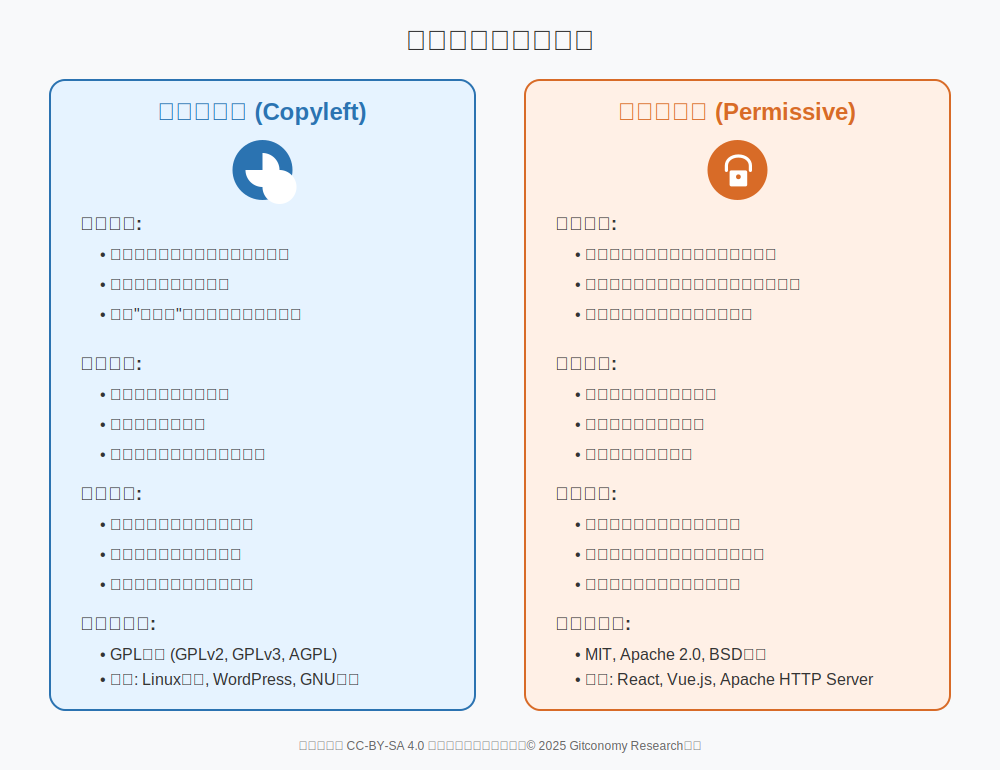

*图：互惠型许可和宽松型许可比较*

第一类是**强著作互惠型（Strong Copyleft）** 许可证，以GPL[13]系列为代表。这类许可证的核心机制在于，任何基于其代码修改或扩展后进行分发的作品，都必须同样采用GPL许可证发布。这种“传染性”的设计，旨在构建一个自我延续的自由软件生态系统，确保所有贡献的成果都能回馈社区，防核心概念快速问答止代码被私有化。

第二类是**宽松型（Permissive）** 许可证，其代表为MIT[10]和Apache许可证[14]。它们施加的限制最少，通常只要求在分发时保留原始的版权声明。最关键的区别在于，宽松型许可证允许衍生作品以任何形式发布，包括完全闭源的商业产品。这种设计极大地降低了商业公司接纳和参与的门槛，意图最大化软件的采用率和传播范围。

介于两者之间的，是**弱著作互惠型（Weak Copyleft）**许可证，如LGPL。它是一种折衷方案，要求对许可证覆盖的代码本身的任何修改，在分发时仍需遵循相同的许可证；但它允许这些代码被其他软件（包括专有软件）以链接的方式使用，而不会将Copyleft的“传染性”扩展到链接它的整个软件。这种设计在保护核心代码库自由的同时，也鼓励其在更广泛的软件生态中被采纳，尤其适用于软件库的场景。

这三种不同强度的许可证哲学，直接导致了它们在代码组合时的兼容性问题。一般而言，将宽松型许可证下的代码集成到强Copyleft项目中是可行的，最终整个作品将遵循更严格的GPL条款。然而，反向操作则会产生冲突，因为GPL不允许其代码被用于闭源衍生品中。

更复杂的是，两种不同的强Copyleft许可证之间通常互不兼容，因为它们各自要求衍生作品遵循自身条款，这是一个无法同时满足的互斥条件。

>许可证的演进本身也反映了开源世界对不断变化的技术和法律环境的适应。GPLv2与GPLv3之间的差异便是一个值得参考的案例。GPLv2诞生于一个软件专利和硬件锁定（Tivoization）尚不普遍的时代，而GPLv3则明确加入了应对这些新挑战的条款。然而，GPLv3的“反Tivo化”条款，虽然旨在保护用户在硬件设备上运行修改后软件的自由，却遭到了Linus Torvalds的坚决反对，他认为这是对硬件制造商权利的过度干涉。这场分歧导致Linux内核至今仍坚守GPLv2，这深刻地说明，许可证的选择不仅是法律问题，更是项目领导者哲学理念和价值观的体现。因此，理解许可证的“艺术”，就是要学会在项目的具体情境中，权衡自由与限制、社区与商业、理想与现实之间的复杂关系。

这种法律上的复杂性，要求开发者在选择和组合开源组件时，必须对许可证的内涵与边界有清晰的认识。

2. **“SaaS漏洞”与AGPL的兴起**

`进阶选读`

随着技术和商业模式的演进，许可证的哲学意图也面临着新的挑战。GPL 的Copyleft 机制依赖于一个关键的触发条件——“分发”（distribution）。只有当用户将软件或其衍生品分发给他人时，才有义务公开源代码。然而，在21世纪初，随着云计算和软件即服务（Software-as-a-Service, SaaS）模式的兴起，一个巨大的“漏洞”出现了。

这个漏洞被称为“ASP 漏洞”或“SaaS 漏洞”。具体而言，一家公司可以获取一份GPL许可的软件，对其进行大量修改和增强，然后在其自己的服务器上运行该软件，通过网络向用户提供服务（例如一个网站或一个 API）。在这个过程中，该公司从未将软件的二进制文件或源代码“分发”给最终用户，因此，从技术上讲，GPL的Copyleft条款并未被触发。这意味着该公司可以享受开源软件带来的所有好处，同时将其核心改进保持为商业秘密，这在自由软件社区看来，违背了GPL 的互惠精神。

为了填补这个漏洞，自由软件基金会发布了 GNU Affero 通用公共许可证（GNU AGPL）[15]。AGPL 在 GPL 的基础上增加了一个关键条款：如果一个修改过的程序通过计算机网络提供交互式服务，那么它必须向所有使用该服务的用户提供其完整的相应源代码 。这一条款将“通过网络提供服务”视同“分发”，从而将 Copyleft 的效力延伸到了云时代。

AGPL的诞生是许可证理念与时俱进的绝佳例证。它表明，开源许可证并非从代码到创作、数据与智能的从代码到创作、数据与智能的从代核心概念快速问答码到创作、数据与智能的一成不开源软件许可证的类型变的法律教条，而是为了捍卫其核心哲学理念而不断适应技术和商业模式变革的动态工具。它也揭示了开源世界一个更深层次的张力：即代码本身的价值（GPL 所保护的）与运行代码所提供的服务的价值（AGPL 试图规范的）之间的区别。在现代云经济中，后者往往比前者更具商业价值。

最终，一个项目开源许可证在宽松和强制之间做出的选择，本质上是一项关于其生态系统未来形态的战略决策。它不仅仅是选择一份法律文件，更是在设计其社区结构和商业模式。选择宽松型许可证，如同邀请商业伙伴在其基础上构建各自的私有帝国，形成一个“中心-辐射”式的生态系统，这可能带来快速的用户增长和广泛的行业采纳。而选择强Copyleft 许可证，则是在构建一个“共享公地”，强制所有参与者将他们的改进贡献回社区，确保核心项目随着每一个衍生版本的出现而不断壮大，形成一个紧密耦合、互惠互利的生态。

##### 2.5.2 连接出站许可与商业及治理策略

`深度探索`

开源许可证不仅是法律文件，更是塑造整个开源生态系统结构、文化和经济模式的组织原则。许可证的选择直接影响了一个项目的治理方式、社区构成、商业化路径乃至其长期可持续性。从法律文本到现实世界，许可证的条款在协作与商业的动态平衡中发挥着决定性作用。

###### 2.5.2.1 协作的法律架构

开源的核心在于协作，而许可证是构建和维护这种协作关系的法律框架。

1. **创建“法律安全港”**

对于任何潜在的贡献者，尤其是来自大型企业的开发者，法律上的明确性是参与开源项目的前提。一个清晰、标准的开源许可证提供了一个“安全港”，明确了知识产权的归属和使用权限。如果没有许可证，贡献代码的行为将使贡献者和项目方都陷入法律风险的灰色地带，因为贡献代码的版权默认仍属于贡献者本人。这会极大地抑制参与的意愿。许可证通过提供一个统一的、预先定义的法律框架，消除了这种不确定性，从而鼓励和保障了贡献的流入。

2. **降低交易成本**

在没有标准许可证的情况下，每一次代码贡献都可能需要项目维护者与贡献者之间进行单独的法律协议谈判。这种模式的交易成本极高，对于一个拥有成百上千贡献者的项目来说是完全不可行的。开源许可证通过提供一套标准化的条款，充当了一份“通用合同”。所有贡献者都在同一个框架下参与，这极大地降低了协作的摩擦和管理成本，使得大规模、分布式的全球协作成为可能。

###### 2.5.2.2  商业的引擎

虽然开源常与非盈利联系在一起，但许可证实际上是驱动多样化商业模式的关键引擎。它通过不同的授权方式，为企业在开源生态中创造价值和获取利润提供了多种路径。

1. **开放核心（Open Core）模式**

 

这是目前最主流的开源商业模式之一。在该模式下，一个公司会发布一个功能完备的“核心”产品，并采用宽松型许可证（如 Apache 2.0）进行开源。这个开源核心版本可以免费使用，吸引大量用户和开发者，形成活跃的社区和广泛的市场认知。同时，该核心概念快速问答*公司会开发一些高级功能、管理工具或性能优化，并将这些作为专有的“企业版”或付费插件进行销售。宽松型许可证是这一模式能够成立的关键，因为它允许公司在开源核心之上构建闭源的商业产品。

2. **双重许可（Dual-Licensing）模式**

 

这种模式巧妙地利用了不同许可证之间的哲学和法律差异来创造商业机会。一个软件产品会同时提供两种许可选项：一个通常是强 Copyleft 许可证（如 GPL），另一个是商业许可证。

- GPL选项：用户可以免费使用、修改和分发软件，但前提是他们必须遵守GPL的条款，即任何衍生作品也必须以GPL许可开源。这对于其他开源项目或学术研究来说非常有吸引力。
- 商业许可选项：对于那些希望将该软件集成到自己的专有产品中，并且不想公开其商业代码的公司，他们就必须购买商业许可证。这个商业许可证会免除 GPL 的Copyleft义务，允从代码到创作、数据与智能的许他们闭源使用。

>**典型双重许可案例**
>
>MySQL是采用此模式的经典案例,它开创了成功的“双重许可”模式。MySQL同时以两种方式提供：一种是遵循GPL的免费社区版，这吸引了大量的个人开发者和开源项目使用和贡献，形成了庞大的用户基础和社区生态；另一种是付费的商业版，它允许企业将MySQL集成到自己的专有产品中而无需开源其代码 23。这种模式巧妙地将用一个强有力的比喻市场一分为二，既享受了开源带来的社区红利，又开辟了稳定的商业收入来源，为项目的可持续发展提供了资金支持。

双重许可模式实际上是将GPL的“限制性”转化为一种商业杠杆，为那些无法或不愿满足Copyleft条件的用户提供了合法的“豁免”途径。

3. **付费支持与服务模式**

 

在这种模式下，软件本身是完全开源的，通常采用 GPL等Copyleft 许可证，但公司通过提供围绕该软件的专业服务来盈利。这包括技术支持、咨询、培训、定制开发以及经过认证的、稳定的企业级发行版。Red Hat 公司围绕 Linux 操作系统（GPL 许可）建立的商业帝国是此模式最成功的典范。许可证确保了软件本身的自由和开放，而商业公司则在服务层创造价值。

这些商业模式的成功，揭示了许可证选择与商业战略之间的深刻联系。例如，开放核心模式依赖于宽松型许可证，但这种模式也可能在社区中引发张力。公司有经济动机将最有价值的功能保留在专有版本中，这可能导致社区成员感觉他们的贡献被用来销售闭源产品，或者感觉开源核心版本被有意地“功能阉割”以促使用户升级。这说明，许可证选择（宽松型）虽然是商业模式的必要条件，但一个健康的商业开源项目还需要精心的社区管理和对开源版本明确的价值承诺，以平衡商业利益和社区期望。

###### 2.5.2.3 赋能治理与社区

许可证的选择为一个项目设定了基本的“游戏规则”，从而深刻影响其社区文化和治理结构。不同的许可证吸引不同类型的参与者，并为不同的治理模式提供基础。

开源项目的治理模式多种多样，但通常可以归为几类，且与许可证选择密切相关。

1. **仁慈的终身独裁者**（Benevolent Dictator for Life, BDFL）：在这种模式下，项目由一位创始人或核心领导者拥有最终决策权。Linux内核项目中的莱纳斯·托瓦兹（Linus Torvalds）是BDFL模式最著名的例子 。这种模式常见于由强大个人愿景驱动的项目。Linux内核采用GPLv2许可证，这直接反映了托瓦兹对于保持内核自由和防止其碎片化的坚定立场。

2. **精英治理**（Meritocracy）：这种模式的治理权基于个人的贡献和技术专长。Apache软件基金会（ASF）是精英治理的典范。在ASF的项目中，持续做出有价值贡献的开发者可以被选举为“提交者”（Committer），进而成为项目管理委员会（PMC）成员，共同决定项目的技术方向。ASF旗下所有项目统一采用Apache 2.0许可证，其明确的专利授权和商业友好性，为企业开发者参与这种基于贡献的治理模式提供了安全的法律环境。

3. **基金会模式**：越来越多的重要开源项目由非营利性基金会（如Linux基金会、Apache软件基金会、开放原子开源基金会）进行法律和财务上的托管。基金会提供了一个中立的法律实体，用于持有商标、管理资金，并为企业间的合作提供一个公平的平台。基金会通常会标准化其托管项目的许可证选择，以确保法律上的一致性和可预测性。

4. **公司主导模式**：在这种模式下，一个特定公司主导开源项目的开发和决策。公司主导的项目往往选择Apache 2.0或类似的宽松型许可证，既能保证代码开放，又能防止公司在其中投入的商业价值被外部开发者非法复制或使用。典型的公司主导开源项目包括Google的Kubernetes和Microsoft的VS Code。这种模式的好处在于，开发过程可以更为高效并且得到强有力的资源支持，但也可能面临公司利益与社区价值之间的冲突。

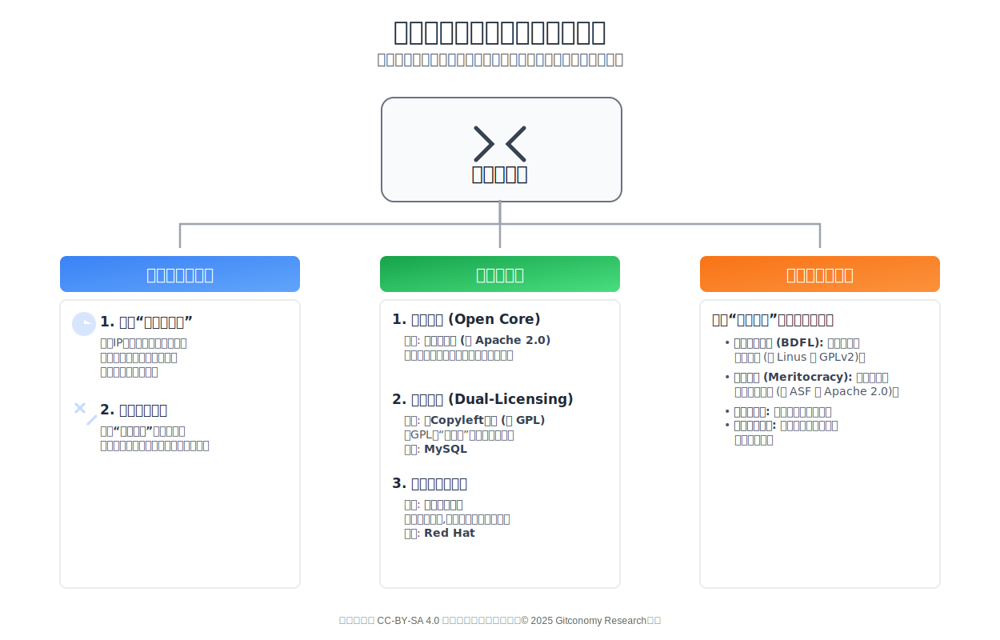

*图：开源许可证在塑造开源协作与商业中的作用*

不同的治理模式和许可证选择密切相关。BDFL模式通过GPL等强著作权传播型许可证保护核心开发自由，而精英治理和基金会模式则通过明确的许可框架（如Apache 2.0）来确保企业能够参与进来，同时维持项目的开放性和社区贡献。在公司主导模式下，选择的许可证通常会考虑到商业需求，并选择具有适当专利授权和商业友好性的宽松型许可证。

因此，出站许可证的选择远非一个单纯的法律问题，它是一种生态系统设计行为。选择宽松型许可证，如同在构建一个“中心-辐射”式的生态系统，项目本身是中心，并鼓励无数商业或非商业的衍生品成为其辐射的末端，这有助于项目成为事实上的行业标准。而选择强著佐权许可证，则是在构建一个“共享公地”，所有参与者都被法律契约绑定，必须将其改进贡献回公共池中，从而确保核心项目本身的价值随着生态的扩大而不断累积。这两种模式在价值流动的方向和社区关系的性质上存在根本差异，而许可证正是实现这些不同设计蓝图的执行工具。

---

💡 **互动环节：核心概念快速问答***

**选择题1**： 下列哪项最准确地描述了“著佐权”(Copyleft) 的工作原理？

A. 放弃所有版权，将作品放入公共领域  
B. 利用版权法的强制力，要求衍生作品也必须以相同或相似的条款共享。 
C. 仅允许非商业性使用和修改。 
D. 授予用户专利权，以换取代码贡献。 

**选择题2**： 在著佐权谱系中，哪一类许可证旨在保护库本身的开放性，同时允许链接它的应用程序保持闭源？

A. 强著佐权 (Strong Copyleft)  
B. 弱著佐权 (Weak Copyleft)  
C. 网络著佐权 (Network Copyleft)  
D. 宽松型 (Permissive)  

**问答题**： 根据文中的判例（如罗盒诉玩友案），当用户违反GPL等著佐权许可证的条款时，会产生什么法律后果？

---

### 2.6 入站贡献：保障项目的知识产权链

`核心必读`

入站贡献（Inbound Contributions）管理的是项目如何合法、安全地接收来自外部贡献者的代码。这是一个成熟开源项目至关重要的环节，它确保了项目知识产权链条的完整性和清晰性。

#### 2.6.1 为何入站政策不可或缺：确立来源与法律确定性

在没有正式入站协议的情况下，根据版权法的默认原则，贡献代码的版权仍然属于原作者。这意味着项目方只是获得了一份默示的、未经明确定义的许可来使用这些代码。这种法律上的模糊性会给项目带来巨大风险：项目可能没有明确的权利来分发这个包含了众多作者代码的集合作品，更无法在未来进行许可证变更或应对法律挑战。

一个正式的入站政策，无论是贡献者许可协议（CLA）还是开发者原创声明（DCO），都为项目和贡献者创建了一个“法律安全港”。它清晰地界定了知识产权的权利和义务，消除了不确定性，从而鼓励（尤其是来自企业的）贡献者放心地参与。对于一个严肃的开源项目而言，依赖于模糊的“入站即出站”（即假设贡献者默认同意其代码以项目的出站许可证发布）的模式，在法律上是脆弱的，不足以应对潜在的知识产权纠纷或未来的战略调整需求。

#### 2.6.2入站贡献协议机制

###### 2.6.2.1 贡献者许可协议（CLA）机制

贡献者许可协议（Contributor License Agreement, CLA）是贡献者与项目之间签署的一份正式法律合同，用以明确贡献内容的知识产权授权条款。

1. **CLA剖析**

 

一份典型的CLA，例如Apache软件基金会或谷歌所使用的版本，通常包含以下核心条款：

- 版权许可授予：贡献者授予项目一份永久的、全球性的、非独占的、免费的、不可撤销的版权许可，允许项目复制、修改、分发其贡献。
- 专利许可授予：贡献者同样授予项目一份与上述范围相同的专利许可，涵盖了其贡献中包含的任何必要专利。
- 权利声明：贡献者声明其拥有合法权利来授予上述许可，并且其贡献是原创作品。
- 免责声明：贡献者不为其贡献提供任何形式的支持或担保。

这些条款共同为项目方提供了一个清晰、稳固的法律基础，使其能够放心地集成、使用、修改乃至再许可收到的贡献。

2. **权利授予 vs. 所有权转让：一个关键区别**

 

在CLA的实践中，存在两种截然不同的模式，它们反映了项目背后组织的不同战略目标。

版权许可授予（Copyright License Grant）是最常见的模式，被Apache、Google等组织广泛采用。在此模式下，贡献者保留其贡献的版权所有权，但授予项目一份非常广泛的、不可撤销的使用许可。这种模式对企业贡献者更具吸引力，因为许多公司的法律政策不允许或不情愿将其知识产权的所有权完全转让给第三方 15。

版权所有权转让（Copyright Assignment）这种模式由自由软件基金会（FSF）等组织采用。它要求贡献者将其贡献的版权所有权完全转让给项目实体。FSF采取此模式的核心目的是为了集中版权所有权，以便在发生GPL许可证违规事件时，能够以单一法律主体的身份，强有力且统一地采取法律行动来捍卫许可证的条款。

3. **个人（ICLA）与公司（CCLA）**

 

开源项目的贡献来源多样，既有以个人身份参与的开发者，也有代表公司执行职务的员工。为了清晰地管理这两种情况，CLA通常分为两种形式：

- **个人贡献者许可协议（ICLA）**：由个人开发者签署，确认其以个人身份贡献，并拥有贡献内容的版权。
- **公司贡献者许可协议（CCLA）**：由公司的法定授权人签署，代表公司授权其指定的员工列表可以贡献公司拥有的知识产权。

值得注意的是，许多组织（如Apache软件基金会）即使在公司签署了CCLA之后，仍然要求每一位参与贡献的员工签署一份ICLA。这样做的目的是为了覆盖那些不属于公司职务作品的个人贡献，从而确保每一份进入项目的代码，无论是个人财产还是公司财产，其法律来源都清晰无误。

4. **战略分析：采用CLA的利弊**

 

采用CLA是一项需要权衡的战略决策。

||CAL优缺点分析|
|:---|:---|
|优点|<ul><li>**法律确定性最高**：为项目提供了最强的法律保护，明确了对贡献的使用、修改和再许可的权利。<li>**简化再许可**：如果CLA授予了项目再许可的权利，或直接转让了版权，那么项目在未来需要变更许可证时将变得非常简单，无需征求每一位贡献者的同意。<li>**企业友好**：清晰的法律框架和对专利问题的处理，使其更容易被大型企业的法务部门接受。</ul>|
|缺点|<ul><li>**高贡献门槛**：要求贡献者（尤其是首次贡献者）签署一份法律文件，无疑增加了参与的流程和心理障碍，被社区称为“繁文缛节”。<li>**权力不对等**：CLA可能被视为在项目维护者和普通贡献者之间建立了一种不平等的权力关系，贡献者授予了广泛权利，但自身获得的权利有限 。<li>**管理开销**：项目需要建立一套流程来管理和存档所有签署的CLA，这会带来额外的行政管理负担。</ul>|

表2：CLA优缺点分析

综合来看，CLA最适用于由基金会托管、企业支持或面临较高法律风险的大型项目，这些项目将长期的法律稳定性和运营灵活性置于首位。

##### 2.6.2.2 开发者原创声明（DCO）机制

开发者原创声明（Developer Certificate of Origin, DCO）是由Linux基金会为Linux内核项目引入的一种更为轻量级的入站贡献管理机制。

1. **Signed-off-by: 认证：DCO的实践方式**

 

与CLA作为一份独立合同不同，DCO并非一份需要单独签署的文件，而是通过在每一次Git提交信息（commit message）中加入一行特定的文本来完成的认证。贡献者在提交代码时，使用
git commit -s 命令，Git会自动在提交信息的末尾添加一行 Signed-off-by: Real Name <email> 。这个简单的动作，即代表贡献者同意并认证了该次提交符合DCO的条款。这种逐次提交的认证方式，为项目的整个代码历史建立了一个清晰、可审计的权利来源追溯链。

2. **DCO v1.1全文及其法律含义**

 

[DCO v1.1](https://developercertificate.org/)的全文内容如下：

> Developer's Certificate of Origin 1.1
>
>By making a contribution to this project, I certify that:
(a) The contribution was created in whole or in part by me and I have the right to submit it under the open source license indicated in the file; or  
(b) The contribution is based upon previous work that, to the best of my knowledge, is covered under an appropriate open source license and I have the right under that license to submit that work with modifications, whether created in whole or in part by me, under the same open source license (unless I am permitted to submit under a different license), as indicated in the file; or  
(c) The contribution was provided directly to me by some other person who certified (a), (b) or (c) and I have not modified it.  
(d) I understand and agree that this project and the contribution are public and that a record of the contribution (including all personal information I submit with it, including my sign-off) is maintained indefinitely and may be redistributed consistent with this project or the open source license(s) involved.

DCO的法律核心在于它是一份个人声明。它并不授予项目任何额外的权利，而是由贡献者个人为其贡献的合法来源背书。它将法律责任明确地置于贡献者身上，由贡献者证明自己有权以项目的既定许可证提交代码。

3. **战略分析：采用DCO的利弊**

 

DCO同样需要在其优缺点之间进行权衡。

||采用DCO的优缺点分析|
|:---|:---|
|优点|<ul><li>**极低的贡献门槛**：DCO无缝集成在开发者的日常工作流中，几乎不产生任何额外的操作负担，极大地降低了参与门槛。<li>**社区友好**：它被普遍认为是一种更加平等和基于信任的社区契约，避免了CLA可能带来的权力不对等感。</ul>|
|缺点|<ul><li>**法律保护较弱**：相比于CLA，DCO为项目方提供的法律保护较少。它是一份声明而非合同，且不包含明确的专利授权条款。<li>**再许可灵活性低**：由于DCO不授予项目任何特殊权利，项目未来若想变更许可证，理论上需要获得所有贡献者的同意，操作上极为困难。</ul>|

表3：DCO优缺点分析

DCO是那些优先考虑最大化社区参与度、并愿意接受一定法律模糊性的社区驱动型项目的理想选择。它体现了一种信任和赋权于开发者的治理哲学。

##### 2.6.2.3 CLA和DCO的比较

为了将复杂的法律分析转化为可操作的决策依据，下表从多个战略维度对CLA和DCO进行了直接比较：

| 维度 | 贡献者许可协议 (CLA) | 开发者原创声明 (DCO) |
| :--- | :--- | :--- |
| **法律性质** | 贡献者与项目实体间的法律合同。 | 附加在每次代码提交上的原创性与授权声明。 |
| **权利授予** | 向项目方授予宽泛的版权和专利许可，可能允许项目方未来更改许可证。 | 确认贡献者有权在项目现有许可证下提交代码。 |
| **操作流程** | 贡献前一次性签署协议。 | 每次提交时附加 `Signed-off-by` 声明。 |
| **主要优势** | 为项目管理者提供高度的法律确定性和治理灵活性。 | 极低的贡献门槛，对开发者友好。 |
| **典型组合** | **入站CLA + 出站Apache 2.0：** 公司或基金会主导的项目，既希望通过宽松许可吸引广泛采用，又需要通过CLA确保对代码的控制权和法律安全性。 | **入站DCO + 出站GPLv2：** 如Linux内核，通过DCO确保每个贡献都符合GPLv2的要求，同时保持社区的开放和低参与门槛。 |

表4：CLA和DCO的比较

在CLA和DCO之间的选择，深刻地揭示了一个项目的核心价值观及其治理模式。CLA代表了一种“许可式”的贡献模型，法律上的预先批准是参与的前提，它优先保障了项目核心实体的法律安全和运营灵活性。而DCO则代表了一种基于个人声明和信任的“无需许可”模型，它优先保障了个体贡献者的自主性和无摩擦的参与体验。因此，这项选择并非简单的法律手续，而是决定项目与其社区之间社会契约性质的首要因素。

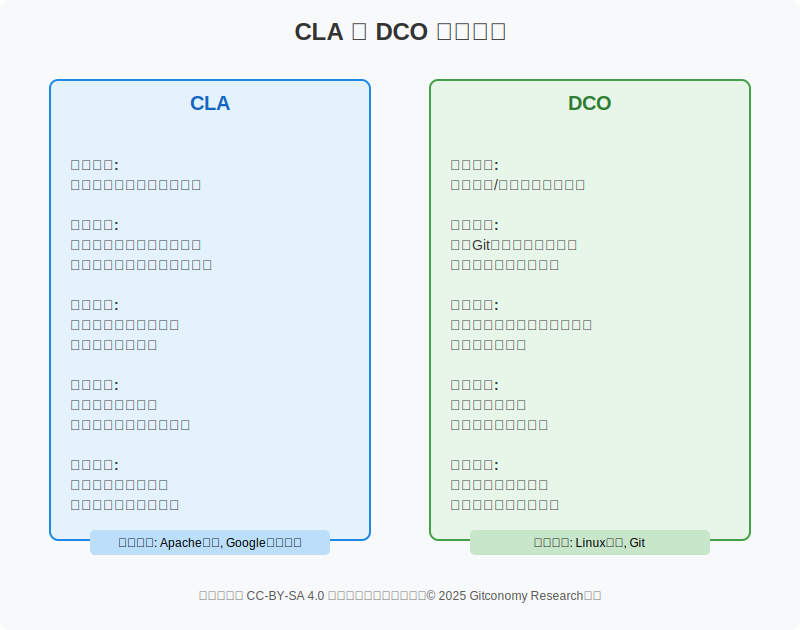

*图：CLA和DCO的比较*

---

💡 **互动环节：入站贡献机制辨析**

**选择题1**：对于一个由社区驱动、希望最大化参与度的项目（如Linux内核），通常会选择哪种入站贡献机制？

A. CLA (贡献者许可协议)  
B. DCO (开发者原创声明)  
C. 两种都必须使用  
D. 无需任何入站机制  

**选择题2**： 某开源项目由一个基金会管理，该基金会希望未来有可能将项目许可证从GPLv2升级到GPLv3。为了确保拥有这样做的法律权利，该项目应采用哪种入站贡献机制？

A. CLA (贡献者许可协议)  
B. DCO (开发者原创声明)  
C. 任何一种都可以  
D. 无法实现  

**问答题**： 为什么说CLA和DCO的选择，深刻地揭示了一个项目的核心价值观？

---

## 第三部分 许可证选择与应用的框架指南

一个成功的开源项目需要一个逻辑自洽、目标明确的许可框架。这意味着项目的入站贡献政策必须与其出站许可证、社区目标和商业战略协同一致。这是一项具有深远影响的战略决策。它不仅决定了项目的法律地位，更将塑造其社区文化、生态系统结构和商业潜力。对于学生和开发者而言，掌握如何进行这项决策，并在实践中正确地应用和遵守许可证，是一项核心的专业技能。

---

###  2.7 开源许可证选择决策框架

`进阶选读`

#### 2.7.1 协调入站政策、出站许可与项目目标

在面对上百种 OSI 批准的许可证时，开发者很容易感到困惑。为了做出明智的选择，应当从一系列战略性问题出发，系统性地进行考量：

| 决策维度 | 考量与建议  |
| :--- | :--- |
| **项目的核心目标是什么？** | <ul><li>**追求最广泛的采纳**：选择宽松型许可证 (如 MIT, Apache 2.0)，允许商业闭源项目使用。<li>**构建共享的数字公地**：选择强Copyleft许可证 (如 GPLv3)，确保衍生品保持开源。</ul> |
| **希望吸引什么样的社区？** | <ul><li>**企业开发者和大型公司**：选择商业友好、有明确专利授权的许可证 (如 Apache 2.0)。<li>**个人爱好者和自由软件倡导者**：选择能更好保护用户自由的许可证 (如 GPL系列)。</ul> |
| **未来的商业化路径是怎样的？** | <ul><li>**开放核心/销售专有插件**：必须选择宽松型许可证。<li>**双重许可模式**：免费版需使用强Copyleft许可证 (如 GPL, AGPL) 以创造商业版需求。<li>**通过服务和支持盈利**：许可证选择灵活，GPL和宽松型均可。</ul> |
| **项目依赖了哪些第三方代码？** | <ul><li>**关键法律问题：** 必须仔细审查所有依赖库的许可证，确保所选许可证与之**兼容**，否则项目可能无法合法分发。</ul> |
| **专利问题有多重要？核心概念快速问答** | <ul><li>如果项目涉及专利技术或希望为用户提供更强的法律保护，应选择包含**明确专利授权和报复条款**的许可证 (如 Apache 2.0, GPLv3, MPL 2.0)。</ul> |
| **是否需要未来的灵活性？** | <ul><li>如果预见到未来可能需要更改许可证，建议在项目早期就要求贡献者签署**贡献者许可协议 (CLA)**。 </ul>|

表5：开源许可证选择决策选择框架

所以，入站与出站策略必须协同工作。例如，一个计划采用双重许可商业模式的项目，其免费版采用AGPL（强著佐权出站许可），同时销售商业版。为了能够合法地销售商业版（即在不同于AGPL的条款下授权代码），项目所有者必须拥有对所有代码的再许可权。这就要求其入站政策必须是能够赋予其这种权利的CLA（例如，通过版权转让或授予再许可权的许可模式）。在这种情况下，采用DCO作为入站政策是行不通的，因为它无法提供必要的再许可权。

反之，一个采用MIT（宽松型出站许可）、目标是构建一个庞大爱好者社区的项目，如果强制要求贡献者签署复杂的CLA，将会严重阻碍社区的参与和发展。对于这样的项目，DCO的低门槛特性是其天然的选择。

#### 2.7.2 许可证矩阵导航：主流许可证对比分析

为了将上述决策框架付诸实践，以下表格对当前最重要和最常见的主流开源许可证进行了详细的比较。这张表格旨在成为一个快速参考工具，帮助开发者理解不同许可证在关键维度上的差异，从而做出更明智的选择。

| Open Source Licenses (开源许可证) | Abbreviation (简称) | 商用 | 分发 | 使用商标 | 源码公开 | 版权声明 | 声明变更 | 相同协议 (Copyleft) | 专利授权 | 无担保 | 无责任 |
| :--- | :--- | :--- | :--- | :--- | :--- | :--- | :--- | :--- | :--- | :--- | :--- |
| **GNU Affero General Public License version 3** | AGPL-3.0 | Yes | Yes | / | Yes | Yes | Yes | Yes, even Saas use | Yes | Yes | Yes |
| **GNU General Public License version 2** | GPL-2.0 | Yes | / | / | Yes | Yes | Yes | Yes | Yes | Yes | Yes |
| **GNU General Public License version 3** | GPL-3.0 | Yes | Yes | / | Yes | Yes | Yes | Yes | Yes | Yes | Yes |
| **GNU Lesser General Public License version 3**| LGPL-3.0 | Yes | Yes | / | Yes | Yes | Yes | Yes, but not for libraries call | Yes, or GPL | Yes | Yes |
| **Eclipse Public License version 2.0** | EPL-2.0 | Yes | Yes | / | Yes | Yes | Yes | Yes | Yes, or GPL | Yes | Yes |
| **Mozilla Public License 2.0** | MPL-2.0 | Yes | Yes | No | Yes | Yes | Yes | Yes | Yes, for source form distribution| Yes | Yes |
| **Apache License, Version 2.0** | Apache-2.0 | Yes | Yes | No | Yes | Yes | Yes | / | Yes | Yes | Yes |
| **Mulan Permissive Software License v2** | MulanPSL - 2.0| Yes | Yes | No | Yes | Yes | Yes | / | / | Yes | Yes |
| **The 3-Clause BSD License** | BSD-3-Clause | Yes | / | No | Yes | Yes | / | / | / | Yes | Yes |
| **The 2-Clause BSD License** | BSD-2-Clause | Yes | / | / | Yes | Yes | / | / | / | Yes | Yes |
| **The MIT License** | MIT | Yes | / | / | Yes | Yes | / | / | / | Yes | Yes |

表6： 主流开源软件许可证比较汇总

#### 2.7.3 不兼容的风险

许可证兼容性是指将多个不同许可证下的代码组合到一个新作品中，而不会违反任何一个原始许可证的条款 34。不兼容是开源合规中最常见也是最严重的风险之一。

不兼容问题的核心通常源于强 Copyleft 许可证（如 GPL）的互惠条款。GPL 要求整个衍生作品都必须以 GPL 发布，这一要求会与许多其他许可证的条款产生冲突 。

> 一个典型的冲突场景
>
>假设一个开发者正在构建一个新的互动环节互动环节应用程序，并希望使用非常宽松的 MIT 许可证发布，以鼓励商业使用。在开发过程中，他集成了一个功能强大的、采用 GPL 许可的库。此时，法律冲突便产生了：
> - 开发者的意图：整个应用采用 MIT 许可。
> - GPL 的要求：由于应用链接了GPL库，成为了该库的“衍生作品”，因此整个应用在分发时必须采用 GPL 许可。
>   
> 这两个要求是互斥的。开发者无法同时满足。最终，GPL 的“传染性”会覆盖 MIT 的宽松性，开发者如果想合法地分发这个应用，就必须放弃初衷，将整个项目置于 GPL 之下。
>
>正是为了解决这类问题，LGPL（Lesser/Library GPL）[16] 应运而生。LGPL 的 Copyleft 效力被限制在库本身。它允许专有软件通过“链接”（linking）的方式使用 LGPL 许可的库，而专有软件本身无需开源。只有对 LGPL 库本身的修改才需要以 LGPL 发布 9。这使得 LGPL 成为了一互惠型许可和宽松型许可比较座重要的桥梁，连接了严格的自由软件世界和商业专有软件世界，让开源库能被更广泛的生态系统所采用 。

#### 2.7.4 实践与持续合规

为项目选择并应用许可证只是第一步，确保长期合规是一个持续的过程，尤其是在企业环境中。

在实践中，为项目应用许可证的标准化流程非常简单。开发者只需将所选许可证的完整文本内容，放入一个位于项目代码仓库根目录的、名为 LICENSE 或 LICENSE.md 的文件中。诸如 GitHub 这样的代码托管平台已经将此流程自动化，提供了许可证模板选择工具，可以在创建仓库时一键生成标准的许可证文件。

对于企业而言，开源合规是一项系统性工程，远不止添加一个文件那么简单。它涉及到：

1. 法务部门需要制定明确的政策，定义哪些类型的许可证是允许使用的，哪些是受限制的互动环节，哪些是禁止的 。
2. 依赖扫描与软件物料清单（SBOM）：现代软件开发严重依赖第三方库。企业必须使用自动化工具（如 FOSSA, Snyk, FOSSology）对代码库进行持续扫描，以识别所有直接和间接的依赖项及其许可证。扫描结果通常会生成一份“软件物料清单”（Software Bill of Materials, SBOM），详细列出软件包含的所有组件、版本和许可证信息，这是进行合规审计和风险管理的基础。
3. 持续监控：许可证合规不是一次性的检查，而是一个贯穿软件开发生命周期的持续过程。因为项目的依赖关系会不断变化，新的依赖可能引入不合规的许可证。

 

从创作者的角度来看，许可证的选择也是一种风险管理。宽松型许可证为使用者提供了极大的便利，降低了他们的合规风险，但这增加了创作者的代码被商业竞争对手无偿利用而无须回馈的风险。相反，强 Copyleft 许可证通过法律手段强制互惠，降低了创作者被“搭便车”的风险，但却增加了使用者的合规负担，可能会因此劝退一部分潜在的商业用户。因此，许可证的选择最终是在“被利用的风险”和“采纳率降低的风险”之间进行权衡的战略决策。

#### 2.7.5 出站与入站策略的战略协同

一个由入站和出站策略共同构成的许可框架，远非一系列法律样板文件，而是开源项目最根本的“宪法”。它定义了公民（社区用户）的权利，规定了移民（贡献）的规则，构建了政府（治理）的结构，并确立了商业（商业模式）的准则。这套策略构成了开源项目知识产权（IP）治理的核心，它像一个双向的法律阀门，精确地控制着代码的流入与流出，从而决定了项目的性质、社区文化和商业模式。

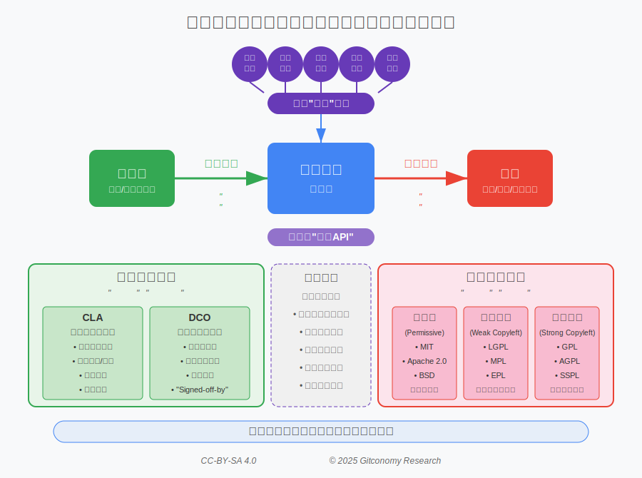

*图：开源项目的出站与入站许可整体框架的协同*

可以将出站与入站策略理解为项目的“法律应用程序接口（API）”：

1. **出站策略：项目的“公开声明”与“产品包装”**

 

出站策略决定了项目果如何被外部世界使用的和下游用户的权利。它通过出站许可证（Outbound License） 来实现，回答了“你可以用我的代码做什么？”这个问题。

出站策略的目标：

- 最大化采用 (Permissive / 宽松型许可): 如 MIT, Apache 2.0。允许用户几乎无限制地使用、修改和分发，包括在闭源商业产品中使用，以此吸引最广泛的用户和商业生态。
- 强制代码共享 (Copyleft / 著佐权许可): 如 GPLv2, GPLv3。要求衍生作品也必须以相同的许可证开源，以此确保代码的自由和开放性得以延续，构建一个共享代码的社区。
- 专利风险规避: 如 Apache 2.0，其明确的专利授权条款可以保护用户和贡献者免受专利诉讼的困扰，这对于吸引企业参与至关重要。

2. **入站策略：项目的“贡献之门”与“法律防火墙”**

 

入站策略是项目法律安全和长期发展的基石，定义了项目如何接收外部贡献。它通过贡献者协议来实现，回答了“我该如何向你贡献代码？”这个问题。

入站策略的目标：

- 确保法律清晰性与安全性 (CLA / 贡献者许可协议): 要求贡献者签署一份法律合同，授予项目方明确、宽泛的版权和专利许可。这为项目管理者（特别是企业或基金会）提供了高度的法律确定性，便于统一管理IP，甚至在未来更换许可证。
- 降低贡献门槛 (DCO / 开发者原创声明): 无需签署复杂合同，贡献者只需在每次提交中附加一行“Signed-off-by”声明，证明代码是其原创且有权贡献。这极大地降低了参与门槛，对建立一个充满活力的、去中心化的开发者社区非常友好。

出站和入站策略二者必须协同运作。核心原则是：**项目从贡献者那里获得的入站权利，必须足以支撑它向用户做出的出站许可承诺。**

基于上述分析，可以为不同类型的开源项目勾勒出参考的许可框架蓝图。

| 项目类型 | 出站许可 | 入站贡献 | 战略逻辑 |
| :--- | :--- | :--- | :--- |
| **企业“开放核心”项目** *(例如: HashiCorp, Elastic)* | 对核心部分采用宽松型许可证 (Apache 2.0)。 | 公司贡献者许可协议 (CLA)，采用版权许可授予模式，并包含再许可权。 | 宽松的出站许可鼓励广泛采用。CLA至关重要，因为它赋予公司明确的法律权利，可以将社区贡献整合到其专有的企业版产品中，而无任何法律模糊地带。 |
| **社区驱动的基础设施项目** *(例如: Linux 内核, 众多个人发起的项目)* | 强著佐权 (GPLv2) 或宽松型 (MIT)。 | 开发者原创声明 (DCO)。 | 首要目标是最大化社区参与和分布式开发。DCO提供了最低的参与门槛，有助于培育一个充满活力的“市集”式贡献者生态。 |
| **中立基金会“大帐篷”项目** *(例如: Kubernetes, CNCF/Linux基金会下的项目)* | 宽松型 (Apache 2.0)。 | 公司贡献者许可协议 (CLA)，采用版权许可授予模式，但不包含广泛的再许可权。 | 包含专利条款的Apache 2.0许可证对于为相互竞争的公司参与者创造一个安全的法律“避风港”至关重要。CLA则为所有参与方提供了法律确定性。采用许可授予而非所有权转让模式是关键，因为没有任何一个成员公司会同意将其核心知识产权转让给一个其竞争对手也是成员的基金会。这一框架确保了项目的中立性，防止任何单一实体控制项目的知识产权。 |

*表7：不同类型开源项目的许可证框架原型参考*

中国顶级开源项目的许可证策略和治理模式与本土实践相结合的案例分析：

>**生态系统构建：华为OpenHarmony的多许可证策略案例分析**
>
>1. 战略背景： OpenHarmony并非华为的商业产品，而是由华为贡献主要代码，并捐赠给中立的**开放原子开源基金会（OpenAtom Foundation）**进行孵化和运营的开源项目 。此举的核心战略目标是在复杂的地缘政治背景下，通过中立的基金会模式，构建一个广泛、协作、自主的智能终端操作系统生态系统，减少对单一外国技术的依赖 。
>
>2. 许可策略——务实的组合拳： OpenHarmony没有采用单一许可证，而是根据不同组件的技术特性和生态目标，采取了务实的多许可证策略 ：
>
>- Apache License 2.0： 用于绝大多数用户态代码库。这是一个明确的商业友好信号，旨在吸引商业公司和设备制造商参与生态建设，因为它允许他们在OpenHarmony的基础上构建自己的商业产品而无需开源其增值部分 。
>- 3-clause BSD License： 用于LiteOS内核部分。这是一个非常宽松的许可证，适用于资源受限的物联网设备，为设备制造商提供了最大限度的定制自由度 。
>- GNU GPL v2.0： 用于Linux内核互动环节部分。这主要是为了保持与上游Linux内核社区的法律兼容性，确保可以合法地使用和修改Linux内核代码 。
>
>3. 入站贡献策略： OpenHarmony采用**DCO（开发者原创声明）**机制，贡献者只需在每次提交时附带Signed-off-by声明 。这是一种低门槛、对开发者友好的方式，旨在最大限度地降低贡献摩擦，鼓励更广泛的社区参与，这与其构建庞大生态系统的核心目标完全一致。

>**社区中立性：阿里龙蜥社区(OpenAnolis)的治理与许可模式案例分析**
>
>1. 战略背景： 龙蜥社区（OpenAnolis）的诞生源于CentOS项目战略调整后，企业市场对一个长期稳定、由社区驱动的企业级Linux发行版的迫切需求 。其核心目标是联合产业链上下游伙伴，打造一个中立、开放、自主的操作系统根社区。
>
>2. 治理模式——多方共治： 龙蜥社区采用了典型的基金会式治理架构，以确保其中立性和开放性。
> - 理事会 (Council): 由包括阿里云、统信软件、浪潮、Intel、Arm、龙芯在内的24家国内外行业领军企业组成，共同决定社区的战略方向 。
>- 技术委员会 (Technical Committee) 与 运营委员会 (Operation Committee): 负责技术路线和社区日常运营的决策 。
>- 特别兴趣小组 (SIGs): 围绕特定技术领域（如内核、编译器、安全）或芯片架构（如LoongArch, RISC-V）组织日常的开发和维护工作 。
>
>3. 许可模式——鼓励商业化： 作为一个Linux发行版，龙蜥操作系统包含了数千个上游开源软件包，因此其整体遵循多种开源许可证（主要是GPL系列）。但其社区的核心政策是完全开放和鼓励商业化。社区官方明确表示，任何企业或个人都可以自由下载龙蜥操作系统的源码并发行自己的商业版本，无需向社区申请任何授权许可 。此外，龙蜥社区已通过OpenChain ISO/IEC 5230国际标准认证，这表明其在开源许可证合规管理方面达到了国际先进水平，为合作伙伴提供了强大的法律保障 。互动环节互动环节

>**全球化竞争：百度飞桨(PaddlePaddle)选择Apache 2.0的深层原因分析**
>
>1. 战略背景： 飞桨（PaddlePaddle）是百度自主研发并开源的深度学习平台，其直接在全球市场上与Google的TensorFlow和Meta的PyTorch等框架竞争 。要在这样的竞争格局中胜出，最大限度地扩大开发者和企业用户基础是其核心战略。
>
>2. 选择Apache 2.0的战略逻辑：
>- 商业友好，最大化采用率： Apache 2.0是一个宽松型许可证，它允许企业将飞桨框架集成到自己的专有AI应用或云服务中，而无需公开其核心商业代码。这是吸引商业公司（尤其是大型企业）采纳该框架的关键，因为这保护了它们的商业秘密 。
>- 明确的专利授权，降低法律风险： 对于AI这样一个技术密集且专利风险较高的领域，Apache 2.0明确授予用户一份来自所有贡献者的专利许可，并包含专利报复条款。这为企业用户提供了强大的法律保护，使它们可以放心地在飞桨的基础上进行创新，而不必担心来自百度或其他贡献者的专利诉讼 。
>- 建立行业信任： Apache 2.0是一个广为人知、备受尊重的行业标准许可证。选择它，本身就是向全球开发者和企业法务部门发出的一个信号：飞桨是一个开放、公平、法律关系清晰的平台，可以安全地用于商业目的 。
>
>综上所述，百度为飞桨选择Apache 2.0，是一项深思熟虑的商业战略决策，旨在通过提供最大的法律确定性和商业灵活性，来赢得全球AI生态系统的竞争。

---

💡 **互动环节：核心概念快速问答**

**选择题1**： 华为OpenHarmony采用Apache 2.0、BSD、GPLv2等多种许可证的组合策略，其主要原因是什么？

A.	为了让许可证体系看起来更复杂。
B.	针对不同技术组件和生态目标，采取务实的、最适合的许可方式。
C. 这是所有操作系统都必须遵循的标准组合。
D. 为了与上游Linux社区保持完全一致。

**选择题2**： 百度为其深度学习平台飞桨（PaddlePaddle）选择Apache 2.0许可证，最重要的战略考量是什么？

A. 因为Apache 2.0是唯一允许AI项目使用的许可证。
B.	为了强制所有使用飞桨的公司都必须开源他们的代码。
C. 因为这是百度公司所有开源项目的统一要求。
D.在全球市场与TensorFlow等对手竞争时，通过商业友好和专利保护来最大化开发者和企业采用率。

3. **问答题**： 龙蜥社区（OpenAnolis）强调其中立性，并允许任何人发行商业版而无需授权。这种策略对其社区生态有什么好处？

---

## 第四部分 超越软件的许可证

开源许可证的原则和法律模式被证明是如此强大和灵活，以至于其影响力早已超越了纯软件领域。随着技术的发展，协作创新的需求出现在硬件、数据乃至人工智能等新领域。在每个领域，开源的核心理念都在被重新审视和调整，以适应其独特的法律和技术挑战，从而催生了新一代的开源许可证。

---

### 2.8 新一代开源许可证类型

#### 2.8.1 开源硬件（OSH）许可：从蓝图到物理实体

`进阶选读`

1. **定义开源硬件（OSH）**

开源硬件（Open Source Hardware, OSH）指的是物理对象的设计规范，其许可方式允许任何人学习、修改、制造和分发这些设计及其所衍生的实体产品[17]。这一定义由开源硬件社群于2010年确立，并由非营利组织[开源硬件协会](https://oshwa.org/)（Open Source Hardware Association, OSHWA）负责维护。值得强调的是，“硬件”一词的范畴远不止于电子设备，它涵盖了任何有形的物理制品，包括机械、生物材料、纺织品乃至建筑结构。

OSH的核心在于其“源文件”的可及性。与软件的纯文本源代码不同，硬件的“源文件”是一个复杂的技术文档集合，是复现物理对象所必需的全部信息。这通常包括电路原理图、设计蓝图、逻辑设计文件、计算机辅助设计（CAD）文件等。一个完善的OSH项目不仅应提供用于直接制造的衍生文件（如3D打印的.stl文件），更关键的是要提供可供修改的原始设计文件（如CAD源文件）。这些原始文件是实现修改和创新的基础，尽管它们可能需要特定的专有软件和专业技能才能操作。

2. **专利法的主导地位：与软件许可的根本区别**

开源硬件与开源软件在法律基础上存在根本性差异，这种差异源于二者截然不同的保护对象。软件许可主要建立在版权法之上，保护的是代码作为“文学作品”的表达形式。然而，对于硬件而言，法律框架更为复杂，呈现出版权与专利法的双重结构。

- 版权的角色：版权法保护的是硬件的“设计文档”，即原理图、CAD文件等“源文件”的表达。因此，版权许可可以有效地规制这些设计文档的复制、修改和分发行为。互惠型许可vs宽松型许可
- 专利的角色：与版权不同，专利法保护的是功能性发明本身，即物理设备的工作原理和实现方式。因此，专利许可控制的是根据设计文档制造、使用和销售物理产品的权利。这一点至关重要，因为许多硬件设计本身可能因缺乏独创性表达而无法获得版权保护，使得专利法成为保护和授权硬件创新的更强有力的法律工具。

这种法律上的二元性意味着OSH许可在本质上与软件许可不同。它们必须同时处理版权和专利权问题，并且在实践中更依赖专利法来达成其开放共享的目标。许多专为硬件设计的许可协议都包含了明确的专利授权条款，以确保下游用户在制造和使用硬件时不会受到专利侵权的威胁。

3. **CERN开放硬件许可（OHL）家族**

[欧洲核子研究中心](https://home.cern/)（CERN）开发的开放硬件许可（CERN Open Hardware Licence, CERN OHL被公认为目前最现代化、最完善的OSH许可体系。它最初是为了促进实验物理学领域设计师之间的协作而创建，现已发展成为广受认可的国际标准。其最新版本2.0已获得开源促进会（OSI）的批准，并精巧地分化为三种战略性变体，以适应不同的项目需求和开放策略。[18]

- **CERN-OHL-P （Permissive，宽松型）**：此变体是三种许可中限制最少的。其核心要求是保留声明。任何使用或基于该硬件进行再开发的用户，都必须完整保留原始的版权、致谢和商标声明，以及免责声明。除此之外，用户拥有最大限度的自由，包括可以基于开放设计创造并分发闭源的、专有的衍生硬件产品。对于旨在实现最广泛的行业采纳、鼓励商业集成和最大化市场渗透率的项目而言，宽松型许可是最优的战略选择 。

- **CERN-OHL-W （Weakly Reciprocal），弱互惠型)**：此变体引入了“弱版”的Copyleft（著佐权）概念。它在宽松型的基础上增加了一项互惠条件：任何对许可组件本身的修改，其源文件也必须在相同或兼容的开放许可下发布。然而，这种互惠义务是“弱”的，因为它不延申至包含该组件的更大型系统。一个经典的例子可以阐明这一点：假设一个开源的机器人眼窝模块采用了CERN-OHL-W许可。如果有人改进了这个眼窝模块的设计，那么改一个由入站和出站策略共同构成的许可框架，远非一系列法律样板文件，而是开源项目最根本的“宪法”。它定义了公民（用户）的权利，规定了移民（贡献）的规则，构建了政府（治理）的结构，并确立了商业（商业模式）的准则。
进后的设计源文件也必须开源。但是，如果他们将这个开源眼窝模块安装到一个专有的“巨型战斗机器人”中，则无需将整个机器人的设计全部开源 。这种许可为创作者提供了一种精妙的平衡策略：既能确保其核心设计的迭代和改进能够回馈社区，又不会因过于严格的传染性而阻碍其组件被大型商业项目集成。

- **CERN-OHL-S （Strongly Reciprocal，强互惠型）**：此变体是硬件领域的“强版”Copyleft许可，具有最强的“传染性”。其互惠义务会延申至任何集成了该许可组件的更大型硬件系统。沿用上述例子，如果机器人眼窝模块采用的是CERN-OHL-S许可，那么任何集成了该眼窝的“巨型战斗机器人”的完整设计源文件，都必须在CERN-OHL-S许可下公开发布。这是最具限制性的变体，适用于那些核心目标是确保基于其初始工作构建的整个硬件生态系统都保持完全开放的项目。

4. **其他开源硬件许可**

除了CERN-OHL，TAPR和Solderpad也是常见的两种开源硬件学习。

**TAPR OHL** 是最早的开源硬件许可协议之一，其设计理念深受软件领域 GNU 通用公共许可证 (GPL) 的影响：

- 核心性质：它是一种“Copyleft”或许可证，旨在确保硬件设计及其衍生作品保持开放。
- 主要条款：协议要求，任何基于 TAPR OHL 许可的设计文件所创作的衍生作品，在分发时也必须采用 TAPR OHL 协议。
- 适用目标:：适用于希望确保其硬件设计的所有后续修改和改进都能回馈社区、保持自由流通的项目。

**Solderpad OHL**许可协议是基于广受欢迎的 Apache License 2.0 修改而来，旨在为硬件设计提供一个法律上清晰且商业友好的宽松型许可：

- 核心性质：它是一种“宽松型” (Permissive) 许可协议，最大限度地减少了对使用者的限制。
- 主要条款：协议允许任何人自由使用、修改、分发设计文件，并且不要求衍生作品以相同的许可发布。这意味着使用者可以将设计集成到自己的专有（闭源）商业产品中。
- 关键特性：它继承了 Apache 2.0 明确的专利授权和专利报复条款，为商业公司使用和贡献硬件设计提供了更强的法律确定性和保护。

5. **实践意义与挑战**

尽管CERN-OHL等现代OSH许可在法律上日趋成熟，但其在实践中的可执行性相较于软件许可仍面临更多挑战。这背后的原因在于，硬件领域的“衍生作品”界定比软件更为模糊，且执行专利条款的法律成本和复杂性远高于版权侵权诉讼。这种潜在的“可执行性差距”意味着，OSH生态系统的健康运行在很大程度上不仅仅依赖于法律文本的约束力。

实际上，社区规范、共享原则和创客运动的协作精神，在确保合规性方面扮演着比法律威胁更为重要的角色。像OSHWA这样的组织通过其认证项目和社区建设活动，建立了一种基于声誉和相互尊重的“社会契约” 。在这个体系中，一个项目或公司是否遵守开放原则，往往由其在社区中的信誉和地位来评判，而非单纯的法庭判决。因此，对于希望参与开源硬件领域的商业实体而言，仅仅采取一种法律合规的被动姿态是远远不够的。它们必须积极融入社区，理解并尊重其内在的文化规范，才能真正获得成功。法律许可在此更像是一种意图的声明和道德的基石开源软件许可证的类型，而社区本身才是其最终的执行和裁决机构。

此外，CERN-OHL许可体系所展现的战略模块化，也为硬件行业提供了一种独特的、高度务实的混合开发模式。特别是弱互惠型的CERN-OHL-W许可，它深刻地反映了现代硬件设计通常是模块化的现实。开发者可以利用它来开源一个核心组件（如一个处理器模块或传感器），确保对该组件的改进能够惠及整个社区，同时又不会吓跑那些希望将此模块用于其大型专有产品中的商业合作伙伴。这种分层许可模式，允许在核心组件层面培育一个开放的生态系统，同时在最终产品层面保留专有创新的空间，实现了“两全其美”的商业策略，比软件领域通常的“宽松”或“强Copyleft”二元选择更为精细和灵活。

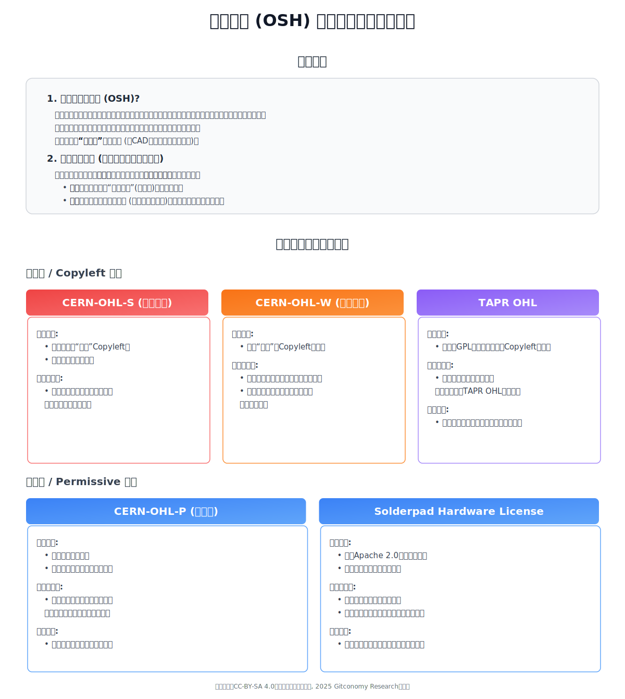

*图：开源硬件许可证总结*

#### 2.8.2 知识共享（Creative Commons）：文化与教育的许可框架

1. **核心理念：“保留部分权利”**

 

[知识共享](https://creativecommons.org/)（Creative Commons, CC）是一个非营利组织，它提供了一套免费、标准化的公共许可协议，旨在改变传统版权法下“保留所有权利”（All Rights Reserved）的默认状态。CC许可的核心理念是“保留部分权利”（Some Rights Reserved），它赋予创作者一种简单、标准化的方式，来明确授予公众使用其创造性作品的权限，从而极大地促进了全球范围内的知识、文化和教育资源的共享与传播 。这个框架使得从个人艺术家、教育工作者到大型机构，都能够轻松地参与到一个全球性的、可互操作的知识共享公地（Global Commons）的建设中。

2. **CC许可的构建模块（四要素）**

 

CC许可体系的精髓在于其模块化的设计。通过组合四个核心的许可元素，可以生成六种具有不同权限和限制的标准化许可协议。这种模块化设计是CC体系的关键创新，为创作者提供了极大的灵活性。

- **BY （Attribution，署名）**：这是所有六种主要CC许可的基石和强制性要求。它规定，任何用户在使用、分享或修改作品时，都必须以合理的方式对原作者进行署名，提供指向原始作品和许可协议的链接，并标明是否对原作进行了修改。这一要素保障了创作者最基本的精神权利——署名权。
- **SA （ShareAlike，相同方式共享）**：这是应用于创造性作品的“Copyleft”原则。它要求，如果用户对原始作品进行了混音、转换或再创作（即创作了衍生作品），那么该衍生作品必须在与原作相同或兼容的CC许可下进行分发。这一条款确保了基于共享作品的再创作成果能够继续留在知识公地中，实现知识的良性循环和累积 。
- **NC （NonCommercial，非商业性使用）**：此元素将作品的使用范围限制在非商业性目的之内。NC对“非商业性”的定义是“并非主要意图为了或指向商业优势或金钱报酬”。尽管定义明确，但在实践中，这一条款的边界有时会变得模糊，例如，一个接受捐赠的非营利组织、一个投放广告的个人博客，或是一个收取学费的大学课程中使用NC作品，都可能引发关于其是否构成商业性使用的争议。
- **ND （NoDerivatives，禁止演绎）**：此元素允许他人复制和分发作品，但必须保持作品的完整性，不得进行任何形式的修改、改编或再创作。如果用户希望进行翻译、混音等演绎行为，必须单独获得创作者的许可。这个条款对于那些希望确保其作品信息准确性、观点完整性不被歪曲的创作者（如学术论文、官方报告或某些艺术作品）来说非常有用 。

3. **六种标准许可与CC0公共领域贡献**

 

通过对上述四个元素的组合，形成了六种核心的CC许可协议，它们构成了一个从最开放到最严格的权限梯度。此外，CC还提供了一个重要的工具——CC0，用于将作品完全贡献给公共领域。[19]

- **CC BY （署名）**：这是最宽松的许可。它允许他人以任何目的（包括商业目的）对作品进行分发、修改和再创作，唯一的条件是必须署名原作者。
- **CC BY-SA （署名-相同方式共享）**：这是维基百科所使用的许可。它允许他人以任何目的对作品进行修改和再创作，但所有衍生作品都必须在相同的CC BY-SA许可下发布。
- **CC BY-NC （署名-非商业性使用）**：它允许他人进行修改和再创作，但仅限于非商业性目的。
- **CC BY-NC-SA （署名-非商业性使用-相同方式共享）**：它允许他人进行非商业性的修改和再创作，且衍生作品必须在相同的许可下发布。这是开放教育资源（OER）领域中兼容性最差但保护性最强的许可之一 。一个由入站和出站策略共同构成的许可框架，远非一系列法律样板文件，而是开源项目最根本的“宪法”。它定义了公民（用户）的权利，规定了移民（贡献）的规则，构建了政府（治理）的结构，并确立了商业（商业模式）的准则。

- **CC BY-ND （署名-禁止演绎）**：它允许他人以任何目的（包括商业目的）分发作品，但必须是未经修改的完整原作。
- **CC BY-NC-ND （署名-非商业性使用-禁止演绎）**：这是限制性最强的许可。它只允许他人进行非商业性的、对完整原作的分发。
- **CC0 （公共领域贡献）**：CC0并非一个许可协议，而是一个法律工具。创作者可以通过它，在法律允许的最大范围内，放弃其作品在全球范围内的所有版权及相关权利，将作品完全置于公共领域。这意味着任何人都可以不受任何限制地使用、修改、分发该作品，甚至无需署名。

为了给决策者提供一个清晰、直观的参考，下表对六种主要的CC许可进行了比较分析。这张表格的价值在于，它将复杂的法律条款提炼为关键的决策维度，使用户能够迅速地将自己的项目目标（例如，“我需要允许商业用途”或“我必须禁止修改”）与最合适的许可协议进行匹配，从而将抽象的法律概念转化为可操作的战略选择。

| 特性 / 许可协议 | CC BY | CC BY-SA | CC BY-NC | CC BY-NC-SA | CC BY-ND | CC BY-NC-ND |
| :--- | :--- | :--- | :--- | :--- | :--- | :--- |
| **允许商业性使用？** | 是 | 是 | 否 | 否 | 是 | 否 |
| **允许修改/演绎？** | 是 | 是 | 是 | 是 | 否 | 否 |
| **要求署名 (BY)？** | 是 | 是 | 是 | 是 | 是 | 是 |
| **要求相同方式共享 (SA)？**| 否 | 是 | 否 | 是 | 否 | 否 |
| **典型应用场景** | 学术出版、政府数据、开放获取内容 | 维基百科、合作性艺术项目 | 个人博客、教育资源、非营利组织内容 | 社区驱动的教育项目、有特定共享规范的创作 | 官方报告、艺术品数字复制品、需保持完整性的作品 | 个人摄影作品、需严格控制使用的艺术创作 |
一个由入站和出站策略共同构成的许可框架，远非一系列法律样板文件，而是开源项目最根本的“宪法”。它定义了公民（用户）的权利，规定了移民（贡献）的规则，构建了政府（治理）的结构，并确立了商业（商业模式）的准则。

表7：知识共享（Creative Commons）许可协议比较分析

4. **实践意义与挑战**

 

CC许可体系的出现，其深远影响不仅在于提供了法律工具，更在于它创造了一种标准化的、机器可读的法律通信语言。每个许可协议都包含三个层次：人类可读的“许可简本”（Deed）、律师可读的“法律文本”（Legal Code），以及机器可读的元数据[20]。这种三层结构使得搜索引擎、内容平台和各种应用程序能够自动识别、筛选和整合根据不同使用权限授权的内容。在CC出现之前，个人创作者若想在线上授予特定的使用权限，往往需要定制化的法律协议，这在实践中几乎不可行。CC通过标准化极大地降低了法律摩擦成本，为用户生成内容（UGC）、开放教育资源（OER）以及现代互联网的“混音文化”（Remix Culture）的爆发式增长提供了关键的催化剂，有效地实现了版权管理的民主化。

然而，在CC的模块化体系中，“非商业性使用”（NC）条款始终是一个充满哲学思辨和实践争议的焦点。尽管其初衷是保护创作者免受商业剥削，但“非商业性”的定义边界模糊，导致了法律上的不确定性，有时反而会阻碍知识的传播与再利用。此外，从开放运动的纯粹主义视角来看，NC条款与开源定义中“不歧视任何应用领域”的核心原则相悖。因此，选择是否附加NC条款，成为创作者在最大化传播范围与维持对商业化使用的控制权之间必须做出的重大战略权衡，这一决定将深刻影响其作品未来的生命力和可重用性。

#### 2.8.3 开放数据许可：解锁信息的价值

1. **数据的独特性法律地位**

 

数据之所以需要一套专门的许可协议，其根源在于其独特的法律地位，这与软件代码或创造性作品截然不同。首先，一个基本法律原则是，单个的事实本身不受版权保护。然而，当大量数据经过选择、协调和编排后形成一个数据库时，这个数据库的结构可以作为一种“汇编作品”受到版权法的保护。

更为关键的是，在欧盟及其他一些司法管辖区，存在一种名为“数据库特殊权利”的独立法律保护。这种权利并非保护数据库的创造性结构，而是保护在获取、验证或呈现数据库内容过程中所付出的实质性投资。这意味着，即使一个数据库的结构毫无创意，只要其创建者投入了大量资源进行数据收集，该数据库就可能受到保护，他人不得在未经许可的情况下提取或再利用其实质性部分。开放数据许可正是为了同时处理版权和数据库特殊权利这两种复杂的法律问题而专门设计的。

2. **开放数据共享（ODC）许可套件**

 

开放数据共享（Open Data Commons, ODC）是[开放知识基金会](https://okfn.org/en/)（Open Knowledge Foundation）旗下的项目，它提供了一套专门为数据和数据库设计的核心法律工具[21]。

开放数据库许可 (ODbL - Open Database License)是数据领域的“Copyleft”或“相同方式共享”许可。它允许用户自由地分享、修改和使用数据库，但附加了三个核心条件[22]：

- **署名（Attribute）**：必须对数据库的来源进行署名。
- **相同方式共享 （Share-Alike）**：如果公开发布了对该数据库的修改版本（衍生数据库），那么这个衍生数据库也必须在ODbL许可下提供。
- **保持开放 （Keep Open）**：如果分发的数据库或其衍生版本附加了技术保护措施（如DRM），则必须同时提供一个不受这些技术措施限制的版本。
全球最大的众包地理数据项目OpenStreetMap就采用了ODbL许可，以确保所有社区贡献者对地图数据的改进和扩展都能保持开放，并回馈给整个社区 21。
- **署名许可 （ODC-By - Attribution License）**：这是数据领域的宽松型、仅要求署名的许可。它允许用户为任何目的（包括商业目的）分享、修改和使用数据库，唯一的条件是必须署名原始数据来源 20。其法律精神和战略定位类似于软件领域的MIT许可或知识共享领域的CC BY许可。
- **公共领域贡献与许可 （PDDL - Public Domain Dedication and License）**：这是一个将数据库完全贡献到公共领域的法律工具。通过PDDL，数据库的创建者可以在法律允许的最大范围内，放弃其对数据库所拥有的所有版权和数据库特殊权利 22。

3. **关键区别：数据库 vs. 数据库内容**

 

ODC许可体系中一个至关重要且常常引起混淆的概念是：许可协议适用于数据库本身，但并不自动适用于数据库中的单个内容 20。数据库可以被看作一个“容器”，而其中的数据（如图片、文本、数值）是“内容物”。ODC框架允许许可发布者将“容器”（数据库结构和汇编）置于一种ODC许可之下，同时为“内容物”（单个数据记录）指定另一种完全不同的许可。例如，一个博物馆可以将其藏品数据库的结构以ODC-By许可发布，但数据库中的每张藏品图片可能仍受各自的版权限制或采用特定的CC许可。这种设计提供了高度的法律灵活性，但也要求下游用户必须保持警惕，在使用数据时需要同时核实并遵守数据库和其内容的双重许可要求。

4. **实践意义与挑战**

 

开放数据许可的出现，本身就是对全球法律体系碎片化的一种直接回应。数据库特殊权利在欧盟是一项强有力的保护，但在美国等司法管辖区则不存在。这意味着，一个简单的版权许可（如CC许可）可能不足以在欧洲完全授权一个数据库的自由使用。ODC许可正是为了解决这一跨国法律难题而设计的，其条款明确涵盖了版权和数据库特殊权利，从而为全球范围的数据共享提供了一个更为稳健和清晰的法律基础。这体现了开放运动的成熟，即认识到特定领域的法律现实需要特定领域的解决方案。对于任何旨在全球范围内共享的数据项目而言，采用ODbL或ODC-By这样专为数据设计的许可，是一种法律上的必需，而不仅仅是一种偏好。

然而，这种法律上的精确性也带来了实践中的复杂性。“容器”与“内容”许可的分离，虽然灵活，却给数据使用者带来了显著的合规负担。用户可能会下载一个以宽松的ODC-By许可发布的数据库，并误以为其中的所有内容都可以自由使用，结果却发现内部的单个文件（如图片或文档）受制于严格的CC BY-NC-ND许可。这种潜在的“许可陷阱”要求组织和个人在处理开放数据时，必须建立流程来对数据库层面和内容层面的许可进行双重验证。这种复杂性在一定程度上构成了对开放许可旨在实现的“无摩擦重用”的挑战。

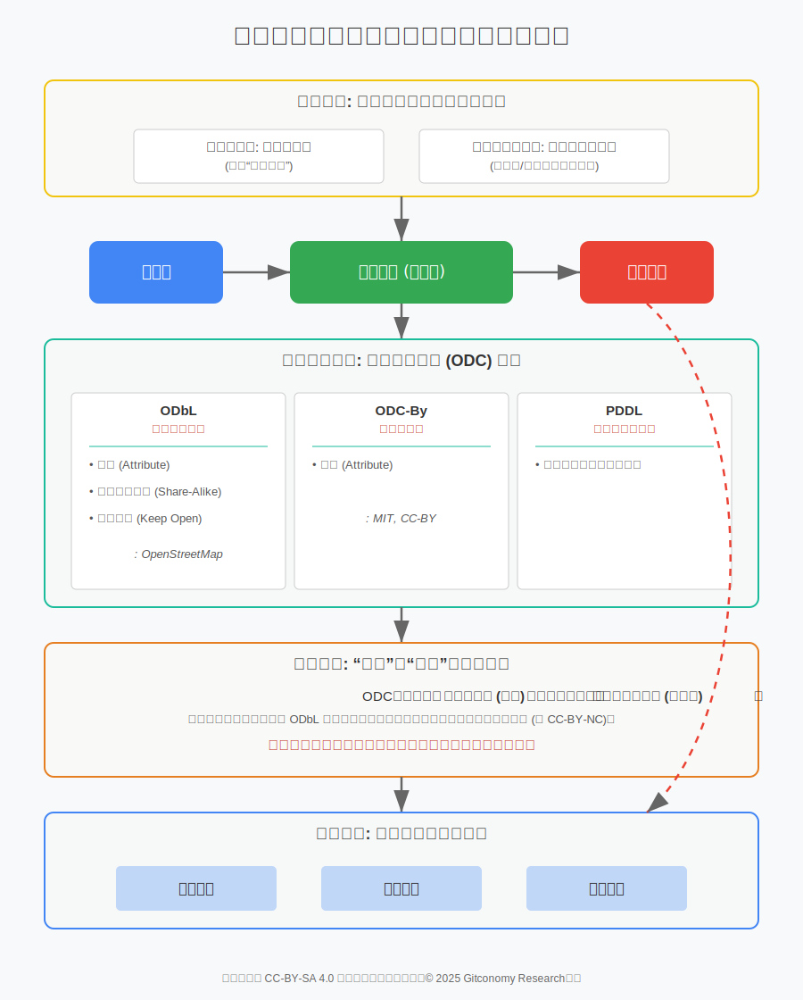

*图：开放数据许可证总结*

#### 2.8.4 开源人工智能（AI）许可：在新兴且争议的前沿中航行

1. **AI资产的三元结构：为何AI与众不同**

 

为人工智能系统进行许可是独一无二的复杂挑战，因为一个典型的AI系统并非单一的法律实体，而是由至少三种不同性质的资产构成的复合体，每种资产都具有其独特的知识产权属性[23]：

- 源代码 (Source Code)：用于定义模型架构、执行训练过程和进行推理的计算机代码。这部分资产无疑是受版权法保护的作品，完全适用于传统的开源软件许可协议，如Apache 2.0或MIT。
- 训练数据 (Training Data)：用于训练模型的海量数据集。这些数据本身就是一个复杂的集合，可能包含受版权保护的作品、受数据库权利保护的汇编、个人隐私信息以及其他第三方权利。其许可状态直接影响到最终生成模型的合法性。
- 模型参数 (Model Parameters / Weights)：训练过程的最终产物，本质上是一组庞大的数字（权重）。这组数字是否构成受版权保护的“作品”，是当前知识产权法领域一个激烈辩论的核心问题，许多法律专家对此持怀疑态度。如果模型权重本身不受版权保护，那么基于版权的许可协议对其的约束力将大打折扣。

2. **“负责任AI”（RAIL）许可模式**

 

面对AI技术的强大能力和潜在风险，“负责任AI许可”（Responsible AI Licenses, RAIL）[24] 是一种全新的许可类别，其核心特征是在传统的开放许可条款之外，增加了一系列基于使用场景的限制条款。例如，一份RAIL许可可能会明确禁止将模型用于以下场景：在公共场所进行大规模人脸识别监控、提供未经专业人员审核的医疗诊断建议，或用于生成和传播虚假信息。4. **实践意义与挑战**

其中，“开放且负责任AI许可”（OpenRAIL）[25] 是RAIL的一种变体，它试图在开放与责任之间寻求平衡。OpenRAIL通常会授予类似于Apache 2.0的广泛、宽松的权限（允许修改、分发、商业使用），但同时附加了上述的道德和安全使用限制。这些限制条款通常被设计成具有“病毒性”或“类26Copyleft”的特性，即要求任何基于该模型开发的衍生作品也必须遵守相同的使用限制，从而将责任链条向下游传递。

这种模式与传统的开源理念产生了深刻的法律和哲学冲突。开源促进会（OSI）制定的《开源定义》（Open Source Definition, OSD）中的第五条和第六条明确规定，开源许可不得歧视任何个人、团体或应用领域（fields of endeavor）28。OSD的哲学基础是用户自由的绝对性，即不能限制他人如何使用开源软件，即使是用于创作者不赞同的目的。RAIL许可则从根本上拒绝了这一绝对主义，认为对于像大型语言模型这样强大的技术，设置伦理护栏是必要的社会责任。

>案例研究：Meta Llama许可争议
>
>Meta公司为其Llama系列大型语言模型发布的“社区许可协议”是这一争议的焦点。尽管Meta将其宣传为“开源”，但该许可因包含多项不符合OSD的条款而受到OSI及众多社区专家的严厉批评，并被指责为“开放洗白”（open-washing）——即利用“开源”的正面品牌效应，却不遵守其核心原则。
>>
其问题条款主要包括：
>
>1. 商业使用限制：许可协议第二条明确规定，如果被许可方的服务在Llama模型发布日期的月活跃用户超过7亿，则必须向Meta申请商业许可，否则不得将模型用于商业目的。这直接违反了OSD第五条“不得歧视任何个人或团体”的规定，被广泛视为一种旨在限制其主要竞争对手（如谷歌、苹果等）使用Llama模型的反竞争条款。
>
>3. 可接受使用政策 (AUP)：许可协议通过引用的方式，强制用户遵守一份独立的《可接受使用政策》。该政策禁止将Llama模型用于一系列特定活动，如用于受严格监管的行业（如法律、医疗）、生成虚假信息、或用于任何非法活动。这些规定构成了对“应用领域”的限制，直接违反了OSD第六条。
>
>Meta的这种做法被认为开创了一个危险的先例，可能导致“开源”一词的含义被稀释，使得更多公司发布带有各种限制的“伪开源”许可，从而损害整个开源生态系统的互信基础。

3. **开源促进会（OSI）的前进之路：定义开源AI**

 

为应对这一挑战，OSI正在积极领导制定一个正式的《开源AI定义》，旨在为AI领域的“开放”建立一个清晰、严格的标准[26]。OSI提出的定义草案要求极高，它认为一个AI系统要被称为“开源”，必须提供所有必要的组件，使得具备相应技能的个人能够复现一个功能上基本等效的系统。这些组件包括：

- 数据信息：关于训练数据的充分详细信息，包括其来源、范围、特征、获取和处理方法。
- 代码：用于数据处理、模型训练和推理的完整源代码。
- 参数：模型权重本身。

*图：开放数据许可证总结*

至关重要的是，OSI坚持所有这些组件都必须在OSI批准的开源许可下发布，这意味着这些许可本身不能包含任何类似RAIL或Llama许可中的使用限制。

4. **实践意义与挑战**

 

AI领域的许可问题揭示了开放运动内部一场深刻的理念分裂。传统的开源精神，如OSD所体现的，坚持用户自由的绝对性。而以RAIL和Llama许可为代表的新兴思潮则认为，面对AI这样具有巨大潜力和潜在危险的技术，这种绝对主义已不再适用，必须将“负责任的使用”置于“绝对的自由”之上。这不仅是法律条款上的分歧，更是一场关于开放运动未来方向的根本性辩论。一方认为，任何形式的使用限制都是通往专有控制的滑坡；另一方则认为，在AI时代放弃使用限制是伦理上的不作为。

这场冲突的最终走向将定义“开放AI”的未来。我们很可能会看到市场的二元化：一条是遵循OSI定义的“无限制/真开源”路径，优先考虑创新速度和用户自由；另一条是“受限/负责任”路径，优先考虑安全和伦理。企业和开发者将面临一个重大的战略抉择：究竟要与哪个生态系统结盟？这个决定将带来深远的法律、商业和声誉影响。

此外，对AI“源”的定义本身的争议也使许可问题更加复杂化。对于软件，“源代码”概念清晰。但对于AI，究竟什么是“源”？仅仅是模型权重（可类比为“二进制可执行文件”）？还是必须包括训练数据和训练代码（真正的“源代码”）？Meta的Llama发布了权重，但未提供完整的训练数据和复现细节，因此被批评为“源码可用”（Source Available）而非“开源”。OSI的定义则采取了最严格的立场，要求提供复现所需的一切要素。这种对“源”的定义模糊性意味着，即使一个AI模型采用了完全符合OSI标准的许可协议，如果其训练过程不透明，社区也可能不认为它是真正的“开放”。这无疑将AI领域的开放门槛提升到了一个前所未有的高度，意味着真正的“开源AI”将是极其昂贵和难以实现的，可能只有资源最雄厚的组织才有能力去追求。因此，关于AI开放性的辩论，已远远超出了许可文本本身，延伸到了对整个创造过程透明度的要求。

---

💡 **互动环节：核心概念快速问答**
在完成本章学习后，你将不再仅仅是开源的使用者，而是能够理解其背后运转逻辑的思考者和潜在的贡献者。
**选择题1**： 开源硬件（OSH）许可与开源软件许可最根本的法律区别在于，OSH许可必须同时处理版权和哪种知识产权？

A. 商标权	 
B. 商业秘密  
C. 专利权  
D. 数据库特殊权利  

**选择题2**： 在知识共享（Creative Commons）许可体系中，哪个元素起到了类似GPL“著佐权”的作用，要求衍生作品必须以相同方式共享？

A. BY (署名)  
B. SA (ShareAlike)  
C. NC (NonCommercial)  
D. ND (NoDerivatives)  

**选择题3**： Meta的Llama许可协议因哪项条款而直接违反了开源定义（OSD）中“不得歧视任何个人或团体”的原则？

A. 对月活跃用户超过7亿的服务商进行商业使用限制  
B. 要求用户必须署名Meta  
C. 禁止将模型用于非法活动  
D. 要求衍生模型必须开源  

**问答题**： 负责任AI许可（RAIL）与传统开源定义（OSD）最核心的哲学冲突是什么？

**课堂辩论/论坛讨论**： 开源定义（OSD）是否应该被修订以适应人工智能带来的独特风险？还是说，RAIL许可应该被视为一个与“开源”完全不同的类别？这两种选择分别会对开源运动的未来产生怎样的长远影响？

---

## 第五部分 互动与讨论

💡 **场景化问题：如何为新项目选择许可**

**场景**：假设你和几位同伴创建了一个面向AI开发者的工具库，该库能显著简化3D模型的可视化。你们的目标是：

1. 吸引尽可能多的开发者（包括大型科技公司）使用和贡献；
2. 确保对核心库的任何改进都能回馈社区；
3. 你们未来可能希望围绕这个库提供付费的云服务或企业级支持。

 

**讨论题**：

1. 你会选择哪种治理模式来启动这个项目？是“仁慈的独裁者”模式，还是更民主的精英治理或理事会模式？为什么？
2. 在许可证方面，你会选择强著佐权（如GPL）、弱著佐权（如LGPL/MPL），还是宽松型（如MIT/Apache 2.0）？或者考虑双许可证模式？请论证你的选择如何平衡上述三个目标。
3. 你认为在这个场景下，最大的潜在冲突点是什么？是社区与商业化之一个由入站和出站策略共同构成的许可框架，远非一系列法律样板文件，而是开源项目最根本的“宪法”。它定义了公民（用户）的权利，规定了移民（贡献）的规则，构建了政府（治理）的结构，并确立了商业（商业模式）的准则。
间的矛盾，还是不同贡献者之间的技术路线分歧？你将如何设计协作流程来预防或解决这些冲突？

 

📚 **延伸阅读与拓展**

|书名|作者/主编|出版时间/出版社|主要特点与内容侧重|
|:---|:---|:---|:--|
在完成本章学习后，你将不再仅仅是开源的使用者，而是能够理解其背后运转逻辑的思考者和潜在的贡献者。-|
|《Understanding Open Source and Free Software Licensing》|Andrew M. St. Laurent|2004 O'Reilly Media|本书详细介绍了开源和自由软件的许可证，包括GPL、MIT、Apache等，适合开发者、法律顾问和项目经理阅读。|
|《开源规则——案例、许可证及开源组织》|张平（主编）|2022 知识产权出版社|聚焦开源软件和硬件领域的法律规则、案例（中国、美国、欧盟）及组织管理，案例丰富，涵盖著作权、专利、商标、许可证纠纷等。|作者是开源许可证领域的权威，书中深入探讨了开源许可证的法律背景和实践应用。|
|《商业开源：开源软件许可实用指南》|希瑟·米克（著）/刘伟（译）|2023 人民邮电出版社|译自美国开源法律专家著作，侧重开源许可的商业实践，解析GPL等常见许可证，探讨代码审计、专利诉讼、商标管理等实用话题|

🛠  **工具**

1. [ChooseALicense.com](https://choosealicense.com/)（网站）:GitHub官方提供的许可证选择工具，可以帮助开发者根据项目需求选择合适的开源许可证。
2. [TLDRLegal](https://www.tldrlegal.com/)：TLDRLegal提供了各种开源许可证的简洁解释，适合开发者快速理解不同许可证的条款。

---

## 总结

在本章中，我们将深入探讨一个核心论点：开源远不止是代码的开放，它是一个由我们的文化规范与法律工具共同构成的精密协作体系 。我们将揭示，开源许可证并非一份孤立的法律文本，而是项目的“宪法”，一项能决定其社区文化、商业模式乃至最终成败的顶层战略设计 。

我们可以通过两大维度构建对开源协作的认知框架：

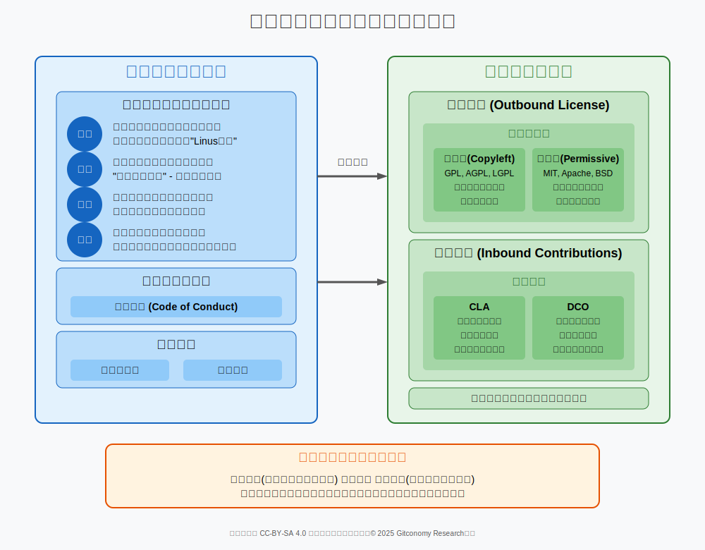

*图：开源协作的规则与法律框架总揽*

掌握本章的关键知识点后，学生将能够：

|学习维度|关联知识点|
|:---|:---|
|**知识点** |<ul><li>解释开源赖以运转的四大核心理念（开放、协作、共享、贡献）及其构成的价值闭环。<li>区分 “著佐权”（Copyleft）与“宽松型”（Permissive）两种主流许可证模式的根本差异。<li>定义版权、专利和商标这三大知识产权在开源许可证框架中所扮演的不同法律角色。<li>识别贡献者许可协议（CLA）与开发者原创声明（DCO）作为两种核心入站贡献机制的核心区别。</ul>|
|**能力点**|<ul><li>分析中国顶级开源项目（如OpenHarmony、龙蜥社区、飞桨）在许可证选择与社区治理上的战略考量。<li>运用一个结构化的决策框架，为一个假设的团队项目初步选择最合适的开源许可证。<li>起草一份符合社区最佳实践的、基础的CONTRIBUTING.md（贡献指南）和 Code of Conduct（行为准则）文件。</ul>|
|**素养点**|<ul><li>批判性地评估 不同许可证哲学（例如，GPL的强制共享 vs. Apache 2.0的商业友好）背后所蕴含的价值观冲突。<li>清晰地阐述在当代前沿争议（如Meta Llama等AI模型的“开放性”）中的核心论点与对立观点。<li>深刻地理解一个项目的许可证与治理模式如何从根本上塑造其社区文化、商业潜力和长期可持续性。</ul>|

---
## 附录A：教师教学指南

本指南旨在为教学团队提供支持，确保本章教学质量和课堂效果，实现教学标准化与灵活性。

1. **教学重点**

- 许可证的战略性选择： 核心是引导学生理解许可证选择并非纯粹的法律问题，而是一个关乎项目目标（最大化采用 vs. 保证回馈）的战略决策。应反复使用“宽松型 vs. 著佐权”的二元对立框架来强化这一概念。
- 本土案例的现实意义： 重点剖析OpenHarmony、龙蜥社区、飞桨的案例，让学生看到理论知识如何在中国顶级项目的实践中落地，增强课程的现实感和说服力。

 

2. **教学难点**

- GPL的“分发”触发条件 vs. AGPL的“网络使用”触发条件： 这是学生最容易混淆的概念。建议使用具体的SaaS服务（如在线文档编辑器）作为例子，清晰地说明为什么前者不触发GPL，而后者会触发AGPL。

- CLA与DCO的法律性质差异： 学生容易将两者都视为“同意贡献”，而忽略其根本区别。应强调CLA是项目方与贡献者之间的双向合同（项目方获得权利，贡献者获得保障），而DCO是贡献者对代码来源的单向声明（将法律责任置于贡献者自身）。

 

3. **常见问题 （FAQ）**

-  “我可以在我公司的内部工具中使用GPL许可的代码吗？这是否意味着我们公司的所有代码都必须开源？”
- “为什么像PingCAP这样的商业公司会选择开源其核心产品？这不是让竞争对手可以免费抄袭吗？”
-  “Llama 2的许可证对我个人或小型创业公司来说，算是‘开源’吗？”

 

4. **课堂活动设计方案：“许可证情景剧”**

目标： 在一个模拟的真实场景中，让学生通过角色扮演，亲身体验和应用许可证选择的决策过程。

- 时间： 45分钟。

- 流程：分组与场景发布 (5分钟): 将学生分为4-5人一组。向各组发布一个统一的项目场景，例如：“你们是一个初创团队，开发了一款创新的、基于AI的笔记整理应用。你们计划通过免费的社区版吸引用户，未来通过提供高级功能和云同步服务的Pro版盈利。”

- 角色分配 (5分钟): 每组内部分配角色卡：
	- CEO/创始人: 目标是快速占领市场，未来融资和盈利。倾向于商业友好的选择。
	- 首席技术官 (CTO): 目标是吸引最优秀的开发者加入社区，构建活跃的技术生态。倾向于开发者友好的选择。
	- 社区经理: 目标是建立一个共享、互助的社区文化，确保所有贡献都能回馈社区。倾向于强共享精神的选择。
	- 法务顾问: 目标是最大限度地降低公司的法律风险，确保知识产权清晰可控。倾向于最严格、最明确的法律工具。

- 小组讨论与决策 (20分钟): 各小组根据自己的角色进行内部辩论，必须就以下两点达成一致并陈述理由：
	- 出站许可证选择： 从MIT, Apache 2.0, GPLv3, AGPLv3中选择一个。
	- 入站贡献政策选择： 从CLA或DCO中选择一个。

- 成果展示与课堂讨论 (15分钟): 每组派代表上台，用5分钟陈述他们的最终决策和论证过程。教师引导全班进行提问和讨论，比较不同小组的选择差异及其背后的逻辑。

 

5. **讨论引导问题集**

- “对比华为OpenHarmony和阿里龙蜥社区的治理模式，你认为哪种模式更有利于吸引国际开发者参与？为什么？”
- “如果百度飞桨当初选择了GPLv3而不是Apache 2.0，你认为会对中国的AI生态产生什么影响？”
- “如果你们是OSI的决策委员会成员，你们会投票支持修改OSD以包含‘伦理使用限制’吗？请阐述投票的理由以及你们预见的后果。”
- “‘权力越大，责任越大’。你认为这句格言是否适用于开源软件的作者？他们是否有道德义务去阻止自己的代码被用于作恶？”

---
## 附录B：课程讲义术语表

- **AGPL (Affero通用公共许可证 - Affero General Public License)：** 为了填补GPL许可证中的“SaaS漏洞”而发布的许可证。它增加了一个关键条款：如果一个修改过的程序通过计算机网络提供交互式服务，它必须向所有使用该服务的用户提供其完整的源代码，这相当于将“通过网络提供服务”视同“分发”。

 - **Code of Conduct, CoC)行为准则：** 一份明确的文件，定义了社区成员之间可接受和不可接受的行为，并为处理冲突和骚扰提供了流程。

 - **The Cathedral and the Bazaar（大教堂与市集 ）**： 由埃里克·雷蒙（Eric S. Raymond）提出的、描绘两种截然不同软件开发图景的隐喻。 “大教堂模式”指由少数精英在封闭环境中精心构建软件的传统开发方式。 “市集模式”则指在完全公开的环境下，通过“发布早期，频繁发布”的原则，让全球用户都成为潜在的共同开发者的协作模式。

- **Contributor License Agreement, CLA（贡献者许可协议）**： 贡献者与项目之间签署的一份正式法律合同，用以明确贡献内容的知识产权授权条款。它为项目方提供了一个清晰、稳固的法律基础，使其能够放心地集成、使用、修改乃至再许可收到的贡献。

- **Copyleft（著佐权）**：一种巧妙利用版权强制力来确保自由传递的法律机制。它要求任何基于其代码修改或扩展后进行分发的作品，都必须同样采用相同或相似的许可证发布。

- **Developer Certificate of Origin, DCO（开发者原创声明）**：由Linux基金会为Linux内核项目引入的一种更为轻量级的入站贡献管理机制。它并非一份需要单独签署的文件，而是通过在每一次Git提交信息中加入一行`Signed-off-by`文本来完成的认证。
* **双重许可 (Dual-Licensing)**：一种商业模式，即一个软件产品会同时提供两种许可选项：一个通常是强Copyleft许可证（如GPL），另一个是商业许可证。对于那些希望将软件集成到自己的专有产品中且不想公开其商业代码的公司，就必须购买商业许可证。

- **Meritocracy（精英领导制）：** 开源社区普遍存在的核心治理原则，即个体的声誉和影响力并非源于其职位或资历，而是通过其贡献的质量和持续性在社区中逐步建立起来。

 - **GPL (通用公共许可证 - General Public License)：** 以GPL系列为代表的强著佐权（Strong Copyleft）许可证。其核心机制在于，任何基于其代码修改或扩展后进行分发的作品，都必须同样采用GPL许可证发布。

- **Heartbleed（心脏出血）：** 2014年爆发的严重安全漏洞事件，为全球约三分之二网络服务器提供加密功能的开源库OpenSSL被发现存在一个已潜伏两年的严重漏洞。该事件是“道路与桥梁”隐喻最惨痛的现实注脚。

-  **Linus's Law（Linus定律）：** 指“只要有足够多的眼球，所有bug都将无处遁形” ("Given enough eyeballs, all bugs are shallow.")。这一定律揭示了当知识不再被封闭时，集体智慧在提升质量和发现问题上的惊人效率。

- **Open Core（开放核心）：** 目前最主流的开源商业模式之一。在该模式下，公司会发布一个功能完备的“核心”产品并采用宽松型许可证开源，同时开发一些高级功能作为专有的“企业版”或付费插件进行销售。

- **Permissive License（宽松型许可证 ）：** 施加的限制最少，通常只要求在分发时保留原始的版权声明的许可证类型。它允许衍生作品以任何形式发布，包括完全闭源的商业产品，代表为MIT和Apache许可证。

- **Responsible AI Licenses, RAIL（负责任AI许可）：** 一种全新的许可类别，其核心特征是在传统的开放许可条款之外，增加了一系列基于使用场景的限制条款，例如禁止将模型用于大规模人脸识别监控或传播虚假信息。

- **Roads and Bridges（道路与桥梁）：** 由研究员纳迪亚·埃格巴尔(Nadia Eghbal)提出的一个新隐喻，指出许多核心开源项目就像我们日常生活中的道路和桥梁一样，构成了数字基础设施的底层基础，被无数商业公司依赖，但其维护工作却往往由少数志愿者承担且严重缺乏资金支持。

- **SaaS Loophole（SaaS漏洞）：** 也被称为“ASP漏洞”，指GPL的Copyleft机制依赖于“分发”这一关键触发条件，而公司可以通过在自己的服务器上运行修改后的GPL软件并以网络服务形式（SaaS）提供给用户，从而在技术上规避了“分发”行为，也就不必公开其修改后的源代码。

- **Software Bill of Materials, SBOM（软件物料清单）**： 一份详细列出软件包含的所有组件、版本和许可证信息的清单。它是企业使用自动化工具对代码库进行持续扫描的产物，是进行合规审计和风险管理的基础。

---

## 附录C：参考的文献与著作

一个由入站和出站策略共同构成的许可框架，远非一系列法律样板文件，而是开源项目最根本的“宪法”。它定义了公民（用户）的权利，规定了移民（贡献）的规则，构建了政府（治理）的结构，并确立了商业（商业模式）的准则。

[1] Raymond, E. S. (1999). The Cathedral and the Bazaar: Musings on Linux and Open Source by an Accidental Revolutionary. O'Reilly Media.  
[2] Community over code. - The Apache Way, https://theapacheway.com/community-over-code/  
[3] The Apache meritocracy.  - The Apache Way, https://apache.org/foundation/meritocracy.html  
[4] Raymond, E. S. (1999). The cathedral and the bazaar: Musings on Linux and open source by an accidental revolutionary. O'Reilly Media.  
[5] Roads and Bridges: The Unseen Labor Behind Our Digital Infrastructure | Ford Foundation, https://www.fordfoundation.org/wp-content/uploads/2016/07/roads-and-bridges-the-unseen-labor-behind-our-digital-infrastructure.pdf  
[6] Eghbal, N. (2019). Working in public: The making and maintenance of open-source software. Stripe Press.  
[7] 31 Sustaining the Underfunded - Nadia Eghbal  Future of Coding， https://futureofcoding.org/episodes/031.html  
[8] Linus Torvalds On Linux's Code of Conduct | Slashdot, https://linux.slashdot.org/story/18/09/27/1529236/linus-torvalds-on-linuxs-code-of-conduct  
[9] Contributor Covenant Code of Conduct version 2.1, https://www.contributor-covenant.org/version/2/1/code_of_conduct/  
[10] The MIT License | Massachusetts Institute of Technology. (1988). https://opensource.org/license/mit  
[11] The Legal Side of Open Source | Open Source Guides， https://opensource.guide/legal/  
[12] Economic Interests and Jacobsen v. Katzer: Why Open Source Software Deserves Protection under Copyright Law  | The University of New Mexico School of Law, https://digitalrepository.unm.edu/cgi/viewcontent.cgi?article=1173&context=nmlr  
[13] GNU General Public License version 2 | Free Software Foundation. (1989)., https://www.gnu.org/licenses/licenses.html#GPL  
[14] Apache License, Version 2.0. | Apache Software Foundation. (2004)., https://www.apache.org/licenses/LICENSE-2.0  
[15] GNU Affero General Public License, version | Free Software Foundation. (2007)., https://www.gnu.org/licenses/agpl-3.0.html  
[16] GNU Lesser General Public License, version 2.1 | Free Software Foundation. (1991)., https://www.gnu.org/licenses/old-licenses/lgpl-2.1.html  
[17] Definition of open source hardware | Open Source Hardware Association (OSHWA). (n.d.).  https://www.oshwa.org/definition/  
[18] CERN Open Hardware Licence | CERN OCERN. (2011).  https://www.cern.ch/cern-ohl  
[18] Creative Commons Attribution 4.0 International License | Creative Commons. (2001). ,https://creativecommons.org/share-your-work/use-remix/cc-licenses/  
[20] Deed - Attribution-NonCommercial-NoDerivatives 4.0 International - Creative Commons, https://creativecommons.org/licenses/by-nc-nd/4.0/deed.en  
[21] Open Data Commons Attribution License (ODC-By) v1.0 | Open Data Commons. (2009)., https://opendatacommons.org/licenses/by/1-0/  
[22] Open Database License (ODbL) 1.0 | Open Data Commons. (2009).,  https://opendatacommons.org/licenses/odbl/1.0/  
[23] FAQ — Responsible AI Licenses (RAIL)， https://www.licenses.ai/faq-2  
[24] The BigScience RAIL License | BigScience Workshop. (2021)., https://bigscience.huggingface.co/blog/introducing-rail  
[25] OpenRAIL License. | Hugging Face. (2023)., https://huggingface.co/blog/introducing-openrail  
[26] The Open Source AI Definition – 1.0 | Open Source Initiative. (2024).， https://opensource.org/ai/open-source-ai-definition  

---
## 许可声明

本文档采用 [知识共享署名--相同方式共享 4.0 国际许可协议 (CC BY--SA 4.0)](https://creativecommons.org/licenses/by-sa/4.0/deed.zh) 进行许可， &copy; 2025 Gitconomy Research社区。
