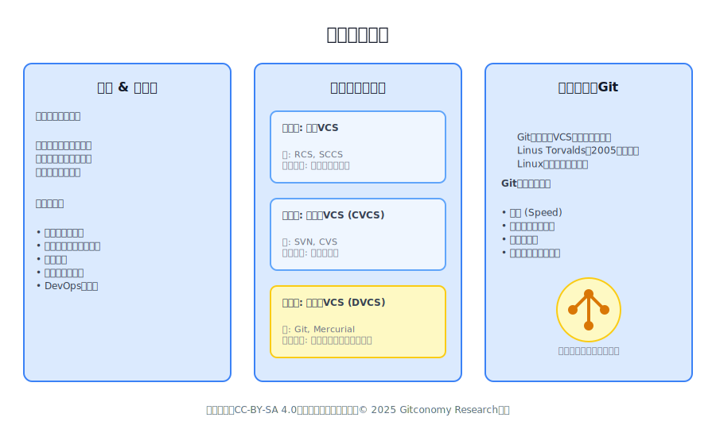
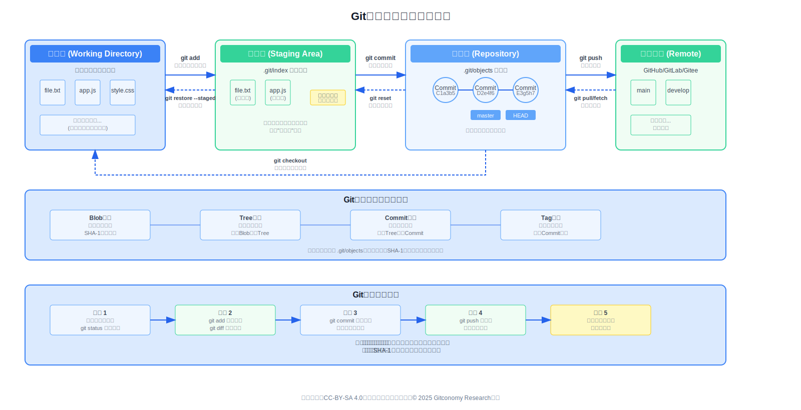
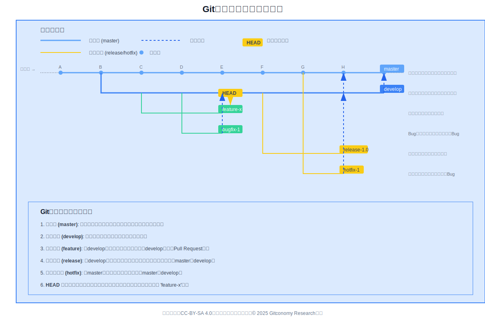
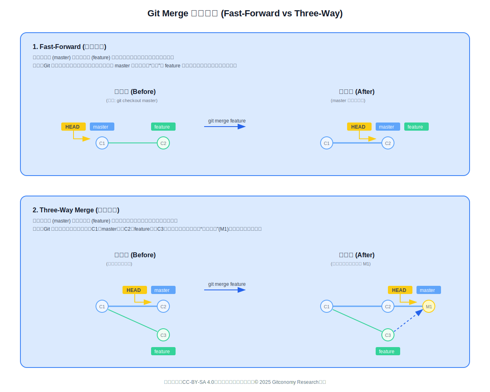
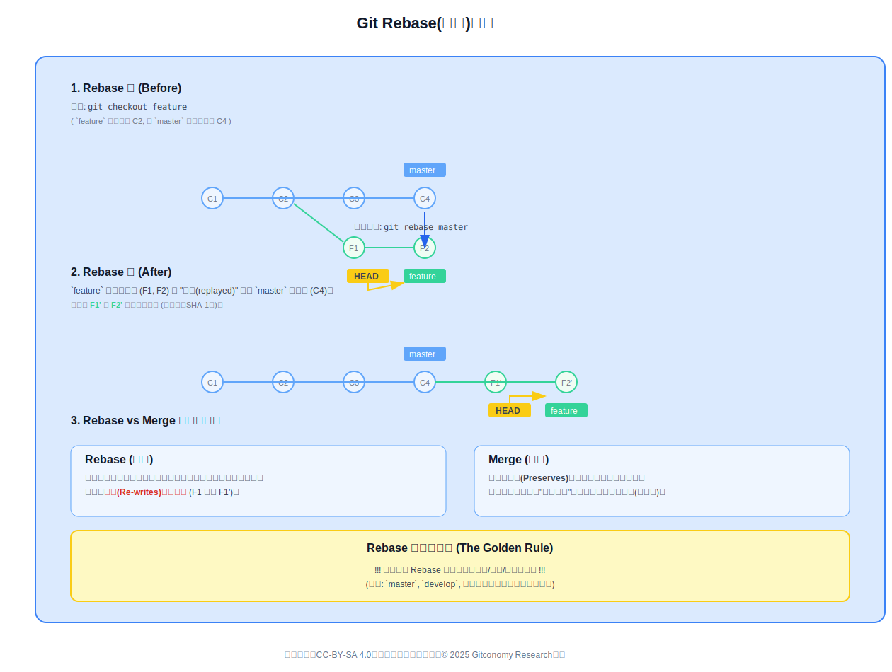
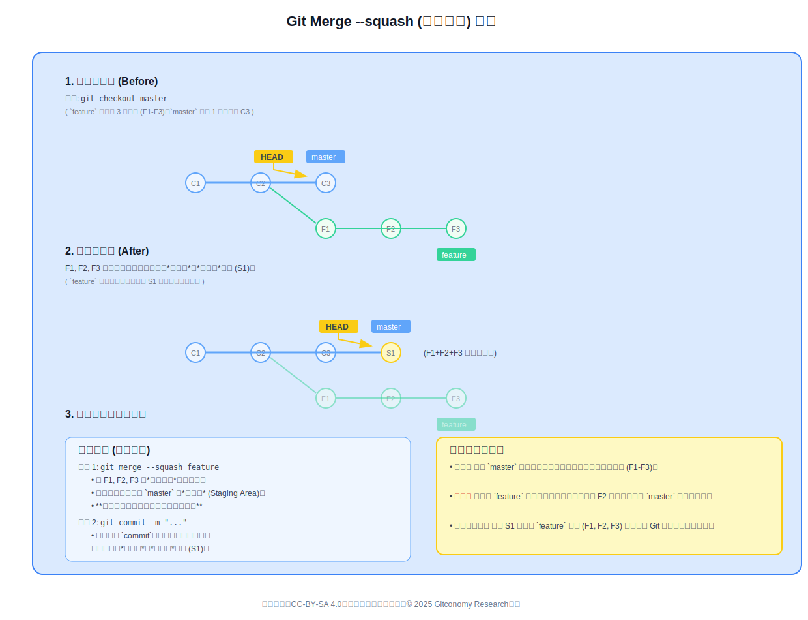

# 第三章：Git与代码托管平台入门

## 🎯 学习目标

通过本章学习，学生应能够：

1. 理解版本控制的基本概念与重要性；
2. 掌握Git的核心理论与操作流程；
3. 能够在GitCode平台上完成从创建仓库到提交PR（Pull Request）的完整过程；
4. 初步体验在开源社区中通过Issue与他人协作交流。

---

## 💡导论

> “在数字协作的时代，Git不仅仅是一种工具，更是一种思维方式。”

本章将带领学生走进开源世界的“底层语言”——Git。无论是开发者、研究者还是设计师，理解Git的版本控制机制，都是融入开源生态、参与协作创新的第一步。

本章采用“理论讲解 + 实操体验”的双轨模式。理论部分将构建一个坚实的概念框架，而实操部分将确保学生能在“动手”的过程中，真正内化和理解那些抽象的概念。学习Git的本质，并不仅仅是记忆几个命令，而是学习一种新的协作理念：一种去中心化的、异步的、透明的且完全可追溯的思维模式。

传统的协作思维，如同一个团队共同编辑一个Word文档，是中心化、线性且依赖锁定的。而Git所代表的分布式版本控制（DVCS）思维，则是并行的、分布式的、非线性的。Git的架构——即每个开发者都拥有一个完整的仓库副本——正是这种去中心化哲学的技术实现。因此，学习 `git branch`（分支）不仅仅是一个技术操作，它更是在学习如何在不破坏“主干”的前提下，安全地进行“并行实验”。本导论从一开始，就旨在确立这个更高阶的学习目标。

---

## 第一部分：版本控制基础

### 3.1 什么是版本控制

版本控制（Version Control）是一种系统地记录一个或多个文件内容变化，以便将来查阅特定版本修订情况的系统 。在现代软件开发中，它不仅仅是一个工具，更是团队协作的基石与项目的“历史记录仪” 。本节将首先阐述版本控制的核心概念及其在提升协作效率、保障代码安全和加速DevOps流程中的至关重要性 。随后，我们将回顾版本控制技术从孤立的本地系统（LVCS），到存在单点故障的集中式系统（CVCS），最终演进到以Git为代表的、高效灵活的分布式系统（DVCS）的三代历程，从而为理解Git的革命性设计奠定基础


*图：版本控制（VCS）基础*

#### 3.1.1 版本控制的概念与重要性

版本控制（Version Control）是一种记录文件内容变化，以便将来查阅特定版本修订情况的系统。在软件开发领域，版本控制系统（VCS）是管理代码变更、追踪历史记录、实现多人协作的核心工具。它不仅仅适用于代码，任何文本文件，如文档、配置文件、甚至图像设计文件，都可以纳入版本控制的管理范畴。

“源码管理”（Source Code Management, SCM），通常也与“版本控制”（Version Control）或“源码控制”（Source Control）互换使用，是跟踪和管理软件代码变更的实践。SCM 的主要目标是协调和管理软件开发过程中的代码、文件及相关产物，确保团队协作的有序进行 。因此，如果说SCM是一种实践，那么版本控制系统（VCS）就是实现这种实践的工具。VCS是更广泛的“软件配置管理”（Software Configuration Management）的一个核心组成部分 。

版本控制的重要性体现在以下几个方面，它构成了现代软件团队的日常实践核心：

* **团队协作的基石 (Backbone of Collaboration)**: VCS是团队协作的“历史记录仪”。它允许跨时区、分布式的团队成员在不相互冲突或覆盖彼此工作的情况下并发工作。
* **完整的历史与可追溯性 (Historical Record & Traceability)**: VCS提供了每个文件的完整长期变更历史。这种无懈可击的可追溯性，对于理解遗留代码、进行合规性审计至关重要。
* **高效调试 (Simplified Debugging)**: 当一个Bug被发现时，VCS可以帮助团队快速定位到引入该Bug的具体变更。开发者无需熟悉整个代码库，只需审查引入问题的特定代码。
* **安全网与可逆性 (Safety Net & Revertibility)**: VCS的核心好处之一，是能够安全地撤销或“回滚”不想要的变更。这使得实验和重构变得安全，因为“损坏”的代码可以被轻松丢弃，而不会造成灾难性后果。
* **DevOps加速器 (DevOps Accelerator)**: 根据Google的DevOps研究与评估（DORA）团队的报告，使用版本控制是高绩效工程团队的关键技术能力之一，它能显著提高交付速度、稳定性和代码质量。

---

##### **💡互动活动：**

**案例讨论：“如果没有Git，团队合作会怎样？”**

想象一个团队在没有VCS的情况下，通过共享文件夹或电子邮件来协作编写一份重要文档。文件系统很快会变得一团糟：`thesis_final.doc`, `thesis_final_v2.doc`, `thesis_final_v2_johns_edits.doc`, `thesis_final_v2_REVISED_FINAL.doc` 。

这会立刻产生几个无法回答的问题：

* 哪个是真正的最终版本？
* `johns_edits` 和 `REVISED_FINAL` 之间有何区别？
* 如果两个人同时修改了同一个文件，如何合并他们的工作？

这种手动复制文件的方法，会造成混乱、信息丢失和无法估量的时间浪费。

**比较：Word文档版本混乱 vs Git提交历史**

相比之下，VCS（如Git）就像一个严谨的“实验室笔记本”或游戏中的“存档点” 。每一次 `git commit`（提交）都是一个清晰的、带有文档记录的“存档点” 。你可以明确地知道谁（Author）、在何时（Date）、为什么（Commit Message）做了什么修改（Diff），并且可以随时、可靠地“读档”到历史上的任何一个“存档点” 。

---

#### 3.1.2 技术发展路线图：三代演进

VCS技术的发展大致经历了三个主要阶段，每一个阶段都解决了前一阶段的核心痛点：

1.**第一代：本地版本控制系统 (LVCS)**

* **代表工具**: SCCS (Source Code Control System, 约1972年), RCS (Revision Control System, 约1982年)。
* * **工作模式**: 这些工具在本地计算机上跟踪文件的变更。RCS通过在磁盘上保存文件的“补丁集”（即变更差异），来实现版本间的切换。
    * **核心局限**: 它们本质上是单机工具，缺乏网络功能，因此无法满足团队协作的需求。

2. **第二代：集中式版本控制系统 (CVCS)**

* **代表工具**: CVS (Concurrent Versions System) ⁹, Subversion (SVN)。
* **工作模式**: CVCS的出现解决了协作问题。它引入了一个单一的中央服务器，该服务器存储了所有文件的所有版本 ¹²。开发者从这个中央服务器“检出”（Check out）文件，在本地修改，然后“提交”（Check in）回服务器。
* **核心局限**: 这种模式存在单点故障。如果中央服务器宕机或网络中断，整个团队都无法协作。此外，分支和合并操作在CVCS中通常“笨重”且容易出错。

3. **第三代：分布式版本控制系统 (DVCS)**

* **代表工具**: Git (2005年), Mercurial。
* **工作模式**: DVCS彻底改变了游戏规则。每一个开发者都拥有一个完整的本地仓库副本（Clone），包含项目的全部历史记录。
* **核心优势**:
        * **无单点故障**: 每个克隆都是一个完整的备份 。
        * **离线工作**: 几乎所有操作（提交、创建分支、查看历史）都在本地执行，速度极快且无需网络连接。
        * **强大的分支与合并**: DVCS的“轻量级分支”是其核心优势，极大地促进了并行开发和安全实验。

Git是第三代VCS的巅峰之作，其分布式特性和强大的分支能力，使其成为当今绝大多数软件开发（尤其是开源项目）的事实标准。

| 特性维度     | 集中式版本控制 (CVCS) - 如 SVN  | 分布式版本控制 (DVCS) - 如 Git         |
| :------- | :---------------------- | :----------------------------- |
| **系统架构** | 单一的中央服务器存储所有版本数据 。      | 每个开发者本地都有完整的版本库副本 。            |
| **数据存储** | 按文件变更（差异）存储，体积较大 。      | 按元数据（快照）存储，体积较小，完整性高 。         |
| **网络依赖** | 强依赖网络，大部分操作需连接中央服务器 。   | 支持离线工作，本地操作无需网络连接 。            |
| **单点故障** | 中央服务器是单点故障源，风险高 。       | 无单点故障，每个本地仓库都是完整备份 。           |
| **分支管理** | 分支是目录的拷贝，创建和合并操作重且繁琐 。  | 分支是指向提交的轻量级指针，创建、切换和合并非常快速灵活 。 |
| **协作方式** | 开发者直接与中央服务器交互，实时同步 。    | 开发者通过推送/拉取操作在本地仓库之间同步更改 。      |
| **性能**   | 网络操作（如提交、更新）速度受网络状况影响 。 | 本地操作（如提交、查看日志）速度极快 。           |
| **学习曲线** | 概念和命令相对简单，易于上手 。        | 概念和命令更复杂，学习曲线较陡峭 。             |

*表：集中式 vs 分布式版本控制*

### 3.1.3. 版本控制作为团队协作的“历史记录仪”

版本控制在团队协作中扮演着“历史记录仪”的关键角色，它不仅仅是存储代码的仓库，更是记录项目演进、决策过程和团队成员贡献的宝贵档案。每一次提交（commit）都像一次快照，永久地保存了项目在特定时间点的状态。这些提交记录包含了作者、时间戳、修改内容以及一段描述性的提交信息（commit message）。通过这些信息，团队成员可以清晰地了解每一个功能是如何实现的，每一个bug是如何被修复的，以及背后的设计思路和决策依据。这种透明度和可追溯性对于项目的长期维护和知识传承至关重要。

当团队规模扩大或项目变得复杂时，版本控制的“历史记录仪”作用愈发凸显。新加入的成员可以通过阅读提交历史，快速熟悉项目的架构和代码风格，了解过去的决策和遇到的问题，从而更快地融入团队。当出现问题时，开发者可以利用版本控制工具（如git bisect）快速定位引入问题的具体提交，从而高效地进行调试和修复。此外，版本控制还支持标签（tag）和里程碑（milestone）功能，可以用来标记重要的版本发布节点，方便后续的版本管理和发布工作。可以说，一个维护良好的版本控制历史，就是项目最宝贵的无形资产之一，它为团队的协作提供了坚实的基础和强大的支持。

---

### 3.2 Git的诞生背景：从Linux内核到全球协作

Git，这个如今全球最流行的版本控制系统，它的诞生并非源于一个宏伟的商业计划，而是Linux创始人林纳斯·托瓦兹（Linus Torvalds）在面对一场突如其来的危机时，为了解决一个迫在眉睫的技术难题而“被迫”创造出来的。它的故事，深深植根于开源历史上最庞大、最成功的项目之一——Linux内核的开发历程中。

#### 3.2.1 Git之前的时代：补丁飞舞与“不情愿的妥协”

在21世纪初，Linux内核的开发协作方式显得颇为“原始”。全球各地的开发者通过电子邮件，将他们对代码的修改打包成“补丁”（Patch）文件，发送给林纳斯和其他核心维护者。维护者们每天都需要手动审阅、合并、管理雪片般飞来的补丁邮件。

这种工作流存在着巨大的问题：

1.  **效率低下且极易出错：** 手动合并补丁费时费力，一不小心就会出错，导致代码库混乱。
2.  **历史追溯困难：** 很难清晰地追踪某段代码是何时、由谁、为何修改的。
3.  **无法规模化：** 随着Linux社区的贡献者呈指数级增长，这种作坊式的管理方法很快就达到了瓶颈。

为了解决这个问题，2002年，Linux内核开发团队做出了一个在当时备受争议的决定：采用一款名为**BitKeeper**的商业分布式版本控制系统（DVCS）。BitKeeper功能强大，它让分布在全球的开发者能够更高效地协同工作，是当时最先进的版本控制工具。

然而，让一个开源世界的“旗帜”项目去依赖一个闭源的商业软件，这本身就在社区内引发了巨大的争议。BitKeeper的创造者拉里·麦沃伊（Larry McVoy）虽然为开源项目提供了免费使用权，但附带了一个严格的条件：**禁止任何人对BitKeeper进行逆向工程**。这个“不情愿的妥协”为后来的危机埋下了伏笔。

#### 3.2.2 危机爆发：信任破裂，工具被收回

这个脆弱的联盟在2005年走到了尽头。一位著名的开源开发者安德鲁·垂鸠（Andrew Tridgell，Samba和rsync的作者）试图开发一个能与BitKeeper交互的开源工具，这个行为无意中触发了对BitKeeper协议的逆向工程。

这一举动激怒了BitKeeper的创造者拉里·麦沃伊。他认为这违反了免费使用的协议，并于2005年4月宣布，**收回对Linux内核社区的免费使用授权**。

这一下，整个Linux内核开发社区陷入了瘫痪。他们已经习惯了BitKeeper带来的分布式、高效率的工作模式，突然之间却无“器”可用。而当时市面上的其他开源版本控制系统，如CVS和Subversion（SVN），都是集中式的架构，不仅速度慢，而且其分支和合并功能的设计也无法满足内核开发的复杂需求。

#### 3.2.3 Linus的解决方案：Git横空出世

面对这个棘手的困境，林纳斯·托瓦兹展现了他一贯的风格：与其抱怨，不如自己动手解决。他花了大约两周的时间，几乎是“闭关修炼”，从零开始编写了一个全新的版本控制系统的原型。

他给这个新工具起了一个颇为自嘲的名字——**Git**（在英国俚语中意为“饭桶”或“讨厌鬼”）。

林纳斯在设计Git时，明确了几个核心目标，这些目标完全是针对Linux内核开发所面临的痛点而设定的：

1.  **速度（Speed）：** 几乎所有的操作都必须在本地瞬间完成，不能有任何等待。
2.  **简单的设计（Simple Design）：** 核心系统保持简单，但功能强大，易于扩展。
3.  **对非线性开发的强力支持（Strong Support for Non-linear Development）：** 分支（Branching）和合并（Merging）必须是核心功能，且创建和切换分支的成本极低，以鼓励开发者并行开发和大胆实验。
4.  **完全分布式（Fully Distributed）：** 每个开发者都拥有项目完整的历史记录副本。这不仅意味着可以离线工作，也使得系统没有单点故障，更加健壮。
5.  **能高效处理大型项目（Ability to Handle Large Projects）：** 必须能够轻松管理像Linux内核这样拥有数百万行代码和数十年历史的庞大项目，而性能不会下降。

Git并非BitKeeper的复制品，而是一个全新的、革命性的设计。它将数据完整性作为首要任务，并引入了“暂存区”（Staging Area）等创新概念。

可以说，Git的诞生是一场“美丽的意外”。它源于一场商业许可的纠纷，却最终促成了一款彻底改变软件开发方式的开源工具的问世。Git最初只是为了满足Linux内核这个单一项目的极端需求，但其卓越的设计理念——**速度、分布式、强大的分支能力**——恰好切中了现代软件工程的要害。

因此，这个从Linux内核协作困境中淬炼而生的工具，迅速超越了其初始目标，被全球开发者广泛接受，最终成为今天代码版本控制领域无可争议的王者，为全球范围内的软件协作与创新提供了坚实的基础。

---

### 3.3 从Git到GitHub：一场通往“社交化编程”的革命

如果我们把软件开发比作写作，那么Git和GitHub的关系就好比：

> **Git** 是一款功能极其强大的单机版Word文档处理器，它能完美记录你的每一次修改、创建不同草稿（分支），并能让你安全地合并不同版本。
>
> **GitHub** 则是在这款Word处理器的基础上，构建了一个集云端存储、协作编辑、社区论坛、个人主页于一体的“Google Docs + 社交网络”平台。

这个比喻的核心在于，Git本身是一个**工具**，而GitHub是一个**平台和社区**。正是这种从工具到平台的飞跃，开启了“社交化编程”的时代。

#### 3.3.1 第一阶段：Git - 强大的、但“孤独”的分布式版本控制工具

在上一章我们已经了解，Git是一个革命性的版本控制工具。它的核心优势在于：

* **分布式**：每个开发者本地都有一份完整的代码仓库和历史记录，可以独立工作。
* **闪电般的速度**：几乎所有操作都在本地完成，无需网络。
* **强大的分支能力**：创建、切换、合并分支的成本极低，极大地鼓励了并行开发和实验。

然而，Git本身并不关心“协作”中“人”的因素。它能高效地处理代码的合并与分离，但它本身**不提供**：

* 一个中心化的、易于访问的代码“真理之源”（Canonical Source of Truth）。
* 一个讨论代码变更、提出问题或建议的平台。
* 一个展示开发者技能、贡献和信誉的“名片”。
* 一个发现优秀项目、关注杰出开发者的机制。

纯粹使用Git进行协作，通常还需要依赖邮件列表（Mailing Lists）、论坛、即时通讯工具等外部系统来完成沟通和项目管理。代码和围绕代码的讨论是**分离的**。

#### 3.3.2 第二阶段：GitHub - 为Git插上协作与社交的翅膀

GitHub在2008年应运而生，它的天才之处在于，它并没有重新发明版本控制，而是**完全基于Git**，并在其上构建了一个Web平台，专门解决了上述Git本身无法解决的“社交”和“协作”问题。

GitHub通过引入以下几个核心概念，彻底改变了游戏规则：

 1. **远程仓库 (Remote Repositories)**

GitHub提供了一个稳定、可靠的云端服务器来托管你的Git仓库。这为全球的开发者提供了一个易于访问的“中心枢纽”。`git push` 和 `git pull` 这两个命令从此有了明确的目标。

 2. **复刻 (Fork)**

这是社交化编程的基石之一。任何用户都可以一键“复刻”一个公开项目，在自己的账户下创建一个完全独立的副本。你对这个副本拥有完全的写权限，可以随心所欲地修改和实验，而完全不用担心会影响到原始项目。这极大地降低了贡献的门槛。

3. **拉取请求 (Pull Request, PR)**

这是整个社交化编程流程的**核心机制**。当你在自己的Fork中完成一项有价值的改进后，你可以向原始项目（上游仓库）发起一个“拉取请求”。

PR的本质是一个**沟通和代码审查的界面**。它在说：“嘿，项目维护者，我在我的副本里完成了一个很棒的功能（或修复了一个Bug），这是我的代码，你们可以审查一下。如果觉得不错，请把它合并到你们的主项目里去吧！”

在PR界面里，团队可以：

* **逐行审查代码 (Code Review)：** 对具体的代码行进行评论、提问、提出修改建议。
* **持续集成/测试 (CI/CD)：** 自动运行测试，确保新的代码不会破坏现有功能。
* **讨论：** 就该变更的整体设计、实现思路进行宏观讨论。

PR让代码审查从一种繁琐的线下活动，变成了一种透明、高效、可追溯的线上文化。

4. **议题 (Issues)**

GitHub的Issues区是一个集成的任务板和论坛。它让围绕项目的**所有非代码性讨论**（如Bug报告、功能建议、未来规划、提问求助）都能与代码仓库本身关联起来。你可以将某个Issue与某个PR关联，实现从“提出问题”到“代码修复”再到“合并上线”的全流程跟踪。

 5. **开发者个人主页 (Profile)**

GitHub为每个开发者创建了一个个人主页。这个页面上的**贡献图（Contribution Graph）、星标（Stars）、关注（Follows）**等元素，将一个开发者的工作和兴趣完全可视化。你的主页成了一张动态的、由代码贡献构成的“技术简历”，你的能力和声誉不再仅仅依赖于头衔，而是由实实在在的公开贡献来证明。

#### 3.3.2 “社交化编程”的诞生

基于以上功能，一种全新的软件开发范式——**社交化编程**——诞生了。


*图：社交化编程：从代码协作到社区共识*

其核心特征包括：

* **透明性 (Transparency)**：所有的代码变更、讨论、决策过程（通过PR和Issues）都公开可见，可供追溯。这建立了社区的信任。
* **低门槛贡献 (Low-Barrier Contribution)**：`Fork + Pull Request` 的模式让任何一个有想法的外部开发者都能轻松地为项目贡献代码，而无需预先获得复杂的权限。
* **异步的全球协作 (Asynchronous Global Collaboration)**：开发者不再需要实时在线沟通。PR和Issues成为了跨越时区和地域的“异步沟通”的完美载体。
* **代码审查文化 (Culture of Code Review)**：PR机制让同行评审（Peer Review）成为了开发流程的内置环节，极大地提升了代码质量。
* **社区驱动创新 (Community-Driven Innovation)**：项目的发展不再仅仅依赖于核心团队。来自全球社区的智慧和贡献，通过GitHub这个平台源源不断地汇入项目，加速了创新。

>Git + GitHub = 现代软件开发的基石

这个组合彻底改变了开源软件的协作模式，并深刻影响了商业公司的内部开发流程。它让软件开发从一项主要是个人或小团队的、封闭的“技艺”，演变成了一场全球性的、开放透明的、社区驱动的“社会性活动”。这就是从Git到GitHub的飞跃，也是社交化编程的真正含义。

**Git是引擎，GitHub是平台。**

* **Git** 提供了强大、可靠的底层技术，负责处理代码的版本和历史，保证了技术上的严谨性。
* **GitHub** 则在其上构建了社交层和协作层，将孤立的开发者和项目连接成一个庞大的、相互关联的生态网络。

#### 3.3.3 主流Git代码托管平台概述

Git本身是去中心化的，但高效的协作依然需要一个共同的“交汇点”。代码托管平台（或称代码“锻造”平台，Forge）满足了这一需求，它们在Git的基础上提供了网页界面、强大的协作工具和社区功能。截至2025年底，全球的Git平台生态已经非常成熟，形成了不同定位的巨头和特色产品。

目前，全球市场形成了以 **GitHub** 和 **GitLab** 为首的两大巨头。**GitHub** 凭借其先发优势和强大的社交属性，已成为全球最大的开发者社区和开源项目的大本营，并正积极地将AI能力深度集成到开发工作流中，引领着“AI辅助开发”的潮流。与之相对，**GitLab** 则秉持“一体化”哲学，致力于在单一平台内提供从代码管理到部署运维的完整DevOps生命周期工具链，尤其在企业级市场和DevSecOps领域占据重要地位。

在中国，为了满足本土开发者的网络环境、合规需求以及国家技术战略，也诞生了以 **Gitee（码云）** 和 **GitCode** 为代表的优秀平台。**Gitee** 作为中国市场占有率领先的平台，不仅为国内开发者提供了稳定高速的访问体验，也承载了众多国家级关键开源项目，成为中国开源生态的核心基础设施。**GitCode** 则依托中国最大的开发者社区CSDN，致力于构建一个集代码托管、知识分享和社区交流于一体的综合性平台。

此外，对于希望完全掌控自身数据、寻求轻量化和高效率的团队或个人，以 **Gitea** 为代表的开源自托管解决方案提供了极具吸引力的选择。它让用户能以极低的资源成本，在自己的服务器上搭建功能完备的私有Git服务。

下表对几个主流平台的核心定位、关键特性和适用场景进行了详细比较（截至2025年底）。

| **比较维度** | **GitHub** | **GitLab** | **Gitee (码云)** | **GitCode** | **Gitea** |
| -------------------- | :-------------------------------------------------------------------------: | :------------------------------------------------------------------------: | :---------------------------------------------------------------------------: | :---------------------------------------------------------------------------: | :----------------------------------------------------------------------------: |
| **核心定位** | **全球最大开发者社区 & AI驱动的开发平台** | **一体化的DevOps生命周期平台** | **中国领先的开源生态与企业级研发管理平台** | **依托CSDN的开发者知识与代码社区** | **轻量、高效、开源的自托管Git服务** |
| **主要用户** | 开源社区、个人开发者、各规模企业                                          | 企业用户（特别是需要DevSecOps的）、重视自托管的团队                        | 中国开发者与企业、国内关键开源项目                                          | CSDN社区开发者、学习者、国内开源项目探索者                                  | 个人、小型团队、需要完全数据控制的组织                                       |
| **关键特性** | <ul><li>Copilot (AI编程助手)<li>GitHub Actions (CI/CD)<li>庞大的社区生态</ul> | <ul><li>内置强大的CI/CD与Auto DevOps</li>端到端安全扫描(DevSecOps)<li>单一应用覆盖全流程<ul> | <ul><li>国内访问稳定高速<li>Gitee Enterprise(企业级方案)<li>承载国家级开源项目</ul> | <ul>与CSDN社区深度融合<li>智能代码搜索与发现<li>“代码+知识”双核驱动</ul> | <ul><li>资源消耗极低 (Go语言编写)<li>安装部署极其简单<li>内置Gitea Actions (CI/CD)</ul> |
| **部署模式** | SaaS (公有云)<br>Enterprise (私有云/自托管)                               | SaaS (公有云)<br>Self-hosted (自托管，功能强大)                           | SaaS (中国)<br>Enterprise (私有化部署)                                     | SaaS (中国)                                                                 | **仅自托管 (Self-hosted)** |
| **生态与社区** | **极其丰富，行业标准** | 良好，但开放性不如GitHub                                                 | 聚焦中国本土，与国内服务集成良好                                            | 与CSDN开发者生态紧密绑定                                                    | 活跃的开源社区，可通过插件扩展                                               |
| **优势** | <ul><li>社区规模巨大，项目曝光度高<li>AI功能领先，引领开发新范式<li>生态系统最成熟</ul> | <ul><li>端到端DevOps能力，无需集成<li>内置CI/CD功能极其强大<li>自托管版本灵活且功能完整<ul> | <ul><li>访问速度快，网络体验好<li>符合国内政策与合规要求<li>本土开源生态的核心</ul> | <ul><li>拥有庞大的存量开发者社区<li>将代码学习与实践紧密结合<li>便于发现和探讨代码</ul> | <ul><li>极致轻量、快速、易于维护<li>硬件要求低，成本可控<li>完全开源，数据100%在自己手中</ul> |
| **劣势/权衡** | <ul><li>国内访问有时不稳定<li>核心功能免费，但高级功能昂贵</ul> | <ul><li>功能繁多导致界面相对复杂<li>资源消耗高于轻量级方案</ul> | <ul><li>国际影响力有限<li>社区规模和生态丰富度小于GitHub</ul> | <ul><li>平台功能相比巨头仍在发展中</li>更偏向社区而非纯粹的企业工具</ul> | <ul><li>不提供SaaS版本，需自行维护<li>高级企业功能(如复杂审计)较弱</ul> |

*表：全球主流Git代码托管平台一览*

---

## 第二部：Git版本控制基础

### 3.4 Git基础原理

本章将系统地阐述Git的底层结构，包括对象生命周期的变化、底层数据结构、包文件结构和包文件索引。


*图：Git的数据结构和工作原理*

### 3.4.1 Git的数据结构

这是理解Git操作流程的第一个，也是最重要的心智模型。Git的本地环境被分为三个逻辑区域：

1.  **工作区 (Working Directory) ：**

这是你在文件系统中实际看到和编辑的文件。它是从仓库的压缩数据库中检出（checkout）的项目某个版本，放在磁盘上供你使用或修改 。

2.  **暂存区 (Staging Area / Index)：**

这是Git与SVN等工具最根本的区别之一。暂存区是一个文件（位于 `.git` 目录中），它像一个“购物车”或“草稿箱”，用来精确地存放下一次提交（commit）所要包含的变更快照 。

暂存区是Git的精髓所在。它允许你精确控制每次提交的内容。比如，你同时修改了3个文件，分别用于修复Bug、增加新功能和修改错别字。你可以分三次，每次只将一个相关的变更放入暂存区并提交，从而形成三次清晰、独立的提交记录，而不是一次混乱的大杂烩。这使得代码历史变得干净、可读、易于审查。

3.  **仓库 (Repository /.git Directory)：**

这是一个隐藏的 `.git` 文件夹。这是Git的“大脑”，它存储了项目所有的元数据、对象数据库（即所有文件的所有版本）和完整的提交历史。

暂存区的存在并非为了复杂化，而是为了实现**原子提交 (Atomic Commits)**。在SVN中，提交是“全有或全无”的——你工作目录中的所有修改都会被一次性提交。而在Git中，工作流是：工作区 $\to$ 暂存区 $\to$ 本地仓库。

这意味着开发者可以在工作区中同时进行三项不相关的修改（例如：修复Bug A，开发特性B，修正一个拼写错误）。借助暂存区和 `git add` 命令，开发者可以**选择性地** ¹⁶ 将这些修改分组成三个独立的、逻辑清晰的提交：
* `git commit -m "Fix bug A"` (只包含A的变更)
* `git commit -m "Add feature B"` (只包含B的变更)
* `git commit -m "Correct typo in README"` (只包含拼写错误的变更)

因此，暂存区是Git实现“干净、可读、可审查”历史的关键机制。它将“保存文件”这一动作，升格为“精心构建一次变更快照”。

#### 3.4.2. 基础工作流：变更的“旅行”

你在Git中的日常工作，就是让你的文件变更在这“三层架构”之间流动。这个流程由几个核心命令驱动：

**工作区 $\to$ 暂存区 $\to$ 本地仓库**

1.  **在工作区进行修改**

你像平常一样创建、编辑或删除文件。

2.  **`git add`：将变更“添加”到暂存区**

当你完成了一项独立的修改（比如修复了一个Bug），你使用 `git add` 命令告诉Git：“请把这个文件的当前状态拍个快照，放进‘待归档’的暂存区。”

**常用命令**：

```bash
# 添加指定文件到暂存区
git add 文件名.txt

# 添加所有已修改和新创建的文件到暂存区
git add .
```

3.  **`git commit`：将暂存区的变更“提交”到本地仓库**

- 当你把所有相关的变更都`add`到暂存区后，你使用 `git commit` 命令。“提交”这个动作会把暂存区里的所有内容打包成一个版本（一个“存档点”），并永久保存在本地仓库中。

- 每一次提交都必须附带一条**提交信息（Commit Message）**，用来清晰地描述这次变更“做了什么”以及“为什么这么做”。

**常用命令**：

```bash
# 提交并附上说明信息
git commit -m "一个清晰的提交说明，例如：修复了用户登录的Bug"
```

#### 3.4.3 文件状态生命周期

在Git的眼中，你的文件总是在几种状态之间切换。`git status` 是你最好的朋友，它会随时告诉你每个文件正处于什么状态。

1. **Untracked (未跟踪)**：新创建的文件，Git还不知道它的存在。 `->` 执行 `git add` 后，状态变为 **Staged**。

 2.**Unmodified (未修改)**：文件内容与本地仓库中最新版本完全一致。 `->` 编辑该文件后，状态变为 **Modified**。

3. **Modified (已修改)**：文件已被修改，但还未放入暂存区。`->` 执行 `git add` 后，状态变为 **Staged**。

4. **Staged (已暂存)**：文件的当前变更已放入暂存区，等待下一次提交。`->` 执行 `git commit` 后，状态回到 **Unmodified**。

**常用命令**：

```bash
# 查看当前工作区和暂存区的状态，这是你最常用的命令！
git status
```

---

**🚀 动手实验： 环境配置**

**目标**：完成Git本地环境配置与身份设定。

**任务**：

1.  **安装Git：**

指导学生访问Git官方网站 (https://git-scm.com/downloads) 下载并安装适用于其操作系统（Windows, macOS, Linux）的版本。

2.  **配置用户名与邮箱：**

打开你的终端（Terminal, Git Bash, or Cmd，运行以下命令，设置你的全局用户名和邮箱。

```bash
git config --global user.name "Your Name"
git config --global user.email "your.email@example.com"
```

>**重要性**：这一步至关重要。你在这里设置的`user.name` 和 `user.email` 将作为元数据，嵌入到你的每一条提交（commit）中。这是VCS“历史记录仪”功能的基石，它明确了“谁”做了这个变更。

4.  **连接GitCode账户（SSH或HTTPS方式）：**

Git是本地工具，GitCode是远程服务器。你需要一种方式让它们安全通信。

* **方式一：HTTPS（简单，但繁琐）**

你无需额外配置。但在你每次 `push` 或 `pull` 时，GitCode都会提示你输入用户名和密码（或个人访问令牌 (PAT)）。

* **方式二：SSH（推荐，一劳永逸）**

这是一种更安全、更方便的方式。你需要在本地创建一对“密钥”（私钥和公钥），并将“公钥”（相当于你的“身份证”）上传到GitCode。

**步骤（简要）：**

```bash
# 1. 在终端中运行，生成新密钥（按提示回车即可）
ssh-keygen -t rsa -b 4096 -C "your.email@example.com"

# 2. 查看并复制你的公钥内容

# (macOS/Linux)
cat ~/.ssh/id_rsa.pub

# (Windows)
clip < ~/.ssh/id_rsa.pub

        # 3. 登录GitCode，进入“设置” -> “SSH公钥”，
        #    粘贴你复制的公钥内容并保存 。
```

5.  **验证环境：**

运行以下命令，检查Git版本和配置信息。

```bash
# 检查版本
git --version
# 预期输出: git version 2.x.x

# 检查配置
git config --list
# 预期输出: 确保列表包含你刚刚设置的 user.name 和 user.email
```

7.  **输出结果**：截图提交到课程仓库路径下。

---

## 3.5 Git基础操作

#### 3.5.1 Git四个核心命令：add, commit, push, pull

这四个命令构成了本地仓库与远程仓库交互的完整闭环：

* `git add`: 将工作区的变更“添加”到暂存区（从工作区 $\to$ 暂存区）。
* `git commit`: 将暂存区的快照“提交”到本地仓库（从暂存区 $\to$ 本地仓库）。
* `git pull`: 从远程仓库“拉取”更新到本地仓库，并自动合并到工作区（从远程 $\to$ 本地 $\to$ 工作区）。
* `git push`: 将本地仓库的提交“推送”到远程仓库（从本地 $\to$ 远程）。

#### 3.5.2 文件状态生命周期（未跟踪 → 暂存 → 已提交）

`git status` 命令是你最好的朋友，它会实时告诉你每个文件正处于哪个状态。

1.  **Untracked (未跟踪):**
    * **定义**: 这是一个新文件，它存在于你的工作区，但Git尚未开始管理它。
    * **操作**: 运行 `git add <file>`。
    * **状态变为**: Staged (已暂存) 。

2.  **Unmodified (未修改 / 已提交):**
    * **定义**: 工作区的文件与本地仓库（HEAD）中的最新快照完全一致。
    * **操作**: 编辑文件。
    * **状态变为**: Modified (已修改)。

3.  **Modified (已修改):**
    * **定义**: 这是一个已被Git跟踪的文件，但你本地工作区的版本与仓库中的版本不同，且这个变更尚未放入暂存区。
    * **操作**: 运行 `git add <file>`。
    * **状态变为**: Staged (已暂存)。

4.  **Staged (已暂存):**
    * **定义**: 你已经将文件的当前变更快照放入了暂存区，它被包含在“等待提交”的列表中。
    * **操作**: 运行 `git commit`。
    * **状态变为**: Unmodified (未修改)。

**一个常见的初学者陷阱：已暂存文件的再次修改**

一个文件可以同时处于“已暂存”和“已修改”状态。
1.  假设你在 `file.txt` 中添加了 "Line 1"。
2.  你运行 `git add file.txt`。此时 `git status` 会显示 `file.txt` 为绿色（Staged）。
3.  然后，你再次编辑 `file.txt`，添加了 "Line 2"。
4.  此时你运行 `git status`，会发现 `file.txt` 出现了两次：一次为绿色 (Staged)，一次为红色 (Modified) 。

**为什么？** 因为暂存区（Staging Area）保存的是你上次 `git add` 时的快照（即只有 "Line 1" 的版本）。而工作区（Working Directory）则包含 "Line 1" 和 "Line 2"。

如果此时运行 `git commit`，只有 "Line 1" 会被提交到仓库中。

**结论**: `git add` 不是一个“标记文件”的动作，而是一个“拍摄当前快照并放入暂存区”的动作。你必须再次运行 `git add file.txt` 才能将 "Line 2" 的变更也更新到暂存区。

#### 3.5.3 .gitignore与版本控制范围

* **目的**: `.gitignore` 文件是一个纯文本文件，你可以在里面列出规则，明确告诉Git不要跟踪哪些文件或目录。
* **为什么**: 你的项目在运行或构建时，会产生很多“垃圾”文件。例如：编译产物 (`.class`, `.pyc`)、日志文件 (`*.log`)、操作系统自动生成的文件 (`.DS_Store`)、IDE配置文件 (`.idea/`)，以及（最重要的）第三方依赖库 (`/node_modules/`, `/packages/`) 。
* **原则**: 永远不要将可以自动生成或从别处下载的文件，提交到版本控制中。
* **常用语法** ：
    * `*.log`: 忽略所有以 `.log` 结尾的文件 。
    * `build/`: 忽略整个 `build` 文件夹及其所有内容。
    * `!/foo/bar.log`: 使用 `!` 来取消忽略某个特定文件（即强制跟踪。
    * `**/foo`: 匹配所有子目录中的 `foo` 文件或文件夹 。
* **高级技巧: 如何忽略一个已经提交过的文件？**
    1.  运行 `git rm --cached <file_to_ignore>`。这个命令会从Git的跟踪列表（暂存区）中删除该文件，但保留你本地工作区中的文件。
    2.  将 `<file_to_ignore>` 的规则添加到 `.gitignore` 文件中。
    3.  提交这两个变更：`git commit -m "Stop tracking <file_to_ignore>"`。

##### **🚀动手实验：** 创建与初始化仓库

1.  **使用`git init`创建本地仓库**

在你的电脑上创建一个新文件夹，并进入该文件夹。

```bash
mkdir my-first-repo
cd my-first-repo
git init
```

2. **执行`git init` 命令**

在当前目录创建一个 `.git` 子目录。这个隐藏的目录就是你的本地Git仓库，它包含了所有版本控制所需的数据。

3.  **编辑并提交README.md**

创建一个 `README.md` 文件并添加内容。

```bash
echo "# 我的第一个Git仓库" > README.md

# 检查状态
git status # `git status` 会显示 README.md 是 "Untracked" (未跟踪) 。

# 跟踪文件
git add README.md
git status # `git status` 现在显示 README.md 是 "Changes to be committed" (已暂存) 。

# 提交文件
git commit -m "Initial commit: Add README.md"
git status # `git status` 现在显示 "nothing to commit, working tree clean" 。
```

3.  **连接远程仓库（`git remote add origin`）**

登录GitCode平台，创建一个新的、空的（不带README）远程仓库，名为 `my-first-repo`。创建后，GitCode会显示仓库的URL（推荐使用SSH方式）。

```bash
# 从GitCode页面复制仓库URL
git remote add origin git@gitcode.com:your-username/my-first-repo.git # `git remote add` 命令将你的本地仓库与一个远程仓库“连接”起来 。`origin` 是这个远程连接的默认名称（别名）。
```

4.  **推送到GitCode平台（`git push -u origin main`）**

（注意：你的默认分支可能是 `master`，根据你的Git版本而定。如果是，请将 `main` 替换为 `master`）

```bash
git push -u origin main

# `push` 是上传操作。`-u` (或 --set-upstream) 是一个一次性设置 ，
# 它告诉Git，你本地的 `main` 分支应该“跟踪”远程的 `origin/main` 分支。
# 设置之后，未来你只需要输入 `git push` 和 `git pull` 即可。
```

**🎯目标成果**：学生刷新GitCode上的仓库页面，能看到 `README.md` 文件和一个提交历史。

### 3.6 Git分支管理

#### 3.6.1 什么是分支（Branch）

在Git中，分支（Branch） 是版本控制的核心概念之一，它本质上是一个指向某个特定提交（commit）的轻量级指针。Git的提交历史是由一系列提交对象构成的有向无环图（DAG），每个提交对象都包含一个指向上一个（或多个）提交的指针。分支就是给这个图中的某个节点起的一个名字，这个名字会随着新的提交而自动向前移动，始终指向该分支上的最新一次提交。

与许多其他版本控制系统不同，Git的分支创建和切换操作非常快速和高效。这是因为Git的分支并非复制整个项目的文件，而仅仅是创建一个指向现有提交的新指针。

>在Git中，一个分支仅仅是一个指向某个特定提交的**轻量级可移动指针**。Git使用一个名为 `HEAD` 的特殊指针，来指向你当前所在的分支。

这种轻量级的设计极大地鼓励了开发者使用分支来进行各种开发活动。例如，可以为每一个新功能、每一个bug修复或每一次实验性探索都创建一个独立的分支。这样做的好处是，开发者可以在一个隔离的环境中进行工作，而不用担心会影响到主代码库（通常是main或master分支）的稳定性。当开发完成并经过测试后，再将这个分支合并回主分支，从而安全地将新功能集成到项目中。


*图：Git分支管理逻辑示意图*

在大多数Git项目中，都会有一个默认的主分支，通常命名为main或master。这个分支代表了项目的稳定版本，是随时可以发布或部署的代码。主分支上的代码应该是经过充分测试、没有已知严重bug的。因此，直接对主分支进行开发通常是不被鼓励的，尤其是在团队协作中。

主分支与开发分支的关系：

* `main` (或 `master`): 这是“真相的单一来源”。它应该始终保持稳定、可部署的生产代码状态。
* `feature-branch` (如 `fix-login-bug` 或 `add-user-profile`): 这是从 `main` 分支切出（check out）的临时分支，用于开发特定功能或修复。开发完成后，经过测试，再将其合并 (Merge) 回 `main` 分支。

为了保持主分支的稳定性，所有的开发工作都应该在开发分支（Development Branch） 上进行。开发分支是从主分支上创建出来的，用于开发新功能或修复bug。例如，当需要开发一个名为“用户评论”的新功能时，可以从main分支创建一个名为feature/user-comments的开发分支。开发者在这个分支上进行所有的编码工作，包括多次提交。由于开发分支与主分支是隔离的，所以即使开发过程中引入了不稳定的代码，也不会影响到主分支。

当开发分支上的工作完成并通过测试后，就需要将其合并（Merge） 回主分支。合并操作会将开发分支上的所有提交历史整合到主分支上，从而将新功能正式纳入项目。合并完成后，这个开发分支的使命通常就结束了，可以被删除，以保持仓库的整洁。这种“主分支保持稳定，开发工作在独立分支上进行”的工作流，是现代软件开发中非常流行和高效的模式，它确保了项目的稳定性和开发的灵活性。

#### 3.6.2 分支操作命令

1. `git branch`: 列出所有本地分支，并高亮显示当前分支。

- `git branch`：不带任何参数时，它会列出本地所有的分支，并用*标记出当前所在的分支。
- `git branch <branch-name>`：创建一个新的分支，但不会自动切换到新分支。例如，git branch feature/login会创建一个名为feature/login的新分支。
- `git branch -d <branch-name>`:：删除一个已经合并过的分支。如果分支上的工作还没有被合并，Git会阻止删除，以防止意外丢失工作。可以使用-D强制删除。

2. `git checkout <branch-name>`: 切换到指定分支。

- `git checkout <branch-name>`：切换到指定的分支。例如，git checkout feature/login会切换到feature/login分支。
- `git checkout -b <branch-name>`：创建一个新分支并立即切换到该分支。这是一个非常常用的快捷命令，相当于git branch <branch-name>和git checkout <branch-name>的组合。

3. `git merge`：用于将一个分支的更改合并到当前分支。

- `git merge <branch-name>`：将指定的分支合并到当前分支。例如，如果你在main分支上，执行git merge feature/login会将feature/login分支的更改合并到main分支。

4. `git log`：用于查看提交历史。

- `git log`：显示当前分支的提交历史。
- `git log --oneline`：以一行的简洁格式显示提交历史。
- `git log --graph`：以图形化的方式显示分支和合并历史，非常直观地展示了项目的演进过程。
- `git log <branch-name>`：查看指定分支的提交历史。

#### 3.6.3 Git分支合并策略

Git分支合并是Git团队协作中的核心环节，选择不同的合并策略会直接影响代码库历史的可读性、可追溯性以及团队的协作模式。无论使用哪种策略，合并的最终目标都是一致的：将一个分支（通常是功能分支 feature-branch）上的代码变更，安全、完整地整合到另一个分支（通常是主干分支 main 或 develop）上。

选择不同策略，本质上是在回答一个核心问题：我们希望最终的代码历史记录是什么样子的？ 是希望它绝对真实地记录每一次分叉和合并，还是希望它像一条直线一样清晰整洁？


*图：Git Merge合并策略*

1. **直接合并 (`git merge`)**

* **Fast-Forward Merge (快进合并)**: 如果你的当前分支（如 `main`）在分叉出去后没有任何新的提交，而 `feature` 分支在前进，那么 `main` 合并 `feature` 时，Git只会简单地将 `main` 的指针“快进”到 `feature` 分支的最新提交。这是一个线性的历史。

* **Three-Way Merge (三方合并)**: 如果 `main` 和 `feature` 分支在分叉后各自都有了新的提交（历史分叉了），Git会执行“三方合并”。它会找到两个分支的共同祖先，并创建一个新的“合并提交”（Merge Commit）。这个新的提交有两个父提交 。

2. **变基 (`git rebase`)**

`git rebase`是 Git 中一个功能强大但也容易被误解的命令。它的主要作用是：将一个分支上的提交“重新应用”到另一个分支上，使提交历史更加线性、整洁。

当团队多人并行开发时，分支结构往往会变得复杂。
与merge（合并提交）不同，rebase会“移动”整个提交链，使其像是直接在目标分支的最新提交上开发的一样。


*图：Git Rebase (变基) 策略*

- **merge：** 保留分支历史，产生一个合并节点。
- **rebase：** 重写分支的提交历史，使项目历史看起来更清晰。

**使用场景**

* **保持主分支整洁：** 当你从 main 分支拉取后在 feature 分支上开发一段时间，为了同步最新代码，可执行：

```
git checkout feature
git fetch origin
git rebase origin/main
```

* **清理提交历史：** 在合并前，可用 git rebase -i 进行“交互式变基”，合并多个无意义的小提交：

```
git rebase -i HEAD~5
```

然后选择 squash (s) 合并提交，或 edit (e) 修改提交信息。

**变基的黄金法则**

>⚠️ **注意事项**：永远不要对一个已经推送到共享/公共仓库的分支进行变基 (Never rebase a shared/public branch)。

一旦你将分支推送给其他人协作，如果你再对其进行变基，你本地的历史就被重写了。当其他协作者拉取更新时，Git会发现他们的历史与你的新历史“对不上”，从而导致巨大的混乱和额外的手动合并工作。变基最好只在你自己本地的、未分享的私有分支上进行。

3. **压合合并 (`git merge --squash`)**

`git merge --squash`是一种在保持分支内容合并结果一致的前提下，将多个提交压缩为一个提交 的方式。它的核心思想是：把功能分支的全部改动“打包”进当前分支，但不保留原始提交历史，从而保持主分支的整洁。


*图：Git Merge压合合并策略*

在常规 git merge 中，Git会保留分支的完整提交历史，并生成一个新的merge commit。而使用 --squash 参数时，Git会：

- 把目标分支的所有变更应用到当前分支的暂存区；
- 但不自动生成合并提交；
- 需要开发者手动执行一次 git commit，创建一个汇总后的提交。

这样，整个功能分支的工作就被“压合”为一个干净的单一提交。

**典型使用场景**

* **清理提交历史：** 功能开发过程中可能会产生大量细碎的提交（如调试、修正注释、格式化代码），在合并前将这些提交压缩成一个更清晰的单元。
* **团队主干整洁化：** 保证 main 或 release 分支的历史记录可读性高、逻辑清晰。
* **演示或教学项目：** 当不需要完整展示分支开发历程时，可通过 squash 合并。

Git分支合并策略对比：

| **比较维度** | **直接合并 (Merge Commit)** | **变基 (Rebase)** | **压合合并 (Squash and Merge)** |
| :--- | :--- | :--- | :--- |
| **主干历史形态** | 非线性、分叉汇合 | **线性、整洁** | **极度线性、一个功能一个点** |
| **历史真实性** | **最高，保留所有分支信息** | 被修改过，看似线性 | 最低，丢失所有过程细节 |
| **可追溯性** | 极佳，可追溯整个功能分支 | 较差，无法看到分支的原始上下文 | 极差，只能看到最终结果 |
| **安全性** | **最安全，不修改历史** | 有风险，重写历史，需遵循黄金法则 | 安全，不修改历史，但会丢失历史 |
| **冲突处理** | 一次性解决所有冲突 | 可能需要多次解决冲突 | 一次性解决所有冲突 |
| **适用场景** | 团队协作，需要保留完整、真实的历史记录，重视代码审查的追溯性。 | 个人开发或团队约定，追求一个非常干净、线性的主干历史。 | 当功能分支的开发过程非常凌乱，只关心最终代码集成，不关心过程。 |
| **通俗比喻** | **修建汇合路口**：真实记录了两条路的交汇。 | **移花接木/排队**：把一条支路整个平移到主路的尽头，让它看起来像是顺序延伸的。 | **打包浓缩**：把支路上的所有风景（提交）打包成一个“精华景点介绍”，然后放到主路上。 |

*表：Git分支合并策略对比*

没有“最好”的策略，只有“最适合”团队工作流的策略。

  * **对于大多数重视协作和代码审查的团队**：推荐使用\*\*`git merge --no-ff`\*\*（非快速前行合并）。这种方式既保留了分支开发的完整历史，又通过合并提交清晰地标示了功能的集成点，是安全与可追溯性的最佳平衡。
  * **对于追求极致整洁历史的团队**：可以采用**Rebase工作流**。通常是在合并到主干之前，开发者先在自己的功能分支上执行 `git rebase main` 来同步最新的主干代码并整理自己的提交，然后再由维护者将这个“干净”的分支合并到 `main`（通常使用 Fast-Forward）。
  * **对于开源项目或功能贡献**：GitHub等平台提供的 **"Squash and Merge"** 按钮非常流行。它让维护者可以将贡献者可能凌乱的开发过程，整合成一个清晰的提交并入主干，保持了主仓库历史的整洁。

**最重要的原则是：团队内部应就合并策略达成一致，并始终遵循共同的规范。** 这将避免因策略不统一而导致的代码库历史混乱。

#### 3.6.4 分支冲突与解决思路

**何时发生**: 当你尝试合并两个分支，而这两个分支同时修改了同一个文件的**同一行代码**时，Git无法自动判断哪个版本是“正确”的。

**Git的行为**: Git会暂停合并，在冲突文件中插入“冲突标记”（conflict markers），并等待你手动解决。

**冲突标记** ：

```
<<<<<<< HEAD
这是你当前分支 (e.g., main) 的内容
=======
这是你试图合并的分支 (e.g., feature-branch) 的内容
>>>>>>> feature-branch
```

**解决流程** ：

1.  运行 `git status`，查看 `Unmerged paths`（未合并路径）部分，找到冲突文件。

2.  打开冲突文件，手动编辑。你需要删除所有的冲突标记 (`<<<<<<<`, `=======`, `>>>>>>>`)，并根据需求，保留你想要的最终代码（可能来自一方，也可能是双方的结合）。

3.  解决完毕后，运行 `git add <resolved-file>` 将文件标记为“已解决” 。

4.  当所有冲突都解决并 `add` 之后，运行 `git commit` 来创建“合并提交”，完成合并 。

5.  （如果你在解决过程中感到困惑，想中止合并并回到合并前的状态，可以运行：`git merge --abort`）。

---

##### **🚀动手实验：多人协作模拟**

**场景任务**：

以两人为一组（学生A，学生B），使用上一个实验中创建的 `my-first-repo` 仓库。

**设置**：

* 学生A: `git clone <repo_url>`, `cd my-first-repo`
* 学生B: `git clone <repo_url>`, `cd my-first-repo`

**任务1：制造并解决一次合并冲突**

1.  **同步**: 确保A和B都处于最新的 `main` 分支。
2.  
```bash
# A 和 B 都运行:
git checkout main
git pull origin main
```

2.  **各自修改**：

* **学生A**：

```bash
git checkout -b feature-A # 编辑 README.md，将第一行修改为 "# 学生A的修改"
git add README.md
git commit -m "Student A edits line 1"
```

* **学生B**：

```bash
git checkout -b feature-B	# *也*编辑 README.md，将第一行修改为 "# 学生B的修改"
git add README.md
git commit -m "Student B edits line 1"
```

3.  **制造冲突**:

* **学生A (先推送)**
*
```bash
git checkout main
git merge feature-A
git push origin main
```

* **学生B (后拉取)**：

```bash
git checkout main
git pull origin main  # ***冲突在此发生***
```

4.  **学生B的解决过程**：

* 终端会显示 `Automatic merge failed; fix conflicts...` 。
* `git status` (显示 `README.md` 为 `both modified`)。
* 打开 `README.md`，看到冲突标记。
* 与学生A讨论，决定最终内容（例如：`# 学生A和学生B共同的修改`）。
* 手动编辑文件，删除所有标记，只保留最终内容。
* `git add README.md` (标记为已解决) 。
* `git commit` (Git会自动生成一个合并提交信息) 。
* `git push origin main` (推送解决冲突后的版本)。

**观察`git log --graph`的可视化历史**

现在，A和B都运行 `git pull` 同步，然后运行：

```bash
git log --graph --oneline --decorate --all
```

他们将能清晰地看到两个分支 (feature-A 和 feature-B) 如何从 main 分叉出去，然后又如何通过一个合并提交（Merge commit）汇合回 main。

### 3.7 Git远程仓库与社区协作

#### 3.7.1. 本地与远程的同步关系

在Git的分布式工作流中，本地仓库（Local Repository） 和远程仓库（Remote Repository） 之间的同步是团队协作的核心。本地仓库是开发者在自己的计算机上进行所有版本控制操作的地方，包括提交、创建分支、查看历史等。而远程仓库则是一个位于服务器上的中央存储库，如GitCode、GitHub或GitLab，它的主要作用是作为团队成员之间共享代码和同步工作的枢纽。

本地与远程的同步关系主要通过两个操作来实现：推送（Push） 和拉取（Pull）。

1. **推送（git push）：** 开发者将自己在本地仓库中完成的提交（commits）上传到远程仓库。这使得开发者的工作成果对团队中的其他成员可见。推送操作通常是将本地的一个分支（如main或feature-x）的更改同步到远程仓库的对应分支。

2. **拉取（git pull）：** 开发者从远程仓库获取其他团队成员推送的最新提交，并将其合并到自己的本地仓库和工作区。在开始一天的工作前，习惯性地执行git pull可以确保你的本地代码是最新的，避免在过时的代码基础上进行开发，从而减少后续合并冲突的可能性。

这种“推-拉”机制确保了团队成员之间的代码保持同步，使得分布式开发成为可能。每个开发者都可以在本地独立、高效地工作，同时又能方便地与团队共享和整合工作成果。

#### 3.7.2. Fetch vs Pull 的区别

`git fetch`和`git pull`都与从远程仓库获取更新有关，但它们的行为和目的有重要区别。

*  `git fetch`：这个命令的作用是从远程仓库下载所有新的数据和引用（如分支、标签）到本地，但不会自动合并或修改你当前的工作区。它会更新你的本地远程跟踪分支（remote-tracking branches），例如origin/main，使其与远程仓库的状态保持一致。你可以把git fetch看作是“获取最新情报”，它让你知道远程仓库发生了什么变化，但不会影响你本地的任何文件。执行git fetch后，你可以使用git log origin/main..main来比较本地main分支和远程main分支的差异，或者使用git merge或git rebase来手动将这些更新合并到你的本地分支。

* `git pull`：这个命令实际上是git fetch和git merge两个命令的组合。当你执行git pull时，Git首先会执行git fetch来获取远程仓库的最新更新，然后自动执行一个合并操作，将远程跟踪分支的更改合并到你当前检出的本地分支中。例如，如果你在main分支上执行git pull origin main，Git会获取origin/main的最新提交，并尝试将它们合并到你的本地main分支。

总结：`git fetch`是安全的，它只下载更新，不会改变你的工作区，让你有机会在合并前预览和审查更改。`git pull`是便捷的，它一步到位，自动完成获取和合并，是日常工作中保持同步的常用命令。但由于它会自动合并，有时可能会引入你不期望的冲突。

#### 3.7.3 如何Fork一个项目

Fork是代码托管平台（如GitCode、GitHub提供的一项核心功能，它允许你创建一个属于你自己的、原项目（上游仓库）的完整副本。这个副本是完全独立的，你可以在其中自由地进行修改、实验，而不会影响原始项目。Fork在开源协作中扮演着至关重要的角色。

Fork的典型流程：

1. 在代码托管平台的网页上，找到你感兴趣的开源项目。
2. 点击项目页面上的“Fork”按钮。
3. 平台会为你创建一个该项目的副本，这个副本会出现在你自己的账户下。

Fork之后，你就拥有了这个副本的完全控制权。你可以将其克隆（clone）到本地，进行开发、修复bug或添加新功能。当你完成工作后，可以将你的更改推送到你自己的Fork仓库中。然后，你可以向原始项目的维护者发起一个Pull Request（PR） ，请求他们审查你的更改，并将其合并到原始项目中。这种模式极大地降低了参与开源的门槛，任何人都可以为任何项目贡献代码，而无需事先获得项目的直接写入权限。

#### 3.7.4. Pull Request（PR）的作用与流程

1. **`Pull Request`（PR）定义**

中文常译为“拉取请求”，是分布式协作和开源开发中用于代码审查和合并的核心机制。它不是一个Git命令，而是代码托管平台提供的一项功能。PR允许开发者通知项目维护者，他们已经完成了某个功能或修复，并请求将这些更改“拉取”到目标分支（通常是主分支）。

2. **PR的主要作用**

- **代码审查（Code Review）：** PR为团队成员提供了一个集中的地方来讨论、审查和评论代码。维护者可以逐行查看更改，提出问题，建议改进，确保代码质量和风格符合项目标准。
- **促进讨论：** PR不仅仅是代码的传递，更是知识和想法的交流。开发者可以在PR中解释他们的设计决策，讨论实现方案，从而促进团队内部的学习和共识。
- **持续集成（CI）：** 许多项目会将PR与CI/CD工具集成。当有人发起PR时，会自动触发构建和测试流程，确保新的更改不会破坏现有功能。只有当所有测试都通过后，PR才会被允许合并。

3. **PR的典型流程**

- **Fork并克隆：** 开发者Fork原始项目，并将自己的Fork克隆到本地。
- **创建开发分支：** 在本地创建一个新的功能分支进行开发。
- **提交并推送：** 在开发分支上完成工作后，将提交推送到自己的Fork仓库。
- **发起PR：** 在代码托管平台的网页上，点击“New Pull Request”或类似按钮，选择你的Fork仓库中的开发分支作为源，原始项目的主分支作为目标，填写标题和描述，然后创建PR。
- **审查与讨论：** 项目维护者和其他开发者会审查你的代码，并可能留下评论或要求修改。
- **修改与更新：** 根据反馈，你可以在本地继续修改代码，并将新的提交推送到同一个分支，这些更新会自动反映在PR中。
- **合并：** 当所有审查通过并且CI检查成功后，维护者会点击“Merge”按钮，将你的更改合并到目标分支中。

---

##### **🚀动手实验：** 提交你的第一个PR**

**实验目标：**
本次实验将带你走完一次完整的、规范的开源贡献流程。你将学会如何：

1.  复刻（Fork）一个公开项目。
2.  将项目克隆（Clone）到本地。
3.  创建自己的特性分支（Branch）。
4.  进行代码修改、提交（Commit）和推送（Push）。
5.  最终，在GitCode平台上发起一个拉取请求（Pull Request），请求项目维护者合并你的贡献。

**实验仓库：**
我们将使用这个专门为初学者准备的仓库：[Git4Beginner](https://gitcode.com/Gitconomy-Research/Git4Beginner)

**详细步骤：**

**第一步：Fork (复刻) - 拥有你自己的副本**

1.  **登录你的GitCode账户**。

2.  访问上方的实验仓库链接：[https://gitcode.com/Gitconomy-Research/Git4Beginner](https://gitcode.com/Gitconomy-Research/Git4Beginner)

3.  点击页面右上角的 **“Fork”** 按钮。

4.  GitCode会询问你将这个仓库复刻到哪里，选择你自己的个人账户空间。

    > **💡 概念讲解**：
    > **Fork** 不是Git命令，而是代码托管平台的功能。它会在你的个人账户下创建一个服务器端的、**完整的项目副本**。你对这个副本拥有完全的读写权限，可以随意修改，而不会影响到原始的“上游”项目。这是参与开源贡献的第一步。

**第二步：Clone (克隆) - 将代码下载到本地**

1.  在你复刻成功后，页面会自动跳转到你自己的副本仓库（注意看浏览器地址栏，URL应该是 `gitcode.com/<你的用户名>/Git4Beginner`）。

2.  点击绿色的 **“克隆/下载”** 按钮，选择 **SSH** 方式，并复制URL。

3.  打开你电脑上的终端（Terminal, Git Bash, or Cmd）。

4.  运行以下命令，将**你自己的副本**克隆到本地电脑上。

```bash
# 将 <你的用户名> 替换成你自己的GitCode用户名
git clone git@gitcode.com:<你的用户名>/Git4Beginner.git

# 进入项目目录
cd Git4Beginner
```

> **⚠️ 注意**：**千万不要**克隆原始的 `Gitconomy-Research/Git4Beginner` 仓库，一定要克隆你自己Fork的那个版本！

**第三步：配置Upstream (上游) - 保持与原始项目同步**

为了能随时获取原始项目的更新，我们需要将它添加为一个新的“远程连接”，通常我们将其命名为 `upstream`。

1.  在项目目录下，运行以下命令：

```bash
git remote add upstream https://gitcode.com/Gitconomy-Research/Git4Beginner.git
```

2.  验证一下是否配置成功：
```bash
git remote -v
```

你应该能看到两个远程连接：

* `origin`：指向你自己的Fork仓库（你有推送权限）。
* `upstream`：指向原始的课程仓库（你只有拉取权限）。

**第四步：创建特性分支 (Branch) - 在安全的环境中工作**

**黄金法则：永远不要在 `main` 或 `master` 主分支上直接进行修改！** 始终为你的每一个任务创建一个新的分支。

1.  创建一个以你名字命名的、用于自我介绍的分支：

```bash
# 将 <your-name> 替换成你的名字拼音或英文名，例如 add-intro-zhangsan
git checkout -b add-intro-<your-name>
```

> **💡 概念讲解**：
> `git checkout -b` 命令会做两件事：创建一个新分支，并立即切换到这个新分支上。现在，你所有的修改都将在这个独立、安全的分支上进行。

**第五步：进行修改 - 做出你的贡献**

我们的任务很简单：在 `introductions/` 目录下，创建一个以你的GitCode用户名命名的Markdown文件，并写上一句自我介绍。

1.  创建并编辑文件：

```bash
# 例如，如果你的用户名是 zhangsan，文件名就是 zhangsan.md
# 将 <your-username> 替换成你的GitCode用户名
echo "大家好，我是<你的名字>，我正在学习Git！" > introductions/<your-username>.md
```

你也可以使用代码编辑器（如VS Code）来创建和编辑这个文件。

**第六步：提交 (Commit) 与推送 (Push) - 保存并上传你的工作**

1.  将你的新文件添加到暂存区：

```bash
git add introductions/
```

2.  提交你的变更，并附上清晰的说明：

```bash
# 将 <your-username> 替换成你的用户名
git commit -m "feat: Add introduction for <your-username>"
```

4.  将你的新分支和提交推送到**你自己的Fork仓库 (`origin`)**：

```bash
git push -u origin add-intro-<your-name>
```

> **💡 概念讲解**：
> `-u` 参数会将你本地的分支与远程仓库的同名分支关联起来，这样下次你再推送时，只需要输入 `git push` 即可。

**第七步：创建Pull Request - 发出你的合并请求**

1.  回到**你在GitCode上的Fork仓库**页面。
2.  刷新页面，GitCode会自动检测到你刚刚推送的新分支，并显示一个黄色的提示条，上面有一个 **“创建合并请求”** (Create Pull Request) 的按钮。点击它！
3.  你会被引导到一个新的页面，在这里请**仔细核对**：
      * **目标仓库** (Base repository)：应该是 `Gitconomy-Research/Git4Beginner`
      * **目标分支** (Base branch)：应该是 `main`
      * **源仓库** (Head repository)：应该是 `<你的用户名>/Git4Beginner`
      * **源分支** (Compare branch)：应该是你刚刚创建的 `add-intro-<your-name>`
4.  **撰写标题和描述**：
      * **标题**：通常会自动填充你的Commit信息，可以保持不变或修改得更清晰，例如 `feat: 添加<你的名字>的自我介绍`。
      * **描述**：简单说明你这个PR做了什么。例如：“根据实验要求，添加了个人介绍文件。”
5.  确认无误后，点击绿色的 **“创建合并请求”** 按钮。

**🎉 恭喜你！你已经成功提交了你的第一个Pull Request！**

**后续步骤：代码审查 (Code Review)**

现在，你的PR已经出现在了[原始仓库的“合并请求”列表](https://www.google.com/search?q=https://gitcode.com/Gitconomy-Research/Git4Beginner/pulls)中。

1. **审查**：课程的助教或维护者会看到你的PR，他们可以检查你的文件变更，并在代码下方发表评论。
2. **修改**：如果需要修改，你**不需要关闭PR**。只需要在本地的 `add-intro-<your-name>` 分支上继续修改、提交，然后再次 `git push`，你的PR就会自动更新。
3. **合并**：一旦你的PR通过了审查，维护者就会点击“合并”按钮，将你的贡献正式并入主项目中。届时，你会在GitCode上收到通知。

通过这个实验，你已经掌握了开源世界最核心的协作流程。

[Git与代码托管平台入门信息图](./../02-参考资料库/infographic/chapter3-git-fundarmental-inforgraphic.pdf)

---

## 总结

本章旨在带领学生从**理解版本控制的基本原理**，过渡到**掌握Git的核心架构**，最终完成在代码托管平台上的 **PR（Pull Request）协作闭环**。学习的关键在于理解Git所代表的**分布式、去中心化的协作思维**，而非仅仅是记忆命令。

好的，我将参考您提供的总结结构，结合第三章讲义的内容，整理出第三章的总结，并且不包含任何来源引用的标识。

掌握本章的关键知识点后，学生将能够：

| 学习维度 | 关联知识点 |
| :--- | :--- |
| **知识点** | <ul><li>**三代演进**：理解版本控制从本地（LVCS）到集中式（CVCS，如 SVN）再到分布式（DVCS，如 Git）的发展历程。<li>**三区架构**：掌握 Git 的核心架构，即工作区、暂存区（Index）和本地仓库（Repository）的分离。<li>原子提交：理解暂存区是实现原子提交（Atomic Commits）的关键机制，允许开发者构造逻辑清晰的提交快照。<li>分支原理：理解分支是轻量级指针**，而非文件复制，是实现安全实验和并行开发的基础。<li>**文件状态**：掌握文件在 Untracked、Modified、Staged和Unmodified四种状态之间的流转。</ul> |
| **能力点** | <ul><li>**核心命令闭环**：掌握 `add`、`commit`、`push`、`pull` 构成的本地仓库与远程仓库交互的完整闭环。<li>**远程协作机制**：掌握 `Fork`（创建独立副本）和 **Pull Request (PR)**（代码审查和合并）的开源协作核心流程。<li>**分支合并策略**：理解直接合并（Fast-Forward, Three-Way Merge）、变基（Rebase）、压合合并（Squash）的对比和适用场景。<li>**冲突处理**：能够识别和手动解决基本的合并冲突，并通过 `git add` 和 `git commit` 完成合并提交。<li>**平台操作**：能够完成 Git 环境配置（用户名、SSH）和在 GitCode 平台上进行 **Fork + PR** 的完整实战闭环。<ul> |
| **素养点** | <ul>**分布式哲学**：理解 Git 的去中心化架构，以及 DVCS 相比 CVCS 在速度、离线工作和强大的分支方面的优势。<li>**构建清晰历史**：理解暂存区如何帮助构建逻辑清晰、可读、可审查的原子提交，从而维护项目最宝贵的无形资产——提交历史。<li>**社交化编程**：理解 GitHub 等平台通过 PR 和 Issues 开创的“社交化编程”时代，将代码协作演变为一场全球性的、开放透明的社会性活动。<ul> |

---

## 附录A：教师教学指南

1. **教学重点**

本章的核心教学理念是学生不仅要学会Git命令，更要理解其背后的**分布式协作思维。

- **Git核心存储架构**：理解“工作区 $\to$ 暂存区 $\to$ 本地仓库 $\to$ 远程仓库”的Git存储架构和工作流程。
- **分支的重要性**：理解分支是“轻量级指针”，是安全实验和并行开发的基础。
- **协作流程**：掌握以“Fork + Pull Request (PR)”为核心的现代开源协作流程。

2. **教学难点**：

- **暂存区 (Staging Area)**：学生常将其与“保存”混淆，不理解其“构建原子提交”的作用。
- **`Fetch` vs. `Pull`**：理解 `git pull` = `git fetch` + `git merge`。
- **冲突解决 (Conflict)**：初学者面对冲突时会恐慌。本章的实验（3.6.4）旨在使其“去恐慌化”，将其视为正常流程。
- **`origin` vs. `upstream`**：在PR实验中（3.7.4），学生容易混淆“自己的Fork (`origin`)”和“原始项目 (`upstream`)”。

3. **常见学生问题 (FAQ)**

- 讲义提到了Git和GitCode/GitHub，它们到底有什么区别？
- git pull 和 git fetch 到底有什么区别？我该用哪个？
- git merge和git rebase有什么区别？
- 我想给一个开源项目做贡献，为什么我不能直接 clone 然后 push？Fork 和 Pull Request (PR) 到底是什么流程？

---

## 附录B：课程讲义术语表

- **Atomic Commits（原子提交）：** Git的一种特性，允许开发者将多个不相关的修改分组成独立的、逻辑清晰的提交（Commits），而不是一次混乱的大杂烩。暂存区是实现此机制的关键。

- **Branch)（分支 ）：** Git的核心概念。本质上是一个指向某个特定提交（Commit）的轻量级可移动指针。它允许开发者在一个隔离的环境中工作，而不影响主代码库（如 `main` 分支）的稳定性。

- **Centralized Version Control System - CVCS（集中式版本控制系统）：** 第二代版本控制系统（如SVN）。它引入了一个单一的中央服务器来存储所有版本。其核心局限是存在单点故障，且分支操作笨重。

- **Conflict（冲突 ）：** 在合并（Merge）分支时发生。当两个分支同时修改了同一个文件的同一行代码时，Git无法自动判断哪个版本是“正确”的，会暂停合并并等待开发者手动解决。

- **Distributed Version Control System - DVCS（分布式版本控制系统）：** 第三代版本控制系统（如Git）。其核心特性是每个开发者本地都拥有一个完整的仓库副本和全部历史记录。因此无单点故障，支持离线工作，并且分支合并能力极其强大。

- **快进合并（Fast-Forward Merge）：** 一种合并策略。如果你的当前分支（如 `main`）在分叉出去后没有任何新的提交，而特性分支在前进，那么合并时Git只会简单地将 `main` 的指针“快进”到特性分支的最新提交，形成线性的历史。

- **Fork (复刻)：** 代码托管平台（如GitCode、GitHub）提供的一项核心功能（非Git命令）。它允许用户在自己的账户下创建一个项目的完整独立副本，并拥有完全的写权限。这是参与开源贡献（通过PR）的第一步。

- **Git：** 由Linus Torvalds在2005年创造的第三代分布式版本控制系统（DVCS）。其设计目标是速度快、设计简单、强力支持非线性开发（强大的分支能力）和完全分布式。

- **GitHub：** 全球最大的、基于Git的代码托管平台和开发者社区。它通过引入PR、Issues、Fork等功能，开创了“社交化编程”时代。

- **GitCode：** 依托中国最大开发者社区CSDN的综合性平台，致力于构建一个集代码托管、知识分享（“代码+知识”双核驱动）和社区交流于一体的开发者社区。

- **Gitee (码云)：** 中国领先的开源生态与企业级研发管理平台，为国内开发者提供了稳定高速的访问体验，并承载了众多国家级关键开源项目。

- **.gitignore：** 一个位于项目中的纯文本文件，用于列出规则，明确告诉Git**不要**跟踪哪些文件或目录（例如编译产物、日志文件、第三方依赖库 `node_modules` 等）。

- **`git add`：** Git的核心命令之一。用于将工作区（Working Directory）中的变更（新文件或修改）的当前快照“添加”到暂存区（Staging Area），为下一次提交做准备。

- **`git branch`：** 用于管理分支的命令。不带参数时列出所有本地分支；`git branch <name>` 创建一个新分支；`git branch -d <name>` 删除一个已合并的分支。

- **`git checkout`：** 用于切换分支的命令（例如 `git checkout feature-branch`）。使用 `-b` 参数（`git checkout -b <name>`）可以同时创建并切换到一个新分支。

- **`git commit`：** Git的核心命令之一。用于将暂存区（Staging Area）中的所有内容打包成一个版本（一个“存档点”或“快照”），并永久保存在本地仓库（Repository）中。必须附带一条提交信息（`-m "message"`）。

- **`git fetch`：** 用于从远程仓库同步的命令。它只下载所有新的数据和引用（如分支、标签）到本地，但**不会**自动合并或修改你当前的工作区。它只更新本地的远程跟踪分支（如 `origin/main`）。

- **`git init`：** 用于初始化一个新仓库的命令。它会在当前目录创建一个 `.git` 子目录，从而将当前目录变为一个本地Git仓库。

- **`git log`：** 用于查看当前分支提交历史的命令。`--oneline` 和 `--graph` 是其常用参数，可以图形化地显示分支和合并历史。

- **`git merge`：** 用于将一个分支的更改合并到当前所在分支的命令。

- **`git pull`：** 用于从远程仓库同步的命令。它实际上是 `git fetch` 和 `git merge` 两个命令的组合。它首先获取远程更新，然后自动尝试将这些更新合并到当前本地分支。

- **`git push`：** Git的核心命令之一。用于将本地仓库中已提交（Committed）的变更“推送”（上传）到远程仓库（如GitCode上的 `origin`）。

- **`git rebase`：** （参见“变基”）用于“重新应用”提交历史的命令。

- **`git remote add`：** 用于将本地仓库与一个远程仓库“连接”起来的命令。例如 `git remote add origin <url>`，其中 `origin` 是这个远程连接的默认别名。

- **`git status`：** Git最常用的命令之一。用于查看当前工作区和暂存区的状态，会实时告诉你哪些文件处于“未跟踪”、“已修改”还是“已暂存”状态。

- **HEAD：** Git中的一个特殊指针，它总是指向你当前所在的分支（或某次特定的提交）。

- **Issues（议题）：** 代码托管平台（如GitHub、GitCode）提供的一个集成的任务板和论坛。用于进行所有非代码性讨论，如Bug报告、功能建议、未来规划、提问求助等，并可与PR关联实现全流程跟踪。

- **Local Version Control System - LVCS（本地版本控制系统）：** 第一代版本控制系统（如RCS）。它们本质上是单机工具，在本地计算机上跟踪文件变更，缺乏网络功能，无法满足团队协作。

- **Modified (已修改)：** 文件的四种状态之一。表示一个已被Git跟踪的文件，其在工作区中的内容已被修改，但这个修改尚未被放入暂存区（即还未执行 `git add`）。

- **origin：** Git中对远程仓库URL的默认别名（别名）。当你克隆（Clone）一个仓库时，Git会自动创建名为 `origin` 的远程连接，指向你克隆的源仓库地址。

- **Patch（补丁）：** 在Git诞生前，Linux内核开发者通过电子邮件发送的、包含代码修改内容的文件，用于手动合并。

- **Pull Request - PR（拉取请求）：** 代码托管平台（非Git命令）的核心协作机制。允许开发者在自己的Fork中完成修改后，向原始项目（上游仓库）发起一个“拉取请求”。其本质是一个用于沟通、代码审查（Code Review）和持续集成（CI）的界面。

- **Rebase（变基）：** （参见 `git rebase`）一种合并策略，它将一个分支上的提交“重新应用”到另一个分支上，使提交历史更加线性、整洁。它会“移动”整个提交链，使其像是直接在目标分支的最新提交上开发的一样。**黄金法则**：永远不要对一个已经推送到共享/公共仓库的分支进行变基。

- **Repository / .git Directory（仓库）：** Git的三个逻辑区域之一。这是一个位于项目根目录下的 `.git` 隐藏文件夹，是Git的“大脑”，存储了项目所有的元数据、对象数据库（所有文件的所有版本）和完整的提交历史。

- **ource Code Management - SCM（源码管理）：** 跟踪和管理软件代码变更的实践。VCS（版本控制系统）是实现这种实践的工具。

- **Squash and Merge（压合合并）：** 一种合并策略，对应 `git merge --squash` 命令或平台上的合并按钮。它将功能分支上的所有提交“压合”成一个单一的、干净的提交，然后再合并到主分支。这种方式保持了主分支历史的极度整洁，但会丢失功能分支的详细开发过程。

- **SSH (Secure Shell)：** 一种连接远程仓库的安全通信方式。通过在本地创建一对密钥（私钥和公钥），并将公钥上传到GitCode等平台，可以实现安全、免密（一劳永逸）的 `push` 和 `pull` 操作。

- **Staged (已暂存)：** 文件的四种状态之一。表示文件的当前变更快照已通过 `git add` 命令被放入暂存区，它将被包含在下一次的 `git commit` 中。

- **Staging Area / Index（暂存区）：** Git的三个逻辑区域之一，也是Git与CVCS最根本的区别之一。它像一个“购物车”或“草稿箱”（在 `.git` 目录中是一个文件），用于精确地存放下一次提交（Commit）所要包含的变更快照。它是实现“原子提交”的关键机制。

- **Three-Way Merge (三方合并)：** 一种合并策略。如果两个分支（如 `main` 和 `feature`）在分叉后各自都有了新的提交，`git merge` 会执行“三方合并”。它会找到两个分支的共同祖先，并创建一个新的“合并提交”（Merge Commit），这个新的提交有两个父提交。

- **Untracked (未跟踪)：** 文件的四种状态之一。表示这是一个新创建的文件，它存在于工作区，但Git还不知道它的存在，尚未开始管理它。执行 `git add` 后会变为 `Staged` 状态。

- **Upstream (上游)：** 在Fork协作工作流中，对原始项目（即你Fork来源的那个项目）的远程连接的惯用命名（别名）。通常通过 `git remote add upstream <url>` 手动添加，用于拉取原始项目的更新。

- **Version Control（版本控制）：** 一种系统地记录一个或多个文件内容变化，以便将来查阅特定版本修订情况的系统。VCS（版本控制系统）是实现SCM（源码管理）实践的工具。

- **Working Directory（工作区 ）：** Git的三个逻辑区域之一。它是你在文件系统中实际看到和编辑的文件，即从仓库的压缩数据库中检出（Checkout）的项目某个版本，放在磁盘上供你使用或修改。

---

## 许可声明

本文档采用 [知识共享署名--相同方式共享 4.0 国际许可协议 (CC BY--SA 4.0)](https://creativecommons.org/licenses/by-sa/4.0/deed.zh) 进行许可， &copy; 2025 Gitconomy Research社区。
