# 《“人工智能+”行动纲领下的AI大模型：技术内核与认知框架》

## 引言

人类文明的演进，本质上是由能量密度与信息密度这两大变量相互作用、共同演化所驱动的。能量密度，即一个社会单位质量或单位人口所能支配的功率，构成了文明的“硬件”或“引擎”，它划定了社会所能达到的物理规模、复杂程度和运行节奏的上限。信息密度，即一个社会处理、存储和传递信息的能力，则构成了文明的“软件”或“操作系统”，它决定了社会如何高效地组织其能量和物质资源，以实现复杂的协同合作。

中国的“人工智能+”行动纲领[1]，可以被理解为一项国家级的顶层设计，其目标是构建一套完整的社会与产业基础设施，以系统性地驾驭并释放由AI大模型带来的高密度信息能量，赋能千行百业，驱动下一轮的文明进步[2]。本讲义将以“信息密度”理论作为罗盘，奠定认知深度；以国家政策作为指南针，指明前进方向；以广西的产业场景作为沃土，进行落地验证；并以华为昇腾全栈AI技术作为关键的脚手架，支撑从理想到现实的搭建与实现。我们将循着这一完整逻辑，层层深入，旨在帮助各位同学不仅“知其然”，更能“知其所以然”，从而塑造一个能够指导未来学习、科研与实践的坚实AI思维框架。

## 第一章	文明的跃迁——从能量密度到信息密度

本次讲座旨在构建一个关于人工智能（AI）大模型的完整认知框架。为此，我们将引入一个核心分析工具——已故物理学家张首晟教授关于人类文明演进的深刻洞见。张教授曾提出一个思想实验：若世界末日来临，诺亚方舟上只能携带一个信封来总结人类所有知识，信封上应写下什么？他的答案并非某项具体技术或某种文化，而是驱动宇宙与文明演进的两个基本定律：关于能量的质能方程（$E=mc^2$）与关于信息的信息熵公式（$S = \sum p \log p$）。这两个公式分别代表了文明跃迁的两个核心驱动力：能量密度与信息密度。第一次工业革命，以蒸汽机的发明为标志，是人类首次大规模掌握并利用高密度能量（煤炭）的革命。第二次工业革命，电力的普及，是能量密度与传输效率的又一次飞跃。他甚至提出了一个简洁的公式来描绘这一规律：**文明的进步∝log(能量密度)+log(信息密度)**。公式中的对数（log）尤为关键，它意味着真正的技术革命并非线性的、渐进的改良，而是数量级的、指数级的飞跃。只有当能量或信息的利用效率提升了十倍、百倍乃至更高时，才会引发整个社会结构和生产方式的根本性重构。

### 1.1 驱动文明演进的双螺旋结构：能量与信息的耦合与反馈

人类文明的宏大叙事，通常由帝国兴衰、意识形态更迭与英雄人物的传奇所构成。这些传统历史观详尽地描绘了“发生了什么”，却往往在解释其背后深层的驱动力——“为何以及如何发生”——时显得力不从心。无论是“伟人史观”还是纯粹的政治或思想史，都难以穿透历史表象，触及那些决定了社会结构、规模与形态的根本性力量。为了构建一个更具解释力的分析框架，我们需要引入两种更为基础、更为普适的度量尺度：能量密度与信息密度。

能量密度和信息密度并非两条独立平行的历史轨道，它们之间存在着深刻的、互为因果的耦合关系，构成了一个驱动文明演进的双螺旋结构。任何一个维度的重大突破，都离不开另一个维度的支持，反之亦然。

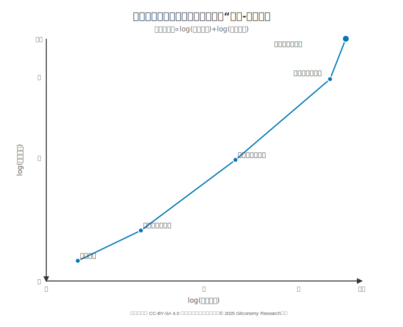

*图：能量密度与信息密度突破所驱动的“技术-经济范式“*

1. **能量驱动信息**

能量密度的提升是信息革命得以发生和普及的物理前提，它为信息基础设施的建设和运行提供了必要的动力与资源。

- 农业盈余与文字的诞生：新石器时代的农业革命，通过灌溉等技术实现了能量产出的稳定增长，创造了人类历史上第一次显著的食物盈余 。正是这些盈余，使得社会能够供养一批不直接从事生产的专业人士，如祭司和书吏。他们有时间和资源去发展、维护和使用复杂的书写系统。没有农业提供的能量基础，文字这种高耗时、高训练成本的信息技术便无从谈起。
- 化石燃料与大众媒体：古登堡的印刷机虽然是革命性的，但其大规模普及离不开工业革命带来的能量支持。以煤炭为动力的蒸汽印刷机 极大地提高了印刷速度，而同样由煤炭驱动的工厂则能大规模生产廉价的纸张。没有化石燃料提供的强大而廉价的动力，报纸、书籍和杂志就不可能成为真正的大众媒介。
- 电力与数字时代：整个数字文明的基石是稳定、高密度的电力供应。从制造芯片所需的大量电力，到维持全球数据中心（其能耗已堪比中等国家 ）的持续运转，再到驱动全球光纤网络的信号传输，每一个环节都高度依赖于主要由化石燃料和核能构成的现代电网。可以说，没有电力，就没有互联网和信息社会。

2. **信息引导能量**

反过来，信息密度的提升则为人类发现、开采、转化和分配能量提供了关键的知识和组织工具，极大地提高了能量系统的效率。

- 文字与资源管理：古代帝国利用书写系统进行人口普查、土地丈量和税收记录，从而能够以前所未有的规模和效率组织劳动力和物质资源（即能量），用于兴建金字塔、长城、罗马水道等大型工程 。文字是实现大规模能量调配的“软件”。
- 科学知识与化石能源：通过印刷术积累和传播的现代科学知识，特别是地质学、化学和物理学，是系统性勘探和高效利用煤炭、石油资源的关键。如果没有科学理论的指导，这些地下能源可能仍是零星、偶然的发现。当代，基于计算机模拟的三维地震成像技术 等纯粹的信息技术，更是现代油气勘探的核心。
- 智能电网与可再生能源：当前全球向可再生能源转型的最大挑战之一是其固有的间歇性（如风能和太阳能）。解决方案完全依赖于高度复杂的信息系统。“智能电网” 通过部署大量传感器，利用实时数据流和先进算法，精确匹配波动的能源供给和变化的用户需求，从而维持电网的稳定。这是信息技术引导和管理新能源体系的典型范例。

能量与信息的这种紧密耦合，共同催生了历史上一个个相对稳定的“技术-经济范式”。例如，20世纪中叶的美国社会，其范式建立在廉价石油（能量）和广播电视等大众媒体（信息）的完美结合之上。这一组合共同塑造了以大规模生产、大规模消费和郊区化生活为特征的社会形态。当双螺旋中的一环受到冲击，整个范式就会面临危机。1970年代的石油危机严重冲击了能量端，这反过来极大地刺激了信息端的创新——为了提高能源效率和寻找替代能源，对微处理器、计算机网络和自动化控制技术的需求激增，从而加速了数字革命的到来。这揭示出，文明的变迁并非平稳的线性过程，而是一系列“有核稳定期”被双螺旋内部的失衡所打破，经过一段时期的混乱与重构，最终形成新的、更高层次的稳定范式。

为了更清晰地展示这种共演关系，下表总结了不同历史时期的能量-信息范式及其对应的社会形态。

| 时代/纪元 | 主导能量体制与密度 | 主导信息体制与密度 | 典型社会结构 | 关键“双螺旋”造物 |
| :--- | :--- | :--- | :--- | :--- |
| **农业帝国** | 生物质/人力（低） | 书写/行政文书（低） | 等级制、中央集权的贡赋帝国 | 泥板与谷仓 |
| **早期工业时代** | 煤炭/蒸汽机（中） | 印刷/机械复制（中） | 工业资本主义、民族国家 | 蒸汽机与报纸 |
| **高峰工业/液态烃时代** | 石油/内燃机（高） | 广播/模拟信号（高） | 大众消费社会、超级大国 | 汽车与电视 |
| **全球信息时代** | 电力/数字网络（极高）| 互联网/数字信息（极高）| 全球化、网络化社会 | 微处理器与互联网 |

*表：能量与信息密度体制及其对应文明形态的比较年表*

### 1.2 AI大模型的历史坐标：信息密度的一次“相变”

然而，我们当前正处在一场性质截然不同的革命之中——**智能革命**。这场革命的核心驱动力不再是能量密度，而是信息密度的指数级提升。信息熵公式（$S=−plogp$）为我们提供了理解这一变革的物理学基础。熵（S）是系统不确定性或混乱程度的度量。一个高熵系统，如充满噪音的原始数据，其信息密度极低；反之，一个低熵系统，如从中提炼出的简洁规律或深刻洞见，其信息密度极高¹。从这个原理出发，我们可以得出一个核心论断：

> **智能的本质，是降低信息熵的过程。**

我们可以从这个视角重新定义文明的本质：文明是一个持续进行熵减、创造秩序的过程。 在这个过程中，有两个最核心的要素：一是实现熵减所必须的能量，二是熵减所创造的秩序的度量——信息。信息就是秩序，秩序就是信息。一个高度有序的系统，蕴含的信息量也必然是巨大的。本课程的第一个核心认知，就是希望同学们能建立起这样一个超越纯粹计算机科学的世界观，将我们即将讨论的AI技术，放置在物理学定律和人类文明史的坐标系中去理解其深刻意义。

让我们将目光聚焦于今天的主角——AI大模型。如果说计算机的发明是信息处理密度的革命，那么AI大模型，特别是以GPT系列为代表的生成式AI，则标志着人类历史上一次前所未有的信息密创造密度的跃升。过去的计算技术，无论是个人电脑还是超级计算机，其本质是执行人类预设的指令，加速信息的处理、计算和检索。它们是强大的工具，但信息的创造源头依然是人类。而AI大模型通过在海量数据中学习，获得了生成全新、连贯、且具有逻辑性的内容的能力。它不再仅仅是信息的搬运工和计算器，而成为了信息的“创作者”。

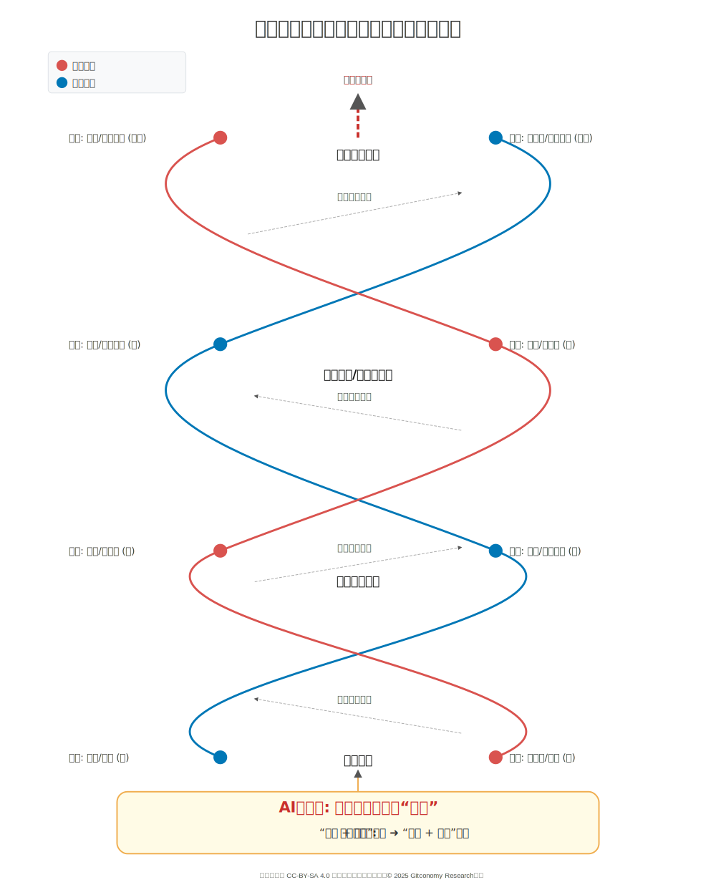

*图：AI大模型在信息密度演进中的“相变”*

我们将AI大模型的出现，定义为信息密度演进过程中的一次**相变**。如同水在零度时会从液态变为固态，性质发生根本改变，AI大模型也让信息处理系统从“计算”的量变，积累到了“创造”的质变。这一“相变”的背后，是信息密度提升的驱动力发生了根本性的转移。在历史上，信息密度的提升依赖于“人脑+工具”的模式，无论是古腾堡的印刷机还是冯·诺依曼的计算机，其效率的上限最终仍受制于人类的认知和操作能力。而AI大模型的出现，标志着驱动力转向了**算法+算力+算据**。这意味着，信息的创造规模和速度，将首次摆脱人类生物学极限的束缚。当一个系统能够自主学习和创造信息，并且其能力可以通过增加计算资源（能量输入）而持续提升时，我们便进入了一个全新的范式。

## 小结

本章我们从物理学的第一性原理出发，确立了“信息密度”作为理解AI革命的核心理论框架。我们论证了人类文明的每一次重大跃迁，都源于对能量或信息密度的突破性掌控。在此基础上，我们将AI大模型定义为一次信息创造密度的“相变”——它标志着信息创造的驱动力，首次从“人脑+工具”模式，决定性地转向了“算法+算力”模式。这一根本性的转变，为我们接下来深入剖析其技术实现路径奠定了理论基础。

---

💡 **互动环节：问题讨论**

1. 讲义以“能量密度 + 信息密度”作为分析文明演进的框架 。请尝试用这个框架分析当前全球在尖端半导体领域的竞争。这场“芯片战争”本质上是在争夺哪一种密度的控制权？它又将如何反过来影响全球的能量格局？

2. 讲义将“智能”的物理学本质定义为“降低信息熵的过程” 。您是否完全认同这个定义？它在解释人类的创造力、情感或自我意识等复杂智能现象时，可能会有哪些局限性？

3. 如果AI大模型真的将信息创造的驱动力从“人脑+工具”决定性地转向了“算法+算力” ，并摆脱了人类生物学极限的束缚，那么在未来50年，人类在知识生产和科学发现中的核心角色会是什么？

---

## 第二章	AI大模型的技术内核：信息密度提升的实现路径

在第一节，我们确立了AI大模型作为“信息创造密度”的一次相变。本章我们将深入技术内部，探究这一相变是如何通过具体的算法和模型架构实现的。我们将看到，技术的每一次演进，其本质都是为了更高效地从数据中压缩、表征和生成信息。

### 2.1 架构革命：挣脱先验束缚，开启高密度信息表征

人工智能的发展历程并非一条平坦的直线，而是一部思想范式不断迭代、核心理念持续演进的壮阔史诗。回顾这段简史，我们可以清晰地看到五个环环相扣的时代，每一次跃迁都代表着我们对“智能”本质理解的深化。



*图：人工智能发展简史*

旅程始于符号主义AI时代（约1950s - 1980s），在那个“逻辑为王”的年代，先驱者们相信智能的核心是符号处理与逻辑推理，他们试图通过编写精密的规则和知识库，构建出能够模仿人类专家决策的“专家系统”。然而，现实世界的复杂性很快让纯规则驱动的范式遇到了瓶颈，促使重心转向了统计机器学习时代（约1980s - 2000s）。其核心思想发生了根本转变：与其“告知”计算机规则，不如让它从数据中自主学习统计规律。支持向量机（SVM）、决策树等经典算法在此期间大放异彩，标志着AI从“演绎”走向“归纳”，从依赖人类知识转向依赖数据驱动。

进入21世纪，随着数据量的爆炸式增长和GPU计算能力的飞跃，深度学习革命（约2010 - 2018）应运而生。研究者们发现，通过构建层级更深的神经网络，可以自动学习数据中从简单到复杂的层次化特征，使机器在特定任务上的表现首次超越了人类。这一时代的巨大成功，正是建立在为特定数据类型量身定制的专门化架构之上，以高效捕捉不同数据的内在结构。这些模型的设计包含了人类对特定数据模式的先验知识，从而在降低计算复杂度的同时，也成为了模型能力的天花板。

在Transformer架构出现之前，深度学习领域处理特定类型数据的主流模型是卷积神经网络（CNN）和循环神经网络（RNN）。

- **卷积神经网络（Convolutional Neural Network，CNN）**：通过卷积核的设计，利用了图像数据的空间局部性（一个像素与其邻近像素关系更密切）。这种设计极大地减少了模型参数，使其在计算机视觉领域取得了巨大成功。但其“感受野”是局部的，难以直接捕捉图像中相距很远的两个物体之间的关系。

- **循环神经网络（Recurrent Neural Network，RNN）**：通过循环结构，利用了序列数据的时序性（当前时刻的输出依赖于前一时刻的状态）。这使其天然适用于处理语言、语音等序列信息。但RNN存在梯度消失/爆炸问题，难以处理长距离依赖，即一个句子末尾的词很难与句首的词建立有效关联。

CNN和RNN都包含了人类对特定数据模式的**先验知识**或**归纳偏置**。这种先验知识在降低了计算复杂度的同时，也成为了模型能力的天花板，限制了它们捕捉更普适、更复杂规律的能力。

2017年，Google提出的Transformer架构彻底改变了这一局面。其核心是**自注意力机制（Self-Attention）**。简单来说，自注意力机制允许模型在处理一个序列中的某个元素（例如一个词）时，同时计算并衡量序列中所有其他元素对该元素的重要性。它不再局限于局部或线性的依赖关系，而是直接计算一个全局的、动态的关联权重矩阵。

这种设计的革命性在于，它几乎放弃了所有的结构先验。它不再假设数据是局部的或严格时序的，而是赋予模型在训练中自己去学习任意两个位置之间复杂关系的能力。这带来了极高的信息表征自由度。然而，这种自由度的代价是巨大的计算量。自注意力机制的计算复杂度是序列长度的平方（$O(n^2)$），远高于CNN的局部计算和RNN的线性计算。

从我们“能量与信息密度”的分析框架来看，Transformer的成功，本质上是用巨大的计算量（能量消耗）换取了对模型结构约束的解放，从而实现了前所未有的信息表征密度和灵活性。它通过一种近乎“暴力”的全局计算，使得模型能够从海量数据中发现并编码远比先前架构复杂得多的信息模式。这完美地诠释了如何通过提升能量输入（算力），来直接换取模型内部信息密度的提升。AI大模型技术的时代演进

### 2.2 规模的暴力美学：跨越临界点，智能的“涌现”

Transformer架构为模型能力的提升打开了空间，而**规模定律（Scaling Law）** 则指明了通往这条道路的路径。由OpenAI等机构通过大量实验发现，当模型的参数量、训练数据量和所用的计算量这三个要素同时按指数规律增长时，损失函数会在对数坐标系下呈现出可预测的线性下降，这表示模型性能在随着这些因素的增加而持续改善。

这揭示了一个简单而深刻的道理：“大力出奇迹”背后是有规律可循的。只要持续投入更多的算力和数据，模型的性能就会稳定提升。这为训练更大、更强的模型提供了理论依据和工程指导，使得AI的发展进入了“规模驱动”的暴力美学阶段。

然而，Scaling Law最令人着迷的并非其可预测的线性提升，而是在规模达到某个临界点后，模型会突然表现出在小模型上完全不存在的、未被直接训练过的新能力，这被称为**涌现（Emergence）** [3]。

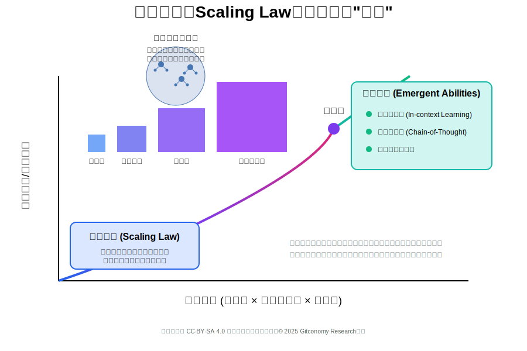

*图：规模定律（Scaling Law）下的智能"涌现"*

典型的涌现能力包括：

- **上下文学习（In-context Learning）**：无需重新训练，仅通过在提示（Prompt）中给出几个示例，模型就能学会并完成新的任务。

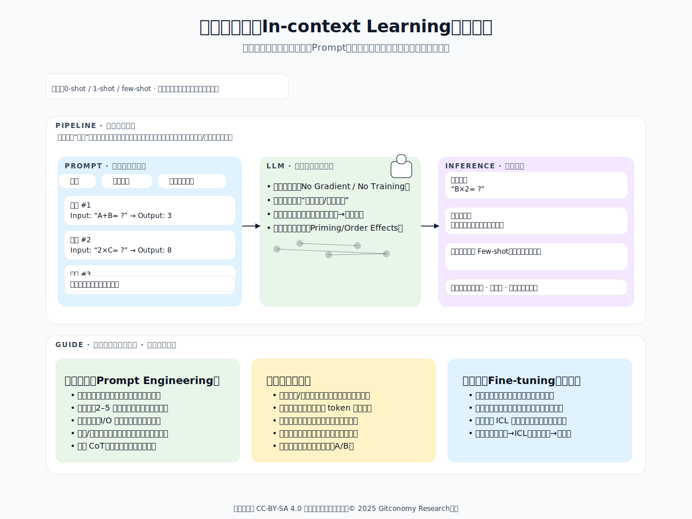

*图：上下文学习示意图*

- **思维链（Chain-of-Thought）**：对于复杂问题，模型能自主地将问题分解成中间步骤进行推理，并给出最终答案，显著提升了逻辑推理能力。

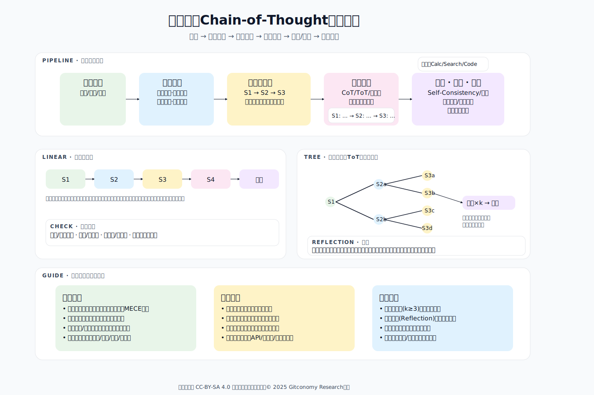

*图：思维链示意图"*

如何理解“涌现”？再次运用我们的核心理论，可以将这一现象解释为：**当模型内部被压缩的信息密度达到某个阈值时，这些信息在复杂的内部连接中发生了“相变”，形成了新的、更高层次的结构化知识和推理能力[4]。** 这就像足够多的水分子在足够低的温度下会自发地结成有序的冰晶一样。参数和数据量的巨大增长，使得模型内部不仅仅是存储了零散的“知识点”，而是形成了能够泛化和推理的“知识图谱”和“逻辑框架”。规模，成为了通往更高智能的阶梯。

### 2.3  智能的驯服与引导：从原始信息势能到价值对齐

一个强大的大模型是如何诞生的？其过程主要分为两个核心阶段：**预训练（Pre-training）和对齐（Alignment）**。

  * **预训练（Pre-training, PT）**：这是最大化模型“信息密度”的阶段。在这个阶段，模型会“阅读”几乎整个互联网的文本、书籍、代码等海量无标签数据。其学习目标通常很简单，比如“预测下一个词”。通过这个看似朴素的任务，模型被迫去学习语言的语法、事实知识、不同概念间的关系，乃至某种程度的逻辑推理和世界模型。这是一个无监督或自监督的过程，目标是让模型尽可能地吸收和压缩人类知识，构建一个强大的、通用的“基础模型（Foundation Model）”。

  * **对齐（Alignment）**：预训练出的基础模型如同一个知识渊博但行为不可预测的“野人”。它知道很多事，但不知道该如何与人交流，不知道哪些回答是好的、有用的、无害的。对齐阶段的目的，就是将模型巨大的**信息势能引导到符合人类期望和价值观的方向上，为其赋予一个“价值向量**。这个过程通常包含两个步骤：

      * **指令微调（Supervised Fine-Tuning, SFT）**：用一批高质量的“指令-回答”数据对模型进行微调，教会模型理解并遵循人类的指令格式。
      * **基于人类反馈的强化学习（Reinforcement Learning from Human Feedback, RLHF）**：这是对齐的关键。首先，让模型对同一个指令生成多个回答；然后，由人类标注员对这些回答进行排序，告诉模型哪个更好；接着，用这些排序数据训练一个“奖励模型（Reward Model）”，让这个奖励模型学会代替人类进行打分；最后，使用强化学习算法，让大模型在与奖励模型的互动中不断优化自己的回答策略，以获得更高的“奖励分数”。

通过预训练和对齐这两个步骤，我们最终得到了一个既博学又“懂礼貌”的AI助手。理解这两个阶段至重要，它告诉我们，一个成功的大模型，不仅是技术问题，更是社会和伦理问题。“对齐”是确保这项强大技术能够安全、负责任地服务于人类社会的关键缰绳。

### 2.4 生态的“寒武纪”：开源浪潮与模型的百花齐放

基于上述的技术路径，AI领域迎来了模型的“寒武纪大爆发”。全球范围内涌现出了一批具有代表性的大模型，它们在架构、训练数据和对齐策略上各有侧重，共同推动着技术前沿的拓展。

这种增长不仅限于小型、微调模型的累积。根据斯坦福大学《2024年AI指数报告》，仅在2023年，全球就发布了149个新的基础模型，是2022年的两倍多[5]。而最新的《2025年AI指数报告》数据显示，尽管2024年的增速放缓至约12%，但新增基础模型数量仍达到167个[6]，显示出市场在高速扩张后趋于成熟。

开源社区平台Hugging Face作为AI模型事实上的中央存储库，其增长数据最直观地反映了这一趋势。平台托管的模型、数据集和应用总数已突破100万乃至200万大关。社区的活跃是这一增长的核心动力，Hugging Face通过竞赛、资源支持和云服务商合作，极大地激励了社区贡献[7]。

这一演变过程揭示了一个重要的产业发展规律。最初，巨大的技术和资本门槛导致了少数参与者的市场主导地位。随后，以Llama为代表的开源运动极大地降低了这一门槛，促使模型数量急剧增加。供应的激增自然带来了价格压力，并迫使市场参与者寻求差异化竞争。这种差异化并非体现在模型的基础通用能力上，而是在于特定高价值任务（如代码生成、金融风控）上的性能与成本比。因此，模型数量的激增并非无序的扩张，而是市场在自我调节、向垂直行业解决方案演进的明确信号。

开源运动正在重塑力量的平衡。斯坦福大学的数据显示，2024年新发布的基础模型中，开源模型的比例持续维持在65.7%的高位，远高于往年，直接挑战了闭源模型的统治地位[5]。

这一系列数据揭示了两个深层结构性变化。首先，AI模型生态已从**供给约束型**转变为**需求驱动型**。以Llama、DeepSeek等为代表的开源模型的不断涌现，有效解决了供给瓶颈。如今，行业的瓶颈不再是能否获得一个强大的模型，而是如何将合适的模型应用于特定的业务场景。这种转变催生了强大的下游拉动效应，金融、医疗、法律等垂直领域的需求开始直接引导专用模型的开发和微调。

其次，模型的增长呈现出**衍生特征**。一个强大的开源基础模型（如Llama 3）发布后，会像树干一样，迅速分化出成百上千个针对特定任务或语言进行微调的“枝干”（即衍生模型）。同样，DeepSeek通过开源其性能比肩顶尖闭源模型、但成本显著降低的系列模型，向业界投下了一枚重磅炸弹，迫使整个行业重新审视开源模型在未来竞争格局中的颠覆性力量。这意味着增长是爆炸性且自相似的，不断填充所有可以想象到的生态位。这正是“寒武纪爆发”的核心特征：**一个关键的进化创新（可访问的高性能模型）导致了物种多样性的急剧扩张。**

### 小结

本章我们深入剖析了AI大模型的技术实现路径，这条路径完美地诠释了“信息密度”从量变到质变的全过程。我们看到，Transformer架构首先通过“挣脱先验束缚”，为承载高密度信息创造了理论上的可能；接着，“规模的暴力美学”通过海量算力投入，推动信息密度“跨越临界点”，从而催生了智能的“涌现”；随后，通过预训练和对齐的“驯服与引导”，这种原始的智能被塑造成可控、有价值的工具；最终，当这些工具通过开源浪潮被广泛传播时，便在产业端引发了“寒武纪”式的创新爆发。这条从技术内核到生态爆发的完整链条，为我们理解下一章将要讨论的算力基石的重要性，提供了坚实的逻辑支撑。

---

💡 **互动环节：问题讨论**

1. 讲义将大模型能力的“涌现”类比为一种“相变” 。您认为“涌现”出的能力（如思维链）是模型真正掌握了高级推理能力的证据，还是仅仅是对海量训练数据中隐藏模式的复杂模仿？您会如何设计一个实验来鉴别这两种可能性？

2. “对齐”（Alignment）的目的是将模型巨大的信息势能引导到符合人类价值观的方向上 。那么，应该由谁来定义和决定这些“人类价值观”？是模型开发者（企业）、政府，还是一个更广泛的国际社区？当不同文化背景下的价值观发生冲突时，模型应如何“对齐”？

3. 开源模型的“寒武纪大爆发”极大地降低了AI技术的准入门槛 。这对于AI领域的创新是利大于弊，还是弊大于利？它会加速技术进步，还是可能导致大量同质化、低质量模型的泛滥，反而增加了寻找真正有价值创新的难度？

---

## 第三章	算力的基石：超越规模的极限

当前人工智能时代由一个简单而强大的公理所定义：越大越好。这一范式通过“规模法则”（Scaling Laws）得到了经验性验证，它假设了计算能力（算力）、数据量、模型规模与涌现的智能之间存在直接且可预测的关系。这引发了一场以浮点运算次数（FLOPS）为衡量标准的原始算力军备竞赛，其中，进步等同于在更庞大的超级计算机上构建更庞大的模型。然后，人工智能正接近一个拐点，在这一点上，能量密度（即算力的粗放式应用，及其相关的经济和环境成本）与信息密度（即模型的实际智能、效率和效用）之间的关系正在瓦解。对规模的极致追求正带来边际效益递减，并制造出战略脆弱性。

### 3.1 规模法则范式及其浮现的边界

1. **理解神经规模法则**

人工智能领域的普遍共识是，更大的模型在更多数据上训练后表现更佳。这不仅仅是直觉，研究已证明，性能的提升遵循可预测的模式，通常表现为幂律关系。这一核心原则指出，模型性能（通常以损失函数值衡量）会随着模型规模（参数数量）、数据集规模和训练所需算力的增加而可预测地提升。这种量化关系为过去数年间投入人工智能领域的巨额资本提供了理论依据。

关键的理论模型之一是 **“Chinchilla规模法则”** [8]。该法则提出，在固定的计算预算下，为实现最优性能，模型参数量（N）和训练数据量（D）应等比例扩展，即 $N \\propto D$\ 。这一结论修正了早期研究中更倾向于优先扩大模型规模的观点，反映了业界对规模法则理解的深化。该法则通过一个公式描述了模型最终损失（L）与模型参数量AI大模型技术的时代演进（N）、训练数据量（D）和算力（C）之间的关系：

$$L(N,D) = E + \frac{A}{N^\alpha} + \frac{B}{D^\beta}$$

其中，$E$ 代表理想生成过程的不可约损失，$A$、$B$、$\alpha$、$\beta$ 是通过拟合得到的常数。这个公式清晰地表明，增加模型参数和数据量可以系统性地降低模型损失。

然而，规模的效应并非单一不变。研究进一步将规模法则划分为不同区间[9]。在“方差受限”区间，当数据或模型宽度趋于无限时，性能的提升与参数或数据量的增加成简单的反比关系。而在更复杂的“分辨率受限”区间，性能提升的速率则取决于数据流形的内在维度和复杂性。这意味着，当模型试图解析数据中更精细的结构时，单纯增加参数或数据带来的收益会变得不那么直接和高效。这种区分说明，规模的红利并非无限，其效益会随着任务复杂性的增加而变化。

2. **基石的裂痕：规模的隐性成本**

尽管规模法则为人工智能的发展指明了一条看似清晰的路径，但这条路径正变得日益崎岖。当我们从理论性能转向现实世界的影响时，以规模为先的范式所带来的负面外部性正变得不可忽视。

|类型|具体的挑战|
|:---|:---|
|**经济的不可持续性**|训练前沿模型的成本正以指数级速度增长[10]。以GPT-4和Gemini等模型为例，其单次训练成本已高达数千万美元，并且有预测指出，到2027年，训练一个顶级模型的成本可能达到十亿美元。这种高昂的成本正在构筑一个难以逾越的准入门槛，将塑造未来的能力集中在少数资金雄厚的超大规模企业和国家手中。值得注意的是，在这些成本构成中，能源消耗仅占2-6%，而主要的开销是用于购买AI加速器芯片、服务器组件以及高速互连设备，这些硬件采购成本比摊销的训练成本高出一到两个数量级。|
|**物理与环境的制约**|对算力的无尽渴求正与地球的物理承载能力发生冲突，其环境代价日益凸显。  <ul><li>**能源消耗**：训练一个大型语言模型，如GPT-3，需要消耗约1300兆瓦时（MWh）的电力，这足以供应约130个美国家庭一年的用电量[11]。随着模型规模的增长，能源需求也在飙升。据预测，到2030年，数据中心（尤其是承载AI负载的数据中心）的电力消耗可能占全球总需求的21%，与航空业等传统高耗能产业相当[12]。更具体地说，一次由人工智能驱动的搜索查询所消耗的能源是传统搜索的10倍[13]。<li>**碳足迹**：巨大的能源消耗直接转化为庞大的碳足迹。一项研究发现，训练一个大规模深度学习模型可排放高达62.6万磅的二氧化碳，相当于五辆汽车整个生命周期的排放量[13]。这与全球应对气候变化的目标背道而驰，并给相关企业带来了日益增长的声誉和监管风险。<li>**水资源消耗**：一个常被忽视但同样严峻的问题是水资源消耗。数据中心需要抽取大量淡水来冷却服务器。例如，谷歌位于俄勒冈州的数据中心每天消耗超过1000万加仑的水，而微软在艾奥瓦州的数据中心每月也需要1150万加仑的水，这已在部分地区引发了水资源短缺和社区矛盾[13]。</ul>|
|**数据质量的瓶颈**|规模法则的另一个基本假设是拥有近乎无限的高质量训练数据。然而，业界正逼近公共互联网上高质量文本和图像数据的储量极限AI大模型技术的时代演进AI大模型技术的时代演进AI大模型技术的时代演进。这意味着，未来的模型性能提升将越来越依赖于数据质量的提升，而非仅仅是数量的增加。如何筛选、清洗和生成高质量数据，是一个比单纯扩大数据规模远为复杂和棘手的挑战。|

这些裂痕共同指向一个结论：以能量密度（原始算力）无限换取信息密度（模型智能）的路径正走向尽头。规模法则的可预测性曾是其最大的吸引力，它为研发和投资提供了一条清晰的线性路径——投入更多的算力和数据，就能获得更好的模型。然而，这种可预测性也形成了一个战略陷阱。它将竞争者锁定在资本密集型的军备竞赛中，竞争的核心变量简化为获取资本和先进半导体的能力。这种模式抑制了对其他可能在短期内不那么确定、但长期更具可持续性和战略优势的、更高效范式的投资。一个完全以其能采购多少GPU来定义其AI战略的国家或企业，正将自己的未来建立在一个日益昂贵且不稳定的基础之上。

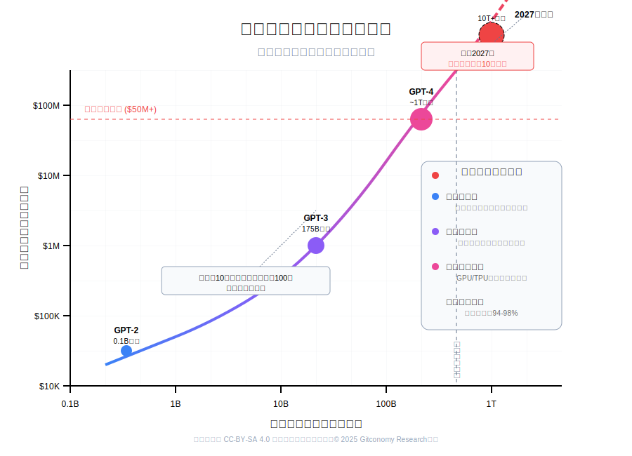

*图：AI大模型规模与训练成本关系”*

更深层次的影响在于，**算力的地缘政治化**。当少数实体能够承担训练前沿模型的巨大成本时，对底层硬件（如先进GPU）的获取就成为了一个关键的地缘政治扼制点。控制这些芯片的供应链，便成为一种强有力的外交政策工具，&能够加速或瘫痪一个国家的AI发展雄心。因此，规模法则的局限性已不再仅仅是技术或经济问题，它已演变为一个关乎国家安全的核心议题。这使得建立一个自主、可控的算力基础设施，从商业上的优先选项，上升为战略上的必然选择。

### 3.2 大模型的新轨迹：效率的架构

面对规模法则的局限，业界正在探索一条新的发展轨迹，其核心是从追求“规模”转向追求“效率”。一系列创新的AI架构应运而生，它们从根本上改变了算力、知识和模型能力之间的关系，为超越蛮力扩展提供了可行的路径。

1. **线性时间序列建模：Mamba与状态空间模型（SSM）的革命**

现代大型语言模型的基础——Transformer架构——其核心是自注意力（self-attention）机制。这一机制虽然强大，但其计算和内存需求随序列长度呈二次方增长（$O(N^2)$），这使其在处理超长文本、高分辨率音频或基因组等长序列数据时变得异常昂贵甚至不可行。

**状态空间模型（State Space Models, SSM）** 为解决这一瓶颈提供了新的思路。SSM是一类受经典控制理论启发的模型，它通过将序列的全部历史信息压缩到一个固定大小的隐藏“状态”向量中，并以循环的方式进行更新，从而能够以线性或近线性的时间复杂度处理序列[14]。

**Mamba架构**在SSM的基础上实现了关键突破，即引入了“选择机制”。与以往SSM中固定的、与输入无关的参数不同，Mamba的SSM参数是根据当前输入动态生成的。这一机制使得模型能够有选择性地决定是保留还是遗忘历史信息，从而能够进行基于内容的推理。例如，在处理一段代码时，模型可以记住一个变量的定义，并在数百行之后引用它，同时选择性地遗忘中间的无关注释。这种能力克服了传统SSM的局限性，使得Mamba在实现线性时间复杂度的同时，其性能可以媲美甚至超越同等规模的Transformer模型，尤其是在长序列任务上。实验表明，Mamba的推理吞吐量可达到同等规模Transformer的5倍[14]。

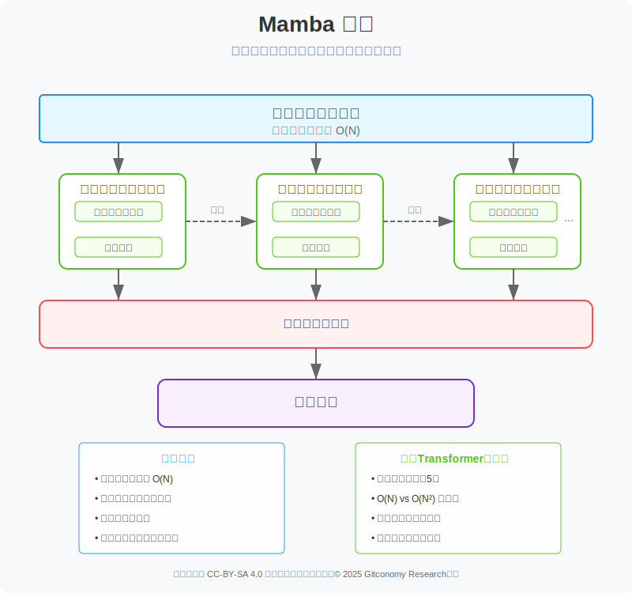

*图：Mamba-架构示意图*

Mamba等SSM架构的战略意义在于，它们不仅是“更快的Transformer”，更开启了此前因序列长度限制而难以涉足的应用领域，例如对整个基因组序列的分析、高保真度音频的生成，以及对包含数百万词元（token）的法律或技术文档的深入理解[14]。

2. **扩展智能而非算力：专家混合（MoE）方法**

传统的“密集”模型架构中，每个输入词元都会激活模型的所有参数进行计算。这意味着模型的推理成本与其参数规模直接挂钩，模型越大，计算越慢、越昂贵。

**专家混合（Mixture-of-Experts, MoE）** 架构采用了一种“分而治之”的策略来打破这种耦合关系[17]。在MoE模型中，标准的密集前馈网络层（FFN）被替换为一组并行的、规模较小的“专家”网络。对于每一个输入词元，一个轻量级的“门控网络”（gating network）或称为“路由器”（router）会动态地选择一小部分专家（例如，从8个专家中选择2个）来处理该词元。

这种**稀疏激活**的原则是MoE的核心。它成功地将模型的总参数量与处理每个词元所需的计算量（FLOPs）解耦。这使得构建拥有数万亿参数但推理成本与小得多的密集模型相当的巨型模型成为可能。例如，一个拥有8个专家的MoE层，即使每个词元只激活2个专家，其总参数量可以是密集模型的8倍，但计算成本仅为密集模型的2倍。

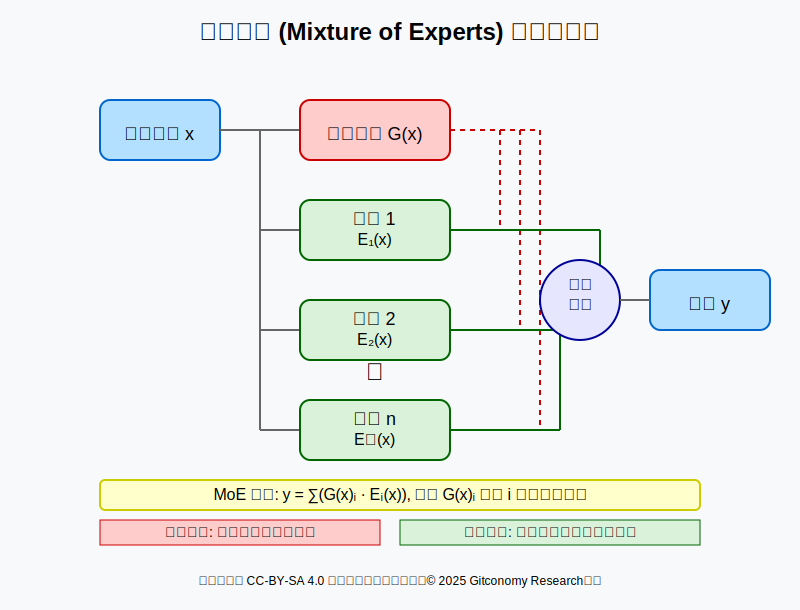

*图：混合专家 (MoE） 架构示意图*

MoE架构的主要优势在于，它能够在不显著增加推理成本的前提下，极大地扩展模型的容量，使其能够学习更广泛、更多样的知识\。当然，这种架构也带来了新的挑战，如训练过程中的不稳定性以及确保所有专家都得到有效利用的“负载均衡”（load balancing）问题。

3. **解耦知识与参数：检索增强生成（RAG）**

标准的大型语言模型（LLM）将其全部知识以参数的形式存储在模型内部，这些知识是在训练阶段从海量数据中学习得到的。这种“参数化知识”存在几个固有缺陷：它是静态的，一旦训练完成便无法轻易更新；它可能过时；并且容易产生“幻觉”，即生成看似合理但与事实不符的内容。

**检索增强生成（Retrieval-Augmented Generation, RAG）**架构通过将LLM与一个外部的、可动态更新的知识库（如向量数据库）相连接，来解决上述问题。其工作流程通常包括两个阶段：

 - **检索（Retriever）**：当接收到用户查询时，一个检索模块会首先在外部知识库中搜索相关的文档或数据片段。
 -   **生成（Generator）**：检索到的信息会与原始查询一起，作为上下文被输入到LLM中，引导模型生成基于事实、内容更准确的回答。

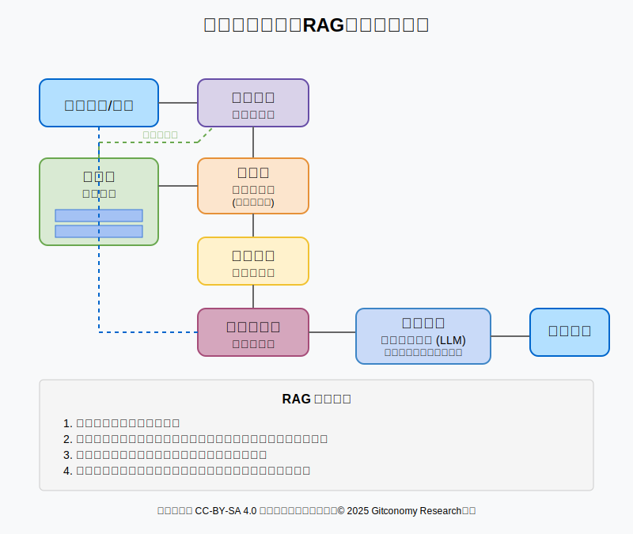

*图：检索增强生成（RAG） 架构示意图*

RAG的战略价值在于它将AI系统的“知识”部分外化。这减轻了LLM记忆事实的负担，使得规模较小的模型也能胜任知识密集型任务。它显著提高了生成内容的真实性，并能提供信息来源以供核查，增强了系统的透明度和可信度。最重要的是，知识库可以被实时更新，只需简单地添加或修改数据库中的文档，就能让AI系统掌握最新的信息，而无需进行昂贵的模型再训练。这代表了一种范式转变——从试图打造一个“无所不知”的模型，转向构建一个“善于查证”的系统。

这三种架构创新共同构成了一场对传统密集Transformer模型计算复杂性的多维度改善。Transformer的低效率源于三个相互耦合的问题：随序列长度二次方增长的计算复杂性、所有参数被密集激活，以及推理能力与参数化知识存储的混同。**Mamba、MoE和RAG分别对这三个问题进行了战略性的“解绑”**：Mamba改善了计算复杂性问题（从 $O(N^2)$ 降至 $O(N)$）；MoE改善了密集激活问题（将参数量与计算量解耦）；RAG改善了知识存储问题（将知识与参数解耦）。这预示着AI的未来并非由单一的“Transformer杀手”主导，而是一个由多种专用架构组成的工具箱，它们可以被组合使用以实现复合效率。最先进的系统很可能将是混合体，例如，采用Mamba作为骨干网络，并集成MoE层和RAG框架。

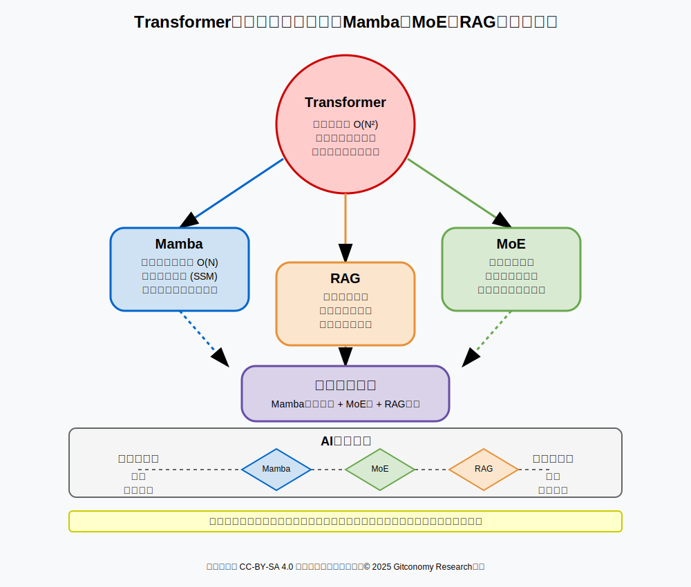

*图：三种架构协同提升Transformer的计算效率*

更进一步，RAG和MoE等架构的出现，正推动AI从**模型即制品（Model as Artifact）**向**系统即服务”（System as Service）演变**。一个传统的密集模型一旦训练完成，就是一个功能固定的静态制品。然而，RAG将推理过程转变为一次实时的数据库查询，系统的行为取决于外部知识库的当前状态。MoE则将推理过程变为一个条件计算路径，具体的计算流取决于输入的数据本身。这使得“模型”从一个单一的文件，演变成一个动态的、有状态的复杂系统。部署和管理这样的系统远比部署一个静态模型复杂，需要对检索、路由、生成等多个组件进行精密的协同调度。这种复杂性进一步凸显了对一个能够高效管理这些动态工作流的、深度整合的软硬件技术栈的迫切需求。

| AI架构范式对比分析 | 密集Transformer | Mamba (SSM) | 专家混合 (MoE) | 检索增强生成 (RAG) |
| :--- | :--- | :--- | :--- | :--- |
| **计算复杂度** | 随序列长度 $O(N^2)$ | 随序列长度 $O(N)$ | 与密集模型相当，但参数量可大数倍 | 检索开销 + 生成开销 |
| **内存使用模式** | 随序列长度 $O(N^2)$ 的注意力矩阵 | 固定的循环状态，内存占用低 | 需加载所有专家参数，但仅激活部分 | 需加载检索到的上下文 |
| **主要优势** | 强大的上下文建模能力 | 处理超长序列的效率和性能 | 以较低的推理成本实现巨大的模型容量 | 动态、可验证的知识，减少幻觉 |
| **主要局限** | 对长序列的计算成本过高 | 复杂关联推理能力待进一步验证 | 训练不稳定，存在负载均衡挑战 | 依赖检索质量，可能引入噪声 |
| **理想用例** | 通用语言任务（中短序列）| 基因组学、高保真音频、长文档分析 | 需要极大知识容量的通用大模型 | 问答系统、企业知识库、实时信息服务 |

### 3.3 优化推理生命周期：从训练到部署

如果说第二部分描述了如何设计新一代AI模型的“引擎”，那么本部分则聚焦于如何对任何“引擎”进行调优。尽管模型训练的成本高昂，但从其整个生命周期来看，被数亿乃至数十亿次调用的推理成本才是AI经济的重心 。因此，为了让强大的AI模型能够在多样化的现实场景中（尤其是在手机、边缘设备等资源受限的环境中）实现经济、高效的部署，一系列模型优化技术应运而生 。这些技术的核心目标都是在尽可能保持模型性能的同时，显著降低其体积、内存占用和计算需求。

#### 3.3.1 模型压缩与知识转移

1. **知识蒸馏**

知识蒸馏（Knowledge Distillation）是一种有效的模型压缩技术，其核心思想是训练一个规模较小、结构更简单的“学生模型”，使其模仿一个规模庞大、能力更强的“教师模型”的行为[15]。在蒸馏过程中，学生模型不仅从真实的标签中学习，更重要的是学习教师模型输出的软标签，即完整的概率分布。这些概率分布蕴含了教师模型对于不同类别之间相似性的“暗知识”。通过这种方式，教师模型的“智能”被有效地迁移（或“蒸馏”）到一个更紧凑的模型中，使其能够在手机、边缘设备等资源受限的环境中部署，从而实现先进AI能力的普及。

2. **剪枝**

神经网络在训练后通常存在大量的参数冗余。剪&枝（Pruning）技术旨在识别并移除这些冗余或不重要的部分，以减小模型尺寸并加速推理。剪枝主要分为两类：

  * **非结构化剪枝（Unstructured Pruning）**：移除模型中单个的、独立的权重连接。这种方法可以实现非常高的稀疏度，但会导致权重矩阵变得稀疏而不规则。要在硬件上实现显著的加速，通常需要专门的稀疏计算库或硬件支持。
  * **结构化剪枝（Structured Pruning）**：移除模型中整个的结构单元，例如权重矩阵的整行、整列，甚至是整个注意力头或神经元。这种方法虽然可能无法达到非结构化剪枝的极致稀疏度，但其优势在于剪枝后的模型依然保持规整的矩阵结构，可以直接在现有的密集计算硬件（如GPU）上获得实际的推理加速。

#### 3.3.2 比特层面的计算效率：量化

量化（Quantization）是一种通过降低模型参数（权重）和/或激活值的数值精度来压缩模型的技术。通常，神经网络的参数以32位浮点数（FP32）或16位浮点数（FP16）格式存储。量化技术则将这些高精度数值转换为8位整数（INT8）、4位整数（INT4）甚至是更低位的格式。

量化的好处是显而易见的：它能极大地减小模型的存储体积（例如，一个4位量化模型的体积仅为原始32位模型的1/8），降低了内存带宽需求，并能在支持低精度计算的硬件上显著提升计算速度。当前，后训练量化（Post-Training Quantization, PTQ）是应用最广泛的量化方法，因为它无需重新训练模型，部署成本低。其中，两种先进的PTQ技术尤为突出：

  * **GPTQ (Generative Pre-trained Transformer Quantization)**：这是一种高精度的量化算法。它逐层对模型进行量化，在量化每一组权重后，会立即。
  * **AWQ (Activation-aware Weight Quantization)**：AWQ的理论基础是，模型中并非所有权重都同等重要，一小部分“突显”权重对模型的性能起着决定性作用。AWQ通过分析权重在与输入激活值相乘时的贡献大小来识别这些关键权重，并在量化过程中对它们进行保护（例如，保留为FP16格式），而对其余大部分权重则进行更大力度的量化。这种区别对待的策略使得AWQ在性能和精度之间取得了出色的平衡\。

尽管模型训练的单次成本极为高昂，但从整个生命周期的角度看，**推理成本才是AI经济的重心**。一个模型通常只训练一次，但其在应用中会被调用数百万甚至数十亿次进行推理。因此，本节讨论的知识蒸馏、剪枝和量化等推理优化技术，其战略意义尤为重大。通过量化将推理成本降低50%，其在服务生命周期内节省的成本，可能远超一次性训练成本降低10%所带来的效益。这表明，AI基础设施的发展重心必须从单纯的“为训练优化”转向“为推理优化”，这意味着需要优先发展低精度算术性能、高内存带宽和低延迟执行能力。

此外，这些优化技术也催生了模型生态的“寒武纪大爆发”。过去，一个机构可能依赖一个庞大、单一的模型来应对所有任务。而现在，通过知识蒸馏和剪枝，可以从一个强大的“教师”基础模型衍生出一个模型家族：一个用于复杂离线分析的高精度大型模型，一个用于企业API服务的中型模型，以及一个用于端侧设备的轻量化量化模型。这种**组合式”AI部署策略**，能够为不同任务匹配最适宜规模的模型，从而实现成本效益的最大化。这预示着未来并非由一个“万能模型”主导，而是一个由少数前沿“教师模型”衍生出的、规模和能力各异的、多样化的模型生态系统。因此，高效执行这些优化技术的能力，本身就构成了一项核心竞争力。

#### 3.3.3 推理优化技术的组合

知识蒸馏、剪枝和量化是当前应用最广泛、最核心的三大技术。它们共同构成了一个强大的工具箱，能够从一个强大的“教师”基础模型衍生出一个模型家族，以满足不同场景下的性能与成本要求，实现“组合式”的AI部署策略 。

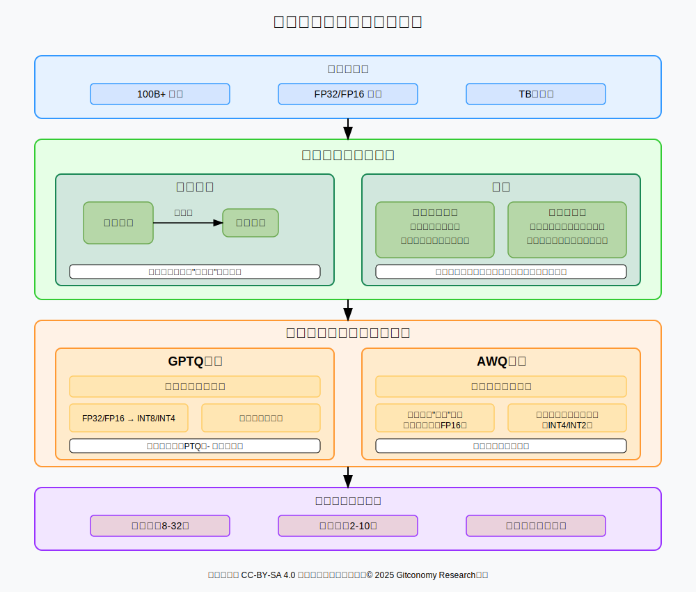

*图：大模型推理优化技术的组合*

上图直观展示了这些优化技术在模型从训练到部署的全生命周期中所处的位置。为了更深入地理解它们的具体差异，下表对这三种关键技术的核心机制、影响与权衡进行了详细对比。

| AI模型优化技术分类 | 知识蒸馏 | 剪枝 | 量化 |
| :--- | :--- | :--- | :--- |
| **主要目标** | 在保持核心能力的同时，减小模型规模 | 移除冗余参数，降低模型复杂度和计算量 | 降低数值精度，减小模型体积和内存带宽 |
| **实现机制** | 训练一个“学生”模型模仿“教师”模型的输出分布 | 移除低重要性的权重（非结构化）或神经元/注意力头（结构化）| 将高精度浮点数（如FP32）映射到低精度整数（如INT4）|
| **对模型体积的影响** | 显著减小（取决于学生模型的设计） | 显著减小（取决于稀疏度） | 极大减小（例如，INT4体积为FP32的1/8） |
| **对推理速度的影响** | 显著提升（模型更小） | 结构化剪枝可直接提速；非结构化剪枝需特定硬件/软件支持 | 显著提升（内存访问减少，计算加速） |
| **核心权衡** | 学生模型性能可能无法完全达到教师模型水平 | 可能导致精度损失；非结构化剪枝的加速依赖于生态支持 | 精度损失，尤其是在极低比特（如2-3 bit）下 |

###  3.4 算力已成为地缘政治的关键博弈点：华为昇腾生态 vs. NVIDIA生态

前述章节论证了AI正从追求规模转向追求效率，并介绍了一系列实现效率提升的新架构和优化技术。然而，要将这些新技术的理论优势完全转化为实际性能，仅有算法层面的创新是远远不够的。这需要一个深度集成、软硬件协同设计的技术生态系统。从根本上说，一切计算都是在物理世界中对比特（bit）进行操作和转移的过程。AI芯片的设计哲学，其终极目标就是在遵循物理定律的前提下，用更低的能耗、在更小的空间内，实现更快、更高效的信息处理。一个AI生态系统的竞争力，则取决于如何通过软硬件的协同，系统性地提升端到端的“信息处理效率”。谁能掌控这个从算法到软件再到硬件的完整反馈闭环，谁就能主导创新的步伐。

#### 3.4.1 壁垒高耸的护城河：NVIDIA/CUDA生态

NVIDIA的成功并非仅仅源于其强大的GPU硬件，更在于其历时十余年精心构建的一个自我强化、壁垒高耸的软硬件生态系统。这个生态系统已成为事实上的行业标准，其分层结构是其强大生命力的关键：

  * **第一层：芯片架构（硬件）**：以Tensor Core为代表，这是专为深度学习核心的矩阵运算而设计的硬件单元。
  * **第二层：CUDA（“裸金属”抽象层）**：这是一个并行计算平台和编程模型，为开发者提供了直接访问和控制GPU强大计算能力的接口。
  * **第三层：基础库（软件原语）**：NVIDIA提供了一整套高度优化的库，将底层的CUDA编程细节抽象出来，形成了任何AI框架都离不开的基石。这包括用于密集线性代数的`cuBLAS`、用于稀疏矩阵的`cuSPARSE`，以及用于多GPU通信的`NCCL`。
  * **第四层：AI与数据科学框架（高层API）**：在基础库之上，NVIDIA构建了更高级的工具，如用于深度学习原语的`cuDNN`、用于推理优化的`TensorRT`，以及用于GPU加速数据科学的`RAPIDS`（其API模仿了流行的pandas和scikit-learn）。这些工具极大地降低了使用GPU的门槛，使广大AI开发者和数据科学家能够轻松利用底层硬件的全部潜力。

NVIDIA的护城河并非硬件本身，而是这个层层递进、盘根错节的软件栈。全球的AI研究和开发社区都在围绕这个生态编写代码，产生了巨大的网络效应和高昂的转换成本，从而牢牢锁定了其市场领导地位。

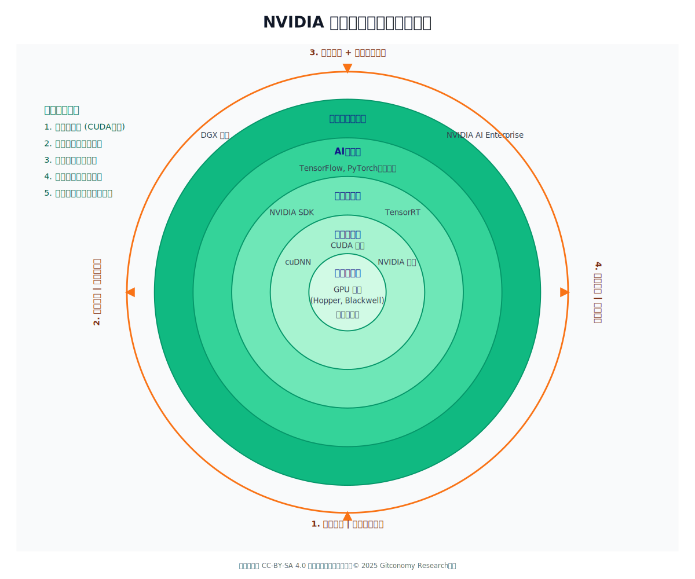

*图：NVIDIA自我强化的生态系统架构*

然而，这座看似坚不可摧的护城河，在全球地缘政治博弈的背景下，也暴露出了其固有的战略脆弱性。近年来，美国不断升级对华高科技领域的出口管制，特别是将先进AI芯片（如NVIDIA的高端GPU）列为关键限制对象。这一系列“卡脖子”的举动，使得NVIDIA/CUDA生态从一个开放的技术平台，转变为一个潜在的地缘政治扼制点。

这为我们敲响了警钟：对于人工智能这一关乎国运的颠覆性技术，任何形式的技术依赖都可能成为国家安全的致命软肋。建立一个从芯片到应用软件完全自主、安全可控的全栈AI技术生态，已经不再是一个“锦上添花”的商业选项，而是保障国家科技命脉、争取未来发展主动权的“生死攸关”的战略必然。 这种外部压力，极大地凸显了发展本土AI生态的重要性、必要性和紧迫性。

#### 3.4.2 铸造自主基石：华为昇腾全栈AI生态系统

对于人工智能这一基础性、战略性技术，依赖于一个由他国控制的、封闭的生态系统，意味着将国家的科技命脉置于不可预测的风险之中。一个自主可控的生态系统能够确保供应链的韧性，免受出口管制的制约，并能根据国家战略需求和数据安全法规，自由地定制和优化整个技术栈。因此，在认识到软硬件协同生态的决定性力量之后，建立一个自主可控的全栈技术体系便成为保障国家AI战略安全和发展主动权的必然要求。以华为昇腾为代表的自主创新之路，便不仅是商业竞争的选择，更是时代赋予的战略使命。
工具使用
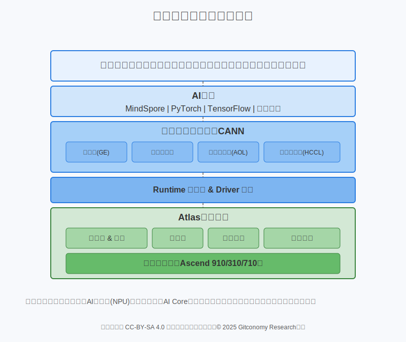

*图：华为昇腾软硬件AI堆栈系统架构*

1. **昇腾全栈技术架构解析**

大模型的效率是决定其能否规模化应用的关键。华为昇腾通过“硬件-软件-工具”全栈协同优化的方式，系统性地提升了大模型的训练与推理效率。

  * **第一层：达芬奇架构（硬件）**：以昇腾AI处理器（NPU）为核心，其内部包含专门为AI计算设计的AI Core，能够高效执行标量、向量和张量（矩阵）运算，并在设计上注重高能效比。
  * **第二层：CANN（异构计算架构）**：作为昇腾的核心加速引擎，其角色类似于CUDA与cuDNN的结合体。CANN为上层应用提供了统一的硬件抽象，包含了图引擎、张量加速引擎以及一个由高度优化的算子组成的基础库（TBE），是连接硬件与上层框架的桥梁。
  * **第三层：MindSpore（AI框架）**：这是一个开源的全场景AI框架，其设计初衷就是为了与底层的CANN引擎和昇腾硬件进行深度协同。MindSpore支持自动并行、图算融合等特性，能够最大化地发掘昇腾硬件的潜力，是软硬件协同设计的集中体现。
  * **第四层：应用使能（MindX SDK）**：这是一套面向应用开发的工具和库，旨在帮助开发者快速部署AI应用。它包括了预训练模型库（ModelZoo）、针对特定领域（如视觉、自然语言处理）的开发套件，以及推理服务等组件。
信息系统“熵减”模式的范式革命]
2. **昇腾生态系统 vs NVIDIA生态系统**

华为昇腾（Ascend）生态系统提供了一个从底层芯片到上层应用的完整、垂直整合的技术栈，其架构的完整性使其成为一个可与NVIDIA/CUDA生态系统对标的自主可控平台。
我们可以通过与NVIDIA生态的分层对比，来清晰地理解其架构的完备性。

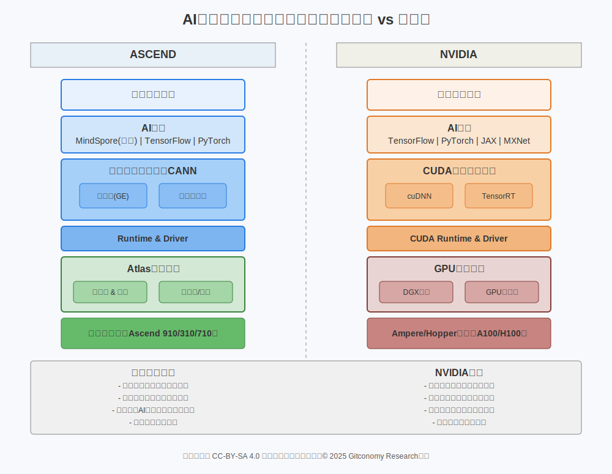

*图：AI软硬件技术生态系统比较：华为昇腾 vs 英伟达*

华为昇腾与NVIDIA的竞争，并非单纯的技术参数对决，而是两种截然不同的生态战略的碰撞。NVIDIA生态类似于AI领域的“Windows/Android”模式：它通过提供业界最强的硬件（GPU）和开放但专有的软件标准（CUDA），吸引全球开发者为其添砖加瓦，构建了一个横向、开放且具有强大网络效应的庞大帝国，其核心是维持其作为行业事实标准的统治地位。

而华为昇腾则选择了类似“苹果iOS”的垂直整合路线：面对已有的生态壁垒和外部的技术封锁，它通过从底层芯片（达芬奇架构）到上层AI框架（MindSpore）的全栈自主研发，进行深度的软硬件协同优化，目标是在自主可控的体系内实现极致的性能与能效，保障国家AI战略的安全与发展主动权。

| 对比维度 | 华为昇腾 (Ascend) 生态 | NVIDIA 生态 |
| :--- | :--- | :--- |
| **核心硬件架构** | **NPU (达芬奇架构)**，内置AI Core，专为AI计算设计，注重能效比。 | **GPU (Hopper/Blackwell等)**，内置Tensor Core，为通用并行计算和AI混合精度计算设计。 |
| **核心计算引擎/API**| **CANN (异构计算架构)**，作为昇腾的“灵魂”，连接硬件与上层框架的桥梁。 | **CUDA**，事实上的行业标准，为GPU编程提供底层接口，是其生态护城河的核心。 |
| **基础库 (软件原语)**| **算子库 (TBE)**, **图引擎 (GE)**，提供高度优化的基础计算单元和执行图。 | **cuDNN, cuBLAS, NCCL, cuSPARSE** 等，提供针对深度学习、线性代数、通信等的优化库。 |
| **原生AI框架** | **MindSpore (昇思)**，原生适配，为最大化昇腾硬件性能而深度协同设计。 | **无原生框架**，但通过强大的库支持，成为PyTorch, TensorFlow等所有主流框架的首选平台。 |
| **应用使能/SDK** | **MindX SDK**, **ModelArts**，提供模型库、开发套件和一站式开发平台，加速应用落地。 | **TensorRT, Triton, RAPIDS** 等，提供推理优化、服务部署、数据科学加速等丰富的工具链。 |
| **生态策略** | **全栈垂直整合、自主可控**。通过软硬件深度协同优化，在自主体系内追求极致性能。 | **横向开放生态、构建行业标准**。通过提供最强硬件和开放软件平台，吸引全球开发者共建生态。|
| **核心优势** | 软硬协同潜力巨大；符合国家自主可控战略，具备政策和市场准入优势。 | 硬件性能绝对领先；拥有全球最成熟、最庞大、开发者粘性最高的软件和应用生态。 |

综上所述，NVIDIA的成功，是典型的“横向生态”的胜利。它通过提供业界最强的硬件，并以CUDA这一开放（相对于硬件平台）但专有（相对于NVIDIA）的软件平台为核心，吸引了全球开发者为其硬件添砖加瓦，构建了无与伦比的软件和应用生态，形成了强大的网络效应。而华为昇腾，则是在面临这一巨大生态壁垒的背景下，选择了通过软硬件全栈的深度协同优化，进行“纵向整合”的追赶和突破。地缘政治因素和国家战略，为昇腾的“纵向整合”模式创造了独特的、非对称的竞争机遇，这是在纯粹的技术或商业竞争中所不具备的关键变量。

3. **通往自立自强与创新引领之路**

昇腾全栈生态的建成，其最重要的战略意义在于，它标志着我国在人工智能领域拥有了从芯片设计到应用开发的全链条自主能力。这意味着我们不再仅仅是AI技术的消费者，更是核心技术的生产者，从而将技术发展的主动权牢牢掌握在自己手中。

这个自主可控的技术栈为在国内率先实践和优化Mamba、MoE等新一代高效AI模型提供了坚实的基础。它使得我们能够根据自身的应用场景和数据特点，进行深度的软硬件协同优化，从而在摆脱“规模法则”军备竞赛的同时，开辟出一条以效率为核心的、具有独特竞争优势的创新路径。它为构建国内的“算法-软件-硬件”创新反馈闭环提供了可能，是实现高水平科技自立自强的关键基石。

### 小结

本章的论述旨在阐明一个核心观点：以“规模法则”为指导，单纯依靠堆砌原始算力来定义AI能力的时代正因其不可持续的经济和物理成本而走向终结。未来的AI发展将由**计算效率**所定义。以Mamba、专家混合（MoE）、检索增强生成（RAG）为代表的新一代AI架构，以及知识蒸馏、剪枝、量化等优化技术，正在共同描绘这条通往高效智能的新路径。在这一新范式下，取得领导地位的关键，已不再是单纯拥有最强大的芯片，而是掌握一个**自主可控、深度集成且软硬件协同设计的全栈技术生态系统**。NVIDIA/CUDA生态的巨大成功雄辩地证明了这一模式的力量。而华为昇腾生态系统的建成，则标志着我国已经成功地构建起一个具备同等战略潜力的、自主可控的技术基石。因此，支撑下一代人工智能的真正算力基石，是对这一自主全栈基础设施的持续投入、建设和完善。唯有如此，方能确保在高效、可持续的智能新时代中，实现技术的自立自强与引领发展。

---

💡 **互动环节：问题讨论**

1. 讲义介绍了Mamba、MoE、RAG三种旨在超越“暴力美学”的效率型架构 。您认为它们是对Transformer范式的颠覆性革命，还是修补性的改良？未来AI架构会走向“百花齐放”的工具箱模式，还是会出现一个统一两者优势的、更强大的新架构？

2. 从“模型即制品”（Model as Artifact）到“系统即服务”（System as Service）的演变 ，给科研和产业应用带来了哪些全新的挑战？特别是在科研的“可复现性”和工业部署的“稳定性与安全性”方面。

3. 面对NVIDIA/CUDA生态已形成的强大网络效应和高转换成本 ，华为昇腾选择的“垂直整合”追赶路线 ，其最大的机遇和最严峻的挑战分别是什么？作为未来的AI研究者或工程师，您在选择技术栈时会如何权衡生态成熟度与国家战略自主性？

---

## 第四章	产业的变革：“人工智能+”的产业图景

掌握了AI大模型的理论内核与算力基石，我们现在将视野投向更广阔的应用天地。正如“人工智能+”行动纲领所指引的，大模型正作为一种新的“信息能源”，渗透到各行各业，引发深刻的产业变革。本章将探讨其核心的变革模式，并为同学们提供参与这场变革的行动指南。

### 4.1 大模型应用发展及智能体前沿技术趋势

#### 4.1.1 多模态技术的融合：打破感官边界

人类对世界的感知是多通道的，我们同时通过视觉、听觉、触觉来理解环境。长期以来，AI模型主要在单一模态上进行研究。然而，真正的智能需要打破模态之间的壁垒。多模态融合技术（Multimodal Fusion）正是致力于实现这一目标的关键，它旨在让AI模型能够像人一样，协同处理和理解来自不同来源（文本、图像、音频、视频、传感器数据等）的信息，并进行跨模态的推理和生成。以GPT-4o为代表的多模态大模型，已经可以实现看图说话、视觉问答（VQA）等复杂任务，预示着人机交互将进入一个更自然、更丰富的时代。

大模型实现多模态融合的核心技术路径主要有几种。首先是联合表示学习，其核心思想是将不同模态的信息映射到一个统一的、共享的向量空间中，让语义相近的内容在空间位置上相互靠近。CLIP模型正是这一思想的典范，它通过对比学习，在海量的“图像-文本”对上进行训练，成功将图像和其文本描述对齐，为后续的文生图、图生文等应用奠定了基础。其次，在Transformer架构上引入跨模态注意力机制，可以让一个模态的信息（如文本问题）作为“查询”，去“关注”另一个模态（如图像）中的相关部分，从而完成复杂的跨模态推理。当前的研究趋势则是构建一个统一的多模态模型架构，如Google的Gemini和OpenAI的GPT-4o，它们能够原生地、端到端地处理多种模态的混合输入和输出。

尽管前景广阔，多模态研究仍面临诸多挑战，包括高质量对齐数据集的稀缺、不同模态间信息融合的复杂性、以及跨模态幻觉等问题 。

#### 4.1.2 AI智能体（Agentic AI）：从“工具”到“自主协作者”的进化

如果说多模态技术解决了AI的“感知”问题，那么AI智能体（Agent）技术则致力于解决AI的“行动”问题。它标志着AI正从一个被动的“应答机器”，进化为一个能够主动理解目标、分解任务、调用工具并与环境交互以达成目标的“自主协oplayer”，这是通往通用人工智能（AGI）的关键一步。

一个典型的基于大模型（LLM-based）的Agent，其工作流程可以概括为一个包含感知、规划、行动和记忆的循环框架。其核心是一个强大的大语言模型作为大脑，负责理解用户的复杂意图、进行常识推理和任务规划。Agent通过多模态技术进行感知，以理解其所处的数字或物理环境。

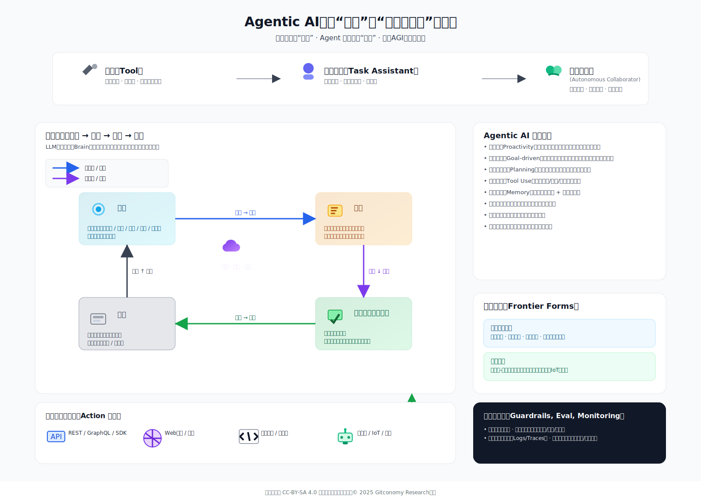

*图：Agentic AI的协作工作流*

一个典型的AI Agent通常由以下几个核心组件构成：

1. **大脑（Brain）- 大语言模型**：作为Agent的核心认知引擎，负责理解任务、进行推理、制定计划和做出决策。模型的性能直接决定了Agent的“智商上限”。
2. **感知（Perception）**：通过多模态输入，感知和理解其所处的环境。例如，读取网页、分析图像、听取语音指令等。
3. **规划（Planning）**：这是Agent智能的核心体现。它能够将一个宏大的、模糊的目标（如“帮我规划一次去桂林的周末旅行”）分解成一系列具体、可执行的子任务（查询天气、搜索航班、预订酒店、规划行程等）。**思维链（Chain-of-Thought）**等技术是其实现复杂推理规划的基础。
4. **记忆（Memory）**：Agent具备记忆能力，能够从过去的交互和行动中学习。这包括用于短期上下文理解的“短期记忆”，以及通过挂载外部知识库或数据库（如向量数据库）实现的“长期记忆”。
5. **行动（Action）- 工具使用**：这是Agent区别于普通模型的关键。Agent能够调用外部工具（APIs、代码解释器、物理设备等）来执行任务，完成与外部世界的交互。例如，它可以通过调用API来查询实时股价、预订机票，或执行一段代码来完成复杂计算。**ReAct（Reason+Act）**等框架是实现这一能力的主流范式。

智能体的核心能力体现在规划与行动上。面对一个复杂的目标（如“帮我规划一次去桂林的周末旅行”），Agent需要通过思维链等技术，将其分解成一系列可执行的子任务。由于大模型本身无法直接与外部世界交互，因此必须赋予其行动的能力，即工具调用。通过ReAct等框架，模型可以交替进行“思考”（推理下一步该做什么）和“行动”（调用天气查询API、执行代码、使用搜索引擎等）。为了执行长期、复杂的任务，Agent还必须具备记忆能力，通过短期记忆存储对话历史，并通过外部知识库或向量数据库作为长期记忆，使其能从过去的成败中学习，不断优化未来行为。

AI智能体的前沿技术趋势正朝着更高级的形态发展。多智能体协作模仿人类社会的分工模式，让多个拥有不同专长的Agent协同工作，共同完成宏大任务。而具身智能则将Agent与机器人等物理实体相结合，使其能够在真实世界中感知和操作，这是AI走向物理世界的终极形态。

#### 4.1.3 信息服务模式的颠覆：从搜索到生成

信息熵是衡量一个系统不确定性或“意外程度”的指标。在信息寻求的场景中，用户的查询代表了一种高熵状态——即对答案的高度不确定性。信息系统的核心目标，便是降低这种熵。相应地，信息密度则指单位输出（例如每个词、每个屏幕）中所包含的有效、相关信息的数量。从传统搜索引擎到现代“答案引擎”的演进，标志着信息系统在熵管理策略上的根本性转变。传统搜索引擎通过增加用户的认知负荷（提供一个充满不确定性的链接列表），来最小化自身的系统能量消耗。而生成式人工智能系统则反其道而行之，通过消耗巨大的系统能量，直接为用户提供一个低熵、高信息密度的综合性答案，从而极大地减轻了用户的认知负担。



*图：信息系统“熵减”模式的范式革命*

1. **经典搜索范式：绘制高熵空间地图**

传统搜索引擎的工作模式可以分解为“抓取-索引-排序”三部曲。这一模式的核心在于绘制并初步整理互联网这个高熵、混沌的信息空间。[18]

- 抓取 (Crawling)：这是一个能量密集型过程，网络爬虫（或称“蜘蛛”）在浩瀚的互联网上发现并获取内容。由于完整抓取整个网络在计算上是不可能的，搜索引擎必须采用优化后的抓取策略，决定抓取哪些网站、抓取频率以及每个站点的页面数量，以此来管理高昂的能量成本 。
- 索引 (Indexing)：这是系统层面的首次大规模熵减。搜索引擎对抓取的内容进行分析、处理并存储在其索引库中，将非结构化的网络数据转化为一个可供快速检索的结构化数据库。索引的质量直接决定了搜索引擎这个“数字图书馆”的实用价值 。
- 排序 (Ranking)：当用户输入查询时，搜索引擎会根据相关性、权威性等数百个因素，对索引库中的内容进行排序，并以链接列表的形式呈现给用户。
从理论上看，传统搜索引擎的输出本质上是一系列可能性的集合，而非一个确定的答案。它缩小了用户的搜索范围，但将最终的熵减任务——即信息的综合、验证与提炼——转移给了用户。因此，一个搜索结果页面的信息密度相对较低，其主要内容是元数据和指向潜在知识源的指针，而非知识本身。

2. **生成式革命：综合与密度引擎**

生成式人工智能，特别是大型语言模型（LLM），带来了范式级的变革。它们的设计目标不是检索，而是通过预测基于海量训练数据的词语模式来生成全新的文本 3。这标志着从“指引信息”到“综合知识”的飞跃。

然而，纯粹的LLM存在一个致命的信息熵问题：“幻觉”（Hallucination）。由于依赖静态的、内部化的训练数据，LLM可能生成听起来连贯但事实错误或完全无意义的内容 3。这种内在的不确定性使得未经校验的LLM输出成为一种高风险、高熵的信息源。

为了解决这一问题，检索增强生成（Retrieval-Augmented Generation, RAG）架构应运而生。RAG是一种关键的熵减机制，它通过将LLM的生成过程锚定在外部可验证的知识库中，从而显著降低了“幻觉”的熵。RAG的工作流程（索引、检索、生成）与经典搜索有相似之处，但其目的截然不同：检索到的文档并非直接呈现给用户，而是作为低熵的上下文信息，输入给生成模型。这个过程就像一个高效的过滤器，它在LLM广阔的概率空间中划定了一个事实边界，约束其生成内容，从而产出兼具高密度与高准确性的回应。这种架构如同一个理论上的信息分拣系统，它位于外部高熵数据世界与LLM的概率生成过程之间，通过执行大量的计算工作（编码与检索），只允许与查询相关的、低熵的、事实性的信息进入模型的“视野”，从而确保最终输出的有序性和可靠性。[19]

>案例研究：答案引擎的崛起（如Perplexity AI）
>
>以Perplexity AI为代表的“答案引擎”是上述理念的集大成者。它们采用基于RAG的多模型框架，实时扫描网络，检索相关信息，并最终生成一个附带引用来源、上下文明确的综合性答案 。从理论角度分析，答案引擎代表了以用户为中心的熵减模式的顶峰。它将搜索、检索、综合、引用等所有高认知负荷的工作全部由系统承担。为了向用户交付这一个单一、高密度、低熵的知识产物，系统需要付出巨大的热力学代价。研究表明，AI模型的计算能力消耗可达传统搜索算法的10倍，运营成本则高出6至7倍[20]。这笔高昂的计算能源开销，正是为了换取用户认知熵的急剧降低。市场的演变清晰地反映出一个深刻的经济趋势：用户的认知能量正变得比计算能源更为宝贵。用户愿意让系统承担更高的能源成本，以换取自身的认知便利。未来信息系统的竞争，将围绕着如何更高效地降低用户熵展开，而其核心制约因素将是底层AI基础设施的能源效率与计算密度。

3. **社会经济影响：低熵知识的传播**

这种技术变革的深远影响已在现实世界的生产力提升中得到验证。美国国家经济研究局（NBER）的一份工作论文，通过研究生成式AI在客户支持领域的应用，为我们提供了有力的实证数据 [21]。

在这个案例中，AI助手扮演了一个面向员工的RAG系统。它索引了企业内部高绩效员工的最佳实践和隐性知识。当一位新手员工面临一个高熵问题（例如一个复杂的客户投诉）时，AI能够迅速检索并提供一个低熵、高密度的解决方案（例如一段建议回复）。研究数据显示，AI助手的引入使员工的平均生产力提升了14%，而对于新手和低技能员工的提升幅度更是高达34%，但对经验丰富的专家影响甚微 10。这一结果雄辩地证明，AI正在有效地压缩员工的经验曲线，将专家的低熵知识快速传递给新手。这不仅提升了他们工作的“信息密度”，也显著降低了客户互动的“熵”——客户的负面情绪减少，请求与主管沟通的比例下降，最终改善了客户体验和员工留存率 6。

#### 4.1.4 具身认知与行动：从比特到原子

在物理世界中，熵表现为无序、不确定性以及非结构化环境中庞大的可能状态数量。机器人的核心功能，就是通过做功来有目标地降低物理熵（例如，整理房间、组装产品）。相应地，机器人领域的能量密度则包含两个层面：一是用于感知和决策的计算能量，二是用于驱动和移动的物理能量（电能、机械能）。机器人技术从经典的“感知-规划-行动”范式向现代端到端神经网络的演进，其核心是克服传统范式在显式世界建模方面所带来的巨大能量消耗和环境脆弱性。新范式通过投入海量的初始训练能量，创造出低熵、泛化能力强的控制策略，从而在实际执行任务时实现更高的能效和鲁棒性。



*图：经典范式机器人与具有身智能机器人的比较*

1. **经典机器人范式：高能耗规划与环境脆弱性**

传统的“感知-规划-行动”（Sense-Plan-Act, SPA）循环是分层式机器人控制的经典模型[21]:

- 感知 (Sense)：机器人通过传感器收集数据，构建一个全面的“全局世界”表征。这个过程本身就充满挑战，受限于传感器的精度、噪声和覆盖范围。
- 规划 (Plan)：基于构建的世界模型，系统进行计算密集型的显式规划，以生成一系列精确的行动指令。这是SPA范式的主要瓶颈，规划过程通常非常缓慢，且计算复杂度极高。这一问题因“框架问题”（即难以高效推理环境中哪些事物未发生变化）而进一步恶化，导致系统在庞大的搜索空间中迅速陷入计算困境
- 行动 (Act)：机器人执行预先计算好的计划。这种执行方式通常是开环的，意味着一旦计划启动，机器人对环境中未预料到的变化做出实时调整的能力非常有限。

从理论上看，SPA范式试图在行动之前，先创建一个关于高熵物理世界的、完美的、低熵的数字孪生。这需要持续不断地消耗巨大的计算能量。更致命的是，它对模型的完整性和准确性的高度依赖，使其表现出极大的“脆弱性”——当遇到模型未曾明确考虑到的新情况（即熵增）时，系统往往会彻底失效。

2. **新范式：面向行动的端到端学习**

机器人技术的新范式转向了端到端神经网络，这些网络学习从原始的感官输入（如摄像头像素）到行动指令（如电机控制信号）的直接映射。这种方法不再构建一个显式的、符号化的世界模型；相反，对世界的必要理解被隐式地编码在网络的权重之中。

>案例研究一：谷歌的RT-2与视觉-语言-行动（VLA）模型
**机制**：RT-2的核心创新在于将机器人动作表征为文本符号（tokens），这使其能够在一个统一的框架内，利用网络规模的视觉语言数据和机器人轨迹数据进行联合训练 14。
**理论分析**：这种方法极大地提升了机器人先验知识的信息密度。通过接入互联网中蕴含的低熵语义知识（关于物体、材料、抽象概念的理解），机器人获得了对从未物理接触过的新任务和新物体的泛化能力。它绕过了从零开始构建世界模型的繁重任务，转而利用一个预先存在的、高度压缩的世界概念模型。RT-2甚至能进行初步的推理和“思维链”（chain-of-thought），使其能够隐式地规划行动以降低环境熵，例如，在接收到“捡起那个灭绝的动物”指令后，它能自主识别出恐龙玩具并执行抓取动作 。

>案例研究二：特斯拉的Optimus与FSD架构
**机制**：特斯拉的完全自动驾驶（FSD）技术从超过30万行复杂的C++代码，演进为一个单一的、接收视频输入并直接输出车辆控制指令的端到端神经网络，这是新范式最深刻的例证之一 。其Optimus人形机器人也复用了这一核心架构 。
**理论分析**：那30万行代码代表了人类工程师试图为每一种可能情况定义规则的巨大努力，这是一个高熵、复杂且脆弱的系统。相比之下，通过学习数百万小时人类驾驶数据训练出的神经网络，则是对成功驾驶行为的一种低熵、高度压缩的表征。特斯拉为此付出了巨大的前期能源成本（每个训练周期需消耗7万个GPU小时 16），目的就是为了创造出这个紧凑的控制策略。该策略一旦形成，便能在推理阶段以更高的计算效率和鲁棒性，去应对道路上各种未曾预料的熵增情况。

>案例研究三：Figure AI与解耦式认知
**机制**：Figure公司的人形机器人采用了名为“Helix”的VLA模型，其特点是“系统1，系统2”的双系统架构。一个大型、运行较慢的VLM（系统2，频率为7-9 Hz）负责高级别的场景理解和规划；而一个小型、反应迅速的视觉-电机策略网络（系统1，频率高达200 Hz）则执行反应式的、低级别的控制 。
**理论分析**：这种架构为解决机器人的能量密度问题提供了一个优雅的方案。高能耗、计算密集的“思考”（系统2）被用在刀刃上，仅在需要设定高级目标、降低语义熵时启动。而低能耗、高效率的反应式控制（系统1）则负责处理与物理世界高频交互的任务。这使得机器人能够执行既需要长远规划又需要实时适应的复杂协作任务，从而有效地管理其能量预算，以最高效率降低物理世界的熵。

这种从实时规划到前期训练的能量投入模式转变，是现代机器人技术发展的核心逻辑。传统机器人将其能量预算消耗在实时规划上，以应对环境的复杂性。而现代机器人则将能量预算投入到前期训练中，以创造一个关于这种复杂性的压缩模型。这一转变之所以成为可能，得益于海量数据（如特斯拉的车队数据和RT-2所用的网络数据）和强大并行计算能力（如GPU和像Dojo这样的定制芯片）的出现。未来机器人领域的核心竞争力，将不再是设计精巧的实时算法，而是构建可扩展的数据管道和训练基础设施，即如何将真实世界的经验“蒸馏”成一个低熵的神经网络。

更深层次地看，RT-2将动作符号化的创新，不仅仅是一项技术技巧，它揭示了一个深刻的观念突破：物理世界的行动可以被纳入与语言和视觉相同的信息框架中进行处理。通过将“将手臂移动到坐标(x,y,z)”这样的物理指令视为一个句子中的“单词”，Transformer这种强大的序列数据关系发现架构，便能被用于寻找“所见”、“所闻”与“所为”之间的内在联系。这统一了语义熵的降低（理解“拿起苹果”）和物理熵的降低（执行抓取动作），为通往真正通用人工智能的道路指明了一个方向——在这个未来中，数字行动与物理行动的区别，或许仅仅是输出“语言”的不同。

#### 4.1.5 科学发现的新范式：AI for Science

科学方法本身可以被视为一个终极的熵减过程：它将观测的混沌和无知的迷雾（高熵状态），转化为理论的秩序、知识的预测力和解释力（低熵状态）。计算机科学先驱吉姆·格雷（Jim Gray）等人将科学的发展划分为几个范式：从几千年前的经验科学，到几百年前的理论科学，再到近几十年的计算科学（模拟）。而“第四范式”——数据密集型科学——的出现，源于科学家们面临的数据洪流。在这个新时代，科学研究的瓶颈已不再是数据的获取，而是从海量数据中提取知识。

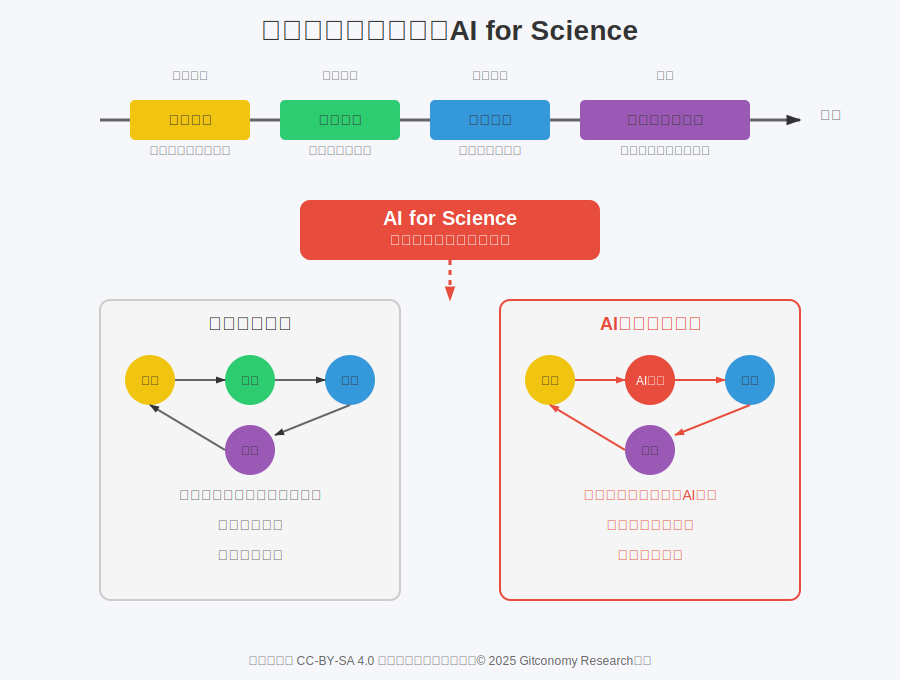

*图：传统科学研究范式和AI for Science范式的比较*

“AI for Science”（人工智能驱动的科学发现）正是解锁第四范式的关键。AI模型能够将前所未有的计算能量密度应用于高熵的科学数据集，从而极大地加速熵减的速率——也就是科学发现本身的速度。

AI在基础科学领域的突破性进展：

>案例研究一：AlphaFold2破解蛋白质折叠问题
**高熵难题**：在长达50年的时间里，从氨基酸序列预测蛋白质的三维结构一直是生物学领域的重大挑战。一个蛋白质可能折叠的构象组合数量是一个天文数字，构成了一个巨大的高熵搜索空间。
**高密度解决方案**：DeepMind的AlphaFold2通过其核心的Evoformer模块解决了这一难题。该模块能够消化来自“多序列比对”（MSA）的高密度进化信息，并利用创新的注意力机制（如“三角自注意力机制”）来推理蛋白质结构在几何和共进化上的约束。
**理论分析**：AlphaFold2本质上是一台高效的熵减机器。它接收一个关于结构信息密度较低的一维序列，以及一个包含高密度进化约束信息的海量MSA，最终将其解析为一个具有接近实验精度的、单一的、低熵的三维结构。AlphaFold数据库公开发布了超过2亿个预测结构，这一举动极大地降低了整个结构生物学领域的知识熵。

>案例研究二：GNoME加速材料科学发现
**高熵难题**：无机晶体材料的潜在组合空间浩瀚无垠，绝大部分尚未被探索。传统的试错法，无论是通过实验还是暴力计算筛选，都极其缓慢且成本高昂 28。
高密度解决方案：谷歌DeepMind的GNoME（Graph Networks for Materials Exploration）项目利用图神经网络，在现有材料数据上进行训练，以预测新候选材料的稳定性。这种主动学习的循环使其能够高效地探索高熵的化学空间。
**理论分析**：通过AI驱动的搜索，GNoME发现了超过38万种新的、理论上稳定的材料，这一成就被誉为相当于“近800年知识积累”的总和。这代表了材料科学领域一次巨大的熵减事件，它将一个近乎无限的“可能性”空间，转变为一个AI大模型技术的时代演进具体的、有限的、充满希望的低熵候选材料集合，为电池、半导体等未来技术的发展铺平了道路。

### 4.2 人工智能+”：国家战略与产业赋能

#### 4.2.1 政策演进：从“互联网+”到“人工智能+”

中国的人工智能国家战略经历了一个从顶层设计到深度赋能的清晰演进。2017年，国务院《新一代人工智能发展规划》确立了国家战略的核心地位。进入2024年，政府工作报告首次提出开展“人工智能+”行动，标志着战略重点的重大转变。如果说“互联网+”的核心是连接与模式创新，那么“人工智能+”的核心则是智慧赋能与生产力变革，旨在通过AI与实体经济的深度融合，培育和发展能够引领高质量发展的“新质生产力”。这一转变要求AI技术不再是独立的产业，而是驱动整个国民经济转型升级的底层赋能技术，对高校的人才培养也提出了从“算法工程师”向“产业AI架构师”转变的更高要求。中国的“人工智能+”行动纲领，正是旨在将这种新型的、高密度的信息生产力，系统性地注入到国民经济的每一个角落，实现全社会的效率变革与价值创造。

| 时间节点 | 关键文件/提法 | 核心内涵 | 战略意义 |
| :--- | :--- | :--- | :--- |
| 2015年 | “互联网+”行动计划 | 首次在政府工作报告中提出，旨在推动互联网与经济社会各领域的深度融合，核心是“连接”。 | 为后续的国家级“+”战略奠定了思想和实践基础。 |
| 2017年 | 《新一代人工智能发展规划》 | 国务院正式发布，对2030年前的AI发展进行系统规划，确立“三步走”战略目标。 | 标志着人工智能正式成为国家战略的核心。 |
| 2024年 | “人工智能+”行动 | 首次在政府工作报告中被正式提出。 | 标志着国家战略进入了全新的、更聚焦于深度赋能实体经济的阶段。 |
| 2025年8月 | 《关于深入实施“人工智能+”行动的意见》 | 国务院发布，旨在通过明确具体行动和基础支撑能力，系统性解决产业应用中的实际问题。 | 让更多企业在AI领域“跑出加速度”。 |

这一系列政策清晰地勾勒出一条从普及互联网基础设施到全面拥抱人工智能赋能的战略升级路线。如果说“互联网+”的核心是连接与模式创新，那么“人工智能+”的核心则是智慧赋能与生产力变革，旨在培育和发展能够引领高质量发展的“新质生产力” 。

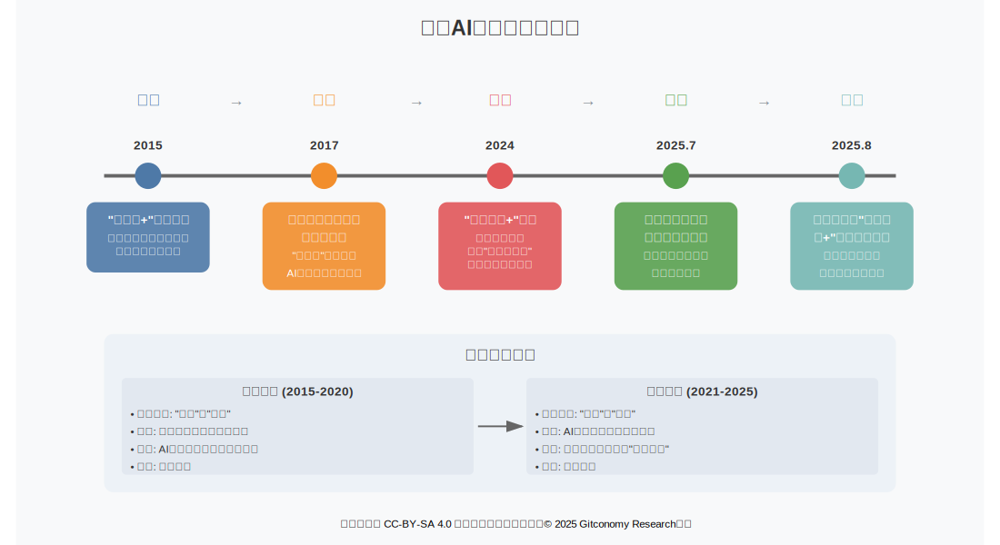

*图：中国AI政策演变路线图*

政策话语体系的演变深刻反映了战略重心的转移。早期的政策主旋律多为“加快”、“加强”，强调技术研发和产业规模的快速扩张。而“人工智能+”行动则更多地使用“深化”、“赋能”等词汇，强调AI与实体经济的深度融合，旨在“变革生产管理模式”，实现“制造业全流程智能化升级”，最终目标是培育和发展能够引领高质量发展的“新质生产力” [1]。这一转变表明，国家对人工智能的定位已从一个独立的尖端技术产业，升维为驱动整个国民经济转型升级的底层赋能技术。

#### 4.2.2 “AI+”千行百业：拥抱新质生产力

“人工智能+”行动的核心在于赋能实体经济，培育新质生产力。国务院最新发布的行动纲领明确指出了涵盖工业、农业、金融、医疗、教育、文旅等十大重点应用场景，旨在将AI的“头雁效应”深度渗透到国民经济的方方面面，并开辟了“科学智能”这一全新范式。

在制造业领域，AI正推动行业迈向“智造”新时代。利用多模态视觉大模型，可以对工业产品表面的微小缺陷进行像素级识别，其精度和效率远超人眼。通过分析设备传感器（如振动、温度）的时序数据，AI能够提前预测潜在故障，实现从“被动维修”到“主动保养”的转变，从而最大化产线的正常运行时间。此外，在汽车、家电等行业，AI调度系统可以根据用户的个性化订单，实时动态地调整生产线的物料、工艺和流程，以实现高效的个性化定制。

在医疗健康领域，AI正开启精准诊疗的新篇章。作为“AI for Science”的典型应用，AI模型（如AlphaFold）能够精准预测蛋白质结构，将传统需要数年的研发周期缩短至数月，极大地加速了新药的发现进程。AI还能辅助医生快速、精准地从CT、MRI等影像中识别早期病灶，提高诊断效率和准确率，这在基层医疗资源不足的地区价值巨大。同时，大模型可以作为医生的“超级助理”，根据患者症状提供鉴别诊断建议、查询最新的临床指南，并自动生成高质量的病历文书，从而解放医生的生产力。

在教育领域，AI正帮助实现“因材施教”的千年梦想。AI系统通过分析学生的学习行为数据，能够精准诊断其知识薄弱点，并推送定制化的学习内容和练习题，实现真正的“一人一策”。AI虚拟教师或助教可以提供7x24小时的在线答疑和作业批改，甚至能模拟苏格拉底式的提问，引导学生进行探究式学习，以弥补师资的不足。在化学、物理等学科中，AI还能构建高度逼真的虚拟实验环境，让学生能够安全、低成本地进行高风险或复杂实验的操作。

在金融领域，AI正在重塑金融服务与风险管理。AI模型能够实时分析海量的交易流水、用户行为和舆情信息，精准识别信用卡欺诈、洗钱等风险行为，构建全方位的金融安全防线。在量化交易，特别是高频交易领域，AI模型通过深度挖掘市场中的微观规律，制定并高速执行复杂的交易策略，以捕捉转瞬即逝的盈利机会。此外，由大模型驱动的智能投顾能够与客户进行自然语言对话，理解其理财目标和风险偏好，并提供个性化的、动态调整的资产配置建议。

“AI for Science”（科学智能）则代表了一种全新的科学研究范式，它正成为继实验科学、理论科学和计算科学之后的第四次科学革命。AI通过从海量、复杂、多模态的科学数据中学习规律和知识，极大地加速了科学发现的进程。在生物医药领域，除了预测蛋白质结构，AI还在基因编辑和疫苗设计中发挥着关键作用。在新材料研发方面，AI可以根据期望的性能逆向设计出全新的分子结构并预测其合成路径，实现材料的“按需定制”。在气候科学与环境保护领域，AI大模型能够更精准地预测极端天气事件，模拟全球气候变化的长远影响，并优化碳捕捉和新能源利用方案。

#### 4.2.3 AI+关键部署：构建一个全新的基础设施体系

《人工智能全球治理行动计划》、《关于深入实施“人工智能+”行动的意见》等一系列国家政策文件，清晰地勾勒出中国发展AI的战略蓝图。其核心思想并非将AI视为一个独立的产业，而是将其定位为一种赋能型的、如同水和电一样的基础资源，目标是全面提升整个社会的信息处理与决策效率。

1. **推动工业全要素智能化**：政策明确要求加快人工智能在设计、中试、生产、服务、运营全环节的落地应用，并推广AI驱动的生产工艺优化方法。
2. **培育智能原生新业态**：鼓励发展底层架构和运行逻辑基于人工智能的“智能原生”企业，探索“模型即服务”（Model-as-a-Service）、“智能体即服务”（Agent-as-a-Service）等全新商业模式。
3. **强化基础支撑能力**：强调构建坚实的数字底座，包括建设高质量数据集、完善智能芯片与算力中心等基础设施，并健全从基础共性到行业应用的标准体系。
4.**促进开源生态繁荣**：大力支持人工智能开源社区建设，鼓励模型、工具、数据集的汇聚开放，并建立健全开源贡献的评价和激励机制，以加速技术迭代和应用普及。

为了实现这一目标，国家正在构建一个全新的基础设施体系，我们可以将其类比为电力时代的“电网”，称之为**信息电网**。这个网络包含三个核心组成部分：

  * **“发电厂”——算力基础设施**： 政策明确提出要加快智能算力、数据中心等基础设施建设，并推动统一的算力标准体系。这相当于建设国家级的“智能发电厂”，为全社会提供充沛、标准化的计算能源。而像华为昇腾这样从芯片到集群的全栈AI算力解决方案，正是构成这些“发电厂”的核心技术“发电机组”。
  * **“输电线”——数据与开源生态**： 政策强调推动数据依法有序自由流动，并鼓励打造跨国开源社区和安全可靠的开源平台。高质量的数据是训练AI模型的“燃料”，而开源模型和工具则像是高效的“输电协议”，能够极大地降低创新成本，加速高密度信息的流动与扩散。
  * **“家用电器”——千行百业的应用**： 政策的核心目标是“推动人工智能赋能千行百业”，涵盖工业制造、农业、医疗、教育、交通等所有领域。这相当于将标准化的“智能电力”接入到每一个工厂、农田、医院和家庭，通过具体的“AI电器”（应用解决方案）来解决实际问题，创造经济价值。

“人工智能+”的本质，就是加速建设并普及这张“信息电网”，让高密度的智能服务像电力一样，成为随取随用的社会生产力。

### 4.3 落地实践：以广西为例的“人工智能+”图景

对于广西而言，国家层面的“人工智能+”行动与自治区层面的相关政策形成了强有力的共振。广西作为面向东盟的开放门户和数字经济发展的重要节点，在“一带一路”倡议下，推动“人工智能+”不仅能加速传统优势产业（如农业、林业、外贸）的现代化，更能催生新的经济增长点。AI技术在跨境电商、智慧口岸、多语言处理、供应链管理等领域的应用，将极大提升中国与东盟区域的协同创新与经贸合作效率。

广西壮族自治区作为中国面向东盟的开放门户，其在多个特色产业中积极探索“人工智能+”的落地应用，为我们提供了观察“信息电网”如何具体赋能实体经济的绝佳样本。

**案例一：智慧农业——为传统种植业装上“智能大脑”**

  * **应用场景**： 以广西的支柱产业——糖业和特色水果（如火龙果）为例，传统种植严重依赖农民的个人经验和对气候的粗略判断，这是一个典型的高熵、信息稀疏的生产系统。
  * **AI赋能与信息密度提升**： 通过部署基于华为昇腾等AI基础设施的智慧农业解决方案，利用无人机、物联网传感器收集土壤、气象、作物长势等多维度数据[23]。AI模型对这些海量、杂乱的数据进行分析，构建出每一块农田的“数字孪生”。基于这个模型，系统可以提供精准的灌溉、施肥和病虫害防治建议。同时，广西大学研发的农业专用大模型AgrDS\_V0，将海量农业科研文献知识库化，为科研人员和农[24]。
  * **业务价值**： AI将模糊、低效的“经验农业”转变为精确、高效的“数据农业”，显著提升了作物产量和资源利用率，降低了生产成本。

 **案例二：智慧文旅——重塑游客体验与景区管理**

  * **应用场景**： 旅游业面临信息不对称的挑战：游客难以高效规划行程，而景区管理者对实时客流的掌握存在延迟和盲区。
  * **AI赋能与信息密度提升**： “一键游广西”智慧文旅平台通过整合全区旅游资源，为游客提供一站式的预订和信息服务。更重要的是，它利用大数据和AI技术，实时监测和分析各大景区的客流数据，为管理者呈现出一幅动态、高密度的景区运营“数字孪生”视图。AI还可以根据用户偏好，提供个性化的旅游路线推荐，将海量的旅游信息智能匹配给最需要的游客[25]。
  * **业务价值**： 对游客而言，体验更流畅、更个性化；对管理者而言，实现了从被动响应到主动预测的转变，能够动态调配资源、优化服务、实施精准营销。

 **案例三：关键工业——保障核电安全与提升运维效率**

  * **应用场景**： 核电站是极端复杂的工业系统，其安全运行依赖于对海量操作规程和技术文档的精确掌握，这对运维人员提出了极高要求。
  * **AI赋能与信息密度提升**： 防城港核电站与昇腾AI合作，利用昇腾提供的全栈技术“脚手架”，在本地化部署了广西首个工业场景DeepSeek大模型[26]。这个系统将数以万计的、非结构化的技术手册和规程文档，转化为一个可交互、可查询的智能知识库。运维人员可以通过自然语言提问，即时获得精准、上下文相关的答案。这相当于为整个核电站的知识体系构建了一个动态的“数字孪生”。此外，在铝材加工等领域，企业也正利用昇腾生态中的ModelArts平台实现AI质检，提升产品质量。
  * **业务价值**： 极大地降低了知识获取的门槛和时间成本，减少了因信息查找不及时或理解偏差导致的人为失误风险，显著提升了运维效率和安全保障水平。

 **案例四：智慧海洋——让“蓝色粮仓”变得透明**

  * **应用场景**： 海洋环境复杂多变，水下情况难以观测，传统海洋牧场的管理充满了不确定性。
  * **AI赋能与信息密度提升**： 通过部署水下机器人、传感器网络和高清摄像头，构建“海洋牧场”的可视化观测网，实时采集水文、水质、鱼群活动等数据。自然资源部第四海洋研究所与华为的合作，正是旨在利用昇腾AI大模型等技术作为“脚手架”，处理这些多模态数据，构建海洋生态的“数字孪生”，从而实现对养殖环境的智能监控、鱼类行为的分析以及病害的早期预警[27]。
  * **业务价值**： AI技术将浑浊、不可见的“黑箱”海洋，转变为一个数据透明、可预测、可管理的“水晶宫”，为实现可持续、高效率的智慧渔业奠定了基础。

下表总结了这些案例如何通过提升信息密度来创造价值:

| 产业领域 | 应用场景 | 核心AI技术与昇腾角色 | 信息密度提升 | 业务价值 |
| :--- | :--- | :--- | :--- | :--- |
| **智慧农业** | 甘蔗种植精准化管理；农业科研知识支持 | 计算机视觉、物联网数据分析、行业大模型（AgrDS\_V0）。昇腾作为底层算力基础设施支撑数据处理与模型运行。 | 将模糊的农田环境和个人经验，转化为精确、量化的作物生长数字孪生模型；将分散的文献转化为即时可用的知识体系。 | 提升作物产量，节约水肥资源，增强农业科研效率。 |
| **智慧文旅** | 全域旅游服务一体化；景区客流智能监控与预测 | 大数据分析、自然语言处理、推荐系统。昇腾生态为海量数据分析和个性化推荐提供算力支持。 | 将碎片化的旅游信息与服务，整合为一站式平台；将滞后的、局部的客流数据，转化为实时、全局的运营视图。 | 优化游客体验，提升景区管理效率与营销精准度。 |
| **关键工业** | 核电站运维智能问答；铝材表面AI质检 | 本地化部署大语言模型（DeepSeek on Ascend）；ModelArts平台。昇腾作为全栈“脚手架”，提供从硬件到平台的端到端解决方案。 | 将静态、非结构化的海量操作手册，转化为动态、按需生成的即时操作知识；将人眼检测变为高精度AI检测。 | 提升运维效率，增强操作安全性，降低人为失误风险，提高产品良率。 |
| **智慧海洋** | 海洋牧场环境监控与智能养殖 | 水下机器人、多模态数据融合、AI视觉分析。昇腾AI大模型作为处理和分析海洋数据的“大脑”²⁸。 | 将不可见、高不确定性的水下环境，转化为透明、可预测的海洋生态数字孪生。 | 实现科学养殖，提高渔业产量，保障生态可持续性。 |

在这些案例中，一个共同的模式反复出现：AI的首要作用是为复杂的物理世界创建一个高保真、高密度的**数字孪生**，然后基于这个孪生体进行优化、预测和决策。而昇腾全栈AI技术，则为构建这些复杂的**数字孪生”应用提供了不可或缺的“脚手架**。

### 小结

本章我们将视野从技术的“如何实现”转向了价值的“如何应用”。我们首先探讨了以多模态和AI智能体为代表的前沿技术趋势，以及它们如何颠覆信息服务、科学发现和物理交互等多个领域。随后，我们通过解读国家的“人工智能+”顶层设计，并以广西的产业实践为例，将这些宏大趋势具体化，展示了AI如何通过构建“数字孪生”来赋能实体经济。

---

💡 **互动环节：问题讨论**

1. 讲义提出了一个核心应用范式——为物理世界构建“智能数字孪生” 。请选择一个广西案例中未提及的行业（例如：城市交通管理、智慧司法、现代物流），具体构思如何为其构建一个“数字孪生”。需要哪些模态的数据？运用哪些AI技术？最终能创造怎样的业务价值？

2. AI Agent被描述为从“被动工具”到“自主协作者”的进化 。您认为当前阻碍高阶AI Agent大规模落地应用的最大技术瓶颈是什么？是其“大脑”（LLM）的规划与推理能力，还是其“行动”（工具调用）的可靠性与安全性？

3. NBER的研究表明，AI工具对新手员工的生产力提升远大于资深专家 。这一趋势长远来看，是会促进技能的公平化，还是会因为“专家经验”的价值被稀释而导致新的职业危机与社会问题？

---

## 第五章	生态的共创 —— 从技术使用者到价值贡献者

本章系统阐述了中国AI开源生态的蓬勃发展及其对科研范式的重塑。当前，中国已形成多层次的开源体系，新一代研究者和开发者的角色正在发生深刻转变。这种从使用者到贡献者的转变，其回报是构建一份公开、可验证的工程能力档案。这不仅是个人职业发展的核心战略，更是将个人研究融入国家技术自主浪潮的直接体现 。

### 5.1 中国AI开源生态发展现状和图谱

在国家战略的指引下，一个充满活力的、多层次的AI开源生态系统已然形成。中国的“十四五”规划（2021-2025年）首次将“开源”提升至国家级顶层设计的高度，明确支持开源社区等创新联合体的建设。这一举措标志着国家意志的根本性转变：开源不再仅仅是企业或开发者的自发行为，而是被正式确立为推动技术创新、构建自主可控技术体系、实现科技自立自强的国家级战略工具。这一顶层设计的确立，为开源生态的繁荣提供了前所未有的政策红利和资源保障，是整个生态系统能够快速发展的“定海神针”。

如果说“十四五”规划奠定了宏观的战略基础，那么以DeepSeek为代表的高性能基础模型的开源，则是在技术和市场层面引发了一场“地震”。在此之前，业界普遍认为最顶尖的AI能力被少数公司的闭源模型所垄断。DeepSeek通过开源其性能比肩甚至超越顶尖闭源模型、且商业友好的模型，彻底打破了这一认知。讲义中将其形容为带来了“鲶鱼效应”，它极大地拉高了国内开源的“基准线”，迫使整个行业重新审视开源模型的颠覆性力量，并极大地加速了从模型研发到产业应用的技术迭代进程。

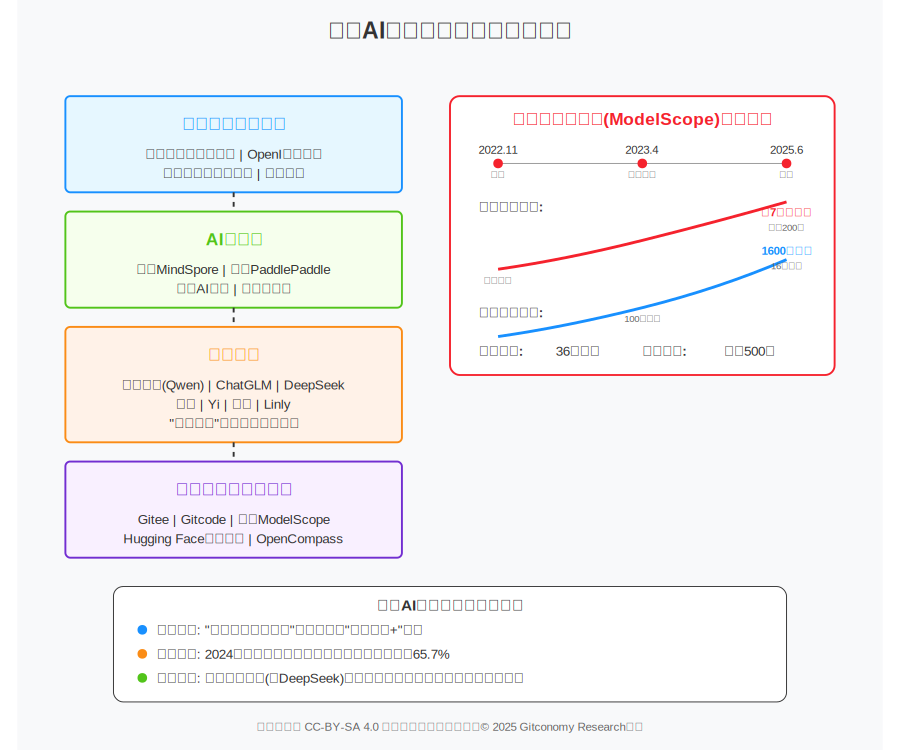

*图：中国AI开源生态图谱*

在这两大里程碑的共同作用下，一个层次分明、充满活力的中国AI开源生态图谱得以形成：

1. 开源基金会与社区：以“开放原子开源基金会”（OpenAtom Foundation）为代表的顶层组织日益成熟，为开源项目的孵化和治理提供了坚实保障。同时，像OpenI启智社区这样的平台，也汇聚了大量的国内顶尖科研力量。
2. AI框架层：以华为MindSpore和百度PaddlePaddle为代表的国产AI框架迅速崛起，它们不仅在性能上比肩国际一流水平，更在易用性、社区建设等方面持续发力，构筑了中国AI开发的“两大基石”。
3. 大模型层：呈现出“百花齐放”的繁荣景象。阿里巴巴的通义千问（Qwen）、智谱AI的ChatGLM等优秀国产开源大模型在全球范围内展现出强大的竞争力。特别是以DeepSeek为代表的新生力量，通过开源其世界顶尖性能且商业友好的模型，带来了“鲶鱼效应”，极大地拉高了国内开源的“基准线”，加速了整个行业的迭代进程。
4. 代码托管与模型中心：在Gitee、Gitcode等国内代码托管平台日益成熟的同时，Hugging Face、ModelScope等国际模型社区也成为中国大模型展示实力的重要舞台。

>以阿里云推出的魔搭社区（ModelScope）为例，自2022年11月成立以来，已汇聚超过500家贡献机构，托管的开源模型数量超过7万个，增长了超过200倍，用户数量从2023年4月的100万扩展至2025年6月的1600万，增长了约16倍，服务了全球36个国家的开发者，已成为中国最大的AI开源社区。魔搭社区不仅汇聚了众多业界头部模型，如百川智能、上海人工智能实验室书生系列大模型、零一万物Yi模型、DeepSeek系列模型等均在魔搭社区开源首发，还形成了覆盖LLM、对话、语音、文生图、图生视频、AI作曲等多个领域的全链路服务。这充分体现了中国AI开源社区在模型丰富度、开发者规模和服务能力方面的显著提升。

总而言之，中国AI开源生态正处在一个政策红利、产业投入和社区创新相互激荡的黄金时代。

### 5.2 开发者生态建设与角色转变

随着大模型技术的快速发展和应用普及，AI开发者生态正在经历深刻的变革，开发者的角色和技能要求也随之发生转变。传统的AI开发者更多地专注于特定领域的算法设计、模型训练和调优，需要深厚的数学和编程功底。然而，在大模型时代，特别是随着预训练大模型和开源模型的普及，开发者的角色正从“从零开始构建者”向“模型应用者和调优者”转变。开发者可以利用现成的大模型作为基础，通过微调（Fine-tuning）、提示工程（Prompt Engineering）、检索增强生成（RAG）等技术，快速构建满足特定需求的AI应用，大大降低了开发门槛和周期。

这种转变对开发者生态建设提出了新的要求。首先，需要提供更易用、更强大的开发工具和平台，简化大模型的部署、管理和迭代过程。例如，提供便捷的API接口、丰富的预训练模型库、可视化的微调工具等。其次，需要加强开发者培训和社区建设，帮助开发者掌握大模型相关的知识和技能，如提示词设计、模型评估、伦理安全等。开源社区在知识共享、技术交流和协作创新方面发挥着至关重要的作用。再次，需要鼓励跨学科合作，因为大模型的应用往往涉及多个领域的知识，需要开发者具备更强的业务理解能力和跨界协作能力。未来，随着AI Agent等更高级形态的出现，开发者可能需要扮演“智能体教练”或“任务规划师”的角色，设计智能体的行为逻辑和协作机制。开发者生态的繁荣将直接决定大模型技术在各行百业的应用广度和深度。

### 5.3 如何利用昇腾开源生态开展科研

#### 5.3.1 华为昇腾开源战略与生态布局

像华为昇腾这样的科技领军企业，其开源战略与生态布局就显得尤为关键，因为它不仅是这一趋势的参与者，更是塑造者。华为的开源战略是其全栈AI解决方案的核心组成部分，旨在通过“硬件开放、软件开源、使能伙伴、发展人才”的策略，构建一个繁荣、自主、可持续的昇腾生态。华为自身不直接对外销售昇腾芯片，而是通过与众多服务器厂商合作，以AI加速卡、服务器、集群等形态，将昇腾硬件能力开放给千行百业。

昇腾AI开放+开源生态主要由以下核心部分组成：

1. **昇腾社区**：作为获取知识、解决问题、寻找合作的核心枢纽，它为开发者提供技术文档、论坛、竞赛活动等丰富的资源和交流平台。通过昇腾社区、昇腾应用创新赛、高校合作计划等一系列举措，为开发者提供学习资源、交流平台和资金支持，培养百万AI人才，为生态注入源源不断的活力。

2. **ModelZoo模型库**：提供数百个经过昇腾亲和优化的预训练模型，支持开发者进行二次开发，大幅降低AI应用开发门槛。

3. **开源工具链**：由MindSpore AI框架、CANN异构计算架构以及ModelArts一站式开发平台等关键工具构成，是昇腾生态的坚实技术基础。

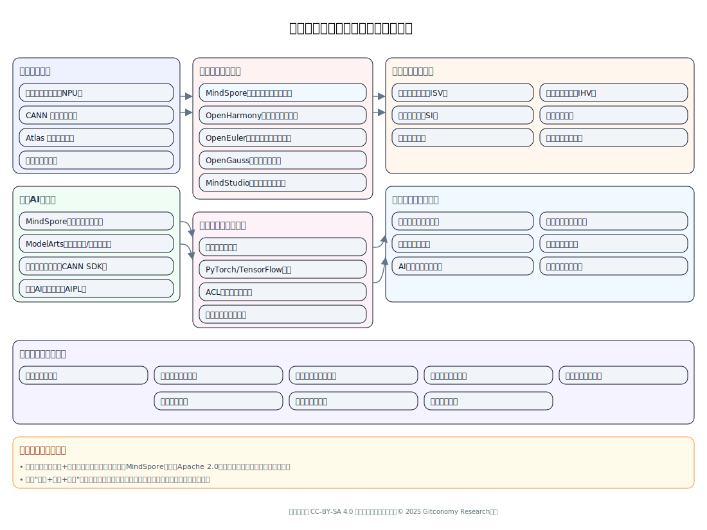

*图：华为昇腾开源战略与生态布局示意图*

#### 5.3.2 利用昇腾开源生态开展科研的实践

在当前的科技创新背景下，华为昇腾AI全栈技术体系及其开源生态为科研人员提供了丰富的工具和资源，使得科研活动能够更高效地进行。昇腾开源生态不仅支持科研人员在人工智能领域的技术研究，还能够帮助他们在实际应用中进行创新和实验。

以下是利用昇腾开源态开展科研的实践路径：

1. **第一步：资源获取与学习**

昇腾社区：这是进入昇腾世界的第一站，在这里可以找到最全的官方文档、白皮书、技术教程和丰富的开发者论坛。
- ModelArts平台：通过学校合作计划，可以申请免费的昇腾AI算力，这是进行模型训练和实验验证的“云端实验室”。
- 昇腾ModelZoo和MindSpore社区：可以下载官方优化好的模型作为研究基线，避免“重复造轮子”。

2. **第二步：课题研究与实践**

选题：将前沿技术与本地特色相结合。例如，可以尝试：
- 算法创新：将最新的Mamba或MoE架构在MindSpore框架中实现，并在昇腾硬件上进行性能优化。
- 应用创新：利用ModelArts平台，微调一个多模态大模型，专门用于识别广西特有的热带水果病虫害。
- 系统级创新：开发一个智能体（Agent），专门用于处理中国-东盟之间的小语种贸易单证，并将其部署在昇腾边缘设备上。
- 开发与调试：使用MindStudio进行代码开发和性能调优，利用其内置的Profiler工具精准定位瓶颈。

3. **第三步：融入社区与贡献**

从使用者到贡献者：这是提升个人技术影响力的关键一步。
- 初级：在使用过程中发现文档错误或Bug，可以在社区提一个Issue。
- 中级：参与社区的在线讨论，帮助回答新手的问题，并尝试修复一些简单的Bug并提交Pull Request (PR)。
- 高级：贡献一个全新的模型实现，或者为CANN开发一个高性能的自定义算子。每一次贡献，都会成为简历上闪亮的“技术名片”。

将学术研究成功转化为实际应用，是衡量科研价值的关键一环。在昇腾生态中，这一转化路径是清晰且多元的。首先，在学术成果层面，参与开源项目的经历，特别是被接受的PR（Pull Request），是研究者工程能力的最佳证明。在撰写学术论文时，可以将基于昇腾平台的实验结果作为核心亮点，用以展示在国产化平台上的性能优化成果。其次，在产业应用方面，研究者可以积极参加昇腾应用创新赛等竞赛，将科研项目转化为可展示、有潜力的解决方案。这不仅有机会赢得奖金，更是接触行业专家、获得实习和工作机会的绝佳途径。还有，对于有志于创新创业的人员而言，一个优秀的开源项目可能就是一个未来创业公司的雏形。华为的生态体系也为优秀的开发者项目提供了孵化和支持，能够帮助开发者将技术梦想变为现实。

### 小结

本章的核心要义在于，中国日趋成熟的AI开源生态正在重塑科研范式，它促使研究者从技术的旁观使用者，转变为生态的积极共创者。通过利用昇腾、MindSpore等国产全栈平台与DeepSeek等顶尖开源模型，研究者得以站在巨人肩上，将研究焦点从底层复现转向更高维度的创新。在这一新范式下，一个被合并的Pull Request或贡献一个优化模型所构建的可验证的技术影响力，其价值正超越传统的学术论文，这不仅是个人职业发展的核心战略，更是将个人研究融入国家技术自主浪潮的直接体现。

---

💡 **互动环节：问题讨论**

1. 讲义提出，一份高质量的开源贡献档案，其价值可能超越传统的论文列表 。您是否同意这个观点？您认为高校和研究机构在进行博士招生、职称评定等学术评价时，应如何公正、有效地衡量和认可开源社区的贡献？

2. 随着DeepSeek等顶尖性能的开源基础模型不断涌现 ，您认为高校AI实验室的核心定位应该是什么？是继续投入巨大资源追赶更大的模型规模，还是应该差异化地专注于目前工业界尚不重视的领域，例如新架构探索、长尾任务、AI伦理与可解释性等？

3. 作为一名中国的研究者，您如何看待参与全球开源社区（如Hugging Face）与贡献国产自主开源生态（如昇腾、启智社区）之间的关系？这两者是相互促进还是存在潜在冲突？您会如何规划自己的参与和贡献策略？

---

## 第六章	新的综合：一个为AI原生研究者打造的认知框架与行动纲领

基于上述的章节的论述，我们可以为自己构建一个强大、多层次的AI认知框架。这个框架将帮助你们在未来的学习和研究中，始终保持思考的清晰度与深度，确保你们的工作不仅技术上领先，更在战略上正确。我们的目标，是帮助各位从一个纯粹的算法学习者，蜕变为一个“AI原生研究者”。这样的研究者，不仅精通技术，更能洞察其背后的物理规律、系统逻辑与战略意图。他们思考的单位不再是代码行，而是整个系统、产业乃至国家的发展。在这个由信息密度定义的全新时代，你们不仅仅是技术的参与者，更应成为未来的主要缔造者。

### 6.1 “AI原生研究者”的三层认知框架*

成为一名“AI原生研究者”，意味着要学会通过三个相互关联的认知层面来分析问题与机遇：第一性原理层、系统工程层和国家战略层。这三个层面分别回答了研究的三个终极问题：**“为什么”（Why）**、**“如何做”（How）**以及**“为了什么”（What For）**。

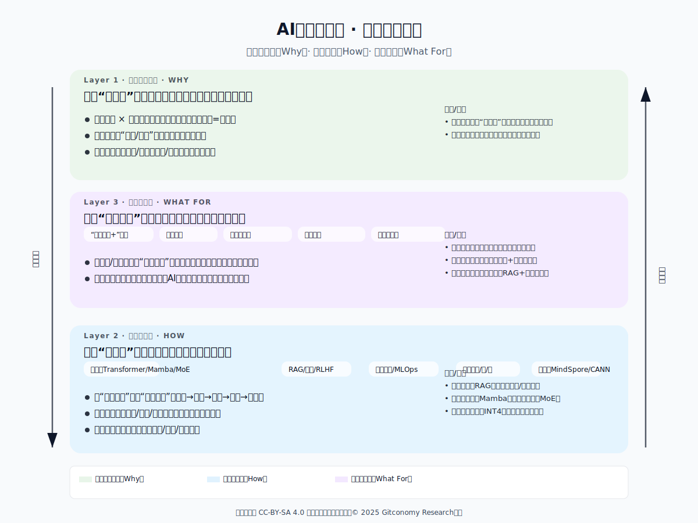

*图：AI原生研究者 · 三层认知框架*

1. **第一层：第一性原理认知 （The Why）**

这一层要求我们回归事物的最基本规律，用物理学和信息论的语言来思考AI。它迫使我们超越对模型和指标的表面追求，去探究工作的根本目的。

- **核心概念**：能量与信息密度二元论、智能即熵减、AI是相变。
- **应用指南**：当你们面对一个研究课题时，不要仅仅自问：“我能否将某个模型的准确率提升2%？”。你们应该提出更深刻的问题：“我所要解决的问题，其高熵的本质是什么？我设计的模型，在多大程度上扮演了一个高效的‘熵泵’，以降低系统的不确定性？完成这一熵减过程的能量代价是多少，我能否设计出热力学效率更高的方案？”

这种思维方式，能将你们的研究从追求数字上的边际改进，升华为一种更有意义的、从混沌中创造秩序的科学探索。它确保了你们工作的方向始终与智能的物理本质保持一致。

2. **第二层：系统工程认知 （The How）**

这一层要求我们打破“算法为王”的思维定式，将视野从单一模型扩展到整个技术栈。真正的颠覆式创新，往往发生在硬件、软件和模型之间的接口地带。

- **核心概念**：规模与效率的权衡（Transformer vs. Mamba/MoE/RAG）、软硬件协同设计、生态系统的力量（NVIDIA/CUDA vs. 华为昇腾） 。
- **应用指南**：你们的研究不应是“平台无关”的。你们应该主动思考：“我如何才能利用昇腾NPU的达芬奇架构和CANN的特定优势，来实现通用GPU上无法达到的性能？如果我的底层硬件集成了高效的向量数据库，我的RAG系统架构应该如何重新设计以最大化端到端效率？”

1. 数据感知层（Perception）：这一层是AI原生研究的基础，关注如何获取、处理和理解原始数据，包含数据处理能力、多模态数据整合和大规模数据检索三个关键能力。

2. 模型理解层（Comprehension）：这一层关注AI模型的原理和应用方法，是研究者形成方法论的关键，包含模型架构理解、参数调优能力和模型适应性应用三个方面。

3. 创新应用层（Creation）：这是最高层次，关注如何利用AI思维创造新的研究突破 ，包含跨学科问题重构、AI驱动研究方法和知识发现与创新三个维度。

*图：华AI系统工程认知框架*

这种思维方式，促使你们从一个纯粹的“算法主义者”转变为一个“系统架构师”。在当前的技术背景下，创新的基本单位已不再是单个模型，而是整个系统。讲座的演进逻辑清晰地揭示了这一点：从第二章的单一强大架构（Transformer），到第三章需要组合使用的架构工具箱（Mamba, MoE, RAG），再到实现这一切所依赖的全栈生态（昇腾），价值的实现越来越依赖于对整个“认知供应链”的理解和整合能力。因此，你们的价值，将更多地体现在如何将这些组件高效地集成起来，以实现最优的系统级性能与效率。

3. **第三层：国家战略认知 （The What For)**

这一层要求我们将技术工作置于更宏大的国家与产业背景中去考量，确保我们的研究能够解决真实世界中具有重大价值的问题。

- **核心概念**：“人工智能+”行动纲领、新质生产力、技术主权、特定领域应用 。
- **应用指南**：在启动一个新项目之前，请认真研读国家的“人工智能+”行动计划。自问：“我的研究服务于十大重点应用场景中的哪一个？它如何为培育‘新质生产力’做出贡献？”

特别地，第四章中广西的多个案例揭示了一个共通的、极其强大的应用范式——构建“智能数字孪生” 1。无论是为一片农田、一个景区、一座核电站，还是为一片海洋牧场，AI的核心作用都是通过吸收来自物理世界的多模态复杂数据，创建一个高保真、高密度、动态且具备预测能力的数字映射。正是在这个“数字孪生”之上，优化、预测和决策才得以实现，从而完成对物理世界的熵减并创造巨大价值。这个范式为你们提供了一个极其具体的心智模型。不要再抽象地思考“AI赋能工业”，而要具体地思考“我如何为X构建一个智能数字孪生”，这里的X可以是一个关键的工业资产、一个复杂的业务流程，或是一个重要的科学问题。

| 认知层面 | 源自讲座的核心概念 | 指导你研究的核心问题 |
| :--- | :--- | :--- |
| **第一层：第一性原理认知 (The Why)** | <ul><li>能量与信息密度二元论：文明演进的双螺旋驱动力。<li>智能即熵减：智能系统的物理学定义。<li>AI是相变：从“计算”到“创造”的质变，由“算法+算力”驱动。</ul> | 我的研究如何从根本上降低其目标领域的不确定性或提升信息密度？我是否在创造一个更高效的智能“热力学引擎”，即以更低的能量代价完成等量的“信息功”？ |
| **第二层：系统工程认知 (The How)** | <ul><li>架构权衡：暴力扩展（Transformer） vs. 效率范式（Mamba, MoE, RAG）。<li>全栈生态：软硬件协同设计的力量（昇腾/CANN vs. NVIDIA/CUDA）。<li>推理经济学：在全生命周期中，优化比训练更重要（量化、蒸馏）。 </ul>| 我的方案是简单地扩展已知方法，还是在创造一种新的效率范式？我的模型设计如何利用底层软硬件栈（如昇腾达芬奇架构）的独特能力？我如何为峰值的推理性能而非仅仅是训练精度来设计系统？ |
| **第三层：国家战略认知 (The What For)** | <ul><li> “人工智能+”国家行动纲领：产业转型的蓝图。<li>新质生产力：AI作为经济现代化的核心引擎。<li>技术主权：构建自主“认知供应链”的必然要求。<li>数字孪生范式：产业AI应用的统一模型（如广西案例）。</ul> | 我的工作如何与“人工智能+”计划中明确的关键产业挑战对齐？它是否有助于为某个关键流程构建一个智能“数字孪生”？我选择的工具和平台（如MindSpore, 昇腾）是否有助于增强国家自主AI生态的实力？ |

### 6.2 行动纲领：在“人工智能+”时代规划你的路线

拥有了认知框架，我们还需要一个具体的行动计划，将深刻的思考转化为扎实的行动。本部分为你们提供一个三步走的行动纲领，帮助你们在研究生阶段，乃至整个职业生涯中，系统性地规划自己的成长路径。

*图：在“人工智能+”时代规划你的路线图*

1. **第一步：定义使命——从抽象问题到国家挑战**

你们的研究生涯不应始于漫无目的地浏览最新论文，寻找可以微小改进的缝隙。它应该始于对国家最迫切需求的深刻理解。

- **行动**：将国务院发布的“人工智能+”行动纲领作为你的“寻宝图”，深入研究其中明确的十大重点应用场景。
- **指南**：运用我们刚刚建立的“数字孪生”范式作为你发现问题的透镜。例如：
	- 投身制造业：思考如何像4.2.2节中描述的那样，利用多模态传感器数据构建一条产线的数字孪生，以实现预测性维护。
	- 攻坚医疗健康：能否受到AlphaFold的启发，基于基因组和临床数据构建患者疾病进展的数字孪生，以加速个性化药物的研发？。
	- 赋能现代农业：能否像广西的案例一样，为一片农场构建数字孪生，以实现水肥资源的精准优化？

这种“从终局出发”的方法，能确保你们的研究从一开始就根植于真实世界的巨大价值，并与国家发展的脉搏同频共振。

2. **第二步：精通工具——成为全栈系统架构师**

在大模型时代，仅仅精通一个高阶AI框架（如PyTorch）是远远不够的。你们必须有意识地构建自己在整个国产技术栈上的能力。

- **行动**：超越框架使用者的角色，立志成为一个能够驾驭整个昇腾技术体系的系统级专家。
- **成长路线图**：
	- 打好地基（框架层）：精通MindSpore。深刻理解其自动并行、图算融合等为昇腾硬件深度协同设计的独特特性。
	- 深入机房（计算层）：学习CANN的基础知识。你无需成为编译器专家，但必须学会使用其Profiler等工具来分析和优化你的MindSpore模型，从昇腾NPU中压榨出每一滴性能。
	- 用好云梯（平台层）：成为ModelArts平台的专家用户。充分利用其提供的免费算力资源、ModelZoo中的预置模型和端到端的开发工具链，来极大地加速你的研究迭代周期 。

这条路线图，将帮助你们从一个抽象工具的使用者，转变为一个强大且具有重要战略意义的创新平台的主人。

3. **第三步：留下印记——从生态使用者到贡献者**

你们的最终目标，不应仅仅是从开源社区索取，更应是为其添砖加瓦。对中国AI开源生态的贡献，既是服务于国家战略，也是塑造个人技术品牌和职业生涯的最佳途径。

- 行动：积极、持续地参与到中国的开源社区中，如昇腾社区、启智社区、魔搭社区等。
贡献者阶梯（如5.3.2节所述）：
	- 学徒级：从小处着手。在使用ModelScope或昇腾ModelZoo的模型时，如果发现文档错误或代码Bug，就在Gitee或相关社区论坛上提交一个详尽的Issue。这是你的第一次贡献。
	- 工匠级：参与社区讨论，帮助回答新人的问题。选择一个简单的“good first issue”类型的Bug，尝试修复并提交你的第一个Pull Request (PR)。你的第一个PR被合并，将是一个重要的里程碑。
	- 专家级：贡献一个有价值的资产。这可以是一个高质量的、在MindSpore中实现的、针对昇腾优化的新论文模型，也可以是一份关于某个复杂任务的详尽教程。
	- 大师级：成为核心贡献者。为CANN贡献一个新颖的高性能自定义算子，或者成为某个关键开源项目的维护者。

- 回报：你在这条阶梯上每前进一步，都在为自己构建一份公开的、可验证的工程能力档案。这份档案远比一份只有论文列表的简历更有说服力。它证明了你的协作能力、代码质量和创造真实世界价值的能力，并让你直接为国家AI生态的繁荣与自强做出了实实在在的贡献。

### 小结

本章旨在为新一代研究者提供一份终极蓝图，核心是塑造能够贯通“第一性原理、系统工程、国家战略”三个认知层面的“AI原生研究者”。它倡导一种全新的科研范式：首先，在思想上，用物理学（为何做）、全栈技术（如何做）与国家需求（为何事）的框架来审视一切问题；其次，在行动上，通过“定义国家级使命、精通国产化工具、贡献开源生态”三步曲，将宏大认知转化为扎实的个人成长路径。其最终目的，是引导研究者将个人技术追求与国家发展脉搏同频共振，通过创造可验证的开源贡献来构建超越论文的职业影响力，成为未来科技浪潮中真正的价值缔造者。

---

💡 **互动环节：问题讨论**

1. 请用本章提出的“三层认知框架”  来审视您自己当前的研究课题或未来感兴趣的方向。它的第一性原理（Why）、系统工程实现（How）和国家战略价值（What For）分别是什么？这次分析是否给您带来了新的启发或让您发现了原有思路的盲点？

2. 讲义倡导一种“从终局出发”、由国家战略需求驱动的“自上而下”的研究范式 。这与传统的、由个人兴趣和好奇心驱动的“自下而上”的科研探索模式有何不同？您认为哪种模式更能催生颠覆性的原始创新？两者是否可以结合？

3. 本章的最终目标是帮助学生蜕变为一个“思考单位不再是代码行，而是整个系统、产业乃至国家的发展”的“AI原生研究者” 。您认为这是一个对所有AI从业者都现实且必要的要求吗？过度强调宏大叙事，是否存在让研究者脱离具体技术细节、导致基础不牢的风险？

---

## 结论：你们作为开拓者的时代使命

各位同学，本次讲座即将结束，但你们的征程才刚刚开始。我们共同回顾了AI如何作为一种降低信息熵的物理过程，推动着文明的演进；我们剖析了技术如何从暴力美学走向优雅效率到智能体协作。

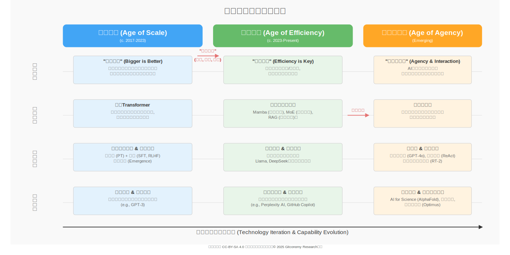

*图：AI大模型技术的时代演进”*

我们更理解了构建自主可控的“认知供应链”对于国家未来的决定性意义。我们共同构建了一个三层认知框架——第一性原理的“为什么”，系统工程的“如何做”，以及国家战略的“为了什么”。我们还规划了一个三步行动纲领——定义使命，精通工具，留下印记。

最后，同学们请记住，我们正处在一个由人工智能驱动的、波澜壮阔的大时代。作为广西人工智能学院的首批学子，你们不仅是这场技术浪潮的见证者，更将是未来的定义者和创造者。希望今天的课程能为你们打开一扇窗，让你们看到技术背后的时代脉搏，找到理论与实践的结合点，并最终在服务国家战略、赋能区域发展的伟大征程中，找到属于自己的星辰大海。

>**后续学习与实践建议**
>
>知识的学习永无止境，今天的讲座只是一个起点。为了帮助大家更好地将所学转化为所能，这里提供三点具体的后续学习建议：
>
>深化理论基础，紧跟技术前沿：
>
>1. 深度阅读：精读《Attention Is All You Need》等经典论文，系统性学习李沐老师的《动手学深度学习》等课程，打牢理论根基。养成定期浏览arXiv、顶会（NeurIPS, ICML, CVPR）论文的习惯，关注Mamba、多模态、Agent等领域的最新突破。
>
>2. 拥抱昇腾生态，启动第一个AI项目：访问昇腾社区，注册账号，通过高校合作计划申请ModelArts支持。选择一个你感兴趣的、与广西特色相关的方向（如用多模态模型识别芒果品级、用小语种模型翻译旅游介绍），从跑通一个昇腾ModelZoo的示例开始，逐步完成一个属于自己的课程项目。遇到问题，勇敢地在昇腾社区论坛提问。
>
>3. 融入开源社区，开启你的贡献之旅：从小处着手， 为你喜欢的开源项目（如MindSpore或一个具体的模型）贡献你的第一个PR，哪怕只是修改一个文档拼写错误或增加一句代码注释。将参与开源作为一种学习习惯。定期查看你关注项目的Issue列表，尝试帮助解答问题或修复一些标记为“good first issue”的简单Bug。

---

## 附录一：术语表

**A**

* **AI Agent (人工智能智能体)**：标志着AI从被动的“应答机器”进化为能够主动理解目标、分解任务、调用工具并与环境交互以达成目标的“自主协作者”。一个典型的AI Agent由大脑（大语言模型）、感知、规划、记忆和行动（工具使用）等核心组件构成。
* **Alignment (对齐)**：将预训练出的基础模型巨大的信息势能，引导到符合人类期望和价值观方向上的过程。它通常包含指令微调（SFT）和基于人类反馈的强化学习（RLHF）两个步骤。
* **AlphaFold2**：由DeepMind开发的AI模型，通过其核心的Evoformer模块，成功解决了从氨基酸序列预测蛋白质三维结构的重大生物学挑战。AlphaFold2本质上是一台高效的熵减机器，其公开发布的超过2亿个预测结构极大地降低了整个结构生物学领域的知识熵。
* **AWQ (Activation-aware Weight Quantization - 激活感知权重化)**：一种先进的后训练量化（PTQ）技术。其理论基础是模型中一小部分“突显”权重对性能起决定性作用，AWQ通过分析权重贡献来识别并保护这些关键权重，从而在性能和精度之间取得平衡。

**C**

* **CANN (异构计算架构 - Compute Architecture for Neural Networks)**：华为昇腾的核心加速引擎，角色类似于NVIDIA的CUDA与cuDNN的结合体。它为上层应用提供了统一的硬件抽象，是连接昇腾硬件与上层AI框架的桥梁。
* **Chain-of-Thought (思维链)**：大模型的一种涌现能力，指模型能自主地将复杂问题分解成中间步骤进行推理，并给出最终答案，显著提升了逻辑推理能力。
* **CNN (卷积神经网络 - Convolutional Neural Network)**：一种深度学习模型，通过卷积核的设计利用了图像数据的空间局部性。它在计算机视觉领域取得了巨大成功，但其局部“感受野”难以捕捉长距离依赖关系。
* **CUDA**：NVIDIA的并行计算平台和编程模型，为开发者提供了直接访问和控制GPU计算能力的接口。它是NVIDIA生态系统的核心壁垒和事实上的行业标准。

**D**

* **Da Vinci Architecture (达芬奇架构)**：华为昇腾AI处理器（NPU）的核心硬件架构，其内部包含专门为AI计算（标量、向量、张量）设计的AI Core，注重高能效比。
* **DeepSeek**：一家AI公司，通过开源其性能比肩甚至超越顶尖闭源模型、且商业友好的模型，在行业内带来了“鲶鱼效应”，极大地拉高了国内开源的“基-   **Digital Twin (数字孪生)**：一个极其强大的产业AI应用统一模型。其核心作用是通过吸收来自物理世界的多模态复杂数据，创建一个高保真、高密度、动态且具备预测能力的数字映射，并在此之上实现优化、预测和决策。

**E**

* **Emergence (涌现)**：指当模型规模（参数量、数据量、计算量）达到某个临界点后，会突然表现出在小模型上完全不存在的、未被直接训练过的新能力。典型的涌-   **Evoformer**：AlphaFold2模型中的核心模块，能够消化来自“多序列比对”(MSA)的高密度进化信息，并利用创新的注意力机制来推理蛋白质结构的约束。

**F**

* **Foundation Model (基础模型)**：在预训练阶段，通过在海量无标签数据上进行自监督学习（如“预测下一个词”）而构建的强大、通用的AI模型。

**G**

* **GNOME (Graph Networks for Materials Exploration)**：谷歌DeepMind的一个AI for Science项目，利用图神经网络在现有材料数据上进行训练，以预测新候选材料的稳定性。GNOME发现了超过38万种新的稳定材料，相当于“近800年知识积累”的总和。
* **GPTQ (Generative Pre-trained Transformer Quantization)**：一种高精度的后训练量化（PTQ）算法，它逐层对模型进行量化，并在量化每组权重后立即进行更新。

**H**

* **Hallucination (幻觉)**：生成式AI技术中一个固有的缺陷，指模型生成看似流畅、合理，但实际上与事实不符、逻辑矛盾或完全虚构的信息。

**I**

* **In-context Learning (上下文学习)**：大模型的一种涌现能力，指模型无需重新训练，仅通过在提示（Prompt）中给出几个示例，就能学会并完成新的任务。

**M**

* **Mamba**：一种基于状态空间模型（SSM）的创新AI架构，通过引入“选择机制”使其参数能根据输入动态生成。它能以线性时间复杂度 $(O(N))$ 处理序列，在长序列任务上性能可媲美甚至超越同等规模的Transformer，推理吞吐量可达5倍。
* **MindSpore (昇思)**：华为推出的一个开源的全场景AI框架，其设计初衷就是为了与底层的CANN引擎和昇腾硬件进行深度协同，以最大化发掘硬件潜力。
* **Mixture-of-Experts (MoE - 专家混合)**：一种采用“分而治之”策略的AI架构。它将模型的总参数量与处理每个词元所需的计算量解耦，通过一个“门控网络”为每个输入词元动态选择一小部分“专家”网络进行处理，从而能以较低的推理成本构建拥有巨大参数量的模型。
* **ModelArts**：华为昇腾生态中的一站式AI开发平台，科研人员可通过学校合作计划申请免费的昇腾AI算力。
* **ModelZoo (模型库)**：昇腾生态提供的模型库，包含数百个经过昇腾亲和优化的预训练模型，支持开发者进行二次开发。

**N**

* **NPU (神经网络处理器 - Neural Processing Unit)**：专为AI计算设计的处理器，如华为昇腾采用的NPU，其内部包含为AI运算设计的AI Core，注重高能效比。

**P**

* **Pre-training (预训练)**：诞生强大大模型的两个核心阶段之一，是最大化模型“信息密度”的阶段。在此阶段，模型通过在海量无标签数据上进行自监督学习（如预测下一个词），吸收和压缩人类知识，构建一个通用的基础模型。

**R**

* **RAG (检索增强生成 - Retrieval-Augmented Generation)**：一种将大语言模型（LLM）与外部可动态更新的知识库（如向量数据库）相结合的AI架构。它通过“检索-生成”两阶段工作流，将LLM的生成过程锚定在外部可验证的知识库中，显著减少“幻觉”，提高内容真实性。
* **ReAct (Reason+Act)**：实现AI Agent工具使用能力的主流范式。它让模型可以交替进行“思考”（推理下一步该做什么）和“行动”（调用API、执行代码等）。
* **RLHF (基于人类反馈的强化学习 - Reinforcement Learning from Human Feedback)**：对齐（Alignment）过程中的关键步骤。通过训练一个“奖励模型”来学习人类对不同回答的偏好排序，然后使用强化学习算法让大模型优化其回答策略以获得更高奖励。
* **RNN (循环神经网络 - Recurrent Neural Network)**：一种利用循环结构处理序列数据的深度学习模型，天然适用于处理语言、语音等信息。但其存在梯度消失/爆炸问题，难以处理长距离依赖。

**S**

* **Scaling Law (规模定律)**：由OpenAI等机构发现的规律，指当模型的参数量、训练数据量和计算量同时按指数规律增长时，模型性能会可预测地持续改善。
* **SFT (指令微调 - Supervised Fine-Tuning)**：对齐（Alignment）过程中的一个步骤，用一批高质量的“指令-回答”数据对模型进行微调，教会模型理解并遵循人类的指令格式。
* **SSM (状态空间模型 - State Space Models)**：一类受经典控制理论启发的模型，通过将序列历史信息压缩到一个固定大小的隐藏“状态”向量中，能以线性或近线性的时间复杂度处理序列。Mamba是其代表性架构。

**T**

* **Tensor Core**：NVIDIA GPU中专为深度学习核心的矩阵运算而设计的硬件单元。
* **Transformer**：由Google于2017年提出的革命性AI架构，其核心是自注意力机制（Self-Attention）。它几乎放弃了所有的结构先验，用巨大的计算量换取了前所未有的信息表征密度和灵活性。

---

## 附录二：参考文献

[1] 国务院关于深入实施“人工智能+”行动的意见 | 中国政府网, https://www.gov.cn/zhengce/content/202508/content_7037861.htm  
[2] 人工智能全球治理行动计划（全文）| 中国政府网， https://www.gov.cn/yaowen/liebiao/202507/content_7033929.htm   
[3] Emergent Abilities of Large Language Models | Semantic Scholar, https://nticscholar.org/paper/Emergent-Abilities-of-Large-Language-Models-Wei-Tay/dac3a172b504f4e33c029655e9befb3386e5f63a  
[4] Emergent Abilities in Large Language Models: A Survey | arXiv， https://arxiv.org/html/2503.05788v2  
[5] The 2024 AI Index Report | Stanford HAI，https://hai.stanford.edu/assets/files/hai_ai-index-report-2024-smaller2.pdf  
[6] The 2025 AI Index Report | Stanford HAI，https://hai.stanford.edu/assets/files/hai_ai_index_report_2025.pdf   
[7] HuggingFace Statistics | Originality.ai， https://originality.ai/blog/huggingface-statistics  
[8] Kaplan, J., McCandlish, S. H., Henighan, T., Brown, T. B., Chess, B., Child, R., ... & Amodei, D. (2020). Scaling laws for neural language models | arXiv, https://arxiv.org/abs/2001.08361
[9] Bahri, Y., Dyer, E., Kaplan, J., Lee, J., & Sharma, U. (2021). Explaining neural scaling laws | arXiv, https://arxiv.org/abs/2102.06701  
[10] The rising costs of training frontier AI models | arXiv,  https://arxiv.org/html/2405.21015v1  
 [11] Strubell, E., Ganesh, A., & McCallum, A. (2019). Energy and policy considerations for deep learning in NLP | arXiv, https://arxiv.org/abs/1906.02243  
 [12] AI has high data center energy costs — but there are solutions | MIT Sloan,  https://mitsloan.mit.edu/ideas-made-to-matter/ai-has-high-data-center-energy-costs-there-are-solutions  
 [13] Costa, C. D. (2025, April 4). The hidden cost of AI: How machine learning is draining our energy resources | Medium, https://medium.com/@clairedigitalogy/the-hidden-cost-of-ai-how-machine-learning-is-draining-our-energy-resources-21d3d36af9d1  
 [14] Gu, A., & Dao, T. (2023). MAMBA: Linear-time sequence modeling with selective state spaces. arXiv. https://arxiv.org/abs/2312.00752  
[15] Zhang, S., Zhang, X., Sun, Z., Chen, Y., & Xu, J. (2024). Dual-space knowledge distillation for large language models. Proceedings of the 2024 Conference on Empirical Methods in Natural Language Processing (EMNLP 2024). https://arxiv.org/abs/2406.17328  
[16] Gu, Y., Dong, L., Wei, F., & Huang, M. (2023). MiniLLM: Knowledge distillation of large language models | arXiv, https://arxiv.org/abs/2306.08543  
[17] A Closer Look into Mixture-of-Experts in Large Language Models | arXiv, https://arxiv.org/html/2406.18219v2  
[18] How Search Engines Work: Crawling, Indexing, Ranking, & More,， https://www.seo.com/basics/how-search-engines-work/  
[19] Retrieval-Augmented Generation for Large Language Models: A Survey | arXiv,， https://arxiv.org/pdf/2312.10997  
[20] AI Engine vs Search Engine: Which One Should You Use? | WillDom,  https://willdom.com/blog/ai-engine-vs-search-engine/  
[21] NBER WORKING PAPER SERIES GENERATIVE AI AT WORK Erik Brynjolfsson Danielle Li Lindsey R. Raymond Working Paper 31161  |  MIT Sloan, https://mitsloan.mit.edu/shared/ods/documents?PublicationDocumentID=9765  
[22] Robotics: Five Senses plus One—An Overview | MDPI， https://www.mdpi.com/2218-6581/12/3/68  
[23] 广西确定智能赋农路径优先培育一批智慧农业经营主体, | 新华网， http://www.gx.xinhuanet.com/20250313/227b19ba6bc04861b1f02237a12c80cb/c.html  
[24] AI赋能农业研究，广西大学农业版DeepSeek上线 | 广西大学， https://www.gxu.edu.cn/info/1004/37659.htm  
[25] “数智”相伴广西旅游更智慧 | 中国旅游新闻网， http://wlt.gxzf.gov.cn/zwdt/mtsy/t18642150.shtml  
[26] 防城港核电携手昇腾AI落地Explaining neural scaling laws - PNAS, 访问时间为 九月 8, 2025， https://www.pnas.org/doi/10.1073/pnas.2311878121广西首个DeepSeek大模型  | 人民网广西频道, http://gx.people.com.cn/n2/2025/0218/c179462-41139515.html  
[27] 自然资源部海洋四所：与广西华为就海洋AI建设、东盟国际合作等达成战略合作共识 | 证券时报网， https://www.stcn.com/article/detail/1666498.html   
