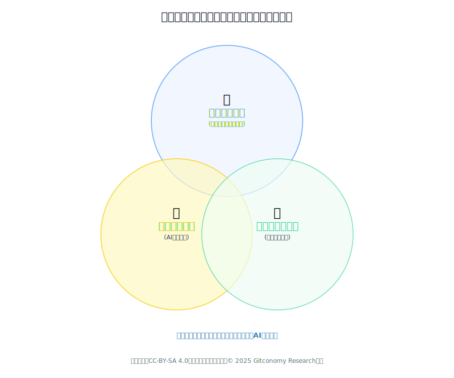
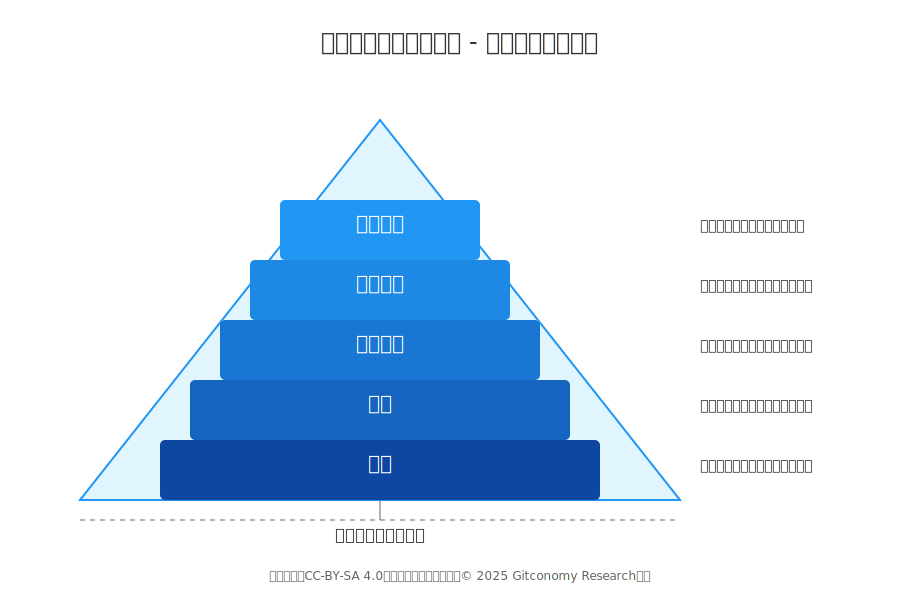
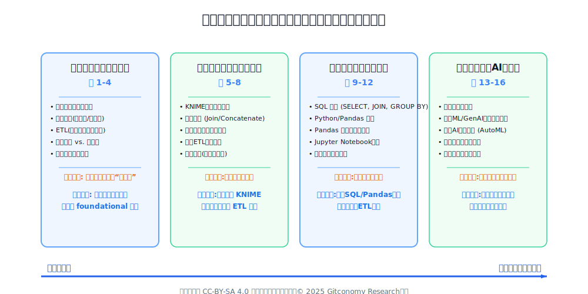
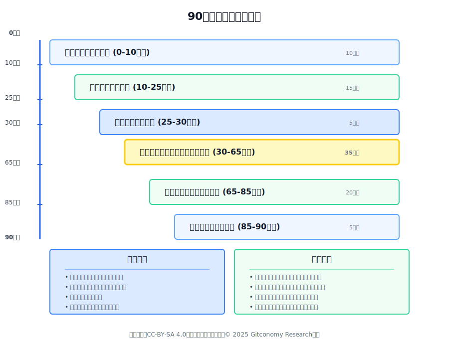

# 《人工智能数据工程导论》课程设计指南

## 引言

本指南旨在为《人工智能数据工程导论》课程提供一套全面、系统且可执行的设计框架与教学标准。作为授课教师团队的核心指导文件，本指南将阐明课程的顶层设计思路、教学理念、执行策略与评估体系，确保教学质量与学习体验的一致性与卓越性。

## 一、课程核心定位、教学理念与学习路径

本章旨在阐明《人工智能数据工程导论》的顶层设计思路与核心教学理念：如何将一门看似复杂且令人生畏的课程——《人工智能数据工程导论》——转化为一场真正为全体大一新生设计的思维启蒙与视野拓展之旅？

## 1.1 课程的思维启蒙与价值定位

《人工智能数据工程导论》是为全体大一新生设计的思维启蒙与视野拓展课程，旨在通过揭示驱动AI时代的“数据引擎”，培养学生的数据素养、工程思维与科技伦理观。

这一定位明确了课程的三重属性。首先，它是一门通识启蒙课，面向全体新生，无论其学科背景是人文社科还是理工农医。它不预设任何技术门槛，致力于打破学科壁垒，将数据思维和AI素养作为现代大学生的基础能力。其次，它是一门视野拓展课，其核心目标并非传授具体的操作技能，而是构建一幅宏观的认知地图，让学生理解人工智能背后庞大的数据体系是如何运作的，从而在未来的学习和职业生涯中，无论身处何种领域，都能具备与智能时代同频的视野和格局。最后，它强调思维与价值观的培养，超越了单纯的知识传授，将工程思维的严谨、数据素养的审慎以及科技伦理的敬畏置于同等重要的位置。

因此，本课程的设计核心是为**大学一年级学生**量身定制，不预设任何编程或数据科学的先验知识。其核心教学理念在于建立学生的**自信心**，激发其**好奇心**，并揭开人工智能（AI）领域的神秘面纱。课程将采用启发式的教学模式，确保初始概念易于掌握，同时为有能力的学生提供持续深入探索的可能性。这种以学生为中心的方法旨在将学习体验从被动的知识接收转变为主动的能力构建。

### 1.2 课程设计的核心理念

祛魅而非灌输、直觉优先于公式和应用驱动学习三大核心理念是本课程教学设计的基石，它们共同构成了课程独特的教学哲学，指导着从内容选择到课堂互动的每一个环节。

)
*图：课程设计的三大核心理念*

#### 1.21. 祛魅而非灌输

本课程的首要理念是“祛魅”——揭开人工智能神秘、甚至带有科幻色彩的面纱，将其还原为一个可理解、可分析、由人类设计和构建的工程系统。对于认知为空白的大一新生而言，AI往往被视为一种近乎“魔法”的存在，这种敬畏感很容易转化为恐惧感和距离感，形成“这是天才才能做的事”的心理壁垒。

我们的教学策略因此不是系统性地“灌输”高深的技术理论，而是组织一场AI的“后台探秘之旅”。我们将带领学生绕过光鲜亮丽的前台（如DeepSeek的流畅对话），直接进入喧嚣、繁杂甚至有些凌乱的“后台厨房”。在这里，他们将看到数据是如何像原始食材一样被采集，经历清洗、筛选、标注等一系列繁琐的“洗、切、配”工序，最终才被送上“灶台”（算法模型）烹饪成精美的“菜肴”（AI应用）。

这种方法论的深层价值在于促进教育公平与包容性。当学生们认识到，所谓的人工智能奇迹，其基础是大量系统化、流程化、甚至重复性的数据工作时，AI就不再是少数数学天才的专属领域。它变成了一个依赖于流程、规范、团队协作和不懈努力的工程学科。这种认知上的转变能够有效对抗“冒名顶替综合症”（Imposter Syndrome），鼓励来自不同学科背景、拥有不同天赋（如严谨的逻辑思维、出色的沟通协作能力、敏锐的社会洞察力）的学生，都能在广阔的科技领域中找到自己的位置，无论是成为核心技术人员，还是产品经理、政策制定者、伦理监督者。

#### 1.2.2 直觉优先于公式

鉴于大一学生可能没有任何高等数学或编程基础，本课程严格遵循“直觉优先于公式”的教学原则。在认知心理学上，初学者缺乏用以锚定新知识的既有心智模型（Schema）。若直接抛出抽象的技术定义或数学公式，如同给一个没有图纸的拼图玩家一堆零散的碎片，学习过程将变得痛苦且低效。

因此，每一个核心概念的引入，都将通过一个精心设计的、源于日常生活的类比或故事来完成。例如，讲解ETL（抽取、转换、加载）流程时，我们将使用“餐厅厨房”模型：

- **抽取 (Extract)**：如同餐厅采购员从各个农场、市场（数据源）采购蔬菜、肉类（原始数据）。
- **转换 (Transform)**：如同厨工对食材进行清洗、去皮、切块、腌制（数据清洗、格式统一、特征工程）。这是将原始食材变为可用半成品的核心步骤。
- **加载 (Load)**：如同将配好的菜肴送至主厨的灶台前（加载到数据仓库或直接供给AI模型），等待烹饪。

只有当学生能够清晰地在脑海中构建起这个生动的厨房工作流，并能用自己的语言复述时，我们才会正式引入ETL这一技术术语。这种教学法并非简单地“简化”知识，而是在根本上改变了学生的认知加工方式。它从死记硬背转向了心智模型的建构。当学生未来忘记ETL的具体定义时，他们可以轻易地通过回想“厨房”这个心智模型，自行推导出其核心功能，从而形成真正深刻、持久且可迁移的理解。

#### 1.2.3 应用驱动学习

本课程的所有知识点都将遵循“问题先行，方案在后”的应用驱动模式。我们绝不会孤立地讲解一个技术或工具，而是始终将其置于一个真实、有趣且与学生生活息息相关的应用场景中。这种方法能最大限度地激发学生的内在学习动机，让他们感受到“学有所用”的即时价值。

例如，在介绍“数据仓库”这一概念时，我们不会以“数据仓库是一个面向主题的、集成的、时变的数据集合”这样的定义开始。相反，我们会提出一个场景化的问题：

>想象一下，抖音是如何为你推荐下一条可能喜欢的短视频的？为了精准推荐，它需要整合来自你观看历史、点赞记录、评论内容、你所在的位置、你关注的用户，以及全球其他用户的行为数据等多个维度的信息。这些信息并不是集中存储在一个地方，而是分布在不同的系统、平台和数据库中。抖音的工程师们面临的挑战是：如何把这些分散、杂乱的数据有效整合、存储并能快速响应查询请求？为了应对这个挑战，‘数据仓库’这一概念应运而生。”

通过这种方式，技术概念不再是冰冷的术语，而是解决某个特定问题的智慧结晶。应用场景为学习提供了“为什么”的答案，这比单纯知道“是什么”要重要得多。这种教学模式将前两个理念（祛魅、直觉）紧密地结合在一起：当学生看到他们每天使用的App背后依赖着这些看似复杂的概念时，“祛魅”就自然发生；当他们理解了解决问题的“为什么”之后，对解决方案（技术概念）的“直觉”也就水到渠成。

### 1.3 从数据素养到人工智能应用

本课程的学习轨迹被设计成一个叙事性的旅程。学生们以“数据学徒”的身份开始，学习使用Python和pandas库掌握数据的基本“语法”。随后，他们将成长为“数据侦探”，学习如何清洗、质疑和可视化数据集，从中发现洞见。最终，他们将转变为“人工智能实践者”，学习如何应用预训练模型，并理解支撑AI成为可能的整个工程生命周期。这一循序渐进的过程确保了知识的连贯性和技能的逐步深化。

### 1.4 弥合理论与实践的鸿沟

本课程强调理论与实践的紧密结合，每周的实验环节是这一理念的关键体现。在课堂上介绍的每一个理论概念，都会立即通过一个动手实践的练习进行巩固。这种紧密的反馈循环对于在技术领域中获取和巩固技能至关重要。

这种设计背后的一个基本教学决策是坚持**代码优先**的原则。尽管图形化用户界面（GUI）工具（如KNIME）能够让初学者快速上手并构建数据流，但这种方法会抽象掉底层的逻辑实现。学生可能知道一个节点的功能，却不理解其背后的代码逻辑，这限制了他们解决新问题的能力和知识的可迁移性。相反，通过 **Python**、**pandas** 和 **scikit-learn** 等工具进行编码，可以迫使学生直面数据操作和建模的基本构建模块。虽然初始学习曲线可能更陡峭，但由此获得的知识是基础性、持久且可迁移的，为学生未来的技术生涯奠定了坚实的基础。

### 1.4. 将伦理考量作为核心支柱

本课程明确指出，数据处理和AI应用的**伦理问题**并非课程结束时的附加章节，而是贯穿整个16周教学过程的**核心主题**。从第一个模块开始，学生就将被引导去思考**公平性**、**偏见**和社会影响等问题，确保他们从一开始就建立起**负责任的技术实践观**。

-----

## 二、目标学生画像与教学挑战

对目标学习群体的深刻理解是设计一门成功课程的前提。本课程专为大学一年级新生设计，他们的认知特征、学习习惯和心理状态与高年级学生截然不同。因此，必须主动预见并系统性地应对可能出现的教学挑战。

### 2.1 目标学生画像

我们面对的是一群典型的“数字时代原住民”，他们具有以下鲜明特征：

- **认知风格:** 他们成长于信息爆炸和多任务处理的环境中，习惯于在社交媒体、短视频和即时通讯之间进行快速的注意力切换。这使得他们对长时间、单向度的信息灌输（如传统讲座）耐受度较低。教学内容必须模块化、多模态，节奏紧凑且富有变化。

- **动机驱动:** 他们的学习动机呈现出混合型特征。一方面，他们受到强烈的外部动机驱动，如追求好成绩、为未来职业发展铺路；另一方面，他们对能够激发好奇心、解决有趣问题、或具有社会影响力的事物抱有极大的内在热情。课程设计必须同时满足这两方面的需求。

- **技术关系:** 他们是技术的熟练使用者，但几乎都是技术的新手创造者。他们能凭直觉判断一个App的用户体验优劣，却对支撑其运行的后台系统、数据架构和工程复杂性毫无概念。这种认知偏差既是挑战（可能低估技术实现的难度），也是机遇（可以将抽象概念与他们日常使用的产品无缝连接）。

- **心理状态:** 作为大一新生，他们正处于人生的关键过渡期，对大学生活和未来充满兴奋与憧憬，同时也伴随着对未知领域的迷茫和不确定感。他们渴望实践，希望所学能够快速应用于现实世界，建立成就感和方向感。

### 2.2 主要教学挑战与应对策略

基于上述学生画像，本课程在教学过程中可能面临一系列挑战。我们必须采取前瞻性的宏观策略，将应对方案融入课程设计的每一个细节中。下表系统性地梳理了这些挑战及其应对策略。

| 挑战 | 课堂表现 | 通用应对策略 | 具体战术示例 |
| :--- | :--- | :--- | :--- |
| **代码恐惧症** | 对命令行、代码编辑器等界面感到恐惧；一旦出现代码便立刻放弃思考；固守“我不是学技术料”的观念。 | **抽象化与封装**：采用低代码/无代码工具，将教学重点从编程语法转移到工作流的内在逻辑和设计思想上。 | 使用类似Zapier的拖拽式界面，或公有云的AutoML服务，让学生通过图形化操作来“搭建”一个数据处理流程，直观感受数据管道的构建，而无需编写一行代码。 |
| **数学焦虑症** | 对任何涉及公式、统计符号的内容产生抵触情绪；难以理解模型准确率、召回率等依赖数学定义的概念。 | **类比化与可视化**：通过生动、非数学的现实世界类比和直观的图表来解释统计和算法概念的核心思想。 | 讲解“假阳性”与“假阴性”时，使用“火警误报”（宁可错报不可漏报）或“新冠病毒检测”（漏诊的代价）等生活化案例，而不是直接展示混淆矩阵。 |
| **概念抽象化** | 无法将“数据湖”、“API”等术语与任何具体事物联系起来，导致听课时感觉云里雾里，课后迅速遗忘。 | **具象化锚定**：将每一个抽象概念都牢牢地“锚定”在一个学生每天都在使用的、看得见摸得着的实体或数字产品上。 | 解释API时，展示学生的打车软件（如滴滴）如何调用高德地图的API来显示地图和规划路线。将API比喻为两个服务之间签订的一份“合同”，允许一方合法使用另一方的特定功能。 |
| **注意力碎片化** | 在传统讲座中难以长时间保持专注，容易在笔记本电脑上进行多任务操作，导致学习效率低下。 | **节奏化与互动化**：遵循“15分钟原则”，将90分钟的课堂切分为多个10-15分钟的模块，并在不同模块间切换教学模式（短讲、视频、投票、讨论、动手活动）。 | 在讲解了12分钟的数据清洗概念后，立即发起一个3分钟的在线投票，让全班学生在一份样本数据中找出“最脏”的数据项，并与邻座同学讨论各自的选择理由。 |

*表：教学挑战与应对策略*

---

## 三、整体学习目标

本课程旨在为初学者构建一幅清晰的人工智能数据工程全景图。在课程结束后，学生应能建立起对该领域的基本认知、掌握核心概念、体验关键环节，并树立正确的科技价值观，为未来的深入学习或跨学科应用打下坚实基础。学习目标被设计为五个递进的层面，从知识到价值观，构成一个完整的能力与素养体系。

*图：课程学习目标层次*

### 3.1 知识层面: 构建认知地图

此层面的目标是帮助学生在脑海中绘制一幅关于人工智能数据世界的宏观地图，了解各个组成部分及其相互关系。

- **理解核心定位**：能够用自己的话生动地描述数据工程在整个人工智能项目中的“基石”和“后勤保障”作用，说明它如何为AI模型“准备粮草弹药”。
- **掌握关键概念**：能够区分并解释数据工程中的核心名词，如：数据管道（Pipeline）、数据仓库（Data Warehouse）与数据湖（Data Lake）的基本区别、ETL（抽取、转换、加载）的基本过程。
- **了解技术生态**：对AI数据工程领域的主流技术有一个概念性的了解，知道Apache Spark是做什么的（大数据分布式计算）、Airflow是做什么的（工作流调度），对云平台（如AWS, Azure, GCP）在数据工程中的角色有初步认识。
- **识别数据价值流**：能够清晰地描述出原始数据（Raw Data）是如何一步步通过收集、清洗、转换、整合，最终变成可以驱动AI模型训练的“黄金数据”（Golden Data）的完整价值流程。

为实现这一目标，整个课程将贯穿使用一张**数据旅程地图**的视觉教具。每一个新知识点都会被明确地标注在这张地图上，让学生时刻清楚自己正处在数据价值流的哪个环节，以及当前环节与前后环节的逻辑关系。

### 3.2 技能层面: 体验核心流程

此层面的核心是“体验”而非“精通”。目标是让学生通过亲手操作，对数据工程师的核心工作流产生感性的、具象的认识，打破对技术操作的神秘感。

- **识别数据质量问题:** 能够在一份给定的简单数据集中，识别出常见的质量问题，如缺失值、重复值、异常值、格式不一致等，并能简要说明这些问题对后续AI模型可能造成的负面影响。
- **执行基础数据操作:** 能够使用预先配置好的Jupyter Notebook环境，在教师引导下，通过修改或填入单行Python代码（如使用Pandas库的`df.dropna()`, `df.drop_duplicates()`），对小型数据集进行简单的清洗和转换操作，直观感受代码对数据的强大操控力。
- **体验自动化流程:** 能够理解并成功运行一个预先编写好的、简单的自动化数据处理脚本（例如，一个每日自动从网站抓取天气信息并存入文件的脚本），并通过对比手动操作，深刻体会“自动化”在提升效率和保证一致性方面的巨大价值。
- **使用云端AI服务:** 能够通过Web图形界面进行操作，体验至少一种公有云平台提供的零代码或低代码AI服务（如图像自动标注、自动化机器学习AutoML），感受云计算服务如何极大地降低了AI应用的开发门槛。

### 3.3 思维层面: 播下工程思维的种子

这是本课程最具长远价值的目标之一，旨在改变学生的思维方式，培养一种系统化、规范化解决问题的习惯。

- **建立“全局观”思维:** 初步建立系统性思考的习惯。在看待一个AI应用时，能超越算法模型本身，意识到其背后有一整套复杂、环环相扣的数据支撑系统在稳定运转。
- **理解“工程化”的价值:** 通过对比一个临时性的分析脚本和一个健壮、可重复、可监控的工程化系统，能够清晰地阐述两者在可靠性、可维护性和可扩展性上的巨大差异，初步建立对代码规范、流程健壮性的追求。
- **树立“质量为先”意识:** 深刻理解“Garbage In, Garbage Out”（垃圾进，垃圾出）这一数据科学领域的黄金法则。通过真实的失败案例，认识到数据质量是决定AI应用成败的生命线。
- **培养“自动化”思维:** 在面对任何重复性、规律性的任务时，能主动地、习惯性地思考：“这件事是否可以用程序来自动化解决？”初步建立用工程手段解决效率问题的思维模式。

这一层面的教学将大量采用“失败案例”教学法。通过剖析现实世界中因数据质量问题或工程化不足导致的重大事故（如金融模型崩溃、医疗诊断误判），让学生在震撼中领悟工程思维的重要性。

### 3.4 科技素养层面: 拓宽宏观视野

此层面旨在提升学生作为未来公民和各行业领导者所必需的科技素养，使其能够批判性地理解和评价技术。

- **理解数据驱动本质:** 能够从“数据、算力、算法”三要素的宏观视角，分析现实生活中的AI应用案例，并能重点阐述“数据”在其中的基础性、决定性作用。
- **培养技术好奇心:** 对数据工程领域的新技术和新趋势（如实时数据处理、向量数据库、DataOps等）保持开放和好奇的态度，并有主动通过网络资源进行初步了解和探索的意愿。
- **认识技术权衡 (Trade-off):** 通过简单案例，理解在技术选型和系统设计中不存在“银弹”（Silver Bullet），任何决策都是在成本、效率、复杂度、可靠性等多个维度之间进行的权衡。初步建立辩证、务实的技术评价观。我们将引入一个简单的心智模型：“快、好、省，最多只能选两个”，来帮助学生分析和理解技术决策。
- **了解职业图景:** 对人工智能数据工程师、数据科学家、算法工程师、机器学习工程师等相关职业的核心职责、技能要求以及他们之间的协作关系有一个基本的、框架性的了解。

### 3.5 思政层面: 明确伦理底线

本课程将科技伦理与社会责任教育无缝融入技术教学的全过程，确保学生在接触技术的第一天起，就建立起强烈的伦理意识和责任感。

- **建立数据伦理基础认知:** 了解数据偏见（Bias）、数据隐私泄露、算法不透明等核心伦理风险，并通过实际案例（如带有种族偏见的招聘算法、侵犯用户隐私的推荐系统）认识到这些问题可能带来的社会不公与个体危害。
- **树立数据安全意识:** 在处理数据的每一个环节，都建立起强烈的安全意识，理解保护数据不被窃取、不被滥用、符合法律法规（如GDPR）的重要性。
- **理解数据的社会价值:** 认识到数据作为国家基础性战略资源和新型生产要素，在推动社会进步、经济发展、城市治理和科学发现中的巨大潜力和重要作用。
- **秉持“科技向善”的初心:** 在课程的启蒙阶段，就确立技术应服务于人类共同福祉的核心价值观，鼓励学生在课程项目和日常思考中，积极探索如何利用数据技术解决气候变化、公共健康、教育公平等真实的社会问题。

伦理教育并非课程结束前的一个独立章节，而是贯穿始终的一条红线。在讲解数据采集时，我们会讨论数据偏见；在讲解数据存储时，我们会讨论数据隐私；在讲解模型应用时，我们会讨论算法公平性。这种设计确保了学生将伦理考量内化为技术实践中不可分割的一部分。

---

## 四、课程大纲概览

本部分为课程提供了逐周的、可操作的教学计划。每周内容包括学习目标、关键概念、旨在促进主动学习的课堂活动，以及用于培养实践技能的动手实验。

### 4.1. 教学大纲的结构与理念

课程大纲为授课教师提供一个一目了然的教学计划，不仅详细说明了“教什么”，还涵盖了“为什么教”和“如何教”。表格化的格式是呈现结构化、周度化课程最有效的方式，它清晰地将概念、目标和实践应用对齐，可作为授课教师即刻使用的规划文档。

*图：课程模块关键知识点与目标*

| 周次 | 模块 | 核心主题 | 关键活动/工具 |
| :--- | :--- | :--- | :--- |
| 1-4 | **模块一：数据工程基础** | 建立“是什么”和“为什么”的核心概念 | 概念讨论、命令行基础 |
| 5-8 | **模块二：无代码工具的数据转换之旅** | 使用可视化工具构建完整的ETL流程 | KNIME |
| 9-12 | **模块三：数据建模与编程入门** | 从无代码过渡到代码，引入SQL和Python | SQL, Python (Pandas) |
| 13-16 | **模块四：面向AI的数据工程与毕业项目** | 将所学技能应用于AI场景并完成毕业项目 | Python (Scikit-learn), 毕业项目 |

*表：16周课程大纲概览*

### 4.2 详细课程大纲结构

本部分为课程提供了逐周的、可操作的教学计划。每周内容包括学习目标、关键概念、旨在促进主动学习的课堂活动，以及用于培养实践技能的动手实验。

#### 4.2.1 模块一：数据工程基础 (第1-4周)

1. **模块整体教学目标概述**

本模块旨在为学生**构建数据工程的宏观认知地图**。课程结束时，学生将能够清晰地阐述数据工程在人工智能领域的核心价值，理解数据从原始状态到可应用状态的全过程，并掌握数据管道、ETL、数据存储等 foundational 概念。本模块重在建立直觉和理解“为什么”，为后续的实践操作打下坚实的理论基础。

2. **模块每周课程内容**

| 周次 | 核心概念（授课主题） | 学习目标（学生产出） | 实践实验/作业 | 知识检查点 |
| :--- | :--- | :--- | :--- | :--- |
| **第1周** | AI的“引擎”与“燃料”：数据工程的角色与价值 | 学生能够**口头阐述**数据工程的“燃料”角色，并以一个熟悉的AI应用（如抖音）为例，列举其可能需要的至少3种数据“燃料”。 | **实验0：** 熟悉与配置课程环境。完成云平台账户注册、本地软件（Anaconda, VS Code, Git）的安装与测试。 | **快速投票：** “你认为支撑‘网易云音乐每日推荐’这个功能，最关键的数据‘燃料’是什么？” |
| **第2周** | 数据管道剖析：批处理与流处理 | 学生能够为一个简单的业务场景（如统计食堂人流），**手绘一幅概念性的数据管道图**，并标出数据源、处理环节和最终用途。 | **实验：** “我的第一个管道”。在本地命令行终端，使用管道符`|`将一个命令的输出（如`ls`）作为另一个命令（如`grep`）的输入，直观感受“管道”的含义。 | **成果分享：** 小组将绘制的数据管道图拍照上传至班级协作区，进行同伴互评。 |
| **第3周** | 数据转换过程：ETL (提取、转换、加载) | 学生能够将一个非技术流程（如制作一杯手冲咖啡）的步骤，**准确地映射到ETL的三个阶段**，并解释每个阶段的核心任务。 | **实验：** “手动ETL”。给定一个混乱的CSV文件（如学生信息表），学生在电子表格软件中手动识别并“清洗”至少3种数据质量问题，并记录操作步骤。 | **一分钟论文：** “在本次手动清洗数据的过程中，你认为哪一步‘转换(Transform)’最困难或最耗时？为什么？” |
| **第4周** | 数据存储架构：仓库 vs. 湖泊 | 学生能够根据给定的数据类型和应用需求，**做出“数据仓库”或“数据湖”的选择决策**，并能简要说明理由。 | **实验：** “数据分类”。探索一个包含多种文件类型（CSV, TXT, JPG）的文件夹，学生需要将文件分类为结构化/非结构化数据，并说明其理想的存储方案。 | **情景问答：** “如果一个团队需要快速查询和报表，另一个团队需要探索未知模式，他们应该共享一个数据湖还是数据仓库？为什么？” |

3. **该模块实验环节的设计 (课后完成)**

本模块的实验设计核心是**“概念具象化”**。由于前期不引入复杂工具，实验的目的是为每一个抽象的核心概念提供一个简单、有形、可触摸的载体。学生课后需要完成的任务包括：

1.  **环境配置的确认：** 确保所有软件安装成功，并能成功运行`git --version`等基础命令，为后续课程扫清障碍。本章旨在回答这一核心问题。
2.  **命令行管道的探索：** 在实验基础上，鼓励学生尝试更复杂的命令组合，如`cat file.txt | sort | uniq -c`，加深对数据流和顺序处理的理解。
3.  **“脏”数据观察报告：** 基于手动ETL实验，学生需要提交一份简短的观察报告，不仅记录清洗步骤，更要分析这些“脏”数据可能对一个假设的AI应用（如学生成绩预测模型）造成的灾难性后果。

这些实验的设计旨在让学生通过最基础的工具（命令行、电子表格）“玩”起来，在“玩”的过程中亲手触摸数据、感受管道，从而将抽象的架构图和流程论内化为自己的直观理解。

#### 4.2.2  模块二：无代码工具的数据转换之旅 (第5-8周)

1. **模块整体教学目标概述**

本模块旨在带领学生**从理论走向实践，通过可视化编程工具构建一个完整的ETL管道**。课程结束时，学生将能熟练使用KNIME等无代码平台，独立完成从多数据源提取、数据清洗与混合、到最终加载的全过程。本模块的核心是让学生在“拖、拉、拽”的直观操作中，将第一模块学到的概念进行复现和固化，建立技术自信心。

2. **模块每周课程内容**

| 周次 | 核心概念（授课主题） | 学习目标（学生产出） | 实践实验/作业 | 知识检查点 |
| :--- | :--- | :--- | :--- | :--- |
| **第5周** | KNIME可视化数据工作流入门 | 学生能够独立**构建一个KNIME工作流**，完成读取本地CSV文件、按某一列排序、并将结果写入新CSV文件的完整操作。 | **实验1：** 学生需严格复现课堂演示，安装KNIME并构建他们的第一个简单工作流，确保节点连接正确、工作流能成功执行。 | **成果提交：** 提交成功运行后的KNIME工作流文件（`.knwf`）。 |
| **第6周** | 在KNIME中提取和混合数据 | 学生能够根据需求，**正确选用“Joiner”（连接）或“Concatenate”（串联）节点**，将两个独立的数据集合并成一个有意义的宽表。 | **实验2：** 使用KNIME读取两个独立的CSV文件（如`customers.csv`和`orders.csv`），并使用“Joiner”节点将它们合并。 | **快速问答：** “如果要合并今年和去年的销售记录，两个文件列名完全相同，应该用Joiner还是Concatenate？” |
| **第7周** | 在KNIME中进行数据转换和清洗 | 学生能够在工作流中**组合运用至少3个不同的转换节点**（如`Row Filter`, `Missing Value`, `String Manipulation`），以解决实际的数据质量问题。 | **实验3：** 在实验2的基础上，学生需在其工作流中添加多个转换节点，以清洗合并后的数据集（如填充缺失值、统一大小写）。 | **截图分享：** 分享自己的清洗工作流截图，并用一句话说明哪个节点“帮了最大的忙”以及为什么。 |
| **第8周** | 数据加载与期中项目 | 学生能够**提交一个完整的、带有清晰注释的KNIME工作流**，该工作流能自动完成一个小型期中项目的端到端数据处理任务。 | **实验：期中项目。** 学生将获得一组新的数据文件，必须独立在KNIME中构建一个完整的ETL管道，并提交最终工作流及一份简短的步骤说明报告。 | **同伴互评：** 在课堂上，各小组交换期中项目的初步工作流设计图，进行交叉检查和反馈。 |

3. **该模块实验环节的设计 (课后完成)**

本模块的实验是一个**阶梯式、项目驱动**的序列。所有课后实验被设计成一个连贯的、逐步深入的项目，最终导向期中考核。

1.  **每周构建一部分：** 课后实验不再是孤立的任务。实验1是起点，实验2在实验1的基础上扩展，实验3则继续在实验2上深化。这种“搭积木”的方式让学生每周都能看到自己的项目在“成长”，保持了学习的连贯性和动力。
2.  **从模仿到创造：** 前三周的实验带有较强的指导性，确保学生能掌握核心节点的使用。而第八周的期中项目，则要求学生将学会的技能应用到一个全新的、略有不同的数据集上，考察他们知识迁移和独立解决问题的能力。
3.  **重视文档与解释：** 从实验3开始，要求学生为工作流中的关键节点添加注释。期中项目则要求提交一份解释报告。这旨在培养学生“解释自己工作”的习惯，这是工程实践中至关重要的软技能。

通过这种设计，学生在四周内不仅学会了一个工具，更重要的是，他们亲手、完整地走了一遍数据工程师的核心工作流程，将抽象概念彻底转化为可触摸、可展示的技能。

#### 4.2.3 模块三：数据建模与编程入门 (第9-12周)

1. **模块整体教学目标概述**

本模块旨在引导学生**完成从可视化工具到代码编程的关键一跃**。课程结束时，学生将掌握使用SQL进行数据查询与聚合的基本语法，并能使用Python的Pandas库进行程序化的数据清洗和整理。本模块的核心是让学生通过对比和复现，深刻理解代码在处理数据方面的强大能力、精确性及与可视化工具的异同，为真正的编程世界打开大门。

2. **模块每周课程内容**

| 周次 | 核心概念（授课主题） | 学习目标（学生产出） | 实践实验/作业 | 知识检查点 |
| :--- | :--- | :--- | :--- | :--- |
| **第9周** | 使用SQL查询数据：`SELECT`入门 | 学生能够**编写简单的`SELECT FROM WHERE`查询**，从数据库中准确地筛选出满足特定条件的数据。 | **实验4：** 学生将获得一个SQLite数据库文件和一系列问题（如“找出所有价格高于50的商品”），必须编写SQL查询来找到答案。 | **代码填空：** 提供一个不完整的SQL查询，让学生补充`WHERE`子句以实现特定筛选目标。 |
| **第0周** | 用于数据转换的高级SQL：`JOIN`与`GROUP BY` | 学生能够**编写包含`JOIN`和`GROUP BY`的SQL查询**，以实本章旨在回答这一核心问题。现跨表连接和数据聚合，回答更复杂的业务问题。 | **实验5：** 使用SQL的`JOIN`和`GROUP BY`子句，在数据库中**复现**模块二KNIME实验中的数据合并与聚合任务。 | **问题翻译：** 将一个业务问题（如“哪个部门的员工平均年龄最大？”）“翻译”成一个SQL伪代码结构。 |
| **第11周** | 使用Python和Pandas进行数据整理 | 学生能够**使用Pandas将CSV文件加载到DataFrame中**，并使用`.head()`, `.info()`, `.describe()`等方法进行初步的数据勘探。 | **实验6：** 学生将使用Jupyter Notebook和Pandas读取一个CSV文件，并调用基础方法检查其维度、数据类型和基本统计信息。 | **看图说话：** 展示一个`.describe()`方法的输出截图，提问：“从这张表中，你能发现关于数据最有趣或最可疑的一点是什么？” |
| **第12周** | 使用Pandas进行数据清洗 | 学生能够**编写一个完整的Python脚本**，使用Pandas复现KNIME期中项目中的核心数据清洗与转换步骤。 | **实验7：** 学生将获得与KNIME期中项目相同的脏数据集，但这次必须在Jupyter Notebook中，使用Pandas函数完成相同的ETL任务。 | **反思对比：** “在Pandas中，你觉得哪项操作比在KNIME中更方便？哪项更复杂？为什么？” |

3. **该模块实验环节的设计 (课后完成)**

本模块的实验设计遵循**对比中顿悟**的原则。核心思想是让学生用新的工具（代码）去解决一个已经解决过的问题，从而在强烈的对比中感受不同方法的优劣和本质。

1.  **SQL复现KNIME：** 实验5要求学生用SQL完成此前在KNIME中通过拖拽Joiner节点完成的任务。这让学生直观地看到，可视化节点背后对应的就是结构化的SQL语句，从而理解了无代码工具的“抽象封装”本质。
2.  **Pandas复现KNIME：** 实验7是本模块的高潮。学生需要用Pandas代码完整地复现自己的期中项目。当他们成功时，会获得巨大的成就感，并深刻体会到：KNIME的每一个节点，几乎都对应着Pandas的一个或几个函数。这个过程能帮助他们建立从可视化逻辑到程序化逻辑的直接映射，是思维模式转变的关键一步。
3.  **Jupyter Notebook作为核心载体：** 所有Python实验都在Jupyter Notebook中完成。这种交互式的环境允许学生编写一小段代码、立刻看到结果，极大地降低了编程的畏惧感，并鼓励探索和试错。

通过这种“用新方法解决老问题”的设计，学生不是在孤立地学习新语法，而是在一个熟悉的场景下，聚焦于比较不同工具的表达方式，从而更深刻地理解数据操作的本质。

#### 4.2.4 模块四：面向AI的数据工程与毕业项目 (第13-16周)

1. **模块整体教学目标概述**

本模块是课程的**顶峰与整合，旨在将数据工程技能与AI应用场景、职业伦理和未来发展紧密相连**。课程结束时，学生将能够阐述数据准备如何直接影响AI模型的效果，对数据相关的伦理问题有深刻的认识，并能以团队形式，综合运用所学知识，**完成一份从问题定义到数据管道设计的AI产品原型策划案**，展示其系统性思维和创新能力。

2. **模块每周课程内容**

| 周次 | 核心概念（授课主题） | 学习目标（学生产出） | 实践实验/作业 | 知识检查点 |
| :--- | :--- | :--- | :--- | :--- |
| **第3周** | 责任与职业：数据伦理、安全与职业发展 | 学生能够在一个给定的AI案例中，**识别出至少两种潜在的数据伦理风险**（如偏见、隐私），并提出初步的缓解思路。 | **无编码实验：** 分组对一个真实的AI伦理争议案例（如招聘算法的性别歧视）进行分析，并准备一个3分钟的观点陈述。 | **立场选择：** 面对一个数据隐私与便利性的权衡场景，学生通过投票选择自己的立场并说明理由。 |
| **第4周** | 为AI“引擎”注入“燃料”：从传统ML到生成式AI | 学生能够清晰地**区分**为传统机器学习模型和生成式AI模型准备数据时的**核心差异**（如特征工程 vs. 海量非结构化数据）。 | **实验：** 1) 使用Pandas对一个表格数据集执行基础的特征工程。2) 对一个小型文本数据集进行格式化处理（如清洗、转为问答对），模拟为GenAI微调准备数据的过程。 | **场景判断：** “我们要开发一个App来识别猫狗图片，数据准备的重点是什么？如果要开发一个能写猫狗故事的AI，重点又是什么？” |
| **第5周** | 毕业项目启动与工作坊 | 学生能够以小组为单位，**提交一份清晰的、一页纸的项目立项申请**，包含问题陈述、核心创意和初步的数据需求分析。 | **实验：** 启动毕业项目。学生需完成团队组建，确定项目主题，并对选定的数据集进行初步的探索性数据分析（EDA），了解其基本情况。 | **电梯演讲：** 每个小组用60秒向全班介绍自己的项目创意，并接受同学和老师的提问。 |
| **第16周** | 毕业项目展示 | 学生能够以团队形式，进行一次**10分钟的、有说服力的项目路演**，清晰地展示其产品愿景、数据管道设计和伦理考量。 | **实验：提交最终项目。** 包含完整的项目策划书（PDF）和演示材料（PPT或视频）。 | **最终项目路演**及基于评分细则的教师与同伴评估。 |

3. **该模块实验环节的设计 (课后完成）**

本模块的实验环节完全**围绕毕业项目这一“顶点体验” (Capstone Experience) 展开**，从结构化的练习转变为开放式的、以产出为导向的探索。

1.  **从分析到设计：** 实验的核心不再是执行给定的步骤，而是要求学生**自行设计**。他们需要像真正的产品经理和数据架构师一样，从零开始定义问题、寻找数据、规划数据如何流动和转换。
2.  **综合技能应用：** 毕业项目要求学生综合运用前三个模块的所有知识。他们需要进行数据质量评估（模块1和2），可能会用到SQL或Pandas进行探索性分析（模块3），最终需要绘制出清晰的数据管道图（模块1和2的核心概念）。
3.  **软技能的锻炼：** 课后工作重点包括大量的团队沟通、任务分配、文档撰写（项目策划书）和演讲准备。这些软技能的培养与技术知识的学习被置于同等重要的位置。
4.  **里程碑驱动：** 第十五周的项目启动和立项申请是一个关键的里程碑，确保每个团队在项目早期就有一个清晰的方向和可行的计划。这避免了最后一周的混乱，培养了良好的项目管理习惯。

通过这个毕业项目，学生将课程中所有点状的知识和技能，编织成一张解决真实问题的能力网，最终实现从“学习者”到“创造者”的思维转变。

---

## 五、教学方法与策略

为实现上述多层次的学习目标，并有效应对大一新生的教学挑战，本课程将摒弃传统的“讲授-接收”模式，全面采用以学生为中心的、高度互动的工作坊（Workshop）模式。每一堂课都是一个精心设计的、融合多种教学方法的综合性学习体验。

### 5.1 教学方法组合：90分钟工作坊模式详解

单次90分钟的课堂将被设计为一个本章旨在回答这一核心问题。有起承转合、节奏分明的多阶段工作坊。这种模式旨在最大化学生的参与度与主动性，确保学习过程既高效又有趣。

*图：工作坊模式示意图*

| 时间段 | 环节名称 | 教师角色 | 学生角色与任务 | 教学目标 |
| :--- | :--- | :--- | :--- | :--- |
| 0-10分钟 | **破冰与悬念** | 故事讲述者、问题提出者 | 倾听故事、代入情境、产生好奇心 | 激发兴趣，引入本节课要解决的核心问题（例如，“Spotify如何为你生成每周推荐歌单？”）。 |
| 10-25分钟 | **概念揭秘** | 概念翻译官、视觉化设计师 | 主动聆听、构建直觉、记录核心类比 | 运用“直觉优先”原则，通过生动类比（如“厨房模型”）和大量视觉化图表，讲解核心概念（ETL）。 |
| 25-30分钟 | **快速校验** | 互动引导者 | 参与在线投票、与同伴快速讨论 | 通过即时反馈工具（如雨课堂、Mentimeter）进行快速概念测试，检验并巩固初步理解。 |
| 30-65分钟 | **核心活动：小组工作坊** | 学习教练、资源提供者 | 在3-4人小组内，围绕一个微型案例进行讨论、设计、产出（核心环节） | 学生分组解决一个具体的、简化版真实问题（如“设计一个流程，清洗一份混乱的学生选课数据”），将所学概念应用于实践。 |
| 65-85分钟 | **成果分享与整合** | 讨论主持人、知识整合者 | 随机小组上台展示方案、聆听他人思路、参与全班讨论 | 选取2-3个小组分享其解决方案，教师引导全班进行对比、点评，并从中提炼出共通的设计原则和常见陷阱。 |
| 85-90分钟 | **总结与衔接** | 课程领航员 | 梳理本节课关键收获、明确与课程全局的联系 | 简要总结本节课的核心思想（“ETL是AI背后无名的英雄”），并预告下节课内容，将其置于“数据旅程地图”中。 |

*表：单次90分钟工作坊课堂结构示例（主题：ETL入门）*

### 5.2 案例选择标准

教学案例是连接理论与现实的桥梁，其选择必须遵循以下严格标准：

- **高相关性**：案例必须源于学生高频使用或高度熟悉的产品与服务（如抖音、淘宝、游戏、校园App），确保学生能够立即产生共鸣。
- **新颖趣味性**：案例应具备话题性、故事性或趣味性，能够激发学生的好奇心和探索欲。避免使用陈旧、枯燥的行业案例。
- **精准对应性**：每个案例都必须清晰、直接地指向一个或一组核心知识点，避免案例过于复杂而导致教学目标失焦。
- **伦理思辨性**：优先选择那些内含伦理争议或权衡的案例（如TikTok推荐算法的“信息茧房”效应），为课堂讨论提供天然的思政切入点。
- **规模挑战性** ：案例应能体现“规模”带来的质变，帮助学生理解为什么一个在100条数据上可行的方法，在1亿条数据上会彻底失效，从而引出工程化的必要性。

### 5.3 实践项目设计：AI产品原型策划案

课程的期末大作业是一个团队项目——“人工智能产品原型策划案”。此项目的设计思想是评估学生的思维深度与广度，而非编程能力。它侧重于“创意、设计和表达”，是对整个课程学习成果的综合性检验。

项目要求学生以3-5人小组为单位，完成以下任务：

- **发现问题:** 观察校园或社会生活，识别一个可以通过数据驱动的AI产品来解决或改善的具体问题。
- **定义数据:** 明确要实现该AI产品，需要哪些核心数据（即“黄金数据”），并分析这些数据的可能来源。
- **设计管道:** 绘制一幅清晰的高阶数据流程图，描述从数据采集、清洗、转换、存储到最终供给AI模型的完整数据管道，并对每个环节的功能进行文字说明。
- **评估风险:** 分析项目在数据获取、数据质量、技术实现上面临的主要挑战，并重点对产品可能带来的数据偏见、隐私侵犯等伦理风险进行深入剖析，提出规避策略。
- **展示愿景:** 制作一份专业的项目策划书和一段10分钟的演讲视频（或现场展示），清晰、有说服力地阐述产品的价值主张、设计思路和潜在影响。

### 5.4 计算环境配置

为确保所有学生无论在何种网络条件下都能获得一致、无缝的学习体验，并降低认知负荷，本课程采用以 **Jupyter Notebook为核心**的“本地+云端”统一模式。本地环境用于日常、离线的编码练习，云端环境则提供强大的模型和算力支持，两者共享相同的 Notebook 操作界面与交互逻辑。

#### 5.4.1本地部署环境

本地环境的核心任务是让每位学生都能在自己的计算机上熟练运行和操作Jupyter Notebook，以此完成基础的数据处理练习。所有操作都将在大家熟悉的 Notebook 界面中进行。

  - **核心目标:** 在本地顺畅地创建、编辑和运行 `.ipynb` Notebook 文件。

  - **安装与启动 (推荐方案):**

      - **一站式安装:** [**Anaconda Distribution**](https://www.anaconda.com/download) (Python 3.9+)。安装 Anaconda 是最简单的方式，它会自动安装好运行 Jupyter Notebook 所需的全部环境，包括 Python、JupyterLab/Notebook 以及常用的科学计算库。
      - **启动方式 (二选一):**
        1.  **图形化启动 (推荐初学者):** 打开 **Anaconda Navigator** 图形界面，直接点击 “**Launch**” 按钮启动 **JupyterLab** 或 **Jupyter Notebook**。这将在你的默认浏览器中打开一个熟悉的 Notebook 工作区。
        2.  **IDE 内核启动:** 在 [**Visual Studio Code**](https://code.visualstudio.com/) 中打开 `.ipynb` 文件。VS Code 会自动检测并使用 Anaconda 提供的Jupyter内核来运行Notebook单元格，提供现代化的编辑体验。

  - **核心Python库 (Anaconda已内置):**

      - `pandas`: 用于数据读取、清洗和分析。
      - `numpy`: 用于数值计算。
      - `matplotlib` / `seaborn`: 用于数据可视化。
      - `notebook` / `jupyterlab`: Jupyter Notebook 的核心运行环境。

  - **版本控制工具:**

      - **Git:** [**Git 客户端**](https://git-scm.com/downloads) 必须在本地安装。学生需要通过 Git 将 `.ipynb` 练习文件同步到 GitCode 仓库。

#### 5.4.2 云端实验环境

云端环境作为本地的延伸，提供了相同的Jupyter Notebook 界面，但背后集成了更强大的算力资源和尖端AI模型，用于完成体验式和探索性的任务。

  - **核心平台:** [**ModelScope Notebook**](https://modelscope.cn/)
      - **环境特性:** ModelScope Notebook是一个云端的、无需配置的JupyterLab 环境。学生通过浏览器登录后，将看到与本地 Anaconda启动后几乎完全一致的操作界面。
      - **核心优势:**
        1.  **体验一致:** 学生在本地学会的 Jupyter Notebook 操作技巧（如运行单元格、使用Markdown、查看变量等）可以无缝迁移到云端。
        2.  **一键调用模型:** 无缝集成ModelScope社区的开源模型和数据集，学生可以在Notebook中通过几行代码，直接调用强大的AI模型，完成本地难以实现的任务。
        3.  **免费GPU资源:** 提供免费的GPU计算资源，让学生能够体验需要高性能计算的AI任务，完美契合“祛魅”的教学理念。

#### 5.4.3 在线协作与项目管理

课程所有的代码、文档和团队项目都将通过统一的在线平台进行管理，培养学生的现代化软件协作习惯。

  - **核心平台:** [**GitCode**](hhttps://gitcode.com)
      - **定位:** GitCode 将作为本课程唯一的官方代码托管和项目协作中心。
      - **主要用途:**
        1.  **Notebook版本控制:** 学生将个人和团队的 Jupyter Notebook (`.ipynb`文件) 推送到 GitCode 仓库中进行版本管理和分享。
        2.  **文档协作:** 团队项目的策划书、分析报告等将以 Markdown (`.md`) 文件的形式在仓库中进行协作撰写。
        3.  **项目管理:** 利用GitCode的Issues 等功能进行简单的任务分配和进度跟踪。
        4.  **作业提交:** 所有涉及Notebook和文档的作业，将通过提交GitCode仓库链接的方式完成。

通过这种设计，Jupyter Notebook成为了贯穿本地与云端的统一学习界面，最大程度地降低了学生在不同环境间切换的认知成本，使他们能将全部注意力聚焦于数据工程知识本身。

---

## 六、考核与评估体系

本课程的考核评估体系与教学理念一脉相承，旨在创建一个低压力、高激励的学习环境。我们强调**“为学习而评估”（Assessment for Learning）**，而非“对学习的评估”（Assessment of Learning）。

### 6.1 评估理念

- **过程性评估为主:** 评估贯穿整个学期，重点考察学生在学习过程中的持续参与、努力和进步，而非仅仅依赖期末的一次性考试。课程将不设传统的闭卷期末考试。
- **激励性评估:** 评估方式多样化，旨在激励学生的创造性、批判性思维和团队协作能力。反馈将是建设性和前瞻性的，重点指出优点并为后续学习提供具体建议。
- **能力导向:** 每一项考核都明确指向课程的一个或多个核心学习目标，确保评估内容与教学内容的高度一致性。

### 6.2 建议分数构成

为体现上述理念，建议将总成绩按以下比例分配：

- **课堂参与及工作坊表现 (20%):** 鼓励学生积极参与课堂讨论和小组活动。
- **每周“洞察备忘录” (30%):** 一系列低压力的、趣味性的小作业。
- **期中案例分析报告 (20%):** 一项检验学生综合分析能力的个人任务。
- **期末团队项目策划与展示 (30%):** 课程的顶点项目，综合评估所有层面的学习成果。

这种构成方式将超过一半的分数（50%）分配给了过程性、参与性的环节（课堂参与+每周作业），而将另一半（50%）分配给了综合性、应用性的项目，有效分散了学生的学业压力，并鼓励持续投入。

### 6.3 评估标准详解

下表详细说明了各项考核内容的评估重点，为教师评分和学生备考提供了清晰的指引。

| 考核项 | 权重 | 关联学习目标 | 评估重点 | 产出形式 |
| :--- | :--- | :--- | :--- | :--- |
| **课堂参与及工作坊表现** | 20% | 思维层面、科技素养 | 在小组讨论中贡献的质量和建设性；在工作坊活动中的主动性和协作精神；向他人清晰表达观点的能力。 | 教师/助教观察记录；部分环节可引入同伴互评。 |
| **每周“洞察备忘录”** | 30% | 知识层面、技能层面 | 将当周学习的核心概念，应用到一个新的、自己发现的现实案例中；在提供的小数据集中识别数据质量问题并提出清洗思路。 | 每周提交一份约300-500字的简短书面报告。 |
| **期中案例分析报告** | 20% | 知识层面、思维层面、思政层面 | 深入剖析一个真实世界AI系统（如某App的推荐算法）背后可能的数据管道；识别其潜在的数据偏见和伦理风险，并提出改进建议。 | 一份约1500字的个人研究报告。 |
| **期末团队项目策划与展示** | 30% | 全部五个层面 | 创意的价值与可行性； 数据管道设计的逻辑清晰度与完整性； 伦理风险分析的深度； 书面报告的专业性与演讲表达的说服力。 | 一份10-15页的团队项目策划书 + 10分钟的团队现场展示或视频。 |

*表：考核内容与评估标准*

---

## 七、讲义与内容设计黄金法则

为确保所有教学材料（PPT、讲义、视频等）都与课程的核心理念保持高度一致，并能为大一新生提供最佳的学习体验，内容设计者（无论是教师还是助教）都应遵循以下四条黄金法则。

### 7.1 法则一：故事先行，概念在后

任何一个新概念的引入，都必须由一个引人入胜的故事、一个真实的场景或一个悬而未决的问题开始。

这是应用驱动学习理念在内容设计上的直接体现。人的大脑天生就对故事有更强的接受度和记忆力。故事为抽象的概念提供了情境的“锚点”。

- **要这样做:** 在讲解数据清洗的重要性时，从1999年美国宇航局火星气候探测者号因“英制-公制单位混用”这一微小数据错误而坠毁的真实故事讲起。
- **不要这样做:** 开篇第一页PPT标题就是“数据清洗的五种常用方法”，然后罗列“处理缺失值”、“统一数据类型”等枯燥的条目。

### 7.2 法则二：视觉化优先

优先使用高质量的图片、动画、流程图和简单的示意图来传递信息，并严格控制单页PPT上的文字数量。

对于习惯了视觉化信息环境的“数字原住民”来说，大段的文字是学习的最大障碍。视觉化不仅能提升信息的传递效率，还能帮助学生构建心智模型。

- **要这样做:** 讲解数据管道时，使用一张动态PPT，让代表“数据”的小图标像流水一样，从“数据源”流经“ETL”的各个处理站，最终汇入“数据仓库”。遵循“一图胜千言”和“一页PPT只讲一个核心观点”的原则。
- **不要这样做:** 用一整页的文字来描述数据管道的定义、组成部分和工作流程。

### 7.3 法则三：多问“为什么”，少讲“是什么”

引导学生思考技术背后的动因、价值和所要解决的根本问题，而不仅仅是记忆其定义和分类。

授人以鱼不如授人以渔。让学生理解技术演进的内在逻辑，比记住孤立的技术名词重要得多。这种探究式的学习能够激发批判性思维，培养解决未知问题的能力。

- **要这样做:** 提问：“在数据库已经存在了几十年的情况下，为什么谷歌的工程师们还要费力发明MapReduce和分布式文件系统？他们当时面临了什么传统技术无法解决的‘痛点’？”
- **不要这样做:** 直接陈述：“MapReduce是一种用于大规模数据集并行计算的编程模型。”

### 7.4 法则四：建立关联地图

每当引入一个新知识点时，都必须明确地将它与之前学过的内容联系起来，帮助学生在脑海中持续构建和完善整个领域的知识体系地图。

这条法则是对抗“知识碎片化”的最有效武器。初学者的典型困境是感觉每节课的内容都是孤立的，学完就忘。不断地回顾和关联，能将点状的知识编织成一张网。

- **要这样做:** 在每节课的开始和结束，都展示那张贯穿整个课程的“数据旅程地图”，并明确指出：“上周我们在这里（数据采集），今天我们深入探讨这个环节（数据转换），下周我们将进入这里（数据存储）。大家可以看到，我们正在一步步地沿着数据的价值链前进。”
- **不要这样做:** 假设学生能够自动将新旧知识联系起来，每节课都从一个全新的主题开始，缺乏承上启下的环节。

遵循这四条黄金法则，将确保本课程的教学内容不仅知识准确，更在教学法上充满吸引力、启发性和有效性，从而真正实现其为全体大一新生开启智能时代大门的宏伟目标。

---

# 结论：超越技术的启蒙之旅

本指南不仅是一份课程的教学计划，更是构建一种全新教育体验的蓝图。其核心目标是引领大一新生踏上一场精心设计的启蒙之旅——从对人工智能的神秘敬畏，到对其背后数据引擎的清晰洞察；从被动的知识消费者，到主动的、富有责任感的科技思考者。我们坚信，通过“祛魅而非灌输”、“直觉优先于公式”和“应用驱动学习”的核心理念，并始终将“伦理考量”作为贯穿一切的红线，本课程将达成其目标。

作为教学团队，我们的角色也随之转变。我们不仅仅是知识的传授者，更是这场“后台探秘之旅”的向导、学生好奇心的激发者和工程思维的播种人。课程的成功不在于学生记住了多少技术名词，而在于他们是否在心中建立起了一幅宏观的“数据旅程地图”，是否养成了“质量为先”和“自动化”的思维习惯，以及是否能够在未来面对任何技术浪潮时，都能保持批判性的思考和人文的关怀。

最终，这门《人工智能数据工程导论》课程的目标是为每一位学生，无论其未来专业方向如何，都装备上一套适应智能时代的底层操作系统。它播下的种子——数据素养、工程思维和科技伦理观——将在他们未来的学术和职业生涯中生根发芽，帮助他们成为更有远见、更负责任的未来创造者。让我们共同致力于将这一愿景变为现实，为学生们开启一扇通往未来的、充满无限可能的大门。
