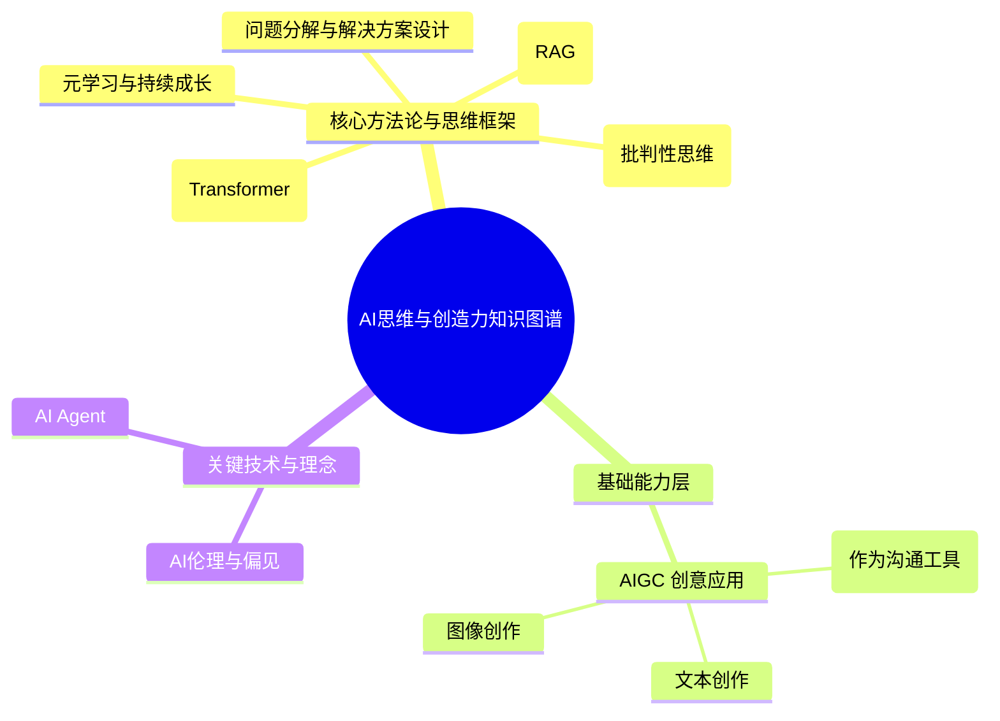

# 一、课程定位与核心原则

## （一）课程定位

本课程是为具备良好数理与逻辑基础的理工科学生（如数学、统计、计算科学专业）量身打造的AI入门与思维第一课。它不是一门技术速成班，而是一次旨在构建底层认知、激发创造欲望、并掌握学习新知方法论的思维集训。因为，对于一个大二数学/统计/计算科学专业的学生而言，10天的大模型课程不可能也不应该尝试传授所有技术细节，而应聚焦于打开AI思维的大门，建立可持续发展的知识框架。

## （二）核心设计原则

1.  **能力优先于知识：** 课程的首要目标是培养学生可迁移的能力（分析力、学习力、创造力），而非灌输易逝的技术知识点。
2.  **成果可持续：** 课程的核心产出是引导每位学生利用开源工具，为自己打造一个可持续迭代的**个人AI学习助手**，将短期学习成果转化为长期伴随的智能工具。
3.  **创意驱动学习：** 将AIGC部分定位为“创意游乐场”，通过自由的动手创造激发学生的内在兴趣，让学习由好奇心和成就感驱动。
4.  **少即是多：** 聚焦于20%的核心概念和思维方法，通过深入解剖一个核心技术（Transformer），培养学生“透过现象看本质”的洞察力。

##  （三）课程知识图谱

# 二、课程目标与学生价值

## （一）课程能力提升

本课程致力于帮助学生在认知、应用和思维三个层面实现全面跃升。

| 维度 | 具体目标 |
| :--- | :--- |
| **认知层** | • 理解大模型、AIGC等核心AI概念及其能力边界。 • 建立对AI技术、伦理与社会影响的批判性认知。 |
| **应用层** | • 熟练使用提示词工程，向AI清晰地提出复杂需求。 • 运用AIGC工具，完成创意内容的生成与表达。 • 使用开源模型与RAG技术，构建个人化知识库助手。 |
| **思维层** | • 能够为特定的现实问题，分解并设计出合适的AI解决方案。 • 掌握一套学习和应用新技术的通用方法论。 • 形成从实践到反思，再到方法论升华的元学习闭环。 |

## （二）课程对学生未来成长的指引

1. 对有学术志向的学生，课程提供学术发展路径指引:
	- 了解AI研究前沿，识别潜在研究方向
	- 建立计算机科学与数学交叉的研究视角
	- 获得实验设计和实现的基础能力

2. 对就业导向的学生，课程带来职业发展路径指引：
	- 接触当下最热门技术领域，了解就业机会
	- 掌握可立即应用的AI工具使用技能
	- 在简历中增加有竞争力的项目经验

3.  对有创新精神的学生，课程激发创新创业视角：
	- 识别AI应用的商业机会
	- 理解技术与应用结合的思路
	- 培养从需求到解决方案的思考能力

## （三）课程对于学生的核心价值

学生通过本课程，将获得覆盖短、中、长期的三层核心价值：

  * **立即可用：** 一套分析问题和高效使用AI工具的思维框架，能立刻应用于日常学习和信息处理。
  * **中期受益：** 一套面对任何新技术时都能快速上手的学习方法论，以及一个可实际使用的个人AI助手。
  * **长期价值：** 一种跨领域思考和解决复杂问题的底层能力，以及持续学习和适应技术变革的自信。

# 四、详细教学安排与学生学习旅程

课程通过精心设计的五大阶段，引导学生完成从体验者到创造者的蜕变。

| 阶段 | 日期 | 核心目标 | 教学内容与活动 | 产出与价值 |
| :---: | :--- | :--- | :--- | :--- |
| **阶段一** 体验、创造与建立认知 | **Day 1** | **激发创造欲望** 通过自由探索，直观体验AI的创造力。 | **AIGC创意探索日** **上午：**【创意沙盒 I：文本生成】提供工具，引导学生自由创作故事、诗歌、代码等。 **下午：**【创意沙盒 II：图像生成】引导学生将想法转化为视觉艺术，分享作品，营造有趣氛围。 | **强烈的学习兴趣**：通过亲手创造获得巨大的正反馈，产生深入了解AI的内在动力。 |
| | **Day 2** | **建立理性认知** 基于实践经验，构建科学、批判的AI认知。 | **从体验到思考** **上午：**【复盘与讨论】基于第一天的创作，讨论“AI如何‘思考’？”（引出概率性）及“AI会犯错吗？” (引出偏见与伦理问题)。 **下午：**【“魔法”的咒语：提示词工程】讲解提示词核心原则，定位为“如何更精准地向AI表达创意”的艺术。 | **科学的认知框架**：将感性体验上升为理性认知，为后续学习奠定基础。 |
| **阶段二** 掌握问题分解与工具选择方法论 | **Day 3** | **学习分析框架** 掌握一套通用的问题分析方法论。 | **问题分解方法论** **上午：** 引入分析框架：定义问题本质 → 识别任务类型 → 匹配AI能力。 **下午：** 案例分析与练习，使用该框架分析多个真实场景。 | **分析能力**：获得一套可应用于任何技术选型场景的思维工具。 |
| | **Day 4** | **掌握解决方案** 理解主流AI解决方案模式，并学会选择。 | **AI核心解决方案模式** **上午：** 讲解提示词工程、RAG、Agent三大核心解决方案模式及其适用场景。 **下午：**【综合实践】分组对新的复杂问题进行分析，并论证应采用何种解决方案。 | **决策能力**：学会基于问题特征，做出合理的技术路径选择。 |
| **阶段三** 核心技术深度解析 | **Day 5** | **理解核心机制** 从概念和可视化层面理解Transformer架构。 | **解剖Transformer（上）** **上午：** 讲解Attention机制的核心概念与直观类比。 **下午：** 深入Attention机制的可视化讲解，理解其工作流程。 | **概念性理解**：对现代大模型的基石技术建立清晰的宏观认知。 |
| | **Day 6** | **连接数学本质** 从数学视角理解技术，培养洞察力。 | **解剖Transformer（下）** **上午：** 从线性代数和向量空间视角，讲解Attention机制的数学直觉。 **下午：**【代码解读】引导阅读简化版Attention机制的核心代码，建立数学原理与工程实现的连接。 | **洞察能力**：不再停留在使用层面，而是能从数学原理上理解技术。 |
| **阶段四** 核心项目：构建你的个人AI学习助手 | **Day 7** | 战略决策能力：理解不同部署模式的利弊，能为项目做出合理的技术架构选择。 |个人AI学习助手（上） 上午： 项目启动：为自己的一门专业课构建AI学习助手（问题定义、技术选型：RAG）。 下午：【为AI助手选择“大脑”：大模型连接与部署策略】 1. 理论讲解：讲解RAG系统的两种核心部署模式：  - API模式：通过API调用云端大模型（如SaaS服务）的优缺点（快速、方便，但有数据隐私和成本考量）。  - 私有化部署模式：在本地或私有云上部署开源大模型的优缺点（数据安全、可控性高，但对硬件和维护要求高）。 2. 动手实践：根据提供的实验环境，学生将实践私有化部署模式，在云服务器上部署一个轻量级的开源大模型，作为个人AI助手的“本地大脑”。| **一个“活”的工具雏形**：将课程所学应用到最熟悉的领域，项目启动成功。 |
| | **Day 8** | **完成项目闭环** 实现核心功能，体验完整的工程流程。 | **个人AI学习助手（下）** **上午：** 核心功能实现（使用RAG技术，实现基于个人知识库的检索与问答逻辑）。 **下午：** 测试、评估与个性化优化（测试助手效果，并思考如何让它更符合个人学习习惯）。 | **端到端的实践经验**：学生将带着一个专属于自己的、能辅助专业课学习的AI工具原型。 |
| **阶段五** 反思、迁移与方法论升华 | **Day 9** | **沉淀项目经验** 从实践中总结经验与教训。 | **项目复盘与升华** **上午：** 小组展示“个人AI助手”项目，重点分享构建过程中的挑战、失败经验和解决方案。 **下午：**【引导式研讨会】从“学习大模型”到“学习的方法论”，提炼通用的学习策略。 | **可迁移的经验**：将一次性的项目经验，提炼为未来可复用的方法论。 |
| | **Day 10** | **构建持续学习框架** 为未来发展制定清晰的个人成长计划。 | **开启未来学习之路** **上午：**【个人工作坊】制定我的“AI助手”迭代与学习计划（规划如何持续丰富知识库、优化功能等）。 **下午：** 课程总结、优秀作品颁奖与学习社群建立。 | **一套可持续的成长计划**：学生将带着清晰的后续成长路径和社群支持离开课堂。 |

  * **学生学习旅程 (User Journey)：**

    

    journey
        title 学生学习旅程示意图
        section 体验与创造 (Day 1-2)
            首次体验AIGC创作: 5: 学生
            创意被点燃: 5: 学生
            心态: 从好奇到兴奋
        section 分解与构思 (Day 3-4)
            学习分析问题框架: 5: 学生
            设计解决方案: 5: 学生
            心态: 从体验者到分析者
        section 解构与洞察 (Day 5-6)
            探究Transformer数学原理: 5: 学生
            连接已有数学知识: 5: 学生
            心态: 从使用者到理解者
        section 实践与构筑 (Day 7-8)
            动手构建个人AI助手: 5: 学生
            解决实际工程问题: 5: 学生
            心态: 从理解者到构筑者
        section 反思与升华 (Day 9-10)
            复盘项目并总结方法: 5: 学生
            制定个人成长计划: 5: 学生
            心态: 从学习者到创造者
    

# 五、关键教学和学习策略

## （一）教学策略建议

本次课程的教的根本教学任务是帮助学生从**技术使用者**转变为**问题解决者**，培养可迁移的思维能力。

1. **问题驱动教学**：所有技术和工具的学习，都围绕一个明确的“待解决问题”展开。
2. **引导胜于灌输**：用问题引导学生思考，而非直接给出答案
3. **体验先于理论**：让学生先"感受"再"理解"
3. **社群与成长机制**：课程的结束是社群学习的开始，提供明确的后续学习资源和路径。

## （二）学习策略建议

基于第一性原理和有限时间内的最大收益，建议学生:

|**学习策略**|**学习策略要点**|
|:---|:---|
|聚焦理解而非记忆|1. 把握大模型的核心概念和思维方式 2. 理解工具使用的基本原则而非死记步骤。 3. 关注案例背后的思路而非具体实现细节|
|实践优先于理论|1. 课堂上积极参与动手实战环节。 2. 课后尝试用学到的工具解决自己的实际问题。|
|建立学习-应用-反思的循环|1. 建立知识连接。 2. 主动思考AI概念与已学数学知识的关系。 3. 寻找专业课程中可以应用AI的场景。 4. 与不同背景同学交流，获取跨学科视角|
|构建持续学习框架|1. 课程结束后，确定1-2个感兴趣的方向深入学习。 2. 收集优质学习资源，建立知识管理系统。 3. 参与开源项目或社区，保持技术更新。|

# 六、建议实验资源配置

| 配置项 | 标准/推荐配置 | 说明 |
| :--- | :--- | :--- |
| **GPU类型与显存** | NVIDIA A10 (24GB VRAM) 或同级 | 这是决定价格和性能的核心。能流畅支持7B-13B规模模型的部署与RAG应用。 |
| **vCPU** | 16核 | 核心数越多，数据处理和系统响应越流畅。 |
| **内存 (RAM)** | 64GB | RAG等应用对内存有较高要求，64GB能提供更好的稳定性。 |
| **系统盘** | 200GB 高效云盘/SSD | 需足够空间存放操作系统、环境、多个大模型文件及知识库。 |
| **操作系统与环境**| Ubuntu Server 22.04 LTS | 强烈建议使用预置NVIDIA驱动、CUDA、PyTorch等环境的课程专用镜像，节约配置时间。 |
| **参考价格(按量付费)**| 约¥8.0-12.0元/小时 | 建议在实验课前开启实例，课后立即关闭，以节省成本。 |