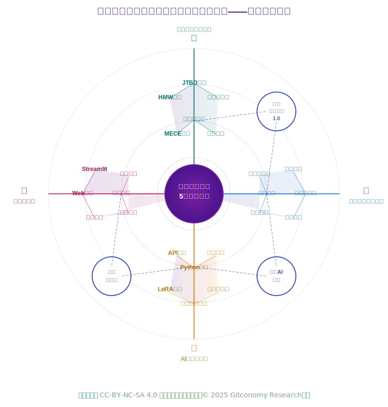
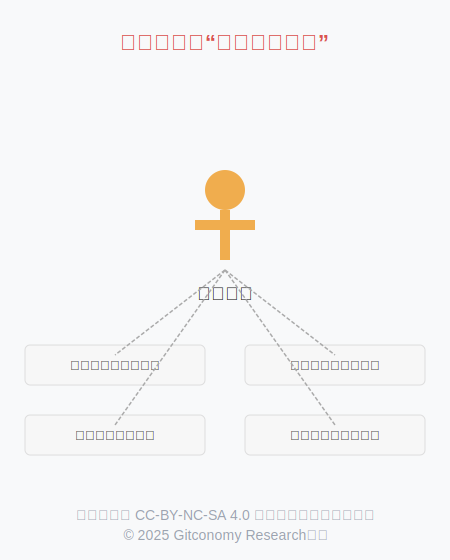

# 《生成式思维与创造力第一课》教学方案

## 一、教学方案概述

在技术知识半衰期急剧缩短的AI时代，任何具体的技能教学都注定会迅速过时 。本课程设计的出发点并非“教什么”，而是回归教育的本质——“为何学”与“如何学”。我们致力于为每一位学习者构建一套可迁移、可进化的“认知操作系统”（Cognitive Operating System），这套系统旨在取代易逝的“技能清单”，赋予学习者在不确定性世界中持续学习、深度觉察、敏捷创造的核心心智模式 。我们相信，真正的教育投资，是投资于那些当所有工具都被遗忘后，依然能支撑我们独立思考和创造的“认知骨骼” 。为此，我们将整个学习过程设计为一场沉浸式的“认知健身”，学员将体验到的不是被动听讲的“教室”，而是一个鼓励实践、教练陪练、同伴共创的“健身房” 。

因此，我们的设计根植于两大核心学习科学原理。首先是**间隔效应**（Spacing Effect），大量研究证实，将学习内容分散在多个时间段内（分布式学习），比在一次性集中学习（集中练习或“填鸭式”）能带来更显著的长期记忆效果 。其次是“认知负荷理论”（Cognitive Load Theory），该理论指出，人的工作记忆容量有限，当信息过于密集或复杂时，学习效率会急剧下降 。

**教学方案的核心概念与方法论**：

- **第一性原理 （First Principles Thinking）**[1]：一种穿透问题表象、回归事物本质，从最基础的公理、假设出发进行推导的根本性思考方法。该思想源于古希腊哲学家亚里士多德，是其物理学和形而上学探究中的核心。在课程中，它将被应用于复杂问题的深度分析、颠覆式创新构想以及技术瓶颈的突破。学习者将通过“分解问题、质疑所有假设、重构解决方案”等方法进行训练，并借鉴特斯拉在电池技术、SpaceX在火箭成本控制等经典案例进行启发。

- **MECE 原则 （Mutually Exclusive, Collectively Exhaustive）**[2]：一种确保思考“相互独立、完全穷尽”的结构化分析工具，常用于将复杂问题分解为清晰、独立且无遗漏的子部分。由时任麦肯锡顾问的芭芭拉·明托 (Barbara Minto) 在其著作《金字塔原理》中系统性地提出并推广。在课程中，它将被广泛应用于问题分析、方案设计和知识体系的搭建。学习者将通过练习使用树状结构、矩阵框架和清单列表等技巧来掌握这种结构化思维方法。

- **系统思维 （Systems Thinking）**[3]：一种关注整体、元素间相互关系和动态演化过程的全局性思维模式，强调从系统的角度理解复杂现象。奥地利生物学家路德维希·冯·贝塔朗菲 (Ludwig von Bertalanffy) 为系统思维奠定了理论基础。为了应对复杂世界的挑战，课程将引入多种系统思维工具。因果循环图用于揭示系统中各元素间相互影响的反馈关系；杠杆点分析帮助识别能“四两拨千斤”的关键干预点；冰山模型引导我们从表面事件深入探究其背后的模式、结构与心智模式；库存与流量则是理解系统动态变化的基础模型。

- **JTBD 框架 （Jobs to be Done）**[4]：即“工作待完成”理论，一种深挖用户真实需求与动机的创新框架，主张顾客“雇用”产品或服务来完成某项“任务”。该理论由哈佛商学院教授克莱顿·克里斯坦森 (Clayton Christensen) 等人普及和深化。在课程中，该框架将指导学习者在构思和开发个人AI项目时，超越表面功能，深入探究潜在用户的真实目标与场景，从而设计出更具价值和针对性的解决方案。

- **HMW 方法 （How Might We）**[5]：即“我们该如何……”句式，一种将挑战重构为开放性机遇的创新提问技术，广泛应用于设计思维等领域。该方法在IDEO等创新咨询公司得到广泛应用，其思想可追溯至商业顾问 Min Basadur 在宝洁公司的工作实践以及更早的创造力研究。在课程的创新构思和项目定义阶段，学习者将运用HMW方法来发散思维，将遇到的难题或观察到的痛点转化为一系列可探索的、积极的创新问题，从而拓宽解决方案的可能性，避免过早地陷入狭隘的思维定式。

- **元认知 （Metacognition）**[6]：对自我思考过程的“思考”，即对自身认知活动的觉察、监控和调节能力，是自主学习的核心。由美国发展心理学家约翰·弗拉维尔 (John H. Flavell) 于20世纪70年代首次提出并定义。本课程将通过引导学习者定期进行学习反思、撰写思考日志以及构建“证据组合包”等实践活动，系统性地训练其元认知能力。学习者将被鼓励主动规划学习策略、监控理解程度并调整学习方法，从而真正实现从“被动接收”到“主动建构”的转变，提升自主学习的效率与深度。

- **间隔效应 （Spacing Effect）**[7]：一项经典的记忆心理学发现，指学习内容在时间上分散进行（有间隔的复习）比集中进行能带来更好、更持久的记忆效果。由德国心理学家赫尔曼·艾宾浩斯 (Hermann Ebbinghaus) 在其关于记忆与遗忘的开创性研究中首次发现。本课程的整体架构——“周末沉浸式工作坊 + 周间自驱式任务”的循环模式，正是“间隔效应”的直接应用。通过在时间上将高强度的概念输入与低强度的个人实践和反思进行分离，我们为学习者创造了理想的记忆巩固与知识内化条件，确保学习成果不仅是短暂的，更是持久和可迁移的，最终构建起稳固的认知操作系统。

-  **吉布斯循环（Gibbs' Reflective Cycle）**[8]：一种经典的结构化反思模型，由英国学者格雷厄姆·吉布斯 (Graham Gibbs) 于1988年在其著作《通过实践学习》(Learning by Doing)中提出。它通过一个包含六个阶段（描述、感受、评估、分析、结论、行动计划）的循环，引导个体对经验进行深度复盘。在课程中，吉布斯循环是元认知实践的核心工具之一，我们将在专门的“‘学习日志’与吉布斯反思循环工作坊” 中深入学习并应用该模型。学员将被引导熟练运用这一框架 ，对自己的周间任务、项目进展和学习瓶颈进行结构化反思，从而系统性地将每一次的实践经验，提炼和转化为可迁移的洞见 。

---

## 二、教学场景的设计

基于学习科学原理，设计了三种独立的认知升级路径，以满足不同学习者的目标与场景：


*图：不同认知路径的教学场景比较*

1. **方案A （分布式学习旅程）** 充分利用“间隔效应”，通过拉长学习周期，在每次学习之间留出充足的消化、反思和实践时间，旨在实现最深刻、最持久的思维模式转变。

2. **方案B （高强度训练营）** 则是一种“集中练习”模式，它刻意将认知负荷推向极限，适合那些目标明确、希望在最短时间内快速掌握核心技能并立即投身实践的学习者，例如职业转换者。

3. **方案C （混合式冲刺）** 则是对二者的平衡，它通过初期的沉浸式体验快速建立学习动能，再结合线上的分布式项目实践，兼顾了效率与深度。

因此，选择哪种方案，取决于您的核心目标：是追求思维模式的根本重塑，还是高效的技能部署，亦或是二者之间的平衡。

| **特征维度** | **方案A：分布式学习旅程** | **方案B：高强度训练营 (Bootcamp)** | **方案C：混合式冲刺** |
| :--- | :--- | :--- | :--- |
| **模型结构** | 5个周末（或5周），每周一个为期2天的深度工作坊 | 连续5天全日制沉浸式学习 | 3天线下开营 + 3周线上项目 + 2天线下闭营 |
| **核心理念** | 深度内化与转化：利用“间隔效应”效应，最大化长期知识留存与思维模式的根本转变。 | 快速部署与应用：通过高强度“集中练习”模式，在最短时间内完成核心技能的密集输入与项目产出。 | 动能激发与实践：结合沉浸式体验的破冰效果与线上周期的实践灵活性，在团队协作与项目交付间取得平衡。 |
| **认知负荷** | **低**：内容分块交付，学习者有充足的周中时间进行消化、反思和实践，有效管理认知负荷。 | **极高**：信息密度极大，对学习者的专注力和承压能力要求很高，优先保障技能掌握，反思时间被压缩。 | **中**：开营阶段负荷较高，但后续线上阶段提供缓冲，允许学习者按自身节奏整合。 |
| **反思深度** | **深**：周中的间隔为“学习日志”和“证据组合包”的深度反思提供了必要的时间发酵，能更好地联结理论与实践。 | **浅**：反思被整合进快速的复盘环节，更侧重于对当日任务的战术性总结，而非深层认知框架的重构。 | **中**：有结构化的反思环节，但深度可能受项目冲刺节奏的影响。 |
| **适用人群** | 寻求根本性思维模式升级的个人与组织；希望将学习与实际工作深度结合的在职专业人士；重视长期价值与可持续成长的学习者。 | 企业内部技能强化、项目启动前团队集训；时间高度受限但需快速掌握AI核心应用方法的团队；职业转换者进行初步探索。 | 企业内部创新团队孵化；需要快速建立团队共识并立即投入项目实践的场景；希望兼顾沉浸感与工作安排的学习者。 |
| **核心优势** | 真正践行“构建认知骨骼”的哲学，学习效果最持久，最能实现“价值留存”。 | 周期极短（一个工作周），见效快，能迅速提升团队在AI应用层面的战斗力，并快速交付项目原型。 | 兼具破冰效率与实践灵活性，项目成果更扎实。 |
| **潜在风险** | 战线较长，需要学习者在5周内保持持续的投入和纪律性。 | 知识“内化”程度最低，技能遗忘率可能较高，与课程“反速成”的初衷存在一定张力。 | 线上阶段需有强大的自驱力和良好的项目管理，以防动力衰减。 |

*表：三种教学场景方案的比较*

---

## 三、教学大纲说明

### 3.1 场景A：分布式学习旅程 （5周模型）

#### 3.1.1 课程定位

“分布式学习旅程”方案专为寻求思维模式根本性变革的学习者设计。它充分利用学习科学中的“间隔效应”原理，通过5个周末（共10天）的深度沉浸式工作坊，并配合周间自驱式学习，旨在构建一个真正持久、可进化的“认知操作系统”。整个学习周期精心设计为5周，确保每次深度学习之间都有充足的时间进行消化、反思和在真实世界中的应用，从而实现最深刻、最持久的思维模式转变，而非短暂的技能获取 。  

本方案强调理论与实践的紧密结合，学员不仅将掌握系统思维、创造力方法与元学习等核心心智模型，还将深入AI技术的核心，学习Python编程、高级提示工程、模型微调（LoRA）理论、注意力机制实现，并掌握使用Streamlit/Gradio、Pandas/Matplotlib等工具快速构建和评估AI应用的能力。

本课程适合的学习对象：

- **认知升级者**：不满足于学习零散的技能，而是渴望从根本上重塑自己的思维框架 ，追求思维模式根本转变的学习者 。
- **长期主义者**：理解真正的改变需要时间发酵，愿意并能够投入连续五周的时间进行深度、系统性的学习 ，以追求最持久的学习效果 。
- **AI赋能的创造者**：相信技术是创造的杠杆，期望将AI核心技术与创造性思维深度结合 ，用代码和算法实现自己创新想法的实践者。
- **共创学习者**：深知学习不仅是个人行为，更是在高质量的社群互动中发生的；珍视来自同伴和教练的深度反馈，并乐于贡献自己见解吉布斯反思循环 的参与者 。

#### 3.1.2 学习的基本要求

为确保您能从本课程中获得最大价值，我们建议您具备以下基础：

- 编程基础：具备基础的Python编程知识，理解变量、数据类型、循环、函数等基本概念 。无需成为专家，但应能编写和理解简单的脚本。  
- 工具与环境：拥有一台能够运行现代开发工具的计算机（建议16GB内存），安装和配置Jupyter Lab、Git和Python虚拟环境 。  
- 思维开放性：对探索新的思维模式充满好奇，愿意挑战自己的固有假设，并乐于通过深度反思来审视自己的学习过程 。

#### 3.1.3 学习的目标

完成本课程后，学员门将掌握的知识和具备的能力：

| **能力分类** | **学习目标** |
| :--- | :--- |
| **系统思维与问题定义能力** | **拆解AI系统：** 系统性地解构任何一个AI应用，绘制其“数据-模型-决策”的因果关系图，洞察其能力边界与潜在风险。<br>**定义核心问题：** 熟练运用MECE原则、JTBD框架，从复杂、模糊的场景中精准定义出值得解决的核心用户问题。 |
| **AI赋能的创造力** | **机会重构：** 运用“我们如何才能”（HMW）等方法，将用户痛点转化为富有潜力的创新机会点。<br>**高级人机对话：** 掌握递归式自我完善、多视角模拟等高级提示工程技术，并能通过Python脚本实现自动化，将AI的潜力发挥到极致。 |
| **全栈AI应用开发能力** | **核心理论理解：** 不仅知道如何使用AI，更能向他人清晰解释自注意力机制（Self-Attention）和LoRA微调等核心技术的运作原理。<br>**代码实现：** 能够使用Python和NumPy从零开始编写一个简化的自注意力机制，将理论知识转化为代码实践。<br>**快速原型构建：** 能够使用Streamlit或Gradio，快速将一个AI模型或想法，构建成一个可交互的Web应用原型，用于验证和展示。<br>**数据分析与可视化：** 能够使用Pandas和Matplotlib对AI应用的输出或相关数据进行分析和可视化，以评估效果和洞察趋势。 |
| **元学习与自我进化能力** | **结构化反思：** 熟练运用吉布斯反思循环等工具，对自己的学习过程进行深度复盘，将经验转化为可迁移的洞见。<br>**成长叙事：** 能够构建并展示一份有说服力的“证据组合包”，清晰地论证和展示自己在认知与能力上的成长轨迹。 |

*表：分布式学习之旅课程学习目标概览*

**课程最终产出**：

- 一份深度内化的个人“证据组合包”，通过策展和叙事，生动展示5周学习旅程中的思考演进与能力成长，其中包含代码片段、项目链接等技术证据 。  
- 一个经过数周打磨、可在线演示的最终个人AI项目，综合体现系统思维、创造力方法、Python编程和AI应用开发能力。
- 一份个人化的认知操作系统1.0版蓝图与未来迭代计划，作为持续学习的起点。

#### 3.1.4 教学框架


 
*图：分布式教学场景框架*

分布式学习之类的教学安排遵循“间隔效应”原理，将为期五周的学习旅程分解为“周末沉浸式工作坊”与“周间自驱式学习”的交替循环 。每个周末，学员将深度投入一个核心模块，从思维奠基、用户洞察，到人机共创与原型构建；随后的周间则提供充足的时间进行反思、应用与项目冲刺，确保知识在理论与实践的交替中得到深度内化，最终在第五周完成个人项目与“证据组合包”的综合展示 。

| **周次** | **周末工作坊 (2天)** | **周间任务（自驱学习）** |
| :--- | :--- | :--- |
| **第一周** | **解构与奠基** <br> Day 1-2: 破旧立新与第一性原理、学习者主权的开启 | **反思与应用：**<br>将结构化思维应用于真实问题，完成AI开发环境搭建，启动元认知日志。 |
| **第二周** | **洞察与重构** <br> Day 3-4: 系统洞察的艺术、从问题到机遇 | **反思与应用：**<br>深化用户洞察，将挑战转化为AI产品的创新机会点。 |
| **第三周** | **人机共创与直觉AI** <br> Day 5-6: 机器的语言、让抽象变得可触 | **反思与应用：**<br>掌握高级人机对话的Python实现，并探索AI解决方案。 |
| **第四周** | **原型与评估** <br> Day 7-8: 创造的节奏与叙事、策展你的成长 | **项目冲刺与成长策展：**<br>将想法转化为可交互的AI应用原型，并开始梳理个人成长证据。 |
| **第五周** | **综合与新起点** <br> Day 9-10: 个人项目展示与答疑、元认知叙事与展望 | **最终产出完善与提交：**<br>完成并展示最终AI项目与“证据组合包”。 |

*表：分布式学习之旅课程教学安排概览*

#### 3.1.5 课程大纲

本课程大纲将以分布式的学习节奏，引领学员踏上一场重塑思维、驾驭AI的深度旅程，完成一次从理论内化到实践创造的完整学习闭环。

~~~
📁 生成式思维与创造力第一课（分布式学习旅程）/
├── 📁 模块零：培训准备期 - 定义我们的共同使命/
│   ├── 📄 0.1 课前调研：发掘集体智慧
│   │   └── 实践活动：学员完成“AI赋能真实世界”问卷调查，提交个人关注的社会、科技或社区挑战。
│   ├── 📄 0.2 案例票选：凝聚共同愿景
│   │   └── 实践活动：教学团队整理并发布候选案例池，全体学员通过线上投票，选举出本期的顶石案例。
│   └── 📄 0.3 使命启动：顶石案例背景研究
│       └── 学习任务：教学团队发布当期顶石案例的背景资料包，学员进行预习，为第一周的学习做好准备。
│
── 📁 模块一：系统解构 - 绘制你的认知系统蓝图/
│   ├── 📁 1.1 认知解构与AI简史/
│   │   ├── 📄 1.1.1 理论：AI发展史与主要范式
|   |   ├── 📄 1.1.2 理论：理解RAG架构与核心优势
│   │   └── 📄 1.1.3 实践：绘制个人当前知识工作流
│   ├── 📁 1.2 系统建模/
│   │   ├── 📄 1.2.1 理论：系统思维与MECE原则
│   │   ├── 📄 1.2.2 实践：绘制智能体V1.0因果回路图
│   │   └── 📄 1.2.3 实践：创建GitCode项目库
│   └── 📁 1.3 元学习与技术栈/
│       ├── 📄 1.3.1 理论：理解Tokens、Embeddings和上下文窗口
│       ├── 📄 1.3.2 实践：可视化文本到向量的转换
│       └── 📄 1.3.3 实践：撰写第一篇元学习日志
│
├── 📁 模块二：需求洞察 - 定义智能体的核心“工作”/
│   ├── � 2.1 待办任务(JTBD)提炼/
│   │   ├── 📄 2.1.1 理论：学习JTBD框架
│   │   ├── 📄 2.1.2 实践：自我访谈，提炼核心JTBD
│   │   └── 📄 2.1.3 Code Lab：使用NLP库进行笔记主题提取
│   └── 📁 2.2 创新机会(HMW)发掘/
│       ├── 📄 2.2.1 理论：学习HMW方法
│       ├── 📄 2.2.2 实践：进行HMW头脑风暴
│       └── 📄 2.2.3 Code Lab：调用LLM进行功能创意生成
│
├── 📁 模块三：人机共创 - 设计智能体的“思考”逻辑/
│   ├── 📁 3.1 智能体的思维链/
│   │   ├── 📄 3.1.1 理论：高级提示工程（CoT, ToT）
│   │   ├── 📄 3.1.2 实践：设计多步提示链
│   │   └── 📄 3.1.3 Code Lab：编写Python脚本自动化提示链
│   └── 📁 3.2 智能体的个性化/
│       ├── 📄 3.2.1 理论：Transformer架构与自注意力机制
│       ├── 📄 3.2.2 理论：参数高效微调（PEFT/LoRA）
│       ├── 📄 3.2.3 Code Lab：从零实现简化版自注意力机制
│       └── 📄 3.2.4 Code Lab：使用Hugging Face进行LoRA微调
│
├── 📁 模块四：原型构建 - 交付最小可行智能体(MVP)/
│   ├── 📁 4.1 最小可行故事原型/
│   │   ├── 📄 4.1.1 理论：敏捷学习与MVSP
│   │   ├── 📄 4.1.2 实践：定义MVP核心故事
│   │   └── 📄 4.1.3 Code Lab：使用Streamlit/Gradio构建Web应用
│   └── 📁 4.2 数据驱动的验证/
│       ├── 📄 4.2.1 理论：数据驱动决策基础
│       ├── 📄 4.2.2 实践：设计原型评估方案
│       └── 📄 4.2.3 Code Lab：分析交互日志并可视化
│
└── 📁 模块五：综合展示 - 发布你的“认知操作系统1.0”/
    ├── 📁 5.1 智能体路演与质询/
    │   ├── 📄 5.1.1 实践：准备并进行项目路演
    │   └── 📄 5.1.2 实践：参与同行质询与反馈
    └── 📁 5.2 证据组合包与未来蓝图/
        ├── 📄 5.2.1 实践：策展个人“证据组合包”
        └── 📄 5.2.2 实践：撰写并发布“认知操作系统1.0”及未来迭代蓝图

~~~

#### 3.1.6 评估与度量框架

评估的唯一目的是服务于学习，核心是“学习者自证成长”，贯穿整个学习过程，强调实践与反思。

| **评估类型** | **总权重** | **评估细项** | **评估内容与分项权重** |
| :--- | :--- | :--- | :--- |
| **形成性评估** | **60%** | 思维日志 | 全程记录认知发展与反思，评估元认知深度。(20%) |
| | | 周间实践应用 | 评估将课堂学习应用到实际场景的能力（如MECE分析、HMW生成、Python代码作业等）。(20%) |
| | | GitCode活跃度 | 评估学习路径的版本控制、代码提交质量与个人化改造。(10%) |
| | | 参与度与协作 | 评估课堂讨论深度、同伴反馈质量与集体活动贡献。(10%) |
| **总结性评估** | **40%** | 最终个人项目 | 评估问题定义的清晰度、解决方案的创新性、技术实现的完整性与展示答辩表现。(25%) |
| | | 证据组合包 | 评估成长证据的完整性、元认知反思的深度以及成长叙事的说服力。(15%) |

*表：分布式学习之旅课程评度量框架*

#### 3.1.7 课程框架总结

本课程的各个组成部分并非孤立存在，而是通过精心的设计，形成了一个相互关联、彼此增强的有机整体。核心理论是技术实践的“灵魂”和“导航”，而技术路径则是理论思想的“骨架”和“载体”。


*图：分布式学习之旅课程核心理论与技术能力进化的关系图*

| **核心理论 (道)** | **如何赋能** | **技术能力 (术)** |
| :--- | :--- | :--- |
| **第一性原理** | 思考根本问题，设计创新交互 | `个人项目` 的价值定义<br>`个性化AI交互设计` |
| **系统思维** | 规划应用架构，洞察数据关联 | `AI应用开发` 的顶层设计<br>`数据驱动决策` 的全局观 |
| **元认知** | 诊断学习障碍，优化学习策略 | 贯穿所有技术节点的学习过程 |
| **间隔效应** | 保证知识的长期记忆与内化 | 整个技术能力阶梯的有效攀登 |

*表：分布式学习之旅课程核心理论与技术能力进化的关系*

总而言之，核心理论为技术能力的提升提供了方向感、深度和可持续性，确保学习者不仅仅是一个“会用工具的工匠”，而是一个“知道为何而做、如何做得更好的创造者”。


*图：分布式学习之旅雷达知识图谱*

### 3.2 场景B：高强度训练营

#### 3.2.1 课程定位

场景B是为目标明确、希望在最短时间内将生成式思维与技术应用于解决实际问题的学习者设计的“认知与技能冲刺营”。它不追求思维模式的缓慢、深度重塑，而是通过高强度的“集中练习”模式学习主流AI工具的快速部署与应用，将认知负荷推向极限，优先保障学习者在课程结束时能够独立完成一个AI应用原型的开发。

它更侧重于**“术”（如何行动）与“器”（用何实现）的快速掌握，并将“法”（如何思考）**作为指导行动的敏捷框架，而非深度内化的哲学。此方案适合企业内部技能强化、项目启动前的团队集训，或需要快速构建项目作品集以进入新领域的职业转换者。

本课程特别适合以下几类学习者：

- **企业内部团队**：需要进行技能强化或在项目启动前快速统一AI认知与能力的团队。
- **产品经理与业务负责人**：希望深刻理解AI能力边界，以便更有效地进行产品规划与创新决策的非技术背景管理者。
- **设计师与创意工作者**：渴望将AIGC等工具融入现有工作流，提升创意效率与表达维度的专业人士。
- **寻求职业转型的专业人士**：具备一定技术或业务背景，希望快速掌握AI应用开发能力，以进入新领域或增强个人竞争力的求职者。
- **创业者与创新者**：需要快速验证AI驱动的商业想法，并构建出可向潜在投资者或用户展示的最小可行性产品的个人或团队。

#### 3.2.2 学习的基本要求

为确保您能在这场高强度的训练营中跟上节奏并取得成功，我们建议您具备以下基础：

- 编程基础：具备基础的Python编程知识，理解变量、数据类型、循环、函数等基本概念。无需成为专家，但应能编写和理解简单的脚本。
- 工具与环境：拥有一台能够运行现代开发工具的计算机（建议16GB内存），并提前完成Jupyter Lab、Git和Python虚拟环境的安装与配置。
- 高强度的专注力与承压能力：训练营的信息密度极高，需要您能够连续多日保持高度专注，并具备在压力下快速学习和解决问题的能力 。  
- 思维开放性：愿意快速吸收并应用新的思维模式，乐于在密集的实践中挑战自我，并积极参与团队协作。

#### 3.2.3 学习的目标

完成本课程后，学员们将掌握的知识和具备的能力：

| **能力分类** | **学习目标** |
| :--- | :--- |
| **系统思维与问题定义能力** | **拆解AI系统**: 系统性地解构任何一个AI应用，绘制其“数据-模型-决策”的因果关系图，洞察其能力边界与潜在风险。<br>**定义核心问题**: 熟练运用MECE原则、JTBD框架，从复杂、模糊的场景中精准定义出值得解决的核心用户问题。 |
| **AI赋能的创造力** | **机会重构**: 运用“我们如何才能”(HMW)等方法，将用户痛点转化为富有潜力的创新机会点。<br>**高级人机对话**: 掌握递归式自我完善、多视角模拟等高级提示工程技术，并能通过Python脚本实现自动化，将AI的潜力发挥到极致。 |
| **全栈AI应用开发能力** | **核心理论理解**: 不仅知道如何使用AI, 更能向他人清晰解释自注意力机制(Self-Attention)和LoRA微调等核心技术的运作原理。<br>**代码实现**: 能够使用Python和NumPy从零开始编写一个简化的自注意力机制，将理论知识转化为代码实践。<br>**快速原型构建**: 能够使用Streamlit或Gradio，快速将一个AI模型或想法，构建成一个可交互的Web应用原型，用于验证和展示。<br>**数据分析与可视化**: 能够使用Pandas和Matplotlib对AI应用的输出或相关数据进行分析和可视化，以评估效果和洞察趋势。 |
| **元学习与自我进化能力** | **结构化反思**: 熟练运用吉布斯反思循环等工具，对自己的学习过程进行深度复盘，将经验转化为可迁移的洞见。\<br\>**成长叙事**: 能够构建并展示一份有说服力的“证据组合包”，清晰地论证和展示自己在认知与能力上的成长轨迹。 |

*表：高强度训练营课程的学习目标*

课程最终产出 :

- 一份快速构建的个人“证据组合包”，核心在于记录和展示5天高强度学习中的关键产出和技能掌握情况。
- 一个可快速交付的项目原型，体现了在极短时间内综合运用所学思维工具与技术栈，将创意转化为产品的核心能力。
- 一份个人化的认知操作系统核心清单，包含了关键思维模型、方法论和技术工具，可作为后续实践的行动指南。

### 3.2.4 教学框架


*图：高强度训练营教学场景框架*

| **天数** | **核心主题** | **学习内容与实践活动** |
| :--- | :--- | :--- |
| **第一天** | **思维破冰与AI奠基** | “认知操作系统”理念导入；MECE原则与系统思维训练；AI产品解构；Python与开发环境核心要点速览；启动项目构想。 |
| **第二天** | **洞察用户与重构机会** | JTBD框架深度解析与应用；HMW工作坊，将问题转化为创新机会；Code Lab：通过API调用实现自动化提示链。 |
| **第三天** | **人机共创与技术内化** | 高级提示工程技术；Code Lab：从零实现简化版自注意力机制；LoRA微调原理与实践体验。 |
| **第四天** | **原型冲刺与敏捷开发** | 敏捷学习与创造节奏；Code Lab：使用Streamlit/Gradio快速构建AI Web应用；数据分析与可视化入门。 |
| **第五天** | **项目交付与综合展示** | 最终个人项目冲刺与完善；项目路演与交叉质询；训练营整体复盘与后续学习路径规划。 |

*表：高强度训练营教学安排概览*

#### 3.2.5 课程大纲

本课程大纲设计为一场为期5天的认知与技能冲刺。它将引导学员完成一个从理论到实践的完整闭环：始于思维模式的重塑与AI基础的奠定，中经用户洞察、技术内化与原型开发，最终以一个可交付的个人项目展示作为终点，旨在最短时间内构建学员的核心AI应用能力。

```
📁 生成式思维与创造力第一课 (高强度训练营)/
├── 📁 模块一：思维破冰与AI奠基/
│   ├── 📄 1.1 心智模式破冰
│   │   ├── “认知操作系统”核![高强度训练营教学框架]

*图：高强度训练营教学场景框架*心理念导入
│   │   └── 高强度学习契约建立
│   ├── 📄 1.2 结构化思考速成
│   │   ├── MECE原则与系统思维核心工具
│   │   └── AI产品快速解构练习
│   ├── 📄 1.3 AI技术与环境
│   │   ├── Python核心要点与虚拟环境配置
│   │   └── 开发工具链：Jupyter Lab与Git快速入门
│   └── 📄 1.4 项目启动
│       └── 个人项目选题与初步构想
│
├── 📁 模块二：洞察用户与重构机会/
│   ├── 📄 2.1 深度用户洞察
│   │   └── “待办任务”(JTBD)框架实战演练
│   ├── 📄 2.2 创新机会发现
│   │   └── “我们如何才能”(HMW)工作坊：将问题转化为机会
│   └── 📄 2.3 人机对话入门
│       └── Code Lab：通过Python调用LLM API实现自动化提示链
│
├── 📁 模块三：人机共创与技术内化/
│   ├── 📄 3.1 高级提示工程
│   │   └── 高级技术速览：递归式自我完善、多视角模拟等
│   ├── 📄 3.2 AI核心技术内化(一)
│   │   └── Code Lab：用Python和NumPy从零实现简化版自注意力机制
│   └── 📄 3.3 AI核心技术内化(二)
│       └── 参数高效微调(PEFT)与LoRA原理讲解及实践
│
├── 📁 模块四：原型冲刺与敏捷开发/
│   ├── 📄 4.1 敏捷学习与创造
│   │   └── 敏捷学习冲刺方法论
│   ├── 📄 4.2 AI应用快速原型
│   │   └── Code Lab：使用Streamlit/Gradio快速构建AI Web应用
│   └── 📄 4.3 数据驱动验证
│       └── 工具入门：使用Pandas和Matplotlib进行初步数据分析
│
│── 📁 模块五：项目交付与综合展示/
│   ├── 📄 5.1 最终项目冲刺
│   │   └── 集中开发、调试与完善
│   ├── 📄 5.2 项目路演与质询
│   │   └── 最终项目展示与交叉反馈
│   └── 📄 5.3 总结与展望
│       └── 训练营复盘与后续学习路径规划
```

#### 3.2.6 评估与度量框架

本方案的评估框架聚焦于即时产出和技能掌握度，旨在快速验证学习效果。

| **评估类型** | **总权重** | **评估细项** | **评估内容与分项权重** |
| :--- | :--- | :--- | :--- |
| **形成性评估** | 40% | **每日任务完成度** | 评估每日Code Lab和核心练习的完成质量与效率。(25%) |
| | | **参与度与协作** | 评估课堂讨论深度、同伴反馈质量与团队协作表现。(15%) |
| **总结性评估** | 60% | **最终项目原型** | 评估问题定义的清晰度、解决方案的创新性、技术实现的完整性。(40%) |
| | | **项目展示与答辩** | 评估最终路演的表达清晰度、逻辑性以及对质询的回应能力。(20%) |

*表：高强度训练营课程评度量框架*

#### 3.2.7 课程框架总结

本课程的各个组成部分被高度集成，旨在通过快速迭代，形成一个紧密耦合、战斗力极强的知识与技能体系。核心理论是技术实践的“灵魂”和“导航”，确保高强度的训练不偏离价值创造的航道；而技术路径则是理论思想的“骨架”和“载体”，确保思维模型能迅速转化为可交付的产品原型。


*图：高强度训练营课程核心理论与技术能力进化的关系图*

| **核心理论 (道)** | **如何赋能** | **技术能力 (术)** |
| :--- | :--- | :--- |
| **第一性原理** | 快速穿透问题，直击项目核心价值 | 项目价值的快速定义与验证 |
| **系统思维** | 快速构建应用蓝图，识别关键技术节点 | AI应用架构的快速设计 |
| **元认知** | 在高压下进行即时复盘，最大化学习效率 | 贯穿所有技术节点的快速迭代与调试 |
| **集中练习** | 保障核心技能的快速掌握与肌肉记忆形成 | 整个技术能力栈的快速贯通与应用 |

*表：*高强度训练营核心理论与技术能力在训练营中的快速融合*

总而言之，核心理论为高强度的技术冲刺提供了战略层面的清晰度与决策依据，确保学习者在极短的时间内，不仅成为一个“能快速实现功能的开发者”，更是一个“能迅速交付有效成果的创造者”。



*图：高强度训练营课程雷达知识图谱*

### 3.3 场景C：混合式冲刺 （3+3+2模型）

#### 3.3.1 课程定位

“混合式冲刺”场景是为兼顾效率与深度的团队学习场景而设计的。它巧妙地融合了高强度训练营的“动能激发”与分布式学习的“实践灵活性”，旨在通过一个结构化的混合模式，在团队协作与项目交付间取得最佳平衡 。

“3+3+2”的核心结构为“3天线下开营 + 3周线上项目 + 2天线下闭营”。初期的沉浸式开营旨在快速破冰，建立团队共识，并密集输入核心的思维模型与技术工具，为后续的项目实践注入强大动能。随后的三周线上周期，则为团队提供了灵活的实践与协作空间，允许成员在各自的工作节奏中，异步推进一个更扎实、更具深度的团队项目。最终的线下闭营则聚焦于成果的整合、展示与深度复盘 。

本课程适合的学习对象：

- **创新孵化团队**：不满足于零散的技能培训，而是渴望通过系统性学习，建立团队统一的创新语言和方法论，共同完成一个从0到1的项目孵化。
- **项目驱动型团队**：目标明确，致力于在规定时间内交付一个高质量、可验证的AI项目原型，并愿意为此投入集中的开营时间和持续的线上协作精力。
- **敏捷协作先锋**：相信AI是提升团队创造力的核心杠杆，期望将前沿技术与敏捷开发流程深度融合，探索高效、协同的团队工作新范式。
- **价值共创伙伴**：深知伟大的项目诞生于集体智慧，珍视团队成员间的深度碰撞与紧密协作，并乐于在共创中成就彼此，实现团队价值的最大化。

#### 3.3.2 学习的基本要求

为确保您的团队能从这场混合式冲刺中获得最大价值，我们建议团队成员具备以下基础：

- 编程基础：团队中多数成员应具备基础的Python编程知识，能够协同编写和调试脚本。
- 工具与环境：所有成员需提前配置好个人开发环境，并熟悉Git等团队协作工具的基本操作。
- 协作与承诺：既要有在高强度的开营阶段全情投入的承诺，也要有在线上冲刺阶段保持高度自驱和良好沟通的团队纪律。

#### 3.3.3 学习的目标

完成本课程后，学员团队将掌握的知识和具备的能力：

| **能力分类** | **学习目标 (侧重团队协作与项目交付)** |
| :--- | :--- |
| **团队共识与项目规划** | **建立共同语言**: 能够运用系统思维、MECE原则等工具，快速建立团队对复杂问题的统一认知框架。<br>**规划项目蓝图**: 能够引导团队运用JTBD、HMW等方法，共同定义出一个具有清晰价值主张和可行技术路径的AI项目。 |
| **AI赋能的集体创造力** | **引导团队创新**: 能够组织和引导团队进行高效的头脑风暴，将个人洞察汇聚为集体智慧，形成创新的解决方案。<br>**协同人机交互**: 能够分工协作，共同设计和实现复杂的自动化提示工程脚本，以满足团队项目的具体需求。 |
| **协同化AI应用开发** | **技术栈协同**: 团队能够基于统一的技术选型，分模块进行开发，并最终集成为一个完整的AI应用。<br>**全栈项目交付**: 团队能够协作完成一个从前端(Streamlit/Gradio)到后端(Python/API)，再到数据分析(Pandas)的全栈AI项目原型。<br>**代码审查与整合**: 团队成员具备基础的代码审查(Code Review)能力，能够通过Git等工具高效地进行代码合并与版本管理。 |
| **团队复盘与项目管理** | **敏捷项目管理**: 能够运用敏捷冲刺、学习点数等方法，对为期3周的线上项目进行有效的进度管理和任务分配。<br>**团队深度复盘**: 能够引导团队对整个项目过程进行结构化复盘，总结成功经验与失败教训，形成团队的知识沉淀。 |

*表：混合冲刺课程学习目标概览*

**课程最终产出**：

*   一份**团队“证据组合包”**，系统性地记录团队从构思到交付的全过程，│包含会议纪要、设计草图、代码库链接等。
*   一个**经过迭代、更为扎实的团队AI项目**，可进行现场演示，充分体现团队的集体智慧与协同开发能力。
*   一份**团队认知操作系统章程**，明确团队在未来项目中可持续沿用的思维模型、协作流程与工具集。

#### 3.3.4 教学框架


*图：混合冲刺教学场景框架*

混合冲刺的教学安排通过“开营-冲刺-闭营”的三段式结构，在效率与深度间取得平衡 。第一阶段为期三天的线下开营，旨在通过密集输入和团队熔炼，快速激发项目动能并完成立项。第二阶段是为期三周的线上项目冲刺，团队成员在此期间进行异步协作与敏捷开发，并由教练提供线上辅导。第三阶段则回归线下，用两天时间完成最终的成果整合、项目路演与深度复盘

| **阶段** | **核心主题** | **学习内容与实践活动** |
| :--- | :--- | :--- |
| **第一阶段：线下开营 (3天)** | **动能激发与团队熔炼** | 密集输入核心思维模型与技术工具，通过高强度工作坊完成团队组建、问题定义与项目立项，为线上冲刺奠定坚实基础。 |
| **第二阶段：线上项目冲刺 (3周)** | **异步协作与敏捷开发** | 团队成员以周为单位进行异步开发与线上协作。每周设有固定的线上教练辅导与进度复盘会，确保项目稳步推进。 |
| **第三阶段：线│下闭营 (2天)** | **成果整合与深度复盘** | 团队成员回归线下，进行最后的功能整合、项目路演与交叉质询。通过深度复盘，将项目经验内化为团队的宝贵资产。 |

*表：混合式冲刺教学安排概览*

#### 3.3.5 课程大纲

混合式冲刺课程通始于线下集中的动能激发与团队熔炼，中经为期三周的线上异步开发与迭代，最终以线下整合交付与深度复盘收官，旨在将团队协作与扎实的项目成果完美结合。

```
📁 生成式思维与创造力第一课 (混合式冲刺)/
├── 📁 第一阶段：线下开营 (3天)/
│   ├── 📄 1.1 思维破冰与团队熔炼 (Day 1)
│   │   ├── 心智模式破冰与团队契约建立
│   │   ├── 结构化思考工具箱 (MECE, 系统思维)
│   │   └── 团队协作与Git工作流速成
│   ├── 📄 1.2 集体洞察与项目立项 (Day 2)
│   │   ├── 团队用户洞察工作坊 (JTBD)
│   │   ├── 团队创新机会发现 (HMW)
│   │   └── 团队项目立项：定义核心价值与技术路径
│   └── 📄 1.3 核心技术速成与冲刺规划 (Day 3)
│       ├── AI技术栈核心要点 (API, LoRA, Streamlit)
│       ├── 敏捷学习与项目冲刺规划
│       └── 团队分工与线上协作模式确认
│
├── 📁 第二阶段：线上项目冲刺 (3周)/
│   └── 📄 2.1 异步开发与每周迭代 (Week 1-3)
│       ├── 第一周：后端逻辑与核心算法开发
│       ├── 第二周：前端界面开发与用户体验优化
│       └── 第三周：前后端整合、测试与路演准备
│
│── 📁 第三阶段：线下闭营 (2天)/
│   ├── 📄 3.1 整合交付与成果展示 (Day 4)
│   │   ├── 最终项目整合与调试冲刺
│   │   └── 团队路演彩排与交叉反馈
│   └── 📄 3.2 深度复盘与未来展望 (Day 5)
│       ├── 最终团队项目路演与质询
│       ├── 团队深度复盘工作坊
│       └── 总结与展望：发布团队认知操作系统章程
```

#### 3.3.6 评估与度量框架

混合冲刺的评估框架将个人贡献与团队成果相结合，重点衡量协作过程与最终的项目交付质量。

| **评估类型** | **总权重** | **评估细项** | **评估内容与分项权重** |
| :--- | :--- | :--- | :--- |
| **形成性评估** | 50% | **开营阶段参与度** | 评估在开营工作坊中的个人贡献与团队协作表现。(15%) |
| | | **线上冲刺活跃度** | 评估每周的线上进度贡献、代码提交质量与团队沟通效率。(20%) |
| | | **同伴互评** | 评估团队内部成员间的协作与支持情况。(15%) |
| **总结性评估** | 50% | **最终团队项目** | 评估最终交付项目的完整性、创新性、技术深度与商业价值。(30%) |
| | | **团队展示与答辩** | 评估最终路演的逻辑清晰度、团队协作展示以及对质询的回应能力。(20%) |

*表：混合冲刺课程评度量框架*

#### 3.3.7 课程框架总结

混合冲刺课程教学框架通过“集中-分散-集中”的节奏变化，将个人学习、团队协作与项目交付有机地融为一体。开营的“集中”学习为团队注入了共同的“道”（思维模型），线上的“分散”实践是团队协同运用“术”（技术能力）的过程，而闭营的再次“集中”则是对“道”与“术”结合成果的升华与沉淀。


*图：混合冲刺课程核心理论与技术能力进化的关系图*

| **核心理论 (道)** | **如何赋能** | **技术能力 (术)** |
| :--- | :--- | :--- |
| **第一性原理/系统思维** | 建立团队共识，统一项目顶层设计 | 团队AI项目架构设计与价值定义 |
| **JTBD/HMW** | 引导集体智慧，发掘真正有价值的创新点 | 团队项目的功能规划与优先级排序 |
| **元认知** | 促进团队复盘，将项目经验转化为组织资产 | 贯穿线上冲刺阶段的敏捷迭代与项目管理 |
| **混合模式** | 平衡个体节奏与团队同步，保障项目成果扎实 | 线上异步开发与线下集中整合的技术实践 |

总而言之，这种混合模式确保了团队不仅能在短期内掌握核心技能，更能通过一段真实、完整的项目周期，将这些技能转化为一个经得起推敲的、有价值的集体成果，真正实现从“学习”到“创造”的跨越。


*图：混合冲刺课程雷达知识图谱*

---

## 四、教学团队要求与角色定位

本课程的成功，高度依赖于一支具备特殊能力的教学团队。我们要求团队成员不仅是知识的传授者，更是学习过程的设计者、情境的营造者和学员成长的催化剂。团队的构成与定位，是确保课程理念得以实现的关键所在。

### 4.1 T型能力结构

每一位团队成员都必须具备“T型”能力结构，这意味着他们既要有深厚的专业根基，又要有广阔的跨界视野，能够将二者融会贯通。


*图：教学团队T型能力要求*

**1. 深度 : 专业根基**

每位核心教师都必须在至少一个核心领域拥有深厚的、可被验证的专业背景。这不仅仅是理论知识的掌握，更是实践智慧的沉淀。

*   **AI技术领域**：要求教师不仅能熟练编写代码，更要深刻理解模型背后的核心原理（如自注意力机制、LoRA微调等），并具备从零到一构建和部署AI应用的工程经验。他们应能清晰地解释技术选型中的权衡，并对行业的前沿趋势有敏锐的洞察。
*   **设计思维与创新领域**：要求教师不仅熟悉JTBD、HMW等框架，更要有主导或深度参与完整创新项目的实战经验。他们需要能够引导团队从模糊、复杂的用户场景中，精准地定义问题，并催生出富有洞察力的解决方案。
 *   **学习科学领域**：要求教师不仅了解“间隔效应”等名词，更要能将认知负荷理论、建构主义学习理论等融入教学设计中。他们需要懂得如何创造促进深度理解的学习环境，而非仅仅传递信息。
*   **组织发展与团队教练领域**：尤其在团队场景中，要求教师具备引导团队协作、处理团队冲突、建立心理安全感的能力。他们应能运用专业的教练技术，激发团队的集体智慧，促进成员间的有效沟通与反馈。

**2. 广度: 跨界整合**

拥有单一领域的深度是基础，但更关键的是将不同领域的知识“横向”连接起来的能力。所有团队成员都必须深刻认同并能实践“认知操作系统”的理念，能够引导学员进行跨领域的连接与思考。例如，他们需要能引导学员探讨：一个AI技术决策（深度）如何影响用户体验和商业模式（广度）；一个创新想法（广度）如何通过最合适的技术路径得以实现（深度）。这种整合能力是防止课程沦为孤立技能教学的关键。

*   **实践经验**：我们要求所有教学成员都必须是“从战场上回来的将军”。他们必须拥有实际的AI应用开发或企业创新项目经验，能够分享来自一线的、充满细节的真实案例与惨痛教训。理论是灰色的，而生命之树常青，只有亲身经历过项目从0到1的完整周期，才能提供最鲜活、最可信的指导。

*   **元认知能力**：教学团队成员自身就是终身学习和反思性实践的最高示范者。他们必须能够，并乐于向学员公开地示范自己的学习与思考过程。例如，他们会说：“关于这个问题，我最初的想法是A，但在研究了最新的论文后，我的认知迭代到了B，这是我的思考路径……”这种示范，本身就是对课程核心理念最生动的诠释，它向学员展示了知识是如何在动态中演进的，以及一个成熟的“认知操作系统”是如何工作的。

### 4.2 角色定位：“认知健身教练”

在本课程中，教师的角色被明确地重新定位为“认知健身教练”，而非无所不知的“知识权威”。正如健身教练不会代替学员举起杠铃，我们的教学团队的核心职责是设计训练计划、保障训练安全、激发学员潜能，并陪伴他们度过“肌肉撕裂”后的成长期。



*图：教练角色定位：认知健身教练*

**1. 创造有效的认知冲突**

教练的首要职责是打破学员的思维舒适区。他们会精心设计具有挑战性的问题、引入看似矛盾的案例，甚至组织结构化的辩论（例如“JTBD是否被高估了？”），以此激发学员对自身既有假设的审视。目的不是为了难倒学员，而是为了创造一个机会，让他们在认知失衡后，能够重建一个更稳固、更深刻的理解。

**2. 提供可拆卸的脚手架**

教练深谙“扶上马，送一程”的艺术。在学习初期，他们会提供清晰的框架、代码模板和详尽的指引，作为帮助学员起步的“脚手架”。但更重要的是，他们懂得在恰当的时候“放手”，逐步拆除这些脚手架，鼓励学员独立面对模糊和不确定性，从而培养出真正的自主探索和问题解决能力。

**3.  促进有意义的反思**

教练是提问的艺术大师，他们通过高质量的提问引导学员从行动中提炼洞见。他们不会直接给出答案，而是会问：“在刚才的练习中，最让你意外的发现是什么？”“这次失败，动摇了你之前的哪个信念？”“如果再做一次，你会如何调整你的策略？”通过这种苏格拉底式的对话，教练帮助学员将零散的“经验”转化为可迁移、可复用的“知识”和“能力”。

**4. 示范终身学习的态度**

最后，教练以身作则，展现出对未知世界的好奇心和持续学习的热情。他们会坦诚地分享自己最近在读什么书、在研究什么新技术、在为什么问题而困惑。这种真实与开放，本身就是一种强大的教育力量，它告诉学员：学习不是一个有终点的任务，而是一种伴随终身的生活方式。

---

## 五、核心学习体验设计：一座“认知健身房”

我们摒弃单向讲授的模式，将整个学习过程设计为一场沉浸式的“认知健身”。学员将体验到的不是被动听讲的“教室”，而是一个鼓励实践、教练陪练、同伴共创的“健身房” 。


*图：认知健房间的学习体验设计*

**1. 学习场域：从“独立学习者”到“学习共同体”**

在这里，学习不再是孤立的个人行为。课程通过大量的小组讨论、团队项目和同伴反馈，构建一个高心理安全感的“学习共同体”。学员不仅从老师那里学习，更从同伴的多元视角和经验中获得启发。教练的角色是激发集体智慧，而非给予标准答案。

**2. 学习节奏：在“慢思考”与“快迭代”中切换**

学员将体验到一种独特的“双轨节拍”。课程会在需要深度洞察的“慢思考”环节（如个人反思、战略研讨）和要求快速行动的“快迭代”环节（如敏捷冲刺、原型制作）之间有意地切换 1。这种张力设计旨在培养学员一种宝贵的“认知双元能力”（Cognitive Ambidexterity）——既能深思熟虑地进行战略布局，又能雷厉风行地进行战术验证。

**3. 学习方式：在“认知冲突”与“安全试错”中成长**

学习的核心驱动力来自于“有建设性的不适感”。教练会通过精心设计的“认知冲突”（如反直觉案例分析）来挑战学员的固有假设 1。同时，课程强调构建一个“安全试错”的环境，通过鼓励“有价值的失败”等文化，让学员敢于在没有绩效压力的环境中进行大胆的探索和实验。

**4.  学习产出：将“过程产品化”，实现学习者主权**

本课程的产出不仅是最终的项目方案，更重要的是“学习过程本身”。学员将被引导使用“思维日志”(Learn-Log)等工具，将自己思考、困惑、顿悟的过程记录下来，形成一份可视化的“成长轨迹” 1。最终的“证据组合包”（Portfolio of Evidence）不仅是评估的依据，更是学员可以带走的、证明自己“认知操作系统”已成功安装并运行的宝贵资产，从而真正实现“学习者主权”。

---
## 理论参考文献

[1] Aristotle. (1998). Metaphysics (H. Lawson-Tancred, Trans.). Penguin Classics. (Original work published ca. 350 B.C.E.). <br>
[2] Minto, B. (2009). The pyramid principle: Logic in writing and thinking. Financial Times/Prentice Hall.  <br>
[3] Bertalanffy, L. von. (1968). General system theory: Foundations, development, applications. George Braziller.  <br>
[4] Christensen, C. M., Hall, T., Dillon, K., & Duncan, D. S. (2016). Competing against luck: The story of innovation and customer choice. Harper Business.  <br>
[5] Basadur, M. (2004). Leading others to think innovatively together: Creative leadership. The Leadership Quarterly, 15(1), 103–121.  <br>
[6] Flavell, J. H. (1979). Metacognition and cognitive monitoring: A new area of cognitive-developmental inquiry. American Psychologist, 34(10), 906–911.  <br>
[7] Ebbinghaus, H. (2013). Memory: A contribution to experimental psychology. Dover Publications. (Original work published 1885).  <br>
[8] Gibbs, G. (1988). Learning by doing: A guide for tutors. Further Education Unit.

---
作者：野行僧郭晧|Gitconomy Research <br>
本作品采用CC-BY-NC-SA 4.0国际许可协议进行许可。
