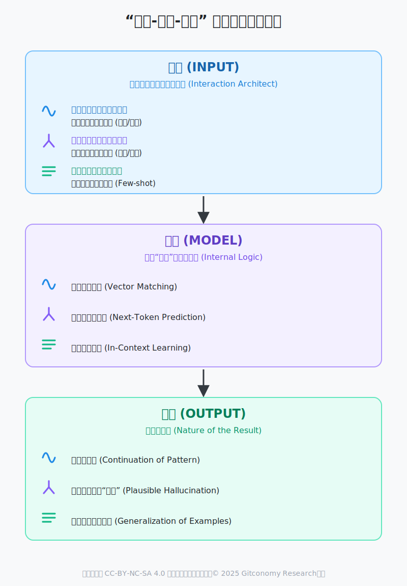
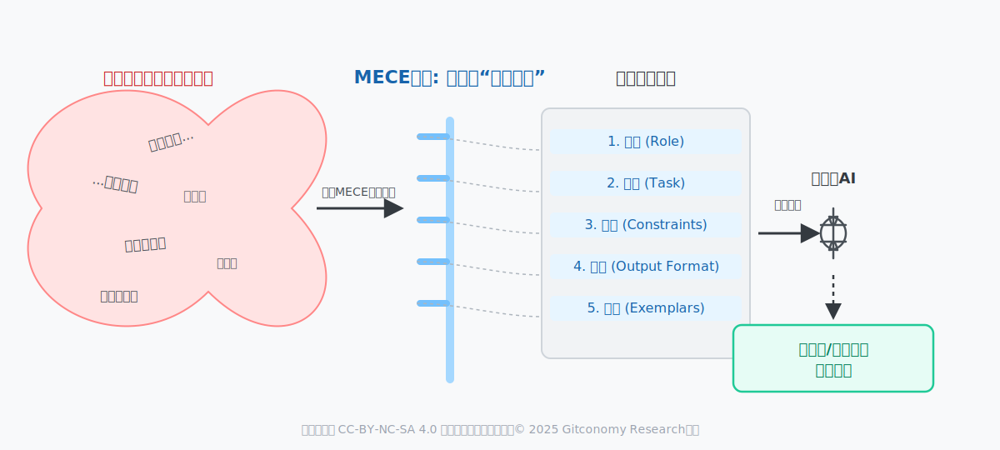
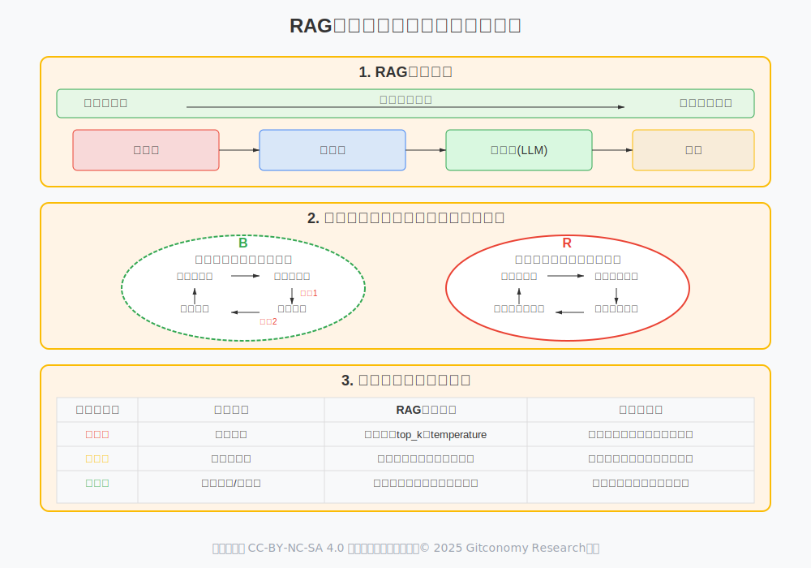
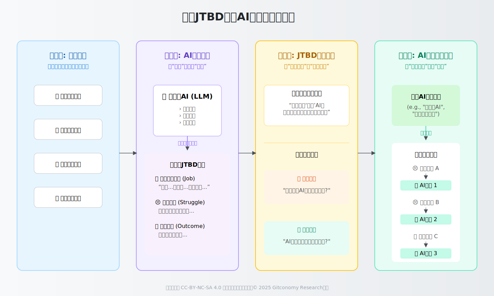
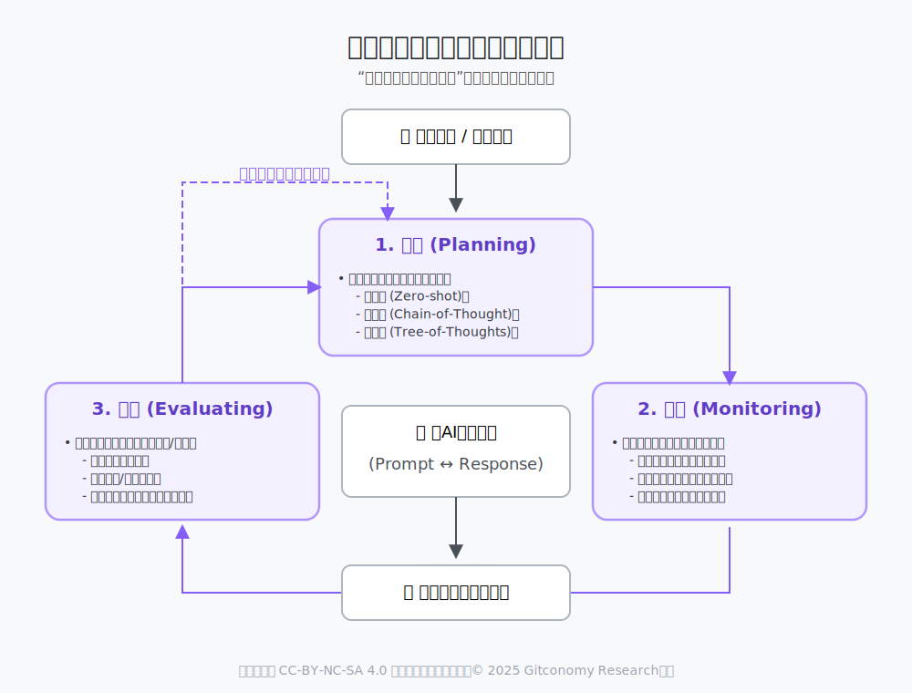
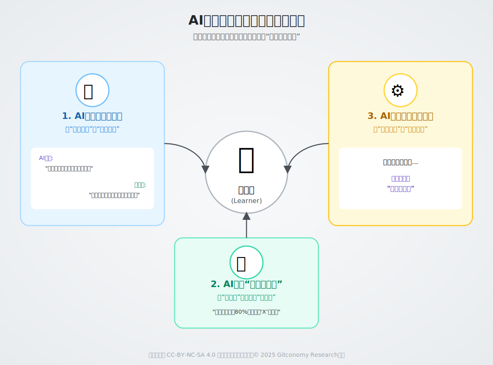
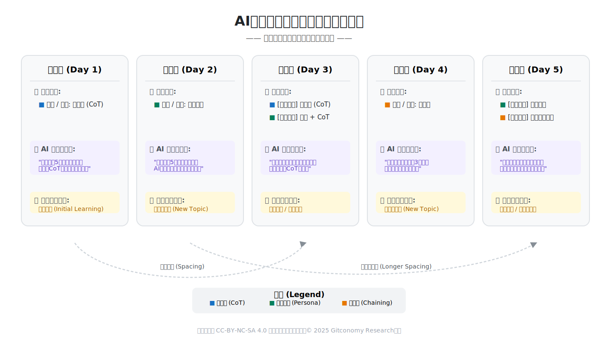
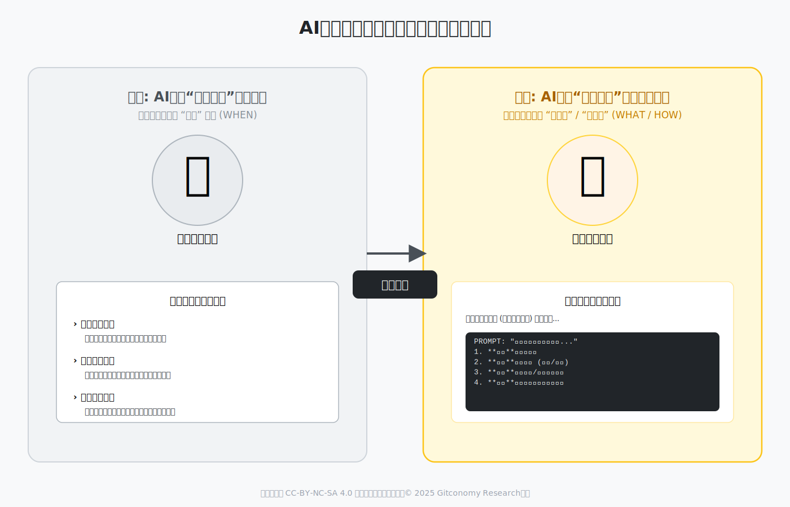
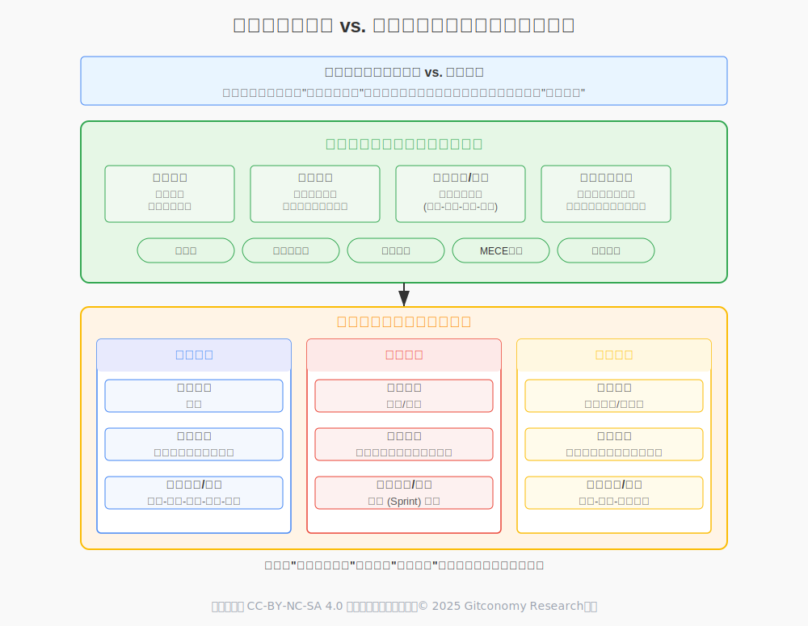

# 生成式思维深化指南——在人机共生的未来，成为智慧的驾驭者

## 一、生成式思维概述

生成式思维是一个整合了八种历经考验的认知框架，并辅以人工智能（AI）对其进行增强，旨在构建一个面向复杂时代的个人与团队认知操作系统。此“道场”不仅是一个工具箱，更是一个旨在培养深度思考、系统性创新与自主进化能力的综合训练体系。

我们统性地解构了源自哲学、商业战略、系统科学和认知心理学的八大核心理论，并论证了它们在应对现代AI挑战（如高级提示工程、检索增强生成（RAG）系统设计和以人为中心的AI创新）中的直接应用。本报告验证了道场提出的四层学习架构，为其每周的实践提供了详细的操作计划，并包含了针对一套推荐的本地开源工具链的全面教程。

在此基础上，我们将超越初步设想，提出更为先进的AI增强策略。最终，我们将“生成式思维”这一概念，从一个构想，演变为一个经过严格论证、具备高度可行性与战略价值的认知能力发展框架。

## 二、理论基础与AI增强

“生成式思维”的核心，是从“以人为中心，AI为辅助”的模式，转向“以目标为中心，人机为伙伴”的全新范式。以下八大理论不仅仅是指导我们个人思考的工具，它们已经成为了我们与生成式AI高效协作的“共同语言”和“交互协议”。

在这个道场中，我们学习的终极目标，不再是成为一个独立的“专家”，而是成为一个善于与强大AI伙伴协同，能够提出好问题、引导好方向、并与AI共同创造出非凡价值的“首席架构师”。这不仅是对一套方法的掌握，更是一种全新的、面向未来的思维方式和存在方式的开启。

### 2.1 第一性原理思维：从亚里士多德到AI系统设计

#### 2.1.1 哲学与科学渊源

第一性原理思维是一种通过将复杂问题分解为其最基本的、不言自明的公理，然后从这些公理出发重新构建解决方案的思考方法 。这种方法拥有深厚的智识渊源，为创新提供了强大的思想基础。

其哲学根源可追溯至古希腊。亚里士多德将第一性原理定义为“认知一件事物的最初基石” [1]。在他的《形而上学》中，他寻求万物的“本原”（arche），即那些无法从其他命题中推导出的基本前提。这种方法标志着从神话宇宙观向基于基本真理的非超自然解释的重大转变。进入现代哲学，勒内·笛卡尔通过其“系统性怀疑”方法论进一步发展了这一思想。笛卡尔质疑一切可以被质疑的信念，直至达到无可置疑的真理——“我思故我在”（Cogito, ergo sum），并以此作为其哲学体系的基石。

在现代，这一思维方式被埃隆·马斯克等创新者成功应用于商业和工程领域。马斯克通过将火箭或电池的成本分解至其最基础的原材料成本，从而颠覆了航空航天和汽车行业，证明了从根本上重新思考问题可以打破行业既有假设，实现数量级的成本降低。这种方法与“类比推理”形成鲜明对比，后者仅仅是在现有模型上进行微小改良，从而限制了颠覆性创新的可能性。物理学家理查德·费曼所倡导的“费曼学习法”——将复杂概念分解为最简单的部分并用通俗语言解释——也是第一性原理在学习领域的实践应用。

#### 2.1.2 在生成式AI中的应用：解构“输入-模型-输出”堆栈

在生成式AI领域，尤其是在提示工程中，第一性原理思维意味着从模仿和套用模板转向基于模型本质的指令构建。与其复制他人成功的提示，学员应回归到构成人机交互的基本真理 [2]。理解这些原理，使得学员能够构建出更根本、更有效的指令。



*图：A输入-模型-输出堆栈的第一性原则*

这些基本原理包括：

1. 原理一：智能即模式识别：AI的核心能力是在海量数据中识别和解释模式。
2. 原理二：输出是概率性的，而非确定性的：AI生成的是基于其训练数据的最可能序列，而非绝对正确的答案。
3. 原理三：从范例中学习，而非规则：AI通过观察大量样本间接学习，而不是遵循显式编程的规则。

该思维模式的核心在于，它要求思考者摆脱“类比推理”的束缚。类比推理通过参照已有事物或经验来解决问题，虽然高效，但其本质是在现有范式上进行微小迭代，从而限制了颠覆性创新的可能性 。相比之下，第一性原理思维则是一种“向上推理”，它将复杂问题分解至最基本的、不可再分割的元素——那些我们确信为真的事实或物理定律——然后从这些基石出发，重新构建解决方案 。

将第一性原理思维应用于生成式AI的提示工程中。这是一种从“术”的层面（模仿模板）上升到“道”的层面（理解本质）的关键转变，本质上是倡导提示工程师（Prompt Engineer）的角色转变：

- 类比推理者（炼丹师）：通过不断尝试、复制和微调他人成功的提示（Prompt），依赖经验和运气，试图找到“黄金配方”。这种方式知其然，但不知其所以然。
- 第一性原理思考者（AI交互架构师）：回归到构成大语言模型（LLM）行为最基本的三个原理，从根本上理解“为什么”某个指令会生效。基于这些原理，他们可以设计和构建出在多种情境下都稳定、高效的交互指令，而不仅仅是发现。

将“输入-模型-输出”的实践映射到生成式AI工作的核心流程中，看看它们在每个环节如何指导我们的行动：

| 堆栈层次 | 第一性原理 | 我们的角色 & 行动 | 产出/结果 |
| :--- | :--- | :--- | :--- |
| **输入 (Input)** | 1. 智能即模式识别 <br> 2. 输出是概率性的 <br> 3. 从范例中学习 | **交互架构师**： <br> - **提供**清晰模式 (角色/格式) <br> - **引导**概率走向 (约束/目标) <br> - **构建**微缩范例 (Few-shot) | 一个结构化、目标明确、包含高质量样本的指令 (Prompt)。 |
| **模型 (Model)** | (内部机制) | (无法直接控制) | 模型激活了与输入最匹配的内部处理路径，并开始进行概率性计算。 |
| **输出 (Output)** | (结果的本质) | **评估者 & 优化者**：<br> - **验证**输出是否延续了模式<br> - **判断**其合理性而非真实性<br> - **迭代**输入以优化下次输出 | 一个连贯的、高概率的、泛化了输入范例的文本序列。 |

通过运用这种第一性原理思维，我们不再是AI的“使用者”，而是成为了与一个拥有特定物理定律（三大原理）的“异世界智能”进行高效沟通的“设计者”。

**案例研究：从第一性原理构建提示**

**问题**：“为一款新的SaaS产品生成营销活动方案。”
**类比思维**：在网上搜索“优秀的SaaS营销提示模板”，然后进行修改。
**第一性原理思维**：将请求分解为不可或缺的基本要素：

1. 目标 (Goal)：核心任务是什么？（例如：驱动用户注册）
2. 受众 (Audience)：为谁生成？（例如：早期创业公司的创始人）
3. 核心价值主张 (Value Proposition)：产品解决的根本问题是什么？（例如：每周节省10小时的手动报告时间）
4. 品牌声音 (Brand Voice)：沟通的风格是什么？（例如：权威但平易近人）
5. 输出格式 (Output Format)：需要什么具体产物？（例如：3封邮件草稿，5条社交媒体帖子）

从这些基本公理出发重新构建的提示，远比修改一个通用模板更加精准和高效 。

此外，AI本身也可以成为应用第一性原理的辅助工具。通过苏格拉底式的提问，可以引导AI进行自我解构。例如，可以向AI发出指令：“运用第一性原理，将‘防止数据通过浏览器表单意外泄露’这一问题分解为其最基本的组成部分”。

#### 2.1.3 局限性与战略性应用

尽管第一性原理思维极为强大，但其应用也面临挑战。它对心智要求很高，需要投入大量时间和精力来挑战既有信念，这个过程可能会令人感到不安 6。因此，它并非适用于所有决策，而应被战略性地应用于那些寻求颠覆性创新的高风险、高回报领域。

在生成式AI领域，充斥着大量被奉为“魔法咒语”的复杂提示，用户往往在不理解其内在机制的情况下盲目复制。这种行为是现代版的“货物崇拜”（Cargo Cult）——模仿成功的仪式，却不理解创造成功的根本原则。当学员通过类比推理，观察到一个成功输出并复制其提示结构时，往往因为问题背景不同而导致结果不稳定或不佳。

第一性原理思维则迫使从关注提示的形式转向关注其功能。它提出的问题不是“那个成功的提示长什么样？”，而是“对于这个特定的任务，一个基于注意力机制的概率模型需要哪些最基本的信息和指令元素才能解决？” 。这个解构过程——例如，将上下文与指令分离，定义角色，明确格式——建立了一个关于AI交互的、强大且适应性强的心理模型，学员能够免于模仿的脆弱性。这是从一个提示使用者转变为提示架构师的基础技能。

### 2.2 MECE原则：为AI构建逻辑架构

#### 2.2.1. 起源与核心概念

MECE原则，即“相互独立，完全穷尽”（Mutually Exclusive, Collectively Exhaustive），是由麦肯锡公司的芭芭拉·明托（Barbara Minto）在20世纪60年代末系统化提出的，并成为其著名的“金字塔原理”的基石[3]。尽管明托是该原则在现代商业咨询中的主要推动者，但其逻辑根源可以追溯到亚里士多德的分类法。金字塔原理强调，有效的沟通始于清晰的思考，而MECE原则是确保思考结构严谨的核心工具。它要求在支持一个核心论点时，其下属的论据分组必须符合逻辑、全面且无重叠[4] 。

MECE原则包含两大支柱[5]：

- **相互独立 (Mutually Exclusive, ME)**：各个类别之间没有重叠。任何一个项目都只能归属于一个类别 21。例如，按年龄段（0-18岁，19-35岁，36-50岁）对客户进行细分是相互独立的。

- **完全穷尽 (Collectively Exhaustive, CE)**：所有可能的项目都被包含在各个类别中，没有遗漏。例如，将一家简单企业的利润分解为收入和成本两个部分是完全穷尽的。

#### 2.2.2 在生成式AI中的应用：确保清晰性与完整性

与生成式AI的交互，本质上是一场信息传递和指令执行的过程。在这个过程中，任何逻辑上的“熵增”（即模糊、重叠、遗漏）都会被AI的“黑箱”放大，最终导致输出结果的不可控和质量低下。在与生成式AI的交互中，指令的模糊性和不完整性是导致输出质量低下的主要原因。MECE原则在此扮演的角色，正是为这场交互建立起一副坚固的“逻辑龙骨”。它将模糊的对话式请求，转变为结构严谨、逻辑清晰的“指令架构” ，从而确保了AI能够精准、完整地理解并执行任务。



*图：MECE原则：AI交互的“逻辑龙骨”*

1. **构建结构化的复杂提示**

MECE原则可以防止指令的混乱和冲突。一个不符合MECE的提示可能会在“语气”和“风格”部分产生重叠。而一个遵循MECE的提示则会创建出清晰、独立的指令模块，例如角色 (Role)、任务 (Task)、约束 (Constraints)、输出格式 (Output Format)和范例 (Exemplars) 。这对于需要被AI精确解读的产品需求文档等场景尤为重要。

~~~
**优化前 (Non-MECE) 的问题提示**：

一个典型的、未经MECE优化的提示往往是“一锅粥”，将所有意图混杂在一起。

“帮我为新款降噪耳机‘AuraSound Pro’写一段社交媒体宣传文案。风格要酷一点，面向年轻人，突出它的超长续航和沉浸式音效。文案别太长，要适合发在微博上，最后加上购买链接。对了，要显得很新潮，类似‘年轻人的第一个HIFI耳机’那种感觉。”

这个提示中，“风格酷”和“新潮”有重叠，“面向年轻人”既是约束也是风格的一部分，“适合微博”既是格式也是长度约束。AI需要费力去解析这些混杂的指令。

**优化后 (MECE) 的指令架构**：

运用MECE框架，我们将指令分解为相互独立、完全穷尽的模块。

1. **角色 (Role)**
你是一位顶级的社交媒体营销专家，深谙Z世代的语言和潮流文化。

 2. **任务 (Task)**
为新款降噪耳机“AuraSound Pro”创作一篇微博宣传文案，核心目标是吸引用户点击产品链接并产生购买兴趣。

 3. **核心卖点 (Key Selling Points)**

- 沉浸式音效 (Immersive Sound): 仿佛置身音乐会现场。
- 超长续航 (Ultra-long Battery Life): 满足全天候使用需求。

4. **约束 (Constraints)**

- 目标受众: 18-25岁的年轻潮流爱好者。
- 平台: 新浪微博。
- 字数: 140字以内。
- 语气与风格: 新潮、酷、简洁有力，避免陈词滥调。
- 必须包含: #AuraSound Pro# 话题标签，以及一个占位符 [购买链接]。

5. **范例 (Exemplar)**

- 风格参考: “年轻人的第一个HIFI耳机”
- 结构参考: (痛点/场景) + (产品方案) + (行动号召)
- 通过这种结构化的指令，AI的任务变得异常清晰，输出结果的可预测性和质量都将大幅提升。
~~~

2. **设计RAG知识库**

在为检索增强生成（RAG）系统准备数据时，MECE原则至关重要。如果知识库中的文档内容相互重叠，检索器可能会提取出冗余或矛盾的信息，从而干扰生成器的最终输出。将知识库按产品功能、政策条款等维度进行MECE划分，可以确保检索结果的干净和可靠。

~~~
**优化前 (Non-MECE) 的知识库结构**：

假设一个企业知识库，用于回答员工关于报销的问题。

- 文档A：新员工入职手册.pdf (包含简化的差旅报销规定)
- 文档B：公司财务制度v3.pdf (包含最全面、最官方的报销政策)
- 文档C：行政部FAQ.docx (用问答形式解释了打车和餐饮的报销标准)

当员工提问“出差吃饭怎么报销？”时，RAG系统可能同时从A、B、C三个文档中检索到相关但表述不一（甚至可能因版本陈旧而相互矛盾）的片段。这会严重干扰LLM，使其生成一个模棱两可或错误的答案。

**优化后 (MECE) 的知识库架构**：

MECE原则指导我们对知识进行重构，确保**“单一事实来源” (Single Source of Truth)**。

1. **主题划分 (相互独立)**：

- 财务制度/
	-差旅报销.md
	- 日常采购.md
- 人事制度/
	- 假期政策.md
	-绩效评估.md

2. **内容整合 (完全穷尽)**：

- 将文档A, B, C中所有关于差旅报销的内容，全部整合、提炼、去重后，放入唯一的 差旅报销.md 文件中。

3. **内部结构化**：

- 在 差旅报销.md 内部，再次使用MECE原则划分章节：交通费、住宿费、餐饮费、申请流程等。

通过这种方式，任何关于报销的问题，都只会从一个高度结构化、内容无矛盾的源头去检索信息，从而确保了上下文的纯净性和答案的准确性。
~~~

3. **AI辅助的MECE分析**

可以利用AI来辅助创建MECE框架。例如，通过一个提示：“请使用MECE原则，将‘客户流失’这一主题分解为其根本驱动因素，确保各因素间无重叠”，AI可以为分析提供一个结构化的起点。

**增强版 (Enhanced) 的AI辅助提示**：

“任务: 我需要对‘SaaS产品用户留存率下降’这一复杂问题进行根本原因分析。请你扮演一位顶级的战略顾问，使用MECE原则，为我构建一个分析框架。

要求:

1. 相互独立: 确保一级目录之间完全没有概念重叠。
2. 完全穷尽: 确保所有可能的原因都被涵盖在框架内。
3. 结构化输出: 以Markdown嵌套列表的形式呈现，至少深入到第三层级。
4. 视角全面: 框架必须至少包含产品、市场、客户服务和运营四个主要视角。

这个增强版提示运用了MECE的思想（通过视角划分），为AI设定了更清晰的围栏，使其能生成一个远超人类初次思考的、结构严谨且全面的分析框架，为后续的数据分析和策略制定打下坚实基础。

综上所述，MECE原则不仅是咨询顾问的工具，更是数字时代与强大AI进行高效、可靠协作的底层逻辑语法。掌握它，意味着掌握了将AI能力最大化的钥匙。

| 应用领域 | 解决的核心问题 | 带来的核心价值 |
| :--- | :--- | :--- |
| **构建复杂提示** | 指令模糊、重叠、遗漏，导致AI理解偏差。 | **精准性与可控性：** 将AI的输出从“随机创作”变为“精确执行”。 |
| **设计RAG知识库** | 上下文信息冗余、矛盾，导致答案错误或不可信。 | **可靠性与一致性：** 保证AI基于纯净、权威的信息作答，建立系统信任。 |
| **AI辅助分析** | 人类思维的局限性，易产生偏见和逻辑漏洞。 | **严谨性与全面性：** 利用AI快速生成结构化、无遗漏的分析框架，提升决策质量。 |

#### 2.2.3. 局限性与细微差别

尽管MECE是一个强大的工具，但它并非万能。在实践中，要达到完美的MECE状态可能非常困难且耗时。对于某些高度交织的复杂问题，强行进行MECE划分可能导致过度简化，忽略了各部分之间的重要联系。因此，目标往往是达到“足够MECE”（MECE-enough），以实现清晰的沟通和分析，而不是追求绝对的逻辑完美。此外，过于僵化的结构有时也可能抑制创造性思维。

随着AI智能体和人类在复杂任务上的协作日益紧密，沟通的模糊性成为失败的主要根源。人类能够凭借经验和上下文处理模糊信息，但AI模型则不能。在一个典型的工作流程中，人类产品经理撰写的需求文档往往是充满非结构化散文和隐含假设的。人类开发者可以通过对话来澄清这些模糊之处，而AI智能体则会进行字面解读，导致重叠的需求或未文档化的空白区域引发执行错误。MECE原则在此充当了一种形式化的“规约语言”。通过将需求结构化为无重叠且全面的组件（例如，在通知系统设计中分为触发器、接收者、自定义选项），文档变得机器可读且无歧义。因此，MECE不仅是人类的思维工具，更是为AI创建可靠上下文和指令的基本架构原则，是实现人机在产品管理和软件开发等复杂领域高效协作的基石。

### 2.3 系统思维：为生成式AI的动态建模

#### 2.3.1 历史与理论发展

系统思维（Systems Thinking）并非单一的理论，而是一个庞大且多样化的思想流派，其发展历程横跨多个学科[7]。其思想源头可以追溯到生物学家路德维希·冯·贝塔朗菲（Ludwig von Bertalanffy）在20世纪30年代提出的“一般系统论”（General Systems Theory, GST），该理论主张不同领域的系统（无论是生物的、机械的还是社会的）共享着通用的组织原则 23。几乎在同一时期，诺伯特·维纳（Norbert Wiener）开创了“控制论”（Cybernetics），其核心概念“反馈回路”（feedback loops）——即系统输出反过来影响其未来输入——为理解系统的自我调节和控制行为提供了关键的理论工具。

20世纪中叶，系统思维得到进一步的规范化和发展。麻省理工学院的杰·弗雷斯特（Jay Forrester）创立了“系统动力学”（System Dynamics），利用计算机模型来模拟由反馈回路、存量和流量构成的复杂系统动态行为。英国的塔维斯托克研究所（Tavistock Institute）则将系统思维应用于社会技术系统，研究技术与人的行为如何相互作用。彼得·切克兰德（Peter Checkland）后来发展的“软系统方法论”则将系统思维的应用范围从定义明确的“硬”问题扩展到了边界模糊、充满多方利益相关者主观认知的“软”问题或“棘手问题”。而唐娜·梅多斯（Donella Meadows）的里程碑式著作《增长的极限》则通过系统动力学模型，向世界展示了系统思维在理解全球性环境问题上的巨大威力。这一丰富的历史背景表明，系统思维是一个包含从定量建模（硬系统）到质性探究（软系统）等多种方法的广阔领域。

#### 2.3.2 核心工具与概念

1. **因果回路图（Causal Loop Diagrams, CLD）** 是可视化系统反馈结构的语言，通过标注增强回路（Reinforcing loops, R）和调节回路（Balancing loops, B），帮助我们理解系统行为的内在驱动力 [8]。

2.   **冰山模型（Iceberg Model）** 是一个强大的认知框架，引导我们从可见的“事件”（Events）层面，深入探究其下的“模式”（Patterns）、“结构”（Structure）以及最深层的“心智模式”（Mental Models），从而找到问题的根本原因。

4. **杠杆点（Leverage Points)分析**则是在理解了系统结构之后，识别那些“四两拨千斤”的关键干预点，以最小的努力实现系统性的改变。

#### 2.3.3 RAG作为一个复杂系统：系统思维分析

检索增强生成（RAG）是现代生成式AI应用的核心架构之一，它本身就是一个复杂的动态系统，非常适合用系统思维进行分析。



*图：RAG作为一个复杂系统的框架*

1. **绘制RAG系统图：从“机械师”到“生态园丁”**

不仅仅将生成式AI视为一个技术组件，而是将其作为一个活的、动态的复杂系统来理解，这正是高级AI应用开发者和战略家所必需的视角：

- 机械师视角 (Mechanic View): 孤立地看待AI的各个组件——优化检索算法、微调语言模型、调整参数。这种视角专注于“零件”的性能，但可能忽略零件之间的相互作用所产生的“涌现”行为（Emergent Properties）。
- 生态园丁视角 (Ecological Gardener View): 将整个RAG应用看作一个微型生态系统。园丁不直接“制造”植物，而是通过调节阳光、水分、土壤和物种间的关系，来培育一个健康、有韧性且能自我调节的生态。同理，系统思维者通过调节数据流、反馈回路和系统目标，来培育一个能持续提供价值的AI系统。

运用系统思维的原则解构一个典型的RAG架构：

- 要素：检索器（如向量搜索）、知识库（文档、数据块）、生成器（大语言模型）、用户。
- 连接 ：信息流动的路径，从用户查询，到向量嵌入，再到检索、上下文增强、提示词构建，最终由模型生成回复并获得用户反馈。
- 目标：通过外部知识增强大语言模型，以提供准确、有依据且与上下文相关的答案。

2. **RAG系统的动态分析：深化反馈回路与“时滞”效应**

在系统思维中，“时滞”指的是一个行动与其产生完整效果之间的时间差。简单来说，它就是“因”与“果”之间的延迟。我们采取了一个行动，但并不能立即看到它的全部后果；后果会在一段时间之后才慢慢显现。时滞是系统中许多**“意外”和“反直觉”行为**的根源。如果我们忽略了时滞：
- 我们会基于过时的信息做决策： 我们根据“当下”的感觉（其实是几秒前的旧信息）去调整，导致行动过激。
- 它会破坏系统的稳定性： 正如洗澡水温的例子，一个原本稳定的系统会因为时滞和我们的过度反应而剧烈波动。
- 它会侵蚀耐心和信任： 当我们付出努力后，迟迟看不到效果，我们可能会过早地放弃一个本应有效的策略，或者对整个系统失去信心。

在我们讨论的RAG系统中，时滞无处不在，并且影响巨大：

- (平衡回路) 质量校正回路的“时滞”风险

	1. 检索质量差 → 生成答案不准确。
	2. 【时滞1：用户感知与反馈】 用户需要时间来判断答案的对错，并且只有一小部分用户会主动提供负面反馈。
	3. 用户负面反馈 → 开发者收到信号。
	4. 【时滞2：分析与优化】 开发者需要时间来分析反馈、定位根源（是分块问题？还是检索算法问题？），并部署解决方案。
	5. 系统优化 → 检索质量提升。

	**系统洞察**:：如果这两个“时滞”过长，平衡回路的调节作用将大大减弱。在问题被修复之前，大量用户可能已经因为体验不佳而流失。因此，缩短反馈和优化的时滞（例如，通过更智能的用户反馈界面、自动化的根因分析工具）是提升该回路效率的关键。

- (增强回路) 知识库僵化的恶性循环

	1. 知识库内容陈旧，未能及时更新。
	2. RAG系统给出了基于过时信息的答案。
	3. 用户对系统的信任度下降，认为它“不靠谱”。
	4. 用户使用频率降低，并减少了对系统提供反馈和贡献新知识的意愿。
	5. 由于缺乏使用和贡献，维护知识库的优先级被降低，导致其内容更加陈旧。

	**系统洞察**： 这个循环一旦形成，将导致系统逐渐“死亡”。打破这个循环的杠杆点在于建立一个低成本、高回报的知识更新机制，将知识库的维护从一个“成本中心”转变为一个与业务紧密结合的“价值中心”。

```
**RAG系统“时滞”的示例**：

- 场景： RAG系统给出了一个基于过时政策的错误答案。
- 行动： 某个细心的员工发现了这个错误。
- 时滞 1 (反馈时滞): 从员工发现错误，到他决定花时间写邮件/提交反馈，再到开发团队看到并确认这个问题，可能已经过去了好几天。
- 时滞 2 (修复时滞): 从开发团队确认问题，到他们找到源文档、完成更新、测试并部署上线的整个过程，可能又需要一周。
- 后果： 在这两段长长的时滞（总共可能超过一周）期间，整个公司的其他员工都在持续不断地从这个RAG系统中获取同样的错误信息。一个小错误的影响因为时滞而被急剧放大，用户对这个“智能助手”的信任度也在此期间持续流失。

```

因此，在进行系统分析时，一个关键的步骤就是主动去寻找和识别系我们将逐一解构道场的八大支柱，验证其理论根基，并探讨其固有的局限性；统中存在的各种“时滞”。很多时候，提升一个系统性能的最高效杠杆，并不是去增强某个部件的处理能力，而是想办法缩短那些关键的、造成不良影响的“时滞”。这能让系统更快地响应变化，更早地从错误中学习，从而变得更加稳定和智能。

3. **杠杆点实践：将理论转化为可操作的优化矩阵**

应用多内拉·梅多斯的杠杆点层级理论，可以识别出干预RAG系统的有效策略，从而实现事半功倍的效果：

| 杠杆点层级 | 干预措施 (Intervention) | RAG 具体示例 | 系统性影响与评价 |
| :--- | :--- | :--- | :--- |
| **低杠杆** | **12. 参数 (Parameters)** | 调整检索的 `top_k` 值；调整生成模型的 `temperature`。 | **效果有限**：易于实施，但通常只能带来边际改善，无法解决根本性问题。 |
| ↓ | **11. 缓冲区 (Buffers)** | 增加检索结果的缓存机制，对高频问题直接返回缓存答案。 | **提升效率**：能提高系统响应速度和稳定性，但不能提升知识的准确性。 |
| **中杠杆** | **8. 平衡回路强度** | 建立更高效的用户反馈系统（如“一键点踩”并标注原因）。 | **增强自愈能力**：缩短了质量校正回路的“时滞”，使系统能更快地从错误中恢复。 |
| ↓ | **6. 信息流结构** | 优化文档分块(Chunking)策略；引入重排序(Re-ranking)模型。 | **显著提升质量**：从根本上改变了流入LLM的信息质量，是RAG优化的核心技术点。 |
| **高杠杆** | **4. 系统自我组织能力** | 引入一个“知识库监控智能体”，能自动发现过时或矛盾的文档，并提醒维护者。 | **提升系统韧性**：让系统具备了自我诊断和预警的能力，从被动修复变为主动维护。 |
| ↓ | **3. 系统目标 (Goal)** | 将目标从“问答”升级为“协助用户完成复杂任务的伙伴”。 | **驱动架构变革**：这将推动RAG向更复杂的Agent架构演进，使其具备多步推理、主动提问和调用工具的能力。 |
| **最高杠杆** | **1. 超越范式 (Transcending Paradigms)** | 重新思考人与知识交互的范式，从“检索”变为“共同探索”。 | **创造全新价值**：系统不再仅仅是回答问题，而是作为一个激发用户思考、帮助用户发现未知知识领域的探索工具。 |

~~~
**应用冰山模型诊断RAG问题**

冰山模型是诊断系统性问题的利器。让我们用它来分析一个常见的RAG问题：“用户抱怨答案不准确”。
- 事件层 (Events): “今天，用户A投诉说，关于‘公司最新报销政策’的回答是错误的。” (这是可见的表象)
- 模式层 (Patterns): “近一个月，类似投诉增加了30%。我们发现，这些错误答案主要集中在最近一个月内更新过的政策上。” (我们看到了重复出现的趋势)
- 结构层 (Structure): “我们的RAG系统存在结构性问题：1) 知识库更新流程是手动的，存在时滞。2) 检索器无法区分新旧版本的政策文档，导致上下文污染。3) 质量校正的平衡回路因缺乏有效的用户反馈机制而运转不灵。” (我们找到了导致模式出现的系统结构和因果关系)
- 心智模式层 (Mental Models): “团队的核心信念是‘模型和算法最重要’。我们投入了大量资源去优化检索模型，但在心智上忽视了‘数据（知识库）是活的’这一事实，未能将知识库的持续治理和更新视为与算法同等重要的一等公民。” (我们触及了驱动系统结构产生的最深层信念和价值观)

通过这一层层深入的分析，我们发现，解决问题的真正杠杆点并非再次调整top_k参数（事件层），而是要改变团队的心智模式，建立一套完善的知识库生命周期管理流程（结构层）。
~~~

系统思维的运用为我们提供了一套强大的语言和工具，帮助我们：

- 看见整体：绘制出RAG背后由技术、数据和人构成的完整系统图。
- 思考动态：识别出驱动系统行为（无论是良性还是恶性）的关键反馈回路。
- 找到要害：通过杠杆点分析，将有限的资源投入到能产生最大系统性改变的地方。

这正是将生成式AI从一个“聪明的玩具”转变为一个“可靠的、可扩展的、持续创造价值的系统”的必经之路。

#### 2.3.4 局限性与批判性考量

系统思维的主要挑战在于其高度的抽象性。过度关注“大局”有时可能会忽略决定成败的关键细节 28。其次，构建一个准确、有效的系统模型本身就是一项复杂且耗时的工作。一个不准确或过度简化的模型不仅无益，反而可能误导决策。特别是对于“软系统”方法论，由于其强调主观认知和多方对话，其结论的客观性和可验证性常常受到质疑。

### 2.4 JTBD框架：为AI的“能力”找到了“动机”

#### 2.4.1 理论渊源与关键人物

“待办工作”（Jobs to be Done, JTBD）理论的历史可以追溯到20世纪90年代，由托尼·乌尔维克（Tony Ulwick）在其“成果驱动创新”（Outcome-Driven Innovation, ODI）方法论中率先系统化，后由哈佛商学院教授克莱顿·克里斯坦森（Clayton Christensen）的著作而广为人知 。

JTBD理论的核心思想是一次范式转移：顾客购买产品或服务，并非因为产品本身或其属性，而是为了“雇用”（hire）它来完成某项“工作”（job）。这里的“工作”指的是顾客在特定情境下，试图取得的“进步”（progress）。

这种视角彻底改变了我们对市场、竞争和创新的理解。例如，一个早上通勤的人购买一杯奶昔，其“工作”可能不是“解渴”或“品尝美味”，而是“在单手开车的漫长通勤中，找到一种能持续提供能量、不易弄脏、且能打发时间的东西”。从这个角度看，奶昔的真正竞争对手就不是其他饮料，而是香蕉、能量棒甚至是播客[9] 。

宜家（IKEA）、爱彼迎（Airbnb）和声田（Spotify）的成功，都可以从JTBD的视角得到深刻解读：人们到宜家不是为了买家具，而是为了“以可负担的方式快速构建一个有格调的家”；使用爱彼迎是为了“像本地人一样体验一个地方”，而不仅仅是找个睡觉的地方；使用声田是为了“随时随地、毫不费力地为我的生活场景配上合适的背景音乐”。JTBD通过关注用户的根本动机和情境，揭示了未被满足的需求和真正的创新机会。

#### 2.4.2 通过JTBD识别AI机遇的系统流程

如果说生成式AI提供了前所未有的“能力”（the What），那么JTBD框架则为其找到了至关重要的“动机”（the Why）。它为AI技术的发展和应用提供了一个强大的“指南针”，确保技术始终对准真实的人类需求，而非漫无目的地展示其能力。这种结合，促使我们从设计“AI功能”转向设计“由AI驱动的用户进步阶梯”。



*图：JTBD识别AI机遇的系统流程示意图*

利用AI从海量非结构化数据中提取用户需求洞察，是JTBD与AI结合的核心应用。我们可以将其进一步细化：

1. **AI驱动的JTBD访谈分析:将“质性洞察”规模化**

传统的JTBD研究严重依赖于耗时的人工访谈和质性分析。现在，AI可以极大地加速这一过程。利用AI语音转录工具将访谈录音转化为文本，再利用专门的AI质性分析平台或定制的LLM提示，可以自动从文本中识别和聚类用户的“挣扎时刻”、“期望成果”，以及“工作”所包含的功能、情感和社交维度。

~~~
**实践范例：假设我们正在为一款冥想App进行JTBD研究。**

原始访谈片段 (用户A):

“……每天下班堵在路上就特别烦，想静下来但脑子里全是事儿……试过一些App，但一开始就让我盘腿坐好，感觉很刻意，压力更大。我其实就想要个能在回家地铁上，戴上耳机立马能把工作‘清空’的东西……”

AI分析后的结构化输出:

JSON

{
  "job_statement": "当我结束一天高压工作，在嘈杂的通勤路上感到疲惫不堪时，我想要毫不费力地将大脑从‘工作模式’切换到‘休息模式’，以便我能以平静的心情回到家中。",
  "struggle_moment": "现有解决方案仪式感过强，在通勤等非正式场景下使用反而增加了心理负担。",
  "desired_outcome": "在任何环境下都能‘一键进入’平静状态。",
  "dimensions": {
    "functional": "快速、有效、不受环境限制地放松大脑。",
    "emotional": "寻求从焦虑到平静的情绪转换，减轻压力感。",
    "social": "（在此例中不明显）"
  }
}

通过这种方式，研究人员可以在几天内处理掉过去需要数周才能完成的访谈分析工作。
~~~

3. **利用生成式AI综合用户反馈：从“数据海洋”中淘金**

企业通常拥有海量的用户反馈数据，如应用商店评论、客户支持工单、社交媒体帖子和论坛讨论。利用LLM，可以设计特定的提示（prompt），让其在这些数据中进行模式识别，综合提炼出格式化的JTBD陈述句和用户工作地图（Job Map），从而快速、大规模地捕捉用户需求信号。

~~~
**实践范例：一家电商平台想要了解为什么用户会放弃购物车。**

1. AI分析的数据源: 50,000条应用商店评论、10,000条客户支持工单、社交媒体上的相关讨论。

AI执行的任务:

- 聚类: 将所有反馈按主题（如价格、物流、支付问题、产品信息不明确）进行聚类。
- 提炼JTBD: 在每个聚类中，提炼出用户想要完成的“工作”。

2. AI提炼的JTBD洞察:

- Job 1 (价格相关): “当我准备购买一件商品时，我想要快速确认自己拿到了最划算的价格，以便我能充满信心地完成支付。” (→ 衍生出“自动比价”、“价格保护承诺”等功能)
- Job 2 (决策相关): “当我在几件相似商品间犹豫不决时，我想要清晰地了解它们的核心差异和适用场景，以便我能做出最适合我的、不会后悔的选择。” (→ 衍生出“AI智能对比”、“虚拟导购”等功能)
~~~


3. **以JTBD作为AI战略制定的框架:确保“为终而始”**

在企业决定引入AI技术时，JTBD提供了一个至关重要的战略思考框架。问题不应是“我们能用AI做什么？”，而应是“我们的业务/客户正在‘雇用’我们完成什么工作？在完成这些工作的过程中，存在哪些效率低下、成本高昂或体验不佳的环节？AI能否被‘雇用’来更好地完成这些工作？” 这种思维方式确保了AI的应用是需求驱动而非技术驱动的，避免了为了AI而AI的陷阱。例如，一个企业可能会发现，其核心工作是“帮助客户降低运营成本”，而AI可以被“雇用”来通过自动化重复性任务、优化供应链预测等方式来更出色地完成这项工作 。

| 思维模式 | 核心问题 | AI应用决策示例 (以银行为例) | 风险 |
| :--- | :--- | :--- | :--- |
| **技术驱动** | “我们如何应用最新的LLM技术？” | “让我们做一个通用的AI聊天机器人，放在App首页。” | 产出一个没人用、体验差的“万金油”产品，浪费资源。 |
| **JTBD驱动** | “客户‘雇用’我们银行来完成什么核心工作？”<br> (例如：“帮助我**感觉对自己的财务未来有掌控力**”) | “客户的挣扎时刻是看不懂复杂的理财产品。我们能否‘雇用’AI来设计一个‘财务规划对话机器人’，它能用最通俗的语言解释产品、模拟未来收益，并根据我的风险偏好提供个性化建议？” | AI的应用精准地解决了用户的核心焦虑，创造了独特的价值。 |

JTBD确保了AI的投入始终服务于一个明确的、有价值的客户“进步”目标。

4 .**“雇用”AI完成工作：设计“专职专家”而非“通用工具”**

设计一个AI解决方案，精准地解决用户的“挣扎时刻”并帮助其实现期望的结果。例如，一个高管的“工作”是“为一次高风险谈判做足准备并充满信心”，其“挣扎时刻”是从几十份文档中整合关键信息。对应的AI解决方案就不是一个通用的“文档摘要工具”，而是一个“谈判准备助手”，它能自动提取关键数据、识别潜在的反驳论点，并模拟谈判场景。

~~~
**实践范例：“高管谈判准备”的例子。**

1. 待办工作 (Job): 当我面临一场高风险的商业谈判时，我想要全面、高效地掌握所有信息并预演各种可能性，以便我能充满信心地主导谈判，达成最佳结果。

2. 挣扎时刻 (Struggles):

- 从海量文档（邮件、合同、报告）中手动筛选关键信息，耗时且易遗漏。
- 难以预料对方可能提出的尖锐问题和反驳论点。
- 缺乏一个客观的“陪练”来模拟谈判，找到自己逻辑上的漏洞。

3. 设计的AI解决方案：“谈判官AI”

它不是一个通用的“文档问答”或“摘要”工具，而是一个被精准“雇用”来完成这项工作的专家：

- 功能1：情报简报: 上传所有相关文档，AI自动生成一份SWOT分析、关键数据摘要、双方核心利益点和潜在争议点。 (直接解决挣扎1)
- 功能2：红队模拟: AI扮演谈判对手，根据资料对你的论点提出尖锐、刁钻的挑战，并给出应对建议。 (直接解决挣扎2)
- 功能3：逻辑压力测试: 你输入自己的核心论点，AI会从逻辑、数据支撑、情感影响等多个维度进行压力测试，并指出潜在的薄弱环节。 (直接解决挣扎3)

这个“谈判官AI”因为完美地匹配了用户的“工作”和“挣扎”，将比任何通用AI工具都更具价值，用户也更愿意为其付费。
~~~

JTBD与生成式AI的结合，为创新提供了一条清晰的路径：用AI大规模地发现待办工作，再用AI精准地完成待办工作。这个强大的组合，让企业能够真正地从用户的核心动机出发，创造出前所未有的、有意义的解决方案。

#### 2.4.3 局限性与争议

JTBD理论内部存在不同的“学派”，例如乌尔维克的ODI学派更侧重于量化地定义和衡量“工作”的各项“期望成果”，而鲍勃·莫斯塔（Bob Moesta）等人则更强调通过定性访谈来挖掘“工作”背后的情感和社交维度。这些差异有时会给初学者带来困惑 36。此外，JTBD的应用也存在挑战：如果“工作”定义得过于宽泛（如“感到快乐”）或过于狭窄（如“点击一个按钮”），就会失去其作为创新指导的价值。最后需要明确的是，JTBD是一个强大的“问题定义”工具，它帮助我们精准地找到靶心，但它本身并不提供“如何射中靶心”的具体解决方案。

### 2.5 HMW方法：将挑战重构为机遇

#### 2.5.1 渊源及其在设计思维中的角色

“我们该如何…”（How Might We, HMW）方法是一种将问题转化为开放性机遇的创新提问技术。其历史可追溯到20世纪60年代西德尼·帕恩斯（Sidney Parnes）提出的“邀请式提问”，后在宝洁公司得到应用，并最终由设计公司IDEO发扬光大，成为设计思维流程中的一个标志性环节。

HMW在设计思维中扮演着关键的桥梁角色，它连接着“定义”（Define）问题阶段和“构思”（Ideate）解决方案阶段[10]。其独特的句式结构经过精心设计，旨在激发团队的创意思维：

- “How”（如何）：这个词预设了解决方案是存在的，从而建立起团队的创造性自信。
- “Might”（可以/或许）：这个词鼓励发散性思维，允许提出各种可能成功也可能失败的想法，降低了创新的心理门槛。
- “We”（我们）：这个词强调了创新的协作本质，鼓励团队成员共同努力，在彼此想法的基础上进行构建。

通过将一个负面的问题陈述（如“用户在注册流程中流失率很高”）转化为一个积极的、开放的HMW问题（如“我们该如何让注册过程感觉像一次愉快的欢迎仪式？”），团队的思维焦点从障碍转向了可能性。

#### 2.5.2 HMW AI增强策略

一个有效的HMW问题应该具备适度的广度：既要足够宽泛以激发多样的想法，又不能过于空泛以至于失去焦点。它必须源于真实的用户洞察或问题，并且问题本身不应暗示或包含任何具体的解决方案。

例如，“我们该如何设计一个带有蓝色按钮的注册页面？”就是一个失败的HMW，因为它已经限定了解决方案。常见的陷阱包括提出的问题过窄或过宽，导致思维受限或发散失控。

1. **AI驱动的HMW生成：打破团队的“思维定势”**

人类在面对一个问题时，很容易陷入线性的、熟悉的思维路径。AI则可以作为一个无偏见的“创意副驾驶”，机械地、不知疲倦地从多个预设的创新视角来重构问题。

现有的一些创新平台和AI工具（例如，由Ideanote或Board of Innovation提供的工具）已经能够实现HMW问题的自动生成。用户只需输入一个问题陈述或一个核心洞察，AI就能从多个不同的创新角度（如“放大优点”、“消除缺点”、“挑战假设”、“反转视角”等）生成一系列富有启发性的HMW问题。这能有效帮助团队克服思维定势，从意想不到的角度审视问题。

~~~
**实践场景：一家在线教育公司发现，许多用户购买了视频课程后，完成率极低。**

1. 问题陈述 (Problem Statement):
“用户缺乏动力，无法坚持学完他们购买的在线课程。”

2. 向AI下达的指令 (Prompt):

“你是一位顶级的创新策略师和设计思维专家。请针对以下用户问题陈述，从至少5个不同的创新视角，生成一系列‘我们该如何’（How Might We）问题。

- 问题陈述： 用户缺乏动力，无法坚持学完他们购买的在线课程。

- 创新视角：
	1）消除负面因素 (Remove the Bad): 关注如何减少学习的阻力。
	2）放大正面因素 (Amplify the Good): 思考学习中最有吸引力的部分。
	3）挑战核心假设 (Question an Assumption): 质疑“课程必须被‘学完’”的前提。
	4）注入情感价值 (Add Emotion): 思考如何让学习过程更有趣、更有连接感。
	5）利用外部资源 (Leverage Resources): 思考如何引入课程以外的元素。”

2. AI生成的HMW问题集 (示例):

	1）[消除负面] HMW 让学习的启动过程像打开一个短视频一样毫不费力？
	2）[放大正面] HMW 将课程中最精彩的“啊哈时刻”前置到学习体验的最开端？
	3）[挑战假设] HMW 在用户只学习了20%内容的情况下，就为他们交付80%的核心价值？
	4）[注入情感] HMW 将孤独的学习过程，变成一场充满乐趣的“组队打怪”？
	5）[利用资源] HMW 借助学员的雇主或同事，来为他们的学习提供外部激励？

这个由AI生成的、多角度的HMW矩阵，为接下来的头脑风暴提供了极为丰富和高质量的起点。
~~~

2. **AI辅助的HMW亲和图谱构建：从“发散风暴”到“机会地图”**

在一场大规模的头脑风暴会议后，团队可能会产生数百个HMW便签。传统上，需要通过人工的方式进行亲和图谱（Affinity Mapping）来对这些想法进行归类。现在，可以利用AI的自然语言处理能力，对这些HMW问题进行快速的语义聚类，自动识别出关键的机会主题，从而大大提高整理和收敛阶段的效率。

~~~
**工作流程示例**：

1. 输入: 将数百个手写或电子便签上的HMW问题，通过OCR或直接复制，输入到一个文本文件中。

2. AI指令 (Prompt):

“你是一位资深的质性研究员。以下是关于‘提升在线课程完课率’的数百个HMW问题。请对它们进行语义分析和亲和聚类，识别出5-7个核心的‘机会主题’（Opportunity Clusters）。对于每个主题，请给出一个贴切的命名，并列出3-5个最能代表该主题的HMW问题。”

3. AI输出 (示例):

- ## 机会主题一：微学习与即时满足
	- HMW将一小时的课程拆解成60个一分钟的知识胶囊？
	- HMW让用户每学习5分钟就能获得一次即时奖励？
	- ...

- ## 机会主题二：社交化与同伴激励

	- HMW为同一课程的学员自动匹配学习伙伴？
	- HMW引入学习排行榜和小组竞赛机制？
	- ...

AI的介入，将团队从繁琐的整理工作中解放出来，让他们能专注于对这些“机会主题”进行更深度的战略思考。

~~~

#### 2.5.3 从JTBD到HMW再到AI的创新流水线

JTBD框架和HMW方法并非两个孤立的工具，它们之间存在着一种天然的逻辑关系，共同构成了道场内部一个核心的创新算法。JTBD通过深度访谈和分析，旨在精准地“定义”用户的核心问题（即待办工作和其中的挣扎）。而HMW则是一种强大的“重构”技术，它接收一个已经明确定义的问题，并将其转化为一个能够激发创意思维的生成性问题。


*图：JTBD->HMW->AI流水线*

因此，这两个框架在实践中形成了一条从洞察到机会的清晰流水线：原始用户数据 → JTBD分析 → 核心问题陈述 → HMW问题重构 → 创意构思。在“生成式思维”中，这一创新流程可以被系统化和自动化。

首先，一个AI模型可以接收并综合各种用户数据（访谈记录、用户评论等），提炼出一个精准的JTBD陈述句，例如：“当我在通勤时，我很难找到一种既能填饱肚子又方便单手食用的早餐。请帮助我获得饱腹感且不把车弄脏，这样我才能高效地开始我的一天。” 接着，这个JTBD陈述句可以被直接输入到另一个AI提示中，该提示的任务是将其转化为一系列多样化的HMW问题，例如：“我们该如何让早餐像喝饮料一样方便？”或“我们该如何创造一种零脏乱的通勤餐？”。这个由AI增强的JTBD-to-HMW管道，为道场构建了一个可重复、可扩展的、从用户真实需求出发的创新引擎。

### 2.6 元认知：掌握“学习如何学习”的艺术

#### 2.6.1 理论基础

“元认知”（Metacognition）这一术语由美国发展心理学家约翰·弗拉维尔（John Flavell）在20世纪70年代正式提出，其核心思想是“对思考的思考”或“对认知的认知”。

元认知包含两个主要组成部分：

1. **元认知知识（Metacognitive Knowledge）**

指个体关于自身认知的知识。这包括：

- 个人变量 (Person Variables)：对自己作为学习者的认知，如“我记忆历史日期有困难” 。
- 任务变量 (Task Variables)：对任务本身性质和难度的理解，如“这章内容的概念很复杂” 。
- 策略变量 (Strategy Variables)：了解有哪些可用的学习策略以及何时使用它们最合适 。

2. **元认知调节（Metacognitive Regulation）**

指个体在认知活动中进行的自我调节和控制过程，通常表现为一个包含计划（Planning）、监控（Monitoring）和评估（Evaluating）的循环。例如，在开始一项学习任务前进行规划，在学习过程中监控自己的理解程度，并在学习结束后评估所用策略的有效性。

元认知是实现自主学习（self-regulated learning）的核心机制。一个具备高元认知能力的学习者，能够主动地选择、运用和调整学习策略，从而成为一个更高效、更独立的学习者。在此，必须澄清认知策略与元认知策略的区别：前者是用来完成认知任务本身的工具（如，用联想法记单词），而后者是用来监控和指导认知过程的工具（如，意识到联想法在此处无效，并决定更换策略。

#### 2.6.2 元认知作为提示工程的核心技能

从“AI工具”到“认知伙伴”标志着我们对AI角色的认知升级：AI不再仅仅是执行指令的外部“工具箱”，它正在演变为一个可以与我们进行深度交互、共同演进的“认知伙伴”。

- 传统关系： 人类（有元认知） → 使用 → AI（工具）
- 新型关系： 人类 ↔︎ 互动/共生 ↔︎ AI伙伴（既是工具，也是教练和镜子）

在这种新关系中，最高效的学习者和AI实践者，将是那些最擅长利用AI来反思和优化自身思维模型的人。高级提示工程的实践本质上是一个元认知过程。从业者不仅要构建提示，更要持续地反思和优化其构建提示的思维过程。



*图：元认知循环在提示工程中的应用*

将元认知映射到提示工程：

- 计划 (Planning)：在面对一个复杂的推理任务时，从业者会思考：“我应该使用标准的零样本提示，还是采用思维链（Chain-of-Thought, CoT）或思维树（Tree-of-Thoughts, ToT）这类更复杂的策略？” 。
- 监控 (Monitoring)：在与模型交互时，从业者会实时评估输出：“模型的回答开始变得重复和泛化了。我需要调整提示，引入更具体的约束或一个不同的视角来引导它。”
- 评估 (Evaluation)：在一次失败的交互后，从业者会进行复盘：“这次提示失败了。是因为指令不够清晰？还是提供的上下文不足？或者，这个任务本身就超出了模型当前的能力范围？”
- 元认知提示框架：一些结构化的提示方法，如“PromptSmith”，通过将提示分解为明确的类别（如角色、语气、目标等），强制使用者在构建提示时进行元认知思考。递归自我完善和多视角模拟等高级技术，也可以被视为应用元认知的具体实践。

#### 2.6.3 AI为元认知的发展提供了前所未有的机遇



*图：AI为元认知提供的三大机遇*

1. **AI作为元认知教练：从“索要答案”到“学会提问”**

AI不仅是执行任务的工具，也可以被塑造为促进人类学习者元认知能力发展的教练。AI教练的提示示例：“我正在尝试编写一个提示，将一篇技术论文总结给非技术背景的听众。这是我的初稿：‘[我的提示]’。现在，请扮演我的元认知教练。通过提问来引导我思考我的计划、可能遇到的挑战，以及我将如何评估最终输出的质量。” 这种互动利用AI引导用户完成“计划-监控-评估”的完整循环。一个简单而强大的元认知提示是“你可能错了吗？”，它可以促使大语言模型进行自我批判和反思。

“AI教练”概念其核心价值在于将AI交互从一次性的“问答”转变为一场引导学习者自我发现的“苏格拉底式对话”。AI的目标不是给出答案，而是提出“更好的问题”，从而激发和构建学习者自身的元认知框架。

~~~
**实践场景： 一个初级产品经理（PM）需要学习如何撰写优秀的产品需求文档（PRD）。**

1. 低元认知交互 (传统问答):

	PM: “给我一个最好的PRD模板。”
	AI: （提供一个通用模板）

2. 高元认知交互 (AI教练模式):

	PM: “我需要写一份PRD，但我不太确定从何入手。”
	AI教练: “这是一个很棒的目标。在我们开始之前，让我们先一起**[计划(Planning)]**一下。

3. 关于任务(Task)： 这份PRD的目标读者是谁？是工程师，设计师，还是管理层？他们最关心的信息是什么？

	1）关于你(Person)： 在写文档方面，你觉得自己最大的挑战是什么？是逻辑不清，还是容易遗漏细节？
	2）关于策略(Strategy)： 你打算采用什么样的结构来组织这份PRD？是按用户故事，还是按功能模块？”
	3）PM: “读者主要是工程师。我最大的挑战是容易遗漏边缘情况。”

	AI教练: “明白了。那么在撰写过程中，你打算如何**[监控(Monitoring)]**自己是否充分考虑了边缘情况？或许可以在每个功能点后面都强制设立一个‘异常处理’的子标题？”

	PM: “好注意!写完后我怎么知道它好不好？”

	AI教练: “很好的问题。我们来设计一个**[评估(Evaluation)]**清单吧。比如：1. 找一位工程师，看他能否在不提问的情况下理解所有需求。2. 你自己能否根据这份PRD，画出完整的用户流程图。你觉得这个评估方法有效吗？”

通过这场对话，AI并没有直接“给”PM一个模板，而是引导他构建了自己的关于“如何写好PRD”的元认知。
~~~

2. **AI作为“元认知之镜：让“无意识”变得“有意识”**

人类学习时的大部分行为是下意识的，AI通过学习分析，可以将这些隐性的行为数据，转化为显性的、可供反思的洞察。

AI驱动的个性化学习平台能够追踪学习者在学习过程中的海量行为数据，例如在每个知识点上花费的时间、练习中的常见错误类型、视频观看的暂停和回放模式、所使用的学习工具等。通过学习分析技术，AI可以将这些数据转化为可视化的报告，呈现给学习者。这份报告就像一面镜子，让学习者能够清晰地看到自己通常无意识的学习习惯和模式，从而极大地提升其元认知“觉察”能力。

~~~
**实践场景： 一个学生在使用一个AI驱动的在线学习平台学习编程。**

1. 传统平台: 只告诉学生“这道题你做错了，正确答案是……”。

2. 元认知之镜平台 (AI Dashboard):

	- 错误模式分析:“我们发现，你在过去20次编程练习中，有15次错误都与‘数组越界’有关。这表明你可能对循环的起止条件理解得还不够牢固。”
	- 时间分配洞察:“数据显示，你观看‘概念讲解’视频的平均时长是5分钟，但解决相关练习的平均时长是25分钟。这可能意味着你需要投入更多时间真正理解概念，而不是急于动手做题。”
	- 策略偏好暴露:“在你遇到难题时，你点击‘查看答案’的次数是点击‘回顾相关知识点’次数的10倍。这种策略倾向可能会阻碍你建立稳固的知识体系。”

这面“镜子”不提供评判，只提供事实。它赋予学习者一种前所未有的能力，去客观地“看见”自己的学习过程，这是进行自我优化的第一步。
~~~

3. **AI作为个性化策略推荐引擎：从“诊断”到“药方”**

如果说“元认知之镜”提供了精准的“诊断报告”，那么策略推荐引擎则更进一步，开出了个性化的“提升药方”。

基于对学习者行为模式和表现的分析，AI导师系统可以超越简单的反馈，主动推荐个性化的学习策略。例如，系统可能会提示：“检测到您在处理这类概念性问题时错误率较高，且花费时间较长。许多学习者发现，在解决这类问题前，先用‘费曼学习法’向自己解释一遍核心概念会很有帮助。您想了解一下吗？” 这种主动的、基于数据的策略推荐，能够帮助学习者丰富其元认知知识库，并指导其实践。

~~~
**实践场景： 延续上述编程学习的例子。**

AI的进阶行动 (基于“元认知之镜”的洞察):

1. 触发器: 系统识别出学生在“数组越界”问题上存在反复困难的模式。

2. AI主动推荐 (弹出式对话框):

	- “你好！我注意到你在处理循环边界时遇到了一些挑战。许多学习者发现，‘边界测试法’ (Boundary-Value Analysis) 是一个非常有效的策略，可以专门用来攻克这类问题。”
	- “这个策略的核心很简单：在编写循环代码后，刻意用三个值去测试你的逻辑：最小值、最大值，以及一个中间的典型值。你想现在就通过一个引导性的互动练习，来掌握这个策略吗？”

这种推荐是及时的、情境化的、可操作的。它不仅指出了问题，更重要的是，它命名了一个具体的、可学习的元认知/认知策略，并提供了立即实践的机会，从而极大地丰富了学习者的“策略知识库”。
~~~

元认知与AI的结合，开启了“授人以渔”的全新范式。AI不再仅仅是知识的“搬运工”，它正在成为一个赋能者，帮助我们每一个人升级自己的“学习操作系统”。通过与AI教练的对话、审视AI为我们呈现的“元认知之-镜”、采纳AI推荐的“学习策略”，我们得以掌握那项最重要的终极技能——学会如何学习。

#### 2.6.4 局限性与误解

关于元认知存在一些常见的误解。其一，认为它仅仅是“思考自己的思考”，而忽略了其核心在于主动的“调节”和“控制”行为。其二，认为元认知能力只适用于年龄较大的学习者。事实上，研究表明，元认知的萌芽在幼儿期就已经出现，尽管他们可能无法用语言清晰地表达出来。在实践中，一个主要挑战是如何有效、可靠地评估个体的元认知技能水平，因为这通在详细解构了道场的八大支柱后，本部分将转向对这个整合性架构本身的分析。我们将审视其四层结构的内在逻辑、协同效应与潜在冲突，并为其作为一个可执行的“认知操作系统”提供一份更为详尽的实现指南。在详细解构了道场的八大支柱后，本部分将转向对这个整合性架构本身的分析。我们将审视其四层结构的内在逻辑、协同效应与潜在冲突，并为其作为一个可执行的“认知操作系统”提供一份更为详尽的实现指南。常是一个内隐的心理过程。

### 2.7 间隔效应：AI是“遗忘曲线”的终极对抗者

#### 2.71 科学基础

间隔效应（Spacing Effect）是认知心理学中一个最为稳健和可重复的发现之一，其历史可追溯至19世纪80年代赫尔曼·艾宾浩斯（Hermann Ebbinghaus）对“遗忘曲线”的开创性研究[11]。该效应的核心结论是：对于相同数量的学习时间，将学习活动（如复习）在时间上分散进行（间隔学习），比集中在一次完成（集中学习或“填鸭式”学习），能带来更好、更持久的长期记忆效果 。

这一现象背后有多种认知机制的解释。一种主流理论认为，较长的间隔意味着在复习时，大脑需要付出更多的“提取努力”来回忆信息。这种更费力的提取过程，就像锻炼肌肉一样，能更强有力地巩固记忆痕迹 。另一种理论则关注“编码变异性”：在不同的时间点复习相同的内容，由于心境、环境等上下文（context）不同，会为该记忆编码出更多样的提取线索，从而在未来更容易被回忆起来。

艾宾浩斯的“遗忘曲线”揭示了一个残酷的事实：我们天生就是遗忘的生物。而间隔效应则是对抗这一自然规律最有效的科学方法。

如果说间隔效应是“战略”，那么传统的工具（如手动计划、Anki）就是“战术”。而AI的出现，则为我们提供了“自动化精准打击”的能力。AI驱动的间隔重复系统，可以被视为一个为每个知识点、为每个学习者量身定制的、动态调整的“记忆巩固引擎”，它能以最高效的方式，在遗忘曲线开始陡峭下滑的精准时刻，发起一次“复习突击”。

#### 2.7.2 一个AI增强的间隔重复与交错学习计划

精通任何复杂技能，尤其是日新月异的AI领域，依赖的不是短期的“冲刺”，而是科学的、可持续的“认知马拉松”。间隔效应就是这场马拉松的“配速策略”，而AI则是我们不知疲倦的“私人教练”。


*图：AI增强的间隔学习计划框架*

学习高级提示工程不应采用“一次性”的填鸭式方法，如观看一个长达数小时的教程。相反，一个基于间隔重复的结构化练习计划会更有效。

~~~
**设计学习计划示例：一个基于间隔重复原则在详细解构了道场的八大支柱后，本部分将转向对这个整合性架构本身的分析。我们将审视其四层结构的内在逻辑、协同效应与潜在冲突，并为其作为一个可执行的“认知操作系统”提供一份更为详尽的实现指南。在详细解构了道场的八大支柱后，本部分将转向对这个整合性架构本身的分析。我们将审视其四层结构的内在逻辑、协同效应与潜在冲突，并为其作为一个可执行的“认知操作系统”提供一份更为详尽的实现指南。的练习计划模板**

1. **目标：** 在一周内初步掌握三种核心提示技术：思维链(CoT)、角色扮演(Persona)、提示链(Chaining)。

2. **AI增强的学习周计划 (示例):**

| 日期 | 核心任务 | AI扮演的角色与指令 (Prompt) | 认知科学原理 |
| :--- | :--- | :--- | :--- |
| **第1天** | **学习 & 练习：** 思维链 (CoT) | **练习生成器:** "为我生成5个不同主题的、适合用CoT解决的简单问题。" | 初始学习 |
| **第2天** | **学习 & 练习：** 角色扮演 (Persona) | **练习生成器:** "为我设计5个场景，让我为AI创建一个合适的专家角色。" | 新知识引入 |
| **第3天** | **[间隔复习]** CoT \<br\> **[交错练习]** 角色扮演 + CoT | **智能导师:** "1. 为我出一份关于CoT的3分钟小测验。 2. 设计一个问题，要求我先为AI设定一个‘逻辑学家’角色，然后用CoT来解决它。" | Spacing, Interleaving |
| **第4天** | **学习 & 练习：** 提示链 (Chaining) | **练习生成器:** "创建一个任务，需要至少3个提示步骤才能完成，并让我写出这三个提示。" | 新知识引入 |
| **第5天** | **[间隔复习]** 角色扮演 \<br\> **[交错练习]** 全部三种技术 | **智能导师:** "1. 快速复习‘角色扮演’的关键技巧。 2. 设计一个复杂的挑战，我必须结合使用角色扮演、CoT和提示链才能完美解决。" | Spacing, Interleaving, Varied Practice |
| **第6/7天**| **休息与巩固** | - | 大脑需要时间进行记忆巩固 |
| **第10天**| **[长间隔复习]** CoT | **智能导师:** "用一个全新的、更复杂的场景，来重新测试我对CoT的掌握程度。" | Long-term Spacing |

这个AI增强的计划，不仅科学地安排了复习间隔，更重要的是，它通过**交错**和**多样化**的练习，强迫大脑在不同策略之间灵活切换，从而极大地提升了知识的**迁移和应用能力**，而这正是掌握提示工程等实用技能的关键。
~~~

#### 2.7.3. AI驱动的间隔重复工具：从“日程官”到“课程设计师”



*图：AI驱动的间隔重复工具*

1. **AI作为“超个性化”的日程官**

现代AI工具已经超越了Anki的经典SM-2算法。它们可以：

- 预测每个知识点的遗忘曲线： AI能为“你”的“每一个”记忆项，建立一个独特的预测模型。
- 感知你的认知负荷： 先进的系统甚至可以根据你的答题速度、犹豫时长等数据，推断你当前的疲劳程度，并动态调整复习的难度和密度（“看起来你今天有些累了，我们来做一组轻松的快速回顾吧！”）。
- 整合睡眠数据： 未来的工具可能会连接你的健康设备，根据你的睡眠质量来优化第二天的学习计划，因为睡眠是记忆巩固的关键环节。

感知你的认知负荷”这一点尤其关键。它背后是认知科学中的“期望难度”理论。学习效果最好的区域，既不是太容易（导致无聊），也不是太难（导致挫败），而是一个需要你“踮起脚尖才能够到”的最佳挑战区。AI日程官的核心任务，就是通过动态调整，让你始终保持在这个最高效的学习区域内，实现“心流”般的学习体验。

2. **AI作为“即时响应”的课程设计师**

这是生成式AI带来的革命性变化。学习者现在可以“委托”AI为自己量身定做一整套间隔重复课程。

~~~
**实践场景： 你刚刚读完一篇关于“自洽性（Self-Consistency）”高级提示技术的论文。**

1. 过去的做法： 你需要手动将核心概念和例子制作为Anki卡片，过程枯燥且耗时。

2. 现在的做法 (向AI下达指令):“你是一个认知科学和AI领域的学习专家。我已经将下面这篇关于‘自洽性’提示技术的论文原文粘贴给你。

	任务：

	1）提取核心知识点: 自动识别并提炼出3-5个最重要的核心概念。
	2）生成练习卡片: 为每个概念生成“问答”和“填空”两种类型的练习卡片。
	3）设计学习计划: 为我创建一个为期14天的、基于间隔重复和交错学习原则的练习计划。
	4）创造多样化问题: 在后续的复习日，请不要重复旧问题，而是根据核心概念生成全新的、略有变化的练习题，其中至少包含一个需要我将‘自洽性’与‘思维链’相结合的复杂问题。

现在，开始为我生成第一天的学习内容。”

这个指令将AI从一个简单的“卡片制作工”，提升为了一个能够理解认知科学原理、并能创造性地设计个性化、动态课程的私人学习架构师。
~~~

间隔效应是学习的底层物理规律，而AI则是我们用来驾驭这个规律的“曲率引擎”。它们的结合，使得高效、科学地掌握任何复杂技能（无论是提示工程、编程语言，还是历史知识）都变得前所未有的容易。这预示着一个个性化、自适应学习的新时代的到来。

### 2.8 吉布斯循环：将经验转化为智慧的结构化反思

#### 2.8.1 理论背景

吉布斯反思循环（Gibbs' Reflective Cycle）由格雷厄姆·吉布斯（Graham Gibbs）于1988年提出，是一个旨在引导个体从经验中进行深度学习的结构化反思模型 [12]。该模型建立在戴维·库伯（David Kolb）的经验学习理论等早期工作之上，强调通过一个循环往复的过程，将具体的实践经验转化为可迁移的洞见和未来的行动指南。

吉布斯循环包含六个明确的阶段：

1. 描述（Description）： 客观、不加评判地陈述发生了什么。
2. 感受（Feelings）： 回顾并记录当时的想法和情绪。
3. 评估（Evaluation）： 评价这次经历中哪些方面是好的，哪些方面是不好的。
4. 分析（Analysis）： 深入探究情况发生的原因，可以结合理论知识进行分析。
5. 结论（Conclusion）： 总结从这次经历中学到了什么，以及还能有哪些不同的做法。“生成式思维”的架构分析
6. 行动计划（Action Plan）： 制定一个具体的计划，说明如果未来遇到类似情况，自己将如何应对。

这个结构化的流程，强制反思者超越表面的事件描述，进行情感觉察、价值判断、因果分析，并最终导向具体的行为改变，从而形成一个完整的“经验-学习-行动”闭环。

#### 2.8.2 从“经验流逝”到“智慧沉淀”

我们每天都在经历各种事件，但经验本身并不必然带来成长。大部分经验会像流水一样逝去。吉布斯循环的核心价值在于，它提供了一个“大坝”，将“经验的流水”拦截下来，通过结构化的六步流程，将其转化为可以滋养未来的“智慧水库”。

而AI在其中的角色，则是这个转化过程的**智能涡轮**和**水质监测系统**：

- AI教练（智能涡轮）： 极大地加速和深化了每一次“经验到智慧”的转化效率。
- AI模式识别（水质监测）： 长期监测“智慧水库”的成分，揭示出个人思维和行为模式中更深层的规律。

AI可以极大地提升吉布斯循环的深度和有效性[13]。让我假设一个场景： 一位项目经理（PM）刚刚完成了一个新功能上线项目，但上线后用户活跃度远低于预期。他决定使用AI教练进行一次吉布斯循环复盘：

1. **AI作为苏格拉底式的反思教练**

AI教练最强大的地方，在于它的**“非评判性”和“永不疲倦的追问”**，这创造了一个绝对安全的空间，让用户能够进行最诚实的自我剖析

这是AI在道场中最具变革性的应用之一。一个经过专门训练的AI聊天机器人可以扮演反思教练的角色，引导用户完成吉布斯循环的六个阶段。当用户完成“描述”阶段后，AI可以提出一系列苏格拉底式的追问来引导“感受”和“评估”阶段。

~~~
**一场模拟的复盘对话**：

	- PM:(阶段1: 描述) “我们上周发布了‘智能报告’功能。团队为此加班了一个月，但上线后，使用该功能的用户不到预期的一成。”
	- AI教练:“谢谢你的客观描述。接下来，让我们谈谈**[阶段2: 感受]**。当看到这个数据时，你内心最真实的想法和情绪是什么？”
	- PM:“说实话，非常沮丧，也有点生气。我觉得市场部没有做好宣传。”
	- AI教练:“‘沮丧’和‘生气’是很重要的情绪信号。让我们深入一点。‘生气’是指向外部（市场部），而‘沮丧’可能更多是关于自己。除了市场宣传，这次经历中，[阶段3: 评估] 一下，你对自己或团队的工作，有哪些方面感觉‘好’（值得肯定），又有哪些方面感觉‘不好’（有待改进）？”
	- PM:“好的方面是，团队技术执行力很强，按时交付了功能。不好的方面是，我们似乎做了一个用户不那么需要的东西。”
	- AI教练:“这是一个非常关键的洞察。让我们进入**[阶段4: 分析]。你认为‘我们似乎做了一个用户不那么需要的东西’这个情况，发生的根本原因是什么？你提到了市场宣传，但让我们挑战一下这个归因**。在项目启动前，我们是如何验证用户需求的？有没有可能，问题的根源在更早的阶段就已经埋下？”
	- PM:“我们……主要依据是竞争对手有类似功能，以及几位高管觉得这是个好主意。我们没有做严格的前期用户调研。”
	- AI教练:“这触及了问题的核心。在产品开发中，这有时被称为‘解决方案先行’的陷阱。有一个叫**‘JTBD（待办工作）’的理论模型**或许可以为你提供分析视角，它强调要从用户的根本动机出发。你希望了解一下吗？”
	- PM:“好的。”
	- AI教练:（介绍JTBD核心思想后）“基于这个理论，[阶段5: 结论] 你认为如果重来一次，你可能会有哪些不同的做法？”
	- PM: “我会在写第一行代码前，先去做10个深入的用户访谈，去验证这个‘智能报告’到底能帮助用户完成什么‘工作’。”
	- AI教练: “非常棒的结论。现在，让我们把它变成一个可执行的**[阶段6: 行动计划]。请具体描述一下：在你下一个**项目中，你将如何将‘用户访谈’这个动作，制度化地嵌入到你的项目启动流程中？请给出一个具体的、可检查的步骤。”
~~~

通过这样一场层层递进的对话，AI教练帮助PM将一次失败的经历，转化为一个关于“需求验证”的深刻教训和一个可立即执行的流程改进方案。

2. **AI用于反思内容的模式识别**

“证据组合包”是道场的核心资产。当这些反思文档积累到一定数量后，AI就可以化身为“数据科学家”，对你个人的成长轨迹进行“元级别”的分析。

在道场的实践中，学习者会积累大量的吉布斯循环反思文档（即“证据组合包”）。随着时间的推移，可以利用AI对这个语料库进行主题建模和情感分析，以识别出个人在不同项目和经历中反复出现的行为模式、思维陷阱或情绪反应。例如，AI可能会发现，某位学习者在面对不确定性时，其反思文档中总是高频出现“焦虑”、“控制”等词语，并且其“行动计划”常常是试图制定更详尽的计划。这种由AI揭示的元级别洞察，能够帮助学习者认识到自己更深层次的心智模式，从而实现更根本的个人成长。

~~~
**一份由AI生成的“个人季度反思洞察报告”(示例)**:

**报告标题：PM的Q3季度反思模式分析**

1. 情感趋势分析：与Q2相比，您反思文档中与“焦虑”和“压力”相关的情感词汇出现频率下降了25%。与“协同”和“对齐”相关的积极词汇上升了40%。

2. 关键行为模式识别：
	1）模式一：“会议依赖”模式
	- AI洞察: 在您本季度的15份反思文档中，有11份的“行动计划”都包含了“安排一次会议来同步信息”。这可能表明，您倾向于使用同步会议来解决沟通问题，但这可能不是最高效的方式。

	2）模式二：“完美主义启动”模式
	- AI洞察: 在多个项目初期的反思中，都出现了“因计划不够完美而延迟启动”的主题。与此相关的情绪词主要是“担忧”和“不确定性”。

3. 深层心智模式推断：AI根据上述模式推断，您可能存在一个深层的心智模式：“追求完全的控制和确定性，以避免风险”。这个模式在某些情况下是优势，但在需要快速迭代和敏捷开发的环境中，可能会成为瓶颈。

4. AI建议的成长焦点：基于以上分析，建议您在Q4可以探索和练习“异步沟通”工具和方法，并尝试在项目初期引入“最小可行产品（MVP）”的理念，以“用实验代替规划”来应对不确定性。
~~~

## 三、“生成式思维”的架构分析

在详细解构了道场的八大支柱理论后，我们转向对这个整合性架构本身的分析。我们将审视其四层结构的内在逻辑、协同效应与潜在冲突，并为其作为一个可执行的“认知操作系统”提供一份更为详尽的实现指南。

### 3.1 道场的可视化结构

道场由四个相互关联、层层递进的认知层次构成，形成一个完整的学习与创造循环：


*图：生成式思维层次框架示意图*

- 第一层：认知基础层 (地基)：由第一性原理和MECE原则构成。这是所有高级能力的基础，旨在培养清晰、本质和结构化的思维能力，帮助学习者穿透提示的表象，构建系统性的指令框架。
- 第二层：系统视角层 (格局)：由系统思维构成。这一层提供了全局观，帮助学习者理解生成式AI技术栈（如RAG）、应用场景及社会影响之间复杂的相互作用关系。
- 第三层：创新方法层 (行动)：由JTBD框架和HMW方法构成。这是将思考转化为价值的行动工具，引导学习者从用户真实需求出发，构思AI应用，并将技术能力转化为创新机会。
- 第四层：学习优化层 (进化)：由元认知、间隔效应和吉布斯循环构成。这是一个元层次，旨在优化学习过程本身，使学习者不仅掌握AI知识，更能掌握高效学习和应用AI的方法论。

### 3.2 四层结构的协同与张力

道场提出的“认知基础层”、“系统视角层”、“创新方法层”和“学习优化层”四层结构，体现了一种从思维底层到顶层应用，再到自我进化闭环的深刻洞察。

这四个层次并非简单的线性序列，而是一个动态、循环且相互加强的系统。例如，一次基于吉布斯循环（第四层）的项目复盘可能会揭示出一个根本性的错误假设，从而促使从业者回归到第一性原理（第一层）进行重新审视。一次系统思维分析（第二层）可能会发现一个被忽视的用户痛点，这个问题随后可以通过JTBD框架（第三层）被精确地定义为一个待完成的“工作”。

1. 协同效应

各层次之间存在着强大的协同增强效应。例如：

- 基础层与系统层协同： 运用第一性原理（认知基础层）识别出一个系统的基本构成要素和支配其运行的基本法则后，再运用系统思维（系统视角层）来绘制这些要素之间的因果反馈回路，能够构建出更为精准和深刻的系统模型。
- 系统层与创新层协同： 通过系统思维识别出系统中的关键“杠杆点”后，可以运用JTBD和HMW（创新方法层）来针对这些杠杆点进行靶向创新，设计出“四两拨千斤”的解决方案。
- 创新层与优化层协同： 在一个采用JTBD和HMW的创新冲刺（sprint）结束后，团队可以运用吉布斯循环（学习优化层）进行深度复盘，分析创新过程中哪些环节有效，哪些无效，从而迭代和优化团队的创新流程本身。

2. 内在张力

同时，我们也必须认识到不同框架间的内在张力，并将其视为需要学习者有意识地去驾驭的辩证关系。最显著的张力存在于MECE原则的结构化、还原论思维与系统思维的整体性、涌现论视角之间。MECE要求我们将世界切割成相互独立、完全穷尽的盒子，而系统思维则告诉我们，世界是一个相互关联、动态演变的复杂网络，任何强制性的切割都可能破坏其整体性，忽略了关键的互动关系。例如，一个严格的MECE市场细分可能会忽略不同细分市场之间的相互影响和转化。因此，道场的实践者必须培养一种元认知能力，即判断在问题的哪个阶段、哪个层面，应采用MECE的清晰结构，又在何时必须切换到系统思维的整体视角来理解其动态复杂性。

道场中的八个框架，其本质是在不同的抽象层级上运作。第一性原理思维深入到最基础、最微观的“原子事实”层面；系统思维则跃升到最高、最宏观的生态系统层面；JTBD关注的是中观的人类动机和情境；而MECE则在逻辑结构的抽象层面上运作。复杂问题解决者的一个核心能力，就是在这些不同的认知“海拔”之间自如地切换——既能“钻进去”深入分析一个电池单元的电化学原理，又能“跳出来”鸟瞰全球能源格局的动态演变。道场所设计的四层架构，实际上为这种认知上的“升降”提供了一张地图。因此，道场的训练不应仅仅被看作是每周完成一系列孤立的任务，而应被视为一种有意识的、在不同抽象层级间穿梭的刻意练习，其最终目的是培养学习者驾驭复杂性所必需的认知灵活性。

### 3.3 道场作为认知操作系统：一份增强版实现指南

为了将道场从一个理论框架转化为一个可执行的操作系统，我们需要对“一周节律”、“AI角色化”和“核心工件”进行深化和细化：

1. **精炼的周度节律**

| 时间周期 | 核心主题 | 具体操作指令与工具模板 |
| :--- | :--- | :--- |
| **周六** | **沉浸日：求真与解构** | 1. **第一性原理拆解**： 使用“第一性原理四问”清单对本周核心案例进行结构化分析，将结果记录在“原子事实卡”上。<br>2. **MECE架构与HMW生成**： 运用MECE分析模板（如利润树）构建问题树，并针对关键“叶子节点”问题，利用AI HMW生成器批量生成HMW题库。<br>3. **JTBD快速研究**： 基于JTBD访谈脚本模板准备提纲，利用LLM对公开语料进行初步的“挣扎时刻”和“期望成果”提取。 |
| **周日** | **系统日：建模与实验** | 1. **绘制因果回路图（CLD）**： 利用AI辅助工具将周六分析出的变量关系绘制成CLD，并明确标注出增强回路（R）、调节回路（B）和时间延迟（delay）。<br>2 **杠杆点识别与实验设计**： 参照唐娜·梅多斯的12个杠杆点理论，在CLD中识别高效干预点，并设计出“最小可证伪实验”方案。 |
| **周一/三/五** | **轻练日：固化与迭代** | **间隔效应应用**： 使用AI驱动的SRS工具，将本周核心概念和模型（如“吉布斯循环的六个阶段”）制成卡片，进行15-20分钟的主动回忆式间隔复习。 |
| **周中** | **自检日：元认知反思** | **简化元认知复盘**： 进行一次PER模型（Plan-Execute-Review）复盘，快速评估计划执行情况并调整后续行动。 |
| **周末前** | **复盘日：闭环与进化** | **深度复盘与归档**： 使用结构化的吉布斯循环工作表进行深度复盘，确保行动计划包含“可验收标准”和“下次触发条件”，并归档到“证据组合包”中。 |

2. **升级的AI角色化**

为每个AI角色配置更高级的指令（prompt），可以显著提升其辅助效能：

| AI 角色 | 高级指令 (Prompt) 示例 |
| :--- | :--- |
| **反思教练** | “你是一位精通吉布斯反思循环的资深教练。我将向你描述我最近的一次经历。请你引导我完成剩下的五个反思阶段。如果我的分析过于表面化，请提出挑战性质疑。如果适用，请引导我将个人经验与相关的心理学或管理学理论联系起来。” |
| **结构秘书** | “我需要为一个法律合同分析智能体设计一个复杂的提示。这是我杂乱无章的笔记：‘[在此处粘贴笔记内容]’。请扮演结构秘书的角色，将这些需求整理成一个符合MECE原则的框架，包含清晰且无重叠的章节。” |
| **系统建模助手** | “基于以下关于‘某城市共享单车系统’的描述，请为我生成一段Graphviz代码，用于绘制其因果回路图。图中需至少包含一个增强回路（如‘单车多->使用方便->用户多->单车多’）和一个调节回路（如‘单-车损坏->可用车辆少->用户体验差->用户流失’）。请明确标注出回路极性（R/B）和关键的时间延迟。” |
| **节律管家** | “我正在学习高级提示工程。主题包括：[在此处插入主题列表]。请扮演节律管家的角色，基于间隔效应的原理，为我创建一个为期4-周的学习计划，确保每个主题都以递增的间隔进行复习。” |

 ### 3.4 一个多维度的评估框架

对道场修炼成果的评估，需要一个超越单一指标的、多维度的框架。我们可以借鉴“平衡计分卡”的思想，从四个维度进行评估：

| 评估维度 | 衡量标准 | 评估方法 |
| :--- | :--- | :--- |
| **认知敏捷度** <br> (过程指标) | 面对全新的、跨领域的问题时，学习者能够多快、多准地判断出应优先使用哪种核心理论（如第一性原理 vs. 系统思维）进行分析。 | 1. 定期进行案例分析测试，评估其问题分解和框架选择的质量。<br> 2. 对其产出的核心工件（如CLD的深度、吉布斯反思的洞察力）进行质量评分。 |
| **创新产出率** <br> (产出指标) | 在一个固定的时间周期内（如一个季度），通过JTBD-HMW创新管道，产出了多少个经过初步验证的、有价值的创新想法或产品原型。 | 1. 追踪从HMW题库到最小可行性产品（MVP）的转化率。<br> 2. 追踪通过杠杆点干预带来的关键业务指标（如用户留存率、转化率）的实际提升。 |
| **学习与成长** <br> (结果指标) | 1. 学习者的元认知能力和批判性思维水平是否得到实质性提升。<br> 2. 核心知识是否被内化为长期记忆。 | 1. 采用经过验证的元认知能力和批判性思维量表，进行前测和后测。<br> 2. 通过AI驱动的SRS系统，追踪核心概念的长期记忆保持率。 |
| **系统性影响** <br> (迁移指标) | 学习者是否能够将道场的思维模式成功地迁移并应用于其核心工作职责之外的、更广泛、更复杂的挑战中。 | 1. 评估学习者在跨部门项目、组织变革倡议或解决“棘手问题”中所扮演的角色和贡献的质量。<br> 2. 考察其在变式任务中的达成度。 |

### 3.5 课堂可直接使用的“操作清单”

为了让道场的理论能够被快速上手和应用，以下是一份精炼的操作清单，可作为日常练习和工作坊的速查手册。

| 核心框架/工具 | 关键步骤 / 模板 / 要求 |
| :--- | :--- |
| **第一性原理四问** | 1. **事实陈述**： 在这个问题上，我能确信的、不可再分拆的基本事实是什么？<br>2. **约束条件**： 有哪些不可违背的物理定律、法规或资源限制？<br>3. **可调参数**： 在这些约束下，哪些变量是我可以改变和优化的？<br>4. **目标函数**： 我最终想要最大化或最小化的核心指标是什么？ |
| **MECE三步法** | 1. **确定维度**： 首先，选择一个或多个切分问题的维度（例如：按客户群体、按地理区域、按业务流程、按时间序列）。<br>2. **去重补缺**： 检查所分的各个类别之间是否存在重叠（Mutually Exclusive），并审视是否涵盖了所有可能性（Collectively Exhaustive）。<br>3. **分配指标**： 为每一个最底层的“叶子节点”类别分配一个可衡量的关键绩效指标（KPI）。 |
| **HMW模板句式** | 在 **【关键约束条件】** 的限制下，我们该如何 **【在特定情境中】** 帮助 **【目标用户】** 更好地 **【完成某项待办工作】**，从而实现 **【期望的结果】**？ |
| **JTBD访谈三件套** | 1. **情境触发**： “请回忆一下，你最近一次尝试【完成这项工作】是什么时候？当时你在哪里？周围有什么情况？”<br>2. **挣扎时刻**： “在整个过程中，最让你感到困难、沮丧或耗时的瞬间是什么？能具体描述一下吗？”<br>3. **成功定义**： “对你来说，什么样才算是‘成功’地完成了这项工作？你是如何判断的？” |
| **系统图最小标注法** | 1. **连线与极性**： 在变量之间画上箭头，并在线上标注“+”（同向增强）或“-”（反向调节）。<br>2. **回路与延迟**： 识别并标注出增强回路（R）或调节回路（B），并在影响传递存在显著时间滞后的连线上标注“//”（延迟）。<br>3. **证据来源**： 对关键的因果关系，简要注明其证据来源（如：数据、访谈、文献）。 |
| **间隔复习节律器** | ● **标准节律**： 首次学习后，建议在第2天、第7天、第30天进行复习。<br>● **复习方式**： 每次复习应以主动回忆（如自问自答、做练习题）为主，时长控制在10-20分钟。 |
| **吉布斯循环六步法** | 1. **描述**： 发生了什么？（客观事实）<br>2. **感受**： 我当时的想法和情绪是？<br>3. **评估**： 哪些方面好？哪些不好？<br>4. **分析**： 为什么会这样？（可引入理论）<br>5. **结论**： 我学到了什么？还能怎么做？<br>6. **行动计划**： 下次我会怎么做？（**必须包含“可验收的标准”和“下次行动的触发条件”**） |

## 四、道场在现代方法论版图中的定位

为了充分理解“生成式思维”的独特价值，我们必须将其置于更广阔的现代创新与管理方法论的版图中进行比较分析。这将揭示出它并非要取代现有框架，而是作为一种底层能力系统，对它们进行补充和增强。

### 4.1 道场框架的独特价值主张

生成式思维的独特价值主张在于其整合性和对元学习的聚焦。它并非简单地罗列工具，而是精心设计了一个将以下要素融为一体的闭环系统：

1. 根本性推理（第一性原理） 与 整体性分析（系统思维） 的结合。
2. 问题发现（JTBD） 与 问题重构（HMW） 的无缝衔接。
3. 认知行动（应用各种工具） 与 结构化反思（元认知、吉布斯循环、间隔效应） 的持续循环。

这种整合性的、自我进化的学习回路，使其成为一个培养“适应性专长”（Adaptive Expertise）的强大系统。适应性专长指的是个体在面对复杂、动态、前所未见的问题时，依然能够有效解决问题的能力。这正是AI时代对人才最核心的要求。道场的最终产出，不是一个僵化的流程追随者，而是一个能够在任何流程中都表现出色的、具备深度思考和持续学习能力的创新者。

### 4.2 生成式思维 vs. 设计思维、敏捷开发与精益创业

设计思维（Design Thinking）、敏捷开发（Agile）和精益创业（Lean Startup）是当今创新领域最具影响力的三大方法论。它们各有侧重，但共同推动了以用户为中心、快速迭代、拥抱不确定性的现代产品开发范式。这三大框架虽然强大，但它们更多地是规定了“做什么”的流程和“如何组织”团队，而对参与其中的“人”应该具备什么样的底层思维能力，着墨不多。这正是“生成式思维”的切入点。



*图：生成式思维 vs三大创新理论*

一个关键的区分在于这些框架的“分析单元”。敏捷和精益创业主要是在“团队”和“组织”层面运作的框架，它们关注如何组织工作流和资源。设计思维主要是一个在“项目”层面运作的框架，它为一次具体的创新任务提供流程指导。而“生成式思维”，凭借其对元认知、第一性原理、系统思维等底层认知能力的强调，其分析单元是“个体实践者”。它并非要提供一个新的项目流程，而是旨在升级参与到任何流程中的个体的“认知操作系统”。

| 特征维度 | 生成式思维 | 设计思维 | 敏捷开发 (Scrum) | 精益创业 |
| :--- | :--- | :--- | :--- | :--- |
| **核心哲学** | 针对实践者的整合性认知能力发展 | 以人为中心的问题解决 | 迭代式产品交付与适应变化 | 在不确定性中验证商业模式 |
| **主要目标** | 培养个体的适应性专长 (Adaptive Expertise) | 创造满足用户需求的创新产品/服务 | 高效、持续地交付可工作的软件 | 找到并建立一个可扩展的商业模式 |
| **核心流程/循环** | 道场周度节律 (解构-建模-固化-反思) | 共情-定义-构思-原型-测试 | 冲刺 (Sprint) 循环 | 开发-测量-认知 (Build-Measure-Learn) |
| **分析单元** | 实践者的认知操作系统 | 项目 | 团队/组织 | 初创企业/新业务 |
| **风险应对方式** | 通过根本性推理和系统性预见来规避战略风险 | 通过早期的用户验证来降低产品失败风险 | 通过增量交付和频繁反馈来管理执行风险 | 通过快速实验和数据验证来降低市场风险 |
| **主要优势** | 整体性、元认知层面的学习与进化 | 深度用户共情、创造性问题定义 | 速度、灵活性、对变化的响应能力 | 资本效率、快速市场学习 |

如果说设计思维、敏捷和精益创业是当今创新领域最强大的三款“应用软件 (Apps)”，那么“生成式思维”就是为运行这些软件而生的、一个经过AI增强的、高性能的“认知操作系统 (Cognitive OS)”。

- 应用软件 (三大方法论): 为特定的目标（解决用户问题、交付软件、验证商业模式）提供了世界级的流程和指令集。
- 认知操作系统 (道场): 负责底层的资源管理（思维清晰度）、进程调度（系统性思考）、内存优化（长期记忆）和错误处理（结构化反思）。

一个强大的“操作系统”能让任何“应用软件”运行得更快、更稳、更智能，并且极少崩溃。这正是道场的核心价值所在。

## 4.3  生成式道场如何赋能三大方法论？

生成式思维与这些主流方法论之间并非竞争关系，而是互补和赋能的关系。一个接受过道场训练的设计思考者，能够更深刻地运用JTBD去“共情”用户；一个道场出身的敏捷开发者，能够运用系统思维来预见技术决策的长远影响；一个精通道场的精益创业者，能够运用第一性原理来构建更根本、更具洞察力的商业假设。道场提供的是“渔”，而其他方法论提供了“渔场”和“捕鱼流程”。


*图：生成式思维 vs三大创新理论*

让我们通过具体的场景，来看看一位接受过道场训练的实践者，在应用三大方法论时，会展现出何等深刻的不同。

1.  **设计思维 + 生成式思维：從“共情”到“洞穿本質”**

~~~
**场景： “定义 (Define)” 阶段，团队需要精准定义用户问题。**

1. 标准的设计思考者：
	- 通过用户访谈，得出结论：“用户反馈我们的‘高级搜索’功能太复杂，很难找到想要的结果。”
	- 问题定义： “我们需要重新设计‘高级搜索’页面，让它更易用。”

2. 道场出身的设计思考者：
	- 应用JTBD框架： “用户的‘待办工作’不是‘进行搜索’，而是‘在海量信息中，毫不费力地、充满信心地找到最能解决我当下问题的那个答案’。”
	- 应用第一性原理： “要实现这个目标，最本质的需求是什么？是提供‘更多的筛选器’（传统思路），还是从根本上‘减少用户需要做出的选择’？我们是否可以颠覆‘搜索框’这个假设？”
	- 问题重构 (HMW): “我们该如何让寻找答案的过程，感觉像是在与一位最懂你的专家对话？”
	- 进化后的问题定义： “我们需要设计一个对话式、引导性的答案发现引擎，它能主动理解用户意图，将复杂的筛选过程转化为简单的自然语言问答。”

3. 结论：道场训练让设计思考者从“优化一个功能”的层面，跃升到了“重塑用户体验范式”的战略高度。
~~~

2. **敏捷开发 + 生成式思维：从“交付功能”到“构建健康系統”**

~~~
**场景：Sprint计划会议，团队正在评估一个技术方案。**

1. 标准的敏捷开发者：
	- “这个方案技术上可行，工作量是8个故事点，我们可以在这个Sprint内完成。”

2. 道场出身的敏捷开发者：
	- 应用系统思维： “这个方案虽然能快速实现当前User Story，但我预见到它会产生一个负向的反馈循环。它的数据结构与下个季度的核心功能存在冲突，现在这么做，未来会导致巨大的技术债。同时，这个改动会影响到支付团队正在使用的API，形成一个跨团队的依赖瓶颈。”
	- 应用MECE原则： “此外，这个Story的验收标准A和B存在重叠，不够‘相互独立’。我建议将它们拆分得更清晰，这样测试和验收的效率会更高。”

3. 结论： 道场训练让敏捷开发者从一个高效的“代码执行者”，进化为了一个能够预见和管理系统性风险、优化团队间协作流程的“技术架构师”。
~~~

3. **精益创业 + 生成式思维：从“测试假设”到“构建根本性假设”**

~~~
**场景：“开发-测量-认知 (Build-Measure-Learn)” 循环的启动阶段。**

1. 标准的精益创业者：
	- “我们的核心假设是‘用户愿意为AI自动生成报告的功能付费’。让我们开发一个最简可行产品（MVP），上线后测量其付费转化率。”

2. 道场出身的精益创业者：
	- 应用第一性原理：“用户付费的根本驱动力不是‘AI报告’这个功能，而是其带来的结果。这个结果是什么？是‘节省时间’？‘减少做报告的痛苦’？还是‘获得以前无法获得的洞察，从而做出更好的决策’？这三个是完全不同的价值主张，我们需要验证的是哪一个最根本。”
	- 寻找杠杆点 (系统思维): “要验证‘用户是否愿意为获得更好决策的洞察付费’这个核心假设，最高效的杠杆点是什么？不一定是开发一个MVP。我们能否设计一个‘纸面MVP’：手动为10个种子用户制作深度洞察报告，看看他们是否愿意为此付费？或者，用一个AI聊天机器人模拟这个功能，以接近零的成本完成‘开发-测量-认知’的第一次循环？”

3. 结论：道场训练让精益创业者能够更深刻地穿透表层需求，构建更根本的商业假设，并以更低的成本、更高的效率设计验证实验，极大地提升了创业的成功率。
~~~

综上所述，三大创新方法论提供了世界顶级的“渔具”（如用户画像、用户故事、看板、MVP）和“捕鱼流程”（如设计冲刺、Scrum、BML循环）。生成式思维的目标不是提供另一套渔具，而是从根本上升级“渔夫”本人。道场通过系统性的训练，将一个普通的渔夫，锻造成一个能够看懂洋流和天气（系统思维）、理解鱼类行为本质（JTBD、第一性原理）、并**不断优化自己捕鱼技术（元认知、吉布斯循环）**的“宗师级渔夫”。这样的“渔夫”，无论使用何种工具，在任何一片“渔场”，都将获得远超常人的成就。这正是“生成式思维”与主流创新方法论之间，最深刻的赋能关系。

### 4.4 生成式思维的未来：新兴理论与AI新视界

一个充满活力的认知框架必须是开放和演进的。道场的未来发展可以在以下几个方向上进行探索：


*图：生成式思维的未来演变*

1. **整合新兴理论框架**

- 行为经济学（Behavioral Economics）： 将丹尼尔·卡尼曼等人关于认知偏误（cognitive biases）的洞见整合进道场。这可以作为“元认知”模块的补充，帮助学习者识别和对抗在决策过程中常见的非理性思维陷阱（如确认偏误、可得性启发等）。
- 复杂性科学（Complexity Science）： 作为“系统思维”的深化和形式化，引入复杂适应系统（Complex Adaptive Systems）的概念，帮助学习者理解那些没有中央控制、由大量自主智能体互动而产生涌现行为的系统（如市场、生态系统、在线社区）。

2. **拥抱下一代AI技术**

 随着AI从“助手”向“智能体”演进，未来的道场AI将扮演更主动的角色。一个AI智能体可以成为学习者的“认知管家”，主动管理其间隔复习计划，根据其工作内容和日历，自动识别知识短板并推荐学习资源，甚至可以自主地对公开数据进行初步的JTBD分析，或运行系统动力学模型的仿真实验，从而成为一个真正意义上的认知伙伴 。

3. **应用于重大挑战**

以对抗在线虚假信息为例，道场的威力远不止于商业和产品创新，它完全可以作为一个强大的认知框架，用于应对复杂的社会挑战，例如日益严峻的在线虚假信息问题 。

一个道场实践者在面对一条可疑信息时，可以启动一套多层次的认知流程：

1. 第一性原理： 将信息中的核心论断分解，追溯其最原始的信源和可验证的“原子事实”。
2. 系统思维： 绘制该信息在社交网络中的传播路径图，识别其传播的关键节点、放大器（增强回路）以及可能的辟谣干预点（调节回路）。
3. JTBD： 分析人们为什么会相信并传播这条信息。他们“雇用”这条信息来完成什么“工作”？是为了获得情感上的慰藉、确认自己的群体身份，还是为了表达某种愤怒或恐惧？
4. 元认知： 在整个分析过程中，持续自我反思：“我自己的背景和信念是否影响了我对这条信息的判断？我是否陷入了确认偏误，只寻找支持我既有观点的证据？”

通过这样一套系统的认知操作，个体将能更有效地抵御虚假信息的侵蚀。研究已经开始警示，对生成式AI的过度依赖可能会在长期内侵蚀人类的批判性思维和认知参与度 98。这为个人和组织带来了一个严峻的战略性风险：我们可能会培养出一代擅长完成AI提示的“操作员”，却丧失了进行深度、原创性问题解决的能力。

“生成式思维”的构建，其最深远的战略价值，恰恰在于它为应对这一挑战提供了一个系统的解决方案。它本质上是一套“刻意认知练习”的体系。在这个体系中，AI并非被用作寻求捷径和现成答案的“认知拐杖”，而是被巧妙地设计为激发深度思考、促进结构化反思、优化学习过程的“认知杠杆”。采纳道场，意味着做出一个战略性的选择：利用AI来增强和磨砺人类独有的智慧，而非任其在自动化的浪潮中锈蚀。它旨在将实践者塑造为在一个人机共生的未来世界中，依然能够保持思想清晰、富有创造力和批判精神的宝贵人才。

## 五、总结

“生成式思维”不仅仅是八种理论的简单叠加，而是一个经过深思熟虑的设计，旨在构建一个可操作、可迭代、可进化的认知能力训练体系。它将严谨的逻辑分析、广阔的系统视野、以人为本的创新方法和科学的自我学习机制融为一体，并通过与人工智能的深度结合，为每一个工具和流程注入了前所未有的效能。

通过对这一框架的系统性应用和持续实践，学习者有望建立起一个强大的个人认知操作系统。这个系统将使他们能够在日益复杂和模糊的AI时代，保持思维的清晰与深刻，洞察问题的本质与机遇，并最终创造出真正有价值的解决方案。道场的最终目标，是培养出新一代的AI时代人才——他们不仅是技术的消费者或使用者，更是智慧的驾驭者和价值的创造者。

## 参考文献

[1] First principle - Wikipedia，https://en.wikipedia.org/wiki/First_principle  <br>
[2] Understanding AI from First Principles - Syntaxia,  https://www.syntaxia.com/post/understanding-ai-from-first-principles <br>
[3] MECE principle - Wikipedia, https://en.wikipedia.org/wiki/MECE_principle <br>
[4] Barbara Minto: “MECE: I invented it, so I get to say how to pronounce it” - McKinsey & Company， https://www.mckinsey.com/alumni/news-and-events/global-news/alumni-news/barbara-minto-mece-i-invented-it-so-i-get-to-say-how-to-pronounce-it <br>
[5] MECE Framework / Principle – What does it mean? Why do consultants find it useful?  - Case Interview, https://caseinterview.com/mece <br>
[6] Systems thinking - Wikipedia， https://en.wikipedia.org/wiki/Systems_thinking <br>
[7] A Brief History of Systems Thinking – Systems Thinking for Leaders， https://qut.pressbooks.pub/systemcraft-systems-thinking/chapter/a-brief-history-of-systems-thinking/ <br>
[8] Systems Thinking: What, Why, When, Where, and How? - The Systems Thinker， https://thesystemsthinker.com/systems-thinking-what-why-when-where-and-how/ <br>
[9] Jobs to Be Done Theory - Christensen Institute, https://www.christenseninstitute.org/theory/jobs-to-be-done/ <br>
[10] What is How Might We (HMW)? | IxDF - The Interaction Design Foundation， https://www.interaction-design.org/literature/topics/how-might-we <br>
[11] Spacing Repetitions Over Long Timescales: A Review and a Reconsolidation Explanation - Frontiers Media S.A.， https://www.frontiersin.org/journals/psychology/articles/10.3389/fpsyg.2017.00962/full <br>
[12] Gibbs Reflective Cycle - Simply Psychology, https://www.simplypsychology.org/gibbs-reflective-cycle.html <br>
[13] Generative AI as a Tool for Enhancing Reflective Learning in Students - arXiv, 2025， https://arxiv.org/pdf/2412.02603 <br>

---
本作品采用CC-BY-NC-SA 4.0国际许可协议进行许可, &copy; 2025 Gitconomy Research社区。
