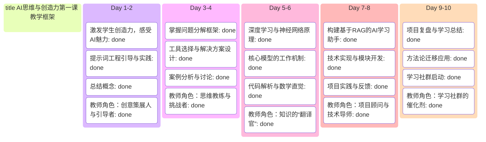

# 《01-大模型基础与AIGC概述》
## 一、课程核心理念与教师使命

本课程的设计区别于传统的技术培训，它更注重思维方式的转变和能力的提升。因此，作为授课教师，我们需要始终坚持以下四大核心理念：

* **能力培养优先于知识传授：** 课程目标不仅仅是教授学生技术知识，更重要的是培养学生的分析能力、学习能力和创造力。我们强调通过培养学生的思维方式和能力，确保其能在未来不断适应新技术的挑战。

* **成果可持续性：** 我们的目标是让每位学生在课程结束时拥有一个长期有价值的成果。例如，通过构建个人AI学习助手，学生能够将10天的学习成果转化为一个长期伴随的智能工具。通过反复迭代，该工具能够不断改进并更好地服务学生的需求。

* **兴趣驱动学习：** 教学过程中，最大程度保护并激发学生的好奇心与创造欲。通过自由的动手创造，使学生的学习动机来自于内在的成就感和兴趣，而非外部压力（如考试和考核）。

* **聚焦核心，少即是多：** 教学要避免面面俱到，而是要聚焦在20%的关键概念和思维方法上，帮助学生深入理解，建立坚实的认知基础。

作为授课教师，我们的角色将从传统的“讲师”转变为“学习教练与引导者”。我们将更多地通过启发性问题、探索式体验、思辨性讨论等方式引导学生，成为他们学习过程中最坚实的支持者。

## 二、核心产出物质量把控与评估标准

课程成功与否，最直接的体现是学生的产出物。我们通过以下两个核心产出物的质量把控来评估学生的学习成果：

###  （一）个人AI学习助手

这是学生技术应用能力的体现，也是课程的长远价值载体。

1. **最低标准：** 每位学生的AI助手应能基于个人知识库，流畅回答与专业课程相关的基本问题。
2. **评估维度：**

  * **功能完整性：** 是否实现了基于RAG的检索问答核心流程。
  * **回答准确性：** 检索和生成内容的准确性，是否有明显的事实错误。
  * **个性化程度：** 知识库是否来源于学生本人学习资料，是否具备个性化特点。
  * **技术实现质量：** 代码结构是否清晰，部署是否顺畅。
* **迭代建议：** 每个小组应提供后续优化方向，如如何引入更优的Embedding模型、扩展知识库、优化检索算法等，确保助手具备可持续发展的潜力。

### （二）方法论与思维框架

这是学生思维跃升的体现，长远来看比有形工具更有价值。

1. **检验标准：** 在案例分析、分组讨论和项目复盘环节，观察学生是否能运用学到的方法论（如问题分解框架）分析新问题并设计合理解决方案。
2. **表达要求：** 鼓励学生用自己的语言和实例复述核心方法论，避免直接照搬课程中的术语。只有学生能用自己的话讲清楚，才表明他们已内化该方法。
3. **应用拓展：** 引导学生思考如何将这套分析问题、学习新知的方法论，应用到其他课程或未来生活、工作场景中。

### （三）分阶段教学重点策略表

| 阶段                                     | 核心重点                    | 具体教学策略                                                                                                               | 教师角色定位        |
| :------------------------------------- | :---------------------- | :------------------------------------------------------------------------------------------------------------------- | :------------ |
| **阶段一 (Day 1-2)** 体验、创造与建立认知        | **守护创造力，而非灌输知识**        | • **营造“创意游乐场”氛围**：对失败或“搞怪”的成果给予正面反馈，建立安全感。 • **让理论从实践中“长”出来**：通过提问引导学生总结出概念。 • **提示词工程定位为“沟通的艺术”**，激发学生的主观能动性。 | **创意策展人与引导者** |
| **阶段二 (Day 3-4)** 掌握问题分解与工具选择方法论    | **聚焦“方法论”本身，而非具体工具的细节** | • **强调“问题分解框架”的通用性和可迁移性**。 • **精选案例教学**，带领学生完整走一遍分析流程，理解其逻辑。 • **在分组实践中扮演“挑战者”**，通过提问质疑，锻炼学生的思辨能力。             | **思维教练与挑战者**  |
| **阶段三 (Day 5-6)** 核心技术深度解析          | **强调“数学直觉”，而非“数学推导”**   | • **善用学生的数学背景**，使用向量空间、点积等概念类比。 • **可视化优先**，多用图表和动画解释复杂概念，避免陷入公式细节。 • **代码解读重在“连接”**，帮助学生找到代码逻辑与数学原理的对应关系。     | **知识的“翻译官”**  |
| **阶段四 (Day 7-8)** 核心项目：构建你的个人AI学习助手 | **关注“项目过程”，而非“最终成果”**   | • **将项目定位为“学习的容器”**，强调从失败和解决问题的过程中学习。 • **提供“脚手架”式支持**，优先提供思路和线索，而非直接给出答案。 • **引导学生记录项目日志**，为最后的复盘环节做准备。       | **项目顾问与技术导师** |
| **阶段五 (Day 9-10)** 反思、迁移与方法论升华      | **引导“自我反思”，将经验升华为个人能力** | • **要求项目复盘聚焦“成长”**，分享挑战、失败和学到的经验。 • **设计引导性问题**，激发学生进行深度思考。 • **成功启动学习社群**，将课程的价值延续到课外。                        | **学习社群的催化剂**  |

## 三、教学指南总结

这份《AI思维与创造力第一课》的教学指南，结合核心理念与产出物标准，旨在为授课教师提供一份明确且可执行的行动手册，帮助他们在课程中引导学生，不仅传授技能，更能激发学生的创新思维和持久的学习动力。

