# 第一天：初识AI大模型与提示词工程

## 前言 人工智能引发的创造力革命

我们正处在一个由人工智能（AI）驱动的深刻变革时代。这场变革最直观的体现，莫过于人工智能生成内容（AIGC, AI-Generated Content）的爆发式涌现。无论是栩栩如生、可与摄影作品媲美的数字图像，还是文笔流畅、逻辑严谨的技术文档，抑或是功能完备、结构清晰的软件代码，AI都展示出了令人惊叹的“创造”能力。

这些AIGC作品的出现，不仅在挑战我们对“创造力”的传统定义，更在重塑各行各业的生产范式。它引发了一系列根本性的探问：机器“创造”的本质是什么？人类的智慧在其中扮演何种角色？以及，个体与组织应如何利用这一新兴力量，放大自身的创造潜能？要理解这场变革的深刻性，我们不能仅将其视为一次单纯的技术升级，而应将其置于人类科技发展的宏大历史坐标中进行审视。已故的著名物理学家张首晟教授曾提出了一个精辟的理论框架，为我们理解技术革命的本质提供了独特的视角。

-----
>理论视角：技术革命的本质
>
>著名科学家张首晟教授认为，每一次推动人类文明发生跃迁的重大技术革命，其本质都可以归结为两个维度的数量级提升：能量密度与信息密度的提升。他甚至提出了一个简洁的公式来描绘这一规律：
>
>**文明的进步∝log(能量密度)+log(信息密度)**
>
>能量密度：指的是单位时间、单位空间或单位质量内，人类能够获取和利用的能量的效率。从薪柴到煤炭，再到石油和核能，每一次能源的革新都极大地解放了人类的体力，拓展了人类活动的物理边界。
>
>信息密度：指的是单位时间、单位空间或单位成本下，人类能够创造、存储、处理和传递的信息的效率。从结绳记事到文字，从印刷术到互联网，每一次信息技术的突破都极大地解放了人类的脑力，加速了知识的积累与传播。
>
>公式中的对数（log）尤为关键，它意味着真正的技术革命并非线性的、渐进的改良，而是数量级（order of magnitude）的、指数级的飞跃。只有当能量或信息的利用效率提升了十倍、百倍乃至更高时，才会引发整个社会结构和生产方式的根本性重构。

依据此理论，我们可以清晰地看到人类历史上的几次重大变革：

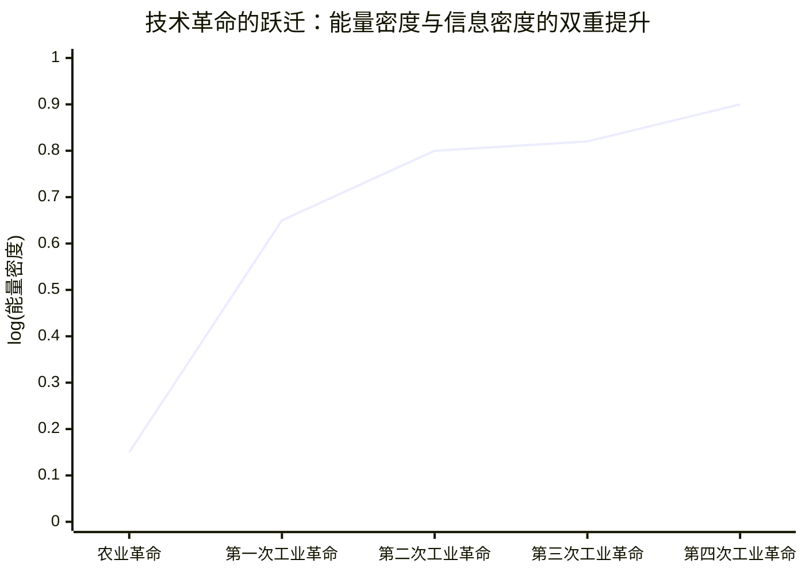
*图：文明跃迁的“能量信息双密度定律”示意图*

- 农业革命：人类学会耕种和驯养，能量来源是低密度的人力和畜力；信息依靠口耳相授和简单的符号，密度极低。
- 第一次工业革命：以蒸汽机为标志，煤炭的利用让能量密度实现了第一次巨大飞跃；而印刷术的普及则缓慢提升了信息的传播效率。
- 第二次工业革命：电力的普及和内燃机的发明，使得能量的利用效率和便捷性再次跃升；电话、电报的发明则革命性地提升了信息的传递速度。
- 第三次工业革命（信息革命）：在能源效率稳步提升的同时，计算机和互联网的出现使信息的创造、存储和处理密度发生了爆炸性的、指数级的增长，彻底改变了全球的经济和生活方式。

那么，我们今天所处的时代又位于何处？AIGC的浪潮，正是一个明确的信号，标志着我们站在了新一轮科技革命的临界点。这一次，变革的驱动力同时作用于能量和信息两个维度：

信息密度的再次爆炸：AIGC（尤其是大模型）从根本上改变了信息的性质。信息不再仅仅是被动地存储和检索，而是可以被主动地理解、综合、推理乃至生成。一个大模型所蕴含的知识，是人类数千年文明信息的压缩和提炼，其输出的一段文字或一张图片，背后是海量数据的计算和模式学习的结果。这使得“有价值信息”的获取密度和生成效率达到了前所未有的高度。

“有效能量密度”的提升：虽然AI本身不是一种新能源，但它作为一种“智力放大器”，正在极大化提升现有能量的利用效率。AI可以优化电网调度，减少能源损耗；可以改进工业流程，降低生产能耗；可以加速新材料的研发，寻找更高效的能源解决方案。这种由“智能”带来的全局效率优化，可视作一种广义上、有效能量密度的飞跃。

因此，AIGC革命并非仅仅是信息维度的单点突破，而是“智能”赋能下，信息与能源效率协同提升的又一次巨大飞跃(通过这个提示词，你将得到一个结构清晰、可以直接打印或导入到笔记软件中的周计划表格，让你的复习安排井井有条。)。我们正处在张首晟教授理论坐标系中一个剧烈向上和向右偏折的临界点上。

## 模块一 人工智能原理黎明——历史、范畴与思想

### 1.1 什么是人工智能 (What is AI?)

“人工智能”这个词汇如今无处不在，但它的确切含义却常常模糊不清。作为一门科学，AI领域本身就存在着对“智能”的不同理解和追求。这些不同的追求，可以被归纳为一个经典的2x2矩阵，由著名AI学者Stuart Russell和Peter Norvig提出，它从两个维度剖析了AI的目标 ¹。

#### 1.1.1 定义AI的四个层次

这两个维度分别是：“是否像人一样（Human-like）” 和 “是否理性（Rational）”；“是关注思考过程（Thinking）” 还是 “关注外部行动（Acting）”。

  * **像人一样思考 (Thinking Humanly)：认知建模方法**
    这个流派的目标是让计算机以人类的方式思考，即构建一个“会思考的机器，拥有完整且字面意义上的心智” 。要实现这一点，我们必须先理解人类是如何思考的。这需要借助心理学实验、内省和脑成像等方法，建立一个精确的人类心智理论，然后用计算机程序来模拟它 。这个方向与认知科学紧密相连。

  * **像人一样行动 (Acting Humanly)：图灵测试方法**
    这个流派的目标是创造出能够执行那些在人类来做时需要智能的功能的机器。它不要求机器的内部思考过程与人一致，只要求其外部行为与人无法区分。这一思想的终极体现就是著名的“图灵测试”。

  * **理性地思考 (Thinking Rationally)：“思维法则”方法**
    这个流派的根源可以追溯到古希腊哲学家亚里士多德，他试图将“正确思考”的过程形式化为无懈可击的推理法则，如三段论。这个方向的目标是构建能够进行逻辑推理、证明定理的系统。这与同学们在离散数学和逻辑学中学到的知识直接相关，即利用形式化逻辑来构建智能。

  * **理性地行动 (Acting Rationally)：理性智能体方法**
    这是现代AI研究的主流范式，也是本课程的核心视角。一个“智能体”(Agent)是指任何能够感知环境并采取行动的事物。而一个“理性智能体”(Rational Agent)则是在给定其知识的情况下，采取行动以期获得最佳结果；或者在存在不确定性时，获得最佳期望结果的智能体。这个定义比“理性思考”更通用，因为在很多情况下，为了生存或达成目标，一个完美的逻辑推断并非必需，有时一个快速的、下意识的反应（即“反射”）才是最理性的行动。

从“像人一样”到“理性地行动”的转变，标志着AI从一门带有哲学思辨色彩的学科，走向了一门更加严谨、可度量的工程科学。因为“理性”提供了一个客观的、可数学化的评判标准——最优性，而“像人”则难以定义和衡量。

**架构图 1.1: AI定义的四种视角**

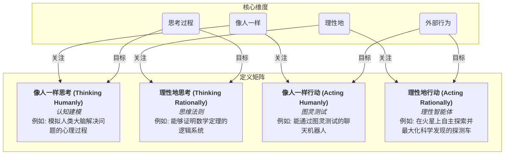
*图：AI定义的四个视角*

#### 1.1.2 强人工智能 vs. 弱人工智能

在探讨AI的目标时，我们还需要区分两个重要的概念，这有助于我们管理对当前技术的期望。

  * **弱人工智能 (Weak AI / Narrow AI)**：这是我们目前所处的技术阶段。弱AI被设计用来执行一个特定的、狭窄的任务。例如，苹果的Siri、特斯拉的自动驾驶系统、Netflix的推荐算法，都属于弱AI。它们可以在自己的领域表现出色，甚至超越人类，但它们不具备真正的意识、自我认知或跨领域的通用智能。
  * **强人工智能 (Strong AI / Artificial General Intelligence, AGI)**：这是一个假设性的、尚未实现的目标。强AI指的是拥有与人类同等智慧，能够理解、学习、适应并解决任何智力任务的机器。它将具备真正的推理、问题解决和创造能力，拥有类人的意识。目前，所有关于强AI的例子都还停留在科幻作品中，如电影《终结者》或《WALL-E》里的机器人。

**图灵测试 (The Turing Test)**

1950年，计算机科学的先驱阿兰·图灵提出了一个思想实验，旨在回答一个深刻的问题：“机器能思考吗？” ¹⁰。为了避开对“思考”一词的哲学争论，图灵将其转化为一个可操作的测试——“模仿游戏” (The Imitation Game) ¹²。

  * **测试设置**: 测试包含三方：一台机器（A）、一个人类（B）和一位人类裁判（C）。裁判与A和B在隔离的情况下通过纯文本进行对话，但不知道哪个是机器，哪个是人。
  * **目标**: 机器的目标是模仿人类的对话，让裁判无法准确分辨出它的机器身份。人类参与者的目标是帮助裁判做出正确判断。
  * **通过标准**: 如果在一定时间的对话后（图灵曾预测到2000年，机器能在5分钟内欺骗裁判的成功率超过30% ），裁判无法可靠地区分机器和人，那么这台机器就通过了图灵测试。

**原理图 : 图灵测试的设置**

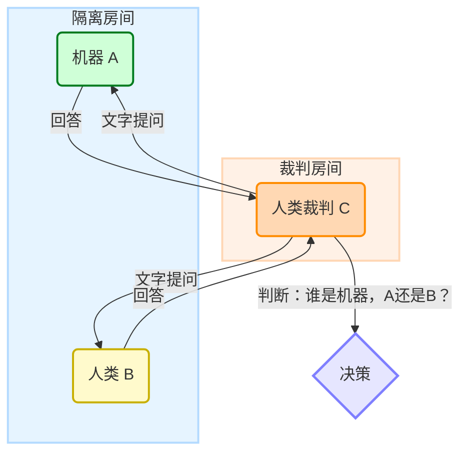

图灵测试的伟大之处在于它的简洁和务实。然而，它也面临着尖锐的批评，最著名的莫过于哲学家约翰·塞尔提出的**中文房间思想实验**。该实验论证，一个系统即使能通过图灵测试，也可能只是在遵循规则、操纵符号，而没有任何真正的“理解”。这揭示了图灵测试的核心局限：它只能衡量行为的相似性，而无法证明内在的理解或意识 ¹⁰。

#### 1.1.2 人工智能简史：从诞生到繁荣

人工智能并非一蹴而就，它的发展充满了波折、争论和突破，宛如一首交响乐，有高昂的乐章，也有沉寂的间奏。

##### 1.1.2.1 黄金时代与达特茅斯会议

AI作为一门正式的学科，诞生于1956年夏天在美国达特茅斯学院举行的一次学术研讨会——达特茅斯夏季人工智能研究项目。这次会议由约翰·麦卡锡、马文·明斯基、纳撒尼尔·罗切斯特和克劳德·香农等先驱组织。

会议的提案中提出了一个影响深远的核心猜想：“学习的每一个方面或智能的任何其他特征，原则上都可以被精确地描述，以至于可以用一台机器来模拟它。” 。这次会议不仅正式命名了“人工智能”这一领域，也开启了AI研究的第一个“黄金时代”，充满了乐观主义精神。

**两种思想的碰撞：符号主义 vs. 连接主义**

在AI的早期发展中，两种截然不同的技术路线和哲学思想展开了激烈的交锋。

  * **符号主义 (Symbolism / GOFAI)**: GOFAI是“Good Old-Fashioned AI”（古早味人工智能）的缩写。这一流派认为，智能的核心是对符号的操作 ¹⁸。人类的思考过程可以被看作是基于逻辑和规则对内部符号表示进行的推理。因此，只要我们将现实世界的知识编码成符号和规则，就能创造出智能。这一思想的典型产物是**专家系统 (Expert Systems)**，它将特定领域专家（如医生、工程师）的知识编码为大量的“如果-那么” (if-then) 规则，从而模拟专家的决策过程 。这种方法与你们熟悉的逻辑学和算法设计思想一脉相承，强调知识的显式表示和逻辑推理。
  * **连接主义 (Connectionism)**: 与符号主义的“自顶向下”不同，连接主义是一种“自底向上”的方法。它的灵感直接来源于生物大脑的结构——由大量简单的神经元相互连接而成的网络。连接主义认为，智能并非源于对符号的逻辑操作，而是从大量简单的、并行处理的单元（人工神经元）的相互作用中**涌现**出来的。知识不是被明确编码的规则，而是**隐式**地存储在神经元之间的连接权重中。这种思想为我们将在第四课中深入探讨的神经网络和深度学习奠定了基础。

这两种思想的对立，本质上是哲学中理性主义与经验主义之争在计算机科学领域的再现。符号主义相信先验的知识和逻辑（理性主义），而连接主义相信从数据和经验中学习（经验主义）。

##### 1.1.2.2 人工智能的冬天 

早期的乐观主义很快遭遇了现实的寒冬。AI的发展史上经历过两次主要的低谷期，被称为“AI冬天” 。

  * **第一次AI冬天 (约1974-1980年)**：主要由几个因素触发。首先，早期的AI项目（如机器翻译）的承诺被严重夸大，但实际成果令人失望。其次，1969年，明斯基和佩珀特的著作《感知机》从数学上证明了单层感知机（一种早期的神经网络）无法解决一些简单问题（如XOR异或问题），这极大地打击了对连接主义的研究热情 ²²。最后，英国政府发布的\*\*《莱特希尔报告》\*\* (Lighthill Report) 对AI研究的价值提出尖锐批评，导致英美等国政府大幅削减科研经费。
  * **第二次AI冬天 (约1987-1993年)**：这次寒冬与专家系统的泡沫破灭有关。80年代，专家系统一度在商业上非常成功，催生了专门用于运行AI程序（特别是LISP语言）的LISP机市场。然而，专家系统维护成本高昂，难以扩展，且无法处理现实世界中的不确定性和模糊性。随着更廉价、更强大的通用工作站（如Sun）的兴起，专门的LISP机市场在1987年迅速崩溃，价值数亿美元的产业在一年内消失殆尽 ²⁵。这导致了又一轮的投资退潮和研究停滞 。

##### 1.1.2.3 机器学习的崛起

经历了两次寒冬后，AI领域逐渐迎来了今天的繁荣。这次浪潮的驱动力不再是单一的理论突破，而是三大支柱的共同崛起：

1.  **海量数据 (Big Data)**：互联网和移动设备的普及产生了前所未有的海量数据，为连接主义方法（特别是深度学习）提供了充足的“燃料”。
2.  **强大算力 (Computational Power)**：图形处理器（GPU）的出现，其并行计算架构恰好非常适合神经网络的运算，极大地加速了模型的训练过程。
3.  **先进算法 (Advanced Algorithms)**：深度学习等算法的成熟，使得从海量数据中自动学习复杂模式成为可能。

这三者的结合，最终将连接主义从边缘推向了AI舞台的中央，引领了我们今天所处的AI时代。

#### 1.1.3 人工智能的技术版图 

今天的AI是一个庞大而交叉的学科领域，包含了众多子领域。我们来描绘一下它的主要版图。

**架构图 1.3: 人工智能的技术版图**

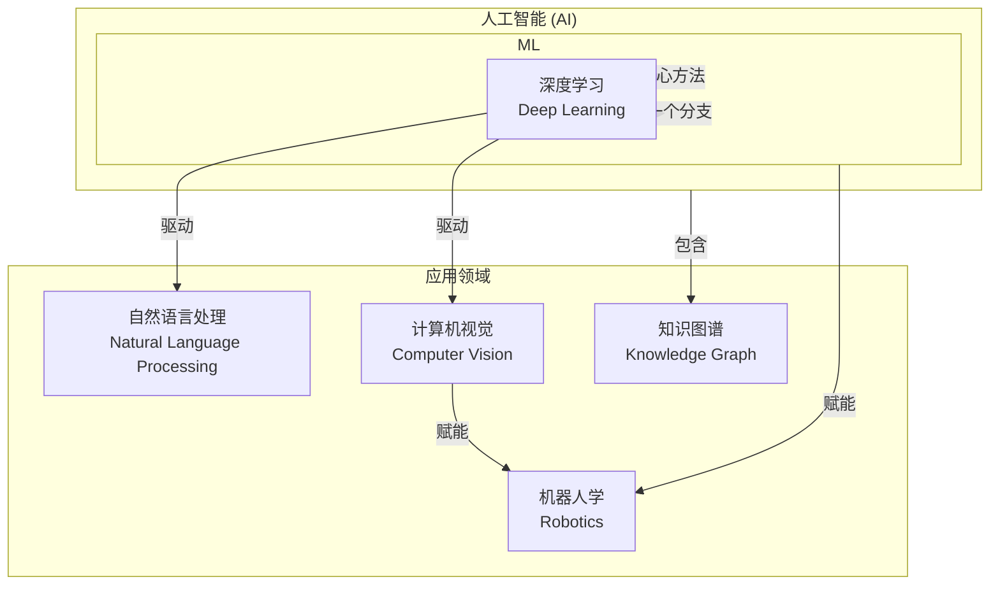
*图：人工智能技术版图示意图*

  * **机器学习 (Machine Learning, ML)**：这是当前实现人工智能最主流、最核心的方法。它的核心思想不是让程序员编写规则，而是让机器从数据中自动学习出模式或规律。可以说，现代AI的绝大部分成就都建立在机器学习之上。它是AI的一个子集。
  * **深度学习 (Deep Learning, DL)**：这是机器学习的一个分支，它使用包含许多层的深度神经网络（因此得名“深度”）。深度学习在处理图像、声音和文本等复杂、高维度数据方面取得了革命性突破。它是机器学习的一个更小的子集。
  * **自然语言处理 (Natural Language Processing, NLP)**：致力于让计算机能够理解、解释和生成人类语言（如中文、英文）。应用包括机器翻译、情感分析、智能问答（如ChatGPT）等。
  * **计算机视觉 (Computer Vision, CV)**：致力于让计算机能够“看懂”和理解图像与视频 。应用包括人脸识别、自动驾驶中的障碍物检测、医学影像分析等。
  * **机器人学 (Robotics)**：这是一个高度交叉的领域，它将AI（特别是CV和ML）与机械工程、电子工程等学科相结合，旨在创造出能够在物理世界中自主行动的机器人。
  * **知识图谱 (Knowledge Graph)**：这是一种源自符号主义思想的技术，它用图的结构来表示现实世界中的实体及其关系，形成一个巨大的知识网络。它常被用来增强机器学习模型，提供结构化的背景知识。

这些领域并非相互独立，而是高度融合。例如，一个先进的机器人系统，必然会用到计算机视觉来感知环境，用到机器学习来做决策，甚至可能用到自然语言处理来与人类交互 ³²。而贯穿这些应用领域的核心技术，正是我们接下来课程的重点——机器学习。

#### 1.1.4 初始的伦理思考 

在我们即将深入学习如何构建AI系统之前，建立负责任的技术价值观至关重要。技术从来不是中立的，它会深刻地影响社会。作为未来的AI工程师和研究者，我们必须从一开始就关注其伦理维度。

  * **算法偏见 (Algorithmic Bias)**：AI系统是从数据中学习的。如果训练数据本身就包含了人类社会中存在的偏见（如性别、种族、地域偏见），那么AI模型不仅会学会这些偏见，甚至可能将其放大 。一个经典的例子是，如果一个招聘AI系统主要用男性员工的历史数据进行训练，它可能会在无意中歧视女性求职者。因此，算法偏见不仅是一个社会问题，更是一个**技术缺陷**，它会导致模型在特定人群上表现不佳，缺乏泛化能力。

  * **数据隐私 (Data Privacy)**：AI系统，特别是深度学习模型，是“数据饥渴”的。它们需要海量数据进行训练。这引发了严重的隐私问题：这些数据从何而来？是否获得了用户的明确同意？数据被如何使用和存储？。一个突出的风险是**数据再利用 (data repurposing)**，即为了一个目的收集的数据（例如，用户上传到社交媒体的照片）在用户不知情的情况下被用于另一个完全不同的目的（例如，训练人脸识别模型）。

我们提出这些问题，不是为了给出最终答案，而是为了在你们心中播下一颗种子。在未来的学习和实践中，请时刻思考：我的技术将如何影响他人？我如何确保我构建的系统是公平、透明和尊重个人权利的？

#### 本节小结

我们定义了AI的四种不同目标，明确了当前AI处于“弱AI”阶段。我们回顾了AI从达特茅斯会议的诞生，经历符号主义与连接主义的争论和两次“AI冬天”，最终在数据、算力和算法的共同推动下迎来机器学习的浪潮。我们还描绘了AI的主要技术版图，并强调了机器学习的核心地位。最后，我们进行了初步的伦理反思。下一节课，我们将回到AI的“古典时代”，深入探索与你们的算法和数据结构知识紧密相关的符号主义AI——搜索、推理与博弈。

-----

### 1.2 经典AI的智慧——搜索、推理与博弈

上一节课我们鸟瞰了AI的全景，接下来我们将深入AI的第一个重要思想流派——符号主义AI。这个流派的核心理念是将智能问题转化为符号操作和搜索问题，它与大家在计算机科学课程中学到的数据结构和算法有着密不可分的联系。通过本节课，你将看到熟悉的图遍历算法如何成为AI解决问题的基石。

#### 1.2.1 问题求解即搜索 （Problem Solving as Search）

经典AI的一个核心洞见是：任何问题求解的过程，都可以被抽象为在一个巨大的可能性空间中寻找一个解决方案的过程。这个可能性空间，我们称之为**状态空间 (State Space)**。

##### 1.2.1.1 状态空间的形式化

将一个问题形式化为状态空间搜索，是我们用计算机解决问题的关键一步。一个状态空间可以被看作一个图 (Graph)，其中：

  * **节点 (Nodes)**：代表问题在某个时刻的一个状态 (State)。一个状态是描述世界某一特定构型所需要的所有信息的集合。
  * **边 (Edges)**：代表从一个状态到另一个状态的行动 (Action) 或 转移 (Transition) 。
  * **初始状态 (Initial State)**：问题的起点 。
  * **目标状态 (Goal State)**：我们希望达到的最终状态。可能有一个或多个目标状态 。
  * **路径 (Path)**：从初始状态到目标状态的一系列行动序列。
  * **解 (Solution)**：一条从初始状态到目标状态的路径。
  * **路径成本 (Path Cost)**：一条路径上所有行动成本的总和。我们的目标通常是找到**最优解 (Optimal Solution)**，即成本最低的解 。

这种抽象方法非常强大。无论是机器人导航、解谜游戏，还是物流规划，都可以被建模为在状态空间图中寻找一条路径的问题。

**案例：8-谜题 (8-Puzzle)**

我们将以经典的8-谜题问题作为贯穿本节课的例子。这是一个3x3的网格，里面有8个带编号的滑块和1个空格。目标是通过滑动滑块，将初始的混乱布局恢复到有序的最终布局 。

  * **状态**: 网格中8个滑块和1个空格的任意一种排列方式 。
  * **初始状态**: 一个随机打乱的布局。
  * **目标状态**: 滑块从1到8按顺序排列，空格在右下角。
  * **行动**: 将与空格相邻的滑块移动到空格位置。这等价于将空格向“上、下、左、右”四个方向移动。
  * **路径成本**: 每移动一次滑块，成本计为1。最优解就是移动次数最少的解。

**原理图: 8-谜题的部分状态空间图**
这个图展示了从一个初始状态出发，通过一次行动（移动空格）可以到达的几个后继状态。整个8-谜题的状态空间包含了所有可能的 $9\!/2 = 181,440$ 个可达状态。

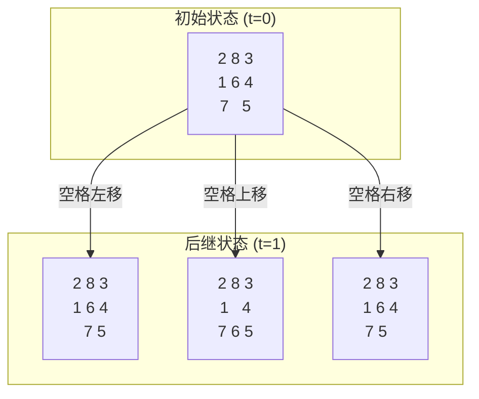
*图：8-谜题的部分状态空间图示意图*

##### 1.2.1.2 数据结构的关联

大家应该已经看出来了，状态空间搜索本质上就是一个图的遍历问题 。我们在一个（通常是隐式的、巨大的）图中，寻找从起始节点到目标节点的路径。因此，你们在数据结构课程中学到的图遍历算法，如广度优先搜索 (BFS) 和深度优先搜索 (DFS)，直接构成了AI问题求解的基础。

#### 1.2.2 搜索算法 （Search Algorithms）

搜索算法可以分为两大类：**无信息搜索**和**有信息搜索**。它们的区别在于，是否利用了关于目标位置的额外信息来指导搜索。

##### 1.2.2.1 无信息搜索 （Uninformed Search）

无信息搜索，也称为**盲目搜索 (Blind Search)**，因为它们除了问题定义本身，对目标在哪里一无所知。它们只是系统性地探索状态空间 ³⁹。

  * **广度优先搜索 (Breadth-First Search, BFS)**

      * **策略**: BFS采用“层层推进”的策略，它首先探索所有离初始状态距离为1的节点，然后是距离为2的节点，以此类推，直到找到目标 ⁴⁶。
      * **实现**: 使用一个**队列 (Queue)** 数据结构，遵循“先进先出” (FIFO) 原则 ⁴⁸。
      * **性质分析**:
          * **完备性 (Completeness)**: **是**。只要存在解，BFS一定能找到它 ⁵⁰。
          * **最优性 (Optimality)**: **是** (当每一步的成本都相同时)。因为它总是先找到深度最浅的目标节点，所以能保证找到路径最短的解 ⁴⁷。
          * **时间复杂度**: $O(b^d)$，其中 $b$ 是分支因子（每个节点平均的后继节点数），$d$ 是最浅目标解的深度 ⁴⁶。
          * **空间复杂度**: $O(b^d)$。这是BFS的主要缺点，它需要存储整个前沿（frontier）的所有节点，内存消耗巨大 ⁴⁶。

  * **深度优先搜索 (Depth-First Search, DFS)**

      * **策略**: DFS采用“一条路走到黑”的策略，它沿着一条路径不断深入，直到到达一个末端节点（无后继节点或已访问），然后回溯到上一个节点，探索另一条路径 ⁴⁶。
      * **实现**: 使用一个**栈 (Stack)** 数据结构，遵循“后进先出” (LIFO) 原则，或者通过递归函数自然实现 ⁴⁸。
      * **性质分析**:
          * **完备性**: **否** (在无限深度的图中)。如果图中存在无限长的路径或循环，DFS可能会陷入其中，永远找不到解 ⁴⁹。
          * **最优性**: **否**。DFS找到的第一个解不保证是路径最短的解 ⁵⁰。
          * **时间复杂度**: $O(b^m)$，其中 $m$ 是状态空间的最大深度。在最坏情况下，它可能探索整个树 ⁴⁶。
          * **空间复杂度**: $O(bm)$。这是DFS的主要优点，它只需要存储当前探索路径上的节点，内存效率远高于BFS ⁴⁶。

**表格 2.1: 无信息搜索算法对比**

| 特性 | 广度优先搜索 (BFS) | 深度优先搜索 (DFS) |
| :--- | :--- | :--- |
| **数据结构** | 队列 (Queue, FIFO) | 栈 (Stack, LIFO) 或递归 |
| **完备性** | 是 | 否 (在有环或无限深度的图中) |
| **最优性** | 是 (当路径成本一致时) | 否 |
| **时间复杂度** | $O(b^d)$ | $O(b^m)$ |
| **空间复杂度** | $O(b^d)$ (非常高) | $O(bm)$ (非常低) |
*注: b 为分支因子, d 为最浅解的深度, m 为最大深度。资料来源: ⁴⁶*

##### 1.2.2.2 有信息搜索 （Informed Search）

盲目搜索在状态空间很大时效率极低。有信息搜索通过引入额外知识来“智能地”指导搜索方向，从而大幅提升效率。

  * **启发式函数 (Heuristic Function)**
    这是有信息搜索的核心。启发式函数 $h(n)$ 是一个对从当前节点 $n$ 到达目标节点所需成本的**估计** ⁵³。这个估计值不需要完全准确，但一个好的启发式函数应该能提供有用的指引。

      * 对于8-谜题，常见的启发式函数有：
          * **错位瓦片数 (Misplaced Tiles)**: 计算当前状态下，有多少个滑块不在其目标位置。
          * **曼哈顿距离 (Manhattan Distance)**: 计算每个滑块当前位置到其目标位置的水平和垂直距离之和 ⁵⁵。曼哈顿距离是比错位瓦片数更好的启发式，因为它提供了更精确的成本估计。

  * **贪婪最佳优先搜索 (Greedy Best-First Search)**

      * **策略**: 该算法在每一步都选择启发式函数值 $h(n)$ 最小的节点进行扩展 ⁵⁴。它“贪婪地”认为离目标最近的节点就是最佳选择。
      * **性质**: 速度快，但因为它完全忽略了已经走过的路径成本 $g(n)$，所以它既不完备也不保证最优。它可能会被一个看似接近目标但实际路径成本很高的选择所迷惑。

  * **AI算法**
    A\* 算法是经典AI搜索算法的巅峰之作，它完美地结合了BFS/Dijkstra算法的严谨性和贪婪最佳优先搜索的高效性。

      * **核心公式**: A\* 算法通过一个评估函数 $f(n)$ 来选择下一个要扩展的节点：
        $$f(n) = g(n) + h(n)$$
        其中 ⁵³：
          * $g(n)$: 从初始节点到当前节点 $n$ 的**实际路径成本**。这代表了我们已经付出的“过去”的代价。
          * $h(n)$: 从当前节点 $n$ 到目标节点的**估计成本**（启发式函数）。这代表了我们对“未来”代价的猜测。
          * $f(n)$: 通过节点 $n$ 的估计总成本。
      * **工作原理**: A\* 维护一个优先队列（通常是最小堆），每次都从中取出 $f(n)$ 值最小的节点进行扩展 ⁵³。它在Dijkstra算法（只考虑 $g(n)$）的可靠性和贪婪算法（只考虑 $h(n)$）的方向感之间取得了精妙的平衡。$g(n)$ 部分确保算法不会偏离起点太远去追求一个看似美好的目标（防止“舍近求远”），而 $h(n)$ 部分则赋予算法一种“目的性”，使其优先探索朝向目标的方向。
      * **最优性条件**: A\* 算法有一个非常重要的特性：如果它的启发式函数 $h(n)$ 是**可采纳的 (admissible)**，即 $h(n)$ 从不 **overestimate (高估)** 从 $n$ 到目标的真实成本，那么A\*算法保证找到最优解（成本最低的路径）⁵³。曼哈顿距离对于8-谜题就是一个可采纳的启发式，因为每次移动只能使一个滑块离它的目标位置近一步，所以总的曼哈顿距离永远不会高于实际需要的移动步数。

**原理图: AI算法的核心思想**
在一个网格寻路问题中，AI算法评估节点N的价值，不仅考虑从起点S到N的已知成本 $g(N)$，还估算了从N到终点G的未来成本 $h(N)$。

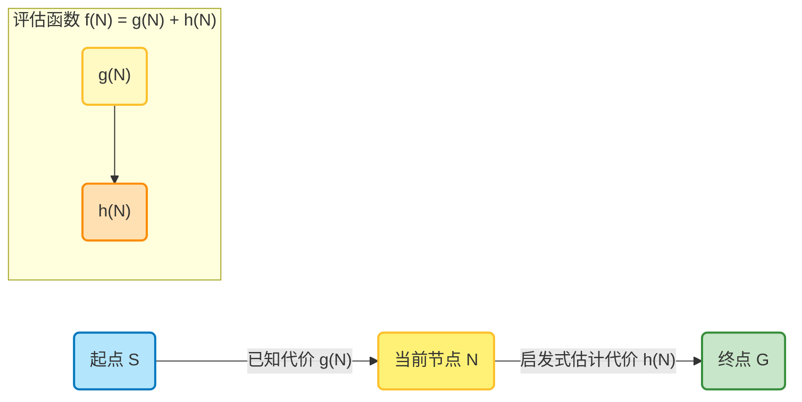
*图：算法的核心思考示意图*

#### 1.2.3 对抗性搜索与博弈 （Adversarial Search）

前面的搜索问题都只有一个参与者。但很多有趣的问题，如棋类游戏，都涉及对抗性的环境，即存在一个试图让你的目标无法达成的对手。这类问题需要用到博弈论的思想。

我们主要关注双人、零和、信息完备的游戏，如井字棋 (Tic-Tac-Toe)、象棋等。在这类游戏中，一个玩家的收益就是另一个玩家的损失。

##### 1.2.3.1 Minimax算法 （极大极小值算法）

Minimax是解决这类问题的基本算法。它的核心思想是：选择一个能让你在对手做出最佳应对后，依然能获得最大收益的走法。

  * **游戏树 (Game Tree)**: 算法通过构建一个游戏树来探索所有可能的走法。树的根节点是当前游戏状态，每个节点的子节点是执行一步合法走棋后的状态 ⁵⁹。
  * **MAX层和MIN层**: 树的层级交替代表不同玩家的回合。我们的回合是MAX层，我们希望最大化我们的得分。对手的回合是MIN层，他会选择让我们得分最小的走法 ⁶⁰。
  * **效用函数 (Utility Function)**: 在树的叶子节点（即游戏结束的状态），我们用一个效用函数来评估最终得分。例如，在井字棋中，赢=+1，输=-1，平局=0 ⁵⁹。
  * **递归回溯**: 算法从叶子节点开始，将效用值逐层向上“回溯”。在MIN层，节点的值是其所有子节点中的最小值。在MAX层，节点的值是其所有子节点中的最大值。最终，根节点的值就是当前状态下，双方都采取最优策略时的预期结果，而通向这个结果的第一步就是我们的最佳走法。

**原理图 2.3: Minimax算法在井字棋中的应用示例**
假设轮到MAX（X）走棋。游戏树向下展开两层，显示了X的一种走法以及O的所有可能应对。叶子节点的值是最终的游戏结果。通过向上回溯（MIN层取最小值，MAX层取最大值），MAX可以计算出走中间这一步的最终价值是-1。

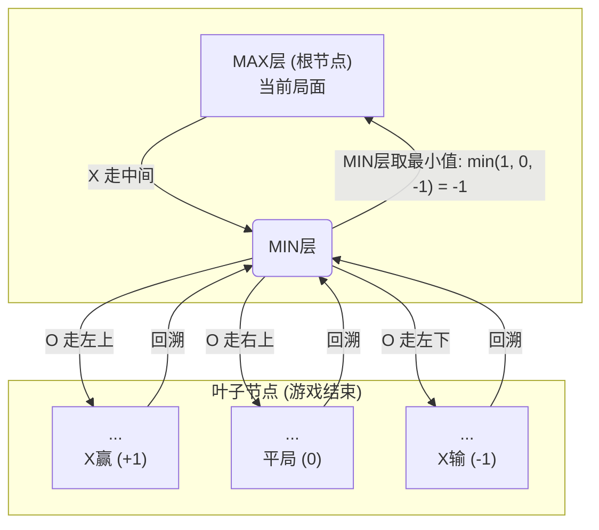

*(注：这是一个简化的示意图，用于说明MAX/MIN层的回溯原理)*

##### 1.2.3.2 Alpha-Beta剪枝 （Alpha-Beta Pruning）

Minimax算法需要遍历整个游戏树，对于象棋这样复杂的棋类，其状态空间是天文数字，完全不可行。Alpha-Beta剪枝是Minimax算法的一个极其重要的优化，它可以在不影响最终决策的情况下，安全地“剪掉”游戏树中大量无需探索的分支。

  * **核心思想**：如果我们已经发现了一条路径，可以保证我们（MAX玩家）至少能得到一个分数 α。在探索另一条路径时，如果我们发现对手（MIN玩家）有一个回应，能将我们的分数压低到 β，且 β≤α，那么我们就没有必要再继续探索这条路径了。因为理性的对手绝不会让我们走第一条更好的路，而会选择这条路把我们的收益限制在 β。既然 β 不比我们已知的最好选择 α 更优，这条路就可以被安全地剪枝 。
  * **Alpha (α)**：MAX玩家在当前搜索路径上，目前为止可以确保获得的最低分数。初始值为 −∞。
  * **Beta (β)**：MIN玩家在当前搜索路径上，目前为止可以确保获得的最高分数（即让MAX得分不超过这个值）。初始值为 +∞。
  * **剪枝条件**:
      * 在任意一个MIN节点，如果其评估值 ≤α，则可以停止评估该MIN节点的其他子节点（Beta剪枝）。
	  * 在任意一个MAX节点，如果其评估值 ≥β，则可以停止评估该MAX节点的其他子节点（Alpha剪枝）。
	  * 综合起来，剪枝的核心条件是：α≥β 。

Alpha-Beta剪枝的效率极高，在理想情况下（最佳走法被优先搜索），它可以将搜索的节点数从 $O(b^d)$ 减少到大约 $O(b^{d/2})$，相当于将搜索深度加倍 ⁶²。

**原理图: Alpha-Beta剪枝过程示意图**

此图展示了剪枝的发生过程。当搜索到节点C时，其子节点评估值为3和5。B作为MIN节点，其值至少为3。当搜索到节点D时，其第一个子节点评估值为2。此时，MAX玩家在A处已知有一个值为3的选项（通过B），而通过C这条路，MIN玩家（D）可以确保MAX玩家的得分最多为2。因为2<3，MAX玩家绝不会选择C这条路，因此D的另一个子节点（值为1）无需再被探索，该分支被剪枝。

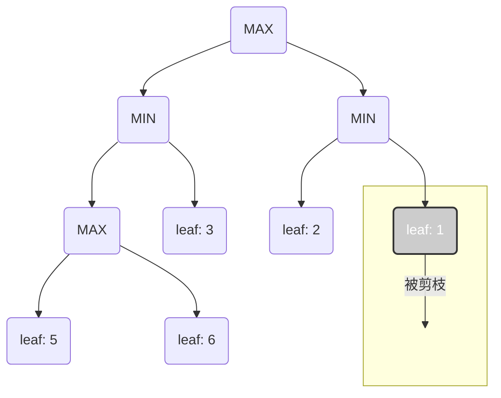

*（注：这是一个概念示意图，实际的α, β值会逐层传递和更新）*

#### 本节小结

我们深入探讨了经典AI的核心——将问题形式化为状态空间图，并使用系统性的搜索算法求解。我们学习了无信息搜索（BFS, DFS）和有信息搜索（A\*），并分析了它们的特性。最后，我们进入了博弈论的世界，学习了Minimax算法如何在对抗环境中做出最优决策，以及Alpha-Beta剪枝如何极大地优化这一过程。这些基于符号和逻辑的算法，构成了AI的“古典智慧”。下一节课，我们将进入现代AI的核心，学习一种全新的范式——机器学习，即如何让机器不再依赖我们编写的规则，而是直接从数据中学习。

-----

### 1.3 机器学习基石——从数据中学习的范式

在前两节课中，我们探索了AI的历史和经典的问题求解方法，如AI搜索和Minimax。这些方法都属于符号主义AI，其核心是人类为机器定义明确的规则和逻辑。今天，我们将迎来一个根本性的范式转变：从“教”计算机规则，到“让”计算机自己从数据中学习规则。这就是**机器学习 (Machine Learning, ML)**，现代AI的基石和引擎。

#### 1.3.1 机器学习新范式

##### 1.3.1.1 核心思想

传统编程的模式是：我们（程序员）分析一个问题，设计出解决问题的规则（算法），然后将这些规则用代码实现，输入数据，程序输出结果。

> **传统编程**: `数据` + `程序 (规则)` -\> `输出`

机器学习则颠覆了这个流程。我们不再手动编写复杂的规则，而是向机器提供大量的数据和对应的期望输出，让机器自动地、统计地学习出输入和输出之间的映射关系，这个映射关系就是我们所说的**模型 (Model)**。

> **机器学习**: `数据` + `输出` -\> `程序 (模型)`

这个模型，本质上可以看作一个函数 $f(x)$。机器学习的目标就是找到一个最优的函数 $f$，当输入新的、未见过的数据 $x$ 时，它能给出尽可能准确的预测 ²⁷。例如，我们不需要写上万条规则来识别猫，而是给机器看成千上万张猫的图片，让它自己学会“猫”这个概念。

##### 1.3.1.2 基本术语

在进入具体的算法之前，我们需要掌握一些机器学习的基本词汇：

  * **样本 (Sample)**: 数据集中的一个独立单元，通常是一条记录。例如，一个病人的体检记录，一封电子邮件，一张图片。
  * **特征 (Features)**: 描述一个样本的属性或变量，通常表示为一个向量 $\\mathbf{x}$。例如，对于房价预测，特征可以是房屋面积、卧室数量、地理位置等。对于图像，特征可以是每个像素的灰度值。
  * **标签 (Label)**: 我们希望模型预测的目标值，通常表示为 $y$。例如，房价预测中的具体价格，或一封邮件是否为“垃圾邮件”。
  * **训练集 (Training Set)**: 用于“教”模型学习的数据集。模型通过分析训练集中的特征和标签，来调整内部参数，学习它们之间的关系。
  * **测试集 (Test Set)**: 用于评估模型性能的数据集。这部分数据**绝对不能**在训练过程中被模型看到。我们用它来模拟模型在真实世界中遇到新数据时的表现，检验其**泛化能力 (Generalization)**。

#### 1.3.2 监督学习 （Supervised Learning）

监督学习是目前应用最广泛的机器学习范式。它的特点是训练数据中既有特征 (x)，也有与之对应的正确标签 (y)。就像学生做带答案的练习题一样，模型每次做出预测后，都可以通过比对正确答案来调整自己。监督学习主要分为两大类：回归和分类。

**回归 (Regression): 预测连续值**

当我们的目标标签 $y$ 是一个连续的数值时，这个问题就是回归问题。

  * **案例**: 房价预测。输入特征是房屋面积、房间数、地段等，输出标签是房屋价格（一个连续的美元或人民币数值）。

  * **核心模型：线性回归 (Linear Regression)**
    这是最简单也最基础的回归模型。它假设输出 $y$ 和输入特征 $\\mathbf{x} = (x\_1, x\_2, ..., x\_d)$ 之间存在一个线性关系。对于多维特征，模型可以表示为：
    $$y = w_1x_1 + w_2x_2 + \dots + w_dx_d + b$$
    这可以非常自然地用你们在线性代数中学到的向量运算来表示。令权重向量 $\\mathbf{w} = [w\_1, w\_2, \\dots, w\_d]^T$ 和特征向量 $\\mathbf{x} = [x\_1, x\_2, \\dots, x\_d]^T$，则模型可以简洁地写成：
    $$y = \mathbf{w}^T\mathbf{x} + b$$
    其中，$\\mathbf{w}$ 是**权重 (weights)**，代表了每个特征的重要性；$b$ 是**偏置 (bias)** 或截距项 ⁶⁶。学习的过程，就是找到最优的 $\\mathbf{w}$ 和 $b$，使得模型预测出的直线（或高维超平面）能最好地拟合训练数据点。

  * **核心概念：损失函数 (Loss Function)**
    我们如何衡量一个模型“好”还是“不好”？通过损失函数（或成本函数）。损失函数用于计算模型的预测值 $y\_{pred}$ 与真实标签 $y\_{true}$ 之间的差距。对于线性回归，最常用的损失函数是**均方误差 (Mean Squared Error, MSE)** ⁶⁶。
    对于单个样本，其平方误差为 $(y\_{pred} - y\_{true})^2$。对于整个训练集（包含 $N$ 个样本），MSE是所有样本平方误差的平均值：
    $$J(\mathbf{w}, b) = \frac{1}{N} \sum_{i=1}^{N} (y_{pred}^{(i)} - y_{true}^{(i)})^2 = \frac{1}{N} \sum_{i=1}^{N} ((\mathbf{w}^T\mathbf{x}^{(i)} + b) - y_{true}^{(i)})^2$$
    机器学习的训练过程，就是一个**优化**过程：寻找能使损失函数 $J(\\mathbf{w}, b)$ 最小化的参数 $\\mathbf{w}$ 和 $b$ ⁶⁶。我们将在下一课详细讲解如何进行这个优化。

**原理图: 线性回归与均方误差**
此图展示了一个简单的线性回归模型。蓝点是数据样本。红线是模型 $y=wx+b$。虚线表示每个点的残差 (residual)，即预测值与真实值之差。MSE就是所有这些残差平方和的平均值。模型的目标是调整红线的位置和斜率，以最小化这些虚线的总平方长度。

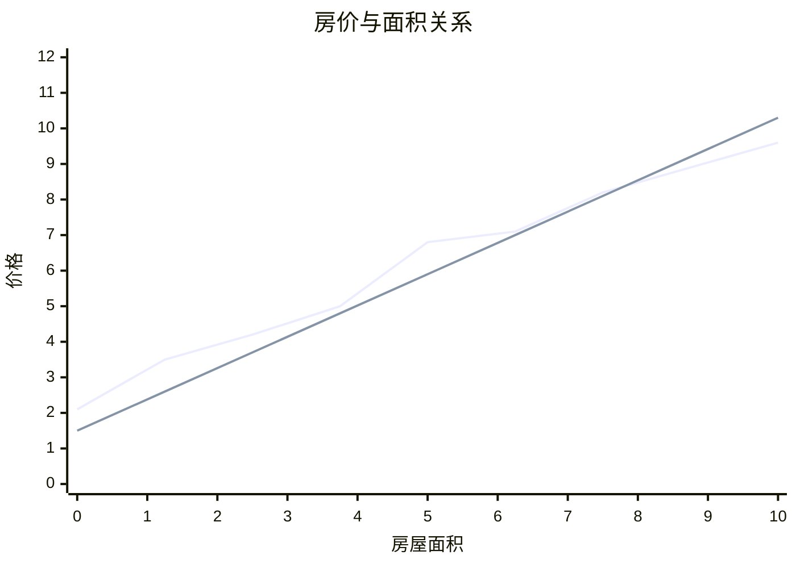

*(注：这是一个示意图，残差线连接了数据点和回归线上的预测点)*

**分类 (Classification): 预测离散类别**

当我们的目标标签 $y$ 是一个离散的类别时，这个问题就是分类问题。

  * **案例**: 垃圾邮件识别。输入特征可以是邮件的文本内容、发件人等，输出标签是两个类别之一：“垃圾邮件”或“非垃圾邮件”（即二元分类）。

  * **核心模型 1: k-近邻算法 (k-Nearest Neighbors, k-NN)**
    k-NN是一个思想极其简单直观的分类算法 ⁷⁰。它的核心思想是“物以类聚”。

      * **工作原理**: 当需要预测一个新样本的类别时，k-NN会：
        1.  计算新样本与训练集中所有样本的距离（常用欧氏距离）。
        2.  找出与新样本距离最近的 $k$ 个邻居。
        3.  在这 $k$ 个邻居中进行“投票”，将得票最多的类别作为新样本的预测类别 ⁷⁰。
      * **超参数 $k$**: $k$ 的选择非常关键。如果 $k$ 太小（如 $k=1$），模型会非常容易受到噪声数据的影响，导致决策边界非常复杂和不规则（高方差）。如果 $k$ 太大，模型会过于平滑，可能会忽略掉一些局部的数据结构（高偏差）⁷¹。通常 $k$ 会选择一个奇数来避免投票平局 ⁷⁰。

  * **核心模型 2: 逻辑回归 (Logistic Regression)**
    这是一个名字里带“回归”但实际上是用于**分类**的经典算法 ⁷³。它巧妙地解决了如何将线性回归的连续输出值转化为一个分类概率的问题。

      * **核心思想**: 逻辑回归首先像线性回归一样，计算出一个线性的输出 $z = \\mathbf{w}^T\\mathbf{x} + b$。这个 $z$ 的取值范围是 $(-\\infty, +\\infty)$，无法直接表示概率。
      * **Sigmoid函数**: 接着，逻辑回归使用一个称为Sigmoid（或Logistic）的激活函数，将 $z$ 值“压扁”到 $(0, 1)$ 的区间内 ⁷³。Sigmoid函数的公式为：
        $$\sigma(z) = \frac{1}{1 + e^{-z}}$$
        这个函数的输出值 $\\sigma(z)$ 就可以被解释为样本属于正类（类别1）的概率 ⁷⁴。例如，如果输出是0.9，则模型预测该样本有90%的概率属于类别1。
      * **决策边界**: 通常我们会设定一个阈值（如0.5），如果 $\\sigma(z) \\ge 0.5$，则判定为类别1；否则判定为类别0 ⁷³。这与你们在概率论中学到的知识紧密相连，即将模型的输出与概率论框架结合起来。

#### **3.3 无监督学习 (Unsupervised Learning)**

与监督学习不同，无监督学习的训练数据只有特征 ($\\mathbf{x}$)，**没有标签** ($y$)。它的目标不是预测一个已知的值，而是在数据中发现隐藏的结构、模式或分组。

  * **核心思想**: 想象一下给你一堆混杂的袜子，让你把它们配对。你不需要事先知道“什么是正确的配对”，你只需要根据袜子的颜色、大小、纹理等特征，把相似的袜子放在一起。这就是无监督学习。

  * **案例**: 用户分群 (Customer Segmentation)。一家电商公司拥有大量用户的购买记录，但并不知道这些用户可以分为哪些群体。通过无监督学习，可以自动地将用户划分为“高价值客户”、“价格敏感型客户”、“新用户”等不同的群体，从而进行精准营销。

  * **核心模型：k-均值聚类 (k-Means Clustering)**
    k-Means是应用最广泛的聚类算法之一，它的目标是将数据划分为 $k$ 个簇 (cluster)，使得同一个簇内的数据点尽可能相似，而不同簇之间的数据点尽可能不同 ⁷⁶。

      * **算法流程**: k-Means是一个迭代算法 ⁷⁶。
        1.  **初始化**: 随机选择 $k$ 个数据点作为初始的**簇中心 (Centroids)**。
        2.  **分配步骤 (Assignment Step)**: 对于每一个数据点，计算它到 $k$ 个簇中心的距离，并将其分配给距离最近的那个簇。
        3.  **更新步骤 (Update Step)**: 对于每一个簇，重新计算其所有成员数据点的均值，并将这个均值点作为新的簇中心。
        4.  **重复**: 重复步骤2和3，直到簇中心不再发生显著变化（或达到最大迭代次数），算法收敛。

#### 1.3.4 模型的评估与挑战

训练出一个模型只是第一步，更重要的是评估它的好坏，并理解它面临的核心挑战。

##### 1.3.4.1 过拟合 (Overfitting) 与 欠拟合 (Underfitting)

这是机器学习中最核心、最普遍的挑战之一。

  * **欠拟合 (Underfitting)**: 模型过于简单，没有充分学习到训练数据中的潜在规律。表现为模型在**训练集和测试集上表现都很差** ⁷⁹。这通常是因为模型容量不足（例如，用一条直线去拟合抛物线形的数据）。
  * **过拟合 (Overfitting)**: 模型过于复杂，把训练数据中的噪声和偶然性也当作规律学了进去。表现为模型在**训练集上表现极好，但在未见过的测试集上表现很差** ⁷⁹。这说明模型的泛化能力很差，它只是“背诵”了训练数据，而不是真正“理解”了规律。

##### 1.3.4.2 偏差-方差权衡 (Bias-Variance Tradeoff)

这个重要的理论概念为我们理解过拟合与欠拟合提供了数学视角 ⁸¹。一个模型的泛化误差可以被分解为三个部分：偏差、方差和不可约误差。

  * **偏差 (Bias)**: 指的是模型的平均预测值与真实值之间的差距。高偏差意味着模型的基础假设与数据的真实规律不符，导致系统性的错误。**高偏差对应着欠拟合** ⁸¹。
  * **方差 (Variance)**: 指的是当使用不同训练数据时，模型预测结果的变动或散布程度。高方差意味着模型对训练数据中的微小波动过于敏感，导致模型不稳定。**高方差对应着过拟合** ⁸¹。

模型复杂度的选择，本质上就是在偏差和方差之间做出权衡：

  * 一个**简单**的模型（如低次多项式回归）**偏差高、方差低**。它对数据不敏感，但可能无法捕捉复杂关系。
  * 一个**复杂**的模型（如高次多项式回归）**偏差低、方差高**。它可以拟合复杂的数据，但也容易被噪声带偏。

我们的目标是找到一个模型复杂度的“甜点”，使得总误差（偏差的平方 + 方差）最小。

#### 本节总结

我们学习了机器学习这一全新的、由数据驱动的AI范式。我们区分了监督学习（回归与分类）和无监督学习（聚类），并掌握了几个核心的入门算法：线性回归、k-NN、逻辑回归和k-Means。最重要的是，我们理解了评估模型性能的关键挑战——过拟合与欠拟合，以及其背后的深刻理论——偏差-方差权衡。至此，我们已经掌握了构建现代AI应用的基础工具。下一节课，我们将推开一扇更令人兴奋的大门——深度学习，看看如何通过构建更深、更复杂的模型，来解决传统机器学习的瓶颈，实现更强大的智能。

-----

### 1.4 深入学习之门——神经网络与深度学习

在前三节课中，我们走过了AI的漫长历史，掌握了经典搜索算法的智慧，并奠定了机器学习的基础。今天，我们将踏入当前AI领域最激动人心、最强大的前沿——**深度学习 (Deep Learning)**。深度学习不仅是机器学习的一个分支，它更是一种实现了过去许多AI梦想的强大范式。本节课将建立在上一节课的基础上，并与大家的微积分知识紧密结合。

#### 1.4.1 从机器学习到深度学习

##### 1.4.1.1 传统机器学习的局限：特征工程 （Feature Engineering）

在上一节课，我们学习了线性回归、k-NN等模型。这些模型虽然有效，但它们都有一个共同的前提：需要我们人类专家为它们提供高质量的特征。例如，在房价预测中，我们需要手动决定哪些特征（面积、卧室数、学区、楼层）是重要的。在图像识别中，传统方法需要我们设计复杂的特征提取器（如边缘检测器、角点检测器）来将原始像素转化为有意义的特征。

这个手动设计和提取特征的过程，被称为**特征工程 (Feature Engineering)** ⁸³。特征工程是传统机器学习流程中**最耗时、最复杂、也最依赖领域知识**的环节。一个项目的成败，往往不取决于模型的选择，而取决于特征工程的质量。这个过程存在巨大瓶颈：

  * **人力成本高**：需要大量专家经验和反复试验。
  * **表达能力有限**：手工设计的特征很难捕捉到现实世界中极其复杂和微妙的模式（比如，如何用手工特征来定义一只“可爱”的猫？）。

##### 1.4.1.2 深度学习的承诺：端到端学习 （End-to-End Learning）

深度学习的出现，正是为了解决特征工程的瓶颈。它的核心承诺是实现**端到端”学习**。这意味着，我们不再需要手动设计特征提取器，而是将**原始数据**（如一张完整的图片、一段原始的语音波形）直接输入到一个足够深、足够复杂的模型中，让模型**自动地学习出从低级到高级的层次化特征**。

例如，在图像识别任务中，一个深度神经网络的第一层可能学会识别简单的边缘和颜色块；中间的层级可能学会将这些低级特征组合成更复杂的纹理、形状（如眼睛、鼻子）；更高层则可能学会将这些部件组合成完整的物体（如人脸、猫脸）。这种自动的、层次化的特征学习能力，是深度学习力量的源泉。

#### 1.4.2 神经网络的基石

深度学习的核心是**人工神经网络 (Artificial Neural Networks, ANN)**。它的灵感来源于生物大脑，但其数学模型则非常清晰。

##### 1.4.2.1 从生物神经元到感知机 （Perceptron）

  * **生物神经元**: 我们的大脑由数十亿个称为神经元的细胞组成。每个神经元通过**树突 (Dendrites)** 接收来自其他神经元的信号，在**细胞体 (Soma)** 中进行处理，如果信号强度超过某个阈值，它就会通过**轴突 (Axon)** 发出一个电信号（“放电”）给其他神经元 ⁸⁴。
  * **感知机 (Perceptron)**: 感知机是神经网络最基本的单元，它是对生物神经元的一个极简数学模拟 ⁸⁴。一个感知机的工作流程如下：
    1.  接收一组输入信号 $x\_1, x\_2, \\dots, x\_d$。
    2.  每个输入信号都乘以一个对应的权重 $w\_1, w\_2, \\dots, w\_d$，权重代表了这个输入的重要性。
    3.  将所有加权后的输入求和，并加上一个偏置项 $b$。得到 $z = (\\sum\_{i=1}^{d} w\_ix\_i) + b = \\mathbf{w}^T\\mathbf{x} + b$。
    4.  将总和 $z$ 通过一个**激活函数 (Activation Function)**，产生最终的输出。最初的感知机使用一个简单的**阶跃函数 (Step Function)** 作为激活函数：如果 $z\>0$，输出1；否则输出0。

大家会发现，感知机本质上就是一个线性分类器 ⁸⁴。它的决策边界是一条直线（或高维超平面），与我们上节课讲的逻辑回归非常相似。

##### 1.4.2.2 激活函数 （Activation Function）: 引入非线性

如果仅仅是将感知机线性地堆叠起来，那么整个网络无论有多少层，其最终效果都等同于一个单层的线性模型，无法学习复杂的模式。激活函数的关键作用是为网络引入**非线性** ⁸⁷。

  * **Sigmoid 函数**: $\\sigma(z) = \\frac{1}{1 + e^{-z}}$。我们已经见过它了，它将输出压缩到 (0,1) 区间。它曾非常流行，但存在“梯度消失”问题，在深度网络中训练困难 ⁸⁹。
  * **ReLU (Rectified Linear Unit)**: $f(z) = \\max(0, z)$。这是目前在深度学习中最常用、最受欢迎的激活函数 ⁸⁷。它的形式极其简单：输入大于0，则原样输出；输入小于等于0，则输出0。
      * **优点**: 计算非常高效；在正数区梯度恒为1，有效缓解了梯度消失问题。
      * **缺点**: 可能导致“神经元死亡”问题，即如果一个神经元的输入恒为负，它的梯度将永远为0，无法再被激活和更新 ⁸⁹。

**原理图: 常用激活函数**

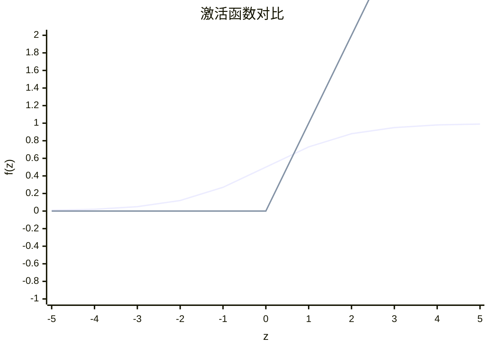

#### 1.4.2.3 多层感知机 （Multi-Layer Perceptron, MLP）

单个感知机能力有限（只能解决线性可分问题）。通过将多个感知机组织成**层 (Layers)**，并将这些层堆叠起来，我们就得到了**多层感知机 (MLP)**，也就是最基础的深度神经网络 ⁸⁸。

一个典型的MLP包含：

  * 一个**输入层 (Input Layer)**: 接收原始数据特征。
  * 一个或多个**隐藏层 (Hidden Layers)**: 这是网络的核心，负责进行大部分的计算和特征提取。
  * 一个**输出层 (Output Layer)**: 产生最终的预测结果。

网络中除了输入层以外的每一层，其神经元都与前一层的所有神经元相连接，这种结构被称为**全连接层 (Fully Connected Layer)** ⁸⁸。当一个网络包含多个隐藏层时，我们就可以称之为**深度神经网络 (Deep Neural Network, DNN)**。

**架构图 4.3: 一个简单的多层感知机 (MLP) 架构**
此图展示了一个包含一个输入层（3个神经元）、一个隐藏层（4个神经元）和一个输出层（2个神经元）的MLP。每个连接都关联一个权重。

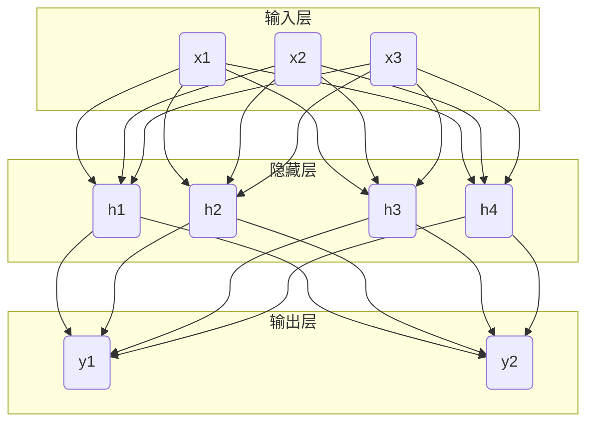

#### 1.4.3 神经网络如何“学习”

神经网络的学习过程，就是通过训练数据来调整其成千上万个权重 $w$ 和偏置 $b$ 参数，以最小化损失函数的过程。这个过程主要通过梯度下降和反向传播算法实现。

##### 1.4.3.1 前向传播 （Forward Propagation）

这是模型进行预测的过程。数据从输入层开始，逐层向前传递。在每一层，神经元接收来自前一层的输出，计算加权和，通过激活函数，然后将结果传递给下一层，直到最终在输出层得到预测结果 $y\_{pred}$ 。

##### 1.4.3.2 梯度下降 （Gradient Descent）

我们已经知道，损失函数 $J(\\mathbf{w}, b)$ 衡量了模型预测的“糟糕”程度。我们的目标是找到使 $J$ 最小的参数。梯度下降是实现这一目标的核心优化算法。

  * **思想**: 想象一下你站在一座山（损失函数的曲面）上，想要走到山谷的最低点。最快的下山方式就是沿着当前位置最陡峭的方向往下走一步。在数学上，这个最陡峭的方向就是**梯度**的反方向 ⁹³。
  * **梯度 (Gradient)**: 梯度 $\\nabla J$ 是一个向量，包含了损失函数对所有参数（所有权重和偏置）的偏导数。它指向了函数值上升最快的方向。
  * **更新规则**: 在每一步迭代中，我们都按照梯度的反方向来更新参数：
    $$\mathbf{w} \leftarrow \mathbf{w} - \eta \nabla_{\mathbf{w}}J$$
    $$b \leftarrow b - \eta \frac{\partial J}{\partial b}$$
    其中 $\\eta$ 是**学习率 (Learning Rate)**，它控制了我们每一步“下山”的步长。学习率是一个非常重要的超参数：太小会导致收敛缓慢，太大则可能在谷底来回震荡甚至发散。

##### 1.4.3.3 反向传播算法 （Backpropagation）

梯度下降需要计算损失函数对网络中每一个参数的梯度。对于一个拥有数百万参数的深度网络，直接用求导法则计算是极其低效的。**反向传播 (Backpropagation, BP)** 就是一个高效计算所有这些梯度的算法 ⁹⁵。

  * **核心机制**: 反向传播的本质是微积分中**链式法则 (Chain Rule)** 的巧妙应用 ⁹⁵。
    1.  **计算输出层误差**: 首先，在一次前向传播后，我们得到预测值，并计算出最终的损失。我们可以直接计算出损失对输出层神经元的梯度。
    2.  **误差向后传播**: 接着，算法将这个误差“信号”从后向前逐层传播。对于任意一层，它利用后一层已经计算出的梯度，通过链式法则，来高效地计算当前层的梯度。
    3.  **梯度计算**: 这个过程一直持续到输入层，最终我们可以得到损失函数对网络中所有权重和偏置的梯度。

简而言之，反向传播就像一个“责任分配”系统。它从最终的错误结果出发，逐层向后追溯，计算出每一层的每一个参数对这个最终错误“贡献”了多少“责任”（即梯度），从而知道该如何调整它们。

##### 1.4.3.4 深度学习架构巡礼

除了基础的MLP，深度学习领域还发展出了许多针对特定数据类型的专用架构。我们简要介绍其中最重要的两种。

**卷积神经网络 (Convolutional Neural Networks, CNN)**

  * **专长**: 处理具有网格状拓扑结构的数据，最典型的就是**图像** ⁹⁷。
  * **核心思想**: CNN的强大之处在于它利用了图像的**空间局部性**。它不再使用全连接层，而是通过两个关键操作来大幅减少参数并提高效率：
      * **卷积 (Convolution)**: CNN使用小的**卷积核 (Kernel)** 或**滤波器 (Filter)**（例如3x3或5x5的矩阵）在输入图像上滑动。在每个位置，卷积核都与其覆盖的局部图像区域进行元素级乘积并求和，从而生成一个**特征图 (Feature Map)** ⁹⁷。每个卷积核都负责检测一种特定的局部特征（如一个特定的边缘、颜色或纹理）。
      * **权值共享 (Weight Sharing)**: 一个卷积核在整个图像上滑动时，其内部的权重是不变的。这意味着，网络用同一组权重去检测图像中所有位置的同一个特征。这极大地减少了模型的参数数量，并使得模型具有**平移不变性**（无论猫在图像的左上角还是右下角，都能被识别）。
      * **池化 (Pooling)**: 卷积层之后通常会跟一个池化层（如最大池化 Max Pooling）。它对特征图进行**下采样 (Down-sampling)**，例如在一个2x2的区域内只保留最大值 ⁹⁸。池化的作用是：进一步减少数据量和计算量，并提供一定程度的平移和旋转不变性。

##### 1.4.3.5 循环神经网络 （Recurrent Neural Networks, RNN）

  * **专长**: 处理**序列数据**，即数据点的顺序非常重要，如文本、语音、时间序列等 ¹⁰¹。
  * **核心思想**: 传统的神经网络（如MLP和CNN）假设所有输入是相互独立的。而RNN引入了一个\*\*“循环” (Recurrence)\*\* 结构。在处理序列的每一步（例如，处理一个句子中的一个单词）时，RNN不仅接收当前的输入，还会接收来自上一步的**隐藏状态 (Hidden State)** ¹⁰¹。这个隐藏状态可以被看作是网络对到目前为止所有看到过的信息的一个“记忆”或“摘要”。
  * **信息持久化**: 正是这个循环结构，使得信息可以在网络中持续存在，从而让RNN能够理解和利用序列中的时间依赖关系和上下文信息。例如，在理解句子“The clouds are in the \_\_\_”时，RNN的记忆中已经包含了“clouds”，这使得它能很大概率地预测出下一个词是“sky”。

**架构图 4.6: RNN的循环与展开结构**
左图是RNN的紧凑表示，显示了隐藏状态 $h\_t$ 的循环连接。右图是RNN按时间步“展开”后的结构，更清晰地展示了信息是如何在一个序列中流动的：在时间步 $t$，网络接收输入 $x\_t$ 和前一时刻的隐藏状态 $h\_{t-1}$，计算出当前时刻的输出 $y\_t$ 和新的隐藏状态 $h\_t$，并将其传递给下一个时间步。

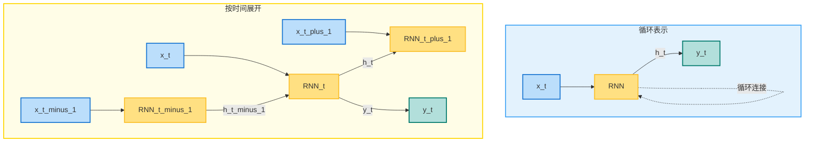
*图：RNN的循环与展开结构图*

---
#### 本节小结

在本节课中，我们从传统机器学习对“特征工程”的依赖出发，引出了深度学习进行“端到端”学习的革命性思想。我们解构了神经网络的基本单元——感知机，并理解了引入非线性的激活函数（特别是ReLU）对于构建深层模型的关键作用。我们掌握了神经网络“学习”的核心机制：通过前向传播进行预测，再利用梯度下降和反向传播算法（链式法则的应用）来最小化损失函数并更新网络权重。最后，我们初步接触了两种强大的专业架构——用于图像的CNN和用于序列的RNN，了解了它们如何通过卷积、权值共享和循环记忆等机制高效处理特定类型的数据。这一课为我们理解现代AI的核心技术奠定了坚实的基础。

---

### 1.5 模型的诞生与进化——大语言模型的生命周期**

在前四节课中，我们已经了解了AI的宏观历史，掌握了经典AI的算法，并深入探索了机器学习与深度学习的核心。我们知道了如何构建并训练一个神经网络。然而，一个在实验室中表现优异的模型，与一个能够稳定、安全、高效地为千百万用户提供服务的AI应用之间，还隔着一条巨大的鸿沟。

今天，我们将聚焦于如何跨越这条鸿沟。我们将探讨一个前沿且至关重要的领域：**大语言模型（Large Language Models, LLMs）的完整生命周期**。这不仅仅是技术问题，更是一个涉及战略、工程、伦理和运营的系统性工程。我们将学习如何从一个想法开始，最终“诞生”并“驯养”一头能够创造巨大价值的“巨龙”。这个过程的系统化方法论，我们称之为 **LLMOps (Large Language Model Operations)**。

#### 1.5.1 阶段一：规划与数据准备 （Scoping & Data Foundation）

这是整个生命周期的基石，如同建造摩天大楼前的地质勘探与地基铺设。此阶段的决策将直接决定模型的上限和最终价值。

#### 1.5.1.1 定义问题与目标 （Problem Definition & Scoping）

在编写任何代码之前，首要任务是进行战略层面的规划。

  * **概念说明：** 这一步的核心是将模糊的“我们想用AI做点什么”转化为一个清晰、可执行的计划。它要求我们明确回答：
      * **业务目标是什么？** 我们是想通过AI降低20%的客服成本，还是将内容创作者的效率提升50%？目标必须是具体且可量化的。
      * **模型的应用场景 (Use Case) 是什么？** 是一个面向公众的聊天机器人，一个内部知识库的智能问答系统，还是一个辅助程序员编写代码的工具？
      * **成功的标准 (Success Metrics) 是什么？** 我们如何判断模型的好坏？除了准确率、召回率等传统指标，还应包括用户满意度、任务完成率、响应延迟（Latency）、运营成本等商业和工程指标。
  * **理论与架构：** 这个阶段需要进行严格的**可行性分析**。这包括：
      * **数据可行性：** 我们是否拥有或能够获取到足够多、足够高质量的数据来支持目标场景？
      * **技术可行性：** 我们团队是否具备相关的技术栈？计算资源（GPU集群）是否充足？
      * **经济可行性：** 整个项目的投入产出比（ROI）是否合理？训练和推理的成本是否在可接受范围内？

#### 1.5.1.2 数据工程：收集、清洗与管理 （Data Engineering: Collection, Curation & Management）

数据是驱动大模型的“燃料”，其质量直接决定了模型的“智力”水平。

  * **概念说明：** 这个过程远不止是“下载数据集”。它是一个精细化的工程，包括：

      * **数据收集 (Collection):** 从多元化的来源获取数据，如公开的网页文本（Common Crawl）、书籍、代码库（GitHub），以及关键的**私有领域数据**（如企业内部的文档、邮件、客户对话记录）。
      * **数据清洗 (Cleaning):** 这是最繁重但至关重要的一步。它包括去除格式错误、低质量文本（如乱码、广告）、重复内容，以及对敏感信息（如姓名、身份证号）进行**脱敏或匿名化**处理，以符合数据隐私法规（如GDPR）。
      * **数据预处理与标注 (Preprocessing & Labeling):** 将清洗后的数据统一格式化，进行分词（Tokenization）。更重要的是，为后续的微调阶段创建高质量的**指令-响应对**或**偏好数据集**，这个过程通常需要大量的人工标注。

  * **理论与架构：** 在这个阶段，一个健壮的“数据流水线”（Data Pipeline）是核心架构。它能自动化地完成从数据抽取（Extract）、转换（Transform）到加载（Load）的全过程，并确保数据的版本控制和可追溯性。此外，“**数据飞轮 (Data Flywheel)**”是一个重要的理论：模型上线后产生的新数据，经过处理后可以反哺给下一轮的模型训练，形成一个持续自我优化的闭环。

#### 1.5.2 阶段二：模型开发与训练 （Model Development & Training）

这是将数据转化为智能的核心技术阶段，也是计算资源消耗最大的阶段。

#### 1.5.2.1 模型选择与架构设计 （Model Selection & Architecture Design）

  * **概念说明：** 如今我们很少完全从零开始。通常有两种选择：
    1.  **使用基础模型 (Foundation Models):** 选择一个强大的开源（如 Llama, Mistral）或闭源（如 OpenAI的GPT系列）模型作为起点。这种方式可以极大地节约预训练的巨大成本。
    2.  **自研模型 (From Scratch):** 对于有特定需求和庞大资源的组织，可能会选择设计全新的模型架构。这需要决定模型的“配方”，如选择Transformer的变体（例如，是采用标准的Encoder-Decoder还是Decoder-only架构）、确定模型的参数规模（7B, 13B, 70B?）、层数、注意力头的数量等。

#### 1.5.2.2 模型训练：从预训练到对齐 (Model Training: From Pre-training to Alignment)**

这是一个多步骤的过程，旨在赋予模型通用知识，并使其行为符合人类期望。

  * **预训练 (Pre-training):**

      * **概念：** 在海量的、未标记的文本数据上进行训练，目标是让模型掌握语言的统计规律、语法结构和广泛的世界知识。其训练任务通常是“下一个词预测”（Next-Token Prediction）。
      * **架构：** 这个过程需要在由成百上千个GPU组成的昂贵计算集群上，进行长达数周甚至数月的分布式训练。

  * **指令微调 (Instruction Fine-Tuning, SFT):**

      * **概念：** 预训练后的模型像一个知识渊博但“不会聊天”的书呆子。SFT使用高质量的“指令-回答”数据集来教会模型如何遵循人类的指令进行对话和完成任务。

  * **对齐 (Alignment) - 人类反馈强化学习 (RLHF):**

      * **概念与理论：** SFT之后的模型虽然能完成任务，但其回答可能并非最优，甚至可能是有害的。对齐的目标是让模型的价值观与人类的（Helpful, Honest, Harmless）对齐。RLHF是实现这一目标的主流技术，它借鉴了强化学习的思想。
      * **架构：** RLHF通常包含三个步骤：
        1.  **训练奖励模型 (Reward Model, RM):** 让人类标注者对同一个指令的多个模型输出进行排序（哪个更好？）。然后用这些排序数据训练一个RM，这个RM学会了评估什么样的回答更符合人类偏好。
        2.  **强化学习微调：** 将LLM本身看作一个强化学习的智能体（Agent），它生成的回答是行动（Action）。使用上一步训练好的RM作为环境的奖励函数。LLM通过不断尝试生成回答并从RM那里获得奖励信号，来学习如何生成能获得更高奖励（即更符合人类偏好）的文本。
        3.  **PPO算法 (Proximal Policy Optimization)** 是这个阶段最常使用的强化学习算法。

**架构图: RLHF 的三阶段流程**

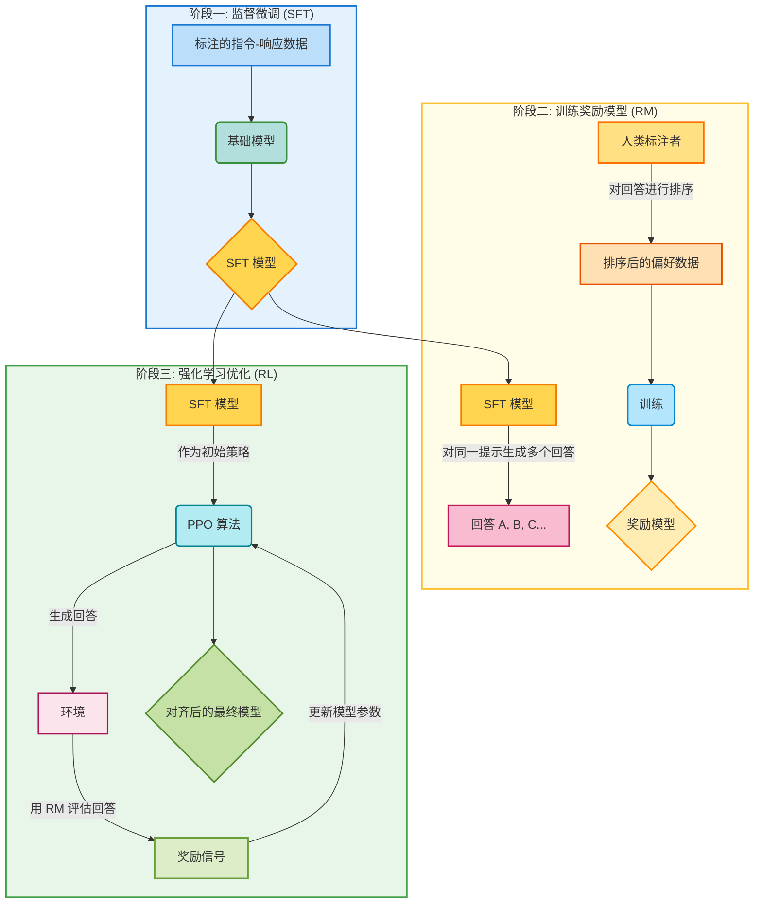

#### 1.5.3 阶段三：部署与集成 （Deployment & Integration）

将训练好的模型投入实际应用，并使其高效、可靠地服务于用户。

 ##### 1.5.3.1 推理优化：让模型更轻、更快 （Inference Optimization）

  * **概念说明：** 原始的大模型体积巨大，直接部署进行推理（即生成文本）既慢又贵。优化是必不可少的一步。
      * **量化 (Quantization):** 将模型参数的数值精度降低，例如从32位浮点数（FP32）降低到16位（FP16）甚至8位整数（INT8）。这就像把一张高清的大图片压缩成一个较小的JPG，会损失一些精度，但能大幅减小模型体积，提升计算速度。
      * **剪枝 (Pruning):** 识别并移除模型中不那么重要的神经元或连接（权重），好比修剪一棵大树的冗余枝叶，使其更“精干”。
      * **知识蒸馏 (Knowledge Distillation):** 用一个强大的“教师模型”（原始大模型）去教一个更小、更轻量的“学生模型”。学生模型学习的目标不是原始数据，而是模仿教师模型的输出，从而以更小的体积达到接近教师模型的效果。

##### 1.5.3.2 部署与服务化 （Deployment & Serving）

  * **概念与架构：** 这一步需要将优化后的模型封装成一个稳定可靠的在线服务。
      * **基础设施：** 选择合适的硬件（如专用的推理GPU A10/L4）和云平台（AWS, GCP, Azure）或本地（On-premise）服务器。
      * **API 封装：** 将模型封装成一个标准的RESTful API接口，这样任何应用程序都可以通过网络请求来调用它的能力。
      * **可扩展性：** 使用容器化技术（如Docker）和编排工具（如Kubernetes）来管理服务，确保在高并发请求下能够自动扩展计算资源（负载均衡），避免服务崩溃。

##### 1.5.3.3 应用集成：RAG与提示工程 （Application Integration: RAG & Prompt Engineering）

  * **检索增强生成 (Retrieval-Augmented Generation, RAG):**
      * **概念与理论：** LLM的一个核心缺陷是它只知道训练时学到的知识（知识截止），并且可能“一本正经地胡说八道”（幻觉）。RAG是一种强大的架构，用于解决这个问题。它将LLM的推理能力与外部的、实时的知识库相结合。
      * **架构：** 当用户提问时，系统首先不会直接问LLM。而是：
        1.  **检索 (Retrieve):** 将用户的问题在外部知识库（通常是一个**向量数据库**）中进行相似性搜索，找到最相关的几段文本或文档片段。
        2.  **增强 (Augment):** 将这些检索到的文本片段与用户的原始问题一起，打包成一个新的、内容更丰富的提示（Prompt）。
        3.  **生成 (Generate):** 将这个增强后的提示喂给LLM，让它基于所提供的上下文信息来生成回答。这极大地提高了回答的事实准确性，并能让模型使用最新的知识。

**架构图: RAG 的工作流程**

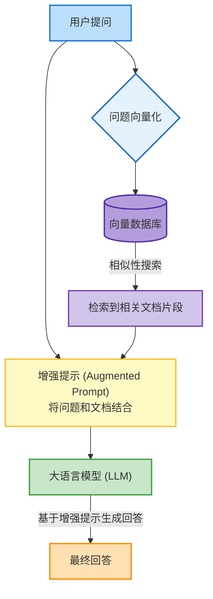

  * **提示工程 (Prompt Engineering):**
      * **概念：** 与LLM交互的“艺术与科学”。设计好的提示，如同给一位聪明的员工下达清晰的指令。通过精确的用词、提供上下文、给出示例（Few-shot learning），可以引导模型产生更准确、更符合需求的输出。

#### 1.5.4 阶段四：监控、迭代与治理 （Monitoring, Iteration & Governance）

这是一个永不停止的循环，确保模型在生产环境中长期健康、持续进化。

##### 1.5.4.1 持续监控与反馈循环 （Continuous Monitoring & Feedback Loop）

  * **概念说明：** 模型上线只是开始。我们需要像医生一样持续监控它的“生命体征”：
      * **性能监控：** 模型的API调用延迟、吞吐量、错误率、GPU利用率和成本。
      * **质量监控：** 模型的输出是否存在幻觉、偏见、有害内容或事实性错误。这通常需要结合自动规则和人工抽查。
      * **数据漂移 (Data Drift) 监控：** 线上用户输入的实际问题分布，是否与训练时的设想发生了变化？如果变化过大，模型性能可能会下降。
  * **架构：** 建立一个强大的**可观察性 (Observability)** 平台，集成日志、指标和追踪系统。同时，在应用中内置用户**反馈机制**（如点赞/点踩），这些宝贵的反馈是模型迭代的关键数据来源。

##### 1.5.4.2 治理与退役 （Governance & Retirement）

  * **概念说明：**
      * **治理 (Governance):** 确保模型的整个生命周期符合数据隐私、安全标准和行业法规。建立清晰的模型版本控制和审批流程。
      * **退役 (Retirement):** 任何模型最终都会过时。当新一代更强、更高效的模型准备就绪时，需要制定平滑的**迁移和下线计划**，确保业务不受影响，并将旧模型的用户无缝切换到新模型上。

### #本节小结

我们详细剖析了大语言模型从一个抽象概念到成为一个可靠服务的完整生命周期。这个过程始于**战略规划与数据准备**，确保方向正确、基础牢固；接着进入技术核心的**模型开发与训练**，通过预训练、微调和对齐赋予模型智能；然后是工程挑战巨大的**部署与集成**阶段，通过优化、服务化和RAG架构使其能真正落地应用；最后，通过**持续监控与迭代**的闭环，确保模型的长期价值和安全性。这四个环环相扣的阶段共同构成了**LLMOps**的核心，它告诉我们，成功的大模型应用不仅是算法的胜利，更是系统工程、运营和治理的胜利。

---
### 模块一总结与展望

我们的旅程始于对“智能”的哲学探讨，然后深入到经典AI的确定性世界，那里的问题被形式化为图，由严谨的算法（如A\*）进行搜索。接着，我们进入了由数据驱动的机器学习时代，学会了如何让模型从有标签（监督学习）和无标签（无监督学习）的数据中学习规律。最后，我们推开了深度学习的大门，理解了神经网络如何通过自动学习特征来解决传统方法的瓶颈，并初步领略了CNN和RNN这两种强大架构的风采。

这个脉络可以总结为：

> **经典AI (规则驱动)** → **机器学习 (数据驱动，浅层模型)** → **深度学习 (数据驱动，端到端深层模型)**

**后续学习路径**

我们这四节课仅仅是打开了AI世界的大门。在这个基础之上，还有更广阔、更前沿的领域等待大家去探索：

  * **强化学习 (Reinforcement Learning, RL)**: 学习如何在与环境的交互中，通过试错和奖励来做出最优决策序列。AlphaGo的成功就离不开强化学习 ¹⁰⁴。
  * **生成模型 (Generative Models)**: 不再是做预测，而是学习生成全新的、与训练数据类似的数据。
      * **生成对抗网络 (Generative Adversarial Networks, GANs)**: 通过一个生成器和一个判别器的“对抗游戏”来生成高度逼真的图像等内容 ¹⁰⁶。
      * **扩散模型 (Diffusion Models)**: 通过从纯噪声中逐步“去噪”来生成数据，是当前高质量图像生成（如Midjourney）背后的核心技术 ¹⁰⁶。
  * **大语言模型 (Large Language Models, LLMs)**: 如GPT系列，它们是深度学习、NLP和一种名为Transformer的架构的集大成者，展现出了惊人的语言理解和生成能力。

希望这四节课能为大家打下坚实的理论基础，并激发你们对这个充满挑战和机遇的领域持续探索的热情。人工智能的未来，将由你们来书写。课程到此结束，谢谢大家！

---

## 模块二 技术溯源与产业生态——AI技术发展路线概述

### 2.1 技术演进：从特征工程到表示学习

大模型的出现并非一蹴而就，而是AI技术长期演进的结果。若与此前的AI模型对比，其革命性便显而易见。

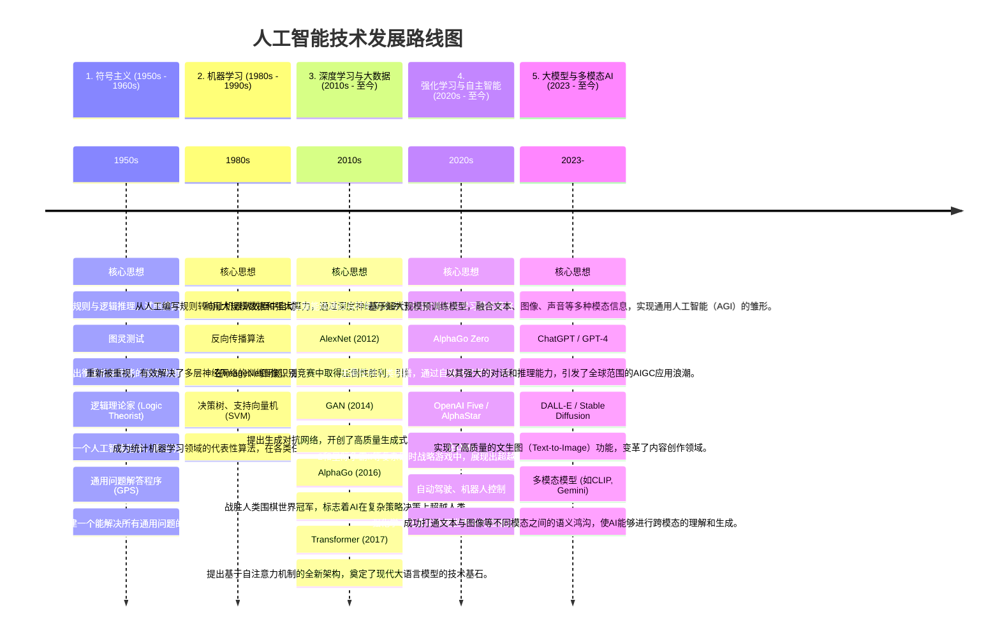
*图：人工智能技术发展路线图* 

这个路线图清晰地揭示了人工智能发展的几个关键趋势：

- 从“教它规则”到“让它学习”：早期AI依赖人类专家（符号主义），后来演变为让机器自己从数据中找规律（机器学习），再到如今让机器自己学习如何表示数据（深度学习）。
- 从“特定任务”到“通用能力”：AI模型从最初只能解决单一、特定问题（如下棋、图像分类），发展到今天能够处理语言、图像、逻辑等多种任务的大模型。
- 从“被动分析”到“主动创造”：AI的能力从识别和分类信息，扩展到了能够主动生成全新内容（AIGC）和做出自主决策（强化学习）。
- 从“单一模态”到“多模态融合”：当前最前沿的发展趋势是将文本、视觉、听觉等信息融合在一起，让AI更接近人类感知和理解世界的方式。

这条演进路径仍在加速向前，每一个新阶段都建立在之前所有阶段的技术积累之上，共同构成了我们今天所见的、充满活力的AI生态。

-----

> **技术前沿 2.1：Transformer架构**
>
> 促成大模型技术飞跃的核心算法突破，是2017年由Google研究人员提出的**Transformer架构**。该架构的核心创新在于其**自注意力机制 (Self-Attention Mechanism)**。
>
>在Transformer出现之前，处理文本等序列数据的标准模型是循环神经网络（RNN）。RNN通过顺序处理信息来捕捉上下文关系，但难以处理长距离的依赖，且其串行计算的特性限制了训练效率。因此，在“大模型”时代之前，构建一个AI模型往往需要耗费大量专家精力进行特征工程 (Feature Engineering)。研究人员必须手动为模型设计和提取有效的信息特征，以帮助模型理解任务。
>
>Transformer架构完全摒弃了循环结构。其自注意力机制允许模型在处理序列中的每一个元素时，都能直接计算并衡量序列中所有其他元素对当前元素的重要性，从而高效地捕捉全局的上下文信息。更关键的是，这种机制的计算可以高度并行化，完美契合现代图形处理器（GPU）的架构，使得在超大规模数据集上训练拥有数千亿甚至万亿参数的模型成为现实。
>大模型则实现了范式转换。它依托于“大数据 + 大算力 + 强算法”，能够直接从原始数据中自动学习有用的表示，省去了人工设计特征的环节。这种端到端（End-to-End）的学习方式，使得模型能够发现人类专家可能忽略的深层模式，并具备处理多种不同任务的通用能力 (Generality)。

-----

### 2.2 全球及国内产业生态

随着技术的成熟，全球范围内形成了多元化的AI大模型产业生态。

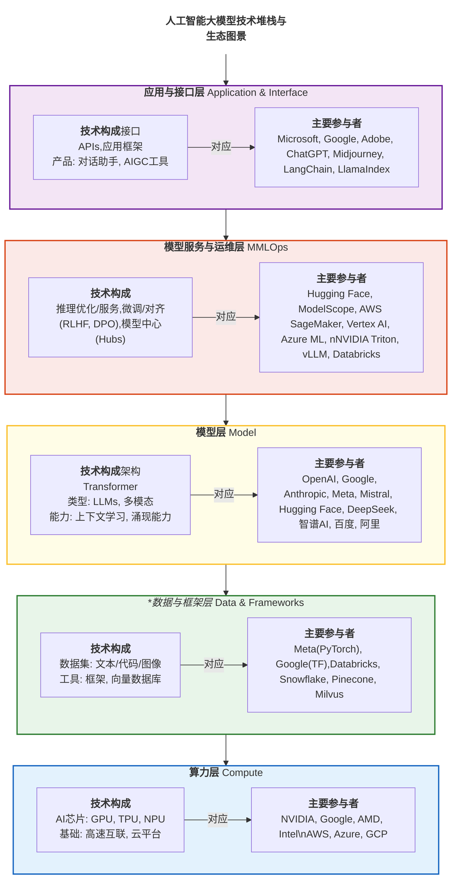
图：全球人工智能技术生态全景示意图

  * **闭源API模式**
    以OpenAI (GPT系列)、Google (Gemini系列)、Anthropic (Claude系列)为代表的商业巨头，主导着性能最前沿的模型研发。它们通常不公开模型权重或核心技术细节，而是通过应用程序编程接口（API）向外提供服务。开发者通过付费调用这些API，将顶尖的AI能力集成到自己的产品中。

  * **开源社区模式**
    与闭源模式相对应，由Meta (Llama系列)、Mistral AI以及Hugging Face等社区力量推动的开源生态同样繁荣。它们向公众开放模型权重、代码乃至训练方法，极大地降低了AI技术的准入门槛，促进了技术的快速迭代和广泛应用。全球的开发者和研究者可以自由下载、修改和部署这些开源模型。

  * **中国生态格局**
    国内AI产业呈现出商业与开源齐头并进的“百模争鸣”态势。阿里巴巴的**通义 (Qwen)**、深度求索的**DeepSeek**、百度的**文心 (ERNIE)**、智谱AI的**GLM**、月之暗面的**Kimi**等商业模型在中文处理和特定行业应用上持续深耕。同时，这些头部企业也将部分模型开源，与**魔搭 (ModelScope)** 、**OpenI启智**等本土开源社区一道，共同构建了富有活力的中文AI开发者生态系统。

### 2.3 主要应用场景

大模型的通用能力使其应用渗透到社会经济的众多领域。

#### 2.3.1 生产力与内容创作
    这是AIGC应用最为广泛的领域。从自动生成营销文案、起草商业邮件，到总结冗长的会议记录、辅助学术论文写作，AIGC正成为强大的“智能助理”，显著提升了知识工作者的生产效率。

-----

> **案例分析 2.1：AIGC在软件开发中的应用**
>
> **场景**：GitHub Copilot是一款由GitHub和OpenAI共同开发的AI编程辅助工具。
> **应用方式**：它作为代码编辑器的插件，能够实时理解开发者正在编写的代码及其上下文。当开发者编写注释描述想要实现的功能（如“// function to read a csv file and return a pandas dataframe”）或开始编写一个函数时，Copilot会自动生成完整的代码建议。
> **影响**：该工具极大地提升了软件开发的效率，减少了开发者在查找API用法和编写样板代码上的时间消耗。同时，它也成为一种新的编程学习方式，开发者可以通过观察AI生成的代码来学习新的编程范式和库用法。

-----

#### 2.3.2 科学研究

在尖端科研领域，AIGC正在从数据分析工具转变为科学发现的引擎。

-----

> **案例分析 2.2：AlphaFold 2与蛋白质结构预测**
>
> **场景**：蛋白质的三维结构决定其生物功能，准确预测蛋白质结构是生物学领域的一大挑战。
> **应用方式**：Google DeepMind团队开发的AlphaFold 2模型，利用深度学习技术，能够根据蛋白质的氨基酸序列，以极高的精度预测其三维空间结构。
> **影响**：这一突破被誉为“解决了困扰生物学界50年的重大问题”，其预测结果的准确性可与实验方法相媲美。它极大地加速了生命科学的研究进程，在新药设计、疾病机理探索等方面具有里程碑式的意义。

-----

### 模块二总结与展望

本章带领我们回顾了AI技术的演进脉络与当下的产业全景。我们通过技术发展路线图，清晰地看到了从依赖专家知识的“特征工程”到模型自动学习的“表示学习”这一根本性的范式转移，这也是大模型得以实现的基础。

我们还考察了全球AI产业的两种主流生态模式——以OpenAI为代表的闭源API模式和以Meta、Hugging Face社区为代表的开源社区模式，并了解了国内“百模大战”下商业与开源并存的繁荣景象。最后，通过在生产力、内容创作、软件开发和科学研究等领域的具体案例，我们直观地感受到了这项技术正在对社会各方面产生的深远影响。

-----
## 模块三 与AI对话的艺术——提示词工程基础

### 3.1 提示词：驾驭大模型的缰绳

大模型的强大能力需要被精确引导才能有效发挥。**提示词 (Prompt)**，即用户向模型输入的指令或问题，正是实现这种引导的关键。提示词工程 (Prompt Engineering) 则是一套旨在设计和优化提示词，以从大模型处获取高质量、高相关性输出的方法论。其核心原则可以概括为“输入决定输出”：提示词的质量直接决定了模型生成内容的质量。

#### 3.1.1 理论框架与学术基础**

提示词工程已成为与大型语言模型高效交互的核心学科。Sahoo等人¹⁰在一篇系统性的综述中，将其定义为“为了有效利用大型语言模型而设计和优化提示的过程”。这一领域的理论基石，源于Brown等人在其开创性的GPT-3论文中¹¹首次正式提出的**上下文学习（In-context Learning）**概念。与传统的模型训练不同，上下文学习指的是模型能够直接通过任务的文本描述或少数范例来执行新任务，而无需进行任何梯度更新或参数微调。

学术界对提示词的分类体系也在不断完善。一个通用的分类框架将提示词分为三类：硬提示（Hard Prompts），即人类可读、用自然语言撰写的指令；软提示（Soft Prompts），即一组可通过模型学习而优化的、不可直接解释的向量表示；以及结合二者优势的混合提示（Hybrid Prompts）。

#### 3.1.2 链式思维推理技术
	
为了提升大模型在复杂推理任务上的表现，链式思维（Chain-of-Thought, CoT） 提示法被证明是一种极其有效的技术。Wei、Wang等人¹²的研究表明，通过引导模型在给出最终答案前，先生成一系列中间的、连贯的推理步骤（即“思维链”），能够显著增强其解决复杂问题的能力。

在教学应用中，CoT技术可以被框架化地应用在不同层面。在基础层面，可以直接使用如“让我们一步一步地思考”这样的通用指令来引导模型分解问题；在高级层面，则可以通过提供结构化的多步推理范例，来解决复杂的数学应用题或逻辑谜题。这项技术的教育价值不仅在于提升问题解决的准确率，更在于它使得模型的“思考”过程变得透明和可追溯，有助于培养使用者自身的逻辑分析与批判性思维能力。

#### 3.1.3 少量样本学习机制

*少量样本学习（Few-shot Learning）**是上下文学习的核心体现。Brown等人¹¹的开创性研究指出，随着语言模型规模的巨幅增长，其在任务无关情境下的少量样本学习性能也得到了极大改善。Parnami和Lee¹³在其综述中进一步阐明，大语言模型中的少量样本学习与传统机器学习中的同名概念在机制上有所不同：它并非通过更新模型参数来学习，而是纯粹通过上下文中的演示范例来“领会”任务意图。基于提供范例的数量，教学策略可以分为三个层级：

- 零样本（Zero-shot）：仅提供任务的自然语言描述，不含任何具体范例。
- 单样本（One-shot）：提供任务描述外，再附带一个完整的范例。
- 少样本（Few-shot）：提供2至8个范例，通常能引导模型达到更稳定和优异的性能。

#### 3.1.4 角色扮演与元提示优化
	
在提示词的具体实践中，角色扮演（Role-playing）是一种简单而高效的“基石技术”。通过为模型分配一个明确的专家角色（如“你是一位专业的生物学教师”），提示词为模型提供了强大的上下文基础，能够显著改善其在特定任务上的表现。一个完整的角色扮演实施框架，通常会结合专家角色分配、目标受众定向（如“向九年级学生解释这个概念”），有时还会融入跨学科视角（如“作为一位分析科学发展的历史学家…”），以生成更具深度和针对性的内容。

近年来，提示词的优化过程本身也开始走向自动化，这一领域被称为**元提示（Meta-Prompting）** 或自动提示优化。例如，微软研究院在2024年展示的PromptWizard系统和SAMMO框架，均利用一个强大的LLM来指导和迭代优化面向另一个LLM的提示。这类技术能够实现对指令内容和上下文学习范例的同步、自动化调整，代表了提示词工程领域的前沿发展方向。

### 3.2 优质提示词的四大核心要素

构建一个有效的提示词，通常需要考虑以下四个关键要素。

  * **清晰的角色扮演 (Role-playing)**
    为模型预设一个身份，能够有效约束其知识范围和语言风格，使其输出更加专业和聚焦。
   
	   场景：`学习复杂的物理概念“熵增定律”`
	 * **低效提示词**: 什么是熵增定律？ (这通常会得到一个像百科全书一样、干巴巴的定义，可能包含很多难以理解的专业术语。)
	 * **高效提示词**: 请你扮演一位顶尖的物理科普作家，像《时间简史》的作者霍金一样，用一个生动、有趣的比喻，向一名对物理学充满好奇但基础知识不多的大一新生，解释什么是“熵增定律”。 (通过这个提示词，你更有可能得到一个类似“房间为什么总是越来越乱”或者“将一滴墨水滴入清水”这样易于理解的类比，从而掌握概念的精髓。)

  * **明确的指令与上下文 (Instructions & Context)**
	指令必须具体、无歧义，并提供所有必要的背景信息（上下文），避免让模型进行不必要的猜测。这在请求AI辅助论文写作或作业时尤为重要。

	场景：需要为一篇关于”人工智能对教育影响“的课程论文撰写开篇段落”

      * **低效提示词**: `帮我写一篇关于AI对教育影响的论文开头。 (AI不知道你的课程背景、具体要求和你的核心论点，生成的开头可能会非常空洞和宽泛。`
      * **高效提示词**: `我正在为我的《教育技术学》课程写一篇期末论文，主题是“生成式AI对高等教育的机遇与挑战”。我的核心论点是：AI既是强大的个性化学习工具，也对学术诚信和批判性思维培养提出了挑战。请你根据这个上下文，为我草拟一个大约200字的开篇段落。要求：1. 开头需要引人入胜，可以引用最近的新闻或一个引人思考的场景。2. 清晰地提出我的核心论点。3. 简要预告下文将从“个性化辅导”、“研究助理”、“学术诚信”和“思维惰性”这几个方面展开论述。`

  * **提供格式范例 (Few-shot Learning)**
    当需要模型遵循特定的输出格式或逻辑时，直接提供一至数个完整的“输入-输出”范例，是最高效的沟通方式。模型会通过归纳学习，将范例中的模式应用到新任务中。

	场景：基于范例的命名实体识别与统计
		- 命名实体识别 (NER)：这是自然语言处理（NLP）中的一个基础且非常重要的任务。它的目标是从一段非结构化的文本中，识别出具有特定意义的“实体”（Entities），例如人名、地名（如此处的城市）、组织机构名、日期、产品名称等。在这个例子中，AI的首要任务就是准确地识别出“北京”、“上海”、“广州”等城市名称。
	- 词频统计 (Frequency Counting)：在识别出实体后，任务还要求对每个实体出现的次数进行统计。

      * **任务**: 从复杂的句子中提取出城市名称和对应的提及次数。
      * **高效提示词 (Few-shot)**:
	根据范例，从文本中提取城市和提及次数。

        - 范例1：
        文本：报告显示，北京的科技产业发展迅速，而上海的金融中心地位依然稳固。我们认为北京的潜力更大。
        输出：{"北京": 2, "上海": 1}

        - 范例2：
        文本：本次旅行我们将从广州出发，途经深圳，最后抵达香港。
        输出：{"广州": 1, "深圳": 1, "香港": 1}

        待处理文本：
        虽然我们总部在杭州，但我们的大部分业务实际上在上海展开，同时我们在南京和上海也设有分部。
        输出：

  * **限定输出的格式 (Format Specification)**
    明确要求模型以结构化的格式（如JSON、Markdown表格、XML等）返回结果，便于后续的程序处理和数据分析。

	场景：临近期末，需要制定一份高效的备考复习计划

      * **任务**: 生成一份项目计划。
	* **低效提示词**: `帮我下周要考高数、大学英语和C语言，帮我做一个复习计划。 (结果可能是几段建议性的文字，难以执行。)`
      * **高效提示词**: `我下周要进行三门课程的期末考试：《高等数学》、《大学英语》和《C语言程序设计》。请为我制定一份从周一到周五，共计五天的详细复习计划。请将计划以Markdown表格的形式输出，表格应包含四列：日期、上午 (9:00-12:00)、下午 (14:00-17:00)、晚上 (19:00-21:00)。请确保每天的复习内容均衡，劳逸结合。`
	 
通过这个提示词，你将得到一个结构清晰、可以直接打印或导入到笔记软件中的周计划表格，让你的复习安排井井有条。

---
### *提示词课后思考题*

#### **A. 面向【信息与计算科学】专业的同学**

**核心技能关联：** 算法思维、数据结构、信息编码

* **问题一 (入门级)：【用AI“调试”代码】**
    * **场景**：你写了一段C++或Python代码来解决一个算法题（例如，实现一个简单的排序算法或二分查找），但程序运行出错或结果不符合预期。
    * **任务**：请设计一个提示词，将你的**完整代码**和**错误信息**一并提供给AI。你的提示词不仅要问“哪里错了？”，更要引导AI：
        1.  扮演一位资深软件工程师的角色。
        2.  **逐行解释**代码的逻辑。
        3.  指出潜在的逻辑错误或边界条件问题。
        4.  提供一个**修正后的代码版本**，并附上关键修改处的**注释**。
    * **思考**：对比AI给出的解释和修正，与你自己的思路有何不同？AI在理解代码“意图”和发现“bug”两方面，哪个做得更好？

* **问题二 (进阶级)：【用AI将“伪代码”转化为“工程代码”】**
    * **场景**：在《数据结构》课程中，老师通常会用“伪代码”来描述一个复杂的算法（例如，Dijkstra算法或AVL树的插入操作），而你需要将其用具体的编程语言实现。
    * **任务**：请设计一个提示词，将老师课件上的**伪代码描述**输入给AI。你的目标是让AI为你生成一份高质量、可运行、符合工程规范的Python代码。
    * **提示词要点**：
        1.  清晰地提供完整的伪代码。
        2.  指定目标编程语言（如Python 3）。
        3.  要求AI为关键部分（如核心循环、数据结构定义）添加详细的**代码注释**。
        4.  要求AI为生成的代码设计**2-3个测试用例**（test cases），以验证其正确性。
    * **思考**：AI在将抽象的算法逻辑，转化为具体的、包含边缘情况处理的工程代码时，表现如何？它设计的测试用例是否覆盖了关键的边界条件？

* **问题三 (挑战级)：【用AI设计“信息编码”方案】**
    * **场景**：信息论中一个有趣的问题是如何为一组出现频率不同的字符设计最高效的二进制编码（霍夫曼编码的基础思想）。
    * **任务**：假设你不知道霍夫曼编码的具体算法。请设计一个提示词，引导AI为你虚构的6个字符（A, B, C, D, E, F）及其出现频率（例如，A: 45%, B: 15%, C: 12%, D: 10%, E: 8%, F: 5%）设计一套**前缀编码**（即任何一个字符的编码不能是另一个字符编码的前缀）。
    * **提示词要点**：你要向AI解释你的**优化目标**：“我希望最终编码后的平均码长最短，这意味着出现频率越高的字符，其二进制编码应该越短。”
    * **思考**：AI能否在不被告知具体算法名称的情况下，仅通过理解你的**优化目标**和**约束条件**（前缀编码），推理出一个接近最优解的编码方案？这个过程如何体现了AI的问题解决能力？

#### **B. 面向【应用统计学】专业的同学**

**核心技能关联：** 数据分析、概率分布、假设检验、识别偏差

* **问题一 (入门级)：【用AI解释“统计学概念”】**
    * **场景**：你在学习“中心极限定理”或“P值”时感到困惑。
    * **任务**：请设计一个提示词，让AI用**非专业人士也能听懂**的方式，解释一个复杂的统计学概念。
    * **提示词要点**：
        1.  指定AI扮演“一位善于打比方的统计学教授”。
        2.  要求它使用一个**生活中的实例**（例如，抽样调查、产品质检）来贯穿整个解释过程。
        3.  明确要求它解释这个概念的“**应用价值**”和“**易错点**”。
    * **思考**：AI的比喻是否恰当？它指出的“易错点”是否和你自己的理解误区相符？

* **问题二 (进阶级)：【用AI生成“特定分布”的模拟数据】**
    * **场景**：你需要练习使用SPSS或R语言等统计软件，但手头没有合适的数据。你想生成一些符合特定统计特征的数据。
    * **任务**：请设计一个提示词，让AI为你生成一段可直接运行的Python代码（使用`numpy`和`pandas`库），这段代码需要能生成一个包含100个样本的数据集，并满足以下条件：
        1.  包含三列：'ID', 'Age', 'Score'。
        2.  'Age'列大致服从**均值为35，标准差为8的正态分布**。
        3.  'Score'列大致服从**均值为75，标准差为15的正态分布**。
        4.  最终将生成的数据**输出为CSV格式的文本**。
    * **思考**：AI能否准确理解统计分布的参数（均值、标准差）？生成的代码是否简洁、高效？这如何能加速你的统计建模和分析流程？

* **问题三 (挑战级)：【用AI识别“数据描述”中的潜在偏差】**
    * **场景**：你正在阅读一份市场调研报告，其中一段文字描述了A、B两款产品的用户画像，你怀疑描述中可能存在“幸存者偏差”或“选择性偏差”。
    * **任务**：请设计一个提示词，将这段报告的**描述文字**输入给AI。你的目标是让AI扮演一位“**经验丰富的数据分析师**”，帮你“**诊断**”这段文字中可能隐藏的统计偏差。
    * **提示词要点**：
        1.  提供原始文本。
        2.  要求AI识别出文本中**所有绝对化或带有倾向性的表述**。
        3.  引导AI提出**质疑性问题**，例如：“报告的样本是如何抽取的？未响应的用户特征是什么？这个结论是否可能忽略了某些潜在变量？”
        4.  要求AI提出**至少两种**可能导致当前结论的**潜在偏差类型**（如幸存者偏差、选择偏差、确认偏差等），并解释为什么。
    * **思考**：AI在识别语言中的主观偏见和联想统计学概念方面的能力如何？它能否成为你进行批判性数据分析的得力助手？

#### **C. 面向【数学与应用数学】专业的同学**

**核心技能关联：** 逻辑推理、符号运算、抽象思维、证明过程

* **问题一 (入门级)：【用AI辅助“求解微积分”】**
    * **场景**：你正在做一道复杂的不定积分或求极限的数学题，想核对自己的计算步骤和答案。
    * **任务**：请设计一个提示词，将这道数学题（可以使用LaTeX格式输入）交给AI。你的要求不只是得到答案。
    * **提示词要点**：
        1.  要求AI使用“**链式思维**”，**一步一步地**展示完整的求解过程。
        2.  在每一步关键的代换或使用定理时（例如，使用洛必达法则或分部积分法时），要求它明确**指出所使用的定理名称**。
        3.  最后给出最终答案。
    * **思考**：AI的解题步骤是否清晰、严谨？它对数学定理的引用是否准确？这与你使用WolframAlpha等符号计算工具有何不同体验？

* **问题二 (进阶级)：【用AI“翻译”数学语言】**
    * **场景**：你在阅读一篇数学文献时，遇到一段用形式化语言描述的、非常抽象的定义或定理（例如，群论中的拉格朗日定理或拓扑学中的紧空间定义），难以理解其直观含义。
    * **任务**：请设计一个提示词，将这段**形式化的数学定义**输入给AI。你的目标是让AI帮你“翻译”和“可视化”这个概念。
    * **提示词要点**：
        1.  让AI扮演“一位优秀的数学教师”。
        2.  要求它首先用**简洁的自然语言**重新解释这个定义。
        3.  要求它提供**1-2个具体的、简单的数学实例**（例如，用一个具体的数字集合或几何图形的例子）来说明这个抽象定义。
        4.  如果可能，要求它用一个**生活中的类比**来帮助建立直观理解。
    * **思考**：AI在连接抽象的符号世界与具体的实例、直观的类比世界之间的能力如何？它能否成为你学习高等数学的得力助手？

* **问题三 (挑战级)：【用AI进行“反例构造”】**
    * **场景**：在数学中，证伪一个命题通常只需要举出一个反例。例如，命题“所有素数都是奇数”的反例是“2”。但构造更复杂命َ题的反例则非常困难。
    * **任务**：请你向AI提出一个**错误的数学命题**，并设计一个提示词，引导AI去寻找或构造一个**反例**。
    * **示例命题**：“如果一个函数在某点连续，则它在该点一定可导。”（这是错误的）
    * **提示词要点**：
        1.  清晰地陈述这个（错误的）命题。
        2.  直接提问：“这个命题是正确的吗？如果不是，请为我**构造一个具体的函数**作为反例。”
        3.  要求AI对它构造的反例进行**解释**：即说明为什么这个函数满足“连续”的条件，却不满足“可导”的条件。
    * **思考**：AI是仅仅从其知识库中“记忆”和“检索”出了一个经典反例（如 `f(x) = |x|` 在x=0处），还是它表现出了一定的、能够主动去“寻找”和“验证”反例的推理能力？如何设计更复杂的错误命Те来测试其推理的极限？

---

#### 3.3 进阶技巧：思维链 （Chain of Thought）

对于需要多步推理的复杂问题，直接要求模型给出答案往往容易出错。**思维链 (Chain of Thought, CoT)** 是一种有效的进阶提示技巧。

-----

> **知识链接 3.1：思维链 (Chain of Thought, CoT)**
>
> CoT的核心思想是引导模型在输出最终答案之前，先显式地输出其解决问题的中间步骤。这种方法模拟了人类的逻辑推理过程，将一个复杂问题分解为一系列可管理的小步骤，从而显著提升了模型在数学计算、逻辑推理和规划任务上的准确性 [17]。

-----

  * **案例**: 解决一个简单的逻辑应用题。
      * **标准提示词**: `一个书架上有两层书，上层书的数量是下层的3倍。如果从上层拿走60本放到下层，两层的书就一样多了。请问原来上下两层各有多少本书？` (模型可能直接给出错误答案)
      * **CoT提示词**: `一个书架上有两层书，上层书的数量是下层的3倍。如果从上层拿走60本放到下层，两层的书就一样多了。请问原来上下两层各有多少本书？**请展示你的推理步骤。**`
      * **预期的CoT输出**:
        ```
        好的，我们来一步步分析这个问题。
        1.  **设定变量**: 设原来下层的书有 x 本。
        2.  **根据题意表示上层**: 因为上层是下层的3倍，所以原来上层的书有 3x 本。
        3.  **描述变化后的状态**: 从上层拿走60本，上层还剩 3x - 60 本。这60本放到下层，下层变为 x + 60 本。
        4.  **建立等式**: 此时两层书一样多，所以 3x - 60 = x + 60。
        5.  **解方程**:
            3x - x = 60 + 60
            2x = 120
            x = 60
        6.  **求出上层的数量**: 原来上层的书是 3x = 3 * 60 = 180 本。
        7.  **最终答案**: 所以，原来上层有180本书，下层有60本书。
        ```

-----
### 模块三总结与展望

本章我们聚焦于如何与AI进行高效沟通的核心技能——提示词工程。我们明确了“输入决定输出”的基本原则，并将提示词理解为驾驭大模型的“语言”。在理论层面，我们追溯到其学术基石，即GPT-3论文中提出的上下文学习（In-context Learning）¹¹，并了解了其关键机制，如少量样本学习（Few-shot Learning）。

我们重点学习了能显著提升模型推理能力的链式思维（Chain-of-Thought, CoT）¹²技术，并掌握了引导模型进行逐步思考的方法。同时，我们也系统梳理了构成一条优质提示词的四大核心要素：角色扮演、明确指令、提供范例和限定格式。这些理论与技巧共同构成了我们与AI协作、释放其创造潜能的基础。

-----

## 模块四 实践之路：实验环境概览

### 4.1 主流实践模式

与大模型进行交互开发，主要有三种技术路径：

1.  **纯线上模式 (云端Notebook)**

      * **描述**: 使用Google Colab、Kaggle Notebook或阿里云PAI-DSW等平台，在浏览器中直接访问一个预配置好的、带有GPU的远程编程环境。
      * **优点**: 无需本地配置，免费或低成本使用计算资源，适合快速学习和验证。
      * **缺点**: 资源有限制（时长、内存），依赖网络，数据管理不便。

2.  **完全本地化部署**

      * **描述**: 在个人或机构的本地计算机上下载开源模型，并搭建完整的运行环境。
      * **优点**: 数据隐私性强，无API费用，可深度定制，完全控制。
      * **缺点**: 对硬件（尤其是GPU显存）要求高，环境配置复杂，技术门槛高。

3.  **线上/线下结合 (API调用)**

      * **描述**: 在本地或服务器上开发应用程序，通过网络API调用云服务商（如OpenAI, 百度智能云）提供的模型服务。
      * **优点**: 可使用最强大的商业模型，无需关心模型运维，易于扩展。
      * **缺点**: 产生API调用费用，存在网络延迟，数据需传输至第三方。
---

### 4.2 主流AI开发者平台概览

选择一个合适的开发平台，是开启AI应用开发之旅的关键一步。当前，全球各大科技巨头都已推出了功能强大、一站式的AI开发者平台。这些平台通常集成了**基础模型、开发工具链、模型部署与运维（MLOps）以及底层算力**，极大地降低了开发者使用和构建AI应用的门槛。

以下，我们将对当前国内外主流的七大AI开发者平台进行介绍，并分析它们的定位与特性。

#### 4.2.1 OpenAI Platform

* **核心定位**：全球AI浪潮的引领者，以其最先进的GPT系列模型为核心，提供强大的模型API服务。
* **主要特点**：
    * **顶尖的模型能力**：提供对业界领先的 **GPT系列模型**（如GPT-4、GPT-4o）以及文生图模型 **DALL·E** 和文生视频模型 **Sora** 的API访问权限。其模型在通用推理、代码生成和多模态理解上长期保持领先地位。
    * **简洁易用的API**：其API设计已成为行业事实标准，开发者可以轻松地通过几行代码，将顶尖的AI能力集成到自己的应用中。
    * ** Assistants API 与微调**：提供了构建定制化AI智能体（Assistants）的框架，并支持用户通过自己的数据对模型进行微调（Fine-tuning），以适应特定任务。
* **目标用户**：从个人开发者、初创公司到大型企业，任何希望快速使用当前最强大AI模型能力的开发者。

#### 4.2.2 Google AI Studio & Vertex AI

* **核心定位**：一个双层平台，**Google AI Studio** 面向个人开发者提供快速、免费的模型体验和原型开发，而 **Vertex AI** 则是面向企业的、全托管的、端到端（End-to-End）的统一AI开发平台。
* **主要特点**：
    * **强大的自研模型矩阵**：核心是强大的多模态模型家族 **Gemini**。Vertex AI的“模型花园”（Model Garden）则提供了对谷歌及第三方上百个模型的访问。
    * **无缝的开发体验升级**：开发者可以在Google AI Studio中免费探索和开发，当项目需要更强的扩展性、安全性和管理能力时，可以一键将工作流迁移到企业级的Vertex AI平台。
    * **与谷歌云生态深度融合**：Vertex AI能够无缝利用Google Cloud的底层算力（包括TPU）、存储和大数据分析服务，适合构建大规模、高可靠性的AI应用。
* **目标用户**：**Google AI Studio** 面向所有希望免费体验Gemini模型的开发者和爱好者；**Vertex AI** 则面向寻求稳定、可扩展、一站式AI解决方案的企业级开发者和数据科学家。

#### 4.2.3 Microsoft Azure AI

* **核心定位**：深度整合OpenAI模型能力与微软强大云服务及企业生态的企业级AI平台。
* **主要特点**：
    * **“Azure OpenAI Service”**：其最大亮点是提供了在Azure云上安全、合规地调用OpenAI模型（如GPT-4）的服务。这使得企业可以在享受顶尖模型能力的同时，获得微软云的企业级安全和数据隐私保障。
    * **全面的AI工具套件**：Azure AI Studio 提供了从数据处理、模型训练、 Responsible AI（负责任的AI）工具到模型部署和监控的全套MLOps能力。
    * **与办公生态无缝集成**：AI能力深度集成在Microsoft 365 Copilot、GitHub Copilot、Dynamics 365等产品中，为企业用户提供了最直接的AI生产力工具。
* **目标用户**：广大的企业客户，特别是已经在使用Azure云服务或微软办公生态的企业，以及对数据安全和合规性有高要求的组织。

#### 4.2.4 阿里巴巴 - ModelScope （魔搭社区）

* **核心定位**：一个以开源社区为核心的“模型即服务”（Model-as-a-Service）平台，被誉为中国的“Hugging Face”。
* **主要特点**：
    * **国内领先的模型开源社区**：汇聚了海量的AI模型，尤其是中文相关的模型资源非常丰富。它是阿里自家强大的**通义（Qwen）**大模型家族的主要开源阵地。
    * **对开发者和初学者友好**：极大地降低了开发者寻找、体验和使用模型的门槛。平台提供了免费的在线Notebook环境和GPU算力，便于快速进行实验和学习。
    * **“模型”为核心的服务链路**：所有工具和服务都围绕着“模型”展开，包括模型发现、在线体验、一键部署、API调用等，形成了以模型为中心的完整服务链路。
* **目标用户**：广大的个人开发者、研究人员、学生，以及希望快速集成和尝试各种开源模型的中小企业。

#### 4.2.5 腾讯 - Hunyuan （混元）AI平台

* **核心定位**：依托于腾讯云，以自研的**混元大模型**为核心，为产业提供全栈式AI解决方案的企业级服务平台。
* **主要特点**：
    * **强大的自研混元大模型**：提供覆盖语言、图像、视频等多种模态的混元模型系列，并通过API向企业开放。其模型在中文语境和特定产业场景下经过深度优化。
    * **与腾讯生态紧密结合**：AI能力深度融入腾讯会议、腾讯文档、企业微信等内部产品，并为游戏、金融、文旅等腾讯的优势产业提供强大的行业解决方案。
    * **强调产业应用落地**：平台提供从模型精调、应用开发到部署的全套工具和服务，致力于帮助企业客户解决实际业务问题，实现AI能力的快速落地。
* **目标用户**：希望利用AI进行产业升级的企业客户，特别是那些业务与腾讯生态（社交、游戏、内容等）有紧密联系的企业。

#### 4.2.6 华为 - ModelArts

* **核心定位**：一个全流程、一站式的AI开发与管理平台，尤其强调其从底层硬件到上层应用的“全栈自研”能力。
* **主要特点**：
    * **全栈自主技术体系**：深度整合了华为自家的**昇腾（Ascend）AI芯片**和**MindSpore深度学习框架**，为用户提供了从硬件到软件的全国产化选择，在供应链安全和性能优化上具有独特优势。
    * **覆盖AI开发全生命周期**：提供从数据准备、算法开发、模型训练到模型管理和部署的端到端工具链，支持大规模分布式训练和云、边、端协同部署。
    * **行业知识沉淀**：沉淀了华为在通信、制造、能源等多个行业的知识和实践，提供丰富的行业套件和工作流，帮助行业客户快速构建AI应用。
* **目标用户**：对供应链安全有高要求的政府和大型企业客户，以及希望在华为硬件生态（如昇腾）上进行开发的开发者。

#### 4.2.7 百度 - Qianfan (千帆) 大模型平台

* **核心定位**：一个面向企业的、一站式的大模型开发与服务运行平台，以其强大的**文心（ERNIE）大模型**为核心。
* **主要特点**：
    * **领先的文心大模型**：提供包括文心一言（ERNIE Bot）和多个行业大模型在内的模型库，尤其在中文语言理解和生成方面表现突出。
    * **工具链与服务完备**：提供从数据管理、模型精调、评估到服务部署的完整工具链，并内置了大量安全与内容审查机制，适合企业级应用。
    * **与百度搜索生态联动**：能够利用百度在搜索、知识图谱等领域积累的数据和技术优势，打造出独特的AI原生应用，如新一代的AI搜索和智能体。
* **目标用户**：寻求成熟、稳定、安全的国产大模型解决方案的企业开发者，以及希望利用百度生态能力的合作伙伴。

---

**各平台横向对比总结**

| 平台 | 核心模型 | 突出特点  | 主要优势/定位 |
| :--- | :--- | :--- | :--- |
| **OpenAI Platform** | GPT-4, GPT-4o, Sora | 业界领先的模型性能，简洁标准的API | 模型能力驱动的API服务，AI浪潮的引领者 |
| **Google AI** | Gemini, Imagen | AI Studio免费体验 + Vertex AI企业级全家桶 | 双层平台设计，与谷歌云生态深度融合 |
| **Microsoft Azure AI** | GPT-4 (via Azure) | 在Azure上安全合规地使用OpenAI模型 | 面向企业的、安全合规的AI能力集成平台 |
| **阿里 ModelScope** | 通义 (Qwen) 系列 | 开放、活跃的模型社区，丰富的中文和开源模型 | 面向开发者的“模型超市”和开源创新中心 |
| **腾讯 Hunyuan** | 混元 (Hunyuan) 大模型 | 与腾讯社交、游戏、内容等生态紧密结合 | 面向产业应用的、深度整合的解决方案 |
| **华为 ModelArts** | 盘古 (Pangu) 系列 | 昇腾芯片+MindSpore框架的全栈自主技术体系 | 面向政企、强调自主可控的全流程开发平台 |
| **百度 Qianfan** | 文心 (ERNIE) 系列 | 中文理解能力强，与搜索、知识图谱等生态联动 | 企业级MaaS平台，打造AI原生应用的强大引擎 |

---好的，我们来将整个AIGC综合创作实践项目完全融入 **ModelScope** 的生态系统中。下面的步骤将指导您如何利用ModelScope平台上的模型和工具，从零开始完成关于“拓扑学”的图文并茂的科普微型作品。

-----
### **4.2.3 本教材的平台选型理由**

通过以上对比可以看出，各大平台各有侧重。企业级平台功能强大，但通常更适合有一定开发经验和预算的团队。对于本课程而言，我们的核心目标是**降低入门门槛，让初学者能快速上手体验和学习**。因此，我们选择**阿里ModelScope**作为主要的实验平台，主要基于其**开放、免费、社区驱动以及对中文开发者友好**的特性。

当然，我们鼓励有余力的同学在课后主动去探索和注册使用其他平台。在未来的职业生涯中，熟悉并掌握多种主流AI开发平台，将是一项非常重要的核心竞争力。

---
### 4.3 本教材的平台选型理由

通过以上对比可以看出，各大平台各有侧重。企业级平台（如Vertex AI、千帆等）功能强大，但通常更适合有一定开发经验和预算的企业团队。

对于本课程而言，我们的核心目标是**降低入门门槛，让初学者能快速上手体验和学习**。因此，我们选择**阿里ModelScope**作为主要的实验平台，主要基于以下考虑：

1.  **开放与免费**：提供了丰富的开源模型和免费的计算资源，无需复杂的申请和配置。
2.  **社区驱动**：可以接触到大量前沿、有趣的开源项目，有助于激发学习兴趣和创造力。
3.  **对中文友好**：拥有国内最丰富的中文模型资源，便于我们进行贴近日常应用的实验。

当然，我们鼓励有余力的同学在课后主动去探索和注册使用其他平台。在未来的职业生涯中，熟悉并掌握多种主流AI开发平台，将是一项非常重要的核心竞争力。

### 4.3 课程实验平台：ModelScope (魔搭) 社区

  * **平台定位与特色**
    ModelScope（魔搭）是由阿里巴巴达摩院发起和维护的AI模型开源社区，致力于“模型即服务”（Model-as-a-Service）。它不仅是阿里通义系列模型的首发平台，也汇聚了国内外众多优秀的开源模型、数据集和工具链，是国内领先的AI开发者社区。

  * **横向对比**

      * **vs. Hugging Face**: 二者定位相似，Hugging Face是全球最大的模型社区。ModelScope在中文模型资源、与国内云服务的集成方面更具特色。
      * **vs. Google Colab**: Colab是通用计算环境，而ModelScope则以“模型”为核心，其Notebook环境（DSW）是为便捷地实验平台上的模型而优化的。

  * **本教材的平台选型**
    本教材选用ModelScope作为核心实验平台，原因如下：

    1.  **易用性**: 提供免费的在线Notebook环境，免去复杂的本地环境配置。
    2.  **资源丰富**: 拥有大量高质量的中文开源模型，适合进行本土化场景的实验。
    3.  **低门槛**: 其Python库（SDK）对模型调用进行了高度封装，代码简洁，便于初学者理解和掌握。

-----

### 模块四总结与展望

本章为我们即将开始的动手实践铺平了道路。我们首先了解了与大模型交互开发的三种主流模式：无需配置、适合学习的云端Notebook模式；保障隐私、需要专业能力的本地化部署模式；以及应用最广、可扩展性强的API调用模式。

在此基础上，我们聚焦于本课程选用的核心实验平台——ModelScope（魔搭）社区。通过与Hugging Face、Google Colab等平台的横向对比，我们明确了其作为中文模型资源枢纽的定位，并理解了选择它作为教学平台的原因：它对初学者友好、资源丰富且使用门槛低，是开启我们AI编程之旅的理想起点。

-----

## 实验模块 基础模型调用实验

### 1. 实验目标

本次实验将带领大家完成AI学习旅程中的第一个里程碑——成功调用一个真实的AI模型。通过这个简单却意义重大的实验，你将亲手编写代码，让计算机理解并回应你的问题。这种体验就像第一次成功编译"Hello World"程序一样令人兴奋，但意义更加深远：你正在与具有智能特征的系统进行对话。

实验结束后，你将掌握ModelScope平台的基本操作流程，理解模型加载、调用和输出的完整过程。更重要的是，这个实验将帮助你建立对AI系统运作方式的直观认识，为后续的深入学习打下坚实基础。我们特意选择了轻量级模型，确保即使在普通配置的电脑上也能流畅运行，让每位同学都能获得成功的体验。

### 2. 实验准备

在开始编程之前，需要完成一些简单的准备工作。首先访问ModelScope官网（modelscope.cn），这是阿里巴巴开发的模型托管平台，提供了丰富的中文AI模型资源。注册过程非常简单，只需要手机号码即可完成。建议使用Chrome或Firefox浏览器，以获得最佳的使用体验。

注册成功后，你会发现平台界面设计得相当友好。左侧是模型分类导航，中间展示热门模型，右上角有创建Notebook的入口。点击"创建Notebook"按钮，系统会为你分配一个云端的Python开发环境。这个环境已经预装了所有必要的库和工具，你无需在本地安装任何软件就能开始AI编程。

平台会免费提供一定时长的GPU计算资源，对于我们的入门实验来说完全够用。如果遇到资源分配等待的情况，可以选择CPU环境，虽然运行速度稍慢，但对于轻量级模型来说影响不大。记得保存你的Notebook链接，方便下次直接访问。

**使用Modescope的不同方法**

ModelScope平台提供了`modelscope download`和`pipeline`两种核心操作方式，我们需要了解在动手实验前明确不同场景下的选择。

**核心区别**：

* **`modelscope download`**：本质是一个**文件下载与管理工具**。它的主要作用是将ModelScope模型仓库中的原始模型文件（如权重文件）下载到本地指定目录。这更像是一个底层的存储操作，不涉及模型的加载和推理过程。
* **`pipeline`**：则是一个**高阶的端到端推理接口**。它封装了从数据预处理、模型加载、推理到结果后处理的整个流程。当您调用`pipeline`时，如果模型不在本地，它会**自动**完成下载和缓存（包含了`download`的功能），然后直接进行推理，提供一站式的服务。

**在动手实验中的选择建议**：

1.  **选择 `modelscope download` 当**：
    * 您需要**获取模型原始文件**，以便进行二次开发、迁移学习，或者在没有网络的离线环境中部署模型。
    * 您希望对模型的**加载和推理流程有更精细的控制**，例如手动加载权重到特定的框架（如PyTorch/TensorFlow），并自定义预处理和后处理逻辑。

2.  **选择 `pipeline` 当**：
    * 您需要**快速验证模型的开箱即用效果**，不想深入处理复杂的预处理/后处理逻辑，或者进行标准化任务（如文本转语音、图像分割等）的测试。
    * 您希望以**最简洁的代码**完成一个完整的AI任务，提高开发效率。

**两者关系**：
`modelscope download` 和 `pipeline` 并非互相替代，而是**互补**的关系。`pipeline`在首次运行时会**自动调用**`download`功能将模型下载并缓存到本地。因此，您也可以选择先手动`download`模型到指定路径，然后在`pipeline`中指定该本地路径，以避免重复下载并更好地管理模型文件。

理解这两种方式的功能定位和使用场景，将帮助您更高效地进行ModelScope平台的动手实验，并根据具体需求灵活选择合适的操作方法。

---

### 动手实验："Hello, AI"——首次模型调用

#### 实验环境检查

进入Notebook后，首先需要确认环境是否正常。在第一个代码单元格中输入以下测试代码：

```python
# 检查Python版本和基础库
import sys
print(f"Python版本: {sys.version}")

# 检查ModelScope库是否已安装
try:
    import modelscope
    print(f"ModelScope版本: {modelscope.__version__}")
    print("环境检查通过！可以开始实验了。")
except ImportError:
    print("需要安装ModelScope库，请运行：pip install modelscope")
```

运行这段代码（按Shift+Enter），如果看到版本信息和"环境检查通过"的提示，说明环境已经准备就绪。ModelScope的Notebook环境通常已经预装了所需的库，所以大多数情况下你会直接看到成功信息。

```
Python版本: 3.11.11 (main, Mar 11 2025, 18:25:39) [GCC 11.4.0]
ModelScope版本: 1.27.0
环境检查通过！可以开始实验了。
```

#### 加载第一个AI模型

现在让我们加载一个真正的AI模型。我们选择了一个小巧但功能完整的中文对话模型，它能理解你的问题并给出回应：

```python
# 导入必要的模块
from modelscope.pipelines import pipeline
from modelscope.utils.constant import Tasks

# 创建对话生成pipeline
# 这里使用的是阿里达摩院的小型对话模型
print("正在加载模型，请稍候...")
chat_pipeline = pipeline(
    task=Tasks.text_generation,
    model='damo/nlp_gpt3_text-generation_chinese-base',
    model_revision='v1.0.1'
)
print("模型加载完成！")

# 查看模型基本信息
print(f"模型类型: {type(chat_pipeline)}")
print("现在可以开始对话了！")
```

这段代码中，`pipeline`是ModelScope提供的统一接口，它简化了模型调用的复杂性。`Tasks.text_generation`指定了我们要进行文本生成任务，而model参数指定了具体使用哪个模型。第一次运行时，系统会自动下载模型文件，可能需要等待1-2分钟。

```
模型加载完成！
模型类型: <class 'modelscope.pipelines.nlp.text_generation_pipeline.TextGenerationPipeline'>
现在可以开始对话了！
```

#### 第一次对话

模型加载成功后，让我们尝试第一次与AI对话：

```python
# 定义第一个问题
my_question = "你好！请介绍一下你自己。"

# 调用模型生成回答
# 注意：不同模型的输入格式可能略有不同
result = chat_pipeline(my_question, max_length=100)

# 显示AI的回答
print(f"我的问题: {my_question}")
print(f"AI的回答: {result['text']}")
```

运行后，你会看到AI对你的问候做出了回应。这个回答可能不如ChatGPT那样流畅，但这正是学习的价值所在——从简单模型开始，逐步理解AI的工作原理。

```
我的问题: 你好！请介绍一下你自己。
AI的回答: 你好！请介绍一下你自己。人生在世不经历也不行，于是我们的生活内在，生活总是会有些波动。所以一定要先从自己开始做起，一定要把自己的精力放在享受生活中的点点滴滴
```

#### 探索模型能力

让我们通过更多的例子来测试模型的能力边界：

```python
# 准备不同类型的测试问题
test_questions = [
    "今天天气怎么样？",
    "1加1等于几？",
    "请写一首关于春天的诗。",
    "Python是什么？",
    "如何学好人工智能？"
]

# 批量测试模型回答
print("="*50)
print("测试不同类型的问题：")
print("="*50)

for i, question in enumerate(test_questions, 1):
    print(f"\n问题{i}: {question}")
    
    # 生成回答
    response = chat_pipeline(
        question, 
        max_length=150,  # 限制回答长度
        do_sample=True,  # 启用随机采样，让回答更多样
        temperature=0.7  # 控制随机性，值越大越有创意
    )
    
    print(f"回答: {response['text']}")
    print("-"*30)
```

通过这些测试，你会发现模型在某些问题上表现良好，而在另一些问题上可能会给出奇怪的答案。这种不完美恰恰反映了AI技术的现状：即使是最先进的模型也有其局限性。

```
==================================================
测试不同类型的问题：
==================================================

问题1: 今天天气怎么样？
回答: 今天天气怎么样？今天天气怎么样？下面我们就来盘点一下今天天气的几点！我们来看一下今天天气是怎么样的！今天天气怎么样？今天天气怎么样？今天天气怎么样？今天天气怎么样？今天天气怎么样？今天天气怎么样？今天天气怎么样？今天天气怎么样？今天天气怎么样？今天天气怎么样？今天天气怎么样？今天天气怎么样？今天天
------------------------------

问题2: 1加1等于几？
回答: 1 加 1 等于几？ 1. 0 加 1 等于几？ 1. 0 加 1 等于几？ 1. 0 加 1 等于几？ 1. 0 加 1 等于几？ 1. 0 加 1 等于几？ 1. 0 加 1 等于几？ 1. 0 加 1 等于几？ 1. 0 加 1 等于几？ 1. 0 加 1 等于几？ 1. 0 加 1 等于几？ 1. 0 加 1 等于几？ 1. 0 加 1 等于几？ 1. 0 加 1 等于几？ 1. 0 加 1 等于几？ 1. 0 加 1 等于几？ 1. 0 加 1 等于
------------------------------

问题3: 请写一首关于春天的诗。
回答: 请写一首关于春天的诗。在我看来，这首诗可能是最好的。其实春天还有一个好处，就是我们的心情都会很好，这是我们心中的春天。在这首诗中，我们可以看到，春天是个很美的季节。因为它是我们一生中最美好的季节，可以说，春天就是我们的最好的季节。春天是个很美的季节，是一个很美的季节，因为春天是我们最美好的季节。我
------------------------------

问题4: Python是什么？
回答: python 是什么？ python 就是一个工具， python 是个工具，它的功能很强大，功能很全面，而且基本上你可以自己实现。它的优点就是能够自己实现，而且数据结构也比较简单，有很多的数据库。但是它的缺点就是需要进行处理，有时候还需要数据库。 python 数据结构大致有两个部分：一部分是数据的表示结构，即数据结构的基本概念。这部分是数据结构的
------------------------------

问题5: 如何学好人工智能？
回答: 如何学好人工智能？本书从人工智能的定义入手，分析了人工智能的基本概念、发展历程，提出了人工智能的四个发展阶段，并且在此基础上，对人工智能的基本原理进行了系统的阐述，并对人工智能的实验室和实验室组织进行了详细的分析。全书分为三大部分，第一部分为认知基础，包括人工智能的历史、人工智能的分类和基本原理，
------------------------------

```

#### 理解参数的影响

模型的行为可以通过参数调整来改变。让我们通过实验来理解这些参数的作用：

```python
# 同一个问题，不同参数设置
question = "给我讲一个故事"

# 实验1：调整温度参数
print("实验1：温度参数对创造性的影响")
print("="*50)

temperatures = [0.1, 0.5, 1.0]
for temp in temperatures:
    result = chat_pipeline(
        question,
        max_length=100,
        temperature=temp,
        do_sample=True
    )
    print(f"\n温度={temp}时的故事：")
    print(result['text'])

# 实验2：调整最大长度
print("\n\n实验2：长度限制的影响")
print("="*50)

lengths = [50, 100, 200]
for length in lengths:
    result = chat_pipeline(
        question,
        max_length=length,
        temperature=0.7,
        do_sample=True
    )
    print(f"\n最大长度={length}时的故事：")
    print(result['text'])
    print(f"实际生成长度: {len(result['text'])}")
```

运行后输出的结果：

```
实验1：温度参数对创造性的影响
===================# 《AI思维与创造力第一课》第二天课程讲义设计指南

## 一、 第二天课程目标

第二天的课程将是理论与实践深度融合的一天，学生将通过两个紧密相连的动手实验模块，将第一天所学的理论知识，创造性地应用在文本和图像两大核心AIGC场景中，完成一次从抽象概念到生动作品的完整创作体验。

具体而言，学生在完成本天课程后，在知识与技能层面将达成以下学习目标：

1.  **理解核心原理**：能用自己的语言简述文字生成大模型（如GPT系列）和图像生成大模型（如扩散模型）的基本工作原理，并理解`Temperature`、`Seed`等关键参数的实际作用。
2.  **掌握进阶提示词技巧**：熟练运用“费曼技巧”、“风格迁移”、“故事引擎”等高级提示词模式进行创意文本生成，并掌握文生图提示词的“黄金公式”，能够编写出包含多维元素的图像提示词。
3.  **独立完成创意生成任务**：能够根据具体目标（如创作科普推文、小说片段、概念海报、绘本插图），独立设计、测试和迭代提示词，并成功生成符合要求的AIGC作品。
4.  **实现跨模态项目融合**：具备将AI生成的文本内容与图像内容相结合，创作出图文并茂的、统一主题的初级跨模态作品的能力。

第二天的学习将会为后续学习打下的基础：

1.  **构建“人机协同创作”的思维模式**：通过亲身实践，学生将不再视AI为简单的工具，而是开始建立一种将其作为“创意伙伴”或“灵感催化剂”的协作思维，这是未来AI时代的核心素养。
2.  **奠定探索更前沿AIGC领域的基础**：掌握了文本和图像这两大最主流的AIGC模态的实践方法后，学生将具备快速学习和迁移到AI视频、音乐、3D模型生成等更前沿领域的能力。
3.  **夯实AI应用开发的实践起点**：今天所学的“通过代码/API调用模型以完成特定任务”的实践经验，是未来进行模型微调、构建AI Agent、开发完整AI应用等一切更高级操作的、必不可少的实践起点。

-----

行，有很多年轻人都上班，还能偷偷睡觉，老


实验2：长度限制的影响
==================================================

最大长度=50时的故事：
给我讲一个故事。我高一的时候，喜欢上了一个女生，但是我却从来不喜欢她。因为我对她没有好感，没有足够
实际生成长度: 49

最大长度=100时的故事：
给我讲一个故事吧。某天，我和我妈从朋友家出去旅游，看到一个老头正在走路，还没走到路边，就听见一个老太太在走。他走过去，拿起一把剪刀，说：“老头，你快去找我啊！”我妈吓得，赶紧跑过去问：“你在哪里啊？
实际生成长度: 99

最大长度=200时的故事：
给我讲一个故事，我们这一代的孩子就是这样，他们父母一辈子都在给孩子上学，他们在外面上学，他们爸爸妈妈不是在给孩子上学，而是在给孩子上学，他们在外面上学，不是在给孩子上学，而是在给孩子上学，他们在外面上学，他们在外面上学，他们在外面上学，他们在外面上学，他们在外面上学，他们在外面上学，他们在外面上学，他们在外面上学，他们在外面上学，他们在外面上学，他们在外面上学，他们在外面上学，他们在外面上学，他
实际生成长度: 199


### 创建交互式对话

最后，让我们创建一个简单的交互式对话系统，这将给你更真实的AI对话体验：

```python
def chat_with_ai():
    """创建一个简单的交互式对话界面"""
    print("="*50)
    print("欢迎使用AI对话系统！")
    print("输入'退出'或'quit'结束对话")
    print("="*50)
    
    # 对话历史记录
    conversation_history = []
    
    while True:
        # 获取用户输入
        user_input = input("\n你: ")
        
        # 检查是否退出
        if user_input.lower() in ['退出', 'quit', 'exit']:
            print("\nAI: 再见！很高兴和你聊天！")
            break
        
        # 记录用户输入
        conversation_history.append(f"用户: {user_input}")
        
        # 生成AI回复
        try:
            response = chat_pipeline(
                user_input,
                max_length=150,
                temperature=0.8,
                do_sample=True
            )
            ai_response = response['text']
            
            # 显示AI回复
            print(f"\nAI: {ai_response}")
            
            # 记录AI回复
            conversation_history.append(f"AI: {ai_response}")
            
        except Exception as e:
            print(f"\nAI: 抱歉，我遇到了一些问题：{str(e)}")
    
    # 保存对话记录
    print("\n\n对话记录：")
    print("-"*50)
    for line in conversation_history:
        print(line)
    
    return conversation_history

# 启动对话系统
chat_history = chat_with_ai()
```

#### 实验总结与思考

恭喜你完成了第一个AI模型调用实验！通过这个实验，你已经掌握了以下技能：

1. **环境准备**：学会了使用ModelScope平台的在线开发环境
2. **模型加载**：理解了如何通过pipeline接口加载预训练模型
3. **基础调用**：成功实现了模型的输入输出操作
4. **参数调整**：了解了temperature、max_length等参数对生成结果的影响
5. **交互设计**：创建了一个简单但完整的对话系统

这个实验虽然简单，但它展示了AI应用开发的基本模式。现代AI开发很大程度上就是选择合适的模型、调整参数、设计交互界面。随着学习的深入，你会接触到更复杂的模型和更丰富的应用场景，但基本的开发流程是相似的。

#### 课后练习

为了巩固所学知识，请尝试完成以下练习：

```python
# 练习1：创建一个翻译助手
# 提示：尝试让模型将中文翻译成英文
def translation_test():
    sentences = [
        "今天天气真好",
        "我喜欢学习人工智能",
        "ModelScope平台很有用"
    ]
    
    for sentence in sentences:
        prompt = f"请将下面的中文翻译成英文：{sentence}"
        # 在这里添加你的代码
        pass

# 练习2：情感分析实验
# 尝试让模型判断句子的情感倾向
def sentiment_analysis():
    texts = [
        "这个电影太精彩了！",
        "今天心情有点糟糕",
        "这个产品质量一般般"
    ]
    
    for text in texts:
        prompt = f"判断这句话的情感是积极、消极还是中性：{text}"
        # 在这里添加你的代码
        pass

# 练习3：创意写作助手
# 让模型续写故事
def creative_writing():
    story_beginnings = [
        "在一个月黑风高的夜晚，",
        "小明打开了那扇神秘的门，",
        "当AI第一次产生自我意识时，"
    ]
    
    # 尝试不同的temperature值，观察创意程度的变化
    pass
```

通过这些练习，你将进一步熟悉模型的使用方法，并开始思考AI在不同场景下的应用可能。记住，AI技术的学习是一个循序渐进的过程，每一次成功的实验都是向前迈进的一步。在下一章中，我们将探索更高级的模型和更复杂的应用场景。

-----

### 模块小结

在本章中，我们完成了从理论到实践的关键一跃。通过“Hello, AI”动手实验，我们达成了本次课程的首个实践里程碑。我们不仅熟悉了ModelScope Notebook这一在线开发环境，更重要的是，亲手编写了Python代码，并成功地加载和调用了一个真实的大语言模型。

我们通过代码实践，掌握了使用pipeline接口、指定模型ID、准备输入、解析输出的完整流程。通过对temperature等参数的调整，我们还直观地体验了如何影响模型的创造性。这个实验虽然基础，但它完整地覆盖了AI应用开发的核心环节，为我们后续进行更复杂的AIGC创作实验建立了坚实的操作基础和宝贵的初始信心。

-----

## 第一天课程总结：知识归纳与思考

经过第一天的学习，我们对当前的人工智能时代建立了一个根本性的认知框架。这个框架的核心，是将AI的浪潮理解为一个全新的、由数据驱动的“知识宇宙”的诞生与探索。

### 1. 时代变革的本质——我们为何在此？
   
我们认识到，当前AIGC的浪潮并非孤立的技术现象，而是一场深刻的范式革命。其核心驱动力，是AI技术完成了从依赖人类专家设计特征的“特征工程”，到模型能从数据中自动学习有效信息的“表示学习”¹的根本性跃迁。借助张首晟教授的理论，我们更从宏观视角理解了这场革命是人类社会在“信息密度”和“能量效率”两个维度上的又一次指数级飞跃，其意义堪比历史上的工业革命与信息革命。

### 2. 核心技术的机理——AI如何工作？

我们深入探究了这场革命的引擎——大型语言模型。我们了解到，其惊人能力的基础是建立在三个关键要素之上：革命性的Transformer架构⁵，它通过自注意力机制为处理复杂信息提供了可能；以“幂律关系”为特征的扩展定律²'³，它揭示了模型性能与规模之间的可预测关系；以及神秘的涌现能力⁸，它让我们看到当模型达到一定规模后，会展现出未被直接训练的、令人惊叹的新技能。这三大要素共同解释了“大力”为何能“出奇迹”。AI不再被动地等待人类专家的指令，而是主动地将我们世界的纷繁信息，压缩并映射到一个由数十亿参数构成的、结构化的数学空间中。而Transformer架构⁵的出现，通过其高效的“自注意力”机制，从根本上解决了如何在空间中精准建模万物“关系”的难题，最终构建起了一个静态但蕴含无限可能的“知识宇宙”。

### 3. 人机交互的语言——我们如何驾驭？

我们学习了驾驭这一强大工具的“魔法”——提示词工程 (Prompt Engineering)。我们明白了其理论基础是模型的上下文学习（In-context Learning）¹¹能力，即模型能通过提示中的范例“领会”任务意图。其中，链式思维（Chain-of-Thought）¹²作为一种核心技术，通过引导模型进行逐步推理，极大地提升了其解决复杂问题的能力。掌握提示词工程，本质上就是学习如何与一个全新的、强大的“物种”进行清晰、高效的沟通。我们与AI的交互，本质上不是在下达命令，而是在进行空间导航。我们手中的“提示词（Prompt）”，就是启动这次导航的“星际坐标”，而“提示词工程”就是我们必须掌握的“驾驶技术”。像链式思维¹²这样的高级技巧，则是一种更精湛的导航策略，它能引导我们穿越复杂的逻辑路径，抵达那些仅靠直觉无法触及的深邃答案。

今天的学习，我们完成了从“理解时代”，到“洞悉技术”，再到“掌握语言”的认知闭环，并通过动手实验将理论落地。这三者共同构成了我们进一步探索AI创造力的坚实地基。

-----

### *课后思考题*

1. 【启发思维】关于“推理”的本质：

我们将大模型比作一个静态的、被压缩的“知识宇宙”，它蕴含了截至其训练完成前的海量人类知识。那么，当模型面对一个它从未“见”过的新概念、新技术或全新的社会事件时，它所进行的“推理”和“回答”，究竟是一种基于已有模式的、巧妙的逻辑拟合，还是一种真正意义上的、能够理解和外推新知识的认知能力？我们应如何辨别这二者的区别，并恰当地信任或质疑它的输出？

2. 【技术与提示词】关于“组合式提示”的设计：

我们学习了“角色扮演”和“链式思维(CoT)”¹²等提示词技巧。现在，请设想一个复杂的任务：你需要让AI扮演一位‘经济学家’，来为一部你虚构的科幻小说设计一个符合物理学基本规律的、可持续的‘星际贸易体系’。单一的“角色扮演”或基础的“一步步思考”可能不足以完成这个任务。请你构思一个组合式或结构化的提示词（a structured/composite prompt），你会如何融合角色扮演、CoT、少量样本（Few-shot）等多种技巧，来引导模型同时处理经济学、物理学和世界观设定的多重约束，并生成一个有深度、有逻辑的回答？这个设计过程反映了提示词工程的哪些核心挑战？

3. 【发散性思考】关于“AI与个人”的未来：

展望未来，当AI助手（Agents）像今天的智能手机一样普及，并能够访问我们个人的全部数据（邮件、日程、健康报告、社交媒体等）时，AI将如何重塑个体的‘自我管理’与‘个人成长’？它可能成为我们完美的记忆外包、高效的决策顾问、量身定制的终身导师，还是可能因为过度优化和预测，反而削弱了我们的直觉、探索欲和做出‘非最优’但充满人性选择的自由？请你畅想一两个具体的正面或负面应用场景。

-----

