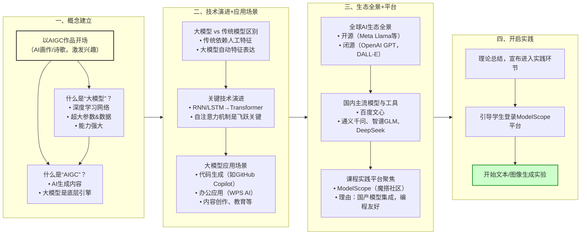

# 一、课程目标

 《AI思维与创造力第一课》第一天的课程旨在为学生提供一个直观、有趣的AI入门体验，让他们亲身感受人工智能在创作领域的强大能力。通过动手编写代码实践，学生将学习如何调用国内主流的开源AIGC模型进行文本生成和图像创作。课程的目标是激发学生对AI技术的深度兴趣，使他们不仅掌握调用AI模型的基本代码方法，还能理解其工作原理，并开始批判性地思考AI技术对传统创作领域的重塑作用。

```
第一天课程讲义/
├── I. 课程导入与核心概念/
│   ├── A. 开场演示与互动/
│   │   ├── 1. AIGC作品演示
│   │   └── 2. 提出引导性问题
│   ├── B. “大模型”概念定义/
│   │   ├── 1. 核心要素（参数、数据）
│   │   └── 2. 技术本质（表示学习模型）
│   └── C. “AIGC”概念定义/
│       ├── 1. AIGC基本概念
│       └── 2. 大模型与AIGC的关系
├── II. 技术溯源与生态全景/
│   ├── A. 技术演进/
│   │   ├── 1. 与传统模型的对比
│   │   └── 2. 关键技术突破（Transformer架构）
│   ├── B. AI生态全景介绍/
│   │   ├── 1. 全球主流模式（闭源API vs 开源社区）
│   │   └── 2. 国内生态格局（商业与开源并存）
│   └── C. 应用场景举例/
│       ├── 1. 生产力与内容创作领域
│       └── 2. 软件开发与科学研究领域
├── III. 提示词工程基础理论/
│   ├── A. 提示词的重要性/
│   │   ├── 1. “输入决定输出”原则
│   │   └── 2. 提示词是与AI高效沟通的语言
│   ├── B. 优质提示词的核心要素/
│   │   ├── 1. 清晰的角色扮演（Role-playing）
│   │   ├── 2. 明确具体的指令与上下文
│   │   ├── 3. 提供格式范例（Few-shot Learning）
│   │   └── 4. 限定输出的格式
│   └── C. 基础进阶技巧简介/
│       ├── 1. 思维链（Chain of Thought）的概念
│       └── 2. 如何引导模型进行逐步思考
├── IV. 实验环境介绍与平台聚焦/
│   ├── A. 主流开发模式讲解/
│   │   ├── 1. 纯线上模式（云端Notebook）
│   │   ├── 2. 完全本地化部署
│   │   └── 3. 线上/线下结合（API调用）
│   └── B. 课程实验平台聚焦/
│       ├── 1. ModelScope平台定位
│       ├── 2. 与其他平台的横向对比
│       └── 3. 本课程的平台选型理由
└── V. 实验环境熟悉与基础调用/
    ├── A. 实验准备与目标说明/
    │   ├── 1. 本节目标：熟悉环境并完成首次调用
    │   └── 2. 引导学生登录平台
    ├── B. “Hello, AI”基础实验/
    │   ├── 1. 实验任务：加载轻量级模型
    │   ├── 2. 代码实践：运行简单指令
    │   └── 3. 成功标准：模型返回合理回答
    └── C. 课堂答疑与总结/
        ├── 1. 解决环境与运行问题
        ├── 2. 确认所有学生准备就绪
        └── 3. 预告第二天AIGC创作实验
```
课程讲义的目录

# 二、课程主要内容


图：第一天课程的主要课程内容示意图

## （一）开场与核心概念定义

这部分内容对应提纲：什么是大模型、什么是AIGC。讲义应以一个引人入胜的AIGC作品（如AI画作或诗歌）开场，迅速抓住学生注意力。在引发好奇之后，直接切入正题，用这个实例来引出并清晰定义当天的两个核心概念。

1. 定义“大模型”： 首先解释，生成这个作品的“大脑”就是一个“大模型”。要用平实的语言向学生说明：大模型本质上是一个参数量巨大（达到千亿甚至万亿级别）的深度学习网络，它通过在海量的文本和图像数据上进行训练，学会了通用的规律和知识，从而具备了强大的理解和生成能力。
2. 定义“AIGC”： 接着阐明，我们看到的这些由AI创作的作品，就是“AIGC”（人工智能生成内容）。要讲清楚大模型与AIGC的关系：大模型是实现AIGC的底层技术引擎，而AIGC是大模型能力最直观的应用和体现。

这个环节的目标是快速、准确地为学生建立起本堂课两个最基本的知识坐标。

## （二）技术演进与应用场景 

这部分是对应提纲：大模型与传统模型的区别、大模型的应用场景。在学生知道了“是什么”之后，需要引导他们理解“从何而来”以及“能做什么”。

1. 阐述技术区别： 通过对比，帮助学生建立深度认知。可以提问：“大模型和我们以前学的传统机器学习模型（如SVM、决策树）有什么不一样？”以此引出核心区别：传统模型依赖人工设计的特征（Feature Engineering），而大模型的核心优势在于其强大的表示学习（Representation Learning）能力，它能自动从原始数据中学习到复杂的、深层次的特征。可以简要提及从RNN/LSTM到Transformer架构的演进，点明自注意力机制（Self-Attention） 是实现大模型能力飞跃的关键技术突破。
2. 展示应用场景： 将技术与现实世界连接。通过丰富、生动的案例，展示大模型在各个行业的应用。例如，在软件开发领域的代码生成（GitHub Copilot），在办公领域的文档处理（WPS AI），在内容创作领域的文案与设计，在教育领域的个性化辅导等。案例应多采用国内用户熟悉的产品，增强代入感。

## （三）生态全景介绍 

这部分是对应提纲：开源大模型介绍、常用AIGC工具介绍)这是构建学生宏观视野的关键部分。在了解了应用之后，需要向他们展示支撑这些应用的、百花齐放的全球及国内AI生态。

1. 介绍工具与模型： 按照我们之前讨论的“比较分析法”，在这里系统介绍主流工具。
	- 从OpenAI的GPT系列和DALL-E讲起，将其定位为技术发展的标杆和商业闭源模式的代表。
	- 引入Meta的Llama，作为推动全球开源生态发展的关键力量。
	- 聚焦到国内，介绍百度“文心一言”、月之暗面Kimi、字节跳动豆包等商业化产品，并重点突出我们课程将要实践的开源模型，如阿里的“通义千问”系列、智谱AI的GLM、深度求索的DeepSeek等。需要明确指出，这些开源模型是我们可以深入学习、研究甚至修改的宝贵资源。
2. 聚焦实验平台： 在介绍了众多模型之后，顺理成章地引出我们本次课程的统一“工作台”——ModelScope（魔搭）。在引导学生使用ModelScope之前，也需要对国内外的主流AI开发平台进行整体的介绍和比较。
   
## （四）动手实践环节的开启

讲义的理论部分至此结束，接下来将通过亲手编写代码，将理论付诸实践。引导全体学生登录ModelScope平台，打开预设好的Notebook环境，准备开始当天的文本和图像生成实验。这个环节是学生内化知识、建立“体感”的最重要一步，也是对当天所有理论内容的一次综合检验。

这个环节的重点是引导学生完成一次身份的转变——从AI应用的使用者，变为AI模型的调用者。对于计算机或数理背景的学生而言，仅仅停留在网页版的交互是远远不够的。这堂课的核心设计，就是带领他们“潜入后台”，用他们最熟悉的语言——代码，来直接与模型对话。这一步对于建立技术自信至关重要，它让学生明白，模型的能力是可以被精确、灵活地控制和调用的，也为后续学习更复杂的模型微调、应用开发等内容奠定了基础。

课程的第一个动手环节将聚焦于文本生成。学生们将在教师的引导下，进入一个预设好的云端编程环境，例如国内的“魔搭”（ModelScope）社区提供的Notebook。教师会提供一段简洁的Python代码，其核心是调用一个国内优秀的开源大模型，比如阿里的“通义千问Qwen2”或深度求索的“DeepSeek”。学生们初次运行代码，看到模型根据预设的提示词生成文本，这本身就是一个小小的成功。而真正的乐趣在于下一步：他们将亲手修改代码中的prompt变量，输入自己的奇思妙想，然后再次运行，观察模型如何理解并回应自己用代码发出的指令。

当学生们初步掌握了用代码控制语言的技巧后，课程将自然地过渡到更富视觉冲击力的图像生成。这个环节延续了之前的思路，即通过代码实现创造。教师将介绍如何在“魔搭”社区上找到并调用开源的文生图模型，例如“通义万相”系列。学生们会发现，他们刚才用来生成文本的逻辑，同样适用于生成图像。当看到自己写下的一行描述，比如“一只发光的机械鲸鱼在赛博朋克城市的星空中游弋”，通过几行代码就变成了一幅独一无二的视觉作品时，他们对AI创造力的理解会达到一个新的高度。

在两个核心的动手环节之后，必须留出充足的时间进行沉淀与反思。这时，教师的角色将转变为讨论的引导者。讨论不应是漫无目的的，而应紧密围绕学生们刚才的亲身经历展开。比如，可以让他们对比通过代码调用模型和直接使用网页版AI的感受差异，探讨开源模型与商业闭源API的利弊，并最终回归到一个更深层的问题：AI的“创作”与人类的创作，其根本区别究竟在哪里？这样的讨论能让实践中获得的零散感悟，升华为系统性的思考。

# 三、课程实验环境准备

在开始动手实验之前，我们有必要先了解一下当前进行AI大模型开发与实践的三种主流环境模式。理解它们的区别和优劣，能帮助大家更好地选择适合不同场景的工具，并理解我们本次课程为何采用特定的实验方式。整个课堂实践将统一在云端AI开发环境的模式下进行，后两种模式的介绍和演示，旨在为大家建立一个完整的技术视野。

# 四、总结

在第一天的课程中，学生将通过使用国内外的AI工具和平台，体验AI生成内容的实际应用。通过实践，学生将能够理解如何通过简单的输入生成创意文本和图像，并掌握生成模型的基本使用方法。通过这些工具和平台，学生不仅能体验到AI在创作中的无限可能，还能理解其技术原理，并激发他们对AI技术的探索兴趣。

课程的结尾，不应是一个句号，而应是一个引向未来的箭头。教师需要帮助学生把这90分钟的体验，定位为整个AI学习旅程的起点。要让他们明白，今天所学的代码调用方法，是未来进行模型微调、构建AI应用等一切更高级操作的基石。当学生们带着亲手生成的文本和图像，以及在讨论中激发的思考离开教室时，他们带走的不仅是一份新奇的体验，更是一份对未来技术探索的信心与方向感。

