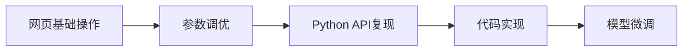

# 实验指南：从零到一掌握AIGC文生图—— 从网页体验到代码实现与模型微调

## 学习路径图

1.  **初阶（网页体验）：** 学会用简单的文字在网页上生成第一张AI画作。
2.  **进阶（参数调优）：** 深入了解网页“专业模式”下的各项参数，像专业摄影师一样精确控制画面。
3.  **高阶（代码实现）：** 揭开网页背后的技术面纱，用Python代码实现图片生成，为二次开发打下基础。
4.  **展望（模型微调）：** 理解扩散模型原理，了解如何让AI学习你的专属画风，开启真正的“定制化”创作（训练专属LoRA）。



-----

## 第一部分：初阶体验 —— 网页上的AI绘画魔法

在这个阶段，忘掉所有复杂概念，像玩一个在线游戏一样，感受AIGC的魅力。

1.  **访问创作平台：** 打开浏览器，进入 [ModelScope AIGC图片生成](https://modelscope.cn/aigc/imageGeneration) 页面。
2.  **熟悉界面：** 你会看到一个简洁的界面，核心是**模型选择**和**提示词输入框**。
4.  **编写提示词 (Prompt)：** 这是你与AI沟通的唯一方式。在输入框里，用文字描绘你想要的画面。
      * **第一次尝试：** 输入 `一只戴着墨镜的酷猫，骑着摩托车在海边公路上飞驰`。
      * **点击生成：** 稍等片刻，你的第一张AI画作就诞生了！
5.  **迭代优化：** 对结果不满意？尝试换一种说法，或者增加更多细节，比如 `一只表情严肃的英国短毛猫，戴着飞行员墨镜，骑着一辆复古哈雷摩托车，在夕阳下的加州一号公路上飞驰，电影感，高质量细节`。

**本阶段目标：** 成功生成图片，并理解“提示词”是影响结果的最核心因素。

-----

### 第二部分：进阶之路 —— 解锁专业生图参数

当你对基础操作熟练后，点击“高级”或“专业”选项卡，你会发现一片新天地。这些参数能让你从“许愿”变成“精确制导”。

> **参考链接：** [https://modelscope.cn/aigc/imageGeneration?imageId=12900062\&tab=advanced](https://modelscope.cn/aigc/imageGeneration?imageId=12900062&tab=advanced)

以下是对这些核心参数的详细解读：

**1. 采样方法 (Sampler)** 

- 作用： 这是AI在“去噪”过程中所使用的具体数学算法。AI绘画的本质，是从一张纯粹的噪点图开始，根据你的提示词，一步步地将噪点去除，最终呈现出清晰的画面。采样方法就是指导这个“去噪”过程的不同路径或技巧。

- 通俗理解： 如果说AI绘画是一位画家，那么不同的“采样方法”就是他掌握的不同绘画技巧或笔法。
	- 有的笔法（如 Euler a）大开大合，速度快，适合快速看效果、找灵感。
	- 有的笔法（如 DPM++ 2M Karras）则精雕细琢，细节更丰富，画面更稳定，但耗时稍长。

使用建议：
	- 新手推荐/通用型： DPM++ 2M Karras 或 DPM++ SDE Karras。它们在速度、稳定性和画面质量上取得了很好的平衡，是目前社区最常用的选择之一。
	- 追求速度： Euler a 或 DDIM。适合快速迭代，验证提示词的效果。
	- 追求画面锐利度/细节： 可以尝试 DPM++ 2S Ancestral，但它可能在画面一致性上稍差一些。

- 实验与发现： 对于同一组提示词和种子，更换不同的采样器，观察画面风格的细微变化，是很有趣的探索过程。

**2. 采样步数 (Sampling Steps)**

- 作用： 定义了采样器在“去噪”过程中执行的总步数。步数越多，AI思考和“描绘”的次数就越多。

- 通俗理解： 这就是画家完成一幅画所画的总笔触数量。
	- 步数太少（如低于15），画面可能模糊、细节缺失，像是未完成的草稿。
	- 步数增多（如20-40），画面细节会越来越丰富和清晰。
	- 步数过高（如超过60），画面质量的提升会变得不明显（收益递减），但生成时间会显著增加。

- 使用建议：
	- 通用范围： 20 到 40 步是绝大多数情况下的“甜点区”。
	- 快速预览： 使用 15-20 步来快速验证构图和色彩。
	- 精细出图： 当你确定了构图后，可以增加到 30-50 步来获取更丰富的细节。通常没有必要设置得过高。

**3. 提示词相关性 (CFG Scale / Guidance Scale)**

- 作用： 控制AI在多大程度上“听从”你的提示词（Prompt）。数值越高，AI的创作就越严格地遵循你的文字描述；数值越低，AI的“自由发挥”空间就越大。

- 通俗理解： 这是你给画家的**“指令遵从度”要求**。
	- 高CFG值： 你说“一只戴着红色帽子的猫”，AI会非常努力地画一只猫，并确保帽子是红色的，但可能会牺牲一些画面的自然感和艺术性，变得死板。
	- 低CFG值： AI听了你的指令，但觉得“也许蓝色的帽子更好看”，或者“这个场景加一只蝴蝶会更有趣”，从而进行更多的创意发挥。

- 使用建议：
	- 黄金范围： 5 到 10 是最常用的范围。7 是一个非常经典的起始值。
	- 追求创意/艺术感： 尝试 4-6，给AI更多空间。
	- 需要精确还原/写实风格： 尝试 8-12，确保AI严格执行你的指令，尤其是在画特定物体或细节时。
	- 过高（>15）： 画面可能出现色彩过于饱和、对比度过高、甚至“烧焦”的现象。
	- 过低（<4）： 画面可能与你的提示词“毫不相干”。

**4. 种子 (Seed)**

- 作用： 这是生成初始噪点图的起始编号。AI从这个编号开始，生成一张随机但唯一的噪点图，然后才开始去噪过程。

- 通俗理解： 这是每一幅画作的**“唯一身份证号”**。
	- 随机种子 (-1)： 每次点击生成，AI都会随机分配一个新的身份证号，因此你会得到一张全新的、不一样的图片。这是默认设置，用于“开盲盒”找灵感。
	- 固定种子（一个具体的数字）： 当你使用固定的种子时，只要所有其他参数（提示词、步数、CFG等）保持不变，你每次生成的图片都将是完全一样的。

- 使用建议：
	- 寻找灵感： 使用随机种子 (-1) 大量生成图片，直到你发现一张构图、角色或感觉特别好的。
	- 精细调整： 一旦找到满意的图片，立刻复制并固定它的种子值。然后，在此基础上，微调你的提示词（比如把“红裙子”改成“蓝裙子”）、改变采样步数或CFG Scale，你会发现只有你修改的部分发生了变化，而整体构图和角色会保持一致。这是进行精确创作的核心技巧。

**5. 图像尺寸 (Width & Height)**

- 作用： 控制生成图像的宽度和高度，即分辨率。

- 通俗理解： 这就是你给画家的画布尺寸。

- 使用建议：
	- 大多数基础模型（如Stable Diffusion 1.5）是在 512x512 或 768x768 的分辨率下训练的。直接生成远大于这个尺寸的图片，容易出现肢体重复、结构混乱等问题。
	- 推荐流程： 先在较低分辨率（如 512x768）下生成满意的构图，然后使用“高清修复”功能。

**6. 高清修复 (Hires. fix)**

- 作用： 一种用于生成高分辨率图像的两步流程，能有效避免直接高分辨率输出时产生的畸变。

- 通俗理解： 这是画家的一个专业技巧：先画草图，再放大精修。
	- AI首先在较低的分辨率下（如512x768）生成一张完整的图像（草图）。
	- 然后，它将这张低分辨率图像放大，并在其基础上，使用更多的步数和较低的重绘幅度，为其添加细节，最终输出高清大图。

- 使用建议：
	- 当你需要生成大于1024x1024的图片时，强烈建议开启此功能。
	- 重绘幅度 (Denoising strength)： 控制在第二步中AI修改原始低清图像的程度。通常设置在0.4到0.7之间。数值越低，与原图越像；数值越高，细节越多，但与原图的差异可能也越大。

**本阶段目标：** 学会通过调整上述参数，对生成的图片进行精确控制，实现特定的艺术效果。

-----

## 第三部分：高阶揭秘 —— 用代码实现图片生成

现在，我们揭开网页操作的“黑盒”，用Python代码复现并超越网页上的所有操作。

**1. 环境准备**

```bash
# 安装 modelscope 核心库
pip install modelscope
# 安装深度学习框架 (以PyTorch为例)
pip install torch torchvision
```

**2. 编写Python代码**

```python
import torch
from modelscope.pipelines import pipeline
from modelscope.utils.constant import Tasks

# --- 这部分对应网页上的“模型选择” ---
# 模型ID可以在模型详情页找到，例如通义万相
model_id = 'damo/multi-modal_gemini-vit-large-patch14'
pipe = pipeline(task=Tasks.text_to_image_synthesis, model=model_id, device="cuda")

# --- 这部分对应网页上的“提示词”和“专业参数” ---
prompt = "一只表情严肃的英国短毛猫，戴着飞行员墨镜，骑着一辆复古哈雷摩托车，在夕阳下的加州一号公路上飞驰，电影感，高质量细节"

# 将网页上的专业参数，转化为代码中的参数字典
# 注意：代码中的参数名可能与网页标签略有不同，需参考模型文档
adv_params = {
    "num_inference_steps": 30,  # 采样步数 (Steps)
    "guidance_scale": 7.5,      # 提示词相关性 (CFG Scale)
    # "seed": 12345678,         # 如果需要固定种子，取消这行注释
    # 更多参数...
}

# --- 这部分对应点击“生成”按钮 ---
input_data = {'text': prompt, **adv_params}
images = pipe(input_data)

# --- 保存结果 ---
output_image = images['output_imgs'][0]
output_image.save("my_cool_cat_by_code.png")

print("图片已通过代码成功生成！")
```

**本阶段目标：** 理解网页上的每一个选项都可以通过代码参数来精确对应。掌握用代码生成图片的能力，是进行自动化处理和二次开发的基础。

-----

## 第四部分：展望未来 —— 从生成到模型微调

你已经能熟练生成图片了，但如何让AI画出**你自己的专属角色**或者**你独特的画风**呢？答案是**模型微调（Fine-tuning）**。

  * **是什么？** 微调，就是用你自己的数据集（比如10-20张你家猫的照片，或者你喜欢的某种艺术风格的画作），在一个强大的基础模型上进行“补充训练”。AI会“记住”你给它的这些新知识。
  * **如何实现？** 这个过程与你已经学习的路径完全一致：
    1.  **网页实践：** ModelScope平台同样提供“在线训练”功能，你可以上传数据集，通过网页表单配置参数，一键启动模型微调。
    2.  **代码实现：** ModelScope也提供了相应的训练（Trainer）脚本，让你能用代码更灵活地控制微调的全部过程。
  * **学以致用：** 你在第三部分学习的代码生成能力，正是检验你微调成果的工具。当你微调出一个专属模型后，只需在代码中更换`model_id`为你的新模型ID，就能调用它来进行创作了！

**原理探究 - 解密参数背后的技术**

|操作参数|对应技术原理|学习资源|
|:---|:---|:---|
|采样步数|扩散模型迭代去噪过程|[论文]Denoising Diffusion Probabilistic Models|
|引导系数|分类器无关引导(Classifier-Free Guidance)|[博客] Hugging Face CFG详解|
|LoRA模型|低秩矩阵微调技术|[论文] LoRA: Low-Rank Adaptation of LLMs|
|采样器选择|随机微分方程求解策略|[教程] Stability AI采样器白皮书|

**微调实战（训练专属风格）**

~~~
# 使用ModelScope微调LoRA
from modelscope import MsDataset, Model, LoRAConfig

# 准备数据集（10张水墨画）
dataset = MsDataset.load('my_ink_style_dataset', custom_path='./ink_images/')

# 配置LoRA微调
lora_config = LoRAConfig(
    rank=8,  # 矩阵秩
    target_modules=['attn1', 'attn2']  # 作用于Attention层
)

# 启动训练
model = Model.from_pretrained('stable_diffusion_v1.5')
model.fit_lora(
    dataset, 
    lora_config, 
    work_dir='./lora_ink_output'
)
~~~

-----

## 总结

恭喜你走完了从入门到精通的完整学习路径！

终极学习目标：从技术使用者成长为**创意架构师**,绘制出自己的技术美学——不仅会调参生图，更能设计生成范式，用算法放大人类想象力的边界！

**记住这个公式**：惊艳作品 = 艺术直觉 × (技术理解)^2 + 持续实验