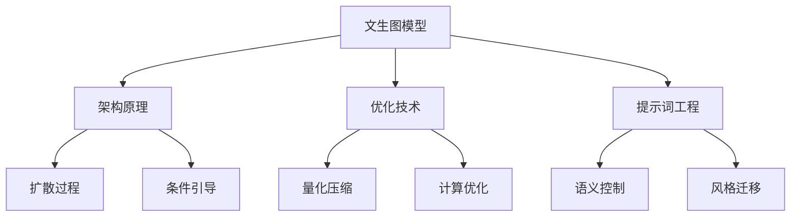
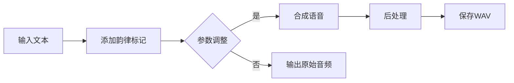

# 第二天：提示词工程的创作艺术——从指令到杰作

在第一天掌握了AI的基础理论和初级交互方法后，第二天的目标是将大家从“AI的调用者”提升为**AI的创意导演**。我们将深入探索文本、图像、音视频三大核心AIGC模态，学习如何通过更高级的提示词工程，精准、高效地驾驭AI完成具有深度和美感的创作任务。最终，我们将所有技能融会贯通，完成一个属于自己的、跨模态的AIGC作品。

## 模块五：文本生成——语言模型的智慧密码

### 5.1 Transformer架构：现代AI的基石

现代大型语言模型的核心建立在Transformer架构之上，这一革命性架构由Google于2017年提出，彻底改变了自然语言处理的发展轨迹。Transformer的核心创新在于完全依赖注意力机制，摒弃了传统的循环神经网络结构，从而在并行处理和长距离依赖建模方面取得了突破。

Transformer的工作原理可以通过一个简单的类比来理解：想象一下，在阅读一篇文章时，大脑并非逐字处理，而是能够同时关注多个词汇之间的关系，理解它们如何相互作用以构成完整的语义。这正是自注意力机制的核心思想。

从数学层面来看，自注意力通过三个关键向量实现：Query（查询）、Key（键）和Value（值）。对于输入序列中的每个词汇，系统会生成这三个向量，然后通过点积运算计算注意力分数。经过softmax归一化后，得到注意力权重，最终通过加权求和生成输出。这个过程的数学表达式为：

$$
Attention(Q, K, V) = softmax(\frac{QK^T}{\sqrt{d_k}})V
$$

多头注意力机制进一步增强了模型的表达能力。通过并行运行多个注意力头，每个头可以关注不同类型的语言关系，例如语法结构、语义相关性或位置信息。这种设计使模型能够从多个角度理解文本，就像人类在阅读时同时处理语法、语义和语用信息一样。

完整的Transformer架构采用编码器-解码器结构，每一层都包含多头自注意力、位置前馈网络以及残差连接和层归一化。这种设计确保了信息的有效传递和梯度的稳定反向传播，从而使模型能够扩展到数千亿参数的规模。

### 5.2 核心原理与关键参数

##### 5.2.1 自回归语言模型的工作原理

语言模型的本质是对下一个词的概率分布进行预测。当我们输入一段文本时，模型会基于已有的内容，计算出各个可能的下一个词出现的概率，并选择最合适的词进行输出。

**工作流程图解：**

1.  输入提示词序列 X₁, X₂, …, Xₙ
2.  模型计算条件概率 P(X_{n+1} | X₁, X₂, …, Xₙ)
3.  根据概率分布选择下一个词 X_{n+1}
4.  将新生成的词加入序列
5.  重复步骤2-4，直到生成完整内容或达到设定的长度

**核心文献参考：**

- Vaswani, A., et al. (2017). “Attention Is All You Need”
- Radford, A., et al. (2018). “Improving Language Understanding by Generative Pre-Training”
- Brown, T. B., et al. (2020). “Language Models are Few-Shot Learners”

##### 5.2.2 关键参数详解

**Temperature（温度）**

温度参数是控制模型输出的随机性或创造性的关键。它通过调整概率分布的"尖锐度"来平衡输出的确定性和创造性。

- **低温度值（0.1-0.5）：** 输出更确定，更保守，总是选择概率最高的词，适用于问答和翻译等需要高准确性的任务。
- **中温度值（0.6-0.9）：** 平衡确定性和创造性，适合一般内容生成。
- **高温度值（1.0-2.0）：** 输出更多样化，更创造性，但可能偏离主题，适合创意写作和头脑风暴。

温度参数的数学定义：

$$
P(x_i) = \frac{\exp(logits_i/temperature)}{\sum_j \exp(logits_j/temperature)}
$$

**类比理解：**

- **温度=0：** 如同严格遵循食谱的厨师，一丝不苟
- **温度=0.7：** 如同有创意但不离谱的厨师，适度创新
- **温度=1.0以上：** 如同实验性厨师，结果新颖但风险高

**Top-k和Top-p采样**

这两种方法控制模型在生成每个词时考虑的候选词范围。

- **Top-k采样：** 将模型的选择范围限制在概率最高的k个词汇中。
- **Top-p采样（核采样）：** 根据累积概率动态确定候选词汇的数量。例如，Top-p=0.9表示模型只考虑累积概率达到90%的词。

在实际应用中，这些参数通常需要结合使用。例如，创意写作可能采用 `temperature=1.0`, `top_p=0.9`, `top_k=40` 的组合，而代码生成则更适合 `temperature=0.1`, `top_p=0.95`, `top_k=20` 的设置。

* * *

**演示示例：**  
好的，这个演示示例需要将概念性的`generate_text`函数替换为在ModelScope中实际调用模型的代码。以下是如何在ModelScope Notebook环境中执行这个实验的完整步骤和代码。

### 在ModelScope中执行温度参数对比实验

您可以在ModelScope Notebook中，通过以下两步来完成这个实验。

#### 第一步：准备环境与加载模型

首先，我们需要导入ModelScope的`pipeline`，并加载一个用于文本生成的预训练模型。这里我们使用第一天课程中已经接触过的`damo/nlp_gpt3_text-generation_chinese-base`模型作为示例。

#### 第二步：编写代码执行对比生成

接下来，我们将原始的演示代码进行改造。我们定义一个提示词（prompt）和一组需要测试的温度值，然后通过一个循环来调用模型并打印结果。

```python
# 1. 导入必要的模块
from modelscope.pipelines import pipeline
from modelscope.utils.constant import Tasks

# 2. 加载用于文本生成的AI模型
# 这一步会初始化pipeline，并自动下载所需的模型文件
print("正在加载模型，请稍候...")
chat_pipeline = pipeline(
    task=Tasks.text_generation,
    model='damo/nlp_gpt3_text-generation_chinese-base',
    model_revision='v1.0.1'
)
print("模型加载完成!")

# 3. 准备实验所需变量
prompt = "人工智能的未来发展将会"
temperatures_to_test = [0.2, 0.7, 1.2]

print(f"\n实验提示词: '{prompt}'")
print("="*50)

# 4. 循环测试不同温度参数
for temp in temperatures_to_test:
    print(f"\n正在使用 temperature = {temp} 进行生成...")
    
    # 调用模型，并传入当前的温度参数
    # do_sample=True 是必须的，这样temperature参数才会生效
    result = chat_pipeline(
        prompt,
        max_length=100,
        temperature=temp,
        do_sample=True  
    )
    
    # 打印对应温度下的生成结果
    print(f"输出结果: {result['text']}")
    print("-"*40)

```

### **代码解释**

1.  **加载模型**：我们使用`pipeline(task=Tasks.text_generation, model=...)`来创建一个能够执行文本生成任务的管道实例。
2.  **定义变量**：`prompt`是我们要给AI的输入，`temperatures_to_test`是一个包含所有待测试温度值的列表。
3.  **循环生成**：我们使用一个`for`循环遍历列表中的每一个温度值。
4.  **调用模型**：在循环内部，我们调用`chat_pipeline()`函数。
    - 第一个参数是我们的`prompt`。
    - `max_length=100`限制了生成内容的最大长度 。
    - `temperature=temp`将当前循环的温度值（0.2, 0.7或1.2）传递给模型 。
    - `do_sample=True`是一个关键参数，它告诉模型要进行采样生成。只有在采样模式下，`temperature`参数才能控制输出的随机性
5.  **打印结果**：`result['text']`用于提取并显示AI生成的文本内容 。

### 预期输出分析

当您运行以上代码后，将会看到类似下面的输出（具体内容每次可能不同）：

- **温度 = 0.2 时**：输出的文本会非常确定和保守 。模型倾向于重复概率最高的词，内容可能显得有些死板或重复。
- **温度 = 0.7 时**：输出在确定性和创造性之间取得了平衡 。这通常是生成流畅、合理且带有一点新意内容的好选择。
- **温度 = 1.2 时**：输出会变得非常多样化和有创造力，但也可能偏离主题或出现逻辑不通顺的地方。这适用于需要头脑风暴或创意写作的场景。

通过这个实验，您可以直观地感受到`temperature`这个关键参数是如何像一个“创意旋钮”一样，精确地调控AI生成内容的风格。

* * *

##### 5.2.3 Token化与上下文窗口

- **Token的概念：** Token是模型处理文本的基本单位，可能是单词、词的一部分或标点符号
    - 中文通常按字符切分，英文则可能按词或子词切分
    - 一般而言，1个汉字≈1个token，1个英文单词≈1-2个token
- **上下文窗口限制：** 模型能处理的最大token数（如GPT-4为8K-32K）
    - 超出窗口的内容会被截断，影响模型对全局的理解

### 5.3 进阶提示词技术与创作模式

##### 5.3.1 链式思维推理（Chain-of-Thought, CoT）

链式思维推理（Chain-of-Thought, CoT） 是提示词工程的一大突破。这项技术通过引导模型展示其逐步推理过程，显著提高了在复杂任务上的准确性。CoT的核心思想是模仿人类解决问题的思维过程，将一个复杂问题分解为一系列逻辑步骤。

- **Few-shot CoT：** 在这种方法中，我们会提供包含推理过程的示例，让模型学习这种思维模式。例如，在解决数学问题时，我们不仅提供答案，还会展示完整的计算过程。这种方式让模型理解"如何思考"，而不仅仅是"如何回答"。
- **Zero-shot CoT：** 这种方法更为简洁高效，仅需通过如"请一步一步思考这个问题"这样的提示词，就能激发模型的推理能力。这种方法的有效性表明，大型语言模型内部已经学习了推理模式，只需要适当的提示即可激活这些能力。

##### 5.3.2 费曼技巧模式

**核心思想：** 要求AI以简单明了的方式解释复杂概念，就好像在向一个10岁的孩子解释一样。

**提示词模板：**

```
请使用费曼技巧，向一个10岁的孩子解释[复杂概念]。要求：
1. 使用简单的日常语言
2. 避免专业术语，必要时给出类比
3. 使用具体的例子
4. 步骤化拆解复杂过程
5. 总结为3-5个要点
```

**示例：费曼技巧解释"量子纠缠"**

量子纠缠就像有魔法的一对手套。当你把这对手套分开，每个给了不同的朋友，即使他们相距很远，这对手套仍然"知道"对方在做什么。

如果左手套朝上，右手套总会朝下。如果你突然翻转左手套，右手套会立刻变成相反方向！这不是因为手套里有小信号，而是因为这对手套在量子世界里仍然是"连在一起"的。

科学家们不完全理解为什么会这样，但他们可以用这种奇怪的联系来制造超级计算机和安全的通信方式。

##### 5.3.3 风格迁移模式

**核心思想：** 要求AI模仿特定作者、角色或文体的写作风格。

**提示词模板：**

```
请以[特定作者/角色]的风格，创作一段关于[主题]的文字。

风格特点包括：
1. [特点1]
2. [特点2]
3. [特点3]

文本应当包含以下要素：
- [要素1]
- [要素2]
- [要素3]

长度约[X]字。
```

**示例：鲁迅风格的AI科技评论**

请以鲁迅的风格，写一篇关于"人工智能发展"的短评。

风格特点包括：

1.  讽刺辛辣，句式简练有力
2.  使用反问句和排比句
3.  借物喻人，深刻揭露社会现象

文本应当包含以下要素：

- 对技术崇拜的批判
- 对人性本质的思考
- 对未来发展的忧思

长度约300字。

##### 5.3.4 故事引擎模式

**核心思想：** 构建一个结构化的故事生成框架，包含角色、背景、冲突和情节发展。

**提示词模板：**

```
请创作一个关于[主题]的故事，遵循以下结构：

1. 设定：
   - 时间：[时间背景]
   - 地点：[地点背景]
   - 主角：[主角设定]，性格特点(After-Class Exercises)**是[特点]
   
2. 情节发展：
   - 开端：[冲突或问题的引入]
   - 发展：[尝试解决问题]
   - 高潮：[关键转折点]
   - 结局：[问题解决方式]
   
3. 主题：故事应该传达[主题/教训]的思想
4. 风格：采用[风格]的叙事方式

长度约[X]字。
```

##### 角色对话模式

**核心思想：** 通过多角色对话形式探讨复杂话题，展现不同视角。

**提示词模板：**

```
请创作一段关于[话题]的对话。对话应包含以下角色：

1. [角色1]：[该角色的立场和特点]
2. [角色2]：[该角色的立场和特点] 
3. [角色3]：[该角色的立场和特点]

对话应包含以下要点：
- [讨论点1]
- [讨论点2]
- [讨论点3]

每个角色的观点应当合理且有说服力，体现其独特视角。
对话应当自然流畅，长度约[X]字。
```

* * *

## 模块六：图像生成——从噪音到艺术的炼金术

### 6.1 扩散模型：重新定义图像生成的数学美学

扩散模型的出现标志着图像生成技术的重大突破，其核心思想源于非平衡热力学中的扩散过程。这类模型将图像生成过程分解为两个相互逆转的马尔可夫链：

- **前向过程：** 逐步向数据添加高斯噪声，直至其完全变成随机噪声。
- **反向过程：** 学习从噪声中逐步恢复原始数据。

**DDPM（Denoising Diffusion Probabilistic Models）** 由Ho、Jain和Abbeel于2020年提出，为扩散模型奠定了理论基础。在训练过程中，模型学习预测每个时间步添加的噪声。通过最小化预测噪声与真实噪声之间的差异，模型逐渐学会了图像的统计分布。

**DDIM（Denoising Diffusion Implicit Models）** 是由Song、Meng和Ermon于2020年提出的关键改进，它将采样过程从1000步大幅减少到50-100步，实现了10-50倍的速度提升。更重要的是，DDIM引入了确定性采样，使得相同的输入噪声总能产生相同的结果，为图像编辑和插值应用奠定了基础。

扩散过程的可视化可以帮助我们更好地理解这一过程：想象一张清晰的照片逐渐被雪花覆盖，直到完全看不清原始内容。扩散模型的任务就是学习这个过程的逆向操作——从雪花纷飞中还原出原始图像。这种循序渐进的生成方式不仅保证了图像质量，还提供了强大的可控性。

**核心文献参考：**

- Ho, J., et al. (2020). “Denoising Diffusion Probabilistic Models”
- Song, J., et al. (2020). “Denoising Diffusion Implicit Models”
- Rombach, R., et al. (2022). “High-Resolution Image Synthesis with Latent Diffusion Models”

### 6.2 Stable Diffusion：工程实现的典范

Stable Diffusion（Rombach et al., 2022）是扩散模型从研究走向应用的成功典范，其巧妙的架构设计使得高质量图像生成变得大众化。整个系统可以概括为：**Stable Diffusion = VAE + U-Net + CLIP**。

- **VAE（变分自编码器）：** 负责数据压缩，将512x512x3的图像压缩到64x64x4的潜在空间，实现了8:1的压缩比。这种设计不仅大幅降低了计算量，还使得在消费级GPU上运行成为可能。
- **U-Net网络：** 是去噪过程的核心，其编码器-解码器结构和跳跃连接能有效处理不同尺度的图像特征。U-Net的860M参数专门用于学习去噪过程，而时间嵌入则确保模型能处理不同的去噪时间步。
- **CLIP模型（Radford et al., 2021）：** 作为文本到图像的语义桥梁，将文本描述转换为512维嵌入向量，通过交叉注意力机制指导图像生成过程。这种设计使得用户可以通过自然语言精确控制图像生成，实现了真正的"文生图"。

### 6.3 提示词工程：数字艺术的魔法公式

##### 6.3.1 提示词结构化公式

掌握图像生成的提示词技术，就像学习一门新的艺术语言。一个标准的提示词结构遵循以下模式：`[主体描述] + [细节描述] + [场景/环境] + [光照/氛围] + [艺术风格] + [技术参数]`，每个部分都发挥着特定的作用。

**\[主体描述\] + \[细节描述\] + \[场景/环境\] + \[光照/氛围\] + \[艺术风格\] + \[技术参数\]**

例如：  
`一位戴着圆形眼镜的年轻女科学家 | 在充满未来感的实验室中 | 正在操作全息投影界面 | 蓝色霓虹灯光映照 | 赛博朋克风格 | 8k超高清，细节丰富，电影感镜头`

##### 6..3.2 正向提示词与反向提示词

在AI绘画（如Stable Diffusion, Midjourney等）的世界里，精准控制图像生成是实现创意构想的关键。其中，**正向提示词 (Positive Prompts)** 与 **反向提示词 (Negative Prompts)** 如同创作的左右手，二者协同作用，引导AI模型将脑海中的画面精准地转化为数字画布上的艺术品。

**正向提示词 (Positive Prompts)**

正向提示词是您用来**描述希望在画面中看到什么内容**的指令集合。它是图像生成的核心驱动力，定义了画面的**主体、风格、构图、光影、色彩和细节**等一切积极元素。一个好的正向提示词，就如同一份清晰详细的蓝图，为AI的创作指明了方向。

**核心作用：**

- **定义内容：** 画面里有什么？（例如：一个女孩、一条龙、一座未来城市）
- **确定画风：** 图像的艺术风格是什么？（例如：照片级真实、梵高风格、动漫、水墨画）
- **描绘细节：** 主体的特征、环境、光线等。（例如：女孩有金色的长发、傍晚柔和的光线、背景是樱花树林）
- **提升品质：** 强调图像的质量。（例如：杰作、最高品质、8K、超精细细节）

**示例：**  
`masterpiece, best quality, 1girl, solo, long hair, blonde hair, blue eyes, sailor uniform, cherry blossoms, outdoor, gentle sunlight, cinematic lighting, (photorealistic:1.2)`  
*(一个杰作，最高品质，一个女孩，单人，金色长发，蓝色眼睛，穿着水手服，在室外樱花树下，柔和的阳光，电影感光照，照片级真实感权重为1.2)*

**反向提示词 (Negative Prompts)**

反向提示词则是您用来**告诉AI不希望在画面中看到什么内容**的指令。它扮演着“过滤器”和“修正师”的角色，主要用于**规避常见的AI绘图缺陷、排除不需要的元素、提升画面整体的整洁度和美感**。

**核心作用：**

- **规避缺陷：** 避免生成崩坏的图像。（例如：多余的手指、扭曲的四肢、丑陋的面部）
- **排除元素：** 移除不想要的内容或风格。（例如：文字、水印、模糊、卡通感）
- **提高纯净度：** 确保画面符合特定的美学标准。（例如：避免低分辨率、糟糕的构图、过曝或欠曝）

**示例：**  
`NSFW, (worst quality, low quality:1.4), (deformed, distorted, disfigured:1.3), poorly drawn, bad anatomy, wrong anatomy, extra limb, missing limb, floating limbs, (mutated hands and fingers:1.4), disconnected limbs, mutation, mutated, ugly, disgusting, blurry, amputation, text, watermark, signature`  
*(不健康内容，最低品质和低品质（权重1.4），畸形/扭曲（权重1.3），画得差，解剖结构错误，多余/缺失的肢体，漂浮的肢体，变异的手和手指（权重1.4），肢体不连贯，变异，丑陋，恶心，模糊，截肢，文字，水印，签名)*

| 特性  | 正向提示词 (Positive Prompts) | 反向提示词 (Negative Prompts) |
| :--- | :--- | :--- |
| **功能** | **“加法”** — 添加想要的元素和风格 | **“减法”** — 剔除不想要的元素和缺陷 |
| **目的** | 构建画面的核心内容与美学方向 | 优化画面质量，进行纠错和提纯 |
| **关系** | 主导创作方向，是生成图像的基石 | 辅助和修正，是提升图像质量的保障 |
| **必要性** | **必需。** 没有它，AI不知道画什么。 | **非必需，但强烈推荐。** 它能极大提升出图的成功率和美观度。 |

**协同关系：**  
正向与反向提示词的关系是**相辅相成、缺一不可**的。正向提示词负责“画什么”和“画多好”，而反向提示词负责“不画什么”和“别画砸”。一个强大的正向提示词可能因为缺少反向提示词的约束，而产生一张细节完美但解剖结构怪异的图像。反之，仅有反向提示词而没有正向提示词，AI则完全失去了创作目标。

掌握提示词是不断实践和迭代的过程。以下是一些行之有效的使用技巧：

**正向提示词技巧：**

1.  **从核心到细节：** 遵循“**主体 → 风格/媒介 → 环境/构图 → 细节/光影 → 质量词**”的顺序构建，逻辑更清晰。
    
    - **示例：** `1girl` (主体) → `by Makoto Shinkai` (画风) → `in a classroom at sunset` (环境) → `golden hour lighting, detailed background` (光影细节) → `masterpiece, best quality` (质量)。
2.  **词汇具体化：** 避免使用模糊的词。用 `a sports car` 不如用 `a red Ferrari LaFerrari`；用 `beautiful` 不如用 `symmetrical face, delicate features, sparkling eyes`。
    
3.  **使用权重：** 当你希望AI特别关注某个词时，可以使用括号和冒号来增加其权重。语法通常是 `(keyword:weight)`。
    
    - `weight > 1` 表示强调，如 `(blue dress:1.3)`。
    - `weight < 1` 表示减弱，如 `(smile:0.8)`。
    - 多层括号 `((keyword))` 也是一种常见的增强权重方式。
4.  **借鉴与融合：** 参考优秀的AI作品的提示词，学习其结构和用词。尝试将不同艺术家的风格（`in the style of Van Gogh and Hokusai`）或概念（`a cat wearing astronaut helmet`）进行融合，创造新意。
    

**反向提示词技巧：**

1.  **建立“通用模板”：** 大多数AI绘画的常见问题是共通的。你可以创建一个包含普适性负面词的“基础模板”，每次作画时直接使用，然后再根据具体情况微调。上文的反向提示词示例就是一个很好的起点。
    
2.  **“哪里不满意，就否定哪里”：** 如果你发现生成的图片总是出现不想要的东西（比如画面中总是有树），就在反向提示词中加入 `tree`。如果人物画得太像3D模型，就加入 `3d, render, CGI`。
    
3.  **针对性修正：**
    
    - **修复手部：** `bad hands, poorly drawn hands, extra fingers, fewer fingers`
    - **避免崩坏：** `ugly, deformed, disfigured, bad anatomy`
    - **提升画质：** `lowres, bad quality, blurry, jpeg artifacts`
    - **去除杂项：** `text, watermark, signature, username`
4.  **保持简洁：** 虽然一个全面的反向提示词很有用，但过于冗长和矛盾的指令可能会让AI感到困惑。优先解决最影响画面的核心问题。
    

正向提示词是建筑师的设计蓝图，决定了建筑的宏伟与风格；反向提示词则是严谨的施工监理，确保建筑不会出现裂缝和瑕疵。熟练地运用这两者，你就能从一个AI的使用者，转变为一个能够驾驭AI进行精准艺术创作的“魔法师”，将无穷的想象力变为触手可及的视觉盛宴。

##### 6.3.3 关键词分类词库

- **主体描述词**
    - 人物：年轻女子，老人，儿童，商务人士…
    - 动物：猫，狮子，鹰，海豚…
    - 物体：古董钟表，宇宙飞船，水晶球…
    - 概念：爱，自由，孤独，希望…
- **细节描述词**
    - 服装：丝绸裙装，重型盔甲，破旧外套…
    - 表情：微笑，惊讶，沉思，悲伤…
    - 姿势：站立，跳跃，俯卧，舞蹈…
    - 动作：奔跑，思考，创造，战斗…
- **场景/环境词**
    - 自然：森林，海滩，山脉，星空…
    - 人造：未来都市，古代神殿，实验室…
    - 抽象：梦境，量子空间，精神领域…
- **光照/氛围词**
    - 时间：黎明，日落，午夜，黄金时刻…
    - 天气：雨天，大雾，阳光明媚，暴风雪…
    - 光源：烛光，霓虹灯，柔和自然光…
    - 情绪：神秘，欢快，忧郁，宁静…
- **艺术风格词**
    - 绘画风格：油画，水彩，素描，版画…
    - 艺术流派：印象派，超现实主义，极简主义…
    - 视觉风格：电影胶片，动漫，像素艺术，蒸汽朋克…
    - 时代风格：文艺复兴，巴洛克，现代主义…
- **技术参数词**
    - 质量：8k，超高清，高细节…
    - 视角：特写，广角，鸟瞰，微距…
    - 镜头：35mm，长焦，鱼眼…
    - 渲染：逼真，体积光，环境光遮蔽…

#### 6.3.4 提示词优化技巧

- **权重控制语法** 提供了精确的控制机制。
    - 使用 **括号 ()** 增加权重：`(关键词)` 相当于1.1倍权重，`((关键词))` 相当于1.21倍权重。
    - 使用 **方括号 \[\]** 降低权重：`[关键词]` 降低到0.9倍权重。
    - 使用 **数字权重** 如 `(关键词:1.5)` 提供更精确的控制。
- **负向提示词** 的重要性不容忽视，它们对最终图像质量有决定性影响。常用的负向提示词包括：
    - 质量相关：“low quality, blurry, distorted”
    - 解剖问题：“bad anatomy, extra limbs, poorly drawn hands”
    - 构图问题：“watermark, signature, cropped”

#### 6.3.5 提示词实例分析

以下是一个完整的提示词示例，及其构成要素解析：

`((精致的中国山水画)), 烟雾缭绕的高山|清澈的流水|茂密的松树, 远处有小村落和亭台楼阁, 晨雾弥漫|金色阳光穿透云层, 传统水墨画风格 AND 现代数字艺术, 8k超高清|细节丰富|和谐构图`

- **解析：**
    - **主体：** `((精致的中国山水画))` - 双括号强调核心主题
    - **细节：** `烟雾缭绕的高山|清澈的流水|茂密的松树` - 使用|分隔多个细节
    - **场景：** `远处有小村落和亭台楼阁` - 补充环境元素
    - **光照/氛围：** `晨雾弥漫|金色阳光穿透云层` - 设定氛围和光线条件
    - **艺术风格：** `传统水墨画风格 AND 现代数字艺术` - 混合两种风格
    - **技术参数：** `8k超高清|细节丰富|和谐构图` - 控制输出质量和构图

### 6.4 风格控制与质量优化的艺术

不同类型的图像需要不同的提示词策略。**人像类图像**：应重点描述面部特征、表情和光照，使用"detailed eyes, natural skin texture, professional lighting"等关键词。**风景类图像**：则需要##详细的环境描述，包括时间、天气和大气效果。

质量优化不仅依赖于提示词，**参数设置**同样关键。

- **CFG Scale：** 控制提示词的遵循程度，通常设置在7-15之间。
- **采样步数：** 20-50步即可获得良好效果。
- **分辨率：** 建议从512x512开始，必要时可通过AI放大工具提升。

**后处理技术** 包括使用 Real-ESRGAN 等AI放大工具提升分辨率，通过 inpainting 修复局部问题，以及使用 img2img 进行风格调整。这些技术的组合应用，能够将AI生成的图像提升到专业水准。

* * *

### *动手实验2.1：在 ModelScope 上运行 Stable Diffusion XL 文生图模型*

1.  **对比感知**：亲身体验在“资源充足”和“资源受限”两种情境下，文生图模型的性能差异。
2.  **技能掌握**：熟练运用`FP16`、`xformers`等关键技术，对大型AI模型进行显存和速度优化。
3.  **创意聚焦**：将技术配置与创意过程分离，掌握提示词工程（Prompt Engineering）的核心技巧，高效地产出高质量作品。

#### （1）实验环境准备

我们继续使用昨天的ModelScope Notebook环境。首先，运行下面的单元格来安装必要的库并加载模型。

```python
# =======================================================
# Part 1: 环境设置与模型下载 (每次实验开始时运行)
# =======================================================
# 安装/更新必要的库
!pip install diffusers transformers accelerate safetensors invisible-watermark xformers -q
!pip install modelscope -U -q

import torch
from diffusers import DiffusionPipeline
from modelscope import snapshot_download
import time

# 检查环境
print(f"PyTorch 版本: {torch.__version__}")
if not torch.cuda.is_available():
    print("错误：GPU不可用，请确认您选择的实例规格包含GPU。")
else:
    print(f"GPU 可用: True")
    print(f"GPU 型号: {torch.cuda.get_device_name(0)}")

# 使用 ModelScope 下载模型（会自动使用缓存，不会重复下载）
# [注意] 此处使用的SDXL基础模型主要针对英文优化，但对中文有一定的理解能力。
# 如需最佳中文效果，可替换为 'damo/text-to-image-synthesis-stable-diffusion-chinese-base' 等中文原生模型。
# 但为了课程统一，我们继续使用SDXL进行演示。
print("\n正在准备模型文件...")
model_dir = snapshot_download("AI-ModelScope/stable-diffusion-xl-base-1.0", revision='v1.0.9')
print("模型文件准备完毕！")

# ----------------- 一个简单的显存监控函数 (辅助工具) -----------------
def get_gpu_memory_usage():
    """返回当前GPU已用显存（单位MB）"""
    if torch.cuda.is_available():
        return torch.cuda.memory_allocated(0) / (1024 ** 2)
    return 0
```

* * *

#### （2）实验A：基线测试 - 无优化的直接加载

**实验目的**：模拟在计算资源非常充裕（例如拥有 >40GB 显存的专业显卡）的“理想情况”下，模型的加载和运行方式。我们将使用全精度（FP32）加载，不开启任何性能优化。

```python
# =======================================================
# 实验 A: 基线测试代码
# =======================================================
print("--- 开始实验 A：无优化加载 (全精度 FP32) ---")

# 记录开始时间和显存
mem_before = get_gpu_memory_usage()
start_time = time.time()

# 1. 以默认的全精度(FP32)加载模型
try:
    pipe_baseline = DiffusionPipeline.from_pretrained(
        model_dir,
        torch_dtype=torch.float32,
        use_safetensors=True
    ).to("cuda")

    load_time = time.time() - start_time
    mem_after_load = get_gpu_memory_usage()
    print(f"模型加载完成。耗时: {load_time:.2f} 秒")
    print(f"加载后，模型占用显存: {mem_after_load - mem_before:.2f} MB")

    # 2. 生成一张 1024x1024 的图像
    # [中文提示词替换]
    prompt = "一张可爱小狗在花丛中玩耍的照片"
    print(f"\n开始生成图像 (1024x1024)，提示词: '{prompt}'")
    
    gen_start_time = time.time()
    image_baseline = pipe_baseline(prompt=prompt, height=1024, width=1024, num_inference_steps=25).images[0]
    gen_time = time.time() - gen_start_time
    mem_after_gen = get_gpu_memory_usage()

    print(f"图像生成完成。耗时: {gen_time:.2f} 秒")
    print(f"生成期间，峰值显存占用: {mem_after_gen - mem_before:.2f} MB")
    
    display(image_baseline)

except Exception as e:
    print(f"\n!!! 实验A出错: {e}")
    print("这很可能是因为显存不足(CUDA out of memory)。这完美地展示了不进行优化的后果。")

finally:
    if 'pipe_baseline' in locals():
        del pipe_baseline
    torch.cuda.empty_cache()
    print("\n--- 实验 A 结束，资源已释放 ---")
```

* * *

#### （3） 实验B：性能优化 - 为资源受限环境适配

**实验目的**：学习并应用关键的性能优化技术，使SDXL模型在我们的24GB显存环境中流畅、高效地运行。

```python
# =======================================================
# 实验 B: 性能优化代码
# =======================================================
print("\n--- 开始实验 B：应用性能优化 ---")

mem_before = get_gpu_memory_usage()
start_time = time.time()

# 1. 使用优化的方式加载模型
pipe_optimized = DiffusionPipeline.from_pretrained(
    model_dir,
    torch_dtype=torch.float16,
    variant="fp16",
    use_safetensors=True, 
    use_flash_attention=False # 禁用flash_attention算法，旨在解决显存限制或硬件兼容性问题。 
).to("cuda")

pipe_optimized.enable_xformers_memory_efficient_attention()
pipe_optimized.enable_vae_slicing()

load_time = time.time() - start_time
mem_after_load = get_gpu_memory_usage()
print(f"优化后的模型加载完成。耗时: {load_time:.2f} 秒")
print(f"加载后，模型占用显存: {mem_after_load - mem_before:.2f} MB")

# 2. 生成同样一张 1024x1024 的图像
# [中文提示词替换]
prompt = "一张可爱小狗在花丛中玩耍的照片"
print(f"\n开始生成图像 (1024x1024)，提示词: '{prompt}'")

gen_start_time = time.time()
image_optimized = pipe_optimized(prompt=prompt, height=1024, width=1024, num_inference_steps=25).images[0]
gen_time = time.time() - gen_start_time
mem_after_gen = get_gpu_memory_usage()

print(f"图像生成完成。耗时: {gen_time:.2f} 秒")
print(f"生成期间，峰值显存占用: {mem_after_gen - mem_before:.2f} MB")

display(image_optimized)
print("\n--- 实验 B 结束 ---")
```

**知识点讲解**：

| **优化技术** | **原理** | **显存节省** |
| --- | --- | --- |
| **FP16量化** | 使用16位浮点数替代32位 | 减少50%显存 |
| **注意力切片** | 分割大矩阵运算 | 避免显存峰值 |
| **VAE分块** | 分块处理图像解码 | 降低解码压力 |
| **CPU卸载** | 动态调度模型组件 | 显存占用减少40% |

* * *

#### （4） 创意工作坊：提示词迭代与艺术创作

**环节目的**：现在我们已经有了一个性能优化的`pipe_optimized`模型，接下来的时间，我们将完全聚焦于如何通过“中文”来创造艺术。

**指导**：请**只运行下面的单元格**。反复修改 `my_prompt` 和 `my_negative_prompt` 的内容，探索不同描述对最终图像的影响。

```python
# =======================================================
# 创意迭代区 实验环境准备
Python >= 3.9

CUDA >= 11.7

显卡推荐：24G 显存

PyTorch 与 CUDA 版本一致

无需 flash-attn（我们将使用 --disable_flash_attn） (反复运行此单元格)
# =======================================================
# 确保你已经成功运行了上面的“实验B”来创建pipe_optimized

# [中文提示词替换]
my_prompt = "一位白须飘飘的智慧老法师的肖像，超精细，写实照片风格，戏剧性的影棚灯光，8k分辨率，艺术站热门作品"
my_negative_prompt = "丑陋，重复，画坏的手，画坏的脚，出画框，多余的肢体，毁容，变形，身体出画框，模糊，解剖结构错乱，有水印，颗粒感，有签名，被切掉，草稿"
seed = 30 # 你可以改变这个数字来获得不同的随机结果

print("正在生成您的创意作品...")

# 使用我们优化好的 pipeline
final_image = pipe_optimized(
    prompt=my_prompt,
    negative_prompt=my_negative_prompt,
    num_inference_steps=30,
    guidance_scale=8.0,
    generator=torch.Generator("cuda").manual_seed(seed)
).images[0]

print("生成成功！")
display(final_image)

# 保存你的杰作
# final_image.save(f"我的杰作_{seed}.png")
```

**中文提示词灵感库 (Prompt Cookbook)**：

- **主体**: `一条雄伟的中国龙`，`一个宁静的禅意花园`，`一位未来的女性赛博格`，`身穿汉服的女孩`
- **风格**: `梵高风格`，`吉卜力工作室动画风格`，`水彩画`，`像素艺术`，`黑白素描`，`国风水墨画`
- **构图/光照**: `电影感光线`，`广角镜头`，`特写肖像`，`戏剧性的阴影`，`发光的魔法灵气`，`黄昏柔和的光线`
- **质量/细节**: `超写实`，`高度细节`，`复杂的图案`，`8k分辨率`，`锐利对焦`

**实践任务**：

1.  尝试不同艺术风格：`中国山水画`, `油画风格`, `吉卜工作室动画风格`
2.  调整分辨率（1024x1024 vs 768x768）
3.  修改推理步数（20步 vs 40步）
4.  使用相同种子重现结果

**工作流程对比表**：

| **步骤** | **首次运行** | **后续运行** | **时间节省** |
| --- | --- | --- | --- |
| 安装依赖 | 必须  | 跳过  | 2-3分钟 |
| 下载模型 | 必须（5-15分钟） | 跳过（使用缓存） | 5-15分钟 |
| 初始化模型 | 必须  | 仅当内核重启时 | 1-2分钟 |
| 显存优化 | 必须  | 自动应用 | 30秒 |
| 函数定义 | 必须  | 自动检查 | \-  |
| 内存清理 | 推荐  | 推荐  | \-  |

**高效工作技巧**：

```python
# 批量生成多张图像
pipe_optimized = DiffusionPipeline.from_pretrained(
    model_dir,
    torch_dtype=torch.float16,
    variant="fp16",
    use_safetensors=True
).to("cuda")

pipe_optimized.enable_vae_slicing()  # 分块解码降低显存峰值

prompts = [
    "cyberpunk city at night, neon lights, rain",
    "ancient temple in misty forest, fantasy style",
    "portrait of a robot with glowing eyes, cinematic lighting"
]

for i, prompt in enumerate(prompts):
    image = pipe_optimized(prompt, num_inference_steps=30).images[0]
    image.save(f"batch_{i}.png")
```

**关键概念**：

- **前向扩散**：逐步添加噪声破坏图像
    
    $$
    x_t = \sqrt{\alpha_t}x_0 + \sqrt{1-\alpha_t}\epsilon
    $$
    
- **反向生成**：学习去噪过程重建图像
    
    $$
    \epsilon_\theta(x_t,t) \approx \epsilon
    $$
    
- **条件引导**：文本编码器提供语义指导
    
    $$
    \nabla \log p(x_t|y) = \nabla \log p(x_t) + s \cdot \nabla \log p(y|x_t)
    $$
    



*图：扩散模型知识图谱*

#### （5）实验关键收获

1.  **模型部署**：掌握在ModelScope Notebook部署大型AI模型
2.  **资源优化**：学习FP16量化、注意力切片等关键技术
3.  **创作能力**：通过提示词工程控制生成效果
4.  **性能分析**：理解分辨率/步数对资源消耗的影响

* * *

## 模块七：音频/视频生成——声与光的交响诗

### 7.1 音频生成技术的演进轨迹

音频生成技术经历了从规则驱动到数据驱动的根本性转变。文本转语音（TTS）技术的发展历程，反映了整个AI领域的进步：从1950年代的规则基础系统，到2016年**WaveNet**（Oord et al., 2016）的革命性突破，再到2023年**VALL-E**（Wang et al., 2023）等神经编解码器语言模型的出现。

**WaveNet** 的创新在于直接对原始音频波形进行建模，摒弃了传统的中间表示方法。其核心架构基于因果卷积和扩张卷积，通过指数级增长的感受野来捕捉长期依赖关系。WaveNet的成功证明了神经网络在音频生成方面的巨大潜力，其生成的语音质量接近人类水平（MOS评分4.53，而人类录音为4.58）。

**Tacotron** 系列采用了不同的技术路线，通过端到端的序列到序列模型实现文本到语音的转换。**Tacotron 2**（Shen et al., 2018）的双阶段设计——先生成梅尔频谱图，再通过WaveNet转换为音频波形——在保持高质量的同时，提供了更好的可控性。

最新的**VALL-E**技术（Wang et al., 2023）代表了TTS领域的新突破。通过将音频转换为离散的token并使用语言模型进行生成，VALL-E实现了零样本语音合成，仅需3秒的录音就能克隆任何人的声音。这种技术路线的创新之处在于将语音生成视为一种条件语言建模任务，为未来的发展开辟了新的可能性。

- **典型流程：**
    1.  **文本分析：** 处理输入文本，识别语言结构
    2.  **声学特征预测：** 生成表示语音特征的中间表示
    3.  **波形生成：** 将声学特征转换为实际的音频波形
- **最新技术趋势：**
    - **零样本TTS：** 无需大量特定说话者数据即可模仿声音
    - **表达性TTS：** 能够表现情感、语调变化的自然语音
    - **多语言TTS：** 支持多种语言和口音的统一模型

**核心文献参考：**

- Oord, A., et al. (2016). “WaveNet: A Generative Model for Raw Audio”
- Shen, J., et al. (2018). “Natural TTS Synthesis by Conditioning WaveNet on Mel Spectrogram Predictions”
- Wang, C., et al. (2023). “Neural Codec Language Models are Zero-Shot Text to Speech Synthesizers”

**主流模型示例：**

- **VALL-E X：** 微软的先进TTS模型，仅需3秒样本即可复制声音
- **Bark：** Anthropic开发的高自然度TTS系统
- **ElevenLabs：** 支持多种语言和情感控制的商业TTS平台

* * *

### 动手实验2.3 ChatTTS文本转语音模型实验指南

> **实验目标**：掌握ChatTTS模型部署、语音合成与细粒度控制，实现多场景语音创作  
> **适配环境**：ModelScope CPU/GPU环境 · **文档标准**：GFM（GitHub Flavored Markdown）

* * *

#### （1）知识点讲解

#### ChatTTS核心特性

- **对话优化**：专为LLM对话设计，支持自然停顿（`[break_N]`）、笑声（`[laugh_0]`）、语气词，生成拟人化语音[1](/tmp/.mount_JoplinPAxdU2/resources/app.asar/@ref "@ref")
- **细粒度控制**：通过韵律标记精准调节效果：
    
    | **标记类型** | **作用** | **示例值** |
    | --- | --- | --- |
    | `[oral_N]` | 口语化程度（0-9） | `[oral_3]`（适中） |
    | `[break_N]` | 停顿时长（0-7级） | `[break_4]`（1秒） |
    | `[uv_break]` | 单词级停顿 | 用于中英文混合场景 |
    
- **多说话人支持**：可固定音色向量（`spk_emb`）实现角色一致性，支持音色融合与导入导出[1](/tmp/.mount_JoplinPAxdU2/resources/app.asar/@ref "@ref")

#### 技术架构

- **端到端合成**：基于Transformer，跳过音素处理直接生成波形，显存占用约1.1GB（CPU可运行）
- **长文本优化**：内置分段处理机制，支持≤1000字文本保持韵律连贯

#### 语音合成流程示意图



## *图：语音合适流程示意*

#### （2）实验环境准备

##### 依赖安装

```bash
# ModelScope环境安装核心依赖（CPU版）  
!pip install modelscope ChatTTS torch==2.2.2+cpu torchaudio soundfile
```

#### 模型下载与加载

```
#加载本地模型

import ChatTTS
import IPython 
from IPython.display import display, Audio
import soundfile as sf
from modelscope import snapshot_download
import os

MODEL_ID = "pzc163/chatTTS"  # ModelScope模型ID
MODEL_DIR = "/mnt/workspace/.cache/modelscope/models"  # 模型缓存目录

def download_model_if_needed():
  if not os.path.exists(MODEL_DIR):
    print("首次运行，开始下载模型...")
    snapshot_download(
      MODEL_ID,             # 模型ID
      cache_dir=MODEL_DIR,  # 自定义缓存路径
      revision='master'     # 模型版本
      )
    print("模型下载完成")
  else:
    print("检测到已有模型缓存，跳过下载")

download_model_if_needed()


chat = ChatTTS.Chat()
chat.load(source="local", custom_path=MODEL_DIR, compile=False)  
```

* * *

### （3）实验操作步骤

##### 基础语音合成

```
# 合成语音

texts = ["今天的天气真不错[oral_3]"]

wavs = chat.infer(
    texts, 
    use_decoder=True,
    do_text_normalization=True  # 关闭文本归一化
)

# 保存并播放音频
sf.write("output.wav", wavs[0], 24000)
IPython.display.display(IPython.display.Audio("output.wav"))
```

### 7.2 音乐生成：算法与艺术的融合

- **核心工作原理：** AI音乐生成模型通常基于两种主要方法：**符号生成（MIDI）和直接音频生成**。
    
    - **MusicGen** 展示了如何将现代AI技术应用于音乐创作。其单阶段自回归Transformer架构简化了传统的多阶段生成流程，通过EnCodec tokenizer实现高质量的音频压缩和重建。MusicGen支持三种控制模式：纯文本描述、音频样本条件和旋律引导，为音乐创作者提供了灵活的创作工具。
    - **AudioLDM** 采用了与图像生成类似的扩散模型架构，但针对音频的时序特性进行了专门优化。其多模态统一架构能够同时处理语音、音乐和音效的生成，通过AudioMAE特征作为音频和语言模型之间的桥梁，实现了文本到音频的精确控制。
- **不同的音乐生成工具各有特色：**
    
    - **MuseNet** 基于GPT架构处理MIDI表示，擅长多风格融合；
    - **AIVA** 结合深度学习和遗传算法，专注于古典音乐创作；
    - **MusicGen**则专注于高质量的音频生成。  
        这些工具的多样性反映了音乐生成领域的丰富性和复杂性。
- **音乐生成的控制参数：**
    
    - **风格控制：** 流派、情绪、时代特征
    - **结构控制：** 节拍、调式、和声进行
    - **表现控制：** 力度、速度、音色

**演示示例：**

### 7.3 视频生成：时空一致性的技术挑战

视频生成的核心挑战在于维护**时空一致性**。与静态图像不同，视频需要确保相邻帧之间的平滑过渡、保持对象的空间关系，并符合物理运动规律。解决这些挑战需要创新的架构设计和训练策略。  
动手

- **VideoLDM** 通过在预训练的图像模型基础上添加时间层来解决这一问题。其分层生成策略——关键帧生成加时间插值——既保证了图像质量，又维护了时间上的连贯性。时空超分辨率技术进一步提升了视频的分辨率和帧率，使得生成的视频能够达到1280x2048像素、24fps的高质量标准。
- **Runway Gen-2** 代表了视频生成技术的商业化应用。其多种输入模式（文本、图像、视频转视频）和精确的相机控制（缩放、平移、运动强度）为内容创作者提供了强大的工具。Motion Brush功能允许用户精确控制特定区域的运动，这种细粒度的控制是传统视频制作工具难以实现的。
- 其他重要的视频生成技术包括Meta的**Make-A-Video**，它通过从无标注的视频中学习时间动态，实现了高质量的文本到视频生成；以及Google的**Lumiere**，它采用Space-Time UNet架构，能够一次性生成完整的视频，而无需进行时间超分辨率处理。

#### 7.3.1 时空一致性问题解决方案

- **问题定义：** 时空一致性指视频中的物体和场景在时间维度上保持合理的连续性和一致性，避免闪烁、物体突然消失或变形等问题。
- **主要解决方法：**
    - **时间注意力机制**
        - 在生成过程中，每一帧不仅关注当前内容，还关注前后帧的内容
        - 通过注意力权重调整，保持关键元素的一致性
    - **运动估计与补偿**
        - 显式建模场景中物体的运动轨迹
        - 在生成新帧时考虑预测的运动方向和速度
    - **3D一致性约束**
        - 引入3D表示（如NeRF或3D高斯）作为中间表示
        - 确保生成的视频符合真实世界的3D几何约束

该法则已成为学术界和产业界的普遍共识和研究焦点。

#### 7.3.2 当前主流视频生成模型

- **文本到视频模型：**
    - **Sora:** OpenAI的高质量视频生成模型，能生成最长60秒的复杂场景
    - **Gen-2:** Runway的视频生成模型，支持多种控制方式
    - **Pika Labs:** 面向创意视频生成的模型和平台
- **特殊控制视频模型：**
    - **AnimateDiff:** 专注于角色动画生成的模型
    - **I2VGen-XL:** 图像到视频的高质量生成模型
    - **ModelScope:** 阿里巴巴开发的综合视频生成框架

### 7.4 技术路线对比与应用前景

不同的生成技术路线各有优劣。**自回归模型**（如WaveNet、MusicGen）：提供高质量的输出和强大的语义理解，但生成速度较慢。**扩散模型**（如AudioLDM、VideoLDM）：支持并行生成且质量优秀，但需要多步推理。**GAN模型**：生成速度快，但训练不稳定。**Transformer模型**：具有强大的序列建模能力，但计算复杂度高。

**质量评估** 方面，音频生成通常使用MOS主观评估和FAD、PESQ等客观指标；视频生成则结合图像质量指标（FID、LPIPS）、\*\*时间一致性指标（光流误差）和文本-视频对齐指标（CLIP-Score）\*\*进行综合评估。

应用场景日益丰富，从传统的内容创作（电影制作、广告制作）扩展到新兴的教育内容、个性化音乐和虚拟现实体验。随着技术的不断进步，我们预期在未来几年内会看到更多突破性的应用。


### 实验指南2.3：使用 CogVideoX 进行文本到视频生成

本实验指南将引导您完成一个使用 **CogVideoX** 模型，通过文本描述来生成视频的完整流程。您将学习如何设置环境、加载模型、并根据详细的提示词（prompt）生成一段简短的视频剪辑。

#### 实验目标 

  * 掌握使用 `diffusers` 和 `modelscope` 库加载和运行文本到视频模型的方法。
  * 理解关键参数（如推理步数、帧数、引导系数）对视频生成结果的影响。
  * 能够根据自定义的文本描述，成功生成并导出一个 MP4 格式的视频文件。

#### 二、准备工作 

在开始之前，请确保您的实验环境满足以下条件：

  * **Python 环境**：建议使用 Python 3.8 或更高版本。
  * **GPU 支持**：必须拥有支持 CUDA 的 NVIDIA GPU，并有足够的显存（建议至少 16GB VRAM）来运行此模型。
  * **已安装 PyTorch**：确保您的环境中已安装与 CUDA 版本兼容的 PyTorch。

#### 三、实验步骤

#### 第 1 步：安装必要的库

首先，打开您的终端或 Notebook，运行以下命令来安装或更新所需的 Python 库。这些库包括 `transformers`、`diffusers`、`accelerate`（用于加速模型加载和推理）以及 `imageio-ffmpeg`（用于视频文件处理）。

```bash
pip install --upgrade transformers accelerate diffusers imageio-ffmpeg
```

#### 第 2 步：编写并运行代码

将以下完整的 Python 代码复制到您的编辑器或 Notebook 单元格中。代码的每一步都包含了详细的注释，以解释其功能。

```python
# 导入所需的核心库
import torch
from modelscope import CogVideoXPipeline
from diffusers.utils import export_to_video

# --- 1. 定义你的视频描述 (Prompt) ---
# 提示词越详细、越具体，生成视频的质量和相关性就越高。
# 尝试描述场景、主体、动作、情绪和光线等细节。
prompt = "一只穿着红色小夹克和戴着小帽子的熊猫，坐在一片宁静竹林里的木凳上。熊猫毛茸茸的爪子正在弹奏一把迷你原声吉他，发出柔和的旋律。旁边，几只其他的熊猫好奇地聚拢过来观看，有的还随着节奏拍手。阳光穿过高大的竹子，在场景上投下柔和的光晕。熊猫的表情专注而喜悦。背景中有一条潺潺的小溪和充满生机的绿色植物，增强了这场独特音乐会的宁静和魔幻氛围。"

# --- 2. 加载 CogVideoX 模型管线 (Pipeline) ---
# 从 ZhipuAI 加载预训练的 CogVideoX 模型。
# torch_dtype=torch.float32 指定了模型的数据类型。
print("正在加载模型，请稍候...")
pipe = CogVideoXPipeline.from_pretrained(
    "ZhipuAI/CogVideoX-2b",
    torch_dtype=torch.float32
)

# --- 3. 启用内存优化（可选，但强烈建议） ---
# 以下设置为在显存有限的设备上运行模型提供了可能。
pipe.enable_sequential_cpu_offload() # 顺序性CPU卸载，将不用的模型层移至CPU内存
pipe.vae.enable_slicing()           # VAE 切片，分块处理图像以降低显存峰值
pipe.vae.enable_tiling()            # VAE 平铺，进一步优化显存占用

# --- 4. 生成视频帧 ---
# 调用管线并传入各项参数来生成视频。
print("模型加载完成，开始生成视频...")
video_frames = pipe(
    prompt=prompt,                          # 上面定义的文本提示词
    num_videos_per_prompt=1,                # 每个提示词生成一个视频
    num_inference_steps=50,                 # 推理步数，步数越多细节可能越好，但耗时更长
    num_frames=49,                          # 视频的总帧数
    guidance_scale=6,                       # 引导系数，控制视频与提示词的符合程度
    generator=torch.Generator(device="cuda").manual_seed(42), # 设置随机种子以保证结果可复现
).frames[0]
print("视频帧生成完毕！")

# --- 5. 导出为 MP4 文件 ---
# 使用 diffusers 的工具函数将生成的帧序列保存为视频文件。
export_to_video(video_frames, "output.mp4", fps=8)

print("视频已成功导出为 output.mp4")
```

#### 验拓展建议

| 拓展方向 | 内容  |
| --- | --- |
| 多样性提示词 | 尝试不同场景/角色描述，如“城市夜景中的无人机编队表演” |
| 质量控制实验 | 比较 `guidance_scale=3` 与 `9` 对文本一致性的影响 |
| 帧率与流畅性 | 修改 `num_frames` + `fps` 以获得更平滑的视频感知 |

* * *

## 模块八：跨模态融合——创造力的协奏曲

### 8.1 CLIP：跨模态理解的奠基石

**CLIP（Contrastive Language-Image Pre-training）**（Radford et al., 2021）的出现标志着多模态AI的重大突破。其核心创新在于通过**对比学习**实现文本-图像的语义对齐，构建了一个统一的多模态表示空间。

CLIP的双塔结构——图像编码器和文本编码器——分别处理视觉和语言信息，然后在共享的嵌入空间中计算相似度。CLIP的训练过程体现了对比学习的精髓：在一个批次中，模型需要最大化正确图像-文本对的相似度，同时最小化错误配对的相似度。这种训练方式让模型学会了构建共享的语义空间，其中语义相关的内容在空间中距离更近，而无关的内容则相距较远。

CLIP的影响力不仅体现在其技术创新上，更在于它催生的一系列变体和应用。**OpenCLIP** 提供了开源实现，并支持更大规模的模型。**ALIGN** 使用了包含18亿图像-文本对的更大数据集。**SigLIP** 通过改进损失函数提高了训练效率。这些变体共同推动了多模态技术的快速发展。

### 8.2 多模态对齐的深层机制

#### 8.2.1 跨模态表示学习

- **核心概念：** 跨模态融合的基础是建立不同模态（如文本、图像、音频）之间的**共享语义空间**，使它们能够相互转换和理解。
- **主要方法：**
    - **对比学习**
        - 训练模型识别不同模态中表示相同内容的对应关系
        - 例如CLIP模型通过对文本和图像进行对比学习，建立统一的语义空间
    - **多模态编码器-解码器**
        - 使用共享编码器或连接层融合不同模态的信息
        - 各模态解码器从融合表示中恢复或生成特定模态内容
    - **多任务学习**
        - 同时训练多个模态相关任务，共享底层表示
        - 通过任务间的知识迁移增强跨模态理解能力

跨模态表示学习的理论基础建立在共享语义空间的概念之上。构建这个空间需要解决三个层次的对齐问题：**实例级对齐**、**token级对齐**和**概念级对齐**。

现代多模态架构呈现出多样化的发展趋势。**Type-A架构**：采用端到端可训练的设计。**Type-B架构**：采用模块化设计。**Type-C架构**：面向生成任务。**Type-D架构**：将所有模态统一为离散的token进行处理。

#### 8.2.2 模态间的信息转换

- **模态转换框架：** AIGC系统中常见的模态转换包括：
    - 文本→图像（如Stable Diffusion）
    - 文本→视频（如Sora）
    - 文本→音频（如Bark）
    - 图像→文本（如图像描述）
    - 音频→文本（如语音识别）
- **转换质量的关键因素：**
    - **语义对齐度：** 不同模态表示的语义一致性
    - **条件控制精度：** 转换过程中对目标内容的精确控制
    - **模态特定知识：** 每种模态独特的表达规则和约束

**跨模态应用示例：**

```python
# 多模态内容生成示例
from multimodal_generation import generate_multimodal_content

# 从单一文本提示生成多模态内容
prompt = "一位探险家在热带雨林中发现了一种未知的荧光植物"

# 生成多模态内容
content = generate_multimodal_content(
    prompt=prompt,
    output_modalities=["text", "image", "audio"],
    consistency_level=0.8  # 控制模态间的一致性
)

# 获取各模态内容
narrative_text = content.get_text()  # 获取叙事文本
scene_image = content.get_image()    # 获取场景图像
ambient_sound = content.get_audio()  # 获取环境音效

# 展示结果
display_multimodal_content(content)
```

## 8.3 AI Agents：智能协作的新范式

#### 8.3.1 AI智能体的概念与架构

- **核心定义：** AI智能体(Agent)是具有一定自主性的AI系统，能够感知环境、做出决策并采取行动以实现特定目标，通常具备以下关键特性：
    - **自主性：** 能够在无人干预的情况下执行任务
    - **目标导向：** 围绕明确的目标进行决策和行动
    - **环境感知：** 能够感知和理解所处的环境状态
    - **持续学习：** 能从经验中学习并改进性能
- **典型架构组件：**
    - **感知模块：** 收集和处理环境信息
    - **记忆系统：** 存储历史信息和经验
    - **规划模块：** 制定实现目标的计划和策略
    - **执行模块：** 将决策转化为具体行动
    - **反馈机制：** 评估行动结果并进行调整

**核心文献参考：**

- Park, J.S., et al. (2023). “Generative Agents: Interactive Simulacra of Human Behavior”
- Xi, Z., et al. (2023). “The Rise and Potential of Large Language Model Based Agents”

AI Agents 代表了人工智能从单一任务处理向复杂问题解决的演进。现代智能体系统通常包含四个核心组件：**大语言模型**、**工具集合**、**向量存储**和**规划模块**。

**AutoGPT** 展示了自主智能体的典型实现方式，其核心特征包括自主目标分解、工具链整合和长期记忆机制。**LangGraph** 提供了更先进的智能体开发框架，支持图结构的工作流、状态管理和人在回路的交互。

##### 8.3.2 多智能体协作创作系统

- **核心思想：** 多智能体系统由多个专业化的AI智能体组成，每个智能体负责创作过程中的特定环节，通过协作完成复杂的创意任务。
- **典型多智能体创作团队：**
    - **创意智能体：** 生成初始创意和概念
    - **内容生成智能体：** 基于创意生成具体内容
    - **评估智能体：** 评价内容质量并提供修改建议
    - **编辑智能体：** 优化和完善生成的内容
    - **协调智能体：** 管理团队工作流程和协作
- **应用场景示例：**
    - **自动化故事创作：** 一组智能体协作完成从创意构思到最终成品的整个过程
    - **游戏内容生成：** 不同智能体负责游戏世界、角色、对话和任务的生成
    - **跨模态内容制作：** 专业化智能体负责文本、图像、音频等不同模态内容的创建和融合

#### 8.3.3 智能体增强创造力框架

- **人机协同创作模式：** 在未来的创作场景中，AI智能体将作为人类创作者的增强工具，可以概括为以下几种协作模式：
    - **智能体作为创意催化剂**
    - **智能体作为技术执行者**
    - **智能体作为协作伙伴**

**智能体增强创造力的应用示例：**

```python
# 智能体增强创造力示例
from creative_agents import CreativeTeam

# 创建多智能体创作团队
team = CreativeTeam(
    project_type="科普内容创作",
    team_size=3,  # 创意、内容、编辑三个智能体
    human_in_loop=True  # 启用人类参与模式
)

# 设定创作目标
team.set_goal("创作一篇关于量子计算的通俗易懂的科普文章，配有解释性图表")

# 智能体团队开始工作
project = team.start_project()

# 人类审阅和指导
feedback = "第二部分需要更加通俗易懂，增加实际应用的例子"
project.provide_feedback(feedback)

# 最终成果
final_content = project.get_final_result()
```

### 8.4 未来发展：统一架构的愿景

大模型的**统一架构**成为当前发展的重要趋势。**GPT-4V**（OpenAI, 2023）实现了原生的多模态理解能力。**Gemini 2.0**（Google DeepMind, 2024）进一步扩展了这一能力，不仅支持多模态理解，还能进行原生的多模态输出。

统一架构的发展体现在几个关键方面：

- 从分离的视觉和语言模型向端到端多模态模型的演进。
- 从单纯的理解任务扩展到多模态内容生成。
- 从静态数据处理发展到动态的视频和音频处理能力。

**工具使用和API集成能力**的提升是另一个重要的发展方向。现代多模态模型不仅能够理解和生成内容，还能够调用外部工具和API，以实现更复杂的任务执行。这种能力的发展为AI Agent的应用开辟了新的可能性。

#### 8.4.1 实际应用案例与技术价值

多模态技术在实际应用中展现出巨大的价值。

- **多模态搜索系统**，如Azure AI Search，通过在共享的向量空间中检索图文信息，显著提升搜索的准确性和相关性。
- **智能内容创作助手** 在社交媒体营销中能够增强产品图像、生成品牌文案，并提供优化建议，极大地提高了内容创作的效率和质量。
- **跨模态数据分析工具** 在医疗影像等专业领域，能够实现病理区域级、实例级和疾病级的精确对齐，为医疗诊断提供强有力的技术支持。

#### 8.4.2 跨模态创意工作流设计

一个高效的跨模态创作工作流通常包含以下核心阶段：

1.  **构思与规划阶段：** 使用文本生成模型进行头脑风暴，规划不同模态内容的关系。
2.  **内容生成阶段：** 分别生成各模态的核心内容，确保主题和风格一致。
3.  **融合与协调阶段：** 将不同模态内容整合为统一的作品，调整平衡与过渡。

##### **跨模态创作的评估框架**

为了评估跨模态创作的质量和效果，我们可以建立一个多维度的评估框架：

- **单一模态质量评估**
    - 文本内容：准确性、清晰度、风格一致性
    - 图像内容：视觉质量、构图、风格表现
    - 音频内容：清晰度、表现力、技术质量
- **模态间协调性评估**
    - 主题一致性：各模态是否表达相同的核心信息
    - 风格统一性：视觉风格与文本语调是否协调
    - 节奏协调性：各模态内容的节奏和流动感是否和谐
- **整体用户体验评估**
    - 信息传达效果：内容是否清晰有效地传达给目标受众
    - 情感共鸣：作品是否能引起预期的情感反应
    - 创新性：作品是否具有创新性和独特价值

## 实验模块二：AIGC综合创作实践 ——数学概念“拓朴学”的科普微型作品

### 1\. 核心目标

本项目旨在引导学生完成一个从构思到成品的端到端AIGC综合创作流程。通过选择一个抽象的科学概念（“拓扑学”），学生将利用ModelScope平台上的多模态大模型，亲手打造一个兼具科学性、趣味性和艺术性的图文并茂的科普微型作品。

- 在ModelScope上使用大语言模型（如通义千问）生成科普文本。
- 在ModelScope上使用文生图模型（如通义万相）生成可视化图像。
- 整合从ModelScope导出的图文内容，完成最终作品。

* * *

### 2\. 实验步骤

#### 第一步：文本创作 (使用通义千问模型)

##### 1\. 访问模型并进入体验界面

首先，登录ModelScope平台。在顶部的搜索框中，搜索“**通义千问**”或“**Qwen**”，这是阿里巴巴开发的主力大语言模型。为了获得最佳的长文本创作效果，建议选择 `qwen-max` 或 `qwen-plus` 等高级版本。

- **操作路径：**
    1.  打开 ModelScope 网站。
    2.  在模型库中找到 “通义千问Qwen-Max” 模型。
    3.  点击进入模型详情页，然后选择“**在线体验**”标签页。

##### 2\. 设计并输入提示词

在“在线体验”的对话框中，我们将使用之前设计的“费曼技巧”提示词。这个提示词结构清晰，非常适合引导AI进行高质量的科普创作。

- **输入到对话框的提示词：**
    
    ```
    请使用费曼技巧，为高中生创作一段关于“拓扑学”的科普文本。
    
    主题：解释为什么在拓扑学中，一个咖啡杯和一个甜甜圈是等价的。
    
    要求：
    1. 使用生动、有趣的日常语言，避免复杂的数学术语。
    2. 核心类比是“橡皮筋几何学”或“黏土游戏”，解释“连续变形”的概念。
    3. 清晰地指出，拓扑学关心的是物体的核心结构属性，比如“洞”的数量。
    4. 步骤化地描述如何将一个甜甜圈连续地变成一个咖啡杯，强调这个过程中“洞”没有消失。
    5. 长度控制在400字左右，结尾要有一个有趣的总结。
    ```
    

##### 3\. 生成并优化文本

点击“发送”后，模型将生成文本。如果初版不完全满意，可以继续追问进行优化，例如：“这个比喻很好，能让结尾更俏皮一点吗？” 或 “请把变形的步骤描述得更像一个魔法咒语。”

- **最终成品 (从ModelScope导出):**
    
    > **标题：数学家的魔法：如何把甜甜圈变成咖啡杯？**
    
    > ... (与前文示例相同的文本内容) ...
    
    > 所以，下次当你拿起咖啡杯时，不妨对它眨眨眼，因为你手中握着的，其实是一个伪装成杯子的美味甜甜圈！
    
    **完成这一步后，将满意的文本复制出来，保存在本地的文本文档中。**
    

* * *

#### 第二步：视觉生成 (使用通义万相模型)

##### 1\. 访问模型并进入体验界面

接下来，我们在ModelScope上寻找强大的文生图模型。同样，在顶部搜索框中搜索“**通义万相**”，这是阿里巴巴的旗舰文生图模型，功能全面，风格多样。

- **操作路径：**
    1.  返回 ModelScope 模型库。
    2.  搜索并找到“**通义万相 V1**”模型。
    3.  点击进入模型详情页，选择“**在线体验**”标签页。

##### 2\. 设计并输入提示词

通义万相的体验界面通常允许输入中文或英文提示词，并提供了风格选择。我们将使用之前设计的“魔法公式”提示词。

- **在提示词输入框中填入 (建议中英文结合):**  
    `拓扑学概念可视化，一个发光的甜甜圈正在平滑地、连续地变形为一个咖啡杯，展示了变形的中间阶段。物体由半透明的蓝色和金色能量线条构成，周围有柔和的数学网格。 (Conceptual visualization of topology, a glowing torus is smoothly and continuously transforming into a coffee cup, showing intermediate stages. The objects are made of translucent blue and gold energy lines, against a background with a soft mathematical grid. scientific visualization, abstract digital art, futuristic, 8k)`
    
- **在负向提示词框中填入:**  
    `模糊, 扭曲, 丑陋, 不连贯, 坚硬, 实体, 照片, 现实主义`
    
- **在界面右侧的参数设置中:**
    
    - **风格选择(Style):** 选择 “**科技感**”、“**概念艺术**” 或 “**3D卡通**”，这取决于你想要的效果。“科技感”通常能很好地匹配我们的提示词。
    - **分辨率(Image Resolution):** 选择一个较高的分辨率，如 `1024*1024`。

##### 3\. 生成并筛选图像

点击“生成”按钮。AI可能需要一些时间来处理。你可以多次生成，或者微调提示词（例如改变颜色 `蓝色和紫色`，或改变风格 `赛博朋克风格`）来探索不同的视觉效果。

- **最终成品 (从ModelScope导出):**  
    选择一张最符合你想象的图像。这张图像应该清晰地展示了“从甜甜圈到咖啡杯”的动态变形过程。
    
    **(示例图像)**
    
    **完成这一步后，点击图像下方的“下载”按钮，将生成的图片保存到本地。**
    

* * *

#### 第三步 (高级选项): 使用ModelScope Notebook进行编程生成

对于希望深入了解技术实现的用户，ModelScope提供了Notebook环境，可以通过代码直接调用模型，实现更精细的控制。

1.  **创建Notebook项目:** 在ModelScope顶部导航栏选择“社区”->“Notebook”，创建一个新的Notebook项目，并选择合适的计算资源（如带GPU的）。
    
2.  **编写文本生成代码 (Python):**
    
    ```python
    from modelscope.hub.api import HubApi
    from modelscope.models.llm.qwen_model import Qwen
    
    # 请替换为你的API-KEY
    # api = HubApi()
    # api.login('YOUR_API_KEY')
    
    prompt = """
    请使用费曼技巧，为高中生创作一段关于“拓扑学”的科普文本... (完整提示词)
    """
    model = Qwen()
    # 对于Qwen-max等模型，可能需要使用不同的API调用方式，请参考模型文档
    response = model.chat({'prompt': prompt})
    print(response)
    ```
    
3.  **编写图像生成代码 (Python):**
    
    ```python
    from modelscope.pipelines import pipeline
    from modelscope.outputs import OutputKeys
    
    # 创建文生图pipeline，指定通义万相模型
    pipe = pipeline('text-to-image-synthesis', model='damo/text-to-image-synthesis-v1')
    
    prompt = '拓扑学概念可视化...(完整提示词)'
    negative_prompt = '模糊, 扭曲...'
    
    # 调用pipeline生成图像
    output = pipe({'text': prompt, 'negative_prompt': negative_prompt})
    img = output[OutputKeys.OUTPUT_IMG]
    
    # 在Notebook中显示或保存图像
    img.save('topology_visualization.png')
    ```
    

**注意：** Notebook方式提供了更高的灵活性，但需要一定的编程基础。对于本实验，使用“在线体验”功能已足够。

* * *

#### 第四步：融合与展示 (整合ModelScope产出)

这个阶段我们将离开ModelScope平台，整合我们刚刚生成的资产。

1.  **准备素材:** 你现在本地拥有了两个核心文件：
    
    - 一个包含科普文本的`.txt`文件。
    - 一张名为 `topology_visualization.png` 的图像文件。
2.  **设计布局:** 我们将使用课程提供的HTML/CSS代码作为设计蓝图，来组织这些内容。
    
3.  **创建最终作品:**
    
    - 打开任何一个纯文本编辑器（如记事本、VS Code等）。
    - 将下面提供的HTML模板代码复制进去。
    - **关键一步:**
        - 将 \`\` 部分替换为你从ModelScope生成的**完整文本**。
        - 确保你下载的图像文件与HTML文件放在同一个文件夹内，并将其重命名为 `topology_visualization.png`，或者修改代码中 `` 标签的 `src` 属性以匹配你的文件名。
    - 将该文件保存为 `topology_story.html`。
4.  **最终作品模板代码 (HTML/CSS):**
    
    ```html
    <!DOCTYPE html>
    <html>
    <head>
        <title>拓扑学科普：甜甜圈与咖啡杯 (ModelScope创作)</title>
        </head>
    <body>
    
        <div class="title-container">
            <h1>数学家的魔法</h1>
            <h2>如何把甜甜圈变成咖啡杯？</h2>
        </div>
        
        <div class="image-container">
            
        </div>
        
        <div class="content">
            <p>想象一下，你手里有一块神奇的黏土...</p>
            <p>...</p>
        </div>
        
        <div class="footer">
            <p>© 2025 AIGC综合创作实践 | 创作平台：ModelScope</p>
        </div>
    
    </body>
    </html>
    ```
    

**现在，用浏览器打开 `topology_story.html` 文件，你就能看到一个完整的、图文并茂的科普微型作品了！**

## 3\. 实验总结与思考

恭喜你完成了第一个AIGC综合创作实践！通过这个端到端的项目，你已经掌握了以下核心技能：

1.  **平台应用**：熟练使用了ModelScope平台的在线体验功能，能够根据任务需求寻找并使用不同的AI模型。
2.  **模型选择与调用**：理解了文本生成（如通义千问）和图像生成（如通义万相）模型的不同应用场景，并能成功调用它们完成具体创作任务。
3.  **结构化提示词设计**：成功应用了“费曼技巧”和“魔法公式”等结构化提示词方法，学会了如何精确控制和引导AI生成高质量、符合预期的内容。
4.  **多模态创作整合**：初步掌握了多模态内容（图文）的创作与整合流程，实现了从独立生成到融合呈现的闭环操作。
5.  **批判性评估与迭代**：培养了对AI生成内容的评估能力，并学会了通过调整提示词和参数进行迭代优化，以不断提升最终作品的质量。

这个实验虽然聚焦于一个具体的科普作品，但它完整地展示了现代AIGC内容创作的基本模式。当前许多创意工作流的核心，正是**确立创意构思、设计精准的提示词、整合多模态输出，并由人类进行最终的审美和逻辑把关**。随着学习的深入，你会接触到更复杂的模型（如视频和音频生成）和更丰富的协同创作场景，但今天掌握的这个基本开发与创作流程，将是你未来探索一切可能性的坚实基础。

## 4\. 课后练习

为了巩固和拓展你在本次实验中学到的技能，请尝试完成以下练习。这些练习将鼓励你探索新的主题和更复杂的创作形式。

* * *

### **练习一：主题拓展创作**

**目标：** 运用同样的流程，为另一个科学或人文概念创作一个图文科普微型作品。  
**要求：**

1.  **自选主题：** 从以下主题中任选一个，或选择一个你感兴趣的其他领域概念。
    - **科学类：** 薛定谔的猫、黑洞的信息悖论、分形几何、DNA双螺旋结构。
    - **人文类：** 萨丕尔-沃尔夫假说、奥卡姆剃刀原理、囚徒困境、意识流文学。
2.  **完整流程：** 再次在ModelScope上完成文本生成、图像生成和最终的图文整合。
3.  **记录提示词：** 保存你为新主题设计的最终文本和图像提示词，并与“拓扑学”项目的提示词进行对比，分析异同。

* * *

### **练习二：系列化内容生成**

**目标：** 将单一作品扩展为一个迷你系列，锻炼内容规划和风格一致性控制的能力。  
**要求：**

1.  **选择一个主题** (可以是拓扑学，也可以是练习一中的新主题)。
2.  **构思一个三篇的系列：**
    - **第一篇：** 基础概念入门 (如：什么是拓扑学？)。
    - **第二篇：** 核心案例详解 (如：克莱因瓶或莫比乌斯环)。
    - **第三篇：** 实际应用或趣味延伸 (如：拓扑学在地铁网络设计或DNA研究中的应用)。
3.  **保持风格统一：** 为三篇文章生成风格一致的配图。**提示：** 在文生图时，尝试固定部分提示词（如艺术风格、作者名、色调等）和使用相近的**种子值(Seed)**，以确保视觉风格的连续性。

* * *

### **练习三：向视频脚本迈进**

**目标：** 挑战更复杂的创作形式，将图文内容转化为视频脚本。  
**要求：**

1.  **基于已有作品：** 选择你已完成的任一图文科普作品。
2.  **撰写视频脚本：** 使用通义千问等模型，将科普文本改编成一个60秒短视频的**分镜脚本**。
3.  **脚本应包含：**
    - **镜头序号 (Shot No.)**
    - **画面描述 (Visuals):** 详细描述这个镜头应该呈现什么画面。你可以用文字描述，也可以直接生成新的图片作为分镜图。
    - **旁白/配音 (Voiceover):** 从你的科普原文改编而来的解说词。
    - **音效/音乐 (Sound/Music):** 对背景音乐或关键音效的建议。

**提示词示例 (用于生成脚本):**

```
请将以下关于“拓扑学”的科普文章，改编成一个60秒短视频的分镜脚本。
要求脚本格式清晰，包含[镜头序号]、[画面描述]、[旁白]和[背景音乐建议]四个部分。
风格要求快节奏、视觉冲击力强，适合在社交媒体上传播。

[此处粘贴你的科普文章全文]
```