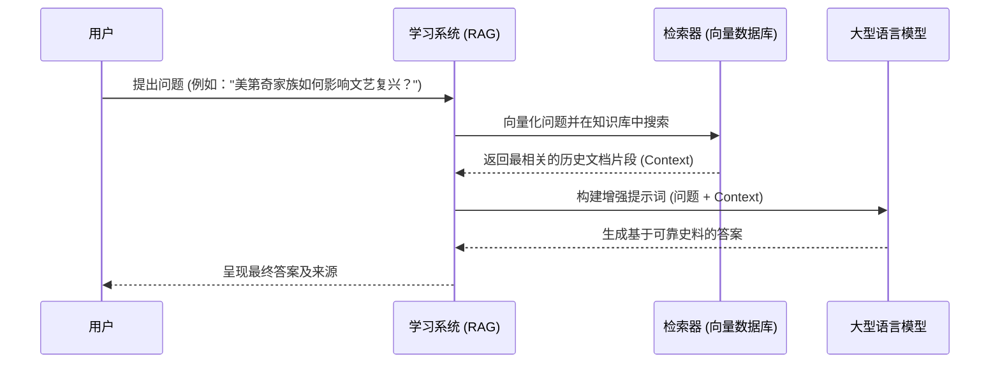

# AI时代的学习革命：掌握“提问-分解-验证”学习法

## 引言：“答案主义”的诱惑与浅层学习的陷阱

在人工智能唾手可得的今天，我们正面临一场深刻的学习危机。传统的教育模式强调知识的记忆和复述，但在AI面前，这些能力正迅速贬值。当任何问题都能在几秒钟内从大型语言模型（LLM）那里得到一个看似完美的答案时，一种新的学习陷阱——我们称之为“答案主义”——便应运而生。学生们容易跳过对问题的深入思考，直接向AI索要答案，将学习过程简化为“复制-粘贴”。

这种行为模式，与商业领域中的“解决方案主义”如出一辙，都是在未深刻理解问题本质前，就匆忙拥抱一个现成的“答案”。其后果是灾难性的：它导致了思维的惰性、批判性能力的萎缩和知识体系的碎片化。一个仅仅停留在表层答案的学习者，即使能够完成作业、通过考试，也无法构建起真正属于自己的、能够迁移和创新的智慧。当AI能够生成海量信息时，辨别、整合、验证和创造的能力，成为了人类学习者最稀缺、也最有价值的核心资产。

为了应对“答案主义”的挑战，我们借鉴商业战略中成熟的**“定义-识别-匹配”（Define-Identify-Match）框架**，并将其重构为一套面向AI时代学习场景的全新方法论——“提问-分解-验证”（Question-Deconstruct-Verify, QDV）学习法。

QDV学习法并非旨在排斥AI，恰恰相反，它旨在将AI从一个简单的“答案贩卖机”转变为一个强大的“思维催化剂”和“认知副驾驶”。它强制学习者放慢脚步，将学习的重心从“寻找答案”转移到“构建理解”上，确保每一次与AI的互动，都是一次主动的、深刻的认知过程。

QDV学习法包含三个连续且不可或缺的阶段：

- **提问 (Question)**： 如同“定义”阶段，这是学习的基石。它要求学习者超越表面问题，通过系统性地提问，探究知识的本质和边界，形成一个清晰、深刻、可研究的核心问题。

- **分解 (Deconstruct)**： 如同“识别”阶段，这是将宏大的学习目标“翻译”成一系列可执行的认知任务。学习者需要像AI一样思考，将复杂问题拆解为信息检索、概念解释、模式识别、内容创作等子任务，为自己和AI规划出一条清晰的学习路径。

- **验证 (Verify)**： 如同“匹配”阶段，这是与AI共舞的核心环节。学习者主动利用AI（及其他工具）执行分解后的任务，获取信息、草稿和分析结果，然后扮演最终的“主编”和“批判者”，对AI的输出进行严格的准确性、相关性、深度和偏见验证，最终通过综合、重构和批判，形成自己独到的见解和创造。

## 一、精准提问的艺术——学习的起点

在AI时代，学习的起点不再是寻找答案，而是提出一个好问题。AI可以提供无穷无尽的答案，但只有人类学习者才能赋予这些答案以意义和方向。一个问题的质量，直接决定了学习的深度和广度。“提问”阶段是QDV学习法的基石，其目标是将模糊的好奇心，打磨成一个清晰、深刻、可探索的核心问题。

###  1.1 深度探究：学习中的“5 Whys”分析法

5 Whys分析法在商业中用于探寻问题的根本原因，在学习中，我们可以将其改造为一种探寻知识第一性原理的强大工具。它鼓励我们不满足于表面的“是什么”，而是连续追问“为什么”，直至触及一个学科或概念最底层的公理或假设。

**案例：学习爱因斯坦的质能方程 E=mc²**

- 表层问题： E=mc² 是什么意思？（AI可以秒答：能量等于质量乘以光速的平方）
- Why 1? 为什么能量和质量可以相互转换？（AI会解释：质量是能量的一种高度集中的形式）
- Why 2? 为什么是光速（c）而不是其他常数？（AI会解释：这源于狭义相对论的光速不变原理）
- Why 3? 为什么光速是宇宙中最快的速度且恒定不变？（AI会解释：这是时空结构本身的性质，是狭义相对论的两大基本公设之一）
- Why 4? 这个公设是基于什么观察或思想实验得出的？（AI会引导你了解麦克斯韦方程组与伽利略变换的矛盾，以及爱因斯坦的“追光”思想实验）
- Why 5? 这些思想实验如何推导出完整的时间膨胀、长度收缩和质能关系？（AI可以为你展示简化的数学推导过程）

通过这个过程，学习者不再是仅仅记住一个公式，而是沿着科学家的思考路径，重走了一遍从基本公设到惊人结论的探索之旅，从而建立了对相对论的结构性理解。

## 1.2 目标导向：学习中的SMART原则

将宏大的学习愿望转化为具体、可执行的计划，是高效学习的关键。SMART原则为此提供了完美的框架。

- S (Specific - 具体的): “我想学习人工智能” → “我想理解并能向他人解释‘检索增强生成（RAG）’的工作原理。”
- M (Measurable - 可衡量的): “理解RAG” → “能够独立编写一个Python脚本，使用开源模型和向量数据库，搭建一个能查询本地文档的迷你RAG系统。”
- A (Achievable - 可实现的): 评估自己当前的编程能力和可用时间，确保目标具有挑战性但并非天方夜谭。
- R (Relevant - 相关的): 这个学习目标是否服务于你更大的职业规划或兴趣方向？（例如，因为它对成为AI应用开发者至关重要）
- T (Time-bound - 有时限的): “在未来两周内完成这个迷你RAG项目。”

## 1.3 边界设定：知识的输入-过程-输出（IPO）模型

在开始一项复杂的学习任务前，使用IPO模型界定其边界，可以有效避免学习过程的“范围蔓延”，让你专注于核心。

**案例：学习“文艺复兴”**

1. 输入 (Input - 我需要什么背景知识？):
	- 古希腊罗马的古典文化基础。
	- 中世纪晚期欧洲的社会、经济和宗教状况。
	- 明确排除：同期中国明朝或奥斯曼帝国的历史，除非作为对比研究。

2. 过程 (Process - 我将如何学习？):
	- 阅读2本核心著作。
	- 观看3部相关的纪录片。
	- 向AI提问20个具体问题（如“美第奇家族如何资助艺术家？”）。
	- 完成一张关键人物、事件和作品的思维导图。

3. 输出 (Output - 我学完后应该能做到什么？):

- 写一篇2000字的论文，论述“文艺复兴的本质是一场世俗化运动”。	
	- 能够向一个不了解这段历史的人，用10分钟时间清晰地讲述其来龙去脉。

### 1.4 与AI共学：动手实验室 

**目标： 训练使用AI作为思考伙伴，通过编写提示词（Prompt）来实践IPO模型，并利用多模态能力加深理解。**

#### 1.4.1 实验一：用AI生成IPO学习计划

在你学习一个新概念（例如“文艺复兴”）之前，请不要自己凭空规划。尝试让AI成为你的学习规划师。打开一个先进的AI助手（如Gemini, Claude 3等），输入以下提示词：

**提示词**

“你好，我是一名大学生，正在开始学习一个新的历史时期：‘文艺复兴’。请你扮演一名经验丰富的历史学导师和学习策略专家。我的最终学习目标是能够写一篇2000字的论文，论述文艺复兴的本质是一场世俗化运动。

请你为我设计一个详细的IPO（输入-过程-输出）学习计划。请在每个部分提供具体、可操作的建议。

- 输入 (Input): 我需要哪些先修知识和核心材料？请推荐2-3本必读的核心书籍或文章，并说明理由。
- 过程 (Process): 我应该采取哪些学习步骤？请设计一个包含阅读、观看、提问和总结的混合学习流程。
- 输出 (Output): 我应该产出什么来检验我的学习成果？请具体说明论文之外，我还可以创建哪些成果来巩固理解。”

#### 1.4.2 实验二：用AIGC可视化核心概念

在“输入”阶段，当你读到关于“人文主义是文艺复兴的核心”时，这个概念可能很抽象。这时，你可以利用文生图（Text-to-Image）的AI工具（如Midjourney, Stable Diffusion）来加深感性认识。

**提示词**

“请生成一张富有象征意义的图片，描绘‘文艺复兴时期的人文主义精神’。画面风格请参考达芬奇或拉斐尔的素描手稿。核心元素应包括：一个正在研究人体解剖学的学者，背景是古希腊的建筑废墟和正在建造的佛罗伦萨大教堂穹顶，光线从学者身上散发出来，照亮周围的黑暗。请强调对‘人’本身的兴趣和对知识的渴求。”

**学习价值**： 这个过程迫使你将一个抽象的文字概念，转化为具体的、可视化的元素。生成的图片都会成为你大脑中一个强有力的视觉锚点，帮助你更深刻地理解“人文主义”的内涵。

## 二、像AI一样思考——分解与建构知识

在第一章明确了学习的“目的地”之后，“分解”阶段的核心任务是绘制一张详细的“路线图”。学习者需要像一个项目经理或一个AI智能体（Agent）一样，将宏大的学习目标，拆解成一系列具体的、可执行的认知任务。

### 2.1 从问题到任务：学习的“认知任务分类学”

我们可以借鉴AI的任务类型，为自己的学习过程建立一个“认知任务分类学”。当你面对一个核心问题时，可以思考它需要通过以下哪些任务来完成：

1. 信息检索 (Information Retrieval): 高效地收集原始素材。
	- 学习场景： “找到关于‘量子霸权’争论的5篇关键学术论文。”

2。 概念解释与摘要 (Concept Explanation & Summarization): 快速把握新概念或大量文本的核心思想。
	- 学习场景： “用高中生能听懂的语言解释什么是‘区块链的拜占庭将军问题’。”

3. 模式识别与数据分析 (Pattern Recognition & Data Analysis): 从数据中发现规律、趋势或异常。
	- 学习场景： “分析这个城市过去10年的犯罪率数据，识别高发区域和时间段。”

4. 模拟与推演 (Simulation & Deduction): 构建模型来理解一个系统的运作方式或一个论证的逻辑链。
	- 学习场景： “如果历史上的某个关键条件改变（例如，古登堡没有发明印刷机），推演欧洲历史可能会如何发展。”

5. 多角度推理 (Multi-perspective Reasoning): 从不同理论框架或立场出发进行思考。
	- 学习场景： “从功利主义、义务论和美德伦理学三个角度，分别论证自动驾驶汽车在‘电车难题’中的伦理选择。”

6. 内容创作与建构 (Content Creation & Construction): 将所学知识“内化”并“输出”的最终环节。
	- 学习场景： “基于对市场数据的分析，撰写一份商业计划书草案。”

### 2.2 AI智能体（Agents）给我们的启示：项目式学习的自动化

现代AI领域的一个前沿方向是AI智能体（Agents）。一个智能体是一个能够自主理解目标、分解任务、执行计划并进行自我反思的系统。AI智能体的工作模式，为我们的学习过程提供了终极的蓝图。它告诉我们，最高效的学习本质上都是项目式的。一个优秀学习者的标志，就是能够像智能体一样，为一个宏大的学习目标自我规划和执行一系列项目。

### 2.3 与AI共学：动手实验室 

**目标： 训练将一个复杂的学习目标，分解为一系列可由AI辅助执行的、具体的认知任务。**

#### 2.3.1 实验一：让AI成为你的项目分解师

假设你的学习目标是：“我想全面了解‘全球半导体芯片产业’，并能分析其未来的发展趋势。”

**提示词**

“我是一个对科技行业感兴趣的商业分析专业的学生。我的学习目标是‘全面了解全球半iconductor芯片产业，并能分析其未来的发展趋势’。

请你扮演一名资深的行业分析师，将这个宏大的学习目标，分解成一个包含至少5个不同类型认知任务的学习项目清单。请明确每个任务的类型（例如：信息检索、数据分析、多角度推理等），并为每个任务提供一个具体的、可执行的行动指令。”

#### 2.3.2 实验二：利用多模态AI进行数据分析

对于上述任务清单中的数据分析部分，许多先进的AI模型（如集成了代码解释器的GPT-4o或Gemini Advanced）可以直接处理数据文件。

**操作流程**：

1. 找到并下载相关公司的历史股价数据（通常是.csv格式）。
2. 将这个.csv文件直接上传到AI的对话框中。
3. **提示词**：“这是NVIDIA, TSMC, ASML等公司过去5年的每日股价数据。请你：a. 生成一张折线图，清晰地对比这五家公司股价的相对增长趋势。b. 在图表上标记出关键的行业事件时间点，例如‘2022年美国芯片法案签署’。c. 简要分析图表，指出哪家公司的增长最为显著，并初步推测其与AI浪潮的关系。”

**学习价值**： AI在这里扮演了“数据分析师”和“可视化专家”的角色，将你从繁琐的数据处理和图表绘制中解放出来。你的核心任务变成了更高层次的解读、提问和洞察。

## 三、与AI共舞——验证、综合与创造

在完成了问题的精准定义和任务的清晰分解后，我们进入了QDV学习法最激动人心的阶段：“验证”。这绝不是一个被动接受AI答案的过程，而是一个主动的、批判性的、与AI进行深度对话和协作的创造过程。

### 3.1 AI输出的“多维度验证矩阵”

I的生成内容，无论看起来多么权威和流畅，都只能被视为一份“未经核实的初稿”。学习者的核心职责，就是使用一个多维度的验证矩阵，对这份“初稿”进行严格的审查。

### 3.2 核心技术架构：检索增强生成（RAG）

在AI辅助学习中，检索增强生成（RAG）是最核心的技术架构之一，它能有效利用私有或特定领域的知识，避免AI产生“幻觉”。

RAG通过“开卷考试”的方式，确保AI的回答基于可信的、最新的信息，极大地提高了学习的准确性和可靠性。

### 3.2 与AI共学：动手实验室 

**目标： 训练对AI生成内容的批判性验证能力，并练习在AI辅助下进行原创性综合。**

#### 3.2.1 实验一：AI辩论赛——检验论点的稳固性

在你研究一个有争议的话题时（如“是否应该对AI生成的内容征税？”），可以利用AI来模拟一场辩论。

**提示词**：
“让我们来扮演一个角色扮演游戏。你将扮演两名顶级的辩论选手，我们将就‘是否应该对AI生成的内容（AIGC）征税’这一辩题进行辩论。

- 辩手A： 坚决支持征税。请你从‘弥补就业损失’、‘抑制信息泛滥’和‘为AI监管提供资金’三个角度，提出你的核心论点。

- 辩手B： 坚决反对征税。请你从‘扼杀技术创新’、‘征税在实践中难以操作’和‘AIGC是生产力工具而非最终商品’三个角度进行反驳。

我将作为裁判。请首先由辩手A陈述观点，然后由辩手B进行反驳。”

**学习价值**：

- 偏见识别： 你会看到AI能如何流畅地为正反两方构建论证，这让你深刻意识到AI本身没有立场。
- 深度探究： 当AI提出一个论点时，你可以暂停辩论，并追问：“请提供三个具体的历史案例，来证明一项新技术在早期被过度征税而导致发展受阻。”
- 原创性综合： 在观看了几轮辩论后，你可以提出一个超越简单“征税/不征税”二元对立的、更复杂的第三方方案。

#### 3.2.2实验二：多模态内容的交叉验证

假设你在学习建筑史，并让AI生成了一段关于“哥特式建筑”的描述，其中提到了“飞扶壁”的作用。

**操作流程**：

1. 文本生成： 你获得了关于“飞扶壁”的文字解释。
2. 图文验证： 现在，你向AI提出新要求：“请为我生成一张‘哥特式大教堂飞扶壁结构’的剖面示意图，并用箭头清晰地标示出‘拱顶侧推力’和‘飞扶壁反向支撑力’的力学传递路径。”
3. 交叉比对： 对比AI生成的图片和它之前提供的文字解释。图片是否直观地、准确地展示了文字描述的力学原理？

**学习价值**： 这种文生图、图证文的多模态交叉验证，是一种极其强大的批判性学习工具，能有效发现AI的潜在“幻觉”或不准确之处。

## 四、思维能力的飞跃：从执行者到创新者

QDV学习方法论不仅关注技术工具的应用，更注重思维能力的培养。其最终目标是帮助学习者完成从被动的知识执行者到主动的知识创新者的转变。

### 4.1 核心思维能力培养

- 元认知能力 (Metacognition): 即“对认知的认知”。在QDV框架的每一步，学习者都需要反思自己的学习需求、评估任务难度、判断工具效果，并持续调整学习策略。这种自我监控和调节是高效学习的核心。

- 系统思维 (Systems Thinking): 将复杂问题视为一个整体，理解各部分之间的关系和相互影响。在“分解”阶段，学习者需要将复杂问题拆解为子任务，并理解它们之间的依赖关系，这正是系统思维的实践。

- 批判性思维 (Critical Thinking): 能够理性分析信息、评估证据和形成合理结论。在“验证”阶段，对AI生成内容的全面审查，就是对批判性思维最直接的训练。

- 创新思维 (Innovative Thinking): 能够突破常规、提出新观点和创造新解决方案。当学习者在验证和综合AI信息的基础上，提出AI无法直接给出的新问题或新方案时，创新就发生了。

### 4.2 案例分析：从工具使用者到策略制定者

让我们通过两个浓缩的案例，看看QDV框架在真实场景中如何培养学习者的战略思维。

#### 4.2.1 案例一：优化内部知识库

定义： 某企业面临知识分散、查询效率低的问题。目标是在6个月内建立AI知识库，实现80%常见问题自动回答。

识别： 核心任务是构建一个RAG系统，包含文档预处理、向量化、检索和生成四个子任务。

匹配与验证： 学习者（项目负责人）需要评估不同技术方案。例如，在生成任务上，对比通义千问在中文场景的高精度和Claude 3在多语言上的优势；在检索任务上，对比Pinecone的高查询速度和Milvus的低成本。这个过程不再是简单的技术实现，而是充满权衡的战略决策。最终，员工通过参与构建，实现了从工具使用者到系统策略制定者的转变。

#### 4.2.2 案例二：提升社交媒体营销

定义： 某营销机构面临内容创作效率低、用户互动不足的问题。目标是在3个月内建立AI辅助营销系统，提升效率50%，互动率30%。

识别： 任务被分解为情感分类、文本生成和投放优化。

匹配与验证： 学习者（营销策略师）认识到不同任务需要不同级别的AI能力。他没有用昂贵的GPT-4o去做简单的情感分类（杀鸡用牛刀），而是选择了成本更低的开源BERT模型。但在需要高度创意的文本生成上，则毫不犹豫地使用了顶级的Claude 3模型。这种“分级匹配”的策略，体现了对成本效益的深刻理解，是典型的系统思维和战略思维。

## 结论：新时代的学习者——从知识的消费者到智慧的架构师

“提问-分解-验证”（QDV）学习法，不是一套旨在提高应试技巧的“快捷方式”，而是一次深刻的认知范式革命。它回应了AI时代对人类学习者提出的最根本要求：我们不再需要成为一个储存知识的“硬盘”，而必须成为一个能够定义问题、设计路径、并对海量信息进行批判性整合与创造性运用的“中央处理器（CPU）”。

QDV框架的持久价值在于：

- 培养了提问的本能： 它让我们在面对任何知识时，第一反应不是“答案是什么”，而是“真正的问题是什么？”。

- 塑造了结构化思维： 它训练我们将复杂模糊的问题，系统性地分解为可操作、可探索的子任务。

- 强化了批判性思维： 它让我们深刻认识到，AI是强大的工具，而非绝对的真理来源。

- 解放了创造力： 通过将繁琐的信息收集和整理工作“外包”给AI，QDV学习法将我们从低层次的认知劳动中解放出来，让我们能够将宝贵的精力投入到最高层次的认知活动——综合、洞察与创造中去。

- 未来的教育，其核心竞争力将不再是传授了多少既定知识，而是培养了何种学习能力。AI不会让思考变得多余，它只会让高质量的思考变得前所未有的重要。掌握QDV学习法的学习者，将能够与AI形成一种强大的“人机共生”关系：人类负责提出深刻的问题、设定价值导向、进行伦理判断和最终的创造性综合；而AI则作为我们思维的延伸，提供强大的信息处理能力、多样的视角和不知疲倦的灵感碰撞。

最终，我们培养的将不再是“知道很多”的人，而是“知道如何学习、如何思考、如何创造”的智慧架构师。这，正是AI时代赋予教育的、最激动人心的使命。