# 第六天 大模型感知原理——Transformer架构大模型理解世界的基石

今天，我们将深入到大模型的“大脑”深处，探索它是如何理解我们这个复杂世界的。旅程的开端，是理解一种根本性的转变：从现实中的符号到计算机能够处理的数学向量，你将明白世间万物——词语、句子乃至图像——是如何被编码成机器可读的语言。在快速回顾了神经网络的基础知识后，我们将直面今天的主角：Transformer架构。这不仅是技术的基石，也是理解的难点。我们将详细拆解其内部构造，特别是被誉为“核心引擎”的自注意力机制，以及确保语序逻辑的位置编码。最后，你将亲手操作，加载一个预训练好的词向量模型，通过代码去验证“国王”减去“男人”加上“女人”约等于“女王”这种词语间神奇的数学关系，从而直观地感受模型理解世界的独特方式。

**学习目标**：

1. 能够解释“词向量（Word Embedding）”的概念，说明为何需要将文本转换为数学向量。
2. 能够画出Transformer模型的基本结构图，并指出编码器、解码器、自注意力机制和位置编码等关键组件。
3. 能够通过代码加载预训练词向量，并验证其语义相似性（如 king - man + woman ≈ queen）。

# 第一部分：从符号到向量：机器的语言

本章旨在建立一个核心基础：为了让机器能够“感知”和“理解”世界，我们必须将原始的、符号化的数据（如文本、像素）转化为机器能够处理的有意义的数值格式。 我们将深入探讨表示学习（Representation Learning）如何自动完成这一过程，创造出能够捕捉语义和结构关系的丰富、密集的向量（即“嵌入”）。

## 1.1 人工智能三大主义比较分析：符号主义、连接主义与行动主义

人工智能（AI）研究历史中，符号主义、连接主义和行动主义代表了三种不同的思维方式和研究方向。每种方法在AI领域都取得了重要的突破，具有不同的理论基础和应用场景。

### 1.1.1 符号主义

符号主义（Symbolism）是人工智能早期的一个重要范式，它基于逻辑推理和知识表示，认为智能行为是通过操作符号（如字词、句子等）来进行的。这一范式强调通过符号系统（例如规则、语法和概念）表示知识，并利用推理规则来进行决策和解决问题。

符号主义人工智能认为，所有的智能行为都可以通过操作符号、符号之间的关系、以及推理规则来实现。这些符号通常是具有人类理解能力的具体元素，比如“猫”、“狗”之类的名词，或者“是”、“不是”之类的关系。

一个典型的符号主义AI系统是专家系统。专家系统是通过模拟人类专家的推理过程来解决特定领域的问题。这些系统基于知识库和推理引擎进行工作。假设我们设计一个医疗诊断专家系统，该系统的任务是帮助医生诊断某些疾病。专家系统中的知识库包含了大量的医疗知识，特别是关于疾病症状、诊断标准和治疗方案的规则。系统将根据用户提供的症状信息进行推理，判断患者可能患有的疾病。

例如，系统可以有如下规则：

- 如果患者有咳嗽和发烧，则可能患有流感。
- 如果患者有头痛和呕吐，则可能患有脑膜炎。
- 如果患者有持续性咳嗽和夜间出汗，则可能患有肺结核。

这些规则表示了症状和疾病之间的符号关系，系统根据输入的症状与这些规则进行匹配和推理。

系统的工作流程：

- 用户输入症状（如：咳嗽、发烧）。
- 系统通过推理引擎使用规则推导可能的诊断（如流感）。
- 系统输出推荐诊断，并提供进一步的建议。

在这个系统中，符号（如“咳嗽”、“发烧”）代表了现实世界的事物（如疾病的症状），推理规则则是对这些符号之间关系的操作，通过逻辑推理推导出结论。

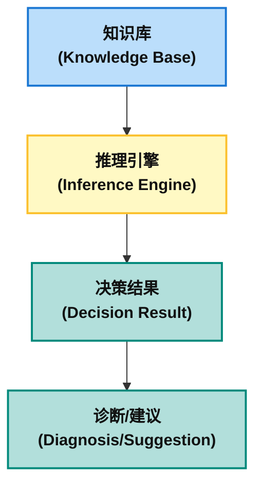

优缺点：

- 优点：符号主义方法易于理解，具有很强的可解释性，适合处理结构化的、明确规则的问题。
- 缺点：符号主义对于模糊、不确定或感知类任务的处理能力较弱，难以应对复杂的实际问题。

**代码样例：一个简单的动物识别专家系统**
这个例子将清晰地展示符号主义的三个核心组成部分：

- 知识库 (Knowledge Base): 一系列“IF-THEN”形式的规则。
- 事实库 (Fact Base): 用户提供的、当前已知的信息。
- 推理机 (Inference Engine): 驱动整个系统运行的逻辑，它负责将事实与规则进行匹配，并得出新的结论。

```Python
class SymbolicAnimalExpert:
    def __init__(self):
        # 知识库：用符号规则表示动物特征与类别的逻辑关系
        self.rules = [
            {"if": ["有毛发"], "then": "哺乳动物"},
            {"if": ["有乳"], "then": "哺乳动物"},
            {"if": ["吃肉"], "then": "食肉动物"},
            {"if": ["有犬齿", "有爪", "眼向前方"], "then": "食肉动物"},
            {"if": ["哺乳动物", "有蹄"], "then": "有蹄类"},
            {"if": ["哺乳动物", "反刍"], "then": "有蹄类"},
            {"if": ["哺乳动物", "食肉动物", "黄褐色", "暗斑点"], "then": "豹子"},
            {"if": ["哺乳动物", "食肉动物", "黄褐色", "黑条纹"], "then": "老虎"},
            {"if": ["有蹄类", "长脖子", "长腿", "暗斑点"], "then": "长颈鹿"},
            {"if": ["有蹄类", "黑条纹"], "then": "斑马"}
        ]
        self.facts = set()  # 存储用户输入的事实特征

    def add_fact(self, fact: str):
        """ 添加观察到的事实特征 """
        self.facts.add(fact)
        print(f"✅ 已添加特征: {fact}")

    def infer(self):
        """ 基于规则的推理引擎 """
        new_facts_derived = True
        while new_facts_derived:
            new_facts_derived = False
            for rule in self.rules:
                # 检查规则前提是否全部满足
                if all(premise in self.facts for premise in rule["if"]):
                    conclusion = rule["then"]
                    # 若结论是新事实，则加入知识库
                    if conclusion not in self.facts:
                        self.facts.add(conclusion)
                        print(f"🔍 推理: {', '.join(rule['if'])} → {conclusion}")
                        new_facts_derived = True

        # 输出最终可能的动物类型
        animals = [fact for fact in self.facts if fact in {"豹子", "老虎", "长颈鹿", "斑马"}]
        return animals if animals else "无法识别该动物"

# 示例使用
if __name__ == "__main__":
    expert = SymbolicAnimalExpert()
    expert.add_fact("有毛发")   # 添加观察特征
    expert.add_fact("有蹄")
    expert.add_fact("黑条纹")

    result = expert.infer()
    print(f"\n🎯 识别结果: {result}")
```

**代码解析**

 1. `__init__` 方法
	- `rules`：这是一个包含多个规则的列表，每条规则由“if”和“then”组成：
	- "if"：表示一组条件，即前提条件。
	- "then"：表示在条件满足时推理得到的结论。
	- 每条规则都定义了某些动物的特征与类别的关系。例如，如果动物具有“有毛发”这一特征，那么它是“哺乳动物”；如果动物是“哺乳动物”且具有“反刍”特征，则它是“有蹄类”。
	- `facts`：这是一个集合，用于存储用户输入的观察事实（如“有毛发”、“有蹄”）。通过这些事实，系统将推理出可能的动物类型。

1. `add_fact` 方法
	- 作用：这个方法允许用户将事实（如“有毛发”、“有蹄”等）添加到事实集合中。每添加一个新事实，系统会打印出“已添加特征”的提示信息。

2. `infer` 方法
	- 作用：`infer` 方法是该专家系统的推理引擎。其功能是通过循环检查所有规则，如果规则的前提条件在已知事实中都成立，则推理出结论（结论就是规则的“then”部分）。推理得到的新事实会被加入到事实集合 `facts` 中。

3. 推理过程：
	- `new_facts_derived = True`：首先设置一个标记变量
	- `new_facts_derived` 为 `True`，表示有新的事实被推理出来。
	- `while new_facts_derived`：循环开始，直到没有新的事实被推理出来为止。
	- `for rule in self.rules`：遍历所有规则。
	- `if all(premise in self.facts for premise in rule["if"])`：检查规则的前提条件是否都在已知事实中，如果满足，则进行推理。
	- `conclusion = rule["then"]`：获取该规则的结论（即推理结果）。
	- `if conclusion not in self.facts`：如果结论是新事实，加入到事实集合中，并打印推理过程。
	- 推理结束：当推理完成后，程序检查 `facts` 中是否包含动物种类（如“豹子”，“老虎”）。如果找到，返回识别出的动物；如果没有识别出任何动物，则返回“无法识别该动物”。

4. `__main__` 部分
	- 作用：这部分代码演示了如何使用 `SymbolicAnimalExpert` 类。
	- 创建 `expert` 实例：初始化专家系统。
	- 添加特征：使用 `add_fact` 方法添加用户观察到的事实（例如“有毛发”、“有蹄”）。
	- 进行推理：使用 `infer` 方法基于已有的事实和规则推理出可能的动物类型。
	- 输出结果：打印推理结果。

5. 输出示例

```plaintext
✅ 已添加特征: 有毛发
✅ 已添加特征: 有蹄
✅ 已添加特征: 黑条纹
🔍 推理: 哺乳动物, 食肉动物, 黄褐色, 黑条纹 → 老虎

🎯 识别结果: ['老虎']
```

**小结**

* **符号规则**：该专家系统基于符号推理，使用“如果-那么”规则来表示动物的特征与类别之间的逻辑关系。
* **推理过程**：通过不断检查规则的前提条件和已知事实，系统会推理出新事实，并不断更新直到无法再推理出新事实为止。
* **应用场景**：这种符号推理的方式适用于构建基于规则的专家系统，特别是在需要明确逻辑规则并基于事实进行推理的场景（如医学诊断、法律推理等）。


### 1.1.2 连结主义

连接主义（Connectionism）是人工智能的另一个重要范式，与符号主义相对立。连接主义强调模拟人类神经系统的结构和工作方式，使用人工神经网络（ANN）来进行信息处理和学习。它认为智能行为是通过大量简单的单元（类似于神经元）之间的连接来实现的，网络通过学习这些连接的权重来处理信息。

连接主义方法强调通过神经元之间的连接和相互作用来模拟智能。人工神经网络由多个“神经元”组成，这些神经元通过“权重”连接在一起。通过训练，网络不断调整权重，以便更好地完成特定任务。

深度学习，特别是卷积神经网络（CNN），是连接主义的经典应用之一。CNN在计算机视觉中取得了革命性的突破，通过自动学习从原始图像数据中提取特征，成功地进行图像分类和物体识别。例如，在MNIST手写数字识别中，CNN能够通过对大量图像数据进行训练，识别不同的手写数字。

另外一个典型的连接主义例子是多层感知机（Multilayer Perceptron，MLP）。MLP是一种前馈型神经网络，通常用于分类、回归等任务。它由输入层、隐藏层和输出层组成，每一层都由多个神经元构成。每个神经元接收来自前一层的输入，并通过权重和激活函数生成输出，再传递给下一层。

假设我们要使用一个神经网络模型来识别手写数字（如MNIST数据集中的数字）。每个手写数字的图像是一个28x28的灰度图像，包含784个像素，每个像素的值代表图像中该位置的亮度。

1. 输入层：输入层包含784个神经元，每个神经元对应图像中的一个像素。每个神经元接收一个像素的值，作为输入信号。

2. 隐藏层：隐藏层由多个神经元组成，这些神经元对输入数据进行处理，学习数据的特征。每个隐藏层的神经元都通过加权连接接收来自输入层的信号，并通过激活函数（如ReLU、Sigmoid等）进行变换。隐藏层的作用是从输入数据中提取特征，并通过多次迭代调整权重，以便模型能够捕捉到数据中的复杂模式。

3. 输出层：输出层的神经元数量通常与要识别的类别数量相同。在MNIST的情况下，输出层有10个神经元，分别对应数字0到9。每个输出神经元的值表示该数字的预测概率，模型会选择具有最高概率的数字作为最终预测结果。

4. 学习过程（训练）：
- 前向传播：输入图像从输入层传递到隐藏层，并最终传递到输出层，生成预测的结果。
- 反向传播：模型根据预测结果和真实标签之间的差异计算误差，并通过反向传播算法将误差传递回网络，调整每个连接的权重。
- 梯度下降：通过梯度下降法（或其变种，如Adam优化器），不断更新权重，最小化损失函数，从而让模型逐步提高准确率。

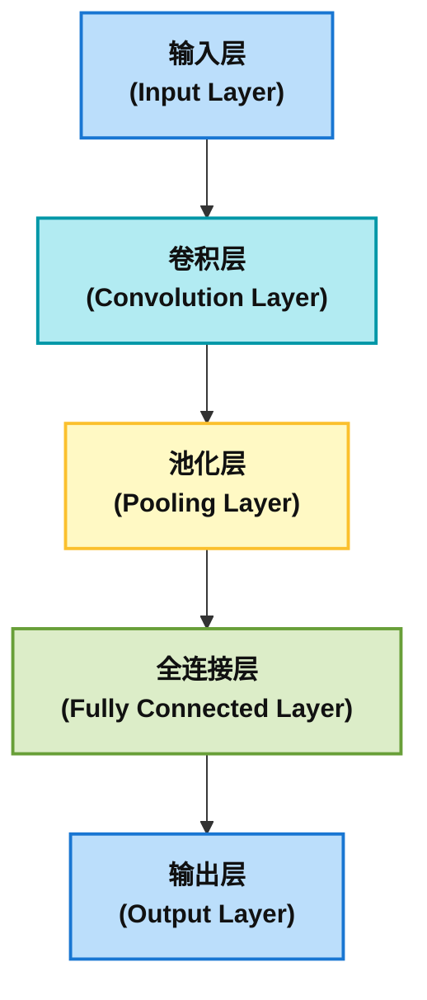

优缺点：

- 优点：连接主义方法适合处理大规模、复杂的数据，能够自动从数据中学习特征，具有很强的适应性和处理能力。
- 缺点：神经网络的“黑箱”问题使得其决策过程难以解释，训练过程需要大量计算资源和时间。

以下是一个基于连接主义（神经网络）的代码示例，结合了多层感知机（MLP）和 自然语言处理（NLP）任务，展示神经网络如何通过数据驱动的方式解决文本情感分类问题。代码使用 PyTorch 实现，包含完整的训练和推理流程。

场景：文本情感分类（二分类）
任务：根据用户评论判断情感倾向（正面/负面）

```Python
import torch
import torch.nn as nn
import torch.optim as optim
from torchtext.data import get_tokenizer
from torchtext.vocab import build_vocab_from_iterator
from torch.utils.data import DataLoader, TensorDataset

# 1. 数据准备（模拟数据集）
texts = [
    "I love this movie, it's great!",
    "Terrible acting, wasted my time.",
    "The plot was amazing.",
    "Worst film ever made."
]
labels = [1, 0, 1, 0]  # 1:正面, 0:负面

# 2. 文本分词与词表构建
tokenizer = get_tokenizer("basic_english")
tokenized_texts = [tokenizer(text) for text in texts]

# 构建词表（将单词映射为数字索引）
vocab = build_vocab_from_iterator(tokenized_texts, specials=["<unk>"])
vocab.set_default_index(vocab["<unk>"])

# 将文本转换为数字序列
def text_to_ids(tokens):
    return [vocab[token] for token in tokens]

encoded_texts = [text_to_ids(tokens) for tokens in tokenized_texts]

# 3. 填充序列至相同长度（连接主义需固定输入维度）
max_len = max(len(seq) for seq in encoded_texts)
padded_texts = torch.tensor([
    seq + [0] * (max_len - len(seq)) for seq in encoded_texts
], dtype=torch.long)

labels = torch.tensor(labels, dtype=torch.float)

# 4. 定义神经网络模型（连接主义核心）
class TextClassifier(nn.Module):
    def __init__(self, vocab_size, embedding_dim, hidden_dim):
        super().__init__()
        # 词嵌入层：学习单词的分布式表示 [2,5](@ref)
        self.embedding = nn.Embedding(vocab_size, embedding_dim)
        # 全连接层：非线性特征组合 [3,5](@ref)
        self.fc1 = nn.Linear(embedding_dim * max_len, hidden_dim)
        self.fc2 = nn.Linear(hidden_dim, 1)
        self.relu = nn.ReLU()
        self.sigmoid = nn.Sigmoid()

    def forward(self, x):
        # 输入形状: [batch_size, seq_len]
        embeds = self.embedding(x)  # 形状: [batch_size, seq_len, embedding_dim]
        embeds = embeds.view(embeds.size(0), -1)  # 展平: [batch_size, seq_len*embedding_dim]
        out = self.fc1(embeds)
        out = self.relu(out)
        out = self.fc2(out)
        return self.sigmoid(out)

# 初始化模型
vocab_size = len(vocab)
embedding_dim = 50
hidden_dim = 32
model = TextClassifier(vocab_size, embedding_dim, hidden_dim)

# 5. 训练配置
criterion = nn.BCELoss()  # 二分类交叉熵损失
optimizer = optim.Adam(model.parameters(), lr=0.01)

# 6. 训练循环（数据驱动学习）
def train(model, inputs, targets, epochs=100):
    model.train()
    for epoch in range(epochs):
        optimizer.zero_grad()
        outputs = model(inputs).squeeze()
        loss = criterion(outputs, targets)
        loss.backward()
        optimizer.step()
        if (epoch + 1) % 10 == 0:
            print(f"Epoch [{epoch+1}/{epochs}], Loss: {loss.item():.4f}")

# 训练模型
train(model, padded_texts, labels)

# 7. 推理测试
def predict(text):
    tokens = tokenizer(text)
    seq = text_to_ids(tokens)
    padded_seq = torch.tensor(seq + [0]*(max_len - len(seq)), dtype=torch.long).unsqueeze(0)
    model.eval()
    with torch.no_grad():
        prob = model(padded_seq).item()
    return "正面" if prob > 0.5 else "负面"

# 测试新样本
test_text = "The actors performed brilliantly!"
print(f"测试文本: '{test_text}' → 情感: {predict(test_text)}")
```

**代码解析**

1. 数据准备
	- 这是一个模拟的文本数据集，包含四条电影评论。
	- `labels` 对应每条评论的情感标签，`1` 表示正面情感，`0` 表示负面情感。

2. 文本分词与词表构建
	-  使用 **`get_tokenizer("basic_english")`** 进行英文文本的基础分词，它会将文本分割为单词。
	-  `tokenized_texts` 是一个分词后的列表，每条文本被转换成了一个单词列表。
	-  `build_vocab_from_iterator`** 根据分词后的文本构建词汇表，`<unk>` 代表未知词（如果词汇表中没有的单词会映射到该符号）。
	-  `set_default_index(vocab["<unk>"])` 设置默认词汇索引为 `<unk>`，即当遇到未知单词时，它将使用该索引。
	-  `text_to_ids`** 将单词转换为对应的数字索引，这些索引在后续的神经网络模型中作为输入。
	-  `encoded_texts` 存储了所有文本转换后的数字序列。

3. 填充序列至相同长度
	- `max_len`** 计算文本中最长的单词序列长度，确保输入的文本具有统一的长度。
	- `padded_texts`** 使用 `0` 填充短于最长文本的序列，保证每个输入样本的长度一致。

4. 定义神经网络模型
	- 词嵌入层（`nn.Embedding`）**：将单词映射到一个低维的连续向量空间，表示每个单词的分布式表示。
	- 全连接层（`nn.Linear`）**：两个全连接层分别将嵌入层的输出映射到隐藏层和最终的输出层。隐藏层使用 ReLU 激活函数，输出层使用 Sigmoid 激活函数来输出概率（正面或负面）。
	- `forward` 方法**：定义了前向传播过程：
	- 输入 `x` 是填充后的文本数据，经过词嵌入层转化为向量表示。
	- 然后将其展平为一维，送入全连接层进行分类。

5. 训练配置
	- `BCELoss`**：二分类交叉熵损失函数，用于处理标签为 `0` 或 `1` 的二分类问题。
	- `Adam`**：一种自适应学习率优化算法，适用于大多数机器学习任务，特别是在有大量数据和参数时。

6. 训练循环
	- `train` 方法**：训练循环，进行多次迭代更新模型参数：
	- `optimizer.zero_grad()`**：清除之前的梯度。
	- `outputs = model(inputs).squeeze()`**：模型计算输出，并压缩结果（去掉多余的维度）。
	- `loss.backward()`**：计算梯度。
	- `optimizer.step()`**：更新参数。
	- 每10轮输出一次当前的损失值。

 1. 推理测试
	- `predict` 方法**：用于给定文本进行情感预测。
	- 将输入文本分词并转换为数字索引。
	- 填充至与最长文本相同的长度，并添加批次维度。
	- 使用 `model.eval()` 设置模型为推理模式，不计算梯度。
	- 返回大于 `0.5` 的概率为“正面”，否则为“负面”。

 2. 测试新样本
	- 给定一条新的测试文本，输出其预测的情感（正面或负面）。

**总结**

这段代码展示了如何使用 **PyTorch** 和 **TorchText** 构建一个简单的 **文本情感分析模型**。通过以下步骤完成模型训练和推理：

1. 使用 **词嵌入** 将文本转换为数值表示；
2. 使用 **全连接层** 进行分类；
3. 训练模型并优化参数；
4. 进行推理，输出文本情感的分类结果（正面或负面）。

该模型通过使用 **二分类交叉熵损失** 来训练，适用于情感分析等二分类任务。

### 1.1.3 行动主义

行动主义（Behaviorism）在人工智能领域是一种强调智能行为和外部表现的学派，主要关注如何通过观察和记录外部行为来理解和建立智能系统。行动主义的核心观点是，智能不仅仅是大脑内部的思考过程，更是在与环境互动中产生的可观察行为。行动主义倾向于通过“反应”来定义智能，而不关心内部的心理或推理过程。

行动主义源自心理学领域，特别是行为主义心理学。行为主义强调通过对个体行为的观察和记录来研究其心理状态或智能表现。它认为所有的行为都是由外部环境和刺激所驱动的。对于人工智能系统而言，行动主义意味着通过与环境的互动来塑造智能，而非通过内部推理和符号处理。

在人工智能中，行动主义通常通过强化学习（Reinforcement Learning, RL）来实现。强化学习是一种基于试错的学习方法，智能体通过与环境的互动来获取反馈，并根据这些反馈调整自己的行为。

在强化学习中，智能体（Agent）与环境（Environment）进行交互。智能体在每个时间步骤选择一个动作（Action），这个动作会改变环境的状态（State）。环境会根据智能体的动作返回一个奖励（Reward），智能体的目标是最大化累积的奖励。

强化学习的学习过程基于以下几个关键元素：

- 状态（State）：描述智能体当前所在的环境状况。
- 动作（Action）：智能体可以在特定状态下采取的行为。
- 奖励（Reward）：智能体采取动作后，环境返回的反馈，用于评估该动作的好坏。
- 策略（Policy）：智能体选择动作的规则，可能是基于当前状态的概率分布。

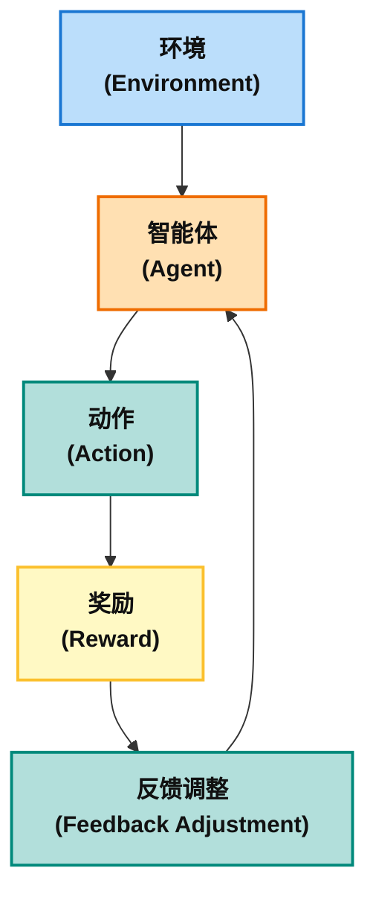

一个经典的强化学习算法是Q-learning。Q-learning通过维护一个Q值表来指导智能体的决策。Q值表示的是在某个状态下采取某个动作所获得的预期总奖励。智能体的目标是通过不断更新Q值来学习最佳策略，从而最大化累积的奖励。

Q-learning的工作原理：

- 初始化：Q值表被初始化为一个零矩阵，智能体从任意一个初始状态开始。
- 交互：智能体根据当前的策略选择动作（例如，使用贪婪策略，即选择具有最大Q值的动作）。
- 更新Q值：智能体采取动作后，环境给出奖励，并且Q值根据以下公式进行更新：

```lua
Q(s, a) = Q(s, a) + α * (r + γ * max(Q(s', a')) - Q(s, a))
```

优缺点:

- 优点：行动主义方法适合动态和不确定的环境，能够通过与环境的互动不断优化决策策略。
- 缺点：强化学习的训练过程时间长、计算资源消耗大，需要大量的试验和反馈才能收敛到最优策略。

示例：使用Q-learning解决简单的环境问题（如迷宫）

下面是一个简单的Q-learning示例代码。Q-learning 是一种常见的强化学习算法，它通过不断更新 Q 值（状态-动作价值函数）来优化智能体的决策。

```Python
import numpy as np
import random

# 环境设置：简单的4x4迷宫
# 0代表空白，1代表墙壁，9代表终点，-1代表奖励（非终点）
env = np.array([
    [0, 0, 0, 1],
    [0, 1, 0, 1],
    [0, 1, 0, 0],
    [0, 0, 0, 9]
])

# Q-learning参数
alpha = 0.1  # 学习率
gamma = 0.9  # 折扣因子
epsilon = 0.2  # 探索率
episodes = 1000  # 训练次数

# 初始化Q表
Q = np.zeros((env.shape[0], env.shape[1], 4))  # 状态数量 (4x4 网格)，每个状态有4个动作（上、下、左、右）

# 定义动作：上、下、左、右
actions = [(0, 1), (0, -1), (1, 0), (-1, 0)]  # 右、左、下、上

# 检查是否为有效的状态
def is_valid_state(state):
    x, y = state
    return 0 <= x < env.shape[0] and 0 <= y < env.shape[1] and env[x, y] != 1

# 奖励函数：终点为9，其他为-1
def get_reward(state):
    x, y = state
    if env[x, y] == 9:
        return 100  # 到达终点时给予高奖励
    return -1  # 每走一步都会得到-1的奖励

# Q-learning算法
for episode in range(episodes):
    state = (0, 0)  # 从(0, 0)开始
    done = False
    while not done:
        x, y = state
        # epsilon-greedy策略选择动作
        if random.uniform(0, 1) < epsilon:
            action = random.choice(range(4))  # 探索，随机选择动作
        else:
            action = np.argmax(Q[x, y])  # 利用，选择最大Q值的动作

        # 执行动作，得到新状态
        dx, dy = actions[action]
        new_state = (x + dx, y + dy)

        if not is_valid_state(new_state):  # 如果新状态无效，则保持原状态
            new_state = state

        reward = get_reward(new_state)  # 获取奖励

        # 更新Q表
        Q[x, y, action] = Q[x, y, action] + alpha * (reward + gamma * np.max(Q[new_state[0], new_state[1]]) - Q[x, y, action])

        state = new_state  # 转到新状态

        if reward == 100:  # 达到终点时终止
            done = True

# 查看训练后的Q表
print(Q)

# 测试：智能体从(0,0)出发，按照最优策略走到终点
state = (0, 0)
path = [state]
while state != (3, 3):  # 终点为(3, 3)
    x, y = state
    action = np.argmax(Q[x, y])  # 选择Q值最大的动作
    dx, dy = actions[action]
    state = (x + dx, y + dy)
    path.append(state)

print("智能体的路径：", path)
```

**代码解析**

1. 环境设置
	- 环境（`env`）**：这是一个4x4的迷宫，迷宫中的每个位置代表不同的状态：
		- `0` 表示空白，可以通过；
		- `1` 表示墙壁，智能体无法穿越；
		- `9` 表示终点，智能体达到该位置时会获得奖励（100）。

2. Q-learning参数设置
	- 学习率 (`alpha`)**：控制智能体在更新Q值时对新信息的依赖程度。
	- 折扣因子 (`gamma`)**：决定智能体在做决策时对未来奖励的重视程度。
	- 探索率 (`epsilon`)**：决定智能体以多少概率随机选择动作（探索），而不是选择当前Q表中最大值的动作（利用）。
	- 训练次数 (`episodes`)**：智能体在环境中进行学习的次数。

3. 初始化Q表
	- Q表**：是一个三维数组，用于存储每个状态-动作对的Q值，形状为 `(4, 4, 4)`，表示4x4的迷宫，每个位置有4个可能的动作（上、下、左、右）。初始时，所有Q值为0。

4. 动作定义
	- `actions`**：定义了智能体可以执行的四个动作：
		- `(0, 1)`：向右移动；
		- `(0, -1)`：向左移动；
		- `(1, 0)`：向下移动；
		- `(-1, 0)`：向上移动。

5. 检查有效状态
	- `is_valid_state`**：检查给定的状态（位置）是否有效，即该位置是否在迷宫范围内且不为墙壁。

6. 奖励函数
	- `get_reward`**：根据当前状态（位置）返回奖励：
	- 如果位置是终点（`9`），奖励为 `100`。
	- 其他位置的奖励为 `-1`，即每一步都会付出一定的代价。

7. Q-learning算法核心过程
	- **探索与利用（epsilon-greedy策略）**：通过\*\*探索率（`epsilon`）\*\*来决定智能体是否随机选择动作（探索），还是选择Q值最大的动作（利用）。当`random.uniform(0, 1)`小于`epsilon`时，进行探索；否则进行利用。
	- **执行动作与获取奖励**：根据选择的动作，更新当前位置，获取相应的奖励。
	- **更新Q表**：根据 Q-learning 的更新公式，调整当前状态-动作对的Q值。这里的更新公式是：当前Q值加上学习率乘以（奖励加上折扣因子乘以新状态的最大Q值，减去当前Q值）。
	- **终止条件**：当智能体到达终点（`reward == 100`）时，标志着任务完成，结束当前回合。

 1. **查看训练后的Q表**
	- 打印训练后的Q表，查看每个状态-动作对的Q值。Q表会根据训练过程中的探索和学习逐渐优化。

8. **测试：智能体从(0,0)出发，按照最优策略走到终点**
	- 从起点 `(0, 0)` 开始，智能体按照最优策略（选择Q值最大的动作）逐步移动。
	- 每次移动时，智能体选择在当前状态下Q值最大的动作，直到到达终点 `(3, 3)`。
	- 打印出智能体经过的路径。

**总结**

这段代码实现了一个基于 **Q-learning** 的智能体，能够在简单的4x4迷宫中找到从起点到终点的最优路径。通过 **epsilon-greedy策略**，智能体能够在探索新路径和利用已知最佳路径之间做出平衡。Q表在训练过程中不断更新，最终智能体能够根据Q表中存储的Q值做出最优的决策。

通过这种方式，智能体能够逐步学习并适应环境，实现目标导向的决策优化。

###  1.1.4 综合比较

符号主义、连接主义和行动主义代表了人工智能的三种不同研究方法。每种方法都有其独特的优点和局限性。符号主义擅长处理结构化问题，但在处理不确定信息时表现较差；连接主义通过神经网络实现强大的数据学习能力，但训练过程复杂且缺乏可解释性；行动主义则通过强化学习适应动态环境，虽然训练过程漫长且资源消耗大，但它在面对复杂决策问题时非常有效。

| 特性       | 符号主义（Symbolism）      | 连接主义（Connectionism）     | 行动主义（Behaviorism）        |
| -------- | -------------------- | ----------------------- | ------------------------ |
| **理论基础** | 通过符号和规则表示知识，依赖推理进行决策 | 模拟神经系统结构，依赖神经元之间的连接进行学习 | 通过智能体与环境的互动，基于奖励反馈优化行为   |
| **处理能力** | 擅长处理结构化、明确规则的问题      | 擅长处理复杂、海量的非结构化数据        | 擅长处理动态、不确定环境中的决策任务       |
| **可解释性** | 高，可解释每个决策的推理过程       | 低，神经网络是“黑箱”模型           | 中，强化学习中的行为可以部分解释但仍然依赖于反馈 |
| **训练过程** | 需要人工设计规则，易于理解        | 训练过程时间长，计算资源消耗大         | 需要大量的试验和反馈，训练时间长         |
| **适用场景** | 专家系统、规则推理任务          | 图像识别、自然语言处理、语音识别等       | 自动驾驶、机器人控制、游戏AI等         |

随着AI技术的发展，这三种主义并非完全对立，许多现代AI系统在实际应用中往往结合了多种方法，以便在不同任务中取得最佳表现。

## 1.2 表示学习的必要性

表示学习（Representation Learning）是机器学习领域的一个核心概念，它旨在让机器自动从原始数据中学习出有意义、低维且对下游任务有用的特征表示。在人工智能的快速发展中，表示学习的必要性日益凸显，其重要性体现在多个方面：

1. **应对高维数据的挑战**

现代数据往往呈现出高维度特性，例如图像像素、文本词向量、基因组数据等。高维数据带来了“维度灾难”问题，即随着维度的增加，数据变得越来越稀疏，使得机器学习模型难以有效学习。在这种情况下，传统的机器学习算法往往面临计算复杂度高、过拟合风险大、泛化能力差等问题。表示学习通过将原始高维数据映射到低维空间，同时保留数据中的关键信息和结构，有效地缓解了维度灾难。这种低维表示不仅减少了计算负担，还能提取出更鲁棒、更具判别性的特征，从而提升模型的性能。例如，在图像识别中，直接处理原始像素点非常复杂，而通过表示学习，可以将图像转化为包含边缘、纹理、形状等高级语义信息的特征向量，极大地简化了后续分类任务。

2. **挖掘数据的内在结构与模式**

原始数据通常包含大量冗余、噪声和不相关的信息，其内在的结构和模式往往被隐藏起来。表示学习的目标之一就是自动发现并揭示这些隐藏的结构。通过学习数据的有效表示，模型能够更好地理解数据点之间的关系，识别出潜在的类别、关联或序列模式。例如，在文本处理中，词向量（word embeddings）可以将语义相似的词映射到相近的向量空间中，从而捕捉到词语之间的语义关系，如“国王”与“王后”的向量差异类似于“男人”与“女人”的向量差异。这种内在结构的发现对于自然语言理解、推荐系统、生物信息学等领域至关重要。

3. **提升模型泛化能力与鲁棒性**

传统的特征工程依赖于领域知识和人工设计，不仅耗时耗力，而且设计的特征往往难以适应数据的多样性和复杂性，导致模型泛化能力差。表示学习则能自动从数据中学习到适用于多种任务的通用表示，从而显著提升模型的泛化能力。一个好的表示能够捕获数据的本质特征，使得模型在面对新的、未见过的数据时也能做出准确的预测。此外，通过去除数据中的噪声和冗余信息，表示学习还能提高模型的鲁棒性，使其对输入数据的微小扰动不那么敏感，从而增强模型在真实世界应用中的稳定性。例如，在语音识别中，学习到的声学特征表示能够有效应对不同说话人、语速和环境噪声带来的变异。

4. **促进知识迁移与跨领域学习**

表示学习为知识迁移（Transfer Learning）提供了基础。当在一个任务上学习到有效的数据表示后，这个表示可以作为预训练模型，将其迁移到相关但数据量较小的其他任务中。这种预训练-微调（pre-train and fine-tune）的范式在深度学习领域取得了巨大成功，特别是在计算机视觉和自然语言处理中。例如，在大规模图像数据集上预训练的卷积神经网络（CNN）可以学习到通用的视觉特征，这些特征随后可以应用于医学图像诊断、遥感图像分析等特定任务，即使这些特定任务的数据量有限。这种知识迁移大大减少了新任务所需的数据量和训练时间，同时提升了模型性能。

5. **推动无监督和半监督学习的发展**

在许多实际应用中，获取大量标注数据是昂贵且耗时的，甚至是不可能的。表示学习为无监督学习和半监督学习提供了新的解决方案。通过自编码器（Autoencoders）、生成对抗网络（GANs）、对比学习（Contrastive Learning）等无监督学习方法，模型可以在没有标签数据的情况下学习到有用的数据表示。这些无监督学习到的表示可以作为监督学习任务的初始化特征，或者直接用于聚类、异常检测等无监督任务。这种能力使得模型能够从海量的未标注数据中学习，从而克服了标注数据稀缺的瓶颈，极大地拓展了机器学习的应用范围。

6. **提高模型的可解释性与可理解性**

尽管深度学习模型因其“黑箱”特性而受到批评，但一些表示学习方法，特别是那些旨在学习低维、解耦表示的方法，有助于提高模型的可解释性。通过将数据的不同变异因子（如图像中的物体姿态、光照、纹理等）分解到不同的表示维度上，我们可以更好地理解模型是如何识别和区分不同概念的。这种解耦表示（Disentangled Representation）有助于我们探究模型决策的内在机制，并为模型的调试和改进提供指导。

7.  **为更复杂的AI任务奠定基础**

表示学习是实现更高级人工智能任务的关键基石。无论是计算机视觉中的目标检测、语义分割，自然语言处理中的机器翻译、问答系统，还是强化学习中的策略学习，都离不开高质量的数据表示。一个能够捕捉数据多层次、多粒度信息的表示，为模型进行推理、决策、生成等复杂任务提供了必要的输入。例如，在机器人领域，学习环境的有效表示有助于机器人理解其周围环境，规划行动路径，并与环境进行交互。

综上所述，表示学习不仅是解决高维数据挑战、挖掘内在模式的有效工具，更是提升模型泛化能力、促进知识迁移、推动无监督学习以及实现更高级AI任务不可或缺的核心技术。它使得机器学习模型能够从原始数据中自动学习到抽象、有意义且富有语义的特征，从而极大地推动了人工智能的进步和应用。

## 1.3 编码词语：在向量空间中捕捉语义

将词语转换为向量是自然语言处理（NLP）中最基本也是最关键的一步。 早期的独热编码（One-hot Encoding）方法将每个词表示为一个非常长且稀疏的向量，其中只有一个维度为1，其余都为0。 这种表示方式存在两个致命缺陷：首先，向量维度等于词汇表大小，导致维度灾难；其次，任意两个词的独热向量都是正交的，无法体现它们之间的语义相似性，例如“国王”和“女王”在独热编码下是完全无关的。

为了解决这些问题，研究者们提出了分布式表示（Distributed Representation）的思想，即用一个低维、稠密的向量来表示一个词，其中向量的每个维度都代表了词语的某种潜在语义特征。 Word2Vec 和 GloVe 是这一领域中最具开创性的两种技术。

### 1.3.1 Word2Vec：基于预测的模型

Word2Vec 由谷歌的研究人员于2013年提出，它不是一个单一模型，而是一组相关模型的集合，其核心思想是“一个词的含义由其上下文决定”。 Word2Vec 通过一个浅层的神经网络来学习词向量，主要包含两种架构：CBOW 和 Skip-gram。

  * **CBOW (Continuous Bag-of-Words)**：CBOW 架构通过上下文来预测中心词。 例如，在句子“the cat sat on the \_\_\_”中，CBOW模型会利用上下文词（“the”, “cat”, “sat”, “on”）的向量来预测空白处的词最有可能是“mat”。 它的输入是多个上下文词向量，输出是目标中心词的概率分布（通常通过softmax函数来计算）。CBOW适用于快速构建大规模的词向量模型，尤其在语料库较大，且希望通过快速训练得到相对良好的词向量时。

CBOW的训练步骤：

- 将上下文词转换为词向量。
- 对这些词向量进行平均或加权平均。
- 使用这个表示去预测中心词的概率分布。
- 根据实际的中心词与预测词的差异来更新模型的参数（通过反向传播和梯度下降）。

优点：
- 速度较快：CBOW的训练速度通常比Skip-gram更快，因为它处理的是多个上下文词的平均值，计算相对较简单。
- 适用于大规模数据：CBOW更适合大规模语料库，因为它能够更快地训练出有效的词向量。

缺点：
- 对稀有词的处理较差：由于它依赖上下文来预测中心词，对于那些在语料中较少出现的词，CBOW可能无法有效捕捉到它们的语义信息。

  * **Skip-gram**：Skip-gram 的工作方式则恰恰相反，它利用中心词来预测其上下文。 假设我们仍然使用句子：“the cat sat on the mat”。如果我们选取“sat”作为中心词，Skip-gram模型会试图预测它周围的词，如“the”, “cat”, “on”, “mat”。。 Skip-gram的输入是单个中心词，输出是多个上下文词的概率分布。Skip-gram更适合小语料库和低频词的处理，尤其是在处理稀有词时能够得到较好的效果。它适用于需要高质量词向量的任务，比如文本分类、情感分析等。

Skip-gram的训练步骤：

- 将中心词转换为词向量。
- 预测中心词周围的上下文词的概率分布。
- 通过反向传播和梯度下降更新模型的参数，以最小化预测误差。

优点：
- 适用于稀有词：Skip-gram能够更好地处理那些在语料中较少出现的词，因为它通过中心词来预测上下文，能够学习到更多关于稀有词的信息。
- 更丰富的上下文信息：它从中心词中学习多个上下文词，这种方法可以捕获到更多的语义关系，尤其在小语料或特定领域的文本中，表现得尤为突出。

缺点：
- 训练速度较慢：因为Skip-gram每次都用单个中心词预测多个上下文词，这相对而言比CBOW需要更多的计算时间。
- 需要更多计算资源：Skip-gram需要对每个中心词生成多个预测，对于大规模数据，计算开销较大。

#### Skip-gram 的数学目标

为了更深入地理解其工作原理，我们以 Skip-gram 模型为例，剖析其数学目标。 给定一个训练语料库，即一个词序列 $w\_1, w\_2, \\dots, w\_T$，Skip-gram 的目标是最大化平均对数概率：

$$\frac{1}{T} \sum_{t=1}^{T} \sum_{-c \le j \le c, j \ne 0} \log p(w_{t+j} | w_t)$$

其中：

  * $T$ 是语料库中的总词数。
  * $w\_t$ 是当前处理的中心词。
  * $c$ 是上下文窗口的大小，决定了中心词前后各有多少个词被视为其上下文。
  * $w\_{t+j}$ 是中心词 $w\_t$ 的一个上下文词。
  * $p(w\_{t+j} | w\_t)$ 是给定中心词 $w\_t$ 的情况下，观察到上下文词 $w\_{t+j}$ 的概率。

这个概率通常使用 softmax 函数来定义：

$$p(w_O | w_I) = \frac{\exp({v'_{w_O}}^\top v_{w_I})}{\sum_{w=1}^{W} \exp({v'_w}^\top v_{w_I})}$$

在这里：

  * $w\_I$ 是输入词（即中心词 $w\_t$），$w\_O$ 是输出词（即上下文词 $w\_{t+j}$）。
  * $v\_{w\_I}$ 是输入词的“输入向量”，$v'\_{w\_O}$ 是输出词的“输出向量”。 模型为每个词学习两套向量。
  * $W$ 是词汇表的大小。
  * 分母是对词汇表中所有词的向量进行计算和求和，以确保所有输出概率之和为1。

这个 softmax 的计算成本非常高，因为分母的计算量与词汇表大小 $W$ 成正比，而 $W$ 通常是几十万甚至上百万的量级。 为了解决这个问题，研究者们提出了诸如分层Softmax（Hierarchical Softmax）和负采样（Negative Sampling）等高效的近似计算方法。 此外，为了进一步提升训练效率和词向量质量，Word2Vec还采用了对高频词进行二次采样（subsampling）的策略，这不仅加快了训练速度，还有助于学习到更好的罕见词表示。

**Word2Vec模型训练代码示例**：

首先，确保你安装了 gensim，这是一个常用的自然语言处理库，支持高效地训练 Word2Vec模型。

~~~
pip install gensim  #安装依赖库
~~~

然后执行代码示例。

```Python
import gensim
from gensim.models import Word2Vec
import logging

# 设置日志记录
logging.basicConfig(format='%(asctime)s : %(levelname)s : %(message)s', level=logging.INFO)

# 假设语料库是一个列表，每个元素是一个句子的单词列表（已分词）
sentences = [
    ['the', 'cat', 'sat', 'on', 'the', 'mat'],
    ['the', 'dog', 'barked', 'at', 'the', 'cat'],
    ['the', 'cat', 'is', 'on', 'the', 'mat'],
    ['the', 'dog', 'is', 'in', 'the', 'yard']
]

# 使用 CBOW 模型训练词向量
# sg=0表示CBOW模型，sg=1表示Skip-gram模型
model = Word2Vec(sentences, vector_size=100, window=5, min_count=1, sg=0, workers=4)

# 保存模型
model.save("cbow_model.model")

# 打印词向量
print("词向量 for 'cat': ", model.wv['cat'])

# 使用训练好的模型进行推理
similar_words = model.wv.most_similar('cat', topn=3)
print("与 'cat' 最相似的词: ", similar_words)
```

**代码解析**

1. 数据准备：sentences 是一个由单词列表组成的列表，每个内部列表代表一个句子。词已经被分词，且在训练前没有进行去除停用词等预处理。

2. 模型参数：
	- vector_size=100：指定生成的词向量的维度。
	- window=5：表示在上下文窗口中，中心词前后各5个词将作为上下文词。
	- min_count=1：忽略那些在语料中出现次数低于1次的单词。
	- sg=0：指定使用 CBOW 模型（sg=1 则表示使用 Skip-gram）。
	- workers=4：指定训练时的并行工作线程数。

3. 模型训练：Word2Vec 类会根据提供的 sentences 和其他参数来训练词向量模型。训练过程会生成每个单词的词向量，这些向量在语义上应该反映单词间的关系。

4. 词向量查询：
	- model.wv['cat']：可以查询词“cat”的词向量。

5. 相似词查询：
	- model.wv.most_similar('cat', topn=3)：查询与“cat”最相似的3个词。

### 1.3.2 GloVe：基于计数的模型

与 Word2Vec 的预测性方法不同，GloVe (Global Vectors for Word Representation) 是一种基于计数的模型。 它的核心思想是，词向量之间的关系应该能够反映全局语料库中词与词共现概率的比率。

GloVe 的训练过程分为两步：

1.  **构建共现矩阵**：首先，模型会遍历整个语料库，构建一个巨大的词-词共现矩阵 X，其中 $X\_{ij}$ 表示词 j 出现在词 i 上下文中的次数。
2.  **矩阵分解**：然后，模型通过矩阵分解技术来学习词向量，其目标是使学习到的向量点积尽可能地拟合共现概率的对数。

### Word2Vec vs. GloVe：一场关于上下文的辩论

这两种模型的核心区别在于它们如何利用上下文信息，这直接决定了它们的适用场景。

**表1：Word2Vec与GloVe词嵌入模型对比**
| 维度 | Word2Vec | GloVe (Global Vectors) |
| --- | --- | --- |
| **训练方法** | 预测模型。 通过一个局部上下文窗口，预测中心词（CBOW）或上下文词（Skip-gram）。 | 计数模型。 基于整个语料库的全局词-词共现统计数据，然后对共现矩阵进行因式分解。 |
| **上下文焦点** | 局部上下文。 专注于句子中词语的邻近关系，善于捕捉句法和短语级别的关系。 | 全局上下文。 从整个语料库的宏观视角学习词语关系，善于捕捉更广泛的语义关联。 |
| **计算模型** | 神经网络预测。 | 矩阵分解。 |
| **理想用例** | - **推荐系统**：将用户行为序列视为句子，学习物品间的局部关联。\<br\>- **聊天机器人**：对话中的即时上下文和词序至关重要。\<br\>- **机器翻译**：需要精确捕捉局部句法和语义。 | - **文本分类/情感分析**：任务依赖于对词语在整个语料库中整体意义的把握。\<br\>- **相似度评分/抄袭检测**：需要比较文本间的整体语义相似性。\<br\>- **主题建模**：全局共现信息有助于将词语和文档聚类到有意义的主题中。 |

这场关于局部与全局上下文的辩论，实际上揭示了一个更深层次的权衡。 Word2Vec 的预测方法在处理海量数据时非常高效，而GloVe的全局统计方法使其在数据量相对较少时也能表现出色，因为它能更充分地利用数据中的统计信息。 这两种方法都为将词语的意义嵌入到向量空间中提供了强有力的工具，并为后续更复杂的上下文相关嵌入模型铺平了道路。

**代码示例**

~~~Python
import numpy as np
import random
from collections import Counter
from sklearn.decomposition import PCA
import matplotlib.pyplot as plt

# 1. 准备语料库
sentences = [
    "I love machine learning",
    "I love deep learning",
    "machine learning is fun",
    "deep learning is fun"
]

# 2. 构建词典和词对共现计数
def build_vocab_and_cooccurrence_matrix(sentences, window_size=2):
    # 构建词典
    tokenized_sentences = [sentence.split() for sentence in sentences]
    vocab = Counter(word for sentence in tokenized_sentences for word in sentence)

    word_to_idx = {word: idx for idx, word in enumerate(vocab.keys())}
    idx_to_word = {idx: word for word, idx in word_to_idx.items()}

    # 初始化共现矩阵
    cooccurrence_matrix = np.zeros((len(vocab), len(vocab)))

    # 填充共现矩阵
    for sentence in tokenized_sentences:
        for i, word in enumerate(sentence):
            word_idx = word_to_idx[word]
            for j in range(max(0, i - window_size), min(len(sentence), i + window_size + 1)):
                if i != j:
                    context_word = sentence[j]
                    context_idx = word_to_idx[context_word]
                    cooccurrence_matrix[word_idx, context_idx] += 1

    return vocab, word_to_idx, idx_to_word, cooccurrence_matrix

# 3. 训练GloVe模型（简化版）
class GloVe:
    def __init__(self, cooccurrence_matrix, vocab_size, embedding_size=5, learning_rate=0.05, alpha=0.75):
        self.cooccurrence_matrix = cooccurrence_matrix
        self.vocab_size = vocab_size
        self.embedding_size = embedding_size
        self.learning_rate = learning_rate
        self.alpha = alpha

        # 初始化词向量和上下文向量
        self.W = np.random.rand(self.vocab_size, self.embedding_size)  # 词向量
        self.b = np.random.rand(self.vocab_size)  # 词的偏置
        self.C = np.random.rand(self.vocab_size, self.embedding_size)  # 上下文向量
        self.d = np.random.rand(self.vocab_size)  # 上下文的偏置

    def train(self, epochs=100, min_loss=1e-5):
        for epoch in range(epochs):
            loss = 0
            for i in range(self.vocab_size):
                for j in range(self.vocab_size):
                    if self.cooccurrence_matrix[i, j] > 0:
                        x_ij = self.cooccurrence_matrix[i, j]
                        weight_ij = (x_ij ** self.alpha)

                        # 计算预测值
                        prediction = np.dot(self.W[i], self.C[j]) + self.b[i] + self.d[j]
                        error = prediction - np.log(x_ij)

                        # 计算梯度
                        grad_W = weight_ij * error * self.C[j]
                        grad_C = weight_ij * error * self.W[i]
                        grad_b = weight_ij * error
                        grad_d = weight_ij * error

                        # 更新参数
                        self.W[i] -= self.learning_rate * grad_W
                        self.C[j] -= self.learning_rate * grad_C
                        self.b[i] -= self.learning_rate * grad_b
                        self.d[j] -= self.learning_rate * grad_d

                        loss += error ** 2

            loss = loss / (self.vocab_size * self.vocab_size)
            print(f"Epoch {epoch + 1}/{epochs}, Loss: {loss:.5f}")

            if loss < min_loss:
                break

# 4. 使用GloVe模型训练词向量
vocab, word_to_idx, idx_to_word, cooccurrence_matrix = build_vocab_and_cooccurrence_matrix(sentences)

glove_model = GloVe(cooccurrence_matrix, vocab_size=len(vocab), embedding_size=5)
glove_model.train(epochs=100)

# 5. 使用PCA可视化词向量
def plot_word_vectors(word_vectors, idx_to_word):
    pca = PCA(n_components=2)
    result = pca.fit_transform(word_vectors)
    plt.figure(figsize=(8, 8))
    for i in range(len(result)):
        plt.scatter(result[i, 0], result[i, 1])
        plt.text(result[i, 0] + 0.05, result[i, 1] + 0.05, idx_to_word[i], fontsize=12)
    plt.show()

# 可视化训练后的词向量
word_vectors = glove_model.W
plot_word_vectors(word_vectors, idx_to_word)
~~~

**代码解析**：

1. 数据准备与预处理，这里是一个简单的文本语料库。每个句子都是一条简单的评论或描述。
~~~
sentences = [
    "I love machine learning",
    "I love deep learning",
    "machine learning is fun",
    "deep learning is fun"
]
~~~

2. 构建词典与共现矩阵
	- build_vocab_and_cooccurrence_matrix：该函数用来构建词典并计算共现矩阵。共现矩阵用于记录不同单词之间的共现次数（即在一个给定的窗口内，单词和上下文单词一起出现的次数）。这里的窗口大小默认为2（即中心词和左右各两个上下文词形成一个窗口）。

3. 训练GloVe模型：该类实现了基于GloVe的模型训练。通过对共现矩阵和词向量的梯度下降优化，逐步训练出每个词的向量表示。
4. 可视化词向量
	- plot_word_vectors：使用PCA（主成分分析）将高维词向量降维到二维，以便于可视化。通过在图中标注每个词的名称，可以直观地看到相似词在二维空间中的相对位置。

### 总结

* **GloVe模型**是一种基于计数的词向量模型，通过捕获词与词之间的全局共现信息来训练词向量。
* **训练步骤**：构建共现矩阵 -> 定义损失函数 -> 使用梯度下降优化词向量。
* **可视化**：使用PCA将高维词向量降维并可视化，以查看词之间的语义关系。

这种模型通常在大规模语料库中进行训练，能够有效地捕捉词语之间的语义相似度，广泛应用于自然语言处理中的各种任务。

## 1.4 编码句子：组合的挑战

在成功地将单个词语向量化之后，一个自然而然的延伸就是如何表示整个句子的含义，即句子嵌入（Sentence Embedding）。 然而，这项任务远比词嵌入复杂，因为它面临着几个核心挑战：

  * **可变长度**：句子长度不一，但大多数机器学习模型要求输入是固定长度的向量。
  * **词序**：词语的顺序至关重要。 “我很快乐”和“我“不”很快乐”仅一词之差，意义却截然相反。 简单的词向量组合方法可能会忽略这种顺序信息。
  * **语义组合**：句子的含义不仅仅是其构成词语含义的简单相加。 如何从词向量中组合出更高级的句子级语义是一个难题。

为了应对这些挑战，研究者们提出了多种句子嵌入方法，从简单的基线到复杂的神经网络模型。

**表2：句子嵌入方法论概览**
| 方法 | 学习方法 | 是否处理词序 | 核心机制 | 优缺点 |
| --- | --- | --- | --- | --- |
| **GloVe 平均法** | 监督 | 否 | 将句子中所有词的GloVe向量进行简单的平均。 | **优点**: 计算简单，速度快，效果出奇地好。\<br\>**缺点**: 完全忽略词序，丢失了大量句法信息。 |
| **加权向量和** | 无监督 | 否 | 对每个词向量赋予一个权重（通常与词频成反比），然后求加权和。 常见词（如"the", "a"）的权重较低。 | **优点**: 比简单平均更智能，考虑了词的重要性。\<br\>**缺点**: 仍然忽略词序。 |
| **Skip-Thought 向量** | 无监督 | 是 | 将Skip-gram思想扩展到句子层面。 使用一个RNN编码器-解码器模型，根据当前句子预测其前一个和后一个句子。 | **优点**: 能够捕捉句子间的连贯性和词序信息。\<br\>**缺点**: 训练过程非常缓慢，计算成本高。 |
| **FastSent** | 无监督 | 否 | Skip-Thought的快速版本。 将句子表示为其词向量的和，通过预测相邻句子来学习嵌入。 | **优点**: 训练速度远快于Skip-Thought。\<br\>**缺点**: 为了效率牺牲了词序信息。 |

这些早期的句子嵌入方法各有千秋，但没有一种能够完美地解决所有问题。 简单的方法速度快但信息损失大，复杂的方法能保留更多信息但计算成本高昂。 这表明，我们需要一种更强大的机制，它既能考虑词序，又能动态地判断句子中每个词的重要性。 这一需求直接催生了注意力机制（Attention Mechanism）的兴起，并最终导向了 Transformer 架构。 值得一提的是，句子嵌入领域至今仍在快速发展，基于对比学习的方法（如SimCSE、DiffCSE）已成为当前最先进的技术之一，它们通过巧妙地构造正负样本对来学习更具辨识度的句子表示。

## 1.5 编码图像：计算机视觉一瞥

### 1.5.1 CNN的核心思想

为了更全面地理解表示学习，我们不妨将目光从文本转向图像。 与NLP领域类似，计算机视觉也经历了一场从手动特征工程（如SIFT、HOG特征）到自动表示学习的革命，而这场革命的主角就是卷积神经网络（Convolutional Neural Networks, CNNs）。

在早期的计算机视觉中，人们需要手动提取图像的特征，如边缘、纹理和形状等。例如，经典的特征提取方法有 SIFT（尺度不变特征变换）和 HOG（方向梯度直方图）。这些方法虽然在许多任务中取得了一定的成功，但需要人工设计并且对于图像的各种变化（如旋转、尺度变化）较为敏感。

随着深度学习的发展，计算机视觉领域的核心转向了自动化特征学习，其中卷积神经网络（CNN） 成为主流方法。CNN的革命性之处在于，它不需要人类专家预先定义好“边缘”、“纹理”或“形状”等特征，而是直接将图像的原始像素数据作为输入，通过其独特的网络结构自动学习这些特征的层次化表示。

CNN的核心思想是自动学习图像的层次化特征表示。具体来说，CNN能够从原始的像素数据开始，逐层地提取越来越复杂的特征。例如，在图像的初层，网络可以学习到简单的边缘或角点；而在更深的层次，网络能够识别更复杂的特征，如物体的形状、纹理或更高层次的语义信息。CNN的神奇之处在于，它能够通过层级结构，从低级特征（如边缘、颜色块）到高级特征（如物体、场景）自动学习，而不需要手动设计每一层的特征。

### 1.5.2 CNN在图像分类中的流程

一个典型的CNN用于图像分类的流程如下：

1. 卷积层 (Convolutional Layer)

卷积层是CNN的核心组件，它的主要作用是通过滤波器（也称为卷积核）对输入图像进行卷积操作，从而提取图像的局部特征。卷积层的工作原理可以通过以下步骤解释：

- 卷积核：卷积核是一个小型的二维矩阵（如 3x3 或 5x5），用于提取图像中的特征。每个卷积核专门用于检测特定的局部特征（如边缘、角点或纹理等）。
- 卷积操作：卷积核在图像上滑动，通过逐元素相乘并求和的方式，将图像的每个小区域与卷积核进行匹配。卷积操作的结果是一个特征图（Feature Map），它表示输入图像中该特征的激活程度。通过这种方式，卷积层能够从图像中提取出局部特征。
- 多个卷积核：通常，卷积层会使用多个卷积核来提取不同的特征。每个卷积核生成一个特征图，合起来就形成了多个特征图（即“深度”），这些特征图反映了图像的不同局部信息。

2. 池化层 (Pooling Layer)

池化层位于卷积层之后，通常用于对特征图进行下采样。下采样的主要作用是：

- 减少特征图的尺寸（空间尺寸缩小），从而减少计算量和参数数量；
- 提高模型的平移不变性，即在图像中物体的位置发生小幅度变化时，特征仍然能够被有效地识别。

池化操作的常见类型有：
- 最大池化（Max Pooling）：在一个小窗口（例如2x2）内选择最大值。最大池化能够保留最显著的特征，且减少了特征图的空间尺寸。
- 平均池化（Average Pooling）：在一个小窗口内计算平均值。

例如，使用一个 2x2 的最大池化窗口，若池化窗口覆盖了如下矩阵：
````
1 3
2 4
````

则最大池化的结果是 4，因为窗口中的最大值是 4。池化操作后的特征图尺寸会减小，计算量也减少，且保留了图像的主要特征。

3. 全连接层 (Fully Connected Layer)

经过多个卷积层和池化层后，CNN已经从图像的原始像素中提取出一系列高层次的特征。这些特征通常是一个多维矩阵，包含了图像的各种局部信息。

在全连接层中，首先将这些高维特征展平（Flatten），变成一个一维向量，然后送入一个或多个全连接层。这些全连接层会对这些高级特征进行综合，以进行最终的分类或回归任务。
	- 展平（Flatten）：将多维的特征图展平成一维向量，以便全连接层能够处理。
	- 全连接（Fully Connected）：每个神经元与上一层的所有神经元都有连接，通过加权求和并激活来生成输出。

最终，通过全连接层输出的结果会映射到类别空间中，例如图像分类任务的最终输出可能是图像属于“猫”或“狗”的概率。

图2: CNN 特征层次化提取流程

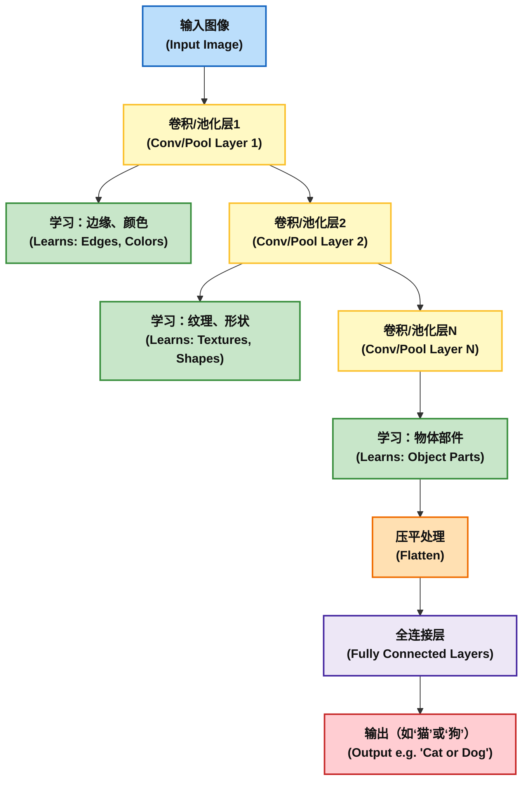

这种从简单到复杂的特征层次结构，是CNN强大表示能力的关键。 通过可视化不同层的特征图，我们可以直观地看到，浅层网络关注的是通用的基础元素，而深层网络则学会了识别更具语义的、与特定任务相关的复杂模式。 这种自动学习特征层次的思想，与我们稍后将看到的Transformer通过多层自注意力机制构建语言层次化理解的方式，有着异曲同工之妙。

### 本章的回顾

本章的核心在于揭示一个深刻的转变：从基于规则的AI到基于表示的AI。 无论是Word2Vec、GloVe还是CNN，它们的目标都是将混乱的符号世界（文字、像素）映射到一个有序的、具有几何意义的向量空间中。 在这个空间里，距离和方向承载着语义。 例如，向量('国王') - 向量('男人') + 向量('女人') 的计算结果之所以约等于 向量('女王')，并非因为模型被明确告知了这条规则，而是因为模型在海量数据的训练中，自发地学会了这样一种几何结构，使得“性别”和“皇室”等概念成为了空间中可以被线性操作的特定方向。 知识本身被编码成了几何关系。

同时，我们也看到了一个贯穿始终的权衡：计算效率、模型复杂度和表示能力的“三难困境”。 简单的方法如词向量平均，速度快但丢失了词序这一关键信息；复杂的方法如基于RNN的句子嵌入，能保留词序但训练缓慢。 Word2Vec和GloVe在局部与全局上下文之间的选择也体现了这一权衡。 这种在不同约束条件下寻求最佳表示方法的持续探索，为我们理解为何需要Transformer这样一种全新的、试图打破原有权衡的架构，提供了至关重要的背景。

**课后思考题**：

1. 讲义中提到，知识本身被编码成了几何关系，例如向量('国王') - 向量('男人') + 向量('女人') 的计算结果约等于向量('女王') 。为什么这种看似简单的向量运算能够捕捉到复杂的语义关系？这揭示了表示学习的什么本质？
2. Word2Vec和GloVe的核心区别在于它们如何利用上下文信息，一个是基于局部上下文的预测模型，一个是基于全局共现统计的计数模型 。请设想一个具体的NLP任务（如机器翻译或文本主题建模），并分析哪种模型可能更具优势，为什么？
3. 为什么说简单地将一句话中所有词的向量进行平均，是表示句子含义的一种有损方法 ？这种方法主要丢失了哪些至关重要的语言信息？

# 第二部分：架构的演进：从循环到注意力

本章将构建一条清晰的历史叙事线，追溯为处理序列数据而设计的神经网络架构的演进历程。 我们将展示，每一种新架构的诞生，都是对前代模型根本性局限的巧妙回应，这一系列的技术迭代最终催生了Transformer这一颠覆性的范式转变。

## 2.1 序列数据的挑战：循环神经网络（RNN）

对于文本、语音或时间序列这类具有先后顺序的数据，最直观的建模方式是使用循环神经网络（Recurrent Neural Networks, RNNs）。 RNN的核心设计在于其内部的“循环”（loop）结构：在处理序列中的每一个元素时，网络不仅接收当前的输入 $x\_t$，还会接收上一个时间步的隐藏状态 $h\_{t-1}$。 这个隐藏状态 $h\_t$ 是对到当前时间步为止所有历史信息的编码，它就像是网络的“记忆”。 这个记忆机制使得RNN能够捕捉到序列中的时间依赖关系。

为了更清晰地理解信息在RNN中的流动，我们通常会将其按时间步“展开”（unroll）。 展开后的RNN看起来就像一个非常深的前馈神经网络，其中每一层的权重是共享的。 这种结构直观地展示了当前时刻的输出是如何依赖于之前所有时刻的输入的。

图3: 循环神经网络（RNN）展开时序图

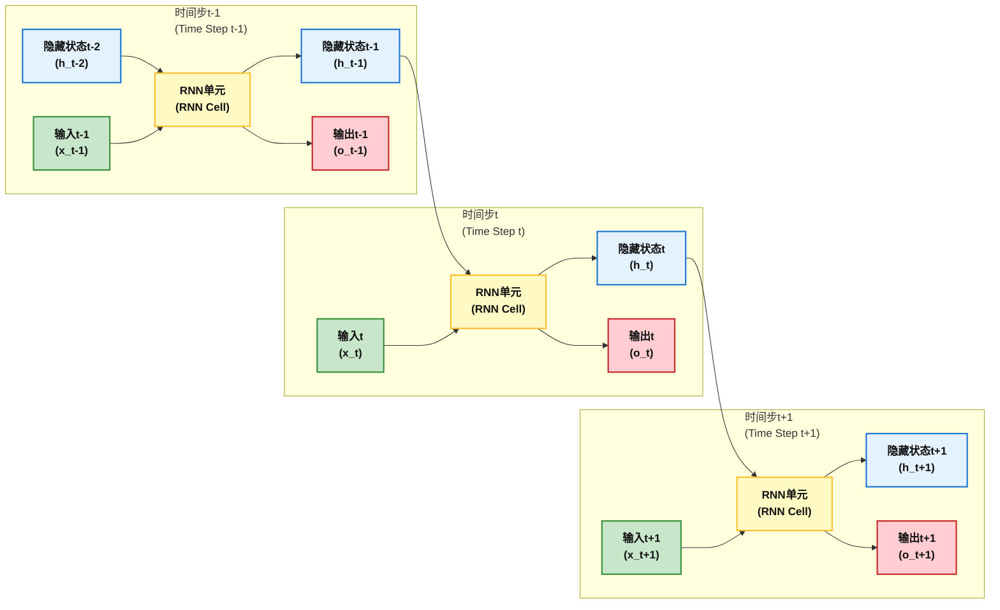

## 2.2 长期记忆的难题：梯度消失

尽管RNN在理论上能够处理任意长度的序列，但在实践中，它很快就暴露出了一个致命缺陷：难以学习和捕捉序列中的长期依赖关系（long-range dependencies）。 例如，在句子“The man who wore a red hat... was happy”中，要判断“was”的主语是“man”，模型需要跨越很长的距离来连接这两个词。

这个问题的根源在于 梯度消失问题 （Vanishing Gradient Problem）。 在训练RNN时，我们使用一种名为“通过时间的反向传播”（Backpropagation Through Time, BPTT）的算法来计算梯度和更新权重。 BPTT本质上就是在展开后的RNN上应用标准的反向传播算法。

当我们计算损失函数对较早时间步（例如 $t-k$）的权重的梯度时，根据链式法则，这个梯度值会包含一系列连乘项，这些项主要是循环权重矩阵 $W\_{rec}$ 和激活函数的导数。

$$\frac{\partial E_t}{\partial W} = \sum_{k=1}^{t} \frac{\partial E_t}{\partial y_t} \frac{\partial y_t}{\partial h_t} (\prod_{j=k+1}^{t} \frac{\partial h_j}{\partial h_{j-1}}) \frac{\partial h_k}{\partial W}$$

其中，核心是连乘项 $\\prod\_{j=k+1}^{t} \\frac{\\partial h\_j}{\\partial h\_{j-1}}$。 每一项 $\\frac{\\partial h\_j}{\\partial h\_{j-1}}$ 都涉及到循环权重矩阵 $W\_{rec}$。 如果 $W\_{rec}$ 的范数（或者说，其最大奇异值）小于1，并且激活函数（如tanh或sigmoid）的导数也常常小于1，那么这一长串小于1的数字相乘，其结果会以指数级的速度趋向于0。

这就意味着，从遥远的未来传回来的梯度信号会变得极其微弱，几乎为零。 因此，网络无法根据远距离的上下文来有效更新早期时间步的权重，从而“忘记”了很久以前的信息。 与此相对的是梯度爆炸问题（Exploding Gradient Problem），即当权重矩阵范数大于1时，梯度会指数级增长，导致训练不稳定。

**梯度消失问题示例**

假设我们正在训练一个简单的 **RNN** 来处理序列数据，比如一个文本序列，并且我们使用 **sigmoid** 激活函数。

1. **RNN模型与梯度传播**

在每个时间步，RNN通过更新隐藏状态 `h(t)` 来处理输入数据，并且在反向传播过程中，误差信号会从输出层传递回每个时间步的隐藏状态。通过链式法则，梯度信号会根据下面的公式更新：

* **隐藏状态的更新**：

  $$
  h(t) = \sigma(Wx(t) + Uh(t-1) + b)
  $$

  其中 `σ` 是激活函数（如sigmoid或tanh），`W` 是输入到隐藏层的权重矩阵，`U` 是隐藏到隐藏层的权重矩阵。

* **梯度计算**：

  $$
  \frac{\partial \text{Loss}}{\partial h(t-1)} = \frac{\partial \text{Loss}}{\partial h(t)} \cdot \frac{\partial h(t)}{\partial h(t-1)}
  $$

  在反向传播过程中，**误差信号** 会通过层与层之间的权重矩阵 `U` 进行传播，并且在每一步通过链式法则累乘。

#### 2. **梯度消失的发生**

假设我们的 **sigmoid** 激活函数的导数接近 **0**，例如，对于输入值很大的情况下，`sigmoid` 函数的输出接近于 1（或接近0），其导数 **`σ'(x) ≈ 0`**。此时，链式法则会在每一步计算中将梯度信号乘以一个接近 **0** 的值，从而导致误差信号快速衰减，尤其是在反向传播的时间步数增加时。

* 例如，假设我们有一个序列 `x = [x_1, x_2, x_3, x_4, x_5]`，模型在训练时通过反向传播计算每个时间步的梯度信号。
* 在计算 **`h(t)`** 和 **`h(t-1)`** 的梯度时，假设链式法则的每个项的值都小于 **1**，例如 0.1。

  $$
  \frac{\partial \text{Loss}}{\partial h(t-1)} = \text{Loss}_t \times 0.1 \times 0.1 \times 0.1 \times 0.1 \times 0.1
  $$

  经过多步计算后，**误差信号就会被压缩成接近0的数值**，无法有效地更新早期时间步的权重。也就是，**`h(t-1)`** 的更新几乎为零，导致网络"忘记"了早期的输入信息。

3. **具体示例：**

假设我们正在训练一个RNN来预测一个文本序列中的下一个单词。假设序列如下：

```
The dog chased the cat.
```

* **目标**：预测每个单词的类别（例如，情感分析任务，预测句子是否为正面或负面）。
* **RNN**：网络根据每个单词逐步更新隐藏状态 `h(t)`，然后通过输出层预测下一个单词或情感。

在反向传播时，假设网络在预测最后一个单词“cat”时，误差被计算并传播回前面的单词。例如，当模型计算从“chased”到“the”之间的梯度时，误差信号需要反向传播到更早的单词“dog”和“The”。

* 假设 **`sigmoid` 激活函数的梯度** 在早期步骤中非常小（比如接近0），那么“dog”一词的梯度就会接近零，从而导致在更新 **“dog”** 的权重时，模型几乎不会从它得到任何信息。

#### 4. **可视化的解释**

假设我们在每个时间步计算的梯度为：

* **`h(t)` 的梯度** = 0.8
* **`h(t-1)` 的梯度** = 0.6
* **`h(t-2)` 的梯度** = 0.2
* **`h(t-3)` 的梯度** = 0.1
* **`h(t-4)` 的梯度** = 0.05
* **`h(t-5)` 的梯度** = 0.01

随着时间步的增加，梯度信号急剧衰减，最终接近零。这意味着模型在反向传播中“忘记”了遥远时刻的输入，导致早期的权重几乎没有得到有效的更新。

### **解决方案**

为了应对梯度消失问题，研究者提出了 **LSTM（长短时记忆）** 和 **GRU（门控循环单元）**，这些模型通过引入门控机制来有效地保持长期依赖关系，避免了梯度消失问题。

* **LSTM**：引入了**遗忘门**、**输入门**和**输出门**，控制信息的流动，从而保留长时间步的记忆。
* **GRU**：与LSTM类似，但它将部分门控机制合并，结构更加简洁。

这些方法能够帮助 RNN 在长序列中保持更稳定的梯度更新，从而有效避免梯度消失问题。

### 总结

* **梯度消失** 是 **RNN** 训练中的一个常见问题，尤其是在长序列任务中，梯度通过反向传播时会逐渐变小，最终导致早期时间步的权重几乎无法更新。
* **LSTM** 和 **GRU** 是解决梯度消失问题的两种常见方法，它们通过引入门控机制来保持长期依赖关系，避免信息丢失。

**RNN（循环神经网络）模型来进行序列分类任务示例**

在这段代码示例中，使用了 PyTorch 定义了一个简单的 RNN（循环神经网络）模型来进行序列分类任务。经过一定的训练之后，我们希望模型能够根据输入的序列（例如文本）进行预测并输出一个分类结果。

代码执行步骤概览：
- 训练数据生成：首先生成了一些简单的随机序列数据，并为每个序列分配了一个标签（0 或 1）。
- 模型定义：定义了一个简单的 RNN 模型，其中包含一个 RNN 层 和一个 全连接层，用于输出分类结果。
- 训练过程：模型通过损失函数（交叉熵损失）和优化器（Adam）进行训练，更新模型的参数，最终学习到从输入序列到输出标签的映射关系。
- 测试过程：模型经过训练后，进行推理，并输出预测的分类标签。

1. 安装 spaCy

首先，确保你已经安装了 spaCy 和一个语言模型（例如英文模型）：

~~~
pip install spacy
python -m spacy download en_core_web_sm
~~~

2. 使用 spaCy 进行文本分词

我们将使用 spaCy 来进行分词，并生成句子的嵌入表示。下面的代码展示了如何将句子通过 spaCy 进行分词并转化为词向量的平均值作为句子表示。

~~~Python
import spacy
import torch
import numpy as np

# 加载spaCy模型
nlp = spacy.load("en_core_web_sm")

# 1. 定义简单的RNN模型
class RNNModel(nn.Module):
    def __init__(self, input_size, hidden_size, output_size):
        super(RNNModel, self).__init__()
        self.hidden_size = hidden_size

        # 定义RNN层
        self.rnn = nn.RNN(input_size, hidden_size, batch_first=True)

        # 定义全连接层，将RNN的输出映射到分类结果
        self.fc = nn.Linear(hidden_size, output_size)

    def forward(self, x):
        # 初始化隐状态
        h0 = torch.zeros(1, x.size(0), self.hidden_size).to(x.device)

        # RNN的前向传播
        out, _ = self.rnn(x, h0)

        # 取RNN的最后时间步的输出
        out = out[:, -1, :]

        # 通过全连接层得到最终输出
        out = self.fc(out)
        return out

# 2. 使用spaCy进行分词并生成句子嵌入
def sentence_to_embedding(sentence, nlp, seq_length=5):
    # 使用spaCy进行分词
    doc = nlp(sentence.lower())  # 将句子小写，并进行分词
    word_embeddings = []

    for token in doc:
        # 获取每个词的词向量
        word_embeddings.append(torch.tensor(token.vector))

    # 如果句子中有词向量，则返回其平均值
    if word_embeddings:
        sentence_embedding = torch.stack(word_embeddings).mean(dim=0)
        return sentence_embedding.unsqueeze(0)  # 增加batch维度
    else:
        return torch.zeros(1, 300)  # 如果句子中没有有效的词，则返回全零向量

# 3. 模拟训练数据和标签
# 假设我们有一个二分类任务（0：负面情感，1：正面情感）
X_train = torch.randn(10, 5, 300)  # 随机生成10个句子，每个句子长度为5，每个词向量维度为300
y_train = torch.randint(0, 2, (10,))  # 随机生成对应的标签（0或1）

# 4. 定义模型
input_size = 300  # GloVe词向量维度
hidden_size = 128
output_size = 2  # 二分类
model = RNNModel(input_size, hidden_size, output_size)

# 5. 损失函数和优化器
criterion = nn.CrossEntropyLoss()  # 用于多分类的交叉熵损失
optimizer = optim.Adam(model.parameters(), lr=0.001)

# 6. 训练模型
epochs = 100
for epoch in range(epochs):
    model.train()
    optimizer.zero_grad()

    # 前向传播
    outputs = model(X_train)

    # 计算损失
    loss = criterion(outputs, y_train)

    # 反向传播和优化
    loss.backward()
    optimizer.step()

    # 每10个epoch打印一次损失
    if (epoch + 1) % 10 == 0:
        print(f"Epoch [{epoch+1}/{epochs}], Loss: {loss.item():.4f}")

# 7. 使用训练好的模型进行预测
sentence = "I hate this movie"  # 你的输入句子

# 1. 将句子转化为嵌入向量
test_input = sentence_to_embedding(sentence, nlp)

# 2. 进行预测
model.eval()  # 设置模型为评估模式
with torch.no_grad():  # 在推理时不计算梯度
    prediction = model(test_input)  # 进行预测
    predicted_class = torch.argmax(prediction, dim=1)  # 取最大概率的类别
    print(f"Predicted class: {predicted_class.item()}")
~~~

**代码解析**
	- spaCy 加载：我们使用 spacy.load("en_core_web_sm") 加载了 spaCy 的小型英文模型，该模型提供了词向量、词性标注、命名实体识别等功能。
	- sentence_to_embedding 方法：
		- 使用 nlp(sentence.lower()) 将输入句子转换为 spaCy 的 Doc 对象，并对其进行分词。
		然后，我们通过遍历分词后的每个单词，提取每个单词的词向量 (token.vector)，并将其存储在 word_embeddings 列表中。
		最后，通过 平均池化（mean pooling） 将所有单词的词向量求平均，得到句子的向量表示。
- RNN 模型：与前面类似，定义了一个简单的 RNN 模型，并训练它进行情感分类。

**输出示例**：

假设模型训练完成后进行推理，输出将类似于：

~~~
Predicted class: 0
~~~

这表示模型预测句子 "I hate this movie" 属于 类别 0，即负面情感。

## 2.3 门控的解决方案：长短期记忆网络（LSTM）

为了解决RNN的梯度消失问题，研究者们在1997年提出了长短期记忆网络（Long Short-Term Memory, LSTMs）。 LSTM通过引入一个更为精巧的内部结构，成功地让梯度能够“平稳”地流经很长的时间跨度。

LSTM的核心创新在于引入了一个独立的 **细胞状态** （Cell State, $C\_t$）和三个特殊的 **门** （Gates）来精确控制信息的流动。

  * **细胞状态 ($C\_t$)**：可以看作是一条“信息传送带”。 它贯穿整个时间链，信息可以在上面顺畅地流动，只进行一些微小的线性操作。 这使得信息很容易在长距离内保持不变。
  * **门控机制**：LSTM的精髓在于它有能力通过门来向细胞状态中添加或移除信息。 门是一种让信息选择性通过的方式，它由一个sigmoid神经网络层和一个逐点乘法运算组成。 Sigmoid层输出0到1之间的值，表示允许多少比例的信息通过。

LSTM包含三个关键的门：

1.  **遗忘门 (Forget Gate)**：决定从上一个细胞状态 $C\_{t-1}$ 中丢弃哪些信息。 它查看 $h\_{t-1}$ 和 $x\_t$，为 $C\_{t-1}$ 中的每个数字输出一个0到1之间的值。 1表示“完全保留”，0表示“完全丢弃”。
2.  **输入门 (Input Gate)**：决定让哪些新信息存入细胞状态。 它由两部分组成：一个sigmoid层决定更新哪些值，一个tanh层创建一个新的候选值向量 $\\tilde{C}\_t$。 这两部分的结果相乘，就得到了要添加到细胞状态中的新信息。
3.  **输出门 (Output Gate)**：决定从细胞状态中输出什么。 它首先通过一个sigmoid层来决定输出细胞状态的哪些部分，然后将细胞状态通过一个tanh层（将值缩放到-1到1之间），并与sigmoid门的输出相乘，最终得到新的隐藏状态 $h\_t$。

图4: LSTM单元内部结构示意图

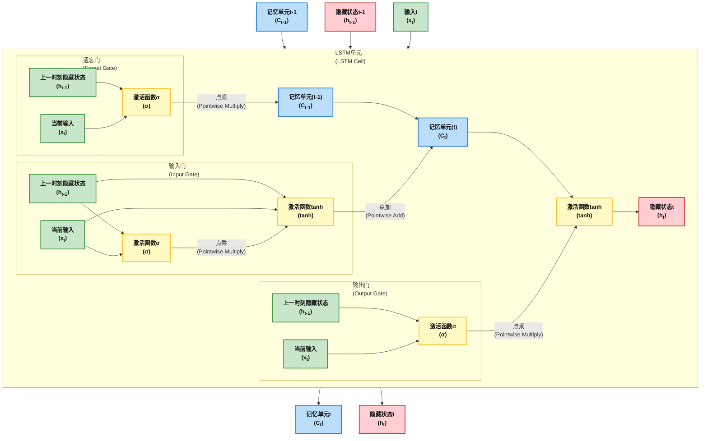

LSTM的这种门控设计，特别是细胞状态的加法式更新（$C\_t = f\_t \\odot C\_{t-1} + i\_t \\odot \\tilde{C}\_t$），而不是RNN中的乘法式更新，是其能够克服梯度消失的关键。 加法操作使得梯度在反向传播时能够更完整地传递，形成了一条“梯度高速公路”。 这是一种通过精巧的架构设计来解决优化难题的典范。

**LSTM代码示例**

下面是一个基于 **PyTorch** 的 LSTM 示例代码：

1 **定义LSTM模型**

```python
import torch
import torch.nn as nn
import torch.optim as optim
import numpy as np

# 定义LSTM模型
class LSTMModel(nn.Module):
    def __init__(self, input_size, hidden_size, output_size):
        super(LSTMModel, self).__init__()
        self.hidden_size = hidden_size

        # 定义LSTM层
        self.lstm = nn.LSTM(input_size, hidden_size, batch_first=True)

        # 定义全连接层
        self.fc = nn.Linear(hidden_size, output_size)

    def forward(self, x):
        # 初始化隐藏状态和细胞状态
        h0 = torch.zeros(1, x.size(0), self.hidden_size).to(x.device)  # 隐藏状态
        c0 = torch.zeros(1, x.size(0), self.hidden_size).to(x.device)  # 细胞状态

        # LSTM前向传播
        out, (hn, cn) = self.lstm(x, (h0, c0))  # out: LSTM的输出，hn: 最后一个时间步的隐藏状态

        # 只取最后一个时间步的输出
        out = self.fc(out[:, -1, :])
        return out

# 示例：输入维度、隐藏层大小和输出维度
input_size = 10  # 输入特征维度（例如，每个时间步的特征维度）
hidden_size = 50  # LSTM隐藏层的大小
output_size = 2  # 二分类任务（0或1）

# 初始化模型
model = LSTMModel(input_size, hidden_size, output_size)
```

2. **训练数据准备**

假设我们有一个简单的序列分类任务，每个序列包含一系列的数值，任务是预测每个序列的类别。

```python
# 假设输入数据：每个序列长度为5，每个时间步的输入特征维度为10
X_train = torch.randn(100, 5, 10)  # 100个样本，每个样本的序列长度为5，特征维度为10
y_train = torch.randint(0, 2, (100,))  # 对应的标签：二分类任务（0或1）

# 定义损失函数和优化器
criterion = nn.CrossEntropyLoss()  # 交叉熵损失，用于分类任务
optimizer = optim.Adam(model.parameters(), lr=0.001)
```

3. **训练LSTM模型**

训练过程中的每个时间步，LSTM会计算每个时间步的输出，并通过梯度反向传播来更新模型的参数。

```python
# 训练模型
epochs = 50
for epoch in range(epochs):
    model.train()  # 设置模型为训练模式
    optimizer.zero_grad()  # 清零梯度

    # 前向传播
    outputs = model(X_train)

    # 计算损失
    loss = criterion(outputs, y_train)

    # 反向传播和优化
    loss.backward()
    optimizer.step()

    # 每10个epoch打印一次损失
    if (epoch + 1) % 10 == 0:
        print(f"Epoch [{epoch+1}/{epochs}], Loss: {loss.item():.4f}")
```

4. **使用训练好的模型进行预测**

训练完成后，我们可以使用训练好的 LSTM 模型对新的序列进行预测。

```python
# 使用训练好的模型进行预测
model.eval()  # 设置模型为评估模式
with torch.no_grad():  # 推理时不计算梯度
    test_input = torch.randn(1, 5, 10)  # 随机生成一个测试样本
    prediction = model(test_input)
    predicted_class = torch.argmax(prediction, dim=1)  # 获取最大概率的类别
    print(f"Predicted class: {predicted_class.item()}")
```

### **总结**

* **LSTM** 通过引入 **遗忘门、输入门和输出门**，有效地解决了传统 **RNN** 的梯度消失问题。它能够保持长期依赖，避免信息在长序列中的丢失。
* 上面的代码展示了如何在 **PyTorch** 中定义一个 **LSTM** 模型，进行训练，并使用训练好的模型进行预测。
* 通过这种方法，LSTM在处理时间序列数据时能够捕捉到长时间步之间的关系，尤其适用于自然语言处理、语音识别、时间序列预测等任务。


## 2.4 最后的瓶颈：顺序处理的局限

LSTM及其变体（如GRU，Gated Recurrent Unit）在很大程度上解决了长期依赖问题，并在多年的NLP任务中占据了主导地位。 然而，它们在解决一个问题的同时，保留了另一个根本性的瓶颈：**顺序处理**。

在RNN和LSTM中，要计算时间步 $t$ 的隐藏状态 $h\_t$，必须先完成时间步 $t-1$ 的计算，因为 $h\_t$ 依赖于 $h\_{t-1}$。 这种计算上的依赖关系是 **内在顺序的** （inherently sequential）。

这个特性严重 **阻碍了并行计算**。 在一个训练样本内部，我们无法同时计算所有时间步的状态，必须一步一步地进行。 在GPU等并行计算硬件已经普及的时代，这种无法利用并行能力的特性，使得RNN和LSTM在处理日益增长的海量数据集时，训练过程变得极其缓慢和低效。

这一“速度”与“效率”的瓶颈，成为了催生下一代架构——Transformer——的最主要动因。 研究者们开始思考一个革命性的问题：我们能否在不依赖循环结构的情况下，捕捉序列中的长距离依赖关系？

**表3：RNN、LSTM与Transformer架构对比**
| 模型 | 核心机制 | 处理长距离依赖 | 并行化能力 | 解决的关键问题 |
| --- | --- | --- | --- | --- |
| **RNN** | 简单循环 | 差（梯度消失） | 否 | 引入了处理序列的“记忆”概念 |
| **LSTM** | 门控循环 | 好 | 否 | 梯度消失问题 |
| **Transformer** | 自注意力 | 优秀 | 是 | 顺序处理瓶颈 |

### 本章的回顾

从RNN到LSTM，再到Transformer的演进，生动地诠释了在“记忆能力”与“计算速度”这对核心矛盾之间不断寻求更优解的过程。 RNN试图拥有记忆，但其数学上的缺陷（梯度消失）使其健忘而低效。 LSTM通过精巧的门控结构解决了记忆问题，创造了一条保护梯度的“信息高速公路”，使其变得有效，但依然受限于循环结构带来的缓慢计算速度。

问题的核心在于“循环”本身。 $h\_t = f(h\_{t-1}, \\dots)$ 这个公式就注定了其顺序处理的命运。 Transformer的创造者们则提出了一个颠覆性的问题：“我们能否在拥有强大记忆的同时，彻底抛弃循环？”。 他们的答案——用注意力机制直接连接序列中的任意两个位置——不仅完美地解决了长距离依赖问题，还实现了完全的并行化。 这是一种非凡的思维跃迁，它用一种更强大、可并行的信息访问方式，取代了RNN的时间循环，从而重新定义了序列建模的范式。

**课后思考题**：

1. 讲义中提到RNN难以学习和捕捉序列中的长期依赖关系 。请用你自己的话解释什么是“梯度消失问题”，并说明它是如何具体地阻碍RNN“记忆”更早期的信息的。
2. LSTM通过引入独立的细胞状态和“门”结构，成功解决了梯度消失问题 。其中，细胞状态的更新是加法式的（C_t=f_tcdotC_t−1+i_tcdottildeC_t） 。这个“加法”操作与RNN中的“乘法”更新相比，为什么能让梯度更顺畅地传递，形成所谓的“梯度高速公路”？
3. 尽管LSTM解决了长期记忆问题，但它依然存在一个根本性的瓶颈：顺序处理 。这个瓶颈是如何由RNN/LSTM的核心计算公式 h_t=f(h_t−1,x_t) 所决定的 ？为什么这个特性在现代GPU等并行计算硬件普及的时代，成为了一个亟待解决的问题？


# 第三部分：Transformer架构：注意力就是你所需要的一切

本章是第二天学习的技术核心。 我们将深入剖析2017年发布的开创性论文《Attention Is All You Need》中所提出的Transformer架构。 我们将从宏观的编码器-解码器结构入手，层层递进，直至每个组件的数学细节，揭示其设计的精妙之处。

## 3.1 范式转移：编码器-解码器框架

Transformer的宏观架构沿用了在机器翻译等序列到序列（Seq2Seq）任务中常见的编码器-解码器（Encoder-Decoder）模型。 然而，它的革命性在于，它完全摒弃了此前主流的循环（Recurrence）和卷积（Convolution）结构，完全依赖于一种名为“注意力”（Attention）的机制来构建模型。

图5: Transformer 整体架构图

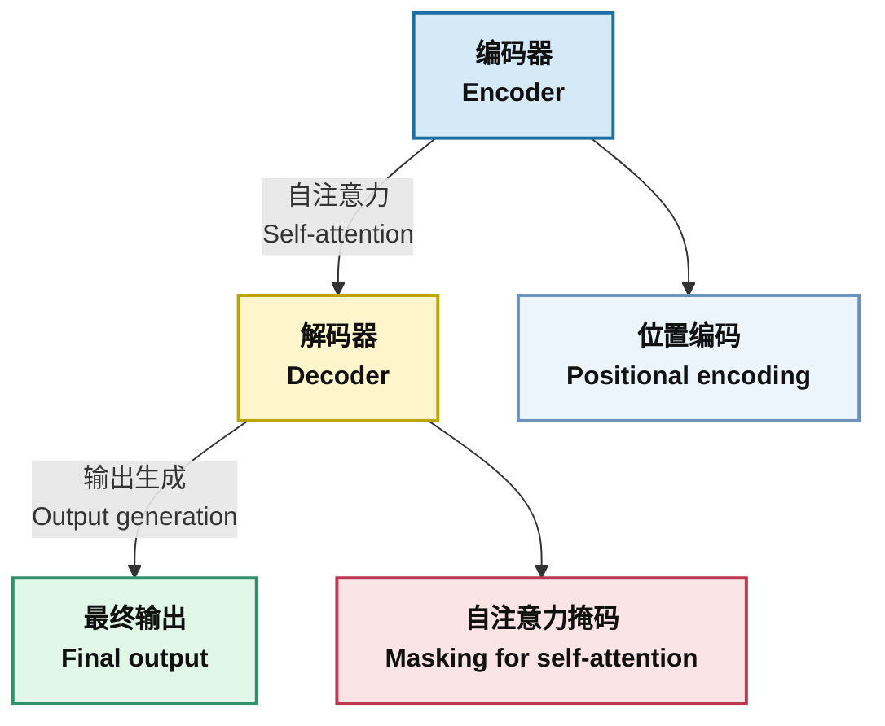

  * **编码器栈 (Encoder Stack)**：由N=6个相同的层堆叠而成。 每一层包含两个子层：一个 **多头自注意力（Multi-Head Self-Attention）机制** 和一个 **位置前馈网络（Position-wise Feed-Forward Network）**。 编码器的职责是接收并处理整个输入序列（例如，一句待翻译的德语），并为序列中的每个词生成一个富含上下文信息的表示向量 z。
  * **解码器栈 (Decoder Stack)**：同样由N=6个相同的层堆叠而成。 每一层包含三个子层：一个 **带掩码的多头自注意力（Masked Multi-Head Self-Attention）机制**，一个 **多头交叉注意力（Multi-Head Cross-Attention）机制** （它关注编码器的输出），以及一个位置前馈网络。 解码器的职责是利用编码器生成的表示 z，以自回归（auto-regressive）的方式，一次一个地生成输出序列中的词（例如，翻译后的英语句子）。

## 3.2 Transformer框架机制解析

把Transformer想象成一个分工明确、善于沟通的专业翻译团队：

这个团队有两个核心部门：**理解部（Encoder）**和**写作部（Decoder）**。他们的共同任务是把一句话，比如“我有一只猫”，精准地翻译成“I have a cat”。

### 3.2.1 第一步：准备工作

在正式翻译前，团队需要做两项基础准备：

1.  **查字典 (词 Embedding)**: 团队成员会把原句中的每个中文词（“我”，“有”，“一只”，“猫”）都在一本特殊的“概念词典”里查一遍。这本词典不只是给出单一的定义，而是将每个词转换成一组能够代表其丰富、 nuanced 含义的数字。

2.  **排座位 (位置 Embedding)**: 这个团队有一个独特的工作习惯：他们会同时审视整句话的所有词汇，而不是按照顺序依次阅读。为了确保词语的原始顺序不被打乱（这对于理解句子至关重要），他们会给每个词分配一个独一无二的“座位号”。这样，即使是同时处理，也能清晰地知道每个词在句子中的具体位置。

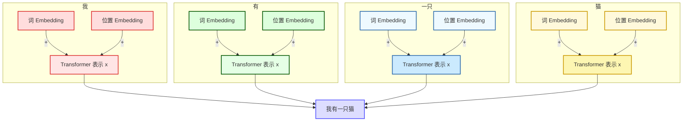

### 3.2.2第二步：理解部（Encoder）的工作

准备工作完成后，附有“字典含义”和“座位号”的中文原句被提交给**理解部**。

* **核心工作：召开内部研讨会 (Self-Attention)**
    理解部由六位专家组成（对应六个Encoder block）。他们不会孤立地看待每个词，而是会针对每一个词，召开一次全面的“内部研讨会”。

    * 例如，在分析“猫”这个词时，专家们会同时回顾句子中的“我”和“有”。通过这种方式，他们能准确地判断出这里的“猫”指的是“我所拥有的那只猫”，而不是一个泛指的、抽象的动物概念。
    * 这种让句子中的每一个词都与其他所有词进行关联和“沟通”，从而深刻理解其在特定上下文中的准确含义的机制，就是**自注意力机制 (Self-Attention)**。

* **最终成果：形成深度理解报告**
    经过六位专家（六个层级）层层递进、越来越深入的研讨后，理解部最终会产出一份详尽的“理解报告”（即编码信息矩阵C）。这份报告不仅包含了每个词的含义，更重要的是，它蕴含了对整个句子结构、语义和上下文的深刻洞察。随后，这份报告将被转交给写作部。

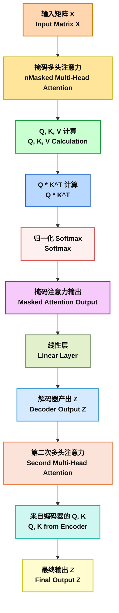

### 3.2.3第三步：写作部（Decoder）的工作

**写作部**同样由六位专家（对应六个Decoder block）构成。他们的任务是依据理解部提供的“深度报告”，逐词构建出流畅、准确的英文句子。

1.  **写下第一个词：**
    * 写作专家首先会仔细研究理解部的“深度报告”。他会向这份报告“提问”：“基于你对‘我有一只猫’这句话的全面理解，翻译成英文时，最应该以哪个词作为开头？”
    * 报告中的信息会强烈指向“我”这个核心概念，因此，写作专家会写下第一个词："I"。

2.  **写下第二个词：**
    * 此时，写作专家手头有了两份关键的参考资料：1）他刚刚完成的第一个词 "I"。2）那份来自理解部的、内容详尽的“深度报告”。
    * 他会同时关注这两个信息源：
        * **回顾已写内容 (Masked Self-Attention)**: 他会审视自己刚刚写下的 "I"，以确保接下来要写的词能在语法和逻辑上与之顺畅衔接。为了模拟真实的创作过程并防止“作弊”（即偷看标准答案），他会刻意“蒙住眼睛”，不去看正确答案中 "I" 后面的任何词。
        * **再次咨询深度报告 (Encoder-Decoder Attention)**: 他会带着已有的 "I" 去再次“咨询”深度报告：“我已经写下了‘I’，现在请结合你对原始中文句子的理解，告诉我下一个最合适的词是什么？” 报告会分析出“有”（have）这个概念在当前节点最为重要，于是他会接着写下 "have"。

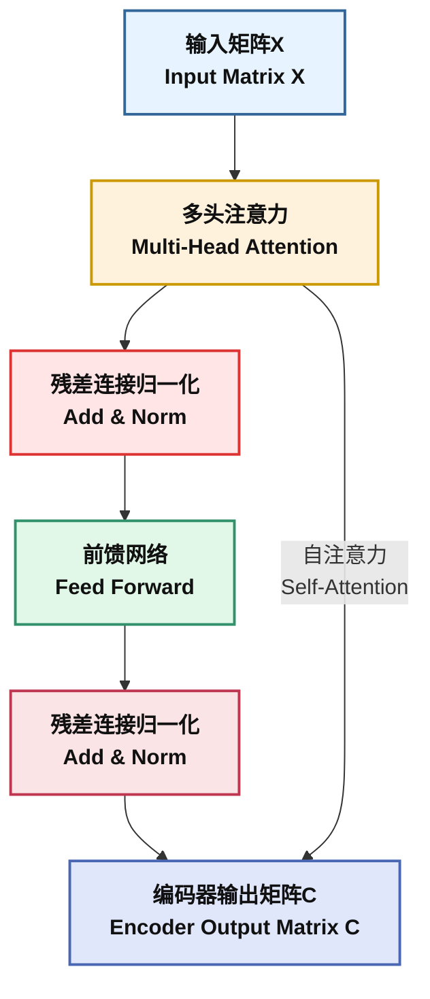

这个创作过程会不断地循环下去，直到写作部认为整个句子已经表达完整，并最终输出一个代表“结束”的特殊标记。

### 3.2.4 工作机制小结

* **高效的并行处理**：与传统的、需要按顺序逐词处理的模型不同，Transformer的理解部（Encoder）可以像一个高效的团队一样，同时审视和处理一整句话中的所有词汇。这种并行处理能力极大地提升了模型的训练速度和效率。
* **注意力是所有能力的核心**：无论是理解部内部为了厘清上下文关系而召开的“内部研讨会”（Self-Attention），还是写作部在创作过程中不断参考理解报告的“咨询会议”（Encoder-Decoder Attention），**注意力机制**都是Transformer模型施展其强大语言能力的根本。它使得模型能够在处理信息的过程中，智能、动态地判断出哪些部分在当前步骤中最为关键，从而做出最精准的决策。

## 3.2 核心机制：缩放点积自注意力

注意力机制是Transformer的灵魂。 从概念上讲，一个注意力函数可以被描述为将一个 **查询（Query）和一组键-值（Key-Value）对** 映射到一个输出。 这个输出是所有“值”的加权和，而每个“值”的权重，则由其对应的“键”与“查询”的兼容性（或相似度）决定。

### Q, K, V 向量

在自注意力（Self-Attention）中，查询（Query, Q）、键（Key, K）和值（Value, V）这三个向量均派生自 **同一个输入序列**。 我们可以直观地理解它们各自的角色：

  * **查询 (Q)**：代表当前正在处理的词，它发问：“我是谁？我应该关注序列中的哪些其他词？”
  * **键 (K)**：代表序列中的所有词（包括它自己），它们各自宣告：“我是这个词，这是我的身份。”
  * **值 (V)**：代表每个词的实际内容或语义信息。

#### 注意力计算公式详解

自注意力的计算可以分解为以下几个步骤，其公式为：$Attention(Q, K, V) = softmax(\\frac{QK^T}{\\sqrt{d\_k}})V$

图6: 缩放点积注意力计算流程图

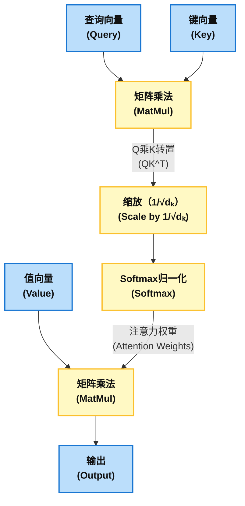

1.  **计算相似度得分 ($QK^T$)**：对于序列中的每一个词，我们用它的Q向量与序列中所有词（包括自身）的K向量进行点积运算。 这会得到一个注意力得分矩阵，矩阵中的每个元素 $score\_{ij}$ 代表了第 i 个词对第 j 个词的关注程度或原始相似度。
2.  **缩放 ( / $\\sqrt{d\_k}$)**：将上一步得到的所有注意力得分除以一个缩放因子 $\\sqrt{d\_k}$，其中 $d\_k$ 是键向量的维度。 这是一个至关重要的稳定化步骤。 当 $d\_k$ 较大时，点积的结果可能会变得非常大，这会将softmax函数推向其梯度极小的区域，导致梯度消失，使训练难以进行。 通过缩放，可以有效缓解这个问题。
3.  **归一化 (softmax)**：对缩放后的得分矩阵按行应用softmax函数。 这会将每一行的得分转换成一个概率分布，即所有权重值都在0到1之间，且总和为1。 这个结果就是最终的注意力权重矩阵。
4.  **加权求和 ($\\times V$)**：将上一步得到的注意力权重矩阵与V矩阵相乘。 对于第 i 个词，其最终的输出向量就是序列中所有词的V向量的加权和，权重即为第 i 个词对其他所有词的注意力权重。 通过这个过程，每个词的新表示都融合了来自整个序列的上下文信息，从而变得更加丰富和准确。

## 3.3 拓宽视野：多头注意力

Transformer并不满足于只进行一次注意力计算。 它采用了一种更强大的机制，即 **多头注意力（Multi-Head Attention）**。 其核心思想是，与其用一个高维度的Q、K、V进行一次“昂贵”的注意力计算，不如将Q、K、V通过不同的线性变换（即可学习的权重矩阵）投影到多个低维度的子空间中，然后在每个子空间里并行地进行注意力计算。

**“为什么”需要多头？** 不同的“头”（head）可以学习关注不同方面的信息。 例如，一个头可能学会了关注句法依赖关系（如主谓一致），另一个头可能学会了关注语义关联（如“银行”和“金融”），还有一个头可能关注指代关系。 这使得模型能够从多个不同的“表示子空间”共同捕捉输入序列的丰富信息。

**“如何”实现？** 每个头都拥有自己独立的Q、K、V权重矩阵。 在各自计算完注意力输出后，所有头的输出结果会被拼接（concatenate）起来，然后再通过一个最终的线性投影层，将维度恢复到模型的标准维度，从而融合所有头学到的信息。

图7: 多头注意力机制流程图

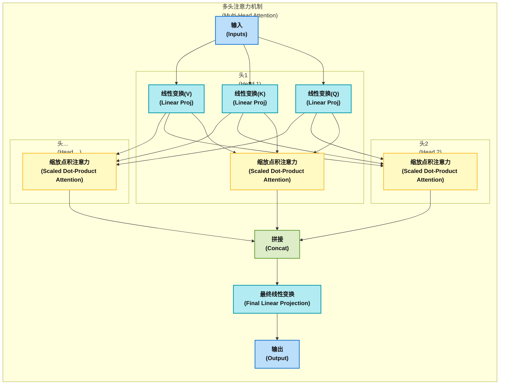

## 3.4 跨越鸿沟：交叉注意力的角色

交叉注意力（Cross-Attention）是连接编码器和解码器的关键桥梁，它位于解码器每一层的第三个子层。 它允许解码器在生成输出序列的每一步，“回顾”和“参考”整个输入序列的信息。

### 交叉注意力中的Q、K、V来源

这正是交叉注意力与自注意力的根本区别：

  * **查询 (Q)**：来自 **解码器的前一个子层** （即带掩码的自注意力层）。 它代表了解码器到目前为止已经生成的部分输出序列的状态。
  * **键 (K) 和 值 (V)**：来自 **编码器栈的最终输出**。 它们包含了关于整个输入序列的丰富上下文表示。

#### 工作机制

在生成每一个目标词时，解码器的Q向量会向编码器的输出“提问”：“鉴于我已经翻译出了‘我爱’，现在要生成下一个词，原始德语句子中的哪个部分最值得我关注？” 交叉注意力机制通过计算Q与所有K的相似度，为V向量赋予权重，从而将编码器中最相关的信息聚焦并传递给解码器，指导其生成最合适的下一个词。

## 3.5 重塑秩序：位置编码

自注意力机制本身是 **置换不变的** （permutation-invariant），也就是说，它无法感知词语在序列中的顺序。 对于自注意力来说，“狗追猫”和“猫追狗”在打乱顺序后是完全一样的，因为它只关心词与词之间的关系，而不关心它们的位置。 这对于理解语言是致命的。

为了解决这个问题，Transformer引入了 **位置编码（Positional Encoding）**。 在将词嵌入输入到编码器和解码器栈的底部之前，会给每个词嵌入加上一个代表其绝对位置的向量。

### 正弦与余弦函数

原始论文中使用了一组基于不同频率的正弦和余弦函数来生成位置编码：

$$PE_{(pos, 2i)} = \sin(pos / 10000^{2i/d_{\text{model}}})$$
$$PE_{(pos, 2i+1)} = \cos(pos / 10000^{2i/d_{\text{model}}})$$

其中，pos 是词在序列中的位置，i 是编码向量中的维度索引，$d\_{model}$ 是模型的嵌入维度。

**这种选择的精妙之处** 在于，它使得模型能够轻易地学习到 **相对位置关系**。 因为对于任何固定的偏移量 k，$PE\_{pos+k}$ 都可以表示为 $PE\_{pos}$ 的一个线性函数。 这个特性也使得模型能够更好地泛化到比训练时遇到的序列更长的序列。

图8: 位置编码生成与应用流程 (概念图)

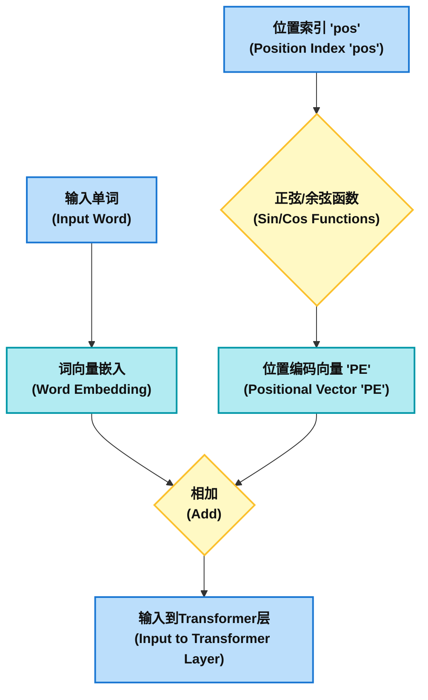

## 3.6 稳定巨兽：残差连接与层归一化

Transformer是一个非常深的网络（例如，N=6层，每层又包含多个子层）。 训练如此深度的网络极易遇到梯度消失或爆炸等问题，导致训练不稳定。

  * **残差连接 (Residual Connections)**：每个子层（注意力层和前馈网络层）都被一个残差连接“包裹”着。 子层的输出形式为 $LayerNorm(x + Sublayer(x))$。 其中 $x + \\dots$ 的部分就是“捷径”或“残差”连接。 它允许输入信号 x 直接“跳过”子层，与子层的输出相加。 这为梯度提供了一条直接回传的路径，极大地缓解了深度网络中的梯度消失问题，使得训练更深的模型成为可能。
  * **层归一化 (Layer Normalization)**：在每个子层 **之前** （这是目前标准的“Pre-Norm”结构）应用层归一化。 它对单个样本在特征维度上进行归一化，确保该层接收到的输入的均值为0，方差为1。 这使得每一层的输入分布更加稳定，从而加速并稳定了整个训练过程。

## 3.7 Transformer工作原理的示例

我们通过一个具体的例子，一步步拆解Transformer如何将中文句子“我爱机器”翻译成英文“I love machines”。

这个过程主要分为两个阶段：首先，编码器（Encoder）完全“阅读”并理解“我爱机器”这句话；然后，解码器（Decoder）根据这份理解，一个词一个词地生成英文翻译。

---

### **第一阶段：编码器（Encoder）的工作——理解“我爱机器”**

编码器的唯一目标是接收输入序列，并为每个词生成一个富含上下文信息的向量表示。

#### **第1步：输入表示**

模型不能直接处理文字，所以第一步是向量化。
1.  **词嵌入**：句子 `["我", "爱", "机器"]` 中的每个词都被转换成一个向量（比如512维）。我们暂且称之为 `E_我`, `E_爱`, `E_机器`。这些向量代表了词语的语义。
2.  *位置编码**：由于Transformer本身不处理时序，我们需要告诉它每个词的位置。模型会为位置0、1、2生成对应的位置向量 `P_0`, `P_1`, `P_2`。
3.  *最终输入**：将词嵌入和位置编码相加，得到每个词的最终输入向量 `X_我 = E_我 + P_0`，`X_爱 = E_爱 + P_1`，`X_机器 = E_机器 + P_2`。这三个向量组成一个矩阵，作为编码器第一层的输入。

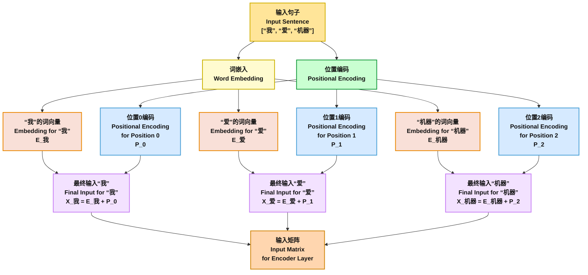

#### **第2步：自注意力机制——赋予上下文**

这是Transformer的核心。我们以计算“爱”这个词的新表示为例：
1.  **生成Q, K, V**：输入向量 `X_爱` 会通过三个不同的线性变换，生成三个新的向量：查询向量 `Q_爱`、键向量 `K_爱` 和值向量 `V_爱`。句子中的“我”和“机器”也同样生成各自的Q, K, V向量。
2.  **计算注意力得分**：`Q_爱` (查询)会和句子中所有词的`K`(键)进行点积运算，来计算相关性得分。
    * `得分1 = Q_爱 · K_我`  （“爱”和“我”的相关性）
    * `得分2 = Q_爱 · K_爱`  （“爱”和“爱”的相关性）
    * `得分3 = Q_爱 · K_机器`（“爱”和“机器”的相关性）
3.  **归一化权重**：将这些得分进行缩放（除以一个常数）后，通过Softmax函数转换成三个权重 `w₁`, `w₂`, `w₃`，它们的和为1。这些权重代表了在理解“爱”这个词时，模型应该对“我”、“爱”、“机器”分别投入多少注意力。
4.  **加权求和**：最后，用这些权重对所有词的`V`(值)向量进行加权求和，得到“爱”这个词的新向量`Z_爱`。
    * `Z_爱 = (w₁ * V_我) + (w₂ * V_爱) + (w₃ * V_机器)`

经过这一步，`Z_爱` 不再仅仅代表“爱”这个词本身，而是**一个结合了“我”作为主语和“机器”作为宾语的、富含上下文信息的“爱”**。这个过程对所有词同时进行，所以“我”和“机器”也获得了各自的上下文向量。

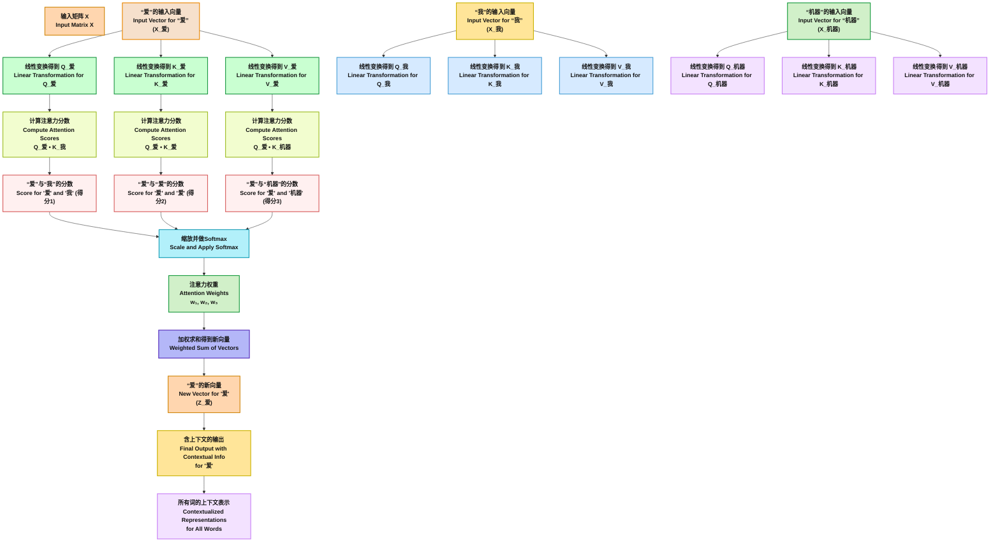

#### **第3步：编码器输出**

这个自注意力过程，加上一个前馈网络，构成一个编码器层。输入矩阵经过6个这样的编码器层后，最终输出一个编码矩阵 **C**。这个矩阵**C**可以被看作是模型对整个句子“我爱机器”的深度、完整的理解，它将被发送给解码器使用。

---

### **第二阶段：解码器（Decoder）的工作——生成“I love machines”**

解码器接收编码矩阵**C**，然后像我们说话一样，一个词一个词地生成翻译。

#### **第1个词：“I”**

1.  **解码器输入**：解码过程从一个特殊的开始符 `<begin>` 开始。
2.  **注意力机制**：
    * **掩码自注意力**：解码器首先对自己当前的输入（只有`<begin>`）进行自注意力计算。
    * **交叉注意力**：这是关键一步。解码器根据`<begin>`的状态生成一个查询向量`Q_解码器`，这个`Q_解码器`会去和编码器输出的矩阵**C**中的所有键向量（`K_我`, `K_爱`, `K_机器`）计算注意力得分。模型已经学到，翻译的第一个词通常与源句子的第一个词相关，所以`Q_解码器`和`K_我`的得分会最高。
3.  **预测**：解码器根据这个注意力结果，预测出概率最高的下一个词是“I”。

#### **第2个词：“love”**

1.  **解码器输入**：现在的输入序列是 `[<begin>, "I"]`。
2.  **注意力机制**：
	**掩码自注意力**：解码器对 `[<begin>, "I"]` 进行自注意力计算。“I”会关注到`<begin>`，但由于掩码（Mask）的存在，它只能关注它前面的词，不能“偷看”后面的信息。
    * **交叉注意力**：解码器根据当前“我已经说出了I”的状态，生成一个新的查询`Q_解码器`。这个查询的意思可能是“主语‘I’有了，现在需要一个动词”。它再次去和矩阵**C**中的键向量计算得分，这次它会发现与“爱”的键向量`K_爱`得分最高。
3.  **预测**：综合信息后，模型预测出概率最高的下一个词是“love”。

#### **第3个词：“machines”**

1.  **解码器输入**：输入序列更新为 `[<begin>, "I", "love"]`。
2.  **注意力机制**：
    * **掩码自注意力**：解码器内部对当前序列进行处理。
    * **交叉注意力**：解码器根据“I love...”的状态生成查询`Q_解码器`，它去矩阵**C**中寻找“love”的对象。这次，它会给予“机器”的键向量`K_机器`最高的注意力。
3.  **预测**：模型最终预测出下一个词是“machines”。

```mermaid
flowchart TD
    A["解码器接收编码矩阵 C<br/>Decoder Receives Encoded Matrix C"]:::celloutput --> B["起始符&quot;&lt;begin&gt;&quot;初始化解码器<br/>Decoder Start with &lt;begin&gt; Token"]:::celloutput

    B --> C["Masked Self-Attention on<br/>&lt;begin&gt; Token<br/>对&lt;begin&gt;做掩码自注意力"]:::celloutput
    C --> D["生成交叉注意力查询Q_decoder<br/>Generate Query Q_decoder for Cross Attention"]:::celloutput
    D --> E["与编码器C做交叉注意力<br/>Cross-Attention with Encoder Matrix C<br/>(K_我, K_爱, K_机器)"]:::celloutput
    E --> F["计算“I”注意力分数<br/>Attention Score Calculation for 'I'"]:::celloutput
    F --> G["预测输出“I”<br/>Prediction: 'I'"]:::celloutput
    G --> H["当前序列<br/>Output Sequence [&lt;begin&gt;, I]"]:::celloutput

    H --> I["Masked Self-Attention on<br/>[&lt;begin&gt;, I]<br/>对 [&lt;begin&gt;, I] 掩码自注意力"]:::celloutput
    I --> J["生成Q_decoder用于交叉注意力<br/>Generate Query Q_decoder for Cross Attention"]:::celloutput
    J --> K["与编码器C做交叉注意力<br/>Cross-Attention with Encoder Matrix C<br/>(K_我, K_爱, K_机器)"]:::celloutput
    K --> L["计算“love”注意力分数<br/>Attention Score Calculation for 'love'"]
    L --> M["预测输出“love”<br/>Prediction: 'love'"]:::celloutput
    M --> N["当前序列<br/>Output Sequence [&lt;begin&gt;, I, love]"]:::celloutput

    N --> O["Masked Self-Attention on<br/>[&lt;begin&gt;, I, love]<br/>对 [&lt;begin&gt;, I, love] 掩码自注意力"]:::celloutput
    O --> P["生成Q_decoder用于交叉注意力<br/>Generate Query Q_decoder for Cross Attention"]:::celloutput
    P --> Q["与编码器C做交叉注意力<br/>Cross-Attention with Encoder Matrix C<br/>(K_我, K_爱, K_机器)"]:::celloutput
    Q --> R["计算“machines”注意力分数<br/>Attention Score Calculation for 'machines'"]:::celloutput
    R --> S["预测输出“machines”<br/>Prediction: 'machines'"]:::celloutput
    S --> T["最终序列<br/>Final Output Sequence [&lt;begin&gt;, I, love, machines]"]:::celloutput

    T --> U["最终翻译结果<br/>Final Translation: “I love machines”"]:::celloutput

    style A fill:#d6eaff,stroke:#489fd6,stroke-width:2px
    style B fill:#ffe599,stroke:#cab200,stroke-width:2px
    style C fill:#ffd6af,stroke:#d18509,stroke-width:2px
    style D fill:#f6e0cc,stroke:#ea8600,stroke-width:2px
    style E fill:#c9ffd1,stroke:#179a3d,stroke-width:2px
    style F fill:#fff0f0,stroke:#d75d5d,stroke-width:2px
    style G fill:#f3e2ff,stroke:#c981f5,stroke-width:2px
    style H fill:#d1f0c9,stroke:#179a3d,stroke-width:2px

    style I fill:#ffd6af,stroke:#d18509,stroke-width:2px
    style J fill:#f6e0cc,stroke:#ea8600,stroke-width:2px
    style K fill:#c9ffd1,stroke:#179a3d,stroke-width:2px
    style L fill:#fff0f0,stroke:#d75d5d,stroke-width:2px
    style M fill:#f3e2ff,stroke:#c981f5,stroke-width:2px
    style N fill:#d1f0c9,stroke:#179a3d,stroke-width:2px

    style O fill:#ffd6af,stroke:#d18509,stroke-width:2px
    style P fill:#f6e0cc,stroke:#ea8600,stroke-width:2px
    style Q fill:#c9ffd1,stroke:#179a3d,stroke-width:2px
    style R fill:#fff0f0,stroke:#d75d5d,stroke-width:2px
    style S fill:#f3e2ff,stroke:#c981f5,stroke-width:2px
    style T fill:#d1f0c9,stroke:#179a3d,stroke-width:2px

    style U fill:#d6eaff,stroke:#489fd6,stroke-width:2px

	classDef celloutput font-weight:bold,color:#111,fill:#ffcdd2,stroke:#c62828,stroke-width:2px;
```


#### **结束生成**

1.  **解码器输入**：`[<begin>, "I", "love", "machines"]`。
2.  **注意力机制**：解码器再次执行上述流程，根据已经完整的句子状态，它在交叉注意力中理解到源句子的信息已经被完全表达。
3.  **预测**：此时，模型被训练来预测一个特殊的结束符 `<end>`。当`<end>`被预测出来后，翻译过程结束。

最终，解码器按顺序生成了 `["I", "love", "machines", "<end>"]`，从而完成了整个翻译工作。

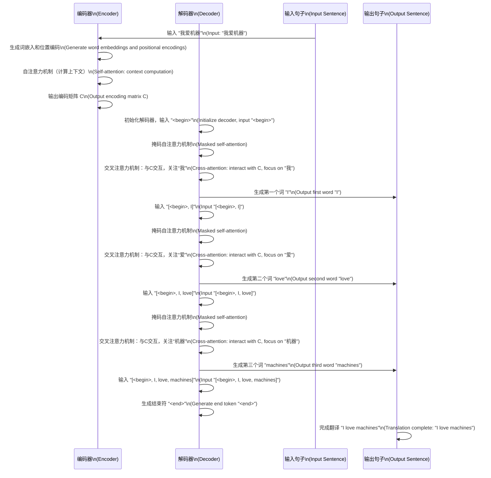
图9：中文翻译成英文的Transformer工作流程示意图

-----

### 本章的回顾

通过对Transformer架构的细致解剖，我们可以提炼出两个核心的设计哲学。

首先是 **注意力机制中角色的分离与统一**。 QKV这个抽象框架并非随意设计，它代表了一种强大的角色分工，并在整个架构中以不同但一致的方式被复用。 在编码器自注意力中，Q、K、V均来自输入序列，目的是让每个输入词充分吸收来自整个输入序列的上下文。 在解码器自注意力中，Q、K、V均来自已生成的输出序列，目的是让当前生成的词参考之前已生成的词，并通过掩码防止“偷看未来”。 而在交叉注意力中，角色被清晰地分开：Q来自解码器，代表“我需要什么信息”，K和V来自编码器，代表“我能提供这些信息”。 通过简单地改变Q、K、V的来源，同一种机制就实现了三个截然不同的目标：构建输入上下文、构建输出上下文、对齐输入与输出。 这体现了卓越的架构设计美学。

其次是 **并行化作为一等公民的设计理念**。 Transformer的成功并不仅仅是理论上的胜利，更是工程和硬件感知设计的胜利。 RNN的顺序性 $h\_t = f(h\_{t-1}, ...)$ 是其固有的计算瓶颈。 而Transformer的核心计算 $softmax(QK^T/\\dots)V$ 完全由矩阵乘法构成。 现代GPU和TPU正是为大规模并行执行矩阵运算而生的。 通过彻底移除循环结构，Transformer使得序列中任意两个词之间的计算都可以通过矩阵运算同时完成。 这种从设计之初就为并行计算优化的思想，使其能够充分利用现代硬件的算力，从而开启了训练像BERT和GPT这样拥有数十亿甚至数万亿参数的超大规模模型的大门。

**课后思考题**：

1. 讲义中提到，QKV框架通过简单地改变其来源，就实现了三个截然不同的目标 。请分别说明在编码器自注意力、解码器自注意力和交叉注意力这三种场景下，Q、K、V的来源分别是什么？它们各自要完成什么任务？
2. 自注意力机制本身无法感知词语在序列中的顺序 。Transformer是如何解决这个问题的？为什么说论文中使用的正弦和余弦函数位置编码，是一种能够让模型轻易学习到相对位置关系的巧妙设计 ？
3. Transformer的成功被誉为是“工程和硬件感知设计的胜利” 。它究竟移除了什么结构，使其核心计算完全由矩阵乘法构成，从而能够充分利用现代硬件的算力，开启了超大规模模型训练的大门 ？

# 第四部分：现代学习范式：预训练与微调

本章将阐述已成为大型语言模型（LLM）标准方法的两阶段学习范式。 正是这种“先通用后专用”的范式，赋予了LLM惊人的能力和广泛的适用性。

图10: 预训练与微调范式流程图

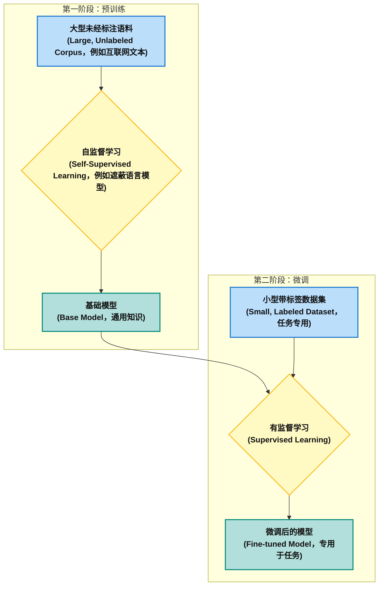

## 4.1 第一阶段：在数据的海洋中预训练

  * **目标**：预训练（Pre-training）的目标是让模型学习到一种关于语言本身的、基础且通用的理解。 这包括语法规则、词汇含义、基本的事实知识，甚至是一些初步的推理能力。 为了实现这一宏大目标，模型会在一个极其庞大、多样化且通常是 **未标注** 的文本语料库上进行训练，这个语料库可能包含了整个互联网的文本数据。
  * **产出**：预训练阶段的最终产物是一个“基座模型”（Base Model）。 这个模型的权重（parameters）中编码了从海量数据中学到的通用语言知识，为后续针对特定任务的优化提供了一个极其强大的起点。

## 4.2 自监督预训练目标

由于预训练使用的数据是无标注的，模型需要一种“自监督”（self-supervised）的方式来学习，即从输入数据本身创造出监督信号（标签）。

  * **掩码语言模型 (Masked Language Modeling, MLM)**：这是像BERT这类双向模型的核心预训练任务。 在输入句子中，随机地将15%的词替换成一个特殊的 `[MASK]` 标记，然后模型的任务就是预测这些被遮盖掉的原始词语是什么。 例如，对于句子“The quick brown fox jumps over the lazy dog”，模型可能需要预测出第一个`[MASK]`是“quick”，第二个是“dog”。 为了成功预测，模型必须深刻理解双向的上下文信息，这迫使它学习到丰富的词汇和句法知识。
  * **下一句预测 (Next Sentence Prediction, NSP)**：在这个任务中，模型会接收到两个句子A和B，并需要判断句子B是否是句子A在原始文本中紧邻的下一句。 这个任务旨在让模型学习句子间的逻辑关系和连贯性，这对于问答、对话等需要理解篇章结构的任务至关重要。

## 4.3 第二阶段：为特定任务微调

  * **目标**：微调（Fine-tuning）的目标是将已经具备通用语言能力的预训练模型，适配到一个具体的、狭窄的下游任务上，例如情感分析、医疗文本摘要、法律合同分类等。
  * **过程**：微调本质上是一种 **迁移学习** （Transfer Learning）。 整个过程如下：
    1.  **加载预训练模型**：将基座模型的架构和权重作为新任务模型的初始状态。
    2.  **修改模型头部**：根据具体任务替换或添加模型的最后一层。 例如，对于一个三分类的情感分析任务（积极、消极、中性），需要将原模型的输出层换成一个只有3个神经元的全连接层。
    3.  **在特定数据上继续训练**：在一个规模远小于预训练语料库的、**有标注** 的任务专属数据集上，对模型进行进一步的训练。
    4.  **使用低学习率**：微调时通常会使用一个非常低的学习率（learning rate）。 这是因为预训练好的权重已经包含了宝贵的通用知识，我们只想在其基础上进行微小的调整，以适应新任务，而不是彻底地改变它们，从而避免“灾难性遗忘”（catastrophic forgetting）。

## 4.4 迁移学习的力量

预训练-微调范式之所以如此成功，核心在于它充分利用了迁移学习的巨大优势。

  * **效率**：对于每一个新任务，我们不再需要从零开始训练一个巨大的模型。 微调过程复用了预训练阶段耗费的巨量计算资源和时间，极大地提升了开发效率。
  * **性能**：微调通常能带来显著的性能提升，尤其是在下游任务的标注数据非常有限的情况下。 模型能够将在预训练阶段学到的海量知识“迁移”到新任务中，从而获得更好的泛化能力。
  * **微调策略：冻结层**：一种常见的微调策略是“冻结”（freeze）预训练模型中大部分或全部底层网络的权重，只训练新添加的任务相关层。 因为模型的底层通常学习到的是更通用的特征（如词法、句法），而高层则学习到更抽象的语义特征。 冻结底层可以进一步防止过拟合，并加快训练速度。 在初步训练后，可以选择性地“解冻”（un-freeze）所有层，用一个更低的学习率进行全局微调，以期获得最佳性能。

**表4：预训练与微调的对比概览**
| 阶段 | 预训练 (Pre-training) | 微调 (Fine-tuning) |
| --- | --- | --- |
| **目标** | 学习通用的语言表示和世界知识 | 适配模型以解决特定的下游任务 |
| **数据** | 海量的、无标注的、多样化的文本（如网页、书籍） | 小规模的、有标注的、任务专属的数据集 |
| **计算成本** | 极其高昂（需要数千个GPU/TPU训练数周或数月） | 相对低廉（可在单个或少量GPU上数小时内完成） |
| **核心技术** | "自监督学习（如MLM, NSP）" | 监督学习、迁移学习 |

### 本章的回顾

预训练-微调范式不仅是一种技术上的突破，更引发了人工智能开发和应用领域的 **经济模式转变**。 从零开始训练一个大模型成本极高，只有少数大型科技公司和研究机构能够承担。 预训练过程将这一巨大的成本“一次性”地投入，创造出一个强大的“数字基建”——即基座模型。 而这个模型的权重，作为一种可分发的数字资产，使得后续的创新成本大大降低。 任何拥有少量标注数据的开发者都可以通过成本相对低廉的微调过程，在特定问题上达到世界一流的水平。 这催生了像Hugging Face这样的模型共享社区的繁荣，极大地 **民主化了对先进AI技术的访问**。

更深层次地看，这个范式将神经网络权重中编码的“知识”视为一种 **可迁移、可复用的资产**。 在过去，为一个任务A训练的模型对任务B毫无用处。 而现在，预训练模型中包含了从海量文本中压缩提炼出的语法、语义乃至世界知识的通用表示。 微调的过程，就是将这份通用的知识资产进行“专业化”改造，以服务于特定的应用需求。 这标志着AI发展的方向，从仅仅解决孤立的任务，转向构建可被广泛利用的、更通用的基础知识库。

**课后思考题**：

1. “预训练-微调”范式被比作是构建了一个强大的“数字基建” 。在这个比喻中，“基座模型”扮演了什么角色？这种范式如何降低AI技术的应用门槛，并极大地“民主化了对先进AI技术的访问” ？
2. 预训练阶段的核心技术是自监督学习 。请以“掩码语言模型（MLM）”为例 ，说明模型是如何在没有人工标注的情况下，从数据自身创造出监督信号来学习语言的深层知识的。
3. 微调时，通常会使用一个非常低的学习率，以避免“灾难性遗忘” 。什么是“灾难性遗忘”？为什么说使用低学习率是对预训练阶段学到的“宝贵的通用知识”的一种保护性调整？

-----

# 第五部分：实验验证：实践中的词向量

本章旨在将前述章节中的抽象理论与具体实践相结合。 通过编写少量Python代码，直接操作和验证词向量的数学关系，我们将获得一种对这些模型如何表示“意义”的直观且深刻的体悟。

## 5.1 环境设置与模型加载

我们将使用Python语言和强大的自然语言处理库gensim来完成本次实验。 gensim提供了一个非常便捷的API，可以用来下载和使用多种预训练好的词向量模型。

首先，我们需要安装gensim库。 然后，我们将加载的预训练模型：glove-wiki-gigaword-50，一个相对较小的 GloVe 词向量模型，适合快速加载。

Gensim 提供了一些更小但依然有用的预训练词向量模型，举例如下：

- glove-wiki-gigaword-50：一个相对较小的 GloVe 词向量模型，适合快速加载。
- fasttext-wiki-news-300：是 Facebook FastText 的预训练模型，适用于多语言场景。
- glove-twitter-25：一个针对Twitter数据的较小 GloVe 模型。

```python
# 导入必要的库
import gensim.downloader as api
import numpy as np

# 使用一个较小的模型，如 glove-wiki-gigaword-50
# 这个模型的维度是50，比word2vec-google-news-300小很多
print("正在加载模型...")
model = api.load("glove-wiki-gigaword-50")
print("模型加载完成。")

# 模型的词汇表示一个KeyedVectors对象
# 我们可以查看某个词的向量
print(model['king'])
print(model['king'].shape)

# 示例1：寻找与“father”最相似的词
try:
    similar_to_father = model.most_similar('father', topn=5)
    print("与 'father' 最相似的词：")
    for word, score in similar_to_father:
        print(f"  {word}: {score:.4f}")
except KeyError:
    print("'father' 不在词汇表中。")

print("-" * 20)

# 示例2：寻找与“car”最相似的词
try:
    similar_to_car = model.most_similar('car', topn=5)
    print("与 'car' 最相似的词：")
    for word, score in similar_to_car:
        print(f"  {word}: {score:.4f}")
except KeyError:
    print("'car' 不在词汇表中。")

```

## 5.2 衡量语义相似度

在词向量空间中，词语的语义相似度可以通过其向量的几何接近度来衡量。 最常用的度量标准是 **余弦相似度（Cosine Similarity）**。 余弦相似度计算两个向量夹角的余弦值，其取值范围为[-1, 1]。 值越接近1，表示两个向量方向越一致，即代表的词语语义越相似。

gensim模型提供了`most_similar()`方法，可以方便地找出与给定词最相似的词。

```python
# 示例1：寻找与“father”最相似的词
try:
    similar_to_father = model.most_similar('father', topn=5)
    print("与 'father' 最相似的词：")
    for word, score in similar_to_father:
        print(f"  {word}: {score:.4f}")
except KeyError:
    print("'father' 不在词汇表中。")

print("-" * 20)

# 示例2：寻找与“car”最相似的词
try:
    similar_to_car = model.most_similar('car', topn=5)
    print("与 'car' 最相似的词：")
    for word, score in similar_to_car:
        print(f"  {word}: {score:.4f}")
except KeyError:
    print("'car' 不在词汇表中。")
```

### 预期输出与分析：

对于“father”，模型可能会返回“mother”, “dad”, “grandfather”等词，这些词在语义上都与家庭和亲属关系紧密相关。 对于“car”，模型可能会返回“vehicle”, “automobile”, “truck”等词。 这些结果直观地展示了模型成功地将语义相近的词聚集在了向量空间中的邻近区域。

## 5.3 揭示语言规律：词汇类比任务

词向量最令人惊叹的特性之一是它们能够捕捉到词语之间的 **语言学规律（linguistic regularities）**，并且这些规律可以表现为简单的向量算术。

最经典的例子莫过于“国王 - 男人 + 女人 = 女王”这个类比。 其背后的向量运算逻辑是：从“国王”的向量中减去“男人”的向量，我们得到一个大致代表“皇室”概念的向量；然后再加上“女人”的向量，理论上就应该得到与“女王”的向量非常接近的结果。

$$v_{king} - v_{man} + v_{woman} \approx v_{queen}$$

我们可以使用`most_similar`方法的`positive`和`negative`参数来实现这个类比任务。 `positive`列表中的词向量会被相加，`negative`列表中的词向量会被减去。

```python
# 经典的性别类比：king - man + woman =?
try:
    result = model.most_similar(positive=['woman', 'king'], negative=['man'], topn=1)
    print(f"king - man + woman ≈ {result[0][0]} (相似度: {result[0][1]:.4f})")
except KeyError as e:
    print(f"词汇缺失: {e}")

# 探索其他类型的类比
# 1. 国家-首都 类比：France - Paris + Rome = ?
try:
    result = model.most_similar(positive=['Rome', 'France'], negative=['Paris'], topn=1)
    print(f"France - Paris + Rome ≈ {result[0][0]} (相似度: {result[0][1]:.4f})")
except KeyError as e:
    print(f"词汇缺失: {e}")

# 2. 比较级形容词 类比：large - larger + small = ?
try:
    result = model.most_similar(positive=['small', 'larger'], negative=['large'], topn=1)
    print(f"large - larger + small ≈ {result[0][0]} (相似度: {result[0][1]:.4f})")
except KeyError as e:
    print(f"词汇缺失: {e}")

# 3. 国家-国民/语言 类比：Germany - German + Spain = ?
try:
    result = model.most_similar(positive=['Spain', 'German'], negative=['Germany'], topn=1)
    print(f"Germany - German + Spain ≈ {result[0][0]} (相似度: {result[0][1]:.4f})")
except KeyError as e:
    print(f"词汇缺失: {e}")
```

### 预期输出与分析：

上述代码的运行结果很大概率会分别输出“queen”, “Italy”, “smaller”, “Spanish”。 这些成功的类比推理并非模型被明确教导的规则，而是其在学习预测词语上下文的过程中，自发学习到的向量空间几何结构的涌现属性（emergent property）。 这表明，诸如“性别差异”、“首都关系”、“形容词比较级”等抽象的语言学概念，在模型内部被表示为了向量空间中特定的、可操作的方向或位移。

## 5.4 结果分析与更广泛的启示

这个简单的实验有力地证明了表示学习的强大之处。 它将离散的、符号化的语言转换为了一个连续的、具有丰富几何结构的语义空间。 在这个空间里，复杂的语义关系变成了简单的向量运算。

然而，这也引出了一个至关重要的警示： **模型是其训练数据的镜子**。 如果训练数据中存在偏见，这些偏见也会被忠实地编码到词向量中。 例如，早期的研究发现在一些词向量模型中存在着这样的类比：“男人 - 电脑程序员 + 女人 ≈ 家庭主妇”。 这揭示了模型从文本中学到的性别职业刻板印象。

因此，在赞叹这些技术力量的同时，我们也必须清醒地认识到其局限性和潜在的社会风险。 理解、度量和缓解AI模型中的偏见，是当前AI领域一个极其重要和活跃的研究方向，也是负责任地开发和应用人工智能技术的必要前提。

# 总结

第二天的课程系统性地解构了从基础表示学习到现代Transformer架构的完整技术演进脉络。 我们从一个根本性的问题出发：机器如何理解世界？ 答案始于 **表示学习**，即将符号化的数据（词语、图像）转换为富含语义的向量。 Word2Vec和GloVe等早期模型通过巧妙的自监督任务，开创性地构建了词语的几何语义空间，使得“国王 - 男人 + 女人 ≈ 女王”这类语义运算成为可能。

然而，对序列数据的建模需求引出了一系列架构上的挑战。 **RNN** 因其循环结构天然适合处理序列，但受困于 **梯度消失** 问题，难以捕捉长期依赖。 **LSTM** 通过精巧的门控机制解决了这一难题，却又因其固有的 **顺序处理** 特性而成为计算效率的瓶颈。

**Transformer** 的诞生是一场彻底的革命。 它完全摒弃了循环结构，仅凭 **注意力机制**，尤其是 **自注意力**，实现了对序列中任意两个位置之间依赖关系的直接建模。 其核心的\*\*QKV（查询、键、值）\*\*框架，通过在不同场景（编码器自注意、解码器自注意、交叉注意）下灵活改变来源，优雅地实现了构建输入上下文、构建输出上下文以及对齐二者的多重功能。 多头注意力、位置编码、残差连接和层归一化等组件，共同构成了一个既强大又可高效并行计算的深度架构。

最终，**预训练-微调** 范式为释放Transformer的巨大潜力提供了方法论。 通过在海量数据上进行自监督预训练，模型获得了通用的世界知识和语言能力；再通过在特定任务数据上进行微调，这些通用能力被高效地适配到各种下游应用中。 这一范式不仅极大地提升了AI模型的性能，也重塑了AI领域的开发和应用生态。

从向量到注意力，从循环到并行，这条技术演进之路清晰地表明，现代大型语言模型的能力并非凭空而来，而是建立在一系列深刻的洞察和巧妙的工程设计之上。 理解这一历程，不仅是掌握当前AI技术的关键，更是展望未来发展的基石。

### 大模型技术核心术语表 (Glossary)

**A**

* **Agent (智能体)**
    一个具备自主性、能够感知环境、进行规划并执行动作以达成目标的AI系统。它能调用工具与外部世界交互，从被动的应答者进化为主动的“行动者”。

* **API (Application Programming Interface / 应用程序编程接口)**
    一组预定义的规则和工具，允许不同的软件应用程序相互通信和交互。通过API调用是目前使用商业大模型服务（如GPT-4）最主要的方式。

* **Artificial Intelligence (AI / 人工智能)**
    计算机科学的一个分支，旨在创造能够模仿、扩展和超越人类智能的机器或系统。其发展经历了符号主义、连接主义等多个阶段。

**C**

* **Chunking (分块)**
    在检索增强生成（RAG）中，将长文档分割成更小、更易于管理和检索的语义片段的过程。

* **CLIP (Contrastive Language-Image Pre-training / 对比语言-图像预训练)**
    一种里程碑式的多模态模型，通过对比学习，在同一个高维向量空间中对齐了图像及其文本描述。这使得模型具备强大的图文理解和零样本分类能力。

* **ControlNet**
    一种能对扩散模型（Diffusion Model）进行精准空间控制的神经网络结构。它通过接收额外的条件输入（如边缘图、姿态骨架等），来指导图像的生成过程，实现对构图和内容的精确控制。

**D**

* **Deep Learning (深度学习)**
    机器学习的一个子领域，利用包含多个处理层的深度神经网络（DNN）从海量数据中学习复杂的模式和特征。它是当前大语言模型的技术基石。

* **Diffusion Model (扩散模型)**
    当前最先进的图像生成模型之一。其核心原理包含两个过程：一个“前向过程”不断向图像添加噪声直至其变为纯噪声，一个“反向过程”学习从纯噪声中逐步去噪，最终恢复出清晰的图像。

**E**

* **Embedding (嵌入)**
    将离散的输入（如单词、句子、图像块）转换为连续、稠密的低维向量的过程。这是让计算机能够“理解”和处理现实世界信息的关键一步。

**F**

* **Fine-Tuning (FT / 微调)**
    在已经预训练好的模型基础上，使用特定领域或任务的数据集继续进行训练，以使模型的能力适应新需求的過程。这是实现模型“专业化”的关键技术。

* **Function Calling (函数调用)**
    见 **Tool Use**。

**G**

* **GPT (Generative Pre-trained Transformer)**
    由OpenAI开发的著名大语言模型系列。它代表了一种技术范式：首先在海量数据上进行“生成式预训练”，然后再针对具体任务进行微调或通过提示进行使用。

**I**

* **In-Context Learning (ICL / 上下文学习)**
    大语言模型的一项核心能力，指模型能够在不更新自身权重的情况下，仅通过在提示（Prompt）中提供少量任务示例（shots），就能学会并执行该任务。

* **Instruction Tuning (指令微调)**
    一种特殊的微调方法，使用大量由“指令”和“期望输出”构成的数据对来训练模型。其目的是让模型更好地理解并遵循人类的指令。

**L**

* **Large Language Model (LLM / 大语言模型)**
    指参数规模通常达到数十亿甚至万亿级别的超大型语言模型。它们通过在海量文本数据上进行预训练，获得了强大的自然语言理解和生成能力。

* **LoRA (Low-Rank Adaptation / 低秩适配)**
    一种非常流行的参数高效微调（PEFT）技术。它通过冻结预训练模型的原始权重，并在其旁边增加和训练微小的“低秩”矩阵（适配器），来高效地调整模型行为，极大地降低了微调的计算和存储成本。

**M**

* **MVP (Minimum Viable Product / 最小可行产品)**
    在产品开发中，用最少的资源和时间开发出的包含核心功能、能够满足早期用户需求并进行市场验证的简化版产品。这是敏捷开发中的一个重要概念。

**P**

* **Parameter (参数)**
    在神经网络中，指模型在训练过程中学习到的权重（weights）和偏置（biases）。参数的数量（规模）是衡量大模型容量和复杂度的关键指标。

* **PEFT (Parameter-Efficient Fine-Tuning / 参数高效微调)**
    一系列旨在降低模型微调成本的技术总称。与全参数微调不同，PEFT方法只训练模型中一小部分（新增或选择的）参数。LoRA是其中的代表。

* **Positional Encoding (位置编码)**
    在Transformer架构中，由于自注意力机制本身无法感知序列的顺序，需要额外引入的一种向量，用于向模型提供输入序列中每个元素的位置信息。

* **Pre-training (预训练)**
    在大规模、无标注或自监督的数据集上对模型进行初始训练的过程。这个过程让模型学习到通用的知识和模式，是后续微调或直接应用的基础。

* **Prompt Engineering (提示工程)**
    设计、构建和优化输入文本（即“提示”），以最大限度地引导大语言模型生成准确、相关和高质量输出的一门艺术和科学。

**Q**

* **QLoRA**
    LoRA的一种进一步优化版本，通过在模型加载时进行更低精度的量化（4-bit）和引入其他优化技术，进一步显著降低了微调所需的显存。

**R**

* **RAG (Retrieval-Augmented Generation / 检索增强生成)**
    一种将信息检索系统与大语言模型生成器相结合的架构。在生成答案前，系统会先从一个外部知识库（如向量数据库）中检索相关信息，并将其作为上下文提供给模型，以提高答案的准确性和时效性，并减少“幻觉”。

* **ReAct (Reason and Act / 思考与行动)**
    一种强大的智能体（Agent）框架。它引导模型交替生成“思考”（Reasoning，对问题进行分解和规划）和“行动”（Acting，选择并调用工具）的轨迹，从而解决复杂问题。

**S**

* **Self-Attention (自注意力机制)**
    Transformer架构的核心组件。它允许模型在处理序列中的一个元素时，能够权衡并关注序列中所有其他元素对该元素的重要性，从而有效地捕捉长距离依赖关系。

**T**

* **Tool Use (工具使用)**
    也常被称为“函数调用”（Function Calling），指大模型作为智能体（Agent）的核心，能够调用外部的API或函数来获取实时信息（如天气、股价）、执行计算或操作其他软件的能力，极大地扩展了模型的边界。

* **Transformer**
    一种于2017年被提出的深度学习模型架构，现已成为几乎所有主流大语言模型的基础。它完全基于自注意力机制，特别擅长处理序列数据。

**V**

* **Vector Database (向量数据库)**
    专门为存储、索引和高效查询高维向量数据而设计的数据库。在RAG、语义搜索等AI应用中，它被用来快速找到与给定查询向量最相似的向量。

* **ViT (Vision Transformer / 视觉Transformer)**
    将Transformer架构成功应用于计算机视觉领域的模型。它通过将图像分割成一系列小块（patches）并将其作为序列输入，实现了与传统卷积网络（CNN）相媲美甚至超越的性能。

 **Z**

* **Zero-Shot Learning (零样本学习)**
    指模型在没有见过任何特定任务的训练样本的情况下，直接执行该任务的能力。例如，一个强大的视觉语言模型可以直接对它从未被训练过来分类的物体进行分类。
