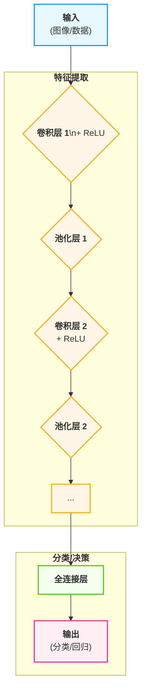
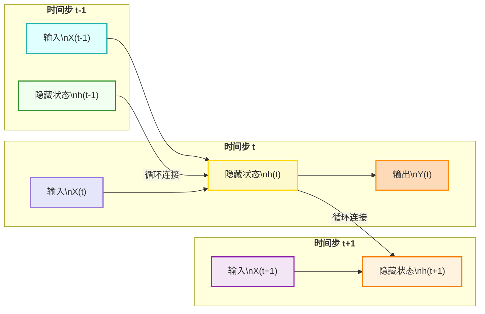
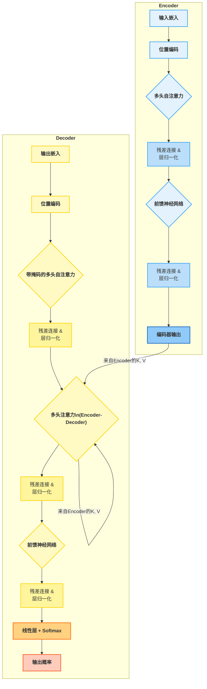
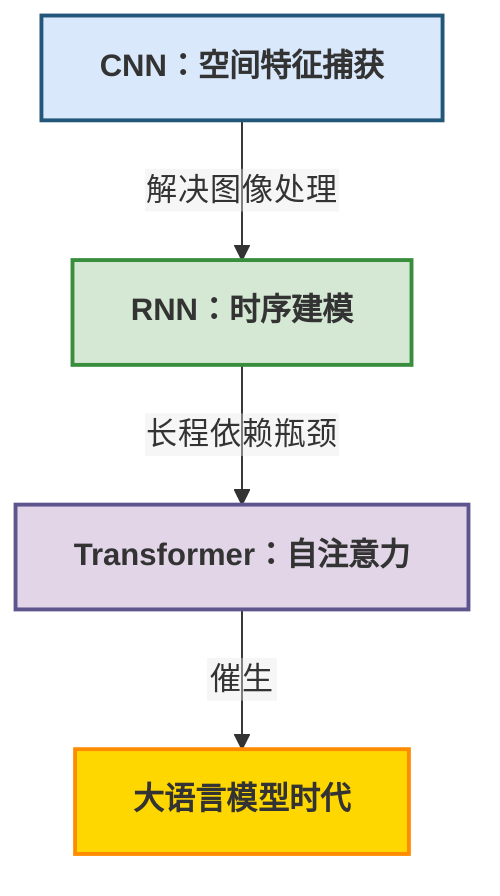

## 从CNN、RNN到Transformer：人工智能神经网络的技术演变

人工智能（AI）领域中，神经网络模型的发展经历了多个重要的里程碑。其中，从卷积神经网络（CNN）和循环神经网络（RNN）到Transformer模型的演进，深刻地展示了AI在处理和理解数据，尤其是序列数据方面能力的巨大飞跃。这条演进路径不仅是技术上的革新，更体现了研究者们对于信息处理、特征提取和上下文理解等核心问题的不断深入探索。

### 1\. 卷积神经网络 (Convolutional Neural Network - CNN)

CNN的出现最初是为了解决计算机视觉问题，它的核心思想在于模仿生物的视觉皮层机制，通过局部感受野、权值共享和池化等操作高效地提取空间特征。

#### **基本原理与框架**

CNN主要由输入层、卷积层（Convolutional Layer）、池化层（Pooling Layer）、全连接层（Fully Connected Layer）和输出层组成。

  * **卷积层**: 网络的核心，使用一组可学习的滤波器（或称为“核”）在输入数据上进行滑动（卷积操作），以提取局部特征。例如，在图像中，初级卷积层可能提取边缘、角点等低级特征，更深层次的卷积层则能组合这些特征，形成更复杂的形状或物体部件。
  * **权值共享**: 在同一卷积层中，滤波器（核）的参数在整个输入数据上是共享的，这大大减少了模型的参数量，使其更易于训练，并增强了模型的平移不变性。
  * **池化层**: 通常位于卷积层之后，用于降低特征图的空间维度（下采样），减少计算量的同时，也能增强模型的鲁棒性，使其对微小的位置变化不那么敏感。最常见的池化操作是最大池化（Max Pooling）。
  * **全连接层**: 在经过多轮卷积和池化后，将最终的特征图展平，连接到一个或多个全连接层，进行最终的分类或回归任务。

**框架图:**

#### **特点、优点与缺点**

  * **特点**:

      * **局部连接 (Local Connectivity)**: 每个神经元只与前一层的一个局部区域相连，有效捕捉局部信息。
      * **权值共享 (Weight Sharing)**: 减少了模型参数，降低了过拟合风险，提升了训练效率。
      * **空间层次结构**: 逐层提取从低级到高级的复杂特征。

  * **优点**:

      * **高效的空间特征提取能力**: 在图像、视频等具有空间结构的数据上表现极其出色。
      * **平移不变性**: 对物体在图像中的位置不敏感。
      * **参数量相对较少**: 相较于全连接网络，在处理高维数据（如图像）时参数更少。

  * **缺点**:

      * **对时间序列数据处理能力有限**: 核心设计是针对空间结构，难以直接捕捉序列数据中的长期依赖关系。
      * **固定大小的感受野**: 卷积核的大小是固定的，限制了其捕捉多尺度信息的能力。
      * **位置信息丢失**: 池化操作在增强鲁棒性的同时，也丢失了精确的位置信息。

### 2\. 循环神经网络 (Recurrent Neural Network - RNN)

当面临自然语言、语音、时间序列数据等具有顺序性的问题时，RNN应运而生。它的核心设计在于“记忆”或“循环”机制，使得信息可以在序列的连续步骤中传递下去。

#### **基本原理与框架**

RNN引入了一个隐藏状态（Hidden State），在每个时间步，模型不仅接收当前的输入，还会接收上一个时间步的隐藏状态，并将两者结合起来生成当前时间步的输出和新的隐藏状态。这个新的隐藏状态会继续传递到下一个时间步。

**框架图:**

  * **循环结构**: 网络中的隐藏状态 $h\_t$ 由当前输入 $x\_t$ 和前一时刻的隐藏状态 $h\_{t-1}$ 共同决定：$h\_t = f(W \\cdot x\_t + U \\cdot h\_{t-1} + b)$。
  * **变体**: 为了解决标准RNN的梯度消失/爆炸问题，出现了长短期记忆网络（LSTM）和门控循环单元（GRU）等重要变体。它们通过引入精巧的“门”机制（如遗忘门、输入门、输出门），有选择性地让信息通过，从而更好地捕捉长期依赖关系。

#### **特点、优点与缺点**

  * **特点**:

      * **记忆能力**: 通过隐藏状态在时间步之间传递信息，实现了对序列历史信息的记忆。
      * **处理可变长度序列**: 理论上可以处理任意长度的序列数据。

  * **优点**:

      * **强大的序列建模能力**: 在自然语言处理（NLP）、语音识别等领域取得了巨大成功。
      * **模型结构灵活**: 适用于各种涉及序列到序列（Seq2Seq）的任务，如机器翻译。

  * **缺点**:

      * **长期依赖问题 (Long-Term Dependency Problem)**: 标准RNN很难学习到序列中相距较远的元素之间的依赖关系，容易出现梯度消失或梯度爆炸。
      * **并行计算困难**: 序列化的处理方式导致其计算必须按时间步顺序进行，难以在GPU等硬件上进行大规模并行计算，训练速度较慢。
      * **信息瓶颈**: 所有历史信息都必须被压缩到一个固定大小的隐藏状态向量中，可能导致信息丢失。

### 3\. Transformer

Transformer模型于2017年在论文《Attention Is All You Need》中被提出，最初用于机器翻译任务。它彻底摒弃了RNN的循环结构和CNN的卷积结构，完全依赖于一种名为“自注意力机制”（Self-Attention）的机制来捕捉序列内的依赖关系。

#### **基本原理与框架**

Transformer的核心是**自注意力机制**和**位置编码**。

  * **自注意力机制 (Self-Attention)**:

      * 对于输入序列中的每一个元素，自注意力机制会计算该元素与序列中所有其他元素的“注意力分数”。这个分数决定了在编码当前元素时，应该对其他元素赋予多大的权重。
      * 它通过三个从输入嵌入向量中学习到的向量来工作：查询（Query）、键（Key）和值（Value）。一个元素的Query向量会和所有元素的Key向量进行点积计算，以获得注意力分数，然后用这些分数对所有元素的Value向量进行加权求和，得到该元素的最终表示。
      * 这种机制使得模型可以直接建立序列中任意两个位置之间的依赖关系，无论它们相距多远。

  * **多头注意力 (Multi-Head Attention)**: 为了让模型能够关注来自不同子空间位置的信息，Transformer将自注意力过程并行执行多次（即“多头”），然后将结果拼接并线性变换，从而增强了模型的表达能力。

  * **位置编码 (Positional Encoding)**: 由于自注意力机制本身不包含任何关于序列顺序的信息（它是一种集合操作），Transformer必须在输入嵌入中加入“位置编码”，以向模型提供单词的位置信息。

**框架图 (Encoder-Decoder 结构):**

#### **特点、优点与缺点**

  * **特点**:

      * **完全基于注意力机制**: 不使用循环或卷积。
      * **并行计算能力强**: 由于没有循环依赖，序列中的所有元素可以同时进行计算。
      * **全局依赖捕捉**: 自注意力机制可以直接连接序列中的任意两个点，路径长度为O(1)。

  * **优点**:

      * **完美解决长期依赖问题**: 直接的全局连接使其能轻松捕捉长距离依赖。
      * **训练速度快**: 强大的并行计算能力极大地缩短了训练时间，使其能够处理前所未有的大规模数据集和模型（如GPT、BERT）。
      * **模型性能卓越**: 在NLP领域的各项基准测试中取得了突破性成果，并逐渐扩展到视觉等其他领域。

  * **缺点**:

      * **计算复杂度高**: 自注意力机制的计算量与序列长度的平方成正比 ($O(n^2)$)，对于非常长的序列（如高分辨率图像、长篇文档），计算开销巨大。
      * **缺乏归纳偏置**: 相较于CNN的空间局部性和RNN的序列顺序性，Transformer的归纳偏置较弱，通常需要更大规模的数据集进行训练才能达到好的效果。
      * **对位置信息的处理不够直观**: 位置编码是一种补充方案，其有效性有时不如RNN和CNN的结构性设计直观。

-----

### 4\. 演变过程与总结

**技术演变的核心路径可以概括为：从处理局部空间信息（CNN），到处理顺序时间信息（RNN），再到并行化地处理全局任意位置间的信息（Transformer）。**

1.  **CNN**: 确立了**局部特征提取**和**层次化**的思想，非常适合处理具有网格结构的数据。
2.  **RNN**: 引入了\*\*“时间”和“记忆”**的概念，通过循环结构来处理序列数据，但受限于其**串行处理**和**长期依赖\*\*的瓶颈。
3.  **Transformer**: 是一次**范式转移**。它证明了**注意力机制**本身就足以构建一个强大的序列模型。通过放弃循环，换取了**强大的并行计算能力**和**完美的长期依赖捕捉能力**，从而开启了**大规模预训练模型**的时代。

**演变框架图:**

### 5\. 比较表格

| 特性 | 卷积神经网络 (CNN) | 循环神经网络 (RNN) | Transformer |
| :--- | :--- | :--- | :--- |
| **核心思想** | 局部感受野、权值共享、空间特征提取 | 循环结构、时间步记忆、序列信息传递 | 自注意力机制、全局依赖建模 |
| **数据处理方式** | 并行（在空间维度上） | 串行（按时间步） | 高度并行 |
| **依赖关系捕捉** | 捕捉局部空间依赖 | 捕捉顺序依赖，但长期依赖困难 | 直接捕捉全局任意位置依赖 |
| **路径长度** | 较大（需逐层传递信息） | 较大（$O(n)$，需逐时间步传递） | 极短（$O(1)$，直接连接） |
| **主要优点** | 空间特征提取能力强，参数高效 | 擅长建模序列和时间动态 | 并行计算能力强，完美解决长期依赖 |
| **主要缺点** | 难处理序列长依赖，位置信息易丢失 | 计算串行化效率低，梯度消失/爆炸 | 计算复杂度与序列长度平方相关，需要大数据 |
| **典型应用** | 图像识别、目标检测、计算机视觉 | 机器翻译、语音识别、文本生成 | 自然语言理解 (BERT)、大规模语言模型 (GPT)、机器翻译 |
| **代表模型** | LeNet, AlexNet, VGG, ResNet | LSTM, GRU, Seq2Seq | BERT, GPT, T5, ViT (Vision Transformer) |
