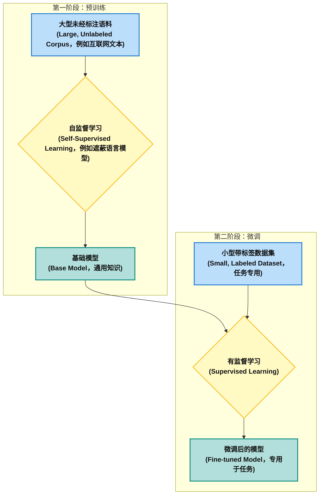
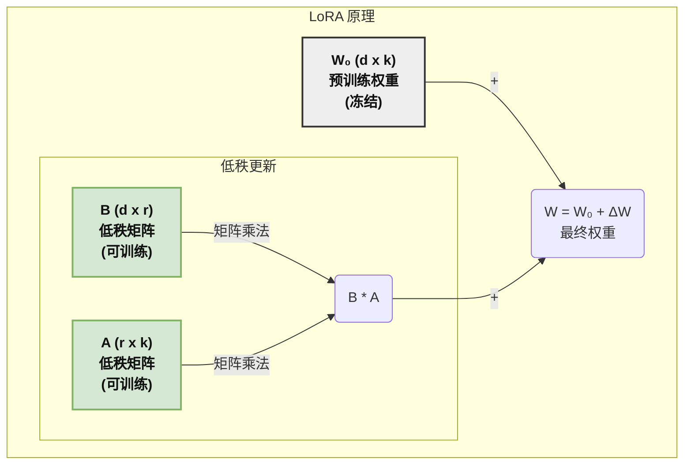
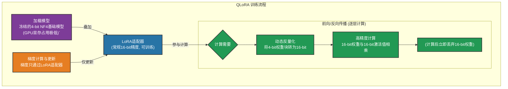
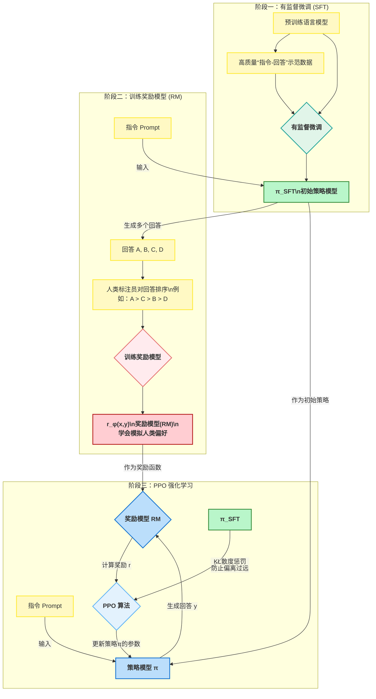
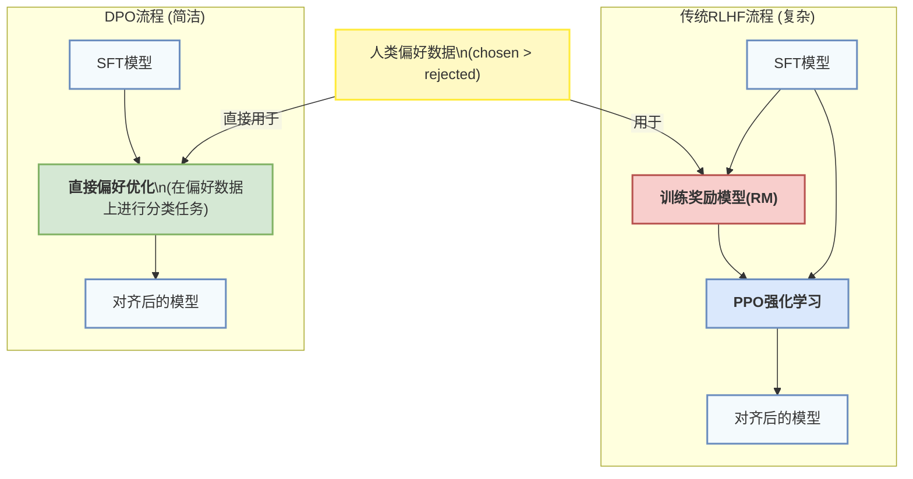
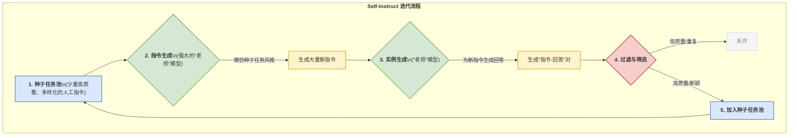

# 第七天 参数与能力调整 —— 模型微调（FT）提升特定任务的专业能力


在前面的章节中，我们已经了解到，预训练基础模型（Foundation Models）如同博览群书、知识渊博的“通才”。它们通过在海量数据上的学习，掌握了语言的普遍规律和世界的广泛知识。然而，在许多现实世界的应用场景中，我们需要的并不仅仅是一个什么都懂一点的通才，而是一个在特定领域（如法律咨询、医疗问答、金融分析或软件开发）具有深度专业知识和特定行为模式的“专才”。本章的核心议题—— **模型微调（Fine-Tuning, FT）** ，正是实现这一“从通才到专才”蜕变的关键技术。微调的本质，是将预训练模型所蕴含的巨大通用能力，通过在特定任务的数据集上进行进一步的训练，进行迁移和适配。那么，我们如何以高效、可控且经济的方式，驾驭拥有数百亿甚至数千亿参数的庞然大物，让它们精准地服务于我们的特定目标？本章将系统性地回答这一问题。

**学习目标**

1. **模型微调基础**：学生将能够解释不同微调方法的优缺点，理解LoRA/QLoRA的数学原理，并能够根据任务需求选择合适的微调技术 。
2. **指令微调与对齐**：学生将理解指令微调如何使模型更好地遵循人类指令，掌握RLHF（基于人类反馈的强化学习）的核心流程，并能够设计符合特定领域需求的指令数据集 。
3. **数据集构建与清洗**：学生将理解数据质量对模型微调效果的重要性，掌握数据清洗与预处理的完整流程，并能够根据特定领域需求设计数据集构建策略 。
4. **评估与调优**：学生将掌握大模型微调的评估指标体系，理解参数调优的核心策略，并能够设计有效的模型评估流程 。
5. **动手实验**：学生将掌握在ModelScope平台上使用LoRA技术微调模型的完整流程，并能够通过实验验证微调效果

## 第一部分 大语言模型（Large Language Model, LLM）的参数

## 1.1 什么是大模型的参数

简单来说，**模型的参数就是模型从海量数据中学习到的“知识”的载体**。它们是一系列巨大的数字矩阵（权重和偏置），定义了模型如何将输入的文字序列转换成输出的文字序列。模型的参数数量，例如“70亿”、“1750亿”等，是衡量其规模和潜在能力的关键指标。

我们可以把大模型想象成一个极其复杂的人工神经网络，而参数就是这个网络中神经元之间连接的“强度”。通过在海量数据上进行训练，模型会不断调整这些连接的强度，最终让整个网络能够理解语言、进行推理并生成文本。

在深入技术细节之前，我们可以用一个比喻来理解：

* **模型参数**：就像一本包罗万象的百科全书或辞典。
* **参数数量**：就是这本辞典的“页数”或“词条数量”。页数越多，理论上能存储的知识就越详尽、越丰富。一个70亿参数的模型就像一部大型百科全书，而一个1750亿参数的模型则像一个国家级的图书馆。
* **模型推理（Inference）**：当你向模型提问时，它并不是在辞典里“查找”一个现成的答案，而是利用整本辞典的知识（所有参数），通过复杂的计算，“推理”并“创造”出一个全新的、最合适的答案。

1. **参数的定义**

在大多数神经网络中，参数是网络中的可训练权重和偏置。神经网络的目的是通过调整这些参数来最小化误差函数（或损失函数），从而提高模型的预测精度。
	- **权重 （Weights）** ：权重是神经网络的核心参数，表示输入与神经元之间的连接强度。每个神经元都有一个与输入层其他神经元相连的权重值。
	- **偏置 （Biases）**： 偏置是为了给神经网络的每个神经元增加一个额外的自由度，使其能够更好地拟合数据。在神经网络中，每个神经元通常有一个对应的偏置项。

2.  **参数的作用**
- **神经网络的预测能力**： 通过调整权重和偏置，模型能够从输入数据中提取有意义的模式或特征，并输出预测结果。
- **优化目标**： 训练过程的核心目标就是通过调整参数，最小化模型的损失函数（例如均方误差、交叉熵损失等），使模型的预测与实际结果尽可能接近。

3. **参数数量为什么重要？**——“大力出奇迹”的背后

参数数量之所以成为衡量LLM能力的核心指标，背后有几个关键原因：

 * **模型容量 (Model Capacity)**：更多的参数意味着更大的“存储空间”和更强的“计算能力”。这使得模型能够：
    * **记忆更广泛的事实知识**：从历史事件到科学常识。
    * **学习更复杂的语言模式**：如语法、语境、比喻、反讽等。
    * **掌握更强大的推理能力**：进行逻辑推断、代码生成、数学计算等。

*  **缩放法则 (Scaling Laws)**：AI研究发现了一个重要的规律，即模型的性能（通常用损失函数的值来衡量）会随着**参数数量、数据量和计算量**的增加而可预测地提升。这为“越大越好”（Bigger is Better）的理念提供了理论支持。

*  **涌现能力 (Emergent Abilities)**：研究表明，当模型参数量突破某个阈值后，会突然表现出之前没有的能力，例如进行多步推理、理解幽默、进行思维链（Chain-of-Thought）推理等。这些能力不是线性增加的，而是在大规模模型上“涌现”出来的。

4. **代码示例：简单神经网络中的参数**

以下通过Python代码示例展示如何使用PyTorch构建一个简单的神经网络，并查看其中的参数。

```Python
import torch
import torch.nn as nn
import torch.optim as optim

# 定义一个简单的神经网络
class SimpleNN(nn.Module):
    def __init__(self):
        super(SimpleNN, self).__init__()
        # 定义两层全连接层
        self.fc1 = nn.Linear(4, 10)  # 输入4维，输出10维
        self.fc2 = nn.Linear(10, 2)  # 输入10维，输出2维

    def forward(self, x):
        x = torch.relu(self.fc1(x))  # 第一层，使用ReLU激活函数
        x = self.fc2(x)  # 第二层
        return x

# 创建网络实例
model = SimpleNN()

# 查看模型参数
print("Model parameters:")
for name, param in model.named_parameters():
    print(f"{name} - {param.shape}")

# 示例输入数据
input_data = torch.randn(1, 4)  # 输入一个样本，维度为4
output_data = model(input_data)

# 打印输出
print("Output of the model:", output_data)
```

**代码解释**

- 模型结构： 该模型包含两个全连接层（fc1 和 fc2）。第一层将4维输入映射到10维，第二层将10维输入映射到2维输出。
- 参数： 我们通过 named_parameters() 方法查看模型中每一层的权重和偏置参数。
	- fc1.weight 的形状是 [10, 4]，表示从4维输入到10维输出的权重矩阵。
	- fc1.bias 的形状是 [10]，表示第一层的偏置项。
	- fc2.weight 的形状是 [2, 10]，表示第二层的权重矩阵。
	- fc2.bias 的形状是 [2]，表示第二层的偏置项。
	- 前向传播： 使用 model(input_data) 将一个随机生成的输入数据传入网络，并计算输出。

输出示例

```Python
Model parameters:
fc1.weight - torch.Size([10, 4])
fc1.bias - torch.Size([10])
fc2.weight - torch.Size([2, 10])
fc2.bias - torch.Size([2])
Output of the model: tensor([[0.2111, -0.2760]], grad_fn=<AddmmBackward>)
```

---

##  1.2 参数的微观构成：它们在模型的什么位置？

现代大语言模型（如GPT系列、Llama系列）大多基于 **Transformer 架构**。模型的参数就分布在这个架构的各个组件中。我们以一个典型的Transformer解码器模块为例，来看看参数主要集中在哪些地方：

1. **词嵌入层 (Embedding Layer)**

* **功能**：这是模型的入口。它负责将我们输入的离散的文字（Tokens）转换成计算机可以处理的连续的数字向量（Vectors）。每个Token都对应一个唯一的向量。
* **参数构成**：一个巨大的查找表（Look-up Table），本质上是一个权重矩阵。
* **参数数量计算**：`词汇表大小 (Vocabulary Size) × 嵌入维度 (Embedding Dimension)`
    * 例如，一个模型的词汇表有50,000个词，每个词用一个4096维的向量来表示，那么仅这一层的参数量就是 `50,000 × 4096 ≈ 2亿`。

2. **自注意力机制 (Self-Attention Mechanism)**

这是Transformer架构的核心，它让模型能够理解句子中不同词语之间的关系。这里的参数至关重要。

* **功能**：为输入序列中的每个词计算“注意力分数”，判断哪些词对当前词的理解最重要。
* **参数构成**：主要是三个用于生成查询（Query）、键（Key）、值（Value）的权重矩阵 ($W_q, W_k, W_v$)，以及一个最终的输出投影矩阵 ($W_o$)。
* **参数数量计算**：对于单头注意力，参数量大约是 `3 × Embedding Dimension × Head Dimension + Output Dimension × Embedding Dimension`。在多头注意力机制（Multi-head Attention）中，这个数量还要乘以头的数量。这是参数最集中的区域之一。

3. **前馈神经网络 (Feed-Forward Network, FFN)**

在每个注意力层之后，都会有一个前馈网络，用于对信息进行更深层次的加工和非线性变换。

* **功能**：可以理解为一个“加工厂”，对注意力层输出的信息进行深化理解和提炼。
* **参数构成**：通常由两个线性层（Linear Layers）组成。第一个线性层将输入维度“放大”（例如从4096维放大到16384维），第二个线性层再将其“缩小”回原来的维度。这两个线性层的权重矩阵是参数的主要来源。
* **参数数量计算**：`(Embedding Dimension × FFN Intermediate Size) + (FFN Intermediate Size × Embedding Dimension)`
    * 例如：`(4096 × 16384) + (16384 × 4096) ≈ 1.34亿`。这只是一个Block中的FFN参数，而大模型通常有几十个这样的Block。

4. **其他参数**

* **层归一化 (Layer Normalization)**：每个注意力层和前馈网络前后都有归一化层，它有少量可学习的参数（gamma和beta），用于稳定训练过程。
* **位置编码 (Positional Encoding)**：虽然经典的位置编码是固定计算的，但一些现代模型也会使用可学习的位置编码，这也会引入一部分参数。
* **最终输出层 (Output Layer)**：在模型的最后，通常有一个线性层将最终的向量映射回词汇表大小，以预测下一个Token。这个层的权重矩阵通常与输入层的词嵌入矩阵共享参数，以节省空间并提高效率。

**总结一下**：一个大模型的总参数量，就是将**每一层**（模型通常有几十层，如Llama 2 7B有32层，70B有80层）的**词嵌入、注意力矩阵、前馈网络矩阵**等所有参数加起来的总和。其中，**前馈网络（FFN）和注意力机制（特别是QKV矩阵）是参数数量的大头**。

---

## 1.3 参数是如何“学”来的？——训练过程

模型的几百上千亿参数并不是由人类工程师设定的，而是通过一个叫做**“训练” (Training)** 的过程自动学习到的。

1.  **初始化**：在训练开始前，所有参数会被初始化为一些随机的小数值。此时的模型完全是“无知”的。
2.  **预训练 (Pre-training)**：
    * 将海量的文本数据（万亿级别的Token）喂给模型。
    * 模型的核心任务是“预测下一个词”。例如，给定“今天天气很”，模型会根据当前的参数计算出一个概率分布，预测下一个词是“好”的概率。
    * **损失函数 (Loss Function)** 会比较模型的预测和真实答案（“好”）之间的差距。
    * **反向传播 (Backpropagation)** 和 **优化器 (Optimizer)** 会根据这个差距，微调模型中所有的参数，使得下一次预测能更准确一点。
3.  **迭代**：这个过程会重复进行数万亿次，每一次迭代，模型的参数都会被微小地优化。最终，经过海量数据的“洗礼”，这些参数就固定下来，形成了一个训练好的基础模型。这个过程成本极高，需要数千块顶级GPU训练数周甚至数月。

在大模型中，参数的更新通常通过反向传播算法（Backpropagation）完成。反向传播通过计算损失函数关于每个参数的梯度，并使用梯度下降或其他优化算法（如Adam）来调整参数，从而使得模型的输出更接近真实值。

以下是一个简化的更新过程：

- 计算损失： 使用输出与真实标签计算损失（如均方误差或交叉熵损失）。
- 反向传播： 计算损失相对于每个参数的梯度。
- 参数更新： 根据梯度更新参数，使得损失减少。

例如，在PyTorch中，通过以下代码进行梯度计算和参数更新：

```Python
# 创建损失函数和优化器
criterion = nn.CrossEntropyLoss()  # 使用交叉熵损失
optimizer = optim.SGD(model.parameters(), lr=0.01)  # 使用SGD优化器

# 假设标签为[1]
target = torch.tensor([1])

# 前向传播
output = model(input_data)

# 计算损失
loss = criterion(output, target)

# 反向传播
loss.backward()

# 更新参数
optimizer.step()

# 清除梯度
optimizer.zero_grad()

```

PyTorch的梯度与参数更新机制本质是：动态图记录计算路径 → 反向传播自动微分 → 优化器按梯度更新参数 → 清零梯度避免干扰下一次计算。深入理解此流程，可避免常见错误（如梯度累加导致震荡），并能定制化扩展（如梯度裁剪、自定义优化器）

---

### 1.4 本章小结

在大模型中，参数（权重和偏置）是神经网络学习的核心。它们通过反向传播算法不断调整，以最小化模型的损失函数。大模型通常包含成千上万甚至数十亿的参数，这些参数决定了模型的表现。在自然语言处理任务中，Transformer架构（例如GPT）依赖大量的参数来处理语言的复杂模式。

尽管参数量很重要，但它不是衡量模型好坏的唯一标准。以下因素同样关键：

* **数据质量**：训练数据的质量、多样性和纯净度直接影响模型的能力上限。用高质量数据训练的70亿参数模型，可能在某些任务上胜过用低质量数据训练的130亿参数模型。
* **模型架构**：模型结构上的创新（如MoE - 混合专家模型）可以在不显著增加推理成本的情况下，有效利用更多的参数。
* **训练方法**：包括优化器的选择、学习率的调度等，都会影响最终模型的性能。
* **对齐与微调**：基础模型需要经过指令微调和人类反馈对齐（如RLHF），才能更好地理解并遵循人类的指令。

通过理解大模型中的参数，您可以更好地掌握如何设计和训练大规模神经网络，并理解它们如何进行信息处理和学习。

## 第二部分 模型微调基础：全参数微调、LoRA与QLoRA

本节旨在建立对模型微调基本方法的理解，重点剖析从资源密集型的全参数微调到参数高效微调（PEFT）的演进，并深入其核心技术LoRA与QLoRA的数学与工程原理。

### 2.1 模型微调（FT）概述

#### 2.1.1 模型微调的定义

**模型微调（Fine-tuning，简称FT）**是深度学习领域中一种至关重要的迁移学习技术。其核心理念在于，**利用一个已经通过大规模数据集预训练好的模型作为起点，针对特定的下游任务或特定领域的数据集进行进一步的训练和优化** 。这个过程的核心目标是调整预训练模型的参数，使其能够更精准地适应新的任务需求，进而在特定任务上展现出卓越的性能。

与从零开始训练一个全新的模型相比，微调能够显著节省训练时间和计算资源，因为它巧妙地利用了预训练模型已经习得的通用知识和强大的特征表示能力 。例如，一个在广泛通用文本语料库上完成预训练的语言模型，可以通过在专业的医学文献数据集上进行微调，从而使其具备理解和生成医学领域专业文本的专项能力 。类似地，一个在ImageNet等大型图像数据集上预训练的视觉模型，可以通过在特定类型的图像数据（例如卫星遥感图像、医学诊断影像）上进行微调，以显著提升在这些特定细分领域的图像识别准确率 。



模型微调的实施过程通常包含一系列关键步骤。首先，需要精心选择一个与目标任务高度相关的、并且经过高质量标注的特定数据集。其次，加载预训练模型的权重参数，将其作为模型训练的初始状态。然后，根据新任务的具体需求，可能需要对模型的顶层结构进行适当的调整，例如修改分类头的输出维度，使其与新任务的类别数量精确匹配。接着，在准备好的特定数据集上对模型进行训练，在此过程中，可以选择更新模型的部分参数或全部参数。最后，通过独立的验证集对微调后模型的性能进行全面评估，并根据评估结果精细调整超参数或优化训练策略，直至模型达到令人满意的性能水平 。**微调的成功与否，在很大程度上取决于预训练模型本身的质量、特定任务数据集的规模和代表性，以及所选择的微调策略，例如学习率的设置、优化器的选择、以及是否冻结部分网络层等关键因素** 。通过这种精细化的微调过程，可以使通用的大型模型在特定的应用场景中发挥出更大的价值，从而满足多样化的业务需求 。

#### 2.1.2 模型微调的原理

**模型微调的原理深深植根于迁移学习的核心思想，即巧妙地利用从一个任务或领域学习到的知识，来显著改善在另一个相关任务或领域上的学习性能** 。预训练模型通常是在海量、多样化的数据集上进行训练的，这使得它们能够学习到通用的、底层的特征表示，例如图像中的边缘、纹理等视觉基元，或者文本中的语法结构、语义关系等语言规律 。这些通用特征对于许多不同的任务而言都是宝贵的基础。微调的过程，就是在这些已经学习到的通用知识的基础上，通过引入特定任务的数据，让模型进一步学习和调整其参数，使其能够更精确地捕捉到与新任务相关的、更具体、更细微的特征和模式 。例如，一个在通用语料上完成预训练的语言模型，已经掌握了基本的语言结构和常见词汇的用法。当需要将其应用于专业的法律文书分析时，通过在大量的法律文本数据上进行微调，模型可以学习到法律领域特有的专业术语、独特的表达习惯和严谨的逻辑结构，从而显著提升其在法律文本理解、分类或生成等任务上的专业表现 。

在微调过程中，**通常会采用比预训练阶段更小的学习率**。这是因为预训练模型的权重参数已经处于一个相对较优的状态，过大的学习率可能会导致模型“忘记”已经学到的宝贵通用知识，或者导致训练过程的不稳定甚至发散 。此外，根据新任务与预训练任务之间的相似性程度以及可用特定任务数据的多少，可以选择不同的微调策略。例如，如果新任务与预训练任务高度相关，并且特定任务的数据量相对较少，可以考虑冻结预训练模型的大部分底层参数，只训练顶层的少数几层或者新添加的任务特定层。这样做可以有效避免过拟合现象的发生，并显著减少计算开销 。反之，如果新任务与预训练任务差异较大，或者特定任务的数据量非常充足，则可以选择更新模型的所有参数（即进行全量微调），以期模型能够更充分地适应新任务的特点和要求 。**微调的本质是通过在特定数据上的进一步训练，对预训练模型的参数进行精细调整，使其在保留通用知识的同时，强化对特定任务相关特征的提取和利用能力，最终达到提升特定任务性能的根本目的** 。

#### 2.1.3 微调与预训练的关系

**预训练（Pre-training）和微调（Fine-tuning）是现代深度学习，特别是大型模型应用流程中紧密相连、相辅相成的两个关键阶段** 。预训练是整个流程的第一阶段，其核心目标是在大规模、通常是未标注或仅进行弱标注的数据集上训练模型，使其能够学习到通用的、基础的特征和知识 。例如，在自然语言处理（NLP）领域，像BERT、GPT这样的先进模型，通过掩码语言建模（Masked Language Modeling, MLM）或下一句预测（Next Sentence Prediction, NSP）等自监督学习任务，在海量的文本数据上进行预训练，从而学习到词汇、句法、语义等层面的丰富知识表示 。在计算机视觉（CV）领域，诸如ResNet、VGG等经典的卷积神经网络模型，通过在ImageNet等大型图像数据集上进行图像分类任务的预训练，学习到从低级的边缘、纹理到高级的物体部件等通用的视觉特征表示 。预训练过程通常计算成本非常高昂，需要大量的计算资源（如GPU集群）和漫长的训练时间，但其最终的产出——预训练模型，具备了强大的泛化能力和对基础概念的深刻理解，为后续的特定任务应用奠定了坚实的基础 。

**微调是紧接在预训练之后的第二阶段，其核心目标是将预训练模型所学到的通用知识有效地迁移并精准地适配到特定的下游任务或专业领域** 。尽管预训练模型已经具备了广泛的知识基础，但这些知识可能并不完全适用于特定的、细分的任务需求 。例如，一个通用的语言模型可能无法准确理解特定行业的专业术语，或者无法有效处理特定格式的数据。微调通过在特定任务的、通常规模相对较小的标注数据集上对预训练模型进行进一步的训练，调整模型的参数（可能是部分参数，也可能是全部参数），使其能够学习到与新任务相关的特定模式和特征，从而在目标任务上达到更优的性能表现 。与预训练相比，微调通常需要的计算资源和数据量要小得多，因为它是在一个已经高度优化的起点上进行的精细化调整 。可以将预训练形象地理解为“通识教育”，让模型打下坚实而广泛的知识基础；而微调则是“专业培养”，让模型在特定的方向上深入学习和深造，最终成为特定领域的“专家”。**预训练和微调两者共同构成了从通用智能到专用智能的桥梁，极大地推动了人工智能技术在各个领域的广泛应用和持续发展** 。

#### 2.1.4 微调在特定任务中的应用

**模型微调技术凭借其能够高效利用预训练模型知识并针对特定任务进行优化的独特特性，在人工智能的各个领域都得到了极为广泛的应用，尤其是在自然语言处理（NLP）和计算机视觉（CV）等主流研究方向** 。在NLP领域，微调被广泛应用于各种文本理解与生成任务。例如，可以将在大规模通用语料上预训练的BERT、GPT等先进模型，通过在特定领域（如法律、医疗、金融）的专业文本数据上进行微调，使其能够更深刻地理解和更精准地处理该领域的专业术语、独特的行文风格和特定的业务需求，从而显著提升在情感分析、文本分类、命名实体识别、机器翻译、问答系统、文本摘要等一系列任务上的性能表现 。一个具体的应用实例是，一家电商公司可以微调一个预训练的语言模型，用于分析海量的用户评论数据，准确判断其情感倾向（例如正面、负面或中性），或者高效提取评论中的关键信息，如用户关注的产品特性、具体的用户反馈意见等 。通过这种针对性的微调，模型能够更准确地把握特定语境下的语义内涵，提高处理复杂指令的效率，并生成更符合领域要求的、高质量的文本内容 。

在计算机视觉领域，**微调同样扮演着至关重要的角色**。例如，在ImageNet等大型、多样化数据集上预训练的卷积神经网络（CNN）或视觉Transformer（ViT）模型，可以通过在特定类型的图像数据上进行微调，以适应各种复杂的视觉任务需求 。这些任务包括但不限于：图像分类（例如，识别特定种类的植物、动物，或检测工业产品中的微小缺陷）、目标检测（例如，在自动驾驶场景中实时检测行人、车辆等交通参与者）、图像分割（例如，在医学影像中精确分割出病变区域或特定器官）等 。通过微调，模型可以学习到与特定视觉任务相关的细微特征，例如在医疗图像识别任务中，模型可以学习识别特定疾病的影像学特征，从而提高诊断的准确性和效率，为医生提供有力的决策支持 。此外，微调还可以用于调整预训练图像生成模型的风格，使其能够生成具有特定艺术风格或符合特定品牌形象的定制化图像内容 。除了NLP和CV这两个主要领域，微调技术也广泛应用于语音识别（例如，适应特定地区的口音或方言）、推荐系统（例如，根据用户的历史行为数据优化推荐结果，提升用户体验）等多个前沿领域，充分展示了其强大的适应性和广泛的实用性 。

#### 2.1.5 微调模型性能提升的案例

**模型微调作为一种极其有效的模型优化手段，在众多实际应用场景和前沿研究工作中都展示了其显著提升模型在特定任务上性能的强大能力**。一个非常典型的案例是**Athene-V2-Chat-72B模型通过在特定数据集上进行精细化的微调，显著提升了其在Chatbot Arena排行榜上的排名**，这直接而有力地证明了微调对于增强大型语言模型在复杂对话任务中表现的有效性 。这个案例特别强调了高质量、针对性数据在微调过程中的关键作用，即使是能力强大的基础模型，通过这种针对性的“再教育”，也能在特定的评估基准上取得更为优异的成绩。另一个非常常见的应用场景是在情感分析任务中，例如，研究人员或开发者可以选取一个通用的预训练语言模型（如Qwen2），然后使用包含情感标注（如正面、负面、中性）的文本数据集对其进行微调 。通过仔细对比微调前后模型在情感分类准确率、F1分数等关键评估指标上的表现，通常可以清晰地观察到微调带来的显著性能提升，使得模型能够更准确地捕捉文本中所蕴含的情感色彩和细微差别 。

在更为专业的领域，**微调同样展现出其不可替代的价值**。例如，在医疗健康领域，可以将预训练的语言模型在大量的医学文献、电子病历数据上进行微调，使其能够深刻理解和流畅生成医学专业的文本内容，从而辅助医生进行疾病诊断、优化治疗方案推荐或自动生成医学文献摘要 。谷歌公司提出的**BERT模型通过在多种不同的特定任务数据集上进行微调，在多种自然语言理解任务上都取得了显著的性能提升**，例如在GLUE（General Language Understanding Evaluation）这一权威的基准测试中的多项任务上达到了当时的领先水平，充分展示了微调技术的强大威力 。这些成功的案例清晰地表明，微调不仅能够使通用模型有效地适应特定领域的知识需求，还能显著提高其在特定任务评估指标上的表现。此外，**Prompt技术的引入也为大模型微调带来了新的突破**，通过精心设计合理的Prompt模板与输入文本相结合，可以更有效地引导模型明确理解任务要求，从而在文本生成、图像识别等多种任务中进一步提升微调的效果和效率 。这些丰富多样的案例共同印证了微调作为提升模型专业能力的有效途径。

### 2.2 模型微调的关键技术

#### 2.2.1 参数高效微调（PEFT）技术概览

**参数高效微调（Parameter-Efficient Fine-Tuning, PEFT）技术是一类旨在通过仅更新模型的一小部分参数来实现对大语言模型（LLMs）进行微调的方法，从而显著降低计算和存储成本**。传统的全参数微调（Full Fine-Tuning）需要更新预训练模型的所有参数，这对于参数量动辄数十亿甚至数万亿的现代LLMs来说，无论是在计算资源（如GPU内存）、存储空间（保存完整模型副本）还是时间成本上都面临着巨大的挑战。PEFT技术的核心思想是**冻结预训练模型的大部分参数，仅对少量额外的参数或特定的模型层进行微调**。这样做的好处是多方面的：首先，它极大地减少了训练过程中需要更新的参数量，从而降低了GPU内存的占用，使得在资源受限的设备上进行微调成为可能；其次，由于需要存储和传输的参数更新量大大减少，也降低了存储和部署的成本；再次，许多PEFT方法被证明可以达到与全参数微调相当甚至更好的性能，尤其是在小规模数据集上，因为它们有助于防止过拟合。

目前，主流的PEFT技术可以大致分为以下几类：**添加式微调（Additive Fine-tuning）**，这类方法通过在预训练模型的现有结构中引入额外的可训练参数或模块来进行微调，例如**Adapter Tuning**，它在Transformer的每个子层（如注意力模块和前馈网络模块）之后插入小型神经网络模块；**LoRA（Low-Rank Adaptation）**及其变种如**QLoRA（Quantized LoRA）**，它们通过低秩分解的方式在权重矩阵旁添加可训练的旁路矩阵来模拟权重更新；**提示微调（Prompt-based Fine-tuning）**，这类方法专注于优化输入给模型的提示（Prompt）本身，或者学习与提示相关的嵌入表示，例如**Prompt Tuning**和**P-Tuning**，它们将可训练的提示向量或标记添加到输入序列中，引导模型产生期望的输出；以及**选择性微调（Selective Fine-tuning）**，这类方法选择性地更新预训练模型中的一部分参数，例如**BitFit**，它仅微调模型中的偏置项（bias terms）。这些PEFT技术各有特点，适用于不同的场景和需求，共同推动了大型语言模型在特定任务上高效适配和应用的发展。

#### 2.2.2 LoRA（Low-Rank Adaptation）技术详解

**LoRA（Low-Rank Adaptation，低秩自适应）是一种高效的参数高效微调（PEFT）技术，其核心思想是通过低秩分解来近似地表示预训练模型权重在微调过程中的更新量**。在大型语言模型中，权重矩阵通常具有非常高的维度。LoRA的洞察在于，**尽管权重矩阵本身是满秩的，但在模型适应特定任务的过程中，其权重的变化（即更新矩阵）可能具有较低的“内在秩”（intrinsic rank）**。这意味着权重更新可以被有效地近似为两个更小矩阵的乘积。具体来说，对于预训练模型中的一个权重矩阵 $W_0 \in \mathbb{R}^{d \times k}$，LoRA将其在微调过程中的更新 $\Delta W$ 表示为 $\Delta W = BA$，其中 $B \in \mathbb{R}^{d \times r}$ 和 $A \in \mathbb{R}^{r \times k}$，且秩 $r \ll \min(d, k)$。在微调过程中，原始权重 $W_0$ 被冻结（即不进行梯度更新），而新引入的低秩矩阵 $A$ 和 $B$ 是可训练的。因此，模型在前向传播时使用的实际权重变为 $W = W_0 + \Delta W = W_0 + BA$。

**LoRA的主要优势在于其显著降低了可训练参数的数量和计算开销**。假设原始权重矩阵 $W_0$ 有 $d \times k$ 个参数，LoRA引入的可训练参数数量仅为 $(d+k) \times r$。由于 $r$ 远小于 $d$ 和 $k$，因此可训练参数的数量大大减少，从而降低了GPU内存占用，加快了训练速度，并减少了存储微调后模型所需的空间（只需要存储 $A$ 和 $B$ 以及原始模型 $W_0$）。尽管参数大幅减少，LoRA通常能够达到与全参数微调相当甚至更好的性能，尤其是在下游任务数据集规模较小的情况下，因为低秩结构本身起到了一种正则化的作用，有助于防止过拟合。此外，由于原始预训练权重 $W_0$ 保持不变，可以针对不同的任务训练不同的LoRA模块（即不同的 $A$ 和 $B$），并在推理时通过简单地切换LoRA模块来快速适配不同的任务，而无需为每个任务保存一个完整的微调模型副本，这极大地提升了模型的灵活性和部署效率。




在训练过程中，模型的前向传播被修改为：
$$h = W_0x + \Delta Wx = W_0x + BAx$$
为了保证微调从原始模型状态平滑地开始，LoRA在初始化时，通常将 A 矩阵用高斯分布随机初始化，而将 B 矩阵初始化为全零。这样，在训练开始的第一步，$\\Delta W = BA = 0$，微调模型与原始模型完全等价。

LoRA的数学设计带来了显著的工程优势：

  * **高效训练** ：由于可训练参数大幅减少，训练所需的GPU显存和时间也随之降低，使得在单张消费级GPU上微调大型模型成为可能。
  * **高效部署与任务切换** ：在部署时，我们不再需要为每个任务存储一个完整的模型。相反，我们只需保存一个巨大的、共享的基础模型，以及一系列针对不同任务的、极小的LoRA适配器文件（通常只有几MB到几十MB）。当需要执行特定任务时，只需动态加载对应的适配器即可，这极大地降低了存储成本和任务切换的开销。
  * **无额外推理延迟** ：这是LoRA相较于其他一些PEFT方法（如Adapter，它会在模型中插入新的网络层）的决定性优势。训练完成后，低秩矩阵 B 和 A 的乘积 $\\Delta W$ 可以被显式地计算出来，并 **合并** （merge）回原始的权重矩阵 $W\_0$ 中，即 $W\_{new} = W\_0 + BA$。合并后的模型在结构上与原始模型完全相同，因此在推理时不会引入任何额外的计算层或延迟。

#### 2.2.3 QLoRA（Quantized LoRA）技术详解

QLoRA（Quantized LoRA）是LoRA（Low-Rank Adaptation）技术的一个扩展，它在LoRA的基础上引入了量化（Quantization）技术，旨在进一步降低微调大型语言模型（LLMs）时对计算资源的需求，特别是GPU内存。

QLoRA的核心创新在于使用一种称为4-bit NormalFloat (NF4) 量化的方法来表示预训练模型的权重，同时结合双量化（Double Quantization）和分页优化器（Paged Optimizers）等技术，以实现内存高效的微调。在QLoRA中，预训练模型的权重被量化为4位精度，这显著减少了模型权重的存储空间和加载时的内存占用。然而，仅仅量化权重不足以进行有效的训练，因为反向传播需要更高精度的梯度计算。因此，QLoRA在计算过程中会将量化的权重反量化回16位浮点数（例如BFloat16）以进行前向传播和反向传播，但权重更新仍然应用于LoRA的低秩适配器矩阵（$A$ 和 $B$），这些适配器矩阵通常以更高精度（如BFloat16）存储和更新。

**QLoRA的关键技术组件包括**：
1.  **4-bit NormalFloat (NF4) 量化**：这是一种针对正态分布权重数据优化的4位数据类型，能够比标准的4位整数（INT4）量化更好地保留信息。
2.  **双量化（Double Quantization）**：为了进一步减少内存占用，QLoRA对第一次量化产生的量化常数（quantization constants）再次进行量化。这可以将每个参数的量化常数开销从32位降低到大约8位。
3.  **分页优化器（Paged Optimizers）**：借鉴操作系统中的分页内存管理思想，当GPU内存不足时，分页优化器可以将优化器状态（如梯度的动量）暂时转移到CPU内存，并在需要时再移回GPU，从而避免因内存峰值导致训练中断。

通过结合这些技术，**QLoRA能够在单个消费级GPU（如RTX 3090）上对拥有数百亿参数的大型语言模型进行微调，而传统的全参数微调或甚至标准的LoRA微调都可能需要多个高端GPU才能完成**。这使得研究人员和开发者能够以更低的成本访问和使用最先进的大型语言模型，并针对特定任务进行定制化。QLoRA在保持与16位全参数微调相当的性能的同时，极大地降低了资源门槛，推动了大型语言模型微调技术的民主化。



#### 2.2.4 Prompt Tuning与P-Tuning技术解析

**Prompt Tuning 和 P-Tuning 是两种参数高效的提示微调（Prompt-based Fine-tuning）技术，它们通过优化输入给模型的“提示”（Prompt）来引导模型在特定任务上表现更好，而不是直接修改预训练模型的大量参数**。这些方法的核心思想是，通过在输入序列中添加可训练的“软提示”（soft prompts）或“虚拟标记”（virtual tokens）的嵌入，来激活预训练模型中已有的知识，使其适应新的任务。**传统的提示工程（Prompt Engineering）需要人工设计和调整提示词的文本，而Prompt Tuning和P-Tuning则将这些提示参数化，并通过梯度下降自动学习这些提示的最优表示**。

**Prompt Tuning** 由Lester等人提出，其方法相对简单直接。它**在输入序列的开头（或特定位置）添加一组可训练的、与词嵌入维度相同的“软提示”向量**。这些软提示向量是随机初始化的，并在微调过程中与模型的其他部分（通常是冻结的预训练模型参数）一起通过梯度下降进行优化。模型在处理输入时，会将这些软提示向量与实际的词嵌入拼接起来，共同输入到模型中。通过这种方式，模型学习到的软提示能够有效地指导模型关注与任务相关的特征，从而在特定任务上产生更好的输出。Prompt Tuning的性能通常会随着预训练模型规模的增大而提升，对于非常大的模型，它可以达到与全参数微调相当的性能。

**P-Tuning** 及其后续版本P-Tuning v2，则对Prompt Tuning进行了一些改进和扩展。原始的P-Tuning（或P-Tuning v1）也使用可训练的软提示，但它**引入了更复杂的机制来生成这些提示，例如使用一个双向LSTM（或其他小型神经网络）作为“提示编码器”（prompt encoder）来生成连续的提示嵌入序列**，而不是直接优化独立的提示向量。P-Tuning v2则进一步将可训练的提示参数引入到Transformer模型的更深层，而不仅仅是在输入嵌入层。它**允许在每一层Transformer的输入前都添加可训练的提示向量，这使得模型能够更灵活地利用提示信息，并在更广泛的任务和模型规模上取得更好的效果**。P-Tuning v2还解决了P-Tuning v1在小型模型上表现不佳的问题，使其成为一种更通用的提示微调方法。这些方法都显著减少了微调所需的可训练参数数量，使得在资源受限的情况下高效利用大型预训练模型成为可能。

#### 2.2.5 其他主流PEFT技术简介（如Adapter Tuning, BitFit）

除了LoRA、QLoRA、Prompt Tuning和P-Tuning之外，参数高效微调（PEFT）领域还存在其他一些主流且有效的技术，例如**Adapter Tuning**和**BitFit**。这些方法各有侧重，共同丰富了PEFT的技术生态，为在不同场景下高效微调大型预训练模型提供了多样化的选择。

**Adapter Tuning** 是一种较早提出的PEFT方法，其核心思想是**在预训练模型的每个Transformer层（或特定层）中插入小型、轻量级的神经网络模块，称为“适配器”（Adapter）**。这些适配器模块通常具有一个瓶颈结构（bottleneck architecture），例如一个下投影矩阵将输入维度降低，然后经过一个非线性激活函数，再通过一个上投影矩阵将维度恢复到原始输入维度。在微调过程中，**预训练模型的主干参数被冻结，只有这些新插入的适配器模块的参数是可训练的**。适配器模块被设计得非常小，因此引入的可训练参数量远小于原始模型的参数量。当输入通过一个包含适配器的Transformer层时，它会先经过原始的子层（如多头注意力或前馈网络），然后其输出会作为适配器模块的输入，适配器的输出再与原始子层的输出相加（或通过其他方式融合）作为该层的最终输出。Adapter Tuning的优点在于其模块化设计，可以相对容易地集成到现有的Transformer架构中，并且在不同任务和模型上都表现出了良好的效果。

**BitFit (Bias-term Fine-tuning)** 是一种极其简单但出奇有效的PEFT方法。它**仅微调预训练模型中所有（或部分）的偏置项（bias terms），而冻结所有权重矩阵（weight matrices）**。在神经网络中，偏置项是添加到激活函数输入上的一个可学习标量。对于一个线性层 $y = Wx + b$，BitFit只会更新 $b$，而保持 $W$ 不变。尽管可训练参数的数量非常少（通常只占模型总参数量的不到1%），但BitFit在许多下游任务上，尤其是在中等规模数据集上，能够取得与全参数微调相当甚至更好的性能。其成功的原因可能在于，**偏置项在模型中扮演着调整激活分布和决策边界的重要角色，对它们的微调足以使模型适应新的任务，同时由于大部分参数被冻结，极大地降低了过拟合的风险和计算开销**。BitFit的简单性使其成为一种非常有吸引力的基线方法，尤其是在资源极度受限的场景下。

下表总结了本节讨论的几种主流PEFT技术的关键特征：

| 技术 (Technique)         | 核心思想 (Core Idea)                                                                 | 可训练参数 (Trainable Params)                                  | 主要优势 (Key Advantages)                                                                 | 典型应用场景 (Typical Use Cases)                                 |
|--------------------------|--------------------------------------------------------------------------------------|--------------------------------------------------------------|-----------------------------------------------------------------------------------------|-----------------------------------------------------------------|
| **LoRA**                 | 通过低秩分解近似权重更新 $\Delta W = BA$                                                 | 低秩矩阵 $A$ 和 $B$ 的参数 $(d+k) \times r$                       | 参数量少，计算高效，性能接近全微调，模块化部署灵活                                                | 通用LLM微调，尤其在资源受限时                                         |
| **QLoRA**                | LoRA + 4-bit权重量化 (NF4) + 双量化 + 分页优化器                                          | 低秩矩阵 $A$ 和 $B$ 的参数 (通常BF16)                               | 内存占用极低，可在消费级GPU上微调超大规模LLM                                                  | 资源极度受限下的超大规模LLM微调                                     |
| **Prompt Tuning**        | 学习可训练的“软提示”向量，添加到输入嵌入中                                                    | 软提示向量的参数 (数量由提示长度和嵌入维度决定)                             | 参数量极少，仅修改输入，模型主体完全冻结                                                      | 大规模LLM，当模型足够大时效果显著                                   |
| **P-Tuning (v2)**        | 学习可训练的提示向量，可插入到Transformer的多个层，可能使用提示编码器                               | 提示向量的参数 (数量由提示长度、层数和嵌入维度决定)                           | 比Prompt Tuning更灵活，在多种模型规模上表现更好                                               |classDef celloutput font-weight:bold,color:#111,fill:#ffcdd2,stroke:#c62828,stroke-width:2px; 各种规模的LLM，需要更强任务引导的场景                               |
| **Adapter Tuning**       | 在Transformer层中插入小型神经网络模块 (适配器)，仅训练适配器参数                                   | 适配器模块的参数 (通常具有瓶颈结构)                                     | 模块化设计，易于集成，性能稳定                                                              | 通用LLM微调，需要保持模型主体结构不变的场景                           |
| **BitFit**               | 仅微调模型中的所有（或部分）偏置项 (bias terms)                                            | 所有偏置项的参数 (通常 <1% 总参数量)                                   | 参数量极少，实现简单，计算开销极低，在某些任务上效果出奇地好                                     | 资源极度受限，作为简单高效的基线方法                                 |

*Table 1: 主流参数高效微调（PEFT）技术对比*

这些PEFT技术共同推动了大型预训练模型在各种下游任务上的高效应用，使得在有限的计算资源下进行模型定制化成为可能，极大地扩展了大型模型的实用性和可及性。

### 2.3 大模型参数的优化与压缩技术

1. **量化技术**

量化技术是大模型参数优化与压缩的重要手段之一，其核心思想是通过减少参数存储所需的比特数，来降低计算开销和存储需求。在传统的深度学习模型中，参数通常以32位浮点数（FP32）的形式存储，这种格式虽然能够提供较高的精度，但占用了大量的存储空间和计算资源。随着技术的发展，研究人员逐渐探索采用更低精度的表示方法。

将参数从FP32降至16位浮点数（FP16）或8位整数（INT8）是常见的量化方式。FP16格式在保持一定精度的前提下，将参数存储所需的空间减少了一半，能够在许多场景中有效地降低内存需求，提高计算效率。而INT8格式则进一步压缩了存储空间，每个参数仅占用1字节，虽然在一定程度上牺牲了精度，但在一些对精度要求不是特别严格的任务中，如某些图像识别和自然语言处理的基础任务，仍然能够保持较好的模型性能。例如，在一些大规模的图像分类任务中，使用INT8量化的模型在准确率上与FP32模型相比，差距在可接受范围内，同时却大幅减少了存储需求和计算时间。

近年来，4位整数（INT4）甚至2位整数（INT2）的量化技术也在不断发展。这些更低精度的量化格式能够进一步减少存储空间，但对模型的精度影响也更大。为了在降低精度的同时保持模型性能，研究人员采用了多种优化策略，如自适应量化、对称量化和非对称量化等。自适应量化根据参数的分布特点动态调整量化的步长，能够更好地保留参数的重要信息；对称量化和非对称量化则分别针对不同类型的参数分布进行优化，提高量化的准确性。

2. **剪枝技术**

剪枝技术旨在移除对模型贡献较小的参数，从而减少模型的计算需求和存储占用。在大模型中，存在许多对模型最终输出影响较小的参数，这些参数就像冗余的“枝叶”，虽然在模型构建初期被纳入，但在实际运行中可以被安全地剪掉。

剪枝技术主要分为非结构化剪枝和结构化剪枝两类。非结构化剪枝是直接在模型的参数矩阵中移除那些数值较小的连接权重，这种方式能够最大程度地减少参数数量，但由于其破坏了参数矩阵的结构，在实际应用中可能需要特殊的硬件支持才能充分发挥其优势。例如，在一些专门设计用于稀疏计算的硬件平台上，非结构化剪枝后的模型可以实现高效的计算。

结构化剪枝则是在更高的结构层次上进行参数移除，如移除整个神经元或卷积核。这种方式虽然在减少参数数量方面的效果可能不如非结构化剪枝，但它保留了模型的结构完整性，使得在常规计算硬件上也能顺利运行。结构化剪枝在一些实际应用中取得了良好效果，如在图像识别任务中，通过移除部分卷积核，可以在不显著影响模型识别准确率的前提下，减少计算量和存储需求。在自然语言处理任务中，移除一些对整体语义理解贡献较小的神经元，能够使模型在保持语言理解和生成能力的同时，提升运行效率。

3. **知识蒸馏技术**

知识蒸馏技术的核心思想是将一个复杂的大模型（通常称为教师模型）所学到的知识，迁移到一个较小的模型（称为学生模型）中。教师模型由于其庞大的参数和复杂的结构，能够学习到数据中丰富而详细的特征和模式，但在实际应用中，其计算成本和存储需求较高。学生模型则相对简单，计算效率高，但在性能上可能不如教师模型。

在知识蒸馏过程中，教师模型会为学生模型提供指导。具体来说，教师模型对输入数据的输出结果（通常是概率分布）包含了丰富的信息，这些信息不仅仅是关于正确答案的，还包括了模型对不同类别之间关系的理解。学生模型通过模仿教师模型的输出，学习到这些隐藏在概率分布中的知识。例如，在文本分类任务中，教师模型可能对某个文本在多个类别上的概率分布有一个较为平滑的预测，学生模型通过学习这种概率分布，能够更好地理解文本与各个类别的相关性，从而提高自身在该任务上的性能。

知识蒸馏技术可以显著提高学生模型的性能，使其在某些任务上接近甚至超越教师模型的表现。在一些自然语言处理的下游任务中，如情感分析、文本摘要等，经过知识蒸馏的学生模型能够在较小的参数规模下，达到与大模型相当的准确率。同时，由于学生模型的计算量和存储需求大幅降低，使得在资源有限的环境中，如移动设备、边缘计算设备等，也能够高效地部署自然语言处理应用，为用户提供实时的服务。

4. **低秩分解技术**

低秩分解技术是一种通过对模型的参数矩阵进行分解，以降低模型复杂度的方法。在大模型中，许多参数矩阵往往具有较高的秩，这意味着矩阵中存在大量的冗余信息。低秩分解技术的目标就是找到这些矩阵的低秩近似，用更简洁的形式来表示模型参数，从而减少计算量和存储需求。

以奇异值分解（SVD）为例，它是一种常用的低秩分解方法。对于一个给定的矩阵A，SVD可以将其分解为三个矩阵的乘积，即A=UΣV^T，其中U和V是正交矩阵，Σ是对角矩阵，对角线上的元素称为奇异值。通过保留较大的奇异值，而舍弃较小的奇异值，可以得到矩阵A的一个低秩近似。在实际应用中，这种低秩近似能够在一定程度上保留矩阵的主要信息，同时显著减少矩阵的存储空间和计算复杂度。

在神经网络中，低秩分解技术可以应用于权重矩阵。例如，在全连接层中，通过对权重矩阵进行低秩分解，可以将一个大型的权重矩阵分解为多个较小的矩阵。这些较小的矩阵在存储和计算时所需的资源更少，并且在一些情况下，能够提高模型的训练速度和泛化能力。低秩分解技术在图像生成模型中也有广泛应用，通过对卷积层的权重矩阵进行低秩分解，可以减少模型的参数量，同时保持图像生成的质量。在一些高分辨率图像生成任务中，采用低秩分解技术后的模型能够在减少计算资源消耗的情况下，生成与原始模型质量相当的图像。

### 2.4 启发性问答与案例分析

#### 启发性Q\&A

  * **Q**: LoRA的“低秩假设”为什么是合理的？请从矩阵和信息论的角度思考，一个在海量通用数据上预训练好的模型，在适应一个特定任务（如“古诗词写作”）时，其权重矩阵需要进行的“调整”在本质上是什么？为什么这种调整可以用一个低维空间来表示？
  * **Q**: QLoRA的核心是“用4-bit存储，用16-bit计算”。这听起来像是一种“欺骗”。为什么这种方式不会严重损害模型的性能？4-bit NormalFloat (NF4)相比于普通的4-bit整数，其设计的精妙之处在哪里？
  * **Q**: 既然LoRA适配器最终可以合并回原模型以消除推理延迟，那么在什么场景下我们仍然希望保持适配器和基础模型分离？请从模型管理、任务多样性和部署灵活性等角度进行分析。

#### 案例分析：微调7B模型的资源对比

为了直观地感受这些技术带来的效率提升，我们来对比一下在不同微调策略下，训练一个70亿（7B）参数的Llama模型（假设原始FP16精度约占14GB）所需的资源。

  * **场景一：全参数微调 (Full FT)**

      * **可训练参数**: 约70亿。
      * **预估显存需求**: 模型权重(14GB) + 梯度(14GB) + Adam优化器状态(28GB) ≈ **56GB以上**。这通常需要多张高端专业级GPU才能完成。
      * **产出**: 一个完整的、约14GB大小的新模型文件。

  * **场景二：LoRA微调**

      * **可训练参数**: 冻结70亿参数。假设设置秩 r=8，可训练参数量约为几百万，仅占原始参数量的约0.1%。
      * **预估显存需求**: 冻结的模型权重(14GB) + LoRA参数及其优化器状态（通常小于1GB）≈ **15GB**。一张中高端的消费级GPU（如RTX 3090/4090）即可胜任。
      * **产出**: 一个共享的基础模型 + 一个几十MB大小的LoRA适配器文件。

  * **场景三：QLoRA微调**

      * **可训练参数**: 与LoRA相同，约几百万。
      * **预估显存需求**: 4-bit量化的模型权重(约3.5GB) + LoRA参数及其优化器状态（通常小于1GB）≈ **5GB**。这使得在入门级的游戏显卡甚至笔记本电脑GPU上进行微调成为可能。
      * **产出**: 一个共享的基础模型 + 一个几十MB大小的LoRA适配器文件。

这个案例清晰地展示了从全参数微调到LoRA，再到QLoRA，在资源效率上实现的指数级飞跃。这一技术演进路径，是推动大模型从少数巨头公司的“专属品”走向广大开发者和研究者可以参与的“开源生态”的关键因素之一。

| 特征 | 全参数微调 (Full FT) | PEFT (以LoRA为例) |
| :--- | :--- | :--- |
| **可训练参数** | 全部 (例如 \>7B) | 极小一部分 (例如 \~0.1%) |
| **GPU显存需求** | 非常高 (例如 \>50GB) | 低 (例如 \<16GB) |
| **训练速度** | 慢 | 快 |
| **任务切换/存储成本** | 高 (每个任务一个完整模型) | 低 (共享基础模型，切换适配器) |
| **灾难性遗忘风险** | 高 | 低 (因大部分参数被冻结) |
| **推理延迟** | 无 | 无 (适配器可合并) |


## 第三部分	8.2 指令微调与对齐：从预训练到人类偏好

在掌握了如何“调整”模型参数的技术之后，我们必须回答一个更根本的问题：我们调整的“目标”是什么？本节将深入探讨微调的“灵魂”——如何通过指令微调和对齐技术，将一个被动的文本预测器，转变为一个能够理解人类意图、遵循复杂指令，并最终符合人类价值观的、真正有用的AI助手。

### 3.1 指令微调 (Instruction Fine-Tuning) 的目标

1. **从“续写”到“执行”的转变**

预训练大语言模型的核心目标极为单纯： **预测下一个词** 。这个目标使得它们在生成连贯、流畅的文本方面表现出色，但这种能力并不等同于理解和执行用户的“指令”。例如，当我们向一个未经指令微调的GPT模型输入“请写一首关于月亮的五言绝句”时，它很可能会将这看作一个句子的开头，并续写出类似“，并详细描述它的地质构成和历史传说”这样的文本，而不是直接开始创作诗歌。它在“续写”文本，而非“执行”指令。

**指令微调（Supervised Fine-Tuning, SFT）** 正是为了解决这个问题而生。SFT通过在一个由成千上万个“指令-回答”对（Instruction-Response Pairs）构成的数据集上进行有监督学习，明确地向模型示范了作为“指令执行者”应有的行为模式。经过SFT，模型学会了识别输入中的指令意图，并生成相应的、任务完成式的回答。更重要的是，它能够泛化这种能力，对训练数据中从未见过的全新指令也能做出合理的响应。

2. **对齐（Alignment）：更深层次的目标**

OpenAI在InstructGPT的论文中提出了一个比简单遵循指令更深远的目标—— **对齐（Alignment）** 。对齐指的是，让模型的行为不仅符合用户的**显式意图** （explicit intent，即指令本身），还要符合用户的 **隐式意图** （implicit intent）和普适的人类价值观。这些隐式意图包括：

  * **有帮助的 (Helpful)** ：模型的回答应该能真正解决用户的问题。
  * **诚实的 (Honest)** ：模型不应捏造信息或产生“幻觉”（hallucination）。
  * **无害的 (Harmless)** ：模型不应生成有毒、歧视、危险或其他可能造成物理、心理或社会伤害的内容。

实现对齐，意味着模型需要从一个纯粹的语言工具，进化为一个负责任、可靠的智能体。

### 3.2 基于人类反馈的强化学习 (RLHF)

简单的SFT虽然能教会模型遵循指令，但它难以捕捉人类偏好中那些微妙、复杂和难以用规则描述的部分。例如，对于“请解释什么是黑洞”这个指令，可以有多种都算“正确”的回答，但有些回答可能更通俗易懂，有些更严谨准确，有些则更有趣。哪一种“更好”？这往往取决于具体的语境和个人偏好。

**基于人类反馈的强化学习（Reinforcement Learning from Human Feedback, RLHF）** 正是为了让模型直接从人类的“偏好”中学习而设计的。它是一个精巧的三阶段流程，旨在将模糊的人类偏好转化为可优化的数学信号。

#### RLHF的三阶段流程



1.  **第一阶段：有监督微调 (SFT)**

      * **目标**: 建立一个良好的起点。
      * **过程**: 与8.2.1节所述完全相同。收集一个高质量的、由人类专家撰写的“指令-回答”示范数据集，对预训练模型进行SFT。这一步的产物是一个初始的策略模型 $\\pi\_{SFT}$，它已经具备了基本的指令遵循能力，为后续的精细优化打下基础。

2.  **第二阶段：训练奖励模型 (Reward Model, RM)**

      * **目标**: 学习一个能够模拟人类偏好的打分函数。
      * **过程**:
        a. 从指令集中选取一个指令（prompt）。
        b. 用第一阶段训练好的 $\\pi\_{SFT}$ 模型，对这个指令生成多个（例如4到9个）不同的回答。
        c. 将这些回答呈现给人类标注员，让他们对这些回答进行排序，从最好到最差。
        d. 这些排序数据（例如，回答A \> 回答B \> 回答C）被用来训练一个奖励模型（RM），记为 $r\_\\phi(x,y)$。这个模型的输入是一个指令 $x$ 和一个回答 $y$，输出一个标量分数。训练的目标是让RM给出的分数能够准确反映人类的偏好排序，即人类更偏好的回答，RM给出的分数也更高。

3.  **第三阶段：使用PPO进行强化学习**

      * **目标**: 基于奖励模型的指导，进一步优化SFT模型。
      * **过程**: 在这个阶段，我们将微调问题构建为一个强化学习问题。
          * **策略 (Policy)**: SFT模型 $\\pi\_{SFT}$ 就是我们的初始策略。
          * **环境 (Environment)**: 由指令集和奖励模型RM共同构成。
          * **动作 (Action)**: 模型生成回答中的每一个词元（token）。
          * **奖励 (Reward)**: 模型生成一个完整的回答后，由奖励模型RM为其打分，这个分数就是RL中的奖励信号。
      * 我们使用一种名为\*\*近端策略优化（Proximal Policy Optimization, PPO）\*\*的先进强化学习算法来更新策略模型（即SFT模型）的参数。PPO的目标是找到一组新的模型参数，使其生成的回答能在奖励模型上获得尽可能高的分数。
      * **PPO的核心作用**: 在强化学习中，如果模型完全以最大化奖励为目标，它可能会发现奖励模型的“漏洞”并生成一些分数很高但乱七八糟、不自然的文本。PPO通过一个巧妙的“ **裁剪（clipping）** ”机制，限制了每一次策略更新的幅度，确保优化后的策略 $\\pi\_{PPO}$ 不会与初始的SFT策略 $\\pi\_{SFT}$ 偏离太远。这极大地增强了训练的稳定性。此外，通常还会额外引入一个KL散度惩罚项，进一步约束两个策略分布之间的距离，防止模型“忘掉”基本的语言能力。

### 3.3 直接偏好优化 (DPO)

RLHF流程虽然强大，但它非常复杂，涉及到多个模型的训练（SFT模型、奖励模型、PPO中的策略模型和价值模型），且强化学习本身对超参数非常敏感，训练过程可能不稳定。

**直接偏好优化（Direct Preference Optimization, DPO）** 是一种革命性的替代方案，它更加简洁、稳定且高效。

DPO的作者们通过严谨的数学推导发现，RLHF中那个复杂的、带KL约束的奖励最大化目标，可以被等价地转换成一个简单的、直接在人类偏好数据上进行的分类任务。这一发现使得我们能够完全 **绕开** 显式的奖励模型训练和复杂的强化学习过程。




DPO的优势是显而易见的：

  * **简洁性**: 无需训练一个独立的奖励模型。
  * **稳定性**: 无需使用复杂的、可能不稳定的强化学习算法。
  * **高效性**: 整个过程就是一个有监督的微调，计算开销远小于RLHF。
  * **易于实现**: DPO的实现比RLHF简单得多。

### 3.4 启发性问答与案例分析

#### 启发性Q\&A

  * **Q**: 在RLHF的第二阶段，为什么我们不直接让标注员给每个回答打一个0-100的分数，而是采用“排序”的方式来收集偏好数据？这背后反映了人类判断的什么特性？
  * **Q**: PPO算法在RLHF中扮演了“稳定器”的角色。请用一个生活中的例子来比喻PPO的“信任区域”或“裁剪”机制。例如，一个学生在学习新知识时，PPO像是哪种学习策略？
  * **Q**: DPO声称可以绕过奖励模型，但其损失函数中隐式地包含了一个奖励的计算。请解释DPO是如何“隐式”地学习奖励的？它和RLHF中“显式”学习奖励模型相比，优缺点分别是什么？

#### 案例分析：InstructGPT的力量

OpenAI的InstructGPT论文是AI对齐技术发展史上的一个里程碑，它雄辩地证明了对齐的巨大价值。

  * **核心发现**: 论文中最引人注目的结论是，一个经过RLHF流程精心对齐的、仅有 **13亿** 参数的InstructGPT模型，在遵循人类指令方面，其生成内容的质量被人类标注员认为 **显著优于** 一个未经对齐的、参数量是其100多倍的 **1750亿** 参数的GPT-3模型。
  * **具体提升维度**:
      * **指令遵循**: InstructGPT能更可靠地遵循用户在prompt中提出的各种复杂约束。
      * **真实性**: 在TruthfulQA等基准测试上，InstructGPT生成真实、信息丰富答案的频率是GPT-3的两倍。在封闭问答任务中，其“幻觉率”（即捏造事实的比例）从GPT-3的41%大幅降低到了21%。
      * **无害性**: 当被要求以尊重的方式回应时，InstructGPT生成有毒内容的比例比GPT-3低约25%。
  * **结论**: 这个案例有力地证明了，模型的原始规模和知识储备固然重要，但 **对齐** 才是释放其真正应用价值的关键。通过精细的、以人类偏好为目标的微调，可以极大地提升模型的实用性、可靠性和安全性，甚至可以让一个在参数规模上小得多的模型，在用户感知的“好用”程度上，超越一个未经打磨的巨型模型。

| 阶段 | RLHF (Reinforcement Learning from Human Feedback) | DPO (Direct Preference Optimization) |
| :--- | :--- | :--- |
| **阶段一** | **有监督微调 (SFT)** 。两者相同：使用高质量“指令-回答”数据微调预训练模型，得到基础策略模型 $\\pi\_{SFT}$。 | **有监督微调 (SFT)** 。两者相同：使用高质量“指令-回答”数据微调预训练模型，得到基础策略模型 $\\pi\_{SFT}$。 |
| **阶段二** | **学习人类偏好** 。收集偏好数据 (A\>B)，训练一个 **独立的奖励模型** $r\_\\phi(x,y)$，使其能模拟人类的打分标准。 | **准备人类偏好** 。收集偏好数据 (A\>B)，直接用于下一阶段的策略优化，**无需训练独立的奖励模型**。 |
| **阶段三** | **策略优化** 。使用 **PPO强化学习算法** 和奖励模型 $r\_\\phi$ 作为指导，来优化策略模型 $\\pi\_{SFT}$。 | **策略优化** 。使用一个简单的 **分类损失函数** ，直接在偏好数据上以有监督学习的方式优化策略模型 $\\pi\_{SFT}$。 |
| **核心差异** | 流程复杂，涉及多个模型训练（SFT, RM, Policy, Value），且RL训练不稳定。 | 流程简洁，将阶段二和三合并为一个简单的有监督学习步骤，无需独立奖励模型和复杂RL算法。 |

## 第四部分 8.3 数据集构建与清洗：高质量训练数据的重要性

如果说微调技术是“引擎”，那么数据就是驱动引擎的“燃料”。燃料的质量直接决定了引擎的性能和寿命。本节将深入探讨数据在微调中的核心地位，分析高质量指令数据集的来源和构建方法，并详细介绍确保数据质量的关键清洗步骤。我们的目标是让大家深刻理解“Garbage In, Garbage Out”（垃圾进，垃圾出）这一数据科学中的金科玉律。

### 4.1 “Garbage In, Garbage Out”：数据质量的决定性作用

在模型微调领域，一个被反复验证的结论是： **数据质量远比数据数量更重要** 。QLoRA的论文就明确指出，在一个小规模、高质量的数据集上进行微调，其模型效果可以轻松超过在规模大得多但质量参差不齐的数据集上微调的模型。这说明，高质量数据对最终模型性能的提升具有巨大的杠杆效应。

那么，什么样的数据才算是“高质量”的呢？通常，一个高质量的指令微调数据集应具备以下几个关键属性：

  * **准确性 (Accuracy)** ：指令和对应的回答在事实上是正确的，逻辑是严谨的。
  * **多样性 (Diversity)** ：数据集应覆盖广泛的主题、任务类型、难度和表达方式，以避免模型产生领域或风格上的偏见，提升其泛化能力。
  * **清晰度 (Articulation)** ：指令本身应清晰、明确、无歧义；回答则应逻辑连贯、条理清晰。
  * **安全性 (Sanitization)** ：数据中必须严格剔除有毒、偏见、仇恨、暴力等不安全内容，并处理好个人隐私信息，确保模型的输出是负责任和合规的。

使用低质量数据进行微调，后果可能非常严重。模型会“忠实地”学习数据中的所有缺陷，导致其输出充满事实错误、逻辑混乱、产生有害幻觉、固化社会偏见，甚至在训练过程中就可能出现损失不收敛等问题。

### 4.2 指令数据集的构建方法

目前，构建指令微调数据集主要有两大流派：纯人工构建和模型自举生成。

1. **方法一：人工构建 (Human-Generated)**

  * **典型案例：Dolly数据集** databricks-dolly-15k 是一个完全由Databricks公司的数千名员工，遵循InstructGPT论文中定义的七个能力维度（如头脑风暴、分类、开放式问答等），手工创建的包含约1.5万条高质量指令-回答对的数据集。
  * **优点**:
      * **质量可控**: 人工撰写可以最大限度地保证内容的准确性、原创性和逻辑性。
      * **来源清晰与商业友好**: 这是人工构建数据集最核心的优势。由于数据完全由内部员工创建，其来源清晰，并且Databricks以允许商业使用的开放许可证（CC-BY-SA）发布了该数据集。这解决了许多由模型API生成的数据集所面临的法律和商业使用风险。
  * **缺点**:
      * **成本高昂**: 需要投入巨大的人力成本和时间成本。
      * **规模与多样性受限**: 数据集的规模和多样性受到标注团队的规模和知识背景的限制。

2. **方法二：模型自举 (Model-Bootstrap)**

  * **核心框架：Self-Instruct** Self-Instruct 是一个开创性的框架，它巧妙地利用一个已有的、强大的语言模型（如GPT-3或GPT-4）作为“老师”，来自动地、大规模地生成新的指令数据，从而“教导”一个需要微调的学生模型。



  * **流程概览**:
    1.  **种子任务 (Seed Tasks)**: 从一小批（例如175个）由人类专家精心编写的、多样化的种子指令开始。
    2.  **生成新指令 (Instruction Generation)**: 将种子指令作为示例，提示强大的“老师模型”模仿这些指令的风格和多样性，生成大量全新的指令。
    3.  **生成实例 (Instance Generation)**: 针对每一个新生成的指令，“老师模型”会继续生成对应的“输入-输出”对。
    4.  **过滤与迭代 (Filtering and Iteration)**: 对所有新生成的数据进行严格的过滤，去除低质量、与种子任务过于相似或无效的样本。然后，将通过筛选的高质量新数据加入到种子任务池中，重复上述过程，像滚雪球一样不断扩大和丰富数据集。
  * **典型案例：Alpaca数据集** 斯坦福大学的Alpaca项目正是利用Self-Instruct方法，通过调用OpenAI的text-davinci-003模型API，以不到500美元的成本，成功生成了包含5.2万条指令的数据集，开启了大模型低成本微调的时代。
  * **优点**:
      * **成本极低、速度快**: 相比人工构建，成本和时间效率提升了数个数量级。
      * **规模与多样性**: 能够轻松生成数十万甚至数百万级别的指令，且覆盖的领域非常广泛。
  * **缺点**:
      * **质量参差不齐**: 模型生成的内容不可避免地会包含其自身的偏见、事实性错误和逻辑谬误。
      * **许可证限制**: 由于数据源自上游商业模型的API，其使用通常会受到该API服务条款的严格限制，导致这样生成的数据集本身以及用它训练出的模型，都可能无法用于商业目的。

### 4.3 数据清洗的关键步骤

无论是人工构建还是模型生成的数据，都离不开细致的清洗工作。一个干净的数据集是成功微调的基石。基于对Alpaca等数据集的社区分析和通用的数据处理最佳实践，关键的清洗步骤包括：

  * **去重 (Deduplication)**: 这是提升数据多样性、防止模型在重复样本上过拟合的关键。
      * **精确去重**: 直接移除数据集中完全相同的样本。
      * **模糊/语义去重**: 更进一步，使用如MinHash、LSH（局部敏感哈希）等近似算法，或计算文本的Embedding向量并基于余弦相似度进行聚类，来识别并移除那些表述不同但语义高度相似的样本。
  * **格式化与规范化 (Formatting and Normalization)**:
      * 统一数据结构，确保所有字段（如instruction, input, output）都存在且格式正确。
      * 处理不一致的表达，例如，将所有代表“无输入”的input字段值（如"\<no input\>"、""、"No input"、null等）统一为一个标准形式（如空字符串）。
  * **过滤低质与无效样本 (Low-Quality/Invalid Sample Filtering)**:
      * **基于规则的过滤**: 移除指令不清晰、回答为空或无效（如仅包含"N/A"）的样本。过滤掉那些模型无法完成的任务，例如要求“画一幅画”或“播放一首歌”的指令。使用启发式规则，如代码样本无法编译、文本长度过短或过长等。
      * **基于模型的过滤**: 可以训练一个简单的分类器模型来辅助判断数据质量，或者直接利用更强大的LLM来对数据进行打分和筛选。
  * **内容安全与隐私处理 (Safety and Privacy Filtering)**:
      * 使用关键词列表、分类器或更先进的LLM来检测并过滤掉数据中含有的有毒、偏见、仇恨、暴力等不安全内容。
      * 识别并移除或匿名化（de-identify）数据中可能包含的个人身份信息（PII），如姓名、电话号码、邮箱、地址、身份证号等，以保护用户隐私和数据合规。

### 4.4 启发性问答与案例分析

#### 启发性Q\&A

  * **Q**: Self-Instruct方法存在“自我偏见放大”的风险，即模型生成的错误或偏见会被用于训练自己，可能导致问题被固化和加剧。你认为可以设计哪些机制来打破这个循环？
  * **Q**: Dolly数据集的成功在很大程度上归功于其“商业友好”的许可证。这揭示了在AI领域，除了技术本身，还有哪些非技术因素（如法律、伦理、社区协作）在驱动或制约着技术的发展？
  * **Q**: 数据清洗中的“去重”看似简单，但“相似性”的定义却很复杂。对于两段指令，我们应该在哪个层面判断它们是“重复”的？是词汇层面（如ROUGE-L相似度），还是语义层面（如Embedding向量的余弦相似度）？请讨论这两种方法的优劣和适用场景。

#### 案例分析：Alpaca数据集的“社区净化”

Alpaca项目以其极低的成本和开源精神，极大地推动了大模型微调的普及。然而，其原始发布的alpaca\_data.json数据集，也成为了一个展示数据质量问题及其社区驱动解决方案的绝佳案例。

  * **暴露的问题**: 开源社区的研究者们在使用了原始Alpaca数据集后，很快就发现其中存在诸多问题：
      * **质量问题**: 数据集中包含了大量回答为空、指令无意义、存在明显事实错误以及格式不一致的样本。
      * **多样性问题**: 尽管生成时试图追求多样化，但数据集的内容仍然表现出非常强的以美国为中心的文化偏见。
      * **格式问题**: `input`字段的用法非常不一致，给下游的数据预处理带来了额外的麻烦和不确定性。
  * **社区的响应与努力**: 面对这些问题，全球的开发者社区展现出了强大的自净能力。多个开源项目，如GitHub上的AlpacaDataCleaned，自发地对原始数据进行了细致入微的清洗、整理和增强。他们的工作包括但不限于：修复上述所有已知问题，统一格式，甚至用更高质量的GPT-4生成的数据来替换部分质量堪忧的原始数据。
  * **带来的提升**: 多个实验证明，使用经过社区清洗和净化后的Alpaca数据集来微调模型，其在MMLU等多个标准评测基准上的性能，显著优于使用原始数据集微调的模型。
  * **案例的启示**: 这个案例生动地说明了数据质量对模型性能的决定性作用。更重要的是，它展示了开源社区在识别、修复和迭代改进重要AI资产（如数据集）方面的强大力量。一个有价值的数据集，其生命力并不仅仅在于发布那一刻的产物，更在于社区后续持续的贡献、检验和迭代，这是一个动态演进的生态过程。

| 特征 | Alpaca | Dolly |
| :--- | :--- | :--- |
| **生成方法** | 模型自举 (Self-Instruct) | 人工构建 (Human-Generated) |
| **数据来源** | GPT-3 (text-davinci-003) API | Databricks 员工 |
| **规模** | \~52,000 | \~15,000 |
| **构建成本** | 低 (\< $500) | 高 (人力成本) |
| **许可证** | 非商业 (Research use only) | 商业友好 (CC-BY-SA) |
| **主要优点** | 规模大、多样性高、成本极低 | 质量高、来源清晰、可商用 |
| **主要缺点** | 质量参差不齐、存在偏见和错误、商业使用受限 | 成本高昂、规模和多样性受限 |

## 第五部分	评估与调优：性能指标与调参策略

完成了模型的微调之后，我们如何科学地判断微调是“成功”还是“失败”？如何系统地优化训练过程以达到更好的效果？本节将聚焦于微调的“度量衡”与“方法论”，介绍评估模型能力的主流基准测试，并深入探讨通用训练超参数和LoRA专属超参数的调优策略。

### 5.1 模型微调面临的主要挑战

尽管模型微调技术取得了显著进展，并在实践中被广泛应用，但在其发展和应用过程中仍面临一些不容忽视的挑战。

1.  **灾难性遗忘（Catastrophic Forgetting）**：**这是微调过程中一个长期存在的核心问题**。当模型在新任务上进行微调时，它可能会过度适应新数据，从而导致在原始预训练任务或其他相关任务上已经学习到的知识的丢失或退化。虽然一些PEFT方法通过冻结大部分参数在一定程度上缓解了这个问题，但在需要模型同时掌握多个不相关或部分相关任务的场景下，如何有效平衡新旧知识的学习仍然是一个挑战。

2.  **数据依赖性与质量**：**微调的效果在很大程度上依赖于特定任务数据的数量和质量**。对于许多专业领域或小众任务，获取大规模、高质量、经过标注的训练数据是非常困难和昂贵的。小规模或带有噪声的数据集容易导致模型过拟合或学习到错误的模式。此外，数据集的偏差（bias）问题也会通过微调传递给模型，导致模型在特定群体或场景下表现不佳，甚至产生歧视性行为。

3.  **计算资源与成本**：尽管PEFT技术显著降低了微调的资源门槛，但对于超大规模模型（如万亿参数级别）或在资源极度受限的边缘设备上进行微调，仍然面临计算和内存的挑战。全参数微调的成本依然高昂，限制了其在许多场景下的应用。如何进一步降低微调的计算复杂度和能源消耗，是一个持续的研究方向。

4.  **超参数优化与泛化性**：**微调过程涉及多个超参数（如学习率、批次大小、训练轮数、PEFT的秩/alpha等），这些超参数的选择对最终性能影响巨大，且往往需要针对特定任务和模型进行繁琐的调整和实验**。自动超参数优化（AutoML）技术可以提供帮助，但其本身也需要计算资源。此外，微调后的模型在分布外（Out-of-Distribution, OOD）数据上的泛化能力也是一个关键问题，模型可能在新环境中表现不佳。

5.  **任务负迁移（Negative Transfer）**：当预训练模型的知识与目标任务不相关甚至冲突时，微调可能会导致性能下降，这种现象称为负迁移。选择合适的预训练模型作为起点，以及设计有效的微调策略来避免或减轻负迁移，是实践中需要考虑的问题。

6.  **评估与可解释性**：如何全面、准确地评估微调后模型的性能，特别是在复杂的生成任务或涉及伦理考量的场景下，仍然具有挑战性。同时，理解模型在微调过程中具体学到了什么，以及其决策过程，对于调试模型、建立信任和确保安全性至关重要，但模型的可解释性仍然是一个难题。

克服这些挑战需要算法创新、数据工程、硬件加速以及跨学科合作的共同努力。

### 5.2 模型微调的未来发展趋势

模型微调作为连接通用大模型与特定应用需求的桥梁，其未来发展将聚焦于提升效率、增强能力、拓展应用范围以及降低门槛。以下几个趋势值得关注：

1.  **更高效、更智能的PEFT技术**：**参数高效微调（PEFT）技术仍将是研究的重点和主流方向**。未来的PEFT方法将追求更高的参数效率（更少的可训练参数达到同等或更好性能）、更低的计算开销和内存占用。可能会出现更智能的PEFT机制，例如能够自动学习在模型的哪些部分插入适配器、如何设置适配器的大小和结构，或者动态调整微调强度。将PEFT与模型压缩（如剪枝、量化）更紧密地结合，以实现极致的部署效率，也是一个重要趋势。

2.  **持续学习与终身微调**：**解决灾难性遗忘，实现模型的持续学习和知识积累是未来的关键目标**。研究将致力于开发能够在不忘记旧知识的前提下，持续适应新任务和新数据的微调算法。这可能涉及到更先进的正则化方法、知识蒸馏、模型扩展（如添加新的模块或参数）以及基于回放（replay）或生成式回放（generative replay）的记忆机制。终身微调将使模型能够像人类一样，在不断变化的环境中持续进化和提升。

3.  **自动化与可复现的微调流程**：**自动化机器学习（AutoML）技术将更深入地应用于微调流程的各个环节**，包括自动选择预训练模型、自动数据增强、自动超参数优化、自动选择PEFT策略和配置等。这将大大降低微调的技术门槛，使非专家用户也能高效地利用大模型。同时，建立标准化的微调流程、评估基准和可复现的实验设置，对于推动领域发展至关重要。

4.  **多模态与跨模态微调**：随着多模态大模型（如能够理解和生成文本、图像、音频等多种模态数据的模型）的兴起，**如何有效地对这些模型进行多模态或跨模态的微调将成为一个重要的研究方向**。例如，如何利用文本描述来微调图像生成模型以生成特定风格的图像，或者如何结合视觉信息来微调语言模型以进行更准确的视觉问答。这将涉及到设计新的微调架构和损失函数，以处理不同模态数据之间的对齐和交互。

5.  **领域自适应与个性化微调**：**未来的微调技术将更加注重领域自适应（Domain Adaptation）和个性化（Personalization）**。领域自适应旨在使模型能够更好地适应与预训练数据分布不同的特定领域数据。个性化微调则致力于为单个用户或用户群体定制模型，以满足其独特的偏好和需求，例如个性化推荐、个性化助手等。这需要研究如何在保护用户隐私的前提下，利用用户数据高效地进行模型微调。

6.  **可解释性与可信微调**：随着模型能力的增强，**确保微调过程的可解释性和微调后模型的可信性（Trustworthiness）变得越来越重要**。未来的研究将关注如何理解微调如何改变模型的行为，如何评估和减轻微调引入的偏见，以及如何确保微调后的模型符合伦理规范和安全要求。这将涉及到开发新的可解释性工具和可信AI技术。

这些发展趋势预示着模型微调技术将在未来人工智能应用中扮演更加核心和多样化的角色，推动大模型技术向更广泛、更深层次的领域渗透。

### 8.5.3 模型微调在AI伦理与安全方面的考量

模型微调虽然极大地提升了大型AI模型在特定任务上的专业能力，但也引入了一系列AI伦理与安全方面的考量，需要开发者和使用者高度重视并采取相应措施。

1.  **偏见放大与传播**：**预训练模型本身可能从大规模训练数据中学习到各种社会偏见（如性别、种族、地域偏见等）。如果在带有偏见或代表性不足的数据集上进行微调，微调过程可能会进一步放大这些偏见，或者将偏见传播到特定应用领域**。例如，一个用于招聘筛选的微调模型，如果微调数据主要包含某一性别的成功案例，可能会导致对其他性别的歧视。因此，在微调前审查预训练模型的潜在偏见，以及在微调过程中使用多样化和代表性的数据集，并进行严格的偏见检测和缓解，至关重要。

2.  **虚假信息与恶意内容生成**：**强大的微调模型，特别是生成模型，如果被恶意使用，可能被用于生成逼真的虚假信息、仇恨言论、欺诈性内容或用于其他恶意目的**。例如，微调一个语言模型来模仿特定人的写作风格以进行身份欺诈，或者生成大量误导性新闻。这要求开发者在发布微调模型或提供微调服务时，考虑加入内容过滤器、滥用检测机制，并对模型的使用进行伦理审查和约束。

3.  **隐私泄露风险**：**微调过程通常需要使用特定任务的数据，这些数据可能包含敏感或个人身份信息（PII）**。如果在微调过程中处理不当，或者在微调后的模型中意外地记住了训练数据中的敏感信息，就可能导致隐私泄露。例如，在医疗领域微调模型时，需要确保患者数据的匿名化和安全处理。联邦学习（Federated Learning）和差分隐私（Differential Privacy）等技术可以在一定程度上保护微调过程中的数据隐私，但其有效性和对模型性能的影响需要仔细权衡。

4.  **责任归属与可追溯性**：**当微调后的模型在实际应用中产生错误、造成损害或引发伦理问题时，如何确定责任归属是一个复杂的问题**。是预训练模型的开发者、微调者、还是最终使用者承担责任？确保微调过程的可追溯性，记录微调所用的数据、方法和参数，对于事后分析和责任认定非常重要。建立清晰的伦理准则和使用规范，明确各方责任，是应对这一挑战的必要措施。

5.  **安全漏洞与对抗性攻击**：**微调后的模型可能仍然存在安全漏洞，容易受到对抗性攻击**。攻击者可能通过精心构造的输入样本来欺骗模型，使其做出错误的判断或生成有害内容。在微调过程中考虑模型的鲁棒性，并进行对抗性训练和安全测试，有助于提升模型的安全性。

6.  **环境影响**：**尽管PEFT技术降低了单次微调的资源消耗，但大规模、频繁的微调实验和应用仍然会产生不小的碳足迹和能源消耗**。在追求模型性能的同时，也需要关注AI的环境可持续性，探索更节能的微调方法和硬件。

为了应对这些伦理与安全挑战，需要多方协同努力，包括研究人员开发更安全、更公平、更透明的微调技术，开发者遵循伦理准则和最佳实践，政策制定者制定相应的法律法规，以及整个社会对AI伦理问题进行持续的讨论和监督。**负责任的AI发展要求我们将伦理考量融入模型微调的整个生命周期，从数据准备、模型设计、训练、评估到部署和应用**。

## 实验：在ModelScope Notebook中高效微调ChatGLM3-6B

### **第一步：环境准备与优势说明**

在ModelScope Notebook中，我们**无需手动配置任何网络代理或环境变量**。您正处于访问ModelScope资源的“高速公路”上。

1.  打开您创建好的ModelScope Notebook实例，并启动一个 **Terminal（终端）**。

2.  **无需设置 `HF_ENDPOINT`**：这是与之前方案最大的区别。因为Notebook环境本身就在云端，可以非常快速地访问`modelscope.cn`上的所有资源。`swift`框架作为ModelScope生态的一部分，会默认并优先从ModelScope拉取模型。

3.  **安装`swift`框架**：这是我们唯一需要安装的核心依赖。在终端中执行以下命令：

```bash
# (可选) 建立独立环境，保持整洁
# conda create -n swift_env python=3.10 -y
# conda activate swift_env

# 克隆并安装swift
git clone https://github.com/modelscope/swift.git
cd swift
pip install -e .
```

### **第二步：一行命令启动微调**

安装完`swift`后，我们就可以直接开始微调了。

1.  请确保您当前的终端路径位于`swift`仓库的根目录下。

2.  在终端中，执行以下命令来启动QLoRA微调。

```bash
# 进入存放示例脚本的目录
cd examples/pytorch/llm

# 执行微调命令
# 模型和数据集将从ModelScope的服务器上高速下载
python llm_sft.py \
    --model_type chatglm3-6b \
    --sft_type qlora \
    --dataset shibing624/medical-QA-zh \
    --train_dataset_sample 2000 \
    --eval_dataset_sample 200 \
    --output_dir './output_model' \
    --num_train_epochs 1 \
    --max_length 1024 \
    --learning_rate 1e-4 \
    --lora_target_modules ALL \
    --use_flash_attn true\
        --use_flash_attn true
```

3.  训练开始后，你可以打开Notebook实例的\*\*“资源监控”\*\*页面，实时查看GPU的显存和利用率，直观感受QLoRA的资源高效性。训练结束后，所有产物（checkpoint）都会保存在`./output_model`目录中。

#### **第三步：在Notebook中创建并运行推理对比脚本**

现在，让我们回到Notebook的网页界面，在一个代码单元格（Cell）中完成推理和对比。

1.  **查找Checkpoint路径**：在Notebook中新建一个代码Cell，输入并运行以下命令，来查看我们刚刚训练好的模型checkpoint的确切路径。

```bash
# 在一个新的Cell中运行
!ls -lR ./swift/examples/pytorch/llm/output_model
```

这会列出`output_model`目录下的所有文件。您需要找到类似 `checkpoint-250`（数字可能不同）的文件夹，并复制它的完整路径。例如：`./swift/examples/pytorch/llm/output_model/chatglm3-6b/v0-20250708-081500/checkpoint-250`。

2.  **编写推理代码**：在下方的新Cell中，复制并粘贴以下完整的Python代码。

```python
# 在一个新的Cell中运行
import torch
from swift.api import Swift
from modelscope import AutoModelForCausalLM, AutoTokenizer
import os

# --- 1. 定义模型ID和路径 ---
base_model_id = 'ZhipuAI/chatglm3-6b'

# 训练完成后，请在这里填入你自己的checkpoint实际路径
# 例如: './swift/examples/pytorch/llm/output_model/chatglm3-6b/v0-20250708-081500/checkpoint-250'
sft_model_checkpoint_path = '在这里替换成你上一步找到的checkpoint路径'

# 检查路径是否存在
if not os.path.exists(sft_model_checkpoint_path):
    raise ValueError(f"Checkpoint路径不存在，请检查: {sft_model_checkpoint_path}")

# --- 2. 加载模型 ---
print("正在加载原始基础模型...")
tokenizer_base = AutoTokenizer.from_pretrained(base_model_id, trust_remote_code=True)
model_base = AutoModelForCausalLM.from_pretrained(
    base_model_id,
    torch_dtype=torch.bfloat16,
    device_map='auto',
    trust_remote_code=True
)
print("原始基础模型加载完成。")

print("\n正在加载QLoRA微调后模型...")
model_sft, tokenizer_sft = Swift.from_pretrained(
    sft_model_checkpoint_path,
    torch_dtype=torch.bfloat16,
    device_map='auto',
    trust_remote_code=True
)
print("QLoRA微调后模型加载完成。")

# --- 3. 进行推理对比 ---
prompt = "我最近总是感到头晕，伴有耳鸣，请问可能是什么原因？"

print("\n" + "="*30 + " 推理对比 " + "="*30)
print(f"提问: {prompt}\n")

print("--- 原始ChatGLM3-6B的回答 ---")
messages_base = [{'role': 'user', 'content': prompt}]
response_base, _ = model_base.chat(tokenizer_base, messages_base)
print(response_base)

print("\n--- 经过医疗数据QLoRA微调后的回答 ---")
messages_sft = [{'role': 'user', 'content': prompt}]
response_sft, _ = model_sft.chat(tokenizer_sft, messages_sft)
print(response_sft)
```

3.  **运行Cell**：将你的checkpoint路径填入代码后，直接运行这个Cell。

#### **第四步：分析结果，见证成长**

运行结束后，您会在Cell的输出区域看到两个模型截然不同的回答。

  * **原始模型**的回答会是安全、保守且通用的。
  * **微调后模型**的回答则会包含更具体的医学术语和推测，因为它已经从`shibing624/medical-QA-zh`数据集中学习了专业的对话模式。

### **ModelScope Notebook环境总结**

通过本次实验，您能深刻体会到在ModelScope Notebook中进行大模型开发的优势：

  * **网络无忧**：原生集成，无需任何网络配置，即可高速访问海量模型与数据集。
  * **环境预置**：常用的AI框架已预装，只需安装`swift`等特定工具即可快速开始。
  * **一站式体验**：从数据、模型、开发环境到计算资源，所有环节都在一个平台内闭环，极大提升了开发效率。
