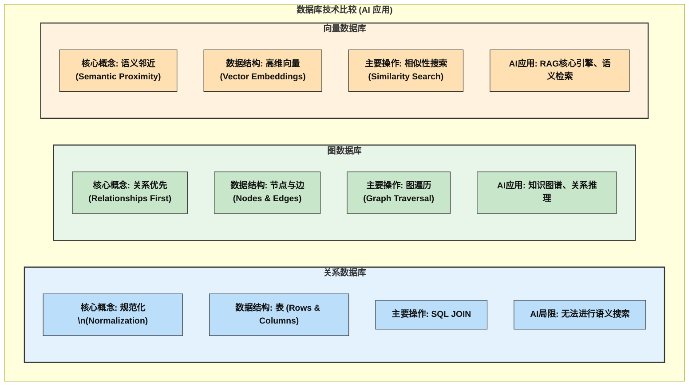
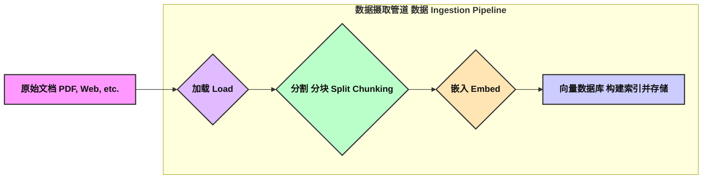
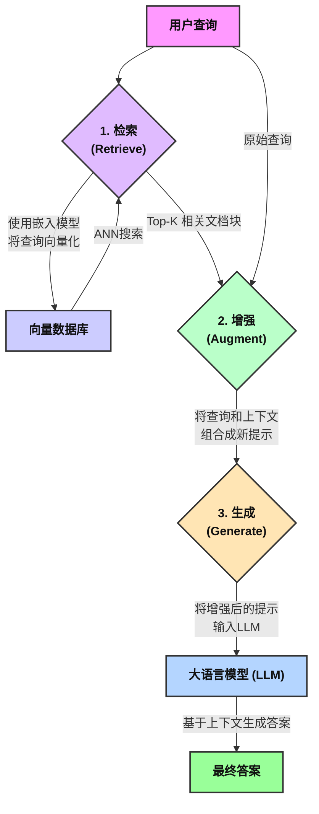
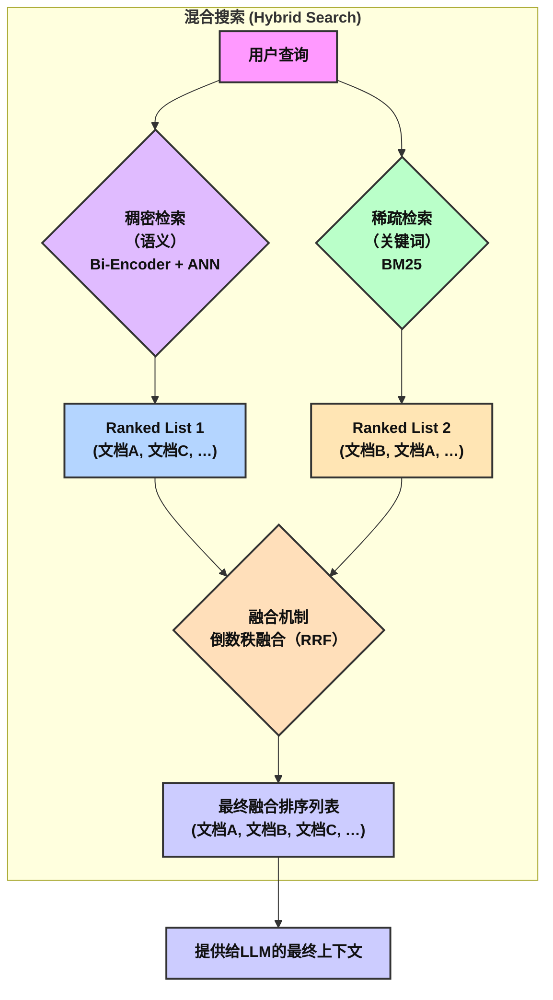
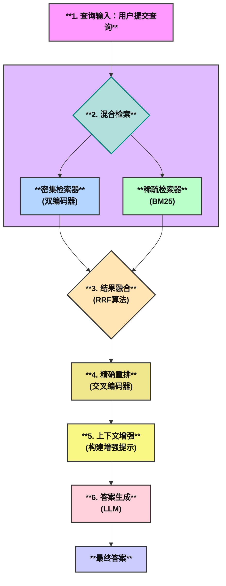

# 第八天 知识注入机制 —— 检索增强生成（RAG）构建基于私域知识的AI

欢迎来到我们课程的第六天。今天，我们将深入探讨一个在大型语言模型（LLM）领域具有革命性意义的技术：检索增强生成（Retrieval-Augmented Generation, RAG）。这项技术通过将外部知识库与LLM的强大生成能力相结合，有效地解决了模型知识陈旧、无法访问私有数据以及产生“幻觉”（即编造事实）等核心痛点。RAG不仅是提升LLM应用价值的关键，更是构建能够利用企业内部知识、个人文档库等私域数据进行智能问答和内容创作的基石。

本章将全面解构RAG系统的完整生命周期。我们将从知识的数字化表示与高效存储出发，探索如何将非结构化文档转化为机器可理解的向量，并比较不同数据库技术在此过程中的优劣。随后，我们将详细剖析文档处理的核心管道，包括各种分块（Chunking）策略、嵌入（Embedding）模型的选择，以及如何构建高效的向量索引。在此基础上，我们将深入RAG的核心架构，理解其检索与生成两大模块如何协同工作，并探讨混合搜索等高级检索策略。一个强大的系统离不开严谨的评估与持续的优化，因此，我们将系统性地介绍衡量RAG系统性能的关键指标——“RAG三元组”（相关性、忠实性、准确性），并分析主流的自动化评估框架。最后，本章将以一个完整的端到端实验收尾，指导您亲手搭建一个基于个人知识库的智能问答系统，将理论知识转化为实践能力。

通过本章的学习，您将不仅掌握RAG的理论全貌，更能具备从零开始构建、评估并优化一个功能完备的RAG应用的能力，真正实现让AI在您的私域知识上“思考”与“对话”。

##  第一部分 知识表示与存储：从关系数据库到向量数据库

在构建任何能够利用外部知识的AI系统时，首要且最根本的问题是如何表示和存储这些知识。知识的形态千差万别，从结构化的表格数据到半结构化和完全非结构化的文本、图像，如何将这些信息转化为AI能够理解和检索的格式，是整个RAG流程的基石。本节将追溯数据管理技术的发展脉络，剖析传统数据库在AI时代的局限性，并阐明为何向量数据库已成为现代RAG系统的标准配置。

### 1.1 AI时代的数据范式转变：从结构化到语义化

数据管理的历史是一部不断追求更高效组织和访问信息的历史。在企业计算的早期，信息被严格地组织在结构化数据库中，其中关系数据库（Relational Database Management Systems, RDBMS）占据了主导地位。这种模型将世界抽象为一个个实体，每个实体由明确的属性（列）描述，并存储在规范的表格（行）中。实体间的关系则通过外键（Foreign Keys）来间接表示。这种模式对于处理财务记录、库存管理等高度结构化的任务非常有效，其查询语言SQL（Structured Query Language）也是围绕精确匹配和复杂的JOIN操作来设计的。

然而，随着人工智能，特别是大型语言模型的兴起，数据处理的范式发生了根本性的转变。当今世界绝大多数的知识——网页、研究论文、法律合同、客户邮件、产品图片——都是非结构化的。对于LLM而言，仅仅存储这些数据是远远不够的，它需要理解数据背后的**语义（Semantic Meaning）**。用户不再仅仅查询“订单号为12345的客户姓名”，而是提出更模糊、更概念性的问题，如“哪些客户反馈对我们的新功能不满意？”或“总结一下最近关于量子计算技术突破的报告”。

这种需求推动了从\*\*精确匹配（Exact Match） 到 概念相似性搜索（Conceptual Similarity Search）\*\*的转变。AI系统必须能够理解“不满意”与“功能缺陷”、“bug”、“用户体验差”在语义上是相近的。这正是传统数据库技术的软肋，也是RAG系统需要解决的核心问题。

### 1.2 AI应用中数据库技术的比较分析

为了应对这一挑战，不同的数据库技术应运而生。理解它们的核心概念、数据结构和主要操作，对于做出正确的RAG架构决策至关重要。

1. **关系数据库 (Relational Databases)**

  * **核心概念与数据结构**：关系模型的核心是二维表，数据以行和列的形式存储。其设计哲学是数据规范化，减少冗余，并通过预定义的模式（Schema）保证数据的一致性。
  * **主要操作与局限性**：主要操作是基于SQL的CRUD（创建、读取、更新、删除）和JOIN。JOIN操作在运行时动态计算表之间的关系，虽然功能强大，但随着关联表数量和数据量的增加，其计算成本会急剧上升，导致性能瓶颈。对于RAG而言，其致命的局限在于无法进行语义搜索。在关系数据库中查询“与某个概念相似的文档”几乎是不可能的，因为它缺乏表示和比较语义相似性的内在机制。

2. **图数据库 (Graph Databases)**

  * **核心概念与数据结构**：图数据库将关系视为“一等公民”。数据被存储为一个由节点（Nodes，代表实体）和边（Edges，代表节点间的显式关系）组成的网络。这种结构与现实世界中许多复杂系统的网络特性天然契合。
  * **主要操作与AI应用**：其主要操作是图遍历（Graph Traversal），用于探索节点间的路径和连接模式。在AI领域，图数据库非常适合构建知识图谱（Knowledge Graphs）。当查询依赖于实体间已知的、明确的关系时（例如，“找出A的朋友的朋友中，谁也喜欢电影B？”），图数据库表现出极高的效率。然而，它的设置相对复杂，需要预先定义好实体和关系的模式，这在处理完全非结构化的数据时可能成为一个挑战。

3. **向量数据库 (Vector Databases)**

  * **核心概念与数据结构**：向量数据库是为AI时代量身定制的解决方案。它不使用表或显式的节点-边结构，而是将数据对象（如文本块、图片、音频片段）表示为高维空间中的 **向量（Vectors）**，也称为 **嵌入（Embeddings）**。其核心思想是：在由机器学习模型（即嵌入模型）构建的这个向量空间中，语义上相似的对象在空间位置上彼此靠近。
  * **主要操作与RAG的核心引擎**：向量数据库的主要操作是 **相似性搜索（Similarity Search）**，通常通过近似最近邻（Approximate Nearest Neighbor, ANN）算法实现。当用户提出一个查询时，该查询也被转换成一个向量，数据库的任务就是在这个高维空间中高效地找到与查询向量“距离”最近的N个数据向量。这种机制完美契合了RAG的核心需求——基于语义含义检索相关上下文，而不是基于关键词。

这种数据库选择的背后，其实反映了一种关于AI系统如何构建其“世界观”的深层考量。选择图数据库，意味着构建一个基于**符号主义（Symbolism）** 的系统，其知识被编码在预定义、离散的实体和关系网络中。AI的推理过程是在这个结构化的、由人类设计的知识图谱上进行的。而选择向量数据库，则意味着构建一个基于 **连接主义（Connectionism）** 的系统，其知识是分布式的、连续的，体现在高维向量空间中。关系不是被预先定义的，而是在模型学习数据模式的过程中 \*\*涌现（emerge）\*\*出来的，通过向量间的空间邻近性来体现。因此，向量数据库使AI能够在一个更流动的、更具泛化能力的语义空间中进行推理，这与现代LLM的内在工作方式更为一致。当然，结合两者的混合式RAG系统也正在成为一个前沿的研究方向。

为了更清晰地对比，下表总结了这三种数据库在AI应用中的关键特性。

| 特性 | 关系数据库 (例如, PostgreSQL) | 图数据库 (例如, Neo4j) | 向量数据库 (例如, Pinecone, Milvus) |
| :--- | :--- | :--- | :--- |
| **数据结构** | 包含行和列的表（结构化数据） | 节点（实体）和边（关系） | 高维向量（嵌入）在向量空间中 |
| **主要操作** | CRUD操作, 用于关联数据的JOIN | 图遍历，用于探索路径和连接 | 近似最近邻 (ANN) 相似性搜索 |
| **查询机制** | SQL (结构化查询语言) | 图查询语言 (例如, Cypher, Gremlin) | 基于距离度量的向量相似性查询 |
| **理想的RAG用例** | 存储与向量ID关联的元数据；不用于主检索。 | 知识图谱RAG，其中明确的关系和推理路径至关重要。 | 非结构化文本或多模态数据语义检索的默认选择。 |



### 1.3 深入理解向量相似性度量

向量数据库的核心是“相似性搜索”，而衡量“相似”与否则依赖于数学上的距离度量。将查询和文档都表示为向量后，我们需要一个函数来量化它们之间的接近程度。选择哪种度量标准并非随心所欲，理想情况下，它应与训练嵌入模型时所用的度量标准相匹配，以确保最佳的检索性能。

1.  **欧几里得距离 (Euclidean Distance, L2)**

  * **直观理解**：欧几里得距离是我们日常生活中最熟悉的距离概念，即两点之间的直线距离。在向量空间中，它衡量的是两个向量端点之间的“空间距离”，关注的是向量的\*\*位置和大小（Magnitude）\*\*差异。
  * **数学公式**：对于n维空间中的两个向量a和b，其欧几里得距离计算如下：$d(a,b)=\\sqrt{\\sum\_{i=1}^{n}(a\_i-b\_i)^2}$
  * **应用场景**：当向量的长度（模）本身具有重要意义时，欧几里得距离是合适的选择。例如，在某些推荐系统中，向量的模可能代表用户的活跃度或购买力。在此度量下，距离值越小，表示相似度越高。

2. **余弦相似度 (Cosine Similarity)**

  * **直观理解**：余弦相似度忽略向量的长度，只关注它们在向量空间中的 **方向**。它衡量的是两个向量之间的夹角的余弦值。可以想象，无论两个箭头有多长，只要它们指向完全相同的方向，它们的夹角就是0度，余弦相似度为1。
  * **数学公式**：计算公式如下：$sim(a,b)=\\frac{a \\cdot b}{|a| |b|} = \\frac{\\sum\_{i=1}^{n} a\_i b\_i}{\\sqrt{\\sum\_{i=1}^{n} a\_i^2} \\sqrt{\\sum\_{i=1}^{n} b\_i^2}}$
  * **应用场景**：这是绝大多数基于文本的RAG应用的默认和首选度量。因为一篇长文档和一句短小的摘要可能在讨论完全相同的主题，它们的向量在方向上应该是一致的，但长度（模）会因文本长度而异。余弦相似度通过忽略长度差异，能够准确捕捉这种语义上的一致性。其值域为[-1, 1]，值越接近1，表示相似度越高。

3. **点积 (Dot Product / Inner Product)**

  * **直观理解**：点积是一个同时考虑了向量 **方向和大小** 的度量。从几何上看，它是一个向量在另一个向量上的投影长度，再乘以另一个向量的模。
  * **数学公式**：计算非常简单，就是两个向量对应维度的乘积之和：$a \\cdot b = \\sum\_{i=1}^{n} a\_i b\_i$
  * **与余弦相似度的关系**：这是一个至关重要的优化点。当向量被L2范数归一化（即它们的长度都为1）后，余弦相似度公式的分母 ||a|| · ||b|| 就等于1。此时， **余弦相似度等价于点积**。由于点积的计算比余弦相似度（需要计算模和除法）快得多，许多系统在存储嵌入向量前会先进行归一化，从而可以用更高效的点积运算来完成相似性排序。
  * **应用场景**：当向量的方向和大小都对相似性有贡献时，点积是合适的选择。由于其计算效率高，在许多场景下都很有吸引力。

总结来说，为RAG系统选择数据存储技术是一个关键的架构决策。虽然关系数据库和图数据库在特定场景下有其价值（如存储元数据或构建知识图谱），但向量数据库凭借其为语义搜索量身定制的设计，已成为构建高效、可扩展RAG系统的核心基础设施。而正确理解和选择相似性度量，则是发挥向量数据库潜力的关键一步。

### 1.5 问答与小实验

#### 问答环节

1. 考虑到“维度灾难”现象，为什么在比较两个高维文本向量时，说它们“指向同一个方向”通常比说它们“彼此靠近”更有意义？
2. 假设你正在为一个音乐流媒体服务构建推荐系统。用户的听歌历史被表示为向量，其中每个维度代表一种音乐流派的收听时长。在比较两个用户时，你会选择欧氏距离还是余弦相似度？请结合向量的“大小”和“方向”可能代表的含义来论证你的选择。
3. 关系数据库保证ACID合规性，而向量数据库通常为了性能而牺牲强一致性 。在一个提供医疗或金融建议的RAG系统中，这种权衡可能带来哪些潜在风险？

#### 小实验：用向量度量验证语义运算

目标： 通过Python代码，直观地展示不同相似性度量在语义向量上的表现。

```Python
import numpy as np
from numpy.linalg import norm

# 为了教学目的，我们使用简化的3维向量来代表词嵌入
# 假设我们有'国王', '男人', '女人'的向量
king = np.array([0.9, 0.8, 0.1])
man = np.array([0.7, 0.9, 0.2])
woman = np.array([0.2, 0.7, 0.8])

# 通过著名的语义运算 "国王 - 男人 + 女人" 来推导'女王'的向量
# king - man + woman = queen
queen_hypothetical = king - man + woman

print(f"推导出的'女王'向量: {queen_hypothetical}")

# 定义相似性/距离函数
def euclidean_distance(a, b):
    """计算两个向量之间的欧氏距离"""
    return norm(a - b)

def cosine_similarity(a, b):
    """计算两个向量之间的余弦相似度"""
    return np.dot(a, b) / (norm(a) * norm(b))

# 让我们用一个更符合直觉的'女王'向量作为比较基准
queen_actual = np.array([0.4, 0.6, 0.7])
print(f"实际的'女王'向量 (用于比较): {queen_actual}")

# 比较推导出的'女王'与实际的'女王'
print("\n--- 使用欧氏距离比较 (值越小越相似) ---")
print(f"距离(推导女王, 实际女王): {euclidean_distance(queen_hypothetical, queen_actual):.4f}")

print("\n--- 使用余弦相似度比较 (值越大越相似) ---")
print(f"相似度(推导女王, 实际女王): {cosine_similarity(queen_hypothetical, queen_actual):.4f}")

# 探索不同向量之间的关系
print("\n--- 探索其他关系 ---")
print(f"余弦相似度(国王, 男人): {cosine_similarity(king, man):.4f}")
print(f"余弦相似度(女王, 女人): {cosine_similarity(queen_actual, woman):.4f}")
print(f"余弦相似度(国王, 女王): {cosine_similarity(king, queen_actual):.4f}")
```

分析： 学生将运行此代码，观察通过向量运算推导出的queen_hypothetical向量。他们可以分析这个推导出的向量与我们设定的queen_actual向量在两种不同度量下的邻近度。这个实验虽然高度简化，但它生动地展示了嵌入空间中的向量运算如何能够捕捉和反映现实世界中的语义关系，并让学生亲手实践了本节课学习到的两种核心相似性度量。

## 第二部分 文档处理管道：分块、嵌入与索引构建

在确定了使用向量数据库作为知识存储的基石之后，我们必须面对下一个核心挑战：如何将原始的、非结构化的私域知识（如PDF报告、网页、Word文档）转化为可供检索的向量。这个过程被称为 **数据摄取（Data Ingestion）**，它是一个包含多个关键步骤的管道，其执行质量直接决定了RAG系统性能的天花板。本节将详细拆解这个管道，重点探讨分块、嵌入和索引构建这三大支柱。

- **分块 (Chunking)**: 将大型的、连续的原始文档分割成更小的、有意义的文本片段。
- **嵌入 (Embedding)**: 使用一个深度学习模型（即嵌入模型）将每个文本块转换成一个高维的数字向量。
- **索引 (Indexing)**: 将这些向量连同它们的元数据（例如，来源文档、块ID）存入向量数据库，并构建一个高效的索引结构，以便于快速检索。

### 2.1 分块：智能文本分割的艺术

#### 2.1.1 分块概述

一个典型的RAG文档处理管道可以概括为四个核心阶段： **加载（Load）、分割（Split）、嵌入（Embed）、存储（Store）**。



1.  **加载（Load）**：这是管道的起点。我们需要使用各种文档加载器（Document Loaders）从不同的数据源（如本地文件系统、URL、数据库）中读取原始数据。例如，LangChain等框架提供了PyPDFLoader用于加载PDF文件，WebBaseLoader用于抓取和加载网页内容。
2.  **分割（Split）**，即 **分块（Chunking）**：这是整个管道中最具技巧性和影响力的环节之一。由于直接将整个长文档嵌入成一个向量会稀释其语义信息，并且会超出大多数嵌入模型的上下文窗口限制，我们必须将长文档切分成更小的、有意义的文本块（Chunks）。
3.  **嵌入（Embed）**：在此阶段，我们使用一个预训练的\*\*嵌入模型（Embedding Model）\*\*将每个文本块转换成一个高维的数字向量。这个向量就是文本块的“语义指纹”。
4.  **存储（Store）**：最后，我们将生成的向量嵌入及其对应的原始文本块（和元数据）加载到一个向量数据库中。数据库会对这些向量进行 **索引（Indexing）**，以支持后续的高效相似性搜索。

这个看似线性的流程，实际上是一个环环相扣的级联系统。上游的决策会直接影响下游的性能，例如，分块策略决定了嵌入模型需要处理的文本长度和内容，而嵌入模型的质量则决定了向量索引的有效性。这种紧密的耦合关系意味着优化RAG系统需要对整个管道进行整体考虑和迭代。

**分块策略：为语义完整性解构文档**

分块的根本目标是在 **保持语义完整性** 和 **满足技术约束** 之间找到最佳平衡。一个理想的文本块应该足够小，以确保其向量表示精确地聚焦于一个单一、清晰的主题；同时又应该足够大，以包含回答潜在问题所需的完整上下文。如果一个文本块对人类读者来说在没有上下文的情况下是有意义的，那么它对语言模型来说也可能是个好块。

#### 2.1.2  核心分块技术分析

  * **固定大小分块 (Fixed-Size Chunking)**

      * **工作原理**：这是最直接的方法。简单地将文本按照固定的字符数或Token数进行切割，通常会设置一个重叠（Overlap）区域，让相邻的块共享一部分内容，以期保留一些上下文联系。
      * **优缺点**：优点是实现简单、快速，并且块大小统一，便于批处理。缺点是它完全忽略了文本的语义结构，很可能在句子中间或一个完整的逻辑单元中将文本“拦腰斩断”，严重破坏上下文。
      * **适用场景**：作为快速建立基线的起点，或者用于那些没有明显逻辑结构、格式高度统一的文本（如日志文件）。

  * **递归字符分割 (Recursive Character Splitting)**

      * **工作原理**：这是一种更智能的分割方法。它采用一个包含多种分隔符的有序列表，例如 `["\n\n", "\n", " ", ""]`，并按顺序尝试用这些分隔符来分割文本。其逻辑是：首先尝试用双换行符（\\n\\n）来保持段落的完整性；如果分割后的块仍然过大，就在这些块上递归地使用下一个分隔符——单换行符（\\n）来保持句子的完整性；依此类推，直到块的大小符合要求。
      * **优缺点**：相比固定大小分块，它能更好地尊重文本的自然结构，是LangChain等框架推荐的通用文本处理方法。缺点是如果块大小设置不当，仍然可能产生不理想的分割。
      * **适用场景**：绝大多数通用文本文档（如文章、报告、网页）的首选默认策略。

  * **语义分块 (Semantic Chunking)**

      * **工作原理**：这是一种更先进、更侧重于“意义”的策略。它不依赖于字符分隔符，而是通过分析文本的语义相似度来决定分割点。具体做法通常是：先将文档分割成句子，然后计算相邻句子或句子组之间的嵌入向量的相似度。当相似度出现一个“断崖式”下跌时，就意味着话题发生了转变，这里便是一个理想的分割点。
      * **优缺点**：优点是能产生语义上最连贯、最内聚的文本块，极大地提升了检索的相关性。缺点是计算成本更高，因为它需要在分块阶段就调用嵌入模型，并且该技术仍处于实验阶段，可能不如成熟方法稳定。
      * **适用场景**：处理那些主题密集、逻辑转换微妙的复杂文档（如学术论文、法律文件），在这些场景中，保持概念的完整性至关重要。

  * **高级策略：父文档检索器 (Parent Document Retriever)**

      * **核心思想**：该技术旨在解决一个核心矛盾：为了精确的嵌入匹配，我们需要小的、主题集中的块；但为了让LLM生成富有上下文的答案，我们又需要大的、信息丰富的块。
      * **工作原理**：父文档检索器通过一种“小块索引，大块返回”的策略来调和这一矛盾。它首先将文档分割成较大的“父块”，然后再将每个父块进一步分割成更小的“子块”。在构建索引时，只有这些小的“子块”的嵌入向量被存入向量数据库。当进行检索时，系统首先通过相似性搜索找到最相关的“子块”，但它并不直接返回这些小块，而是查找这些子块所属的“父块”ID，并将完整的“父块”或原始文档返回给LLM。
      * **优势**：它兼顾了检索的精确性（得益于小块）和生成的上下文完整性（得益于大块），是一种非常有效的RAG优化策略。

为了便于开发者根据具体需求选择最合适的分块策略，下表提供了一个实用的决策框架。

| 策略 | 工作原理 | 优点 | 缺点 | 最佳适用场景 |
| :--- | :--- | :--- | :--- | :--- |
| **固定大小 (Fixed-Size)** | 按固定的字符/Token数切割文本，可带重叠。 | 简单、快速、块大小可预测。 | 忽略语义边界，常粗暴切断句子。 | 快速基线测试，或处理格式高度统一、无明显逻辑结构的文本。 |
| **递归字符 (Recursive Character)** | 使用`\n\n`, `\n`, 等分隔符列表进行层级分割，以保持段落/句子完整性。 | 比固定大小更好地保留上下文，在结构和大小间取得平衡。 | 若分隔符与块大小不匹配，仍可能产生不理想的分割。 | 推荐作为大多数通用文本文档（文章、网页）的默认策略。 |
| **语义分块 (Semantic Chunking)** | 根据嵌入相似度对句子进行分组，在语义发生显著变化处进行分割。 | 产生上下文最连贯的块，检索相关性高。 | 计算成本高，需在分块时进行嵌入。仍具实验性。 | 主题密集、逻辑转换微妙的复杂文档，其中概念完整性至关重要。 |
| **父文档检索器 (Parent Document Retriever)** | 索引小的“子块”以实现精确搜索，但返回其大的“父块”给LLM以提供完整上下文。 | 两全其美：精确的搜索和用于生成的完整上下文。 | 架构更复杂，需管理两层文档粒度。 | 对密集的科技手册或法律文件进行问答，特定事实需要其周围的完整语境。 |

### 2.2.2 嵌入：将文本翻译成有意义的向量

分块完成后，下一步就是利用嵌入模型将这些文本块转换成机器可以理解的数字向量。这个过程是RAG系统的核心魔法之一 。选择并应用合适的嵌入模型是将文本块转化为有意义的向量表示的关键。这个模型就像一个“语义翻译官”，其翻译质量直接影响检索的成败。

1. **Sentence-BERT (S-BERT): 为句子相似度而生**

虽然像BERT这样的基础Transformer模型非常强大，但它们最初的设计目标（如掩码语言建模）并不是为了直接生成用于相似性比较的句子嵌入。研究发现，直接使用BERT的`` token输出或对所有token的输出向量取平均值，在语义相似度任务上的表现并不理想 。  

为了解决这个问题，Sentence-BERT (S-BERT) 应运而生。S-BERT对预训练的BERT模型进行了架构上的微调，使其特别擅长生成高质量的句子嵌入 。  

- **核心架构**: S-BERT采用**孪生网络（Siamese Network）或三元组网络（Triplet Network）**结构。在一个孪生网络中，两个结构相同、权重共享的BERT模型并行处理两个输入句子。
-  **工作流程**:
	- 输入: 两个句子（例如，句子A和句子B）分别输入到两个共享权重的BERT模型中。
	- Transformer层: 每个BERT模型像往常一样工作，通过其多层Transformer结构，为输入句子中的每个token生成一个考虑了上下文的嵌入向量。
	- 池化层 (Pooling Layer): 这是S-BERT的关键创新之一。它将BERT输出的一系列token嵌入聚合（“池化”）成一个单一的、固定大小的句子嵌入向量。最常用的池化策略是平均池化（Mean Pooling），即简单地将所有token的嵌入向量取平均值。这个池化操作是在一个经过特殊训练的架构中进行的，因此其效果远好于对原始BERT输出的简单平均 。
	- 目标函数: S-BERT在训练时，使用特定的目标函数（如余弦相似度损失或对比损失）来优化这两个最终生成的句子嵌入向量。目标是让语义相似的句子对（如“今天天气真好”和“今天阳光明媚”）在向量空间中彼此靠近，而语义不相关的句子对则相互远离。

通过这种方式，S-BERT被专门训练来生成一个语义丰富的向量空间，其中向量之间的距离（或角度）直接对应于原始句子之间的语义相似度。在实践中，我们可以通过sentence-transformers这个强大的Python库，轻松加载预训练好的S-BERT模型，并用它来为我们的文档块生成嵌入 。

#### 2.2.3 索引构建：构建高效的向量搜索引擎

即使有了高质量的向量，如果每次查询都需要将查询向量与数据库中数百万甚至数十亿个文档向量逐一比较（即 **暴力搜索** 或 **平面索引**），其延迟将是无法接受的。y因为对所有向量进行一次暴力（Brute-force）的距离计算是不可行的，其计算复杂度是 O(N⋅d)，其中 N 是向量总数，d 是向量维度。这催生了**近似最近邻（ANN）**搜索算法和相应的索引技术。这是一种特殊的数据结构，旨在加速相似性搜索。

**HNSW (分层可导航小世界)**

  * **简介**：HNSW (Hierarchical Navigable Small World) 是目前最先进的、基于图的近似最近邻（ANN）搜索算法之一，被广泛应用于主流的向量数据库中。
  * **核心概念**：
      * **可导航小世界 (NSW) 图**：其基本思想是构建一个“邻近图”，其中每个节点（向量）都与其在空间中的几个最近邻居相连。这在图中创建了可以快速穿梭的“高速公路”，但缺点是容易陷入局部最优解，即找到一个局部最近的点就停止搜索。
      * **跳表 (Skip List) 的类比**：HNSW借鉴了跳表的多层结构思想，构建了多个层次的邻近图。
  * **层级结构**：HNSW的索引由多个图层组成。顶层图非常稀疏，节点少，但连接的边很长，允许在向量空间中进行快速、大跨度的“跳转”。而底层图则非常密集，包含了所有节点，连接的边很短，用于进行精确、小范围的搜索。

```mermaid
flowchart TD
    subgraph "`**HNSW 搜索过程**`"
        direction LR
        Start["`**搜索开始<br>入口点 @ L2**`"]:::celloutput --> L2_A

        subgraph "`**Layer 2 (稀疏层)**`"
            L2_A["`**节点A**`"]:::celloutput -- "贪婪搜索" --> L2_B["`**最近邻B**`"]:::celloutput
        end

        L2_B --> Drop1{"`**下降到 L1**`"}
        Drop1 --> L1_B

        subgraph "`**Layer 1 (中间层)**`"
            L1_B["`**节点B'**`"]:::celloutput -- "贪婪搜索" --> L1_C["`**最近邻C**`"]:::celloutput
        end

        L1_C --> Drop2{"`**下降到 L0**`"}
        Drop2 --> L0_C

        subgraph "`**Layer 0 (密集层 - 所有点)**`"
            L0_C["`**节点C'**`"]:::celloutput -- "精确搜索" --> Final["`**最终结果**`"]:::celloutput
        end
    end

    %% 区块配色
    style Start fill:#9f9,stroke:#333,stroke-width:2px
    style Final fill:#9f9,stroke:#333,stroke-width:2px
    style L2_A fill:#e0bbff,stroke:#333,stroke-width:2px
    style L2_B fill:#e0bbff,stroke:#333,stroke-width:2px
    style L1_B fill:#baffc9,stroke:#333,stroke-width:2px
    style L1_C fill:#baffc9,stroke:#333,stroke-width:2px
    style L0_C fill:#ffe5b4,stroke:#333,stroke-width:2px

	classDef celloutput font-weight:bold,color:#111,fill:#b2dfdb,stroke:#00897b,stroke-width:2px;
```

<!-- end list -->



  * **搜索过程**：一次搜索从顶层图的一个预设入口点开始。算法贪婪地导航到该层中离查询向量最近的节点。然后，从这个节点“下降”到下一层，并以该点为新的起点，重复贪婪搜索过程。这个过程逐层向下，不断逼近最终目标，直到在最底层的图中找到最近邻。
  * **实现与参数**：像FAISS（Facebook AI Similarity Search）这样的库提供了HNSW的高效实现。在构建和使用HNSW索引时，有几个关键的可调参数，如`efConstruction`（构建索引时的搜索广度，影响构建时间和索引质量）和`efSearch`（查询时的搜索广度，影响查询速度和召回率），需要根据具体应用进行权衡和调整。

总之，文档处理管道是RAG系统的“幕后英雄”。从智能地解构文档（分块），到精准地翻译其语义（嵌入），再到高效地组织这些语义信息以便快速访问（索引），每一步都至关重要。只有对这个级联系统进行整体的、迭代的优化，才能为后续的检索和生成环节奠定坚实的基础。

### 2.3 问答与小实验

#### 问答环节

1. 假设你正在为一家公司的内部法律文件构建一个RAG系统。在分块时，你会选择固定大小分块还是递归字符分块？你选择的策略可能存在哪些潜在风险？
2. 请解释FAISS中IndexIVFFlat索引的train和add步骤之间的区别。为什么这个索引需要train步骤，而IndexFlatL2则不需要？
3. S-BERT论文认为，简单地平均BERT的token嵌入对于句子相似度任务来说是一个糟糕的策略。从数学或模型设计的角度，你认为这可能是为什么？（提示：思考原始BERT模型中每个token嵌入的目的是什么）。

#### 小实验：分块策略的直观影响

目标： 通过代码直观地展示不同分块策略如何影响最终检索到的上下文。

~~~Pythond
# 确保已安装：pip install langchain

from langchain.text_splitter import CharacterTextSplitter, RecursiveCharacterTextSplitter

# 一段包含段落和句子的示例文本
sample_text = "Dursley先生和太太住在女贞路4号，他们非常骄傲地宣称自己是十分正常的人，谢谢各位关心。他们是你能想到的最不可能和任何奇怪或神秘事件扯上关系的人，因为他们根本不相信那些无稽之谈。\n\nMr. Dursley是一家名叫格朗宁斯的公司的经理，这家公司生产钻机。他是个高大魁梧的男人，几乎没有脖子，但却留着一脸大胡子。"

# 策略一：固定大小分块 (这里我们用一个简单的空格作为分隔符)
fixed_splitter = CharacterTextSplitter(
    separator=" ",  # 以空格为分隔符
    chunk_size=100,  # 块大小（字符数）
    chunk_overlap=20 # 重叠大小
)
fixed_chunks = fixed_splitter.split_text(sample_text)
print("--- 固定大小分块结果 ---")
for i, chunk in enumerate(fixed_chunks):
    print(f"块 {i+1}: {chunk}\n")

# 策略二：递归字符分块
recursive_splitter = RecursiveCharacterTextSplitter(
    chunk_size=100,  # 块大小
    chunk_overlap=20 # 重叠大小
)
recursive_chunks = recursive_splitter.split_text(sample_text)
print("\n--- 递归字符分块结果 ---")
for i, chunk in enumerate(recursive_chunks):
    print(f"块 {i+1}: {chunk}\n")
~~~

分析： 学生将运行代码并比较两种策略的输出。他们会清楚地看到，CharacterTextSplitter（作为固定大小分块的一个简单实现）可能会在任意位置切断文本，而RecursiveCharacterTextSplitter则会优先尊重段落边界（\n\n），从而生成语义上更连贯、更完整的文本块。这个实验生动地揭示了智能分块策略的重要性。

## 第三部分 检索增强生成架构：双编码器模型与混合检索

在前两个小节中，我们已经探讨了如何将私域知识转化为可供检索的向量索引。现在，我们将进入RAG系统的核心——实时交互的 **检索与生成** 阶段。当用户提出一个查询时，RAG系统是如何在海量的知识库中迅速找到最相关的上下文，并利用这些上下文生成精准答案的？本节将深入剖析支撑这一过程的架构模式、关键算法以及前沿的融合策略。

RAG的运行机制可以被清晰地概括为一个三步循环：



### 3.1  RAG架构：双编码器、重排与混合检索

完成了数据准备的“离线”工作，我们现在转向RAG系统的“在线”部分——即当用户发出查询时，系统内部发生了什么。本节将深入剖析一个现代、多阶段的RAG架构，揭示其如何平衡检索的速度与精度，以向LLM提供最高质量的上下文信息

#### 3.1.1 经典RAG框架：解构检索器-生成器模型

为了理解现代RAG架构，我们首先要回到它的源头——由Lewis等人在2020年提出的原始RAG模型 。这个开创性的工作奠定了RAG的核心思想，即结合两种不同类型的“记忆”：  
- 参数化记忆 (Parametric Memory): 这指的是预训练的序列到序列（seq2seq）模型本身，也就是我们所说的LLM生成器（例如BART）。它的知识以模型参数（权重）的形式存储，是通过在海量数据上训练学习到的 。
- 非参数化记忆 (Non-parametric Memory): 这指的是一个外部的、可直接访问的知识源。在原始RAG模型中，这是一个包含了维基百科所有文章的密集向量索引。这个记忆库可以通过一个**检索器（Retriever）**来访问 。  

原始RAG模型的一个关键创新是其端到端（end-to-end）的训练方式。它将检索到的文档视为一个潜变量（latent variable），并联合训练检索器和生成器，使得检索器学会去寻找那些能帮助生成器产生更准确答案的文档 。该论文还提出了两种模型变体：  RAG-Sequence，它为整个生成序列检索一个固定的文档；以及RAG-Token，它允许在生成每个token时都可能检索不同的文档，提供了更大的灵活性 。这个经典模型为后续所有RAG研究奠定了坚实的理论基础。

#### 3.1.2 速度与精度的权衡：双编码器 vs. 交叉编码器

现代RAG系统在实现检索器时，面临一个核心的架构选择，这个选择直接决定了系统的速度和精度。这两种主流架构被称为双编码器（Bi-Encoder）和交叉编码器（Cross-Encoder）。

1. 双编码器 (Bi-Encoder) - 用于快速检索

双编码器架构是RAG系统中第一阶段检索（Retrieval）的标准实现。其工作原理如下 ：  
- 独立编码: 查询（Query）和所有文档（Documents）被独立地送入一个嵌入模型（如S-BERT）中，分别生成它们各自的向量嵌入。
- 高效比较: 文档的嵌入向量可以被预先计算并存储在向量数据库中。在查询时，我们只需计算查询向量，然后通过一个计算成本极低的操作（如内积或余弦相似度）与数据库中数百万个文档向量进行比较。

优点: 速度极快，具有高度的可扩展性。这是因为它将昂贵的编码过程（文档侧）离线完成 。  

缺点: 精度相对较低。因为在生成嵌入时，查询和文档是“互相看不见”的，模型无法捕捉它们之间细微的、交互式的相关性 。  

2. 交叉编码器 (Cross-Encoder) - 用于精确重排

交叉编码器则代表了精度的极致。其工作原理完全不同 ：  
- 联合编码: 它将查询和一个文档同时（通常用`` token连接）作为单一输入，送入一个Transformer模型（如BERT）中。
- 直接评分: 模型对这个配对进行深入的、全方位的注意力计算，最终输出一个单一的相关性分数（通常在0到1之间），而不是一个向量。

优点: 精度极高。由于模型可以充分利用注意力机制来分析查询词与文档词之间的每一个交互，它能做出非常精准的相关性判断 。  

缺点: 速度极慢。由于每次只能处理一个（查询，文档）对，如果要对一个拥有百万文档的库进行搜索，就需要进行百万次昂贵的Transformer前向传播。这在计算上是不可行的 。  

3. 两阶段解决方案：检索与重排 (Retrieve & Re-rank)

既然双编码器快而不精，交叉编码器精而不快，一个自然而然的解决方案就是将它们结合起来，形成一个**两阶段的“检索与重排”**流水线 。这是现代RAG系统的标准架构：  
- 第一阶段 (Retrieval): 使用一个快速的双编码器从海量文档库中召回一个相对较大（例如，top-100）的候选文档集。
- 第二阶段 (Re-ranking): 使用一个精准的交叉编码器对这个小规模的候选集进行重新排序，从中选出最终的、最相关的几个文档（例如，top-5）提交给LLM。

这个架构完美地结合了两种方法的优点，实现了在可接受的延迟内，获得接近交叉编码器精度的检索结果。

#### 3.1.3 超越语义：关键词的力量与混合检索

纯粹的语义搜索（即密集向量检索）虽然强大，但也有其盲点。它有时会忽略那些对于查询至关重要的关键词，尤其是专有名词、产品型号、代码函数名或特定的ID。例如，对于查询“如何修复PostgreSQL错误代码23505”，语义模型可能理解“修复数据库错误”，但如果“23505”这个精确的关键词没有被很好地捕捉，就可能找不到最相关的文档。

1. **稀疏检索 (Sparse Retrieval): BM25算法**

为了弥补这一不足，我们引入了稀疏检索，这本质上是一种非常先进的关键词搜索技术。其代表算法是 **Okapi BM25**。BM25通过一个精巧的公式来为每个文档打分：

$$\text{score}(D,Q) = \sum_{i=1}^{n} \text{IDF}(q_i) \cdot \frac{f(q_i, D) \cdot (k_1 + 1)}{f(q_i, D) + k_1 \cdot (1 - b + b \cdot \frac{|D|}{\text{avgdl}})}$$

其中 $Q$ 是查询，$D$ 是文档，$q_i$ 是查询中的第 $i$ 个词。这个公式的三个核心部分是：

* **IDF (Inverse Document Frequency):** 逆文档频率项。一个词在越少的文档中出现，它的IDF值就越高。这赋予了稀有、重要的关键词更高的权重。
* **Term Frequency Saturation:** 词频饱和度项。$f(q_i, D)$ 是词 $q_i$ 在文档 $D$ 中出现的频率。BM25通过参数 $k_1$ 来控制词频的影响力，防止像“的”、“是”这样的高频词过度影响得分。
* **Document Length Normalization:** 文档长度归一化项。通过参数 $b$ 和文档长度 $|D|$ 与平均文档长度 $\text{avgdl}$ 的比值，来惩罚那些过长的文档，因为长文档有更高的概率偶然包含查询词。

2. **混合检索 (Hybrid Search): 融合结果**

混合检索就是将**密集检索（Dense Retrieval）和稀疏检索（Sparse Retrieval）**的结果结合起来，以获得一个更鲁棒、更全面的排序。

3. **倒数排名融合 (Reciprocal Rank Fusion, RRF)**

RRF是一种简单而高效的融合策略。它不关心每个检索系统给出的原始分数是多少，只关心排名。对于每个被检索到的文档，它的最终分数是其在各个排好序的列表中的排名的倒数之和。

$$\text{RRF\_score}(d) = \sum_{i \in \text{lists}} \frac{1}{k + \text{rank}_i(d)}$$

其中 $\text{rank}_i(d)$ 是文档 $d$ 在第 $i$ 个列表中的排名，$k$ 是一个小的平滑常数（通常设为60左右，防止排名靠前的文档权重过大）。RRF的优点在于，它能极大地提升那些在任何一个检索系统中排名靠前的文档的最终排名，从而综合了不同系统的优势。



* **RRF工作原理**：
        1.  对于每个检索器返回的排序列表，RRF为列表中的每个文档d计算一个倒数秩分数。
        2.  该分数的计算公式为：$1 / (k + \\text{rank}(d))$。
        3.  其中，$\\text{rank}(d)$是文档d在该列表中的排名（例如，第一名是1，第二名是2）。
        4.  k是一个很小的常数（通常设为60），它的作用是平滑分数，减弱排名靠后文档的影响力。
        5.  一个文档的最终RRF分数是它在所有出现过的列表中的倒数秩分数之和。
        6.  最后，所有文档根据其最终的RRF总分进行重新排序。那些在多个检索方法中都名列前茅的文档，自然会获得最高的RRF分数，从而在最终的融合列表中脱颖而出。

### 3.2 现代RAG流程：一个信息精炼厂

综合以上所有概念，一个先进的、多阶段的RAG系统在接收到用户查询时的完整工作流程如下：

1. 查询输入: 用户提交一个查询。
2. 混合检索: 系统将查询并行地发送给两个检索引擎：
	- 一个基于双编码器的密集检索器（例如，S-BERT + FAISS/HNSW）。
	- 一个基于关键词的稀疏检索器（例如，BM25）。
3. 结果融合: 使用RRF算法将两个检索器返回的排序列表融合成一个单一的、更可靠的候选文档列表。
4. 精确重排: 将融合后的列表中的top-K（例如，K=100）个候选文档，连同原始查询一起，送入一个交叉编码器进行精确的相关性评分和重排。
5. 上下文增强: 选取重排后得分最高的top-N（例如，N=5）个文档，将它们的内容整理并格式化，与原始查询一起构建成一个增强提示（Augmented Prompt）。
6. 答案生成: 将这个包含了丰富、精准上下文的提示发送给LLM，生成最终的、有据可依的答案。



这个流程就像一个“信息精炼厂”。它从一个宽泛、可能充满噪声的初始检索开始，通过融合、重排等一系列步骤，逐步过滤噪声、提纯信号，最终将最高质量的“信息原料”（上下文）送入LLM这个“加工车间”，从而生产出高质量的“成品”（答案）。

### 3.3 问答与小实验

#### 问答环节

1. 为什么在一个拥有数百万文档的RAG系统中，使用交叉编码器作为第一阶段的检索器在计算上是不可行的？
2. 你正在为一个软件库的源代码构建一个RAG问答系统。用户提问：“我该如何使用 calculate_transform_matrix 这个函数？” 为什么纯粹的语义搜索（密集检索）在这里可能会失败？混合检索（加入BM25）将如何改进检索结果？
3. 在倒数排名融合（RRF）中，一个在列表A中排名第1、在列表B中排名第100的文档，其最终得分可能高于一个在两个列表中都排名第10的文档。你认为这种行为是可取的吗？请解释原因。

## 第四部分 RAG评估与优化：确保相关性、准确性与可靠性

我们已经学习了如何构建一个复杂的RAG系统，但一个至关重要的问题仍然存在：“我们如何知道这个系统工作得好不好？” 本节将专门探讨RAG系统的评估（Evaluation）和优化。这是一个复杂的挑战，因为一个RAG系统的最终输出质量取决于其两个核心组件——检索器和生成器——的协同表现。任何一个环节的失败都可能导致最终答案的质量归零。

### 4.1 “好”的挑战：定义RAG系统的质量

评估RAG系统之所以困难，是因为一个糟糕的答案可能源于多种不同的根本原因：

-   **检索失败**: 检索器未能找到包含正确答案的文档块（低召回率），或者返回了大量不相关的文档块（低精确率）。
-   **生成失败**: 即使检索器提供了完美的上下文，生成器（LLM）也可能忽略这些信息，产生幻觉，或者未能准确地回答用户的问题。

因此，一个科学的评估框架必须能够独立地评估检索和生成两个阶段，从而准确定位问题所在。

要进行系统性的评估，第一步是建立一个**“黄金标准”（Gold Standard）**的评估数据集。这个数据集通常包含一系列具有代表性的问题（`query`），以及由人类专家编写的、理想的参考答案（`ground_truth_answer`）。在某些情况下，还可能需要标注出每个问题所对应的、理想的上下文文档（`ground_truth_context`）。这个数据集是衡量系统性能的基准。

### 4.2 评估检索器：上下文质量的度量

评估检索器的核心目标是回答：“我们的系统找到正确的信息了吗？” 现代评估框架通常使用一个强大的LLM（如GPT-4）作为“裁判”，来自动化地评估以下几个关键指标。

-   **上下文相关性 (Contextual Relevancy / Contextual Precision)**: 这两个指标衡量的是检索到的上下文的“信噪比”。它们评估的是：“在所有被检索回来的文档块中，有多少是与用户查询真正相关的？”。如果这个分数很低，说明检索器返回了大量无关的“噪声”信息，这会干扰生成器的判断。这个指标对于优化检索器的 `top_k` 参数（即返回多少个文档块）至关重要。
-   **上下文召回率 (Contextual Recall)**: 这个指标衡量的是检索到的上下文的“完整性”。它评估的是：“检索到的信息是否包含了回答用户问题所需的所有必要信息？”。如果这个分数很低，说明检索器遗漏了关键的知识片段，即使生成器再强大，也无法“无米之炊”，从而被迫进行猜测或幻觉。

### 4.3 评估生成器：响应质量的度量

在确认检索器提供了高质量的上下文之后，我们需要评估生成器（LLM）是否很好地利用了这些上下文。

-   **忠实度 (Faithfulness)**: 这可以说是RAG评估中最重要的指标。它衡量的是：“生成的答案是否在事实上与所提供的上下文保持一致？”。忠实度是衡量模型幻觉的直接指标。一个低忠实度的得分意味着，即使正确的信息就在眼前，LLM依然选择了“编造”答案。
-   **答案相关性 (Answer Relevancy)**: 这个指标衡量的是：“最终生成的答案是否直接、切题地回应了用户的原始问题？”。一个答案可能在事实上是忠实的，但如果它答非所问或者偏离了主题，那么它的相关性就很低。
-   **答案正确性 (Answer Correctness)**: 这个指标将生成的答案与“黄金标准”中的参考答案进行比较，评估其在事实上的准确性。与忠实度不同，正确性衡量的是答案与客观事实的符合程度，而忠实度只衡量答案与给定上下文的符合程度。一个答案可以是忠实的（完全基于上下文），但如果上下文本身是错误的，那么这个答案就是不正确的。

### 4.4 自动化评估框架：RAGAs简介

手动评估RAG系统既耗时又主观。为了解决这个问题，社区开发了像**RAGAs (Retrieval Augmented Generation Assessment)**这样的自动化评估框架。

RAGAs将我们上面讨论的评估指标（如上下文精度/召回率、忠实度、答案相关性）操作化。它的一个核心特点是，它在很大程度上不需要人类标注的参考答案。相反，它巧妙地利用一个强大的LLM作为裁判，通过精心设计的提示来对RAG系统的输出进行打分。

使用RAGAs的典型工作流程如下：

1.  准备一个包含测试问题的列表。
2.  将这些问题输入到你的RAG管道中，收集每一组的输出，包括：生成的答案（`answer`）和检索到的上下文（`retrieved_context`）。
3.  将这些（问题，答案，上下文）三元组以及可能的参考答案（`ground_truth_answer`）打包成一个数据集。
4.  调用RAGAs的`evaluate`函数，它会自动计算出上述各项指标的分数。

这种“LLM评估LLM”的模式，是LLM时代应用开发的一个新范式。它使得对复杂AI系统的迭代和优化变得前所未有的高效。这也带来了一个有趣的现象：RAG评估本身变成了一种递归的AI应用。我们正在使用一个LLM（作为裁判）来评估一个基于LLM的系统（RAG）的质量。这意味着，评估的可靠性现在依赖于我们为裁判LLM设计的评估提示的质量，以及裁判LLM本身的能力。因此，AI开发者的技能栈中，除了构建RAG管道，又增加了一项新能力：构建和理解AI评估器。

---

**表 6.4: RAG关键评估指标及其用途**

| 指标 | 评估对象 | 回答的关键问题 | 失败案例示例 |
| :--- | :--- | :--- | :--- |
| **上下文相关性/精度** | 检索器 | 检索到的信息中有多少是相关的（信噪比）？ | 查询“苹果股价”，返回了关于苹果食谱的文档。 |
| **上下文召回率** | 检索器 | 检索到的信息是否足以完整回答问题？ | 查询“RAG的优缺点”，只返回了关于优点的文档。 |
| **忠实度** | 生成器 | 答案是否严格基于提供的上下文（无幻觉）？ | 上下文说“A是B”，答案却说“A是C”。 |
| **答案相关性** | 生成器 | 答案是否切题地回应了用户的问题？ | 查询“法国的首都是哪里？”，答案详细介绍了法国的历史。 |
| **答案正确性** | 端到端 | 答案与客观事实或参考答案是否相符？ | 上下文有误，导致答案虽然忠实于上下文，但本身是错误的。 |

---

### 4.5 问答与小实验

#### 问答环节

1.  你的RAG系统评估结果显示，忠实度很高，但答案相关性很低。你认为问题更可能出在检索器还是生成器？可能的原因是什么？
2.  你的RAG系统评估结果显示，上下文精度很高，但上下文召回率很低。这说明你的检索器表现如何？这对于你调整`top_k`参数有什么启示？
3.  请解释**忠实度（Faithfulness）和答案正确性（Answer Correctness）**这两个指标的根本区别。为什么一个答案可能既是忠实的，又是不正确的？

#### 小实验：概念性评估练习

**目标**
让学生手动应用本节课学习到的评估指标，来加深对指标含义的理解。

**场景**
-   **查询**: `"法国的首都是哪里？"`
-   **检索到的上下文**: `["巴黎是法国人口最多的城市。", "里昂是法国的一座城市，以其美食而闻名。"]`
-   **生成的答案 1**: `"法国的首都是巴黎，它是该国人口最多的城市。"`
-   **生成的答案 2**: `"法国的首都是里昂，这是一座以美食闻名的城市。"`
-   **生成的答案 3**: `"法国的首都是巴黎。它也因卢浮宫博物馆而闻名，那里收藏着《蒙娜丽莎》。"`

**任务**
请为以上三个生成的答案，分别从忠实度和答案相关性两个维度进行1-5分的打分，并说明理由。

-   **答案1分析**: 忠实度高（信息完全来自上下文），答案相关性高（直接回答了问题）。
-   **答案2分析**: 忠实度低（答案“首都是里昂”与上下文矛盾），答案相关性高（形式上回答了问题）。
-   **答案3分析**: 忠实度部分高（“首都是巴黎”是忠实的），但包含了未在上下文中出现的信息（关于卢浮宫），这部分属于轻微的、未接地的幻觉。答案相关性高。

这个练习能让学生深刻体会到评估的复杂性和多维度性，并理解一个答案可能在某个维度上表现良好，但在另一个维度上存在问题。

## 实验：构建个人知识库并实现检索增强问答系统

理论的最终目的是指导实践。在本章的最后一部分，我们将通过一个端到端的动手实验，将前面讨论的所有概念——从数据处理到检索生成——融会贯通。我们的目标是构建一个简单但功能完备的RAG问答系统，它能够基于您自己提供的私有文档进行回答。这个实验将使抽象的理论变得具体和可触摸。

### 实验目标

本次实验旨在演示如何利用开源工具，从零开始搭建一个RAG管道。我们将加载本地的PDF文档，对其进行处理，构建一个可检索的知识库，并最终实现一个能够根据这些文档内容回答问题的应用程序。

### 核心技术栈

  * **编程语言**: Python
  * **编排框架**: LangChain。我们选择LangChain是因为其提供了模块化的、易于组合的组件，如文档加载器、文本分割器和RAG链，极大地简化了开发流程。
  * **嵌入模型**: 我们将从Hugging Face Hub选择一个高性能的开源嵌入模型，例如`BAAI/bge-base-en-v1.5`，它在MTEB检索任务上表现出色。
  * **向量存储**: FAISS (Facebook AI Similarity Search)。我们选择FAISS是因为它是一个非常高效的向量相似性搜索库，并且可以轻松地在本地内存中运行，无需复杂的数据库服务器设置。
  * **大型语言模型 (LLM)**: 为了便于实验，我们可以通过transformers库加载一个本地的开源LLM（如GPT-2或更小的模型），或者调用一个外部的LLM API。

### 端到端实现指南

以下是构建个人知识库问答系统的详细步骤。

#### 1\. 环境设置与库安装

首先，确保您的Python环境中安装了所有必要的库。您可以通过pip来安装它们：

```python
# 安装核心依赖库
pip install langchain langchain_community transformers datasets faiss-cpu pypdf sentence-transformers sentence_transformers
```

**代码解释**：

  * `langchain`: RAG管道的核心编排框架。
  * `transformers`, `datasets`: 用于从Hugging Face Hub加载模型和数据。
  * `faiss-cpu`: FAISS的CPU版本，用于在本地创建和搜索向量索引。如果您的机器有兼容的NVIDIA GPU，可以安装`faiss-gpu`以获得更好的性能。
  * `pypdf`: LangChain用于加载PDF文件的依赖库。
  * `sentence-transformers`: 一个简化了嵌入模型使用的流行库。

#### 2\. 加载私有文档

在此步骤中，我们将加载您希望AI学习的本地文档。假设您有一个名为 `my_knowledge_base` 的文件夹，其中包含了一些PDF文件。

```python
import os
from langchain_community.document_loaders import DirectoryLoader, PyPDFLoader

# 设置包含您PDF文档的文件夹路径
data_dir = "my_knowledge_base"

# 使用DirectoryLoader加载文件夹中的所有PDF文件
# PyPDFLoader用于解析每个PDF文件
loader = DirectoryLoader(data_dir, glob="**/*.pdf", loader_cls=PyPDFLoader)
documents = loader.load()

print(f"成功加载 {len(documents)} 个文档。")
# 示例输出：成功加载 3 个文档。
```

**代码解释**：我们使用`DirectoryLoader`来方便地加载一个目录下的所有文件。通过`glob="**/*.pdf"`参数，我们指定只加载PDF文件。`loader_cls=PyPDFLoader`告诉加载器使用`PyPDFLoader`来处理每个找到的PDF文件。

#### 3\. 文档分块 (Chunking)

加载的文档内容通常很长，我们需要将它们分割成更小的块。我们将使用本章推荐的默认策略：递归字符分割。

```python
from langchain.text_splitter import RecursiveCharacterTextSplitter

# 初始化递归字符分割器
text_splitter = RecursiveCharacterTextSplitter(
    chunk_size=1000,  # 每个块的目标大小为1000个字符
    chunk_overlap=200 # 相邻块之间重叠200个字符，以保持上下文连续性
)

# 对加载的文档进行分割
chunks = text_splitter.split_documents(documents)

print(f"文档被分割成 {len(chunks)} 个文本块。")
# 示例输出：文档被分割成 152 个文本块。
```

**代码解释**：我们创建了一个`RecursiveCharacterTextSplitter`的实例，设定了`chunk_size`和`chunk_overlap`参数。`split_documents`方法接收文档列表并返回一个文本块列表。

#### 4\. 嵌入与索引构建

现在，我们将文本块转换为向量，并使用FAISS构建一个本地的向量索引。

```python
from langchain_community.embeddings import HuggingFaceEmbeddings
from langchain_community.vectorstores import FAISS

# 指定要使用的嵌入模型（来自Hugging Face Hub）
model_name = "BAAI/bge-base-en-v1.5"
model_kwargs = {'device': 'cpu'} # 如果有GPU，可以设置为 'cuda'
encode_kwargs = {'normalize_embeddings': True} # 归一化嵌入，以便使用点积/余弦相似度

# 初始化嵌入模型
embeddings = HuggingFaceEmbeddings(
    model_name=model_name,
    model_kwargs=model_kwargs,
    encode_kwargs=encode_kwargs
)

# 使用FAISS从文本块和嵌入模型创建向量存储
# 这一步会自动处理嵌入和索引构建
vector_store = FAISS.from_documents(chunks, embeddings)

print("向量存储和索引构建完成。")
