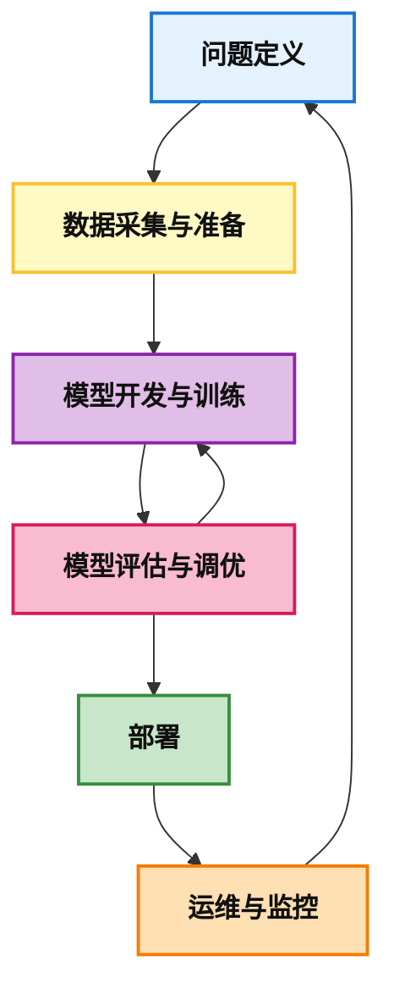
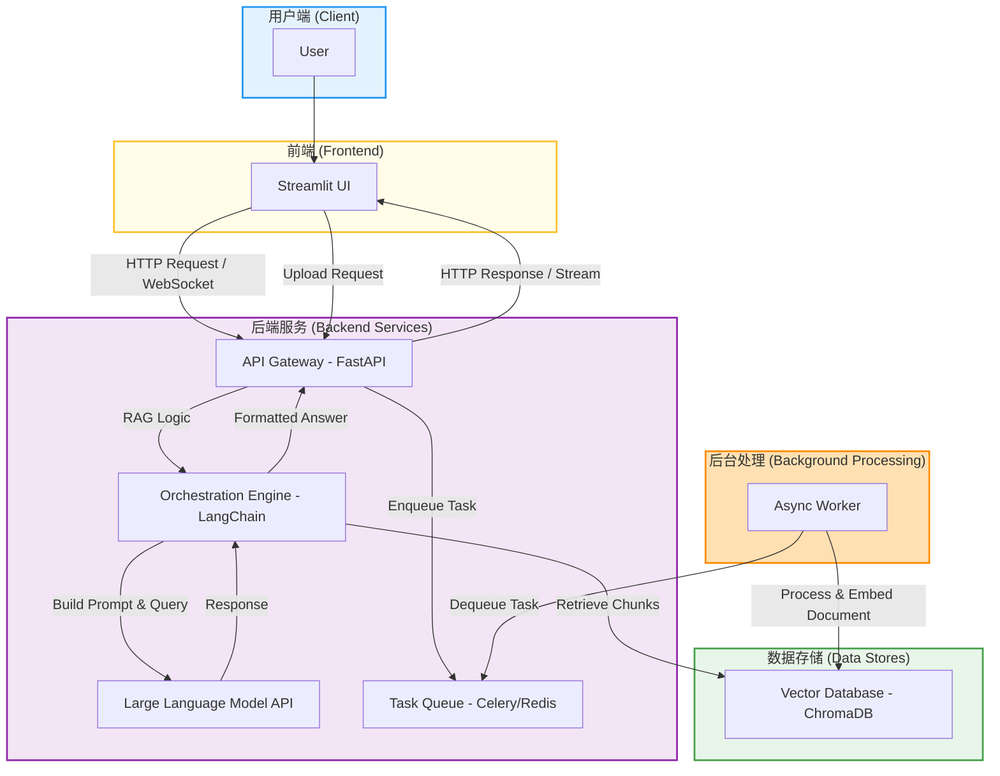
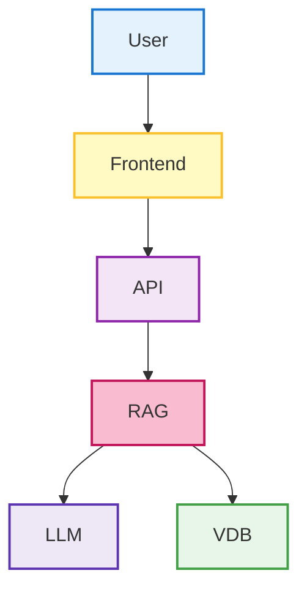
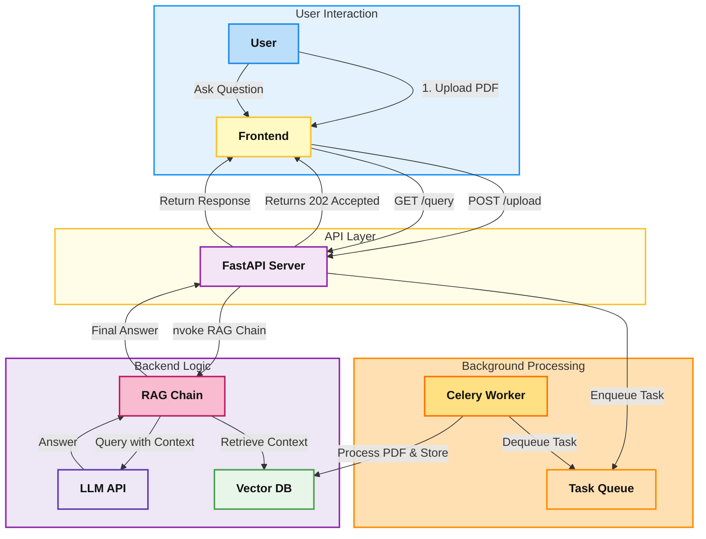
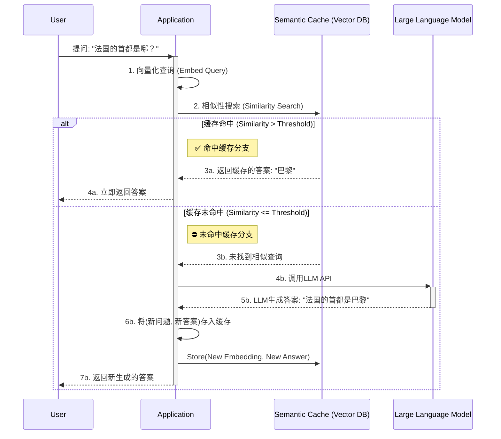
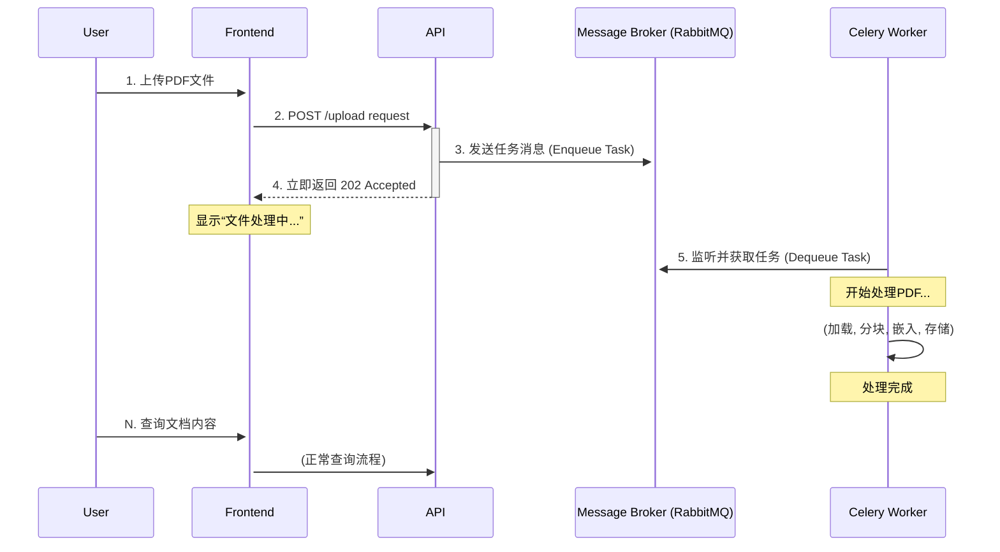
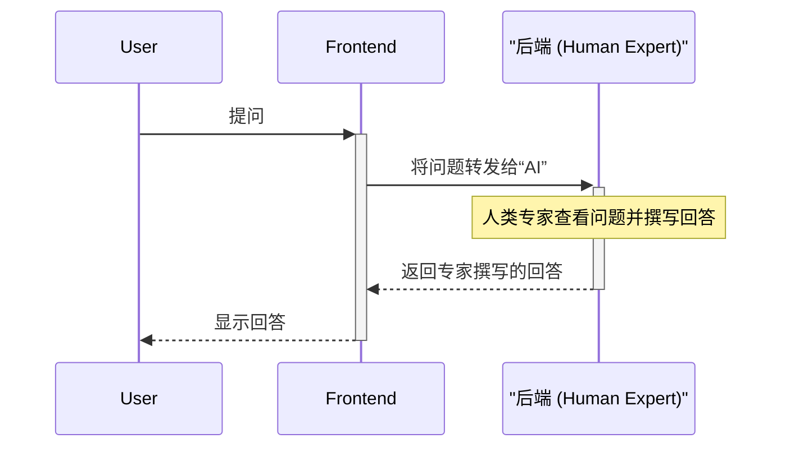
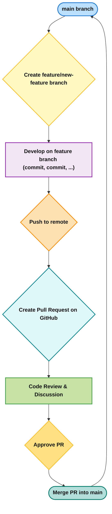
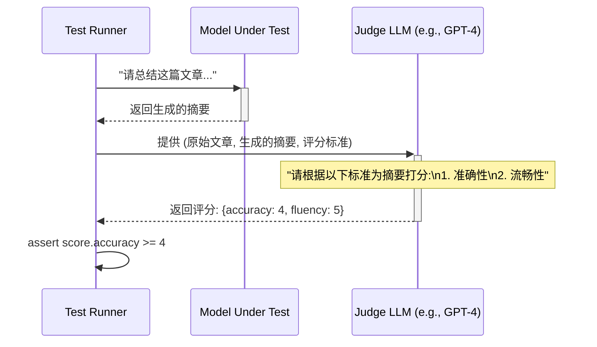

# 第九天 项目开发实战 —— 结课项目从构想到实现的冲刺

## 引言：从理论到实践的桥梁

欢迎来到《人工智能与大模型101》课程的第九天。在过去的八天里，我们共同探索了人工智能的宏伟历史，深入剖析了驱动大型语言模型的Transformer架构，学习了模型如何感知和生成多模态内容，并掌握了通过检索增强生成（RAG）、智能体（Agent）和模型微调（Fine-Tuning）等关键技术来扩展和优化模型能力的方法。我们已经积累了坚实的理论基础和对核心组件的理解。

今天的课程目标，是搭建一座从理论通往实践的坚固桥梁。我们将从理解独立的AI组件，转向将它们集成为一个完整、健壮且实用的软件产品。今天，我们将以一个为期一天的“开发冲刺”模式，模拟真实世界中的项目开发过程，完成我们的结课项目——一个功能完善的“与你的文档对话”AI应用。

这个结课项目的愿景，不仅仅是编写代码。它旨在全面检验各位同学在过去几天的学习成果，不仅考验技术实现能力，更考验作为未来技术领袖所必需的系统设计、项目管理和团队协作能力。我们将亲手体验一个AI应用从模糊的想法到清晰的需求，从宏观的架构设计到微观的代码实现，从保证功能正确到追求性能卓越的全过程。

在此过程中，我们必须深刻认识到一个核心观点：一个强大的AI模型，仅仅是成功AI产品的一个组成部分。真正的成功，根植于严谨的工程学科。一个缺乏良好架构、高效流程、性能优化和严格质量保证的AI模型，如同拥有强大引擎却没有车身、底盘和控制系统的赛车，无法在现实世界中行驶。因此，本章将重点探讨经典的软件工程原则如何为人工智能这个充满不确定性的新领域进行调整和适配，从而赋予我们的AI应用以生命力、稳定性和可扩展性。

准备好迎接挑战，让我们一起将知识转化为力量，将理论铸成产品。

## 9.1 项目设计与需求分析：用户场景与技术选型

在编写任何一行代码之前，专业的工程师会投入大量时间进行思考、规划和设计。这个阶段的决策将直接决定项目的成败。本节将指导我们如何从零开始构思一个AI项目，定义其目标，并为其选择最合适的“兵器”——技术栈。我们将特别关注AI项目在需求定义上与传统软件的根本区别。

### 1\. AI项目生命周期：从确定性到实验性的范式转移

要理解如何管理AI项目，首先必须认识到它与传统软件开发的生命周期存在本质差异。

#### 传统软件生命周期

传统软件开发，尤其是在瀑布模型（Waterfall Model）或V模型（V-Model）中，其核心特征是 **确定性** 和 **线性** 。项目开始于一个详尽的需求文档，这个文档精确定义了系统的所有功能。整个过程像一条单向流动的河，从需求分析流向系统设计，再到编码、测试、部署和维护，每个阶段都有明确的输入和输出。这种模式在需求稳定、技术成熟的领域（如建造一座桥梁）非常有效，因为其内在逻辑是：只要我们严格遵循蓝图，最终就能得到预期的、确定的结果。

#### AI项目生命周期

相比之下，AI项目的生命周期是 **实验性** 和 **数据驱动** 的。它并非一条直线，而是一个不断迭代的循环。一个典型的AI项目流程如下：



  - **问题定义 (Problem Definition):** 识别一个可以通过AI解决的业务问题。
  - **数据采集与准备 (Data Acquisition and Preparation):** 收集、清洗和标注用于模型训练和评估的数据。这是AI项目中最耗时且最关键的环节之一。
  - **模型开发与训练 (Model Development and Training):** 选择或设计模型架构，并使用准备好的数据进行训练。
  - **模型评估与调优 (Model Evaluation and Refinement):** 使用预留的测试数据评估模型性能，并根据结果进行迭代优化。
  - **部署 (Deployment):** 将训练好的模型集成到应用中，并部署到生产环境。
  - **运维与监控 (MLOps - Machine Learning Operations):** 持续监控模型在真实世界中的表现，收集新数据，并根据需要重新训练和部署模型，形成闭环。

#### 核心差异：不确定性的管理

两者最根本的区别在于如何处理 **不确定性** 。传统软件项目的核心风险在于“我们能否按时按质地构建出规格说明书中定义的功能？”。而AI项目的核心风险在于“我们选择的模型，利用我们拥有的数据，能否达到解决问题所需的性能水平？”。

AI项目的目标往往是“模糊的”（fuzzier objectives）。例如，一个需求可能是“提高用户推荐的准确率”，但“准确率”能提高多少，在项目初期是未知的。这需要大量的实验和探索才能确定。因此，AI项目的管理，本质上是对这种 **模型性能不确定性** 和 **研究探索过程** 的管理。我们必须从项目一开始就接受并拥抱这种不确定性，并将其纳入我们的规划之中。

### 2\. AI应用的需求工程：定义“好”的行为

由于AI项目的不确定性，其需求分析（即需求工程）也必须进化。我们不仅要定义系统“做什么”，更要定义它“做得怎么样”。

#### 超越传统功能需求

在传统软件中，需求主要分为功能性需求（系统应具备的功能）和非功能性需求（如性能、安全性）。例如：

  - **功能需求：** 系统应允许用户上传PDF文件。
  - **非功能需求：** 系统应在3秒内响应用户请求。

对于AI应用，这些仍然适用，但我们需要引入新的维度来描述“智能”本身。这些AI特有的需求类型包括：

  - **性能需求 (Performance):** 这里的性能不仅指响应时间，也指模型的处理能力。例如：聊天机器人响应的首个词元（token）延迟应低于1秒。RAG管道必须能处理最大50MB的文档。
  - **准确性/质量需求 (Accuracy/Quality):** 这是对模型输出质量的量化或定性描述。例如：聊天机器人回答的内容，必须有95%的概率在事实上与源文档保持一致。生成的摘要应能捕捉原文中的所有关键实体。
  - **伦理/安全需求 (Ethical/Safety):** 定义了模型的行为边界。例如：聊天机器人绝不能生成有害、带偏见或有毒的内容。

#### 从用户场景到AI用户故事

“用户故事”（User Story）是敏捷开发中描述需求的常用工具，它以用户为中心，简洁地表达了用户的目标。

**标准用户故事格式：**

> “作为一个 [用户角色], 我想要 [完成某个动作], 以便 [实现某个目标]”

让我们来看一个从传统用户故事到AI用户故事的演变：

  - **传统用户故事示例：** “作为一个 **学生** ，我想要 **上传我的课堂笔记** ，以便 **将它们保存在云端** 。”
    这个故事描述了一个简单的存储功能，其实现是确定性的。

  - **AI增强的用户故事示例：** “作为一个 **学生** ，我想要 **用自然语言对我上传的课堂笔记进行提问** ，以便 **快速找到关键概念而无需重读全文** 。”
    这个故事的核心在于“用自然语言提问”，这是一个智能行为，其实现是不确定性的。

#### AI用户故事的验收标准 (Acceptance Criteria)

范式转移最显著地体现在验收标准上。验收标准是用来判断一个用户故事是否“完成”的条件。对于AI用户故事，验收标准不能是脆弱的、基于精确匹配的断言，而必须是统计性的和定性的。

  - **糟糕的验收标准（过于脆弱）：** “当用户提问‘什么是牛顿第一定律？’时，机器人必须返回‘...’这段精确的文本。”
    这种标准是不可行的，因为大型语言模型具有非确定性，两次运行的措辞可能略有不同，但语义上是正确的。

  - **优秀的AI验收标准（健壮且可衡量）：**

      - **场景：** 答案明确存在于文本中。
          - **条件：** 当用户提出的问题，其答案在原文中有明确表述时。
          - **标准：** 模型生成的答案在事实上与原文保持一致。
      - **场景：** 处理范围外的问题。
          - **条件：** 当用户提出的问题，其内容与原文无关时。
          - **标准：** 模型应礼貌地告知用户无法回答，而不是编造答案（幻觉）。
      - **场景：** 关键术语的理解。
          - **条件：** 用户在问题中使用了特定的专业术语。
          - **标准：** 模型的回答应能正确识别并使用这些术语。
      - **场景：** 性能要求。
          - **条件：** 在任何有效提问下。
          - **标准：** 模型生成完整答案的总时间应在3秒以内。

#### 利用AI辅助需求分析

我们甚至可以利用AI技术来辅助需求分析过程。通过自然语言处理（NLP）工具，我们可以自动分析大量的非结构化文本，如用户反馈邮件、社交媒体评论、客户支持聊天记录等。这些工具可以：

  - **提取关键需求：** 自动识别用户频繁提到的功能请求或痛点。
  - **情感分析：** 分析用户对某一功能的正面或负面情绪，帮助确定需求的优先级。
  - **发现不一致性：** AI工具可以扫描需求文档，标记出模糊的语言、缺失的依赖关系或相互冲突的规格说明，从而提高需求的质量。

### 3\. 战略性技术选型：工程师的权衡艺术

选择技术栈是项目初期最关键的决策之一。对于数学系的同学来说，可以将这个过程理解为一个 **有约束的优化问题 (Constrained Optimization Problem)** 。我们的目标不是孤立地寻找“最好”的工具，而是要找到一组能够协同工作的工具组合，使得某个多变量目标函数（如性能、成本、开发速度）在满足一系列约束条件（如预算、团队技能、项目时间）下达到最优解。

这个过程充满了权衡（trade-offs）。例如，选择一个最强大的LLM（如GPT-4）可以获得最佳性能，但成本也最高；选择一个开源模型则成本较低，但可能需要投入更多精力进行微调和维护。选择一个高度可扩展的向量数据库（如Milvus）可以支持未来的海量数据，但其初始设置可能比一个轻量级的内存数据库（如Chroma）更复杂。这些决策是相互依赖的，它们共同定义了项目的技术DNA。

#### 如何选择大型语言模型（LLM）？

  - **性能 vs. 成本：** 这是最核心的权衡。闭源的商业模型（如OpenAI的GPT系列、Anthropic的Claude系列）通常在通用能力上表现最强，但按token计费，大规模使用成本高昂。开源模型（如Llama 3, Mistral）提供了更大的灵活性和控制权，可以在本地部署以降低长期成本，但可能需要在特定任务上进行微调才能达到同等性能。
  - **任务适配性：** 不同的模型在不同任务上表现各异。一些模型在逻辑推理上更强（如Gemini 1.5 Pro），一些在代码生成上更优（如Codex），还有一些则专注于特定语言或领域。需要根据项目核心任务的基准测试（benchmarks）来选择。
  - **上下文窗口大小：** 模型一次能处理的文本长度。对于需要理解长文档的RAG应用来说，这是一个至关重要的参数。上下文窗口越大，一次能提供给模型的背景信息就越多，可能得到更准确的答案。
  - **多模态能力：** 项目是否需要处理或生成文本以外的数据，如图像、音频？如果需要，就要选择支持多模态输入的模型。

#### 如何选择向量数据库（Vector Database）？

向量数据库是RAG应用的心脏。它专门用于存储高维向量（即文本的数学表示——嵌入），并能高效地执行“相似性搜索”，即找到与给定查询向量最接近的向量。

  - **托管 vs. 自部署：**
      - **托管服务 (Managed Service)**，如Pinecone： 提供开箱即用的服务，无需担心底层基础设施的维护和扩展，让团队可以专注于应用逻辑。但通常成本更高，数据控制权较少。
      - **开源自部署 (Open-Source, Self-Hosted)**，如Milvus, Qdrant, Chroma： 提供最大的灵活性和控制权，可以部署在任何地方。长期来看成本可能更低，但需要团队投入资源进行部署、维护和扩展。
  - **可扩展性 (Scalability)：** 应用未来可能需要处理多少向量？十万、一千万还是一百亿？不同的数据库在处理海量向量时的架构和性能表现差异巨大。Milvus和Pinecone等是为处理十亿级向量而设计的。
  - **性能 (Performance)：** 性能主要体现在查询延迟和吞吐量上。这很大程度上取决于其底层的近似最近邻（ANN）搜索算法，如HNSW（分层可选小世界图）或Faiss。一些基准测试工具可以帮助比较不同数据库在相同负载下的表现。
  - **混合检索与元数据过滤 (Hybrid Search & Metadata Filtering)：** 现代RAG不仅需要向量相似性搜索，还需要根据元数据进行过滤。例如，“查找与‘机器学习’相关的文档，但只看‘张三’在2023年后发表的”。强大的元数据过滤能力是选择向量数据库的一个关键考量因素。
  - **生态系统整合：** 一些传统的数据库，如MongoDB Atlas和Elasticsearch，也增加了向量搜索功能。如果你的项目已经在使用这些数据库，那么利用其现有生态系统可能会更方便。然而，专门的向量数据库通常在纯向量搜索任务上提供更优的性能和更丰富的功能。

为了帮助大家在结课项目中做出明智的决策，我们提供了以下技术选型框架作为参考。

**表 9.1.1: 结课项目技术栈选型框架**

| 组件 | 关键考量因素 | 推荐选项 | 推荐理由 |
| :--- | :--- | :--- | :--- |
| **大型语言模型 (LLM)** | 性能、成本、API易用性、速度 | Llama 3 (通过Groq API调用) | Groq提供了极高的推理速度，对学生项目免费且性能强大。Llama 3是顶级的开源模型，能力均衡。 |
| **向量数据库** | 易用性、本地运行、与LangChain集成度 | ChromaDB | 轻量级，可完全在本地运行，无需复杂配置。与LangChain无缝集成，非常适合快速原型开发和学习。 |
| **后端框架** | 异步支持、开发效率、学习曲线 | FastAPI | 原生支持异步，对LLM等I/O密集型任务至关重要。自动生成API文档，基于类型提示，代码简洁，对初学者友好。 |
| **前端框架** | 快速开发、无需Web开发经验、交互性 | Streamlit | 纯Python编写，能将脚本快速转换为交互式Web应用。让学生专注于AI逻辑而非前端细节。 |

### 4\. 小实验：编写一个AI用户故事

现在，让我们亲手实践一下。

**任务：** 假设我们要开发一个“AI烹饪助手”应用。请为这个应用编写一个详细的AI用户故事。

**要求：**

1.  遵循“作为...我想要...以便...”的格式。
2.  为这个用户故事编写至少3条健壮的、可测试的验收标准，要考虑到AI的非确定性。

**工具与提示：** 你可以向一个大型语言模型（如ChatGPT或Claude）求助，使用下面的提示词来激发灵感："请为一个帮助烹饪新手的AI烹饪助手应用，生成一个用户故事。这个故事应该关注用户在烹饪过程中可能遇到的不确定性。同时，请包含能够验证AI能否处理模糊指令并提供安全烹饪建议的验收标准。"

**示例输出：**

  - **用户故事：** 作为一个 **厨房新手** ，我想要 **在烹饪过程中随时向AI助手提问，比如“现在该怎么办？”或“这个看起来对吗？”** ，以便 **在我感到困惑时不至于搞砸整道菜，并能获得实时的、安全的指导** 。
  - **验收标准：**
    1.  **模糊指令处理：** 当用户输入模糊问题（例如“有点太干了怎么办？”）时，AI不应直接给出唯一答案，而应提出澄清性问题或提供多种可能的解决方案（例如“你可以尝试加入少量水、高汤还是牛奶？”）。
    2.  **安全性验证：** 当用户的操作可能涉及危险（例如处理生鸡肉后没有洗手就去拿蔬菜），AI应能根据对话上下文识别出潜在风险，并主动发出安全提醒。
    3.  **上下文记忆与连贯性：** AI必须记住当前正在制作的菜谱和已经完成的步骤。当用户在10分钟后提问“下一步呢？”时，AI应能给出正确的后续步骤，而不是从头开始。

### 5\. Q\&A

  - **问题：** 在一个AI项目中，定义“完成”（Definition of Done）的标准与传统软件项目有何不同？尤其是在输出具有概率性的情况下。

      - **解答思路：** 传统项目的“完成”通常意味着功能按规格书实现并通过所有确定性测试。AI项目的“完成”则是一个多维度的概念，它不仅包括功能的实现，更包括模型性能达到一个预先定义的、可接受的 **统计阈值** 。例如，“完成”可能意味着模型在评估集上的准确率达到90%，或者生成的摘要在95%的情况下被人类评估为“高质量”。“完成”不是一个二进制的开关，而是一个置信区间的达成。

  - **问题：** 设想一个用户故事，要求AI具有“创造性”，例如创作一句市场营销口号。你将如何定义和衡量这样一个主观任务的验收标准？

      - **解答思路：** 对于创造性任务，验收标准不能是客观的“对/错”。我们可以采用以下方法：
          - **人类偏好评估 (Human-in-the-loop):** 生成多条口号，由目标用户或领域专家进行打分或A/B测试，验收标准可以是“生成的口号在A/B测试中点击率不低于人类专家创作的口号”或“70%以上的口号被专家评为‘可接受’或‘优秀’”。
          - **启发式规则 (Heuristics):** 定义一些创造性输出应遵循的规则，如“口号长度应在5到10个词之间”、“必须包含品牌名称”、“不能包含负面词汇”。
          - **与参考集比较：** 将AI生成的口号与一个高质量的人类创作口号库进行比较，使用语义相似度等指标来评估其风格和质量是否接近。

  - **问题：** 在选择向量数据库时，像Pinecone这样的纯向量数据库和像MongoDB Atlas这样增加了向量搜索功能的多模态数据库之间有何权衡？你会在什么情况下选择前者或后者？

      - **解答思路：** 这是一个典型的“专业工具” vs “瑞士军刀”的权衡。
          - **选择纯向量数据库 (Pinecone, Milvus):** 当你的应用核心是 **大规模、高性能的向量搜索** 时。例如，你需要支持数十亿级别的向量索引，对查询延迟有极高要求，或者需要复杂的向量搜索算法（如带有精确元数据过滤的ANN）。这些场景下，专业工具的性能和功能深度通常更优。
          - **选择多模态数据库 (MongoDB Atlas, Elasticsearch):** 当你的应用需要将向量数据与大量的 **结构化或半结构化业务数据** 紧密结合时。例如，一个电商应用，你希望在同一个数据库中存储用户信息、订单历史和产品描述的向量嵌入。这样可以简化技术栈，减少数据同步的复杂性，在一个查询中同时利用传统索引和向量索引。如果向量搜索只是应用的一部分，而不是唯一核心，这种集成方案的便利性可能超过纯向量搜索的极致性能。

## 9.2 系统架构与组件设计：前后端分离与API规范

在明确了“做什么”（需求）之后，下一步是设计“如何做”（架构）。本节将为我们的AI应用绘制蓝图，将抽象的需求转化为具体的、可执行的系统设计。我们将学习如何将一个复杂的系统分解为模块化的组件，并定义它们之间清晰的通信规则。

### 1\. 现代可扩展LLM应用的解剖学

一个常见的初学者错误是构建一个“铁板一块”的单体应用（Monolithic Application），即将用户界面、业务逻辑和模型调用代码全部混杂在一起。这种应用在初期看似简单，但很快会变得难以维护、扩展和测试。现代软件工程，尤其是面向云和微服务的架构，强调 **模块化** 和 **解耦** 。

将系统分解为逻辑上独立、物理上分离的组件，能带来诸多好处。前端团队可以独立于后端迭代UI，后端团队可以专注于优化RAG管道。更重要的是，我们可以根据不同组件的资源需求进行 **差异化扩展** ：例如，模型推理服务是GPU密集型的，而Web服务是CPU密集型的，将它们分开部署，可以更经济高效地分配云资源。这种模块化思想，通过清晰的API（应用程序接口）合同来强制执行，是所有学生必须掌握的现代软件工程基石。

#### 核心组件（我们的蓝图）

一个典型的、可扩展的RAG应用架构包含以下核心组件：

  - **用户界面 (Frontend):**
      - **角色：** 用户与应用交互的入口。负责呈现信息、接收用户输入（文本、文件上传等）。
      - **技术：** 对于快速原型，可使用Streamlit或Gradio。对于生产级应用，通常使用React, Vue.js等现代Web框架。
  - **API网关 (Backend - API Gateway):**
      - **角色：** 应用的公共入口，所有前端请求都先经过这里。它负责处理如用户认证、请求路由、速率限制等横切关注点。
      - **技术：** 使用Web框架如FastAPI或Flask构建。
  - **编排引擎 (Orchestration Engine):**
      - **角色：** 后端的“大脑”。它负责实现核心业务逻辑，管理一个任务所需的多个步骤。例如，对于一个RAG查询，它会依次调用：文档检索器、提示词模板、LLM，最后格式化输出。
      - **技术：** 通常使用如LangChain或LlamaIndex这样的框架来简化和管理复杂的LLM工作流。
  - **推理服务器 (Inference Server):**
      - **角色：** 专门运行大型语言模型的服务。
      - **技术：** 可以是调用第三方API（如OpenAI, Anthropic），也可以是自部署的开源模型服务（如使用NVIDIA Triton Inference Server, vLLM）。将其独立出来，便于进行专门的GPU优化和扩展。
  - **数据存储 (Data Stores):**
      - **向量数据库 (Vector Database):** 存储文档嵌入，用于RAG的相似性搜索。如ChromaDB, Pinecone, Milvus。
      - **关系型/NoSQL数据库 (Relational/NoSQL DB):** 存储应用的其他数据，如用户信息、聊天历史、文档元数据等。如PostgreSQL, MongoDB。
      - **缓存 (Cache):** 存储常用请求的结果，以提高性能和降低成本。如Redis。

#### 使用Mermaid.js可视化架构

为了清晰地表达这个架构，我们可以使用“图表即代码”（Diagrams as Code）的工具，其中最流行的是Mermaid.js。Mermaid允许我们用简单的、类似Markdown的文本语法来定义图表，这使得架构图可以像代码一样被版本控制、审查和维护。

下面是一个使用Mermaid `graph TD` (Top-Down) 语法绘制的RAG应用全栈架构图示例：



这个图表直观地展示了数据流：用户通过Streamlit前端上传PDF并发起查询。请求到达FastAPI后端，由LangChain编排引擎处理。引擎从ChromaDB检索相关上下文，连同用户问题一起发送给LLM。对于耗时的文档处理任务，则通过Celery任务队列异步执行。

### 2\. 后端深度剖析：框架选择与API风格

后端的选择直接影响应用的性能和可维护性。

#### FastAPI vs. Flask: 异步的巨大优势

  - **Flask:** 一个成熟、灵活、极简的微框架。它的核心是基于WSGI（Web Server Gateway Interface）标准，这意味着它默认以 **同步** 方式处理请求。当一个请求进来，处理它的工作线程会被占用，直到该请求完全处理完毕才能服务下一个请求。这在处理耗时操作时会成为严重的性能瓶颈。
  - **FastAPI:** 一个为性能而生的现代Web框架。它基于ASGI（Asynchronous Server Gateway Interface）标准，并深度整合了Starlette（用于Web部分）和Pydantic（用于数据验证）。其最大的特点是原生支持Python的`async`和`await`语法。

#### 为什么异步（Async）对LLM应用至关重要？

对LLM的API调用是一个典型的 **I/O密集型 (I/O-Bound)** 操作。我们的服务器发送一个请求后，大部分时间都在“等待”远程服务器（如OpenAI）进行计算并返回结果。

  - 在\*\*同步（WSGI/Flask）\*\*的世界里，这个“等待”是阻塞的。处理该请求的进程/线程会完全卡住，无法做任何其他事情。如果同时有100个用户请求，服务器就需要100个进程/线程来处理，这会迅速耗尽服务器资源。
  - 在\*\*异步（ASGI/FastAPI）\*\*的世界里，这个“等待”是非阻塞的。当服务器发起LLM API调用后，它可以说“好的，这个任务在等待网络响应，我先去处理别的请求”，然后将控制权交还给事件循环（Event Loop）。当LLM的响应返回时，事件循环再唤醒之前的任务继续执行。通过这种方式，一个单一的异步进程可以高效地处理成百上千个并发连接，极大地提高了应用的吞吐量和响应能力。

对于需要频繁与外部API（如LLM、数据库）交互的AI应用来说，选择一个支持异步的框架（如FastAPI）几乎是必然之选。此外，FastAPI还提供了基于Python类型提示的自动数据验证和交互式API文档（Swagger UI），极大地提升了开发效率和项目质量。

#### 为“打字机效应”设计API：流式响应

用户与聊天机器人交互时，期望获得即时反馈。如果每次提问都要等待5-10秒才能看到完整的回答，用户体验会非常糟糕。**流式响应** （Streaming Response）——即模型生成一个词元（token）就立刻将其发送给前端——可以创造出一种引人入胜的“打字机”效果，让用户感觉交互是实时的。

然而，传统的REST API是基于“请求-响应”模式的，客户端发送一个请求，然后等待一个完整的响应，这不适用于流式传输。我们需要一种能够维持持久连接的通信协议。

  - **WebSockets:** 提供一个\*\*全双工（bi-directional）\*\*的通信通道，客户端和服务器可以随时互相发送消息。它非常强大，适用于实时聊天室、在线游戏等需要双向通信的场景。但对于LLM响应这种主要是服务器向客户端单向推送数据的场景来说，WebSockets显得有些“功能过剩”，实现也更复杂。
  - **Server-Sent Events (SSE):** 一种更简单的、\*\*单向（server-to-client）\*\*的通信协议，它构建于标准的HTTP之上。服务器可以随时向客户端推送事件（数据）。SSE非常适合用于流式传输LLM的响应。它的实现更简单，并且由于使用标准HTTP，通常更容易通过企业防火墙。在FastAPI中，可以通过返回一个 `StreamingResponse`对象并使用异步生成器（`async def`函数中使用`yield`）来轻松实现SSE。

### 3\. 前端深度剖析：AI应用的快速原型开发

前端的目标是为我们的AI模型提供一个可以交互的“脸面”。对于学习和原型开发阶段，我们追求的是开发速度和简洁性。

  - **Streamlit:** 专为数据科学家和AI工程师设计。它允许你用纯Python代码，通过简单的函数调用（如`st.title`, `st.slider`）来构建交互式Web应用。它将脚本从上到下执行，并智能地重新渲染变化的元素。非常适合制作数据仪表盘、内部工具和AI应用原型，因为它让开发者能专注于逻辑而非Web开发的繁文缛节（无需HTML, CSS, JavaScript知识）。
  - **Gradio:** 更加专注于 **机器学习模型演示** 。它与Hugging Face生态系统深度集成，可以非常方便地为模型创建一个可分享的Web UI。Gradio特别擅长处理多模态输入/输出，如图像上传、音频录制等。
  - **Dash (by Plotly):** 一个功能更强大、更灵活的框架，适用于构建生产级的、高度定制化的企业仪表盘。但它的学习曲线更陡峭，需要编写更多的模板代码，并对HTML和CSS有一定的了解。

#### 为学生项目推荐：Streamlit

对于本课程的结课项目，Streamlit是理想的选择。它的极致简洁性使同学们能将绝大部分精力投入到更有价值的后端AI逻辑上，而不是陷入复杂的前端开发细节中。

### 4\. 小实验：为系统绘制图表

**任务：** 我们已经提供了基础RAG架构的Mermaid代码。现在，请你对其进行修改，增加一个新组件：一个用于在后台处理文档上传的 **Celery任务队列** 。你需要在图表中正确地展示数据如何从API流向这个任务队列，并由一个独立的Worker进行处理。

**修改前的代码：**



**修改后的参考答案：**



### 5\. Q\&A

  - **问题：** 如果FastAPI是异步的，这是否意味着我所有的函数都必须用`async def`来定义？请解释I/O密集型任务（如API调用）和CPU密集型任务（如复杂的数学计算）的区别，以及FastAPI如何处理它们。

      - **解答思路：** 不，并非所有函数都需要是`async def`。FastAPI可以同时处理同步和异步函数。关键在于任务的类型：
          - **I/O密集型任务 (I/O-Bound):** 任务的大部分时间花在等待外部资源上，如等待网络响应、读写磁盘或数据库。CPU在此期间是空闲的。对于这类任务，使用`async def`是最高效的，因为它允许事件循环在等待期间去处理其他任务。
          - **CPU密集型任务 (CPU-Bound):** 任务的大部分时间花在CPU计算上，如矩阵乘法、图像处理、复杂的循环。CPU始终处于繁忙状态。如果在一个`async def`函数中直接执行一个耗时很长的CPU密集型任务，它会阻塞整个事件循环，使异步的优势荡然无存。
          - **FastAPI的处理方式：** 对于`async def`路由，它在事件循环中运行。对于普通的`def`路由，FastAPI非常智能，它会在一个独立的 **线程池** 中运行这个同步函数，从而避免阻塞主事件循环。因此，你可以安全地在FastAPI中使用同步函数来处理CPU密集型任务。

  - **问题：** 我们为前端选择了Streamlit。请列举生产级应用（例如一个面向公众的商业聊天机器人）中，你认为Streamlit可能难以实现的两个具体特性，而这些特性会促使你转向更传统的Web框架如React或Vue.js？

      - **解答思路：**
        1.  **高度定制化的用户界面和复杂的用户交互：** Streamlit的布局和组件是预设的，虽然可以进行一些定制，但要实现像素级精确的、符合特定品牌设计规范的复杂UI（例如，带有精美动画、自定义表单验证逻辑、拖放功能的界面）会非常困难或不可能。React等框架提供了完全的控制能力。
        2.  **复杂的状态管理和客户端逻辑：** Streamlit的执行模型是自上而下的脚本重运行，其状态管理（`st.session_state`）相对简单。对于需要复杂客户端状态管理（例如，离线支持、多页面间共享复杂状态、实时协作编辑）的应用，React配合Redux或Vue配合Vuex等状态管理库提供了更强大和结构化的解决方案。

  - **问题：** 我们的架构将推理服务器（Inference Server）分离出来。在云环境（如AWS, GCP）中，这种分离带来了哪些运营和成本上的好处？

      - **解答思路：**
        1.  **成本效益（差异化扩展）：** 这是最大的好处。Web服务器（API网关）通常是CPU密集型和内存敏感的，可以使用成本较低的通用计算实例。而推理服务器是GPU密集型的，需要昂贵的、带有GPU的实例。如果将它们部署在一起，你就必须为Web服务也支付昂贵的GPU实例费用，造成巨大浪费。分离部署允许我们为每个组件选择最优性价比的计算资源，并根据各自的负载独立扩展。例如，当查询量增加时，只扩展Web服务器实例；当需要更高推理吞吐量时，只增加GPU实例。
        2.  **运营优势（专业化和稳定性）：** 分离允许专门的团队或工具链来管理推理服务。例如，可以使用NVIDIA Triton等专为模型服务优化的工具，它提供了动态批处理（dynamic batching）、多模型服务、性能监控等高级功能。这提高了推理服务的性能和可靠性，同时将这种复杂性与核心业务逻辑（在API网关中）隔离开来，使得整个系统更易于管理和维护。

## 9.3 大模型应用性能优化：缓存策略与并发处理

构建一个能工作的AI应用原型是第一步，但这只是“第1天的问题”。真正的挑战在于“第2天的问题”：如何让应用变得 **快** 、 **便宜** 且 **可扩展** ，以应对真实世界的负载。本节将探讨性能优化的关键技术，从“它能用”迈向“它好用”。

### 1\. LLM性能栈：一个多层次的优化方法

应用性能不是由单一因素决定的，它是一个系统工程。优化工作必须在应用的技术栈的每一个层面进行，才能取得显著效果。

  - **模型层优化 (Model-Level Optimization):**
      - **目标：** 减小模型本身的计算量和内存占用。
      - **技术：**
          - **量化 (Quantization):** 这是最常用且有效的技术之一。它将模型权重的数据类型从高精度（如32位浮点数, FP32）降低到低精度（如16位浮点数, FP16，或8位整数, INT8）。这能显著减小模型在磁盘和内存中的大小，并加快计算速度，因为低精度计算更快。通常，这种操作对模型准确率的影响微乎其微。
          - **知识蒸馏 (Knowledge Distillation):** 这个过程像是一位“老师”教一位“学生”。我们用一个大型、复杂的“教师模型”的输出来训练一个更小、更简单的“学生模型”。目标是让学生模型学会模仿教师模型的行为，从而将大模型的“知识”提炼并压缩到一个更高效的小模型中。
          - **剪枝 (Pruning):** 识别并移除神经网络中不重要的连接（权重），从而使网络变得更稀疏、更小，推理速度更快。
  - **应用层优化 (Application-Level Optimization):**
      - **目标：** 通过改进应用逻辑来减少对模型的调用或使调用更高效。
      - **技术：**
          - **提示工程 (Prompt Engineering):** 更短、更精确的提示词意味着更少的输入token，这直接降低了API成本和处理时间。
          - **缓存 (Caching):** 智能地重用之前请求的结果，避免重复计算。这是本节的重点之一。
          - **检索增强生成 (RAG) 优化：** 改进文档分块和检索策略，确保提供给LLM的上下文最相关、最简洁。
  - **基础设施层优化 (Infrastructure-Level Optimization):**
      - **目标：** 最大化利用硬件资源，提高推理吞吐量。
      - **技术：**
          - **批处理 (Batching):** 将多个用户的请求打包成一个批次（batch），一次性送入GPU进行并行处理。这能极大地提高GPU的利用率和总吞吐量（每秒处理的请求数）。
          - **硬件加速与核函数优化 (Hardware Acceleration & Kernel Fusion):** 使用专为AI计算设计的硬件（如NVIDIA的GPU、Google的TPU）。同时，利用像FlashAttention这样的优化算法，或者NVIDIA TensorRT这样的工具，将多个计算操作融合成一个单一的CUDA核函数，从而减少内存访问开销，显著降低延迟。

### 2\. 智能缓存：超越简单的键值存储

缓存是计算机科学中最古老也最有效的性能优化手段之一。其基本思想是：对于昂贵的计算，如果输入相同，就直接返回之前保存的结果。然而，对于LLM应用，这个思想需要一次重要的升级。

#### 从传统缓存到语义缓存

  - **传统缓存：** 基于 **精确匹配** 。它使用一个键值存储（如Redis），将请求（键）和响应（值）存起来。下次只有当一个 **完全相同** 的请求到来时，才会命中缓存。例如，`cache.get("法国的首都是哪里？")`可以命中，但`cache.get("请告诉我法国的首都是哪个城市？")`就会缓存未命中（cache miss）。这种方式对于多变的自然语言输入，缓存命中率极低。
  - **语义缓存 (Semantic Caching):** 这是一种为AI时代量身定做的缓存策略。它不关心用户提问的 **字面形式** ，而关心其 **语义意图** 。这背后，正是我们在前面课程中学到的向量数学的绝妙应用。

#### 语义缓存的工作原理

这个过程对于已经理解RAG的同学来说会非常熟悉，因为它复用了完全相同的核心技术：



1.  **接收请求：** 用户提出一个问题，例如“请告诉我法国的首都是哪个城市？”。
2.  **向量化查询：** 应用不直接查询缓存，而是先用一个嵌入模型（Embedding Model）将这个问题转换成一个高维向量 *v\_query*。
3.  **相似性搜索：** 应用在一个专门的向量数据库（这个数据库就是我们的语义缓存）中进行相似性搜索，查找之前存储的、与 *v\_query* 在向量空间中足够接近（即余弦相似度高于某个阈值 θ）的查询向量。
4.  **缓存命中 (Cache Hit):** 如果找到了一个或多个相似的查询（例如，之前有人问过“法国的首都是哪里？”），系统就直接从缓存中取出与之对应的、预先存储好的答案，并立即返回给用户。 **这一步完全绕过了昂贵且缓慢的LLM API调用** 。
5.  **缓存未命中 (Cache Miss):** 如果在缓存中没有找到足够相似的查询，系统就将请求正常发送给LLM。
6.  **填充缓存：** 在从LLM获得答案后，系统会将新的问题向量 *v\_query* 和它对应的答案一起存入语义缓存中，以备未来的相似查询使用。

#### 语义缓存的巨大收益

  - **显著降低延迟：** 缓存命中通常在几十毫秒内完成，而一次LLM API调用可能需要数秒钟。这能极大地改善用户体验。
  - **大幅削减成本：** LLM API通常按token使用量收费。每一次缓存命中都意味着节省了一次API调用费用，这对于高流量应用来说，可以节省巨额的运营成本。
  - **提高响应一致性：** 对于常见问题，语义缓存可以确保用户总是得到一个经过验证的、高质量的、一致的答案，避免了模型非确定性带来的回答波动。

#### 实现考量

  - **相似度阈值 θ 的选择：** 这是一个关键的超参数。如果阈值设得太高（例如0.99），只有几乎完全相同的问题才能命中，缓存效果不佳。如果设得太低（例如0.7），可能会将一些意图不同的问题错误地匹配在一起，返回不相关的答案。这个值的选择需要通过实验和评估来确定。
  - **缓存淘汰与失效策略 (Cache Invalidation):** 缓存不是永久的。我们需要策略来决定何时更新或删除缓存条目。例如，如果一个文档被更新了，所有基于旧文档内容的缓存问答都应该被置为无效。

### 3\. 管理并发：使用异步任务队列

在我们的RAG应用中，存在一些耗时很长的操作，最典型的就是用户上传新文档后的处理过程。这个过程包括：加载PDF内容、将其分割成小块（chunks）、为每个小块生成嵌入向量，然后存入向量数据库。对于一个大文档，这可能需要几十秒甚至几分钟。

#### 问题：同步处理的弊端

如果我们在处理API请求的同一个进程中 **同步** 地执行这个任务，用户的浏览器将会一直处于等待状态，直到整个过程完成。这不仅会导致极差的用户体验，还很可能因为超出HTTP超时时间而导致请求失败。更糟糕的是，这个处理过程会长时间占用Web服务器的资源，使其无法响应其他用户的请求。

#### 解决方案：用任务队列解耦

解决方案是 **解耦** （decouple）快速的Web请求处理和慢速的后台任务处理。我们引入一个 **异步任务队列 (Asynchronous Task Queue)** 来实现这一点。

**核心组件：**

  - **消息代理 (Message Broker)**，如RabbitMQ, Redis： 它像一个邮局，负责接收和暂存“任务消息”。
  - **任务队列系统 (Task Queue System)**，如Celery： 它是一个Python库，定义了可以被异步执行的任务，并管理着一群“工人”（Worker）来处理这些任务。

**异步处理工作流：**



1.  **前端上传：** 用户通过Streamlit界面上传一个PDF文件。
2.  **API接收并派发任务：** FastAPI后端接收到文件。它 **不会** 立即处理这个文件，而是创建一个描述任务的消息，例如`process_pdf(file_path='path/to/temp/file.pdf')`。然后，它将这个消息发送到RabbitMQ的消息队列中。
3.  **立即响应：** 发送任务后，API端点立刻向前端返回一个`202 Accepted`响应，告诉用户：“你的文件已收到，正在后台处理中。” 此时，用户的浏览器可以立即得到反馈。
4.  **后台处理：** 在服务器的另一端，我们运行着一个或多个 **Celery Worker进程** 。这些Worker持续监听着RabbitMQ的队列。
5.  **任务执行：** 当队列中有新任务时，一个空闲的Worker会取走这个任务，并开始执行`process_pdf`函数中的实际逻辑（加载、分块、嵌入、存储）。这个过程完全独立于Web服务器，不会影响Web服务器响应其他用户的查询请求。

这种架构模式是构建可扩展、高响应性Web应用的基石。它将系统中的快慢路径分离开，确保了用户交互的流畅性。

### 4\. 小实验：量化缓存带来的收益

**任务：** 假设一个AI应用每天处理10,000次用户查询。

  - 每次调用LLM API的平均成本为 $0.002。
  - 每次调用的平均延迟为5秒。
  - 缓存系统的查询延迟可忽略不计。

**请计算：**

1.  在没有缓存的情况下，应用每天的总成本和用户的平均响应延迟是多少？
2.  实施语义缓存后，我们实现了40%的缓存命中率（Cache Hit Rate）。请重新计算新的每日总成本和用户的有效平均响应延迟。

**目标：** 通过具体的计算，让学生切身感受缓存对成本和性能的巨大影响。

**解答：**

1.  **无缓存：**

      - 每日成本 = 10,000 次查询 \* $0.002/查询 = **$20**。
      - 平均延迟 = **5 秒**。

2.  **有缓存（40%命中率）：**

      - 需要调用LLM的查询次数 = 10,000 \* (1 - 40%) = 6,000 次。
      - 新每日成本 = 6,000 次查询 \* $0.002/查询 = **$12**。
      - 成本节省 = $20 - $12 = $8 (节省了**40%**)。
      - 有效平均延迟 = (40% \* 0秒) + (60% \* 5秒) = 0 + 3 = **3秒**。
      - 延迟降低 = (5秒 - 3秒) / 5秒 = **40%**。

### 5\. Q\&A

  - **问题：** 语义缓存依赖于一个相似度阈值。你将如何设计一个自动化实验来为你的应用确定最佳的阈值？你需要追踪哪些指标？

      - **解答思路：** 我们可以设计一个A/B测试或多臂老虎机实验。
          - **实验设计：** 设定几组不同的阈值（例如，0.85, 0.90, 0.95）。将用户流量随机分配到这些组中。
          - **追踪指标：**
            1.  **缓存命中率：** 每个阈值下的命中率是多少。
            2.  **用户满意度/反馈：** 缓存返回的答案是否获得了用户的“点赞”或“点踩”。这是衡量返回答案质量的关键。
            3.  **“错误命中”率 (False Positive Rate):** 随机抽样缓存命中的问答对，由人工评估返回的答案是否确实回答了用户的问题。一个低的阈值可能会导致高命中率，但错误命中率也可能很高。
          - **目标：** 找到一个能在“高命中率”和“低错误命中率”之间取得最佳平衡的阈值点。

  - **问题：** 我们在架构中引入了Celery和RabbitMQ。这带来了哪些新的潜在故障模式？你将如何监控它们？

      - **解答思路：** 引入新组件会增加系统的复杂性和潜在故障点。
        1.  **消息代理故障 (RabbitMQ Down):** 如果RabbitMQ服务宕机，API将无法派发新任务，后台处理完全停止。 **监控方法：** 需要设置基础的服务健康检查，监控RabbitMQ进程是否在运行，端口是否可访问。使用Prometheus等工具监控其关键指标，如队列深度、内存使用等，并设置警报。
        2.  **Worker故障或任务积压 (Celery Worker Failure / Task Backlog):** 如果所有Celery Worker都因代码错误而崩溃，或者任务产生的速度远超Worker的处理能力，将导致任务在队列中大量积压，用户上传的文档永远得不到处理。 **监控方法：** 使用Celery的管理工具（如Flower）来监控Worker的状态、当前执行的任务以及任务队列的长度。设置警报，当队列长度超过某个阈值时通知运维人员，可能需要增加Worker数量。

  - **问题：** 量化技术会降低模型的精度。在哪些类型的AI应用中，这种精度损失可能是不可接受的权衡？

      - **解答思路：** 在大多数通用NLP任务（如聊天、摘要）中，量化带来的微小精度损失通常不影响最终结果的质量。但在以下场景中，这种权衡可能是不可接受的：
          - **科学计算与金融建模：** 在这些领域，模型可能需要进行高精度的数值计算和预测。浮点数的微小误差可能会被放大，导致最终结果出现显著偏差。
          - **医疗诊断：** 如果一个AI模型用于分析医学影像并辅助诊断，任何可能影响其识别细微病灶能力的精度下降都可能是致命的。
          - **法律与合规：** 在需要精确解释法律条文或合同细节的应用中，量化可能导致对关键术语的理解出现偏差，从而产生错误的法律意见。
      - 总而言之， **任何对 数值精度 或 细微特征识别 有极高要求的任务，都应谨慎使用量化，或在使用前进行严格的、针对该特定任务的精度评估。**

## 9.4 项目开发流程与最佳实践

拥有了出色的架构和优化策略后，我们还需要一个高效的流程来指导团队协作，确保项目能够有序、高质量地交付。本节将探讨如何将软件工程的最佳实践应用于AI项目的开发过程中，涵盖项目管理、版本控制和质量保证。

### 1\. AI项目的敏捷之道：管理研究与不确定性

敏捷（Agile）开发方法论，特别是Scrum，在过去二十年里席卷了软件行业。其核心思想是通过短周期的迭代（称为“冲刺”，Sprint）来持续交付有价值的软件。然而，将传统敏捷方法生搬硬套到AI项目中，往往会水土不服。

#### 敏捷用于AI：一个实验框架

传统Scrum的核心是 **可预测性** ：团队承诺在一个Sprint内完成一组确定的、可交付的功能。但在AI项目中，核心任务往往是 **研究和实验** ，其结果是不可预测的。你无法保证在两周的Sprint结束时，你的模型准确率一定能提升5%。

因此，用于AI的敏捷开发，其本质必须是一个 **管理学习和降低风险的实验框架** 。Sprint的目标不再是“构建功能X”，而可能是“验证假设Y”或“探索技术Z的可行性”。我们将Sprint视为一次科学实验，这对于有数学背景的同学来说是一个非常自然的概念。

#### 调整Scrum/Kanban以适应AI

  - **研究型任务 (Research Spikes):** 在敏捷计划中，明确地规划出一些“研究型任务”（Spikes）。这类任务的目标不是交付生产代码，而是获得知识。例如，一个Spike的产出可能是一份关于不同嵌入模型性能的对比报告，或是一个证明某个想法可行的Jupyter Notebook。这使得探索性工作变得可见且可管理。
  - **灵活的Sprint长度：** 模型训练、数据标注等任务可能耗时很长，严格的两周Sprint可能不适用。团队可能需要根据任务的性质（例如，一个Sprint专注于数据准备，下一个Sprint专注于模型训练）来调整Sprint的长度。
  - **数据驱动的需求待办列表 (Data-Driven Backlog):** 产品的Backlog不仅包含用户故事，还应包含一系列需要验证的 **假设** 。例如：“我们相信，将文档分块大小从1000减小到500，能够提高检索的相关性。” 每一个这样的假设都构成了一个可以执行和评估的实验。

#### 最小可行AI产品 (Minimum Viable AI - MVAI)

我们在9.1节中提到了这个概念，这里再次强调其在敏捷流程中的重要性。MVAI是用于验证核心AI假设的 **最小实验单元** 。它的目标是以最快的速度、最低的成本获取关于“这个AI想法是否可行”的真实反馈。

MVAI的形式可以多种多样：

  - 一个简单的脚本： 验证一个数据处理流程是否能跑通。
  - 一个Jupyter Notebook： 快速测试一个模型的初步性能。
  - “绿野仙踪”测试 (Wizard of Oz Test): 这是一种巧妙的测试方法。在构建昂贵的AI模型之前，让一个 **人类专家** 在幕后“扮演”AI的角色。例如，用户在一个聊天框里提问，问题被转发给一位专家，专家回答后，答案再显示给用户。用户以为在和AI交互，但实际上是和人。这种方法可以快速收集到真实的用户交互数据和需求，验证AI的价值主张，而无需编写任何复杂的AI代码。

<!-- end list -->



### 2\. 团队协作的版本控制：实用指南

当多名开发者共同开发一个项目时，如果没有一套清晰的代码管理规则，代码库很快就会陷入混乱。版本控制系统（如Git）是解决方案，而 **分支策略** 则是使用好这个工具的指导方针。

#### 特性分支工作流 (Feature Branch Workflow)

核心思想： 所有新功能的开发都应该在一个 **专用的、隔离的分支** 上进行，而不是直接在主分支（通常是`main`）上提交代码。例如，要添加缓存功能，就创建一个名为 `feature/add-caching`的分支。

**工作流程：**



1.  从`main`分支创建一个新的特性分支。
2.  在新分支上进行开发，提交你的代码变更。
3.  将特性分支推送到远程仓库（如GitHub）。
4.  在GitHub上创建一个 **拉取请求 (Pull Request, PR)** ，请求将你的特性分支合并回`main`分支。
5.  团队其他成员在PR中对你的代码进行 **审查 (Code Review)** ，提出修改意见。
6.  你根据反馈修改代码，直至PR被批准。
7.  将PR合并到`main`分支。

**优点：** 这个工作流极大地保证了`main`分支的稳定性（因为它只包含经过审查的代码），并通过PR机制促进了团队间的协作和代码质量的提升。它足够简单，同时功能强大，非常适合大多数项目。

#### Gitflow工作流

  - **核心思想：** 这是一个更重量级、更结构化的工作流，它定义了多个长期存在的分支。
  - `main`分支：只存放生产环境的、正式发布的版本。每个提交都应打上版本号标签（如v1.0.1）。
  - `develop`分支：所有开发工作的整合分支。特性分支从这里创建，并合并回来。
  - `feature/*`分支：用于开发新功能，与特性分支工作流中的概念相同。
  - `release/*`分支：当`develop`分支准备好发布一个新版本时，会创建一个发布分支。在此分支上只进行bug修复和文档编写等发布前准备工作。完成后，它会同时合并到`main`和`develop`分支。
  - `hotfix/*`分支：当生产环境的`main`分支上出现紧急bug时，从`main`分支创建热修复分支。修复后，同时合并回`main`和`develop`。

**优点：** 对于有严格版本发布周期、需要同时维护多个线上版本的大型项目来说，Gitflow提供了非常清晰和强大的管理模式。
**缺点：** 对于没有正式发布周期的小团队或项目，Gitflow的复杂性是多余的，它会引入不必要的流程开销，减慢开发速度。

#### 为学生项目推荐：特性分支工作流

对于我们的结课项目， **特性分支工作流是明确的最佳选择** 。它提供了协作所需的所有核心工具（分支隔离、代码审查），同时避免了Gitflow的复杂性，完美契合学生项目的快速、实验性特点。

**表 9.4.1: Git工作流对比**

| 标准 | Gitflow 工作流 | 特性分支工作流 (Feature Branch Workflow) |
| :--- | :--- | :--- |
| **复杂度** | 高 | 低 |
| **分支模型** | "两个长期分支 (main, develop) + 三种支持分支 (feature, release, hotfix)" | 一个长期分支 (main) + 短期特性分支 |
| **适用场景** | 有计划发布周期、需要版本管理的大型项目 | 几乎所有类型的项目，特别是持续集成和持续交付的项目 |
| **发布管理** | 通过release分支进行严格的、计划性的发布 | 更灵活，main分支的任何提交都可以被认为是可发布的 |
| **对学生项目的适用性** | 不推荐。 过于复杂，流程开销大。 | **强烈推荐。** 简单、高效，易于学习和实践。 |

### 3\. 非确定性系统的质量保证

测试AI应用是整个开发流程中最具挑战性的环节之一。其核心挑战在于，AI模型的输出是 **非确定性的（non-deterministic）** 。即使输入完全相同，两次运行的输出也可能不同（但可能同样有效）。这意味着，传统的、基于精确匹配的断言，如`assert output == expected_output`，在这里完全失效了。

**表 9.4.2: 测试范式对比：传统软件 vs. AI系统**

| 方面 | 传统软件 | AI 系统 |
| :--- | :--- | :--- |
| **输出性质** | 确定性 (Deterministic) | 非确定性 (Non-deterministic) / 概率性 |
| **测试目标** | 验证 **正确性** (Verify Correctness) | 验证 **行为** (Validate Behavior) |
| **主要方法** | 精确匹配断言 (Exact Match Assertion) | 启发式 / 属性 / 容忍度验证 |
| **断言示例** | `assert add(2, 3) == 5` | `assert is_positive(sentiment(text)) == True` |

我们必须采用新的测试策略来应对这一挑战。

#### 现代AI测试策略

  - **基于容忍度的验证 (Tolerance-Based Validation):**
      - **思想：** 不检查精确值，而是检查输出是否落在可接受的 **范围** 内。
      - **示例：** 对于一个情感分析模型，其输出是一个0到1之间的分数。测试断言可以是 `assert response.sentiment_score >= 0.7`，而不是 `assert response.sentiment_score == 0.853`。
  - **属性测试 / 不变性检查 (Property Testing / Invariant Checking):**
      - **思想：** 定义一些无论具体输出是什么，都应该 **永远为真** 的系统属性或不变量。这是测试非确定性系统最强大的思想之一。
      - **示例：**
          - 对于摘要功能：`assert len(summarize(long_text)) < len(long_text)` (摘要必须比原文短)。
          - 对于翻译功能：`assert detect_language(translate_to_french(english_text)) == 'french'` (翻译成法语的结果，其语言应该是法语)。
          - 对于内容安全：`assert contains_harmful_content(response) == False` (响应中不应包含有害内容)。
  - **结构验证 (Structural Validation):**
      - **思想：** 当AI生成复杂的结构化数据（如JSON）时，我们验证其 **结构** 的正确性，而非具体值的正确性。
      - **示例：** 假设AI应返回一个包含"name"和"age"键的JSON对象。测试可以断言这些键存在，并且"name"的值是字符串，"age"的值是整数，而不关心具体姓名和年龄是什么。
  - **启发式与基于LLM的评估 (Heuristic & LLM-based Evaluation):**
      - **思想：** 使用其他指标或模型来评估输出质量。
      - **启发式指标：** 对于机器翻译或摘要任务，可以使用BLEU、ROUGE等分数来衡量生成文本与参考文本的重叠程度。对于语义理解，可以使用 **余弦相似度** 来衡量生成答案的嵌入向量与理想答案的嵌入向量之间的距离。
      - **LLM即评委 (LLM-as-a-Judge):** 这是一种新兴且强大的技术。我们使用一个能力更强、更可靠的LLM（如GPT-4）作为“评委”，来评估一个待测模型的输出。我们可以给评委LLM一个评分标准（例如，从1-5分评估回答的“事实准确性”、“相关性”和“流畅性”），然后让它对输出进行打分。

<!-- end list -->



  - **事实准确性与一致性验证 (Factual Accuracy & Consistency):**
      - **思想：** 对于RAG应用，最重要的测试是验证生成的答案是否 **忠实于** 其引用的上下文。
      - **实现：** 这通常需要自定义的评估逻辑。一种方法是，将生成的答案和检索到的上下文一起再次传递给一个强大的LLM（作为评委），并提问：“请判断以下‘答案’是否完全由‘上下文’支持，回答‘是’或‘否’。” 通过统计“是”的比例，我们可以量化模型的幻觉率。

### 4\. 小实验：编写一个属性测试

**任务：** 假设你有一个简单的Python函数`def summarize(text: str) -> str:`，它在内部调用一个LLM来生成文本摘要。请使用pytest框架为这个函数编写一个简单的测试用例，该用例断言一个关键的属性。

**目标：** 让学生亲手编写一个非精确匹配的测试，理解属性测试的基本思想。

**示例代码 (test\_summarizer.py):**

```python
import pytest

# 假设这是我们要测试的函数，它内部调用LLM
def summarize(text: str) -> str:
    #... LLM call logic...
    # 为了演示，我们用一个简单的实现
    if len(text) > 20:
        return text[:15] + "..."
    return text

def test_summary_is_shorter_than_original():
    """
    属性测试：任何非空文本的摘要长度都应小于或等于原文长度。
    这是一个在大多数情况下都应成立的不变量。
    """
    long_text = "This is a very long text that we want to summarize to test our function."
    summary = summarize(long_text)
    assert len(summary) <= len(long_text)

def test_summary_of_empty_string_is_empty():
    """
    边界条件测试：空字符串的摘要应该也是空字符串。
    """
    assert summarize("") == ""
```

### 5\. Q\&A

  - **问题：** 在一个AI敏捷Sprint中，团队发现他们选择的模型无法达到预期的准确率目标。接下来的步骤是什么？团队在下一个Sprint中的焦点应该如何转移？

      - **解答思路：** 这是一个典型且重要的场景。
          - **接下来的步骤：** 首先是 **分析失败原因** 。是数据质量问题？是提示词不够好？还是模型本身能力不足？团队需要进行一次深入的\*\*回顾会议（Retrospective）\*\*来诊断问题。
          - **焦点转移：** 下一个Sprint的焦点将从“提升模型性能”转向 **根本原因分析和对策验证** 。Backlog中可能会出现新的研究型任务（Spikes），例如：
              - “Spike: 评估一个新的数据集对模型性能的影响。”
              - “Spike: 尝试三种不同的提示词工程技术，并比较结果。”
              - “Spike: 在我们的数据集上微调一个更小的开源模型，看是否能超过当前模型的表现。”
          - 敏捷的精髓在于快速响应变化。失败的实验不是项目失败，而是宝贵的学习机会，它指导了团队下一步的正确方向。

  - **问题：** 在特性分支工作流中，拉取请求（Pull Request）的目的是什么？在批准队友的代码之前，审查者应该关注哪三件事？

      - **解答思路：**
          - **PR的目的：** PR是特性分支工作流的核心协作机制。它的主要目的有三个：1) **通知** 团队你已经完成了一项工作并准备好将其集成到主线中；2) 提供一个平台进行 **代码审查** ，以保证代码质量；3) 在合并前自动运行\*\*持续集成（CI）\*\*检查（如自动化测试），确保新代码不会破坏现有功能。
          - **审查者应关注的三件事：**
            1.  **代码是否解决了问题？(Correctness):** 代码是否完整地、正确地实现了用户故事的需求？逻辑上是否有明显的漏洞？
            2.  **代码是否可维护？(Maintainability):** 代码是否清晰、易于理解？是否遵循了团队的编码规范？变量和函数命名是否合理？是否有必要的注释？复杂的逻辑是否可以被简化？
            3.  **代码是否经过测试？(Testability):** 是否为新功能编写了相应的单元测试或属性测试？测试是否覆盖了主要的成功路径和已知的边界情况？

  - **问题：** 你将如何构建一个测试用例来检查“提示词敏感性”（Prompt Sensitivity）？即确保对提示词进行微小的、语义上无关的更改（例如，增加一个逗号、改变一个同义词）不会导致模型输出发生剧烈变化。

      - **解答思路：** 这是一个高级的鲁棒性（Robustness）测试。
          - **方法：** 我们可以采用一种\*\*元扰动（meta-perturbation）\*\*的方法。
            1.  **定义一个基础提示词 (Base Prompt)**。
            2.  **生成扰动版本 (Perturbed Versions):** 自动或手动地生成该提示词的多个微小变体，例如：
                  - 增加/删除标点。
                  - 将单词替换为其同义词（“巨大” -\> “庞大”）。
                  - 改变句式结构但保持意思不变。
                  - 增加一些无关的填充词。
            3.  **执行并比较输出：** 对基础提示词和所有扰动版本的提示词，分别调用LLM并获取输出。
            4.  **断言相似性：** 使用 **语义相似度** （如计算嵌入向量的余弦相似度）来比较各个输出。测试的断言将是：所有扰动版本产生的输出，其与基础版本输出的语义相似度都应高于一个很高的阈值（例如 \> 0.95）。如果某个扰动导致输出的语义发生了巨大变化，则说明模型对提示词过于敏感，测试失败。

## 9.5 动手实验：小组协作开发AI应用原型

理论学习的最终目的是为了实践。本节是今天的核心，我们将把前面讨论的所有概念——架构设计、技术选型、开发流程——付诸行动。你们将以小组为单位，从零开始，协作构建一个功能完整的“与你的PDF对话”的全栈AI应用。本实验指南将提供详尽的、一步步的指导，确保只有基础Python能力的同学也能顺利完成。

### 1\. 项目简介与环境设置

**目标：** 构建一个全栈的检索增强生成（RAG）应用。用户可以上传PDF文档，然后通过聊天界面就文档内容进行提问，AI将基于文档内容进行回答。

**技术栈：**

  - **后端：** FastAPI
  - **前端：** Streamlit
  - **编排/核心逻辑：** LangChain
  - **向量存储：** ChromaDB
  - **LLM：** OpenAI API 或 Groq API (推荐使用Groq以获得更快的速度)

**最终项目结构：**

```
capstone_project/
├── backend/
│   ├── chatbot.py         # 核心RAG逻辑
│   ├── api.py             # FastAPI服务器
│   └── requirements.txt   # 后端依赖
├── frontend/
│   ├── app.py             # Streamlit应用
│   └── requirements.txt   # 前端依赖
├── .env                   # 环境变量 (API密钥)
├── .gitignore             # Git忽略文件
└── README.md              # 项目说明
```

我们将项目分为`backend`和`frontend`两个目录，这体现了前后端分离的架构思想。

**环境设置：**

1.  **创建项目目录：**
    ```bash
    mkdir capstone_project
    cd capstone_project
    mkdir backend frontend
    ```
2.  **设置Python虚拟环境 (推荐在项目根目录进行):**
    ```bash
    python -m venv venv
    source venv/bin/activate  # on Windows: venv\Scripts\activate
    ```
3.  **创建依赖文件：**
      - 在 `backend/requirements.txt` 中添加：
        ```
        fastapi
        uvicorn[standard]
        pydantic
        python-dotenv
        langchain
        langchain-openai  # 或 langchain-groq
        chromadb
        pypdf
        tiktoken
        ```
      - 在 `frontend/requirements.txt` 中添加：
        ```
        streamlit
        requests
        ```
4.  **安装依赖：**
    ```bash
    pip install -r backend/requirements.txt
    pip install -r frontend/requirements.txt
    ```
5.  **设置环境变量：** 在项目根目录创建 `.env` 文件，并填入你的API密钥。
    ```
    # .env
    OPENAI_API_KEY="sk-..."
    # 或者
    # GROQ_API_KEY="gsk_..."
    ```
6.  **创建.gitignore文件：** 告诉Git忽略不必要的文件。
    ```
    # .gitignore
    venv/
    __pycache__/
    *.pyc
    .env
    /backend/chroma_db/ # 忽略本地向量数据库文件
    ```

### 2\. 后端开发 (FastAPI)

我们首先构建应用的“引擎”——后端服务。

#### 2.1 核心逻辑 (backend/chatbot.py)

这个文件将封装所有与RAG相关的复杂逻辑，使其与API层分离。

```python
# backend/chatbot.py
import os
from dotenv import load_dotenv
from langchain_community.document_loaders import PyPDFLoader
from langchain_openai import OpenAIEmbeddings, ChatOpenAI
# from langchain_groq import ChatGroq  # 如果使用Groq
from langchain_text_splitters import RecursiveCharacterTextSplitter
from langchain_community.vectorstores import Chroma
from langchain.chains import create_retrieval_chain
from langchain.chains.combine_documents import create_stuff_documents_chain
from langchain_core.prompts import ChatPromptTemplate
from langchain_core.documents import Document

# 加载环境变量
load_dotenv("../.env")

# --- 全局变量和初始化 ---
# 建议将路径和模型名称作为可配置参数，这里为简化而硬编码
VECTOR_STORE_PATH = "./chroma_db"
# LLM_MODEL = "llama3-8b-8192"  # Groq
LLM_MODEL = "gpt-3.5-turbo" # OpenAI

# 初始化LLM和嵌入模型
# llm = ChatGroq(model=LLM_MODEL, temperature=0)
llm = ChatOpenAI(model=LLM_MODEL, temperature=0)
embeddings = OpenAIEmbeddings()

# 初始化文本分割器
text_splitter = RecursiveCharacterTextSplitter(chunk_size=1000, chunk_overlap=200)

# 初始化向量数据库
vector_store = Chroma(
    persist_directory=VECTOR_STORE_PATH,
    embedding_function=embeddings
)

# 定义提示模板
PROMPT_TEMPLATE = """Answer the user's question based only on the following context:

<context>
{context}
</context>

Question: {input}
"""
prompt = ChatPromptTemplate.from_template(PROMPT_TEMPLATE)

# --- 核心函数 ---
def process_and_store_documents(file_path: str):
    """加载、分割并存储PDF文档"""
    loader = PyPDFLoader(file_path)
    documents = loader.load()

    splits = text_splitter.split_documents(documents)
    vector_store.add_documents(documents=splits)
    print(f"Document '{file_path}' processed and stored.")

def get_retrieval_chain():
    """创建并返回一个检索链"""
    retriever = vector_store.as_retriever()

    # 该链用于将问题和检索到的文档组合成一个提示
    document_chain = create_stuff_documents_chain(llm, prompt)

    # 该链接受问题，获取相关文档，然后将它们传递给document_chain
    return create_retrieval_chain(retriever, document_chain)

def answer_query(query: str) -> str:
    """根据存储的文档回答查询"""
    retrieval_chain = get_retrieval_chain()
    response = retrieval_chain.invoke({"input": query})
    return response["answer"]
```

**代码解释：**

  - 我们首先加载环境变量并初始化所有需要的组件：LLM、嵌入模型、文本分割器和ChromaDB向量数据库。`persist_directory`参数让ChromaDB将数据保存在本地磁盘上，这样数据就不会在程序重启后丢失。
  - `process_and_store_documents`函数负责RAG的\*\*索引（Indexing）\*\*部分：加载PDF，将其分割成小块，然后使用嵌入模型将这些小块转换成向量并存入ChromaDB。
  - `get_retrieval_chain`和`answer_query`函数负责\*\*检索和生成（Retrieval and Generation）\*\*部分。我们使用LangChain Expression Language (LCEL) 的高级API `create_retrieval_chain` 来构建RAG链。这个链会自动处理：1) 接收用户问题 `input` -\> 2) 调用retriever从向量数据库获取相关文档 -\> 3) 将问题和文档填入prompt -\> 4) 调用llm生成答案 -\> 5) 返回包含答案的字典。

#### 2.2 API服务器 (backend/api.py)

这个文件负责接收HTTP请求，并调用`chatbot.py`中的核心逻辑。

```python
# backend/api.py
import os
import shutil
from fastapi import FastAPI, UploadFile, File, HTTPException
from pydantic import BaseModel
from typing import List

# 导入核心逻辑
from chatbot import process_and_store_documents, answer_query

app = FastAPI(
    title="RAG Chatbot API",
    description="API for a Retrieval-Augmented Generation chatbot.",
    version="1.0.0"
)

# --- Pydantic 模型定义 ---
class QueryRequest(BaseModel):
    query: str

class QueryResponse(BaseModel):
    answer: str

# --- 临时文件存储目录 ---
TEMP_DIR = "./temp_files"
os.makedirs(TEMP_DIR, exist_ok=True)

# --- API 端点 ---
@app.post("/upload/", summary="Upload a PDF document")
async def upload_document(file: UploadFile = File(...)):
    """
    接收一个PDF文件，保存到临时位置，然后处理并存入向量数据库。
    """
    if file.content_type != "application/pdf":
        raise HTTPException(status_code=400, detail="Only PDF files are allowed.")

    temp_file_path = os.path.join(TEMP_DIR, file.filename)

    try:
        # 将上传的文件保存到临时文件
        with open(temp_file_path, "wb") as buffer:
            shutil.copyfileobj(file.file, buffer)

        # 处理并存储文档（这是一个同步的阻塞操作）
        # 在真实应用中，这里应该使用后台任务队列 (Celery)
        process_and_store_documents(temp_file_path)

        return {"status": "success", "filename": file.filename}
    except Exception as e:
        raise HTTPException(status_code=500, detail=f"An error occurred: {str(e)}")
    finally:
        # 清理临时文件
        if os.path.exists(temp_file_path):
            os.remove(temp_file_path)

@app.post("/query/", response_model=QueryResponse, summary="Ask a question")
def query_chatbot(request: QueryRequest):
    """
    接收一个问题，并从聊天机器人获取答案。
    """
    try:
        answer = answer_query(request.query)
        return QueryResponse(answer=answer)
    except Exception as e:
        raise HTTPException(status_code=500, detail=f"An error occurred: {str(e)}")
```

**代码解释：**

  - 我们定义了两个API端点：`/upload/`用于上传文件，`/query/`用于提问。
  - 使用了Pydantic模型来定义请求和响应的数据结构，这使得FastAPI可以自动进行数据验证和生成API文档。
  - `/upload/`端点接收一个`UploadFile`对象，将其保存为临时文件，然后调用`process_and_store_documents`。 **注意：** 如代码注释中所述，这是一个阻塞操作。在生产环境中，这里是使用Celery等任务队列的最佳位置。
  - `/query/`端点接收一个包含问题的JSON，调用`answer_query`，然后返回答案。
  - 我们添加了基本的错误处理，使用`HTTPException`返回标准的HTTP错误码和信息。

### 3\. 前端开发 (Streamlit)

现在我们来构建用户与之交互的界面。

#### 3.1 用户界面 (frontend/app.py)

```python
# frontend/app.py
import streamlit as st
import requests
import os

# --- 配置 ---
API_BASE_URL = "http://127.0.0.1:8000" # FastAPI服务器的地址

# --- Streamlit 页面设置 ---
st.set_page_config(page_title="DocBot", page_icon="🤖", layout="wide")
st.title("🤖 DocBot: 与你的文档对话")

# --- 会话状态初始化 ---
if "messages" not in st.session_state:
    st.session_state.messages = []

# --- 侧边栏用于文件上传 ---
with st.sidebar:
    st.header("上传文档")
    uploaded_file = st.file_uploader("选择一个PDF文件", type="pdf")

    if uploaded_file:
        with st.spinner("正在上传和处理文件..."):
            files = {"file": (uploaded_file.name, uploaded_file.getvalue(), "application/pdf")}
            try:
                response = requests.post(f"{API_BASE_URL}/upload/", files=files)
                if response.status_code == 200:
                    st.success("文件处理成功！")
                else:
                    st.error(f"上传失败: {response.text}")
            except requests.exceptions.RequestException as e:
                st.error(f"无法连接到后端服务: {e}")

# --- 主聊天界面 ---
# 显示历史消息
for message in st.session_state.messages:
    with st.chat_message(message["role"]):
        st.markdown(message["content"])

# 接收用户输入
if prompt := st.chat_input("请就上传的文档提问..."):
    # 将用户消息添加到历史记录并显示
    st.session_state.messages.append({"role": "user", "content": prompt})
    with st.chat_message("user"):
        st.markdown(prompt)

    # 获取机器人回答
    with st.chat_message("assistant"):
        message_placeholder = st.empty()
        with st.spinner("思考中..."):
            try:
                response = requests.post(f"{API_BASE_URL}/query/", json={"query": prompt})
                if response.status_code == 200:
                    answer = response.json()["answer"]
                    message_placeholder.markdown(answer)
                    # 将机器人回答添加到历史记录
                    st.session_state.messages.append({"role": "assistant", "content": answer})
                else:
                    error_message = f"请求失败: {response.text}"
                    message_placeholder.error(error_message)
                    st.session_state.messages.append({"role": "assistant", "content": error_message})
            except requests.exceptions.RequestException as e:
                error_message = f"无法连接到后端服务: {e}"
                message_placeholder.error(error_message)
                st.session_state.messages.append({"role": "assistant", "content": error_message})
```

**代码解释：**

  - 我们使用`st.sidebar`创建了一个侧边栏用于文件上传，这让主界面保持整洁。
  - `st.file_uploader`是Streamlit提供的文件上传组件。
  - 当文件被上传时，我们使用`requests`库向FastAPI的`/upload/`端点发送一个POST请求。
  - 聊天历史记录存储在`st.session_state.messages`中。`st.session_state`是Streamlit提供的用于在用户交互之间保持变量状态的机制。
  - `st.chat_input`和`st.chat_message`是Streamlit专门用于构建聊天界面的组件，非常方便。
  - 当用户输入问题时，我们同样使用`requests`库向后端的`/query/`端点发送请求，并等待回答。

### 4\. 运行与协作 (Git)

#### 4.1 运行应用

1.  **启动后端服务器：** 打开一个终端，进入`backend`目录，然后运行：

    ```bash
    # 确保你的虚拟环境已激活
    cd backend
    uvicorn api:app --reload
    ```

    `--reload`参数会使服务器在代码更改时自动重启，便于开发。

2.  **启动前端应用：** 打开另一个终端，进入`frontend`目录，然后运行：

    ```bash
    # 确保你的虚拟环境已激活
    cd frontend
    streamlit run app.py
    ```

    你的浏览器应该会自动打开Streamlit应用的页面。现在，你就可以上传PDF并开始提问了！

#### 4.2 团队协作的Git工作流

现在，你们将以小组为单位，使用我们推荐的 **特性分支工作流** 来协作完成这个项目。

1.  **初始化仓库 (由一位组员完成):**
      - 在项目根目录 (`capstone_project/`) 初始化Git：`git init`
      - 在GitHub上创建一个新的空仓库。
      - 将本地仓库与远程仓库关联：`git remote add origin <your-repo-url>`
      - 将初始文件提交并推送到`main`分支：
        ```bash
        git add .
        git commit -m "Initial project structure"
        git branch -M main
        git push -u origin main
        ```
2.  **克隆仓库 (其他组员完成):**
    ```bash
    git clone <your-repo-url>
    ```
3.  **协作开发一个新特性 (例如，为API添加日志记录功能):**
      - **创建并切换到新分支 (由负责该任务的组员完成):**
        ```bash
        # 确保你在最新的main分支上
        git checkout main
        git pull origin main
        # 创建新分支
        git checkout -b feature/add-logging
        ```
      - **进行开发：** 在`api.py`中添加`logging`配置和日志记录语句。
      - **提交更改：**
        ```bash
        git add backend/api.py
        git commit -m "feat: Add logging to API endpoints"
        ```
        (注意：使用有意义的提交信息，如`feat:`表示新功能，`fix:`表示修复bug)
      - **推送分支到远程：**
        ```bash
        git push origin feature/add-logging
        ```
      - **创建Pull Request (PR):** 在GitHub上，你会看到一个提示，可以为`feature/add-logging`分支创建一个PR。点击创建，写上清晰的标题和描述，并指定一位或多位队友作为审查者。
      - **代码审查与合并：** 审查者在GitHub上查看代码，提出评论。开发者根据评论进行修改并再次推送。当所有人都满意后，PR被批准并合并到`main`分支。
4.  **保持同步：** 所有组员应定期从远程拉取最新的`main`分支，以避免冲突：`git checkout main && git pull origin main`。

### 5\. 提交与评估

  - **交付物：** 每个小组提交其GitHub仓库的链接。
  - **评估标准：**
      - **功能完整性：** 应用是否能成功上传PDF、处理并基于其内容回答问题？
      - **代码质量：** 代码是否遵循了前后端分离的原则？是否清晰、有注释、结构良好？
      - **协作流程：** Git提交历史是否清晰？是否能看到所有成员通过不同的特性分支和PR进行贡献的记录？提交信息是否规范？
      - **架构理解：** 在最终的项目展示中，小组是否能清晰地解释他们所构建的系统架构、各组件的角色以及他们做出的技术决策？

这个实验将是你们将理论知识付诸实践的绝佳机会。祝你们好运，期待看到你们的精彩作品！
