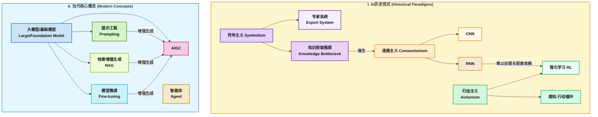

# 人工智能与大模型综合知识体系：从基本范式到自主智能体

-----

## 第一部分 现代人工智能的知识谱系：从逻辑到学习

本部分旨在建立人工智能历史的核心叙事，将其描绘为一个辩证的演进过程，而非简单的年代表。在此过程中，前一个范式的局限性直接激发了下一个范式的诞生，共同铺就了通往今日技术格局的道路。

### 1.1 符号时代：作为形式推理的智能

符号主义（Symbolism），亦被称为“老式人工智能”（Good Old-Fashioned AI, GOFAI），是人工智能领域的第一个主导范式。其核心信念在于，智能的本质可以通过对符号进行形式化规则操作来复现，类似于一盘精密的国际象棋。这一思想试图将人类的知识，尤其是专家的知识，编码成一套明确无误的符号和逻辑规则。

该范式的标志性产物是专家系统（Expert System）。一个典型的专家系统由三部分构成：一个存储领域事实和规则的“知识库”，一个根据规则进行逻辑推导的“推理机”，以及一个与用户交互的“用户界面”。例如，早期的医疗诊断系统MYCIN能够根据患者的症状和检验结果，运用其内置的数百条医学规则来推断可能的病原体并推荐治疗方案。在金融、化学等高度结构化的狭窄领域，专家系统展现了其强大的能力，证明了机器在特定任务上模拟人类专家推理的可行性。

然而，符号主义的辉煌背后潜藏着深刻的、难以克服的瓶颈。其中最核心的便是“知识获取瓶颈”（Knowledge Acquisition Bottleneck）。将人类专家的知识——尤其是那些内隐的、直觉性的、基于常识的知识——转化为精确的IF-THEN规则，是一项极其困难且耗时的工作。人类专家往往“知其然，而不知其所以然”，他们的许多判断是经验的产物，无法清晰地进行形式化表述。此外，“框架问题”（Frame Problem）也困扰着符号主义系统，即如何有效表示在一个行动发生后，世界中哪些事物没有发生改变。

因此，符号主义的衰落并非一次彻底的失败，而是一次至关重要的“诊断”。它深刻地揭示了智能远不止是显性的逻辑推理，它更深层次地依赖于海量隐性的、通过经验习得的背景知识。符号主义试图直接建模人类思维的输出（逻辑结论），却无法复制其过程（从经验中学习）。这一根本性的局限，恰恰为下一个范式的崛起——连接主义——精确地定义了其需要解决的核心问题：系统如何能够从数据中学习规则，而不是被动地接受人类的编程？

### 1.2 连接主义革命：源自数据的智能

连接主义（Connectionism）的兴起，标志着人工智能研究重心的根本性转移。与符号主义相反，连接主义认为智能并非源于顶层的逻辑规则，而是从大量简单的、相互连接的计算单元（即人工神经元）的集体交互中“涌现”出来的。其核心思想是将学习过程建模为优化网络中连接权重（weights）的过程，通过接触大量数据，网络能够自动发现数据中蕴含的复杂模式。

这一范式的早期代表是简单的感知机（Perceptron），其灵感直接来源于生物神经元。然而，直到“深度学习”（Deep Learning）的出现，连接主义才真正爆发出其革命性的力量。深度学习通过构建深层次（多层）的神经网络，实现了对数据从低级到高级特征的层级化抽象表示。

  * **卷积神经网络（CNN）**：CNN是深度学习在视觉领域的奠基之作。通过模拟生物视觉皮层的处理机制，CNN引入了两个关键操作：卷积（Convolution）和池化（Pooling）。卷积层使用可学习的滤波器（或称卷积核）在输入图像上滑动，以检测局部特征，如边缘、角点和纹理。不同层级的卷积核能够识别出越来越复杂的特征，从简单的线条到物体的部件，再到完整的物体。池化层则对特征图进行下采样，减少计算量的同时，赋予模型一定程度的平移不变性。这种分层提取空间特征的架构，使得CNN在图像识别、目标检测等任务上取得了前所未有的成功。
  * **循环神经网络（RNN）**：为处理序列数据（如文本、语音）而生，RNN通过其内部的循环结构引入了“记忆”的概念。在处理序列中的每一个元素时，RNN不仅接收当前的输入，还会接收来自上一个时间步的隐藏状态，从而理论上能够捕捉序列中的时间依赖关系。然而，标准的RNN在实践中面临着严峻的“梯度消失”与“梯度爆炸”问题。当序列过长时，梯度在反向传播过程中会指数级衰减或增长，导致网络难以学习到长距离的依赖关系。为了解决这一难题，研究者们设计了更复杂的循环单元，如长短期记忆网络（LSTM）和门控循环单元（GRU）。这些架构通过引入精密的“门控机制”（如输入门、遗忘门、输出门），让网络能够有选择地更新、保留和输出信息，从而极大地增强了其捕捉长期依赖的能力。

连接主义内部的演进同样遵循着“由局限驱动创新”的逻辑。简单RNN在处理长文本时的无力，并非一个小小的技术缺陷，而是阻碍机器真正理解语言的根本性障碍。这一障碍催生了LSTM和GRU的诞生。然而，即使是LSTM，其固有的顺序处理模式（即必须逐词处理文本）也使其在并行计算方面效率低下，并依然在处理超长距离依赖时力不存心。这个最终的瓶颈，为第三部分将要介绍的、作为现代大模型基石的Transformer架构的出现，埋下了最深刻的伏笔。

### 1.3 具身心智：通过交互的智能

在符号主义和连接主义之外，存在着第三种重要的思想范式——行动主义（Actionism），或称具身人工智能（Embodied AI）。该范式主张，真正的智能无法在与世界隔离的“数字真空”中存在，它必须通过一个智能体（Agent）与环境的持续交互中产生和发展。

行动主义的核心是“感知-行动循环”（Perception-Action Loop）。智能体通过其传感器感知（Perceive）环境的状态，基于其内部模型进行决策，然后通过其执行器采取行动（Act）来改变环境，并观察行动带来的结果，如此循环往复。智能正是在这个闭环的、动态的交互过程中形成的。

这一哲学为强化学习（Reinforcement Learning, RL）提供了概念基础。在RL框架中，智能体通过试错来学习。它在环境中执行动作，并根据动作的结果接收到奖励（Reward）或惩罚（Penalty）信号。智能体的目标是学习一个最优策略（Policy）——即一个从环境状态到动作的映射——以最大化其长期累积奖励。

在当代AI的语境下，\*\*智能体（Agent）\*\*的概念正是行动主义思想的现代化体现。它不再仅仅是一个被动的预测模型，而是一个能够设定目标、感知环境、规划步骤并采取行动以实现目标的自主系统。这标志着AI从“能说会道”的语言模型，向“能做会干”的行动实体的关键演进。

**表1：人工智能三大基础范式对比分析**

| 特征维度 | 符号主义 (Symbolism) | 连接主义 (Connectionism) | 行动主义 (Actionism) |
| :--- | :--- | :--- | :--- |
| **核心哲学** | 智能即逻辑推理与符号操作 | 智能从大规模简单单元的连接中涌现 | 智能产生于与环境的交互循环 |
| **关键技术** | 专家系统、逻辑编程、知识图谱 | "深度神经网络 (CNN, RNN, Transformer)" | 强化学习、自主智能体、机器人学 |
| **主要数据类型** | 结构化的事实与规则 | 大规模、非结构化的数据 (文本、图像) | 来自环境的实时、动态的交互数据流 |
| **优势** | 在明确规则的封闭领域表现精确、可解释性强 | 强大的模式识别与泛化能力，能处理复杂数据 | 能够学习最优决策策略，适应动态变化的环境 |
| **根本局限** | 知识获取瓶颈、常识缺失、泛化能力弱 | “黑箱”问题、需要海量标注数据、易受对抗攻击 | 样本效率低（需要大量试错）、奖励函数设计困难 |
| **现代体现** | 语义网、规则引擎、部分知识图谱技术 | 所有现代深度学习模型（如GPT系列、Stable Diffusion） | 自主智能体（如AutoGPT）、机器人控制、游戏AI |

-----

## 第二部分 现代AI词典：解构大模型的语言

从历史的宏大叙事转向当下，本部分将系统性地定义构成当前人工智能景观的核心术语。每一个概念都将不仅被解释其定义，更将被置于其在整个生态系统中所扮演的角色中进行剖析。

### 2.1 大模型与AIGC

大模型（Large Model）是连接主义范式在当前阶段的巅峰成就。其定义并不仅仅在于“大”，而是三大支柱的交汇：海量的训练数据（通常是TB乃至PB级别的互联网文本和图像）、巨大的模型参数量（从数十亿到万亿级别），以及高效的Transformer架构。当一个大模型经过在通用、广泛数据上的预训练后，它便具备了解决多种不同任务的通用能力，因此也被称为基础模型（Foundation Model）。它们如同一个“操作系统”，可以作为各种下游应用的起点。

大模型的一个显著特征是其“涌现能力”（Emergent Abilities）。这些能力，例如上下文学习（In-context Learning）、链式思考（Chain-of-Thought Reasoning）以及复杂指令遵循，在小规模模型中并不存在，而是在模型参数量和数据量跨越某个阈值后“自发”出现的，这使得大模型展现出远超其组成部分之和的智能水平。

\*\*AIGC（人工智能生成内容，AI-Generated Content）\*\*则是大模型强大生成能力最直观、最引人注目的体现。它泛指利用AI技术生成各种形式内容的实践，涵盖了文本（如文章、代码、诗歌）、图像（如插画、照片）、音频（如音乐、播客）和视频等。AIGC不仅是技术的展示，更是一种全新的生产力工具，正在深刻地改变内容创作、娱乐、设计等多个行业。

### 2.2 从业者工具箱：提示工程、RAG与微调

面对一个已经预训练好的强大基础模型，从业者有三种主要的技术路径来引导、增强和定制其能力。

  * **提示工程（Prompt Engineering）**：这是一种在不改变模型任何参数的前提下，通过精心设计输入文本（即“提示”，Prompt）来引导和控制大模型输出的艺术和科学。它相当于用自然语言对模型进行“编程”。技术范围从简单的“零样本提示”（Zero-shot Prompting，直接提出问题）和“少样本提示”（Few-shot Prompting，在问题前提供几个示例），发展到更高级的策略，如“链式思考提示”（Chain-of-Thought Prompting），即引导模型在回答前先“思考”并写出推理步骤，从而显著提高其在复杂逻辑问题上的准确性。提示的结构、措辞和示例的质量，对输出结果有着决定性的影响。
  * **检索增强生成（RAG, Retrieval-Augmented Generation）**：这是一个融合了信息检索与文本生成的技术框架，旨在解决大模型固有的两大缺陷：知识截止（其知识停留在训练数据截止的日期）和事实幻觉（Hallucination，即编造看似合理但不符合事实的信息）。RAG的工作流程分为两步：1)  **检索（Retrieve）**：当接收到用户查询时，系统首先使用该查询在一个外部的、可实时更新的知识库（如企业内部文档、数据库、或通过向量数据库索引的知识）中检索出最相关的信息片段。2)  **增强与生成（Augment & Generate）**：系统将检索到的信息片段与原始查询一同作为上下文，打包成一个新的、更丰富的提示，然后送入大模型。模型在生成答案时，被明确引导要依据所提供的上下文，从而生成一个既利用了自身通用语言能力，又 grounded in 外部事实的、更准确、更可信的答案。
  * **模型微调（Fine-tuning, FT）**：这是对模型进行“内部改造”的过程。它指的是在一个已经预训练好的基础模型之上，使用一个规模相对较小但高度相关的领域特定数据集，对其进行进一步的训练。通过这个过程，模型的权重会被更新，从而将特定领域的知识和技能“注入”模型内部，使其从一个“通才”转变为一个“领域专家”。例如，可以用法律文书微调一个通用大模型，使其更擅长理解和生成法律文件。与全量微调（更新所有参数，成本高昂）相比，参数高效微调（PEFT）技术如LoRA（Low-Rank Adaptation）等，通过只训练模型中一小部分新增的参数，能够在显著降低计算成本和时间的同时，达到接近全量微调的效果，并有效降低“灾难性遗忘”（即模型在学习新知识时忘记原有通用能力）的风险。

### 2.3 下一个前沿：自主智能体

\*\*自主智能体（Agent）\*\*的概念将前述所有技术和历史范式进行了终极的综合，代表了AI从被动工具向主动行动者的演进。一个智能体被定义为一个能够自主实现复杂目标的系统。其核心架构通常包括：

  * **大脑（Brain）**：通常由一个强大的大语言模型（LLM）担任，负责核心的推理、规划和决策。
  * **规划模块（Planning Module）**：负责将一个宏大的、模糊的目标分解成一系列具体的、可执行的子任务。
  * **记忆（Memory）**：包括用于存储当前任务上下文的短期记忆，以及用于长期存储经验和知识的长期记忆机制。
  * **工具使用（Tool Use）**：智能体能够调用外部工具（如搜索引擎、计算器、代码解释器、API接口）来获取信息或执行操作，从而突破LLM自身能力的边界。

智能体的出现，可以看作是人工智能三大历史范式的伟大融合。其核心的“大脑”（LLM）是 **连接主义** 的巅峰产物，通过从海量数据中学习获得了强大的模式识别和推理能力。其执行任务时调用的API或函数，本质上是 **符号主义** 的现代应用——这些工具具有精确的语法、确定的输入输出，是高度结构化和规则化的。智能体根据其连接主义大脑的“判断”，来决定使用哪一个符号化的工具以及如何使用。而整个智能体存在的根本目的——感知环境、规划行动、与世界交互以达成目标——则是 **行动主义** 哲学的最纯粹的技术实现。因此，智能体并非仅仅是行动主义的产物，它是一个以连接主义为核心，智能地运用符号主义工具，来实现行动主义目标的混合系统。这一视角为理解整个课程的知识体系提供了一个深刻而统一的框架。

-----

## 第三部分 解构引擎：大模型的技术架构

大模型所展现的惊人能力，源于其背后一套精密且层次分明的技术架构。本部分将深入这套架构的内部，从构成模型骨架的基础设计，到实现其表达、感知和行动能力的具体技术，逐层揭开其工作原理的神秘面纱。

### 3.1 基础架构：Transformer及其学习范式

现代大模型的基石是Transformer架构及其关联的“预训练-微调”学习范式。这二者的结合，共同构成了驱动当前AI浪潮的底层引擎。

**Transformer架构**：于2017年在论文《Attention Is All You Need》中被提出，Transformer的诞生彻底改变了序列处理任务的格局。其核心创新在于 **自注意力机制（Self-Attention Mechanism）**。与RNN必须按顺序处理数据不同，自注意力机制允许模型在处理序列中的每一个词元（token）时，能够同时直接地“关注”到序列中所有其他词元，并计算它们对于理解当前词元的重要性权重。这个过程可以分解为几个步骤：

1.  对于输入序列中的每个词元，模型学习生成三个不同的向量：**查询向量（Query, Q）**、**键向量（Key, K）和值向量（Value, V）**。
2.  为了计算某个词元（例如A）的表示，模型会用A的查询向量QA​去和序列中所有词元（包括A自身）的键向量Ki​进行点积运算。这个点积得分反映了其他词元i对于理解A的“相关性”或“注意力”。
3.  将所有这些得分通过一个Softmax函数进行归一化，得到一组权重的和为1。
4.  最后，将这些权重分别乘以对应词元的值向量Vi​，并将结果加权求和，就得到了该词元A在当前上下文中的新表示。

通过这种方式，模型能够动态地构建出每个词元与句子中其他所有词元之间的复杂关系图谱，从而完美地解决了RNN难以处理的长距离依赖问题。由于该过程不依赖于序列顺序，因此可以进行大规模并行计算，极大地提升了训练效率。然而，由于自注意力本身是位置无关的，Transformer需要引入 **位置编码（Positional Encoding）**，即为每个输入词元添加一个表示其在序列中绝对或相对位置的向量，从而将语序信息注入模型。

**预训练-微调范式**：这是现代AI取得成功的“秘方”。\*\*预训练（Pre-training）\*\*阶段，模型在包含数万亿词元的通用语料库（如整个互联网的公开文本）上，执行一个自监督学习任务（如“掩码语言模型”或“下一个词元预测”）。这个过程不依赖人工标注，模型通过预测文本中被遮盖的词或接下来的词，被迫学习到关于语言的深层知识，包括语法、语义、事实知识乃至一定的推理能力，形成了一个通用的“世界模型”。\*\*微调（Fine-tuning）\*\*阶段，这个已经具备通用知识的预训练模型，会在一个规模小得多的、针对特定任务的标注数据集上进行二次训练，从而将通用能力“适配”到特定应用上，实现知识的专业化。

### 3.2 生成技术：创造的机制

模型的“表达”能力，即生成新内容的能力，是其最引人注目的功能之一。这背后依赖于成熟的生成技术。

**语言生成**：本质上，自回归（Autoregressive）语言模型的生成过程是一个基于概率的、逐词元预测的过程。给定一个初始的提示或前文，模型会计算出词汇表中所有词元作为下一个词元的概率分布。然后，通过一个\*\*解码策略（Decoding Strategy）\*\*来选择下一个词元。

  * **贪婪搜索（Greedy Search）**：最简单直接的策略，每一步都选择概率最高的那个词元。这种方法速度快，但容易生成重复、平淡且缺乏逻辑的文本。
  * **束搜索（Beam Search）**：在每一步保留k个（k为束宽）概率最高的候选序列，并在下一步从这k个序列出发继续扩展。它通过探索更广的搜索空间，通常能生成比贪婪搜索更连贯、质量更高的文本。
  * **采样方法（如核采样，Nucleus Sampling）**：为了增加生成文本的多样性和创造性，采样方法引入了随机性。核采样（也称Top-p采样）会从概率最高的词元集合（其累积概率超过一个阈值p）中进行随机抽样。这使得模型既能保持文本的合理性（不会选择概率极低的词），又能产生意想不到的、更像人类的表达。

**图像生成**：图像生成技术经历了从生成对抗网络（GAN）到\*\*扩散模型（Diffusion Models）\*\*的重大演进。扩散模型的工作流程极具启发性：它包含一个“前向过程”和一个“反向过程”。在前向过程中，一张清晰的图像被逐步、迭代地加入高斯噪声，直到最终变成完全的纯噪声。模型学习的任务，是逆转这个过程。在生成阶段（反向过程），模型从一个随机噪声图像开始，在文本提示（或其他条件）的引导下，逐步、迭代地进行“去噪”，在每一步预测并移除噪声，直到最终还原出一张清晰、高质量且符合提示描述的全新图像。这种从混沌到有序的生成方式，使得扩散模型在生成图像的质量、多样性和可控性上都达到了前所未有的高度。

### 3.3 理解技术：感知的基石

模型的“感知”能力，即从非结构化数据中提取意义和知识的能力，是其智能的基础。

  * **计算机视觉（CV）的演进**：传统CV领域由CNN主导，其通过局部卷积操作和层级堆叠来构建对图像的理解。而\*\*视觉Transformer（ViT）\*\*则将Transformer架构成功地应用于视觉任务。ViT将一张图像分割成一个固定大小的图像块（patches）序列，将这些图像块线性嵌入后，加上位置编码，然后送入一个标准的Transformer编码器。通过自注意力机制，ViT能够捕捉图像中任意两个图像块之间的全局依赖关系，从而在许多图像分类基准测试中取得了超越CNN的性能。
  * **视觉语言模型（Vision-Language Models）**：这类模型旨在打通视觉和语言两大模态之间的语义鸿沟。以\*\*CLIP（Contrastive Language-Image Pre-training）\*\*为代表的模型，通过在数亿个（图像，文本描述）对上进行对比学习来训练。其目标是在一个共享的嵌入空间（embedding space）中，使得一张图像的向量表示与其对应文本描述的向量表示尽可能地接近，而与其他不相关文本的向量表示尽可能地远离。训练完成后，这个共享的语义空间就成为了一个强大的“翻译器”，能够理解“一张狗的照片”这段文字和一张狗的图片在语义上是等价的。这一能力是实现跨模态检索、零样本图像分类和指导文本到图像生成的关键。
  * **作为理解技术的RAG**：在此技术架构的视角下，RAG可以被视为一种高级的、动态的“理解”技术。它赋予模型一种能力，即在需要时“阅读”和“理解”外部知识文档，并将其内容实时地整合到自身的推理和生成过程中，从而动态地扩展其知识边界。

### 3.4 智能体架构：自主行动的框架

通往更高级通用人工智能的路径，目前看来正由智能体技术引领。其架构围绕自主性、规划和执行三大要素构建。

**ReAct框架**：由“思考-行动-观察”（Reason-Act-Observe）构成的 **ReAct框架**，为智能体提供了一个清晰、可解释的行动循环。面对一个任务，智能体的行动轨迹如下：

1.  **思考（Reason）**：LLM分析当前目标和已有信息，进行推理，并决定下一步需要采取的具体行动（例如，“我需要查询今天的天气，我应该使用weather\_api这个工具”）。
2.  **行动（Act）**：系统执行LLM决定的行动，例如，调用API weather\_api(city='北京')。
3.  **观察（Observe）**：系统接收行动的结果（例如，API返回“晴，25摄氏度”），并将这个新的观察结果作为信息，反馈给LLM，进入下一个循环的“思考”阶段。

这个循环不断重复，直到任务完成。ReAct框架使得智能体的决策过程变得透明，并且能够根据环境的实时反馈动态地调整其计划。

**工具使用与多智能体系统**：通过函数调用（Function Calling）或API集成，智能体能够使用外部工具，极大地扩展了其能力范围。而\*\*多智能体协作（Multi-Agent Systems）\*\*则代表了更高层次的组织形式，通过让多个拥有不同专长（如规划、研究、编码、审查）的智能体进行分工与合作，来共同解决单一智能体难以应对的宏大、复杂的挑战，展现出群体智能的巨大潜力。

在构建智能体的过程中，一个核心的工程挑战浮现出来。一个复杂的任务，如“为我规划一次为期五天的东京自由行”，可能需要数十乃至上百次的ReAct循环。随着循环的进行，思考、行动和观察的历史记录会不断增长，很快就会超出LLM有限的“上下文窗口”（Context Window）。这揭示了智能体工程的一个关键难题：如何有效地管理长期任务的“状态”和“记忆”？如何对过去的交互历史进行压缩和总结，以便在不丢失关键信息的前提下，为后续决策提供支持？因此，未来智能体技术的发展，将不仅仅依赖于LLM核心推理能力的提升，更在于对高效的记忆管理和状态追踪架构的探索与创新。这标志着从业者的关注点从LLM的“魔法”本身，转向了构建稳健、可扩展的智能体系统所需的坚实工程实践。

-----

## 第四部分 应用生态：技术价值的最终体现

前述的核心概念与技术架构并非空中楼阁，它们共同催生了广泛而深刻的应用场景，正在重塑各行各业的运作模式。本部分将通过一系列微型案例研究，展示技术如何在真实世界中创造价值。

### 4.1 自然语言处理：新的技术基座

大语言模型已经成为现代自然语言处理（NLP）领域的新技术基座。在文本生成、机器翻译、情感分析、摘要提取等经典任务上，大模型凭借其强大的上下文理解和语言组织能力，展现出远超传统专用模型的卓越性能。例如，在客户服务领域，基于大模型的智能客服机器人能够进行更自然、更具同理心的多轮对话，准确理解用户意图，并调用后台系统解决问题，显著提升了用户体验和运营效率。在内容创作领域，自动摘要工具能够快速地将冗长的报告或文章提炼为核心要点，极大地提高了信息获取的效率。

### 4.2 计算机视觉：从像素到洞察

计算机视觉模型，无论是基于CNN还是ViT，都能够精准地从图像和视频中提取深层信息，是众多视觉应用的核心引擎。在医疗影像分析领域，AI模型可以辅助医生识别X光片、CT扫描中的早期病灶，其精度和速度在某些方面已能媲美甚至超越人类专家，为疾病的早期诊断和治疗提供了有力支持。在自动驾驶技术中，车载视觉系统需要实时地进行图像分类（识别行人、车辆、交通标志）、目标检测（定位障碍物）和场景分割，这些都依赖于高性能的视觉模型，是保障行车安全的关键。

### 4.3 多模态创作：创意产业的未来

文生图、文生视频等多模态生成技术，正以前所未有的方式赋能创意产业，为内容创作者带来了全新的工具和范式。市场营销团队可以利用文生图工具，在几分钟内根据品牌理念和广告语生成数十种不同风格的视觉海报方案，极大地缩短了创意构思和迭代的周期。建筑师和室内设计师可以利用AI，将设计草图和文字描述快速渲染成逼真的三维效果图和虚拟漫游视频，让客户能够更直观地体验未来空间。这些技术正在将创意的门槛降低，让想象力成为唯一的限制。

### 4.4 知识问答：专业领域的智能助手

结合了检索增强生成（RAG）技术的智能问答系统，正在金融、法律、医疗等知识密集型专业领域扮演着越来越重要的角色。在法律行业，律师助理可以向一个内置了海量判例法和法规的RAG系统提问，快速找到支持其论点的相关案例，并获得系统生成的案情摘要。在金融领域，合规分析师可以利用RAG系统，实时查询并理解复杂的监管文件，确保公司的业务操作符合最新的法规要求。通过连接权威的外部知识库，RAG系统提供了精准、可靠且可溯源的智能问答服务，成为专业人士不可或缺的“外脑”。

### 4.5 智能决策：自主的数字劳动力

自主智能体开始在需要复杂决策和操作的环境中展现其巨大的应用潜力，预示着一个“自主数字劳动力”时代的到来。在供应链管理中，一个智能体可以被赋予“最小化物流成本”的目标，它能够自主监控库存水平、预测市场需求、查询实时运费、并自动执行下单和调度操作。在软件开发领域，智能体可以承担自动化测试的任务，它能理解代码功能，自动生成测试用例，执行测试，并分析结果生成报告，极大地解放了开发人员的生产力。这些应用场景展示了AI从辅助工具到决策和执行主体的转变。

-----

## 第五部分 战略应用与未来展望的统一框架

本课程所构建的知识体系，最终需要汇聚成一个可供实践的战略框架，并以此为基础展望未来。本部分将对核心技术路径进行战略性总结，并描绘一幅由智能体驱动的未来图景。

### 5.1 战略三元体：提示工程 vs. RAG vs. 微调

对于任何希望利用大模型能力组织或个人而言，选择合适的技术路径是成功的关键。提示工程、RAG和微调构成了能力增强的“战略三元体”，它们并非相互排斥，而是服务于不同目标、适用于不同场景的工具。

  * **轻量级引导（Prompting）**：这是最快捷、成本最低的方式。它如同给模型一个临时的、即时的指令，适用于需要快速验证想法、处理一次性任务或对实时性要求极高的场景。其优点是灵活、零计算成本，但缺点是效果依赖于提示技巧（具有“易碎性”），且知识和能力的提升是暂时的，无法沉淀到模型内部。
  * **外部赋能（RAG）**：这相当于为模型配备一个可随时查阅的、永久性的外部图书馆。它专门解决模型的事实性、时效性短板。当应用的核心需求是基于特定、可更新的知识库进行回答时（如企业知识库问答、基于最新财报的分析），RAG是理想选择。它将模型的通用推理能力与外部知识的准确性相结合，且知识更新成本低（只需更新数据库）。
  * **内部改造（Fine-tuning）**：这是最深入、成本最高的方式，旨在重塑模型的部分“心智”，使其成为特定领域的专家。当目标是让模型学习一种特定的风格、语气或掌握一种专有领域的复杂推理模式（而不仅仅是事实知识）时，微调是必要的。例如，训练一个能模仿特定作家风格的写作助手，或一个能理解并编写特定公司内部代码规范的编程助手。微调带来的能力提升是永久性的，固化在模型权重中。

以下表格从战略决策角度对三者进行了对比。

**表2：大模型能力增强的战略路径对比**

| 特征维度 | 提示工程 (Prompt Engineering) | 检索增强生成 (RAG) | 模型微调 (Fine-tuning) |
| :--- | :--- | :--- | :--- |
| **核心目标** | 即时引导与控制模型行为 | 注入外部事实性、时效性知识 | 教授模型特定的风格、技能或知识模式 |
| **成本 (计算与财务)** | 极低（仅推理成本） | 中等（需维护检索系统和数据库） | 高（需要大量GPU进行训练） |
| **技术技能要求** | 中等（需要掌握提示设计技巧） | 高（需要数据工程、信息检索知识） | 极高（需要深度学习、MMLOps专业知识） |
| **数据需求** | 无（或仅需少量示例） | 需要结构化或非结构化的外部知识库 | 需要高质量、领域特定的标注数据集 |
| **能力改变的持久性** | 临时（仅在单次交互中有效） | 持久（只要知识库存在） | 永久（固化在模型权重中） |
| **关键风险** | 提示的脆弱性、输出不稳定 | 检索失败或检索到不相关信息 | 灾难性遗忘、训练成本高昂、过拟合 |
| **理想用例** | 快速原型验证、创意生成、一次性任务 | 企业知识库问答、金融/法律/医疗智能助手 | 领域专家模型、品牌专属客服、代码生成助手 |

### 5.2 终极综合：作为最终应用的智能体

智能体（Agent）的概念，为上述所有技术提供了一个最终的整合平台。一个先进的、功能强大的智能体，正是这些技术协同作用的产物。可以想象一个复杂的业务流程自动化智能体：

  * 其 **核心大脑** 可能是一个经过 **微调** 的、对该行业术语和业务逻辑有深度理解的专属模型。
  * 在执行任务时，它会不断通过 **RAG** 从公司的实时数据库和内部知识库中检索最新数据（如客户订单、库存量）。
  * 用户的最终目标和指令，则通过一套复杂的 **提示工程** 框架输入给它，以启动和指导其工作流程。

因此，智能体并非与这些技术并列，而是驾驭它们以实现更宏大目标的上层建筑。它代表了将大模型从一个“能力平台”转变为一个“自主行动者”的终极路径。

### 5.3 结论：驾驭新一代生产力的认知地图

综上所述，《人工智能与大模型101》课程所构建的知识体系，其核心思想是：现代大模型是一个以Transformer为强大引擎、以海量数据预训练为坚实基底的通用能力平台。其原生能力可以通过三种主要路径被进一步释放和应用：通过 **提示工程** 进行轻量级引导，通过 **RAG** 进行外部知识赋能，以及通过 **微调** 进行深度内部改造。

当这些能力与\*\*自主规划（智能体）\*\*相结合，并遵循严谨的工程实践时，便能催生出具有颠覆性潜力的AI应用。然而，所有这些技术和应用，都必须被置于三重宏观坐标系中进行审视，方能行稳致远：

  * **历史视野**：理解从符号主义到连接主义再到行动主义的思想演进，才能把握当前技术浪潮的来龙去脉。
  * **产业生态**：认识到技术发展离不开动态的硬件、数据、算法和应用生态。
  * **伦理框架**：深刻思考并应对AI带来的数据隐私、算法偏见、就业冲击和安全风险等深刻的社会伦理挑战。

因此，本课程不仅是一次关于前沿技术的系统学习，更是一场关于如何理解、驾驭并负责任地应用新一代生产力的系统性思维训练。

-----

## 附录A：用于深化理解的苏格拉底式对话

### 第一部分：核心概念与历史脉络

  * \*\*（回顾）\*\*专家系统最大的局限性是什么？它如何直接导致了连接主义的兴起？
  * \*\*（比较）\*\*CNN和RNN在处理数据（图像 vs. 文本）的核心思路上有何根本不同？为什么说RNN的“记忆”既是其优点也是其局限？
  * \*\*（综合）\*\*行动主义（Actionism）的核心思想“智能离不开与环境的交互”如何体现在现代的强化学习和自主智能体（Agent）设计中？为什么说一个没有身体或执行器的纯语言模型不完全符合行动主义对“智能”的定义？

### 第二部分：技术架构

  * \*\*（理解）\*\*请用一个通俗的比喻解释Transformer的“自注意力机制”是如何解决RNN的长距离依赖问题的。为什么说“位置编码”对于Transformer至关重要？
  * \*\*（分析）\*\*扩散模型（Diffusion Model）的“去噪”过程与人类艺术家的创作过程有何相似之处和不同之处？为什么这种生成方式能够产生比GAN更高质量的图像？
  * \*\*（批判）\*\*ReAct（思考-行动-观察）框架虽然强大，但它可能面临哪些潜在的失败点？（例如，错误的思考、行动失败、观察结果被误解等）。一个更鲁棒的智能体系统应该如何设计以应对这些失败？

### 第三部分：应用场景

  * \*\*（应用）\*\*假设你要为一家律师事务所构建一个智能助手，你会优先选择RAG还是微调？请阐述你的决策依据，并说明这两种技术路径可能带来的不同效果和风险。
  * **（延伸）**“文生视频”技术可能会对哪些行业产生最大的颠覆性影响？除了内容创作，它还可能有哪些意想不到的应用？
  * \*\*（综合）\*\*一个理想的“自主决策”智能体（例如，一个管理个人投资组合的AI），需要综合运用本课程中提到的哪些技术？请描述这个智能体可能的工作流程。

### 第四部分：总结性提炼

  * \*\*（决策）\*\*面对一个业务问题，你如何判断应该使用提示工程、RAG还是微调？请给出一个决策流程图或一组判断标准。
  * \*\*（综合）\*\*为什么说“智能体（Agent）”是符号主义、连接主义和行动主义三大AI范式的集大成者？请分别指出Agent的哪个组成部分或行为特征体现了哪个范式。
  * \*\*（前瞻）\*\*课程总结提到，所有技术都必须在“历史视野、产业生态和伦理框架”中审视。请选择其中一个框架（如伦理框架），深入探讨大模型和智能体技术未来发展中最紧迫的3个挑战是什么，并提出可能的应对策略。

-----

## 附录B：《人工智能与大模型101》知识图谱

本知识图谱旨在通过可视化的方式，展现课程中所有核心概念及其相互之间的逻辑关系，构成一幅完整的AI认知地图。

### 知识图谱结构描述

图谱以“人工智能与大模型”为中心节点，向外辐射出四个主要分支，分别对应课程的四大核心板块：**I. AI历史范式** 、 **II. 当代核心概念** 、 **III. 技术架构** 和 **IV. 应用场景** 。

  * **I. AI历史范式** 分支下设三个子节点：**符号主义** 、 **连接主义** 和 **行动主义** 。每个范式节点都连接到其代表性技术（如专家系统、CNN/RNN、强化学习）和核心局限性，并展示了范式之间的演进关系（如符号主义的局限催生了连接主义）。
  * **II. 当代核心概念** 分支是当前技术生态的核心，以 **大模型（基础模型）为中心，连接到其直接产物AIGC** ，以及三种主要的能力利用方式：**提示工程** 、 **检索增强生成（RAG）和模型微调（Fine-tuning）** 。最终，这些概念汇聚到 **智能体（Agent）** ，并指出Agent是行动主义思想的现代体现。
  * **III. 技术架构** 分支是对大模型“黑箱”的解剖。它从 \*\*基础架构（Transformer）\*\*出发，详细分解出自注意力机制 。然后分为三大技术簇：**生成技术** （连接到语言生成的解码策略和图像生成的扩散模型）、 **理解技术** （连接到CV的ViT和跨模态的CLIP）、以及 **智能体技术** （连接到ReAct框架和工具使用）。RAG在此处再次出现，被定义为一种高级的“理解技术”。
  * **IV. 应用场景** 分支将技术与现实世界连接起来。它列出了 **自然语言处理** 、 **计算机视觉** 、 **多模态创作** 、 **知识问答** 和 **智能决策** 等关键领域，并用箭头指明这些应用分别是由哪些核心概念和技术架构所驱动的（例如，知识问答主要由RAG驱动，智能决策由Agent驱动）。

整个图谱通过不同类型的连线（如“演进为”、“基于”、“应用于”、“解决”）清晰地展示了概念之间的因果、组成和依赖关系，帮助学习者建立一个系统性、结构化的知识网络。

