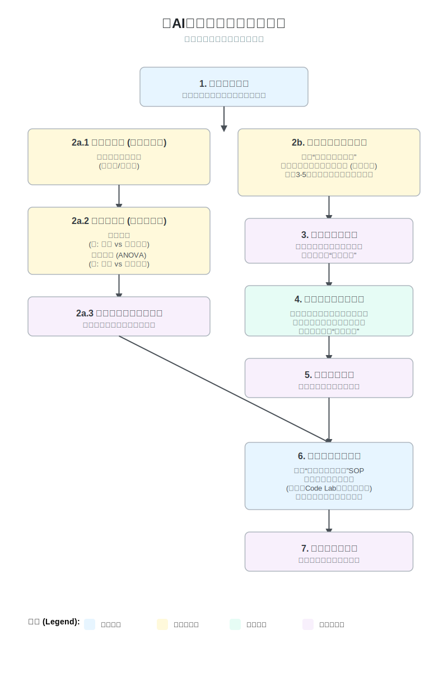

# 《AI思维与创造力第一课》课前调研问卷——设计说明与执行方案

本问卷是《AI思维与创造力第一课》学习体验的正式起点，其设计的核心目的远不止于信息收集。它是课程“学习者主权”与“社群共创”核心理念的第一次实践 。通过邀请学员在课程开始前共同定义我们未来五周将挑战的“顶石案例”（Capstone Case），我们旨在从第一刻起，就将学员从被动的知识接收者，转变为课程内容的共同塑造者，从而极大地激发其内在学习动机与主人翁意识。  

# 一、核心目标

本问卷的设计旨在达成以下三个核心目标：

1. **实现学习者画像的精准描绘**：通过定量的背景与需求数据，为教学团队提供一个关于当期学员群体的清晰画像，以便对课程的深度、节奏和支持策略进行精细化调整。
2. **发掘与集体意愿共鸣的真实案例**：通过定性的开放式问题，从学员的真实关切中，发掘出一系列具有社会价值、技术挑战性和内在吸引力的“顶石案例”候选池。
3. **奠定社群共创的文化基调**：通过问卷的引导性语言和参与式设计，向学员传递课程的核心价值观——我们是一个共同学习、共同创造的“认知健身房”，而非一个单向灌输的“教室” 。

## 二、问卷设计原则
为确保问卷能够高效、准确地达成上述目标，其设计遵循以下四大原则：

1. **定量与定性结合**：问卷巧妙地融合了封闭式问题（单选、多选）与开放式问题。定量部分用于快速收集可统计的数据，形成对学员群体的宏观洞察；定性部分则用于深入挖掘学员的个人故事、痛点与愿景，为“顶石案例”的生成提供丰富、鲜活的素材。
2. **叙事性与引导性** ：问卷的结构被设计成一个有逻辑的叙事流，从“您的起点”到“您的动机”，再到核心的“共创案例”，最后是“学习偏好与反馈”。每一部分的过渡和引导语都旨在将填写过程从一种“任务”转变为一次“自我探索与贡献的旅程”。
3. **动机导向**：问卷的问题设计深度借鉴了“待办任务”（JTBD）框架的精髓，不仅关心学员“想学什么”，更关心他们“希望通过学习解决什么问题”、“渴望成为什么样的人”，从而触及最深层的学习动机 。
4. **尊重与透明**：在每个部分开头，我们都清晰地向学员说明该部分问题的目的，以及我们将如何使用这些信息。这种透明度旨在建立信任，鼓励学员提供更真实、更深入的回答。

## 三、问卷结构与内容详解

以下是问卷的最终结构，以及每个部分的设计目的与分析策略。

| 问卷部分 | 核心目标 | 问题类型 | 数据分析策略 |
| :--- | :--- | :--- | :--- |
| **第一部分：基本信息与背景** | 描绘学员画像，了解技术背景与经验分布。 | 定量 (单选) | **统计分析**：生成关于职业领域、技术背景、AI了解程度的分布图表，用于对学员进行初步分层，以便在课程中提供差异化支持。 |
| **第二部分：学习动机** | 洞察学员的核心需求与期望的学习成果。 | 定量 (多选) + 定性 (开放题) | **定量**：分析学习目的、期望能力和成果的分布频率，以验证课程设计与学员主流需求的匹配度。\<br\>**定性**：对开放题进行主题分析，提炼出学员期望解决的具体问题场景。 |
| **第三部分：共创“顶石案例”** | 从学员的真实关切中，生成“顶石案例”候选池。 | 定量 (多选) + 定性 (开放题) | **定量**：统计学员最感兴趣的领域，作为筛选案例方向的初步依据。\<br\>**定性**：对开放题进行**深度内容分析**，这是生成候选案例的核心步骤。通过亲和图法(Affinity Diagram)等方式，将学员描述的具体问题进行聚类，寻找共性与痛点。 |
| **第四部分：学习偏好与挑战** | 优化教学策略与学习支持系统。 | 定量 (多选) | **统计分析**：分析学员感知的主要学习障碍、技术困惑点和偏好的学习方式，以便教学团队可以提前准备针对性的答疑内容和多样化的教学活动。 |
| **第五部分：社群与互动** | 设计和运营符合学员期望的学习社群。 | 定量 (多选) | **统计分析**：了解学员对社群支持的需求和参与意愿，为设计社群角色、激励机制和互动活动提供数据依据。 |
| **第六部分：开放反馈** | 捕捉个性化期望，建立双向沟通渠道。 | 定性 (开放题) | **内容分析**：逐条阅读学员的个性化反馈，识别出共性问题或特别有价值的建议，用于课程的持续迭代。 |

## 四、数据分析与应用流程

问卷收集到的数据将通过以下标准流程，转化为可指导课程设计的行动方案：

*图：问卷调查数据分析与应用流程示意图*

1.  **定量分析与画像生成**

首先对所有封闭式问题进行统计分析，生成学员群体的整体画像报告。这份报告将帮助教学团队在课程开始前，对学员的平均水平和多样性有一个清晰的预判。

原始问卷数据需要经过一系列转换，才能适用于后续的统计分析和机器学习算法：

- 序数变量转换：针对李克特量表（Likert scale）类型的回答（例如，从“非常不同意”到“非常同意”），将统一转换为数值尺度（如1-5分或1-7分）。在转换过程中，将明确记录“等距假设”这一方法论考量，即假定量表上各点之间的心理距离是相等的。

- 分类变量编码：对于“专业角色”、“所在行业”等名义变量（Nominal variables），将采用**独热编码（One-Hot Encoding）**技术。该技术会为每个类别创建一个新的二元（0或1）特征列。这种处理方式避免了为类别引入无意义的序数关系，是大多数机器学习算法所要求的标准输入格式。

- 数值变量缩放：为了防止具有较大数值范围的变量（如“工作经验年限”）在基于距离的算法（如K-Means聚类）中占据主导地位，所有连续型数值变量都将进行标准化处理。根据变量的分布情况，将选择Z分数标准化（Standardization）或最小-最大值归一化（Normalization），以将所有数值特征置于一个可比较的尺度上。

在完成数据准备后，运用描述性和推断性统计方法，为即将入学的学员群体绘制一幅详尽的统计画像。分析将从描述“现状”的宏观概览入手，进而检验一系列与课程教学设计紧密相关的具体假设：

- 单变量分布分析：为全面了解学员群体的基本构成，将对所有核心变量进行单变量分析。对于连续型变量（如各项技能的自评分数），将生成直方图和箱形图，以直观展示其分布形态（如正态、偏态、双峰）、集中趋势（均值、中位数）和离散程度（标准差、四分位距）。对于分类变量（如“学习方案偏好”），将生成条形图以展示各类别的频率和占比。这些基础分析能够迅速识别出学员群体的整体特征，例如，技术背景的普遍水平或对某种学习模式的初步倾向。
- 双变量关系分析：为了探索不同学员特质之间的潜在关联，将进行一系列双变量分析，旨在回答具体的教学研究问题。
- 卡方独立性检验：卡方检验是评估两个分类变量之间是否存在显著关联的核心统计工具 。它通过比较**观测频数（Observed Frequencies）
- 方差分析：当需要比较一个连续变量在三个或更多组别之间的均值是否存在显著差异时，ANOVA是首选的统计方法。

2.  **定性分析与案例提炼**

 - 教学团队将组织一次专门的“案例共创工作坊”。
 - 在工作坊中，团队成员将共同对第三部分（共创“顶石案例”）的所有开放性回答进行**主题分析**。通过贴标签、聚类等方式，识别出3-5个被高频提及、具有社会价值、且技术上可行的核心挑战。
 - 为每个候选案例撰写一份简洁而有吸引力的“**案例简介**”，清晰地描述问题背景、核心挑战和潜在的社会影响力。

3.  **社群投票与最终确定**

- 将提炼出的3-5个候选案例及其简介，通过线上投票工具发布给全体学员。
- 给予学员2-3天的时间进行思考和投票，并鼓励在社群中进行简短的讨论。
- 最终得票最高的案例，将正式成为本期《AI思维与创造力第一课》的“**顶石案例**”。

4.  **课程内容快速适配**

- 在案例确定后，教学团队将立即启动“**案例启动工具包**”SOP。
- 在1-2天内，快速将核心教学资产（讲义、Code Lab等）与当期案例进行情境化结合，完成最终版教学材料的准备。

## 总结

这份经过精心设计的[调研问卷模板](./课前调研问卷模板.md)，是实现《AI思维与创造力第一课》“学习者自主学习”和“社群共创”理念的战略性工具，为打造一场真正有意义、有影响力的学习体验奠定了基础。

---
本作品采用CC-BY-NC-SA 4.0国际许可协议进行许可, &copy; 2025 Gitconomy Research社区，保留所有权利。
