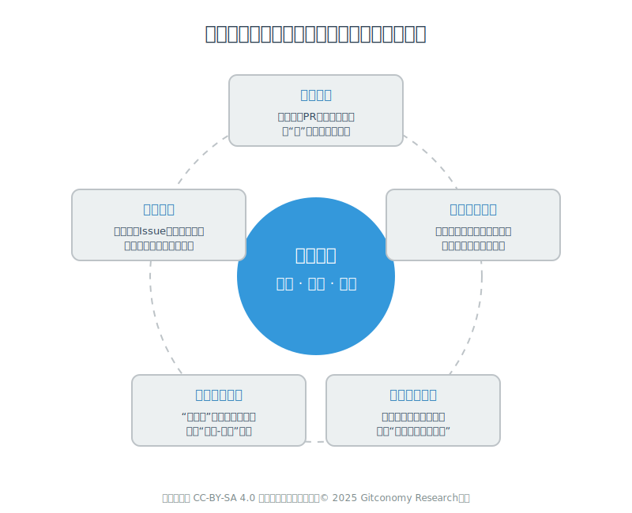
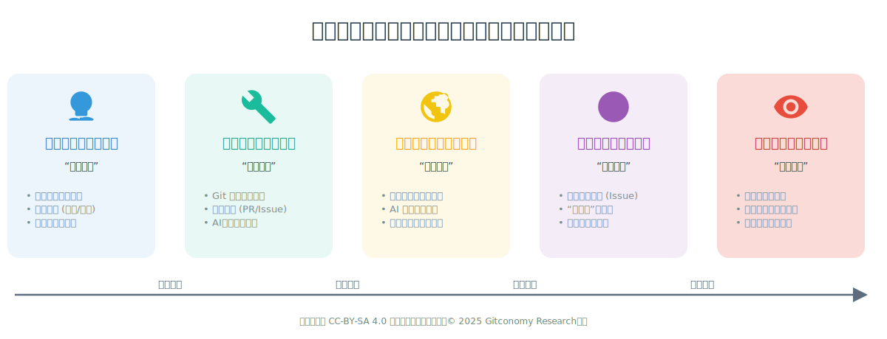

# 《开源导论与数字素养》全周期教学指南

## 引言：本指南的目的与使用

本指南是一份全面的教学实施手册，旨在为《开源导论与数字素养》课程的教学团队（包括授课教师、课程助教及教学管理者）提供从顶层设计到一线操作的全周期指导。它不仅阐述了课程的“是什么”与“为什么”，更聚焦于“教什么”和“如何教”，以确保课程理念能够高效、高质量地落地，并实现持续的迭代与优化。

本指南借鉴了MIT OpenCourseWare (OCW)的结构化与开放性，并将其内化为一套覆盖**设计 → 内容 → 实施 → 实践 → 评估**完整生命周期的行动框架。请将本指南作为课程准备、教学实施和课后复盘的核心参考。

---

## 第一部分：课程设计融合先进教育理念

本部分奠定了课程的设计理念与骨架，是所有教学活动开展的理论基石，回答了“我们为什么要开设这门课”以及“我们希望学生成为什么样的人”。

*图：融合先进教育理念的课程设计指导思想*

### 1.1 课程理念：启蒙、引导与赋能

本课程的核心哲学是**启蒙、引导与赋能**。我们坚信，这门课的价值远不止于教授一项工具或技能，而在于为大一新生开启一扇通往新世界的大门。启蒙意味着激发学生对开放、协作、共享精神的好奇心；引导意味着为他们绘制一幅清晰的“开源世界地图”，并指明参与路径；赋能则意味着通过高度实践性的教学，使他们真正掌握参与开源的基本技能，为未来发展注入强大动力。

### 1.2 教学法与理论基础

本课程的教学设计深度融合了多种先进的教育理论，并确立了**立足国内，放眼全球**的核心实践原则。我们的教学法根植于坚实的理论基础，确保每一次教学活动都具备科学性和目的性。

1. 课程的哲学基石是**建构主义学习理论** （Constructivism），它强调学习并非被动接收信息，而是学习者基于已有经验主动建构新知识的过程。因此，课程通过一系列实践活动（如提交第一个PR、完成团队项目），让学生在“做中学”，亲手“构建”起对开源的理解。

2. 在此基础上，课程充分体现了**社会建构主义**（Social Constructivism）的精髓，即知识是在与他人的互动协作中共同建构的。团队项目、同伴互评（Peer Review）等社会性学习活动，以及教师在“微贡献工作坊”中提供的“支架式教学 （Scaffolding）”，都是为了帮助学生有效跨越其“最近发展区 (ZPD)”。

3. **情境学习理论**（Situated Learning Theory）解释了为何将学习置于真实场景中至关重要。本课程直接使用GitCode等真实的“实践社群 （Community of Practice）”，鼓励学生通过“合法的边缘性参与 （Legitimate Peripheral Participation）”，从修改一份文档开始，逐步成长为社区的贡献者。

4. **经验学习理论**（Experiential Learning Theory） 为课程中的“理论-实践-反思”闭环提供了模型。以“微贡献”作业为例，学生在“具体经验”（尝试贡献）后，进行“反思性观察”（记录反思），从中“抽象概念化”（总结原则），并在后续的团队项目中进行“主动实验”（应用新原则），形成一个完整的学习闭环。

5. 最后，作为一门面向数字时代的课程，其教学方式也深受**联通主义**（Connectivism)）的影响。该理论认为学习是建立和维护网络连接的过程。课程通过强调信息素养的培养，并鼓励学生利用丰富的开放教育资源（OER）进行自主学习，正是为了培养其在分布式网络环境中“连接”与“导航”的能力。

下表总结了这些核心教育理论与本课程实践的对应关系：

| 教育理论                                     | 核心思想                       | 在《开源导论》课程中的具体实践                                   |
| :------------------------------------------- | :----------------------------- | :----------------------------------------------------------- |
| **建构主义 (Constructivism)** | 学习者主动构建知识             | 通过动手实践（写代码、做项目）来理解抽象概念。               |
| **社会建构主义 (Social Constructivism)** | 学习在社会互动中发生           | 体现在团队项目、同伴代码审查（Peer Review）、社区互动。        |
| **情境学习理论 (Situated Learning)** | 在真实“实践社群”中学习         | 使用真实的GitCode/Gitee平台，向真实开源项目贡献。            |
| **经验学习理论 (Experiential Learning)** | 经验-反思-概念-实验的循环      | “微贡献”作业要求记录过程并进行反思总结。                     |
| **联通主义 (Connectivism)** | 学习是构建和导航网络           | 培养信息素养，利用丰富的在线开放资源自主学习。               |

这五大理论如五根支柱，共同撑起了《开源导论与数字素养》这门课程的教学大厦。它们确保了课程不仅是在传递知识和技能，更是在塑造一种全新的学习方式和思维模式——一种主动建构、乐于协作、勇于实践、勤于反思、精于连接的，真正属于数字时代和开源精神的思维模式。

### 1.3 课程框架：四维一体的培养目标

课程的所有内容和活动都围绕以下四维一体的综合培养目标展开，确保每一环节都有明确的育人指向。

| 维度 | 学习成果描述                                                 |
| :--- | :----------------------------------------------------------- |
| **知识** | 系统性地阐述开源的定义、历史、核心理念及主流许可证的差异；识别全球与中国本土的关键开源项目、基金会和平台。 |
| **能力** | 熟练运用Git和主流代码托管平台（如GitCode）完成版本控制与协作流程；独立查找、评估并向一个真实的开源项目提交一次“微贡献”。 |
| **素养** | 秉持开放、协作、共享、贡献的开源精神；建立负责任的数字公民意识；展现出更高的信息素养和在开放网络中自主学习的能力。 |
| **思政** | 结合具体案例，理解开源创新与国家“技术自主可控”战略的联系，增强科技自信与社会责任感。 |

---

## 第二部分： 课程内容模块化设计

课程内容共分为五大模块，总计16章，贯穿16个教学周，每周2学时，循序渐进地引导学生从理论认知走向实践应用，是课程交付的“知识地图”。

|序号|模块名称|主要教学内容|
|:---|:---:|:---|
|模块一|开源理念与文化 (第1-2周)|本模块作为课程的基石，旨在为学生奠定理论基础，建立核心认知。内容将系统介绍开源的起源、核心定义，并深入阐释其所倡导的自由、共享、合作与透明等核心理念。同时，将详细解读常见的开源许可证及其法律意义。为深化学习效果，教学活动将引入故事化教学，例如播放《代码奔腾》(Revolution OS) 的核心片段，并组织一场关于许可证选择的案例辩论赛，以激发学生的思辨能力。|
|模块二|开源工具与平台 (第3-6周)|本模块聚焦于开源生态中不可或缺的工具与平台，目标是掌握核心工具，扫清实践障碍。内容将从Git版本控制工具的基础命令入手，逐步过渡到GitHub、Gitee等主流代码托管与协作平台的具体使用，并初步接触Hugging Face、ModelScope等新一代AI模型平台。教学上将采用实践驱动的翻转课堂，例如在课程专用组织中，让学生通过提交PR创建个人介绍文件，并通过课堂任务在线运行和测试一个AI模型，获得即时反馈与成就感。|
|模块三|开源项目生态图谱 (第7-10周)|本模块旨在帮助学生拓宽视野，认知更广阔的全球与本土开源生态。内容将覆盖全球重要的开源基金会、AI与云原生等热门领域的开源现状，并重点介绍中国开源生态的特色与战略项目。教学活动将邀请朋辈榜样（如参与开源的学长学姐）、业界专家或组织代表进行分享，并布置模板化的探究性作业，引导学生深度调研一个中国开源项目。|
|模块四|开源项目贡献实践 (第11-14周)|本模块将课程推向高潮，目标是引导学生从了解到参与，完成“第一次贡献”。内容将系统讲解贡献者成长路径、具体的代码与非代码贡献方法，以及开源经验对职业发展的促进作用。核心教学活动是流程化的“微贡献”工作坊（Workshop），教师将现场引导学生完成一次真实的PR提交。同时，学生将以小组形式，围绕AI应用、数据分析或社区贡献等方向，开展聚焦的期末团队项目。|
|模块五|开源的社会价值与全球化视野 (第15-16周)|本模块是课程的升华部分，旨在引导学生深入思考开源的未来。内容将探讨开源对技术创新、社会进步的深远影响，并展望其未来发展趋势。教学活动将采用“世界咖啡馆”(World Café)等升级的讨论形式促进思想碰撞，并要求学生提交一份“我的开源之旅规划图”，作为对未来学习与参与的展望。|

为平衡深度与广度，教学团队在实施时应遵循“先实践、后理论”的原则，尤其在前几周，优先确保学生通过动手操作建立信心和兴趣。

*图：课程知识模块逻辑递进关系*

---

## 第三部分：课程实施交付准备

本部分聚焦于课程的落地执行，为教学团队提供从课前准备到课堂交付，再到风险管理和持续改进的全流程操作方案。

### 3.1 课前准备清单

**平台与环境搭建:**
- [ ] 创建课程专属代码仓库：在GitCode上创建课程专属组织。
- [ ] 设置在线实验平台：配置GitCode的CI/CD或类似平台。
- [ ] 建立课程交流社群：创建微信群或QQ群。

**教学资源准备:**
- [ ] 定制学生版课程大纲 (Syllabus)。
- [ ] 准备所有周教学材料。
- [ ] 初始化“Awesome List”。

**外部资源协调:**
- [ ] 预筛选“微贡献”项目。
- [ ] 确认嘉宾分享。(Summary & Outlook)

### 3.2 课程交付：教学路线图

本课程的16周教学旅程将围绕“3-2-1”核心实践模型展开，确保学习节奏张弛有度。前3周将通过翻转课堂和线上闯关等活动，为学生夯实开源理念与Git技能的“地基”。随后的教学将穿插全球生态图谱、开源治理等视野拓展内容，并在关键节点安排2周的“深度体验”，聚焦AI模型平台与安全合规。最后冲刺的1周将以“成果产出”为核心，通过“微贡献”工作坊和PBL项目路演，让学生完成从0到1的蜕变，最终在价值升华与未来展望中结束整个学期的学习。

*图：课程“3-2-1”教学路线图*

### 3.3 教学支持与迭代

**风险预案:**
| 风险 | 症状 | 预案 |
| :--- | :--- | :--- |
| 零基础学生掉队 | PR提交率低 | 开设“周三晚诊所”答疑时间 + 录制3分钟短视频“Git提交三连命令” |
| 开源项目无响应 | Issue无人理睬 | 教师提前fork项目作为备份，确保学生的PR至少可被教师合并 |
| 跨专业选课 | 线下讨论难聚齐 | 开设飞书多维表等“云小组”工具，自动分配角色，线上协作 |

**持续改进与社区联动:**

1. **动态反馈与调整机制**：在第8周左右增设一次匿名的期中反馈调查，收集学生对课程难度、节奏和内容的意见，并根据反馈对后半学期的教学计划进行微调。
2. **适应多样化学习风格**：在课程资源库中，为倾向于自学的学生提供额外的、结构化的独立学习任务包（如带有知识点自测的阅读材料、进阶的线上实验等），并明确告知这些资源可作为替代或补充。
3. **建立长期学习社区与支持体系**：课程结束后，引导学生加入一个可持续的校内开源学习社群或论坛。定期（如每学期一次）组织往届学员分享会，邀请已在开源领域有所发展的校友分享经验。
4. **规划进阶学习路径**：对于学有余力、兴趣浓厚的学生，提供一份“进阶学习路径图”，推荐更深入的课程（如操作系统、数据库）、项目（参与更核心的模块开发）或角色（尝试组织社区活动、担任项目助理）。
5. **社区合作**：与开源基金会、开源社区与开源代码托管平台等建立长期合作关系，确保good-first-issue资源的稳定供给。
6. **建立学习共同体**：建立“校友导师”制度，邀请往期优秀学员回校担任助教或分享嘉宾，形成课程的滚动迭代与传承文化。

---

## 第四部分：课程实践“战术手册”

为了激活课堂，本课程将综合运用多种现代化教学方法，改变传统计算机课程可能枯燥乏味的局面，将课堂变成了充满创造力和乐趣的“学习工坊 (Learning Studio)”，旨在激发学生的学习主动性并培养其实践创新能力。

*图：课程实践“战术手册”*

### 4.1 模块化教学活动设计

| 模块 | 关键活动 | 资源包 | 教师操作提示 |
| :--- | :--- | :--- | :--- |
| **开源理念** | “许可证情景剧”角色扮演 | 许可证卡片、判例脚本 | 课前分6组，课堂10分钟即兴法庭辩论 |
| **Git技能** | “Git密室逃脱”线上闯关 | GitCode CI/CD 自动评测 | 设置4关，实时排行榜，课堂助教巡回答疑 |
| **AI开源** | “1小时克隆一条AI语音” | Model Scope模板 | 学生只需改几行参数即可体验 |
| **微贡献** | “错别字猎人”行动 | 附录一的good-first-issue集合 | 提前锁定5个中文项目，确保Issue 48小时内被维护者响应 |
| **全球化** | “开源大使馆”虚拟圆桌 | Zoom连线海外maintainer | 提前测试网络，准备双语文本 |

### 4.2 课堂组织模板（2×50min示例）

* **0–10 min:** 闪电问答
* **10–30 min:** 案例故事 + 教师点睛
* **30–60 min:** 分组实操
* **60–75 min:** 成果快闪
* **75–90 min:** 教师总结 + 下次任务布置

### 4.3 推荐教学工具箱

为了将本课程“理论与实践深度融合”及“学生为中心”的教学理念落到实处，需要构建了一个整合的“数字化学习生态系统”。这个工具箱不仅是完成教学任务的辅助软件列表，其本身就是课程教学内容的重要组成部分。通过在真实的数字化环境中使用这些前沿工具，学生将在潜移默化中内化数字时代的协作方式、沟通文化和学习方法，从而全面提升其数字素养。我们鼓励教学团队将这些工具视为搭建现代化、互动式、情境化学习场的“积木”，根据实际情况灵活选用与组合。

| 类别 | 核心工具 | 核心应用与教学价值 (Core Application & Pedagogical Value) | 实施贴士与拓展建议 (Implementation Tips & Extension Suggestions) |
| :--- | :--- | :--- | :--- |
| **协作与代码托管** | GitCode (主) GitHub (辅) | **课程中枢系统**：承载课程仓库、作业提交、PR练习与同伴互评。体现“立足国内，兼顾全球”的视野，确保访问流畅性的同时接轨国际最大开源社区。 | **创建课程组织 (Organization)**：在GitCode上建立课程专属组织，便于统一管理。**预设模板**：提供Issue和PR模板，从源头培养学生的规范协作习惯。 |
| **互动与反馈** | Mentimeter 雨课堂 | **课堂脉搏监控**：用于课堂“闪电问答”、实时投票、词云生成，即时掌握学情，打破单向讲授的沉闷，是实现形成性评价和主动学习的关键。 | **游戏化知识点**：用Mentimeter的竞赛功能将许可证等枯燥内容变为抢答赛。**快速反馈**：利用雨课堂进行课后匿名问卷，收集学生真实困惑。可补充**Slido**用于大型Q\&A。 |
| **AI平台体验** | ModelScope魔搭 Hugging Face | **前沿技术传送门**：让学生“零门槛”接触和体验全球顶级的AI开源模型，直观感受开源在前沿科技领域的巨大推动力，极大激发学习兴趣。 | **任务化体验**：将平台体验设计成“寻宝游戏”，如“找到一个能识别猫狗的图片分类模型并测试三张图片”，提升趣味性和主动探索性。 |
| **文档与知识管理** | Joplin Obsidian 飞书文档 | **构建第二大脑**：引导学生超越简单的报告撰写，学习使用Markdown及双向链接等现代化工具构建个人知识网络(PKM)，是数字素养的核心体现。 | **鼓励分享与展示**：设立课程公共知识库，鼓励学生分享笔记。可举办中期“学习笔记”展示会，让学生交流知识管理心得，将此作为期末项目文档部分的加分项。 |
| **交流与社群** | 微信群 (基础) Discord/Slack (进阶) | **模拟真实社区**：采用分层策略，微信群保证信息高效触达，Discord/Slack则让学生提前沉浸式体验国际开源社区主流的异步、分频道、可归档的沟通文化。 | **建立社区礼仪 (Etiquette)**：在Discord/Slack中置顶频道规则，明确“如何有效提问”、“提问前先搜索”等社区礼仪，将数字公民教育融入日常。 |
| **线上实验与评测** | GitCode CI/CD GitHub Classroom | **智能化助教**：实现对Git操作等技能点的自动化评测与即时反馈，解放教学人力的同时，让学生在“代码-测试-修改”的快速循环中高效学习，并初步接触DevOps理念。 | **引入徽章系统 (Badge System)**：为“Git密室逃脱”任务的每一关设置CI/CD检查点，通过后自动在学生仓库的README中点亮一个徽章，增强游戏化体验与成就感。 |

这个工具箱将课程的教学活动与真实的数字化工作流无缝对接。它不仅为学生提供了必要的“术”，更在工具的使用场景和规范中融入了开源文化的“道”。通过这个生态系统，课程的建构主义、情境学习、联通主义等教育理念得以具体化、情境化，从而确保学生在课程结束后，带走的不仅仅是知识点，更是一整套能够受益终身的数字素养和自主学习能力。

### 4.4 学习贡献可视化

在课程专用仓库的README中，可以根据学生提交的PR、解决的Issue、分享的优质资源等，设立一个简单的积分和贡献榜，用游戏化的方式激励参与。

 在学生提交PR作业时，要求至少2名其他同学进行Code Review（或文档Review），提出修改建议。这不仅能锻炼学生的批判性思维，也是开源协作的核心环节。

从课前准备清单到2x50分钟的课堂组织模板，再到“3-2-1”的教学节奏模型，所有环节都被高度模块化和流程化。这意味着任何一位合格的教师，拿到这份指南都能迅速上手，高质量地完成教学任务。

---

## 第五部分：课程评估衡量与成长

课程采用过程性评估（70%）与终结性评估（30%）相结合的方式，旨在科学、全面地衡量学生的学习成效。这种设计极大地鼓励了学生的持续参与，而非“期末突击”。课程需要建立一个多层次、即时的反馈系统，让评估本身成为了促进学习和成长的过程。

### 5.1 评价方法与构成

课程开始时就公布所有考核项的具体评分标准（Rubric）。例如，一个“符合规范的Pull Request”需要满足：1) 标题清晰；2) 描述完整，说明了修改原因；3) 代码/文档风格符合项目规范；4) 关联了对应的Issue。

我们采用**过程性评估（70%）与终结性评估（30%）** 相结合的方式，重在激励学生的持续参与和真实成长。

|评估类被| 评估项 | 权重 | 描述与实施建议 |
| :--- | :--- | :--- | :--- |
|**过程性评估 （70%）**| 在线知识小测验 | 10% | 检验核心知识点的掌握情况。 |
|| Git/GitCode基础操作考核 | 15% | 引入“绿色通过”机制，按时完成即得满分。 |
|| “微贡献”尝试记录与反思 | 15% | 评价重点在于反思的深度。 |
|| 课堂参与、互动与同伴互评 | 30% | 将PR、项目互评各占5%。 |
| **终结性评估** **30%**  | 期末综合项目/报告 | 30% | 提供“7选1”菜单式选题，允许多学科组队。 |

### 5.2 课程目标映射矩阵

| 维度 | 学习成果（学生学完能做什么） | 可观察证据 | 支撑章节 | 评价方式 |
| :--- | :--- | :--- | :--- | :--- |
| **知识** | 说出开源定义、四大核心理念、主流许可证差异 | 课堂快问快答、在线测验 | 1–2章 | 测验10% |
| **能力** | 使用Git完成add-commit-push-pull流程，提交一次PR | 练习仓库PR链接 | 3–4章 | 实践作业15% |
| **素养** | 主动在GitCode/ModelScope上提问或回答一次 | Issue/讨论截图 | 5–6章 | 课堂参与20% |
| **思政** | 用具体案例说明中国开源战略对国家安全的意义 | 期末报告相关段落 | 10、15章 | 期末项目30% |

### 5.3 反馈机制

* **即时与自动反馈：** 利用GitCode Webhook对PR格式进行自动检查。
* **同伴反馈：** 将同伴互评作为正式环节。
* **教师/助教反馈：** 建立“周三晚诊所”等固定答疑时间。

## 6. 课程教学指南总结

本指南系统性地构建了一套从顶层设计到底层实践的《开源导论与数字素养》全周期教学框架。它以**“启蒙、引导、赋能”的哲学为引领，以建构主义等先进教育理论为学理支撑，确立了“立足本土，拥抱世界”**的开放格局。

在实践层面，指南提供了详尽的16周内容详解、模块化的教学活动设计、丰富的工具与资源列表，以及科学的过程性评估方案。其核心亮点在于强调真实情境下的动手实践，通过“Git密室逃脱”、“微贡献工作坊”和期末PBL项目，引导学生完成一次从0到1的开源贡献，真正实现知识的内化与能力的跃迁。

展望未来，本课程不仅是知识的传授，更是一个可持续发展的学习共同体。通过建立动态反馈机制、校友导师制度以及与开源社区的深度联动，我们致力于将这门课打造成一盏**“启明灯”**，不仅为学生当下的学习点亮道路，更能激发他们持续探索、终身参与开源世界的激情与动力，在他们心中播下“开放、协作、共享、贡献”的种子，伴随其成长，绽放光芒。

## 附录一：推荐的长期微贡献项目列表

本列表以国内平台和项目为主，鼓励学生立足本土完成首次贡献，同时教师可引导学有余力的学生探索GitHub等国际平台的同类机会，以拓宽全球视野。

1.  **GitCode官方**
    * **入口:** `gitcode.com` → 探索 → 任务/悬赏
    * **任务类型:** 每周刷新海量微任务
    * **示例:** “给国产数据库补一条 SQL 示例”

2.  **OpenHarmony社区**
    * **入口:** `openatom.cn/projects` → Issues → `good-first-issue`
    * **任务类型:** 文档改错、翻译、单元测试
    * **示例:** OpenHarmony 文档错别字

3.  **openEuler 社区**
    * **入口:** `gitcode.com/openeuler` → Issues → `good-first-issue`
    * **任务类型:** Shell 脚本、文档、测试
    * **示例:** “给 openEuler 22.03 安装脚本加一行注释”

4.  **MindSpore社区**
    * **入口:** `gitcode.com/mindspore` → Issues → `good-first-issue`
    * **任务类型:** API 翻译、测试用例、教程补图
    * **示例:** “把 5 个英文 API 描述翻译成中文”

5.  **ModelScope魔搭**
    * **入口:** `modelscope.cn` → 任务广场
    * **任务类型:** 模型体验报告、示例代码
    * **示例:** 跑通中文 Stable Diffusion 并提交体验截图

-----

### **附录二：推荐的教学和学习资源**

本资源列表旨在为教学团队的备课工作提供深度支持，并为渴望自我探索的学生开辟一条从入门到精通的自学路径。我们鼓励教师将其作为“延伸阅读”和“探索任务”的素材库，引导学生在课堂之外，继续他们的开源之旅，将自主学习和终身学习的能力内化为一种习惯。

| 类别 | 资源名称/平台 | 推荐理由与应用场景 | 补充与拓展建议 |
| :--- | :--- | :--- | :--- |
| **经典阅读** | <ul><li>《大教堂与集市》<li>《只是为了好玩》<li>《自由软件，自由社会》<li>《Pro Git》（中文版）</ul> | **思想基石**：这四本书构成了理解开源文化的“必读经典”。它们分别从开发模式、领袖人物、哲学精神和核心技能四个维度，为学生构建起一个完整的开源世界观。 | **<ul><li>《Working in Public》**：Nadia Asparouhova所著，是探讨现代开源维护者工作、社区动态与经济模式的新经典，可作为进阶阅读。<li>**《The Pragmatic Programmer》**：培养专业开发者思维的经典，虽不专讲开源，但其理念与开源精神高度契合。</ul> |
| **纪录片与视频** | <ul><li>《代码奔腾》(Revolution OS)<li>Bilibili/YouTube </ul>| **直观体验**：纪录片能让学生身临其境地感受开源运动早期的激情与理想主义。而视频平台则是获取“活”知识的最佳渠道，内容更新快，形式生动。 | **指定频道**：推荐如**Fireship.io**（快节奏技术解读）、**程序员鱼皮**（国内项目实践）等优质UP主。**会议演讲**：KubeCon, PyCon, FOSDEM等顶级开源大会的演讲视频是了解前沿技术的绝佳免费资源。 |
| **在线课程与实验** | <ul><li>freeCodeCamp (中文社区)<li>华东师范大学《开源引论》<li>The Linux Foundation Training</ul> | **系统学习**：这些平台提供了结构化的学习路径和实践项目。特别是国内高校的公开课，为教学设计提供了宝贵的本土化参考。 | <ul><li>**GitHub Learning Lab**：官方出品的交互式机器人教练，可作为“Git/GitHub基础操作考核”的平台，游戏化体验极佳<li>**Microsoft Learn**：提供大量免费且高质量的Git、GitHub和DevOps学习模块。</ul> |
| **社区、资讯与博客** | <ul><li>Gitee 开源指北</ul> | **中文生态**：这些是国内学生入门开源最亲切、最接地气的资源，内容覆盖从入门教程到行业最新动态，社区氛围活跃，便于提问和交流。 | **国际视野**：推荐**Hacker News**（高质量技术讨论）、**LWN.net**（硬核Linux/FOSS新闻）、**Dev.to**（全球开发者博客平台），用于培养学生的信息检索和英文阅读能力。 |
| **播客与新闻通讯** | *N/A* | **持续学习**：播客和邮件通讯是当今开发者保持信息同步的主流方式。推荐此类资源有助于培养学生“持续学习”和“信息过滤”的元能力。 | <ul><li>**播客**：推荐**The Changelog**, **Command Line Heroes**等，适合在通勤等碎片化时间收听。<li>**新闻通讯(Newsletter)**：推荐**TLDR**, **Console.dev**, **PyCoder's Weekly**等，每日或每周推送精选技术资讯。 </ul>|

这份列表如同一套功能强大的“外挂”学习包，能够极大地丰富和延展课堂教学的内容。教师可以巧妙地将这些资源融入课程设计，例如，将一篇经典文章的阅读作为课前任务，或将一个Git的实验作为课后作业。通过这种方式，不仅能激发学生的学习自主性，更能引导他们真正步入广阔无垠的全球开源社区，开启属于自己的探索与贡献之旅。

---
## 许可声明

本文档采用 [知识共享署名--相同方式共享 4.0 国际许可协议 (CC BY--SA 4.0)](https://creativecommons.org/licenses/by-sa/4.0/deed.zh) 进行许可。  
