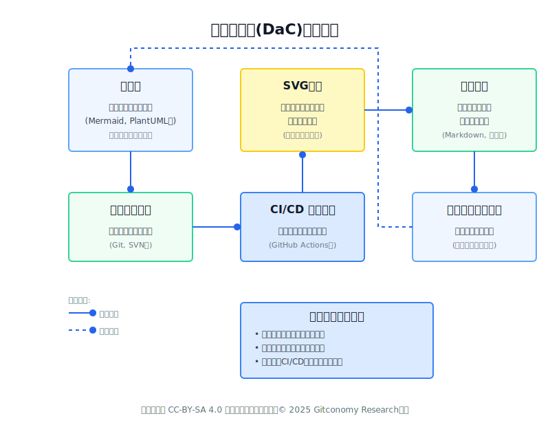
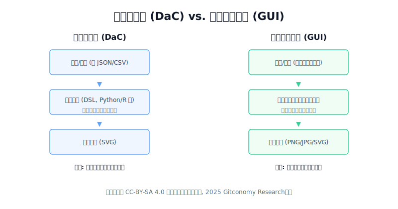
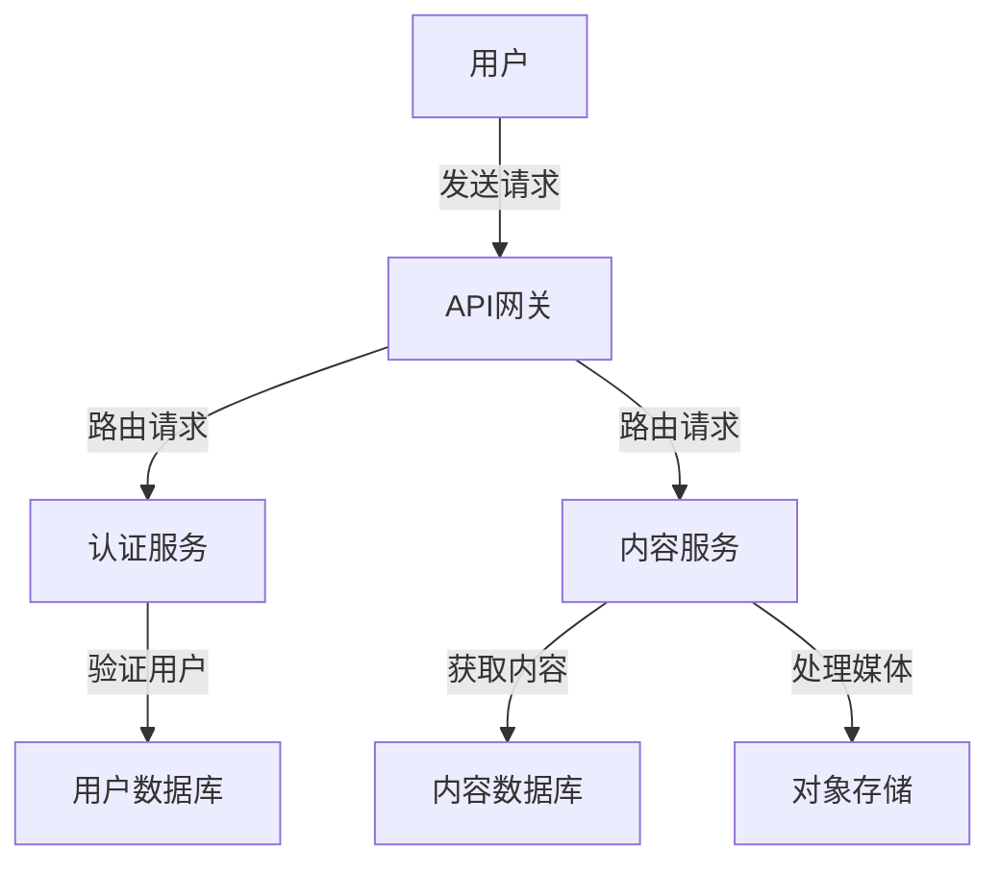
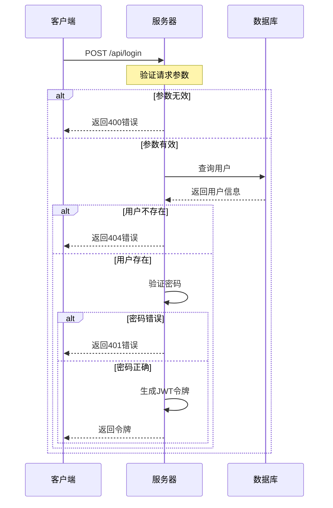
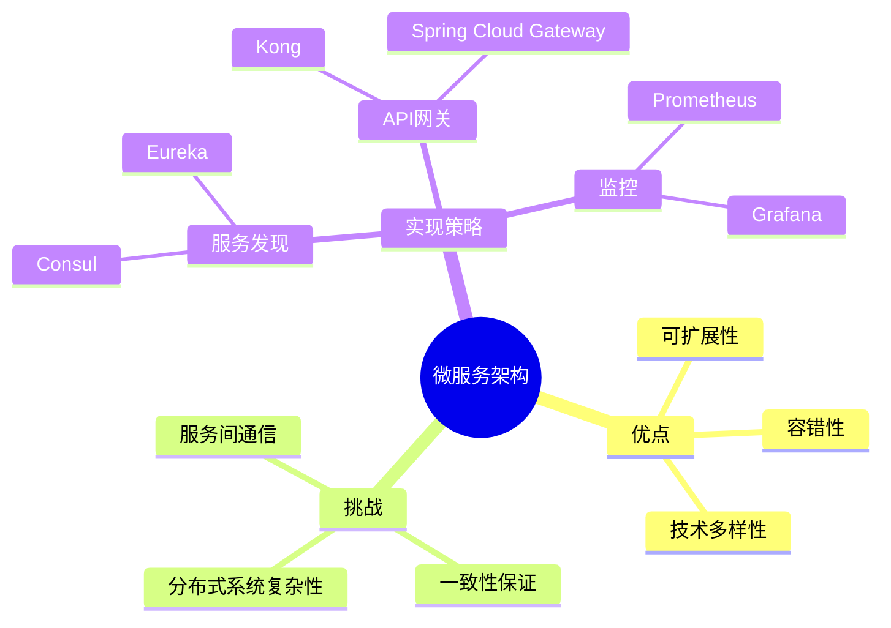
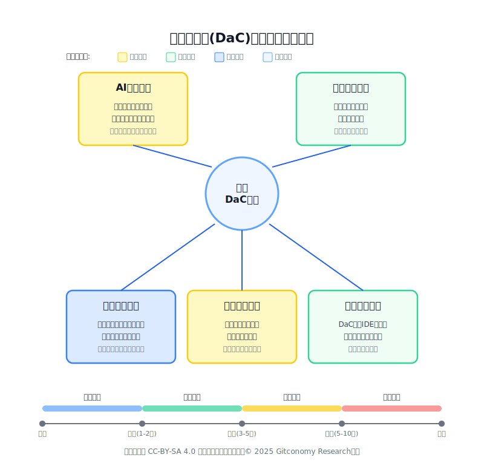

# 图形即代码——像管理代码一样管理图形

## 引言

在软件开发中，文档是项目成功的重要基础。而在技术文档中，图表承担着不可替代的作用：它们能够直观呈现复杂的架构、流程和关系，帮助团队成员和利益相关者快速理解系统。然而，传统的图表创建和维护方式却面临着诸多挑战：

* **同步困难：** 图表与代码分离管理，当系统变更时，图表往往得不到及时更新，最终沦为“历史遗迹”。
* **协作障碍：** 多人编辑同一张图表容易造成冲突，二进制文件格式使得版本控制变得极其困难，无法清晰地进行变更审查。
* **格式专有性：** 许多图表工具采用私有格式，难以跨平台共享和集成，限制了团队的工具选择自由。
* **维护成本高：** 图表修改需要重新打开专业工具，调整细节耗时费力，在快节奏的迭代中常常被忽略。

正是基于这些痛点，一种全新的图表管理方法应运而生：**图形即代码（Diagram as Code，简称DaC）**。这种方法允许开发者使用代码而非图形界面来创建和管理图表，将图表定义为文本，从而可以像管理其他任何源代码一样来管理图表。

本文将深入探讨图形即代码（Diagram as Code, DaC）的基本概念、工作原理、主流工具、实际应用案例，以及它如何彻底改变技术文档的制作和维护流程。我们还将展望DaC与人工智能的结合前景，为开发者提供一套完整的DaC入门指南。

## 一、图形即代码的基本概念

### 1.1 SVG：图形的代码化基石

在深入了解各种DaC工具之前，我们有必要先理解其底层的一项关键技术：SVG（Scalable Vector Graphics，可缩放矢量图形）。绝大多数DaC工具最终都会将其文本描述渲染成SVG格式的图像，正是SVG的特性使得“图形即代码”成为可能。

SVG是一种基于XML的标记语言，用于描述二维矢量图形。与我们熟知的栅格图像格式（如PNG、JPEG）不同，栅格图像由像素网格构成，放大后会失真或变得模糊。而矢量图形使用数学方程式来定义点、线和形状，因此可以在任何尺寸下保持清晰锐利，无限缩放而不会损失任何质量。  

除了其卓越的可缩放性和代码可读性之外，SVG还具备良好的可访问性和搜索引擎优化（SEO）优势。由于SVG内容本质上是文本形式的标记语言，屏幕阅读器可以解析其中的文本元素，为视障用户提供更友好的访问体验；同时开发者还可以通过添加`<title>`、`<desc>`等语义化标签来增强图形的可理解性。对于搜索引擎而言SVG中的文本内容和结构信息能够被有效索引，这在使用图标或信息图传达关键内容时尤为重要。相比之下栅格图像中的文字和细节对搜索引擎而言是“不可见”的，除非额外提供替代文本（alt text）。在注重无障碍设计和内容可发现性的现代Web开发中，SVG不仅是一种图形格式，更是一种语义化、结构化的信息载体。

最关键的是，SVG文件本质上是纯文本文件。这意味着它们是人类可读的，也可以被机器轻松解析、索引和操作。这使得SVG图像可以像HTML文档一样被搜索、脚本化和压缩，并且可以与CSS和JavaScript等其他Web标准无缝协作。

让我们来看一个简单的SVG代码示例，它绘制了一个红色的矩形和一个绿色的圆形：  

```
XML

<svg width="300" height="200" xmlns="http://www.w3.org/2000/svg">
  <rect width="100%" height="100%" fill="red" />
  <circle cx="150" cy="100" r="80" fill="green" />
</svg>
```

这段代码的结构非常直观：

- &lt;svg&gt;标签： 这是根元素，定义了整个图像的“画布”。width和height属性设置了图像在页面上占据的空间大小。
- &lt;ect&gt;标签： 这个元素定义了一个矩形。width和height属性设为100%，使其填满整个SVG画布。fill="red"属性则将矩形的填充颜色设置为红色。
- &lt;circle&gt;标签： 这个元素定义了一个圆形。cx和cy属性定义了圆心的坐标（距离左上角x轴150像素，y轴100像素），r属性定义了半径，fill="green"则将其填充为绿色。
- 渲染顺序： 在SVG中，元素的书写顺序决定了它们的堆叠层次。后出现的元素会绘制在先出现元素的上方。因此，在这个例子中，绿色的圆形会覆盖在红色的矩形之上。  

正是因为SVG允许我们用这样结构化的文本来精确描述图形，DaC工具才能在此基础上构建更高层次的抽象。像Mermaid和PlantUML这样的工具，本质上就是将它们更简洁的DSL语法，转换为更底层的、详细的SVG代码（或其他图像格式），从而最终生成我们看到的图表。理解了SVG，就理解了“图形即代码”的技术根基。

### 1.2 什么是图形即代码？

在理解了 SVG 的基础后，我们就可以明确图形即代码（DaC）的定义。图形即代码是一种使用文本描述来定义图表的方法，而不是通过拖放或点击等图形界面操作来创建图表。简单来说，开发者编写描述性文本来定义图表的节点、连接、样式和布局，然后由专门的渲染引擎将这些文本转换成视觉图表。  

这种方法的核心理念是将图表的逻辑模型与其视觉呈现分离开来，类似于基础设施即代码（Infrastructure as Code）将云资源与定义它们的脚本分开。这确保了图表的可移植性、确定性和易于分享。

### 1.3 工作原理

DaC的工作流程遵循一个清晰、可自动化的管道，通常包括以下四个关键步骤：


*图：图形即代码(DaC)工作原理示意图*

1.  **编写代码：** 使用特定的标记语法（DSL）描述图表元素、关系和属性。
2.  **渲染生成：** 通过渲染引擎（通常是命令行工具或IDE插件）将文本代码转换为可视化图表（如SVG、PNG）。
3.  **版本控制：** 将图表代码保存在源代码仓库中（如Git），与项目代码一起管理，实现变更追踪和协作审查。
4.  **持续集成：** 在CI/CD管道中自动生成最新的图表，确保文档与代码始终保持同步。

### 1.4 图形即代码与传统图形工具的比较

在理解了DaC的工作原理后，其相较于传统图形处理软件（如Visio、Draw.io或Excalidraw）的优势变得十分清晰。


*图：图形即代码(DaC) vs. 传统图形工具(GUI)*


| 特性 | 图形即代码（DaC） | 传统图形工具（GUI/拖放） |
| :--- | :--- | :--- |
| **版本控制** | 纯文本存储，可直接在 Git 中进行 `Diff`（差异比较）、合并和回滚操作。 | 存储为二进制或复杂 XML 格式，难以进行有效差异比较和版本管理。 |
| **自动化与同步** | 可通过 CI/CD 自动渲染图表，确保文档与代码同步。 | 每次修改代码后，都需要手动打开软件、修改图表、导出并更新文档。 |
| **协作效率** | **高**。多人可同时修改同一 DSL 文件，通过 Git 合并变更。 | **低**。通常需要锁定文件或手动同步，协作冲突高。 |
| **可维护性** |通过修改文本，可快速调整节点和关系，尤其是在图表复杂时。 | 复杂图表需要大量手动拖拽、对齐和连接操作，费时费力。 |
| **学习曲线** | 存在一个**初始学习**特定 DSL语法的门槛。 | 上手直观，不需要学习特定语法。 |

总结来说，DaC 的核心价值在于将图表的维护和管理流程“工程化”：它将图表从一个需要手动维护的“艺术品”，变成了一个可以**版本化、自动化和协作化**的“软件资产”，是现代软件工程文档管理的首选方法。

---

## 二、主流图形即代码工具及特点

目前市场上存在多种DaC工具，每种都有其独特的特点和适用场景：

### 2.1 Mermaid

Mermaid是一个广受欢迎的开源图表工具，使用类似Markdown的简单语法，极大地降低了上手门槛。

* **特点：** 简单易学，与GitHub、GitLab等平台的原生集成，支持流程图、时序图、甘特图等多种图表类型。

* **示例代码：**

    ```mermaid
    graph TD
        A[开始] --> B{是否登录?}
        B -->|是| C[显示用户界面]
        B -->|否| D[显示登录界面]
        D --> E[用户登录]
        E --> C
        C --> F[结束]
    ```

### 2.2 PlantUML

PlantUML是另一个强大的开源工具，专注于UML图表的创建，功能极为丰富。

* **特点：** 全面支持UML规范的各类图表，语法灵活，允许精确控制，并与多种IDE（如IntelliJ和VS Code）深度集成。

* **示例代码：**

    ```plantuml
    @startuml
    actor 用户
    用户 -> 系统: 登录请求
    系统 -> 数据库: 验证凭证
    数据库 --> 系统: 返回结果
    alt 验证成功
        系统 --> 用户: 登录成功
    else 验证失败
        系统 --> 用户: 登录失败
    end
    @enduml
    ```

### 2.3 D2

D2是一个相对较新的DaC工具，它提供了更现代的语法和强大的布局引擎。

* **特点：** 统一简洁的语法，专业的自动布局算法能生成美观的图表，并支持代码与可视化编辑的兼容。

* **示例代码：**

    ```d2
    服务器 -> 负载均衡器
    负载均衡器 -> 应用服务器1
    负载均衡器 -> 应用服务器2
    应用服务器1 -> 数据库
    应用服务器2 -> 数据库
    ```

---

## 三、实际应用案例

### 3.1 软件架构文档

DaC在软件架构文档中的应用非常广泛，它能够清晰地展示系统组件和它们之间的关系：



架构师可以使用这种方式记录系统设计，开发人员可以轻松理解各组件之间的交互，同时保证文档与实际实现保持同步。

### 3.2 API文档中的流程图

API文档需要清晰地说明请求处理流程，DaC非常适合这种场景：



这种表示方法不仅清晰展示了API的工作流程，还直观地呈现了各种条件分支和错误处理情况。

### 3.3 团队协作和知识共享

DaC还可以用于团队内部的知识共享和决策记录，例如使用思维导图来梳理技术选型：



这种方式可以帮助团队记录架构决策、技术选型的原因和考量因素，形成宝贵的知识资产。

---

## 四、最佳实践与技巧

### 4.1 入门指南

如果你想开始使用DaC，最快的方式是直接在Git代码托管平台上尝试：

1.  **选择工具：** 对于初学者，Mermaid是最佳选择，它语法简单且无需任何安装。
2.  **编辑Markdown文件：** 在任何Git仓库中，编辑一个`.md`文件（如`README.md`）。
3.  **编写代码：** 插入一个Mermaid代码块，如下所示：

    ````
    ```mermaid
    graph LR
        A[代码提交] --> B(触发CI/CD);
        B --> C{测试通过?};
        C -- 是 --> D[自动部署];
        C -- 否 --> E[发送通知];
    ```
    ````
5.  **提交并查看：** 保存文件后，GitHub会自动将代码块渲染成一张流程图。

### 4.2 推荐的学习资源和工具

  * **官方文档：** [Mermaid官方文档](https://mermaid.js.org/)，[PlantUML官方文档](https://plantuml.com/)
  * **在线编辑器：** [Mermaid Live Editor](https://mermaid.live/)，[PlantUML在线服务器](http://www.plantuml.com/plantuml/uml/SyfFKj2rKt3CoKnELR1Io4ZDoSa70000)
  * **编辑器插件：** 为你的VS Code或JetBrains IDE安装相应的DaC插件，可以获得语法高亮和实时预览功能。

  * **图表代码的组织和管理：** 建议将图表源文件与其描述的组件代码存放在一起（就近原则），对于全局图表则建立专门的`docs`仓库进行集中管理。
  * **处理复杂图表：** 避免创建一张包含所有细节的“上帝图”。借鉴C4模型等分层思想，将复杂系统分解为多个层次分明、关注点分离的图表。
  * **与Markdown结合使用：** DaC与Markdown是天作之合。在`README.md`、Wiki或技术文档中直接嵌入DaC代码块，可以让图文并茂的文档编写变得极其高效。GitHub和GitLab等平台已原生支持Mermaid的渲染。

---

## 五、未来发展趋势


*图：图形即代码(DaC)未来技术发展趋势*

  * **DaC与AIGC的结合：** 随着人工智能生成内容（AIGC）技术的发展，未来开发者或许只需用自然语言描述，例如“创建一个包含用户、服务器和数据库的三层架构图”，AI即可自动生成相应的DaC代码。
  * **双向同步与可视化IDE：** 新一代工具正在探索代码与图形的双向同步。当用户在渲染出的图表上拖拽修改时，工具能自动反向修改DaC代码。图表将成为架构的“可视化IDE”。
  * **交互式和动态图表：** 未来的DaC图表将不再是静态图片，而是可交互的“活仪表盘”。通过集成Prometheus等监控系统的数据，图表中的节点可以实时显示其健康状态、流量等信息，成为一个动态的系统监控入口。

## 结论

“图形即代码”方法正在彻底改变开发团队创建和维护技术文档的方式。通过将图表定义为文本，并像管理代码一样管理图表，开发者可以实现更高效的协作、更一致的文档风格、以及更紧密的代码与文档同步。

DaC的优势在于它与现代软件开发工作流的无缝集成。随着工具的不断发展和AI技术的融入，DaC的使用门槛将进一步降低，而功能则会更加强大。对于开发者来说，掌握DaC不仅是一项有价值的技能，更是改善团队协作和提升文档质量的有效途径。随着软件系统日益复杂，清晰、准确、最新的文档变得愈发重要。“图形即代码”正是解决这一挑战的有力工具，它正在成为现代软件开发中不可或缺的一部分。

---
## 许可声明

本文档采用 [知识共享署名--相同方式共享 4.0 国际许可协议 (CC BY--SA 4.0)](https://creativecommons.org/licenses/by-sa/4.0/deed.zh) 进行许可，&copy; 2025 Gitconomy Research社区
