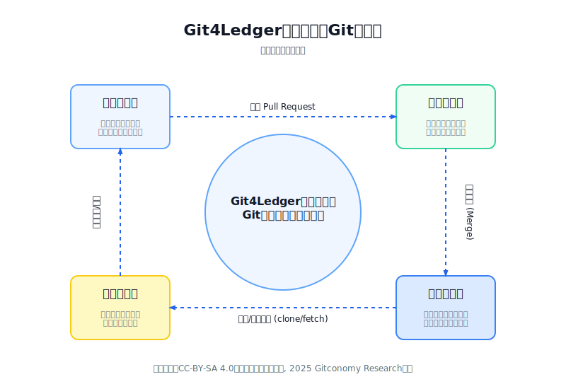
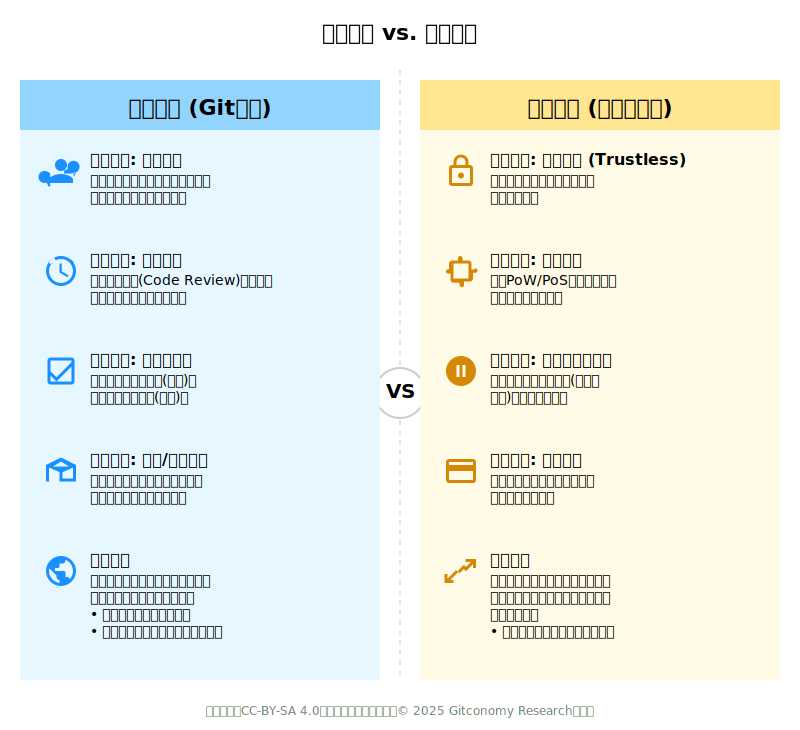
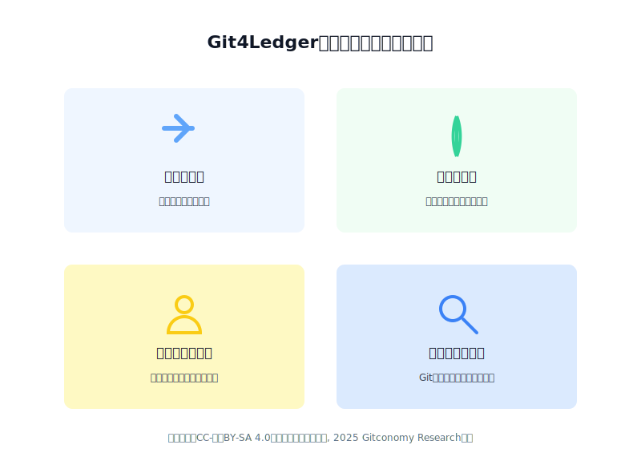
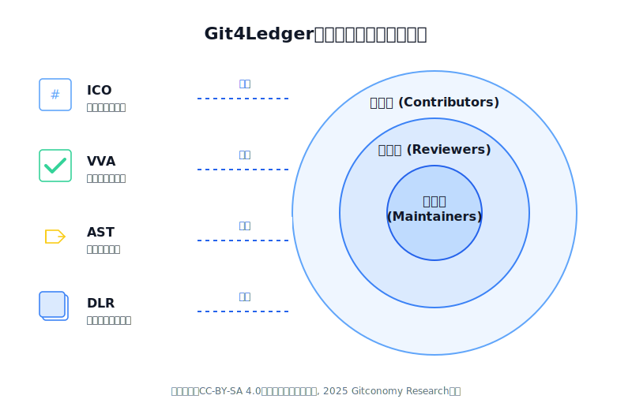
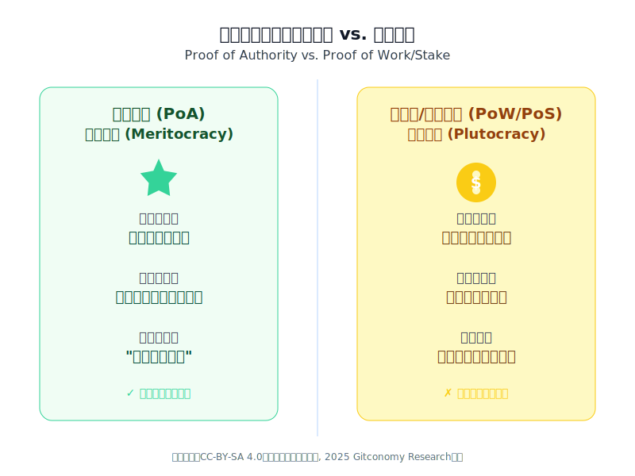
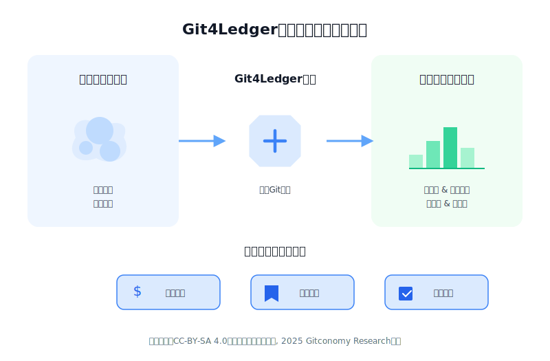

# Git4Ledger：一个基于Git原生工作流的贡献价值账本理论框架的思考
## 前言

### 问题陈述

在过去四十多年中，开源运动创造了难以估量的社会价值——从Linux内核到深度学习框架，从编程语言到基础设施工具，充分展示了分布式工作的巨大力量。开源软件（OSS）的开发模式在很大程度上依赖于一个充满激情和奉献精神的全球社区。开发者们基于个人兴趣和技术能力自发选择参与项目，形成了独特的协作文化。这种模式催生了无数改变世界的技术基石。

然而，这种依赖于内在动机和无偿贡献的“用爱发电”模式，也带来了其固有的可持续性挑战。一个根本性的矛盾始终困扰着这个生态系统：价值的创造者与价值的获取者严重脱节。传统开源项目依赖"用爱发电"的模式，其激励机制存在三大核心缺陷：

1. **贡献不可见性：** 除了代码提交，大量的 Code Review、Issue 讨论、文档撰写等隐性劳动难以量化。
2. **价值分配滞后性：** 当项目产生商业价值时，早期贡献者往往已经离开。
3. **激励不可持续性：** 缺乏即时反馈机制，导致贡献者流失和项目衰退。

<!-- end list -->

当项目规模扩大、维护成本增加时，缺乏一个公平、透明且轻量级的价值记录与激励系统，这种脱节导致了价值创造与价值捕获之间的鸿沟，成为了制约开源社区长期健康发展的核心难题。

### 解决方案：Git4Ledger贡献价值账本

Git4Ledger框架的提出，正是为了直面这一挑战，旨在为开源社区提供一个内生的、可持续的价值确认层，从而解决开源协作中的激励难题。

我们的根本洞察是：Git本身已经是一个分布式账本系统，这些信息构成了一个完整的价值创造叙事：

>- **谁（committer/reviewer）**
>- **何时（timestamp）**
>- **做了什么（diff）**
>- **经过谁的验证（code review approval）**
> - **为什么这样做（commit message）**

 
*图：Git4Ledger重新诠释Git工作流*

Git4Ledger旨在将开发者日常使用的Git工作流重新诠释为一个完整的价值创造和验证闭环，通过系统化地捕捉、验证和记录每一个贡献行为，将隐性价值转化为显性资产，从而实现：

1. **贡献即资产：** 每一次有价值的提交、审查和讨论都被视为创造者的数字资产。
2. **流程即验证：** 日常的协作流程（如 Pull Request、Code Review）同时作为价值的验证机制。
3. **透明即信任：** 所有贡献及其评估过程完全透明，构建社区信任基础。
4. **记录即激励：** 准确的价值记录成为社区激励和治理的基础设施

<!-- end list -->

Git4Ledger不仅记录"谁做了什么"，更记录"谁创造了多少价值"，从而为解决开源世界"用爱发电"的困境提供了一条可行路径。其应用范围超越了传统软件开发，延伸至学术研究、开放数据倡议，乃至去中心化的政策制定 。它旨在为那些依赖于协作、迭代和可验证历史图形即代码——像管理代码一样管理图形的领域提供一个基础架构。

我们并非要用一套冰冷的经济模型取代这种宝贵的奉献精神，而是要构建一个能够有效识别、记录并认可开源社区中内在价值的系统，这是将开源社区中早已存在的、隐性的“声誉经济”显性化、可读化的自然演进。

---

## 一、理论体系：从算法共识到社会协议

Git与区块链技术在底层都采用了默克尔树（Merkle Tree）来组织数据，这使得它们的结构在表面上具有相似性。然而，两者最根本的区别在于共识机制。区块链依赖于预设的、计算密集型的算法（如工作量证明）来达成去中心化的共识，而Git本身并不包含这样的自动化共识协议。在Git的世界里，共识是由用户明确发起的、人为驱动的过程。

 
*图：社会共识和算法共识的比较*

### 1.1 算法共识（区块链模型）

工作量证明（PoW）或权益证明（PoS）等机制，其设计的初衷是在一个匿名的、互不信任的对抗性网络中达成状态一致。它们通过引入巨大的经济成本（算力或质押）来确保作恶的代价极其高昂，从而维护网络安全 。

区块链试图用算法共识（PoW/PoS）解决信任问题，但在开源协作场景中暴露出根本性的不适配：

|区块链特性|开源协作现实|冲突点|
| :---: | :---| :---|
|去信任化（Trustless）|基于声誉的信任网络|强行去信任破坏社区文化|
|算法验证|人类判断代码质量|代码价值无法用算法衡量|
|匿名性|开发者需要身份声誉|匿名性削弱责任制|
|高能耗共识|轻量级协作资源浪费且不环保|金融原语技术协作原语将协作简化为交易|

### 1.2 社会共识（Git模型）

与之相反，开源社区并非一个“零信任”环境。它是一个基于声誉的系统，信任是通过持续的高质量贡献逐步建立和积累的。一项贡献是否有效、是否应被接纳，其共识是通过一个社会化的流程达成的。Git的工作流本质上是一套社会协议（Social Protocol）：

- **信任而验证：** 维护者拥有合并权限（信任），但所有历史可追溯（验证）。
- **同行评审：** Code Review 是人类专家的价值判断，优于算法。
- **声誉累积：** 贡献记录构成了开发者的公开简历。
- **分叉机制：** 不满者可以fork，形成退出权和制衡。

<!-- end list -->

在高信任的专业社区中，社会共识机制往往比算法共识更高效、更符合人性。对于知识创造和协作这类复杂的人类活动，僵化的算法共识远不如一个充满情境感知、细致入微的社会性共识协议（社区规范、同行评审、维护者决策）来得有效和精确。这是一种基于赢得的权威与专业知识的共识，而非算力或资本的共识。

## 二、Git4Ledger的理论框架设计

Git4Ledger理论框架的独特性在于其共识机制的选择：对于开源协作这一特定场景，我们无需依赖计算密集型的“算法共识”，而是可以完全信任并利用其内生的、高效的“社会共识”。Git4Ledger的核心主张：社会协议在开源协作场景中比算法共识更有效、更公平、更可持续。

### 2.1 Git4Ledger的四大原语

基于上述核心论点，Git4Ledger框架建立在以下四个原语之上，它们共同构成了对Git工作流的价值层抽象,将Git的版本控制能力映### 1.1 社会共识 vs. 算法共识射为价值记录能力。

 
*图：Git4Ledge构成了对Git工作流的价值层抽象*

#### 2.1.1 不可变贡献对象 - Git提交

Git的底层是一个内容寻址文件系统，其中的每一个对象（包括`blob`、`tree`和`commit`）都通过对其内容和头部信息进行SHA-1哈希运算，从而获得一个唯一的标识符。一个`commit`对象的哈希值，不仅取决于其自身的元数据（如作者、提交信息、时间戳），还包含了指向当前项目状态快照（tree对象）的指针，以及至关重要的、指向其一个或多个父`commit`对象的哈希值。.

这种设计创造了一个环环相扣、无法被轻易篡改的密码学链条。任何对历史提交内容的微小改动，都会导致其哈希值发生变化，进而使其后续所有提交的哈希链断裂，这种篡改行为极易被发现。因此，每一个`commit`对象都是一个完美的、密码学密封的、包含了作者、时间、意图和代码快照的贡献记录。在Git4Ledger中，我们将这样一个`commit`对象定义为不可变贡献对象（(Immutable Contribution Object, ICO)），它是价值记录的原子单位，具备非同质化、可验证和可追溯的特性。

#### 2.2.2 可验证价值认证 - 拉取请求与代码审查

拉取请求（`Pull Request`）不仅仅是一个代码合并的请求，它在开源协作中扮演着一个公开论坛的角色，专门用于讨论和审查新的贡献。在这个过程中，社区成员，尤其是具备良好声誉的同行，对提交的一系列ICO进行审查。当一位受信任的审查者留下“批准”（`Approve`）的意见时，这一行为在Git4Ledger中被定义为一次可验证价值认证（(Verifiable Value Attestation, VVA）。

这是一种人为的、基于专业判断的价值确认行为。整个`Pull Request`的讨论记录、修改过程以及最终的批准状态，共同构成了一份公开、透明且可供审计的认证档案。它证明了所提交的ICO已经通过了社区的社会性共识检验。信任在此过程中至关重要，一个项目的声誉和贡献者的历史记录，会显著影响其贡献被接受和信任的程度。VVA正是将这种.基于声誉和信任的隐性判断，转化为一个明确、可记录的验证事件（Validation Event, VE）————这是对一次社会共识行为的不可变的公开记录。

验证事件将一个特定的行动者（如审查者或维护者）与一个特定的CO关联起来。验证事件的类型可以是 Approve（批准）、RequestChanges（请求修改）或 Ratify（合并确权）。每一条验证事件都应由行动者的密钥签名，并包含时间戳和其所验证的CO的引用。来自高声誉同行的 Approve 是一个强烈的积极信号，而来自核心维护者的 Ratify 则是最终的价值确认。

#### 2.2.3 权威状态转移  - 合并事件

开源社区通常呈现出一种“洋葱模型”或“核心/外围”的社会结构。位于结构核心的是项目的维护者（Maintainers），他们是社区中最受信任的成员，负责保障项目的质量、方向和一致性。当一个PR经过充分的审查和认证（VVA）后，由维护者执行的`git merge`操作，是价值闭环的最后一步，也是最关键的一步。

在Git4Ledger中，我们将这个合并事件定义为一次权威状态转移（Authoritative State Transition, AST）。它代表着由社区授权的权威角色，正式将一个或多个经过验证的ICO从一个临时状态（特性分支）转移到项目的规范状态（如main或develop主干分支）。这个权威证明（Proof of Authority）等同于区块链中的矿工成功将一个新区块添加到主链上的工作量证明（Proof of Work），它标志着一笔“价值交易”的最终确认，并永久性地更新了项目的共享状态（即代码历史）。

#### 2.2.4 去中心化账本复制 - git clone/fetch协议
...
Git作为一个分布式版本控制系统，其设计哲学决定了每个参与者都拥有项目的完整历史副本。当一个开发者执行git clone或git fetch命令时，他们不仅仅是在下载代码，更是在复制整个项目的完整演化历史——即由ICO、VVA和AST共同构成的价值账本 (Value Ledger, VL)。这是所有贡献与验证交互的、不可篡改的、仅可追加的日志。VL并非一个独立的数据库，它就是Git仓库本身的提交历史有向无环图（DAG）。通过一个诠释层，我们可以从提交信息、PR元数据和签名标签中解析出CO和VE。其完整性由Git自身的密码学哈希链保证，每个提交都包含了其父提交的哈希，构成了一个防篡改的默克尔树结构。这使得Git本身成为了“区块链”，而无需引入区块或挖矿的概念。

我们将这个内建的同步机制定义为去中心化账本复制（Decentralized Ledger Replication， DLR）。它确保了价值账本的高度弹性和透明性。与依赖中心化服务器的账本不同，Git4Ledger的记录被复制并存储在成百上千的开发者计算机上。任何人都可以在本地独立地审计从项目创世以来的每一次贡献、每一次审查和每一次合并，而无需依赖任何第三方工具或权威机构。这种分布式的特性，为账本的完整性和不可篡改性提供了天然的保障。

值得注意的是，Git中备受争议的git rebase（历史重写）功能，在Git4Ledger的视角下得到了新的诠释。区块链的不可变性是绝对的、算法强制的；而Git的不可变性则是一种社会契约。开发者被鼓励在自己的本地“工作间”（未共享的特性分支）内使用rebase来整理和优化他们的ICO序列，以提高贡献质量。然而，将重写后的历史强制推送（force push）到共享的公共分支，则是一种被普遍谴责的、破坏社会共识的行为。Git4Ledger承认并利用了这种区别：贡献在提交审查前是可变的、可优化的，一旦进入社会性共识流程（PR）并被最终接纳（Merge），它就达到了“社会性不可变”的状态。这种在最终确认前保留优化空间的灵活性，恰恰是僵化的纯追加式系统所缺乏的，也更符合知识创造工作的迭代本质。

### 2.2 将Git工作流重塑为分布式账本

基于Git四大原语的分析，我们可以得出一个深刻的观察：我们所熟知的Git协作流程，本身就是一个完整、自洽的价值创造、验证与确权的闭环系统。它天然地扮演着一个记录智力贡献的分布式账本角色。通过对这一流程的重新诠释，我们可以在不改变开发者任何现有习惯的前提下，构建一个零摩擦的价值记录系统。

我们将标准的Git协作流图形即代码——像管理代码一样管理图形程的每一个环节，映射到一个价值流转的生命周期阶段。这种映射证明了Git4Ledger的实施无需引入新的操作，而是对现有行为的价值发现。

1. **价值提案 (`The Commit`)：** 每一次 git commit 都是价值创造的原子单元。它代表了一位开发者提出的一个离散、自包含的价值增量——可能是一段代码、一篇文档或一个关键的错误修复。每一个提交都拥有一个基于其内容生成的唯一加密哈希值，使其成为一份不可篡改、附有作者戳记的价值提案，正式进入系统。

2. **价值聚合 (`The Pull Request`)：** 一个Pull Request (PR) 是将一系列相关的价值提案（Commits）正式整合进项目“主干”的请求。它如同一个价值清单，将相关的贡献打包，并提交给社区进行集体审议。在这一刻，私有的价值提案转变为公开的、等待被纳入公共账本的候选条目。

3. **价值验证 (`The Code Review`)：** 这是Git4Ledger社会共识机制的核心。代码审查（Code Review）本质上是一场点对点的价值审计。社区成员对提案的价值进行严格审视，提出的赞同（Approve）、修改建议（Request for Changes）或评论，都是在对这份贡献的元数据进行丰富和验证。这个过程，正是区块链协议试图通过复杂算法来模拟的“人在环路”（Human-in-the-Loop）验证机制。

4. **价值确权 (`The Merge`)：** 由项目维护者（Maintainer）执行的 git merge 操作，是为整个价值流转过程画上句号的权威性行为。它标志着社区对这份新价值的正式接纳。合并提交（Merge Commit）通过密码学方式，将新的贡献分支永久地编织进项目的主历史线中——即价值账本。至此，提案中的价值被正式确权，成为项目“共同真相”的一部分。

<!-- end list -->

这个流程天然地构成了一个无需外部干预的价值确认循环。开源社区早已在无意识中实践着这套高效的分布式记账协议。PR工作流就是一个久经考验的、以人类专业判断为核心的验证协议。它并非一个需要从零开始发明的新技术，而是对一个已被全球数百万开发者内隐信任和使用的社会流程的形式化定义。这种设计确保了系统的采纳成本趋近于零，因为所有的“交易”（提交、审查、合并）都是开发者早已在日常工作中执行的操作。价值的捕获来自于观察与诠释，而非强加新的行为负担，这与需要用户管理钱包、理解Gas费并与独立生态系统交互的区块链方案形成了鲜明对比。

### 2.3 Git4Ledger与区块链激励系统的对比

区块链技术在管理无信任环境下的金融资产方面表现卓越，但对于管理一个基于声誉和信任的知识贡献社区而言，它可能是一种架构错配。

下表从多个关键维度，对Git4Ledger与传统区块链系统进行了对比，揭示了两者在设计哲学与适用场景上的根本差异。

| 维度 | Git4Ledger | 传统区块链 (例如以太坊) | 对比分析 |
| :--- | :--- | :--- |:--- |
| **数据结构** | Git提交的有向无环图 (DAG)，即默克尔树 | 由区块组成的线性链条 (内部包含默克尔树) | 两者都基于密码学哈希链保证数据完整性，但Git的图形结构更灵活地反映了协作的非线性特征。|
| **共识机制** | 社会共识 (同行评审 & 维护者权威) | 算法共识 (PoW/PoS) | 这是核心区别：用社区内生的、高效的社会信任机制，替代昂贵的、为零信任环境设计的算法。 | 两者均不可篡改，但区块链增加的经济安全层对于记录贡献而非金融资产而言，属于过度设计。|
| **信任模型** | 逐步建立的信任 (基于声誉) | 无需信任 (由加密经济学保障) | Git4Ledger是以人为本的模型，区块链是以机器和经济激励为本的模型。前者更符合协作社区的本质。|
| **不可篡改性** | 密码学强制 (通过提交哈希链) | 密码学与经济学双重强制 (哈希链+攻击成本) |
| **交易成本** | 可忽略不计 (标准Git操作的成本) | 可变且可能高昂 (Gas费用) | 关键的实用优势。Git4Ledger不给贡献者增加任何额外的经济负担。|
| **能源消耗** | 极低 (现有服务器与计算成本) | 极高 (PoW) 到中等 (PoS) | 巨大的伦理和实践优势，尤其对于一个以研究为核心的社区。|
| **治理模式** | 社区精英治理 (维护者) | 链上/链下协议治理 (代币投票等) | 遵循并强化了开源社区久经考验的治理模式，而非引入复杂的、可能导向资本驱动的治理结构。|
| **原生环境** | 无缝集成于Git/GitCode工作流 | 外部、并行的生态系统 (钱包、节点、浏览器) | 强调了Git的零摩擦和共生特性，它增强而非替代现有工具。 |

### 2.4 Git4Ledger账本的贡献激励特征

通过上述对比，Git4Ledger作为贡献激励系统的特点：

 
*图：Git4Ledger激励机制的系统特点*

1. **零摩擦接入：**  这是该模型最突出的实践优势。开发者无需学习新工具、管理加密钱包或理解复杂的代币经济学。他们只需继续使用他们每天都在使用的Git和代码托管平台（如GitHub、GitLab）即可参与价值创造和记录。

2. **轻量与高效：** 该系统从根本上规避了区块链共识机制带来的巨大计算、能源和财务成本。价值验证所需的“算力”是社区成员进行同行评审的智力劳动，这部分工作本就是开源项目质量保障的核心环节
Git4Ledger只是将其结果进行了形式化记录。

3. **以人为本的验证：** 这是其最核心的理论特征。算法可以验证一个数字签名的有效性，但无法判断一段代码的质量、一个设计的优雅程度，或一个贡献的战略价值。社会性共识允许充满细微差别和上下文感知的价值判断，这是自动化流程永远无法企及的。它承认并尊重了在知识创造领域中，人类专家的判断力是最终的价值标尺。

4. **内生的可审计性与透明度：** 整个价值账本就是一个标准的Git仓库。任何人都可以通过git log、git show、git blame等通用命令，在本地完整地克隆、检查和审计全部历史记录。这种完美的透明度，无需依赖任何专门的区块浏览器或第三方服务。

<!-- end list -->

归根结底，Git4Ledger是一个“领域特定的账本”。它的设计选择，例如依赖社会共识和允许在提交前修改历史，在一个需要无信任环境的金融系统中可能是致命弱点。然而，在一个以信任为基础、以协作创造高质量知识产品为目标的系统中，这些恰恰是其力量所在。这表明，不存在一种“放之四海而皆准”的账本技术。最优的设计必须与其应用的社会技术环境共生。Git4Ledger之所以优于区块链方案，正是因为它从设计之初就旨在与开源协作这一独特的社会技术系统深度融合，而不是试图用一个通用的、无信任的模型来取代它。

---

## 三、文化契合度：为什么Git4Ledger是开源社区的"自然演化"

一个技术框架的成功，不仅取决于其技术上的优越性，更在于它是否能与所在社区的文化和价值观产生共鸣。Git4Ledger的设计并非凭空创造，而是对开源社区现有社会结构的深度映射和形式化表达。Git4Ledger不会颠覆一个健康开源项目既有的精英治理结构，反而会通过数据化、透明化的方式使其更加巩固和明确 。

### 3.1 将Git4Ledger原语映射到社区角色的“洋葱模型”

开源社区的“核心/外围”结构为Git4Ledger的社会性共识机制提供了天然的组织基础。我们可以将框架的四大原语与社区中的不同角色进行精确的对应：

 
*图：Git4Ledger原语与社区角色映射关系*

1. **贡献者 (外围/协同开发者)**

贡献者是价值创造的主要来源，是不可变贡献对象 (ICO) 的生产者。他们的工作构成了整个价值链的起点。拥有了一份关于其贡献的、不可篡改的公开记录，这增强了他们的成就感和归属感。

2. **审查者 (核心与协同开发者)**

审查者是价值验证的关键环节，是可验证价值认证 (VVA) 的执行者。他们通过代码审查，将自己的专业知识和社区声誉注入到验证过程中。执行VVA的能力，直接源于他们在社区中通过持续贡献所积累的信任。代码审查这一至关重要但常被忽视的幕后工作，被提升为一种一级贡献（通过验证事件VE被记录）。这激励了社区成员投入更多精力进行高质量的审查，从而提升整个项目的代码质量。

3. **维护者 (核心开发者)**

维护者是价值整合的最终权威，是唯一被授权执行权威状态转移 (AST) 的角色。这种权威并非来自职位或权力，而是源于社区基于其长期贡献、技术远见和公正判断所赋予的信任和委托。他们作为项目质量最终裁决者的角色得到了正式的承认和尊重。他们执行的 Ratify VE在声誉计算中拥有最高权重，这使其权威性建立在可追溯的、对项目负责任的行动之上，而非仅仅是一个头衔。

4. **通用协议 (Universal Protocol)**

“去中心化账本复制 (DLR)”是一个适用于所有角色的基础协议 。当任何参与者执行`git clone`或`git fetch`命令时，他们都在复制整个项目的完整演化历史，即价值账本。这个内建的同步机制确保了价值账本的高度弹性和透明性，并允许任何人独立审计全部历史记录。

<!-- end list -->

以上的映射关系表明，Git4Ledger并非在社区中强加一套新的等级制度，而是为早已存在的、基于能力和声誉的非正式结构提供了一套清晰、可操作的定义。

### 3.2 以信任为共识燃料：贤能治理优于资本治理

Git4Ledger的共识模型与许多区块链系统（尤其是DAO治理模型）形成了鲜明对比。在后者中，影响力或投票权往往与持有的代币数量成正比，这可能导致“资本治理”（Plutocracy）的局面。而在开源世界中，影响力和领导力是通过持续的高质量贡献、帮助他人和建立共识来赢得的，而非购买得来。

Git4Ledger完全拥抱并强化了这种基于精英治理/贤能治理（`Meritocracy`）的模式。在Git4Ledger中，一个认证（VVA）的“权重”或执行合并（AST）的“权力”，完全取决于个体在社区中赢得的声誉和信任。这是一个以贡献和专业能力为燃料的共识引擎，与开源社区“`代码胜于雄辩`（Talk is Cheap, Show Me The Code)”的核心价值观完美契合。

 
*图：权威证明共识机制vs工作量/权益证明共识机制*

将开源社区的社会共识机制理解为一种精英治理的、委托式的权威证明（`Proof-of-Authority`），有助于与区块链世界建立沟通的桥梁。维护者就是那些通过长期贡献和专业判断赢得了社区信任的“验证人”。而声誉分值（Reputation Score,RS）则构成了对抗“女巫攻击”（Sybil Attack）的坚固防线。在区块链中，抵抗女巫攻击依赖于高昂的算力或资金成本。在Git4Ledger中，攻击成本转变成了社会劳动成本。创建一个新账户是零成本的，但要让这个账户做出能被现有高声誉成员认可的、有价值的贡献，从而建立起有意义的声誉，则是极其困难且耗时的。这为协作型社区提供了一种更为内生和稳固的安全保障。

`Proof-of-Authority`设计巧妙地实现了“链上”与“链下”的平衡。Git仓库本身扮演了“链上”基底的角色——一个全球复制、密码学安全的数据层。而CO和VE的解析以及RS的计算，则是一个“链下”过程，任何节点只需克隆仓库并运行解析脚本即可完成。这意味着账本既是完全去中心化和可验证的，又是极其高效的，记录“交易”没有任何“Gas费”。

### 3.3 彻底的透明、公平与可审计性

由于价值账本就是Git的提交历史，它实现了彻底的透明化。任何社区成员都可以随时克隆（clone）代码仓库，独立地运行解析脚本，验证从创世以来的每一笔贡献和每一次验证 2。这种无需许可的审计能力，从根本上杜绝了账本被中心化操控的可能，保障了系统图形即代码——像管理代码一样管理图形的公平性，从而建立起更深层次的社区信任。

更进一步，这种基于通用Git操作的原语设计，催生了**声誉可移植性**的可能。目前，开发者的声誉往往被局限在特定的社区内。Git4Ledger框架则有望将这种非正式的、局域的声誉，转化为一种标准化的、可跨项目验证的数字凭证。一位在Gitcoomy社区A项目中获得高RS的成员，可以在加入B项目时，凭借这份可验证的声誉，快速获得初始信任，从而加速跨项目的协作与知识流动。声誉，将从一种固化的社会资本，演变为一种流动的、可互操作的数字资产。

最后，整个系统形成了一个促进质量提升的正向反馈循环。为了提升个人RS，贡献者必须提交高质量的CO。为了让CO被接纳，他们需要获得高RS审查者的正面VE。而审查者为了提升自己的RS，也必须提供有洞察力的、被社区认可的审查意见。这个环环相扣的机制，将个人激励与项目Git4Ledger并非在创造Git4Ledger并非在创造整体质量的提升紧密地绑定在了一起。

### 3.4 形式化隐性价值：让声誉经济变得可计算

开源社区早已存在一个复杂而强大的隐性经济系统——声誉经济。贡献者的影响力、项目的吸引力、社区的凝聚力，都围绕着声誉的产生、积累和消耗而运转 。然而，这个系统长期以来都是非结构化的、难以量化的。

 
*图：Git4Ledger让声誉经济变得可计算*

Git4Ledger最重要的文化贡献，就是将这个隐性的声誉经济变得显性化和机器可读。它并不创造价值，而是提供了一种标准化的方法来记录和查询社区已经承认的价值。通过解析Git历史，我们可以构建一个精细的贡献图谱，清晰地展示出谁在何时、以何种方式、创造了何种价值，以及这些价值是如何被社区同行验证和接纳的。这个可计算的声誉账本，为建立公平、透明的激励机制（如资金分配、贡献排名、技能认证等）奠定了坚实的数据基础，同时又不会破坏社区原有的协作文化。

此外，这个框架还为解决大型分布式项目中的信任扩展问题提供了新的思路。随着项目规模的增长，任何一个维护者都无法认识和信任所有的贡献者。Git4Ledger通过其原语记录，将信任从一种纯粹的个人关系，转变为一种可传递的、基于网络的属性。一个维护者可能不认识某个新贡献者，但他们可以看到这个贡献（ICO）得到了一系列其他受信任的开发者（VVA）的背书。因此，维护者执行合并（AST）的决策，就不再仅仅依赖于个人审查，而是基于整个信任网络聚合后的认证信息。这使得项目的治理模式更具可扩展性和韧性。

## 结论：Git4Ledger理论框架的前进之路

Git4Ledger理论框架为我们描绘了一个零摩擦、文化原生、轻量高效的基于社会共识的贡献评价蓝图，旨在使开源社区中无形的贡献变得清晰、可衡量且有价值。它通过将开发者熟悉的Git工作流重新诠释为价值创造和验证的闭环，并以社会性共识替代算法共识，完美地契合了开源世界的协作精神和组织结构。该框架不仅为解决“用爱发电”的激励困境提供了理论基础，更有潜力催生一个更加公平、透明和可持续的全球协作生态系统。

这份草案并非终点，而是Gitcoomy社区开启新一段开放研究与开发旅程的起点。为了将Git4Ledger从一个理论框架转变为一个可用的实践工具，我们在此向社区发出行动倡议，并提出以下后续步骤：

1. **制定技术规范：** 共同研讨并制定一份详细的技术规范，定义如何解析一个Git仓库及其关联平台（如GitHub API）的元数据，从而构建一个结构化的、可查询的贡献图谱（Contribution Graph）。
2. **开发原型工具：** 鼓励社区成员基于该规范，开发用于可视化和分析贡献数据的原型工具。一个能够直观展示个人贡献历史、社区认证网络和项目价值流动的仪表盘，将是验证该框架价值的有力证明。
3. **探索激励模型：** 在拥有可验证的价值账本之后，下一步是探索如何利用这些数据来驱动公平的激励机制。社区可以就此展开讨论，例如：如何基于贡献数据自动分配项目资金或社区捐赠？如何生成可验证的数字贡献证书？如何构建更加客观的社区成员声誉系统？

<!-- end list -->

我们诚挚地邀请Gitcoomy社区的每一位成员参与到这场讨论中来，审视、批判并完善Git4Ledger的理论。让我们共同努力，将这一创新理念付诸实践，为全球的开放研究和开源协作开创一个更加繁荣和可持续的未来。

[Git4Ledger理论框架信息图](./assets/git4ledger-framework-infographic.pdf)

---

## 许可声明

本文档采用[知识共享署名--相同方式共享4.0国际许可协议(CC BY--SA 4.0)](https://creativecommons.org/licenses/by-sa/4.0/deed.zh)进行许可，&copy; 2025 Gitconomy Research社区
