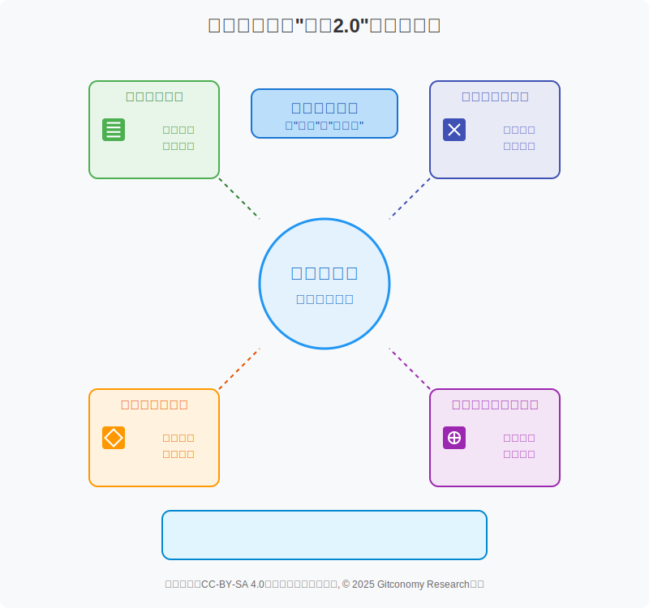
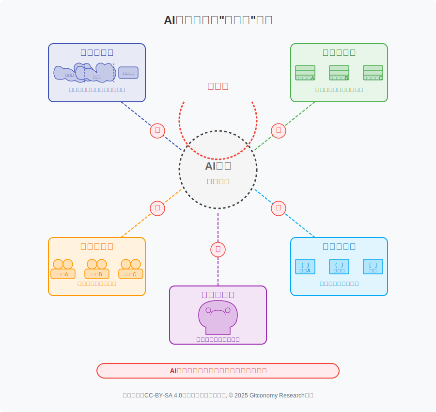
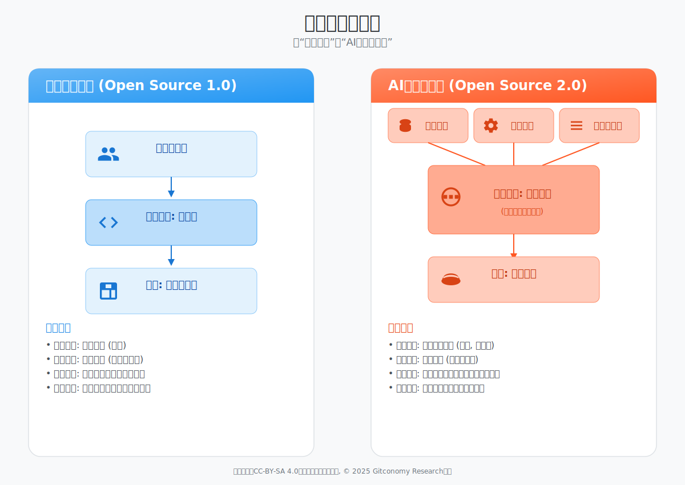
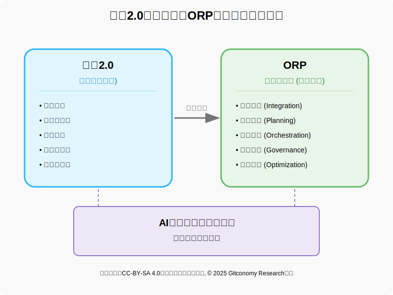
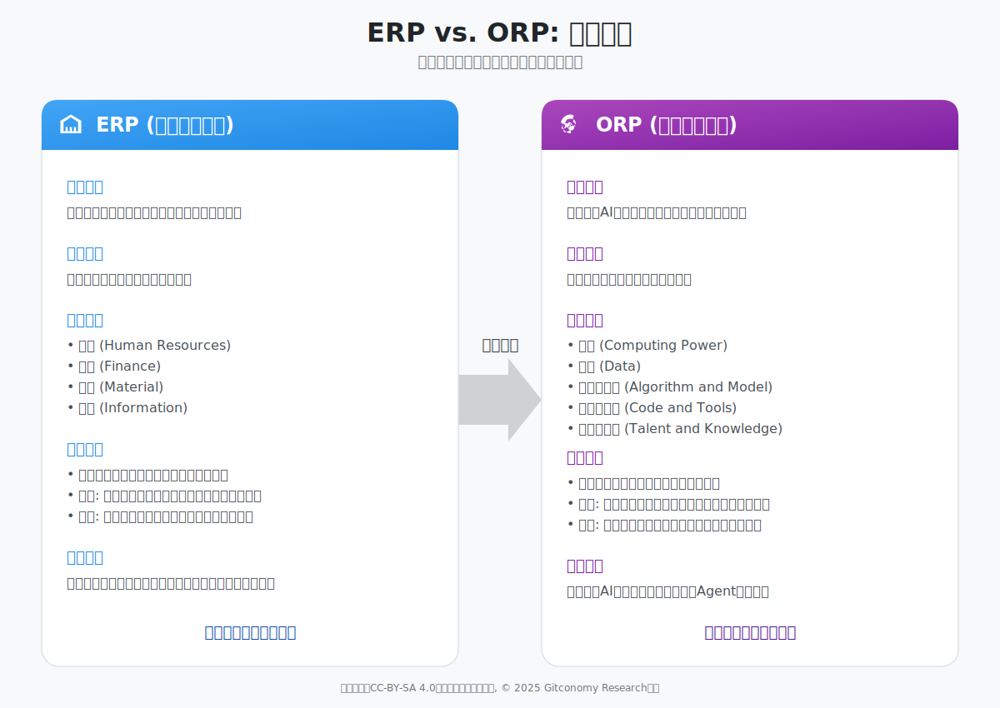
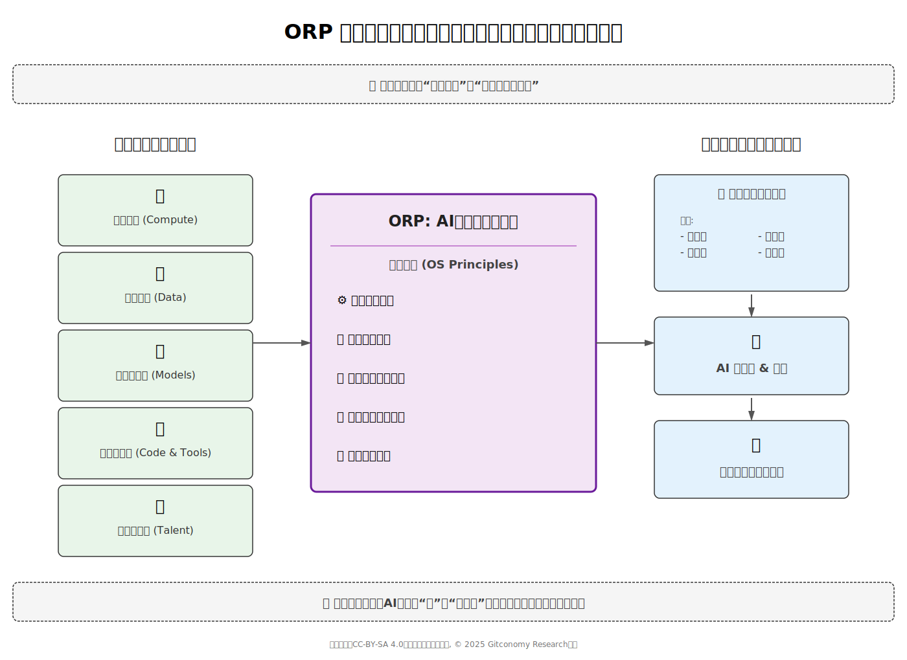
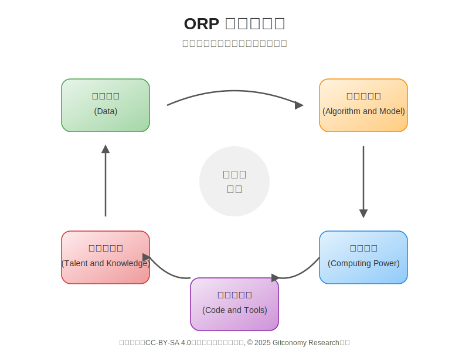
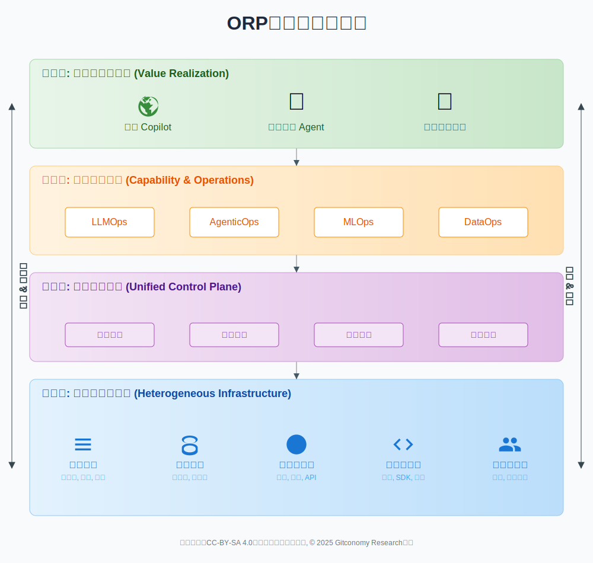
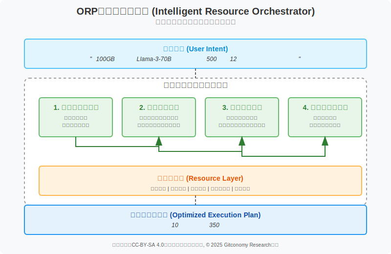
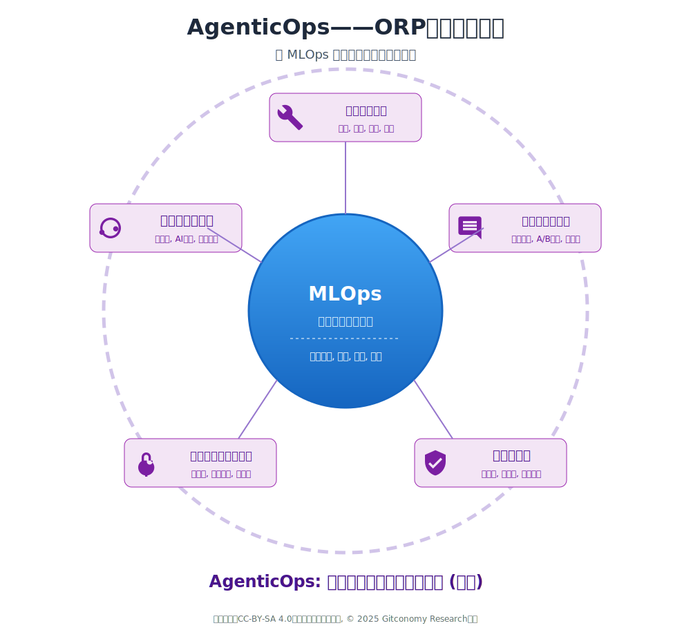

# 开放资源规划 (Open Resource Planning, ORP) 理论框架初步思考

## 摘要

本文系统性地提出并阐述了**开放资源规划（Open Resource Planning, ORP）** 理论框架的初步构思。我们认为，Agentic AI 时代正在深刻地重新定义“开放”的内涵，使其从传统的“源代码开放”演进为涵盖算力、数据、模型权重、代码与知识在内的“生产力要素开放”。这一新范式暴露了传统管理模式的不足，导致企业在AI生产中面临核心资源的“大分散”困境，极大地阻碍了创新效率和价值转化。

ORP框架，正是为应对这一挑战而生。它借鉴企业资源计划（ERP）的核心思想——整合、规划、优化——旨在成为AI时代智能生产的**“操作系统”。该框架围绕算力、数据、算法与模型、代码与工具、人才与知识**五大核心支柱，提供了一套系统性的管理策略与架构蓝图。通过建立统一的“控制平面”对底层资源进行抽象、编排和治理，ORP致力于将全球范围内开放的及企业内部私有的AI生产要素，高效、安全、低成本地转化为可复用、可规模化的智能能力。

本报告详细论述了ORP的缘起、核心架构、五大支柱的管理策略、实施路径图，并将其与传统开源模式进行对比，以凸显其范式级的转变。最终，ORP旨在为企业提供一套清晰的方法论，打通从资源到价值的“最后一公里”，成为企业完成从信息化、数字化到**“数智化（Intelligentization）”**终极跃迁的核心基石。

---

## 一、重新定义“开放”——ORP的缘起

### 1.1 第一波“开放1.0”即源代码

过去三十年，“开放”是信息技术革命中最激动人心的词汇。它有一个清晰、明确的指向：源代码的开放。以Linux、Apache和后来的GitHub为代表，开源运动构建了一个去中心化的、以代码为媒介的全球协作网络。开发者共享、审查、复用彼此的代码，极大地降低了软件开发的成本，加速了技术创新的步伐。

*图：开放1.0示意图*

可以说，以代码为核心的“开放1.0”模式，是整个互联网时代的基石。 它的成功，源于其价值单元的单一性——代码即是价值本身。然而，当我们迈入Agentic AI的门槛，这块基石开始动摇。

### 1.2 第二波浪潮：“开放2.0”的内涵重构

大型语言模型的出现，彻底改变了价值创造的核心。一个真正有能力的AI，其价值载体不再是单一的代码，而是一个复杂的**能力集合体**。这就迫使我们必须重新审视“开放”的内涵：

1. **开放模型权重，而非仅仅是训练代码**： 只开放训练代码而不提供模型权重，如同共享一张顶级跑车的图纸却不提供发开放资源规划 (Open Resource Planning, ORP) 理论框架初步思考动机。模型权重本身，才是凝结了海量算力和数据智慧的核心资产。Hugging Face的崛起，本质上就是模型权重开放的胜利。

2. **开放高质量数据，而非仅仅是算法逻辑**： 在AI领域，数据是塑造智能的“燃料”。一个精巧的算法跑在垃圾数据上，产出的依旧是垃圾。开放高质量的、经过清洗和标注的微调数据集，其价值甚至超过了模型本身。

3. **开放对算力的可及性，而非仅仅是软件工具**： 没有强大的算力，再开放的模型和代码也只是一纸空谈。真正的开放，必须包含让更多人能够以合理成本、高效地调度和使用算力的机制。

4. **开放验证方法与知识，而非仅仅是代码文档**： 如何设计有效的Prompt？如何客观地评估Agent的能力？这些隐性的知识和方法论，是决定AI应用成败的关键。将这些“know-how”开放出来，是实现群体智慧跃迁的前提。

*图：开放2.0的关键内涵*

因此，AI时代的“开放2.0”，是一种超越源代码的、涵盖了生产全要素的、系统性的开放。它开放的不再是**图纸**，而是**生产线**本身。

### 1.3 新范式下的困境：生产要素的“大分散”

大型语言模型（LLM）和智能体（Agent）的崛起，标志着价值创造的范式已从**“代码为中心”转向了“资源为中心”。一个高效的AI智能体，是五种异构资源的有机结开放组合体。这场“开放”内涵的深刻变革，恰恰暴露了我们当前工具链和方法论的滞后。这些被“开放”出来、价值连城的生产要素——开源模型、公共数据集、API工具、前沿论文——正以一种爆炸性的、无序的方式散落在全球互联网的各个角落。

1. **算力孤岛化**： 公有云、私有云、边缘节点的算力资源池彼此割裂，无法形成统一的视图，调度难、利用率低、成本失控。
2. **数据沼泽化**： 数据散落在不同的业务系统和数据库中，格式不一、质量参差，从数据中提炼出可供模型使用的“燃料”的过程，如同在沼泽中淘金，成本高昂且效率低下。
3. **模型作坊化**： 模型的获取、微调、评估和部署，高度依赖于各个小团队的“手工作坊”模式。缺乏统一的标准和流程，导致大量重复劳动，且模型质量、安全性难以保证。
4. **代码碎片化**： 与Agent相关的开发框架、工具链、技能插件散乱无章，无法形成可复用的能力组件，每个新项目都“从零开始造轮子”。
5. **知识隐性化**： 关键的知识，如Prompt工程技巧、模型评估经验、失败教训等，大多留存在少数专家的“大脑”里，无法沉淀为组织的核心资产，人才的流失可能导致关键能力的断层。

*图：AI生产要素的分散性*

这种“大分散”状态，导致了巨大的**生产摩擦力**。它使得AI的开发周期漫长、成本高企、风险不可控，严重阻碍了企业从“数字化”向“数智化”的深度转型。

### 1.4 ORP的提出：为新一代“开放”构建承载平台

传统的、围绕GitHub进行代码协作的模式，显然无法管理和编排如此复杂、异构的资源体系。传统的DevOps或MLOps在一定程度上解决了代码和模型的CI/CD问题，但它们并未从根本上解决跨越多维资源的全局规划与协同问题。我们拥有了新时代的、更强大的“开放”资源，却仍在使用旧时代的“地图”和“交通工具”。巨大的“生产摩擦力”由此产生，AI的潜力被严重束缚。

*图：开放范式的演进*

ORP的提出，正是为了解决上述核心矛盾。它借鉴ERP整合企业内部资源的思想，致力于整合全球“开放”的以及企业内部私有的AI生产要素。它是一个操作系统，其核心使命就是：

>**将全球范围内开放的、多维度的AI生产要素，高效、安全、低成本地转化为企业自身的、可复用的智能生产力。**

如果说“开放2.0”是一种新的生产要素组合，那么ORP就是为这些生产要素量身打造的**生产力平台**。ORP框架，是承载新一代“开放”理念的必然产物，是企业在AI时代进行价值创造的基础设施和方法论。

*图：开放2.0生产要素与ORP生产力平台关系示意图*

---

## 二、开放资源规划 (ORP) 介绍：定义与核心原则

### 2.1 理论灵感：综合ERP与操作系统调度的智慧

面对“大分散”的混乱，历史总能提供相似的智慧。上世纪90年代，企业同样面临生产、销售、库存、财务、人力等环节的数据和流程孤岛。ERP（企业资源计划）的诞生，通过建立一个统一的、集成的平台，将这些分散的资源整合起来，实现了信息的“单一事实来源（Single Source of Truth）”，极大地提升了企业的运营效率和决策水平。

ERP的核心思想——整合、规划、优化——正是我们破解当前AI生产困境的钥匙。ORP正是将ERP的核心哲学，应用于Agentic AI时代全新的生产要素之上。它试图回答：

>**我们能否像ERP管理“人、财、物”一样，系统性地管理AI时代的“算、数、模、码、开发者”？**

然而，ORP与ERP之间存在一个本质区别，这恰恰是ORP需要引入第二重智慧——操作系统调度的原因所在。ERP主要管理相对静态的、生命周期长的企业资产（人、财、物），其规划周期通常以月、季、年为单位。而AI生产要素（算力、数据、模型任务）则是高度动态、短暂且高并发的。一场模型训练可能在几小时内需要数百个GPU，而一次智能体调用则是在毫秒间完成的资源组合。

*图：ERP和ORP范式对比*

这种“高速”与“瞬时”的特性，决定了ORP不能仅仅是一个静态的“计划”系统，它必须具备一个强大的“实时调度核心”。因此，ORP是一个独特的混合体：它既借鉴了ERP“管什么”的战略资产管理智慧，又融入了操作系统“怎么调”的动态资源调度机制。前者定义了资源的宏观价值与生命周期，后者则确保了资源在微观层面的高效、公平与实时分配。

### 2.2 定义ORP：一个面向智能资源管理的集成动态系统

基于以上思考，我们将ORP初步定义为：**一个面向AI生产的、开放的、系统性的资源规划与调度方法论及其技术实现框架。**开放资源规划（ORP） 是面向 Agentic AI 时代的开放式生产力框架与方法论，用于在跨组织、跨平台、跨生命周期的协作环境中，统筹、规划、调度与优化 五类核心资源：算力、数据、算法与模型（含权重）、代码与工具、人才与知识。

ORP不仅仅是一个软件平台，更是一种管理思想。如果说Agentic AI是未来的“应用程序”，那么ORP就是运行这些程序的**操作系统**。与ERP管理静态资源不同，ORP的核心运作机制借鉴了操作系统的资源调度原理。这包括：

- 动态资源分配，即根据任务需求实时调配资源；
- 进程队列管理，类似于操作系统的作业队列、就绪
- 列和设备队列，用于管理AI任务的生命周期 ；
- 多样化的调度算法，如基于优先级的抢占式调度，以确保关键任务的及时响应 ；
- 对性能指标的精细度量，如吞吐量、延迟和资源利用率 ;
- 管理人机交互**： 沉淀知识，赋能人才

其根本目标与操作系统一致：在相互竞争的进程（AI任务）之间有效管理资源争用，以确保公平性和系统整体效率

*图：ORP是一个智能资源管理的集成动态系统*

ORP 的目标不是替代传统开源，而是扩展开源的协作边界：从“代码协作”升级为“多要素协同编排”，以可观测、可合规、可复用、可度量的方式，提升大模型与智能体的产出效率与质量，支撑企业从信息化 → 数字化 → 数智化的跃迁。

引入ORP，其根本目的就是降低AI生产的“熵”，减少“生产摩擦力”，让企业能够以工业化的效率、规模化的能力，持续、稳定地创造智能价值。

### 2.3 ORP的核心原则：统一性、弹性、可组合性与价值中心化

ORP框架建立在四大核心原则之上，这四大原则共同构成了其理论基石。

1. **统一性 （Unification）**：为五大智能资源提供“单一窗格”管理视图，彻底打破数据科学、IT运维、业务部门之间的壁垒。这与ERP追求数据透明性的目标一脉相承 。
2. **弹性 （Elasticity）**：借鉴现代云计算和操作系统进程管理的思想，实现资源根据需求动态扩展或缩减的能力，确保资源供给与任务负载的精准匹配 。
3. **可组合性 （Composability）**：将每一个资源（如一个模型、一条数据管道、一个智能体工具）视为一个模块化的、可复用的组件。这些组件可以像微服务或智能体技能一样，被灵活地组装成复杂的、端到端的工作流 。
4. **价值中心化 （Value-Centricity）**：超越传统的成本或利用率指标，建立一套能够度量每项智能资源在特定业务情境下的价值贡献和绩效表现的体系。这是传统管理系统未能充分解决的关键难题。

### 2.4 ORP的价值主张

开放资源规划（ORP）不仅是一个技术框架，更是一种全新的企业管理哲学。它旨在通过系统化的方法，将Agentic AI时代的复杂性转化为企业的核心竞争力。

ORP 的“开放”与开源（Open Source）的“开放”在理念上完全不同：

| 维度 | 开放资源规划 (ORP) | 传统开源模式 (Open Source) |
| :--- | :--- | :--- |
| **核心焦点** | **企业内部**的架构与资源管理方法论 | **公开**的软件许可与社区驱动开发 |
| **“开放”的含义** | 资源间有标准接口，实现内部的**互操作性** | 用户拥有使用、修改、分发源代码的**自由** |
| **协作模式** | 基于代码仓库的分布式协作 (Git-based) | 基于平台的集中式编排 (Platform-based Orchestration) |
| **治理焦点** | 代码许可证合规 (License Compliance) | 全资源综合治理 (数据隐私, 模型偏见, 算力成本, AI伦理) |
| **基础设施要求** | Git平台, CI/CD流水线 | **统一的AI资源管理与调度平台** |
| **价值载体** | 可复用的软件组件/库 | 可部署的智能能力/智能体 (Agent) |
| **价值捕获** | 企业通过**提升内部效率和创新能力**获益 | 社区和用户通过**免费获取与自由定制**获益 |
| **最终目标** | 软件复用，降低开发成本 | **智能复用，加速业务创新** |

ORP并非要求企业只使用开源工具，恰恰相反，它提供了一个强大的框架来统一管理和优化包括专有模型、商业软件在内的所有智能资源，其目标是打破内部壁垒。

采纳ORP框架将为企业带来一系列战略性优势：

1. **加速创新与上市时间**：通过自动化和标准化的工作流，ORP能够显著缩短从AI概念验证到生产部署的周期，使企业能够更快地推出由AI驱动的产品和服务。
2. **促进跨团队协作**：ORP提供了一个统一的语言和平台，将数据工程师、数据科学家、软件开发者和合规团队等不同角色的专家凝聚在一起，改善沟通，减少协作摩擦。
3. **提升决策质量与运营效率**：通过提供对所有智能资源的全面、实时的视图，ORP能够支持更明智、更及时的战略决策。同时，端到端的流程自动化将大幅提升运营效率和生产力。
4. **增强系统可靠性与合规性**：持续的监控和自动化的反馈循环能够及早发现问题，维持模型性能，构建更值得信赖的AI系统。嵌入式的治理机制则能将安全与合规风险降至最低 。
5. **构建敏捷与适应性强的组织**：最终，ORP帮助企业变得更加灵活，能够更好地适应市场变化和技术迭代，从而在激烈的竞争中保持领先地位。

## 三、ORP架构：一个概念性蓝图

### 3.1 ORP框架的设计原则

任何成功的复杂系统都源于一组清晰、深刻的设计原则。ORP框架的构建遵循以下六大核心原则，它们共同确保系统在应对Agentic AI时代的高度不确定性时，依然能够保持高效与韧性。

1. **开放互操作（Open & Interop）**

ORP的首要原则是“开放”。它旨在打破技术孤岛与供应商锁定，构建一个可插拔、可替换的“活”的生态系统。这意味着，从算力集群、数据存储到模型服务，都应通过标准化的接口（如OpenAPI）进行交互；AI生产过程中的关键工件（如模型、容器、工作流）应具备可移植性（如遵循ONNX、OCI标准），能够跨越不同的云环境和本地数据中心进行协同工作。

2 **资源即资产（Resource-as-Asset）**

彻底转变将AI资源视为IT成本的传统观念。在ORP中，每一份算力、每一批高质量数据集、每一个训练好的模型权重、乃至每一个高复用性的技能插件，都应被视为可量化的数字资产。这意味着必须建立一个中央资产登记库，对所有资源进行唯一的身份标识、版本控制、权属管理和生命周期追踪。

3. **策略即代码（Policy-as-Code）**

将企业的治理、安全与合规要求，从人工审批的流程，转变为以代码形式管理的、自动化的声明式策略。无论是“特定级别的数据集禁止用于公网模型的微调”，还是“单个项目的GPU月度预算上限”，这些规则都应被写入版本控制的策略文件（如YAML），由ORP的控制平面自动执行与审计。

4. **全域可观测（Observability-by-Design）**

ORP的设计必须内建端到端的可观测性。这超越了传统的监控（仅关心系统是否正常），而是深入到对系统内部状态的理解。当一个Agent响应缓慢时，我们不仅要知道它慢了，更要能追踪到是模型推理、数据检索还是工具调用成为了瓶颈。这要求对成本、质量、风险、性能等关键维度，建立覆盖全链路的日志、指标和追踪体系。

5. **价值闭环（Value-in-the-Loop）**

ORP不仅是一个资源管理平台，更是一个持续学习和进化的价值创造系统。它必须设计一个反馈机制，形成一个正向的“价值飞轮”。例如：开发者贡献一个技能插件 -> 平台记录其被复用的次数和产生的业务效果 -> 系统根据评估结果给予贡献者激励 -> 激励更多高质量的贡献。

6. **自治协作（Agentic Collaboration）**

这是ORP最具前瞻性的原则。它承认，未来的AI生产活动将是人类与AI智能体共同参与的协作过程。因此，ORP框架本身的设计，就应允许AI Agent成为其使用者和管理者。例如，一个监控Agent可以自动发现闲置算力并提出优化建议；一个规划Agent可以根据业务需求，自动生成资源编排方案。

### 3.2 ORP框架核心构成：五大资源模块的协同管理

ORP框架通过建立一个统一的“控制平面” (Control Plane)，对五大核心资源进行抽象、编排、调度和治理，实现从“资源孤岛”到“协同生产”的转变。

*图：ORP框架核心资源的协同管理*

#### 3.2.1 算力资源 (Computing Power) 管理

算力资源管理包含了混合云（公有云、私有云）、本地数据中心（On-Premise）和边缘设备（Edge）中所有用于AI计算的硬件资源，如GPU、TPU等。

**如何管理**：

1. **统一资源池化**： 通过虚拟化技术（如Kubernetes）将异构的算力资源抽象成一个统一的逻辑资源池，对上层应用屏蔽底层硬件差异。
2. **智能调度与弹性伸缩**： 建立基于任务优先级、成本预算和实时负载的智能调度系统。根据训练、推理等不同任务的需求，自动匹配和分配算力，并在任务完成后立即释放，实现按需分配与弹性伸缩。
3. **成本优化与效率监控**： 部署精细化的成本分析与监控工具，实时追踪算力使用情况、闲置率和能效比（PUE）。利用竞价实例、预留实例等多种计费模式组合，持续优化TCO（总拥有成本）。

#### 3.2.2 数据资源 (Data) 管理

数据资源管理 贯穿模型生命周期的所有数据，包括用于训练基础模型的预训练数据、用于特定任务的微调数据，以及用于对齐模型价值观的RLHF（人类反馈强化学习）数据等。数据资源的挑战包括 “垃圾进，垃圾出”——数据质量是模型能力的上限、数据标注成本高昂和日益收紧的数据隐私法规。

如何管理：

1. **构建自动化“数据流水线” (Data Pipeline)**： 建立从数据采集、清洗、去重、标注、增强到最终向量化（Vectorization）的全自动化流程。每个环节都应有质量监控和自动反馈机制。
2. **确保持续高质量供给**： 建立数据 sourcing（来源）策略，结合内部业务数据与外部高质量数据集。针对微调和对齐数据，构建高效的人机协同标注平台，确保数据供给的持续性和多样性。
3. **实施严格的数据治理**： 引入数据版本控制（如DVC），确保每一批次数据的可追溯性。实施严格的数据安全与合规策略（如GDPR, PII脱敏），通过权限管理和加密技术保护数据资产。

#### 3.2.3 算法与模型资源 (Algorithm & Model) 管理

算法与模型资源包含了企业可用的所有AI模型资产，无论是来自开源社区（如Llama, Mistral）还是自研的基础模型，以及经过微调、蒸馏、量化后的各类衍生模型。

**如何管理**：

1. **统一模型注册与评估中心**： 建立一个中央模型仓库（Model Registry），对所有模型进行统一注册、版本管理和元数据记录。并配套建立一套标准化的模型评估框架，从性能、成本、安全性、可解释性等多个维度对模型进行“体检”，形成量化评估报告。
2. **标准化的ModelOps流程**： 定义清晰的模型操作（ModelOps）流程，涵盖模型微调、蒸馏（Distillation）、量化（Quantization）、打包和部署的全过程。将最佳实践固化为可复用的模板和工具，降低模型工程化的门槛。
3. **模型权重的版本控制与高效分发**： 将模型权重（Weights）视为核心资产，利用Git-LFS等工具进行严格的版本控制。构建高效的模型分发网络（CDN），确保在规模化部署时，能够快速、可靠地将模型推送到指定的计算节点。

#### 3.2.4 代码与工具资源 (Code & Tools) 管理

 代码与工具资源是构建Agentic AI应用所需的所有软件组件，包括开发框架（LangChain, LlamaIndex）、编排工具、SDK、中间件、以及可复用的功能性插件（Plugins）。

**如何管理**：

1. **构建可复用的Agent能力库 (Capability Library)**： 将通用的Agent能力（如数据库查询、API调用、文件操作）封装成标准化的技能插件（Skills/Plugins）。建立一个内部市场或仓库，供所有开发者发现、共享和复用这些能力，避免重复开发。
2. **全生命周期LLMOps管理**： 将传统的DevOps理念扩展到LLM应用开发，形成LLMOps。覆盖从提示工程（Prompt Engineering）、应用开发、测试、持续集成/持续部署（CI/CD）到线上监控与迭代的全过程。
3. **标准化开发框架与中间件**： 统一团队使用的核心开发框架和工具栈，减少技术选型的混乱。提供标准化的中间件，处理日志、认证、监控等通用需求，让开发者更专注于业务逻辑创新。

#### 3.2.5 人才与知识资源 (Talent & Knowledge) 管理

 人才与知识资源是组织内部掌握AI相关技能的专家、工程师，以及在项目实践中沉淀下来的最佳实践、经验教训、提示工程知识库和评估标准等隐性知识。

**如何管理**：

1. **构建动态AI人才技能图谱**： 绘制组织内部的AI人才地图，标识出每个人的技能专长、项目经验和兴趣方向。通过这个图谱，可以快速组建跨职能团队，并进行针对性的赋能和培训。
2. **建立知识沉淀与共享机制**： 鼓励并建立机制，将项目中的成功经验、失败复盘、高质量的Prompt、评估数据集、代码片段等知识资产，通过内部Wiki、知识库、代码注释等形式沉淀下来，并使其易于被检索和学习。
3. **推广协同与赋能文化**： 组织定期的技术分享会、黑客松和代码审查（Code Review），促进团队间的知识流动。建立“导师制”，让资深专家指导新成员，加速人才成长。

### 3.3 ORP架构设计：分层与协同

ORP并非单一系统，而是一个分层、协同的逻辑架构，旨在实现资源与业务的解耦与高效链接。它在功能上可以被视为一个完整的、面向AI生产的“操作系统”，由四个紧密协作的层次构成：底层的资源层，其上是智能资源编排器，再上是统一运营引擎，顶层则是应用与智能体层。

*图：ORP系统架构示意图*

这个四层架构，清晰地定义了从最基础的生产要素到最终业务价值的转化路径。

#### 3.3.1 第一层：资源层（五大核心要素）

这是ORP管理的基础，是整个操作系统的**硬件驱动与核心资源库**。该层由算力、数据、算法与模型、代码与工具、人才与知识这五个垂直支柱构成。

此层的核心任务是**资源抽象与服务化**。它负责屏蔽底层基础设施的复杂性和异构性，将物理上或逻辑上分散的各类资源，通过标准化的技术栈进行统一封装，并以定义清晰、接口稳定的API形式，向上层提供原子化的、可被调用的资源服务。例如，无论底层是公有云GPU还是私有数据中心，向上都提供统一的“算力服务”接口。

每个支柱内部都有其独立的管理生命周期和最佳实践工具链（如用Kubernetes管理算力，用DVC/LakeFS管理数据，用MLFlow管理模型），但其最终产出都必须符合ORP定义的标准，以便被上层统一调度和编排。

#### 3.3.2 第二层：智能资源编排器（意图驱动的计算与数据）

如果说资源层提供了“原材料”，那么智能资源编排器（Intelligent Resource Orchestrator）就是整个ORP的**首席规划官**与**调度总线**。它承上启下，负责将上层的业务意图，翻译成底层资源的最优组合与执行计划。

智能资源编排器（Intelligent Resource Orchestrator）将资源调度的范式从**命令式（Imperative）** 推向**意图驱动（Intent-Driven）**。

在传统的命令式模式下，用户需要精确地告诉系统“如何做”：“请给我4台位于A区的、配备80G A100 GPU的服务器，挂载B存储桶的数据，安装Cuda 12.0和Pytorch 2.1环境，然后执行这个训练脚本。”这种方式对用户要求极高，且无法实现资源的全局优化。

而ORP的智能资源编排器则采用意图驱动模式，用户只需声明“做什么”和“目标是什么”：“我的意图是：用这份100GB的数据集微调Llama-3-70B模型。我的约束是：预算不超过500美元，且必须在12小时内完成。我的目标是：在新发布的评估基准上，最大化模型的准确率。”

这个编排器本身就是一个专用的AI规划智能体，其工作流程如下：

1. 意图解析与理解： 编排器首先解析用户的自然语言或声明式配置，理解其核心目标、关键约束和优化函数。
2. 全局资源感知： 它实时连接ORP底层的五大资源支柱，了解当前全局算力（包括不同云厂商的竞价实例价格、本地集群的空闲情况）、数据的位置、模型的存储信息以及可用的工具链。
3. 生成与评估执行计划： 基于意图和全局资源态势，它会生成多个可能的执行计划。例如：
	- 计划A（速度优先）： 使用昂贵的、高性能的按需实例，数据就近计算，可在4小时内完成，但成本为800美元。
	- 计划B（成本优先）： 使用价格波动的竞价实例，跨区传输数据，并配置自动中断与续传，预计10小时完成，成本仅为350美元。
	- 计划C（均衡方案）： 混合使用部分按需实例和竞价实例，实现成本与速度的平衡。
4. 自主决策与执行： 编排器根据用户设定的约束（预算<500, 时间<12h），自动选择最优的计划B，并将其翻译成底层的、命令式的执行指令，分发给各个资源服务去执行。在执行过程中，它会持续监控状态，如果竞价实例被回收，它能自动寻找新的可用资源，动态调整计划，确保最终目标的达成。

*图：从命令式转向意图驱动的资源调度*

通过这种意图驱动的智能编排，ORP极大地降低了AI开发的门槛，将用户从繁琐的资源配置中解放出来。更重要的是，它能站在全局最优的视角，动态、智能地撮合业务需求与底层资源，实现企业整体AI投入产出比的最大化。

#### 3.3.3 第三层：统一运营引擎（从MLOps到AgenticOps）

在接收到编排器制定的“最优计划”后，统一运营引擎（Unified Operations Engine）扮演了**总执行官**与**质量安全总监**的角色。它负责将计划转化为稳定、安全、可观测的实际运行过程。随着AI应用的形态从“预测模型”演变为“自主智能体（Agent）”，该引擎内置了一个演进的运营范式：**AgenticOps**。

MLOps 的核心是围绕模型的生命周期管理。它成功地解决了从数据准备、模型训练、版本控制到部署监控的流水线问题。其关注的焦点是模型的预测性能，如准确率、召回率和模型漂移。

*图：AgenticOps——ORP统一运营引擎*

AgenticOps 则是围绕智能体的端到端生命周期管理。一个智能体是“模型+规划+工具+记忆”的复杂组合体，其运营的广度和深度远超MLOps。AgenticOps是MLOps的超集，它将运营的边界扩展到以下核心领域：

1. **工具（Tools）的生命周期管理**

在AgenticOps中，工具（如API、函数、数据库查询）与模型同等重要。运营引擎必须对工具进行版本控制、依赖管理、访问权限控制和调用监控。当一个外部API发生变更时，必须有机制能自动触发相关Agent的重新评估和适配。

2. **提示（Prompts）的生命周期管理**

提示（Prompt）不再是简单的查询字符串，而是定义Agent行为和能力的“源代码”。AgenticOps需要将Prompt作为一等公民进行管理，包括版本控制（与Git集成）、A/B测试、跨模型兼容性评估，以及建立一个可复用的、经过验证的“提示资产库”。

3. **多维度的评估与护栏（Evaluation & Guardrails）**

Agent的评估远比模型复杂。除了任务成功率，还必须评估其行为的可预测性、稳定性和安全性。AgenticOps需要建立一个强大的评估框架，不仅包含自动化测试，还需引入“红队测试”（Adversarial Testing）和“人在回路”的反馈机制。同时，必须部署强大的“护栏”，以防止Agent进行越权操作或产生有害输出。

5. **可追溯的执行与调试（Traceability & Debugging）**

当Agent执行失败或行为异常时，必须能够回溯其完整的“思考链”。AgenticOps的观测体系需要记录从初始意图、模型的多轮思考、工具的调用与返回，到最终结果的全过程。这种“执行轨迹”的可视化，是调试和优化Agent的关键。

6. **治理与安全执行(Governance & Security Enforcement) **

扮演“策略执行者”的角色，负责管理访问权限、确保合规性、执行AI伦理准则，为整个系统的稳定和安全运行提供保障。

因此，ORP的统一运营引擎，是一个原生支持AgenticOps的平台。它将MLOps作为模型管理的基础，并在此之上构建了对工具、提示、评估和轨迹的全面运营能力，从而实现了对复杂智能体全生命周期的、稳健而高效的管理。

#### 3.3.4 **第四层：应用与智能体层**

这是ORP框架的**价值实现层**，是整个操作系统的最终用户和价值出口。这一层的使用者是业务开发者、数据科学家，乃至直接与AI交互的业务人员。

此层包含各类面向最终场景的业务应用程序和AI智能体，例如：领域知识问答Copilot、自动化数据分析Agent、客户服务智能体等。

它们与下层系统的交互模式是：

1. **提交意图**： 应用层向第二层“智能资源编排器”提交高层次的业务意图（例如，“分析上季度销售数据并生成报告”）。
2. **接收服务**： 底层系统（编排器+运营引擎）完成资源的智能调度和任务的安全执行后，将最终结果或一个可交互的、持续运行的智能体服务返回给应用层。

应用层无需关心底层的资源复杂性和运营细节，只需聚焦于业务逻辑和用户体验的创新。整个ORP架构的投入产出比（ROI），最终在这一层通过具体的业务指标（如效率提升、成本降低、收入增长）得到衡量和体现。

----

## 四、ORP最终目标：驱动企业实现真正的“数智化”转型

世界正在从“比特”构成的数字世界，迈向由“智能”驱动的数智世界。在这场深刻的转型中，企业核心竞争力的来源，已从“拥有信息化的流程”或“数字化的业务”，转变为**规模化、低成本、高效率地生产智能的能力**。

ORP框架的提出，正是对这一时代命题的直接回应。它不是又一个技术工具的堆砌，而是一场深刻的生产关系变革。它通过系统性的规划与编排，将零散的AI生产要素，锻造成一部强大、高效的**智能创造引擎**。

实施ORP，企业将能够化零为整、降本增效、加速创新。更重要的是，企业沉淀下来的将不再仅仅是孤立的模型或代码，而是一整套可自我进化、持续产生价值的**AI生产体系**，从而驱动企业完成从信息化、数字化到数智化的深刻跃迁。

*图：ORP驱动的企业数智化转型*

1. **信息化 （Informationalization）**：核心是流程的线上化，如OA、CRM系统。
2. **数字化 （Digitalization）**：核心是数据的业务化，通过数据分析洞察业务，驱动决策。
3. **数智化 （Intelligentization）**：核心是智能的规模化。

ORP框架通过对AI生产要素的系统性规划和调度，使得企业能够大规模、低成本、高效率地构建和部署AI能力，将智能（Intelligence）深度融入业务流程，最终实现业务模式的颠覆与重塑。

ORP不仅仅是一个技术框架，更是一种管理思想的变革。它要求企业以一种全局、整合的视角来审视和管理其在AI时代最宝贵的资产，从而在这场智能革命中占据领先地位。

---
## 许可声明

本文档采用 [知识共享署名--相同方式共享 4.0 国际许可协议 (CC BY--SA 4.0)](https://creativecommons.org/licenses/by-sa/4.0/deed.zh) 进行许可，&copy; 2025 Gitconomy Research社区
