# 开源大赛的价值重构与运营策略分析——从一次性赛事到可持续开发者生态运营

## 摘要

开源大赛作为连接学术界与产业界、激发学生创新活力的重要形式，其价值毋庸置疑。然而，在当前普遍的运营模式下，大赛的组织方和参赛者都陷入了一种**短期活动思维**和**一次性项目制思维** 的困局，导致了活动连续性断裂、激励机制失衡和社区断层等表层问题。其核心症结在于，组织方将大赛视为一场有始有终的**营销活动**或**人才筛选漏斗**，而非构建一个长期人才生态的“社区培育起点”。这种思维模式直接导致了运营动作的“一次性”、项目成果的“孤岛化”，并使得参赛者获得的价值趋于“短期化”和“功利化”，最终造成了宝贵开发者资源和技术资产的大量流失，无法形成可持续的复利效应。最终，这在参赛者端造成了巨大的**价值获取差距**：他们预期获得系统性成长和持久的社区认可，实际却往往只收获了碎片化的技能和一次性的荣誉。

我们将采用**现象 → 表面问题 → 深层原因 → 结构性矛盾**的四级递进分析法，并从组织者视角、参赛者视角和社区生态视角。逐层深入，揭示“活动逻辑”与“生态逻辑”的根本性矛盾如何导致了系统性的价值损耗，并最终论证，突破口在于实现：从**办赛**转向**营人**，从**活动思维”转向“生态思维**，将大赛的定位从选拔的终点，转变为社区身份的起点和长期价值创造的开端。

# 第一部分 系统化问题诊断框架——为何“昙花一现”成为常态？

## 第一章 表面现象发现：开源大赛的潮汐现象

开源大赛的生命周期呈现出一种显著的**潮汐现**。赛事启动时，通过全网宣传和高额奖金的吸引，形成声势浩大的**涨潮**。成百上千的开发者在短时间内涌入为赛事建立的临时沟通渠道，信息流以惊人的速度刷新，社区呈现出极度繁荣的景象。然而，当比赛结束，获奖名单公布后的短时间内，活跃度便会断崖式下跌，形成迅速的“退潮”**。社群最终归于沉寂，项目被搁置，人脉被冲散。

这种从极度活跃到迅速沉寂的循环，并非偶然或意外，而是由大赛内在的、系统性的设计所驱动的必然结果。下面，我们将剖析驱动这一现象的三大核心机制。

### 1.1 潮汐现象的发生：三大机制塑造“临时性”

1. **机制一：终点明确的“线性赛道”—— 标准化的生命周期**

现代开源大赛普遍遵循一个高度标准化的、线性的生命周期。它始于官宣，终于颁奖，整个赛程被清晰地划分为报名、开发、评审等关键节点。这种结构为参与者的投入设定了一个明确的起点和终点，在心理上构建了一条“赛道”。

内在逻辑: 这种设计的内在逻辑是**冲刺-撞线-结束**，而非开源社区所倡导的**融入-贡献-成长**。它将整个参与过程框定为一个有时限的项目，而非一次持续贡献的开始。终点线（颁奖典礼）的存在，本身就在暗示所有参与者：冲过终点，比赛就结束了。

2. **机制二：演示驱动的“规则囚笼”—— 强限制与短周期**

大赛的规则往往强调在极度压缩的时间内，围绕特定技术栈或主题，展现出新颖性、创造力和技术实现能力。这种强限制、短周期的环境，天然地激励了团队采取**演示驱动开发（Demo-Driven Development）** 的策略。

行为塑造: 其核心目标是创造一个在评委面前表现完美的**演示品”（Demo-ware）**，而不是构建一个健壮、可维护、可持续发展的软件项目。代码质量、文档完整性、可扩展性等对社区生态至关重要的长期价值指标，在这种“规则囚笼”中被系统性地边缘化了。

3. **机制三：阅后即焚的“临时渠道”—— 沟通与社交的中断**

为了赛事运营的便利，组织方通常会建立专为比赛设立的微信群、小程序等临时沟通渠道。这些渠道在赛期扮演着关键角色，但其生命周期与赛事本身紧密绑定。

关系解构: 一旦比赛结束，这些渠道便迅速沉寂甚至被解散。这直接导致了在比赛期间刚刚建立起来的社交网络和协作关系的瞬间中断。开发者之间、开发者与导师之间的连接被物理切断，阻止了任何自发性的、赛后持续合作的可能性。


*图：产生开源大赛潮汐现象的三大机制*

这三大机制共同作用，不断向参与者传递一个明确的信号：你的参与是暂时的，目标是“赢得比赛”，而非“加入社区”。这种“一次性”的命运，从赛事启动的那一刻起，便已被其内在结构所注定。

### 1.2 潮汐的结果：参赛者未被满足的需求

尽管存在上述问题，但参与开源大赛对许多开发者，尤其是学生开发者，价值是显著的。同时，他们的许多深层需求尚未被充分满足。

1. **已实现的价值**

- 技术实践与能力提升：大赛提供了真实的产业级问题场景，让参赛者（尤其是学生）摆脱“玩具项目”，在实战中锤炼技术栈、架构设计和算法能力。这是许多参赛者看重的核心价值。
- 团队协作与创新思维：参赛过程需要紧密的团队协作，是思想火花的碰撞。成员们学习如何将个人的专业知识与团队目标相结合，共同推动项目进展，这在传统课程学习中较难获得。
- 开源文化与合规启蒙：大赛是许多参赛者接触开源理念、规则和协作流程的第一课。他们开始理解许可证、贡献流程、代码规范等，尽管这种理解目前可能还不够深入和系统。
- 展示机会与荣誉认可：获奖意味着项目和技术能力得到业界的认可和关注，为个人简历增添光彩，并能获得一定的奖金和奖品。

2. 未被满足的深层需求

- 持续成长与深度辅导的渴望：参赛者，尤其是学生，渴望获得持续的技术指导和项目反馈，而不仅仅是比赛期间的短暂交流。他们希望有持续的导师机制帮助他们解决项目演进中的难题。
- 社区归属与身份认同的寻求：参赛者希望融入一个持续互动、互助的开发者社区，而不仅仅是作为一个“一次性”的参赛选手。他们渴望获得社区认同感，并作为社区一员长期成长。
- 跨界学习与软技能提升的诉求：参赛者不仅想提升编码能力，也希望接触开源合规、社区运营、项目管理、商业思维等非技术知识，以成为更全面的开源人才。当前赛事在这方面提供的机会有限。
- 职业发展通道与产业连接的期望：参赛者，特别是优秀选手，期望大赛能成为其通往优秀企业或项目的桥梁，获得实习、内推或与产业界深度交流的机会。目前这方面的机制往往不够清晰和顺畅。
- 项目孵化与价值实现的期盼：许多参赛者希望自己的项目能真正被用起来，而不只是竞赛作品。他们渴望获得项目孵化的支持，如开源协作、技术迭代、应用落地甚至商业化的引导。

### 1.3 小结

开源大赛普遍存在一种显著的“潮汐现象”：赛事启动时，通过高强度宣传形成“涨潮”，赛后则迅速“退潮”，社群和项目归于沉寂 。这种现象并非偶然，而是由大赛内在的、系统性的设计所驱动 。其终点明确的“线性赛道” 、鼓励“演示品”的规则 、以及“阅后即焚”的临时沟通渠道 ，共同塑造了赛事的“一次性”本质，并向参与者传递了“赢得比赛”而非“加入社区”的信号 。因此，尽管参赛者获得了宝贵的技术实践与荣誉 ，但他们对于持续成长、社区归属和项目孵化的深层渴望，在这种模式下无法得到满足 ，形成了巨大的价值获取差距。

---

## 第二章 表层问题剖析：三大视角的“价值失灵”

潮汐现象的背后，是系统性的价值失灵。大赛像一台效率极高却存在严重泄漏的机器，投入的巨大能量（时间、金钱、智力）在运转过程中大量耗散，未能转化为可持续的价值。从组织者、参赛者和社区生态三个核心相关方的视角看，这种失灵表现为不同的症状，但根源相通。


*图：开源大赛“价值失灵”的三大表现*

### 2.1 组织者视角：问题表现为“赛事思维”而非“社区思维”

组织者普遍采用的是一种“赛事思维”，即把大赛看作一个有时限的活动，其核心目标是实现短期、可量化的商业回报，例如品牌曝光、API采纳率或人才招聘 6。在这种思维模式下，所有的运营动作都是“一次性”的。为比赛建立的沟通渠道是临时的，评审标准倾向于能在短时间内呈现出惊艳效果的“演示品” ，而赛后的项目孵化和社区维护则完全不在核心ROI的计算范畴内。这种模式虽然高效地完成了赛事KPI，却主动放弃了构建长期开发者生态的机会。

以华为的鸿蒙（OpenHarmony）、百度的飞桨（PaddlePaddle）、阿里的PolarDB与龙蜥（Anolis OS）等战略级开源项目为核心的赛道，是各大公司主办或参与的“开放原子开源大赛”等活动的重头戏。这些企业投入数百万乃至千万的预算，其战略意图是加速构建各自关键领域的开发者生态，抢占技术标准的话语权。然而，在当前的赛事模式下，这种巨大的投入换来的价值是“一次性”的——赛期内，飞桨的Star数和模型提交量、鸿蒙的开发者注册数都达到了顶峰，但赛后这些指标迅速回落。赛事吸引来的开发者并未有效转化为对应开源社区的长期贡献者，无法转化为可持续增长的品牌资产和人才储备，更无法形成复利效应。

更深层次的浪费在于“组织记忆”的蒸发。由于大赛被视为独立的、有始有终的“项目”，组织方往往缺乏制度化的知识沉淀流程。宝贵的运营经验、参与者反馈、乃至失败的教训，都随着项目的结束而流失 。这导致每一次举办类似活动时，新的团队都可能在“重复造轮子”，重复着相似的错误，无法在组织层面形成关于社区运营和开发者关系管理的“组织记忆”，使得高成本的赛事沦为一种战略上低效的重复性投入。

### 2.2 参赛者视角：问题表现为“价值断裂”与“体验落差”

参赛者，特别是学生，参与大赛的期望是多元的：他们渴望学习前沿技术、获得专家指导、融入开发者社区，并为职业生涯增添有分量的项目经验。然而，现实却常常是另一番景象。为了在极短时间内完成作品，他们被迫采取“演示驱动开发”的策略，大量使用高度封装的商业API或模板，牺牲了深度学习的机会 13。比赛带来的往往是身心俱疲的“消耗战” ，最终收获的是碎片化的技能和一个无法在真实世界中复用的项目。这种期望与现实之间的巨大落差，构成了参赛者的“价值断裂”和“体验落差”。

例如，一位学生为在百度的AI大赛中脱颖而出，他会优先学习并使用其飞桨（PaddlePaddle）框架来完成任务。这造成了一种“成长幻觉”——他看似高效地掌握了一项热门技术，并为简历增添了“精通飞桨”的亮眼标签，但实则获得的技能是高度平台相关的、碎片化的，对AI算法的通用原理和工程实践的理解依然有限。这造成了一种“成长幻觉”，参赛者看似高效，实则获得的技能是碎片化的，与真实世界中可持续的工程能力相去甚远。  

这种短期主义不仅体现在技能上，也体现在人脉的构建上。大赛通过高强度协作，为参与者创造了快速建立社交连接的机会。然而，这些连接大多是基于临时目标的“弱连接” 。由于沟通渠道（如微信群）的临时性和赛后协作场景的缺失，这些刚刚建立的关系网络在赛后迅速瓦解，无法沉淀为基于共同愿景和长期协作的“强连接”或“战友”关系 。  

参赛者投入大量心血创造出的项目，在赛后迅速“冻结”，成为“沉没项目”的一员。这一现象的背后，是结构性的支持缺失——没有资金、没有导师、没有融入更广泛生态的路径。项目最终的价值被固化为简历上的一行获奖经历，其作为技术资产的长期潜力被完全浪费，这一过程构成了参赛者深刻的“价值断裂”体验 。  

### 2.3 社区生态视角：问题表现为“缺乏飞轮效应”

一个健康的生态系统理应产生“飞轮效应”——每一次投入都能为系统的长期增长积蓄势能。然而，现阶段的大赛模式却恰好相反：它不仅未能积累价值，反而在持续消耗价值。大量颇具潜力的项目在赛后被遗弃。研究显示，仅有约5%的黑客马拉松项目能在赛事结束后维持超过五个月。每一个被遗弃的项目都在向社区释放负面信号：投入终将徒劳。这不仅造成技术资产的巨大浪费，更侵蚀了开发者的信任与热情，彻底阻断了可持续创新飞轮的形成。

首先，知识无法沉淀。大赛期间产生了海量的知识——包括技术讨论、解决方案、代码片段和项目创意。然而，这些知识大多散落在临时的交流群和孤立的代码仓库中，随着赛事的结束而迅速流失 。与一个拥有公共邮件列表、论坛和完善文档的成熟开源社区相比，大赛模式未能将这些宝贵的知识沉淀下来，形成可供后来者学习和复用的知识库 。  

其次，人才无法转化。大赛吸引了大量有热情、有潜力的新人，但未能提供一条清晰的路径，引导他们从一次性的“参赛者”转变为长期的“社区贡献者”。这与Google Summer of Code明确的转化目标和Apache基金会精英治理的成长阶梯形成了鲜明对比 。人才的涌入变成了一次性的“抽水”，而非为社区生态注入可持续的“活水”。  

所以，一个健康的生态系统应该具备自我强化的“飞轮效应”：新人的加入带来新的贡献，成功的项目吸引更多的新人。当前的大赛模式切断了这个循环。人才和项目在赛后大量流失，导致每一次大赛都像是一次从零开始的冷启动，无法在前一次活动的基础上积累势能。生态系统因此失去了“自我造血”能力，飞轮始终无法转动起来 。  

### 2.4 小结：价值失灵的表层映射

本章从三个维度揭示了开源大赛的“价值失灵”。在组织者层面，问题集中在“赛事思维”而非“社区思维”，导致投入往往只追求短期KPI（如报名人数、曝光度），赛后却缺乏沉淀和转化，经验与人才流失严重。在参赛者层面，他们原本期待通过大赛获得系统成长、职业通道与社区归属，但现实却因规则限制、演示驱动开发和临时社交而陷入“价值断裂”与“体验落差”。在社区生态层面，赛事未能形成“飞轮效应”，反而因项目遗弃、知识流失与人才断层而不断消耗价值。整体而言，开源大赛在现有模式下只能制造短期热闹，却无法支撑长期生态，核心矛盾在于活动逻辑与生态逻辑的错配。

---

## 第三章 深层次原因探究：开源大赛组织运营思维误区与机制缺陷分析

表层问题的背后，是组织方在运营思维和机制设计上的系统性缺陷。这些缺陷可以通过成熟的社会学和管理学理论得到深刻的解释。

### 3.1 运营思维误区分析

1. **活动思维——将开源生态建设等同于营销活动**

“活动思维”是将运营开源大赛等同于策划一场有明确起止的、以品牌曝光为核心的营销活动。所有资源（人力、财力、注意力）的配置都服务于项目周期内的目标达成。一旦项目结束，这些资源便被视为“已消耗”，缺乏为长期运营预留的“维护性预算”和“常设性岗位”。

活动思维”是导致第一章所述**潮汐现象**和第二章组织者**一次性回报**的直接原因。当大赛的成功被定义为一场“成功的活动”时，其运营动作必然是短期的、脉冲式的。组织方并非不希望社区持续，而是在其所处的“营销项目”框架下，缺乏这样做的动机、资源和衡量标准。这种将大赛等同于一场大型营销活动的思维，使其天然地与需要长期、持续投入的社区建设背道而驰。

2.  **漏斗思维——将人才生态培育简化为精英筛选**

“漏斗思维”是将在市场营销和招聘领域广泛应用的“转化漏斗模型”，机械地套用在需要长期培育的人才生态建设上。当组织方采用“漏斗思维”时，整个大赛的设计都会服务于“筛选”这一目标。

- 导致激励失衡: 为了让筛选结果有说服力，必须设立高额奖金，这直接导致了第二章所述的**激励机制失衡**。
- 忽视过程价值: 漏斗只关心“谁能留到最后”，因此对过程中大多数参与者的成长体验、协作过程和社区贡献必然会系统性地忽视。
- 造成价值断裂: 这必然导致参赛者产生巨大的**“价值断裂”感。因为对于99%未能走到漏斗底部的参与者而言，他们感觉自己的付出没有得到充分认可，成长体验也是不完整的。生态视角下的“人才无法转化也是必然结果，因为这个模型的目的就不是“转化”，而是“淘汰”。

“活动思维”和“漏斗思维”并非独立存在，而是相互叠加，共同塑造了当前开源大赛的困境。“活动思维”决定了大赛的生命周期是短暂的，而“漏斗思维”决定了在这短暂的周期内，价值分配是极度不均的。 前者导致了社区的“物理性”沉默，后者则导致了其“精神性”凋零。这两种思维模式共同构成了一个强大的、自我强化的负向循环，是我们在第四章将要探讨的更深层次结构性矛盾的直接体现。

### 3.2 运营机制缺陷分析

上述的思维误区，并非仅仅停留在理念层面，而是直接物化为当前大赛运营体系中三个具体的、固化的机制缺陷。

1. **人才成长机制缺失：从"参赛"到"贡献"的断层**

根据Wenger的**实践社区理论（Communities of Practice Theory）**，一个健康的社区能够引导成员从“外围参与者”逐步成长为“核心贡献者”乃至“领导者”。然而，当前的大赛机制中，普遍缺乏这样一条清晰的成长路径。比赛的结束就是关系的结束，没有后续的导师计划、没有融入社区的“入职”流程，更没有一个类似Apache精英治理的贡献者成长阶梯。这道从“参赛”到“贡献”的鸿沟，是导致人才流失和知识传承中断的直接原因。

2. **平台支撑能力薄弱：从"比赛平台"到"成长平台"的差距**

大赛所使用的平台工具，无论是作品提交系统还是交流社群，其功能都仅仅围绕“比赛”这一临时性需求设计 。它们不具备支持长期项目协作、知识沉淀和社区互动的功能。根据 **开源价值共创理论（OSVCC）**，价值的创造是多维的，包括代码价值、知识价值、关系价值和身份价值。一个只能支撑短期比赛的平台，无法承载这种多维、持续的价值共创过程，自然也无法将平台从一次性的“比赛平台”升级为可持续的“成长平台”。

3. **激励机制设计缺陷：从"一次性奖励"到"持续激励"的错位**

Deci & Ryan的**自我决定理论（Self-Determination Theory）** 为我们提供了深刻的洞见。该理论指出，人的动机分为内在和外在两种。内在动机（如对自主性、胜任感和关联性的追求）是驱动长期、自发行为的关键。当前的大赛激励体系过度聚焦于“外在动机”（如高额奖金、证书），而系统性地忽视了对参赛者“内在动机”的满足。一旦最终奖励尘埃落定，继续投入的外部动机便消失了，而内在动机又未被有效培养，参与热情自然难以为继。这完美解释了激励的“短期化”与参与的“功利化”现象。

综上所述，人才成长、平台支撑与激励设计这三大机制缺陷，并非孤立的运营失误，而是相互交织、彼此强化的一个“系统性枷锁”。这套机制从根本上决定了大赛只能是一场“临时盛会”，而非“生态起点”，使得第二章所述的“价值失灵”成为一个可被精准预测的必然结果。

### 3.3 小结：思维误区与机制枷锁

开源大赛之所以难以走出“昙花一现”的困境，根源在于组织思维和运营机制的系统性缺陷。一方面，赛事被固化为“活动思维”，只追求短期曝光和结果闭环；同时又被“漏斗思维”主导，把人才培养简化为筛选优胜者，忽视大多数参赛者的成长体验与价值积累。另一方面，在具体机制上，缺乏清晰的人才成长路径，导致参赛者无法从短期参赛者转化为长期贡献者；赛事平台功能单一，无法支撑项目迭代与知识沉淀；激励设计偏重一次性奖励，而未能激发内在动机。以上思维与机制的叠加，构成了一套自我强化的负向循环，使得赛事必然流于短期热闹，却难以成为社区长期发展的起点。

---

## 第四章 结构性矛盾诊断：开源生态认知与运营能力的缺失

开源大赛运营模式中的一系列思维误区与机制缺陷的问题并非孤立存在，而是源于一个更深层次的结构性矛盾：组织方在认知层面，未能真正理解开源生态的内在逻辑；在能力层面，缺乏将这种认知转化为持续运营动作的组织能力。 这种认知与能力的双重缺失，导致了三种根本性的逻辑错配，它们是“昙花一现”困局的最终症结所在。


*图：开源大赛运营结构性矛盾诊断*

### 4.1 组织逻辑错配：封闭的项目制 vs. 开放的生态制

开源大赛在组织形式上，本质是一种典型的**封闭项目制**。它拥有明确的边界（时间、人员、目标）、清晰的层级（组织方、评委、选手）和线性的流程（启动、开发、评审、结束）。这种模式源自传统的项目管理，强调的是在有限资源下，实现可控、可预测的短期目标。其核心是确定性和控制。

然而，一个真正繁荣的开源社区，其组织形式是一种**开放生态制**。它没有明确的边界（任何人可以随时加入或离开）、网络化的结构（贡献者之间是多对多的连接）和循环式的生命周期（持续迭代、永不“结束”）。这种模式的核心是不确定性和涌现。它鼓励自下而上的创新，价值在持续的互动和贡献中自发涌现。

这两种组织逻辑的根本性冲突，是大赛无法沉淀价值的结构性原因。

1. **目标差异：追求“闭环” vs. 追求“循环”**

项目制追求“闭环”。大赛运营团队的KPI是完成赛事，一旦颁奖，项目就宣告“成功闭环”。而生态制追求“循环”。健康的开源生态需要持续的能量注入和正反馈，它需要一个稳定的运营机制来让知识和人才在系统中不断循环、增值，永不“闭环”。

2. **结构差异：层级化的管控 vs. 网络化的涌现**

项目制是层级化的，拥有明确的边界（时间、人员）和清晰的指挥链（组织方、评委、选手）。而生态制是网络化的，没有明确的边界（任何人可以随时加入或离开），价值在贡献者多对多的连接与互动中自发涌现，而非来自顶层设计。

3. **资源配置差异：脉冲式投入 vs. 持续性培育**

与项目制匹配的，是“脉冲式”的资源投入。所有预算和人力都在赛期内集中消耗，服务于短期目标的达成。而生态制则需要“持续性”的资源培育，包括为社区基础设施、新人引导、长期贡献者激励等提供稳定、长期的支持。用一次性的“活动经费”去支撑一个需要长期“运营经费”的生态，是典型的逻辑错配。

因此，当组织方试图用管理一个“封闭项目”的逻辑去催生一个“开放生态”时，失败是结构上注定的。这就好比试图用建造一次性耕种的方式来培育一片可以永续生长的热带雨林，两者在底层的构建逻辑上便无法兼容。

### 4.2 激励逻辑错配：零和的竞赛 vs. 正和的开源

开源大赛的内在激励机制，是一种典型的**零和博弈**。奖金、荣誉和机会是有限的、稀缺的资源，它们被分配给少数优胜者。一个团队的成功，必然建立在其他成百上千个团队的“失败”之上。这种模式强调的是竞争与淘汰。

而开源精神的内核，则是一种**正和博弈**。在开源世界里，价值不是被分配，而是被共同创造出来的。每一次代码提交、每一次文档完善、每一次问题解答，都在为整个社区“蛋糕”增添新的价值，而所有参与者都能从中受益。其核心是协作与共赢。

这种激励逻辑的错配，系统性地破坏了社区赖以生存的协作文化：

1. **协作前提的差异：驱动“信息隐藏” vs. 鼓励“知识共享”**

在零和博弈的压力下，参赛团队为了最大化获胜概率，倾向于隐藏自己的核心创意和关键代码。这与开源所倡导的透明、公开、共享的原则背道而驰。正和博弈则鼓励知识共享，因为帮助他人能完善整个项目，最终使包括自己在内的所有人受益。

2. **价值判定的差异：强调“相对优势” vs. 认可“绝对贡献”**

竞赛的价值判定标准是“相对优势”，即“我必须比你做得更好才能赢”。这种评价体系将参与者置于对立面。而开源社区的价值判定是“绝对贡献”，即“你为项目带来了什么增量价值”，无论大小，只要是积极的贡献都会得到认可。每个人的努力都是在为集体添砖加瓦，而非抢夺有限的排名。

3. **结果定义的差异：产生“少数赢家” vs. 实现“集体共赢”**

零和竞赛的最终结果，是产生极少数的“赢家”和大量的“输家”，价值分配极度不均。而正和的开源模式，追求的是“集体共赢”。即便一个想法最终未被采纳，其探索过程、技术讨论也能为社区知识库做出贡献；参与者在贡献过程中收获的成长和认可，本身就是一种重要的回报。

因此，当大赛将“零和”的竞争规则强行施加于一个本应是“正和”的协作场域时，它就在无形中筛选和激励了那些更擅长竞争而非协作的个体。这不仅压抑了自发的互助行为，更在参赛者心中植入了错误的价值导向，让他们误以为开源的本质是个人英雄主义的竞技场，而非集体智慧的孵化器。这从根本上阻碍了参赛者向真正的社区贡献者的身份转变。

### 4.3 教育逻辑错配：交付的“作品” vs. 迭代的“产品”

从人才培养的视角看，开源大赛在教育逻辑上也存在深刻的错配。它要求参赛者在极短的时间内，交付一个功能完整、界面亮丽、给评委留下深刻印象的**作品（Work）**。这个“作品”的核心价值在于其**演示性**，即在特定评审场景下的表现力。它追求的是一次性的惊艳。

然而，真实世界的软件开发，尤其是开源项目，其核心是构建一个能够持续演进、不断迭代的**产品（Product）**。一个“产品的核心价值在于其**生命力**，包括代码的可维护性、架构的可扩展性、社区的活跃度以及对用户真实需求的响应能力。它追求的是长期的价值和可持续性。

这种教育逻辑的错配，向学生传递了关于软件工程的错误信号：

1. **产出导向的差异：鼓励“技术捷径” vs. 强调“工程素养”**

为了在截止日期前完成一个看似完美的“作品”，学生会倾向于使用临时性的解决方案、忽略测试与文档。而构建一个可持续的“产品”，要求开发者具备扎实的工程素养——编写清晰的代码、构建合理的抽象、进行充分的测试、撰写完善的文档。大赛的导向显然与后者背离。

2. **反馈机制的差异：依赖“终局式评审” vs. 拥抱“持续性反馈”**

大赛的反馈是延迟的、单向的、终局式的——只有在最后才由评委给出结论。而真实产品的开发，依赖于来自用户、社区、自动化测试的持续性反馈，通过快速、多次的迭代循环来演进。大赛模式无法让学生体验和学习到现代软件开发最核心的迭代与反馈文化。

3. **失败定义的差异：视为“投入终结” vs. 看作“学习契机”**

在比赛中，没有获奖的项目往往被视为“失败品”，其生命周期就此终结。但在开源世界和真实产品开发中，没有所谓的“最终失败”。一个不成功的尝试、一个被关闭的PR（Pull Request），都是宝贵的学习契机，其经验和教训可以反哺给下一个迭代或下一个贡献者。大赛的“一次性”评判，剥夺了参与者从“失败”中学习和成长的权利。

因此，当大赛的评价体系将“作品”置于**产品**之上时，它实际上是在鼓励一种投机取巧的开发模式，而非严谨的工程实践。这不仅导致了大量“赛后即弃”的技术垃圾，更重要的是，它让参与者在职业生涯的起步阶段，就习得了错误的价值观和方法论，与开源社区所珍视的工匠精神失之交臂。这种教育上的“弯路”，是参赛者“价值断裂”体验的最深层根源。

### 4.4 小结：结构性错配的根源

开源大赛背后的结构性矛盾，其核心是组织逻辑、激励逻辑与教育逻辑的系统性错配。首先，大赛沿用“封闭的项目制”逻辑，与开源社区的“开放生态制”相冲突：前者追求一次性的闭环，后者依赖持续的循环与迭代。其次，赛事采用零和竞赛式的激励模式，与开源的正和协作本质背道而驰，参赛者倾向于信息封闭和个人竞争，而非共享与共赢。再次，教育逻辑的错位使参赛者被引导去交付一次性的“作品”，而非能够持续迭代的“产品”，削弱了工程素养与长远视野。这些错配共同导致人才难以沉淀、项目难以延续、社区难以自我造血，使赛事天然背离了开源生态所需的长期主义与协作精神

## 第五章 参赛者视角下的“被塑造”：组织导向如何影响个体行为与价值认知

开源大赛的组织导向，如同一套强大的“隐形规则”，不仅定义了“成功”的标准，更在潜移默化中塑造着每一位参赛者的行为模式、价值判断乃至对“开源”本身的认知。这种塑造，往往以牺牲长期成长为代价，来换取短期目标的达成，最终导致参赛者陷入一系列困境。

### 5.1 行为塑造：“演示型开发者”的诞生

大赛的组织方式，本质上是在引导参赛者成为一名高效的**演示型开发者**，而非一个注重长期价值的**工程型贡献者**。这种引导首先体现在目标导向的异化上。许多参赛者最初带着解决真实问题或探索技术的纯粹热情而来，但很快就倾向于“赢得评委”这一终极目标。他们的思考焦点从“方案是否健壮、用户是否需要转向了功能是否酷炫、五分钟内能否留下深刻印象。这种转变直接强化了短期行为，迫使团队采取技术捷径，优先选择华丽但脆弱的方案，而无暇顾及代码质量与可维护性，最终也导致了对问题理解的浅薄化，因为他们无需对真实用户负责，只需为一个完美的**演示脚本**服务。

与此同时，协作模式也发生了扭曲。在**零和博弈**的规则下，本应开放共享的社区精神，被团队间的戒备提防所取代。社交行为也因此变得高度功利化，连接的目的不再是交流学习，而是获取信息优势。更糟糕的是，极度压缩的时间和对获胜的过度渴望，将团队内部变成了一个“高压锅”，非但不能培养健康的协作习惯，反而常常引发内部矛盾和个人倦怠，这与开源社区所倡导的异步、松散、基于兴趣的协作模式背道而驰。

### 5.2 认知塑造：对开源文化的“系统性误读”

比行为偏差更深远的影响，在于组织导向对参赛者认知的塑造。大赛作为许多新人接触开源的“第一课”，却充满了系统性的误读。首先，它通过媒体曝光和高额奖金，不断强化一种**一战成名**的成功叙事。这让参与者误以为开源世界的成功是短暂而耀眼的胜利，从而忽视了真正的社区影响力来源于长期、持续且可信的贡献。他们学会了仰望聚光灯下的**冠军**，而非社区中默默耕耘的**维护者**，从根本上误解了开源**精英治理**的内涵。

其次，大赛固化了对开源项目的错误认知。**交付作品** 的教育逻辑，让参赛者习惯于将项目视为一个有明确终点的、一次性的舞台。一旦评审结束，项目的生命便理所当然地画上句号。这种**阅后即焚**的心态，让他们难以建立起将项目视为“需要持续照料的花园”的正确认知。更核心的是，竞赛项目几乎没有真实用户，唯一的**用户**就是评委，这导致开发者从一开始就忽略了软件开发中最重要的一环——用户反馈。他们习惯了为评委的偏好而非用户的真实价值进行开发，这是一种从源头上就与市场和社区脱节的**屠龙之技**。

### 5.3 价值获取的落差：“成长幻觉”与“机会旁落”

在被塑造的行为与认知之下，参赛者最终的价值获取，呈现出巨大的心理落差。他们看似满载而归，实则收获有限，陷入了“成长幻觉”和“机会旁落”的双重困境。

1. **技能的“成长幻觉”**

表面上看，参赛者在短时间内学会了使用某个热门框架、掌握了某个平台的API，简历上增添了亮丽的一笔。这带来了一种“快速成长”的幻觉。然而，这种技能是高度平台锁定和碎片化的。他们学会的是“如何使用工具”，而非“为何要这样设计工具”的底层原理。在快速变化的技术浪潮中，这种依附于特定工具的“术”，其价值衰减速度极快，远不如通过完整项目周期锻炼出的架构设计、代码规范、测试策略等核心工程素养。

2. **网络的“虚假繁荣”**

大赛期间，参赛者添加了上百个微信好友，与导师、选手频繁互动，构建了一个看似庞大的人脉网络。但这种基于短期目标的连接是脆弱的。比赛一结束，失去了共同的语境和协作的场景，绝大多数的**连接**都会迅速沉寂，无法转化为有意义的长期关系。他们获得了**连接**的入口，却没有获得将连接转化为信任和互助的**钥匙**，错失了真正融入行业圈子的机会。

3. **心态的“短期固化”**

最隐蔽的损失，是**冲刺-撞线-结束**的模式固化了一种短期主义心态。参赛者习惯了在强外部激励下进行爆发式投入，并期待立竿见影的回报。这与开源贡献所需要的长期主义、内在驱动和延迟满足感格格不入。当他们未来真正尝试参与一个开源社区时，可能会因为缺乏快速的正反馈而感到不适和挫败，从心态上便被挡在了社区的大门之外。

综上所述，当前以**活动思维**和**漏斗思维**为主导的组织方式，正在系统性地将充满热情的参与者，塑造成符合其短期目标的**演示型开发者**。这一过程，不仅扭曲了他们的行为，误导了他们的认知，更最终导致了他们个人价值获取上的巨大落差。他们付出了巨大的心力，却只收获了一场短暂的绚烂和一种难以持续的“成长幻觉”，这正是开源大赛“昙花一现”困境在每一个个体身上的真实投射。

### 5.4 小结：参赛者的行为与认知塑造

开源大赛不仅通过赛制设计塑造了参赛者的行为模式，更深刻影响了他们的价值认知。赛事在强外部激励和短期目标的驱动下，培养出“演示型开发者”，他们往往为赢得评委而选择技术捷径，忽视了代码质量与长期可维护性。在认知层面，参赛者被灌输了一种关于开源的“系统性误读”：他们把开源理解为短暂的成功和一次性的展示，而非持续贡献和社区协作。结果，许多学生陷入了“成长幻觉”，看似掌握了热门工具，却缺乏真正的工程素养和社区经验；建立的人脉多为脆弱的短期连接，无法转化为长期信任；心态上也固化为追求即时回报，难以适应开源的长期主义。这种塑造最终导致参赛者在成长路径与价值收获上的深刻落差。

---

# 第二部分 他山之石——全球卓越实践的经验镜鉴

## 第六章 社区驱动型：开源世界的原生智慧

要破解开源大赛“昙花一现”的困局，我们需要向那些已经成功构建了可持续生态系统的模式学习。社区驱动型模式的核心在于，它们并非在**举办活动**，而是在**培育土壤**。其所有设计的最终目的，都是引导参与者完成身份的转化：从外部的好奇者，变为内部的贡献者，最终成为社区的守护者。

### 6.1 Google Summer of Code (GSoC)：导师制与身份转化的艺术

GSoC并非传统意义上的**竞赛**，而是一个由Google资助的、全球性的**开源实习计划**。其流程是：开源社区作为导师组织申请并发布项目主题；学生申请并被选中后，在社区指派的资深导师指导下，利用3个月的时间完成一个对该社区有实际价值的项目。

GSoC核心原则与可借鉴经验：

1. **从“评委”到“导师”：关系模式的重塑**

在传统大赛中，专家扮演的是高高在上的**评委**，与选手的关系是单向的、终局式的评判。而在GSoC中，社区资深成员扮演的是全程陪伴的**导师**。这种角色的转变，重塑了整个参与体验。导师的职责不是评判项目的好坏，而是引导学生融入社区。他会教学生如何订阅邮件列表、如何进行有效的技术沟通、如何提交符合社区规范的补丁、以及如何在被挑战时进行建设性的回应。这套**软技能**的传授，远比纯粹的技术指导更有价值，它是在帮助学生完成从“局外人”到“自己人”的关键一跃。

2. **从“演示品”到“贡献物”：产出目标的重塑**

GSoC 的最终目标不是交付一个用于演示的**作品**，而是产出一个能被社区接受并合入项目主代码库的“贡献”（Contribution/Merged Pull Request）。这个看似简单的目标差异，却从根本上扭转了**演示驱动开发**的导向。为了让代码能被合入，学生必须遵循社区严格的代码规范、编写完善的测试用例和文档、并根据社区成员的反馈进行反复修改。这一过程，强制性地让学生体验了真实世界中“迭代产品”的全过程，系统性地培养了他们的“工程素养”，彻底杜绝了**技术捷径**和**一次性项目**的产生。

3. **从“参赛者”到“贡献者”：身份认同的重塑**

GSoC 最成功之处，在于其巧妙的身份转化设计。学生不再是为了奖金而战的**参赛者**，而是以**准贡献者**的身份，在一个夏天的时间里，在一个真实的开源项目中进行**学徒制**般的实践。津贴的形式替代了奖金，这淡化了竞争色彩，强化了实习和价值交换的意味。当一个学生的第一个PR被合## 第十章 衡量真正重要的事：从虚荣指标到生态健康## 第十章 衡量真正重要的事：从虚荣指标到生态健康入时，他不仅获得了技术上的成就感，更重要的是，他在社区中拥有了自己**看得见的贡献**，从而获得了最宝贵的社区身份认同。这个身份，是比任何奖金或证书都更能驱动他长期参与的内在动机。

GSoC的实践证明，破解**潮汐现象**的关键，在于将大赛的定位从**选拔的终点**转变为**社区身份的起点**。它不**办赛**，而是在**营人**，通过深度、长周期的导师制，为社区源源不断地培养出真正认可其文化并具备协作能力的“同路人”。


*图：GSoC运营流程逻辑示意图*

国内的开源大赛组织方关键不在于复制GSoC的形式，而在于汲取其精髓：

1. **重导师，轻评审**：将资源投入到招募、培训和激励优秀的导师上，而非仅仅聚焦于最终的评奖。
2. **重过程，轻结果**：设计一套支持长期（如2-3个月）、深度协作的流程，而非短期的冲刺。
3. **重融合，轻表演**：项目的评价标准应侧重于其对社区的真实价值、代码质量以及与社区协作的流畅度，而非单纯的创新性或演示效果。

### 6.2 Apache软件基金会：“社区大于代码”的治理哲学

如果说GSoC解决了“新人如何进来”的问题，那么Apache软件基金会(ASF)则完美地回答了“新人进来后如何成长和留下”的问题。ASF 作为全球最成功的开源软件基金会之一，其核心竞争力并非代码，而是一套被称为**The Apache Way**的社区治理哲学。其中，**社区高于代码（Community Over Code）** 是其最高信条，这一信条物化为一套清晰、透明的人才成长阶梯。

1. **精英治理：一条清晰的贡献者成长阶梯

与大赛结束后“迅速沉默”的“临时渠道”不同，ASF为所有项目的参与者都提供了一个制度化的、可预期的成长路径。这个路径完全基于**精英治理（Meritocracy）** 原则，即个人的声望和权力只能通过持续、公开的贡献来获得。

- 用户 （User）：旅程的起点。
- 贡献者 （Contributor）：通过提交代码、文档或有价值的建议，开始为社区创造价值。
- 提交者 （Committer）：由项目管理委员会(PMC)投票产生，是对其长期且高质量贡献的正式认可，获得向代码库直接提交的权限。这是一个关键的身份转变，意味着社区对你完全的信任## 第十章 衡量真正重要的事：从虚荣指标到生态健康。
- 项目管理委员会成员 （PMC Member）：负责项目的治理和方向决策，是从最受信赖的Committer中选举产生。

这条路径，完美地解决了第一部分所剖析的“从参赛到贡献的断层”问题。它为每一个有热情的新人，都清晰地指明了**如何从外围走向核心**，每一步的晋升都带来了更强的归属感和责任感，从而形成了强大的人才**飞轮效应**。

2. **异步与透明：保障公平和知识沉淀的沟通机制**

ASF 强调“若它没在邮件列表里发生，那它就没发生过”(If it didn't happen on the mailing list, it didn't happen)。所有重要的技术讨论和决策，都必须在公开的邮件列表中以异步的方式进行。这一看似简单的规定，却蕴含着深刻的治理智慧。

- **保障公平**：异步沟通打破了地域和时区的限制，让全球的贡献者都有平等参与决策的机会，避免了因“临时微信群”等同步沟通工具造成的“信息壁垒”和“小圈子文化”。
- **强制沉淀**：邮件列表的所有内容都被永久存档，形成了一个可搜索、可追溯的庞大知识库。这完美解决了大赛模式中“知识无法沉淀”的问题，使得社区的“组织记忆”得以永续传承。

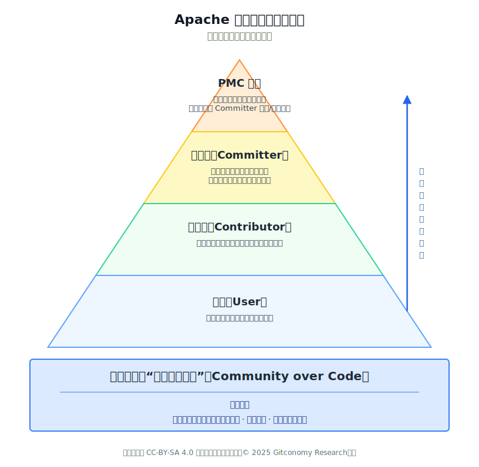

*图：Apache软件基金会治理哲学*

ASF 的实践揭示了，一个生生不息的生态，需要超越具体的技术项目，去构建一套稳定、公平、透明的“元规则”。这套规则的核心，就是将社区的健康和人的成长置于代码之上。当社区本身成为一个吸引人的、值得托付的地方时，人才的持续涌入和贡献的不断涌现，便会成为一种必然。

对于大型开源大赛而言，ASF的启示在于必须将社区建设本身作为一项可考核、可引导、可复制的核心能力：

- **设立社区健康度指标**：在评审标准中，加入对社区行为的考核，如：文档是否完善、Issue响应是否及时、代码审查流程是否规范、沟通是否友好等。
- **设计贡献者成长体系**：为获奖项目设计类似“孵化器”的后续计划，提供如何建立社区、如何运营社区的指导，并明确给出从“开发者”到“核心维护者”的晋升路径和权益。
- **强调开放与透明**：鼓励所有项目在开发过程中就在开源平台上进行公开讨论，而非闭门开发到最后才提交代码。将协作过程本身作为评审的一部分。

社区驱动型的智慧告诉我们，开源的核心是“人”。一切技术活动都必须服务于人的连接、成长与协作。成功的运营不是管理项目，而是培育社区，并为社区中的每一个个体描绘出一幅值得期待的成长蓝图。

### 6.3 小结：全球实践的核心启示

过对全球卓越实践的考察，破解开源大赛“昙花一现”困境的关键在于转变赛事逻辑，从短期选拔转向长期培育。Google Summer of Code的经验表明，导师制与身份转化能够让学生从“参赛者”成长为真正的“贡献者”，并通过过程性的指导与社区融入实现持续成长。Apache 基金会的案例则强调“社区高于代码”，通过透明的沟通机制和精英治理阶梯，为新人提供清晰的成长路径，形成强大的人才飞轮效应。这些实践共同说明，真正成功的模式并不是把大赛当作一次性的活动，而是将其设计为人才进入和留在社区的入口。核心启示在于：要重过程而非结果，重导师而非评委，重融合而非表演，让大赛成为社区身份认同与价值共创的起点。

## 第七章 竞技驱动型：极致体验与人才向心力

与社区驱动型模式不同，竞技驱动型模式并不回避“竞争”本身，而是通过极致的产品化设计，将竞赛本身打造成一个具有强大吸引力的“磁极”，并通过构建围绕赛事的持续互动和价值交换网络，成功地将一次性的竞技事件转化为长期的人才生态。它们的成功证明，竞争与可持续并非水火不容，关键在于如何设计竞赛的规则、体验与后续价值。

### 7.1 RoboMaster机甲大师赛：技术、观赏性与社区文化的融合

RoboMaster是由大疆（DJI）主办的全球性机器人竞技赛事，以其“机器人战争”的激烈对抗性和极高的技术含量著称。它远不只是一场比赛，而是一个融尖端技术、极致观赏性、青年文化和社会传播于一体的综合生态。

RoboMaster机甲大师赛提供了一个将硬核技术、电子竞技的观赏性与深厚的社区文化三者完美融合的范例。它从根本上解决了传统大赛“成果孤岛化”和“体验枯燥”的痛点。

1. **超长周期与复合式工程挑战**

与一周甚至48小时的编程马拉松不同，RM的备赛周期长达一年。参赛团队需要从零开始，自主研发和制作多台分工明确、协同作战的机器人。这涉及机械、硬件、嵌入式、算法（尤其是机器视觉）等多个学科，是一个极其复杂的系统工程。这种长周期、高复杂度的挑战，从根本上杜绝了“演示驱动开发”和“技术捷径”，迫使学生投入深度、系统的学习与实践，其工程素养的锻炼是短周期比赛无法比拟的。

2. **极致的观赏性与荣誉体系**

RM创新地将机器人对战以电子竞技的形式呈现，拥有专业的直播、华丽的场地和激情的解说。这种极致的观赏性，为纯粹的技术竞赛赋予了强大的情感和文化吸引力。参赛者不再是孤芳自赏的极客，而是万众瞩目的“工程师明星”。赢得RM比赛所带来的巨大荣誉感和团队归属感，构成了一种远超物质奖励的内在激励。这种荣誉体系，为参赛者提供了强大的精神向心力。

3. **可持续的团队与知识传承**

RM以高校为参赛单位，促使各高校自发建立了稳定、分工明确的实验室或战队。这种以团队为核心的组织形式，自然地解决了“临时渠道”和“关系解构”的问题。新老队员的更替、技术的迭代、战术的复盘，都在团队内部形成了可持续的知识沉淀与文化传承机制。一支RM战队，就是一个微型的、围绕特定目标运转的“实践社区”，其产生的“飞轮效应”远非一次性比赛可比。

RoboMaster机甲大师赛对开源大赛的启示：

- **提升赛事体验的产品化水平**：开源大赛不应只是一个提交代码的平台。可以借鉴其视觉设计和叙事能力，将优秀项目的演示环节包装成一场精彩的“开发者大会”进行直播，让参赛者的成果得到最大化的展示，赋予其超越奖金的社会认可。
- **设计鼓励传承的技术框架**：可以为特定赛道（如OS内核、数据库）设计长期稳定的基础性赛题或性能基准，引导高校实验室或学生团队像RoboMaster战队一样，逐年迭代优化同一个项目，形成技术沉淀和传承。
- **赋能微观社区**：鼓励并支持以学校、实验室或开源项目为基础形成稳定的参赛团队，并为其提供交流平台，帮助其形成内部传承机制，从而构建生态的坚实基础。

### 7.2 ACM-ICPC国际大学生程序设计竞赛：精英选拔与知识传承

ACM-ICPC是计算机领域历史最悠久、最具权威性的全球性大学生程序设计竞赛。其形式为团队在5小时内用1台电脑解决10道左右的算法难题，比拼解题数量和速度。

ACM-ICPC是典型的“漏斗思维”精英选拔模式，但它非但没有造成价值损耗，反而构建了一个全球性的、生生不息的算法人才生态。其成功的关键，在于将残酷的竞争与一套制度化的知识传承体系深度绑定。

1. **以竞赛为载体，以成长为核心**

虽然ICPC本身只有短短5个小时，但其核心价值在于长达数年的备赛过程。为了在赛场上脱颖而出，学生必须投入成千上万小时进行系统性的算法学习和高强度训练。竞赛的“终点线”只是一个检验学习成果的仪式，其真正目的是驱动参与者构建扎实、通用、可迁移的底层计算机科学知识体系，这与追求平台相关、碎片化技能的大赛形成鲜明对比。

2. **“传帮带”的知识传承网络**

ACM-ICPC生态最强大的地方在于其金字塔式的知识传承网络。退役的顶尖选手往往会留校担任教练，高年级队员负责训练低年级队员，### 4.5

形成了一条清晰的“传帮带”链条。各大在线评测平台则汇集了历年的竞赛真题和社区的优质解法，构成了一个开放、共享的知识库。这种模式，将每一次竞赛的智慧成果都沉淀下来，将本应是**零和**的比赛，转化为整个生态知识水平不断提升的**正和**过程。

ACM-ICPC对开源大赛的启示：

- **坚守价值，建立权威**：大赛需要找到并坚守其希望考察的核心价值（如代码质量、架构设计、社区协作），并通过极致的专业性和公正性，逐步建立行业权威，使其荣誉成为参赛者简历上真正有分量的部分。
- **赋能高校，系统沉淀**：与高校合作，鼓励在校内建立基于开源技术的俱乐部或实验室，将大赛的备赛过程系统化、课程化，形成校内的知识传承体系，让参与变得更可持续。
- **经营校友网络**：有意识地构建和维护获奖者的校友网络，邀请他们作为导师、评委或宣讲人反哺赛事，形成强大的品牌闭环。

### 7.3 Kaggle竞赛：真实问题、即时反馈与职业链接

Kaggle是一个全球最大的数据科学和机器学习竞赛平台。企业或其他组织在平台上发布真实的数据和问题，并提供奖金，数据科学家们通过构建模型参与竞争，按模型精度排名。

Kaggle 作为全球领先的数据科学竞赛平台，它巧妙地将企业的真实需求、社区的集体智慧和个人的职业发展连接在一起，完美解决了传统大赛“价值断裂”和“成果速朽”的难题。

1. **源于真实世界的挑战**

Kaggle上的绝大多数竞赛，都由企业或研究机构发布，围绕其面临的真实业务问题展开，并提供真实的（经过脱敏的）数据集。这保证了参赛者投入心血解决的是一个**“真问题”**，而非“为了比赛而设定的玩具问题”。这使得项目成果具备了直接的商业或社会价值，从根本上提升了参与的意义感。

2. **即时、持续的反馈回路**

与依赖最终评审的传统大赛不同，Kaggle 提供了公开排行榜 (Live Leaderboard) 机制。参赛者每次提交结果，都能立即看到自己的模型在全球范围内的排名变化。这种即时、量化、持续的反馈，构成了一个极其强大的激励与学习回路，驱动参赛者不断对模型进行迭代优化。

3. **社区化竞赛与职业身份的构建**

Kaggle 虽是竞赛，却拥有浓厚的知识共享氛围。选手们在论坛和公开的Notebooks中分享思路、代码和经验，形成了一种**“在竞争中协作”的独特文化。更重要的是，Kaggle 的段位和奖牌，已经成为数据科学领域公认的“硬通货”。一个高排名的Kaggle Profile，就是一份极具说服力的“技术简历”，直接打通了从竞赛到顶尖工作的职业路径。它将一次性的比赛行为，转化为了一个可以持续积累、永久有效的职业身份**。

Kaggle竞赛对开源大赛的启示：

- **引入真实业务场景**：与企业深度合作，将企业内部真实的、轻量级的开源需求（如Bug修复、功能增强、性能优化）作为赛题。让参赛者的贡献能真正被合并、使用，从而获得巨大的成就感。
- **构建开发者声望系统**：建立平台化的开发者主页，将其在所有赛事中的贡献、代码质量、社区活跃度、获得的荣誉（徽章系统）量化展示，形成个人的“开源技能档案”，并直接对接企业招聘渠道。
- **促进赛后学习**：强制或鼓励获奖项目进行代码和文档的开源，并组织获奖者进行经验分享。将大赛平台同时建设成一个供所有开发者学习优秀开源实践的教育平台。

竞技驱动型的成功案例表明，通过精心的产品设计、构建强大的声望体系、并提供清晰可见的长期价值（如职业发展），竞赛完全可以避免“昙花一现”的结局，而成为一个自我维持、持续发展的强大生态引擎。

### 7.4 小结：竞技驱动的生态潜能启示

本章结了“竞技驱动型”模式的独特价值，说明竞争并非一定与可持续相悖，关键在于赛事规则和生态设计。

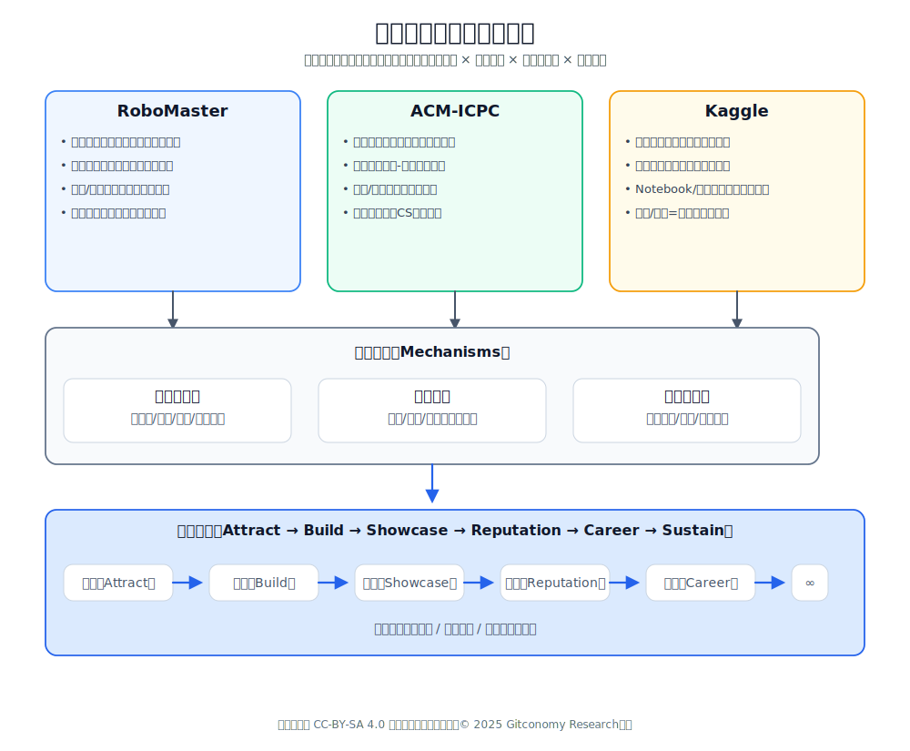

*图：竞技类比赛对开源大赛的启示*

以 RoboMaster 为例，其长周期备赛、系统性工程挑战和高度观赏性，不仅提升了参赛者的工程素养，也促成了团队的长期传承与社区文化的形成。ACM-ICPC 则通过精英选拔与知识传承网络，将短时的比赛转化为长期的学习驱动，形成了全球性的算法人才生态。而 Kaggle 的实践显示，真实业务场景与即时反馈回路能够增强参赛意义感，并通过声望体系和职业通道让成果延续。综合来看，这些案例的共同启示是：通过延长周期、强化知识沉淀、设计荣誉与声望体系，赛事可以将一次性的竞技行为转化为长期的人才成长和生态驱动力。

---

# 第三部分	战略重塑——构建以开发者为中心的价值生态

## 第八章 战略转型：从“办赛”到“营人”

开源大赛的价值困境，源于组织逻辑的根本性错位。组织方习惯于用管理“项目”的思路去运营本应是“生态”的社区，导致了投入与产出的巨大错配。破解这一矛盾，无法通过局部的运营优化实现，必须进行一场根本性的战略转型：即从以活动为中心的“办赛”，彻底转向以人的成长为核心的“营人”。这一转型要求组织者在目标、身份、流程和衡量标准上进行一次彻底的范式革命。

### 8.1 目标重塑：从追求“短期ROI”到投资“开发者LTV”

“办赛”思维模式下，成功的衡量标准（KPI）是短期的、可量化的业务指标，如：报名人数、作品提交数、媒体曝光量等。这些指标构成了赛事的**投资回报率（ROI, Return on Investment）**。然而，这些指标在赛事结束后便迅速失去意义，无法反映对生态的长期价值。

向“营人”转型，首先要重塑目标体系，将重心从**短期ROI**转向关注**开发者的生命周期总价值（LTV, Lifetime Value）**。组织方需要回答一个全新的问题：一名开发者在参与活动后，在未来数年内能为本生态系统持续创造的总价值是什么？ 这可能包括：

- 持续的代码贡献：成为开源项目的长期贡献者。
- 生态内容的创造：撰写技术博客、制作教程、在技术大会上分享。
- 社区影响力的构建：成为社区的意见领袖、回答新人问题、组织线下活动。
- 商业价值的转化：基于平台技术进行创业、在所在企业推动技术选型。

在这一新目标下，考核指标将彻底改变，转变为：

- 贡献者转化率：赛后三个月内，有多少参赛者向核心项目提交了第一个PR？
- 社区留存率：赛后半年，有多少参赛者仍活跃在官方社区渠道中？
- 生态活跃度：由往届参赛者发起的生态项目或内容贡献数量。

这种目标重塑，将迫使组织方从“一场活动的热闹”转向“一个生态的繁荣”的战略意图转变：大赛不再是一个终点，而是为长期生态引流转化的起点。它的价值不在于其本身的规模，而在于其为整个生态网络输送了多少高质量、高忠诚度的节点（开发者）和连接（关系与项目）。

### 8.2 角色重塑：从“筛选对象”到“成长伙伴”

“办赛”思维将参赛者视为漏斗中的**筛选对象**。整个赛制设计的目的，就是为了高效地筛选出最顶尖的1%，而其余99%的参与者及其项目，则被视为“过程成本”。这种模式必然导致大多数参与者产生“价值断裂”感。

“营人”思维则要求组织方将每一位参赛者都视为**成长伙伴**。组织方的角色，不再是高高在上的“裁判”，而是赋能开发者成长的“服务者”。这意味着，运营的重心要从“评选优胜者”转向“优化所有人的参与体验和成长路径”。

为此，组织方的角色需要发生如下转变：

- 从评审者到引导者：建立强大的导师(Mentor)团队，为参赛者提供贯穿全程的、个性化的技术与社区融入指导，而非仅仅在终点线进行评判。
- 从管理者到服务者：提供稳定、开放、易用的基础设施（如代码仓库、论坛、文档平台），并鼓励参赛者在赛后继续使用和完善，将“临时渠道”升级为“永久社区家园”。
- 从“发奖者”到“赋能者”：除了为优胜者提供奖励，更要为所有具备潜力的项目和个人提供赛后孵化资源，如：持续的导师支持、项目曝光机会、融入核心社区的“绿色通道”等。

当组织方真正将自己定位为开发者的“成长伙伴”时，开发者自然会用长期的信任和贡献作为回报：从临时性的交易关系（你比赛，## 第九章 重新定义大赛：一个新的生命周期模型
我给奖）转变为长期性的契约关系（我提供成长环境，你贡献才华并反哺社区）。

### 8.3 组织重塑：从“临时项目组”到“常设职能部”

“办赛”模式通常由市场部或人力资源部牵头，组成一个**“临时项目组”**来执行。一旦赛事结束，项目组便解散或转向，导致运营经验无法沉淀，社区关系无人维系，“潮汐现象”成为必然。

向“营人”转型，必须在组织架构上予以保障。这意味着，需要建立一个常设的、专业的开发者关系（Developer Relations, DevRel）或社区运营部门。这个部门的使命是长期的，其核心职能是构建和维护一个健康的开发者生态。

这个常设部门需要具备全新的能力：

- 社区运营能力：懂得如何营造开放、包容、互助的社区氛围，设计有效的激励与治理机制。
- 技术布道能力：能够创造高质量的技术内容（文档、教程、代码示例），并与开发者进行有深度的技术交流。
- 生态战略能力：能够从公司长远战略出发，规划开发者生态的成长路径，并协调内外部资源为之服务。

将社区运营从一个“市场活动”升级为一个“战略职能”，是实现从“办赛”到“营人”转型的最终组织保障。它确保了开发者生态的建设不再是一次性的“冲锋”，而是有耐心、有策略、有持续资源投入的可持续的开发者价值循环生态。

在这个循环中，大赛仅仅是一个强大的引爆点和入口。它的作用是吸引新人、制造热点、产生初始项目。随后，运营的重点迅速转向培育阶段，通过持续的活动和支持体系，承接大赛带来的流量，防止“潮汐”退去。

最关键的是升华阶段，它完成了价值的闭环。曾经的参赛者成长为社区的骨干，他们的反哺确保了生态的自我更新和扩张，从而吸引更多新人加入，开启新一轮的循环。

### 8.4 能力重塑：构建面向未来的社区运营团队

战略的转型最终需要组织的变革来承载。如果说目标、角色和组织架构的重塑是转型的“顶层设计”，那么团队能力的重塑就是将蓝图变为现实的“施工能力”。“办赛”需要的是以效率和执行力为核心的项目管理能力，而“营人”需要的则是以同理心、技术深度和长期主义为核心的社区运营与开发者关系（DevRel）专业能力。构建这样一支面向未来的团队，是转型能否成功的最后一块基石。

这种能力重塑，具体体现在三个方面：

1. **新角色：从“任务执行者”到“关系建立者”**

传统的赛事团队以项目经理为核心，辅以市场和行政人员，其职责是确保活动按时、按预算、按流程完成。而在“营人”的模式下，团队构成必须拓展，增设一系列专注于建立和维护长期关系的新角色：

- 社区经理：不再是临时的社群“群主”，而是社区的“园丁”和“架构师”。他们负责营造健康、互助的社区氛围，制定社区规范，策划持续的线上线下活动，并激活社区中的关键意见领袖（KOL），确保社区在赛后依然充满活力。
- 开发者布道师 ：他们是连接开发者与产品技术团队的桥梁。一方面，他们具备深厚的技术功底，能创作高质量的技术内容（教程、演讲、示例代码）来降低开发者使用技术的门槛；另一方面，他们能深入开发者群体，倾听他们的声音，将一线反馈带回产品端，赢得开发者的信任。
- 生态合作经理 ：负责将社区与更广阔的生态连接起来，例如与高校建立合作培养人才，与其他开源社区建立联系，或帮助社区内的优秀项目对接商业资源。他们的工作是将社区从一个“孤岛”变成一个开放、互联的“网络枢纽”。

2. **新技能：从“活动策划”到“生态运营”的复合能力**

新角色需要一套全新的复合型技能。团队成员不能再仅仅是优秀的活动策划者，他们必须掌握驱动生态长期增长的综合能力：

- 内容创作与传播：体系化地规划和创作开发者真正需要的技术文档、深度文章和视频教程，并懂得如何通过开发者习惯的渠道进行传播。
- 数据驱动的社区洞察：学习使用专业的社区分析工具，对社区健康度（如新成员激活、核心成员留存、关键行为转化）进行量化分析，并基于数据优化运营策略，而非仅仅依赖直觉。
- 同理心与沟通技巧：能够真诚地与开发者沟通，理解他们的痛点，处理社区中的冲突，建立真实的情感连接。这是所有社区工作的基础。
- 导师体系的管理与赋能：懂得如何招募、激励和管理社区导师，为他们提供支持，并设计一套能让导师与学员双向受益的良性机制。

3. **新预算：从“一次性投入”到“持续性投资”的财务结构**

预算是战略的最终体现。如果预算结构不改变，任何转型都是空谈。“办赛”模式的预算几乎100%是一次性的活动经费，用于奖金、营销和物料，赛后即清零。而“营人”模式要求预算结构发生根本性转变：

- 设立常设运营预算：预算必须从“项目制”转变为“年度制”。每年都应有专项的、持续的预算，用于支持赛后的社区运营和人员成本。
- 优化投入结构：大幅削减在短期营销上的过度投入，将资金转移到更能产生长期价值的领域。例如，设立**社区激励**，用于支持常规性的社区分享活动、奖励社区贡献者；设立**导师津贴**，对付出时间和精力的社区导师给予合理回报；设立**开源项目小额资助计划**，为赛后有潜力的项目提供启动资金，帮助它们度过最艰难的早期阶段。

总之，从“办赛”到“营人”的转型，始于理念，终于能力。只有当组织真正下定决心，去招募合适的人、培养必需的技能、并提供持续的财务支持时，一个以开发者为中心的、能够自我生长、生生不息的价值生态，才有可能从理想照进现实。

### 8.5 小结：转型的核心

从“办赛”到“营人”的转型，其核心是从**萃取思维**——将开发者视为流量，从中筛选出极少数的优胜者，提取其创新成果和招聘价值，之后便任其流失转向**滋养思维**——将开发者视为宝贵的种子，为其提供肥沃的土壤（平台）、阳光雨露（导师与资源）和成长空间（路径与机会），耐心等待其成长，并最终收获一片茂盛的森林（生态）。

这场转型意味着组织方需要拥有更大的格局和更多的耐心。其回报不再是立竿见影的媒体头条，而是一个强大、忠诚、能够自我繁衍的创新者社区，这将是任何组织在数字时代最宝贵的长期资产。

---

## 第九章 重新定义大赛：构建可持续开源协作生态的战略蓝图

综合上述诊断与卓越实践的启示，开源大赛的破局之路在于进行一场彻底的战略转型。我们将系统化地设计一个以开发者为中心、以价值创造为驱动的可持续开源协作生态，其核心是从经营赛事转向经营人才，从关注短期产出转向投资长期生态。

### 9.1 战略转型：从“办赛”到“营人”

战略转系那个的目标是将开源大赛从“项目制活动”转变为“可持续的开发者生态运营平台”，实现学生开发者的长期成长与社区活跃。为此，我们建立一个层级化的目标金字塔，以确保所有运营动作都指向同一个北极星：

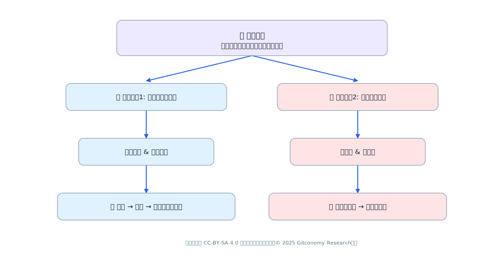

*图：开源大赛战略转型目标*

这一转型的核心，是从“办赛”（举办一次性的活动）的思维，彻底转向“营人”（经营和培育人才）的思维。这本质上是从管理一个事件，转向培育一个实践社区：

1. **身份认同大于一次性成就**： 新模式的核心目标，应当是授予参与者一个全新的、持久的身份（如“社区成员”），而不是一个临时的成就（“大赛获奖者”）。大赛的终点，应被重新设计为社区身份的起点。
2. **过程大于产品**： 关注焦点必须从最终那个光鲜的“产品演示”，转移到协作开发的过程本身。这意味着需要开始珍视并鼓励代码审查、技术讨论、文档改进等在开源世界中真正重要的工作。
3. **投资大于开销**： 组织者必须将用于大赛的资金视为对开发者社区这一核心战略资产的长期投资，而非一笔短期的市场营销开销。

### 9.2 价值网络：构建多方共赢的利益共同体

一个生态能够持续运转的唯一前提，是所有关键的利益相关者都能在其中持续获益。我们必须从“单向价值输出”转变为“多方价值共创”。

| 角色 | 核心需求与痛点 | 在生态中可提供的价值 |
| :--- | :--- | :--- |
| **学生开发者** | 学习技能、项目经验、就业机会、认可感。**痛点**：赛后无人指导、项目荒废。 | 贡献代码、参与社区治理、传播口碑、产出UGC内容。 |
| **获奖选手** | 展示成果、进阶成长、成为意见领袖。**痛点**：影响力无法放大，缺乏持续平台。 | 成为导师、项目维护者、技术布道者（社区KOL）。 |
| **组织方** | 提升品牌影响力、积累人才库、推动开源生态。**痛点**：赛后流失率高，资产无法沉淀。 | 提供资源、品牌背书、连接企业/高校、搭建基础设施。 |
| **高校/教师**| 教学实践、学生成果输出。**痛点**：缺乏真实项目场景，与企业脱节。 | 推荐优质生源、共建课程、建立校园实践基地。 |
| **企业/基金会** | 招募人才、发现潜力项目、技术合作。**痛点**：难接触和评估优质学生开发者。 | 提供实习/就业岗位、项目赞助、输出企业级技术导师。 |

> **关键洞察**：必须建立一个*“多方共赢”的飞轮模型**，让每一方都能持续获得价值，才能驱动生态自转。

### 9.3 增长引擎：设计生态自循环的运营飞轮

我们采用增长飞轮思维，替代线性的“漏斗思维”，构建一个正向循环的增长引擎：

```
吸引参赛 → 赛中赋能 → 赛后留存 → 社区成长 → 反哺赛事/品牌 → (循环)
```

**飞轮五阶段拆解:**

| 阶段 | 关键动作 | 核心目标 | 关键指标 (KPI) |
| :--- | :--- | :--- | :--- |
| **吸引 (Attract)** | 高校宣讲、社交媒体、往届选手故事分享 | 扩大潜在开发者的认知和参与基数 | 报名人数、高校覆盖率 |
| **赋能 (Engage)** | 技术培训、导师辅导、标准化代码仓库支持 | 提升参赛体验与项目产出质量 | 项目完成率、代码提交(Commit)数 |
| **留存 (Retain)** | 赛后社群运营、项目孵化、定期成果展示 | 将一次性参赛者转化为长期社区成员 | **赛后30日/90日活跃率** |
| **成长 (Grow)** | 引导成为导师、参与社区运营、推荐新人 | 构建社区的自我造血和管理能力 | 核心贡献者数量、导师转化率 |
| **反哺 (Reinforce)**| 优秀项目推荐、品牌故事传播、就业内推 | 强化生态价值，吸引更多优质资源和参与者 | 企业录用数、孵化项目开源影响力 |

### 9.4 生态基石：搭建“四位一体”的运营架构

为支撑飞轮的运转，我们设计一个“平台+内容+社群+运营”四位一体的系统化架构：

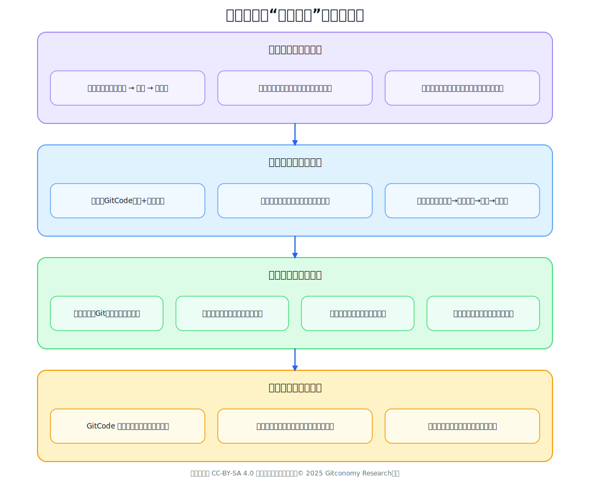

*图：开源大赛“四位一体”运营架构示意图*

### 9.5 成长路径：为开发者铺设从新手到领袖的阶梯

我们对用户进行分层，并为每一层设计清晰的成长路径和运营策略。

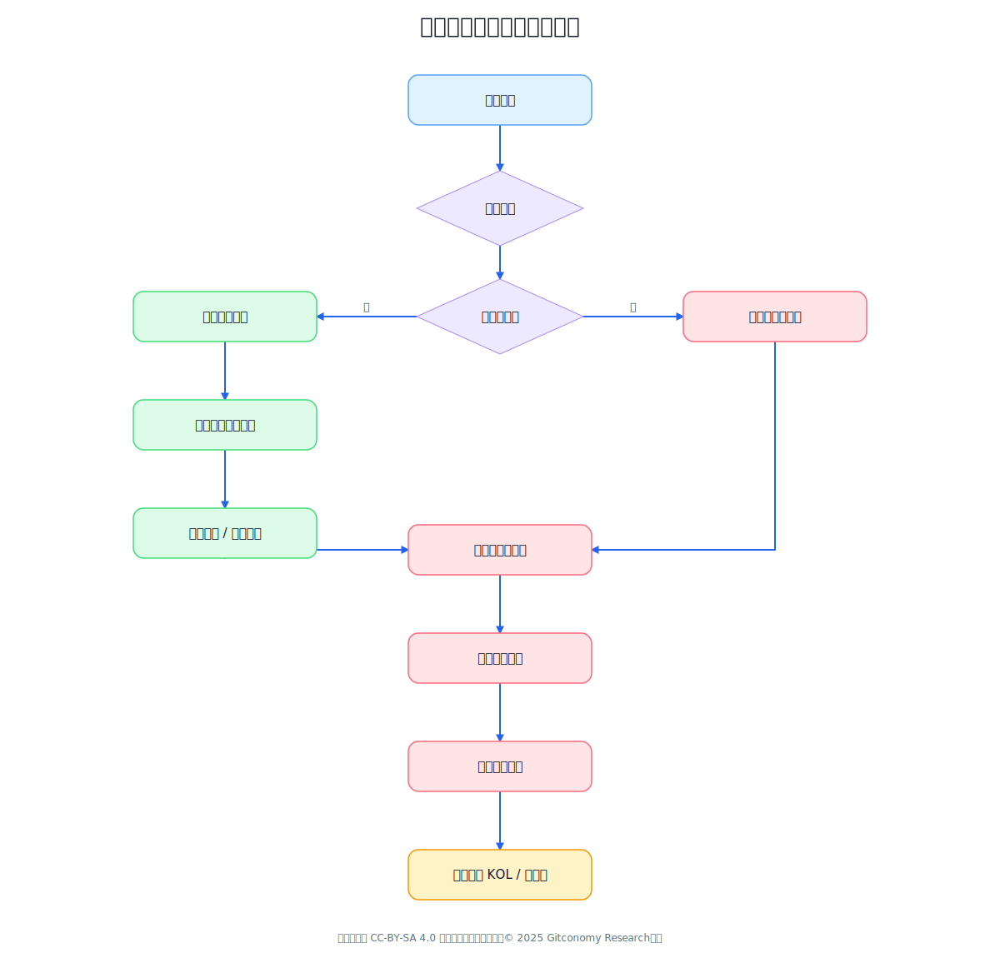

*图：开源大赛参赛者的成长线图*

**用户分层金字塔:**

  * **L3: 核心贡献者 (5%)**
  * **L2: 进阶开发者 (15%)**
  * **L1: 新手参与者 (80%)**

| 层级 | 用户特征 | 核心需求 | 关键转化策略 |
| :--- | :--- | :--- | :--- |
| **L1: 新手** | 首次参赛，技能初级 | 学习、指导、不被打击 | 提供入门教程、结对编程、分发“Good First Issue”轻量任务。 |
| **L2: 进阶** | 有项目经验，能独立开发 | 项目孵化、技术指导、认可 | 配备专属导师、推荐加入成熟开源项目、给予社区展示机会。|
| **L3: 核心** | 获奖或持续贡献，有领导力 | 影响力、职业发展、身份认同 | 聘为导师/评委、参与社区治理、推荐顶级实习/工作机会。|

### 9.6 赋能核心：设计三级递进的导师辅导体系

导师制是连接“人”与“社区”最有效的粘合剂。

| 级别 | 形式 | 频率 | 内容 |
| :--- | :--- | :--- | :--- |
| **一级：通用培训** | 线上直播/录播 | 每月2次 | 开源基础、Git使用、项目文档撰写 |
| **二级：小组辅导** | 8-10人小组 + 1导师 | 每两周1次 | 项目Review、技术答疑、路线规划 |
| **三级：1v1导师制** | 优秀选手/潜力新人专属 | 每月1次 | 深度指导、职业规划、资源推荐 |

> **导师来源**: 往届获奖选手 + 合作企业工程师 + 开源基金会成员。
> **导师激励**: 颁发“开源导师”证书 + 推荐企业技术分享机会 + 年度表彰。

### **9.7 资产沉淀：GitCode组织的可持续运营策略**

将GitCode从“作品提交处”升级为“社区协作中心”和“资产沉淀库”。

**组织级仓库架构:**

```
https://gitcode.net/YourOrg/
├── Contest-2025-Spring/          # 当届赛事总览
├── Alumni-Projects/               # 往届优秀项目孵化与持续维护
├── Mentorship/                    # 导师计划
├── Community/                     # 社区共建项目 (官网, Newsletter等)
└── Events/                        # 活动归档
```

**仓库运营规范:**

  * **强制要求**: 所有项目必须包含`LICENSE`, `README.md`, `CONTRIBUTING.md`。
  * **标准实践**: 提供标准化的Issue模板，使用`good-first-issue`, `help-wanted`等标签体系。
  * **定期维护**: 每月由导师组织一次“项目健康度检查”（Star、Fork、Issue响应率）。

### 9.8 节奏与活力：构建“全年无休”的内容运营日历

用持续、有节奏的运营，对抗“潮汐现象”，实现社区的“永远在线”。

| 月份 | 主题 | 关键活动 |
| :--- | :--- | :--- |
| **Q1 (冬)** | **新年启航** | 年度优秀项目展、开发者故事征集、开源入门月 |
| **Q2 (春)** | **赛事引擎** | 春季大赛启动、导师匹配、项目中期路演 |
| **Q3 (夏)** | **社区共建** | 夏季黑客松、联合“开源之夏”、学生贡献开源 |
| **Q4 (秋)** | **价值转化** | 秋季赛事启动、企业对接会、城市Meetup、年度盛典 |

### 9.9 连接与凝聚：设计线上线下融合的社区活动矩阵

| 渠道 | 活动形式 | 目的 |
| :--- | :--- | :--- |
| **线上**| Tech Talk、Project Demo Day、Office Hour、开源读书会 | 高频、低成本的技术分享与答疑 |
| **线下**| 高校俱乐部、城市开发者Meetup、年度开源峰会 | 深度社交、品牌引爆、建立区域根据地 |

### 9.10 价值衡量：建立数据驱动的生态健康度仪表盘

用数据指导运营，衡量真正的价值。

  * **北极星指标**: **“赛后6个月仍活跃的学生开发者比例”（社区留存率）**
  * **四级指标拆解**:
      * **参与度**: 报名人数、项目提交率
      * **成长度**: **赛后30/90/180日活跃率**、晋升为导师人数
      * **贡献度**: 人均Commit数、项目获Star总数、Issue响应率
      * **影响力**: 技术文章产出数、企业录用/实习人数

### 9.11 永续发展：探索非营利性的可持续商业模式

仅靠“公益”难以持久，需设计“非营利性，但可持续”的运营模式。

  * **核心收入来源**: 企业赞助、人才服务费（面向企业）、培训认证、政府/基金会项目资助。
  * **核心原则**: **永远不向学生开发者收费**，商业化面向B端与G端。

### **9.12 未雨绸缪：关键风险识别与应对预案**

| 风险描述 | 应对策略 |
| :--- | :--- |
| **开发者流失** | 建立“项目领养”机制，激励新成员维护旧项目。 |
| **导师资源不足** | 建立荣誉+物质双重激励体系，降低辅导门槛。 |
| **平台迁移成本** | 提供GitHub Mirror + GitCode CI/CD最佳实践教程。 |
| **组织方投入下降** | 建立“社区自治”机制，逐步将运营权下放给核心学生贡献者。|

### 9.13 小结：战略转型的路径蓝图

为了实现将开源大赛从“一次性赛事”转变为“可持续运营”的目标，我们需要围绕“学生开发者”这一核心群体，构建一个系统化、层级化、可视化的长期赋能运营体系。

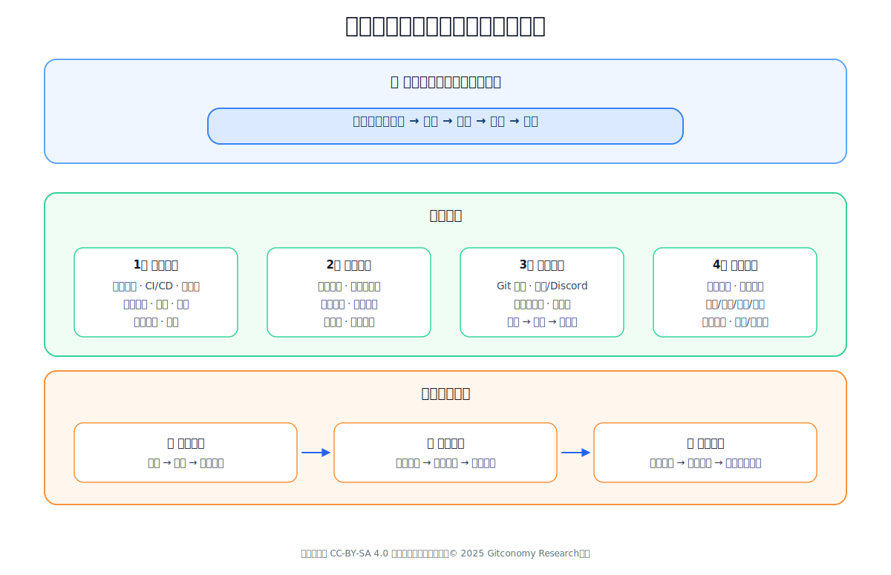

*图：一图读懂开发者生态运营*

大赛不应仅仅被视为一次性的活动，而应成为社区身份的入口和价值循环的起点。要实现这一点，需要在目标上，从追求短期ROI转向投资开发者生命周期价值；在角色上，从筛选个体转向陪伴成长；在组织上，从临时项目组转向常设职能部门；在能力上，从活动策划转向社区运营与生态战略。这一转型的核心在于耐心与长期主义，将开发者视为种子，提供肥沃土壤与成长路径，从而培育出能够自我更新、自我扩展的开源生态

---

## 第十章 运营体系优化：构建可持续社区的六大支柱

从“办赛”到“营人”的战略转型，必须由一个具体、可落地的运营体系作为支撑。该体系旨在彻底超越一次性活动的范畴，为开发者提供全生命周期、多维度的持续价值。我们基于MECE（相互独立，完全穷尽）原则，构建了一个由六大核心支柱组成、相互协同的运营系统，并由一个数据驱动的增长引擎进行横向贯穿与持续优化，最终确保社区的健康与可持续发展。

### 10.1 开源大赛可持续运营架构

这一体系的特点在于MECE原则的完整覆盖：既有面向开发者实践的技术与学习支撑（代码、学习、导师），也有面向社区活力的运营与激励机制（活动、激励、治理），最终通过数据监控与反馈实现持续迭代。每个支柱都直指前几章所揭示的问题：项目散落、人才流失、激励错位、社区失衡等。通过制度化、结构化和长期主义的设计，开源大赛将由一次性的赛事活动，进化为长期的开发者成长平台和可持续的社区生态。

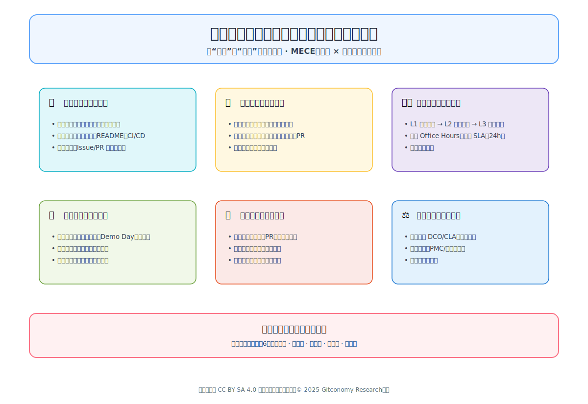

*图：开源大赛可持续运营架构示意图*

### 10.2 开源大赛运营体系的关键支柱

1. **支柱一：项目与代码——奠定协作的技术基石**

本支柱旨在为所有创新协作提供专业、高效、可信赖的技术环境，将分散的项目资产转化为社区的公共财富。

- **统一的代码托管与协作平台**：在GitCode或GitHub上建立官方组织，将所有赛事项目、孵化中项目及社区共建项目集中管理，形成可检索、可复用的技术资产中心，彻底解决项目“赛后即失”的困境。
- **标准化的项目启动模板**：提供开箱即用的项目模板，内置Apache 2.0/MIT许可证、结构化README.md、规范的CONTRIBUTING.md贡献指南及基础CI/CD流水线配置，极大降低项目初始化门槛，并从第一行代码开始注入开源最佳实践。
- **规范化的协作流程与指引**：建立清晰的Issue提交与Pull Request（PR）审核流程。强制使用good-first-issue（新手任务）、help-wanted（求助任务）等标签体系，系统性地引导新人完成首次有效贡献，并保障代码质量。

2. **支柱二：学习与认证——规划清晰的成长路径**

本支柱是社区的人才发展与能力引擎，旨在将无形的学习过程转化为有形的、被认可的能力证明。

- **体系化的开源知识库**：开发并维护一个涵盖核心技术栈、开源协作文化、社区规范与软技能的课程体系，形式包括微课程、实战手册、工作坊及编程练习，形成一个持续迭代的开放学习中心。
- **可视化的技能认证与徽章体系**：建立与学习路径和贡献行为挂钩的数字徽章系统。开发者完成课程学习、提交第一个有效PR、优秀文档贡献等行为后，即可获得可在个人主页展示的链上徽章，将其成长历程资产化、可验证化，为职业发展提供硬通货。

3. **支柱三：导师与支持——提供全程的陪伴式指导**

本支柱是社区的粘合剂与安全网，确保每一位参与者都能在需要时获得及时、专业的帮助，避免因孤独无助而流失。

三级递进的导师辅导体系：

- **L1通用培训**：由社区布道师提供开源基础、工具使用的普及性教学。
- **L2小组辅导**：由经验丰富的助教（TA）带领8-10人小组，进行项目复盘和技术答疑。
- **L31v1深度导师制**：为最具潜力的贡献者匹配企业专家或社区核心开发者，提供技术深度、职业规划、项目孵化的个性化指导。
- **常态化的即时支持机制**：设立每周固定的线上Office Hours（办公时间），并为论坛、交流群中的提问设立SLA（服务等级协议）（如24小时内响应），营造“有问必答”的友好环境，极大提升新人的留存率。

4. **支柱四：活动与展示——维持社区的持久活力**

本支柱是社区的“心跳”，通过高频、有节奏的线上线下活动，打造持续的社区凝聚力与品牌影响力，对抗“潮汐现象”。

- **高频异步与同步活动组合**：打造“全年无休”的活动日历，包括双周社区同步会、每月Project Demo Day、季度专题黑客松、年度开源峰会等，形成张弛有度的活力节奏。
- **多元化的价值展示舞台**：不仅展示代码项目，也为技术布道、文档写作、社区运营等非代码贡献提供聚光灯。通过技术博客征文、优秀 Contributor 访谈、线下Meetup分享等形式，让每个类型的贡献者都能找到成就感。

5.  **支柱五：激励与声誉——构建多元的正向反馈飞轮**

本支柱是驱动社区飞轮旋转的核心动力，旨在打造一个超越奖金、融合物质与精神、连接学习与职业的复合激励系统。

- **多维度、即时性的激励矩阵**：除总决赛奖金外，设立覆盖全过程贡献的激励：如“首个PR”纪念品、“最佳文档”积分奖励、“积极答疑”荣誉榜单等，让激励变得高频且触手可及。
- **制度化、可流通的声誉系统**：建立社区荣誉墙，公开表彰顶级贡献者。为持续活跃的优秀开发者提供官方推荐信、简历背书。最关键的是，与标杆企业合作建立人才绿色通道，将社区声望直接转化为实习和内推机会，闭环价值反馈。

6. **支柱六：治理与合规——保障社区的稳定与公平**

本支柱是社区长治久安的制度保障，旨在建立一个透明、公平、安全且可进化的协作环境。

- **清晰透明的规则体系**：提供主流开源许可证（Apache 2.0, MIT, GPL）的清晰指引，规范贡献者许可协议（DCO/CLA）签署流程，并强制所有参与者遵守社区行为准则，确保协作环境的合法性与友好性。
- **社区驱动的治理结构**：借鉴Apache精英治理模式，逐步组建由核心贡献者组成的项目管理委员会，负责项目决策、规则制定与争议调解，推动社区实现从“主办方主导”到“社区自治” 的演进。
- **安全与隐私保护**：严格遵守数据安全与隐私保护法规，对用户数据实行最小权限原则和加密处理，奠定社区信任的基石。

### 10.2 横向支撑：数据与增长——驱动体系优化的大脑与仪表盘

本模块是贯穿六大支柱的“中央神经系统”，通过数据驱动实现运营策略的持续迭代与优化。

- **社区生态健康度仪表盘**：定义并持续追踪关键指标，核心北极星指标为“赛后6个月开发者留存率”，并拆解为参与度（报名数）、成长度（贡献者转化率）、健康度（项目活跃度）、影响力（人才输出率）等维度，实现运营状况的可视化与可管理。
- **开发者生命周期漏斗优化**：将开发者旅程（认知->参与->留存->贡献->倡导）建模为一个可优化的漏斗，通过数据分析精准定位每个环节的流失原因，并针对性地调整运营策略，实现精细化增长。

通过以上六大支柱与一个数据引擎的协同运作，开源大赛将彻底进化为一个自我造血、价值循环、生生不息的开发者生态共同体，最终实现从“昙花一现”到“基业长青”的根本性转变。

### 10.4 小结：从蓝图到现实的运营体系

综上所述，这六大支柱与一个数据引擎共同构成了一个协同运作、逻辑自洽的运营系统。它不再是围绕一场“赛事”的临时部署，而是围绕“人”的成长而设计的长期基础设施。从提供标准化的项目代码环境，到规划清晰的学习认证路径；从全程陪伴的导师支持，到维持活力的活动展示；从多元的激励声誉体系，到保障公平的社区治理——每一个支柱都旨在解决第一部分所诊断出的具体问题，并最终服务于“营人”的战略核心。而横向的数据与增长模块则确保了这一体系具备自我优化的能力。通过这套体系的落地，开源大赛将彻底进化为一个自我造血、价值循环、生生不息的开发者生态共同体，最终实现从“昙花一现”到“基业长青”的根本性转变。

---

## 第十一章 开放资源范式：为复利价值而运营生态系统

开源大赛的运营转型要求组织者在目标、角色和组织能力上进行彻底的范式革命。然而，战略的落地需要一套与之匹配的、更为底层的运营范式——开放资源范式——作为支撑。

### 11.1 从一次性资产到开放资源：生态运营的新范式

“潮汐现象”与“价值断裂”的根源在于组织方将大赛的产出——项目、知识和人才——视为服务于短期目标的一次性资产。项目作为“演示品”在评审后被废弃；知识在“阅后即焚”的临时渠道中蒸发；人才则在“漏斗思维”下被大量淘汰，其价值被一次性地萃取后便任其流失。这种模式从根本上杜绝了任何形式的价值积累与复利增长。

**开放资源范式**正是为了变革这一现状而提出的运营新模式。它主张将生态系统的核心产出进行战略性的再定义，从一次性资产升级为开放资源。一个开放资源，其核心特质在于它被有意识地、系统化地管理，以实现三大目标：可及性（Accessibility）、可复用性（Reusability）与互操作性（Interoperability）。这套哲学并非凭空创造，而是对三大成熟的“开放”运动核心思想的战略性综合与应用：

1. 源自开放数据（Open Data）的原则：开放数据的核心理念是“可以被任何人自由使用、复用和重新分发的资料” 。其关键原则包括：可用性与可访问性（数据需完整、便捷地提供）、复用与再分发（许可条款允许复用和与其他数据集混合）、以及普遍参与性（无歧视地对所有人开放）。其中，互操作性是实现“开放”核心价值的关键，它使得将不同来源的数据集进行组合成为可能，从而创造出全新的价值，这恰恰是破解大赛中“项目孤岛化”问题的核心所在。

2. 源自开放教育资源（OER）的框架：根据联合国教科文组织（UNESCO）的定义，OER是“处于公有领域或根据开放许可发布的，允许他人免费获取、使用、改编和重新分发的任何媒介的学习、教学和研究材料”。其操作性的核心体现为“5R”框架：保留（Retain）、复用（Reuse）、修订（Revise）、混合（Remix）和重新它为从“办赛”到“营人”的战略转型提供了坚实的运营内核与可执行的方法论。该范式主张，开发者生态系统的核心产出——知识、项目乃至人才网络本身——不应被视为赛后即弃的一次性资产，而应被作为一种可管理的、持续增值的开放资源来长期运营。通过将这些关键要素资源化，并遵循开放、共享、可复用的原则进行系统化管理，组织方能够从根本上破解价值流失的困局，将一次性的投入转化为可持续的、具备复利效应的生态资产，从而为第九章和第十章所提出的“增长飞轮”与“六大支柱”运营框架注入真正的灵魂与动力。分发（Redistribute）。这套框架为如何将大赛期间产生的碎片化知识（如技术问答、项目文档）转化为持久、可演进的公共教育财富，提供了清晰的行动指南。

3. 源自开放标准（Open Standards）的治理哲学：开放标准是通过一个协作的、共识驱动的过程来开发和维护的，其目的是促进不同产品或服务间的互操作性，并防止“供应商锁定” 7。这一哲学为开发者生态的治理提供了模型，确保生态的“游戏规则”是公平、透明且鼓励贡献的，而非由组织方单方面控制，从而系统性地解决了大赛中“封闭的项目制”与开源“开放的生态制”之间的结构性矛盾。

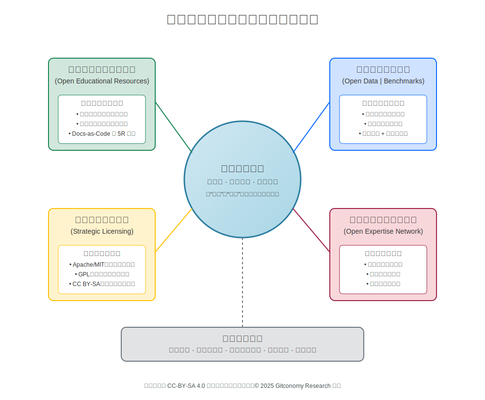

*图：开源大赛生态运营的开放资源范式*

综上所述，采纳“开放资源范式”是实现本报告核心战略——从关注短期ROI转向投资开发者长期价值（LTV）——的必要运营前提。一个由可互操作、可复用且治理公平的资源所构成的生态系统，是创造长期开发者忠诚度与驱动“飞轮效应”的唯一途径。这不仅仅是技术或许可证层面的调整，更是一种根本性的角色转变。在“办赛”模式下，组织方是价值的**萃取者**，通过“漏斗”筛选出顶尖的项目和人才为己所用。而在“营人”模式下，组织方必须转变为社区公共资源的管理者与**守护者**。其核心职责不再是评判胜负，而是构建和维护一套基础设施（平台、许可、治理），让社区成员创造的资源能够被最大化地复用、组合和增值，从而服务于整个生态的共同利益。这种从“萃取”到“守护”的转变，是实现可持续运营所必须完成的、深刻的文化变革。

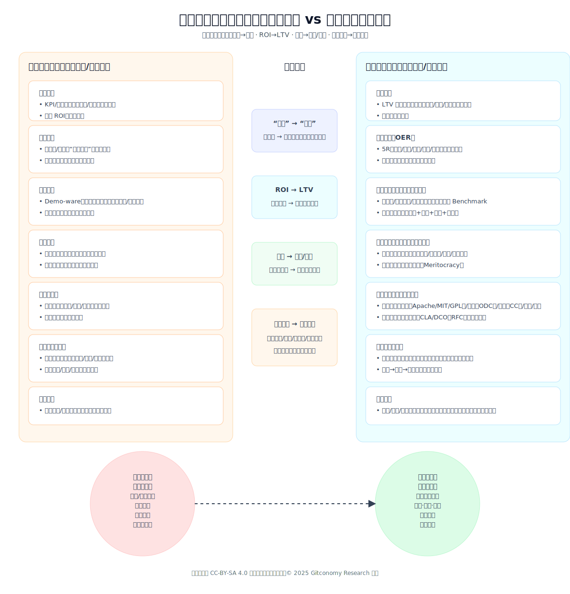

*图：开源大赛生态运营模式的比较*

### 11.2 将知识作为开放教育资源（OER）运营

大赛模式最严重的浪费之一是“组织记忆的蒸发”——海量的技术讨论、解决方案和项目创意，在赛后随着“阅后即焚的临时渠道”一同消散，未能形成可供后来者学习和复用的知识库。将知识作为开放教育资源（OER）来运营，正是应对这一挑战的系统性解决方案。它要求我们将所有社区生成的信息——从论坛问答到项目文档——都视为构建一个高价值、集体拥有、持续迭代的知识库的宝贵原材料。

1. **知识策展生命周期：从原始对话到结构化资产**

要实现知识的OER化，必须建立一个正式的、持续的知识策展生命周期，将社区中自发、零散的对话，系统性地转化为结构化、高质量的教育资产。

- 源材料：生命周期的起点是社区成员在各类渠道中产生的原始对话。这些渠道，如微信/QQ群或专门的问答区，是富含实践智慧的金矿，充满了真实的痛点、经过验证的解决方案和专家级的洞见。运营者的首要任务是确保这些对话发生在可存档、可搜索的公共平台，而非封闭的即时通讯群组。
- 策展过程：这是将原始信息转化为高价值OER的核心增值环节。它不是简单的信息堆砌，而是一系列精细化的内容处理活动，其方法论可借鉴成熟的OER策展实践 ：
	- 聚合（Aggregation）：将围绕某一特定主题（如“如何优化模型性能”）的最有价值的讨论、代码片段和外部链接，汇集到一个统一的视图下。
	- 提炼（Distillation）：将冗长、复杂的讨论串，提炼为清晰、简洁的核心概念和可操作的步骤，去除噪音，保留信噪比最高的部分。
	- 重组（Remixing/Mashups）：将来自不同帖子的多种解决方案或观点进行融合，形成一个更全面、更具深度的综合性指南，甚至可以创造出全新的视角。
	- 增强（Enhancement）：为纯文本内容补充丰富的视觉元素，如代码高亮、流程图、教学视频截图或GIF动图，以提升内容的可读性、吸引力和学习效果。
- 社区的角色：知识策展绝非运营团队的独角戏，其最高效、最可持续的模式是发动社区本身。通过建立“知识中心服务”的文化，将创建和维护文档视为解决问题过程中的一个自然环节。可以设立专门的社区角色（如“知识园丁”），激励资深成员参与到内容的审核、编辑和整理工作中，将个人声望与对公共知识库的贡献深度绑定。

2. **平台化与许可：为知识开放性奠定基础**

策展完成的知识需要被安放在一个能够体现并保障其开放性的技术平台和法律框架之上：

- 平台选择：“文档即代码”（Docs-as-Code）：为了确保知识库的可维护性、可追溯性和协作性，强烈推荐采用“文档即代码”的模式。将所有结构化的知识内容（如教程、指南）以Markdown等纯文本格式，存储在GitHub/GitCode/Gitee等版本控制系统中进行管理。这种做法使得社区成员可以通过标准的Pull Request流程来贡献、审查和修订文档，其过程的严谨性不亚于软件开发本身。这些由版本控制系统管理的源文件，最终通过自动化流程发布成一个面向用户的、界面友好、易于搜索的知识库网站，成为开发者门户的核心组成部分。
- 许可选择：知识共享（Creative Commons）：要使知识库成为真正的OER，必须为其内容明确授予开放许可。知识共享（Creative Commons, CC）许可协议是此领域的全球标准。对于开发者社区而言，推荐采用CC BY-SA 4.0（署名-相同方式共享 许可：
	- “BY”（署名） 条款要求使用者必须注明原作者，这满足了贡献者获得认可这一核心的内在激励。
	- “SA”（相同方式共享） 条款要求基于该作品的衍生品也必须以相同的许可协议发布。这一“病毒式”的共享条款，确保了社区的智慧结晶在被复用和改良后，能够再次回馈到知识共享池中，从而为生态的“正和博弈”与“飞轮效应”提供了法律层面的保障。

下表详细描绘了知识策展生命周期的具体操作流程，为社区运营团队提供了一份从战略到执行的路线图。它清晰地展示了如何将低价值、易消逝的即时信息，系统性地转化为高价值、永久性的生态资产，从而使社区管理的长期价值变得可见、可衡量，并为设立常设社区运营职能提供了坚实的理由 。

| 原始资产 | 原始格式 | 策展阶段 | 策展后OER格式 | 赋能工具 | 负责角色 |
| :--- | :--- | :--- | :--- | :--- | :--- |
| 论坛问答 | 用户关于某个Bug的提问及专家的已验证回答。 | 提炼与结构化 | 官方知识库中一篇正式的FAQ条目。 | Wiki、Discourse | 社区经理, 技术支持 |
| 项目演示 | 获奖团队的演示视频和代码仓库。 | 重组与增强 | 一篇包含嵌入式视频片段和代码示例的、分步式的实践教程。 | GitHub/GitCode/Gitee, YouTube/Bilibili, AsciiDoc | 开发者布道师, 获奖团队 |
| 社区博客 | 社区成员撰写的关于某项特定技术的深度文章。 | 验证与正式化 | 一篇官方“最佳实践”指南，并从核心文档中链接。 | CSDN博客平台, GitHub Pages、GitCode Wiki  | 文档团队, 社区KOL |
| 代码片段 | 在交流渠道中分享的实用代码片段。 | 聚合与情境化 | 开发者文档中的“代码食谱”或“代码示例”章节。 | GitHub Gists, 文档即代码流水线 | 核心贡献者, 文档团队 |

### 11.3 将项目作为开放数据与基准测试资产运营

开源大赛的产出远不止于源代码。报告深刻地批判了当前模式催生大量“演示驱动开发”（Demo-Driven Development）的“赛后即弃”项目，这些项目既不健壮，也无可维护性，其作为技术资产的长期潜力被完全浪费。要扭转这一局面，必须从根本上拓宽对“项目”的定义，将其从一个封闭的“演示品”升级为一个包含代码、数据、环境和性能指标在内的、可复现、可度量的多维开放资源包。

1. **超越“演示品”：将项目打造为可复现的制品**

问题的核心在于，评审机制过度关注短期呈现效果，而非长期工程价值。解决方案是借鉴业界领先实践，将评价的重心从“演示效果”转移到**“可复现性”上。

Kaggle Notebook模型为此提供了黄金标准。一个Kaggle Notebook不仅仅是一段代码，它是一个将代码、数据集、运行环境和叙事性文档（Markdown）封装在一起的、自包含的、可在云端一键执行和复刻（Fork）的交互式制品。这种模式天然地鼓励了清晰、可复现的工作流，因为其价值体现在他人能否轻松理解并在此基础上继续工作，而非一次性的舞台效果。大赛组织方应提供类似的基础设施，并调整评审标准，将“项目是否易于复现和扩展”作为核心评价指标之一，从而引导参赛者从构建“演示品”转向创造真正有工程价值的“制品”。

2. **项目作为开放数据资产：构建公共数据集市**

许多项目在开发过程中会产生或使用有价值的数据集。在传统模式下，这些数据随着项目的废弃而散佚。开放资源范式要求我们将这些数据集本身也视为一级资产进行管理。

组织方应鼓励并要求所有参赛项目，特别是涉及数据分析、机器学习领域的项目，将其使用或生成的（经过脱敏处理的）数据集，以开放、非专有的格式（如CSV, JSON）进行发布，并附上清晰的元数据描述和开放许可。通过建立一个类似于Kaggle Datasets的中央数据集平台，生态系统能够逐步积累一个宝贵的、可供所有成员探索和利用的公共数据池。这不仅为新项目提供了丰富的“燃料”，还能催生出基于现有数据进行二次创新的“元项目”，从而创造出强大的网络效应。

3. **基准测试：从零和博弈到正和协作的催化剂**

要打破这种困境“零和的竞赛”逻辑与开源“正和的协作”精神之间的深刻矛盾，最有效的机制之一就是引入
公共基准测试。

一个设计良好的基准测试，其核心特征是透明、可复现且场景真实 30。它不再是让各个团队去解决五花八门的、定义模糊的问题，而是为整个社区设定一个共同的、可量化的挑战。例如，不再是“做一个创新的AI应用”，而是“在给定的公开数据集和硬件环境下，将这个模型的推理速度提升X%”。

这种模式从根本上重塑了激励结构和协作文化。它将孤立的竞争转变为一场集体的、协同的科研攻关。
首先，它改变了“成功”的定义。成功不再是“击败其他团队”，而是“共同推动技术前沿（Pushing the State-of-the-Art）”。排行榜上的每一个新纪录，都是整个社区的胜利。其次，它促进了知识共享而非信息隐藏。为了在基准上取得突破，参赛者会更愿意分享自己的方法、技巧甚至失败的尝试，因为这些讨论本身就能激发新的思路，最终使包括自己在内的所有人都受益。最后，基准测试的成果——包括所有提交的方案、代码和最终的性能数据——本身就构成了一个极其宝贵的开放数据集，为后续的研究和学习提供了坚实的基础 。

这种转变的深刻之处在于，它系统性地将参赛者的动机从赢得评委的青睐，引导到解决一个对社区有公共价值的、真实的技术难题上。这不仅培养了严谨的工程文化，更重要的是，它在社区内部根植了一种“集体共赢”的价值观，这正是“正和的开源”精神的精髓所在。

### 11.4 许可作为战略工具：为协作设定清晰的规则

作为开放资源，项目的法律框架——即其开源许可证——是一个至关重要的战略选择。组织方不仅要强制要求所有项目包含明确的LICENSE文件，更要承担起教育者的角色，引导参赛者根据其项目的战略意图，做出深思熟虑的选择。这应成为“支柱二：学习与认证”模块的核心内容。

以下是大赛组织方可以为不同类型项目提供的战略性许可应用指南：

1. **场景一：最大化生态影响力与商业集成（推荐：Apache 2.0 或 MIT宽松型许可证）**

适用项目包括基础工具库、框架、协议标准或任何希望被最广泛采用，并被商业公司无缝集成的项目。组织方应向参赛者阐明，选择这类许可证是在做一个战略权衡：放弃对衍生作品的控制权，以换取最低的采纳门槛 。这会吸引商业公司（潜在的生态伙伴或赞助商）使用甚至集成这些项目，因为它们不必担心被迫开源自己的专有代码 。特别是   Apache 2.0，其明确的专利授权条款为企业用户提供了额外的法律保护，是吸引大型企业参与生态的有力信号 。  

2. **场景二：构建共享知识库与防止商业“搭便车”（推荐GNU GPLv3强著佐权许可证）**

目标是构建一个持续开放、社区共建共享的完整应用或平台，希望确保所有后续改进都能回馈社区的项目。组织方应解释，GPL的“相同方式共享”条款是一种强大的机制，用以强制执行社区的“正和博弈”规则 。它确保了社区的集体智慧不会被任何单一实体进行闭源商业化而使社区无法受益。选择GPL，是在公开声明该项目的核心价值在于构建一个受法律保护的、永不封闭的公共数字资源池。  

3. **场景三：兼顾库的广泛应用与核心代码的开放（推荐GNU LGPLv3弱著佐权许可证）**

主要作为库或组件，希望被其他（包括闭源）软件链接使用，但同时要求对库本身的任何修改都必须开源的项目。对于许多中间件或库项目，LGPL提供了一个精妙的平衡。组织方可以指导团队，如果你们希望自己的库能像一个标准件一样被广泛的软件生态（包括商业软件）所依赖，但又担心库本身被某个公司闭源“魔改”后形成事实上的技术壁垒，那么LGPL就是理想选择 。它在促进广泛应用和保护核心代码开放性之间找到了一个中间地带。  

通过提供这样一套场景化的指导，大赛组织方将许可选择从一个令人困惑的技术细节，提升为一个与项目愿景紧密相连的战略决策。这不仅能培养参赛者更深层次的开源素养，更能从源头上塑造一个目标明确、规则清晰、多元共存的健康生态。

### 11.5 将人才作为开放专业知识网络运营

开发者生态系统中最核心、最宝贵的资源，无疑是参与其中的“人”。报告尖锐地批评了将人才培育简化为精英筛选的“漏斗思维”，这种模式导致了99%参与者的价值被忽视和浪费。开放资源范式提供了一个全新的视角：将社区视为一个由个体专业知识节点构成的、动态演进的**开放专业知识网络（Network of Open Expertise）**。运营的核心目标不再是“筛选”出顶尖个体，而是**映射（Map）、培育（Nurture）和连接（Connect）**网络中的每一个节点，并为其建立一套公平、透明的成长与协作规则。

1. **声望是核心通货：从一次性奖励到持续性激励**

在一个开放的网络中，权力和影响力并非由组织方自上而下授予，而是通过对社区的贡献自下而上赢得的。因此，这个网络的操作系统必须基于一个公开、透明的声望系统。

这个系统的构建，直接回应了报告中基于自我决定理论的分析。传统大赛过度依赖奖金等“外在激励”，一旦赛事结束，激励便消失。而一个良好的声望系统，则旨在系统性地满足开发者的“内在激励”——即对**自主性（Autonomy）**、**胜任感（Mastery）** 和**归属感（Relatedness/Belonging）** 的追求。

- 基于精英治理（Meritocracy）的原则：声望的获取必须严格基于个体对社区的可验证贡献。
- 贡献的广义定义：关键在于，贡献的定义必须是多元的，并与我们前面定义的其他开放资源紧密相连。声望的积累来自于：
	- 对知识（OER）的贡献：撰写高质量教程、在论坛积极回答问题、参与文档翻译。
	- 对项目（Open Data/Code）的贡献：提交被合并的代码（Pull Request）、优化基准测试性能、发布有价值的数据集。
	- 对社区治理的贡献：担任导师、组织线下活动、参与社区规则的讨论。

这种设计创造了一个强大的正反馈循环：为社区公共资源池做贡献，会提升个人在网络中的声望；而更高的声望，则赋予个体更大的影响力，以及对这些公共资源的塑造权。例如，一个持续贡献高质量代码和文档的开发者，其声望的提升会使其自然而然地成为该项目模块的“事实所有者”，从而获得更大的技术自主权。这种由持续贡献换来的、被社区认可的“胜任感”和“自主性”，是任何一次性奖金都无法比拟的、最持久的激励。

2. **治理是操作系统：为成长铺设清晰的阶梯**

一个健康的专业知识网络需要一套清晰、稳定的“游戏规则”来保障其公平运转和可持续发展。这套规则就是社区的治理模型，它扮演着整个网络的“操作系统”角色。借鉴开放标准和成熟开源项目的经验，这套治理模型必须是公开和透明的。

- 明确的治理模式：社区必须明确其决策机制。无论是早期项目常见的**“仁慈的独裁者”（BDFL）模式，还是大型社区采用的“精英治理”（Meritocracy）模式（如Apache基金会），或是更具包容性的“自由贡献”（模式（如Node.js），都必须被清晰地记录在案，成为社区成员皆可查阅的“开放标准” 。这份治理文档，为所有参与者的行为和预期提供了稳定的框架。
- 清晰的贡献者阶梯：治理模型的核心，是为参与者提供一条清晰可见的、从外围新手成长为社区核心的路径。这直接解决了报告所指出的“从‘参赛’到‘贡献’的断层”这一核心人才流失问题。Apache软件基金会提供的“用户 → 贡献者 → 提交者 → 项目管理委员会（PMC）成员”的成长阶梯，是此领域的典范。这条路径将成长游戏化、阶段化，每一步晋升都伴随着新的权限、新的责任和更强的社区身份认同。它就像一张公开的“升级地图”，告诉每一位新加入的开发者，他们的努力将如何被看见、被认可，并最终转化为在社区中的核心地位。这为开发者提供了长期的、可预期的成长目标，从而将他们牢牢地吸引和保留在生态系统之内。

### 11.6 统一生态门户：开放资源的聚合与交互界面

前述的知识、项目和人才网络三大开放资源，如果散落在互联网的各个角落，其价值将大打折扣。要将“开放资源范式”从一个抽象的哲学理念，真正落地为一个高效运转的运营体系，就必须为其提供一个统一的、中心化的基础设施。这个基础设施就是统一生态门户（Unified Ecosystem Portal）。它不仅仅是一个网站，更是整个生态系统的“单一事实来源”和“中央交互枢纽”，是社区成员发现、使用和贡献所有开放资源的唯一入口。

1. **门户作为生态系统的中枢**

一个现代化的开发者门户，其功能远超传统的文档站点。它是一个集成了工具、服务、内容和社区交互的综合性平台，旨在为开发者提供一站式的无缝体验 21。对于开源大赛生态而言，这个门户的核心使命，就是解决因“临时渠道”和运营断裂所导致的资源碎片化和社区失联问题。

2. **为所有开放资源设计的一体化界面**

一个成功的生态门户，必须围绕我们定义的三大开放资源，进行功能上的整合设计，使其成为一个有机的整体：

- 知识资源中心（OER）：门户必须内嵌一个功能强大的、支持全文检索的知识库。这里是所有经过策展的OER内容的最终归宿，包括官方文档、最佳实践指南、FAQ、以及由社区贡献的教程和“代码食谱”。这里是开发者寻找工具、代码和数据，开始“动手创造”的地：
- 项目资源中心（Open Data/Code）：门户需要提供一个全面的项目与资源目录。这包括：
	- 一个可搜索的项目/API目录，展示所有从大赛中孵化出的优秀项目及其状态。
	- 一个实时的公共基准测试排行榜，展示社区在核心技术挑战上的最新进展。
	- 一个可浏览、可下载的数据集市，汇集所有社区贡献的开放数据。
- 人才资源中心（Open Expertise）：门户应该设有一个社区成员名录。每个成员都拥有一个个人主页，这个主页不是静态的简历，而是一个动态的贡献仪表盘。它会自动聚合该成员在生态系统中的所有活动：提交的代码、撰写的文章、获得的社区徽章、在排行榜上的名次以及他们的声望积分。这使得整个社区的专业知识网络变得可视化、可搜索。当需要寻找特定领域的专家时，这里就是最佳的“连接”之地。

3. **驱动增长飞轮的引擎**

这个统一的门户，正是驱动本报告第九章所提出的“增长飞轮”模型运转的物理引擎：

- 吸引与赋能：高质量的OER内容、有趣的项目和公开的基准挑战，通过门户被搜索引擎索引和社交媒体传播，吸引着源源不断的新开发者。门户提供的清晰文档和上手教程，极大地降低了他们的参与门槛。
-  留存与成长：新成员通过在门户上找到“Good First Issue”完成首次贡献，他们的名字和贡献立刻出现在个人主页上，获得了即时的正反馈。门户上清晰的贡献者阶梯和声望系统，为他们指明了长期的成长路径，促使他们持续参与。
-  反哺：成长起来的核心贡献者的故事、由往届项目孵化出的成功案例，以及通过门户人才网络被顶尖企业录用的新闻，都会在门户上被重点展示。这些成功故事，构成了最强有力的品牌证明，吸引着下一波更优秀的参与者加入，从而完成飞轮的闭环，并不断加速。

### 11.7 小结：大赛生态运营的内核

开源大赛的开放资源范式为从“办赛”到“营人”的战略转型提供了坚实的运营内核与可执行的方法论。该范式主张，开发者生态系统的核心产出——知识、项目乃至人才网络本身——不应被视为赛后即弃的一次性资产，而应被作为一种可管理的、持续增值的开放资源来长期运营。通过将这些关键要素资源化，并遵循开放、共享、可复用的原则进行系统化管理，组织方能够从根本上破解价值流失的困局，将一次性的投入转化为可持续的、具备复利效应的生态资产，从而为第九章和第十章所提出的“增长飞轮”与“六大支柱”运营框架注入真正的灵魂与动力。

---

## 结论与展望

开源大赛运营的核心问题不在于"组织能力"，而在于"思维范式"。真正的问题是：

1. **从"活动思维"到"生态思维"的转变缺失**
2. **从"选拔思维"到"培育思维"的转变缺失**
3. **从"短期价值"到"长期价值"的创造机制缺失**

只有理解开源社区的本质是"人与人之间的协作网络"（即一个实践社区），而非"技术项目集合"，才能设计出真正可持续的运营机制。大赛组织者需要将大赛视为"社区培育的起点"，而非"人才选拔的终点"，才能真正实现"参赛-成长-贡献-再参赛"的良性循环。这一深层问题的解决，需要组织者具备开源社区运营的专业知识，建立以"人"为核心的运营体系，而非以"项目"或"活动"为核心的运营体系。

将大赛升级为一个集学习、实践、社交、荣誉和职业发展于一体的长期平台，成为象牙塔与真实世界之间不可替代的桥梁，真正实现“生生不息”。

---

## 许可声明

本文档采用 [知识共享署名--相同方式共享 4.0 国际许可协议 (CC BY--SA 4.0)](https://creativecommons.org/licenses/by-sa/4.0/deed.zh) 进行许可， &copy; 2025 Gitconomy Research社
