# 推动学术开放与教育创新新范式：高校开源项目办公室战略规划与治理蓝图理论框架构建

## 引言

在二十一世纪的第三个十年，全球高等教育与科研生态正经历一场由“开放”驱动的深刻变革。与此同时，国家间的技术竞争日益激烈，开源已从一种软件开发模式演变为国家科研与技术战略的核心支柱。在此背景下，高校作为知识创造、人才培养和科技创新的核心阵地，亟需构建一个新型的组织架构来系统性地响应并引领这一时代浪潮。

这场高等教育所经历的开放运动的核心——开放科学（Open Science）与开放教育资源（Open Educational Resources, OER）——正以前所未有的力量重塑学术界的版图。它们共享着一个共同的理念内核：**将知识视为公共产品，最大化其社会价值。**

这种变革的复杂性、跨学科性以及与国家战略的深度绑定，使得传统的行政部门或单个课题组难以有效管理。因此，高校开源项目办公室（U-OSPO）的设立已成为组织层面应对这场“开放”变革的必然选择。U-OSPO 旨在作为一个中立的、跨职能的引擎，系统性地管理知识的开放、协调跨院系协作、确保合规性，从而将外部的战略压力和机遇转化为内部的创新生产力。

---

## 一、全球高等教育与科研生态中的“开放”变革

###  1.1  开放科学与开放教育资源的崛起：重塑学术界与知识共享的新时代

1. **开放教育资源（OER）的蓬勃发展与范式升级**

OER，根据联合国教科文组织（UNESCO）的定义，是指以开放许可协议发布，允许他人免费使用、重用、改编和再分发的教学、学习及研究材料[1]。这场运动的兴起，最初的驱动力是解决高等教育中日益严峻的成本问题，这已成为阻碍教育公平的显著障碍。OER 通过提供免费、高质量的替代教材，有效降低了学生的经济负担。数据显示，在2019至2023年间，美国高校将OER作为必修课程材料的比例几乎翻了一番，从15%增长到29%[2]。新冠疫情的爆发则进一步加速了这一进程，全球范围内的远程教学需求促使教育工作者大规模转向数字化和开放的教学资源。

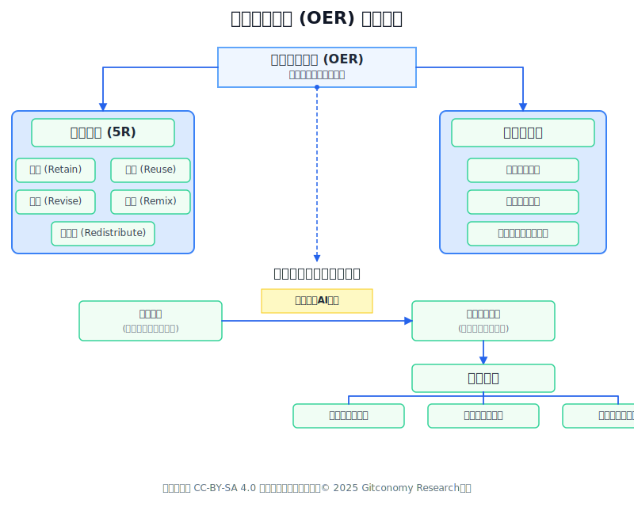

*图：开放教育资源 (OER) 要素框架*

然而，OER 的价值已远超成本节约。随着生成式人工智能（Generative AI）技术的崛起，OER正在经历一场从静态内容到动态知识生态的范式革命。AI 工具使得教师能够更高效地创建、更新和个性化定制OER内容，使其与瞬息万变的课程目标和行业趋势保持同步。这标志着教育资源不再是固化的教科书，而是一个可交互、可演进、可参与的知识平台，从而极大地提升了学习的参与度和有效性。

2. **开放科学（Open Science）成为科研新范式**

与OER在教育领域的变革相呼应，开放科学正在成为全球科研界的主流范式。欧盟委员会等机构大力倡导的开放科学，强调将研究成果、数据、代码和方法论公之于众，以提升科研过程的透明度、可复现性和协作效率。这一理念正在通过大规模的基础设施项目得以实现，例如欧洲开放科学云（European Open Science Cloud, EOSC），旨在为欧洲科研人员提供一个统一的、可信赖的环境，用于发布、查找和重用数据、工具与服务[3]。

*图：开放科学(Open Science) 框架*

开放科学的核心在于将科研产出——尤其是代码和数据——视为与学术论文同等重要的要素。这不仅加速了知识的传播与验证，也促进了跨学科的交叉融合与创新。

### 1.2 中国开源生态的战略转折：从跟跑到赋能“卡脖子”技术

当前，中国的开源生态正迎来一个战略性的转折点。在国家政策的持续推动和人工智能（AI）大模型开源浪潮的引领下，中国的开源实践已经超越了早期的“学习借鉴”阶段，进入了谋求历史性跨越的新阶段——全球领导力与战略破局：

1. AI开源的全球贡献： 在AI领域，中国已成为全球第二大开源贡献国，贡献比例达18.7%，仅次于美国的37.4%，中美两国贡献总和超过55%[4]。这种在关键技术领域的全球参与度，为中国构建世界级创新生态提供了历史性机遇。
2. 破解“卡脖子”困境： 开源被视为实现技术自主可控、破解关键技术领域被“卡脖子”问题的核心战略路径。例如，OpenHarmony等项目已迅速成长为全球活跃的社区，其意义在于成功打造了国产自主可控的数字底座，为能源、金融、工业、教育等核心领域提供更稳定、安全、便捷的解决方案。
3. 治理模式的输出： 中国积极推动联合国大会通过加强AI合作的决议，并以开放、包容、公平的治理理念，承担起提供国际公共品的责任，获得了国际社会的广泛认可。

### 1.3 报告目标、核心问题与结构概述

本报告旨在深入分析OSPO的理论基础和全球实践，以此为模型，设计一套符合中国高校特点的U-OSPO构建战略、治理模式与实施路线图。报告将明确OSPO（开源项目办公室）、学术开源、以及OER（开放教育资源）在高校语境下的内涵及相互关系，并重点探讨组织架构、知识产权管理和社区运营方面的可复制模式。通过系统性管理开放活动，高校可以将潜在的安全与法律风险转化为竞争优势，最大限度地提升知识的社会影响力和学术诚信。

本报告的分析建立在一个核心前提之上：U-OSPO不仅是软件许可的管理机构，更是关键技术（如人工智能和网络安全）的战略入口和“守门人” ，将高校从学术研究层面的开放，扩展至服务国家战略和产业发展。

---

## 二、OSPO的理论基础、功能框架与挑战应对

### 2.1 OSPO的理论模型与演进：从合规到战略创新

1. **OSPO的演变**

开源项目办公室（OSPO）的概念最初源于大型科技公司，其早期职能主要集中于确保合规性，例如对外部开源软件的使用进行许可证审查和风险控制 。然而，随着开源生态系统的成熟和其在现代技术栈中的核心地位确立，OSPO的功能模型经历了显著的演进。

现代OSPO已转型为组织的战略中心，其职能扩展到推动组织创新、提升开发者体验、以及管理复杂的开源供应链[5]。例如，在企业中，OSPO通过规范化流程，使得组织更倾向于允许上游贡献（拥有OSPO的组织参与上游贡献的可能性提高2.5倍） 。这种发展轨迹表明，OSPO是连接内部研发与外部社区、将技术投入转化为战略影响力的关键组织[6]。

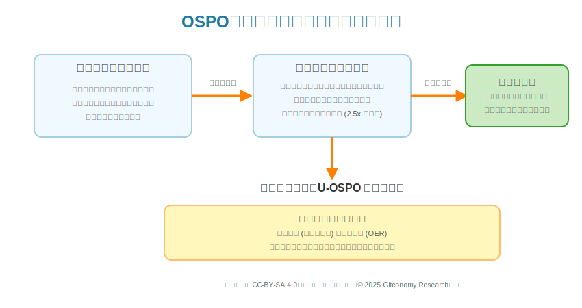

*图：OSPO从合规到战略中心的演进*

在高校语境下，U-OSPO的核心价值在于系统化地将科研成果（代码、数据）和教学资源（OER）转化为开放资产，最大化其公共价值，并确保知识共享过程符合学术规范。

2. **OSPO的战略价值**

在企业环境中，OSPO的战略价值体现在多个层面。它不仅仅是一个技术支持或合规审查部门，更是一个战略性的业务推动者。其核心价值包括：

* **加速创新与上市时间：** 通过有效利用外部开源社区的成果，企业可以避免“重复造轮子”，从而显著缩短产品开发周期，加快创新速度。
* **降低研发成本：** 合理使用开源组件可以大幅降低软件采购和研发的人力成本。
* **管理风险：** 系统性地管理开源软件的引入和使用，特别是通过软件成分分析（SCA）等工具，可以有效控制许可证合规风险和软件供应链安全风险。
* **吸引与留住人才：** 积极参与和贡献开源社区，能够提升企业在技术圈的品牌声誉，使其成为顶尖工程师向往的工作场所。
* **提升工程质量：** 引入开源社区的最佳实践，如代码审查、自动化测试和透明的协作流程，可以全面提升内部的软件工程文化和代码质量。

3. **OSPO 的四大核心职能**

根据TODO Group和Linux基金会等权威组织的总结，一个成熟的OSPO通常围绕以下四大核心职能构建其工作体系[7]：

*图：OSPO四大核心职能逻辑框架*

在法律与合规方面，这是OSPO最为基础也最为关键的职能，往往是企业设立OSPO的首要动因。其工作涵盖制定清晰的开源软件使用、分发与贡献政策，明确允许使用的许可证类型及不同场景下的合规要求；引入并管理SCA等自动化工具，对代码库进行扫描，识别所有开源依赖，检查其许可证合规性及已知安全漏洞；同时作为法律、安全与工程团队之间的沟通桥梁，协同处理开源相关法律纠纷与安全事件响应。

在战略与治理层面，OSPO致力于确保组织的开源活动与整体业务战略保持一致。具体职责包括为工程团队提供开源项目选型建议，评估项目健康度、社区活跃度与长期维护前景；制定对外贡献策略，确定应对哪些关键外部项目投入资源，以影响其发展方向并保障自身利益；此外，还需建立标准流程，评估并决策是否将内部项目开源，并指导完成整个开源过程。

在文化与培训方面，OSPO扮演着组织内部开源文化倡导者与布道者的角色。其工作重点在于为开发者提供开源许可证、社区行为准则与贡献流程等方面的培训，提升团队的开源素养；推广开源社区的协作模式、工具链与开发哲学，推动工程文化向现代化转型；并通过举办讲座、编写内部文档等方式，宣传开源价值与公司成果，营造积极的开源氛围。

在社区与生态建设方面，OSPO是组织与外部开源世界沟通的官方窗口与桥梁。其职能包括代表公司与重要开源基金会及项目社区建立并维护良好关系；针对公司主导的开源项目，制定社区治理规则、发展贡献者社群、组织社区活动，确保项目健康可持续发展；同时通过积极正向的社区参与，塑造公司作为优秀开源公民的形象，提升技术品牌影响力。

总而言之，OSPO 的四大职能构成了企业或机构拥抱开源的完整闭环：合规为开源活动划定了安全边界和底线；战略与治理确保开源活动服务于组织的核心目标；文化与培训在内部根植了开源协作的 DNA；而社区与生态则负责将组织的价值输出到外部世界并从中汲取创新活力。这四者缺一不可，共同驱动组织从被动使用开源转向主动、战略性地参与和领导开源生态。

### 2.2 企业InnerSource实践借鉴

对于许多大型、传统且部门墙严重的企业而言，直接投身于完全开放的外部开源世界风险较高、难度较大。因此，“内部开源”（InnerSource）的实践被证明是一条极为成功的渐进路径。InnerSource的核心思想是在组织内部应用开源的原则、实践和文化，以打破内部信息孤岛，促进跨团队协作和代码复用。

这种模式在微软、PayPal、IBM等科技巨头的转型过程中扮演了关键的催化剂角色，其战略意义首先体现在作为文化变革的“安全沙箱”。它为企业提供了一个相对安全、可控的环境，让员工练习和适应开放协作的工作模式，在一个组织内部，信任成本较低，沟通障碍较少，员工可以在没有外部压力的环境下学习如何编写清晰的文档、进行代码审查以及接受来自其他团队的贡献。同时，InnerSource能够快速验证价值，通过促进内部代码复用和减少重复开发，迅速产生可量化的经济效益，例如IBM将其视为提高效率和促进内部创新的重要途径，这为后续更大规模地拥抱开源提供了有力的内部支持和成功案例。此外，它还是人才能力的“训练场”，参与InnerSource项目能够帮助开发者培养面向社区的编程习惯和沟通技巧，为他们未来参与外部开源项目做好准备。

InnerSource Commons社区通过总结大量企业实践，提炼出了一系列可复用的“模式”，这些是 InnerSource 成功的关键要素[8]。对于任何希望引入协作文化的组织（尤其是高校），以下几点尤为重要：

* **提升可发现性（Discoverability）** ：建立一个内部的代码门户或索引，让开发者可以轻松地搜索和发现其他团队正在进行的项目和可复用的组件。

* **降低贡献门槛**：为项目建立清晰、规范的文档，尤其是 README.md 和 CONTRIBUTING.md 文件。前者说明项目的用途和如何使用，后者则详细指导潜在贡献者如何提交代码、报告问题，从而极大地降低了跨团队协作的摩擦。

* **推广异步沟通（Asynchronous Communication）**：鼓励使用可归档、可搜索的公共沟通渠道（如 Issue Tracker、邮件列表、企业级即时通讯工具的公共频道），而不是私下的邮件或一对一聊天。这使得决策过程和技术讨论对所有人透明，方便后来者理解历史背景，也打破了时区和地域的限制。
* **设立“信任提交者”（Trusted Committer）角色**： 在项目核心团队中指定一到两位成员作为“信任提交者”，他们的职责是专门指导和帮助来自其他团队的贡献者，解答疑问，审查代码，并最终合并他们的贡献。这个角色是建立跨团队信任和促进知识传递的关键。
* **从试点项目开始（Pilot Projects）**： 选择 2-3 个有意愿、有潜力的团队作为试点，帮助他们成功实践 InnerSource。通过这些小范围的成功，总结出适合自身组织的最佳实践和流程，然后逐步推广到更广泛的范围。

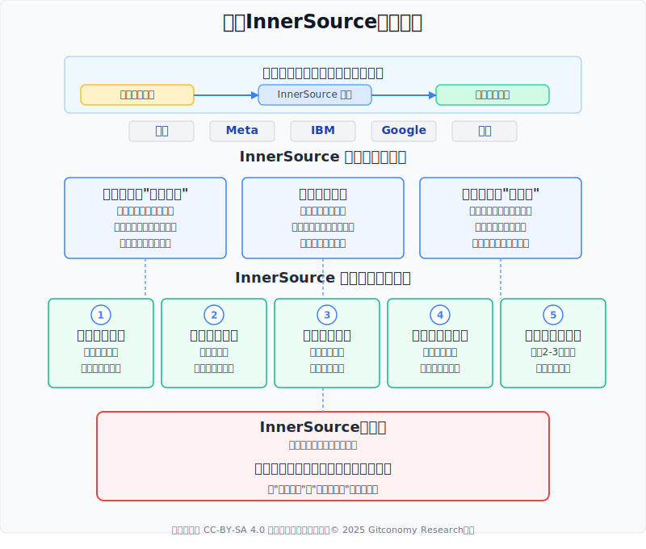

*图：企业InnerSource实践借鉴示意图*

一个至关重要的结论是，**InnerSource的本质并非一个纯粹的技术或流程改进项目，而是一个以技术为载体的组织文化变革管理项目**。它的真正目标是打破根深蒂固的“部门墙”和“代码领地”意识，将文化从“我的代码”转变为“我们的代码”。这种文化转型的需求在按院系和课题组高度划分的高校中尤为迫切。因此，将 InnerSource作为U-OSPO启动初期的核心任务，不是一个技术选择，而是一个深思熟虑的组织发展战略。由U-OSPO这样一个中立的、跨职能的部门来领导 InnerSource计划，提供统一的模板、工具和指导，是确保其在高校环境中成功推广的关键。

---

## 三、高校OSPO治理实践分析

将企业界的OSPO理论应用于高校，必须充分考虑学术环境的独特性。我们将深入分析高校设立OSPO或类似机构的目标、面临的独有挑战，并通过剖析国内外领先的实践案例，提炼在组织架构、知识产权管理、社区运营及激励机制等方面的宝贵经验。

### 3.1 高校OSPO目标与挑战

高校OSPO（U-OSPO）的使命与企业OSPO有着本质区别，其目标完全根植于大学的核心职能——知识创造、人才培养和社会服务。U-OSPO的首要任务是促进学术透明与科研可复现性，通过支持研究软件和数据的开放共享，从根本上提升科研成果的可信度与严谨性。同时，它致力于驱动教育公平与降低学生成本，大力推广开放教育资源，以免费、高质量的教材减轻学生经济负担。此外，U-OSPO还着眼于提升研究软件的影响力与可持续性，为学术界产生的大量有价值但缺乏持续维护的软件提供社区支持和开发规范，延长其生命周期并扩大在学术界及产业界的影响力。最后，通过组织和支持校园开源项目，U-OSPO为学生提供了宝贵的实践育人机会，使他们在真实协作环境中锻炼工程与沟通能力。

然而，学术环境的特殊性给U-OSPO的运作带来了独特且严峻的挑战。根据Ithaka S+R的系列研究报告[9]，最核心的挑战在于激励机制的根本性错位。高校传统学术评价体系几乎完全基于论文发表和科研经费，而开发维护开源软件、创作开放教育资源等宝贵工作往往不被承认为有效学术产出，这严重抑制了教师的参与积极性。同时，高度分散的组织结构使得U-OSPO的推广工作异常艰难，大学如同“各自为政的封地联盟”，院系和课题组间的天然壁垒让跨单位协作成为“西西弗斯式”的艰巨任务。长期的财务可持续性问题同样不容忽视，目前多数U-OSPO依赖外部基金会资助，一旦资助期结束，能否获得学校稳定的内部预算支持仍是巨大未知数，这要求U-OSPO必须在短期内清晰证明其价值。此外，复杂的知识产权管理构成另一重障碍，高校技术转移办公室传统的专利变现模式与开源的开放共享精神存在天然冲突，U-OSPO需要与相关部门进行复杂协调，才能建立清晰、高效、低摩擦的知识产权政策框架。这些挑战共同构成了U-OSPO在高校环境中推进开放科学实践必须面对的现实困境。

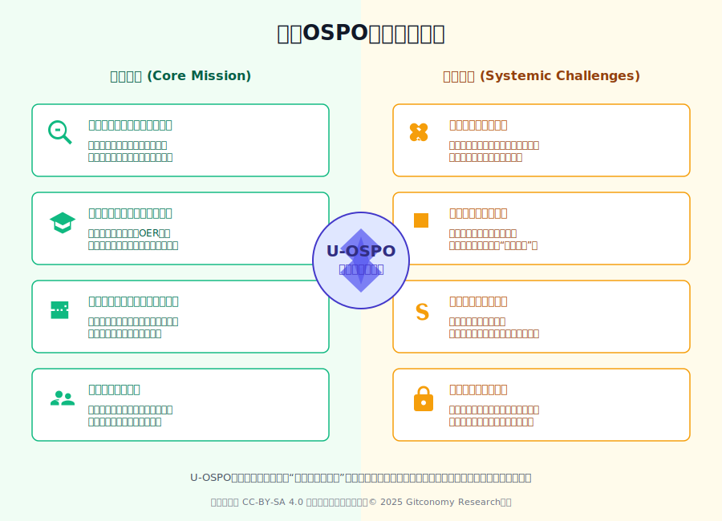

*图：高校OSPO的目标与挑战*

U-OSPO旨在推动的开放、协作与共享的文化，正与学术体系中根深蒂固的评价机制、组织壁垒和运营模式发生直接碰撞。因此，U-OSPO的成功与否，远不止于技术或流程的引入，更关键在于它能否作为一场深层次的“组织变革催化剂”，有效推动大学在激励机制、资源分配和知识产权政策上进行相应的适应性调整。这要求U-OSPO不仅是一个服务提供者，更必须成为一个战略性的倡导者、耐心的协调者和价值证明者，通过持续的努力，将开放科学的核心价值重新锚定在大学的核心使命之中，从而为自身的生存与发展赢得空间。

### 3.2 国内外实践案例分析

尽管面临诸多挑战，全球已有一批先行者在高校开源和开放教育领域进行了宝贵的探索。通过分析这些案例，可以为我们提供清晰的参照。

#### 3.2.1 **全球高校OSPO实践模式**

高校对开源活动的组织和管理模式并非单一。以下三个案例代表了全球高校 OSPO/开源支持体系的三种主要范式：集中治理型、产学研孵化型和文化驱动型。

1. **罗切斯特理工学院（RIT）：集中式、教育驱动的 OSPO 典范**

罗切斯特理工学院（RIT）的 **开源项目办公室（RIT-OSPO）**在全球高等教育界具有里程碑意义，它被公认为**第一个综合性、校级的 OSPO 典范**。RIT-OSPO 的成功在于它将开源活动提升到了学校的**战略层面**，而非仅局限于某个院系。RIT-OSPO 定位为一个**跨学科、跨职能的中央枢纽**，专注于**治理、支持和促进**整个大学的开源活动[10]。它通过与不同院系的教师合作，帮助将真实世界的开源项目融入到正式课程中，使开源社区直接成为**人才培养**的优质资源和实践平台。这体现了 RIT 将**教育**视为 OSPO 核心驱动力的战略选择。

| OSPO 职能 | RIT-OSPO 的核心实践 | 借鉴意义 |
| :--- | :--- | :--- |
| **组织定位** | 校级、跨职能的中央枢纽。 | U-OSPO 必须是**校级**的，才能有效协调资源、制定全校性政策。 |
| **文化与培训** | **系统性课程整合**：帮助教师将真实开源项目融入正式课程。 | 将 OSPO 成果直接作为**人才培养**资源，是可持续发展的关键。 |
| **法律与合规** | 充当法律部门沟通窗口，提供 IP 政策、许可证和贡献者协议（CLA）咨询。 | 必须在 IP、合规等方面设计**治理蓝图**，才能将风险转化为战略优势。 |

2. **加州大学圣克鲁兹分校（CROSS）：产学研孵化与项目转化典范**

加州大学圣克鲁兹分校（UCSC）的 **开源软件研究中心（CROSS）**代表了一种**产学研转化型**的开源模式。CROSS 的定位是一个具有**产学研转化职能的 OSPO/孵化器**，致力于支持大学研究人员与**工业界合作伙伴**共同开发下一代开源软件技术。其独特的**工业会员模式**确保了研究方向与产业的实际需求紧密结合。CROSS 的核心实践是 **LaunchPad Program（启动台计划）**，该计划为博士生提供资金、导师和支持，帮助他们将核心研究成果（学术原型）成功“孵化”为独立的、可被外部社区接纳的开源项目。这明确了从**研究原型到全球社区**的转化路径。

| OSPO 职能 | CROSS 的核心实践 | 借鉴意义 |
| :--- | :--- | :--- |
| **资金与需求** | **工业会员模式：** 产业会员提供资金，资助研究生项目。 | U-OSPO 应通过合作模式，将产业资金和实际需求引入 OSPO 体系。 |
| **项目孵化** | **LaunchPad Program：** 将学术研究成果转化为**可贡献、可维护**的开源项目。 | 明确设计**“研究原型 → 孵化项目 → 全球社区”**的转化路径。 |
| **社区与生态** | **导师机制与社区运营：** 设立导师指导师生进行规范的社区协作，培养**面向社区的工程能力**。 | U-OSPO 应设立**“开源导师”**角色，弥补传统教育在协作能力上的不足。 |

3. **麻省理工学院（MIT）：分布式、文化驱动的 OSPO 典范**

麻省理工学院（MIT）的案例表明，强大的、**自下而上的开源文化**可以在没有集中式 OSPO 的情况下催生繁荣的开源生态。虽然 MIT没有设立一个统一的、名为“OSPO”的办公室，但其整个学术生态系统都深度浸润着开源精神，形成了一个**事实上的、分布式的开源支持体系**。开源文化是 MIT 的基因一部分，其**宽松的知识产权（IP）政策**和强大的学术文化共同支撑了其开源战略。这种模式侧重于最大化**知识的公共价值**和**学术的开放性**，是全球 OER 运动的先驱。

| OSPO 职能 | MIT 的核心实践 | 借鉴意义 |
| :--- | :--- | :--- |
| **组织定位** | **分布式支持：** 开源项目分散在 Media Lab、CSAIL 等多个实验室和院系中。 | U-OSPO 可采取**“中央协调，权力分散”**的分布式结构，适应高校复杂的生态。 |
| **教育与 OER** | **开放课程项目（MIT OpenCourseWare, OCW）：** 将数千门课程材料免费向全世界开放，是全球 OER 运动的先驱。 | U-OSPO 必须将 **OER** 作为核心战略输出，最大化教育公平和影响力。 |
| **法律与合规** | **宽松的知识产权政策：** 极大地**鼓励了师生自发的开源活动**，减少了法律摩擦。 | **IP 政策**是激活师生开源潜能、实现学术开放最有效且最持久的行政工具。 |

#### 3.2.2 国内高校OSPO发展现状与探索

中国高校的 U-OSPO 建设尚处于萌芽阶段，尚未出现类似伯Open@RIT模式的、由学校层面设立的正式机构。然而，这并不意味着缺乏活跃的开源实践。

1. **清华大学：基础设施与顶尖项目双轮驱动模式**

清华大学在开源领域表现尤为突出，形成了一种由**“基础设施 + 顶尖项目”双轮驱动**的独特模式。一方面，清华大学运维着国内规模最大、影响力最广的开源软件镜像站之一，为全国开发者提供基础服务，履行了**公共基础设施供给者**的角色。另一方面，清华大学的研究团队深度参与并引领了全球性的开源项目。例如，由清华大学软件学院主导的物联网数据库 **IoTDB 项目**，成功毕业并捐赠给 Apache 软件基金会，成为中国高校贡献世界级开源项目的标杆。清华的实践证明，顶尖高校有能力通过重大科研项目直接为全球开源生态贡献核心资产，而一个正式的 U-OSPO 将能系统性地发现、支持和推广更多此类项目，将“点”状的成功连接成**“面”状的战略优势**。

| U-OSPO 职能 | 清华大学的核心实践 | 借鉴意义 |
| :--- | :--- | :--- |
| **项目孵化与贡献** | **IoTDB 项目：** 成功毕业并捐赠给 Apache 软件基金会，实现高价值科研成果的国际转化。 | U-OSPO 应系统性地发现、支持和推广重大科研项目，并以**国际顶级基金会毕业**为目标。 |
| **社区与生态** | **开源镜像站运维：** 运维国内规模最大的镜像站，承担**公共基础设施供给者**的角色。 | U-OSPO 应提供**优质的基础设施服务**，作为社区建设的流量入口和技术服务能力的体现。 |
| **战略与治理** | **科研引领：** 研究团队深度参与并引领全球性开源项目。 | U-OSPO 应成为高校与全球基金会沟通的桥梁，**指导重大科研项目**以开源治理模式启动。 |

2. **浙江大学软件学院：学术评价与产业贡献深度融合模式（增强）**

浙江大学（ZJU）软件学院的开源实践模式，重点在于将教育和研究活动直接与全球顶级的产业开源生态，特别是 **CNCF（云原生计算基金会）**，紧密对接。学院致力于将教育、研究和产业经验深度融合，是 CNCF 的早期参与者之一，并在云原生技术领域保持前沿。

在学术评价方面，浙江大学通过自主研发的“太乙平台”，实现了开源贡献与学业认定的紧密结合。“太乙平台”是一款面向开源生态的服务平台，旨在精准衡量开发者的贡献价值、影响力和技能水平。学院已明确将**相关企业和社区的开源项目**在太乙平台上发布，作为学生**评奖评优和学位认定的白名单项目**。同时，浙江大学的学生被接受参与 **Google Summer of Code (GSoC)**，并在 **CNCF 项目**（如 Kubernetes）中进行贡献，由产业界的专家担任导师。此外，浙江大学的 SEL 实验室是 **KubeEdge** 项目的主要贡献组织之一，该项目已从 CNCF 沙箱阶段毕业。这种模式确保了人才培养与产业需求的高度匹配，并推动了学院研究课题与产业实践的紧密结合。

| U-OSPO 职能 | 浙江大学软件学院的核心实践 | 借鉴意义 |
| :--- | :--- | :--- |
| **人才培养与社区** | **太乙平台：** 自主研发平台，**精准衡量开发者贡献价值**，并用于**评奖评优和学位认定**。 | U-OSPO 应将开源实践纳入**学术评价体系**，利用数据平台将开源活动转化为可量化的创新成果。 |
| **研究与技术孵化** | **KubeEdge 项目贡献：** 推动实验室研究课题与 CNCF 项目的实际需求相结合。 | U-OSPO 需支持有前景的**研究型开源项目**，推动实验室成果向全球生态输送，形成学科影响力。 |
| **产教融合** | **CNCF 合作与 GSoC 参与：** 与国际顶级基金会合作，为学生提供**“产学研联合导师制”**的贡献实践机会。 | U-OSPO 应成为**前沿技术布道者**，确保人才培养与产业需求的高度匹配。 |

3. **华东师范大学：开源元研究与数据标准制定者模式**

华东师范大学在开源领域的探索，尤其在数据与标准方面**，展现了其独特的优势。华东师大的实践证明了高校在*开源元研究”（即对开源本身的研究）和数据驱动的开源治理领域的独特价值，证明了 U-OSPO 不仅可以是技术贡献者，更可以是开源生态的**“思想者”和“规则制定参与者。其 X-lab 开放实验室是开源社区数据分析平台 **OpenDigger** 的重要发起方和核心贡献者，该平台旨在通过数据洞察开源生态，为开源治理提供支持。同时，实验室成员深度参与了中国信通院牵头的**开源治理国家标准的制定工作**，将学术研究与国家战略紧密结合。

| U-OSPO 职能 | 华东师范大学的核心实践 | 借鉴意义 |
| :--- | :--- | :--- |
| **开源元研究** | **X-lab 与 OpenDigger：** 发起和贡献数据分析平台，通过数据洞察开源生态。 | U-OSPO 应设立或支持**“开源元研究”**职能，利用数据科学工具分析和优化自身的开源生态。 |
| **战略与治理** | **国家标准制定：** 深度参与开源治理国家标准的制定工作。 | U-OSPO 应积极参与国家和行业的**标准制定**，利用学术优势转化为具备全国影响力的治理规范。 |
| **社区与生态** | **数据服务供给：** 通过 OpenDigger 平台向更广泛的社区提供**数据洞察工具**。 | U-OSPO 应提供**中立、高价值的分析服务**，以数据洞察吸引社区和产业合作伙伴。 |

### 3.3 高校OSPO治理模式比较

基于对国内外高校OSPO实践案例的分析与提炼，我们这些模式归纳为一个双轴比较象限图。该图旨在通过两个核心维度——治理模式和核心驱动力，清晰定位不同U-OSPO的战略侧重与组织结构。水平轴代表治理模式，由左至右从集中式/校级主导过渡到分布式/文化驱动，反映了U-OSPO在高校行政体系中的集权程度和运营推力来源。垂直轴代表核心驱动力，由上至下从侧重人才培养/教育到侧重科研/产业转化，体现了 U-OSPO 的首要战略目标和价值产出方向。通过这种划分，四种典型治理模式被清晰界定：左上角的教育-集中治理型，右侧的教育-文化驱动型，左下角的科研-集中转化型，以及右下角兼具科研产业侧重和分布式特征的中国高校探索实践，为理解U-OSPO战略选择提供了直观的理论框架。

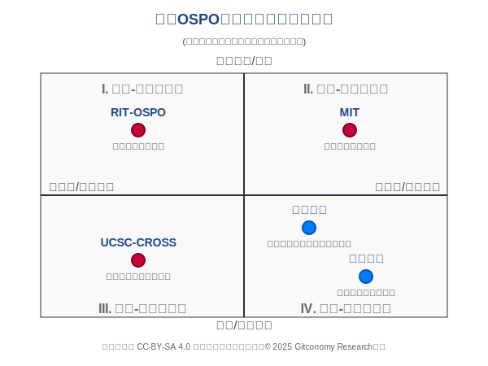

*图：高校OSPO治理实践模式对比分析*

对比国内外实践可以发现，中国顶尖高校在开源领域拥有强大的“点”状实力——即由个别顶尖学者、实验室或项目驱动的卓越成就。然而，普遍缺乏将这些“点”连接成“面”的系统性、战略性协调机制。这正是设立 U-OSPO 的价值所在：它能将零散的、自发的开源活动，提升为全校性的、有组织的战略行为，从而最大化资源利用效率和整体影响力。

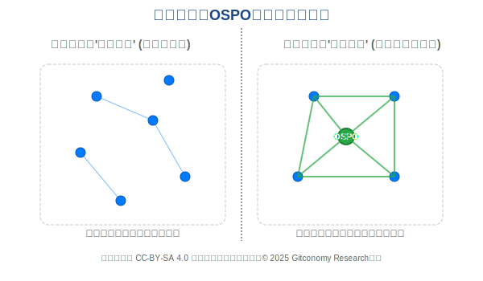

*图：国内外高校OSPO实践侧重点对比*

### 3.4 治理与激励机制借鉴

治理与激励是决定U-OSPO能否成功的两大命脉。

1. **分布式治理模式**

OER运动的经验表明，单打独斗的模式虽然启动快，但难以持久。许多成功的 OER 计划都采取了州级或高校联盟的形式，从“一个人走得快”转向“一群人走得远”。这种跨机构的分布式治理模式，通过建立正式的协作框架和权益共享机制，有效打破了“资源孤岛”。对于U-OSPO而言，这意味着其治理结构必须是开放和网络化的。在校内，需要建立一个跨院系、跨部门的指导委员会；在校外，应积极寻求与其他高校、科研机构乃至企业建立开源联盟，共同制定标准、共享资源、分担成本。

2. **激励机制的创新探索**

如前所述，激励错位是根本性障碍。解决这一问题需要大胆的制度创新。

* **直接经济激励**： 许多高校采用发放小额奖金、研究补助或津贴的方式，对教师采纳、改编或创作OER 的额外劳动进行补偿。对于开发全新开放教科书等投入巨大的项目，一些学校会提供更高额度的资助（如堪萨斯大学提供高达5,000 美元的奖励）。这种直接的经济激励是启动项目、吸引早期参与者的有效手段。

* **与学术评价体系挂钩**： 然而，仅靠金钱激励是远远不够的，甚至是不可持续的。最具革命性也最具挑战性的举措，是将开源和 OER 贡献正式纳入学术评价的核心体系，即职称晋升、终身教职评定和年度绩效考核。这要求高校从根本上重新定义“学术成果”的内涵，承认一个维护良好、社区活跃、被广泛引用的开源软件包，或是一本被多所高校采纳的 OER 教材，其学术价值和影响力不亚于一篇高水平期刊论文。

一个关键的判断是，U-OSPO想要获得真正的成功，其最重要的非技术性任务，就是设计并推动一套能够被学校学术委员会认可的、用于评估和奖励开放贡献的新型评价体系。这不仅需要量化指标（如软件下载量、OER 采纳学生数、代码贡献者数量），更需要建立同行评议机制，来定性评估其学术质量和创新性。任何一个能够率先在制度层面解决激励问题的高校，都将在这场开放浪潮中占据领导地位，其 U-OSPO也将成为全球效仿的典范。

---

## 四、OSPO理论与高校实践的对比分析

### 4.1 企业级OSPO和高校OSPO的共通的原则

尽管企业OSPO和高校OSPO在最终目标和组织结构上存在根本差异，但在实现目标的手段和推动组织变革方面，两者遵循着三项关键的共通原则。这些原则是任何成功的开源治理实践的基石：

1. **协作流程标准化**

无论是商业公司追求快速产品迭代，还是高校追求跨学科、跨机构的学术透明，要想实现大规模协作，都必须建立一套清晰、低摩擦的开源规则。这包括提供标准化的项目模板、清晰的贡献指南、自动化的测试与集成流程等。通过标准化流程，可以有效降低师生或工程师的参与门槛，显著提升协作效率。

2. **内部文化转型**

无论是企业还是高校，OSPO 都扮演着组织内部文化变革推动者的角色。它们的核心任务之一就是打破信息孤岛和**“非我发明”（Not Invented Here）**的保守心态。通过倡导透明、开放、协作的文化，OSPO 致力于将组织从一个个独立的单元，转变为一个相互连接的网络，从而激活组织的整体创新能力。

3. **人才吸引与培养**

开源被证明是吸引和识别顶尖人才的强大磁石。企业通过开源项目和社区参与来吸引优秀的工程师；同样，一所拥有活跃开源文化和明星开源项目的高校，也更能吸引到顶尖的师资和研究生，并培养出具备协作能力、工程实践经验、更具市场竞争力的毕业生。因此，利用开源生态进行人才建设，是两者共同的战略目标。

这三项共通原则为高校OSPO的初期建设提供了明确的行动方向。它们表明，无论最终目标是商业利润还是学术影响力，OSPO都必须首先解决组织内部的协作效率和文化壁垒问题。通过借鉴企业界在InnerSource 中成功的实践，高校OSPO可以稳健地在内部建立起开放、透明的协作文化，为后续服务于学术开放和教育创新的目标奠定坚实的基础。

### 4.2 企业级OSPO和高校OSPO的本质差异

企业OSPO和高校OSPO虽然都承担着管理和推广开源的核心职能，但由于其所服务的组织目标和激励体系的根本不同，两者在战略定位和治理模式上存在显著差异。企业的一切活动围绕商业竞争力展开，而高校的使命则根植于公共利益和学术发展。下表详细对比了这些核心差异，这是设计任何 U-OSPO 治理蓝图的前提。

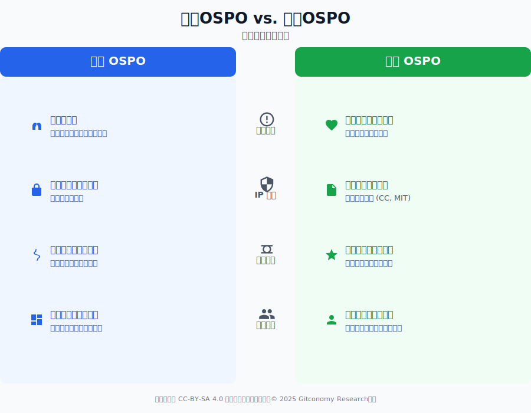

*图：企业OSPO和高校OSPO的差异比较*

| 维度 | 企业 OSPO | 高校 OSPO |
| :--- | :--- | :--- |
| **核心目标** | 服务于**商业竞争力**——提升利润、抢占市场份额、提高工程效率。 | 服务于**学术使命与公共利益**——促进知识自由传播、保障教育公平、提升社会福祉。 |
| **知识产权 (IP) 管理** | 首要任务是**风险控制与战略布局**，确保引入的许可证与商业模式兼容。 | 目标是**最大化知识的传播与影响力**，倾向于鼓励使用 MIT、Apache 2.0、CC 等宽松许可协议。 |
| **激励体系** | 采用直接且强大的激励工具，如**薪酬与奖金**，开源贡献可直接与绩效评估和经济回报挂钩。 | 必须在**学术声望、同行认可和职称晋升**为核心的复杂体系中进行创新，金钱奖励无法取代制度性变革。 |
| **社区受众与利益相关者** | 主要服务对象是内部的工程师、产品经理和法务团队，目标相对一致。 | 服务一个极为**多元化且关系松散**的群体，包括教授、学生、图书馆员、技术转移办公室人员等。 |

这些差异表明，高校无法简单复制企业的OSPO模式。U-OSPO的治理蓝图必须深刻理解学术声望的价值和激励错位的挑战，并将工作重心放在制度创新上。成功的U-OSPO需要建立一套能够将开源贡献转化为职称评定、科研经费申请等学术货币的机制，同时通过开放、透明的IP政策，最大化知识对社会和教育的影响力。

### 4.3 高校OSPO实践的关键要素关注

#### 4.3.1 高校OSPO关键要素的组成

基于上述对比，可以明确高校在构建和运营 OSPO 时，除了借鉴企业经验，还必须对以下几个特有的关键要素给予额外或重点的关注。这些要素是决定U-OSPO能否在学术土壤中生根发芽的关键。

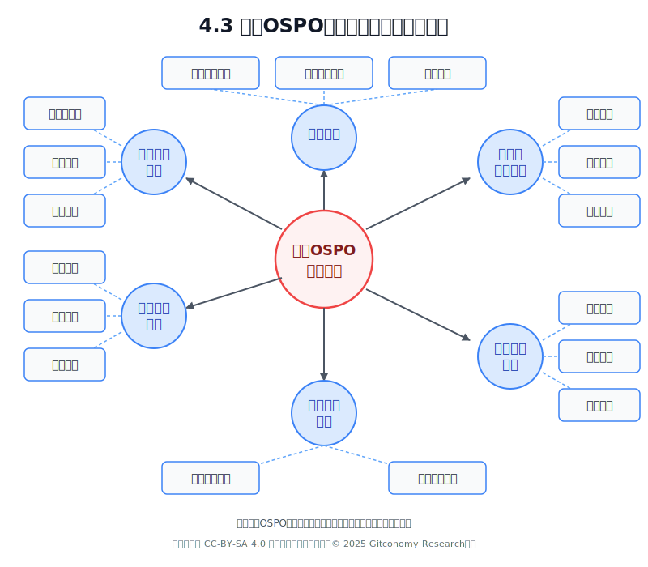

*图：高校OSPO实践需要关注的关键要素*

1. **治理框架**是高校OSPO稳固运行的基础。它需要建立清晰的组织架构设计，明确OSPO在学校中的归属部门(如信息化处、科研部或教务处)，确定专职与兼职人员配置，以及与校内各学院的对接方式。同时，合作协调机制至关重要，应设立跨部门协作流程，解决跨学院与部门间的协同问题，建立定期会议制度与工作汇报体系。在决策层面，构建包含教师、管理者和学生代表的决策委员会，用于确立战略规划与资源分配的优先级评定方法。

2. **产学研协作模式**为OSPO提供外部连接与资源整合能力。高校应建立企业合作伙伴计划，吸引企业资源支持，共建开源实践基地，开展联合项目研发活动。在社区互动方面，积极与国际开源基金会和社区建立联系，参与开源活动，推动师生融入全球开源社区。成果转化则需关注知识产权与开源许可策略的开发，建立开源项目孵化机制，促进技术转化与产业应用，实现高校知识创造的社会价值。

3. **资源支持系统**为OSPO的运行提供物质保障。经费保障方面，高校应设立专项经费支持开源活动，争取校内预算支持，同时积极引入企业赞助和社会资金。基础设施建设包括代码托管平台、CI/CD系统、知识库等技术基础设施的构建，以及可靠硬件支持的提供。技术支持则需组建专业团队，为校内开源活动提供代码审查、开源合规检查、技术咨询等专业服务，解决技术难题。

4. **开源文化建设**是OSPO长期成功的土壤。高校应积极推广开源精神与价值观，强调知识共享、协作创新的重要性，营造开放包容的学术环境。活动支持方面，定期组织黑客马拉松、开源日、工作坊等活动，支持建立校内开源社团，增强社区凝聚力。同时建立激励机制，设置开源贡献奖励，树立开源典型，通过多种方式激发师生参与的积极性。

5. **人才培养机制**是高校OSPO区别于企业OSPO的核心特色。学校应开发开源技术与实践课程，将开源理念与方法融入专业教学，建立开源教材与在线学习资源体系。在实践项目方面，提供基于真实开源项目的学习机会，设立开源实践学分，组织学生开源团队参与国内外开源项目。学分认定制度的建立也很重要，包括开源贡献学分转换机制，认可学生在开源项目中的表现，将其纳入学业评价体系。

6. **学术评价体系**的创新是推动开源实践可持续发展的关键。高校应将开源代码贡献纳入学术成果认定，建立开源贡献评价标准，使其与传统论文、专利成果并重。教师评价机制也需相应调整，在职称评定与绩效考核中纳入开源指标，鼓励教师指导学生参与开源活动，认可教师在开源社区建设中的价值贡献。

高校OSPO实践需要多维度协同，平衡内外部资源与发展目标。一个成功的高校OSPO不仅服务于技术创新，更应成为连接教学、科研与社会的桥梁，培养具有全球视野和协作能力的创新人才。通过系统化的设计和实施这些关键要素，高校可以建立起适合自身特点的开源项目办公室，促进开源文化在高等教育环境中的繁荣发展。

#### 4.3.2 高校OSPSO应对学术挑战的机制

U-OSPO 在高校环境中推进开放实践时，无法简单复制企业的 OSPO 模式，必须直面并解决学术界特有的根本性挑战。它们分别是激励机制的创新、组织壁垒的消除，以及对敏感数据和伦理风险的审慎管理。

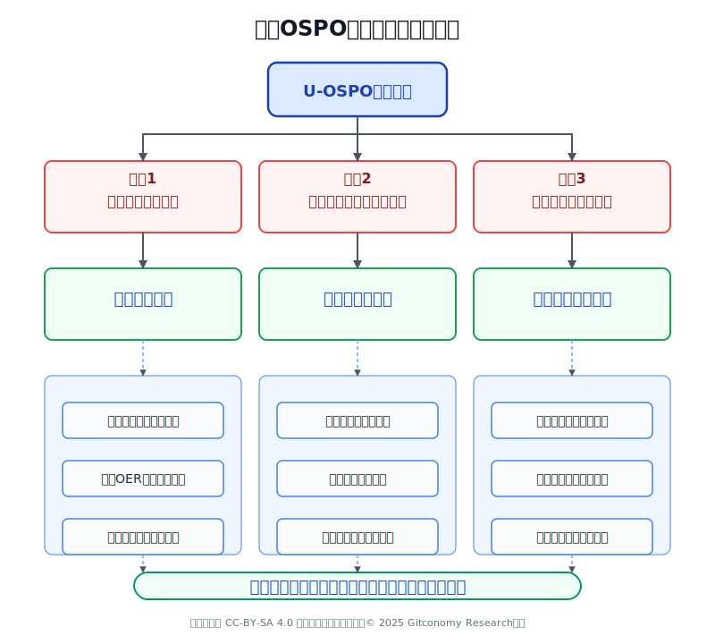

*图：高校OSPO应对学术挑战的机制*

1. **学术声望的价值化**

这是最核心的特征。U-OSPO 不能仅仅停留在提供技术支持，它必须成为一个“价值转换器”。它需要建立一套机制，将开源贡献（如开发一个被广泛使用的科学计算库）和 OER 贡献（如编写一本广受欢迎的开放教材）所产生的隐性学术影响力，转化为职称评定委员会能够理解和认可的显性指标。例如，可以开发工具来追踪开源软件在学术论文中的引用情况，统计 OER 教材在不同院校的采用数据，并邀请校外同行专家对这些贡献的学术质量进行评议，最终形成一份可与传统学术成果相媲美的评估报告。

2. **跨学科与跨机构的治理协调**

高校的学科壁垒森严。如果 U-OSPO 被视为仅仅是计算机系或工程学院的“专属品”，它的影响力将大打折扣。因此，其治理结构必须从一开始就具备高度的包容性和代表性。指导委员会中不仅应包括理工科的代表，还应有来自人文社科、医学、艺术等不同学科的教师，以确保其服务能满足多样化的需求。同时，还应包括来自图书馆、科研处、技术转移办公室、信息中心等关键行政部门的代表，以打通政策制定和资源协调的关节。U-OSPO 的定位应该是服务全校的公共平台，而非任何单一学科的附属机构。

3. **数据伦理与学习隐私**

高校处理的数据往往具有高度的敏感性，例如涉及人类被试的科研数据、包含学生个人信息的学习行为数据等。当 U-OSPO 推动这些数据的开放共享时，必须建立比企业更为严格和审慎的伦理审查与合规流程。这包括制定详细的数据脱敏（De-identification）标准操作程序，确保在数据开放前彻底移除所有个人身份信息；同时，在利用 OER 平台收集学习分析数据时，必须明确告知学生数据的使用目的和范围，并提供退出选项，严格遵守数据隐私保护的相关法律法规。这不仅是法律要求，更是维护学术伦理和机构声誉的底线。

有效应对以上的挑战，是确保 U-OSPO 将外部战略机遇转化为内部创新动力的前提。解决学术声望的价值化是撬动师生参与积极性的杠杆；实现跨机构的治理协调是确保 U-OSPO 权力能够跨越部门壁垒、高效配置资源的组织保障；而遵循数据伦理与隐私保护则是高校作为公共知识机构的底线与声誉基石。U-OSPO 必须围绕这三个维度进行制度创新和组织变革，才能真正将开放科学的理念锚定在大学的核心使命之中，实现长期可持续发展。

---

## 五、高校OSPO构建战略、治理模式与实施路线图

### 5.1 构建战略与定位

一个成功的U-OSPO必须有清晰的战略定位和务实的实施路径。它不应被视为一个临时的项目或一个纯粹的技术支持部门，而应被定位为支撑学校核心使命的长期基础设施。

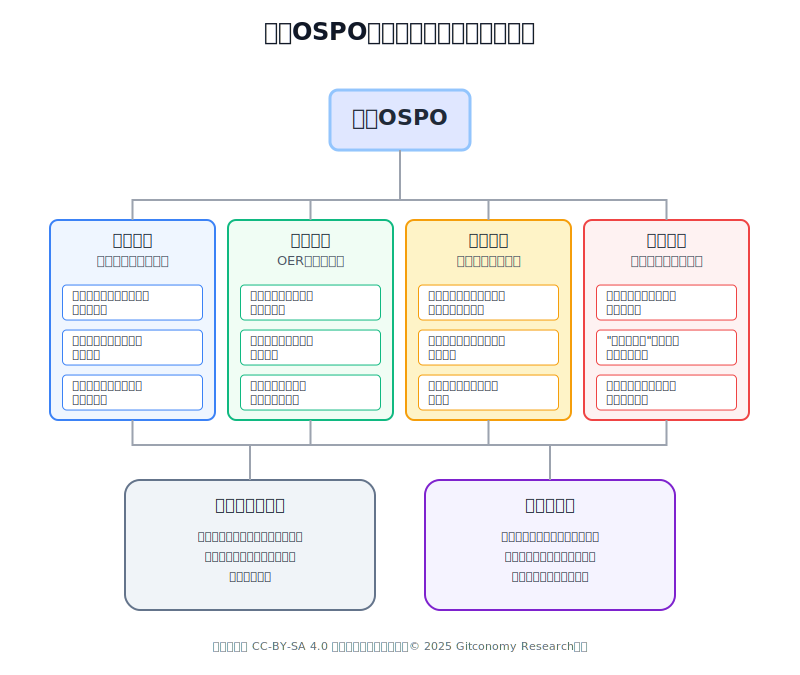

*图：高校OSPO的战略定位与关键职能角色*

1. **学术定位：开放科学的执行中心**

在学术层面，U-OSPO是推动开放科学理念落地的核心执行机构。它不仅为科研人员提供必要的基础设施、合规指导与技术培训，还系统性地支持研究代码、实验数据与方法论的规范共享，从而显著提升成果的可复现性、可见度与学术影响力，推动科研合作与学术诚信的建设。

2.  **教育定位：OER 的转型引擎**

在教育层面，U-OSPO是推动教学资源从静态教材向动态知识生态系统转型的关键引擎。它负责管理开放教育资源（OER）的全生命周期，并引入开源社区的协作开发模式，鼓励师生共同参与资源的创作、修订与迭代。同时，积极运用人工智能等技术，开发更具个性化和互动性的新型学习资源与体验。

3. **人才定位：下一代创新人才的孵化器**

在人才培养层面，U-OSPO是培育下一代创新人才的孵化平台。它为学生提供参与真实开源项目的全球性协作机会，使其在锻炼前沿工程实践能力的同时，系统培养开源文化所倡导的沟通协作、社区治理等核心软技能。这种“开源文化、协作能力与工程实践”三位一体的能力结构，正契合未来科技产业对复合型人才的迫切需求。

4. **产业定位：产教融合的技术桥梁**

在产业链接层面，U-OSPO是深化产教融合的战略桥梁。它系统性地对接企业的真实技术难题与研发需求，将其转化为高校的科研课题与学生项目，实现“真问题驱动”的教学与科研双向赋能。同时，也为高校的智力成果向产业转化提供了高效路径，有力支撑国家关键领域的技术攻坚与创新发展。

综合全球趋势与国家战略需求，U-OSPO在高校中应承担多维度的战略角色，成为融合学术、教育、人才与产业功能的学术与教育创新的基础设施服务者与规则维护者：

* 作为**基础设施服务者**，U-OSPO 提供工具、平台、流程和专业知识，赋能全校师生更便捷、更规范地参与到开放科学和开放教育的实践中。它如同大学的图书馆或高性能计算中心，是支撑现代化教学与科研不可或-的公共资源。
* 作为**规则维护者**，U-OSPO 负责制定和维护与开放相关的政策、标准和最佳实践，包括知识产权政策、贡献指南、社区行为准则等，确保学校的开放活动在合法合规、权责清晰的框架内有序进行。

### 5.2 高校OSPO治理模式设计

#### 5.2.1.混合治理架构模式

一个有效的治理模式是确保 U-OSPO 能够跨越部门壁垒、整合各方资源、并与学校现有行政体系顺畅协作的关键。鉴于U-OSPO的多维战略定位，其组织架构推荐采用中心化战略部门与分布式执行网络的混合模型，以确保政策执行力和跨部门协同能力。U-OSPO应直接向分管科研、教育或信息化的副校长或校级高层决策者汇报，确保其具备足够的行政级别和战略影响力。

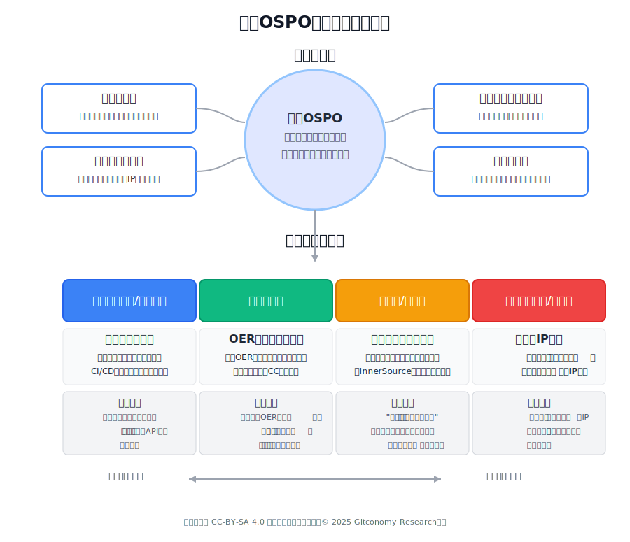

*图：高校OSPO混合治理组织架构*

1. **中心化核心**

这是U-OSPO的专职执行和战略规划机构，是一个小型、精干、具备高专业度的团队。它的职能必须保持**中立性**和**战略聚焦**，避免陷入日常执行事务：

* **战略与治理：** 负责制定 U-OSPO 的整体战略规划、年度工作计划、资源协调和对外代表。
* **法律与合规管理：** 负责管理法律合规，特别是对开源许可政策和知识产权（IP）风险进行初步审核。
* **高层沟通与资源争取：** 负责与校级高层决策者沟通，争取长期预算支持，并向跨部门指导委员会汇报工作成效。
* **文化与培训：** 负责设计和推广全校性的开源文化理念和 InnerSource 最佳实践。

2. **分布式执行网络**

U-OSPO的核心职能需要通过与高校现有机构的协作和职能嵌入来落地，形成一个覆盖全校的**分布式执行网络**。这种模式避免了重复建设，并利用了现有部门的专业性：

| 执行部门 | 核心职能落地 | U-OSPO 的协作重点 |
| :--- | :--- | :--- |
| **信息化办公室/网络中心** | **平台和工具管理：** 提供代码托管平台（如 GitLab）、镜像站、自动化 CI/CD 工具和数据共享基础设施。 | 确保平台满足开源协作的**标准化**要求，并提供数据 API 支持 **U-OSPO 的度量计量**。 |
| **大学图书馆** | **OER 许可和知识管理：** 负责 OER 资源的收集、元数据管理、长期存档，并提供 **CC（知识共享）许可咨询**和指导。 | 联合制定 OER 资源的**发布规范**和**生命周期管理**，将知识产权转化为**可发现的开放资产**。 |
| **科研院/实验室** | **项目孵化与科研转化：** 推动重大科研项目从立项之初就采用开源治理模式，并为 InnerSource 试点项目提供指导。 | 制定**“研究原型到开源项目”**的转化流程，为科研人员提供**项目治理模板**和技术支持。 |
| **知识产权中心/法务部** | **法律和 IP 合规：** 负责最终的**知识产权（IP）审核**、制定和解释校级**开源 IP 政策**，处理法律风险。 | 联合 U-OSPO 制定**默认为开放**的 IP 政策，并建立**简化的、低摩擦的审批流程**。 |

这种混合架构确保了U-OSPO 在战略上具备**中心化**的领导力，而在执行上具备**跨部门**的渗透力和专业性，有效解决了高校组织结构分散、职能边界不清的难题。

#### 5.2.2 组织架构与团队角色

建议采用一种“核心团队 + 指导委员会”的混合模式，以兼顾执行效率和战略高度。

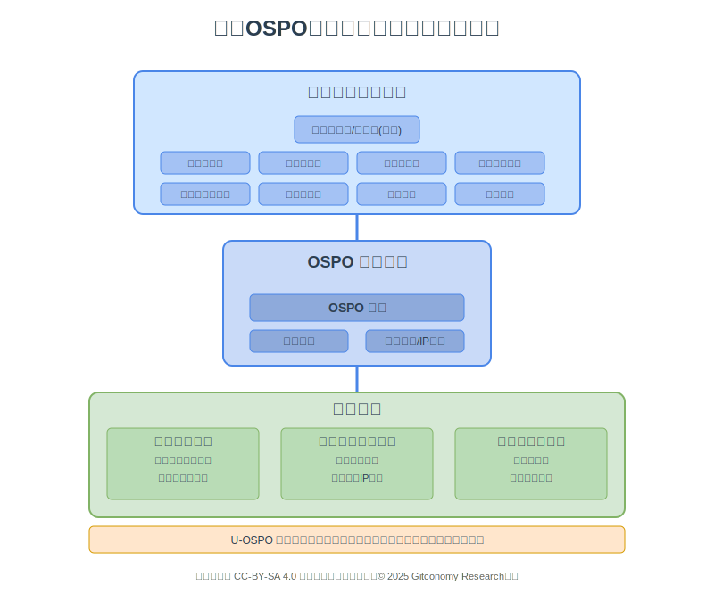

*图：高校OSPO组织架构和团队角色示意图*

1. **OSPO 核心团队组成**

这是OSPO 的专职执行机构，初期规模可以精简。建议设立以下核心岗位：

- OSPO 主任： 负责 OSPO 的整体战略规划、资源协调和对外代表，应由在学术界和开源社区均有声望的资深人士担任。
- 社区经理： 负责校内外的社区建设、活动组织、宣传推广，是连接师生与 OSPO 的桥梁。
- 开源合规/IP 专员： 负责处理开源许可证合规问题，并作为与学校法务部、技术转移办公室（TTO）的主要联络人，推动制定和执行简化的开源 IP 政策。

2. **跨部门指导委员会组成**

这是 OSPO 的最高决策与咨询机构，确保其工作与学校整体战略保持一致。该委员会的主要职责是审定 OSPO 的年度工作计划与预算、协调解决跨部门的政策性障碍、评估 OSPO 的工作成效。委员会成员应包括：

- 主管科研的副校长或教务长（作为委员会主席，提供高层支持）。
- 来自科研处、教务处、图书馆、信息中心、技术转移办公室、法务部等关键行政部门的负责人。
- 来自工科、理科、人文社科、医科等不同学科领域的资深教授代表。
- 学生代表。

3. **责任边界**

U-OSPO是一个赋能和服务部门，而非一个强制性的管理部门。它为师生的开源活动提供指导、资源和支持，但不直接干预具体的科研和教学活动。其权力主要体现在对学校官方开源政策的解释权、对使用学校名义发起的开源项目的审核与备案，以及对校级开源相关资源的分配建议权。

核心机制设计原则：

- **资源共享协议**： 制定一份标准化的校内项目共享（InnerSource）协议模板，明确代码贡献、使用权限、维护责任等，鼓励跨课题组的资源共享与协作。
- **知识产权分配模型**： 与技术转移办公室合作，设计一套分层分类的 IP 政策。对于主要由师生利用业余时间、未使用学校重大专项经费完成的、旨在促进学术交流的开源项目，默认采用学校预先批准的宽松开源许可证（如 MIT, Apache 2.0），并简化审批流程。对于涉及学校核心专利、由重大项目资助的软件，则采取更为审慎的个案审议机制。
- **贡献者荣誉体系**： 这是激励机制的核心。U-OSPO 应主导设计并推行一套能够量化和展示开放贡献的荣誉体系。例如，设立年度“开源贡献奖”，为有突出贡献的学生和教师颁发证书；开发个人学术主页插件，自动展示其在 GitHub/Gitee 等平台上的贡献统计；最重要的是，为职称评定委员会提供一份详细的《开源与 OER 贡献评价指南》，将这些非传统学术成果的评估标准化、规范化。

### 5.4 知识产权（IP）管理与 OER “5R”原则合规**

高校的知识产权管理通常侧重于技术转让和商业化收益分配。U-OSPO需要在这一框架下，为学术成果提供一条清晰的**开放共享路径**。高校IP政策通常规定，成果创作者对于知识产权的公开方式拥有主要决定权，但需符合校方规则。

### 5.4.1 OER 的“5R”原则与许可框架的应用

开放教育资源（OER）的核心特征在于其开放许可，允许用户免费获取、分享、修改和再混合资源。U-OSPO 在 OER 领域的职能是确保教师在发布教学资源时，能正确、合规地使用**知识共享许可协议（Creative Commons, CC）**。

| 5R 原则 | 对应 CC 许可组件 | U-OSPO 合规要求 |
| :--- | :--- | :--- |
| **保留 (Retain)** | 开放许可（如 CC BY） | 资源必须在开放平台（如Open edX）上永久可访问，且许可不能被撤销。 |
| **重用 (Reuse)** | CC BY（归属）/公共领域（CC0） | U-OSPO 应倡导优先采用 **CC BY 许可**，以最大限度地促进资源被采纳。 |
| **修改 (Revise)** | 允许衍生（非ND） | 建议资源采用 CC BY 或 CC BY-SA，U-OSPO 需提供技术平台支持资源的修改和再混合。 |
| **混合 (Remix)** | 允许衍生（非ND） | 必须有系统确保教师遵守开放许可政策，特别是在政府或基金要求开放许可的项目中。 |
| **再分发 (Redistribute)** | 开放许可（非NC/ND） |

U-OSPO必须建立严格的合规审核机制，确保资源包含正确的归属（Attribution, BY）和许可声明。 |

### 5.5 高校OSPO成熟度模型：分阶发展与定位

为帮助高校准确评估自身在开源与开放教育领域的发展阶段，并规划清晰的演进路径，我们设计了一套四阶式的高校OSPO成熟度模型。该模型将引导高校从初步认知走向生态引领，实现系统性、阶段性的能力建设。

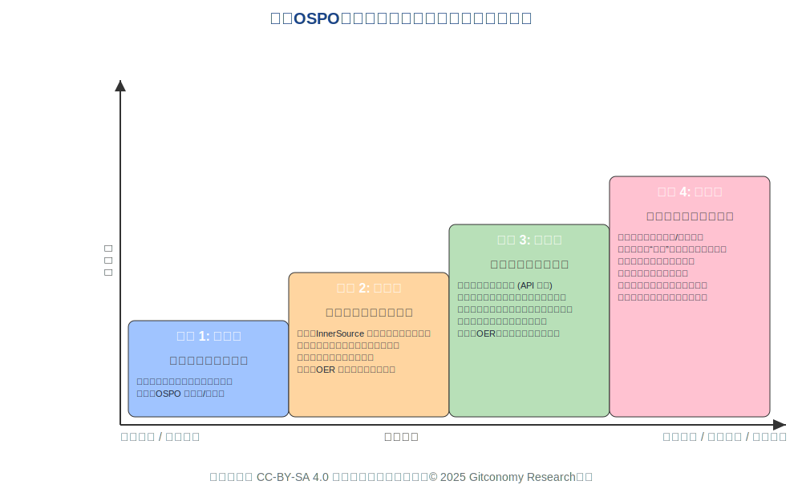

*图：高校OSPO成熟度模型：战略转型与成熟度矩阵*

1. **第一阶段：初始级**

在此阶段，高校的核心目标是建立对开源治理与开放教育资源的基础认知，并初步管控合规风险。组织结构上，通常以成立OSPO筹备组或指定跨部门联络点为标志。政策层面需制定最小化的许可合规清单与基础审查流程。技术平台方面，重点任务是建立内部代码与资源清单，并开展面向师生群体的基础性OSPO理念宣讲与培训，为后续发展奠定认知与制度基础。

2. **第二阶段：规范级**

进入此阶段的高校，致力于实现内部流程标准化，并推动InnerSource实践成为常态。组织结构上升级为设立常态化的U-OSPO核心团队，并与知识产权/法务部门建立强制性的合规审查联动机制。政策上，应发布完整的OER许可指南，并尝试在部分学科中将开源贡献纳入教学或科研评价试点。技术平台需推广统一的协作平台，并支持对内部资源复用率等关键指标进行初步度量，实现流程可控、成效可见。

3. **第三阶段：平台级**

此阶段的高校，目标转向支撑大规模开放成果的对外发布与社区孵化。组织结构上，U-OSPO指导委员会应形成行政领导与社区代表共同参与的混合治理模式，并建立专门的项目孵化支持中心。政策配套需实现开源贡献在职称评定等体系中的全面认可，并形成可复用的资源共享协议模板。技术平台的核心是建成对外服务的资源注册中心与OER发布平台，并遵循“API先行”的设计原则，保障系统的开放性与可扩展性。

4. **第四阶段：生态级**

这是成熟度的最高阶段，高校将转型为国内开放科学领域的战略领导者与规则制定者。组织结构上，U-OSPO的具体运营职能已下沉至各院系，其自身则成为校级战略决策的重要合作伙伴。政策层面，高校应主动牵头组建跨校或行业性的开放联盟与数据共享共同体。社区建设的终极标志，是成功孵化出具有广泛影响力的“明星”开源项目，并推动本校的贡献者在重要国际开源社区中担任领导角色，最终形成自我驱动的开放创新生态。

该四阶成熟度模型为高校U-OSPO的建设提供了清晰的演进路径与可衡量的发展阶段。各高校可借此进行自我定位，识别当前所处阶段的能力缺口与建设重点，从而制定符合自身实际的差异化发展策略。从初期的风险管控与认知普及，到中期的流程标准化与内部协同，再到后期的平台化运营与社区孵化，最终升维至生态构建与规则引领，这一路径体现了从“被动合规”到“主动创新”，从“内部优化”到“外部赋能”的战略转型逻辑。模型的根本价值在于引导高校将开放理念转化为系统性能力，循序渐进地构建起可持续的学术创新生态。

---

## 六、激励机制与开放教育文化建设：重塑贡献价值

### 6.1 OER与开放贡献的挑战与实操性解决方案

推动学术开放文化的最大障碍在于现行的高校教师评价体系。此外，教师在实施 OER 时也面临具体的挑战，因此 U-OSPO 必须提供实操性解决方案。

例如，针对**教师抵触与缺乏认同**的挑战，即教师投入时间开发 OER 的价值低于发论文或申请项目，U-OSPO 必须采取**制度引导**，修订教师评聘办法，明确开源和 OER 贡献的认定标准。面对 **OER 资源更新与可持续性**的挑战，即资源维护和更新成本高、易过时的问题，U-OSPO 需要提供一个稳定的**技术平台**，例如推荐采用 GitLab 或 Gitea 等协作平台，将 OER 开发视为动态的“项目”，利用 Pull/Merge Request 流程，吸引社区（如学生和外部合作者）共同维护和更新。最后，对于**版权问题复杂性**，即教师难以辨别现有资源是否可用于 OER 的问题，U-OSPO 则需承担**合规培训**的责任，定期开展 CC 许可和版权审查培训，并提供一站式许可咨询服务。

### 6.2 开放教育文化培育三要素

U-OSPO 必须采用系统性的文化建设方法，将开放理念融入日常学术活动，以下是三个核心要素的详细阐述：

1. **制度引导：修订评价体系**

U-OSPO 需从制度层面入手，将开源贡献和高质量 OER 视为具有**“社会贡献”**和**“代表性成果”**的技术突破。在具体实践中，这包括推动在申报高级职称时，将取得重大理论创新成果或前沿技术突破的**开源项目纳入代表作序列**。同时，还必须实现**教学成果挂钩**，将 OER 贡献与教学工作量计算、教学成果奖申报等紧密结合。

2. **活动运营：促进内部协作**

U-OSPO应通过组织常态化活动，促进内部协作和知识交流。具体而言，应定期举办**“开放教学沙龙”**、**“开源教学黑客松（Hackathon）”** 和研讨会，将开放共享作为常态化的知识交流活动。更重要的是，通过推进 **InnerSource实践**，促进跨院系、跨学科的资源和代码复用，并对内部复用率进行量化，将其作为关键绩效指标（KPI）之一。

3. **榜样塑造：树立先锋模范**

U-OSPO需建立荣誉体系，为开放贡献者提供认可和支持。具体措施包括：评选“开放教育先锋”或"年度开源贡献者”，授予校级荣誉，并将其案例纳入新教师和研究生发展培训。此外，U-OSPO还可以利用外部基金，为开放先锋团队提供科研或教学项目启动资金，以提供实际的支持和激励。

---

## 七、技术平台与可持续性战略

U-OSPO的技术平台是实现治理、合规和度量的前提。为了确保资源和度量数据可以跨系统调度与计量，建议高校采用 **API 先行（API-first）**的设计原则，同时在 Git 平台选择上采取**混合架构**，以兼顾安全、合规与全球协作。

### 7.1 核心技术平台选型与架构

技术平台是赋能InnerSource 实践、实现OER生命周期管理和保障法律合规的基石。

| 平台类型 | 推荐选型 | 核心功能 | U-OSPO 价值 |
| :--- | :--- | :--- | :--- |
| **代码协作平台** | GitLab/Gitea | 代码版本控制、Pull/Merge Requests、CI/CD 流水线、Issue 追踪。 | **InnerSource 基础设施：** 推广企业级协作流程，实现内部项目复用和 Pull Request 驱动的协作。 |
| **OER 发布与管理平台** | Open edX/Moodle/机构 OER 库 | 课程内容发布、学习者管理、交互式论坛、资源元数据管理。 | **OER 生命周期管理：** 确保 OER 资源的开放访问、版本控制和合规许可（如 CC BY/SA）的正确应用。 |
| **合规与安全工具** | 许可扫描器/依赖性审计工具 | 自动化扫描代码依赖，识别许可证冲突或安全漏洞。 | **风险前置管控：** 在项目发布前强制执行自动化合规审查，避免潜在的法律和安全风险。 |

### 7.2 Git 平台选型战略：混合架构的必然性

Git 协作平台是U-OSPO的核心工作空间，其选型决策必须在**数据控制力**与**生态影响力**之间取得平衡。对于立志成为开放科学领导者的高校，最可行的方案是采用**混合架构**，完美对应U-OSPO从“内循环”到“外循环”的战略演进。

私有化部署（如校内GitLab/Gitea）的优势在于高控制力和数据敏感度管理，代码和数据物理存储在校内，完全遵从内部数据安全和访问策略，这对于处理涉密科研、未公开的核心技术或受严格监管的学生个人信息是至关重要的。同时，私有化部署提供了高灵活性，便于与校内的统一身份认证系统、高性能计算集群进行深度定制和集成。这种环境天然适合在安全可控的前提下，培育 InnerSource 文化，实现内循环。

然而，如果高校的核心目标是构建开放生态，成熟 SaaS 平台（如GitHub Enterprise/Gitee/GitCode）则是必不可少的。SaaS平台依托全球CDN，为分布式的师生和外部贡献者提供全球可达的稳定访问体验。最关键的是，GitHub等平台是全球开源社区的事实标准，能提供最低的参与门槛和最强的网络效应，极大化项目在平台级和生态级阶段的可见度和影响力。

因此，对于大型高校而言，最可行的方案是采用混合架构。这意味着 U-OSPO将私有化部署作为内循环的基础，承载所有内部课程开发和未公开的科研代码，以保障安全合规和 InnerSource 实践。同时，经过合规审核、决定对外开源的核心项目，则利用 SaaS 平台作为外循环的门户，以最大化项目的全球可见度和贡献者参与度。这种战略性的混合架构，是实现“内外兼修”的最优路径，能够确保 U-OSPO 在不同阶段和不同场景下，灵活运用两种模式，最终实现其开放科学的领导地位。

### 7.3 API 先行设计与度量指标

U-OSPO 必须以 **API-first** 原则设计技术平台，确保所有系统之间能够互联互通，从而支撑治理和度量工作。

* **资源调度：** API 允许将核心的协作平台（例如 GitLab 中托管的 OER 项目代码）与发布平台（例如 Open edX）无缝对接，实现资源的动态更新和分发。这种连接推动了**“动态知识生态”**的实现。
* **度量计量：** 通过 API 获取核心数据，U-OSPO 可以实现对开放活动影响力的量化分析：
    * **内部资源复用率：** 衡量内部项目（InnerSource）被多少个不同院系/团队 Fork 或 Pull。
    * **开放资源采纳度：** OER 在 Open edX 上的下载量、使用量和外部机构的采纳情况。
    * **贡献者活跃度：** 衡量多少教职员工在关键开源项目中拥有维护者（Maintainer）或领导者角色。

最终结论是，最佳决策源于对高校**战略阶段、数据资产特性、技术能力和生态目标**的综合权衡。采用**混合架构**是实现“内外兼修”的最优路径。

---

## 八、高校OSPO实施路线图指南

### 8.1 高校实施OSPO的参考路线图

基于前述的成熟度模型，建议采用一个为期 36 个月的、从内部走向外部、从实践走向引领的三阶段演进路线图。每一阶段都有明确的目标、交付成果和决策点。

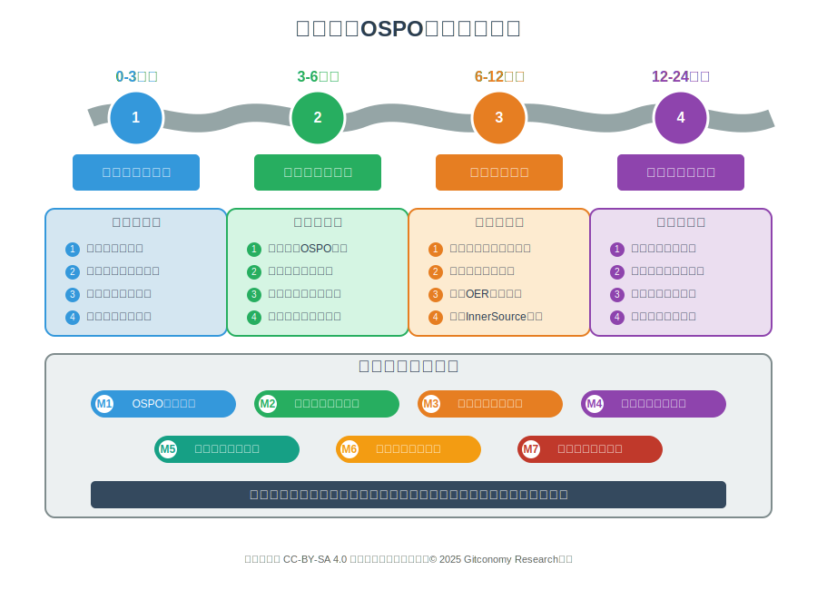

*图：高校实施OSPO的参考路线图*

| 阶段 | 周期 | 核心焦点 | 关键活动 (Key  | 最小可行交付成果  | 成功标准 / Go-No-Go 决策点 |
| :--- | :--- | :--- | :--- | :--- | :--- |
| **阶段一：孵化与内部开源 ** | 1-12 个月 | 建立内部信任、流程与文化；通过低风险项目证明价值。 | 1. 组建 OSPO 核心团队与指导委员会。  2. 建立内部项目发现门户与知识库。   3. 与 2-3 个有意愿的院系/课题组合作，开展 InnerSource 试点项目。   4. 起草并试行校内开源贡献的 IP 政策模板和流程。 | 1. 一个功能性的内部代码门户，展示至少3个成功的跨团队协作试点项目。   2. 一份经法务和 TTO 初步认可的开源 IP 政策草案。  3. 举办至少 2 场校内 InnerSource 培训/宣讲会。 | **成功标准：** 试点项目数量、跨团队 Pull Request 数量、参与师生的满意度调查。   **Go-No-Go 决策点：** 获得指导委员会批准，正式进入第二阶段并 확보相应预算。 |
| **阶段二：战略开源与社区构建** | 13-24 个月 | 有选择地将校内优质项目对外开源，并开始构建外部社区。 | 1. 评估并筛选1-2个成熟的、具有潜力的内部项目进行对外开源。   2. 指导项目团队完成开源准备工作。   3. 举办面向全校的“开源日”或“开源周”活动。   4. 设立校级 OER 开发资助计划。 | 1. 至少2个以学校名义在公共平台（如 Gitee, GitHub）上发布的官方开源项目。   2. 完成第一轮 OER 资助项目评审与立项。   3. 建立学校的开源项目官方主页。 | **成功标准：** 学校官方项目的外部贡献者数量、开发的 OER 课程数量、校内开源活动的参与人数。    **Go-No-Go 决策点：** 证明 U-OSPO 具备了对外输出影响力的能力，并获得管理层对扩大生态建设的授权。 |
| **阶段三：生态领导力与开放教育** | 25-36 个月 | 确立学校在关键研究领域的开源生态领导地位，并规模化推广开放教育。 | 1. 推动至少一个旗舰开源项目加入国内外的顶级开源基金会（如开放原子、Apache）。   2. 与学术委员会合作，正式出台将开源贡献纳入职称评定体系的官方文件。   3. 推动 OER 资源在部分院系成为核心课程的必选或推荐教材。   4. 牵头组织全国性的高校 OSPO 论坛或峰会。 | 1. 至少一个核心项目被中立基金会接收托管。   2. 一份经学校校务会或学术委员会批准的、关于开放贡献学术评价的正式政策文件。   3. 形成一个包含至少 10 门高质量核心课程的 OER 资源库。 | **成功标准：** 在外部基金会中担任的角色、新政策的采纳率、OER 资源的校内外使用情况、在国内高校开源领域的话语权和领导力。    **最终目标：** U-OSPO 成为学校一个稳定、可持续、备受认可的核心学术支持部门。 |

### 8.2 高校实施OSPO的建议

基于上述分析，为准备或正在筹备建立 OSPO 的中国高等教育机构，提出以下四点核心实施建议：

1.  **确保高层战略支持**

U-OSPO 的建立是一项涉及多部门协调和深层次文化变革的系统工程，必须获得来自学校最高管理层的明确授权和持续支持。理想的推动者应是主管科研或教学的副校长、教务长，或是一位在校内具有广泛影响力和跨部门协调能力的战略规划负责人。没有这种自上而下的“尚方宝-”，U-OSPO 将寸步难行，极易在推行初期便陷入部门利益的博弈之中。

2.  **从小处着手，用价值说话**

切忌“大干快上”式的全面铺开。初期应组建一个精干的核心团队，选择 2-3 个基础好、意愿强的院系或课题组作为合作伙伴，通过试点 InnerSource 项目来解决他们面临的实际问题（如代码复用难、协作效率低）。用实实在在的成功案例和量化数据（如节约的开发工时、提升的协作效率）来构建一个令人信服的“商业案例”，以此为基础，逐步争取更广泛的认同和更多的资源投入。

3.  **直面并攻坚激励机制难题**

这是决定 U-OSPO 能否长期成功的“胜负手”。从成立之日起，U-OSPO 指导委员会的首要任务就应该是联合学校学术委员会、人事处等核心部门，启动对现有学术评价体系的评估与修订工作。目标是研究并制定出一套能够被广泛接受的、用于在职称晋升和绩效考核中正式认可和奖励开源软件及 OER 贡献的官方政策。这项工作虽然艰难且漫长，但它是撬动整个体系变革的唯一杠杆。

4.  **构建战略性叙事**

在校内外沟通 U-OSPO 的价值时，必须超越单纯的学术语言，构建一套能够与学校及国家宏观战略同频共振的叙事体系。要清晰地阐明 U-OSPO 如何加速前沿科学研究，如何革新教学模式与提升教育质量，如何培养出更符合未来产业需求的创新人才，以及最关键的，如何直接服务于国家在关键核心技术领域实现自主可控的宏伟目标。这种战略性的叙事，是获取内外部资源、建立长期合法性的关键。

---

## 结论

本报告系统性地分析了在全球开放浪潮和国家技术战略的双重驱动下，高校建立开源项目办公室（U-OSPO）的时代必要性与战略价值。通过对企业 OSPO 理论、高校及 OER 领域实践的深入剖析与对比，报告为中国高校量身定制了一套涵盖战略定位、治理模式与实施路线图的综合性构建蓝图。

关键要点总结：

* **战略必然性：** U-OSPO 并非一个可有可无的“锦上添花”之举，而是研究型大学在新的全球竞争格局下，保持学术领先、服务国家战略、创新人才培养模式的战略必需品。它是在开放科学和开放教育两大趋势交汇点上的必然选择。
* **功能统一性：** U-OSPO 的核心价值在于提供一个统一的、专业的中心化平台，来管理和协调全校所有与“开放”相关的活动。它能有效整合分散在图书馆、科研处、信息中心等部门的资源，避免“九龙治水”的低效局面，成为学校的“开放知识”战略中枢。
* **模式差异性：** 简单复制企业 OSPO 的模式注定会失败。高校 U-OSPO 的成功，关键在于深刻理解并解决学术环境的三大独特挑战：激励机制错位、组织结构分散、长期财务可持续性。其设计的核心必须围绕学术声望、同行认可和公共利益展开，而非商业回报。
* **路径务实性：** **“由内而外、分步实施”是 U-OSPO 最稳健的成功路径。从内部开源（InnerSource）入手，可以在低风险环境中培育文化、证明价值、整合资源，为后续更大规模的战略性开源和生态建设奠定坚实基础。

 

[高校OSPO战略规划与治理蓝图理论框架构建信息图](./assets/uospo-strategy-and-governance-model-design.pdf)

---

## 参考文献

[1] Open Educational Resources | UNESCO， https://www.unesco.org/en/open-educational-resources  
[2] 2.The Future of OER in Higher Education | AACSB,  https://www.aacsb.edu/insights/articles/2024/05/the-future-of-oer-in-higher-education  
[3] 7.European Open Science Cloud (EOSC) - Research and innovation - Europa.eu， https://research-and-innovation.ec.europa.eu/strategy/strategy-research-and-innovation/our-digital-future/open-science/european-open-science-cloud-eosc_en  
[4] 蚂蚁集团开源技术委员会 & Inclusion AI. (2025). 大模型开源开发全景与趋势 (2.0版). 蚂蚁开源. https://www.infoq.cn/article/ksgcpaymqkbk0uagqnzk  
[5] From Chaos to Control: Establishing an OSPO for Strategic Governance | Sonatype,  https://www.sonatype.com/blog/from-chaos-to-control-establishing-an-ospo-for-strategic-governance
  
[6] Open Source Program Office - OSPO Glossary， https://ospoglossary.todogroup.org/ospo-definition/  
[7] Chapter 1: Introduction to Open Source Program Offices | OSPO Book， https://ospobook.todogroup.org/01-chapter/  
[8]  InnerSource Patterns Book | Innersource Commons, https://patterns.innersourcecommons.org/  
[9] University Open Source Program Offices | Ithaka S+R， https://sr.ithaka.org/wp-content/uploads/2025/08/SR-Report-University-Open-Source-Program-Offices-08.14.25-3.pdf  
[10] 2023 Annual Report | Rochester Institute of Technology， https://www.rit.edu/ntid/sites/rit.edu.ntid/files/2023%20NTID%20ANNUAL%20REPORT%20FINAL-1.pdf

---
## 许可声明

本文档采用 [知识共享署名--相同方式共享 4.0 国际许可协议 (CC BY--SA 4.0)](https://creativecommons.org/licenses/by-sa/4.0/deed.zh) 进行许可，&copy; 2025 Gitconomy Research社区
